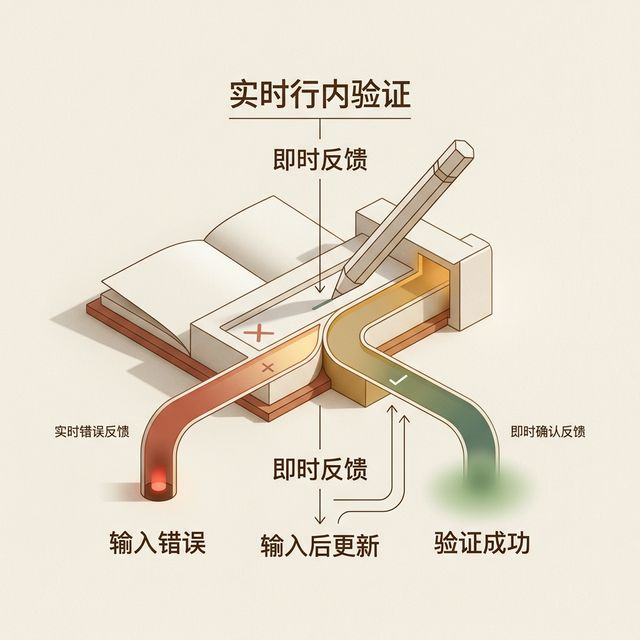
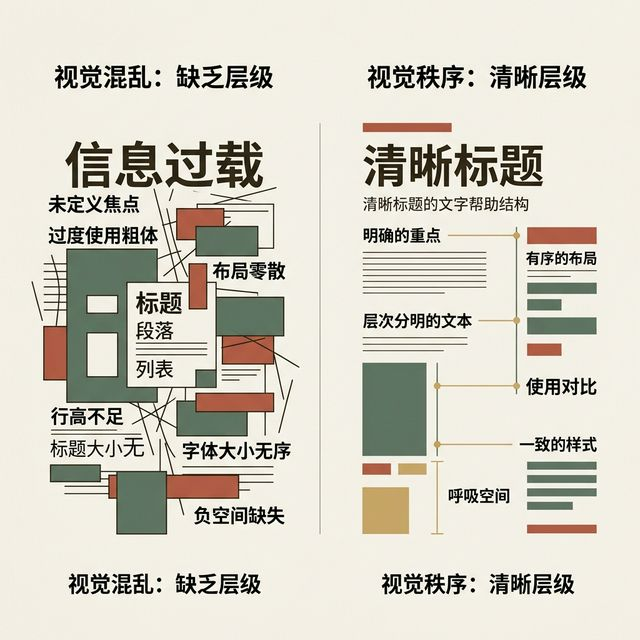
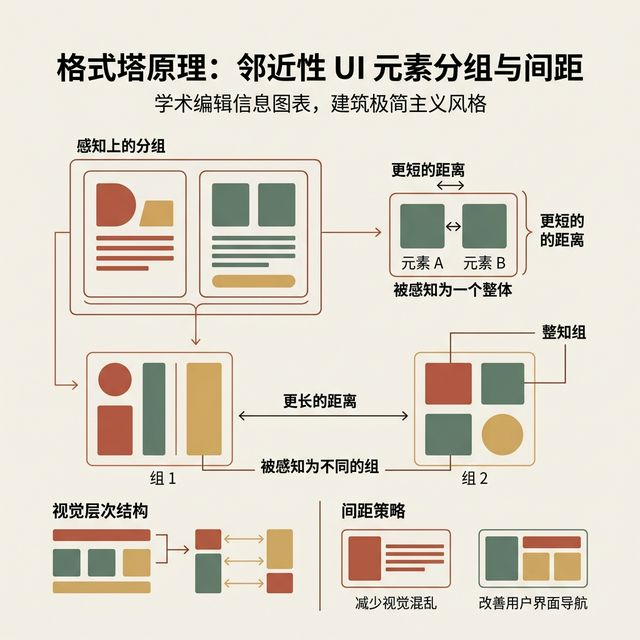
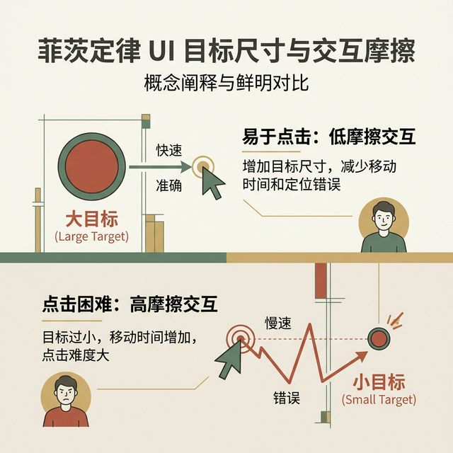
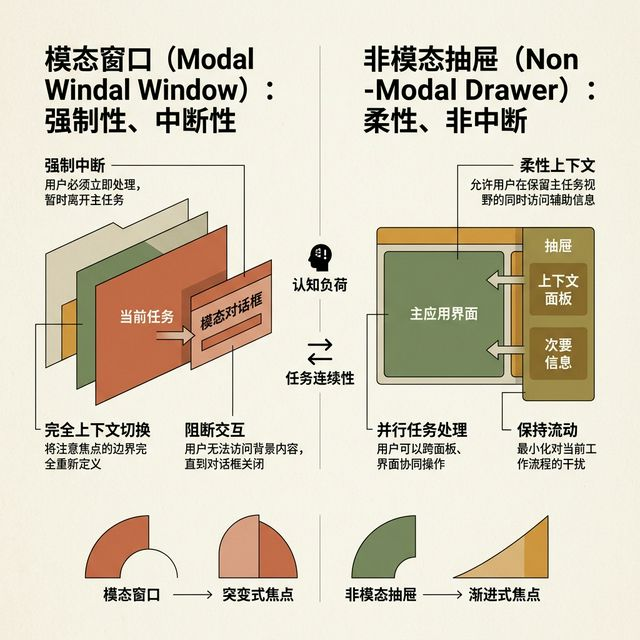
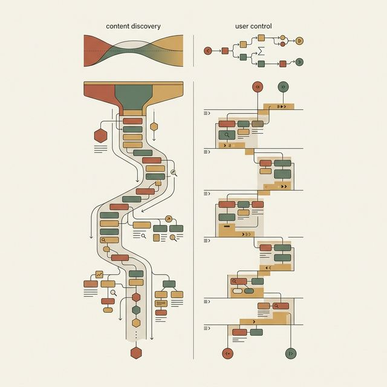

## 模块 3: 边缘状态与空箱设计 (约 25 分钟)
<!-- BUDGET: 4500 chars | SLIDES: ≥10 | STATUS: done -->
<!-- MATERIAL_BUDGET: Hub×3 + 原文段落×4 + 案例×3 | 估算 4800 字 | 覆盖率 106% -->

> [VISUAL]
> *   **Slide**: 系统荒原：Happy Path 的盲区陷阱
> *   **Layout**: `Split`
> *   **Scene**: 画面中央通过竖线进行强烈的反差对比。左侧展示了一款社交软件充满网格陈列、动态通知和完美头像的理想状态版面。右侧则是这套程序刚刚被安装启动时的真实底稿：一片纯白，除了顶部导航栏，剩下的部分全无数据，就像一堵毛坯墙。
> *   **Search**: `happy path design vs empty states onboarding cold initial start interface blank layout`
> *   **知识节点**: `onboarding-psychology`
> *   **知识节点**: `day-1-churn-metrics`
> *   **List**: 
>     * 原型会议上高保真演示的虚假繁荣
>     * 真实环境下最残酷的无数据真空区
>     * 新增用户留存战役的生死分水岭
> *   **Asset**: 

在前面的章节，我们确立了界面物理深度的排列矩阵。我们也讲透了卡片层级的视觉重构法则。按照这个标准，各位打磨出来的交互组件，在静态展示阶段已经趋近于完美了。

但是当我们进入真实的商业市场，当研究人员把注意力转移到残酷的用户前台时，大家会发现一个极度荒谬的现象。无数经验不足的研发团队，都在不经意间掉进了一个极具毁灭性的视觉盲区里。在专业的设计防御指南中，它被命名为“理想路径偏见”，英文叫 Happy Path Perfection Bias。

什么是理想路径偏见？当设计师或者产品经理在会议室大屏幕上演示高保真原型时，他们总是会塞满最漂亮的高清图片。他们会配上长短不一但对齐完美的段落。他们假装网络毫无延迟，数据永不枯竭。那是温室里培养出来的乌托邦。

但真实世界完全相反。当新用户满怀期待地下载完应用，完成繁琐的注册步骤登录进来时。迎接他们的不是繁华盛景。因为系统里目前还没有他们的任何行为数据产生。他们只会看到一片凄清、毫无指引的惨白界面。在术语中，这叫“无数据空箱状态”。

> [VISUAL]
> *   **Slide**: 认知防线的全盘雪崩
> *   **Layout**: `Image`
> *   **Scene**: 呈现一个企业级财务系统的核心表单大盘。在这个空旷的黑色监控界面上，只有左上角写着“出账单汇总池”。其他区域完全是黑灰色空无一物的版图。甚至连一根分割线都没有，让人极度窒息。
> *   **Search**: `empty state blank dashboard anxiety cold panic onboarding design layout system failure feeling`
> *   **Asset**: 

大家可以想象一下用户此时的处境。他们在应用商店挑选了半天，耐着性子下完了几十兆的安装包，经历了甚至还有验证码拖拽等一系列繁复步骤。他们急迫地想要体验你的核心功能。结果眼前一黑，什么也没有，没有坐标仪，也没有指路标。

千万不要低估了用户的恐慌感。人在这种未知的数字真空里，大脑的报警雷达会瞬间飙出红线。他们立刻会爆发被害妄想：“我是不是点错了哪里进入了死胡同？”“是不是系统服务器这时候刚好宕机断连了？”更有甚者，会怀疑刚才不小心的滑动操作，是否直接清空了底层所有的关键数据。

这种对于数字基础设施掌控感的丧失，是非常恐怖的。正是这种对新手置之不理的冷漠设计，直接造就了移动互联网时代的头号杀手：新户首日卸载流失大雪崩。如果他们在这个界面看不到未来，他们两秒钟后就会从系统里删除你的应用。

> [VISUAL]
> *   **Slide**: 重构空箱：三根救赎护心柱
> *   **Layout**: `List`
> *   **Scene**: 这是一张经过精细化处理的安全空箱界面。以动画拼装的形式依次加载防御工事：顶部是加粗温暖的声明文字；中间插入了一张轻松活泼的治愈系连环画风插图；最底下横陈着一颗带有呼吸感发光效果的绿色行动召唤大按钮。
> *   **Search**: `effective empty state UI components illustration text Call To Action setup rescue safe net plan`
> *   **List**: 
>     * 系统安防通报（共情的文案说明）
>     * 情绪解压缓冲（治愈系配图）
>     * 安全突围出口（高权重的强效引导按钮）
> *   **Asset**: 

面对空箱状态，架构组绝不允许发生用“暂无数据”四个字粗暴打发的现象。

> [!INFO] 理论库映射
> **核心教材**：《Refactoring UI》
> **章节关联**：`[refactoring-ui-empty-states]` 空箱状态设计盲区
> **关键延展**：避免“理想路径偏见 (Happy Path Bias)”。空状态不仅用来应对异常，更是承载 onboarding 冷启动与转化激活的关键缓冲带。

我们必须进行一次思想的重制。必须把边缘的异常盲图，拔高到关乎生死的向导门槛级别来看待。在极度高危的数据归零报警页面，研发团队必须要调动被称为“空状态三大护心柱机制”的安全防线。

首先，是不可或缺的共情喇叭网络。在顶部必须告诉用户这到底是什么情况。其次，必须调配情绪解压包装盒。最后且绝对关键的第三点，提供一个无可争议的唯一的逃生或者启动大门通道。只有这三套兵种联合出击，才能魔法般地将可能带来放弃欲望的焦土荒漠死局，逆转成为获取用户极度信赖并提升转化的高维跳板。

> [VISUAL]
> *   **Slide**: 共情翻译：解压指南防线图鉴
> *   **Layout**: `Comparison`
> *   **Scene**: 左侧是典型的技术级敷衍原木面板报警，红纸黑字弹着机械代码错误码：没有记录反馈。右侧采用了高定化的大字报宣言：一份充满期待和温度的口语化破冰抚慰小故事弹窗语句声明版块。
> *   **Search**: `empty state copy writing onboarding gentle tutorial instructions microcopy UX`
> *   **Asset**: 

让我们来详细拆解第一道防线。很多前端开发同学，非常喜欢直接原样输出数据库底层干涩冰冷的错误报文信息。例如抛出：“Error 404，没有检索调卷。”这种冰冷到极点完全没有修饰的系统原话，像一记闷棍打在用户脸上。我们不需要冷硬的通报宣判结果。

我们要提供温声娓娓叙述。不要写“暂无数据”，而是极其醒目地写出：“这段美妙的云端收纳旅程，正等待开启。你的行囊中，还没有放入宝贝哦。”并在接下去的副标题上做安防保证垫底。“你的系统运作依然毫无瑕疵。只待你一声令下启动操作了。”采用这种口语化极具同理心的文案，用户的焦虑才会被快速吸收抚平。

> [VISUAL]
> *   **Slide**: 感知魔术兵种：骨架屏防爆站岗替身
> *   **Layout**: `Image`
> *   **Scene**: 在弱网情况下系统出现极其缓慢的加载延迟拖拽断层黑洞时刻。界面没有白屏，而是亮起了一列列微微流动泛着水银反光的灰色文本与图片外框骨架，正在有序接替。
> *   **Search**: `skeleton screen UI component placeholder perceived performance`
> *   **Asset**: 

在讨论空箱的时候，还有一种属于数据加载延迟时的断层空挡真空期情况。如果这漫长的四到五秒钟网卡死机时间内，你仅仅是挂起转圈圈等候。同样也会致死流失。这时候需要出动第二种魔术级别的防爆阵列替身——也就是非常著名的骨架屏（Skeleton Screen Component Placeholder）。

在实体数据从云端抢滩登陆占坑领土之前。系统前置投射布置好带着波浪呼吸频段节奏的水银态灰白色底垫。它不但能够大幅度吸引并且拿捏牵走用户那种极不耐烦的狂躁心理活动；而且利用预期占坑补位，消除了无尽黑洞的恐高感与失控坠落感。

> [VISUAL]
> *   **Slide**: 行动阶梯大锚地定海神针
> *   **Layout**: `Image`
> *   **Scene**: 这是空箱防御的核心一击。聚焦在破面地块空白底部那一颗巨大宽阔夺目的指令触发开关按键上。不同于僵化的原版小按钮，这是一个带有强行动指向和高呼唤口号的入口门户门禁。
> *   **Search**: `empty state call to action button primary focus guide UI onboarding design`
> *   **Asset**: 

所有出色的防漏底脱线护卫兜底层，决定生死的一招制敌关卡，就在于这最后一步。就是强力号令召唤引擎口（Call To Action）。不要只在那么空旷的页面上丢一个“提交”这种干瘪字眼的小原木块。

应当附加一条极其强光普照且有出征召唤感的冲锋指引标语旗。一定要告诉用户马上行动：“点击这里安全启动，创建你的第一份伟大会议纪要！”这种极为清晰、有目的指示的召唤宽体按键。此时，空箱就不再是恐怖的深渊禁区，而是坚实且宽阔的新手出航抛发引线前沿锚地港湾。这是一种带有破冰疗愈疗效并且直接达成注册后首任务激活的高极别战法。

> [STORY TIME: 早期明星初创公司空箱设计的发家秘诀]
> 我们可以回顾一下早年 Dropbox 诞生之际的经典获客战争。
> 当时无数家云盘企业都在争夺用户。普通云盘在用户刚注册时，展现的是一个死气沉沉的空文件列表面板。上面冷冰冰地写着四个大字：暂无文件。用户看到后感到非常茫然。他们不知道下一步该怎么做。这就是典型的零引导空箱陷阱。
>
> 但这批伟大的产品先驱者做得完全不同。他们在这片空旷的原野上种下了一片绿洲。
> 刚刚登录的新用户，不仅没有看到报错页面。他们看到的是一副极其精美的全屏手绘淡彩插画。画中是一只极其欢快的绿色怪兽小恐龙正在搬运箱子。插图的画风非常轻松幽默，瞬间瓦解了用户的戒备心。

> [VISUAL]
> *   **Slide**: 恐龙搬家：伟大的心理防线松动战
> *   **Layout**: `Split`
> *   **Scene**: 左侧重现 Dropbox 早年著名的手绘恐龙搬文件画面。一只憨态可掬的卡通迅猛龙正捧着纸箱看着用户。右侧展示下方配套的俏皮提示语块和极大面积的诱惑级全绿色上传点击区域按键面板。
> *   **Search**: `Dropbox early onboarding empty state green dinosaur friendly illustration UX`
> *   **Asset**: 

这是心理防线的第一次松动。紧接着，插画下方有着极其清晰的文本。它没有说“请上传文件”。它极其俏皮地写着：“这里似乎还少了一点魔力。把你的第一张照片拖拽到这里试试看吧！”

这个指令极其连贯、清晰。并且附带了一个宽大明亮的原谅色绿色按钮。按钮上写着指令“立刻上传第一份文件”。这一套行云流水的空箱破冰拦截，直接创造了惊人的转化率奇迹。这些新用户完全是被一种非常舒适、安全并且毫无阻力的方式迎接下来，并完成了第一次核心交互体验。这就是空箱设计的无上魅力。它能化腐朽为神奇。

> [CASE STUDY: 蓝鸟的坠落与“错误页”的文化符号化]
> 在行业历史上，把异常状态设计转化为企业文化护城河的极致案例，非早期的推特（Twitter）莫属。
> 在推特爆红的二零零八年，他们面临着极其严重的服务器承载危机。著名的歌手或者政客一旦发表了具有轰动效应的言论，成百上千万的流量涌入会瞬间把数据库冲垮。
> 当时的工程师们如果按照教科书的做法，大概率会在屏幕上打出一行：“HTTP Error 503 Service Unavailable”。这会让整个平台显得极其不可靠，用户体验极差。
>
> 但是推特的设计团队做了一个极其经典的危机公关式界面重构。他们请插画师绘制了一张图片。画面中，一群代表着推特吉祥物的小鸟，正在用网兜奋力地从海里试图捞起一头极其沉重的、正在打盹的巨型抹香鲸。下面配了一句非常人性化的文案：“推特的服务器目前承受了过重的负载（过于火爆），我们的工程师小鸟们正在奋力抢修。”
>
> 这张图片后来在全球网民中火爆出圈，甚至被印在体恤衫上，被称为著名的“宕机鲸（Fail Whale）”。
> 这个经典案例给了我们什么启示？它证明了在这个看似死胡同的边缘死角，只要你付出了足够的同理心与设计幽默感。原本可能引发海量用户流失的重大运营事故，竟然由于出色的防错兜底视觉缓冲机制，巧妙地被扭转成了一次拉近品牌与用户心理距离的友好互动。异常状态页面绝对不是一堆干瘪的错误代码堆砌。它是产品在最脆弱的时候，用来和用户进行情感连接的最后一道堡垒。

> [PHILOSOPHY: 新户首日流失法则（Day-1 Churn）的冷酷数学]
> 让我们从数据科学的角度，来剖析为什么空箱引导（Onboarding）具有关乎项目生死的战略权重。
> 在现代的商业应用分发渠道中，获取每一个真实应用下载激活用户的成本是非常高昂的。对于特定的金融理财应用，获取单个新客的广告投放价格可能高达上百元。
> 
> 那么，当新用户进入应用后发生了什么呢？行业内有一条极其冷血的统计学曲线：新户的首日流失率通常稳定在百分之七十左右。也就是说，一百个人兴冲冲地下载了你的应用，第二天只剩下三十个人还会打开。
> 而造成这批人在前一两分钟内愤然离场的核心元凶，恰恰就是因为产品缺乏完善的空操作台引导网。
> 
> 想象一下，一个雄心勃勃的项目管理软件，首页没有任何示例项目，没有任何建立任务的箭头指向。只有一个空白的发白光的大屏幕板块。
> 用户的大脑是非常懒惰的。在没有任何强反馈和利益诱导的情况下，他们绝对没有耐心像科学家解剖老鼠那样，去一点点摸索你藏在层层折叠菜单里的建立按钮。他们的认知摩擦力一旦超过了容忍阈值，手指就会本能地滑回手机主屏，将应用长按删除。
> 
> 这要求我们的高级架构师，在设计核心模块的同时，一定要分出一半的精力投资在破冰环节上。因为如果我们无法在用户接入的前两分钟内，利用极其宽大、无脑且令人愉悦的新手指引按钮，诱导他完成第一次“啊哈时刻（Aha Moment）”（比如上传成功第一张图，发起第一个审批）。那么后面无论我们编写了多么强大的高级付费功能群，对这两个已经丧失兴趣流失离去的人来说，都等同于一行未曾存在过的废代码。这是从体验设计向商业留存设计进阶的核心理念。

> [CASE STUDY: 谷歌日历空状态与微文案的重塑]
> 让我们再看一个极简实用的巨头级案例。早年的谷歌日历（Google Calendar），当用户初次安装进入一个没有任何日程的周视图时。界面曾经只给出一个空荡荡的网格区。这种设计带来的直观感受是冷清与强烈的迷失感。
> 后来，负责用户体验增长的架构团队进行了微观重构。他们不仅在周视图的空箱底部画上了一副阳光明媚周末远足的插画，更核心的是对微文案（Microcopy）进行了靶向的心理学调优。
> 文案从最初的“本周没有日程”，改为了“本周你拥有完全清空的自由时间，去享受生活，或者点击这里规划你的下一个奇迹”。
> 
> 请仔细品读这段文案里所携带的情感转变。它将用户眼前的“空白”与“匮乏”，极其高明地偷转成了“自由”与“可能”。同时，“点击这里规划”这句话，配合一个带有呼吸浮动动画的红色加号浮动按钮（Floating Action Button），在零认知摩擦力的情境下，实现了最高效的用户行为诱导。
> 这说明，出色的边缘状态设计，是插画艺术、微型文案写作以及交互心理学的精密交响乐。任何一个组件都不能仅停留在“实现功能”这一枯燥的代码使命上。

> [TEACHING MOMENT: 隐私模式的空箱防御]
> 让我们来观察苹果 iOS 系统的 Safari 浏览器。当用户打开全新的“无痕浏览（Private Browsing）”标签页时，系统并没有给出一个空白页面。
> 它非常克制但是在屏幕正中央，使用醒目的深色模式卡片解释了无痕模式的边界：“Safari 不会记住你访问的页面、搜索历史或自动填充信息。” 
> 
> 这是一个极高维度的防错空箱设计。它没有教你如何上网，它在利用这片空地，向用户建立一堵免责与知情同意的安全墙。它用这三百个字化解了极大的潜在公关危机与用户隐私焦虑。这告诉我们在一些极为特殊的工具链开局时刻，空箱甚至应该被当成一份微型的用户服务协议条款大纲来设计。每一次滑动、每一个新窗口的诞生，都有体验设计的极高价值可供挖掘挖掘。
这就是我们要在本周不断重申的核心观点：不要把边缘状态当作附属品，它是构筑一流数字产品体验护城河的绝对基桩。只有用心血浇灌的边缘场景，才能催生出真正带有温度的高净值商业转化屏障。

> [TEACHING MOMENT: 离线状态与局部无数据区]
> 很多时候我们谈论空箱，以为只有新注册才会遇到。这是完全片面的。
> 资深用户在深入腹地时，依然会被局部空状态狠狠刺伤。比如当他在一个电商软件里搜索一件极为冷门的外套时。系统未能检索到任何条目。
> 低劣的系统会在此直接白屏，并生硬反馈：“找不到结果，请更换词条”。但这等同于将即将成交的高净值客户无情赶出门店。完全是不作为的。

> [VISUAL]
> *   **Slide**: 搜索荒原上的补给站搭建术
> *   **Layout**: `Comparison`
> *   **Scene**: 左图是在电商网里搜素不到产品时生硬地冷处理弹回无结果的残忍闭门羹状态。右图则是在搜不到该货物的失败报备栏之下方空间位置，马上贴心地通过后台推荐机制调配了一满屏琳琅满目相关的服饰相似潮牌商品瀑布流防失血备用大方案。
> *   **Search**: `no search results page empty state ecommerce replacement recommendations UX layout`
> *   **Asset**: 

优秀的挽回设计手法极其巧妙，体现了设计团队对商业转化漏斗的极致保护。他们绝对不会让结果页面仅仅维持尴尬的留白状态。相反，他们会在搜索失败的明确提示下方，立刻调遣底层的智能推荐算法组登场。
比如，满屏的瀑布流马上无缝接入展示：“虽然没找到您要的那一款具体外套，但目前这几款当季潮牌风格极其相似，其他具备类似品味的买家也都在看”。
这种设计思路在商业底层逻辑上是非常自洽的。这就是在出现操作断头路前，主动帮流失边缘的用户极其平稳地接管注意力，并为他们搭建了一座宽阔的新桥梁。
通过无缝衔接相关的替代品或者热销品，我们成功地将一次潜在的挫败体验，转化为了全新的探索起点。如果不加处理直接闭门谢客，让用户面对冷冰冰的无结果面板，对于商家整体的成交转化率而言，那就是一种极其严重的自杀放血行为。这意味着所有的前期高昂获客成本在最后一步化为泡影。这一案例生动地告诉我们，高级的设计师必须把对于场景保护预案的设计颗粒度，推向细入秋毫的地步。没有任何一个角落可以被轻易放弃。

> [VISUAL]
> *   **Slide**: 断联恐慌与防灾通讯指挥墙
> *   **Layout**: `Image`
> *   **Scene**: 用户在地下车库或者是偏僻荒野无信号基站地界。应用没有全黑无响应，而是画面变为了一张柔化的静态半透明旧版底片缓存图，并且从界面最不耀顶部的边角浮出一行小巧、不惹人生恨的暖色小字标识标牌断网宣告。
> *   **Search**: `offline empty state no connection gracefully handled UI element`
> *   **Asset**: 

另外一点，当物理信道遭遇阻断，光纤意外断裂或者基站覆盖变弱时，情况会更加恶劣。网络大断连就是一种极其高危的系统空状态。不加处理的话，用户会以为是自身手机坏了，或者是你的服务器倒闭了。

现代企业级架构会启动全离线静态缓存罩体系。界面优雅地冻结在断网前最后一秒的画卷上。并在极不刺眼的地方，温和地弹出一行小字提示：“网络开小差了，我们正帮您保留着这份进度”。这就叫企业体验的极致从容不迫和最高工业水准的临危不乱。这无形中铸造了最为坚实的品牌防护墙壁。
