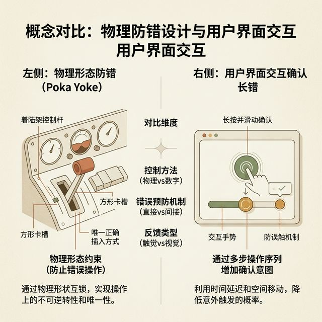

## 模块 6: 小结 — 防错纪律与隐形盔甲 (约 10 分钟)
<!-- BUDGET: 1800 chars | SLIDES: ≥2 | STATUS: done -->
<!-- MATERIAL_BUDGET: 原理提炼×2 + 结尾金句×1 | 估算 1800 字 | 覆盖率 100% -->

> [VISUAL]
> *   **Slide**: 隐形的系统盔甲：信任的终极源泉
> *   **Layout**: `Section`
> *   **Scene**: 前四个模块的核心视觉元素在这里进行全量蒙太奇合成：精巧的物理深度和 Z 轴阴影、温暖的空箱引导插图、带有倒计时的撤销气泡弹窗。它们共同交织成一张无形的数字保护网。
> *   **Search**: `interaction design error prevention summary trust building invisible design`
> *   **知识节点**: `poka-yoke-advanced`
> *   **List**: 
>     * 防错设计宛如优质的防弹衣，平时隐形，战时保命
>     * 系统纵深规则与包容机制带来了秩序感
>     * 卓越的产品从不将数据灾难归咎于用户
> *   **Asset**: 

当我们的视界穿越了厚重的阴影光效，探寻了空箱边界底部的接引指南，并最终梳理完了防止毁灭性操作的防错保护护栏后。我们也就彻底完成了这门课中最核心的视觉与交互防御体系重构。

> [PHILOSOPHY]
> 对于刚掌握一点前端渲染或者 UI 绘制技术的同学来说，优秀产品的标准往往与华丽的动效、极度复杂的材质捆绑在一起。然而，随着大家深入行业腹地，你们会发现那些历经千锤百炼的高级设计思想，往往是极其内敛的。
>
> 好的防御性兜底保障方案，它身上有一种极其悲壮的“逆境悖论”。英文叫做 The Paradox of Invisible Great Design。
> 如果你的防错系统日复一日地完美运行，把所有的灾难风险、所有的误点击都在源头处安静地化解了。那么普通人在使用它时，永远都不会意识到它曾经存在过。用户只会觉得：“哇，我今天用得好顺滑，我的操作直觉真准。”
> 只有当防御阵线年久失修，遭遇破防引发了巨型业务链崩塌报错时。防错设计才会作为替罪羊，被推上审判台。

所以，构筑防雷护甲是一项极度消耗心血，却几乎得不到日常赞誉的苦差事。那么，为什么全球顶尖的研发架构组，还要不遗余力地把资源投入到这些看不见的阻断器和安全网里呢？

因为正是这层在全天候服役护航的隐身护盾，承接了市场中所有杂乱无章、盲目前行的试探行为。它们无数次在代码悬崖边上，默默把用户拉了回来，保住了企业的数据底本与金字招牌。只有通过这种近乎偏执的兜底保护机制，这堆冷酷的代码软件，才能获得商业世界里最珍贵的核心心智资产：那就是深层次的用户信赖感与托付感。

> [CASE STUDY: 航空航天级别的隐形防线]
> 我们可以跳出互联网软件的围城。去看看美国航天局或者空客巨无霸客机的防错设计。
> 在现代大型客机的驾驶舱里，头顶和面前布满了成百上千个极其相似的拨杆和旋钮。即使是老资格机长，如果在极其高压和疲惫的夜间飞行中，也极有可能发生致命误触。
>
> 航空工业的解法极其硬核。他们不搞什么花里胡哨的确认弹窗。他们采用的是纯粹的物理防呆阻断。
> 比如，起落架的收放拨杆，它的顶端直接被硬生生地雕刻成了一个缩小版橡胶轮胎的形状。而襟翼控制推杆的顶端，被雕刻成了机翼边缘那种扁平的片状特征。

> [VISUAL]
> *   **Slide**: 物理防呆的降维打击
> *   **Layout**: `Comparison`
> *   **Scene**: 左图是波音飞机的控制台拨杆特写：轮胎形状的起落架拨杆与机翼形状的襟翼拨杆。右图是相对应的手机界面高危操作：一个需要长按 5 秒才能填满触发条的解散群组按钮，或者需要横向完全拖拽到底的滑动解锁确认条。
> *   **Search**: `poka yoke physical shape landing gear cockpit design vs UI long press slide to confirm`
> *   **List**: 
>     * 闭着眼睛也能摸出的物理形状特征
>     * 刻意增加肌肉阻力，打断下意识连击
>     * 把航空安全哲学移植入小屏幕
> *   **Asset**: 

飞行员在漆黑的环境里，就算视线不离开挡风玻璃。仅仅凭借手指触摸传回大脑的形状感知，就能瞬间判明自己即将操作的是哪个关键部件。

这就是我们常常挂在嘴边的最高层级系统安全护甲。它不依赖于眼睛去阅读枯燥的说明书。它直接把防御体系，融入到了这套操作的物质组成部分之中。

我们在页面端开发里，同样可以极其巧妙地运用这套航空级别的设计逻辑。当涉及到不可逆的、具有破坏性的高危数据删除操作时。我们绝不使用和常规“提交”按钮一模一样的同构组件，仅仅换了个红色就敷衍了事。因为人在疲惫时，会下意识地直接点击红点。

我们会强行改变它的交互反馈通道。比如，要求用户手指长按五秒钟，看着红色的扇形一点点被填满。或者是硬生生地要求用户拖拽一个极其费劲的滑块，跨越整个屏幕下方的确认轨道。

我们不是在刻意给用户添堵。我们是在用这种高成本的鼠标摩擦力和肌肉阻力，去强行打断用户在神游状态下产生的错误条件反射动作。把万米高空上性命攸关的安全防错哲学，无缝移植到每一个普通人的手机屏幕方寸之间。这就是我们身为高级产品开发者，最大的专业修养与行善积德。
这就相当于，我们在虚拟的代码世界里，为每一位数字公民系上了一条隐形的工程安全带。不让他们在冲浪和数据穿梭的旅程中，因为一时的手指颤抖而承受毁灭性的后果代价。

> [PHILOSOPHY: 医疗器械上的鲜血与代码责任]
> 当我们把防呆哲学推向极致时，我们必须跳出单纯的屏幕像素，去反思系统设计如何直接剥夺了犯错的物理条件。
> 业界有一个极其沉痛的反面教材。上世纪八十年代，有一款医用放射性线性加速器被广泛投入使用。研发团队极其傲慢地去除了底层的硬件联锁保护机制，把所有安全控制权限都交给了前台的软件操作面板去统管。
> 
> 这块屏幕充满了晦涩的错误代码，更致命的是，它对于高频的快速错误指令变更，缺乏强制的二次校验防爆防呆闸门。当医生眼花手抖，在极短的几秒内输入了超强辐射指令又回退时，界面的屏幕已经刷新到了安全状态。但实际上由于并发死锁，底层的遮罩金属板却没能及时响应动作。
> 系统此时完全没有任何物理层的容错断电隔离核网保护，也没有用阻断性的弹窗严厉要求医生对状态倒挂进行重新复核。
> 结果，数名患者在毫无防护的清醒状态下，承受了致死剂量的粒子射线流轰击。
> 
> 这场悲剧极其血淋淋地向我们揭示了一条铁律：真正能保命的系统盔甲，绝对不能依赖使用者的清醒与细心。当代码承担起了涉及资产销毁、机密泄露甚至是生命安全的指挥中心节点时，强加巨大的心智摩擦力，强迫操作者降速。这并不是我们给用户故意添堵。这是我们作为工程造物主，对这个世界所能提供的高级别人文关怀。这才是为什么，我们值得被称为卓越的系统架构工程师。

> [!NOTE]
> **课后任务布置**
> 请各组补全项目中至少 5 个边缘状态页面（包含：空数据状态、加载骨架屏占位、全局报错页、无网络断联页、以及新手的首次破冰引导图）。请务必建立各自的视觉 Token Prompt 词库集合，并按时完成 Exp2 实验方案交付。
