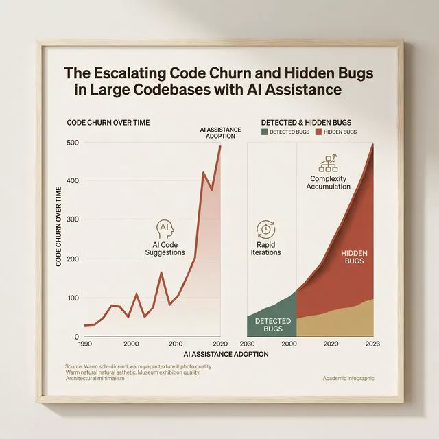
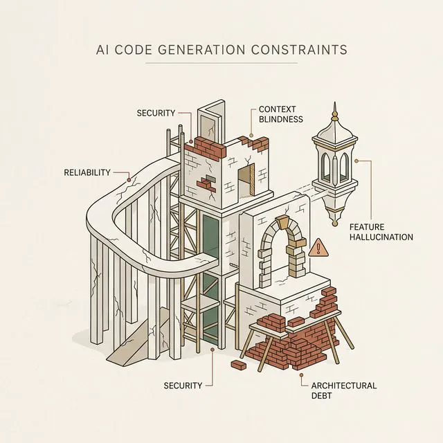
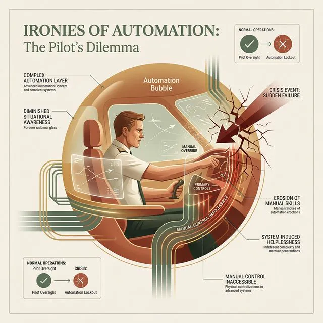
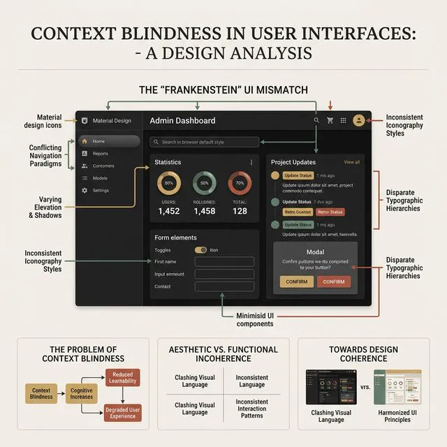
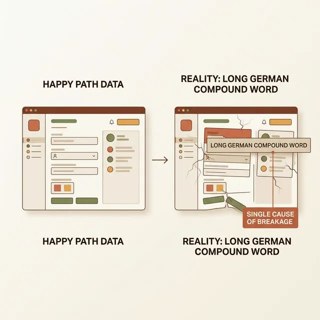
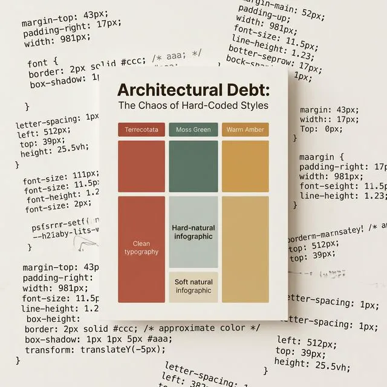
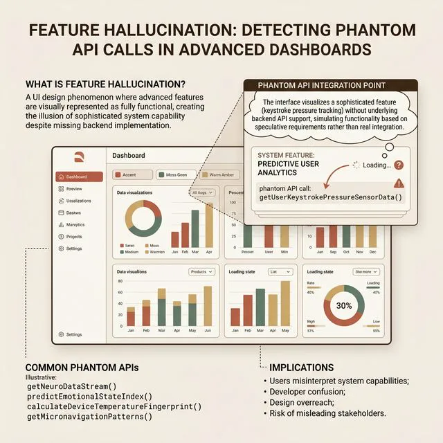
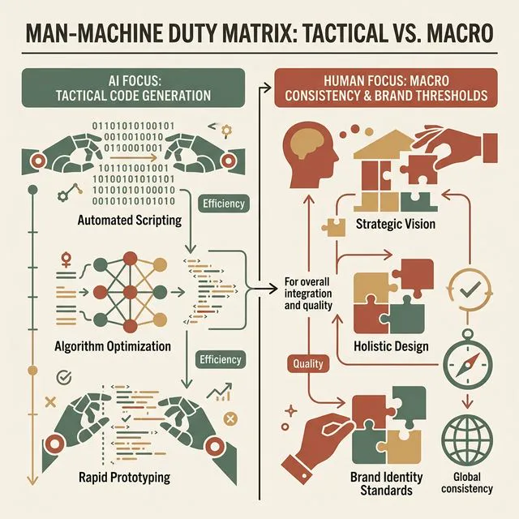

## 模块 3: 讲授(下) — 失控的副驾驶：AI 的六大约束边界 (约 35 分钟)
<!-- BUDGET: 6300 chars | SLIDES: ≥12 | STATUS: done -->
<!-- MATERIAL_BUDGET: ai-code-generation-constraints, IDC: Ironies of Automation (Lisanne Bainbridge) -->

听起来很美好是吧？只要你的 RCPVU 规矩定得够死，AI 就一定能像流水线机床一样连轴转，帮我们瞬间生产出毫无瑕疵的完美数字产品。
大错特错。

> [VISUAL]
> **Slide**: M3-01_Copilot_Bugs
> **Layout**: `Full`
> **Scene**: 一个耸人听闻的数据图表：GitClear 在 2024 年的大型代码库统计，使用了 AI 辅助的开发者，代码中的“代码流失率 (Code Churn)”和“隐性缺陷 BUG 率”反而急剧上升。图表上高耸的红色柱状图极具视觉压迫感。
> *   **Asset**: 
> **Search**: `GitClear report AI code quality bug rate increase churn`
> **知识节点**: `ai-code-generation-constraints`

看看这份残酷的工业界报告数据。大规模引入 AI 副驾驶后，为什么底层隐性 Bug 不降反升？
因为大家产生了一个极度危险的错觉：把 AI 当成了一个绝对理性的高级系统架构师。但实际上，现阶段的大语言模型，无论它叫 GPT-4o 还是 Claude 3.5 Sonnet，在本质上只是一个——**不知疲倦、敲字如飞、态度极度卑微，但却严重缺乏全局空间系统感知能力和后果预判能力的疯狂见习生。**

> [STORY TIME]
> **代码流失率 (Code Churn) 暴增背后的工业恐慌**
> 在此我们必须深入研读这份 GitClear 发布的年度权威安全研究报告，它揭示了一个极其惊悚的逆向工程学悖论。这份涵盖了全球超过一亿行商业核心代码库变迁历史的大数据研报冷酷地指出：在 2024 年，那些大规模普及使用 AI 副驾驶（如 GitHub Copilot、Cursor）的大型技术开发团队，他们的代码产出量虽然迎来了史无前例的指数级爆发性极速增长，但由此引发的代价是极其惨痛的——极其致命的指标“代码流失率 (Code Churn)”也随之被疯狂推高到了一个极其恐怖的历史高位警戒线！
> 什么是代码流失率？它是指一行代码被写完并提交进入主分支系统之后，在短短不到四周极短的生存周期内，就被迫紧急爆发了多轮无情的暴力重构、修补、彻底擦除或者因为严重报错而被迫回滚掩埋的凄惨比例。
> 为什么会出现这种骇人听闻的倒退？研究戳破了这个光鲜的泡沫：因为这些看似极其华丽聪慧的 AI 模型在为了最快速度完成人类开发者分配的局部任务时，它最喜欢使用的解决手段就是极其无脑的生硬“复制和强行粘贴（Copy and Paste）”。它为了绕过那些极其艰难痛苦的、需要耗费极大算力去梳理和统合理解底层抽象系统公共接口模块的环节，它会选择极其懒惰且极不负责任地去大量制造极其易碎、一旦牵一发即动全身全盘雪崩报废的硬代码冗余病灶。这些犹如塑料泡沫般外表华丽但内部极度空心腐朽的废料代码块被成吨成吨地强行注入灌输到了公司的商业护城河大坝中。直到有一天晚上，某个细小的流量洪峰或者接口报错异常发生，这些由毫无安全敬畏之心的“疯狂见习生”用口水和泥巴糊出来的千疮百孔的庞然大物，便会在顷刻之间土崩瓦解，留下满地狼藉的严重运营事故和法务罚单。

如果你蒙着双眼、完全交出方向盘，把它生成的代码直接投入生产环境，你会被它坑得血本无归。为了安全地实施 Vibe Coding，你必须像排雷专家一样，熟记 AI 代码生成的**六大死亡约束边界**。

> [VISUAL]
> **Slide**: M3-02_AI_Constraints_Global
> **Layout**: `Split`
> **Scene**: 荧幕上冷峻地罗列出六大陷阱：1. 自动化讽刺 (可靠性陷阱)；2. 安全盲区 (XSS注入等)；3. 上下文盲区 (架构断裂)；4. 差不多对陷阱 (边缘态缺失)；5. 架构性技术债 (硬编码地狱)；6. 幽灵幻觉 (伪造 API)。
> *   **Asset**: 
> **知识节点**: `ai-code-generation-constraints`

我们逐一深潜，看看这些隐秘的烂尾冰山是如何撞沉你们的项目巨轮的。

### 边界一：自动化的讽刺 (The Ironies of Automation)

第一个边界，是极其致命的心理重灾区。我们要引入一篇发表于 1983 年，却在今天大模型时代爆发出极强穿透力的跨学科经典理论。

> [VISUAL]
> **Slide**: M3-03_Ironies_of_Automation
> **Layout**: `Split`
> **Scene**: 左侧是伦敦大学学院人机工程学家 Lisanne Bainbridge 和她 1983 年的神作论文标题《Ironies of Automation》片段；右侧是一个极具隐喻性的场景图：飞行员在高度自动化的驾驶舱里一直喝咖啡，突然警报大作，他手忙脚乱完全不知道如何接管机械。
> *   **Asset**: 
> **Search**: `Lisanne Bainbridge Ironies of Automation human factors 1983`
> **知识节点**: `ai-code-generation-constraints`

> [PHILOSOPHY]
> **历史回声：Bainbridge 的《自动化讽刺》**
> 伦敦大学学院的人因工程学家 Lisanne Bainbridge 提出了一个著名的悖论：“高度自动化的系统，虽然是为了消除人为错误而设计的，但它往往留给人类的是系统中最复杂、最不规则、最难处理的黑盒残局。而更可怕的是，由于长期的自动化托管，人类的技能会极度退化，最终在灾难发生、需要紧急接管的那一刻，彻底丧失力挽狂澜的救命能力。”

> [STORY TIME]
> **坠机的法航 447 与瘫痪的 React 组件**
> 让我们用航空史上最惨烈的教训来映射这层边界。2009 年法国航空 447 号航班坠毁在夜色的大西洋中。黑匣子记录显示，空客高度自动化的自动驾驶系统因为外部侦测仪意外结冰而突然脱机，将控制权极其突兀地交还给了正在喝咖啡的人类飞行员。由于常年极度依赖自动操作，这名人类副机长在慌乱和失重中，做出了完全违背基本受力空气动力学常识的致命操作——死死向后拉杆导致飞机处于彻底失速状态，最终一头栽进大海。
> 这个血淋淋的教训在今天的 Vibe Coding 时代简直是一记最响亮的警钟狂鸣。AI 瞬间生成的 95% 完美的炫酷动画前端卡片组件让你觉得开发过程爽快到飞起，让你产生一种“我也能掌控全栈”的幻影错觉。但是，当它的异步状态机在 React 这个极度复杂的虚拟 DOM 底层发生深度的组件死锁报错且疯狂导致页面内存泄漏闪退时，那个留给人类接管排故的 5% 黑盒代码残局解决复杂度，通常是过去从零手工撰写时代的十倍甚至百倍！如果在项目的初期你为了图快而完全丧失了对整个变量架构控制权的深入理解与敬畏，长期舒适地沉溺于它所提供的一键生成幻梦中不去磨砺排障底仓硬汉技能，一旦遇到了极其致命的数据逻辑崩溃断流，你就会在那满屏闪烁的红字终端报错前，像那个在雨夜手忙脚乱且极其绝望死命拉动手柄的坠机飞行员一样，根本无力理解也无力接管盘根错节、庞杂如乱麻般的残缺黑盒系统。

这在 Vibe Coding 时代简直是一记响亮的警钟。AI 生成 95% 完美的按钮组件让你觉得开发过程很顺滑很爽，但当它的状态机在 React 底层发生组件死锁报错闪退时，那个留给你的 5% 黑盒代码残局排障复杂度，通常是早期手写时代的十倍！如果你在初期完全丧失了对架构控制权的敬畏，长期依赖一键生成，一旦遇到致命的逻辑崩溃，你就会像那个手忙脚乱坠机的飞行员一样，根本无力接管庞杂如乱麻的残缺系统。

### 边界二：上下文盲区 (Context Blindness)

大模型的短期记忆关联能力很多时候像金鱼一样碎片化。

> [VISUAL]
> **Slide**: M3-04_Context_Blindness
> **Layout**: `Full`
> **Scene**: 展示一个被称为“科学怪人缝合怪”的前端界面灾难现场：抽屉组件、底层弹窗和全屏拦截框因为调用了三种互斥的第三方库，而在暗黑模式下相互穿模绞杀。
> *   **Asset**: 
> **List**:
> - 局部最优的碎片化记忆
> - 第三方伪生态库混乱合并
> - 全局基座一致性塌方
> **知识节点**: `ai-code-generation-constraints`
什么是上下文盲区？你在同一个对话框里，先让它精细雕琢了一个登录入口组件，它写得完美无瑕、使用了你们约定的标准 Context Provider 状态管理。五分钟后，你又让它在同一个应用下写一个购物车结算页，它居然在这时候为了图省事，背着你擅自引入了一套完全独立不兼容的第三方状态库。
它为了解决**局部的单一问题**，极度容易并且一定会放弃**全局的一致性网格**。它看不到那张将几百个页面精密咬合在一起的宏大状态拓扑图。如果你放任自流，它最初搭出来的绝对是一个“弗兰肯斯坦式的科学缝合怪”——每一个器官局部截取下来看都精湛绝伦，但只要全部串联拼装缝合在一起，系统就会因为内存组件的血液排异反应当场暴毙。

> [CASE STUDY]
> **灾难缝合怪：一套组件库里的三种互斥弹窗**
> 曾有团队使用 Cursor 快速生成一个需要十个人协同开发的 B 端中后台系统。在处理系统的三种不同弹窗需求时，由于不同天生成的代码缺乏顶层架构师的“手收紧”，酿成了著名的极其滑稽的组件割裂灾难。
> 星期一，开发者让 AI 生成一个用于“新增用户”的确认弹窗。AI 顺手牵羊引用了 Material UI 库的底层弹窗结构。
> 星期二，产品经理抱怨这个弹窗太沉重，让开发者生成一个用于“侧边栏快速预览”的轻量化抽屉（Drawer）。这回，随着提示词语气的改变，AI 极其随意地在后台引入了另一个竞争对手 Chakra UI 的原生库。
> 星期四，遇到了全屏“协议签署”拦截弹窗，AI 再次自我发挥，直接手写了一套利用 Tailwind 绝对定位的裸奔 HTML 弹窗！
> 最终在发版前夕，当测试链路启动全局“夜间模式（Dark Mode）”的颜色翻转切换压测时，崩溃的场面出现了：三种由不同派系主导的弹窗，在暗黑模式下有的变成了刺眼的死白，有的变成了浑浊的深灰，而那个手写的全屏弹窗干脆因为没有挂载 Token 变量池而维持原样。最可怕的是，当两个不同的弹窗重叠弹出时，由于它们的 `z-index` 计算系统属于三个毫不相干的底层法典，它们竟然在屏幕中间像麻花一样互相穿模绞杀在一起！
> 上下文盲区最可怕的地方在于，它在单一文件的微观视野里，代码优雅得无可挑剔。但大语言模型在生成时根本不具备“全局层面基座清扫与合并同类项抽离”的宏观系统生态自觉防范意识。如果你不去当那个手里拿着皮鞭巡查、并死死把控住核心变量代码库入口权限边界的强悍生态守门员长官，它就绝对会彻底毫无顾忌地在你的领地土壤里，悄然且迅速种植下出成百上千种具备高度致命毒性互斥性、并且随时随地互相凶案绞杀发散癌变的庞杂外来物种病灶隐患变种基因库。这无异于埋下了一万颗不定时数字地雷。

### 边界三：“差不多对”陷阱 (The "Almost Right" Trap)

这是毁掉初级产品经理和非科班出身开发者的最强致命毒药和温柔乡。

> [VISUAL]
> **Slide**: M3-05_Almost_Right_Trap
> **Layout**: `Split`
> **Scene**: 左侧是完美数据的 Happy Path；右侧则是被超长德语复合词条击穿撑爆、导致购买按钮错位覆盖的惨烈崩溃现场。
> *   **Asset**: 
> **List**:
> - 迎合正常路径的假象
> - 隐藏的边缘态死锁
> - 边界压测底线的彻底沦丧
> **知识节点**: `ai-code-generation-constraints`
经过你一顿操作猛如虎的自然语言混合 Prompt 调教，AI 两秒钟就吐出了代码，没有触发警告报错，页面也漂亮地渲染出来了，甚至连那个酷炫的切换加载动画都有。你大喊一声“完美结束”，然后直接准备下班关机去吃饭。
可是当真实严苛的用户进入黑盒体验环境时呢？只要用户的蜂窝网络突然卡顿断联了两秒，界面就出现极其难堪的白屏裂解死机；只要某个用户故意在必填输入框里输入了极度超长的一百字生僻字甚至是一段表情代码，整个排版框架就瞬间撑裂破产。
原因何在？因为 AI 天然具有一种“取悦迎合人类”的系统底层对齐对焦倾向。它为了让你觉得它的生成能力很强大，它永远只会优先帮你走完那条阳光明媚的**理想正常路径 (Happy Path)**。而对于所有的**异常断网态、空数据孤岛防御态、极限越界溢出态**，只要你不拿出严酷的刑罚极其严厉地强逼它必须强制补全边界异常考量，它就会绝对且十分果断地集体假装当做完全没看见。

> [STORY TIME]
> **被戳破的幻影：被超长德语词汇击沉的“完美卡片”**
> 有个设计学生利用 AI 完成了一个堪称惊艳的跨国社交化电商信息流原型，并且非常自豪地将其部署上线。在国内用户测试阶段，那些标准的两行商品标题、精美的卡片配图全部流转得如诗如画般完美无缺。
> 直到有一天，一位来自欧洲的长尾区域用户在产品后台上传了一个带有极端超长无空格组合词语特性的德文商品（比如长达四十个字母组合的复合大词）。就是这样一个微不足道的外部实体参数入侵，瞬间触发了一场多米诺骨牌般的灾难崩塌。
> 那个由 AI 在两秒钟画出、看起来极度精妙的前端资讯卡片，由于大模型在生成当时偷懒去省掉了强制换行截断代码 `break-words` 和内容溢出隐藏属性 `text-overflow: ellipsis` 的防御代码挂载；这个超长文本毫无阻挡地如同寄生异形一样硬生生刺穿了右侧边框。
> 它挤压塌陷了右侧主操作区域的空间，导致购买界面的结算悬浮浮层也受到连带错位降维打击，直接覆盖死了整个底层返回按钮。这种连环的物理溢出，导致整个网页立刻沦死在这个充满巨大超能畸变文本块的空间里不能动弹，用户被迫彻底杀进程退出软件！
> 这种系统崩溃绝不会出现在你给 AI 设置的那条充满测试假数据的欢乐大道（Happy Path）上。那些由于字体变量缺失、网络降级白屏、占位符断裂、异步调用锁死而引发的可怕边缘黑天鹅事件，构成了极其凶险的黑暗森林。而“差不多对”，正是人类彻底丧失底盘巡逻危机意识的傲慢开端。

### 边界四：架构性技术债与硬编码灾难 (Architectural Debt)

当你要求系统全部变为“圆角变大一层”时，如果你的底层没有严密地挂载 Design Tokens 私有变量字典表，AI 本能最喜欢的解题思路是什么？
它会像一个很不负责的大语言模型底层机制本能的图快解题思路，跑到系统底层粗暴地写死 300 处高度重复的硬编码：`style={{ borderRadius: '16px' }}`。

> [VISUAL]
> **Slide**: M3-06_Architectural_Debt
> **Layout**: `Split`
> **Scene**: 背景是密密麻麻的 `style={{margin-top: 43px}}` 魔法数值硬编码，中间引用软件工程“破窗理论”。
> *   **Asset**: 
> **List**:
> - DRY 原则的彻底破产
> - 魔法数值 (Magic Numbers) 泛滥
> - 无法重构的沉没成本阻碍
> **知识节点**: `ai-code-generation-constraints`它极度缺乏“DRY (Don't Repeat Yourself - 决不重复自我)”的高阶系统工程洁癖修养和常识。这种贪图即刻交差图快产生的极其沉重的底层架构性技术冗余债务，将在你们团队日后尝试启动任何全局重构、或者是深夜紧急全盘静默换肤操作验证压测试错时，产生极其巨大的毁灭性修缮成本和灾难性崩溃阻碍体验。

> [TEACHING MOMENT]
> **破窗效应：不可饶恕的魔法数值 (Magic Numbers)**
> 在真实的团队协同开发环境里，如果你去审查那些重度依赖 AI 自动填充生成的初级代码仓库，你会嗅到一股强烈的发霉腐坏气味。这种气味的来源，叫做——魔法数值（Magic Numbers）。
> 比如在代码里突然闪现的一段极其孤立的 `margin-top: 43px;`。
> 为什么是 43 这个毫无规律的数字？因为这是 AI 为了让你满口承诺的某个组件位置与某个截图强行粗暴地通过平移微调强行肉眼对齐，而在底层极其拙劣暴力的缝合补丁！它不去探究是否是父容器的 Flex 挤压基准线出了错，而是像贴膏药一样，在子元素上贴了一个莫名其妙的绝对物理位移补丁。
> 当你们的下一个页面要去服用或者扩展继承这个被污染的组件时，就会在不同的屏幕尺寸下被这个锁死的 `43px` 诅咒拉扯得四分五裂。在工程学界有一个著名的“破窗效应”：只要一栋建筑上有一扇窗户的玻璃被砸碎而没有去及时修补，那很快整栋大楼的窗户都会被流氓团伙全部砸烂。如果在你纵容 AI 留下大量没有规范记录在案的丑陋硬编码属性、任由各种杂乱的 `px` 绝对数字横行不制止，不出三个月，那个轻盈灵动的底层架构大网就会彻底陷入沉重的硬代码泥沼无法自拔。最终，你们将被迫完全抛弃这具发烂发臭的系统躯壳，从头含泪重构。
> 反之，一个真正称职并极其珍视代码资产寿命的架构指挥官，他们在审查代码时，绝不容许看见一行写死的物理像素值。他们会像患了高度系统洁癖症一样，疯狂且歇斯底里地命令终端模型：“给我把这行粗暴的 `43px` 立刻销毁剔除！然后去顶层我的那个名叫 `spacing-scale` 的核心系统变量词典层寻找映射值，用 `var(--spacing-6)` 或者 `mt-6` 规范类名进行全量替换重写！”宁可今天多费三十分钟去折磨机器强制纠偏重构这颗最小的螺丝钉缝隙，也绝对不允许这个隐秘的架构毒瘤病变癌细胞随着时间推移在明年拖垮整个交易大盘的运行主链路系统。

### 边界五：幽灵幻觉与伪造 API (Feature Hallucination)

它为了满足你的需求幻想，经常会睁着眼睛毫不脸红地说空话。

> [VISUAL]
> **Slide**: M3-07_Feature_Hallucination
> **Layout**: `Full`
> **Scene**: 展示一段高级情绪雷达图表界面，背后的调用却指向 `getUserKeystrokePressureSensorData()` 这种纯捏造、根本无法落地的幽灵路由 API。
> *   **Asset**: 
> **List**:
> - 迎合式表象伪装
> - 虚拟并不存在的底层路由接口
> - 脱离物理常识可行性的幻觉灾难
> **知识节点**: `ai-code-generation-constraints`
你由于心血来潮随口甩出一句口香糖般的极其业余的需求设定指令要求：“在这个空档里帮我在个人中心下方加上一个查看社交网络好友同款购物车推荐瀑布流的拉取渲染模块”。它收到之后会立刻瞬间心领神会地给予非常正向的反馈，洋洋洒洒用极高保真的前端代码严密地画出了一切界面表象乃至精细加载状态。
但你高兴地拿到这套代码给后端数据库工程师去准备落库联调对接时，后端工程师看完绝对会当场掀翻整个会议桌——因为那些主流的外部社交应用在核心用户隐私保护极度收紧的当下，压根就永远不会也不可能去开放过这种底层私密数据拉取的全量 API 开放接口访问放行权限给你们这种外部极小的不知名初创第三方独立应用！
AI 生成的前端沙盒子框架随时随刻都能在浅层次的视觉欺骗表现层面上，天衣无缝地伪造出任何看似极其符合现实世界真实运转规律存在的复杂技术组件高难度功能外观，但它在本质上绝对不会也懒得去越过围墙尝试核实并验证底层数据深层通信链路在这颗现实物理星球之上是否具备哪怕最基本的存活可行性验证基础闭环条件。

> [CASE STUDY]
> **画饼充饥的大师：根本不存在的“AI 情感倾向预测雷达”**
> 一次大厂的黑客马拉松比赛项目中，有支学生队伍凭借一段高度吸睛的产品概念演示赢得了设计评委的广泛赞誉。他们声称自己的系统能“通过用户敲击键盘的打字频率和力度瞬时精准预测该名对象正面临的抑郁症发作程度并联动心理机构”。在路演时，他们极其熟练地拉出了极其复杂精密的人体雷达监测仪表盘。
> 当负责落地的技术总监前去严格审查他们的实现逻辑时，残酷的真相大瓜终于浮出水面。学生完全不懂物理传感器硬件开发，他们仅仅对模型提出：“我需要一个能捕捉用户打字压力参数并展示四维情绪波段渲染图谱的仪表系统面板接口。”而大语言模型作为一位毫无人类底线原则的造梦大师，竟然极其丝滑且十分乖巧地凭空手写伪造出了全部“并不真实存在”的虚无伪造接口路由模块包！例如它自己胡编乱造了一个 `getUserKeystrokePressureSensorData()` 的幽灵函数调用——且不要说普通的浏览器根本毫无权限也不具备任何这种极其侵入式的指尖压力读取神经反射硬件穿透采集授权，这种深层次的 API 能力，从人类开发出万维网的历史基座至今，就根本没有在开源协议世界中真正存活过一天。前端界面上的绚丽波形雷达动画，全靠 AI 用一段隐藏在底部的粗劣 `setInterval` 数组随机波形在不停地假意欺骗渲染自嗨轮播。
> 这种完全剥离了技术客观现实可行性论证基础闭环条件的幻觉功能模块构想，就是彻头彻尾的诈骗垃圾！作为未来的产品开发指挥家，你在进行系统组件生成之前，必须冷酷无情首先要前置叩问确认：“我当下要求渲染出的这一笔展示字段，它在背后真正落库连通数据供给源流和底层通信拓扑架构里，到底存在一个可落地的支撑支点吗？”如果没有，哪怕前端画面生成得再震撼，也不过是一个沙滩上的海市蜃楼、一个用代码渲染编织而成的精致的科技谎言图纸而已。

### 边界六：极度危险的安全盲点漏洞 (Security Blind Spots)

这里更是容易让团队背上法务诉讼红牌的红线界域禁区底线。

> [VISUAL]
> **Slide**: M3-08_Security_Blind_Spots
> **Layout**: `Full`
> **Scene**: 精美的富文本预览界面的底层源代码中，暴露了未经过滤防线消毒直接渲染用户输入的高危漏洞代码块。
> *   **Asset**: 
> **List**:
> - 废弃高危生态开源版本库的潜伏
> - 内容转义清洗防线的缺失
> - XSS 跨站脚本劫持大门洞开
> **知识节点**: `ai-code-generation-constraints`大模型通常为了能够极其快速地响应你的功能要求，它总是会极其偏好甚至不加审核地轻易引用那些早已死亡且长达三年不再更新维护的古老废弃第三方高危依赖包。在处理用户富文本输入时，如果不强行指定消毒策略过滤，AI 写出那批赤裸裸暴露在外的渲染解析组件往往会让网站全盘沦为肉鸡或者被轻易攻破触发 XSS（跨站脚本攻击代码潜伏植入）。

> [WARNING]
> **危险边缘的深渊：不设防的后门与潜伏的木马漏洞库**
> 你千万不要产生一种错觉：认为大语言模型吐出的每一行代码就像是大厂流水线里经过多轮严密工业审核后的标准防菌无菌部件模组。它不是！它更像是一个极其博学但毫无卫生防御概念的远古老旧代码杂货铺老板，它的训练集中可能裹挟了大量十年前就已经被黑客公开用来肆意攻防屠城的携带超级恶性后门病灶的老旧残篇代码。
> 假设你需要一个“支持用户在前端输入复杂 Markdown 并带富文本解析回显预览能力”的展示文本板块。AI 绝对会毫无心理负担地、极其热情且自作聪明地顺手引入那些未经受任何前端内容转义过滤消毒操作（Sanitization）或使用已被公认高危淘汰的原生指令。如果你这名大意的防线检察官不对这行隐藏在百行精美界面之下的核心红线代码采取极其强硬的截杀阻断清理拦截，一旦这个系统真正部署投产使用，任何恶意脚本执行木马黑客都只需要在前端输入框内轻松打下一段看似无害的小小的、带有隐蔽盗取核心权限诱导执行逻辑病毒代码。你的网页将在极短时间内面临跨站脚本高频横扫（XSS）核爆级浩劫，整片系统内部包含着核心密码以及绝密商业财报客户信息后台中枢底盘将被悄无声息的全部顺走或抹平污染屠掠结构性粉碎破坏殆尽。这，便是当一名工程师指挥官完全彻底放弃审查边界设防底线深垒墙壁控制审查红线的极度恐怖必然结果灾难时刻。

---

> [VISUAL]
> **Slide**: M3-09_Man_Machine_Matrix
> **Layout**: `Split`
> **Scene**: 荧幕展示人机职责边界矩阵。左翼阵营 (AI 的战术阵地)：局部组件微观代码死磕生成、繁琐布局参数机械暴力转译、重复性基础结构单元极速重构。右翼高地 (人类指挥官的守护战)：跨模块深层一致性宏观校验、极其微妙的品牌美学风格阈值卡点判定、绝境边缘极端兜底防线设置。
> *   **Asset**: 
> **知识节点**: `ai-code-generation-constraints`

面对这深坑密布的六大深渊陷阱，我们到底必须要构建怎样的心智才可以并且最终有资格与其共舞而不轻易被它所反向吞噬同化？
核心心法其实就是简单八个大字，那就是：**“斩断幻觉、严划边界。”**

你必须从今天开始，强行烙印一份不可侵犯的**《人机交互双向防错界线矩阵》**。

去不眠不休疯狂计算敲打代码、生成包含上万行枯燥无聊且乏味到反人类逻辑嵌套的 Flex 栅格底层样式元素结构——这些流水线泥瓦工活，这是大机器时代的使命，早就该由它们承担。

**但作为指挥官，你的战略定界必须拔高！你要拿好名为《大盘检修强制安全质检清单 (Ultimate Safety Checklist)》的手术刀。**

每一次接管 AI 光鲜亮丽测试包的代码时，你都必须戴上冷血无情的质检验尸官面具，雷打不动拷问过关它四大极度苛刻地狱级压测底线流：

1. **绝对视觉保真度排查**：边距、色彩灰度、字体层级，是否严丝合缝地贴合了你们团队的核心 Token 字典池？
2. **边缘状态地狱级抗压网**：加载态、骨架屏、接口超时断网态，以及连查无此人的死寂空数据状态，它是否偷偷阉割省略了？
3. **响应式断点极限折磨测水**：将视口挤压至 320px 的小屏领域，原本优雅结构是否发生灾难性重叠？
4. **幻觉幽灵组件强剔除**：里面有没有混杂它自作主张、根本无法调通后端接口的伪造数据链路？

这门课，我不要求你们去生啃任何一种计算机低级业务控制代码语法的浩瀚泥沼！但我要求你们磨砺出一双像秃鹫手术刀般锐利且具有鹰眼穿透性洞察灾难异常的精干眼睛！甚至在一个容性栅格网络结构内部塌方发生之时，你能立科极速精准捕捉锁定那个致命病灶坐标。并且，凭极简且无退避余地的强权人话指令：“在三十秒之内，必须精准捕捉刚才的指令并把刚才的错误圆角和无用样式给我清扫彻底！”

不要把自己降级为工具的附庸，技术脏活可以全面外包无机化剥离，但针对底层错误的红线安全查杀与顶端架构品味边界设定决裁大厦的深层掌控力，永远只能扎根并且掌握在你们灵魂血肉之内！
