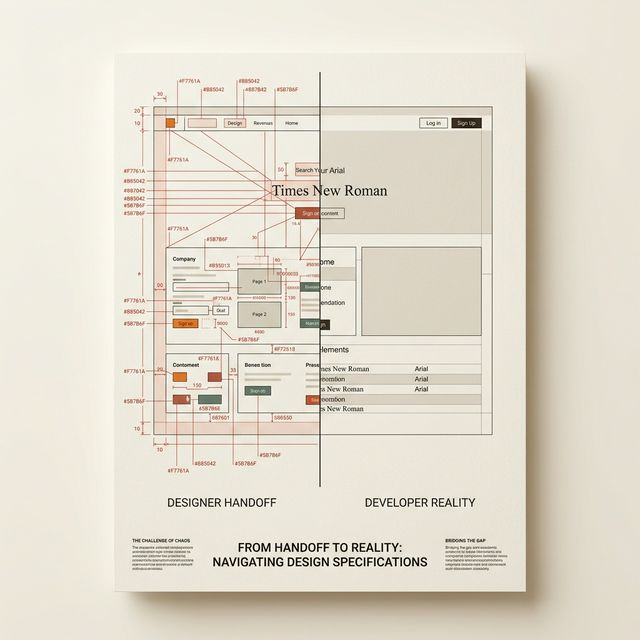
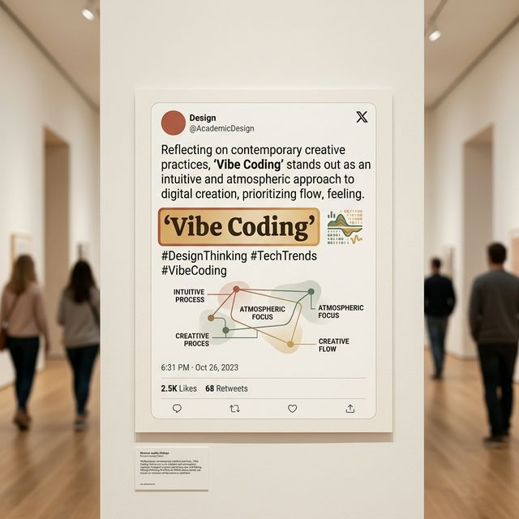
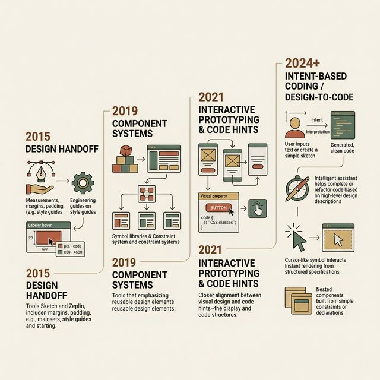
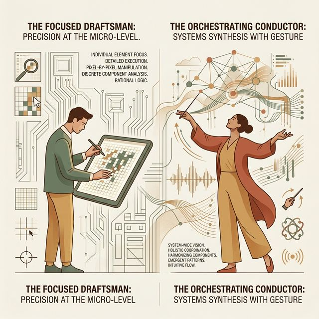
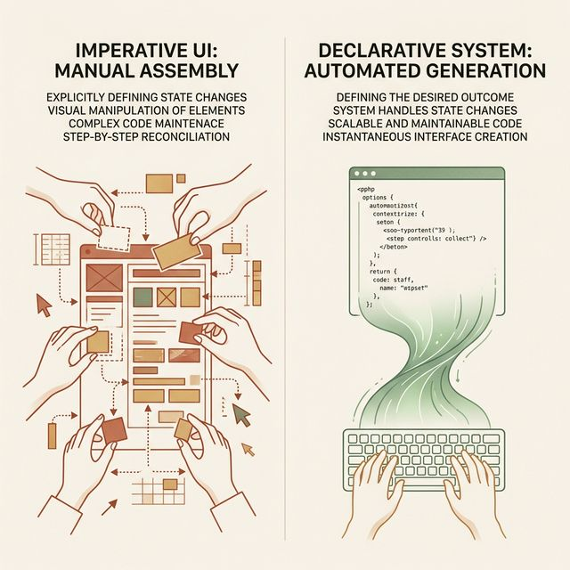
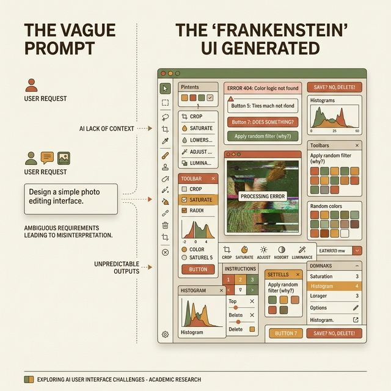
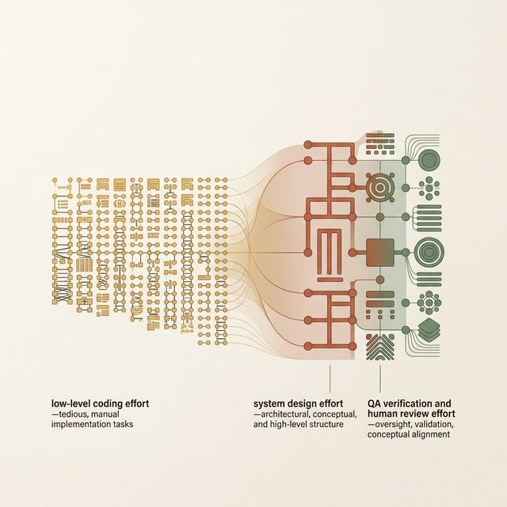

## 模块 1: 复习与导入 — Vibe Coding 与人机协同纪元 (约 20 分钟)
<!-- BUDGET: 3600 chars | SLIDES: ≥7 | STATUS: done -->
<!-- MATERIAL_BUDGET: vibe-coding-human-ai-collaboration -->

> [STAGE NOTE: 复习/导入 (支撑 能力2 回链)]
大家好，欢迎来到本学期最激动人心的一堂课。
在过去八周的折磨里，我们经历了异常痛苦的训练。你们做了痛点调研，画了状态机，并且在前两节课里像个钟表匠一样，死磕每一个像素的间距、阴影的色阶，最终形成了一套严密的 Design Token 和组件响应框架。
到此为止，你们手里捧着的，依然只是一堆静态的“图纸”。

> [VISUAL]
> **Slide**: M1-01_Handoff_Disaster
> **Layout**: `Split`
> **Scene**: 左侧展示一张布满红线条和十六进制色值的极其复杂的 Figma 交付稿（如同蜘蛛网）；右侧则是开发还原出来的页面：间距畸形，圆角消失，字体依然是浏览器的默认宋体。
> *   **Asset**: 
> **Search**: `design to developer handoff disaster misalignment meme`
> **知识节点**: `vibe-coding-human-ai-collaboration`

> [STORY TIME]
> **红线标注与传话游戏**
> 在传统的软件工业流水线里，设计师画完图之后，会进入一个叫做"交付 (Handoff)"的环节。这本质上是一场注定失败的传话游戏。你把一张完美的视觉稿切碎，标上无数的红线和参数，丢过那堵把设计与工程隔开的部门高墙。
> 墙对面的那位程序员兄弟接到了你的图，他面临着两个选择：要么盯着你那比蚂蚁还小的标注一点点写 CSS，要么直接靠肉眼“目测”手写一个差不多像的代码。现实中，99% 的情况下，为了赶进度，或者单纯因为觉得“好看没有用”，他们会选择后者。于是，你精心设计的 8px 间距变成了 10px，你推敲了一下午的柔和阴影变成了一坨死黑。你去找他争论，他说：“在这个底层框架里没法实现你的圆角，凑合看吧”。你们陷入了长达三天的 Slack 扯皮。
> 为什么会这样？因为在这个旧纪元里，你们根本不在一个话语体系里对话。你懂的是视觉，他操纵的是 DOM 树。

我们这门课叫做“交互产品开发”，而不叫“UI 界面临摹”。我不仅要求你们画得出完美的图纸，我要求系统真正在你们手里运转起来。
从今天起，你们不再需要去求那墙对面的程序员，也不需要去学习枯燥的底层 HTML 和 CSS。我们要跨越这道墙。
武器的名字，叫做 Vibe Coding。

> [VISUAL]
> **Slide**: M1-02_Vibe_Coding_Tweet
> **Layout**: `Image`
> **Scene**: Andrej Karpathy 的推文截图，关键词 Vibe Coding 被打上高亮标记。
> *   **Asset**: 
> **知识节点**: `vibe-coding-human-ai-collaboration`

2025 年初，前 OpenAI 科学家 Andrej Karpathy 提出了一个终极预言——**Vibe Coding（氛围编程）**。
这是什么意思？在这个模式下，你连一行具体的底层代码都不需要写。你所要做的，仅仅是向 AI 描述你想要的“氛围（Vibe）”，也就是描述你的商业逻辑、组件结构和视觉规约，而 AI 则作为你的超级劳工，在瞬间将这些自然语言转化为能够在浏览器中直接运行的复杂前端代码。
这意味着，人机职责的终极重分配正在发生：人类从“敲击底盘手写代码层”的泥沼中解脱出来，转向了纯粹的“意图表达（Intent Expression）”与系统架构。

> [VISUAL]
> **Slide**: M1-03_Toolchain_Evolution
> **Layout**: `Timeline`
> **Scene**: 工具链进化史：2015 Sketch/Zeplin (切图交付) → 2020 Figma/DevMode (参数对接) → 2024+ v0/Cursor (意图直接生成代码)。
> *   **Asset**: 
> **知识节点**: `vibe-coding-human-ai-collaboration`

在这个新纪元里，我们的主战工具链变了。
如果说 Figma 是我们制定法则的绘图板，那么从本周开始我们要接入的两大神器：**v0 (Vercel)** 和 **Cursor**，就是我们的前线建造工厂。
v0 负责根据自然语言和参考图，直接生成极其规范的 React 与 Tailwind 流式组件外壳；而 Cursor 则负责将这些壳层缝合进我们的应用仓库，添加复杂的交互判断，乃至接通后端的数据库。这个从“设计意图”到“全栈运行”的过程，从原来的以周计算，被极度压缩到了以分钟计算。

> [DID YOU KNOW]
> **脑力消耗的重新分配定律**
> 很多人产生了一个天大的误解：他们以为既然 AI 能用几分钟写完我们过去需要写一周的代码，我们就能够轻松舒适地躺平，或者去接原本五倍效率的项目外包赚钱了。
> 但真实的一线工业情况是，开发者现在甚至比过去手写代码时代更加焦虑和疲惫。为什么？因为过去你在敲打键盘写底层的 HTML 标签嵌套或者手写 CSS Flex 盒子对齐属性时，你的大脑处于一种类似“肌肉记忆机械运动”的舒适区；你虽然手指在痛苦地劳作，但是你的大脑系统是相对放松的。
> 而现在在 Vibe Coding 的体系框架下，体力上的那些脏活和累活（拼写代码）完全被极度压缩了，导致你的大脑被强行推入了一种极度高压的高维系统架构审查态中。你必须在极短的几秒钟内，用极其严厉审慎且充满全局防御意识的眼光，去逐行审视、排查、拷问 AI 瞬间喷涌而出的那几千行代码，寻找那些潜在的组件冲突和变量越界破坏。这就好比你从一个悠闲砌砖的泥瓦匠，突然被送上了波音七四七的高空驾驶舱去当全责机长审查仪表盘，那种强度的脑力燃烧和认知负荷，才是这个新纪元最底层的残酷真相现实。

> [VISUAL]
> **Slide**: M1-04_Architect_vs_Draftsman
> **Layout**: `Comparison`
> **Scene**: 左侧：一个低头死抠屏幕某个特定像素、在孤立画板里纠结的“绘图员”。右侧：一个交响乐团的“指挥家”，闭着眼睛，用手势控制着庞大系统各声部的起承转合。
> *   **Asset**: 
> **知识节点**: `vibe-coding-human-ai-collaboration`

听到这里，很多毫无编程基础的数字媒体艺术同学们可能会松一口气：“太好了，我只要动动嘴皮子，AI 就能帮我做出产品了，我什么都不用做了。”
大错特错。这不代表你没事干了，这只代表**你的角色从根本上跳跃了**。你需要从左边的“绘图员”转变为了右边的“指挥家”。

> [CASE STUDY]
> **画图员的黄昏：一万行意大利面条代码**
> 为了让你们深刻理解这种身份转变的残酷性，我给你们讲一个发生在上个月的真实企业惨案。有一位资深 UI 设计师，他在面对公司内部一个全新的后台管理系统时，极其兴奋地启用了全部的 AI 生成工作流。他用自然语言告诉 AI：“给我画十个表格页面，左边要有导航，上面要有搜索框。”他就像以前使用 Figma 画图一样，把系统看成了十张互不干扰的独立画板。
> AI 非常勤奋地为他生成了十个极其漂亮的页面，设计师不仅把代码原封不动地提交了，甚至还写在了周报里自夸效率提升了 500%。
> 可是到了第二周，公司高管要求把所有表格里的“搜索框”统一加上一个防误触的延时加载（Debounce）功能。这个时候，这位设计师傻眼了。因为他没有系统级的指挥家思维，他根本不知道这十个页面里的搜索框，实际上是由 AI 分别复制粘贴了十次不同的底层代码写出来的！它们根本没有被封装成一个可复用的“公共搜索组件（Shared Component）”。
> 为了加上这个小小的延时功能，他不得不重新写了十次极度冗长而互相冲突的 Prompt 提示词去分别修改那十个完全独立的烂摊子页面。最终，系统因为到处充斥着这种没有经过抽象提炼的复制粘贴代码（我们称之为 Spaghetti Code，意大利面条代码）而彻底卡死崩溃。
> 这就是典型的以“绘图员”心态去驾驭工业级 AI 的灾难现场。你的对手不再是一个孤立死板的画板，而是一套庞杂到极易在暗网中自我绞杀的巨型生态系统。

作为绘图员，你过去的焦点是原子级的。你的对手是一个死板的画板。
作为指挥家，你的焦点必须跃升到系统级。在一场庞大的交响乐演出中，如果小提琴手拉错了半拍，指挥家绝不可能冲下指挥台抢过小提琴自己去拉。指挥家要做的是敏锐地听出不和谐的声部，准确定位问题区域，并用一个眼神或者一个手势给出**纠偏指令**。小提琴手（AI）自己会马上改好右边呢？右边是你现在该去挑战的生态位——**指挥家**。

> [PHILOSOPHY]
> **跨学科视角：宣告破产的 "Translate" 路线与重生的 "Declare" 路线**
> 我们在这个历史节点讲 Vibe Coding，不是在赶时髦，而是在见证一段长达二十年的软件界面工程“烂尾楼”的全面倾覆。
> 如果你们回顾一下过去二十年的 UI 交付史，本质上就是一部充满血泪的“翻译 (Translate)”史。
> 早在 2010 年代，大家用 Photoshop 做网页设计，一张张位图切下来给开发照猫画虎，那叫“手语翻译”；
> 到了 2015 年，Sketch 和 Zeplin 出现了，由于矢量图形可以直接导出零碎的 CSS 代码残渣，大家以为那是一场革命，叫“机翻”；
> 到了哪怕是 2023 年，Figma 推出了极其强大的 Dev Mode，把 Auto Layout 1:1 映射成了 CSS 的 Flex 属性分布阵列，前端工程师可以直接把界面代码复制粘贴进 IDE 中。
> 
> 但这解决问题了吗？并没有！那些基于设计图导出的所谓极度精确的代码，全部都是毫无灵魂的、僵硬的「视觉垃圾」。为什么？因为工具在死板地逐像素倒模转译时，彻底丢失了隐藏在点位阵列背后的**商业意图**和**上下文逻辑**。
> 当开发按部就班地复制出了一段完美的 8px 圆角代码时，他根本不知道这个圆角之所以存在，是因为它承载了一个高危的“警告操作”，还是因为它仅仅是一种毫无语义的“装饰性插图边框”。
> 
> Vibe Coding 彻底抛弃了这条走到黑的“像素级翻译”路线，它走向了计算科学中最优雅的底层范式——**声明式 (Declarative)** 范式。你不再是拿着游标卡尺去战战兢兢地丈量界面上冰冷的物理距离，你是像在米其林餐厅高点点菜一样，对作为后厨系统的大脑（AI）“声明”你的宏观需求体系。你不必告诉厨师怎么去切洋葱、怎么去极度精准地控火（因为那是**命令式思维 Imperative** 的苦力活），你只需要清楚地、严谨无歧义地宣告：“我要一套安全度极高、由红色警戒色域驱动的数据兜底警告全屏幕覆盖表单，并且它必须是移动端自适应优先的”。

> [VISUAL]
> **Slide**: M1-04b_Declarative_Paradigm
> **Layout**: `Comparison`
> **Scene**: 左右分栏对比。左侧为传统命令式 (Imperative) UI 搭建泥沼：拖拽一个个生硬的矩形，痛苦地在右侧面板设置宽度拉扯与极小的 BorderRadius=8px；右侧为声明式 (Declarative) 的系统生成盛况：只需在终端输入框写下极少的一句话指令「生成一个基于暗黑模式的二级警戒卡片，它必须必须遵循当前的 Primary Token 的衍生值体系」。
> *   **Asset**: 
> **知识节点**: `vibe-coding-human-ai-collaboration`

> [CASE STUDY]
> **当组件库遇见超大模型**
> 很多人依然有疑虑：凭什么用自然语言让 LLM 工具写出来的代码，就不再是以前导出工具拉出来的垃圾呢？让我们看看像 v0 这样的先进体系在底层到底如何执行了这场降维打击。
> 传统的代码导出插件，看设计图就像盲人摸象，它眼里只有死板生硬的一根根分离的网格线。而 v0 却截然不同，它是在孜孜不倦地去**阅读、消化并疯狂理解**世界上最优秀的那些开源抽象组件库（比如 shadcn/ui 和极其系统化的 Tailwind CSS）。
> 当你对大模型随意地描述：“给我一个企业级的数据仪表盘（Dashboard）”时，它深层神经网路里立刻浮现出来的并不是几百个等待填充色彩的零散空洞矩形方块，而是令人叹为观止的组合系统：“哦，这个商业推演场景极其庞大，它必然需要组合一个极强交互性的 Recharts 图表聚合组件库、还要布置三个带异步状态轮询的统计数据面板，并且最外层必须要严丝合缝地套上一个高可用性的响应式 Dashboard Layout 栅格结构”。
> 这意味着，AI 绝不是在帮你枯燥地“画图”，而是在充当一名绝顶干练的极客包工头，疯狂地帮你**拼装工业级的标准预制件**。那些繁复的无障碍访问属性标签 (ARIA 指南)，在电光火石之间，就被部署完毕。
> 
> 但是，如果它用的全都是无聊预制件，你们的设计价值究竟体现在哪里？
> 这就是为什么我们在前面必须要建立起那一套极高保真的私人 Design Token 清单系统的根本原因！那些生成的默认组件，虽然结构稳固，但是毫无例外全都是极其冰冷、粗糙且全然丧失灵魂的工业标准件。
> 作为交互产品架构师，你的真正致命武器，就是果断祭出你的 Token 字典表，将这套灰白色的开源通用骨架，用你们独有的颜色冷暖韵律表、高低材质阴影特征（Tokens参数集）直接强行注入并实施系统级霸权覆盖。你是一个牢牢掌握着视觉配方的灵魂调色师。

> [STORY TIME]
> **血泪警示录：一个按键圆角修改所引发的全盘崩溃**
> 过去如果设计总监想要把所有按钮的 4px 圆角改为 8px，在 Figma 里只需要 3 秒。但是前端开发人员要在代码海里找出所有写死的 (Hard-coded) 老旧按钮，逐个修改并回归测试，往往需要耗费数十乃至上百小时，而且最后依然会漏掉几个深埋的组件，导致线上严重事故。这就是原本极其不对等的心智修改成本灾难。而在 Vibe Coding 的体系下，一条全局语义命令：“将 primary button 的 border-radius token 修改为 md 并映射到 8px”，大模型瞬间就会完成重构验证，工业生产力发生了断代跃迁。

> [TEACHING MOMENT]
> **打破魔法错觉：被转移的脑力劳动**
> 记住，不要把 AI 当成仙女教母，它的生成能力绝对不是能够凭空将你脑中模糊的幻想具象化的魔法。
> Vibe Coding 并不是降低了技术门槛，它只是巧妙地掩盖了复杂度。它把传统属于人类的"体力劳动"以 90% 的比例削减了；但同时，它把"脑力劳动"以 300% 的程度成倍地挤压回了你的脑子里。

> [VISUAL]
> **Slide**: M1-05_The_Magic_Myth
> **Layout**: `Split`
> **Scene**: 左侧是典型的外行输入：“帮我生成一个类似淘宝的超酷炫主页”。右侧是 AI 吐出来的灾难代码图示：颜色混乱、无响应式断点、空载状态报错（被戏称为“弗兰肯斯坦的怪物”）。
> *   **Asset**: 
> **知识节点**: `vibe-coding-human-ai-collaboration`

想象一下，你对 v0 甩出一句外行至极的 Prompt：“帮我生成一个炫酷的电商主页。”
AI 会怎么做？它是一个极度渴望讨好你的实习生，但它同时有着极差的审美和金鱼般的系统规划记忆。由于缺乏来自于你的严密规则约束，它会从它看过的上百万个开源项目里，随机抽取一些看着不错的按钮和卡片强行缝合起来交给你。乍一看五颜六色，稍微一点全部崩溃。这就是失控的 AI 副驾驶带你入坑。

> [VISUAL]
> **Slide**: M1-06_Shift_of_Labor
> **Layout**: `Chart`
> **Scene**: Vibe Coding 模式下的努力重定向图表。显示人类精力的消耗曲线：底层代码实现（暴跌），而前期的 System Design 系统设计（剧增）与后期的 QA 把控检验（剧增）。
> *   **Asset**: 
> **知识节点**: `vibe-coding-human-ai-collaboration`

所以，我们要如何在这种巨变中活下来？
你必须要建立起一种**控制大于依赖**的审视心态。工具可以把代码这件脏活累活外包出去，但系统的品味、对于可用性底线的守护，这永远只能长在你们自己的骨头里。
为了能够向 AI 这个强大的但偶发失控的交响乐团下达精确的指挥手势，我们就必须抛弃那种诗意、模糊的自然语言。我们要用一套极度结构化的语言体系与它对话。
这就解释了为什么我们需要掌握一门极其冷酷的机器外语。在这个充斥着失控风险的新天地里，如何打造一套毫无歧义的结构化 Prompt 咒语，将是我们在第二阶段阵地里必须攻克的生死命题。

---
