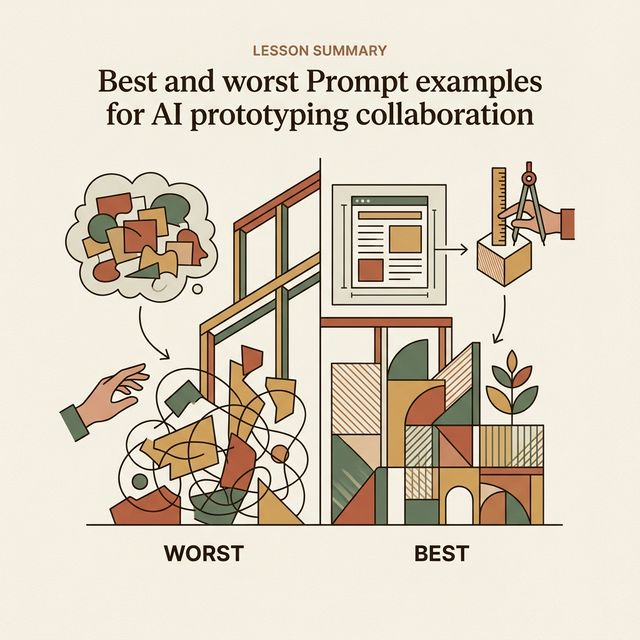
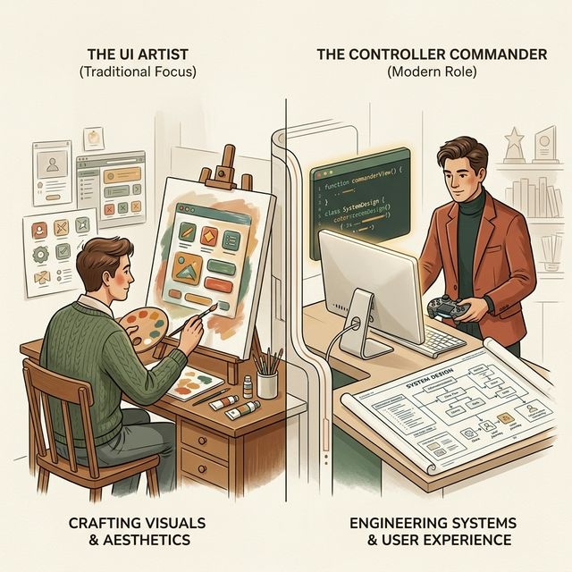
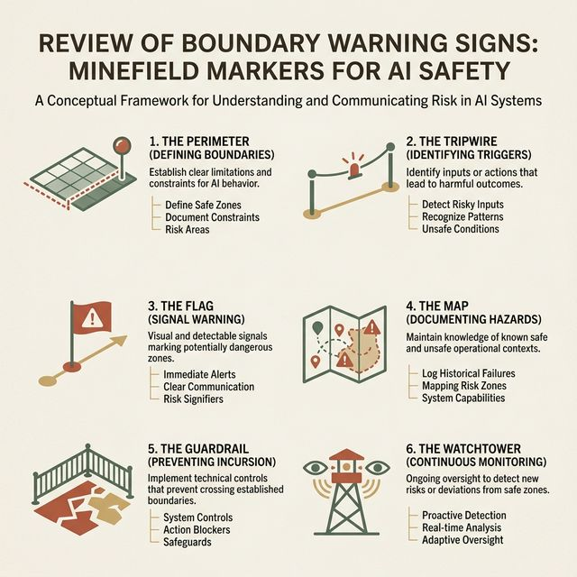
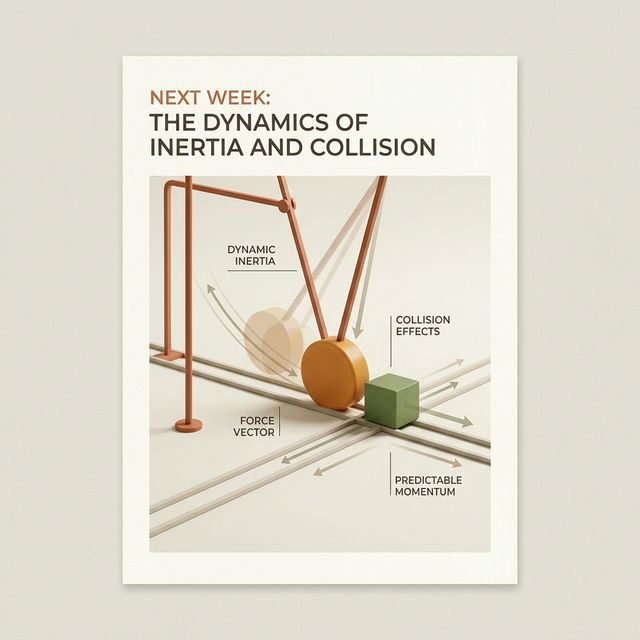

## 模块 5: 小结 — 对比与总结最佳实践 (约 10 分钟)
<!-- BUDGET: 1800 chars | SLIDES: ≥4 | STATUS: done -->
<!-- MATERIAL_BUDGET: prompt-engineering-ui, ai-code-generation-constraints -->

> [VISUAL]
> **Slide**: M5-01_Summary
> **Layout**: `List`
> **Scene**: 本节课最佳 Prompt 示例展示，以及需要避免的行为。
> *   **Asset**: 
> **知识节点**: `vibe-coding-human-ai-collaboration`

大家辛苦了，经过刚才 80 分钟激烈的上机对抗实验，相信你们已经切身体会到了 Vibe Coding 并不是什么点石成金的魔法，而是一场**对你思维结构化能力极度严苛的极限施压测试**。
通过对比各组生成的 UI 壳层，我们总结出了今天讲授的最核心实践法则。

在刚才的巡场中，我看到第三组依然在试图使用一百个字的含糊感性形容词去描写一张卡片，结果生成出来的代码就像是上个世纪落后的产物；而第七组严格恪守了 **RCPVU 极严密指令集** 和 **三级阶梯死守生成法 (Scaffold -> Skin -> Interaction)**，在两分钟内就极其精准地落地了与你们 Design Token 完全咬合的高保真复杂网格界面。

> [VISUAL]
> **Slide**: M5-02_The_New_Identity
> **Layout**: `Split`
> **Scene**: 视觉呈现对比：左侧是一个拿着调色盘的传统“美术工”形态；右侧是一个身处于代码矩阵中、手里握着系统设计蓝图与安全边界控制台的“控制者指挥官”。
> *   **Asset**: 
> **知识节点**: `vibe-coding-human-ai-collaboration`

这就是你们在接下来这一年中必须完成的痛苦蜕变。
在此之前，你们可能一直把自己定位为一个只会画图的“视觉搬砖工”。
但在大语言模型底座算力彻底过剩的今天，你们的身份必须发生断代级的升维——从堆砌像素的劳工，变成**掌控系统命脉、制定代码底座法典、死守架构幻觉风险边界的绝对产品控制官指挥家**。

> [LIFE CONNECT]
> **被机器抢走饭碗的，都是没有“阵地意识”的雇佣军**
> 当外界恐慌于“AI 是否会取代设计师或前端工程师”时，你们必须要有一种清醒的、极其残酷的自我反问意识。如果你的核心竞争力仅仅是把产品经理递过来的一句空洞口号翻译成一张排版整洁的 UI 切图，或者只是把别人画好标注好红线的稿子像机器一样无脑敲成 100 行没有灵魂的 HTML代码标签，那么我非常遗憾地告诉你，你明天上午就可以准备卷铺盖走人了。因为一秒钟就能吐出这些垃圾代码的算力机器，成本比你便宜一万倍且不需要上社保交公积金。
> 但是，如果你的核心竞争力是：**“我这双极其挑剔的眼睛，能在 AI 两秒钟吐出的那三千行深色主题流式响应界面代码瀑布里，极其敏锐且狠辣地找出那个在 320 像素超小屏幕断点下会导致支付核心按钮被死死遮挡的重叠致命技术债，并在极短三十秒内下达精确到变量级的强控纠偏指令，以绝对确保这整个商业大盘交易链的完美和死守绝对畅通”**——那么，你就是拥有坚固阵地意识的正规军。机器算力越大，你所能支配指挥的杠杆效能就恐怖到越加令人胆寒。机器根本不是你的替代者，它只是你们手下那些不知疲倦疯狂拉磨的极低端赛博牛马。在这个新的修罗战场纪元，能保住你们身价和地位的，从来不是什么绘画软件的快捷操作熟练度，而是那本永远揣在胸口、容不得半点沙子的《物理边界安全网审查最高军规》。

> [VISUAL]
> **Slide**: M5-03_Six_Boundaries_Review
> **Layout**: `Grid`
> **Scene**: 并列闪现前文讲解的六大约束边界，如同六块雷区警示牌，提醒人类保持清醒。
> *   **Asset**: 
> **知识节点**: `ai-code-generation-constraints`

一定要死死记住今天在这间教室里讲过的**六大致命约束边界**。
未来不管 AI 的版本更新到多么强大的 GPT-6 乃至未来的算力霸主，只要它的底层架构原理依旧是概率统计和注意力机制，这种深埋在系统表象之下的“上下文盲区 (Context Blindness)”与极其惨痛的“自动化讽刺缺陷 (Ironies of Automation)”就绝对不可能被完全抹杀。
因此，你们手里的那份**《大盘检修强制安全质检清单 (Ultimate Safety Checklist)》**，才是你们能在未来的 AI 工业革命狂潮中绝不会被机器替代、反而能真正驾驭机器的终极真金壁垒防线。技术泥瓦匠脏活可以全面大批量外包给极其廉价的深层算力，但系统的宏观品味与灾难防雪崩安全网的设定决裁权，将永远只属于你们。

> [VISUAL]
> **Slide**: M5-04_Next_Week_Teaser
> **Layout**: `Image`
> **Scene**: 预留巨大悬念——一个极其顺滑、带有物理惯性碰撞反弹的前沿动态组件正在屏幕中央丝滑运转。
> *   **Asset**: 
> **知识节点**: `prompt-engineering-ui`

**课后任务与下周预告：**
今天我们成功完成了静态界面的骨架与品牌皮肤精确映射覆盖。但大家肯定也发现了，现在的界面还是略显生硬死板。
这周的作业实训要求：请各组回去将所提炼出的 Token 体系与状态流转图真正转化为结构化 Prompt，通过 v0 或 CodeGeeX 生成应用初始视图的高保真壳层代码，最后向系统提交「核心 Prompt 原文 + 代码环境生成的连贯结果预览截图」以做审查标的！

> [TEACHING MOMENT]
> **硬核打桩清单：带回你们的宿舍战壕**
> 为了落实这周的实训，不要空手上阵。在打开 Cursor 生成前，必须在你们的小组记录文档最顶部，写下这四行雷打不动的自省底线。如果你和 AI 沟通前连这些都没有界定清楚，你只是在闭眼赌博：
> 1. 第一刀：当前页面的 Context（用户是谁？是在慌乱、闲逛还是高压强光核对下使用）是什么？
> 2. 第二刀：它的核心 Platform 容器框架与底座组件集（如 Radix）是哪一套？
> 3. 第三刀：我们有没有在一开始只构建最死板灰调的 Scaffold（骨架）并执行响应式视口疯狂拉扯压力测试？
> 4. 第四刀：当我们全副武装铺设好 Token（皮肤）后，长文本越界截断、断网无内容骨架空箱防溢出等边缘状态的“差不多对陷阱”我们全盘人工肃清了吗？
> 如果没有完成这个检阅，任何一组合并进主干仓的代码我都会全额打回并要求重做。

下周的 W10 课程，我们将迎来更加激动人心的技术深水区——**《前沿动效组件融入》**。在那里，我将教你们如何使用深层代码解构咒语，强迫 AI 为你们注入符合真实物理弹簧空间动力学的极致微交互动态灵魂！

> [DID YOU KNOW]
> **算法的本质只是“接龙棋局”**
> 在你们离开这间教室之前，请把这句话刻在脑子里：大模型（LLMs）没有任何“意识”，它既不懂什么是“美”，也不懂什么是“可用性”。这种极其强大又极其危险的造物，它的底层引擎，仅仅是一场基于数万亿语料权重的、极度精确的“词汇概率接龙游戏（Next-Token Prediction）”。当你放弃精确掌控、放弃边界死守时，你等于将真金白银的商业大盘信任托付给了一台投掷骰子的发报机。去成为那个制定骰子规则的庄家，去成为那个无情执法的守夜人，这就是你们这学期最大的使命。
> **十年后的回望与自省提示框：**
> 想象一下十年后的软件工程历史书会怎么去记载今天这两年极其荒谬而魔幻的狂热大生成时代。当狂欢的泡沫彻底被戳破洗脱散去，那些只会盲目追在所谓“一键式全自动生成大爆发幻景”身后去极尽欢呼鼓噪并且全面丧失了基础深层原理审查认知底线护城河保护网能力的速食型设计师以及外包层级切图执行码龙们，必将被这股算力洪水无情且永远地淹没抛弃掉；而相反，所有那些紧紧握住核心控制架构权杖钥匙，能够凭借极少数几个异常变量和布局报错就能敏锐洞悉捕捉那头巨型网络野兽底层致命思维盲区，并用极高维、极具穿透力且毫无歧义的法则指令强迫野兽去精准走完最后一公里泥泞雷区的硬派结构化思想者大军，才能够在这个惊心动魄的新世界钢铁废墟上，堂堂正正、不可撼动地真正站立传承存活到最后的新纪元荣光巅峰。

下课！
