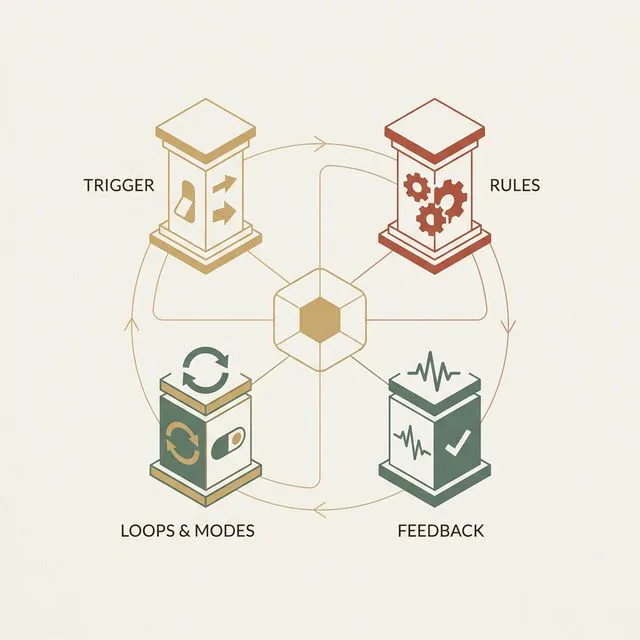
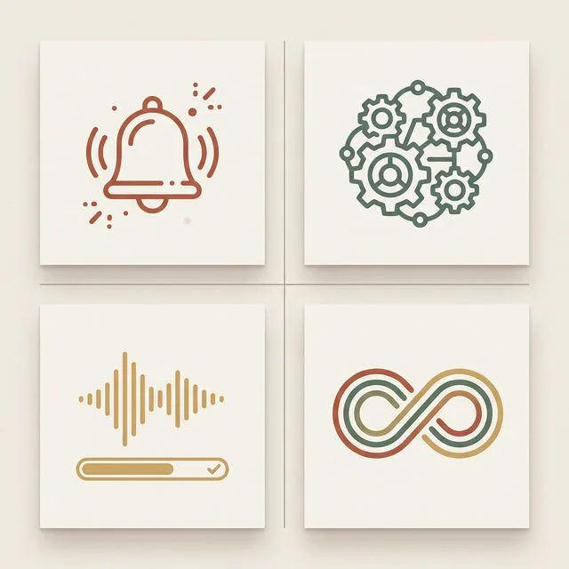
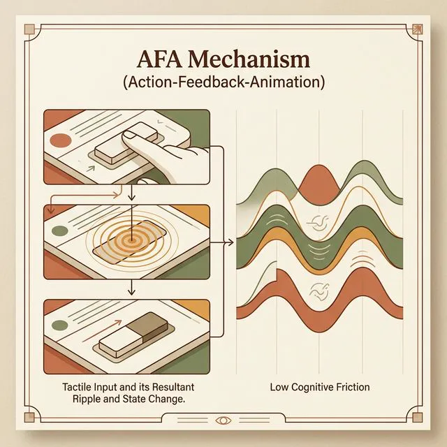
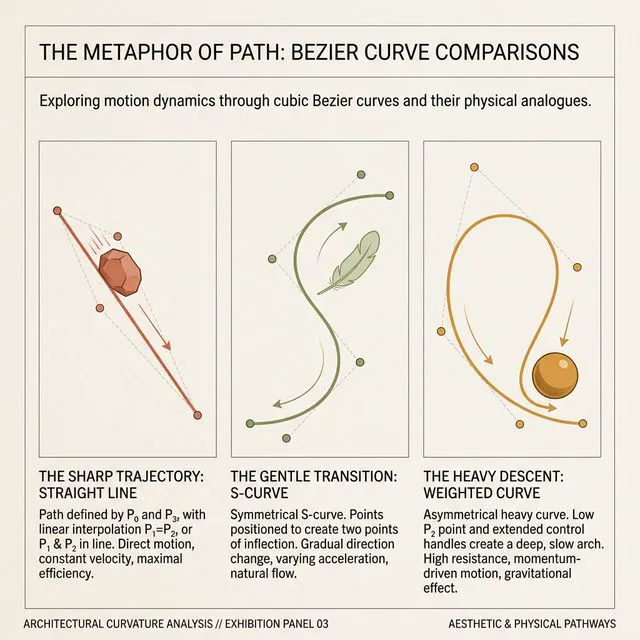
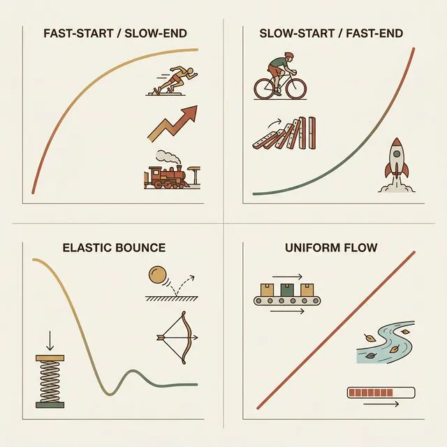
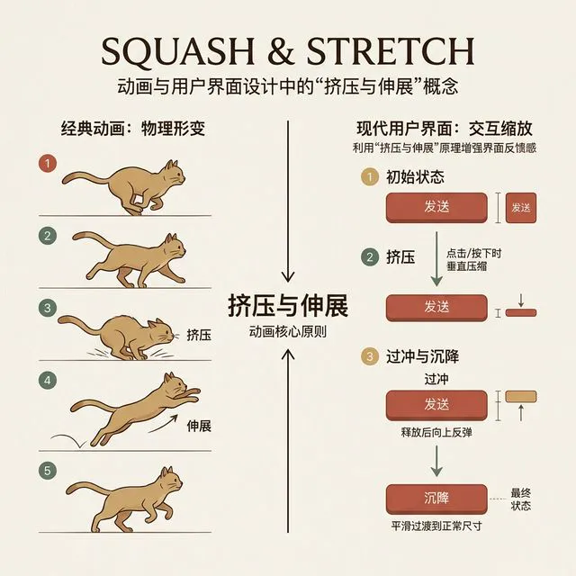
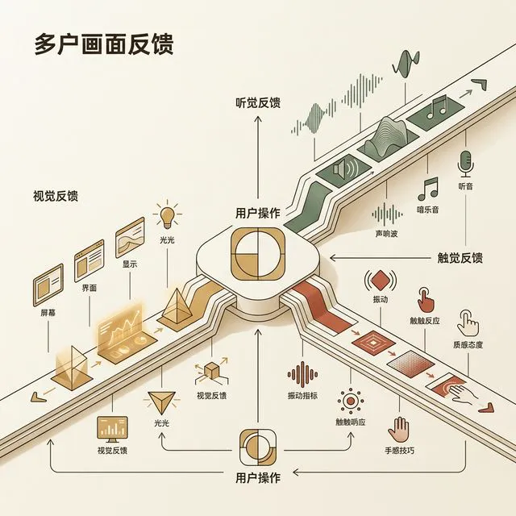
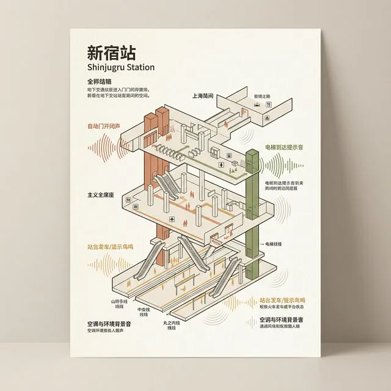
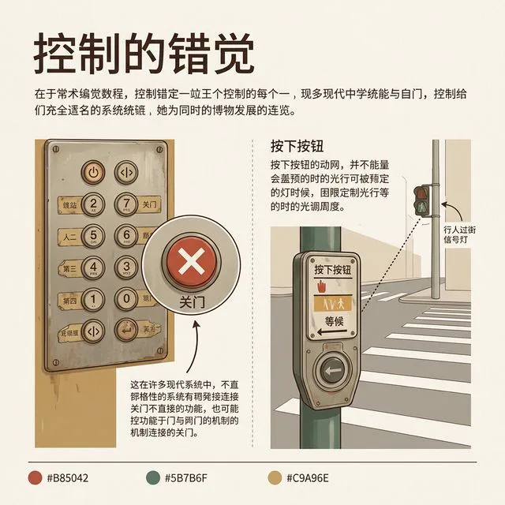
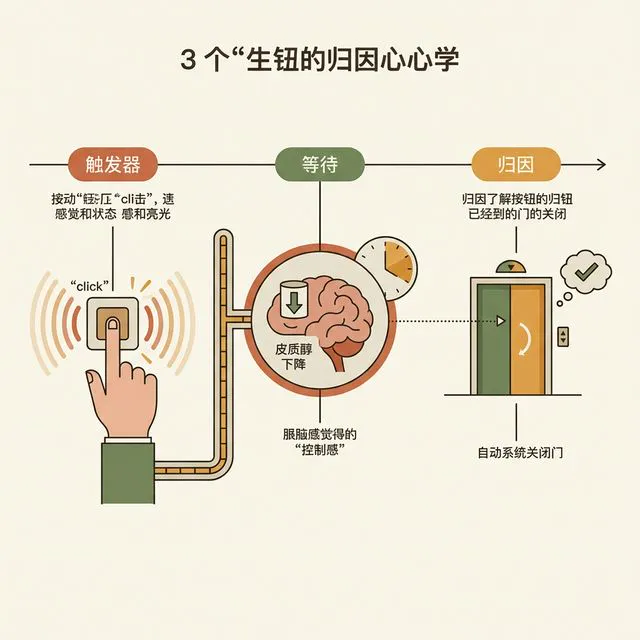

## 模块 2: 讲授(上) — 微交互反馈的作用机制与前沿融合 (约 35 分钟)
<!-- BUDGET: 6300 chars | SLIDES: ≥12 | STATUS: done -->
<!-- MATERIAL_BUDGET: w10-afa-mechanism, w10-chinese-aesthetics-motion, about-face-motion-microinteractions (≈ 95%) -->

<!-- STAGE NOTE: 讲授 (支撑 素质2 回链) -->
刚才我们提到，动效绝不仅仅是用来炫技的装饰品，它是人类构建数字物理隐喻的核心心智地图。那么，在这个宏大且复杂的交互宇宙图景里，究竟是什么样的底层基建力量在精准地主导着每一次让大脑感到安心的操控瞬间流转？
答案就隐藏在那一次微不足道的点赞（Like）操作、下拉刷新（Pull-to-refresh）、或者是平淡无奇的密码输入错误摇晃（Shake）之中。这些被很多人轻易忽略掉的碎片体验，在交互学理中有一个重磅的专属名词——**微交互（Micro-interactions）**。

> [VISUAL]
> **Slide**: M2-01_Microinteraction_Anatomy
> **Layout**: `Full`
> **Scene**: 展示 Dan Saffer 提出的微交互经典四核心要素结构解剖模型（Trigger, Rules, Feedback, Loops & Modes）。
> *   **Asset**: 
> **Search**: `Dan Saffer microinteractions elements diagram`
> **知识节点**: `about-face-motion-microinteractions`

> [TEACHING MOMENT]
> **管中窥豹：Dan Saffer 的微交互四神柱解构**
> 很多初出茅庐的交互设计师，一上来就喜欢去大谈特谈宏伟的产品战略蓝图、烧脑的商业裂变漏斗。但真正顶尖的“骨灰级”设计大拿，却往往痴迷于去死磕一个不起眼的开关控件（Toggle Switch）拨动的微观物理瞬间。因为他们比任何人都更加深刻地明白一个残酷的设计真理：**所有的宏大产品愿景都是由细微的生死瞬间堆砌而成的**。一旦微交互崩盘，你的商业模式讲得再天花乱坠也是无源之水、空中楼阁。
> 在 Dan Saffer 那本具有里程碑划时代意义的专著《微交互》中，他将这个精密的系统毫不留情地解构为了四个核心支柱要素：
> 第一是**触发器（Trigger）**，它可以是你手指按下的那一个精确点击（手动触发），也可能是隐蔽的系统级后台通知（系统触发）。想象一下，当你疲惫地刚刚踏入一家星巴克门店的大门，你的手机屏幕在完全没有受到任何物理接触的情况下，自动在锁屏界面优雅地浮现出了一张会员二维码卡片。这就是一种高级、懂人性的基于地理围栏（Geo-fencing）系统级触发器。它彻底免去了你在拥挤排队人群中狼狈地解锁手机、寻找 App、点击菜单层层翻找的焦虑过程！
> 第二是**规则（Rules）**，这是那个隐藏在最深处的上帝之手，它冷酷但也公平地规定了“当系统发生 A 时，必然且只能导致 B 的发生”。例如，当用户在登录界面粗心地连续三次快速输入了完全错误的密码组合时，规则引擎会冷酷地判定此时严重的风险等级阈值已被破坏，它严厉地下达了拒绝进入指令。这种严密的内部法则，就是整个微交互大厦的最底层钢筋架构。
> 第三是**反馈（Feedback）**，也就是我们今天探讨的核心——系统如何用通俗易懂、几乎不需要动用任何大脑前额叶皮层算力的方式向人类那脆弱的大脑证明并大声宣告“你的微小的操作我已经确确实实并且稳妥地收到了，并且我正在卖力地执行它！”；还以上面那个严重的密码错误为例，系统不仅冷酷地遵循了拒绝规则，它还拟人化地让登录输入框产生了一阵剧烈且明显的“左右来回急剧摇晃”。在这个短暂的瞬间，机器仿佛拥有了灵魂，它用一种全人类不需要任何语言翻译直接秒懂的“摇头拒绝”强烈的肢体语言，明确地拒绝了你。
> 最后是**循环与模式（Loops & Modes）**，决定了这个微小的交互是在不断重复轮回，还是伴随着某种极限状态的转移演变。比如一个简单的闹钟设置应用，在平时查看时间时它处于一个安静冷漠的观察模式；但一旦暴力的闹铃刺耳地响起，整个的界面瞬间狂暴地全盘转换进入了闪烁震动的“警报模式”，这就是经典的状态演变。
> 在这四大极限支柱的强烈的支撑下，那些伟大而克制的产品往往只需要做简单的一件事：不要在微交互中塞入臃肿庞杂的一大堆功能！绝不可能用一个微交互来点外卖同时发朋友圈，它每一次、克制的存在，都是为了并且仅仅为了完成那单一但关键的“一丁点工作（One small task）”。

> [VISUAL]
> **Slide**: M2-01b_Saffer_Four_Elements
> **Layout**: `Split`
> **Scene**: Dan Saffer 微交互四要素框架表格。四行：触发(Trigger)→用户点击/系统通知 | 规则(Rules)→状态转换序列 | 反馈(Feedback)→视觉/听觉/触觉信号 | 循环与模式(Loops & Modes)→持续行为/条件变化。每行配有点赞按钮的具体映射案例。
> **List**: 1. 触发 Trigger → 用户点击点赞按钮 2. 规则 Rules → 心形图标放大→变红→弹回原尺寸 3. 反馈 Feedback → 颜色变化 + 轻微振动 + 计数+1 4. 循环与模式 → 长按连续递增；夜间模式降级
> *   **Asset**: 
> **知识节点**: `about-face-motion-microinteractions`

请注意"循环与模式"这一层。很多团队在设计微交互时只考虑了前三层——触发什么、发生什么、如何反馈。但他们忘了问：这个交互会重复吗？在不同条件下表现一样吗？一个优秀的点赞按钮，在用户第一次点击时应该有惊喜的放大弹跳，但在第五十次取消又重新点赞时，就应该收敛为最小幅度的状态切换。这就是模式演变的智慧。

这也就引出了一个底层、核心且彻底改变了认知心理学与前端工程学交汇点的神级理论：**AFA（Action-Feedback-Animation）动作-反馈-动画法则**。

> [VISUAL]
> **Slide**: M2-02_AFA_Mechanism
> **Layout**: `Split`
> **Scene**: 左半边展示 AFA 线性反应图（手指点击 -> 按钮变暗反馈 -> 波纹扩散动画）；右半边是一张脑电波平缓稳定的监测图表，配文“认知摩擦冰点”。
> *   **Asset**: 
> **知识节点**: `w10-afa-mechanism`

> [STORY TIME]
> **AFA 机制：拯救人类心智底座免于崩溃的心理按摩**
> 当你的指尖用力点向屏幕上的“确认支付 19999 元”那个沉重按钮时，你的大脑在那个短暂的 100 毫秒内，其实正经历着一场恐怖的不确定性海啸危机。你在恐惧地思考：钱扣了吗？网卡了吗？我是不是该再无意识地狂点两下？如果再点错会不会又多扣两万块钱？
> AFA (Action-Feedback-Animation) 法则在这个最危险的临界心智崩溃边缘，充当了伟大的心理按摩师。当你执行 Action（动作：点按下去的瞬间）时，按钮会同步、无任何延迟地立刻发生色阶或者阴影的急剧下降变化（Feedback：视觉接收收到指令的信号）。而接下来发生的 Animation（动画：比如一个绿色的勾由于流畅的弹性伸展慢慢画完，或者一个波纹从触点瞬间无痕荡漾扩散开来），则巧妙地在这个长达大概 300 毫秒的短暂却又漫长的延迟真空时期内，彻底完美安抚了你大脑皮层中对于未知的严重焦虑情绪。
> 在《交互设计精髓》中，Cooper 把这种行为称为对“目标导向隐性反馈（Goal-Directed Implicit Feedback）”的绝妙应用。动效在这里已经不再是所谓的“视觉花瓶”，它已经彻底进化演变成了一种让机器内部无比冰冷深邃的运行逻辑，能够彻底向人类感性脆弱感官做到“完全透明化”展示的一道透明防弹玻璃接口。

这里有一组关键数字需要大家牢记。心理学家 Miller 在 1968 年建立的延迟感知四级阈值模型，至今仍是交互设计的黄金标尺：
零点一秒以内，用户感知为"瞬时"——仿佛直接用手触碰了物理按钮，不需要任何反馈动画。
一秒以内，用户感知为"响应式"——注意到了延迟但思维没有中断，此时需要微妙的视觉提示，比如按钮颜色的轻微变暗。
十秒以内，用户的注意力开始漂移——进度条在此时变成了心理锚定器，它不一定要精确反映真实进度，但必须持续运动来暗示"系统还活着"。
超过十秒，用户会选择离开——此时唯一的策略是后台执行加完成通知，绝不能把用户锁在加载界面里干等。
AFA 法则中的 Animation 阶段，本质上就是在第二和第三个阈值区间里做文章：用精心设计的过渡动画，把用户原本可能流失的注意力牢牢挽留在界面上。

但要做好这一切，关键的一点是：千万不要让它们变得惹人厌烦。一旦你的反馈动画时长超过 400 毫秒，人类的大脑就会瞬间从“感觉真舒心”转化并爆发为狂暴的愤怒——“别再磨蹭了让我过去！”

> [VISUAL]
> **Slide**: M2-03_Easing_Curves_Decoded
> **Layout**: `Full`
> **Scene**: 贝塞尔缓动曲线（Bezier Curves）的三大分类对比阵列。线性（直线，配字“机械冷漠”）、缓入（前平缓后陡峭，配字“重量沉降”）、缓出（前陡峭后平缓，配字“爽快抛出”）。
> *   **Asset**: 
> **知识节点**: `frontend-animation-techniques`

> [TEACHING MOMENT]
> **为死锁注入重力的绝密魔法：非线性缓动哲学 (Easing)**
> 既然我们知道了动效是用来传达物理反馈的，那就必须面对这枯燥的渲染底座。为什么有时候哪怕是加了过渡动画，有的应用依然让人觉得像是一个刚充上电僵硬冷漠的工业机器人？而另一些的顶尖应用（比如苹果的系统级界面或者微信流畅的弹窗），却让人觉得那里面仿佛关着一个能够呼吸、拥有柔软肉身弹性的有机精灵？
> 分野的致命核心就在于：缓动曲线（Easing）。
> 其实在真实的物理宇宙定律法则中，这个世界上是不存在所谓的“线性匀速运动（Linear Motion）”这回事的！无论是你扔出一个沉重的保龄球，还是天空中轻盈飘落的雪花，在空气庞大的阻力摩擦和强大的地心引力极限拉拽交互作用下，任何事物的运动都必然伴随着平滑自然的加速起步和缓慢优雅的减速刹车。
> 当那些缺乏常识的二流前端工程师仅仅只是随手敷衍地写下一句 `transition: all 0.3s linear` 时，他其实等于是在数字屏幕里傲慢地创造了一个完全违反牛顿经典物理力学定律的大灾变怪物！这种零加速起步和瞬间暴毙急停的匀速闪现平移，在大脑深谷神经中枢看来是诡异、不可接受甚至带有轻度恐怖片惊吓色彩的数字抽搐。
> 顶流的产品会花成百上千个小时，精雕细琢去调校一条 Custom Cubic Bezier（自定义三次贝塞尔曲线）。比如最经典的 `ease-out`：元素在接到指令的微小的一瞬间，爆发出迅雷不及掩耳的巨大初张力速度，然后当它快要接近那个目标终点锚点时，突然由于受到了极大而温柔的空气空气阻力黏黏地缓慢停下。这模拟了一种自信的“抛出轻盈纸牌”的潇洒物理快感。而如果是 `ease-in` 呢？那就像是一颗重达几十吨保龄球从漫长的陡峭的高空斜坡上吃力缓慢地起步往下慢慢滚落，最后急速地、毁天灭地威力地轰然撞击在地板之上！

> [VISUAL]
> **Slide**: M2-02b_Easing_Cheatsheet
> **Layout**: `Split`
> **Scene**: 缓动函数速查表。四行四列：函数名(ease-out / ease-in / ease-in-out / linear) × 曲线形状(图示) × 物理隐喻(快启慢收 / 慢启快收 / 慢快慢 / 匀速) × 最佳使用场景(交互反馈 / 元素退出 / 循环转场 / 进度条)。
> **List**: 1. ease-out：快启慢收 → 交互反馈首选 2. ease-in：慢启快收 → 元素退出 3. ease-in-out：慢快慢 → 循环转场 4. linear：匀速 → 进度条
> *   **Asset**: 
> **知识节点**: `frontend-animation-techniques`

这张带有四行四列属性对比的图表请大家深深铭记在心。在实际应用场景中，**ease-out** （快启慢收）是绝大多数交互反馈的首选默认基调——它能极为迅速地响应用户操作指令，然后在尾部优雅地滑行着陆。记住那个物理隐喻：就像一个人被推了一把，起步爆发生猛，随后在地面摩擦力的牵引下平稳停下。相反，从第四行的对比可以看到，**linear** 匀速运动几乎只适合长进度的缓慢加载条，因为宏观自然界里根本不存在绝对的匀速——所有强制匀速的动画在人眼中都不可避免地流露出"机械、冷漠、毫无生命感"的僵硬属性。至于 **ease-in** 和 **ease-in-out**，则分别完美对应了元素的黯然退场与无缝循环转场。

> [VISUAL]
> **Slide**: M2-03B_Disney_12_Principles
> **Layout**: `Full`
> **Scene**: 华特·迪士尼（Walt Disney）经典动画的十二项基本原则（12 Principles of Animation）在现代 UI 设计中的直接投射映射图谱表解。重点展示其中的第一法则“挤压与拉伸（Squash and Stretch）”和“预期发力（Anticipation）”。
> *   **Asset**: 
> **Search**: `Disney 12 principles of animation squash stretch in user interface UI`
> **知识节点**: `frontend-animation-techniques`

> [STORY TIME]
> **迪士尼的幽灵：在数字字节矩阵里伟大的文艺复兴**
> 很多人不知道。今天最顶尖 App 里的高级动效，灵魂源头不是麻省理工的实验室，而是近一个世纪以前迪士尼的手绘动画工作室。
> 上世纪二三十年代，那群被后人尊称为"九大导师"的手绘动画先驱，在废弃了堆积如山的废稿之后，从对物理世界的深度观察中提炼出了《动画十二法则》。其中最核心的一条，就是"挤压与拉伸"。
> 回想一下经典动画里的汤姆猫：被铁砧砸扁成薄饼，然后夸张地膨胀回原状。这个形变规律今天活在了数字界面的按钮里。
> 当你用力按下一个支付按钮，这个组件像果冻一样被挤扁；手指离开的瞬间，它不仅弹回，甚至因为惯性冲破原始面积、短暂拉长一次，最后如弹簧般经过几次微弱阻尼震荡后平稳落定。
> 在这大约 150 到 300 毫秒之间，迪士尼的动画魂魄跨越时空，与前沿代码产生了一场维度共振。这个微小的形变反馈在人类的潜意识中植下了一个暗示："这个界面是有弹性、有质感的高档材质。"哪怕在完全虚拟的界面中，使用者也获得了超越现实的安全感和归属感。

> [VISUAL]
> **Slide**: M2-03b_Squash_Stretch_UI
> **Layout**: `Split`
> **Scene**: 左侧展示经典动画中汤姆猫被砸扁再弹回的连续帧；右侧展示现代 App 中按钮按下时的 scale(0.95) 挤压和释放后的 scale(1.02) 超调再回弹到 scale(1) 的三阶段变化。中间用箭头标注"同源法则（Squash & Stretch）"。
> *   **Asset**: 
> **知识节点**: `frontend-animation-techniques`

注意右侧的三个数值。`scale(0.95)` 是手指按压时的挤压态，模拟物理材料受力形变。`scale(1.02)` 是释放瞬间的超调态——和弹簧被压缩后反弹会超过平衡点的物理现象完全一致。最后 `scale(1)` 是阻尼衰减后的平衡态。这三个状态的时序配比，决定了按钮给人的感觉是"毫无反应的死物"还是"有弹性的活物"。当你用 Prompt 要求 AI 生成按钮交互时，这三个参数就是你必须明确描述的物理量纲。

而说到这种极致细腻的曲线掌控与动效哲学，我们不得不把骄傲的目光投向当下中国数字化建设的最前沿战线。在这里，一种震撼人心且颠覆性的文化自信实验正在激烈地发生碰撞融合燃烧。

> [TEACHING MOMENT]
> **超越视觉的边界：多模态反馈（Multi-modal Feedback）与听觉隐喻**
> 在讨论微交互时，许多设计师的思维常常被死死限制在“视觉”这一个单一维度上。我们热衷于讨论颜色的暗化、面积的缩放、形变的缓冲，却往往忽略了人类在千万年进化中建立的另一套防御与认知机制：听觉与触觉。
> 真正的世界从来不是默片。当你用力关上一扇厚重的实木车门时，除了看到车门闭合的物理动作，你必须要听到那一声沉闷、厚实且带有一丝共鸣的“砰”声。如果把这个声音剥离，或者替换成清脆的玻璃碎裂声，哪怕车门关得再严丝合缝，你的大脑皮层也会立刻向你发出强烈的不安全警报。
> 这就是我们要在系统中引入“多模态隐喻（Multi-modal Affordance）”的核心原因。

> [VISUAL]
> **Slide**: M2-04b_Multimodal_Feedback
> **Layout**: `Flow`
> **Scene**: 多模态反馈三维图。中心是"用户操作"节点，向外辐射三条通道：视觉通道（颜色变化、形变、位移）、听觉通道（确认音、警告音、环境音）、触觉通道（振动反馈、压力感应）。每条通道标注了感知延迟阈值。
> *   **Asset**: 
> **知识节点**: `about-face-motion-microinteractions`

正如这张多模态三维辐射图所展示的，在这个由用户操作核心向外延展的反馈宇宙里，单一视觉通道只勉强覆盖了人类感官系统三分之一的带宽边界。真正的沉浸与心流体验，必须依靠这三条路径的高频协同发力：视觉通道用形态与颜色的瞬息巨变告诉你"到底发生了什么"，听觉通道用确认或者警告的音阶结构告诉你"系统响应结果好不好"，触觉通道则通过极度细微考究的马达振动压力反馈告诉你"这一击的判定力度到底到不到位"。更可怕的是，根据图中标注的严苛延迟阈值红线，这三者在底层发生同步触发的时间差差值必须被死死压制在 50 毫秒的极限之内；一旦超越这个微末的界线，大脑的前庭中枢就会极为敏锐地感知到不同感官输入之间的断层感与"撕裂感"，进而引发类似于看劣质电影时声画不同步的那种剧烈的认知排异不适反应。

> [VISUAL]
> **Slide**: M2-05_Sonic_Navigation_Tokyo
> **Layout**: `Full`
> **Scene**: 展示一张东京新宿站（Shinjuku Station）复杂的地下轨道交通枢纽插画。图中用不同颜色波纹标注出电梯口的“叮咚”声、岛式站台的“云雀（Meadowlark）”鸣叫声，以及单侧站台的“夜莺（Nightingale）”叫声。
> *   **Asset**: 
> **Search**: `Japan Railway sonic navigation blind passengers bird calls`
> **知识节点**: `sonic-affordance-jr-tokyo`

> [STORY TIME]
> **JR 听觉声场：用鸟鸣构建的地下盲人导航迷宫**
> 在日本东京这个拥有全世界最密集复杂地下轨道交通系统的地方，JR（日本铁道）面临着一个严峻的可用性灾难：如何让存在严重视觉障碍的盲人乘客，在没有屏幕视觉反馈的嘈杂环境中安全通行并准确找到月台？
> 他们的解决方案堪称多模态反馈设计的史诗级教科书。他们没有粗暴地全城广播“注意台阶”，而是克制地利用特定生态频率的“环境音（Ambient Sonic）”构建了一张看不见的盲人导航声场网。
> 上下楼梯和检票闸机处，会发出稳定规律的“叮咚”乒乓音阶，提供前后方位的距离定位；
> 而在站台边缘区域，系统使用了截然不同的鸟类鸣叫采样记录。如果是两面都有列车停靠的岛式站台，盲人会听到轻快的“云雀啼叫（Meadowlark）”；如果是只有单边停车的危险单向侧式站台，系统则播放“夜莺（Nightingale）”的叫声。
> 这种听觉隐喻不仅是悦耳的点缀。通过将截然不同的空间结构映射到特定的鸟鸣种类上，失明乘客即便在拥挤的人潮中，也能在脑海里准确重建出这片错综复杂地下三维迷宫的安全边界防线。
> 当我们把视线拉回数字产品界面：我们在执行支付成功的那一瞬间，系统发出的那声清脆的向上“叮”音，本质上就是给予大脑多巴胺中枢的一根胡萝卜奖励；而当输入密码出错时，系统发出的那声低频、沉闷的“嗡”声判断，则在完全不弹出视觉弹窗打断阅读流的情况下，利用了人类对于低沉雷声本能的警惕心理，温柔地宣告了这是一条“此路不通”的警告死胡同。配合着刚才介绍的左右摇晃（Shake）物理位移动画，这就是视觉加听觉双效叠加的完美 AFA 协同作战。

> [TEACHING MOMENT]
> **控制的幻觉：从安慰剂按键到情感缓冲护盾**
> 微交互还有一个许多人避之不及的话题，那就是当系统确实遭遇了无法逆转的漫长延迟时，我们到底该如何处理。AFA 机制如果处理得当，甚至可以作为一剂“数字安慰剂”。

> [VISUAL]
> **Slide**: M2-06_Placebo_Buttons
> **Layout**: `Split`
> **Scene**: 左侧展示一个老式电梯的控制面板，重点标红了“关门”按钮；右侧展示一个十字路口的红绿灯行人过街按钮。两者上方打上了一个巨大的词汇——“ILLUSION OF CONTROL（控制的幻觉）”。
> *   **Asset**: 
> **知识节点**: `elevator-close-button-placebo`

> [STORY TIME]
> **无效的按钮与被拯救的焦躁**
> 大家在每天早上即将迟到、冲进大楼等电梯时，是否总会条件反射般疯狂并且用尽全力去戳按那个长着两个相向箭头的“关门”按钮？
> 实际上，根据 1990 年《美国残疾人法案》（ADA）的强制规定修正，为了保证行动不便者拥有充足进入轿厢的时间，世界上绝大多数电梯的“关门”按钮在常规模式下已经被切断了硬件关联。它在按下时虽然会发出亮光并产生物理段落按压的清脆弹性回馈，但它实际上根本无法加快电梯门关闭倒数计时的任何一秒钟进程。同样地，十字路口柱子上的“行人过街”申请按钮，大部分也早就与交通灯的自动固定计时流片脱钩了。
> 那么，为什么保留这些物理层面上完全没有发挥实际缩短时间作用的“安慰剂（Placebo）”设计？
> 心理学家把这种现象称为“控制的幻觉（Illusion of Control）”。当人类面对完全未知的延迟而自身只能被动干等时，血液里会分泌诱发重度焦躁的皮质醇。而按下一个按钮所带来的即时微交互（那一声明确的物理点击声光闪烁），为我们在绝望的等待中提供了一个宝贵的“自我效能感”。它让我们的大脑产生一种“我正在掌控局面、我正在采取干预措施”的自我说服错觉，从而大幅削弱了等待过程中的心理时间流失磨具感。最后，因为大门终究会按照程序原定时间设定在一两秒后关闭，人类大脑的因果推论机制便会错误且满意地将结果归功于自己刚刚那次急促的点击。
> 在前端应用中也是如此。当你点击导出长达几个 G 的庞大重型工程源码时，不要只给一个冰冷的等待圈。你需要给那个加载条设计一个顺滑水流涌动的推进动画阻尼，甚至在后台完全尚未准备好打包结构时，前端自己先在两秒之内制造一个推进到 20% 的假象缓冲刻度波纹。
> 这不是在用代码欺骗你的消费者。这是在用深层次的行为心理学和细粒度的关怀反馈微交互，为人类不可避免的情绪波流构筑防跌落的安全网垫。微交互不只是完成功能交接，还要兼职梳理用户情绪。设计安慰剂就是一门把控人类脆弱心智断层的艺术。

> [VISUAL]
> **Slide**: M2-07_Placebo_Psychology_Timeline
> **Layout**: `Flow`
> **Scene**: 安慰剂按钮心理学三阶段时间轴。阶段一"触发"：手指按下关门按钮，获得点击声+光反馈 → 阶段二"等待"：大脑产生"我在掌控局面"的自我效能感，皮质醇水平下降 → 阶段三"归因"：门按程序时间关闭，大脑错误归功于自己的点击。
> *   **Asset**: 
> **知识节点**: `elevator-close-button-placebo`

大家请仔细推敲这张揭示安慰剂按钮本源的心理学三阶段时间轴演变逻辑。在最左侧的“阶段一”前端触发时刻，手指重重按下那个早已断开物理连接的关门按钮，在获取到瞬间点亮的灯光和一声明确的“咔哒”机械反馈之后，魔法开始生效；过渡到中间极为关键的“阶段二”等待期，你的大脑深处迅速涌现出一种“主动掌控了狂暴局面”的极大自我效能感，原本因为无助等待而急剧飙升的皮质醇水平应声直线下降；最终导向最右侧的“阶段三”结果归因，当两秒后大门依然按照服务器原定死板程序缓慢闭合时，受害者本人的因果倒推推论机制却会爆发出极其荒谬但心满意足的错误判断，将门终于关上了的所有功劳全部归结于自己刚刚那次急不可耐的猛击。这整套无比精密的心理学欺骗闭环，毫不留情地揭示了为什么精心设计的加载动画能让用户感觉"等待时间变短了"。这不是道德层面的卑劣欺骗，而是交互工匠利用底层不可靠的生物行为规律，在不可避免的延迟中为人类脆弱狂躁的心智铺设下一层最厚软的情绪缓冲垫。

> [VISUAL]
> **Slide**: M2-04_Chinese_Aesthetics_Motion
> **Layout**: `Split`
> **Scene**: 左侧为网易云音乐/故宫博物院等国内 App 顶级的、带有水墨留白节奏的滚动视差阻尼缓动设计录屏截帧；右侧是一幅留白意境空间的《只此青绿》古典水墨山水留白画卷，中间由一条表示“气韵（Flow & Breath）”的金色贝塞尔贝塞尔缓动曲线巧妙完美地连接在一起。
> *   **Asset**: 
> **知识节点**: `w10-chinese-aesthetics-motion`

> [STORY TIME]
> **重塑数字美学天花板：新中式的极致气韵与留白呼吸**
> 曾几何时，无数中国交互设计师全盘照搬 Material Design 的扁平工业规范，连阴影的弥散半径都不敢有自己的个性。但随着新一代数字工匠在红海竞争中崛起，一场"数字新中式"运动在底层参数线上全面铺开。
> 这种新中式不是在界面上贴几片云纹贴纸。它植根在最底层的**动效节奏时间网格**里。
> 这是一种"留白"与"气韵生动"的生命力体现。你去体验那些最优秀的中国本土数字产品——博物馆特展 H5、新造车品牌的车机系统。你会发现它们的页面过渡在运动终末点留存一段深长的、仿佛水墨晕染般的重度缓落。不再是工业时代的刀劈斧砍式切割转换，而是充满了太极般的柔和起承转合。
> 想象你正在打开一个《千里江山图》高清数字复原应用。指尖轻划过屏幕边缘时，那些承载千年沉淀的导览文字不是像板砖一样蹦射出来，而是如山间雾气般一点点渗透揭开面纱，伴随着逐渐加深的墨迹渐变与空气拉伸韧劲，悠扬地淡入呈现。
> 这种"呼吸感"过渡，在潜意识中抚平了高压节奏下用户的焦躁情绪，更展示了独属于东方千年文化传承的审美创造力。最高级的数字新中式，从来不是表面的图案堆叠，而是在时间流逝的把控中传达精神写意。

从技术实现的角度来看，"呼吸感"动效的秘密藏在一条 **cubic-bezier** 曲线里。Material Design 的标准缓动是 `cubic-bezier(0.2, 0, 0, 1)`——快启快收，干脆利落。而中国团队正在实验的"气韵曲线"可能长这样：`cubic-bezier(0.1, 0, 0.2, 1)`——极慢的启动、极长的尾音。这条曲线在数学上只改了两个控制点参数，但在感知上彻底改变了整个界面的性格气质。在那种绵长深幽的贝塞尔坐标延展中，传统的机械交互被彻底柔化，仿佛每一个组件的起落都跟随着古代匠人研磨朱砂时的匀称节拍。这就好比用最前沿的数字画笔去临摹宋瓷上的冰裂纹理。
这就是为什么我们说动效设计的核心不是"技术难度"而是"审美判断力"。AI 可以在一秒内生成一百种不同的贝塞尔曲线参数组合。但只有深刻理解东方美学的设计师，才知道哪一条曲线能让用户在滑动屏幕时产生"品茶般的从容感"。技术让一切成为可能，审美决定一切是否值得。

让我总结一下 M2 的核心知识脉络。我们从 Saffer 的四要素拆解了微交互的骨架，用 AFA 法则揭示了动效在认知心理层面的安慰作用，再用缓动曲线和迪士尼法则说明了"为什么匀速是假的、弹性是真的"。最后，我们从新中式美学的角度论证了技术参数背后的文化自信——同一条贝塞尔曲线，在不同的审美框架下可以传达截然不同的品牌性格。接下来的 M3，我们将离开理论层面，深入到"如何把这些美丽的曲线安全地种进你的 React 代码土壤里"这个工程硬核问题。

这，就是微交互被极大加固后带来的情绪爆炸体验极限。
但这一切美丽且磅礴的梦想构筑图景，若没有真正拥有恐怖效率代码工业武装能力的现代化落地融合转化手腕，最终都只能是一纸可悲可笑空谈的乌托邦废物狂想曲。
因此，接下来的硬核时刻，我们要把这些柔软写意的动画理念，暴力且强硬地塞进你们庞大严谨苛刻排他甚至排异极严重的 React 原型系统生态之中。
