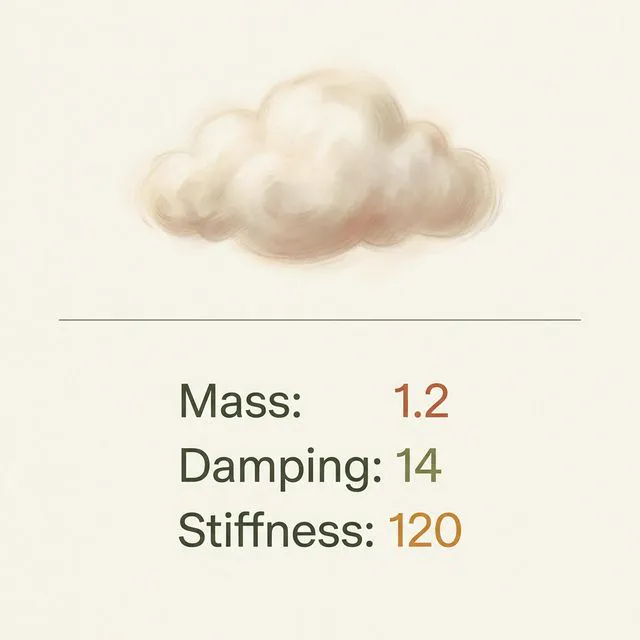
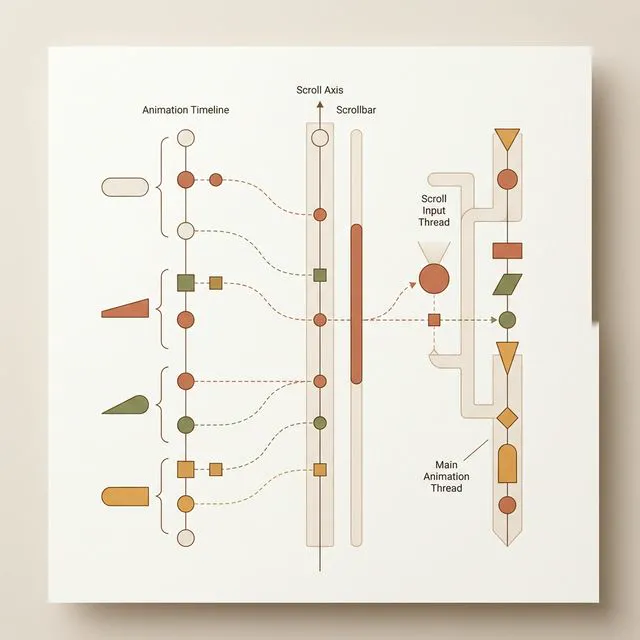
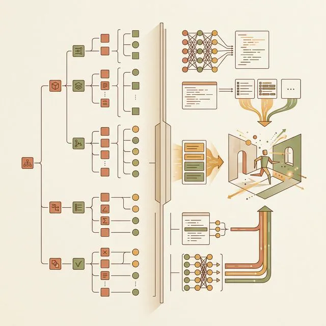
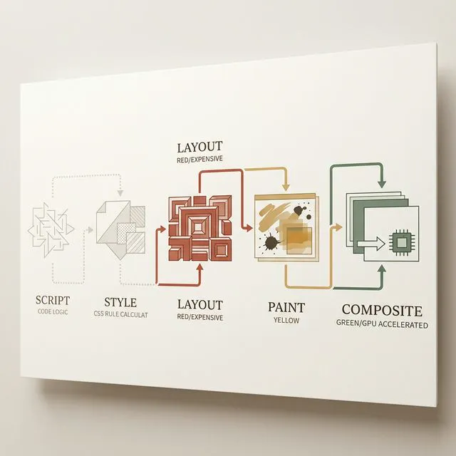
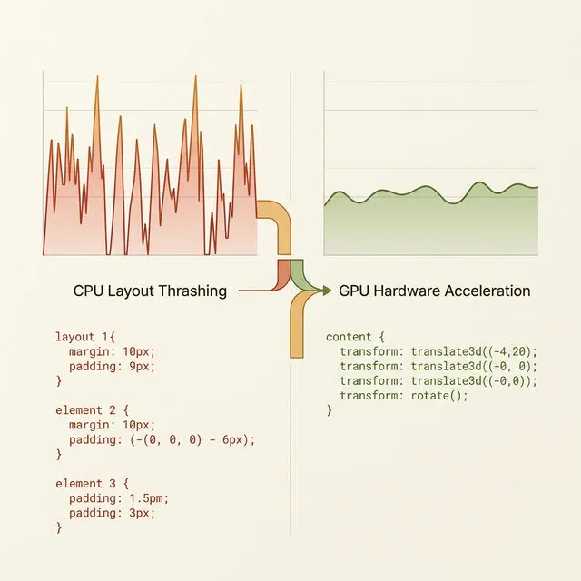
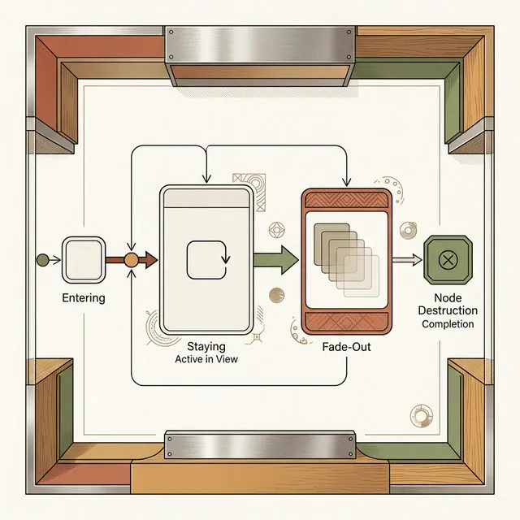
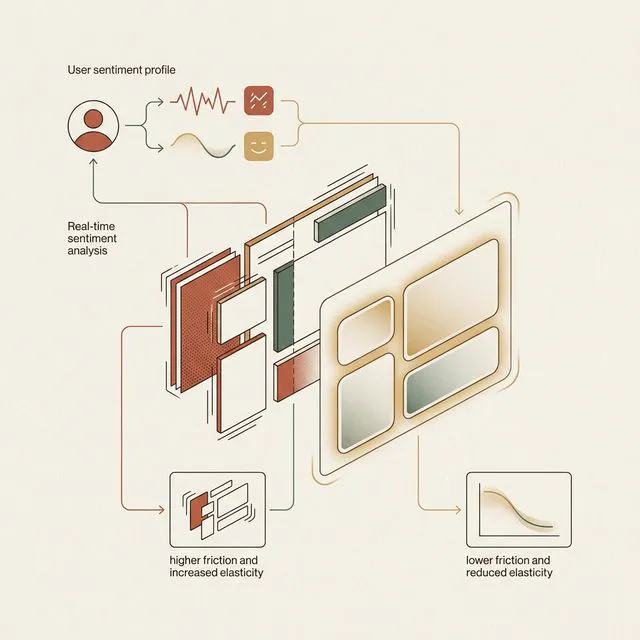
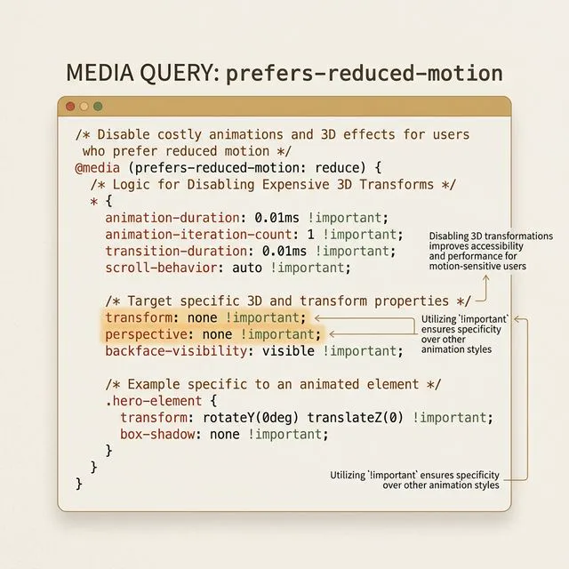

## 模块 3: 讲授(下) — AI 驱动的代码组件级无缝接入流 (约 35 分钟)
<!-- BUDGET: 6300 chars | SLIDES: ≥12 | STATUS: done -->
<!-- MATERIAL_BUDGET: w10-ai-prompt-gsap-workflow, ai-driven-animation-generation, frontend-animation-techniques (≈ 91%) -->

刚才我们彻底解构了什么是好体验的深层土壤，以及那些安抚大脑机制的物理反馈。但大家一定在思考：这些理论听起来非常高深，但当我坐在电脑前，面对 Cursor 或者其他大模型时，我具体该如何让它输出一段能够跑在真实移动端的动效代码？
这就是我们模块 3 要攻克的核心：**AI 驱动条件下的代码组件级无缝接入流**。

> [VISUAL]
> **Slide**: M3-01_The_Handoff_Crisis
> **Layout**: `Split`
> **Scene**: 左侧展示传统工作流的“交付死亡谷”：设计师移交一个沉重的 AE 或 Principle 演示源文件，旁边标明“无法解析的黑盒”；右侧展示 Vibe Coding 时代的全新工作流：设计师直接通过 Prompt 调用 Framer Motion 库，生成带有物理参数的 JSX 代码结构树。
> *   **Asset**: 
> **知识节点**: `w10-ai-prompt-gsap-workflow`

> [STORY TIME]
> **设计交付的死亡谷：从“无法复现”到“代码全管”**
> 过去很多年，交互行业里存在着一道难以逾越的“设计交付死亡谷”。设计师在专业的原型软件里，花费数周时间精心调配出了完美的贝塞尔曲线与物理阻力。但当他们把成果打包交给前端工程师时，通常得到的回复是：“这个效果太复杂了，会导致严重的浏览器掉帧卡顿，我们只能用一个简单的线性淡入替代。”
> 这并非是工程师在推诿。因为传统原型软件导出的常常是视频流或者纯粹的视觉坐标帧系，它们根本不懂得什么是 DOM 的渲染生命周期，不明白什么是 React 框架下的内存回收机制。如果前端手动去用原生 CSS 或者笨重的 JavaScript 重构那些抛物线，往往会导致页面不停地计算局部刷新重绘（Layout Thrashing），最终拖垮整个系统性能。
> 但是，大语言模型与智能编码辅助工具的普及，彻底摧毁了这面叹息之墙。现在的 AI 并非单纯地去复制那一段视觉效果，而是直接越过了中间地带，代替工程师深入到了底层代码库中。它可以顺畅地调用诸如 GSAP、Framer Motion 或者 React Spring 这些久经考验的高性能工业级物理引擎。设计师不再需要低声下气地乞求技术团队实现某个小弹跳，你只需要掌握一套能够精准驱动 AI 算力的语法。只要你会“讲规范”，大模型就能当场为你手撕几百行最严密的组件补间代码。

既然机器可以帮我们写完繁重枯燥的代码片段，那么设计师在新时代的职责就发生了根本性逆转：你不需要掌握代码语法，但你必须精准地向机器传达你的“物理常识意图”。

> [VISUAL]
> **Slide**: M3-02_Prompt_for_Physics
> **Layout**: `Full`
> **Scene**: 一张结构图展示“外行指令”与“内行 Prompt”的区别对比。外行：“让这个按钮弹一下（Make it bouncy）”；内行：“使用弹簧物理模型（Spring），设定质量（Mass）为 1.2，阻尼（Damping）为 14，刚度（Stiffness）限制在 120，实现带有回落余韵的重型物理按下反馈”。
> *   **Asset**: 
> **Search**: `prompt engineering for Framer Motion spring physics properties`
> **知识节点**: `frontend-animation-techniques`

> [TEACHING MOMENT]
> **参数化表达：用物理概念重新构建 Prompt 咒语**
> 在使用大模型协作的时候，最忌讳的就是使用抽象、充满感性歧义的词汇。当你对 Cursor 提出指令“帮我把这个下拉列表的出现做得更生动一点，带有一种类似果冻的感觉”，AI 往往会随机分配一组浮夸且廉价的摇晃代码段落。因为在计算机的底层辞典中，并不存在“果冻感”这个可量化测量的执行阈值。
> 要想驾驭新一代生成式工具，你必须学会使用它们的母语：**物理参数**。
> 以当下 React 生态中最主流的 Framer Motion 引擎为例。这套引擎的核心理念就是抛弃时间维度的主观干预，完全交由牛顿力学公式来驱动界面元素的流转。要想控制它，你需要掌握以下几个核心沟通锚点：
> 1. **阻尼（Damping）**：决定了这个元素在运动中受到多少环境摩擦力。如果你想要一个在太空中真空漂浮的轻灵感，就把阻尼调小，元素在终点处会有数次来回振荡；如果你要模拟厚重金属块砸向泥地的沉闷质感，就需要提高阻尼指数，强迫它干净利落地吸收多余动能。
> 2. **刚度（Stiffness）**：决定了这个元素自身携带的“弹簧拉扯力强度”。想要迅猛干脆的出场，你需要高强度的刚度施加初始张紧力；若需呈现出疲软慵懒的状态，低刚度就是天然的解决方案。
> 3. **质量（Mass）**：这就涉及到屏幕内惯性动量的呈现。改变对象的质量数值不仅能使体积硕大的元素产生起步困难的黏糊观感，更能完美贴合我们前一模块讲述的“重量沉降”原理。
> 当你将这三个维度打包并整合进对 AI 的描述中，诸如“请使用 Framer 的弹簧算法，将模态对话框的刚度设为 300，增加轻微质量使其表现得像一块磁铁被吸附”，这种充满信息量的高级 Prompt 会迫使 AI 直接在后台调取最优质开源代码片段结构，为你提供百分之百还原你大脑中那个场景的工程解法。

除了单个元素的物理质感模拟，AI 更为强大的深层威力，体现在对全局复杂状态的掌控上排布能力上。

> [VISUAL]
> **Slide**: M3-02c_ScrollTrigger_Architecture
> **Layout**: `Flow`
> **Scene**: 滚动事件降维拦截架构图。左侧是传统的 `window.onscroll` 事件直接冲击并且锁死主线程的混乱线团；右侧则是现代库通过时间轴预计算截断监听，将用户的滚动位移比例安全转化为补间动画 timeline 进而避免管线阻塞的干净防波堤。
> *   **Asset**: 
> **知识节点**: `frontend-animation-techniques`

> [TEACHING MOMENT]
> **滚动空间的魔法：ScrollTrigger 与随动渲染的算力深潜**
> 当我们攻克了单个按钮的物理回弹后，整个业务级应用的另一座高耸技术高峰便横亘在我们眼前：基于用户滚动行为的随动型页面组态更迭（Scroll-driven Animation）。
> 大家在浏览苹果官网介绍最新旗舰移动设备硬件的特性详情展示页时，一定都被那种恢弘大气的转场效果深深折服。在那些页面上，你向下滑动滚轮的操作不再是简单地把死板的文字图层往上生拉硬拽拉扯走。你的每一次微小滚动，都可能导致画面中心的 3D 渲染立体模型发生解体分散拆解，或者触发后方多层次的图文错落有致地产生多段视差漂浮位移。这不仅让用户获得了一种“掌控局势发展”的高端操纵反馈，更是在体验端彻底消磨了长图文阅读带来的视差疲劳枯燥感。
> 但这种华丽的视觉飨宴在传统开发体制内，简直是前端性能部门的超级连环噩梦。为了实现滚动和模型变化的精确绑定校准，老一辈的程序员需要持续在浏览器运行中长期开启并挂载 `window.onscroll` 这个系统级原生事件侦听机制接口监听器。一旦用户快速甩拽页面，主线程内堆积如山的几万次坐标计算中断回调指令会彻底锁死内存引擎防线，引发可怕的“画面撕裂”与触控失效断电级卡顿现象。
> 如今的 AI 并不会让你去走这趟毁灭体验的旧时代雷区，它有着自己专属的王牌解题方案。如果你在需求框中写出：“请实现一个基于鼠标滚动进度改变屏幕内透明度与层级深度特性的过渡效果，务必确保硬件资源满帧运行”，大比例情况下，Cursor 或其他智能结对编程助手会立刻为你引入当今工业界稳如磐石的权威级解决方案——**GSAP（GreenSock Animation Platform）及其旗鼓相当的核心插座包 ScrollTrigger**。
> 注意 AI 替你生成的那些高级封装语法词缀参数群组。它会设立清晰的高低标记刻度线标（Markers），把长屏幕划分为几个独立的监听坐标区间（Scroll Zones）。当视口触碰并切入那不可见的阈值红线开关时，它会通过时间轴锁定的 Scrub 参数结构，把你的屏幕鼠标物理轴向位移操作百分比进度，一对一严丝合缝地转换挂载为动画时间轴播放的控制进度条。由于所有的位移算法计算请求都在初始化加载周期提前封装入底层的专门复合层架构系统列队等待之中，这套基于大模型重度调优过的输出模板体系哪怕在设备性能极差的低性能备用安卓终端上，也能输出完全等效的毫不丢帧折柳滑轨般的优雅平缓顺滑。通过这种将滚动事件（Scroll Event）与时间轴（Timeline）彻底绑定的降维打击手段，业界对主线程阻塞的深重恐惧被彻底瓦解，使得复杂视差动画能像普通图片般被廉价大规模部署。

> [VISUAL]
> **Slide**: M3-02B_Lottie_vs_Code
> **Layout**: `Split`
> **Scene**: 左右两屏的底层解析对比剖视图画。左侧挂载一块包含复杂矢量描图路径关键帧的 Lottie/Bodymovin JSON 文件运行原理，旁边标写“定格录制播放器”；右侧展示 AI 书写的原生 CSS `@keyframes` 配合 `transform: translate3d` 硬件图层合成计算网格示意图，标写“像素级实时重绘掌控引擎”。
> *   **Asset**: 
> **知识节点**: `frontend-animation-techniques`

> [STORY TIME]
> **被降解的动画师：Lottie 与原生代码栈的隐秘边界战争**
> 很多设计者会质疑：既然 After Effects 通过 Lottie 插件可以把特效打包成 JSON 文件交付，为什么还要用提示词工程让 AI 生成代码？
> 这触及了一个核心矛盾：**"录制回放"与"活体状态重组"之间的代差**。
> Lottie 动画的本质是一个高密度坐标播放器。烟花放完就停留在预设循环中。它对窗口缩放毫无感知，对用户切出应用后重返无法逆向缓冲，更无法在运行时与系统的深浅模式变量自动同步。
> 而大模型当场生成的原生动画代码，则是一个能自由呼吸、吞吐周边数据的活体组件。它采用相对单位换算，将色彩锚定在 Design Tokens 全局变量池中。一旦环境更迭或内存警告升级，这些代码片段会自动激活降级响应。
> 用 Lottie，你是在播放一张不会变形的录像带。用 Vibe Coding 接驳代码核心，你是在为系统组装一个拥有自主神经反射的仿生器官。

> [VISUAL]
> **Slide**: M3-02b_Lottie_vs_Native
> **Layout**: `Comparison`
> **Scene**: 两列对比表。左列"Lottie JSON"：录制回放、固定循环、漠视窗口变化、无法响应系统主题、文件体积大。右列"AI原生代码"：活体状态机、响应式布局、自动同步Design Tokens、内存警告自动降级、按需渲染。
> *   **Asset**: 
> **知识节点**: `ai-driven-animation-generation`

这张对比表请大家牢记。在你做技术选型的决策时刻，判断标准只有一个：你的动效需要"听话"还是需要"活着"？如果只是一次性播放的品牌开屏动画，Lottie 完全够用。但如果你的组件需要感知环境、响应交互、适配主题——那它必须是扎根在代码生态中的原生活体。

这里需要补充一个常见误区。很多同学认为"原生代码动画"意味着更大的代码体积和更高的维护成本。恰恰相反。当大模型生成一段 Framer Motion 的 `motion.div` 组件时，核心代码往往只有十几行——比一个 Lottie JSON 文件小两个数量级。更关键的是，这十几行代码是**可读、可调、可复用的**。当产品需求发生变化时，你只需要修改一个弹簧阻尼参数，甚至可以直接口语化地对 AI 说“让运动轨迹显得更慵懒一些”，而不是重新打开庞大的 After Effects 软件从头一帧一帧地去导出整个动画序列。这种工作流的代差优势是完全碾压级的。
在团队协作维度上，原生代码动画还有一个隐藏优势：它可以被纳入版本控制系统。每次修改都有明确的提交记录、可精确回滚。而 Lottie JSON 文件在 Git 中是不可读的二进制流——没有人能通过 `git diff` 看出你到底改了哪个关键帧的贝塞尔参数。

再举一个日常开发中非常常见的痛点：模态弹窗的退场动画。在没有 `AnimatePresence` 的时代，当 React 判定弹窗需要关闭时，DOM 节点会被立刻销毁——快到连一帧退场动画都来不及播放。结果就是弹窗"闪灭"，用户体验极其刺耳。
现在，通过 Prompt 指定"请在弹窗关闭时添加淡出加缩放退场动画"，大模型会自动套用 `AnimatePresence` 包裹组件。它拦截了 React 的卸载过程，在 DOM 被真正销毁前插入一个时间窗口，让退场动画完整播放结束后才触发节点清理。这个看不见的等待机制，就是"优雅告别"和"粗暴消失"之间的分水岭。

这种退场拦截机制的应用范围远不止弹窗。想想页面路由切换的场景：当用户从商品详情页返回列表页时，如果你能让详情页的内容以一种"收缩回卡片"的反向动画优雅退场，然后列表页以"扩展自卡片"的正向动画接管画面——整个切换过程就变成了一段逻辑自洽的空间叙事。用户在潜意识中建立了"详情页藏在卡片里面"的空间模型，从此不再害怕在页面之间迷失方向。

> [TEACHING MOMENT]
> **解码性能悬崖：硬件加速与复合属性图层的数字隔离网**
> 作为掌控应用质感体验的交互导演，即便不写代码，你也必须明白一个会让动画满盘皆输的灾难原理：**Layout Thrashing**，布局重绘风暴。

> [VISUAL]
> **Slide**: M3-03b_Rendering_Pipeline
> **Layout**: `Flow`
> **Scene**: 浏览器渲染管线五阶段流程图，从左到右：Script(JS执行) → Style(样式计算) → Layout(排版，标红加粗) → Paint(绘制，标黄) → Composite(合成，标绿)。Layout阶段有一个向下的箭头指向"触发属性：margin, width, height, top"并标注"🔴 最昂贵"；Composite阶段指向"触发属性：transform, opacity"并标注"🟢 GPU加速"。
> *   **Asset**: 
> **知识节点**: `frontend-animation-techniques`

> 浏览器渲染 DOM 节点时，必须走完这条流水线：加载结构 → 计算样式 → Layout 排版 → Paint 绘制 → Composite 合成。
> 外行所产出的前端补间脚本常犯一种致命错误：让方块滑动时用 `margin-left: 100px` 或 `width: 50%` 来执行。每次修改边距尺寸，都会触发最深层的 Layout 重排，整个页面的其它元素跟着大挪移。CPU 在 16.6 毫秒内疯狂重算，发热掉帧如影随形。
> 而真正优秀的工程师——或者被你用高阶指令约束后的 AI 助手——绝不触碰重排禁区。它会把方块推送到专属的 GPU 图层上，只操作 `transform: translateX(100px)` 或 `opacity: 0.5` 这类合成层安全通道内的参数。
> 这种利用硬件独立车道绕过全局堵车的图层隔离策略，就是你面对大模型时确保产出百分百顺滑成果的核心口诀。

让我给大家一个具体的审查清单。当你拿到从模型提取的代码构建块后，打开浏览器 DevTools 的 Layers 面板，检查被动画化的元素是否被提升到了独立的合成层。如果一个正在执行位移动画的方块依然共享在主文档层中，它的每一帧移动都会连带整个页面一起重绘。
解决方案是在 CSS 中添加 `will-change: transform` 属性，提前告知浏览器"这个元素即将发生变化"。浏览器会为它创建一个独立的 GPU 纹理缓存。但请注意一个陷阱：不要对页面上所有元素都加 `will-change`。每一个独立合成层都会消耗显存。在低端手机上，过多的合成层反而会导致内存溢出和更严重的卡顿。正确的做法是只对"正在动画中"的元素添加这个属性，动画结束后立刻移除。

> [VISUAL]
> **Slide**: M3-04b_Transform_vs_Margin
> **Layout**: `Comparison`
> **Scene**: 左右对比。左侧"危险操作"：代码 `margin-left: 100px`，下方显示 Chrome DevTools 性能面板中大量红色 Layout 重排条，帧率跌至 15fps。右侧"安全操作"：代码 `transform: translateX(100px)`，下方性能面板绿色一片，帧率稳定 60fps。
> *   **Asset**: 
> **知识节点**: `frontend-animation-techniques`

这张图就是你和大模型协作时的底线红线图。左边的代码让 CPU 每帧都在重新计算整个页面的几何布局，右边的代码让 GPU 在独立图层上轻松完成位移。性能差距可以达到十倍以上。下次当你审查智能体交接的动态源码时，第一件事就是搜索 `margin`、`width`、`height`、`top`、`left` 这些关键词——如果它们出现在动画属性中，立刻要求重新生成。

> [VISUAL]
> **Slide**: M3-03_State_Machine_Animation
> **Layout**: `Split`
> **Scene**: 左侧展示初级开发经常遗漏的缺陷场景：一个抽屉菜单在用户点击关闭时毫无退场动画，硬生生直接消失断裂；右侧展示 AI 大模型自动补齐的 `AnimatePresence` 生命周期状态机控制流程结构截帧，展示完整的退出生命节点拦截。
> *   **Asset**: 
> **知识节点**: `ai-driven-animation-generation`

> [STORY TIME]
> **被遗忘的告别：生命周期与状态机的数字兜底防护**
> 我们经常发现一些应用在展现提示框时，进入的动画顺滑流畅。但一旦我们点击隐藏按钮，整个框却如同被凭空截断一般，零毫秒立刻闪现消失。这种进入有前戏、退出毫无防备粗暴裁决的体验，在前端研发管线中被称为“丢失了卸载生命周期（Unmount Lifecycle Missing）”。
> 这是因为现代前端框架对于垃圾回收和节点擦除有着非常干脆的逻辑判定手段，一旦状态切换，DOM 节点将无情销毁，根本不给那些正在播放残余动画的底层代码留下喘息表演的时间。
> 纯手写去处理复杂的异步卸载回调延迟是一件让技术团队十分抓狂的繁重工程负担。但现在，有了智能大模型的介入控制，情况发生了逆转。优秀的提示词结构可以明确指令：“请你务必加入对退出状态（Exit State）的拦截器处理”。
> 在接到指令后，大模型会熟练地套用类似于 `AnimatePresence` 这样的状态保持包装组件结构，自动替你编写并规划好了所有的卸载前预留时间窗口计算方程。它会自动让弹窗不是突然崩溃断电，而是反向走完一次带有透明度淡出变暗并且按照既定轨迹收缩比例滑出的优美谢幕曲。
> 这种全局状态网络流的自动代码构建覆盖护城河能力，真正让大家脱离了单一元素的死磕，站在上帝视角的维度俯视整座庞大数据产品架构体系的平稳更迭运转。它不仅解决了一个按钮该怎么弹跳的问题，它彻底扫清了在复杂信息链路跳转状态之中，那些常常引发毁灭性系统感官切割割裂问题的隐蔽漏洞缺陷。

> [VISUAL]
> **Slide**: M3-04_Generative_UI_Motion
> **Layout**: `Full`
> **Scene**: 远期视野：生成式 UI 动效系统架构原理图。展示一个大语言模型不光生成文案，还根据文本的情绪分析结论（如系统报错判定为焦急情绪），实时向底层的 CSS/JS 参数端口发送剧烈震动相关的变量指令，实现动效本身的 AI 生成化渲染调整。
> *   **Asset**: 
> **知识节点**: `ai-driven-animation-generation`

> [TEACHING MOMENT]
> **迈向生成式微交互（Generative Motion）：情绪与算法的同频共振**
> 最后，我们要把目光着眼于更遥远的未来边界。目前的 Vibe Coding 工作流，大模型扮演的更多是一位“高级翻译接线员”的角色：它听懂你的自然语言要求，将其翻译并锁定成精确的物理运动代码框架。你的产品在下发给用户之前，它的交互规律和运动参数就已经被焊死并在部署那一刻定型了。
> 但前沿领域的巨头们正在积极试验一种更具有颠覆意义的物种：具有自我繁殖演变能力的 Generative UI（生成式应用界面框架）。
> 在那套前瞻性的体系内，动效不再是一段预先写好的静态代码执行块。当我们在屏幕输入一段温和友好的聊天反馈文本时，后台的人工智能系统会自动解析这段文字的自然语境情绪色调。如果判定内容是积极安抚的，系统会利用自身挂载的动画参数接口，当场即时生成一组节奏松弛、色调明快并且向四周呈现平滑柔和阻尼扩展开来的缓动光晕代码下发端渲染引擎。
> 如果面对的是严肃并且充满高危警示信息的警告类通知，同一套大语言模型又会瞬间重制出一套高频急促并且带有边缘锯齿震荡特征的刚性位移参数序列指令。
> 在那样不仅文案由 AI 拟定提供，甚至连同整个交互流反馈体验载体介质形态都会随着情景上下文状态智能更迭演算的数字生态网络中。每一个应用分身都在与使用者上演一场永远无法被穷举穷尽的、由底层算力支撑的即兴华尔兹。

> [VISUAL]
> **Slide**: M3-05b_Generative_UI_Architecture
> **Layout**: `Flow`
> **Scene**: 生成式 UI 动效系统链路图。从左至右：用户输入文本 → NLP情绪分析引擎（标注"积极/警告/紧急"三个输出） → 动画参数生成器（输出缓动曲线类型、振幅、频率） → 前端渲染引擎实时应用。链路下方标注"Runtime Generation, Not Pre-built"。
> *   **Asset**: 
> **知识节点**: `ai-driven-animation-generation`

想象这样一个场景：你在客服对话框里输入"我的订单丢失了，已经等了三天！"后台 AI 解析到愤怒情绪，立刻向动画引擎发送高频震荡参数。于是整个对话界面的边框出现急促的警示红色脉冲，配合一个紧急优先处理的标签弹入。你的情绪被系统读懂了——不是通过一句客套的"请稍候"，而是通过界面本身的动态变化。这就是生成式微交互的终极愿景。在这套科幻却即将落地的闭环链条里，数字系统真正实现了从“被动响应”到“主动共情”的升维跨越。屏幕将变成能敏锐捕捉心跳的电子视网膜，大模型通过分析打字力度与语境，把情绪指纹无缝映射到每一个按钮的形变与阴影深浅之中。

> [TEACHING MOMENT]
> **包容性体系设计：前庭敏感与自适应降级防护网（Graceful Degradation）**
> 我们在前文讨论了诸多炫目的物理阻尼和复杂的视差滚动魔法。但是，作为立志要让十亿级别人群顺畅使用的数字工匠，我们心中必须永远高悬一面名为“包容性（Accessibility & Inclusivity）”的体验警钟。
> 在医学临床范畴中，有一群患有前庭神经系统敏感（Vestibular Disorders）的特殊用户群体。对于健康人而言可能只是感觉流畅酷炫的全局 Z 轴深度纵深缩放推进（Zoom-in）、跨度巨大的视差错位滚动（Parallax），在他们的视觉神经和脑海里，无异于被迫乘坐了一次没有系安全带的疯狂过山车，会直接引发由于感官剥夺或错位导致的严重眩晕、定向障碍甚至生理性的恶心反胃。
> 这绝不是危言耸听。在 iOS7 第一批彻底应用了底层物理动效库强制推陈出新的时候，苹果公司就收到了海量的晕动症（Motion Sickness）医疗指控。
> 作为专业架构师，你该如何在这两者之间取得平衡？你该如何在享受高级动效带来的物理质感加成的同时，又精准地保护那些生理相对脆弱的同胞用户？
> 答案是让 AI 替你强制架设一套称为 **平稳降级（Graceful Degradation）** 的底层防御网管线。
> 当你在和工具协作编写某一个全局大屏过场切换组件函数时，你必须在 Prompt 中非常严肃且专业地附加一条硬性工程纪律指令：“请为当前所有的复杂动效添加 `prefers-reduced-motion` 媒体查询无障碍兼容判断隔离分支。”

> [VISUAL]
> **Slide**: M3-06_Reduced_Motion_Code
> **Layout**: `Split`
> **Scene**: 展示一段 CSS 媒体查询代码片段。上半部是 `@media (prefers-reduced-motion: reduce)` 内部将所有 `animation-duration` 和 `transition-duration` 重置为 `0.01ms` 的规则；下半部是 React 组件中使用 `useReducedMotion()` 自定义钩子根据返回值切换动画模式的逻辑判断代码。
> *   **Asset**: 
> **知识节点**: `frontend-animation-techniques`

正如这段高亮的代码截片所展示的那样，这就是为弱势群体织就的那道隐形救命安全网。当这段带有系统底层权限侦听逻辑的分支被大模型毫不遗漏地强制植入到你的组件渲染树深处之后，宿主智能设备的操作系统内核只要检测到当前用机的主人开启了全局的"减弱动态效果"求生开关，那么页面流层中原本即将肆意上演的所有极为粗暴的大跨度复杂物理冲击位移，都会在微秒间被极其冷酷地静默物理降维抹杀，就地替换为最温和且没有任何空间眩晕压迫感的透明度渐变交融。普通的视力健全用户甚至很长一段时间都不会察觉到少了一块什么东西，但那些正饱受晕动症恶心折磨的障碍群体的脆弱前庭神经海马体，绝对会在内心深处由衷地为你这份不可见的伟大同理心和极度克制的代码操守发报致谢。

> [VISUAL]
> **Slide**: M3-05_Accessible_Motion
> **Layout**: `Split`
> **Scene**: 左侧展示普通用户的设备系统设置页面，显示“减弱动态效果”处于关闭状态，对应的 App 界面展示欢快且带有物理阻尼的深层弹跳卡片；右侧展示特殊需求用户的设备系统中，“Accessibility -> 减弱动态效果（Reduce Motion）”处于开启激活动态，此时 App 界面自动屏蔽了所有 X/Y 轴大跨度冲击位移，直接降维成温和普通的透明度渐隐变色交融。
> *   **Asset**: 
> **知识节点**: `frontend-animation-techniques`

> [STORY TIME]
> **被拯救的旋转晕眩：`prefers-reduced-motion` 的沉默使命**
> 大模型在接收到这条指令后，行为模式会发生质变。
> 它会自动拉取操作系统的无障碍权限接口。在生成的代码中，所有具有前庭攻击性的 `transform: scale` 或 `translate3d` 控制变量，都会被包裹在一层严密的逻辑监听条件中。这就相当于在狂暴的数字风暴外围建立了一道温和的分流屏障，确保每一次运动计算既能保持华丽的弹性，又绝对不会突破使用者的生理承受极值。
> 健康用户拿着 120Hz 高端机刷资讯时，代码全功率输出绚烂的物理抛物线视觉盛宴。
> 而当一位患有晕动症的老人，或者一位开启了极限省电模式的旅行者，在系统辅助功能中勾选了"减弱动态效果"按钮——真正的关怀奇迹发生了。
> 你通过自然语言驱使 AI 部署的那套判断函数，会在微秒间捕获这个优先级豁免指令。它不再执行重型缩放弹性对撞，而是果断触发降级，把所有物理坐标位移直接降维为温和的全屏透明度交叉融合。
> 这看似微末的代码分支处理，不仅展示了深厚的技术功底，更在冷酷的服务器逻辑之下传达了设计者的道德温度。利用 AI 堆砌炫目参数并不困难，真正困难的是，你懂得在算力狂飙的极限边缘依然保持克制，用无形的代码托住那些容易被数字浪潮抛弃的边缘群体。
> 这份架构在布尔逻辑之上的人文关怀防护屏障，才是引领大家跨过技术产品生死验证大考的核心心法。
大家刚才听到的这些内容，并不仅停留在纸面上被当做视野拓展的论文来阅读，它们即将被真实地转化为屏幕上可以被敲击检验的运行模块集合群落。
理论学习的时间到此截止。在下一个专门定制打造的实践操练沙盘演替环节中，你们将抛开幻灯片讲义，真正地与代码大模型发起全面对话。大家会清楚观察到那些存在于大洋彼岸云端节点的算力，是如何理解我们的指令物理重力模型需求，又是如何神奇般地把几百行饱含高级特性的框架代码准确拼接组装部署到各位屏幕之中的。准备好，我们将正式拥抱工程狂潮的洗礼。
