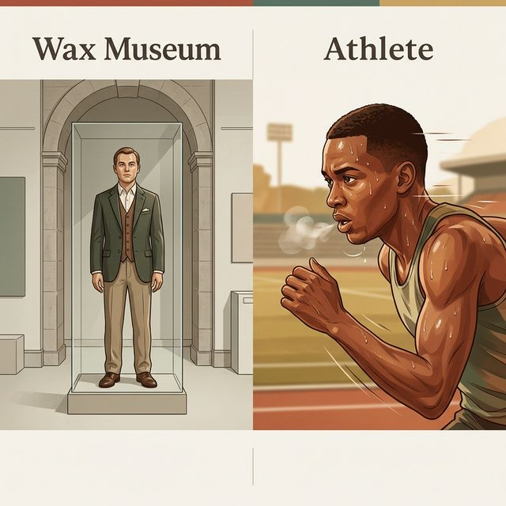
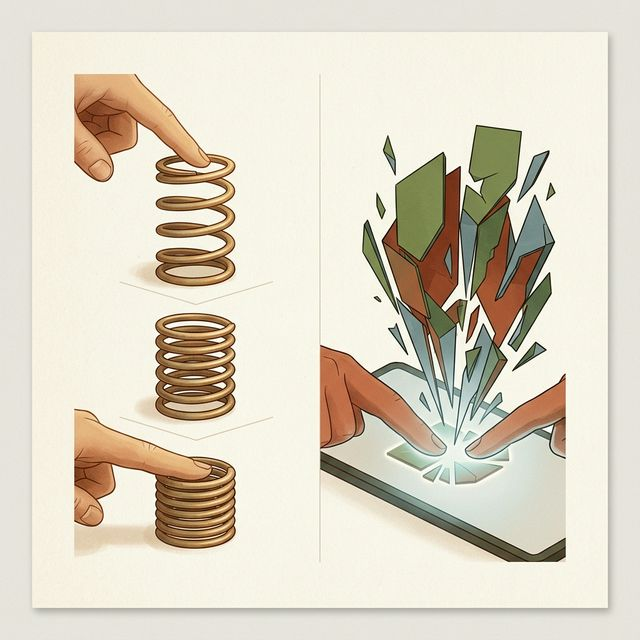
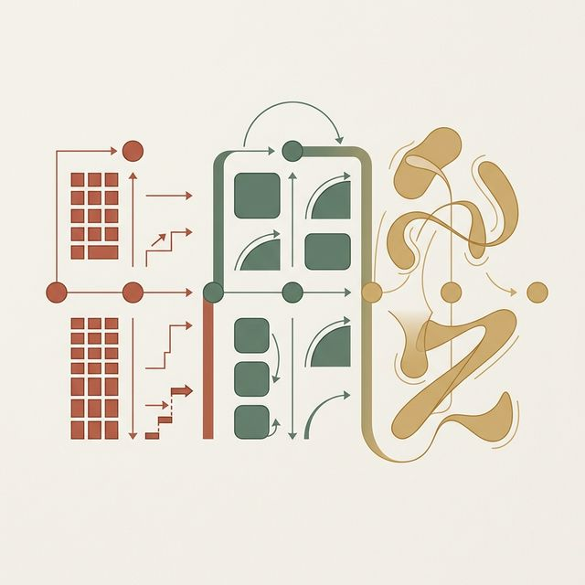
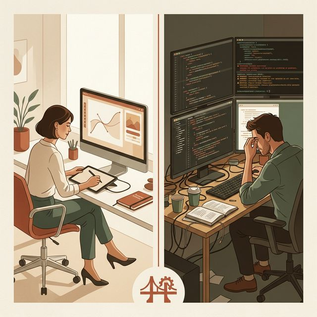
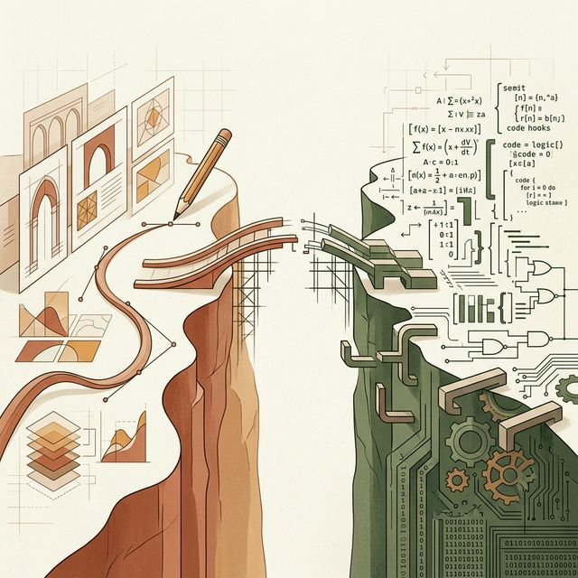
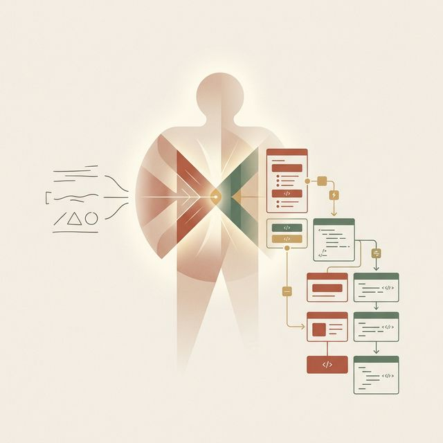
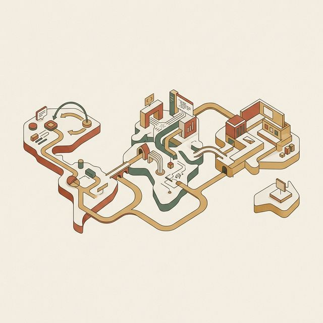

## 模块 1: 复习与导入 — 静态界面 vs 动态生命的触觉差异 (约 20 分钟)
<!-- BUDGET: 3600 chars | SLIDES: ≥7 | STATUS: done -->
<!-- MATERIAL_BUDGET: vibe-coding-human-ai-collaboration, about-face-ch01-digital-fail (≈ 94%) -->

<!-- STAGE NOTE: 复习/导入 (支撑 能力1 回链) -->
大家好，欢迎来到本学期的第十周的旅程。
上节课，我们经历了一场震撼的洗礼。我们用 Vibe Coding 工作流，结合你们亲手制定的 Design Tokens 词典，成功利用 AI 在极短的时间内生成了精美、严丝合缝的高保真页面壳层。
许多同学看着屏幕上那个光鲜亮丽的页面，长舒了一口气，觉得：“太棒了，我的 App 已经完成了！”
但是，就在前天，我让大家把生成的原型发给室友去试用，结果如何？大量的反馈是：“这东西看起来好像是一个高档的软件，但是点按的时候总感觉像是个死物。”或者直接抱怨：“我到底有没有把这个商品成功加进购物车？完全没有知觉。”
这就是今天我们要直面并解决的危险的断层盲区——**Static Illusion**，静态幻觉。这就仿佛为数字产品套上了一件华丽却毫无神经反射的冰冷外壳。

> [VISUAL]
> **Slide**: M1-01_Static_Illusion
> **Layout**: `Image`
> **Scene**: 一张具有冲击力的对比图：左侧是一个非常精美的蜡像馆人物，逼真但毫无生气；右侧是一个真实正在呼吸和流汗的运动员特写。
> *   **Asset**: 
> **Search**: `wax figure vs real human vitality breathing comparison`
> **知识节点**: `vibe-coding-human-ai-collaboration`

> [STORY TIME]
> **蜡像馆的死寂之城：当设计只有“形”没有“气”**
> 我们现在手里拿着的那个精美的 Vibe 生成原型，就如同一座华丽的杜莎夫人蜡像馆。这里的每一个按钮都雕刻得无比精准（这要归功于你们优秀的 Tokens 管控），每一片阴影都呈现出最高级别的物理拟真。但当真实的用户走进去，试图和这里互动时，他们感到的是一种深重的恐惧感和死寂感。
> 为什么？因为当他们的大脑发出指令、手指按下那个紫色的主要按钮时，按钮没有产生任何下陷的物理形变，没有发生任何色阶的降维暗化反馈。它只是生硬地、没有任何过渡地在 0 毫秒之内切走了一个界面。
> 这种没有任何时间流转的突触断章（Synaptic Disconnect），强烈地违背了人类经历了三百万年进化的现实世界物理反馈直觉！在现实中，你推开一扇门，门会因为铰链的阻力而缓慢加速；你扔下一块石头，石头会经历重力加速度并在接触地面时产生微小的弹跳。如果真实世界像你们现在的原型那样——按下开关，宇宙突然全黑且毫无过程过渡——人类会直接陷入疯狂惊恐。

> [VISUAL]
> **Slide**: M1-02_Digital_Friction_Abrupt
> **Layout**: `Split`
> **Scene**: 左侧标注“人类现实预期”，配图为手指按下弹簧，弹簧产生渐进式下陷回弹律动；右侧标注“零帧突变灾难”，配图为手指点按屏幕的一个像素块，画面毫无预兆瞬间破裂重组成另一个完全陌生的界面框，充满机械感剪接的生硬与冰冷。
> *   **Asset**: 
> **知识节点**: `about-face-ch01-digital-fail`

在《About Face 4》中提到过，数字产品的“恶劣行为”很多时候并非界面难看，而是它忽视了人们对于空间感和因果律的需求。
过去我们为了追求高效和计算资源的节约，常常剥夺了这个反馈流。这种把交互界面单纯视为静态页面快速堆叠跳转的历史遗留思路，正在今天的产品战壕中造成海量的**Mental Friction**，心智摩擦。
你们费尽心思用敏捷框架找痛点，用 Figma 设置参数，用 AI 造壳子，但如果就在这发生指尖触碰操作的最关键的一微秒里，让用户的物理预期全面落空，那个曾经努力建造的“信任感高品质品牌大厦”就会在一瞬间全盘土崩瓦解！

> [VISUAL]
> **Slide**: M1-03_Evolution_of_Motion
> **Layout**: `Timeline`
> **Scene**: UI 动效的救赎之路编年史：早期 jQuery 切图年代 -> iOS 7 及 Material Design 的物理拟真动效普及 -> 今天 2025 AI 直接生成参数化高级弹性曲线 (Framer Motion 时代)。
> *   **Asset**: 
> **知识节点**: `vibe-coding-human-ai-collaboration`

> [STORY TIME]
> **抛弃皮囊，留下灵魂：iOS 7 赌博式的激进转轨**
> 要理解动效为何如此重要，我们必须回顾人类数字设计史上最著名的一场“谋杀案”——2013年苹果发布的 iOS 7。在之前的六年里，全世界的 UI 设计师都在疯狂沉迷于“拟物化（Skeuomorphism）”。大家在像素级别死磕真皮缝线、金属拉丝和玻璃反光。
> 但在 iOS 7，Jony Ive 挥舞着主义的屠刀，在一个决绝的深夜里，把所有的真皮材质和抛光高光全部砍得一干二净。全世界的设计师在第二天醒来时看着那些单薄、平面的甚至有些刺眼的色块，集体爆发了惊恐——“这不就是一张纸吗？用户怎么知道可以按下去？”
> 苹果的答案是：**用‘动作（Motion）’代替‘皮肤’来建立真实感。**
> 当你解锁 iOS 7 时，那一排排图标不是从天上突然掉下来，而是从屏幕中央匀速地飞溅散开；当你打开一个文件夹，背景会瞬间模糊并产生一种深度的 Z 轴物理视差漂浮感。苹果用庞大的底层图形演算资源，在全球首次证明了一个颠覆性的交互真理：**只要一个元素的“移动规律”和“弹性惯性”完全符合牛顿经典现实物理定律，哪怕它只是一张毫无质感的白纸方块，人类的大脑也会瞬间且毫无保留地相信它是一个真实且拥有重量的物理客观实体。**

在这个时代变迁中，动效从“装饰品”被正式提拔为了与色彩、排版平起平坐的“建构材料”。

> [TEACHING MOMENT]
> **空间隐喻（Spatial Metaphors）的神奇脑力补偿网**
> 为什么一个简单的方向滑动，就能极大程度降低用户的脑力认知负荷？这源于“空间隐喻”。
> 想象一下，当你点击一个音乐播放器的专辑封面，如果那个播放卡片是从屏幕最底部缓缓且坚实地向上推起，严丝合缝地覆盖了你原有所在的列表区域；这看似只是一段时长仅为 300 毫秒的微小的一段上升进场补间动画而已。但这 300 毫秒在人类的大脑皮层深处，已经悄无声息地构筑起了一座庞大、清晰且坚固无比的 3D 虚拟空间坐标体系。
> 你的大脑由于观察到了它的“起点（底部）”和“终点（覆盖顶部）”，于是大脑自动做出了一个毫无疑问的确实验证推论：既然它刚才因为被召唤而从下面爬上来覆盖了我，那么我只要用手指捏住它的顶部边缘狠狠地向下一划，它就理所当然并且必然地会原路返回跌落回那个幽暗的深渊里去，从而让我重新看到我原来的商品列表。
> 如果没有这段丝滑的推入进场动效呢？如果这张播放卡片是“零帧闪现（Zero-frame Teleport）”突然毫无征兆地强行覆盖在你眼前呢？你的大脑将彻底懵掉：“我是谁？我在哪？我是怎么来到这个鬼地方的？我刚才正在看的那张列表去哪里了？”在这个惊恐的瞬间，用户唯一的绝望选择，就是去疯狂寻找那个位于左上角的、细小而难点的“后退（Back）”按钮。
> 所以，动效从来不是为了所谓的花哨和炫目！**它是在用隐秘而温柔的方式，为用户在这个漆黑且危机四伏的数字虚空迷宫里，不断沿途洒下一颗颗发光的面包屑，帮助他们清晰地在脑海中描绘出这张浩瀚庞杂的数字体系建筑空间导航地图。**

然而，在此之前，即便是最顶级的交互架构师，也面临着一道叹息之墙。把空间隐喻构思出来是一回事，让它在浏览器里流畅地跑满 60 帧却是一场深重的工程灾难。

> [VISUAL]
> **Slide**: M1-04_The_Motion_Engineering_Barrier
> **Layout**: `Split`
> **Scene**: 两张形成惨烈残酷鲜明对比的工作台照片。左侧是一位交互体验设计师在优雅华丽、参数齐全且直观的 Principle/AE 动效软件时间轴面前游刃有余地调节着优美的柔和呼吸缓动曲线；旁边配字“设计环境的诗意岁月静好”。右侧则是一位疲惫、眼窝深陷的前端底层重构开发工程师面对着一块密密麻麻充斥着如 `requestAnimationFrame` 递归、错综复杂的恐怖的 DOM 节点重绘状态锁、以及一段长达三百行并且混杂了各种不知名第三方库相互绞杀冲突报错的陈旧冗余胶水屎山补丁级联钩子代码段；旁边配字“工程实现的无间炼狱炼药锅”。
> *   **Asset**: 
> **知识节点**: `vibe-coding-human-ai-collaboration`

> [LIFE CONNECT]
> **被扼杀在图纸上的生命火花**
> 看看这张图左右两边截然不同的工作生态。左侧的设计师在 AE 优雅明亮的时间轴面板里尽情挥洒创意，调节着柔和的呼吸曲线；而右侧那位眼窝深陷的前端老哥，却要直面终端里密密麻麻的 `requestAnimationFrame` 递归调用和各种第三方库冲突报错形成的重构屎山。当你兴冲冲地拿着这无懈可击的录屏去找他时，他往往只能瞥一眼屏幕，疲惫地甩出五个字："实现不了，砍。"
> 你觉得他在故意刁难。但传统前端的主线程渲染机制确实脆弱不堪。在命令式代码年代，想把左侧那条唯美的非线性贝塞尔曲线转化为右侧庞杂的纯物理参数坐标集合，开发者不仅需要极高的高等数学功底去计算动态极限张力与摩擦反弹系数，还要提心吊胆地提防 React 框架深处可能引发页面灾难性掉帧崩溃的恐怖内存泄漏陷阱。
> 
> > [TECH NOTE]
> > **前端炼狱：Layout Thrashing 与 GPU 层断裂**
> > 网页动画为何容易卡顿？根源在浏览器渲染管线：HTML 解析 → 样式计算 → Layout 排版 → Paint 绘制 → Composite 合成。当代码每 `16.6` 毫秒修改 `margin-left` 或 `width`，就会触发管线中最昂贵的 Layout 重排。
> > 整个页面陷入布局抖动，CPU 过载、设备发热、电池崩溃。正确做法是调用 GPU 层面的 `transform: translate3d` 进行硬件加速合成渲染，绕开 CPU 重绘。但这对过去只会切图的页面工程师而言，无异于天书。
> 

> [VISUAL]
> **Slide**: M1-04b_Design_Dev_Chasm
> **Layout**: `Split`
> **Scene**: 左侧"设计师的世界"：After Effects 时间轴编辑器中一段完美的弹性阻尼曲线录屏。右侧"开发者的世界"：满屏密密麻麻的三角函数、贝塞尔参数和 requestAnimationFrame 回调代码。中间是一道标注"实现门槛深渊"的巨大裂缝。
> *   **Asset**: 
> **知识节点**: `vibe-coding-human-ai-collaboration`

这道裂缝就是过去十年里无数精美动效胎死腹中的根源。设计师在 AE 里把动效调到完美，但开发者面对的是另一个宇宙——他要用纯数学把每一帧的坐标、速度、加速度手动计算出来。两个工种之间的沟通成本，往往比实现本身还高。而 Vibe Coding 工作流做的事情，就是用一段自然语言直接跨越这道深渊。

这种设计与开发之间的鸿沟在过去造成了一个系统性灾难：大量的动效方案在交接环节被彻底阉割。设计师在评审会上信誓旦旦地展示着 AE 里完美的原型录屏，开发者在台下默默打开计算器估算工时——然后在项目排期表上给这个需求打上一个红色的"P3 低优先级"标签。三个迭代周期后，这个精心设计的微交互悄然从需求池中消失，没有人再提起它。
但现在的工作流完全不同。当设计师可以用一段 Prompt 在三十秒内获得可运行的动效代码时，交接环节本身就被消灭了。设计师不再需要写动效交接文档、不需要开会解释贝塞尔参数的含义、不需要反复对齐"这个弹跳应该再软一点"这种语焉不详的感性沟通。代码就是最终交付物，运行效果就是唯一的验收标准。

这意味着我们这门课教给大家的核心能力，不是"学会写动画代码"——那是大模型的工作。你们要掌握的是**描述动效的物理语言**：你能不能用"阻尼系数""弹簧刚度""缓动函数"这些精确的量纲词汇，把脑海中的动态画面转译成 AI 能理解的结构化指令？这种"物理直觉翻译能力"，才是 Vibe Coding 时代交互设计师最稀缺的核心竞争力。这种跨越修辞与算法边界的复合素养，将让你在未来的智能工作流中，牢牢掌握产品体验的主驾位，彻底摆脱从前那种受制于他人开发排期的被动命运。

> 为了给一个点赞按钮加上两秒钟弹性呼吸感，团队要付出几百行胶水代码。投入产出比严重畸形，直接锁死了一个时代的体验上限。
> 实现成本太高，所以"全盘砍掉"。全网 90% 的产品只能用生硬的瞬切闪现，或枯燥的线性淡入淡出来敷衍了事。
但今天，Vibe Coding 工作流直接用重型火力炸毁了这堵叹息之墙。

> [VISUAL]
> **Slide**: M1-05_AI_Motion_Democratization
> **Layout**: `Image`
> **Scene**: 展示一张光辉满屏幕的界面：在一块终端黑框里，人类仅仅用自然语言输入“添加一个带物理弹性的卡片入场动画，延迟0.3秒”，系统便瞬间自动召唤并写满了一大段包含 Framer Motion 复杂 `spring` 阻尼算法核心参数组件代码。
> *   **Asset**: 
> **知识节点**: `vibe-coding-human-ai-collaboration`

这才是这门课程在这个时代最大的红利。
现在，Framer Motion 和 React Spring 这类物理反弹引擎的全部参数字典和调优经验，已经被完整封存在 v0、Cursor 等大模型的训练记忆中。
规则彻底改写了。你不需要研究微积分，不需要记忆 API 钩子的挂载方式。你只需要扮演一个**懂物理常识的产品导演**——用结构化的 Prompt 描述物品的重量和拉扯感，AI 在三秒内就能生成以往前端工程师需要写两天的底层物理模拟代码。

今天这堂课，我们要为那座死气沉沉的蜡像馆注入一口名为"气韵生动"的真气。让你们的代码系统真正"活"过来。

> [VISUAL]
> **Slide**: M1-06_Agenda_Map
> **Layout**: `Agenda`
> **Scene**: 本课三大知识板块路线图。板块一"微交互的作用机制"(M2)：Saffer四要素→AFA法则→缓动曲线→新中式美学。板块二"AI代码接入流"(M3)：GSAP隔离→Lottie边界→GPU性能→无障碍降级。板块三"实战+互评"(M4-M5)：动效注入→性能排雷→防御性设计。
> **List**: 1. M2 微交互作用机制：四要素解构 + AFA法则 + 缓动哲学 2. M3 AI代码接入：GSAP隔离 + 性能优化 + 无障碍兜底 3. M4-M5 实战互评：动效注入 + 性能排雷
> *   **Asset**: 
> **知识节点**: `vibe-coding-human-ai-collaboration`

这就是今天的征途。我们从理解"为什么需要动效"出发，经过"动效遵循什么法则"，深入到"如何用 AI 安全落地"，最后在实战中检验一切。每个板块环环相扣，理论为实践铺路，实践为理论验证。

在正式进入核心理论之前，我想先厘清一个被广泛误解的概念边界。很多同学把"动效"和"动画"混为一谈。在交互设计的语境下，**动画**是一个宽泛的视觉概念——它可以是一段品牌宣传视频，可以是一个永远在转圈的加载图标。而**动效**则是一种具有明确交互目的的状态过渡——它连接着用户的一个操作和系统的一个响应，中间不允许存在语义真空。
换句话说：动画是单向的"给你看"，动效是双向的"你做了什么，我因此发生了什么变化"。一个永远在旋转的 Logo 是动画，而一个在你点击后弹性放大再回缩的按钮是动效。这个区分至关重要，因为它直接决定了后续的技术选型——纯动画用 Lottie 播放器即可，而动效必须是扎根在组件状态树中的原生代码。

我们将从最基础的过渡属性到微交互序列架构，再到用精确的 Prompt 驱动大模型产出满帧运行的动效组件代码。
这不仅是让 App 拥有生命张力。当每一次点按都能换来符合物理直觉的温润回弹，用户对系统的信任感将呈指数级增长。
> 想象一下，当每一个微小的点按都能换来确定、符合重力感知的温润回弹时，用户对于这套数字系统的信任感将呈指数级爆发！这种信任感，是任何花哨的平面排版都无法比拟的。
那么，这些被注入生命的像素，它们的心跳节律到底遵循着怎样的底层法则？
