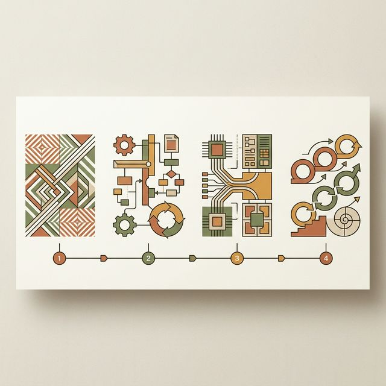
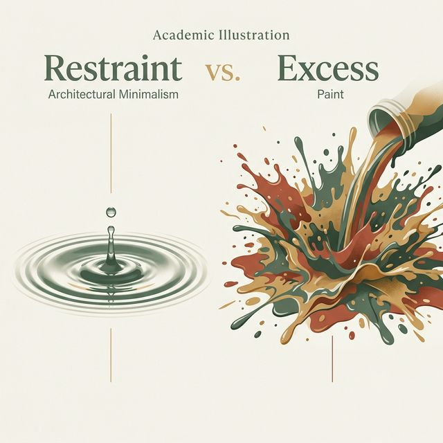
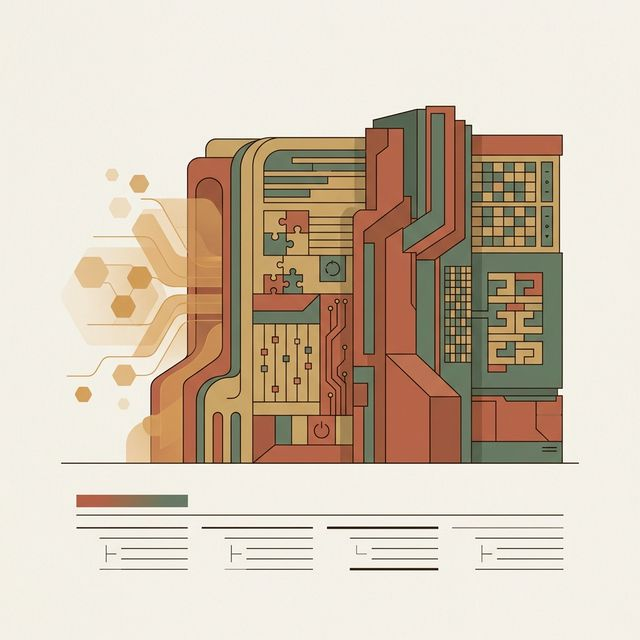

## 模块 5: 小结 — 动效演示互评与排障技术兜底 (约 10 分钟)
<!-- BUDGET: 1800 chars | SLIDES: ≥4 | STATUS: done -->
<!-- MATERIAL_BUDGET: llm-code-reading-debugging (≈ 100%) -->

好，时间过得很快，经过了刚才高强度的头脑风暴和现场代码接入演练，大家在各自的原型分支里都已经成功跑通了一两个带有真实物理弹性的交互过场。看着原本死板沉寂的页面终于在你们的手中伴随着鼠标点击和滑动有了心跳和呼吸，这种造物主一般的掌控感，是不是非常让人着迷？

这正是本周课程最核心的教学锚点。我们从一开始通过蜡像馆的隐喻打破大家的“静态幻觉”，到引入 Dan Saffer 的微交互四要素解剖结构，带领大家明白了“宏大产品愿景都是由无数细微成败瞬间堆砌而成的”这一冰冷铁律；再到深度讲解 AFA 动作-反馈法则，让大家认识到平滑动效其实是安抚脆弱大脑防线的精神按摩；最后我们越过纯理论的界限，深入探讨了怎样用参数化、物理量纲化的自然语言 Prompt 驱动大模型，一键生成带有 `prefers-reduced-motion` 前庭敏感兜底功能的工业级 Framer Motion 状态机引擎矩阵底层代码。

> [VISUAL]
> **Slide**: M5-01b_Week_Summary_Map
> **Layout**: `List`
> **Scene**: 本周知识回路总览卡片。四个核心模块以时间轴形式排列：① 静态幻觉破冰 → ② Saffer四要素+AFA法则 → ③ AI代码接入+GPU隔离 → ④ 实战演练。每个节点配有对应的核心概念关键词。
> **List**: 1. 静态幻觉与空间隐喻 2. 微交互四要素 + AFA 法则 3. Vibe Coding 代码接入 + GPU 隔离策略 4. prefers-reduced-motion 无障碍兜底
> *   **Asset**: 
> **知识节点**: `llm-code-reading-debugging`

请大家将目光聚焦于这张浓缩了我们全周血汗精粹的知识大回环收束地图总览。从最左侧第一节点破冰起航，我们用冰冷的屠刀劈开了设计师的“静态幻觉”；紧接着踏入第二大阵地，我们请出了 Dan Saffer 的四要素解剖学与 AFA 动效缓解法则，重构了大家的微交互理论认知底座骨架；在获取了这套心法之后，我们于地图的第三高地引爆了激烈的冲突，手把手操演了最为残酷硬核的 Vibe Coding 结构化 Prompt 源码注入与 GPU 隔离重绘求生策略；最终在这个宏伟征途的落点防线，我们重拾了人本位主义底色，拉起了 `prefers-reduced-motion` 这道捍卫易感生理残障群体的庇护战壕。地图上的这四大模块步步为营、环环密嵌，最终凝结锻造出了这条坚不可摧的现代产品生命线——在这里，没有任何一块代码砖头是多余的点缀，任何一环的坠落都将导致整个互动大厦的倾覆灭亡。

> [VISUAL]
> **Slide**: M5-01_Ethics_of_Motion
> **Layout**: `Image`
> **Scene**: 两张图对比。左边是一个充满了浮夸粒子特效、花里胡哨旋转文字，严重干扰用户阅读视线的灾难演示网页（配有红叉）；右边是一个克制、只有在发生表单验证错误时输入框才会微微颤抖的经典高品位界面（打上绿色对钩）。
> *   **Asset**: 
> **知识节点**: `llm-code-reading-debugging`

> [TEACHING MOMENT]
> **动效的克制美学：警惕“手握雷神之锤”的狂妄综合症**
> 但在今晚课程接近尾声之际，我必须非常严肃地向大家泼一盆冷水，做一次安全道德预警：
> 当你拥有了大模型这种代码生成武器后，很容易患上"雷神之锤综合症"——手里有锤子，看什么都是钉子。
> 当你能让 Cursor 在一分钟内生成"元素碎裂聚合再重组"的 3D 退场特效时，你会产生强烈的冲动：给每个下拉框、每个"保存"按钮都挂上这套夸张特效。
> 这是交互灾难的起点。在设计伦理中，优质过场设计的最高准则是："最高级的特效，是不被察觉的透明。"
> 你的核心目的永远是让用户毫无认知负担地完成任务闭环。所有动态补偿是为了弥补数字设备与人类感官之间遗失的自然重力规律。超过这个界限的"额外表演"，会从贴心辅助退化为令人咬牙切齿的路障。
> 我们教屠龙之术，也教大家：真正的宗师懂得何时把剑藏回剑鞘。

> [VISUAL]
> **Slide**: M5-02_Restraint_vs_Excess
> **Layout**: `Comparison`
> **Scene**: 左侧"克制派"：一个仅在错误时微微颤抖的输入框，配绿色评分标签"专业、可信赖"。右侧"炫技派"：满屏粒子爆炸、3D旋转文字、背景视差滚动，配红色标签"视觉噪音、认知过载"。
> *   **Asset**: 
> **知识节点**: `llm-code-reading-debugging`

记住这个对比。左边才是大师级别的交互设计产出。右边是手握核武器后失控的破坏。每一个动效决策，都要经过一道自我审问：这个动画是在帮助用户完成任务，还是在分散他的注意力？如果答案是后者，毫不犹豫地砍掉。真正的顶尖工匠，其克制力往往远大于他们的创造力，用最少的运动像素去换取最大的心理安全红利。

在下周开启全新的无障碍测试与启发式评估对抗体系学习单元之前，请各位在班级在线平台互评一下同组其他成员们在这次实践环节中接入的动态组件代码成果片段。请重点用 F12 开发者工具去严格核查他们的 DOM 元素挂载排雷工作做得是否纯净？他们的 CSS 渲染合成层是否成功避开了引发整个版面卡顿发热的主排版重绘（Layout Thrashing）危机大坑？同时检查他们是否真正保留设立了兼容保障前庭敏感少数人群能够安然退出关闭特效动画渲染的残障辅助分支保护线。

> [TEACHING MOMENT]
> **兜底防线：性能排雷互评与防御性代码架构（Defensive Design）**
> 让大家互评代码，不是走过场，而是训练你们成为架构哨兵。互评时务必打开 Chrome DevTools 的 Performance 面板，给对方的页面做一次强制体检。
> 如果你在录制帧动画时看到大量红色长条任务区，或帧率频繁跌到 30 以下，说明大坑已经埋下：通常是 AI 生成动画时错误操作了 Layout 重绘属性。作为互评者，你必须指出来，并要求修改 Prompt，强制挂载 GPU 硬件加速层。
> 除了性能硬伤，还要关注隐患——内存泄漏造成的游离 DOM 节点。很多同学沉迷于卡片飞出屏幕的炫酷效果，却忘了在 React 生命周期中将它们销毁。这些"僵尸节点"越积越多，最终压垮浏览器运行内存。
> 互评的第二道防线叫**防御性设计**。闭上眼睛设想最极端的场景：如果几百 KB 的 GSAP 或 Framer Motion 引擎包没有下载成功，你的网站会变成什么？一片白屏？核心按钮永远隐身在 `opacity: 0` 里？
> 真正的防线大师，会在构建动效库的同时预设断网熔断机制。通过 `<noscript>` 标签或 `@supports` 特征检测，保证哪怕没有一滴 JS 血液流动，骨架图样、文字内容和兜底链接按钮依然挺立，把用户平稳送达支付终局。
> 特效和动效只是锦上添花的华服；功能跑通不崩溃、内容有效触达，才是永远不能垮掉的脊椎骨。

在真实的商业环境中，你们会遇到一个残酷的悖论：产品经理要求你"做得炫一点"，但用户测试报告又显示"太花哨了加载慢"。如何平衡？答案是**渐进增强**。先确保核心功能在最差条件下可用，然后逐层叠加动效体验。这和建筑学的思路完全一致——先打地基、立承重墙，最后才做室内装潢。没有人会在地基还没打好的时候就去挂水晶灯。
每次提交代码前，请用这个三问检查表自审：第一，关掉 JavaScript 后核心流程是否畅通？第二，在 3G 网速下首屏是否在三秒内可交互？第三，开启"减弱动态效果"后信息传达是否完整？三个问题只要有一个答案是"否"，就说明你的动效架构存在结构性缺陷，需要回炉重造。

这三道防线，可以浓缩成一句话：**动效是加分项，功能是底线。**当两者发生冲突时，永远优先确保底线完好。这种思维方式不仅适用于动效设计，它是所有工具驱动型开发的通用纪律。

技术一直在以前所未有的加速度暴力狂奔前冲更迭，但构建一套伟大数字产品架构对于人性和物理直觉深邃洞察坚守关怀，永远不会贬值过时褪色。大家这周辛苦了，带好你们“具有呼吸和生命”的高分版本原型应用框架文件，我们下周不见不散！

> [VISUAL]
> **Slide**: M5-03_Next_Week_Teaser
> **Layout**: `CTA`
> **Scene**: 下周预告卡片——"W11：逻辑排障与兜底策略"。画面展示一副赛博朋克风格的数字防火墙，暗示从"创造美"到"守护美"的主题转变。
> *   **Asset**: 
> **知识节点**: `llm-code-reading-debugging`

大家看着最后这张充满赛博朋克警示意味的冷峻数字防火墙终局海报，应该就能嗅到一点风雨欲来的反转气味。当你们本周满心欢喜地带着这些拥有着“呼吸与生命起伏”的完美多巴胺原型框架冲回宿舍，并得意洋洋地把它们塞进真正陌生用户的掌心进行盲测试水时，我敢打赌，等待你们的绝对不是一堆铺天盖地的惊叹欢呼，而将是千奇百怪、五花八门、甚至令人彻底窒息崩溃的系统抛锚锁死与流程大迷失。因为不管你们为组件裹上的这层前端外衣打造得再怎么华丽炫目有弹性，它也永远无法掩饰和抵挡后端底层逻辑流状态机链路的断崖硬核式缺陷死穴崩塌。所以在狂热纵情享受了漫长的“创造代码与美”的神经高潮快感释放之后，下周我们即将迎来冰冷肃杀、极度枯燥残酷的神圣试炼大决战——W11《逻辑排障与兜底策略》。你们将告别造物主的浪漫，彻底化身为满手油污鲜血的法医学徒与端着电镜显微镜切片的排雷突击扫尾手，在满屏高亮刺眼的报错红光中艰难学习该如何硬生生地把那些已经在法拉第笼里彻底失控迷走的 AI 逻辑死循环强行扯回最后一条安全防护围栏之内。享受这个充满造物快感与虚幻满足的安谧周末吧，尽情狂欢，下周见！
