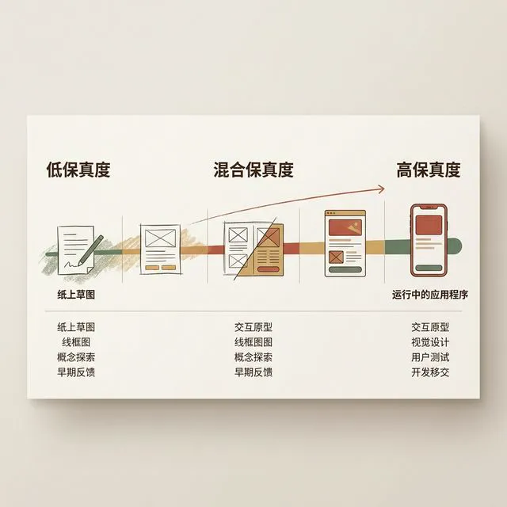
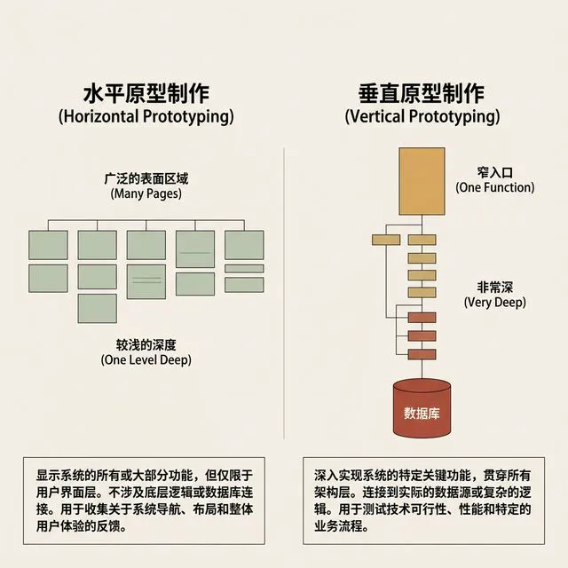
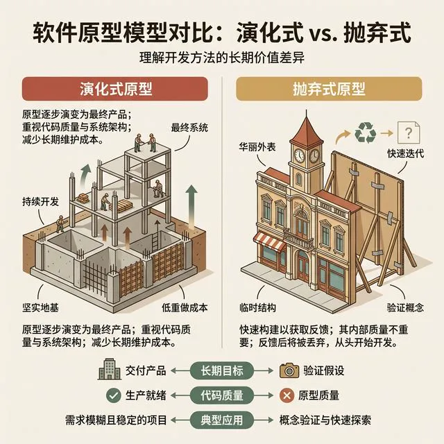
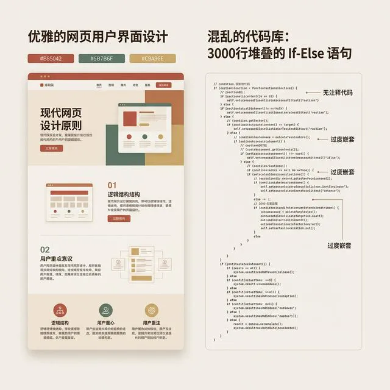
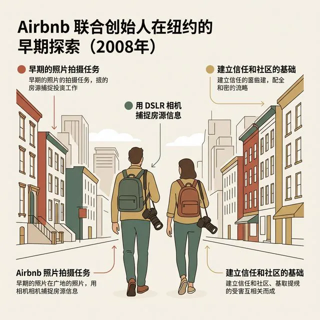

## 模块 2: 原型的本质 —— 混合保真度光谱
<!-- BUDGET: 5400 chars | SLIDES: ≥10 | STATUS: done -->

> [VISUAL]
> *   **Slide**: `S03_Prototyping_Fidelity_Spectrum`
> *   **Layout**: `Flow`
> *   **Scene**: 展示一条从左到右渐变的连续光谱。左端是 "Low-Fidelity"（纸质草图图标），右端是 "High-Fidelity"（真实代码运行的 App 图标）。中间标注着 "混合保真度"。
> *   **Asset**: 
> *   **Search**: `mixed-fidelity prototyping interaction design`
> *   **知识节点**: `prototyping-fidelity-spectrum`

我们花了这么多精力去排障，最后到底是为了交付什么？是一段没有 Bug 的完美代码吗？如果是计算机科学学院的代码课，答案或许是肯定的。

但在交互设计的语境里，无论你用 Cursor 或者 v0 敲出了多复杂的代码，甚至它已经完美适配了所有的屏幕尺寸、连接了真实的云端数据库，你必须清醒地认识到：它都只是一个**原型 (Prototype)**。

很多人对原型存在极其狭隘的误解。大家觉得，原型要么是画在纸上、用手绘线框表示的"低保真"（Low-Fidelity），要么是用代码完整写出来的"高保真"（High-Fidelity）。在大家的心智里，这是一个非黑即白的二元选择。

但教科书《Interaction Design》第 12 章用极其严谨的学术视角纠正了这一点。**保真度绝对不是非黑即白的，而是一个拥有无限灰度的连续光谱，或者说 Spectrum**。

> [PHILOSOPHY: 解析原型的五个维度]
> 我们需要把"保真度"这三个字放到学术的手术台上，进行最无情的解剖。
> 当用户或者老板看着你的屏幕说："哇，这个原型好逼真，简直跟上线的产品一模一样！" —— 停顿一下，反问自己：它到底在哪个维度逼真？
>
> 交互设计的先驱们将保真度精确拆解为五个完全可以相互解耦的独立维度：
>
> 1. **外观（Visual）**：这是最容易骗人的维度。就像好莱坞电影里的西部小镇布景，从正面看，木纹、招牌、甚至门把手的黄铜锈迹都无懈可击（高保真）。但走到背面一看，只有几根木棍支撑，甚至没有房间（低保真）。在 Figma 时代，我们可以轻易拉取 iOS 的原生组件库，让外观达到 99% 的保真度。但美貌，并不等于交互的灵魂。
> 2. **数据（Data）**：当你在原型里搜"北京天气"，它真的去调用了国家气象局的 API 吗？还是你在代码里写死了不管搜什么都只返回"晴天，25度"？在验证数据流的健壮性时，即使外观极其丑陋（只有白纸黑字的表格），但只要它能实时刷新真实的纳斯达克股票数据，它在"数据维度"就是高保真的。
> 3. **功能（Functionality）**：如果你的应用是一个复杂的排班系统。点击"自动排班"按钮，它是真的跑完了一套遗传算法计算出了最优解？还是仅仅播放了一个转圈动画，然后直接跳转到了一个预先画好的静态结果页？
> 4. **交互（Interaction）**：这是微动作的生命力。比如 iOS 列表滑动到了底部的"橡皮筋回弹"效果，手指捏合缩放图片时那种严丝合缝的物理反馈。如果你只做了一个生硬的翻页效果，你的交互保真度就只有 10%。
> 5. **空间结构（Spatial Structure）**：用户在这个 App 里能走多远？如果应用有 5 个底导 tab，每个 tab 点进去又有 3 层子页面。你能把这个错综复杂的页面树（树状图）的每一条连线都画完整吗？

理解了这五个维度的解耦，你就会明白：**在真实世界的项目开发中，追求"全维度高保真"是一种极度愚蠢且铺张浪费的自杀行为。** 无论是你们正在赶工的 实践项目3 结题，还是硅谷大厂里争分夺秒的敏捷冲刺，资源永远是有限的。你必须做出妥协和取舍。因为每提升一个维度的保真度，你需要投入的时间和金钱是以指数级别增长的。

这就引出了交互设计中极其核心的、两种解决资源悖论的战略级词汇：**水平原型，也就是 Horizontal Prototyping** 与 **垂直原型，即 Vertical Prototyping**。

> [VISUAL]
> *   **Slide**: `S04_Horizontal_vs_Vertical_Prototyping`
> *   **Layout**: `Comparison`
> *   **Scene**: 左右对比的示意图。左边是水平原型，也就是 Horizontal Prototyping：展示了一个宽广的表面积（很多页面），但很浅（只能点一级）。右边是垂直原型，即 Vertical Prototyping：展示了一个很窄的入口（只有一个功能），但非常深（一直连通到底层数据库）。
> *   **Asset**: 
> *   **知识节点**: `prototyping-fidelity-spectrum`

一种妥协策略是**水平原型**。
什么是水平原型？如果用地理来比喻，它就像是一片面积犹如太平洋般广阔，但深度刚好只到脚踝的水洼。
你和你的团队拼命加班，把 App 所有的主干结构全部画了出来——引导页、登录页、首页、发现页、消息页、个人中心页。当你把原型发给测试用户时，用户可以在底部的导航栏里四处点击、疯狂切换，感觉非常有掌控感。
但是，如果你点进具体的某一条推送消息，或者试图在首页顶部的搜索框里进行真实的搜索，你会发现它完全是一个死胡同：无论你搜什么，敲击键盘永远没有反应；点击所有的联系人头像，弹出来的永远是同一个叫做"张三"的假个人资料。
**战略级洞察：** 水平原型在"空间结构（Spatial Structure）"维度上是绝对的最高保真度，但在"数据（Data）"和"功能（Functionality）"维度上是约等于零的极低保真度。它最大的战略价值是在项目初期，用来低成本验证整体的**信息架构，也就是 Information Architecture**。它能帮你提前发现：用户会在你设计的迷宫一样的三级菜单里迷路吗？分类是不是有歧义？

> [CASE STUDY: 被宽泛害死的完美主义]
> 有一个经典的创业失败案例。一个想做"大学生校园社交+二手交易+失物招领"的超级 App 团队。他们花了整整 3 个月，在 Figma 里连出了一个拥有 300 多个页面的水平原型，外观华丽无比，每一级菜单的流转都无懈可击。
> 但当他们终于开始拉投资、或者找用户真正试玩的时候，才发现最核心的问题根本不是"功能找不找得到"。而是用户根本没有动力在这个平台上发布二手商品！
> 他们验证了极其华丽的表面积外壳，但完全没有触及水面之下真正的阻力。

另一种截然相反的妥协，也就是刚才这个案例真正缺乏的解药，是**垂直原型**。
如果水平原型是水洼，那垂直原型就是一口口径只有两掌宽、但深不见底、直通地心岩浆的探照井。
你可能只极其克制地做了一个极窄的、看似微不足道的核心功能。比如，一个全新的"无按键滑动手势扫码支付"系统。
在你的原型世界里，其他的什么历史账单列表、个人头像设置、每日签到优惠券系统——对不起，由于工期有限，干脆一个按钮、甚至一个黑白线框图都不做。你砍掉了 99% 的空间结构。
但是，在这个极窄的井里，一切体验被推向了最高保真的极限。当用户向上滑动时，指尖真的调用了原生的摄像头模块，扫码的解析帧率高达 60fps，捕捉到二维码的瞬间，伴随着精确到毫秒的 Taptic Engine 线性马达震动，以及一声由专业音响工程师混音的清脆"滴"声。
在这个极其狭窄的体验通道里，受试用户完全分不清这是不是一个用黑客技术拼凑出来的脆弱原型，他们只会觉得这是一台完美的机器。
**战略级洞察：** 垂直原型适合用来猛烈攻击产品最核心、难度最高、风险最大的**技术壁垒或微交互心智，也就是 Micro-interactions**。

> [TEACHING MOMENT]
> 在我们的 实践项目3 中，我强烈建议你们采用**垂直突破**策略。
> 绝对不要试图去完善一个 20 页的大型连贯系统。在 AI 加持下，你确实可以用很短的时间生成 20 个页面，但这 20 个页面之间复杂的状态传递极其脆弱，一碰就碎。
> 相反，去深入打磨那两三个最能展现你们创新切入点的交互体验模块。剩下的 90% 的页面，用低保真的 Figma 静态切图，甚至用几页 PPT 幻灯片糊弄过去都可以。
> 这种在同一个项目中，某些部分极度逼真，某些部分极度敷衍的做法，被称为**混合保真度原型，也就是 Mixed-Fidelity Prototyping**的智慧。

> [VISUAL]
> *   **Slide**: `S08_Elevator_Placebo_Button`
> *   **Layout**: `Full`
> *   **Scene**: 一张特写的电梯按钮面板照片，手指正在按下发光的"关门"键，但虚线透视出按钮背后根本没有连接电线。
> *   **Asset**: 
> *   **Text**: "电梯关门键的安慰剂效应"

> [LIFE CONNECT: 电梯关门按钮的安慰剂效应，即 Placebo Effect]
> 混合保真度的艺术，其实早已深深植根于我们日常的物理引擎界面中。
> 你有没有在快要迟到时，冲进电梯疯狂狂按那个"关门"按钮？你是不是觉得每按一次，门就关得快一点？
> 这是一个残酷的真相：自从 1990 年《美国残疾人法案》(ADA) 颁布后，为了确保行动不便的老人或轮椅使用者有足够的时间进入电梯，法律强制规定电梯门必须保持开启至少 3 秒钟。
> 所以，今天世界上绝大多数新电梯的"关门"按钮，在底层工程逻辑上，是完全被物理断开的。它根本没有连接到任何控制主板上去加速关门流程（这是一个极其敷衍的、极低的"功能"保真度）。
> 但是，为什么设计师不干脆把这个冗余的按钮取消掉呢？
> 因为你的大脑需要它。当你焦虑地等待 3 秒钟时，按下一个阻尼手感极佳、甚至还会亮起一圈漂亮背光的实体按钮（极高的"外观"与"交互反馈"保真度），为你提供了一种"我已经做了点什么"的控制感假象，也就是 Illusion of Control。这个没有任何实际加速功能的安慰剂，即 Placebo，成功地化解了系统强制延迟带来的情绪烦躁。
> 这就是典型的混合保真度应用模式。在你们的原型设计中，那些非核心的、需要耗费大量资源去打通后端的次要功能块，完全可以设计成一个精美的"电梯关门安慰剂按钮"。用户点击了，能看到弹出的绚丽微动效和"处理中"的优雅提示，但后台其实什么都没做，只是硬生生转了 2 秒钟圈后直接渲染出一个写死的静态假页面。只要你的核心展示流程是完整的，这些聪明的副线"视觉安慰剂"就能极大缓解你们有限精力下的开发压力。

> [VISUAL]
> *   **Slide**: `M2-04_Wizard_Of_Oz`
> *   **Layout**: `Full`
> *   **Scene**: 插画：舞台上展示着高科技产品，而幕布后面躲着一个满头大汗拉动摇杆的工程师。
> *   **Asset**: 
> *   **Search**: `Wizard of oz prototyping concept tech`

> [STORY TIME: 绿野仙踪法 Wizard of Oz]
> 既然资源总是有限的，交互设计师就发明了无数种"偷工减料"但又能骗过用户的测试方法。其中最古老、但在 AI 时代突然重新爆火的原型验证技术，叫做"绿野仙踪法"（Wizard of Oz）。
> 
> 听过《绿野仙踪》童话的同学都知道，那个被所有人敬仰、无所不能的奥兹国大魔法师，其实根本不懂魔法。他只是一个瑟瑟发抖躲在巨大幕布后面、疯狂拉动各种摇杆、踩着踏板、对着麦克风制造雷声的普通老头。他用巨大的机械结构和光影效果（高保真的前端），掩盖了后台全靠人工操作（极低保真后端）的真相。
> 
> 这个童话在 1980 年代被 IBM 的研究员搬进了计算机实验室。当时，IBM 想开发第一代"语音识别打字机"。但在那个年代，计算机连一句完整的"Hello"都听不懂，语音识别模型根本不存在。如果要先花十年时间开发出语音识别算法，然后再去找用户测试"人们是否真的喜欢用嘴打字"，这个试错成本太高了。
> 于是，研究人员想出了一个绝妙的骗局：他们让测试用户坐在一个只有麦克风和屏幕的空房间里，告诉用户"这是我们最新研发的超级人工智能"。用户对着麦克风说话，而在隔壁房间（也就是幕布后面），坐着一个打字速度极快的职业打字员（真正的魔法师）。用户一说话，打字员就疯狂敲击键盘，把文字实时同步推送到用户的屏幕上。
> 用户盯着屏幕上几乎没有延迟出现的文字，深信不疑地认为自己刚刚体验了世界上最高级的人工智能，并给出了大量关于"语音输入体验"的真实反馈。
> IBM 没写一行语音识别的代码，就完成了对产品核心价值的终极验证。

这就是交互设计历史上的高光时刻。今天，当我们试图验证一个高度复杂的 Agent 对话系统、或者一个需要庞大数据库支撑的 AI 推荐流时，如果你发现你的大模型总是胡言乱语、调用外部 API 时经常罢工报错，你完全不用在演示前死磕那些底层的 Python 逻辑。

你只需要把 Figma UI 甚至前端界面做得极其逼真（高保真的外观维度），然后你或者你的组员藏在隔壁或台下。当台上的受试者输入问题时，你作为一个幕后的魔法师，根据你们事先精心磨砺过的剧本，纯手动地把完美的答案推送到界面的数据流里（极低保真的功能维度）。
通过物理层面的阻断，你避开了代码报错的深渊，获得了极其珍贵的用户交互数据。这就是对开发资源最极致的节省。

**(Pause: 2s)**

最后，当我们深入探讨了这么多妥协的艺术，我们必须面对一个拷问灵魂的、残酷的终局命运：你花了五个通宵、用 Cursor 狂敲出来的这堆代码，最终是要被保留在未来的公司级仓库里，还是被无情地扔进垃圾桶？
> [VISUAL]
> *   **Slide**: `M2-05_Evolutionary_vs_Throwaway`
> *   **Layout**: `Comparison`
> *   **Scene**: 左侧是钢筋混凝土的地基（进化式），右侧是好莱坞电影里正面华丽背面用木棍支撑的纸板布景（抛弃式）。
> *   **Asset**: 

在严谨的软件工程中，原型从出生起就被划分为截然不同的两个阶级：**进化式，也就是 Evolutionary** 和 **抛弃式，也就是 Throwaway**。

进化式原型，就像是盖大楼打下的钢筋地基。它意味着你今天为这个"粗糙界面"写的每一行架构代码、每一个数据库表结构定义，最终都会成为长达十年寿命的正式商业产品的一部分。这对代码的模块化、整洁度、可测试性和可维护性要求极高。就像你不可能用透明胶带去粘摩天大楼的承重墙。

而抛弃式原型，就像是好莱坞动作大片里临时搭建的纸板布景。外观看起来像是一座宏伟的罗马角斗场，但其实就是几块木板刷了油漆。导演拍完这场戏，几台推土机开进来，直接推倒烧掉，什么都不会留下。它的唯一目的就是"用最低的成本，快速验证这个剧本桥段行不行"。一旦验证通过，剧组会去真正的地方实景拍摄。

> [TEACHING MOMENT: Vibe Coding 的抛弃式本质]
> 在 Vibe Coding 的语境下，你们用 Cursor 或者其他生成式 AI 工具疯狂生成的绝大多数快速原型，**必须**被冷酷地视为抛弃式原型。
> 
> 很多初学者看着 AI 在几秒钟内生成的几百行代码跑通了，会产生一种虚幻的技术傲慢。觉得"哇，我已经做了一个完备的产品"。
> 但你要知道，大模型为了满足你"赶快跑起来"的急躁指令，它的底层代码往往是突破了所有软件工程底线的。它之所以能那么快，是因为它默认向未来借了高利贷，这在计算机科学中被称为**技术债，也就是 Technical Debt**。
> 

> [VISUAL]
> *   **Slide**: `M2-06_Tech_Debt_Iceberg`
> *   **Layout**: `Flow`
> *   **Scene**: 海面冰山图。水面之上是一小块写着“快速上线”的冰山尖角，水面之下是极其庞大的、写着“无法维护的面条代码”的阴暗冰体。
> *   **Asset**: 
> *   **Search**: `Technical debt iceberg metaphor`

> [DID YOU KNOW: 技术债的致命复利]
> "技术债"这个词是由敏捷软件开发宣言的起草人之一，Ward Cunningham（沃德·坎宁安）在 1992 年首次提出的。
> 它的核心比喻是：就像金融世界的借钱一样，你在开发时为了追求速度，采用了快速但肮脏，即 Quick and Dirty，的代码架构。这就相当于你向银行借了一笔本金，让你能提前发布产品。
> 但是，只要这笔债务没有被偿还（重构代码），你之后每一次在这个肮脏架构上添加新功能，都会变得无比缓慢和困难。这就是你需要支付的"利息"。如果债务积累得太多，最终所有的研发力量都会被用来支付利息（修复无休止的 Bug），整个产品将走向事实上的破产。
> 
> 在 Vibe Coding 的时代，AI 就是那个极其慷慨、无需审核就给你下发代码高利贷的黑心虚拟银行。

> [VISUAL]
> *   **Slide**: `M2-07_Frankenstein_Code`
> *   **Layout**: `Split`
> *   **Scene**: 界面截图+代码比对。左侧是极为绚丽的网页 UI，右侧是长达三千行、堆叠了各种 if-else 以及毫无注释的拥挤乱码文件。
> *   **Asset**: 

> 让我们来解剖一个典型的 AI 生成的"弗兰肯斯坦代码，也就是 Frankenstein Code 地狱"：
> 当你要求它立刻生成一个带购物车的商城时，它可能会把所有的全局状态管理，也就是 State、所有的 CSS 样式表，也就是 Styles、所有向数据库发送网络请求的接口，即 API Calls、以及所有的页面路由，即 Routing，全部杂糅堆砌在一个长达两三千行的庞大 `App.jsx` 文件里。在这个文件里，没有任何注释能够解释为什么第 1500 行的某个变量突然改变了。它甚至可能连哪怕一次最基础的网络超时错误，即 Timeout Error都没有做拦截器。
> 
> 只要在你的本地电脑上，按照完美的顺风局测试路径点击，它看起来光鲜亮丽。
> 但是，如果你们试图把这样一个在几个疯狂的通宵里"催熟"的杂交怪物，直接当成未来的生产级代码。当你们兴致勃勃地想要明天给应用加上一个"用户换头像"的简单新功能时，你会发现——全崩了。因为你不知道哪行代码暗中依赖了旧数据结构，改动一行 CSS，竟然会导致整个支付通道断开。
> 这就是妄图把抛弃式原型直接强行当做进化式框架所必然引发的灾难。

你们作为交互设计师的核心目标，是用魔法般的代码生成速度去打败试错的时间成本，从而换来对用户心智和商业模式的深刻认知。一旦认知获取完成，这个原型的历史使命就结束了。
在它烂在手里之前，永远要保持勇敢抛弃它的觉悟。带着你在测试中得出的清晰的逻辑架构图、被验证过的数据边界流向图，去跟真正的后端工程师合作，让他们用严谨的框架（比如 Spring Boot 或者是正规的 Node.js 微服务架构）从零开始重写工业级的底座。

> [VISUAL]
> *   **Slide**: `M2-08_Airbnb_Hustle`
> *   **Layout**: `Split`
> *   **Scene**: 照片：2008 年两位 Airbnb 创始人拿着巨大单反相机走在纽约街头的背影。上方名言：“Do things that don't scale.” (做那些无法规模化的事情)
> *   **Asset**: 

> [CASE STUDY: 硅谷大厂的 "一次性火箭" 哲学]
> 著名的创业孵化器 Y Combinator 里有一句流传甚广的黑话："Do things that don't scale"（做那些无法规模化的事情）。
> 他们的明星项目 Airbnb 在早期的时候，网站上展示的纽约高清房源照片，根本不是房东自己上传的。而是两位创始人自己充当"肉身原型"，背着沉重的单反相机，挨家挨户去敲纽约房东的门，恳求免费帮他们拍照，然后再手动一张张改代码传到网页上。
> 在"图片上云分发"这个数据维度上，早期的 Airbnb 是极低保真的纯手工操作。这种笨拙的后端体系完全无法支撑全美国十万个房东并发上传照片。
> 但这并不重要！他们用这种抛弃式的"人肉原型策略"，成功验证了"高质量大图真的能让租客的预订转化率提升 2 倍以上"这个核心认知。
> 后来，当他们获得了千万美元的融资，他们不仅重写了所有的图片上传代码，还买下了全球顶级 CDN 厂商的服务器带宽，彻底进入了进化式开发的重度阶段。
> 你看，在 Vibe Coding 时代，你的职责就是去做那个早期的 Airbnb 创始人。不择手段、不计技术债务地去验证你的假说。这就是大模型赋予你的、能够低成本造出"一次性验证火箭"的最强魔法。

> [VISUAL]
> *   **Slide**: `M2-09_Fidelity_Radar`
> *   **Layout**: `Flow`
> *   **Scene**: 一个带有五个维度的雷达图空白模板（Visual, Data, Functionality, Interaction, Spatial Structure）。其中一个角（交互）被拉满，其他角严重萎缩。
> *   **Asset**: 

结合这张雷达图分布，接下来我们要进行一场极度真实的桌面推演战斗。

> [ACTIVITY]
> **Type**: `Workshop`
> **Duration**: `15min`
> **Desc**: 混合保真度映射实战 (Fidelity Mapping) 与答辩预演
> **执行指南**:
> 1. 请各个小组立刻在白板或草稿纸上画一个雷达图，五个角分别是原型的五个维度：外观（Visual）、数据（Data）、功能（Functionality）、交互（Interaction）、空间结构（Spatial Structure）。
> 2. 审视你们即将在期末 实践项目3 中展示的原型。
> 3. 在雷达图上，用红笔**圈出一个且只圈出一个**你们决定要做到绝对 100% 高保真的核心维度。这通常是你们产品最能打动导师的创新点。比如如果你们做的是一个基于手势的音乐播放器，那么"交互"必须是满分。
> 4. 然后，用蓝笔圈出另外两个你决定要"彻底摆烂"、采用极低保真度（甚至是绿野仙踪人工干预）的维度。比如，为了节省开发时间，所有用户的登录体系和个人中心全部砍掉（极低的空间结构），所有的音乐推荐列表全写成假数组（极低的数据保真度）。
> 5. **小组博弈环节**：互相阐述这样取舍的商业和交互逻辑。谁能用最低的开发成本，讲出最令导师信服的创新故事，谁就是原型的最高级大厨。

在各个小组讨论时，我会按照以下标准 (Rubric) 进行巡场指导与点评：
*   **优秀 (A) 的小组**：能清晰地说出"为什么砍掉这个模块不影响核心创新点的验证"，并精准使用了"抛弃式原型"或"垂直原型"等学术概念。他们甚至主动承认代码里存在巨大的技术债，但清晰地论证了这是为了赶在死线前验证想法而申请的一笔"合理的高利贷"。
*   **及格 (B) 的小组**：虽然画出了雷达图，但在被我问到"如果不幸在答辩现场遭遇网络断网，导致外部天气 API 断裂怎么办"时，依然表现出对大模型生成的全功能代码有一种盲目的、宗教般的迷信，完全没有思考过绿野仙踪式的人工退路设计。
*   **危险 (C) 的小组**：试图在不到一周的时间里，用 Cursor 强行拼凑出一个"全维度高保真"的超级平台。他们试图手写登录体系、支付沙盒、实时即时通讯等所有外围模块。对于这种"平庸的水平原型"，我会立刻叫停，强制要求他们砍掉 90% 的页面，回归到解决单个垂直微交互场的核心点上。

记住，在最终的答辩舞台上，没有导师会去一行行审查你写了多少除了你以外没人看得懂的屎山代码。我们是在严厉地考察，你们作为一个未来的设计领导者：是否具备在极度匮乏的时间和技术资源约束下，依靠极具策略性的设计决策和降维打击的原型妥协手段，来无可辩驳地证明产品核心商业价值的"手腕"。

> [ACTIVITY]
> **Type**: `Practice`
> **Duration**: `课后延展`
> **Desc**: 典型前端报错与 Read-Explain-Fix 实战（课后任务）
> **执行指南**:
> 1. 讲师或助教在群里发放一个名为 `实践环节_Buggy_Starter_Kit.zip` 的 React 初始项目包。这个包里被刻意埋伏了前面讲过的 3 种典型 Bug（状态未同步导致的幽灵购物车卡片、Z-Index 设置错误导致的提交按钮被透明不可见的蒙层遮盖、以及一个拼写错误的第三方组件库导入导致整个页面白屏崩溃）。
> 2. 学生在本地使用 `npm install` 和 `npm start` 运行并复现报错。
> 3. **硬核规定**：要求学生不要自己打开代码手动敲击寻找并修改，而是全程使用大模型辅助工具（如 Cursor Chat 或者 GitHub Copilot），严格运用上面学到的 Read-Explain-Fix 面试官话术。
> 4. 第一轮对话，必须硬性要求 AI 首先总结并解释：这个突如其来的崩溃报错，属于今天讲义中"前端 5 大元凶错误"中的哪一类？如果 AI 解释错误，要求它重新分析。
> 5. 成功在 AI 的协助下修复代码、让页面重新正常运行后。请在注释里写下一段不超过 50 个字的微型复盘，分析原始 Bug 产生的心理误区。

用魔法打败工程的笨重，再用抛弃换来认知的升华。学会放手那一堆乱七八糟的意大利面条一样的烂代码，去拥抱更纯粹的创新。这就是你在进入最终决战之前，必须顿悟的原型的真正本质。

---
