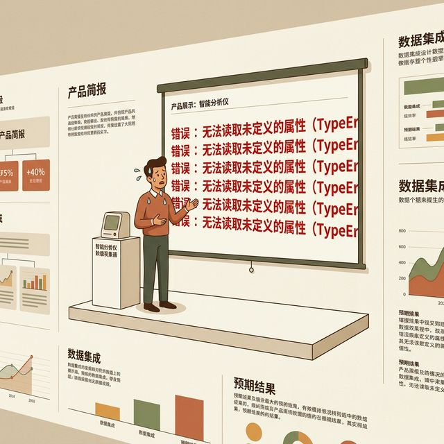
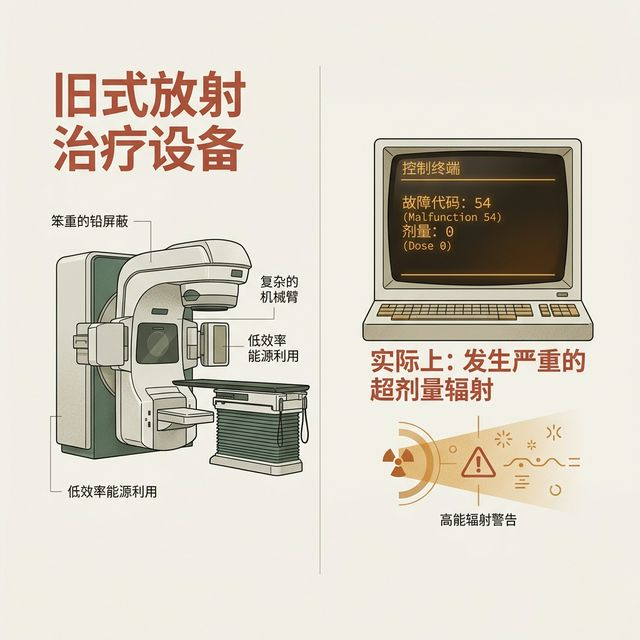
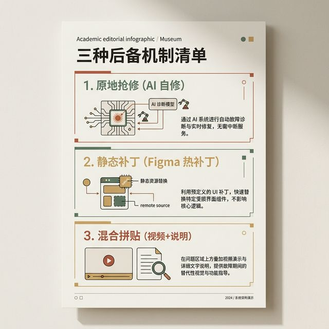
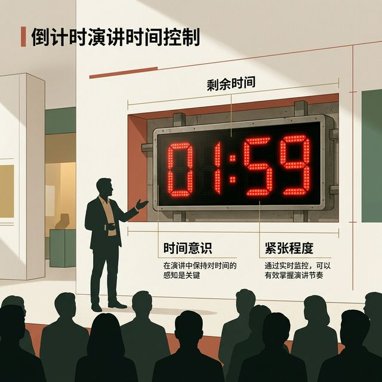
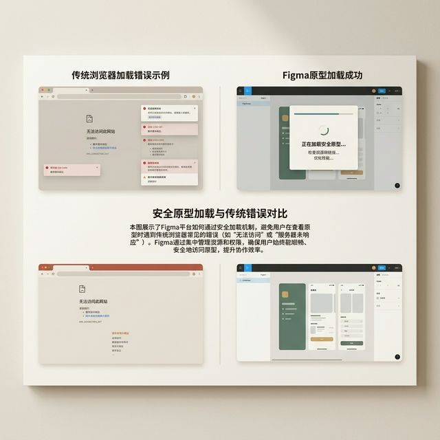
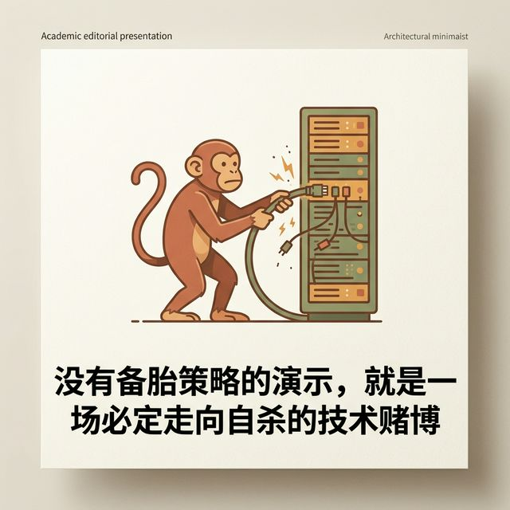
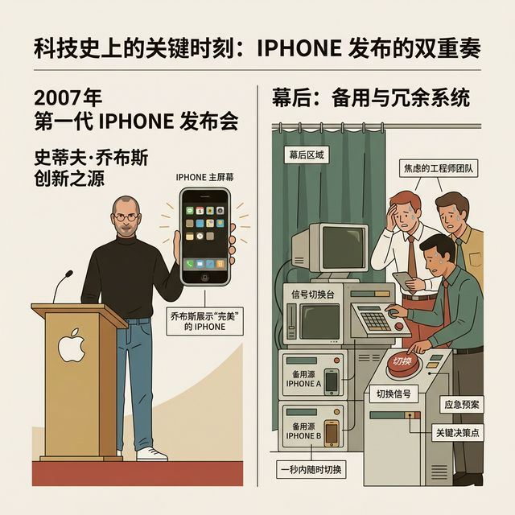

## 模块 3: 绝地求生 —— 三级兜底策略
<!-- BUDGET: 5400 chars | SLIDES: ≥10 | STATUS: done -->

> [VISUAL]
> *   **Slide**: `S05_Demo_Panic`
> *   **Layout**: `Full`
> *   **Scene**: 夸张的场景图：一个人站在投影前演示产品，背后的屏幕上突然弹出一大串红色的 "TypeError: Cannot read properties of undefined"，满头大汗。
> *   **Asset**: 
> *   **Text**: "灾难总是发生在演示时"
> *   **知识节点**: `实践项目-demo-fallback-strategy`

讲完了排障和妥协，我们来直面一个非常现实、甚至有些残酷的场景：**答辩演示 (Demo)**。

你昨晚在宿舍跑得好好的代码，今天站在讲台上，大屏幕一投——崩溃了。点那个最重要的核心按钮，白屏。

这是 Vibe Coding 时代的常态。因为 AI 生成的代码往往极度缺乏系统工程的抗压测试，它们就像是温室里的脆弱花朵，处理边界情况和异常数据的能力几乎为零。这种由于底层逻辑突然崩溃，导致原本期望中流畅的用户体验瞬间发生致命中断的现象，在我们的交互工程学中，被称为**"状态断裂" (State Fracture)**。

> [PHILOSOPHY: 状态断裂背后的脆弱性]
> 为什么在传统的严谨前端开发中，"点一下按钮直接白屏"这种灾难级事故并不常见，而在大模型生成的原型里却比比皆是？
> 因为传统的软件工程师在接受严酷的算法训练时，被灌输的是一种名为"防御性编程"（Defensive Programming）的底层思维。当资深工程师在写下"读取当前用户头像"这段看似极度简单的一行代码时，他的大脑里和手指肌肉记忆中，会自动补齐至少三道防波堤：如果此时服务器网络超时了，页面怎么显示？如果接口强行返回了 500 服务器内部错误，页面怎么显示？如果 API 成功返回了，但该用户压根没有上传过头像，URL 是一个完全空的 null 值，页面怎么显示？（通常是默认塞一个灰色的默认人偶图）。
> 
> 但大模型不是这样思考的。大模型为了迎合你那种"赶快给我看漂亮网页"的急躁 Prompt，它极度纵容地采取了最危险的"乐观路径假设"（Happy Path Assumption）。它在生成代码时笃定地认为：一切网络请求都是 0 毫秒延迟的，它假设你的数据库里永远躺着格式绝对完美且充沛的 JSON 数据。
> 一旦你在真实世界的讲台上演示时，教室内几百人同时连接校园网导致网络稍微卡顿了 0.5 秒钟，那个用来存放核心产品数据的对象由于异步机制还处于 `undefined` 的真空包状态，而此时页面渲染代码偏偏迫不及待地要去读取 `undefined.avatar_url`——轰的一声，整个 React 或 Vue 应用的渲染树就像被抽掉底部的多米诺骨牌一样全部雪崩，直接触发底层运行时异常，整个屏幕变成纯白的死亡屏幕。这就是状态断裂最具破坏力也最令人绝望的地方：一个极其微小、在末端才产生的数据缺失，因为缺乏防波堤，最终逆向导致了整个宏观应用程序界面的瞬间蒸发。

为了在灾难无可避免地发生时，你们能够像顶级创伤外科医生一样进行精准的抢救，我们需要首先对"状态断裂"进行严谨的、解剖学级别的**分类审计**。在考场的投影仪和刺眼的聚光灯前，断裂通常分为四个随着严重程度逐级递增的致命等级：

**1. 样式断裂，也就是 Styling Fracture：视觉的穿模。** 这是所有断裂中最轻微、最容易掩盖的一种。典型的场景是：你点击了"确认购买"商品，弹出的"购买成功"绿色巨大弹窗本来应该以绝对凌驾的姿态覆盖在最上层，但突然，由于大模型没处理好 CSS 的层叠关系，这个弹窗居然被页面底部的另一个轮播组件死死地压在了下面（上一节我们讲过的 Z-Index 幽灵再现）。系统的后代运算逻辑还在，购买扣款数据甚至也发送成功了，只是在视觉渲染队列上看起来发生了令人尴尬的穿模现象。如果你口才好，你甚至能把它糊弄过去。
**2. 路由断裂，也就是 Routing Fracture：死胡同陷阱。** 也就是俗称的导航失忆。你在层层嵌套的个人中心里猛然点击了"返回上一页"或者"提交资料"，按照产品原本规划好的常理，此刻应该有一个极为畅快的翻页动画把你送回到主页。结果呢？整个页面卡在当前毫无反应，任凭你把左键点烂；或者更惨，直接跳转到了一个浏览器原生的、冰冷的 `404 Not Found` 的空白灾难页。这是因为前端的全局路由导航器彻底失去了对页面跳转事件坐标的追踪和解析。
**3. 数据断裂，即 Data Fracture：血管被切断。** 这是体验开始出现毁灭性裂痕的转折点。页面周围的框架骨骼——你的顶栏、底导、侧边菜单甚至美轮美奂的背景遮罩都安然无恙。但处于页面心脏位置的核心内容区，原本应该显示"今日根据你的兴趣深度匹配推荐的 10 条科技新闻"的地方，要么空方如也，要么写满了乱码，要么直接呈现出一排可怕而机械的程序员变量原貌 `[object Object]`。这是前端界面与云端后端逻辑的联通血管被生生切断了。
**4. 全局崩溃，也就是 Global Crash：无声的死亡。** 这是绝境，也是绝症。整个屏幕瞬间失去一切颜色和组件，变成纯白（这也就是前端界谈虎色变的 React 白屏惨案），或者整个浏览器的标签页直接失去响应，鼠标变成转圈圈的沙漏（通常是因为你的 useEffect 形成了无限递归的死循环，一秒内向内存中炸出几十万次运算直接把物理电脑内存打穿）。

> [VISUAL]
> *   **Slide**: `S09_Therac25_Tragedy`
> *   **Layout**: `Split`
> *   **Scene**: 左侧是冰冷庞大的放射性医疗设备，右侧是显示"Malfunction 54"和"剂量 0"但实际上正在疯狂输出辐射的复古终端屏幕。
> *   **Asset**: 
> *   **Text**: "Therac-25：当系统撤销了硬兜底"

> [STORY TIME: Therac-25 医疗事故与无兜底设计的代价]
> 在我们讨论为什么演示必须强制准备兜底防线时，回顾软件工程历史上最惨痛之一的警示案例是一堂必修课——加拿大 Therac-25 医疗放射机灾难。
> 1985 到 1987 年间，这款由于设计缺陷逃过层层筛查的医疗设备发生暴走，导致多名癌症患者遭到平时上百倍致死剂量的辐射，数人无辜丧命。
> 惨剧的根源，不仅是一个偶发的底层软件并发时序 Bug，也就是 Race Condition，，更致命的是它在顶层设计中完全褫夺了降级与物理兜底的手段。
> 在以前所有的老式放射机器中，为了防止程序出错导致辐射过量失控，机器上被法律强制要求安装了纯粹的机械式硬件互锁装置，即 Hardware Interlocks。。一旦辐射数值在物理通道上超标，哪怕软件死机，物理锁也会无情地强制切断供电电源。这就是最后一道绝对安全、不依赖任何代码的"硬兜底防线"。
> 但在 Therac-25 这一代"拥抱数智化"的设计中，这群过度自信的软件工程师为了节约制造成本并追求纯软件控制的"优雅无缝"，极其傲慢地拆除了所有的物理硬件保护，把全盘生死的一阶安全校验统统交给了软件的代码逻辑来判定。
> 结果，当软件自身发生状态断裂陷入死循环时，屏幕上的用户伪造界面依然欺骗性地显示"辐射剂量正常（0）"。操作员拼命按下键盘上的返回停止键，但软件层已经彻底失去了对底层硬件的指令控制力。因为没有那道脱离代码的、能被直接拉闸的物理防波堤存在，整个不可撤销的致命错误在无声静默中夺走了一条条鲜活的生命。
> 当你们在讲台上兴高采烈地展示高保真原型，却遭遇这种极端的全局崩溃时，如果没有我们接下来提到的——立刻拉起 Figma 备用热补丁、采用完全脱离浏览器运行机制的物理降级兜底方案，你们那仅有代码构筑的单薄防线也将变得如纸片般脆弱不堪，在全系评委导师的众目睽睽之下彻底翻车。

我必须在这里极其严肃地向你们重申 实践项目3 的最高验收核心原则，这不仅是我反复强调的，也是决定了你们这门课最终答辩是拿 A 还是挂科的红线：**我们作为导师，验收的核心是交互体验路径的完整性、是商业闭环的逻辑自洽、以及你们利用 AI 辅助证明了怎样惊才绝艳的创新思维。我们绝对、绝对不是在验证一份可以立刻打包上架 App Store、承受百万并发不崩溃的完美硅谷工业级工程代码。** 

因此，当发生上述四种状态断裂时，你们此时面临的最大敌人，早已不是屏幕上那段导致前端报错的枯燥变量。你们真正的死敌，是台下所有评委和观众"急速流失的耐心与注意力"，以及身处台上的你们自己"瞬间跌入冰谷、彻底崩溃的自信心预期"。
为了防止这种心理防线的崩塌导致整个产品演示彻底沦为无法挽回的笑柄，你们作为一个成熟的、能够把控全场局势的设计师团队，必须在演示前一周，建立一套极其严酷的、像军队空降演习一样精确的**三级降级兜底方案，即 Three-Level Fallback Strategy**。

> [VISUAL]
> *   **Slide**: `S06_Three_Level_Fallback`
> *   **Layout**: `Split`
> *   **Scene**: 展示三层防御机制：
1. 原地抢修（AI 自修）：限时 2 分钟。
2. 静态补丁（Figma 热补丁）：备用的无代码可交互原型。
3. 混合拼贴（视频+说明）：连 Figma 也崩了/来不及做时的终极口头叙事。
> *   **Asset**: 
> *   **知识节点**: `实践项目-demo-fallback-strategy`

这是一套不容任何侥幸心理侵占、必须刻印在骨子里的标准化应急排练操作指南。

> [VISUAL]
> *   **Slide**: `M3-04_Level_1_Timeout`
> *   **Layout**: `Split`
> *   **Scene**: 巨大的鲜红色 LED 数字倒计时器跳动在 1:59，旁边是主讲人从容对着观众解释的抓拍剪影。
> *   **Asset**: 

**第一级防线，Level 1 Backup：原地抢修演习（AI 话语权控制术）。强制执行硬性纪律：限时极限 2 分钟。**

> [DID YOU KNOW: 抢修的黄金 120 秒]
> 如果在那至关重要的一刻，你的心血代码就在全班几十个人的注视下挂了，犯下的最低级错误绝对是：主讲人低下头，手指在键盘上飞快盲打胡乱修改，留下给台下 5 分钟死寂的尴尬。
> **极速夺回现场话语控制权！** 要求宣讲同学抬起头，用专业口吻向观众输出："由于大模型处理异步状态的不稳定，导致了数据断裂。但这正是 Vibe Coding 流程的一环，请允许我们进行两分钟的实时 AI 协同排障展示。"
> 紧接着把报错砸进 Cursor Chat。**生死铁律：绝不允许纠缠超过两轮对话！绝不超过两分钟！** 
> 把它当做一次人机协同的技术秀。成功了，全场会被你们驾驭 AI 的松弛感折服，成为空前加分项。

> [VISUAL]
> *   **Slide**: `M3-05_Level_2_Figma_Switch`
> *   **Layout**: `Comparison`
> *   **Scene**: 紧急拉闸的工业开关。左边是被废弃的满屏报错的浏览器，右边是清爽、安全的 Figma 原型播放界面正在加载。
> *   **Asset**: 

**如果不成，或者秒表倒计时 120 秒已到。警报拉响。没有任何讨价还价的余地，果断抛弃代码。全组立刻切换到绝对安全的第二级防线，Level 2 Backup：静态界面的视觉热补丁（Figma 断舍离切换）。**

> [TEACHING MOMENT: 预期管理的艺术]
> 为什么在第一天下课就用 Cursor 实现了页面，周末还要枯燥地画 Figma？这就是它存在的核心意义。
> 对于高风险链路（如极其繁杂的商品详情列表），演示前一周，你们**必须**在 Figma 里拉起热点交互连线。
> 当 2 分钟红线越过，毫不留恋地关掉满是报错的浏览器，调出 Figma 链接。
> 此时你需要最高强度的预期调控："非常遗憾，刚刚这段代码出现了无法通过两轮 AI 对话闭合的深维状态泄漏。但为了不割裂大家对我们商业逻辑的沉浸感受，我们将切换到 Figma 高保真切片展示底层交互逻辑。"
> 你不仅没有慌张道歉，反而把一次崩溃翻转成了展现你们极强抗压底线项目管理能力，也就是 Project Risk Management，的高阶商业演讲。

> [VISUAL]
> *   **Slide**: `M3-06_Level_3_Narrative`
> *   **Layout**: `Full`
> *   **Scene**: 演讲者在大屏幕一片空白的逆光中，用极具激情的肢体语言和坚定的眼神，向台下描绘脑海中的盛宴，观众被深深吸引的景象。
> *   **Asset**: 

**但是，如果绝境真正降临了——如果连 Figma 的保命连线也没做，或者核心创新必须依靠物理引擎代码跑呢？欢迎你们启用最后、最惨烈的第三级终极防线，Level 3 Backup：终极口头叙事（剧本脑内切片法）。**

> [PHILOSOPHY: 语言即保真度]
> 当屏幕变成彻底死寂的漆黑或白屏，这就是一场赤裸裸考验叙事实力的脱口秀表演。你难道要双手一摊直接讲下一页 PPT 吗？这是极其恶劣的不负责任。
> 立刻启动我们在 Module 2 探讨的魔法机制：当你的代码和组件连线在聚光灯下四分五裂不可动用时，你那经过千百次练习的口头叙事能力和肢体语言，就必须承担起为观众重构"最高级保真度"的庞大责任。
> 调出哪怕前天夜里被拼死录下来的 5 秒钟成功流媒体回放，或者极其粗糙的 GIF 动图。
> 
> 在没有录像的最极端情况下，你必须毫不露怯地举起激光笔，在物理黑板前进行极具冲击力的现场狂草白板作画。指着大屏幕死寂的白框，斩钉截铁地构建脑内投影：
> "请各位老师脑海中同我们一起构建：在这应当发生无缝下钻的瞬间，底座系统向算法拉取三维历史画像。大家看到的死寂白色区域中心，本该像超新星爆发一样向四周倾视出粒子光影之海！尽管因为现场严苛的跨域策略，也就是 CORS， 我们丢失了这个史诗级视图，但这是我们熬过无数日夜设计的巅峰视觉弧圈！"

只要你们能用技术范儿、带着极客傲慢地清晰剖析出刚才那个 Bug 到底属于前端五大崩溃分类中的哪一极（比如补刀一句："其实这里底座解体的真正罪魁祸首，仅仅是因为一个极其外围的开源 CSS 产生了粗暴的层叠覆盖，诱发了灾难性的样式全盘断裂。"）
用极限的临场口才修补缺失的体验拼图，你们的答辩不仅绝对不会挂科，甚至会如同最耀眼的焰火跳出平庸的流水账大流。

> [VISUAL]
> *   **Slide**: `M3-07_Cybertruck_Crash`
> *   **Layout**: `Full`
> *   **Scene**: 经典的 Cybertruck 发布会现场照片：马斯克双手交叉站在那台前后车窗玻璃都被砸出巨大蜘蛛网裂纹的皮卡前，神情从容。
> *   **Asset**: 

> [STORY TIME: Cybertruck 发布会上的完美翻车]
> 让我们来谈谈世界上最著名的"状态断裂"和"混合拼贴"现场。
> 2019 年，埃隆·马斯克 (Elon Musk) 在全球直播中极其高调地发布特斯拉的赛博皮卡 (Cybertruck)。为了展示其"防弹玻璃"的坚不可摧（核心创新点）。首席设计师弗朗茨在台上拿起一个沉重的金属实心钢球，对准甚至连步枪子弹都打不穿的车窗玻璃，狠狠地砸了过去。
> "哐当"一声巨响，在全球数百万双眼睛的注视下。那块被寄予厚望的、号称由装甲级复合材料制成的车窗玻璃——像普通的啤酒瓶一样，碎成了犹如蜘蛛网般惨不忍睹的可怕裂纹。
> 这是科技发布会历史上史无前例的最惨烈、最不加掩饰的"全局崩溃，也就是 Global Crash"。
> 放在普通的大学实验课里，主讲人可能早就捂着脸逃下台了。马斯克是怎么做的？他确实在台上爆了一句粗口"Oh my f***ing God"。但他没有关闭直播，没有任何人跑去拉上幕布掩盖那块碎玻璃。
> 他接着说了一句改变局面性质的话："看来我们刚才砸得太用力了。但在我们之前的内部实验室测试中，我们朝它扔过扳手、扔过各种重型工具，它甚至真的连一点划痕都没有。好吧，看来我们还有很多可以改进的空间，Room for improvement。。"
> 紧接着，最经典的一幕发生了。在接下来的整整四十分钟里，马斯克就站在那台两块玻璃全部破碎不堪的、犹如一台战损版破铜烂铁的汽车旁边，非常从容地念完了剩下所有的发布会 PPT。
> 他没有用任何技术手段去掩盖"原型机崩盘"这个事实。他极其完美地运用了最后一道防线的"口头叙事"兜底。他用绝不可妥协的技术产品信仰，不仅把这场灾难圆了回来，甚至让碎玻璃变成了社交媒体上最具病毒传播性的免费广告。几天之内，这台当时连量产图纸都没画完的碎玻璃概念车，收到了一百多万份高昂的真金白银的预订单。
> 如果世界首富在展现前沿科技原型的极度不确定性时，都能从容面对灾难。你们在课堂上展示一个月赶工做出来的大模型代码原型时，又有什么好畏惧、好崩溃的呢？

> [VISUAL]
> *   **Slide**: `M3-08_Chaos_Engineering`
> *   **Layout**: `Center`
> *   **Scene**: 混沌工程的图标（猴子拔掉服务器网线），配有醒目的大字法则："没有备胎策略的演示，就是一场必定走向自杀的技术赌博。"
> *   **Asset**: 

> [DID YOU KNOW: 墨菲定律的必然性]
> "如果事情有变坏的可能，不管这种可能性有多小，它总会发生。" 这就是著名的墨菲定律，英文是 Murphy's Law。。
> 在产品工程学中，我们将其量化为混沌工程，叫 Chaos Engineering。。
> 你们在宿舍里测试 100 次，一切完美。但在答辩现场，环境发生了剧变：WiFi 频段被全班 50 台电脑拥堵干扰，导师要求你点击一个你从未测过的边缘按钮，此时正是大模型 API 服务器在全球最拥挤的晚高峰宕机频发期。
> 所有的微小概率事件在答辩演讲这一刻发生了极其恐怖的重叠。这就注定了：**没有备胎策略的演示，就是一场必定走向自杀的技术赌博。** 

> [VISUAL]
> *   **Slide**: `M3-09_iPhone_2007_Launch`
> *   **Layout**: `Split`
> *   **Scene**: 2007 年初代 iPhone 发布会。屏幕上是拿着完美 iPhone 的乔布斯，下方是隐藏在幕布之后大汗淋漓、盯着备用机器准备在一秒内切换信号源的顶级工程师团队图解。
> *   **Asset**: 

> [CASE STUDY: 硅谷核心产品盛世发布的"备胎"绝杀信仰]
> 如果你们在下面听完这套令人窒息的三层安全底线体系后，心里在暗自发笑。觉得这三种拼命兜底的退路行为缺乏道德，认为这不过是一种大学考场上的"对工匠技术的亵渎"或者甚至认为这是一种极其不入流的"学术答辩造假套路"的话。那你就真的太天真，太没有见识过真正的工业修罗场了。
> 让我们把时间的重型指针回拨到足以载入全人类商业演进史册的 2007 年 1 月 9 日。旧金山马士孔尼会展中心。乔布斯在这场震撼整个地球的初代 iPhone 全球直播发布会上。由于当时手机的底层技术还极其不成熟。那台初代 iPhone，在乔布斯手中丝滑完美运行。滑动指尖翻页，就像热刀切过黄油一样不可思议地流畅。但它实际上，是由极其脆弱的三四片电路板，和无数打满技术补丁的代码，所拼凑而成。它就是一个定时炸弹般的原型机，是最彻头彻尾、极其危险的抛弃式高危原型。
> 当时的早期测试版 iOS 系统内核里，布满了各种各样让人倒吸冷气的老大难问题。这些恶性 Bug，会随机导致底层内存死锁，让画面全局卡死崩溃。
> 在发布会现场，如果乔布斯因为激动稍微手抖，改变了点击那三个核心应用图标的绝对时序——比如，他先点了邮件客户端，紧接着马上去点击 Safari 浏览器，而不是严格按照预定的、先开浏览器后开邮件的顺序。那么，就在全世界无数镜头的高清特写注视下，这台革命性的展示机，就会在一秒钟内惨死。它会马上变成一块死机并且严重发烫的废铁砖头，甚至可能让苹果公司数十年基业毁于一旦。
> 苹果内部最顶尖的工程师们别无选择。他们在后台像死刑犯一样，为这位苛刻的老板硬生生用代码堵出、并规定了一条只允许进不能退的、绝对死板且机械的"黄金安全展示单一路径"（The Single Golden Path）。
> 更令人震惊的是，就在舞台的幕布后面，一群大汗淋漓的系统工程师死死地盯着几十块监控屏幕和另一台始终处于唤醒状态、和台上配置完全一样的冗余备用 iPhone 原型台面验证机。一旦台上乔布斯手里那块小小的屏幕有一丝一毫崩溃的黑色死兆星闪过。后台的人会犹如最疯狂的特工一样，瞬间且暴烈地用尽一切转播台底层的视觉欺骗信号源切断手段，以不超过十个毫秒的极限速度完成两路底层视频信号源的历史性"终极无缝热切换"。
> 甚至，在整个控制台后方最安全防线底端一台完全封闭的电脑硬盘里，他们还极其不光彩但也极其无奈地准备好了一套完全预先录制好的、经过特殊后期处理伪造成高清晰实机现场操作屏幕的录像文件信号源。这作为万一连同备用机器也一同死机的、捍卫苹果尊严绝不妥协的最后一道混合拼贴式视频欺诈底线。
> 就连全盛时期如日中天的苹果技术狂魔，很多在全球直播聚光灯下那些看似魔法般现场震撼运行的传奇软件功能，它们完美的背后，也都静静卧着一套通过几十人演练打磨得天衣无缝、涉及极其庞大录像与信号源同步切换作为其最终极保驾护航防御底蕴的兜底核潜艇系统，也就是 The Ultimate Fallback System。。
> 永远铭记：在哪怕是最顶级的、充斥着无限不确定性极高的技术巅峰演讲搏杀中，提前极其残忍地为团队预留并进行演习"极限安全降级路径"，这从来、也永远都不会被定义为投机取巧的逃避。它本身就是一种代表了该团队已经步入顶级成熟门槛的、一种将安全思维融会贯通、并以最终卓越交付结果为超越一切的绝对唯一导向标准的，极其专业、极其冷血但闪烁着工业级智慧的产品系统工程管理考量。

---
