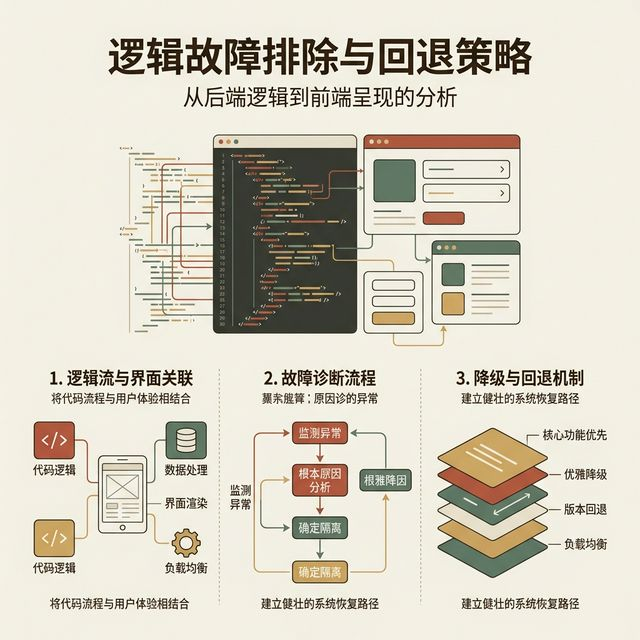
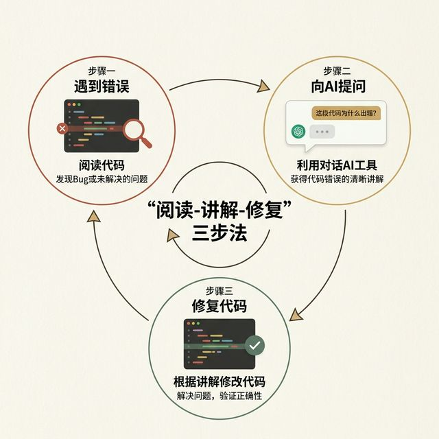
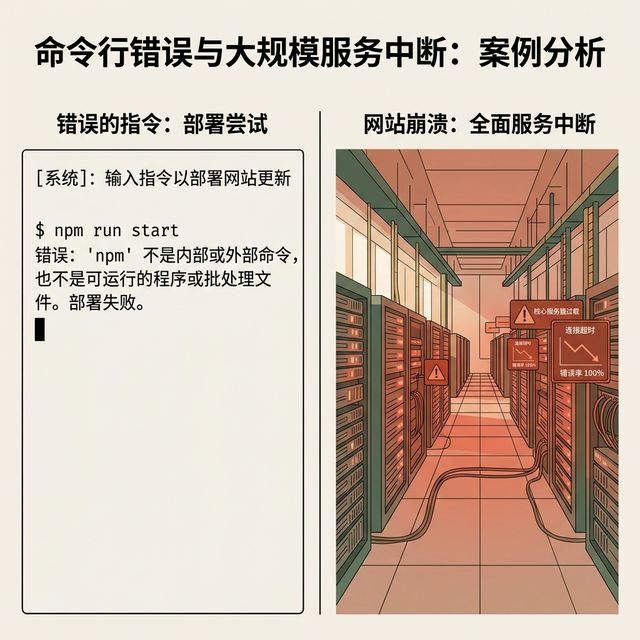

## 模块 1: 代码不是黑箱 —— LLM 辅助代码阅读
<!-- BUDGET: 5400 chars | SLIDES: ≥10 | STATUS: done -->

> [VISUAL]
> *   **Slide**: `S01_Title_W11`
> *   **Layout**: `Title`
> *   **Scene**: W11 标题页。背景是错综复杂的代码流与清晰的用户界面交织的画面，暗示代码的底层与表象。标题文字："逻辑排障与兜底策略：当 AI 生成失控时"。
> *   **Asset**: 
> *   **Text**: "W11 逻辑排障与兜底策略"

上节课，我们用 AI 为产品注入了充满生命力的微交互动效。你们的产品在视觉上，已经非常接近真实上线、乃至获得苹果设计的 App 了。弹跳的果冻反馈，丝滑的转场动画，一切看起来都那么完美。

但是，只要你把这些精美的组件组合到一起，开始处理真实的状态流转——比如，从购物车跳转到支付页，或者弹出一个带有表单验证逻辑的确认对话框——**它一定会出 Bug**。

这不仅是可能，更是必然。很正常，不用慌张。

> [VISUAL]
> *   **Slide**: `S02_Anxiety_Red_Screen`
> *   **Layout**: `Split`
> *   **Scene**: 左侧是极简优雅的界面截图，右侧是控制台密密麻麻、猩红一片 Petro Error 报错。
> *   **Asset**: 
> *   **Search**: `Frontend developer panic red console error`

在 Vibe Coding 的工作流里，AI 生成代码的速度越快，它在暗处积累的技术债和逻辑盲区也就越多。面对屏幕上突然标红的报错控制台，面对一行行看似外星文字的 `TypeError: Cannot read properties of undefined`，或者干脆就是一个点击后毫无反应、无声嘲笑你的空白页面，很多非计算机专业同学的第一反应，是巨大的恐慌。

心理学上把这种瞬间的认知冻结，叫做技术规避本能。脑子里的弹幕只有一行字："我不懂代码，完了。我的期末大作业死在这里了。"

今天，我们要打破这个心理障碍。因为在 AI 时代，设计师的定义已经被改写了。

**设计师确实不需要"会写代码"，但你必须"能读懂代码在说什么"。** 面对 Bug，你的正确姿势，绝对不是自己去翻阅厚厚的《JavaScript 高级程序设计》去啃语法书。而是要学会，让 AI 当你的专职技术翻译官。

> [VISUAL]
> *   **Slide**: `S03_Read_Explain_Fix`
> *   **Layout**: `Flow`
> *   **Scene**: 展示 "Read → Explain → Fix" 三步法的环形流程图。第一步：遇到报错（一段标红的控制台信息）；第二步：向 AI 提问（一个 Cursor Chat 气泡，强调 Explain 词汇）；第三步：定位并修复代码（绿色对钩标志）。
> *   **Asset**: 
> *   **Text**: "破局三步法：Read → Explain → Fix"

我们总结了一套极其有效的应对框架。正如大屏幕的环形图所示，它只有三个词：**Read（阅读） → Explain（解释） → Fix（修复）**。第一步，在遇到红框报错时冷静寻找证据；第二步，通过向 AI 提问让它用人话解释错误原因；最后一步才是精准定位并打上修复补丁。
这三个词听起来非常简单，但它们是一套高度纪律化的认知操作面板。接下来，我们把这三步拆开，揉碎，看看在真实的开发环境中，它到底长什么样。

> [VISUAL]
> *   **Slide**: `S03_The_Read_Phase`
> *   **Layout**: `Split`
> *   **Scene**: 界面截图，左半边是 Chrome 浏览器的 DevTools 面板，右半边标注着"Read：找到犯罪现场"。
> *   **Asset**: 
> *   **Search**: `Chrome DevTools console error reading`

**第一步：Read（阅读）。这是排障的勘察现场阶段。**
遇到问题的时候，很多人的第一反应是向 AI 抱怨："我的页面坏了，帮我修修"。
但 AI 如果没有看到控制台的红字，这是毫无帮助的。你需要准确地捕捉到"犯罪现场"的证据。
这不仅包括复制终端面板里那一串红色的报错信息，更包含了精准截获不符合预期的现象。比如，不是泛泛地说"页面坏了"，而是定位到"原本点击这个【确认删除】按钮，应该弹出一个红色警告框，但现在毫无反应"。

在前端世界里，你的主要勘探工具是 Chrome 的 DevTools（开发者工具）。
按下 F12 或者右键"检查"，你就戴上了透视眼镜。
如果页面没反应，先看看 **Console（控制台）** 面板。这里就像是系统的心电图，红色的报错就是心脏停跳的警报。
如果按钮按了没反应，再去看看 **Elements（元素）** 面板，看看刚才说的幽灵元素是不是挡在了前面。
如果数据一直加载不出来，切到 **Network（网络）** 面板，你能看到每一个发往服务器的包裹是不是被拦截了。

> [DID YOU KNOW: 如何阅读调用栈 Stack Trace]
> 当你在 Console 里看到一大片标红的报错时，不要被它的长度吓倒。那长长的一串被称为“调用栈”，也就是 Stack Trace。
> 计算机在报错时，其实是在向你汇报它的"死亡录像"。最上面的一行，是真正致命的那个错误（比如 A 试图读取空文件的内容因此崩溃）。而下面紧跟着的长长的一串路径，记录了：是谁叫 A 去读取的？是 B 面板。是谁叫 B 面板渲染的？是 C 页面。
> 所以，阅读报错的诀窍是：第一眼看最顶上的红字，知道**死因**是什么。第二眼顺着往下找，找到**第一个包含你自己代码文件名的那一行**。在那一行，计算机清晰地标出了到底是第几行、第几个字符让它走到绝路的。理解了这一点，你就看懂了报错。

在 Cursor 这样的下一代编辑器里，"Read" 变得更加高效。你可以直接圈中那段看似乱码的报错，或者打开报错的组件文件，按下 `Cmd + K` 或打开 Chat 侧边栏。把这堆外星文（调用栈），连同你对预期目标的自然语言描述，完整地打包丢给 AI。

**(Pause: 3s)**

> [ACTIVITY]
> *   **Type**: `QA`
> *   **Duration**: `5min`
> *   **Desc**: 小组讨论
> 请大家互相分享一下，在做期中 Demo 时，你们遇到的最长的一条红色报错是什么样子的？当时你的感受是怎样的？现在回头看，那是上面的 5 种错误中的哪一种？

> [VISUAL]
> *   **Slide**: `S04_The_Explain_Phase`
> *   **Layout**: `Quote`
> *   **Scene**: 巨大的金句卡片："不要让 AI 直接写代码，让它先说人话。"
> *   **Asset**: 

接下来，是这套框架里最容易被跳过，但也最重要的一步——**Explain（解释）**。

> [TEACHING MOMENT]
> 这是整个排障流程的灵魂所在。请务必记住：**绝对不要直接让 AI 给你一段修复代码去复制粘贴。让它先用人类稍微能听懂的语言，也就是自然语言，解释问题到底出在哪。**

试想一下，如果医生拿到你的体检报告，一句话都不解释，直接把你拉进手术室切开肚皮，你会是什么感觉？你会极度恐慌！
写代码也是一样。如果你习惯了"圈中报错 -> 点击 AI Fix -> 粘贴盲测"的机械操作，你不仅什么都没学到，而且当项目越来越复杂的时候，失去控制感的无力感会彻底吞噬你。

你应该使用这样的 Prompt，也就是向 AI 提问的咒语："系统现在报错说 `undefined is not a function`，请你先停下来，不要直接输出修改后的代码。请用通俗的语言告诉我，我的 React 组件在处理这个点击事件时，哪一层的逻辑链路断裂了？是状态从父组件没传过来，还是我们调用的清理函数拼写错了？"

> [PHILOSOPHY: 掌握解释域的主动权]
> 当你强迫 AI 先解释、再给代码时，你其实在做一件非常深刻的事情。你正在把彻底无法干预的黑箱（也就是代码报错），变成了可以共同探讨的灰箱（也就是逻辑因果链的分析）。这个过程，能极大缓解你对未知的恐惧。当你理解了，原来只是"后台数据还没有返回，前端就急着去读了"这么一个常识性的时差问题时，修复它，就只是一道简单的单选题。

> [VISUAL]
> *   **Slide**: `S05_The_Fix_Phase`
> *   **Layout**: `List`
> *   **Scene**: 列出 Fix 的三个黄金法则：确认逻辑定锚点、限制三轮防雪崩、善用退回保险绳。
> *   **Asset**: 

**最后一步：Fix（修复）。**
当你听懂了 AI 用通俗语言讲的诊断结果，比如"原来是因为我们把数组当成对象去按键名查找了"。此时，你才向 AI 下达手术指令："理解了，请在这个基础上，帮我写出对数据结构的安全守卫判断，加上空值防御，然后给出修复方案。"

在真正的 Fix 阶段，有两个极其重要的操作铁律：
第一，只在出问题的地方做小修补，不要让 AI"顺便重构"整个文件。大模型有一种狂热的重构冲动，如果你不栓好链子，它可能会为了修一个按钮的边距，把你整个页面的状态结构全换掉。
第二，修好之后，立刻养成 Ctrl+S 或者 Commit 到 Git 的习惯。这就是你在峭壁攀岩时打下的安全岩钉。一步一步，步步为营。

> [VISUAL]
> *   **Slide**: `S06_Frontend_Taxonomy_Title`
> *   **Layout**: `Title`
> *   **Scene**: 大字标题："前端报错的五大元凶"。配以侦探解谜的视觉元素（放大镜、散落的代码片段汇聚成五个类别文件夹）。
> *   **Asset**: 
> *   **Text**: "前端报错的五大元凶"

为了让你在听 AI 解释的时候更有底气，我们把大多数看似千奇百怪的前端错误，归结为了 5 类。理解了这 5 类分类法，或者叫 Taxonomy，你就能看透界面崩溃的底层密码。

**第一类：状态没同步，也就是 State Desync。**
这是初学者遇到最高频的坑。
现象是什么？按钮明明按亮了，开关明明拨过去了。但当你退出当前页再回来，它又变回了老样子。或者更诡异的是，下方的总计金额没有随着你的点击实时增加。
根源在于，在现代前端开发（尤其是 React 这种框架下），界面只是数据的影子。数据变了，影子才会动。状态没同步，意味着"虽然你按下了物理按钮，但你没有告诉系统背后的数据说：那个数值该加一了"。
如果拿水管来比喻，水龙头拧开了，但背后的水管其实是断裂脱节的。

> [STORY TIME: 虚假的餐厅点单机]
> 想象你去一家非常现代化的无服务员餐厅。桌面上有一个超大触摸屏（这就是前端 UI）。你点了一份牛排，屏幕上跳出了精美的动效，牛排飞进了购物车图标里，伴随着悦耳的"叮"声。
> 但这只是一场视觉魔术。实际上，这台点单机背后的网线（状态同步机制）被老鼠咬断了。厨房（后台或者状态层）根本没收到你的订单。你饿着肚子等了半小时，去后厨一问，厨师一脸茫然。
> 这就是典型的状态没同步。在 React 代码里，这通常是因为你只写了按钮的 onClick 动画，却忘记调用 `setCount(count + 1)` 来更新数据源。

遇到这类问题，让 AI 解释的时候，关键词就是问它："请帮我检查一下，这个组件的 State 更新函数，是不是没有被正确触发？"

> [VISUAL]
> *   **Slide**: `S05_Taxonomy_Event_Leak`
> *   **Layout**: `Split`
> *   **Scene**: 左侧是鼠标疯狂点击无响应的鬼畜动图。右侧是文字解析："事件监听泄漏"。
> *   **Asset**: 

**第二类：事件没绑好，或者监听泄漏，英文是 Event Listener Leak。**
现象很有戏剧性。要么是点击事件触发了个寂寞，如泥牛入海。要么是走向另一个极端——你点了一下，页面不仅响应了，而且疯狂地重复响应了十几次，甚至直接吃光内存卡死浏览器。
为什么？因为在代码层面我们经常告诉系统："你帮我盯着这个按钮，有人按了你就报告"。如果组件卸载了（也就是你离开这个页面了），你忘记跟系统说"别盯了"，系统就会一直留个耳朵在那儿，也就是我们说的监听器没有清理任务。

> [LIFE CONNECT: 雇佣保安的比喻]
> 这一类错误，就像是你雇了保安来看大门。第一天你雇了一个保安。第二天你又雇了一个保安，但你忘了把第一天的保安辞退。到了第三十天，门口站了三十个保安。
> 这时候，只要大门一响，三十个保安同时冲对讲机大喊："有人进来了！" 整个对讲机系统瞬间过载瘫痪。
> 在前端世界里，这就是生命周期里的 cleanup 函数缺失。每次进入这个页面，React 就多挂载一个监听事件。点击一次，几十个函数同时开跑，这就是著名的"内存溢出"或者"无限循环"。碰到这种疯狂报错的现象，就让 AI 重点排查 `useEffect` 生命周期里的卸载清理机制。

**第三类：样式被覆盖，即 CSS Cascade Conflict。**
这可能是最让人抓狂、但也最容易修复的问题。
现象是：界面长得乱七八糟，或者按钮依然点不动，但在开发者工具里看，逻辑却全是对的。为什么？因为在物理世界，我们不可能隔山打牛。而在浏览器的三维空间里，也就是被称为 Z 轴的层级上，经常会有一块完全透明的 `
` 容器，幽灵般地漂浮在你的交互元素正上方。

> [CASE STUDY: 幽灵玻璃面板]
> 在 2021 年某个大型电商网站的改版中，用户疯狂投诉某个商品的"加入购物车"按钮坏了。工程师查遍了所有的交易链路代码，均没有发现问题。
> 最后发现，罪魁祸首是一行新加的 CSS。他们给页面顶部的一个通知横幅加了一个透明的阴影层，而这个阴影层的 z-index（也就是垂直于屏幕的层级）设得极高，同时尺寸没控制好，延伸到了整个页面底部。
> 结果就是，用户其实一直在点击这块隐形的玻璃，根本没有摸到购物车按钮。明明按钮在那，但你的每一次点击，实际上都落空了。

> [DID YOU KNOW: 破解幽灵遮挡的 3D 透视镜]
> 当你怀疑是被不可见的幽灵元素遮挡时，不要在密密麻麻的 `<html>` 标签树里苦苦寻找。前端其实给你配备了一把强大的"3D 物理透视镜"。
> 在 Edge 浏览器或者装了独立插件的 Chrome 中，开发者工具里有一个功能叫做 "3D View" (3D 视图)。
> 当你点击它，原本平面的网页瞬间就像一本立体书一样弹射展开，按照 `z-index` 的层级，所有的 DOM 元素会悬浮在空中排成叠层。
> 在这个 3D 上帝视角下，谁压在谁上面、那块巨大的透明幽灵玻璃到底属于哪一层、是怎么盖住底层按钮的，一切都一目了然。这个功能是新手排查层级层叠冲突（Z-Index Context）的终极物理降维打击武器。
> 如果你没有 3D 视图，也可以直接在控制台的对应的神秘遮挡盒子上强行加上一句 `pointer-events: none;`（鼠标事件穿透）。如果按钮瞬间能点了，凶手就立刻锁定了。

这时候，你可以直接截个图发给 Cursor Chat，问的关键词是："这个按钮点不中。帮我检查一下排版层级（CSS z-index Specificity），是不是有别的浮层容器，因为透明或者 pointer-events 没设置好，遮挡了我的点击区域？"

> [VISUAL]
> *   **Slide**: `S06_Taxonomy_Missing_Dependency`
> *   **Layout**: `Split`
> *   **Scene**: 零件散落一地的机器图解。文字标注："组件没引入 / 渲染失败"。
> *   **Asset**: 

**第四类：组件没引入，也就是 Render Failure。**
这种报错往往非常决绝。整个屏幕直接变成死寂的白色。如果按下 F12 打开开发者工具，你会看到猩红色的报错语：`ReferenceError: X is not defined` 或者 `Cannot read properties of undefined`。

你明明用了别人造好的酷炫轮子，把一整段画廊组件的代码粘过来了。但忘了在文件最开头写上一句小小的 `import` 导入语句。
这就好比你想用微波炉热饭，微波炉也放在厨房了，饭也放进去了。但你压根没插电源。没有 `import` 引入环境，它就是一堆毫无生气的死代词。

> [PHILOSOPHY: 认知负荷的边界]
> 很多同学看到 `undefined`（未定义）这个词就感到无比恐惧，觉得代码彻底坏了。其实，计算机是非常诚实的。当它说 undefined，它的意思仅仅是："我走到这个地址敲门，但屋子里没这个人"。
> 也许是你拼错了名字（首字母没大写），也许是你忘了把它请进屋里（没有 import）。这就是典型的渲染前置错误。

遇到白屏，不要发呆。把那堆红字整体圈中丢给 AI，让它帮你排查作用域中的依赖项是否引入完整。

**第五类：API 或者数据获取失败，也就是 Data Fetch Failure。**
当你的前端开始跳出单机版，尝试向云端服务器请求那些真实的、动态的数据时，这也是一个初学者的重灾区。
最让外行恐惧的名词通常是 `CORS`（跨域资源共享）。

> [LIFE CONNECT: 跨域海关拦截]
> CORS 就好像是国家之间的海关护照系统。
> 你的前端代码住在 A 国（比如 `localhost:3000`）。你想去 B 国的服务器要一个用户头像数据。你的浏览器带着请求过去了，但 B 国服务器一看你的护照是 A 国的，而且 B 国的安保配置里没有说要把 A 国列入白名单。
> 结果也是毫无悬念——你的包裹被无情拦截了，并且扔回给你一张红牌。
> 在开发者工具里，你会看到网络面板标红。
> 另外一种情况则是，服务器确实给回了包裹，但代码试图用打开普通文本箱子的方式，去解压一个用 JSON 压缩算法封装的加密包裹。结果因为格式不对，解包失败，代码再次白屏。

> [TEACHING MOMENT: 弱网断崖与延迟的诚实性]
> 除了跨域和解包错误，还有一个隐藏极深的原型杀手：网速。
> 程序员在装有千兆光纤、延迟仅 2 毫秒的实验室里测出来的完美原型，一旦交给在地铁里用手机 4G 网络的真实用户，会发生什么？
> 在那漫长的 3 秒钟加载时间里，如果没有写 Loading（加载中）动画的兜底逻辑，用户会以为页面卡死了，从而疯狂狂点按钮，导致向服务器发射几十个重复购买的请求。
> 我们在前面提到，永远不要假设"乐观路径"。作为交互产品的导演，你必须学会刻意使用 Chrome 开发者工具网络面板里的 "Throttling"（网络节流）功能。下拉菜单选到 "Slow 3G"（慢速 3G）。
> 只有在这种人为制造的痛苦延迟中，你才能亲眼看到那些你以为瞬间完成的数据同步，在真实世界中到底断裂成了什么极其丑陋的碎片。一旦原型在这种极端压力下挺住不死机，你才是真正降伏了那头名为"API"的怪兽。

遇到页面一直转圈加载、数据无法呈现。打开 Chrome 浏览器的 NetWork（网络）面板卡片，截图并交给 AI。让它帮你定位，究竟是跨越围墙时的海关拦截，还是拿回数据后的解包错误。

> [VISUAL]
> *   **Slide**: `S07_AWS_S3_Crash`
> *   **Layout**: `Split`
> *   **Scene**: 左侧是命令行黑底白字界面，显示一条错误输入的指令；右侧是大片的数据中心变红、网站集体宕机的插画。
> *   **Asset**: 
> *   **Text**: "一个参数拼写错误，也就是 Typo 引发的血案"

> [CASE STUDY: AWS S3 史诗级宕机与对命令行的敬畏心]
> 在我们讨论 AI 瞎改代码的边界之前，让我们来看一个发生在真实人类顶尖工程师身上的灾难。
> 2017 年 2 月，亚马逊 AWS 的 S3 存储服务在北美地区发生了史诗级的全面宕机。导致包括 Quora、Slack 在内的半个外网直接瘫痪了几个小时。
> 宕机的原因是什么？是被黑客攻击了吗？是底层架构设计缺陷吗？都不是。
> 仅仅是因为一名工程师在调试计费系统时，试图在命令行界面通过输入代码指令，删除"少量"的服务器节余。但在那个没有任何安全弹窗和物理隔离防护的 Naked Engineering Model（裸露工程模型 )界面里，他敲错了一个极其简单的参数拼写错误（Typo）。
> 毫无畏惧判断代码的系统毫不犹豫地、完美地执行了这行带有错字的毁灭性指令，瞬间将大批支撑整个 AWS 核心索引运行的骨干服务器全部删除。
> 在前端和软件排障的世界里，代码的执行是没有人情味可言的。当你不去仔细阅读你在终端里到底输入了什么，当你随便复制一段 AI 给出的、你根本看不懂的 Bash 脚本或者大段前端重构代码，然后轻率地按下回车键时，你就是在重金押注。在没有安全网的纯代码环境里，一个字符的偏差，就是生与死的距离。这是我们在进行 Read（阅读）时，必须保持极端谨慎和敬畏心的最核心原因。

> [CASE STUDY: AI 无法修复的 10% 边界与吉娃娃效应]
> 这里我要特别强调一个 Vibe Coding 工作流中的终极边界问题。这也是从硅谷高级工程师到新入行的设计师都会遇到的死胡同。
> 如果你把报错交给了 AI 修复，AI 愉快地给出了代码，你贴进去了。结果不但没修好，反而报了一个全新的错。你把新报错又扔给 AI，它煞有介事地向你道歉，然后给出了另一套剧烈修改的代码，导致页面连原本正常的部分也彻底崩溃。
> 在 AI 圈子里，这被称为"吉娃娃效应”，英文叫做 Chihuahua Effect：大模型就像一只过度热情的吉娃娃，极度渴望讨好你，当你指出它的错误时，它甚至会推翻自己原本完全正确的逻辑，胡乱编造出一种看似合理的复杂方案，只为了回应你的批评。

**记住这个 Vibe Coding 的死铁律：事不过三。**
当 AI 像无头苍蝇一样反复修改、两三轮沟通仍然无法修复核心错误时。立刻停下来！绝对不要顺着它的思路继续往下深究，更不要陷入无底洞般的修改泥潭。如果它开始建议你"更换整个全局路由库"或者"重写所有的状态传递"，这说明这个问题涉及到了跨文件的复杂状态关联，或者历史代码逻辑太长，超出了它暂时的上下文窗口记忆极限。

> [PHILOSOPHY: 症状修复 vs 架构重塑]
> AI 的天性是"头痛医头脚痛医脚"。当按键不亮时，它的第一反应是强行注入一行干预样式的代码（症状修复）。
> 但真正的架构师思维是去思考：为什么传递给按键的参数丢失了？（架构重塑）。
> 如果你放任 AI 不断进行症状修复，你的代码里就会布满各种 `if/else` 的创可贴，最终在下一次引入新功能时全面崩盘。

这个时候，你的最优解是使用 `git reset` 撤销，或者利用你的云端/本地历史记录机制，干脆利落地回退到上一个还能正常跑动的可用版本。
然后，不要扔报错给它了。而是扔一张整个系统架构或者组件层级关系的草图给它，让 AI 跳出报错本身，重新从结构层面审视你的代码设计。

明确了这 5 类错误元凶，以及不要盲改代码的纪律，你就拥有了俯视代码崩溃的上帝视角。
你不再是盲目复制报错信息的机器，也不再是对 AI 言听计从的代码搬运工。你是外科医生，借助 AI 递给你的解剖刀，精准地对症下药。
让 AI 帮你定位是这 5 类中的哪一种，先拿到解释权；然后再让它给出 **Fix（修复）** 的代码；如果修不好，你懂得拉下电闸。
这就是你作为新时代交互产品"导演"把控项目全局，将 AI 从主刀医生降格为手术助手的必备核心技术素养。

---
