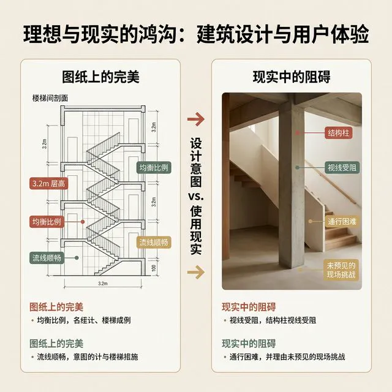
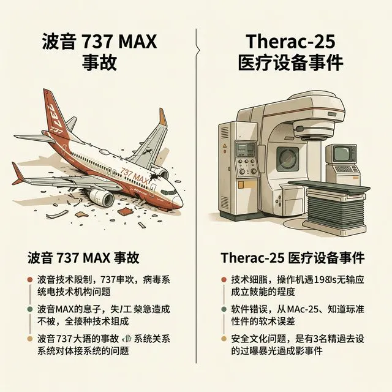
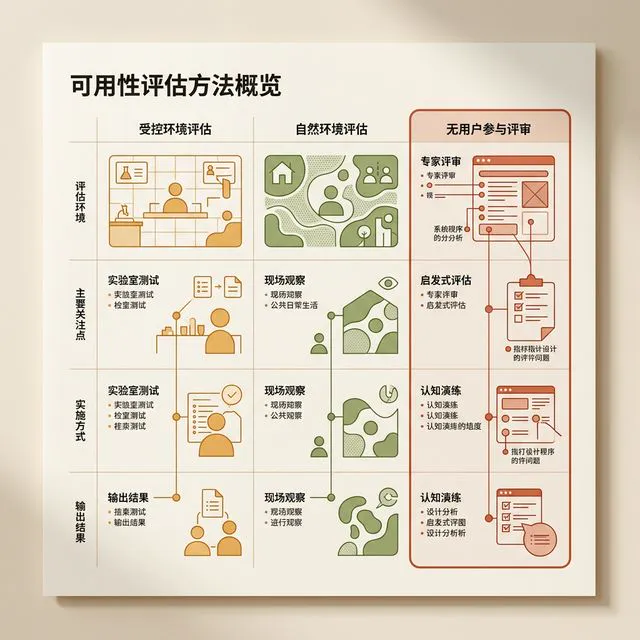
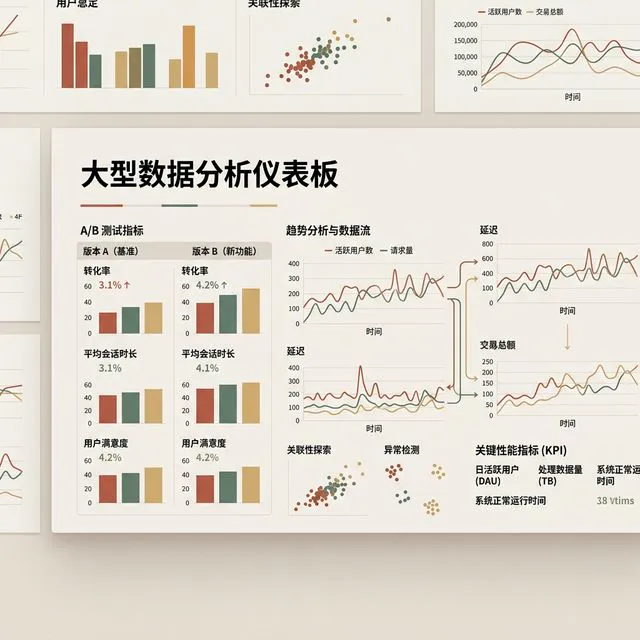
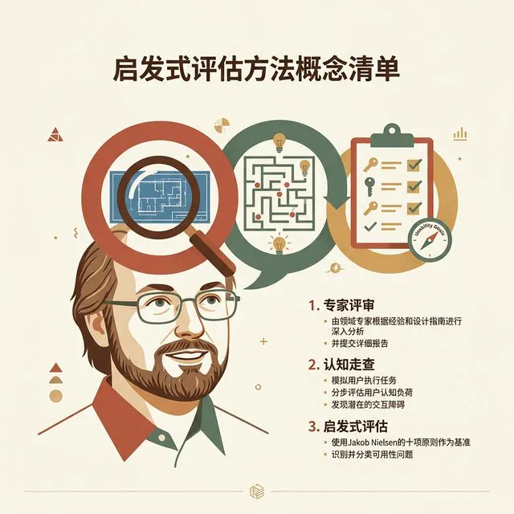

## 模块 1: 我们为什么需要评估？
<!-- BUDGET: 3600 chars | SLIDES: ≥7 | STATUS: pending -->

> [VISUAL]
> **Slide**: M1-01
> **Layout**: `Full`
> **Scene**: 两张风格迥异的对比图。左半边是一张极致精美、标满完美几何比例的建筑设计图纸（代表设计师脑中的理想框架）；右半边是实际建成的楼梯，走廊正中间荒诞地立着一根承重柱，行人必须侧着身子挤过去。
> **Search**: `design vs user experience meme bad architecture`
> **知识节点**: `evaluation-framework-overview`
> *   **Asset**: 

各位同学，大家下午好。欢迎来到交互产品开发的第十二周。

上周我们刚刚穿越了前端开发的生死线，专门去讲了「逻辑排障与兜底策略」。现在，我相信在座各位原型的基础状态流转已经没有问题了，代码能跑通，数据流是正确的，所有按钮按下去都有反应了。

但如果在今天这节课开始前，有人问你：“你的交互产品设计得好吗？”
很多同学可能会很自信地说：“挺好的啊，我测试过了，全都没有 bug，而且 UI 还挺好看的。”

但这周，我们要向这种天真的自信发起挑战。我们要问一个更残酷、更刺痛灵魂的问题：**代码跑通了，界面画完了，Bug 全修复了，就等于产品「好用」吗？**

我们来看大屏幕上的这张经典 Meme 图。
左边，是你们坐在电脑前、对着 Figma 时脑子里的画面。结构严谨，美学拉满，网格对齐，完美无瑕。
右边，是用户在实际生活中的体验。设计是在平地起高楼，但用户走在走廊里时，迎面撞上一根承重柱——哪怕柱子表面贴了再高级的大理石瓷砖，用户体会到的，只有“骨折的剧痛”。

**在交互设计领域，最大的、也是最致命的错觉之一，就是你以为你懂用户。**

各位可能觉得，“好用”或者“难用”只是一件关乎用户心智的小事。最多也就是让用户卸载你的 App 罢了。
但这门课走到现在，我们必须把交互设计的严肃性再拔高一个维度。
当我们讨论产品没有经过严格“评估”就推向市场时，它面临的不仅仅是商业上的失败，甚至可能是生命安全上的灾难。

> [VISUAL]
> **Slide**: M1-02
> **Layout**: `Split`
> **Scene**: 两张沉重的灾难现场图。左侧是 2018 年坠毁的波音 737 MAX 飞机残骸（代表机内隐藏系统 MCAS 对飞行员的“夺权”）；右侧是 1980 年代一台极其笨重的 Therac-25 医疗放射理疗机。
> **Search**: `boeing 737 max crash | therac-25 radiation therapy machine`
> **知识节点**: ch14-16-evaluation
> *   **Asset**: 

在软件工程史上，有两次因为可用性缺陷和交互逻辑崩塌而导致的惊天惨案。

> [CASE STUDY]
> 
> 第一起，是发生在上世纪 80 年代的 Therac-25 医疗放射治疗机事件。这台机器是当时世界上最先进的放疗设备，它的代码运行“非常完美”，在出厂前通过了所有的软件编译器测试。但是，它的操作界面存在一个极其隐蔽的人机交互地雷。
> 它的系统状态可见性极差。当工程师在后台的工程模型中切换到“致命的高能 X 射线模式”时，前面的操作屏幕上仅仅闪烁着几个晦涩的内部状态码，比如 "Malfunction 54"。对操作它的护士来说，这种报错太平常了，系统并没有给出任何带有强烈警告性质的拦截或者解释。
> 人是有适应性的，人类有一种强烈的“巴甫洛夫式习惯化（Pavlovian Habituation）”。护士们习惯了机器总是在报一些看不懂的小错误，于是他们习惯性地按下 "P"（Proceed，继续）键去跳过这些警告。
> 结果是什么？因为没有经过严密的以真实用户为中心的“可用性评估”，这个界面缺陷导致机器向患者输送了超过致死剂量 100 倍的核辐射。这直接导致了 3 名无辜患者的惨死。代码没写错，但界面“杀”了人。
> 
> 第二起，离我们更近。那是两架波音 737 MAX 客机的坠毁，夺走 346 条人命。
> 波音为了不重新培训飞行员，便要解决飞机因为引擎位置改变而容易抬头失速的物理缺陷，在后台偷偷写了一段叫 MCAS（机动特性增强系统）的代码。
> 这段代码的交互逻辑简直堪称灾难：当它的某个传感器（且是单点故障的传感器）认为飞机抬头过高时，它就会强行夺取飞机的控制权，把机头往下压。最致命的是，波音在操作手册中**向飞行员隐瞒了这套系统的存在**。
> 当飞机疯狂下坠，机舱警报大作、各种仪表的错误代码闪成一团时，绝望的飞行员在短短的几十秒内，根本无法建立正确的“心智模型（Mental Model）”。他们不知道是在和一个隐藏在暗处的 AI 抢夺飞机的控制棒。
> 这也是一场赤裸裸的“评估”缺失。如果波音在开发这套系统时，把真实的飞行员请进模拟舱，做一个哪怕最基础的“受控环境可用性测试”，他们就会立刻发现——飞行员在面对突发坠机警报时，根本不可能在三秒内奇迹般地猜出这是 MCAS 系统在作祟。

> [LIFE CONNECT]
> 
> 回到我们的课堂。诚然，在座的各位大多不是去造飞机、做医疗器械。你们开发的是记账 App、是社交游戏、是校园工具。
> 各位可以回忆一下，有没有哪次你给父母或者长辈安装一个新 App，你觉得那个界面布局“显而易见”，那个汉堡包菜单“谁都知道里面是设置”。但你的父母对着屏幕看了十分钟，最后小心翼翼地问你：“儿子，下一步到底该点哪里？”
> 当你的代码和 UI 被投入到复杂的真实世界，面对着拥有不同心智模型、不同疲劳状态、不同认知负荷的活生生的人时，所有的“理所应当”都会支离破碎。这就是为什么不管你在这门课前面十一周学了多少前沿技术，写了多牛的并发请求，如果你跳过本周，你们的项目依然有极大可能会在期末遭到用户无情的抛弃。

这，就是我们为什么迫切需要**“评估（Evaluation）”**。
评估，不是老板走过来随便看一眼点个赞，也不是你自己一个人坐在电脑前疯狂点鼠标假装自己是小白；评估，是在产品的生命周期中，系统地收集、分析产品体验数据。它的目标极其纯粹、甚至冷酷——就是在产品真正投入市场、彻底搞砸整个口碑、甚至酿成大祸之前，把那些隐藏在精美代码背后的“隐形地雷”一颗颗全部排掉。

> [VISUAL]
> **Slide**: M1-03
> **Layout**: `Flow`
> **Scene**: 可用性评估三大分类矩阵。高光强调第三个类别"非参与者检查"。
> **知识节点**: evaluation-framework-overview
> *   **Asset**: 

那么，到底怎么排雷呢？在人机交互的严谨学术体系里，评估绝不是玄学，而是一套成熟的、经过工业界千锤百炼的工程化框架。按照是否有真实用户参与、以及环境的受控程度，我们可以把可用性评估清晰地划分为三大主流阵营：

> [VISUAL]
> **Slide**: M1-04
> **Layout**: `Full`
> **Scene**: 一间典型的可用性实验室（Usability Lab）。一面单向透视玻璃，玻璃这边是紧张观察的研究员和眼动仪数据屏幕；另一边是正在使用手持设备的用户，周围有多个摄像机机位。
> **Search**: `usability lab testing one way mirror eye tracking`
> **知识节点**: evaluation-framework-overview
> *   **Asset**: 

**第一类：受控环境（测试），即我们常说的可用性实验室测试。**
想象一间带有单向透视玻璃的房间。玻璃的一边，是你请来的真实代表性用户；玻璃的另一边，是手心出汗的设计师和研究员。用户被要求完成特定的任务，比如“在这个测试版电商 App 里买一条打折的牛仔裤”。在这个过程中，我们不仅用摄像机记录他们的面部表情，还会用眼动仪追踪他们的视线落点，甚至用皮肤电反应传感器测试他们的紧张程度。
这通常会搭配大家以后会学到的 **“出声思考法（Think-Aloud Protocol）”**——要求用户一边操作，一边大声说出自己脑子里在想什么：“哎，这个按钮怎么点不动？是不是网络断了？”
- **优势**：数据极其精准且“知其然更知其所以然”。你能亲眼看到用户的无助，并立刻问他“你刚才为什么在这个页面停留了 10 秒”。
- **劣势**：极其昂贵和缓慢。租用实验室、招募代表性用户、给予高额报酬、漫长的数据编码分析……做一次完整的可用性测试，至少需要几周时间和几万甚至十几万的预算。对于今天两周一发版的互联网产品来说，这太奢侈了。

> [VISUAL]
> **Slide**: M1-05
> **Layout**: `Full`
> **Scene**: 满屏幕密集跳动的数据面板看板（Dashboard）、大红大绿的代码折线图，隐喻后台冷酷无情的大数据分析。
> **Search**: `big data analytics dashboard a/b testing metrics`
> **知识节点**: evaluation-framework-overview
> *   **Asset**: 

**第二类：自然环境（观察），或者叫“野外测试（In the wild）”。**
这就是为什么你们每天用的主流大厂 App，实际上无时无刻不在把你当“小白鼠”。产品直接上线，不派任何研究员干预用户，只在服务器后台看真实的日志。
比如最著名的 A/B 测试：给一半的用户展示红色的购买按钮，给另一半展示蓝色的，跑一星期，看哪个转化率高就用哪个。这属于绝对的自然生态规律。
- **优势**：数据规模极大，彻底消除了用户在实验室里“被观察时的表演欲（霍桑效应）”。
- **劣势**：第一，这面临着严重的**生存者偏差和只看结果不问原因的陷阱**。数据可以告诉你“红按钮点击率高”，但永远无法告诉你“为什么蓝按钮没人点”，因为死掉的用户不会发声。第二，代价惨痛——如果在自然环境中发现致命问题去重构代码，开发成本是你在画线框图时修改成本的 100 倍以上。你是在拿真实用户的流失和公司的金钱去买教训。

> [VISUAL]
> **Slide**: M1-06
> **Layout**: `Split`
> **Scene**: 罗列“无参与者检查”的几种方法：专家评审、认知走查、启发式评估。高亮“启发式评估”，并配上 Jakob Nielsen 的名言：“It is better to have 5 users find 85% of problems than to have 0 users.”
> **Search**: `jakob nielsen discount usability engineering quotes`
> **知识节点**: heuristic-evaluation-methodology
> *   **Asset**: 

**第三类：无直接参与者（检查），也就是今天的主角。**
既然找真实用户进实验室太贵，直接上线观测又太晚、太痛，有没有一种折中方案？
有。那就是不找所谓的真实“小白用户”，而是由**专家或者经过系统准则训练的同行（Evaluators）**出马。他们带着专业的“找茬”眼光，对着你的交互原型甚至纸面草图，逐字逐句深度扫描。
这里面有你们以后可能会听到的认知走查（Cognitive Walkthrough），以及目前工业界使用最广、性价比最高的——**启发式评估（Heuristic Evaluation）**。

> [PHILOSOPHY]
> 
> 评估的时机决定了它的真正价值。
> 在学术界，我们将评估严格划分为两类：**形成性评估 (Formative)** 与 **总结性评估 (Summative)**。

什么是总结性评估？类似于期末考试。产品已经做完了，上线前做最后一次大体验收，看看能拿多少分。如果是 60 分，你除了哭毫无办法，因为代码已经写死了。
什么是形成性评估？类似于平时的随堂小测验。边做边测，目的是“形塑（Form）”和“优化”产品。在原型阶段发现哪里设计歪了，立刻在 Figma 里拖拽修改，零代码成本。

启发式评估，就是最犀利的**“形成性评估”武器**。

> [VISUAL]
> **Slide**: M1-07
> **Layout**: `Flow`
> **Scene**: 廉价可用性工程（Discount Usability Engineering）效益曲线。横轴为评估员数量（1-15），纵轴为发现的可用性问题比例（0-100%）。曲线显示，哪怕只有 5 个评估员，也能发现超过 75% 的问题；在此之后，收益急剧衰减。
> **Search**: `heuristic evaluation evaluators curve nielsen`
> **知识节点**: heuristic-evaluation-methodology
> *   **Asset**: 

在这个领域，我们必须致敬一个人，那就是尼尔森（Jakob Nielsen）。
在 1990 年代以前，大公司（比如 IBM、微软）做一次可用性测试像搞航天发射一样兴师动众。但尼尔森提出了一场革命，叫作 **“廉价可用性工程（Discount Usability Engineering）”**。

他通过大量的实证数据发现了一个惊人的事实：
如果你只让 1 个专家去走查你的界面，他大概能发现 35% 的毛病。
如果你增加到 **3 到 5 个** 背景各异的评估员，他们能够找出界面中超过 **75% 的核心可用性问题**。
但是，如果你找来 15 个人甚至更多，多出的那些人通常只会重复发现前面的 5 个人已经找到的常见问题，边际收益急剧衰减。

这个发现拯救了无数中小企业。你不需要花十万美金建实验室，你只需要拉上你们团队里的 3 位前端、2 位产品经理、甚至 1 位隔壁组的非项目亲属，大家把几张规则（Heuristics）死死印在脑子里，坐下来花一个下午，对着你的原型一顿交叉审查。
这就是启发式评估的核心奥义——**用最低的成本，在代码全面锁死之前，排掉 75% 甚至 80% 的地雷。**

> [ACTIVITY]
> **Type**: `Warm-up`
> **Duration**: `10 mins`
> **Desc**: 找茬游戏 (Bad UI Bingo) 
>
> **目标**: 感受“没有受过启发式原则训练”的用户在面对反直觉界面时的无力感与挫败感。
> **步骤**: 
> 1. 请看前屏幕。我会连续投射 3 张存在极其严重可用性问题的真实商业 App 截图（如：把“返回”按钮做成了红色的垃圾桶图标、极度隐蔽甚至颜色和背景融为一体的复选框、点击后文字飘走等）。
> 2. 小组内部用 3 分钟时间，以最快速度尽可能多地圈出图中“让你感到不适和反直觉”的地方。
> 3. 每个小组派一名代表抢答，并且不仅要说出哪里怪，还要用一句话说清“它为什么难用，你当时想砸手机的冲动是从哪里来的”。
>
> **目的**: 通过最直观的“烂设计”体验，唤醒大家对设计的敬畏之心，为接下来的 Nielsen 十大原则教学做痛点铺垫。

在发许可证之前，我们必须厘清一个很多人甚至资深从业者都会混淆的核心问题：
**启发式评估 ≠ 大家坐在一起的产品体验吐槽会（Bug Bash 或 UI Review）。**

你们之前在团队里是怎么体验自己产品的？通常是产品经理或者主程序大喊一声：“大家自己装个包，随便点点看有什么问题！”
于是前端抱怨按钮颜色不好看，后端抱怨加载慢，UI 设计师觉得图标像素没对齐。大家七嘴八舌提了一堆意见，最后发现谁也说服不了谁，只好不了了之。
这种随意的内部走查，其最大的问题就在于**缺乏共同的度量衡**，完全依赖于评估者当时的个人喜好和注意力分配。

而真正的启发式评估（Heuristic Evaluation）之所以能在国际上获得极高认可度，是因为它具备三个不可替代的严肃性特征：

第一，**它是“准则驱动（Rule-Driven）”的。**
评估者不能说“我觉得这个交互很怪”，他必须明确指出“这个交互违反了 Nielsen 的哪一条原则，导致了什么影响”。如果一个设计确实让你觉得别扭，但你就是翻遍法则也找不出它违背了哪一条，在正式的评估报告中，这就不算高优严重问题。这极大地约束了团队的“杠精行为”，把主观的审美分歧，拉回到了客观的人机交互通用法则上。

第二，**它要求“独立作业，背靠背（Independent Execution）”。**
在尼尔森发明的流程中，最忌讳的就是 5 个评估员围在一个投影仪前一起看。为什么？因为人有从众心理（Bandwagon Effect）。一旦最权威的讲师说了“我觉得这挺好的”，剩下 4 个本来觉得难用的人可能就闭嘴了。
正确的做法是：每个人拿一份评估表，互不干扰地独立走查整套交互流程，自己记录。等到所有人都走查完毕后，大家才把表格汇总（Aggregation）讨论。这保证了每一个阴暗角落的 Bug 都有概率被独立捕捉到。

第三，**它是“双遍扫描（Double Pass）”的。**
走马观花地点一遍是找不全毛病的。标准的启发式评估要求评估员至少走两遍。
第一遍，不带任何任务，以自由探索的方式漫游整个 App，建立起产品架构和交互全貌的心智模型。此时你是在假装一个新手。
第二遍，带着明确的任务清单（比如“完成一次无密码找回登录”），逐个页面、逐个控件地对着十大原则展开无死角的矩阵式排查。

这三点加起来，才构成了一个真正具有学术严谨性和工程可复用性的启发式评估体系。
所以，各位同学，当你们今天下午坐在那里，打开别组同学花了两周心血做出来的产品时，请收起随意的口头吐槽。你要扮演的，是一个佩戴了“Nielsen 法则”这副透视眼镜的冷酷审计官。

通过刚才的小游戏，大家发现了，你们作为“专家”，如果不佩戴这副眼镜，看到烂设计只会说“这太难用了”。一旦戴上这副眼镜，你能立刻精准定位病灶：“它违反了第五条防错原则”。
这就是专家和小白的区别。这就是我们需要标准的原因。而在座的各位如果要戴上这副透视眼镜，你们需要的第一把武器，就是 Nielsen 十大原则。

---
