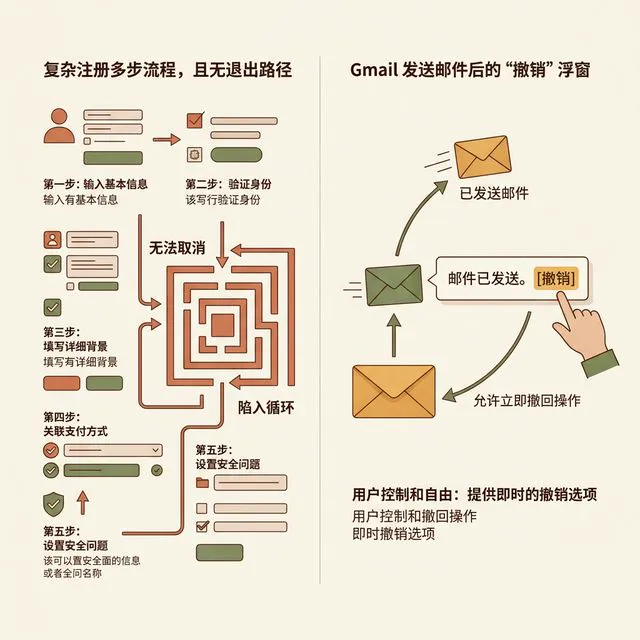
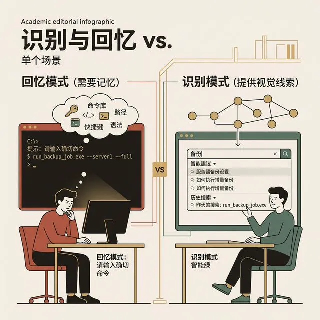

## 模块 2: Nielsen 十大原则走查 (上) 
<!-- BUDGET: 6300 chars | SLIDES: ≥12 | STATUS: pending -->

专家评审绝对不能靠拍脑袋、凭直觉地说“我觉得这颜色有点辣眼睛”或者“这按钮放哪儿好呢”。当我们要在这个专业领域安身立命，你需要一把举世公认的标尺。

在这门课中，甚至在整个全球人机交互工业界，这把最著名、最普适的尺子，叫 **Nielsen 十大可用性原则**。这是人机交互领域的泰山北斗 Jakob Nielsen 博士，在 1994 年，通过极其苦闷地分析了 249 个跨越各种平台的真实可用性失效问题后，高能浓缩提炼出来的“启发式”（Heuristics）经验法则。
所谓“启发式”，并不意味着这是一套如同牛顿定律般绝对精确的代码公式，它是你在迷雾森林里生存的那些最高效的“拇指法则（Rules of Thumb）”。

这十条原则，就是你们今天下午、乃至你们未来十年职业生涯里，执行界面跨组走查的铁血“审计清单”。由于内容体量巨大，我们将其切割为上下两关。准备好你们的大脑，我们现在推开第一道大门。

> [VISUAL]
> **Slide**: M2-01
> **Layout**: `Split`
> **Scene**: 状态可见性对比。反面案例：一个点击后毫无反应的"提交"按钮，旁边放着一个满脸大汗拼命戳屏幕的用户。正面案例：点击后立刻变为幽暗的不可交互态（Disabled），按钮中央缓缓转动着一个小巧的 Loading 菊花，下方清晰地浮现一行字："正在努力上传表单数据 (45%)..."。
> **知识节点**: nielsen-h1-h2-visibility-realworld
> *   **Asset**: 

**H1: 系统状态可见性 (Visibility of System Status)**

> **原版圣经翻译**：The design should always keep users informed about what is going on, through appropriate feedback within a reasonable amount of time. (系统应该在一段合理的时间阈值内，通过恰如其分的反馈，始终让用户如同洞若观火般了解系统此刻正在遭遇什么。)

这句话听起来像是一句永远不会错的老生常谈，甚至有点像正确的废话。但在真实的、血肉横飞的互联网开发第一线，这绝对是遭到背叛频率最高的一条法则。

为什么会背叛？病根出在各位自己身上。
因为作为系统的亲生父母——开发者，系统状态对你来说绝大部分时间是**全透明可见的**。你看着 Chrome 开发者工具里跳动着一列列绿色的 200 OK 请求，你看着 IDE 的控制台里像瀑布一样刷新的后台日志，你在办公室冷气里翘着二郎腿，心里想着：“系统正在疯狂全速运转，算法算得很完美，一切棒极了”。
但请你醒醒，转过头去看看玻璃屏幕另一端的普通用户。他们没有你的控制台，他们看不到你那优雅的 SQL 语句。他们唯一能抓住的，只有屏幕上那几平方厘米发光的像素点。如果你傲慢地不把后台那些奔涌的“隐性代码状态”转化成界面前端的“显性视觉反馈”，在用户的精神世界里，你的系统就是一具冰冷的尸体。死机了。

> [TEACHING MOMENT]
> 
> 让我们把视线从冷酷的代码拉回最通俗的物理世界。想象一下你在公司的茶水间用微波炉热饭，你按了“定点极速高火 3 分钟”，然后豪迈地拍下了“启动”大本营。
> 但是，非常诡异的一幕发生了：微波炉里的那一盏昏黄的橘黄色照明小灯没有亮起，里面的玻璃转盘没有像往常那样开始缓慢旋转，整台古董机器死一般寂静，没有发出那种让人感觉在真正发热的低沉“嗡嗡”底噪。你死死盯着面板上还在有条不紊倒数的液晶数字，你心里会升起一股怎样的寒意？
> 你绝对会强烈地怀疑它是某个地方短路彻底烧毁了。你甚至会忍不住不顾安全警告去强行拉开那扇带防辐射网的门，去摸一摸你的饭盒是不是还是冰凉的。
> 灯光、旋转的托盘、嗡嗡的底噪——对于微波炉这个工业复杂系统而言，这些统统都是它恩赐给你的极其宝贵的“状态可见性反馈”。

在我们构建的交互界面里，这种“电源没接通、机箱灯不亮”的车祸现场简直比比皆是。
大家在日常生活中，尤其是使用那些外包公司做的不够成熟的县城政务 App、或者是学校里从上个世纪流传下来的古老选课系统时，一定遇到过这种极端痛苦的遭遇：
你花了整整半个小时，极其谨慎地填完了一张比卷宗还要复杂的线上多页表格，深吸一口气，郑重其事地按下了页面最底部的蓝色大写的“最终提交”按钮。
然后，空气凝固了。什么也没有发生。
页面原地不动拒绝跳转，原本蓝色的按钮依然保持着极其无辜的蓝色，甚至都没有变成禁止点击的灰色，屏幕中央连一个极其简陋的转圈小菊花 (Loading Spinner) 都不舍得给你。
在接下来的那漫长而死寂的三秒钟里，你的心里开始发毛。“刚才我按对位置了吗？”“到底交没交上去？”“是因为校园网又无情断联了吗还是什么奇葩原因？”
在这股对未知的极度恐惧与不安全感的疯狂驱使下，人类远古的爬行动物脑本能反应是什么？是疯狂地、像帕金森一样连续不断地去戳那个按钮。
戳了十下以后，奇迹出现了！系统终于剧烈地卡顿了一下，弹出了一个让你瞬间血压拉满的 Alert 弹框：“您的报名意向表单已成功且重复提交 10 次，后台抛出主键约束重复异常”。或者更糟的剧情，是你的疯狂点击直接把这台老旧虚弱的服务器的无并发控制机制打垮了，全校系统集体报废。

这就是典型的 H1 原则被践踏的生动灾难片。没有加载遮罩动画、没有带进度刻度的进度条、没有按钮物理状态的视觉改变，用户的每一次探索行为都会从充满信心的“掌控执行”绝望地滑向充满暴力的“盲目物理试探”。

因此，大家在接手大型项目时，切记将这一句话文身在脑门上：**坚决不要让你的用户去盲猜你系统的心思。**
如果你的文件下载由于带宽限制进度将长达 3 秒以上，那你必须要有确切的进度条反馈（比如填充度），并且用极其冷静客观的阿拉伯数字明白无误地告诉他现在的生存处境是多少兆；如果这个网络交互真的很轻量级只需要半秒，你哪怕为了仪式感只是在按钮被按压的瞬间加入一个极短的水波纹闪烁动画或者是将其变成淡灰色带一个对勾图标的“已受理”状态，都比那死掉一半的高傲的寂静要强上一万零一倍。你要约束你的系统，把你们的系统训练成一个事事有回音、句句有落地的极其靠谱的职场同事，要让用户无论处境多糟糕，都能始终感受到一种被尊重的、强有力的“执行层面的绝对知情权”。

> [VISUAL]
> **Slide**: M2-02
> **Layout**: `Split`
> **Scene**: 真实世界隐喻匹配的世纪对决。反面案例：一款生鲜电商 App 竟然反人类地把承载用户想要购买果蔬的底部导购图标，画成了一个只有黑客才懂的"抽象多边形打包数据包"，并且在下方用极其生硬的六号字体写着"非持久化临时订单预备缓存区"。正面案例：依然是那辆所有人都认识的、极其经典带轮子的实体钢丝购物车图标，文字极其朴素温馨地写着两个大字："购物车"。
> **知识节点**: nielsen-h1-h2-visibility-realworld
> *   **Asset**: 

**H2: 系统与真实世界的匹配 (Match Between System and the Real World)**

> **原版圣经翻译**：The design should speak the users' language. Use words, phrases, and concepts familiar to the user, rather than internal jargon. (系统如果想得到人类的喜爱，它就应该谦卑地使用人类熟悉的日常语言交谈。使用专属于用户日常生活认知框架内的单词、具有温度的短语和直白概念，而不是把你们内部工程师的那些硬核专业黑话一股脑砸给用户。)

这条规则，如果在开发团队里拉一条生死警戒线，这几乎可以说是自视甚高的后端程序员和拼命考虑同理心的前台交互设计师之间，那道永远永远难以弥合的无底鸿沟。
各位同学，当你们从满屏纯黑敲击着幽绿代码的开发仓库里长舒一口气抬起头来，开始铺开画布为你们心爱的产品打造光鲜亮丽的界面展现层的那一刻，在此我必须要严肃地请求大家一件事：无论你要洗几遍澡，你必须要极其狠心地洗去自己身上带着的那股强烈的、俯视众生的“脱离现实的极客味”。
在设计心理学的根本矛盾里，支撑系统跑下去的法则底层网络（Engineering Model，工程底层模型往往是用关系型数据库、索引和树状结构堆砌的）和人类凭经验行走江湖的心智模型（Mental Model，比如天在上下在下，篮子可以装苹果）这两者之间，往往是近乎完全断崖式脱节的。

> [CASE STUDY]
> 
> 让我们来直观地解剖几组常常在中国本土那些追求所谓“前沿技术化”转型、却由于缺乏专业用研团队而频频爆雷的反面灾难级别案例。
> 有大量技术背景出身、长期与代码厮混导致社会交流退化的技术主导团队，在设计系统捕获到非预期状态（也就是传说中的报错）时，因为贪图省事，或者自认为酷炫，他们会直接使用生硬的底层拦截，把从遥远的云端后端扔过来的核心异常底层日志原封不动地直接粗暴吐到了面向前端的小白用户那柔弱的屏幕上。
> 于是，这幕滑稽且极具惊悚感的戏剧上演了：一个完全没有接受过任何计算机培训、只是拿着手机在双十一当晚为了多凑三十块钱满减而正在极度亢奋地疯狂将纸巾和小零食塞进购物车的六十多岁的零基础路人用户，屏幕上伴随一阵冰冷刺骨的震动，突然强行弹出一长串如同外星文字般密集猩红色的乱码：
> `Fatal System Stack Dump [Error 0x80070005]: Unhandled Access Denied Execution. Async Target Invocation Failed at NullPointerException on Java Virtual Machine heap block 402`。
> 或许还觉得这点惊吓不够，有时候底层反馈的是这段极度惊悚的中文翻译：`警告：数据库严重写入超时，关键事务指令已被系统强制全部回滚机制。`
> 大家换位思考代入一下。对于一个对代码一无所知的退休大妈、甚至只是个学文科没有基础代码知识的年轻人来说，在深夜忽然看到“你的事务已经被剥夺并全部强行回滚”、“系统发生严重越权非法”这几排惊悚的字眼，配上那如警灯般急促闪烁的红色惊叹号时，他脑海中的第一反应绝对不可能是在想“哦，这大概也就是个简单的主从库高并发同步超时导致的普通连接失败被前端截获了”。
> 他当时唯一能做出的狂躁反应，就是以为自己是不是刚刚点进了一个国际黑客精心布置十几年的终极诈骗木马陷阱，他的银行卡、社保卡和人生上半场积蓄是不是此刻已经被这个叫做“系统回滚”的恐怖怪物全部洗劫一空了，当场就要浑身发凉地拿起另一部手机拨打反诈专线 110 报警了。

**所以我们一直呼吁的“说人话”，到底它的标准和重量在哪里？**
真正的顶尖交互大师操刀的好的防错设计，它的定位永远不是冷冰冰的编译器，它就像一个极懂察言观色、充满修养和高情商的外事翻译官。在冰冷的后台赛博空间里，你的 Node.js 或 Java 后端代码当然可以（也是必须）依然极其严苛无情地疯狂排查并处理它的 NullPointer 或者数组越界（OutOfBounds），把这些天书记录在公司花重金购买的服务器运行监控告警板（Log Dashboard）上供开发人员在下班时除错。
但是，当需要把这股暗流转化为面向外界凡人眼睛的界面字符时你必须切换赛道。你在前端界面抛给刚刚被网络颠簸惹急的用户的，不应该带有任何机器气味，而必须是一句经过千锤百炼、带有强烈抚慰温度且高度符合社会普遍常理和人类社交宽容度的安慰话语：“啊呀，实在抱歉，刚才这条网络走得可能有一点点塞车，导致这里好像出了一点迷之小故障，能不能劳烦您动动手稍后再轻轻尝试一下刷新哦？”。这种语言的柔和包裹感，极大且奇迹般地缓冲了技术失职带来的用户信任危机。

另外一种极不容易被发觉的隐秘侵犯，不仅仅只是那种肉眼可见的错误弹窗提示语那么简单粗暴。这种深层的系统与真实环境的不匹配问题，更如毛细血管一样深刻地隐式体现在我们为界面铺设的一砖一瓦的**核心隐喻视觉设计（Metaphors Design Paradigm）**上。
我们在光滑的二极管玻璃屏幕上精心绘制了一个极度逼真的代表着“不可逆销毁区域”的“垃圾桶”图标，并且通过精良的动画效果，让它看起来里面好像真的装满了那些已经团成球准备要发往焚烧厂废弃作废的手稿文件纸团；我们把你在数字海洋里尚未完成支付意愿的比特数据商品，强行塞进了一个有着银色网兜并且在底部安装了生动四向轮子的所谓的“购物车”UI 图标里；我们在电子阅读器里为了给书迷一种宾至如归的安全感而耗费极大的算力去特邀纹理艺术家渲染出木质带有磨损包浆质感的高保真“书架”排布。
各位停下来仔细想一想，在这个完全由零和一抽象搭建的虚拟漂浮无根的数据深空里，真的由于物理规律凭空存在塑料编织的纸篓、工业革命发明的滚轴轮子和带着森林气味的砍伐出来的原木头这些荒谬的东西吗？在物理层面上，一点儿没有。所有的东西不过是指向不同内存地址的虚拟对象。

那大家大费周章地干嘛要这样设计这些本不存在的拟物外壳？
所有的这些视觉和语言隐喻动作，唯一的究极目的就是为了在这个冷硬充满排斥感的技术新世界中，极其功利地向人类极其熟悉且具有长久进化依赖的那个现实活泼的物理世界巧妙地“借用现成的认知规律与直觉惯性”。
用户在现实大型沃尔玛生鲜超市这个三维环境里，通过极其长足的生活历练，潜意识里就像本能呼吸一样知道手推购物车这种机械装置是用来“暂存并且随意挑选更改打算要在半小时后发往收银台结账购买的所有商品”的最佳容器。所以，当他把这种基于强大学习能力的物理日常本能认知无缝转移带入那款新下载的电商 App 主界面时，一旦看到它右下方出现的带轮子图标，那股源于现实社会构建起来的逻辑网络就会瞬间被全部奇迹般地点亮，并且无痛地接管了接下来的数字支付闭环。在这个短暂的认知跃迁（Cognitive Leap）里，它没产生任何额外的摩擦力。
这也是为什么，如果你团队里那个自以为很懂架构的工程师一定要出于所谓技术原理的严谨准确性考虑，强硬地要把界面右上角那个存放未付款商品的购物车强制性重命名翻译叫作“非持久化临时对象预支付高频缓存队列池”，你这就相当于在极其傲慢且粗暴地挥舞着一把没有开锋的柴刀，从源头上活生生地折断了那个极其宝贵且脆弱的用户与现实世界常识建立起来的黄金认知桥梁。用户面对这个高深莫测的科学名词会陷入严重的自我能力怀疑之中，进而直接引发强烈的自尊受创和卸载退场。
所以，各位交互新人，这里是一条最宝贵的忠告，永远放下身段：不管你的底层架构运用了多复杂牛批的红黑树、分布式节点算法或者是多么天才精密的动态内存调配，一定要让你的界面最终对用户讲一口在街边菜市场也能听懂的极其流利的“大白话”，借用那些随处可见的草根物理世界的质朴隐喻。这，这绝对是全方位彻底降低这个日益复杂的信息社会给予数字移民沉重认知包袱的，也是目前已被大规模验证的最快、最不走弯路的设计胜利捷径。

> [VISUAL]
> **Slide**: M2-03
> **Layout**: `Split`
> **Scene**: 紧急出口对比。反面案例：一个注册流程只能硬着头皮走到最后一步才能取消。正面案例：Gmail 发送邮件后底部弹出的 [撤销 (Undo)] 按钮。
> **知识节点**: `nielsen-h3-h4-psychology-roots`
> *   **Asset**: 

**H3: 用户控制与自由 (User Control and Freedom)**

> **原版圣经翻译**：Users often perform actions by mistake. They need a clearly marked "emergency exit" to leave the unwanted action without having to go through an extended process. (人类经常会在不经意间手滑犯错。他们迫切需要一个像消防通道标志一样清晰可见的“紧急出口”，以便随时从他们不想要的糟糕状态中全身而退，而不必被强迫走完一趟极其漫长煎熬的流程。)

人类是极其容易犯傻和手抖的碳基生物，这是写在基因里的诅咒。我们在深夜极度疲惫、在地铁上随着车厢疯狂摇晃注意力被极度撕裂分散的时候，手指错点到屏幕上某个致命按钮的概率几乎是百分之百。面对这个残酷骨感的现实，三流的、平庸的设计师会傲慢地在心里指责甚至嘲笑用户“你瞎吗这种红色的危险按钮你也能点错”；而那些真正能称之为顶尖的、兼具极强同理心的大师级设计师，则会极其温柔地在系统每一个悬崖深渊的边缘，默默给用户递上一条结实的退路绳索。

> [ACTIVITY]
> *   **Type**: `QA`
> *   **Duration**: `2min`
> *   **Desc**: 快速知识点回顾
> 教师提问互动，校验此前核心法则的理解情况。

> [PHILOSOPHY]
> 
> 在认知行为心理学的范畴中，有一个极其著名的病理概念叫“习得性无助（Learned Helplessness）”。这是指当一个实验动物或者人在反复受挫后，发现自己无论怎样疯狂挣扎、如何拼命努力都无法改变或者逃离某个正在遭到电击的糟糕处境时，他的精神就会在这个绝境中彻底崩塌瘫痪，陷入一种“认命”的绝对放弃与抑郁绝望。

当用户在你的软件里由于误触闯入了一个未知层级，开始四处张望却死活找不到那个极其熟悉的“返回箭头”或者是“取消按钮”时，他们在数字空间里真切体会到的，就是这种纯粹的数字版习得性无助。
比如，你小心翼翼地在某个政务报销平台上填完了一个长达三页、涉及几十项票据录入的报销单，突然手一滑不小心点开了一个完全无关紧要的“服务条款同意”弹窗。结果你绝望地发现，这个设计极其恶劣的弹窗既没有右上角的那个经典的圆形 X 关闭小突起，也不能通过点击背后的半透明灰色遮罩层背景产生失焦关闭。你往下滑拉到最深处，底部更没有那个保命的大字号的“取消放弃”来让你回到上一层的表单页。
此时摆在你面前唯一的物理出路似乎只有直接在手机后台把整个内存进程无情强杀清空，甚至逼迫你被迫重新下载 App。这时候，你作为一个碳基生命体，内心涌起的怒火值将不可逆地达到想要物理砸毁手机的顶峰。

这就是控制感（Sense of Agency）的极其暴力的剥夺与丧失。用户犹如一艘小船在变幻莫测的赛博数字海洋里孤独航行，他们内心最深层恐惧的绝对不是在航行中不幸遇到十二级的强风暴，而是当风暴来临时，绝望地发现这艘船的精密引擎竟然在出厂时完全没有设计倒车挡。
而在这个业界，我们用来重新赋予这种伟大控制感最立竿见影的终极抗后悔神药，就是**全局撤销机制（Undo / Redo）**。

不知道在座多少人被 Google Gmail 这家公司底层设计的那个“倒退五秒钟”机制拯救过职业生涯甚至人生？当你深夜加班导致精神失常，写完了一封包含无数脏字、措辞极度暴怒刻薄准备要抄送全公司怒骂老板的邮件，然后肾上腺素飙升狠狠按下“发送”按钮的那致命零点一秒后，理智突然全部回笼，你整个人瞬间被无极别的后悔和惊恐淹没。
此时，在屏幕那不起眼的左下角，仿佛有天使降临一般，静静浮现出一个带着鹅黄色底色的极小极不起眼的方形弹窗，上面写着救苦救难的两个大字——“撤销（Undo）”。那一刻，不要说这是一个小弹窗，这简直就是把你从粉身碎骨的职业生涯悬崖边缘硬生生拽回来的无敌保险绳。
这就是 H3 原则在工业应用上的极致终极体现：系统必须毫不保留地彻底承认并且宽容接纳人类神经递质的脆弱与易冲动，永远、永远在产品的每一个死角留一扇宽敞亮堂、全天候常开的紧急出口大门。绝对不要仗着代码的强硬，把毫无防备的用户逼进无法原地调头倒车的死胡同单行道。

> [VISUAL]
> **Slide**: M2-04
> **Layout**: `Comparison`
> **Scene**: 平台全局一致性与认知惯性的对抗展示。展示占据业界标杆的 iOS 全局系统级那丝滑跟手的边缘"右滑返回上一级"惯性手势。旁边则极其讽刺地展示一个毫无交互底线的三流山寨 App：它有的页面是在左上角画一个丑陋的箭头返回，有的页面又强制你从屏幕底部极其反直觉地下滑关闭，有的页面则隐藏得极深只给一个几乎看不见的右上角的灰白色小 X。
> **知识节点**: `nielsen-h3-h4-psychology-roots`
> *   **Asset**: 

**H4: 一致性与标准 (Consistency and Standards)**

> **原版圣经翻译**：Users should not have to wonder whether different words, situations, or actions mean the same thing. Follow platform and industry conventions. (无论在何种极端语境下，请绝对不要让你的用户去胆战心惊地玩猜谜游戏，去揣测不同的怪异词语、情境状态或物理操作是否隐藏着相同的底层含义。请老老实实地严格遵循既有的操作系统平台生态和庞大的工业通识惯例。)

在这个充满了野心想要颠覆一切的新兵设计师圈子里，有一句像一记响亮耳光的话，很多人没听过，但一旦听过就会感到醍醐灌顶般的分量：“你的目标受众绝大多数的数字生命时间，都是在别家的大厂 App 里日复一日度过的（Jakob's Law 雅各布定律）”。
这句话血淋淋地揭示了一个冷酷的真相：每一位推开你的 App 大门的新用户，都不是一张白纸。在进入你的产品疆域之前，他们的大脑深层沟壑里早已被财大气粗的苹果 iOS 团队、微信的张小龙、淘宝的成百上千个交互研究员，联手刻下了一套极其不可动摇、牢不可破、近乎生理本能的操作行为习惯。
这套耗费几千亿美金市场教化出来的习惯肌肉记忆，就是业界所谓的**“绝对标准（Standard Conventions）”**。

> [TEACHING MOMENT]
> 
> 在这套所谓的习惯标准背后，其实锚定着一个行为认知学领域极其极其高深的底层心理学原理解释。还记得我们在大一公选心理学课（或者那些通俗读物）里学过的，诺贝尔经济学奖得主丹尼尔·卡尼曼所提出的那套震古烁今的系统双轨模型吗？
> 
> 系统 1（System 1），指的是我们人类那颗远古爬行动物大脑里，那种步调极快、全天候无意识启动自动驾驶、高度依赖情绪直觉且极其极其省电节能的非理性思考模式。打个比方，当你在十字路口看到猩红的红灯亮起，你踩下刹车踏板的动作根本不需要经过复杂的空气动力学和微积分计算，那是近乎肌肉反射。
> 系统 2（System 2），则是那条慢吞吞、每次启动需要强行调动高度集中的执行注意力、基于重度逻辑推理论证分析且如同开着 V8 引擎般极度极度耗能的理性思考模式。打个比方，在这个讲台上有人突然用枪指着你，命令你在三秒内不许用笔心算出 17 乘以 24 的结果。你会瞬间觉得大脑宕机发热。

交互界面设计的所谓大光明最高境界，就是运用无比险恶又极其温柔的心机，在暗流涌动的代码底下铺好铁轨，尽量让用户如同躺在舒适的摇篮里一样，一直沉浸停留在那个不用动脑子的“系统 1”的极度舒适浅水区里享受丝滑无缝的操作体验。
而想在复杂多变的互联网工程里达到这种催眠般的境界，唯一的路径且不接受反驳的途径，就是保持系统内网的**高度一致性（Internal Consistency）**与迎合外部大千世界的平台一致性。
如果你的 App 懂规矩、守王法，界面布局的左上角永远铁打不动地镇守着返回后退按钮，右上角永远是三连点的更多扩展选项，底部持久显现的 Navigation Bar 第一个永远高亮代表着回家的首页，那么用户的大脑在这个页面流转时，甚至都不需要去调用消耗卡路里的视觉神经去逐字识别、解析、翻译这些图标底下的细小中文字符。那长期打磨出来的粗暴肌肉记忆（也就是他的系统 1）会自动接管双手的神志，在极其放松的心跳下引导他们像水流一样无阻碍地完成预订或者购买任务。

相反，如果你这个初出茅庐的设计师，为了在你的老板面前极力凸显你那所谓绝无仅有的“独特个人先锋设计感”，极其傲慢地硬要把全天下通用的默认左上角返回按钮做成一只只有你看得懂的位于右下角的起飞老虎扑腾翅膀的图标；或者更加精神分裂地，在自家的同一个 App 系列矩阵里，上一个页面的取消按钮躲在屏幕最左边，到了下一个结账页面右下方的红色取消按钮突然叫作了“放弃丢弃”。
这种标新立异在业界不是创意，这在心理学上等于直接端起一盆零下几十度的冰水，极其暴力地强行扇醒了那个因为极度舒适而正在你用户脑中沉睡打呼的“系统 2”。用户原本飞速移动的手指被迫生硬悬停在半空，眉头因为痛苦而剧烈皱起，开始被迫启动算力分析：“等等这是什么情况？这个界面的空间架构逻辑为什么和五秒钟前那个页面完全背道而驰了？这个泛着隐隐绿色荧光光芒的所谓‘好耶’的怪异按键，到底是不是我日常用惯的那个可以放心大胆按下去的‘确认保存’？”
这所谓的“先锋创意”，实质上极其残忍地、毫无意义地拉高了用户本就极其紧凑的认知带宽负荷上限。在现代社会这种被短视频把神经切得粉碎的极速快节奏下，一旦用户那矜贵的系统 2 被你频繁暴力唤醒、觉得疲惫不堪甚至产生了抗拒的挫败怒火，他们唯一的也是最理智的身体反应，就是毫不留恋地彻底杀死你的进程并长按将你的心血之作卸载进赛博垃圾桶。

所以，请各位立刻收起你们在基础骨架交互模式上不合时宜的个人英雄主义狂热。假如你的团队决定做 iOS 原生的平台阵地，那就请你们老老实实、极其温顺地去致敬那个被十亿人验证过的苹果全局左边沿丝滑向右滑动的返回操作；如果你负责的是一个关系到转账退款的金融级别强管控表单，那么象征着生命鲜血的深红色高亮区域按钮，它在这一生中就只能代表着极其危险且不可逆地摧毁动作（比如格式化、注销、解散或者永久删除），绝对、无论如何都不能在紧接着的下一个花里胡哨的落地页面去充当那个鼓励用户点击的“立即抢购结账”。
绝对不要拿成熟行业的根基去玩弄那些轻浮的视差文字游戏，这种破坏一致性的代价，往往比单纯的 UI 丑陋还要致命一万倍。

> [VISUAL]
> **Slide**: M2-05
> **Layout**: `Split`
> **Scene**: 识别胜于重度短时回忆的终极进化论。反面案例：极其硬核复古的黑客级命令行界面（CLI 这个名词的代表 Linux 终端窗口），要求操作者不仅要盲打还要具备背诵几百条反常理代码组合字典的恐怖记忆库。正面案例：全世界最赚钱的那两个文本框——带有极其庞大敏锐、基于全网无数次点击权重预判的历史搜索建议与相关推荐悬浮下拉框的百度或者 Google 的引擎首页搜索中置栏。
> **知识节点**: `nielsen-10-heuristics`
> *   **Asset**: 

**H6: 识别胜于回忆 (Recognition Rather Than Recall)**

> **原版圣经翻译**：Minimize the user's memory load by making elements, actions, and options visible. The user should not have to remember information from one part of the interface to another. (通过让界面上的关键交互元素、可供执行的操作步骤和分支选项始终犹如太阳高悬般清晰可见，来极其克制地将使用者脑内的短期记忆负荷无底线地重重压低。一个合格的访客应该有尊严地享受无需被迫在大脑后台启动常驻进程、凭藉枯竭的短时强行记忆力去跨越不同割裂的界面层级去提取拼凑早先信息的从容体验。)

如果大家上课有认真听讲，一定还印象深刻，在非常非常久远的第二周前沿心理课上，我们极其详细且残忍地当场实验拆解过人类这台生物机器关于存储记忆的运作底层病理机制。
在座的各位想必都已经知道了那个真相：虽然我们自傲的人类大脑皮层理论上似乎可以无边无际、如同宇宙黑洞般深不可测地在下意识层面积攒无穷庞大恢弘的长期隐性记忆库（那些潜伏的执念或者儿时的味道场景能够长达数十年蛰伏不灭）；但是在最残酷也最频繁使用的实时前线操作台——也就是所谓的短期即抛型的**“工作记忆面板（Working Memory）”**的调配上，我们实际上是非常非常可怜甚至窘迫可悲的。
经典的来自哈佛大学的 7±2 神奇数字心理学统计法则像丧钟一样冷酷无情地告诉我们，在面对一堆毫不相干数字字母乱码时，一个普通没有遭受过特殊极端记忆训练的人脑，它此时的并发处理算力实际上就像是一台可能连开个网页都会死机的只有 16 MB 内存的早被淘汰出列的工业垃圾老旧 386 电脑一样可怜。

> [STORY TIME]
> 
> 让我们来极其生动地俯视并且回顾一下，人类那可怜的大脑神经元在高速处理陌生的外界信息指令输入时，究竟是有多么本能地极其厌恶、痛恨甚至恐惧那种被逼迫着去深层“强行追忆”的工作状态。
> 
> 请闭上眼睛发挥宏大的想象力。你现在是一名穿梭回八十年代时空的打字员，被迫坐在一台连 Windows 等任何办公图形软件外壳都没有装过的古老、只有不断闪烁着惨白高频光标的全新绿屏极客计算机前。而你当下必须不择手段地火速达成一个极其简单的行政目标——把你刚才新建的那个错误命名的垃圾临时日志废弃文件夹里的底层内容全部彻底格式化清空。
> 
> 如果在这个被抛弃的纯粹冰冷指令的 Linux 字符命令行底层黑框终端（也就是那套折磨了无数电脑初学先驱的 CLI，Command Line Interface 字符人机界面）的统治地盘里，你要如何挣扎着存活并且执行动作？你必须极度狂躁地拼命疯狂燃烧甚至压榨你的脑细胞电量，在布满灰尘的脑海储藏深处像是在黑屋子里四处翻箱倒柜一样极其狼狈地去强行提取、**追溯和回忆（Recall）**那个神秘的长串魔法指令：“我的天哪那个鬼指令组合到底全称是什么拼写来着？好像是叫什么 `rm -rf`？等等这个危险至极的强制递归删除键如果不在参数最后面加上斜杠通配符是不是会把系统根目录给直接轰出个大洞直接整个服务器报废升天？”如果在长达一分钟的头脑风暴战栗后你依然极其痛苦地背不完整那段晦涩不通的字符串公式，你接下来的半个世纪在这台机器前都会变成全身瘫痪寸步难行的废人。
> 
> 但是，如果时间线拉拨一下。如果在同样一台面对你的机器这片屏幕里，某位叫乔布斯的大脑革命领袖给它在这个坚硬冰冷的金属机器上层套上了一套跨时代的、充满亲切隐喻直觉的图形虚拟表皮系统 GUI（Graphical User Interface 图形用户界面），就像我们如今早已司空见惯麻木无感的那些平易近人的 Windows 或者是极其优雅的 macOS。在这样充满色彩的温暖系统里，在这个极其庞大且致命的删除清洗动作面前，你需要像受刑一样去痛苦地闭眼苦思冥想去背诵任何一行带有横杠参数的命令行天书吗？
> 完全不需要，连一个字母的肌肉负荷都不需要。因为在广阔界面的边缘右下角最显眼的舞台位置赫然大剌剌地通过全彩色渲染描绘着一个无论谁看第一眼都极其有安全感的、满载着废旧废纸团的物理“垃圾桶或者是废纸篓”的写实图案。
> 那一瞬间，甚至这 0.01 秒你都不用过脑子反应。你只要那双眼睛的视神经余光极其放松地不经意间轻轻扫过那个实体的图腾，你的大脑那庞大的潜意识记忆就会如闪电般立刻自发地**自动精准识别且强烈共鸣（Recognize）**出它的在现实物理维度的销毁核心属性，然后你的虎口发力稳稳按住那只塑料鼠标光标左键长按不放，把它像丢一块抹布一样极其痛快解压地拖拽投篮扔进进那个黑色的深渊里去，随着极其清脆的“咔嚓”纸团揉捏的声音播放反馈，万事大吉，大功告成。

从 CLI（那充满痛苦背诵和门槛压迫的命令行字符黑框界面）时代，跨越深渊向着光明的充满了图标和颜色引导的 GUI（图形用户直觉界面）时代的历史全人类伟大革命跨越，其中波澜壮阔地足足演进消耗了无数天才人机先驱几十年的漫长光阴与寿命。而这场视觉直觉伟大的认知降维革命战役的核心本质，不是因为别的什么花里胡哨，最最根本的一条制胜法宝就在于：
它极度仁慈般地拯救了人类的肉身，把从前那个极其残酷无情地、海量消耗折磨脑神经突触算力的被逼无奈的“凭空闭眼强行回忆”，永远地直接降维打击成了一种完全依靠视觉引导刺激的、不费吹灰之力的“睁开双眼被动扫视即可触发的瞬间直观识别”。

即使在这套理念早已被捧为学术界圣经且被写入无数本教材烂大街的充斥着海量工业级自动化成熟 UI 模板的今天，这个伟大的法则神之训诫，依然每一分每一秒都在不断被业界大量充斥着的极其自视甚高和自以为是不思进取的反人类二流、三流甚至外包设计师无尽地、变着花样地严重践踏和恶意侵犯。
给大家举个离你们生活极近、每天可能遭遇几十次的隐秘痛苦真实例子：比如某个极其自以为有着高深算法大中台、但是产品细节设计却一团乱麻粗糙到令人发指的早期或地方性廉价电商导购平台应用，在他们最引以为傲的那个号称秒收录百万商品的极其冗余复杂的长尾电商货物属性条件筛选检索页上，当一个已经被价格花眼折磨得很不耐烦的年轻用户，在历经沧桑的第一层极其隐秘地勾选了“只在这个打折促销店的特价分类下、并且绝对尺码必须限定在 XXL 加大加厚版、且唯一颜色必须是深色系不带格子的纯黑系大衣、更可恨的是核心面料材质还必须是绝不包含任何人造纯化纤的百分百纯种棉麻手工混纺材质”这么一个极其极其长长一串多维度的如同俄罗斯套娃般深入的复合交叉逻辑过滤检索漏斗。
当这个已经被筛选选项折磨得神经过敏的用户终于按下“立即极速查找”确认按扭并看着浏览器疯狂跳转下沉进入到庞大繁华的二级商品大列表图墙结果瀑布流展示页面中去浏览滑动的第三秒时，当他的手指划到页尾第 32 个商品图时，他突然因为接了个电话稍许走神，而猛然之间痛苦地彻底忘却了或者开始高度怀疑自己刚才在那多达七八项的连环组合条件漏斗里选中的材质底线究竟仅仅只是那纯粹的一手全棉还是掺了化纤的所谓棉麻混纺来着。在这个时候，他绝望地拉到那个长长的结果页面那个最顶端的位置疯狂寻找蛛丝马迹试图比对来印证自己可怜的记忆力，结果却像被当头敲了一记闷棍一般看到：在这个光鲜亮丽的界面天灵盖顶峰那本该留出大量视觉锚点信息提示宽裕留白位置的纯净大白区域上方，在这个时候竟然除了干瘪的“为您找到了五百个相似爆款商品推荐”这一行极其敷衍的、散发着浓浓废话文学恶臭的引导语外，竟然真的做到了毫无遗迹可寻。它在这个时候竟然极其傲慢冷血地拒绝在这片风水宝地陈列重复哪怕半个这用户在前一分钟千辛万苦才小心组合构建出的来之不易过滤选项。没有任何的面料和尺码信息反馈标签，用户在这个瞬间直接陷入了短暂的逻辑瘫痪，不得不在原地抓耳挠腮被迫痛苦凭借着自己那个仅仅只有七秒高强度刷新率并且已经受到外界严重干扰濒临崩溃的短时记忆力去强行在脑神经的海洋里去打捞和拼凑拼写刚才那五步极其曲折的操作流程地图轨迹。最后在严重的挫败感的猛烈摧残打击下一怒之下彻底关掉应用并且点进差评论坛痛骂产品的弱智脑残操作。

那么在真正懂行把体验当作信仰的第一梯队极其优秀的产品交互大师们面前面临这种痛点他们是怎么做的能够让人如沐春风？
他们根本不用在产品逻辑设计评审会上多发半秒钟呆，这种肌肉本能的设计会让他们在跳转列表页面的那个处于人眼第一黄金高热度视觉对焦中心位置的焦点上方，用着带有一些温柔的高级灰色圆角包边的极其醒目清新的独立文字背景胶囊色块 Tag 标签按钮形态，将你刚刚小心翼翼花了一分钟在前面页面像解密一样极其烧脑严谨选好的所有那些繁琐多维度的关键过滤检索标签参数结果原盘托出地、并且带有一个带有诱导性质的极小的取消删除后缀标识地排列展现列在那里。“XXL纯黑长款”、“天然无害纯棉麻混合布料”。极其极其乖巧听话。
这种极其体贴并且带有管家般服务精神的完美产品细节打磨，这种毫不犹豫向用户示弱的设计，我们在业界给予它一个至高无上但是又无比朴素的真理级名词称谓，这种最高级别的尊敬叫作不可动摇的“神级所见即所得”，这叫极其有眼力见地把所有能够减轻记忆负担的历史操作环境沉淀参数信息强行暴露展现在离用户指尖最近的那个明面上。把这句话刻在所有的产品的工位屏幕显眼的位置：你可以在某些极端条件下考验你客户的钱包底线乃至容忍度甚至审美偏好，但是永远、永远绝对不要狂妄地去挑战妄想考验你那些可爱客人们他们那天生就极不稳定并且经常由于分心随时可能瞬间清空的宝贵脆弱不堪的记性。
看看那些霸占了你屏幕的独角兽巨头企业，像百度和极其老牌固执的谷歌。哪怕在这激荡跌宕起伏的互联网波澜起伏、设计风向甚至都翻天覆地更新换代了快七八十个大版本美学的极高强度内卷的二十年的无情血洗时间长河里，依然像基石一样岿然不动地保有着在它们那个最核心的主力且极其克制的带有智能历史高频搜索下意识记录匹配扩展建议反馈的宽大下拉框模块。这样不加干预完全静静陈列的保留坚持原则其实是对今天这一条被许多人因为追赶设计流行而渐渐淡忘忽视从而犯错频频掉坑里的看似最为平平无奇但实际至关重要的救命可用性古老金科玉律最高无上的最高形式的历史礼赞。

---
