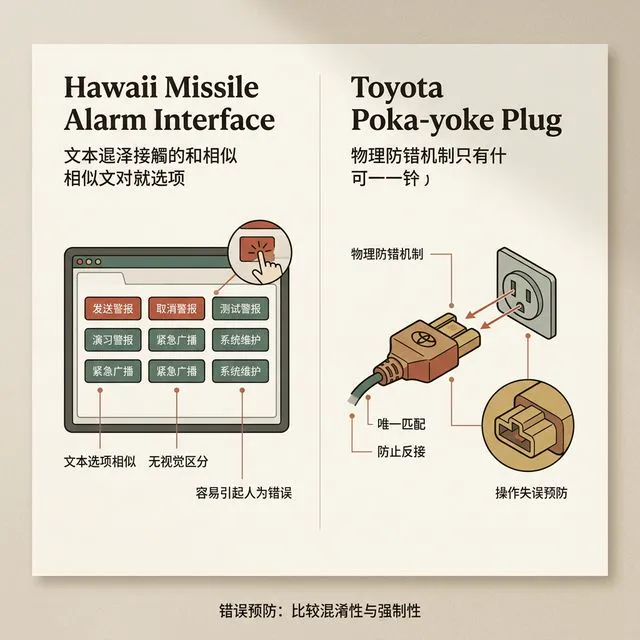
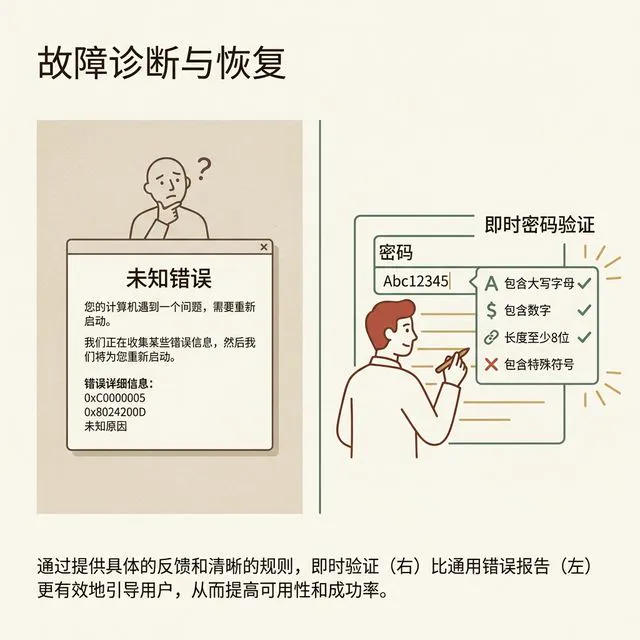
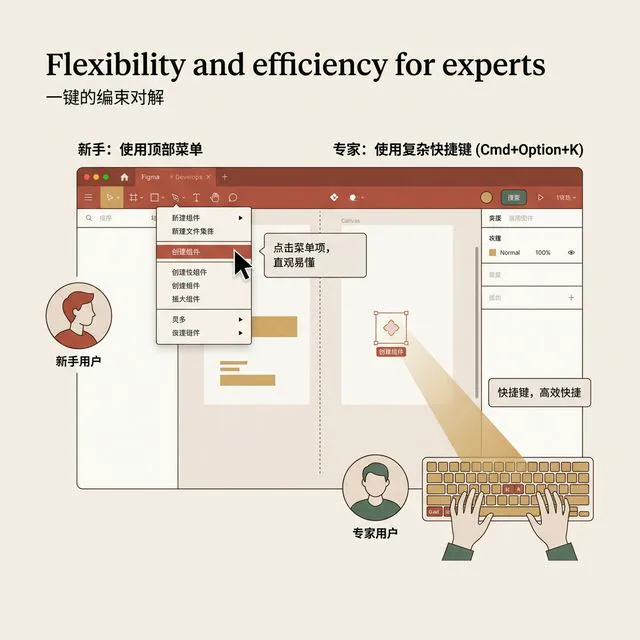
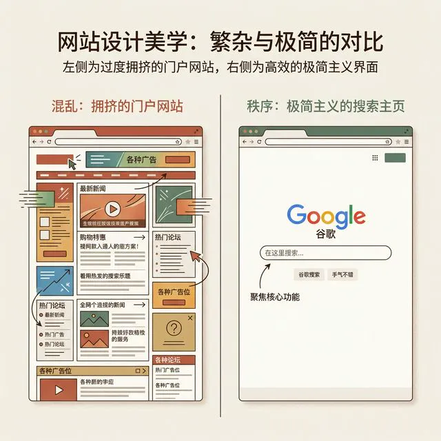

## 模块 3: Nielsen 十大原则走查 (下)
<!-- BUDGET: 6300 chars | SLIDES: ≥4 | STATUS: in-progress -->

> [VISUAL]
> **Slide**: M3-01
> **Layout**: `Split`
> **Scene**: 错误预防。左图：夏威夷导弹警报控制台界面（极其简陋的纯文本下拉框）。右图：丰田车间的物理防呆插头。
> **知识节点**: `nielsen-h5-h9-safety-critical-errors`, `nielsen-10-heuristics`
> *   **Asset**: 

**H5: 错误预防 (Error Prevention)**

> **Nielsen 原录**：Even better than good error messages is a careful design which prevents a problem from occurring in the first place. Either eliminate error-prone conditions or check for them and present users with a confirmation option before they commit to the action.

比提供优雅的错误提示更好的是：从一开始就设计一个让用户**根本无法犯错**的系统。

为了深刻理解这一点，我们需要引入认知心理学泰斗唐·诺曼（Don Norman）在《设计心理学》中对“人类犯错”的经典二元划分：**失误（Slips）**与**错误（Mistakes）**。

- **失误（Slips）**：用户的意图是正确的，但在执行时潜意识发生了偏差。比如，你想往咖啡里加糖，却顺手拿起了盐罐；你想点击“保存”，却因为鼠标偏移点到了“删除”。这是一种潜意识的动作执行偏差，通常发生在高度熟练、处于“系统1（快思考）”自动驾驶状态的专家用户身上。
- **错误（Mistakes）**：用户的意图从一开始就是错的。这往往是因为他们建立了错误的心智模型，或者对当前系统状态有彻底的误解。比如，用户以为关掉正在下载的浏览器窗口就会取消下载，于是直接点了大红叉。这种问题发生在“系统2（慢思考）”的主动规划阶段。

好的防错设计，必须同时阻击这两类问题。

> [CASE STUDY]: 2018夏威夷导弹警报误报事件
> 
> 2018年1月13日，夏威夷全州居民收到了一条令人窒息的求生警报短信：“弹道导弹正向夏威夷飞来。迅速寻找避难所。这不是演习。”
> 几百万人在恐慌中度过了38分钟，直到官方辟谣这是误报。事后调查发现，这根本不是什么黑客攻击，而是夏威夷应急管理局的一名操作员，在交接班测试时点错了按钮。
> 为什么会点错？因为在那个上世纪风格的下拉菜单里，代表常规测试的 `DRILL-PACOM（州内演习）` 和代表真实警报的 `PACOM（真实警报）` 两个选项，以完全相同的蓝色死气沉沉地紧挨在一起，没有任何视觉隔离，更没有任何诸如“输入密码确认发送”的二次防护机制。
> 毁灭世界的开关和测试麦克风的开关，在交互权重上竟然是相等的。这就是 H5 面对“失误（Slips）”时遭遇的终极惨痛失败。

在现代工业产品设计中，我们对抗上述悲剧的最佳武器被称为 **波卡尤克（Poka-yoke，防呆机制）**，这一概念最早由日本丰田汽车的工业工程师新乡重夫提出。数字世界中的波卡尤克包括：
1. **物理限制 (Physical Constraints)**：在预定机票时，返程日期的日历组件中，所有早于出发日期的格子都会被彻底置灰且不可点击（Disabled & Muted）。这是最霸道的防呆。
2. **格式掩码 (Input Masks)**：用户在填写信用卡号时，系统会在每输入 4 个数字后自动补上一个空格，并且直接屏蔽所有的字母输入。用户从物理上就无法输入“ABD”这种违法格式。
3. **关键操作的摩擦力 (Friction for Critical Actions)**：当你试图在 GitHub 上删除一个代码仓库时，系统不仅会弹出红色的警告框，还会强制要求你手动输入一遍这串长长的 `用户名/仓库名` 确认无误。这种人为增加的“阻尼感”，就是为了拦截系统 1 的下意识点击，强行唤醒你的系统 2 进行谨慎的慢思考。

永远不要在用户犯错后去嘲笑他们。好的设计师，会在悬崖边竖起高墙，而不是在悬崖底下停一辆救护车。

> [VISUAL]
> **Slide**: M3-02
> **Layout**: `Split`
> **Scene**: 诊断和恢复。反面案例：经典的 Windows "出现未知错误，强制关闭" 弹框以及密密麻麻的 Java 堆栈溢出代码。正面案例：Mailchimp 表单填错时，不仅告诉你密码不对，还用绿色打勾/红色打叉告诉你具体哪一条规则没满足（必须包含大写、必须包含数字等），输入框实时反馈。
> **知识节点**: `nielsen-h5-h9-safety-critical-errors`
> *   **Asset**: 

**H9: 帮助用户诊断与恢复 (Help Users Recognize, Diagnose, and Recover from Errors)**

> **Nielsen 原录**：Error messages should be expressed in plain language (no error codes), precisely indicate the problem, and constructively suggest a solution.

即使我们在 H5 中做足了防错准备，但墨菲定律告诉我们，错误无论如何最终都会发生。用户会断网，服务器会宕机，第三方接口会超时。H9 要求我们：**如果错误还是发生了，请用人类的语言告诉用户错在哪，并教他怎么爬出来。**

> [STORY TIME]: 不讲人话的机器语言与 404 页面的进化史
> 
> "Unknown Runtime Exception 0x839210" 这种弹窗，本质上是程序员在推卸责任。这就好比你去医院挂号，医生白了你一眼说“你有病”，然后就把你轰出了诊室。
> 在 Web 1.0 时代，如果你访问了一个不存在的页面，服务器默认返回的 404 页面是一张冷冰冰的白屏黑字：“404 Not Found. nginx/1.18.0”。这不仅毫无美感，更传递出一种“你做错了”的傲慢感。
> 但后来，世界上最优秀的 UX 团队接管了 404 页面的设计。比如 GitHub 的 404，不仅绘制了带有极客幽默感的绝地武士星球插画，更重要的是，它提供了一个醒目的“回到首页”按钮以及一个全局搜索框。系统放低了姿态，用自嘲化解了用户的焦虑，并立刻铺设了逃生通道。

一条符合工业界高标准的报错提示，必须是一个完美的逻辑闭环，包含三个极其清晰的要素：
1. **发生了什么？(What happened)**："视频上传失败"，而不是抛出一个 "Error Code 402 - Timeout exception" 或者冷冰冰的"系统繁忙"。
2. **为什么会发生？(Why it happened)**："因为您的网络连接在上传最后 5% 时中断"，或者"您的视频大小超过了 50MB 的限制"。明确指出病灶。
3. **我该怎么办？(How to fix it)**：这才是最关键的一步。"请点击重试，系统将支持断点续传" 或者 "点击此处下载视频压缩工具并重试"。

对于处于焦虑状态的用户，好的系统就像一位贴心的管家。当他在一个 50 项的超长表单里点下提交时，如果哪里漏填了，系统会自动平滑滚动定位（Auto-scroll to Error）到那个肇事的输入框。输入框会微微震动并亮起柔和的红色警示边框，边上还会用温和的语气提示：“哎呀，您似乎忘记填写邮编了，点击这里我们可以为您自动定位”。帮助用户带着尊严从错误中恢复，是产品的温度所在。

> [VISUAL]
> **Slide**: M3-03
> **Layout**: `Split`
> **Scene**: 灵活性与效率。展示 Figma 的界面，新手可以通过顶部菜单栏一步步找到 "Create Component" （创建组件），而老手直接按下 `Cmd + Option + K`。同时展示命令行终端（Terminal）这种作为极客终极加速器的存在。
> **知识节点**: `nielsen-10-heuristics`
> *   **Asset**: 

**H7: 灵活性与效率 (Flexibility and Efficiency of Use)**

> **Nielsen 原录**：Accelerators — unseen by the novice user — may often speed up the interaction for the expert user such that the system can cater to both inexperienced and experienced users. Allow users to tailor frequent actions.

系统绝不能只有一个档位。它既要能让新手感到安全，也要能让老手飞速狂飙。

**两栖用户模型（Amphibious User Model）**认为，没有用户会永远是新手。我们的界面设计必须如同一个具有多级齿轮的汽车变速箱。
- **新手期（新手村）**：用户需要显性的按钮、一步步的向导（Wizard）、大量的文字说明。这就像是保龄球馆护道栏，防止他们将球扔进沟里。界面必须高度具象，不厌其烦。
- **专家期（极客化境）**：当用户每天使用你的产品长达 8 小时，连点一年的鼠标，他们的肌肉记忆已经形成。此时，那些原本贴心的向导和深埋在三级菜单里的按钮，就成了拖慢效率的极其恶心的累赘。他们不需要向导，他们需要效率的极致压榨。

**加速器（Accelerators）的艺术**
Figma 或者 Adobe Photoshop 是完美践行 H7 的标杆。新手可以通过缓慢的鼠标移动，在顶部菜单栏仔细寻找各项工具；而高级视觉总监，可以左手在键盘上如飞弹般敲击 `Cmd + Option + K` 瞬间生成组件，右手的鼠标光标根本不需要离开画板中心。
真正的“终极加速器”，其实就是程序员们最爱的**命令行接口（CLI）**。在图形界面（GUI）里，你需要点击 10 次才能重命名 100 个文件；而在 CLI 里，一句简单的 Bash 脚本瞬间完成。这就是不同生命带宽碰撞出的效率火花。

在消费级产品中，H7 同样无处不在：
- **手势操作**：如 iOS 的边缘右滑全局返回，微信聊天界面的双击头像拍一拍。
- **宏与自动化**：允许重度用户录制一系列连击动作并绑定在一个按键上。
- **工作区定制**：允许高级用户（Power Users）把他们最看重的仪表盘、高频动作栏长期驻留在工具界面的侧边栏。

> [TEACHING MOMENT]
> 优秀的系统为不同的生命带宽提供变速轨道。对新手隐藏复杂性以降低认知门槛，为专家解锁后门以追求效率极限。永远不要拿“降低门槛”为借口，剥夺专家用户的效率特权。

> [VISUAL]
> **Slide**: M3-04
> **Layout**: `Comparison`
> **Scene**: 美学与极简。左图：一个塞满了十几个 widget、各种红绿闪烁广告、跑马灯的古典门户网站，以及日本充满密密麻麻中文字体的乐天市场首页。右图：极其克制、只有输入框和 Logo 的 Google 搜索主页，以及极其克制的苹果官网。
> **知识节点**: `nielsen-h8-minimalist-signal-noise`, `nielsen-10-heuristics`
> *   **Asset**: 

**H8: 美学与极简设计 (Aesthetic and Minimalist Design)**

> **Nielsen 原录**：Dialogues should not contain information which is irrelevant or rarely needed. Every extra unit of information in a dialogue competes with the relevant units of information and diminishes their relative visibility.

这是我们在 W05 讲“让界面消失”时的灵魂所在。业界对 H8 有着极其广泛的误读。极简设计（Minimalist Design）绝不是为了追捧某种北欧性冷淡的艺术风格，也不是强行把图标做小到用放大镜才能看清。它的终极目标只有一个，那就是追求极致的**信噪比（Signal-to-Noise Ratio）**。

> [PHILOSOPHY]: 认知负荷理论 (Cognitive Load Theory)
> 
> 认知心理学者 John Sweller 在 1988 年提出了著名的“认知负荷理论”。人类的工作记忆（Working Memory）容量极其有限，通常一次只能处理 4±1 个信息块。
> 屏幕上每多出一个毫无意义的装饰元素，不论是过度华丽的阴影、强行挤进侧边栏的弱相关推荐视频，还是几百句纯粹凑字数的废话说明文，都在向用户极其昂贵且极其脆弱的底层认知系统征收“附加税（Extraneous Load）”。

Google 搜索引擎主页是 H8 的丰碑。当你在面对一片白茫茫的屏幕，急切寻找某个疾病的答案时，你最需要的就是正中央那个输入框（这叫做“高光信号 Signal”）。因此，整个页面除了一个标志性的四色 Logo 和一个绝对纯净的输入框外，大面积的广袤留白屏蔽了所有的视觉噪音（Noise）。
相反，早期的古典互联网门户网站常常把 800 个毫无层级关系的蓝色超链接塞满第一屏。每一个额外的、无关的元素，都会像在你通往目标的林荫大道上扔下无数块绊脚石一样，无情地稀释、抢夺、磨损那些真正重要信息（Signal）的曝光可见性。
记住包豪斯的那句名言总结：**Less is More**。删除一切不能支持主线目标的像素，克制是顶级交互设计师最高级的修养。

> [VISUAL]
> **Slide**: M3-05
> **Layout**: `Split`
> **Scene**: 帮助与文档。展示一个悬停在复杂金融报税表单旁边的 `(?)` 图标，Hover 后立刻弹出一句话 Tooltip (工具提示) 解释。另一边展示一个长达 800 页的传统软件电子操作手册的封面（上面布满灰尘）。
> **知识节点**: `nielsen-10-heuristics`
> *   **Asset**: 

**H10: 帮助与文档 (Help and Documentation)**

> **Nielsen 原录**：Even though it is better if the system can be used without documentation, it may be necessary to provide help and documentation. Any such information should be easy to search, focused on the user's task, list concrete steps to be carried out, and not be too large.

> [!NOTE]
> "如果一个图形界面必须要靠附带一份阅读长达三个小时的厚重说明书才能让用户勉强驱动，那它的设计就像一个讲个自创冷笑话还要在讲完后向全场观众拼命大汗淋漓解释为什么这个笑话具有幽默感逻辑的脱口秀演员一样，遭遇了极其彻底且不可挽回的惨败。" —— UX 界的隐秘共识。

虽然业界都信奉并且疯狂吹捧“最好的界面不需要任何解释就能无师自通”，但在面对庞大、复杂的 B 端系统环境（例如企业级 ERP 或者专业的三维建模工具 Maya）时，提供高质量的支持系统依然是不可撼动的最后防线。

帮助文档设计的最高境界是什么？答案是**上下文内嵌 (Contextual Help)** 与 **渐进式呈现 (Progressive Disclosure)**。
用户在何时最需要帮助？既不是在他刚刚下载完软件踌躇满志想要改变世界的第一天，也不是在他成为老手之后。帮助需求永远是具有极其明确且唯一的“触发点”的——它只发生在用户的手指僵在屏幕上，卡在某一个特定字段陷入绝望的那一个瞬间断点。
此时，绝对不要极其粗暴且敷衍塞责地甩给他一个指向官方帮助中心首页的通用超链接，强迫他在有着 5000 篇晦涩术语字典的汪洋大海库里绝望地自己去大海捞针般检索。

你应该怎么做？在那个令人费解的“2023 财年个人专项附加税抵扣扣除金额综合折算”这行晦涩的专业输入框旁边，极其贴心且安静地放置一个小而精致的 `(?)` 工具提示图标（Tooltip）。用户只需鼠标轻轻悬停其上，无需离开当前页面，就会立刻弹出一个气泡，清脆利落地解释：“请在此处填入您的房贷利息或合法租金支出额，上限为每月1500元”。

**Just In Time（准时制知识交付）**
这正是现代供应链精益管理学中的 JIT 概念在 UI 体验中的高维映射。在恰当的时间触发断点、在恰当的核心交互地点坐标、提供且仅仅提供恰巧刚好足够用户跨越这个门槛的信息当量。
永远不要将一座图书馆劈头盖脸地砸向用户，请只在他们不慎跌倒的那个隐蔽坑洞旁边，默默递给他们一张精准至极、大小刚好的创可贴。这就是最后一条戒律的克制之美。

> [ACTIVITY]
> **Type**: `Quiz`
> **Duration**: `课后延展`
> **Desc**: 危险边缘：十大原则对号入座（课后任务）
>
> **目标**: 巩固 H1-H10 原则的辨识能力，打破学生的死记硬背。
> **步骤**:
> 1. 讲师在幻灯片上闪现 10 个"案发现场"的真实产品翻车动图/视频录屏（例如：iOS 上的系统日历权限弹窗毫无说明、重型表格加载数据卡死且不给骨架屏缓冲、没有找回密码入口的登录界面）。
> 2. 每放一个动图，给教室现场的各大小组 30 秒倒计时激烈的组内讨论时间。
> 3. 各组在倒计时结束时，举起手中的白板抢答回答它最主要违背了哪一条 Nielsen 原则（如写下 H2，或者写下破坏了 H4 标准）。
> 
> **目的**: 确保学生在进入下午紧张刺激的互相可用性走查实践之前，已经在课堂上完成了“背诵理论原则”到“鹰眼般洞察实际界面缺陷缺陷”的实战能力转换与热身。

---

### M3 扩展讨论：Nielsen 十大原则的“时代局限性”与演进

> [VISUAL]
> **Slide**: M3-06
> **Layout**: `Center`
> **Scene**: 黑色背景，居中显示一行大字：“1994年的法则，能指导2024年的空间计算吗？”
> **知识节点**: `nielsen-10-heuristics`, `case-cognitive-overload`
> *   **Asset**: 

我们刚才花了整整一个多小时，把 Jakob Nielsen 在 1994 年提出的这十条“圣经”嚼碎了咽下去。但在我们真正把它当作金科玉律去套用到你们下半学期的期末项目之前，我必须在这里踩一脚刹车。
作为大学的交互课堂，我们不仅要学会使用前人的工具，更要学会**审视工具本身的局限性**。

**局限一：它们诞生于“桌面端、键鼠操作”的古典时代**

1994 年是什么概念？那时连 Windows 95 都还没发布，所有的界面都是基于窗口（Windows）、图标（Icons）、菜单（Menus）和指针（Pointer）的 WIMP 范式。
今天呢？你们在做的是基于多点触控的 Mobile App，是基于 Apple Vision Pro 的空间计算（Spatial Computing），甚至是完全由语音驱动的 AI Agent。
在移动端，屏幕尺寸极小，**H8（极简设计）** 的要求被推到了极致。甚至出现了像“汉堡包菜单”这样为了极简而牺牲了一定的 **H6（识别而非记忆）** 的折衷设计。
在 VR 空间计算中，所谓的“撤销（H3）”突然变得极其复杂——当你在虚拟空间里把一个花瓶打碎，你该怎么“Cmd+Z”？是让时间倒流，还是让碎片自动拼接？这已经超出了传统 GUI 的讨论范畴。

**局限二：只关注“可用性”，无视了“情感”与“伦理”**

Nielsen 原则是极其冷静、极其“工程师思维”的产物。它们关注的是：“用户能不能顺畅地完成这个任务，而不报错？”
但这在今天已经远远不够了。

> [!NOTE]
> "一件产品如果只考虑可用性，就像是一顿只考虑补充卡路里的饭。它能让你活下去，但毫无乐趣可言。" —— 唐·诺曼 (Don Norman), 《情感化设计》

现代的交互不仅要求“好用（Usable）”，更要求“令人愉悦（Delightful）”。
微信每次下拉刷新时的那声清脆的“吧嗒”，B站投币时那个抛物线动效，这些都不在 Nielsen 的十条规则里，但它们是让用户爱上产品的关键。
更可怕的是，如果被恶意利用，哪怕完全符合十条原则的产品，也可能是一场灾难。业界称之为**暗黑模式（Dark Patterns）**。比如某些杀毒软件，把“继续卸载”按钮做成极其暗淡的灰色，把“取消”做成极其高亮的大红色。它极其符合 H4（一致性），极其符合 H2（符合真实世界的隐喻），但它是邪恶的。它在利用人类的认知惯性去欺骗用户。

> [VISUAL]
> **Slide**: M3-07
> **Layout**: `Split`
> **Scene**: 演进。展示 Nielsen 原则与现代组件设计的结合。例如空状态（Empty States）设计如何同时满足 H1（可见性）和 H10（帮助文档）。
> **知识节点**: `refactoring-ui-empty-states`
> *   **Asset**: 

**局限三：它们是“启发式（Heuristics）”，而非绝对的“数学定律”**

启发式（Heuristics）的本质是“经验法则”。这意味着，在特定的业务场景下，你是可以，甚至是**必须去打破这些原则**的。

举个例子：**H3 控制权与自由（允许撤销）**。
如果在银行柜台系统里，出纳员按下了“确认向黑客账户转账 1000 万”，系统能让你“Cmd+Z”撤销这笔已经打入国际银行结算网络的交易吗？不可能。
在生命攸关或资金敏感的场景下，系统必须强硬地剥夺用户的“自由控制权”，甚至要引入刻意的“摩擦力”。

**结语：从“教条”到“脚手架”**

所以，在下午的实战中，我不希望你们变成拿着尺子去量别人代码的“规章局长”。
Nielsen 的十大原则是你们在设计荒野中前行的一副**脚手架（Scaffold）**。当你看一个产品觉得“哪里不对劲但说不上来”时，这十个抽屉能帮你迅速定位病因。
你们要把这十条原则内化为肌肉记忆，然后在未来的设计生涯中，根据具体的设备环境、业务属性和用户情感，去勇敢地超越它们。

**扩展讨论：Nielsen 原则在今天中国互联网产品生态中的异化与重构**

在我们生搬硬套这十条诞生于 90 年代硅谷的原则之前，我们必须清醒地认识到一块被严重忽略的版图——那正是你们每天都在重度使用的、拥有十亿级用户的中国互联网移动端生态。
当 Nielsen 的古典交互理论漂洋过海，撞上中国庞大的下沉市场、极度内卷的商业竞争和无可比拟的移动支付基础设施时，发生了一系列极其有趣的“基因突变”。

> [DID YOU KNOW]
> 
> **异化一：H8（极简设计）的中国式破局**
> 
> 如果你把淘宝或者美团的首页拿给 Jakob Nielsen 本人看，他可能会当场心肺骤停，怒斥其严重违背了 H8。硅谷推崇的极简（如 Google 搜索和早期 Instagram 的大留白）在中国往往行不通。
> 中国产品经理圈有一句著名的黑话叫“寸土寸金，把首屏塞满”。
> 为什么？因为中国拥有极其庞大的下沉市场用户。许多县城大妈或者小镇青年，并没有经历过 PC 时代的“搜索框心智”洗礼。他们不习惯去“搜（Search）”东西，他们习惯的是“逛（Browse）”东西，就像在热闹喧嚣的线下集市里一样。
> 因此，淘宝首页那密密麻麻的五颜六色的“金刚区”按钮、疯狂闪烁的“限时秒杀”、占据半个屏幕的“百亿补贴”和猜你喜欢瀑布流，从硅谷极简美学来看是灾难性的视觉噪音，但从中国电商的数据转化率来看，却是极其精准投喂的商业机器。这是一种为了适应特定本土文化和用户层级而刻意为之的**“高密度设计（High-Density Design）”**。

**异化二：H10（帮助文档）在超级 App 中的消亡与进化**

Nielsen 说要提供上下文帮助文档。但在微信这个拥有 13 亿月活的国民级 App 里，你见过任何一份长篇大论的《微信使用说明书》吗？
在中国，超级 App 们通过一种被称之为“全民社会化学习（Social Learning）”的奇特现象，极其优雅地抹除了对传统帮助文档甚至 Tooltip 的依赖。
当微信推出“拍一拍”或者“长按浮窗”这种完全违背**H6（识别而非记忆：这里完全没有可见的界面提示）** 的隐蔽快捷手势时，它根本不需要写教程。几千万年轻人会在两天内发现这个彩蛋，然后在同学群、家族群和短视频平台上疯狂传播，手把手教会他们的父母全套长按操作。
在这个熟人社交的巨型场域中，“帮助文档”已经被分布式的人际交往网络和无数的短视频教程彻底取代。这是全球 UX 历史上极其罕见的中国特色现象。

这些突变告诉我们：可用性原则从来都不是冰冷的物理定律，它是活在社会文化、商业土壤和用户群体潜意识中的有机体。这种对 Nielsen 古典原则的跨文化本地化解构与重组，正是我们在从事现代复杂数字产品设计时，必须具备的交互视野与系统学自觉。

---
