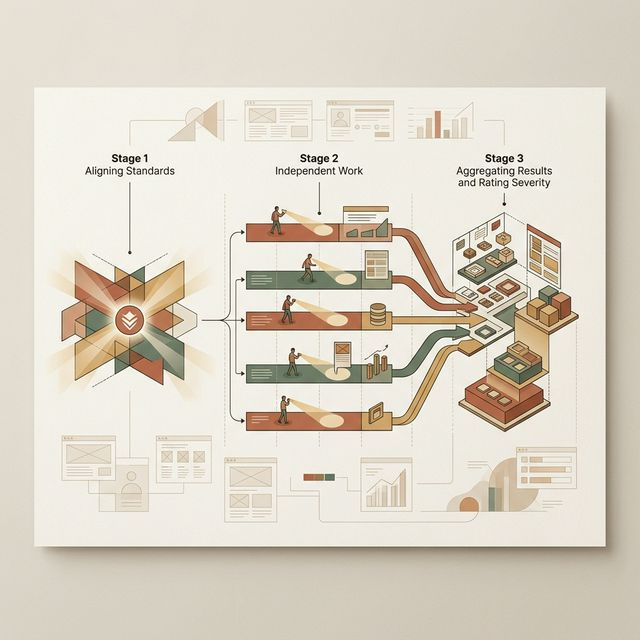
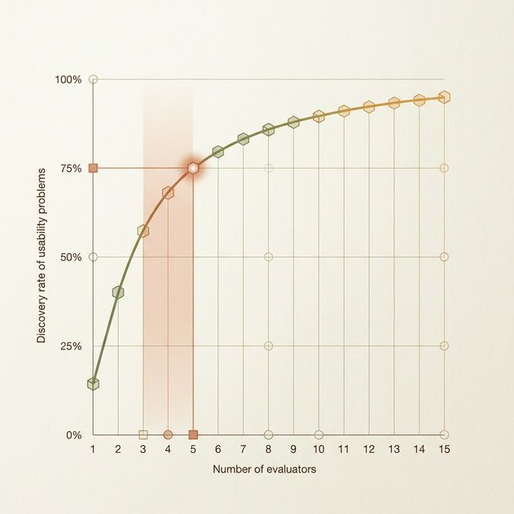

## 模块 4: 走查实战：你不是来挑刺的，你是来排雷的
<!-- BUDGET: 1800 chars | SLIDES: ≥4 | STATUS: in-progress -->

好了，十条戒律到手。这就意味着你现在可以直接指着别人的屏幕大喊大叫“你违背了 H4”吗？
绝对不是。很多人对“启发式评估（Heuristic Evaluation）”有着极其深重的误解。他们以为这仅仅是一个拿着检查表（Checklist）随便点点 App 然后写两句嘲讽评语的过程。

真正的工业级启发式走查，是一场具有严密军事化纪律的排雷行动。它不在于你能挑出多少刺，而在于**你能否以最经济的成本，拦截最致命的错误。**

> [VISUAL]
> **Slide**: M4-01
> **Layout**: `Diagram`
> **Scene**: 启发式评估三阶段流程图。1. 简报 (Briefing - 统一标准) -> 2. 独立评估 (Evaluation - 单兵作战 1-2h，两遍走查) -> 3. 汇报汇总 (Debriefing - 评定严重度，提出方案)。
> **知识节点**: `heuristic-evaluation-methodology`
> *   **Asset**: 

根据学术界和工业界的标准共识，一场高回报率的走查必须严格分为三个不可跨越的阶段：

**第一阶段：简报建立 (Briefing)**
在评估开始前，所有评估员必须被“对齐（Aligned）”。
你不能拿一个面向 60 岁老人的慢病管理 App 去苛求它没有采用全手势操作。在 Briefing 阶段，产品经理必须清晰地界定：
- 我们的主要目标用户是谁？（具备何种程度的数字素养）
- 我们的核心任务（Core Flows）是什么？
- 有哪些已知且刻意保留的设计权衡（Trade-offs）？

**第二阶段：绝对独立的评估 (Independent Evaluation)**
这是最核心的规则：**评估时禁止一群人叽叽喳喳围在一起看。**
为什么？因为人类极易受到群体思维（Groupthink）的干扰。当第一个人说“我觉得这个按钮太红了”，剩下的人潜意识里就会停止寻找更深层的交互逻辑漏洞。
每个人必须戴上耳机，独立完成 1-2 小时的走查。
而且，评估过程需要**两遍扫描**：
1. **第一遍（宏观心流篇）**：放下 Nielsen 的表格，像一个真实用户一样从头到尾走一遍业务流程。感受整体的信息架构和页面跳转是否自然。
2. **第二遍（显微镜扫描篇）**：掏出这十条原则，对着每一个屏幕、每一个下拉框、每一条报错提示，逐字逐句地用 H1-H10 像“照妖镜”般审视。

**第三阶段：汇报、去重与严重度定级 (Debriefing & Severity Rating)**
大家走出小黑屋，把各自发现的“雷”扔在桌面上。
你会发现很多问题是重叠的，先清洗去重。然后，最关键的一步来了：**不要试图修复所有问题。**
团队的开发资源永远是紧缺的。你们必须给每一个揪出来的问题作“致命性（Severity）”定级（通常是 0 到 4 级）：
- 0 级：这不是可用性问题，这是你个人的审美偏好。
- 1 级（Cosmetic）：美容级别的问题，不影响任何人完成任务。
- 4 级（Catastrophe）：灾难级漏洞。比如点了支付就闪退。必须在产品甚至测试版上线前解决。

> [VISUAL]
> **Slide**: M4-02
> **Layout**: `Chart`
> **Scene**: 评估员人数与问题发现率的曲线图（Nielsen 1994）。横轴为人数 (1 到 15)，纵轴为发现问题的百分比。在 "3-5" 人的区间标记了 75% 的高光区域。
> **知识节点**: `nielsen-10-heuristics`, `heuristic-evaluation-methodology`
> *   **Asset**: 

此时有人可能会问：既然这是专家走查，那如果公司穷，只请一位资深 UX 专家来看，能行吗？

让我们来看 Nielsen 在 1994 年那份震惊业界的经典曲线图。
数据极其残酷：哪怕是所谓的行业顶尖资深专家，如果他一个人单枪匹马去走查一座巨大的数字城堡，受限于他个人的知识盲区和注意力衰竭，他**最多只能揪出整个系统 35% 的可用性缺陷**。剩下的 65% 将直接暴露给真实世界的用户去承受。
但是，当我们在这个体系中加入第二个人、第三个人时，曲线开始极其陡峭地爬升。
Nielsen 发现了一条黄金法则：**当你把评估人数增加到 3 到 5 人时，你们这支小小的特种部队，就能联手抓出产品中高达 75% 的致命可用性漏洞！**

而当人数超过 5 人后，那根曲线开始极其疲软地放缓，边际收益剧烈递减（花费昂贵的几万元雇佣第 6 名专家带来的新问题发现率不到 5%）。
这正是为什么在今天的下午实验室环节，你们将以 **3到5人** 为一个作战单元去审计别组的项目。这不是为了图热闹，这是人机交互工程学中经过几十年验证的、投资回报率（ROI）最高的配置法则。

> [STORY TIME]
> 
> **悬崖边的陷阱：假阳性（False Positives）**
> 
> 在各位踌躇满志准备拿起批判的武器时，我必须泼一盆极其冰冷的凉水：Bailey 教授（2001）在他的著名研究中得出了一个极其刺耳的数据：
> 在专家交上来的那份极其厚重的启发式评估差错报告单里，**大约有 43% 的“严重问题”，在后续面对真实用户的实际观测测试中，根本算不上任何问题。**
> 也就是说，近一半的所谓“专家断案”，是误判的**假阳性（False Alarm）**。
> 
> 为什么会发生这种极其荒唐的错位？
> 因为**专家不是真实用户**！你可能以你在硅谷大厂沉淀的极高品味，觉得某款拼团电商 App 下方的巨大的、“俗气”的闪烁抢购按钮极其违背了 H8（极简美学）。但你不知道，在这个下沉市场的真实大妈群体眼里，那是整个屏幕上唯一能激起她们多巴胺狂热点击的核心锚点。
> 
> 启发式走查是一面极其锋利的手术刀，也是极其廉价且快速的静态代码免疫扫描器。但它永远、绝对无法替代去让一个真正的、活生生的普通人坐在你的屏幕前执行的（我们在下周 W13 即将学习的）“出声思考”可用性焦点测试。
> 
> 它的最大历史使命，是帮我们在产品正式面对大众之前，极其快速、廉价地拦截掉全部那些极其低级愚蠢的拼写错误、断头链路和致命死角，从而把极其宝贵且昂贵的真实用户测试火力资源，全部留给更高阶的心智摩擦。

---
