## 模块 1：从专家检查到用户对话 — 评估方法论的两条路 (30 min)
<!-- BUDGET: 3600 chars | SLIDES: ≥ 7 | STATUS: done -->

> [VISUAL]
> **Slide**: 评估方法的双轨图
> **Layout**: `Split`
> **Scene**: 左侧是一位医生在独自看着 X 光片（代表专家评审）；右侧是医生在病床前握着患者的手倾听（代表真实用户测试）。建立「专家检查」与「真实对话」的隐喻，引入可用性测试的意义。
> *   **Asset**: 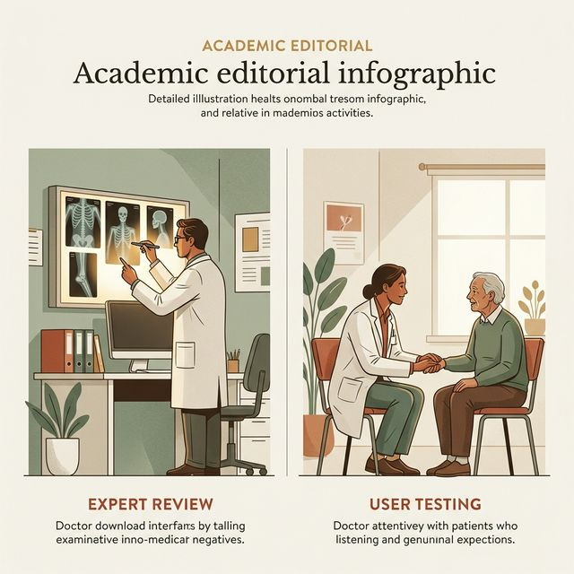

> [STORY TIME]
> **Title**: 医生看片与问诊的隐喻
> **Tag**: `#human-culture`

在上周的实战中（W12），我们深入学习并应用了启发式评估，即 **Heuristic Evaluation**，也就是著名的 Nielsen 十大可用性原则。在那场横跨多个小组的"生生互评"中，大家还记得那种手持放大镜、四处挑刺的感觉吗？你们就像是坐在阅片室里、眉头紧锁的资深骨科医生，手里拿着十把最精密的尺子（也就是十条标准），去仔细对应界面的各种"症状"。这是一种极其典型的**专家视角的检查，即 **Expert Review**，**。

毫无疑问，这种方法是极其高效的。它能够在产品尚未成形或者刚刚完成高保真原型的初期，就迅速地扫清界面上那些显而易见的"硬伤"——比如找回了因为组件嵌套错误而丢失的返回按钮，统一下拉框的视觉边距，或者移除了那些违背了系统状态可见性原则的设计毒瘤。它不需要经费，不需要招募任何人，全靠你们作为设计师的专业直觉和原则熟练度。

但是，让我们回到那个医生的隐喻。骨科医生看着冷冰冰的 X 光片，确实能一眼看穿患者的大腿骨哪里出现了骨裂，甚至能精确计算出骨折的夹角。但医生**感觉不到**病人当前到底有多痛，无法感同身受他们在尝试站立那一瞬间的犹豫、恐惧和绝望。X 光片不会告诉你患者的真实感受。

同样的道理，当我们做完了内部走查、修复了明显的"硬伤"之后，不可避免地会产生一种虚假的**安全性错觉，即 **False Sense of Security**，**。我们以为修复了所有违反原则的按钮，这套系统就完美无缺了。如果你就此止步，不把产品交给真实的、活生生的、对你的设计一无所知的最终用户，你永远无法体察到他们在实际操作时，哪里会犹豫，哪里会感到挫败。这就呼唤我们走向评估体系的第二条道路——**用户对话与可操作测试**。真正伟大的交互设计，不仅需要无情的专家挑刺，更需要饱含同理心的真实聆听。

> [VISUAL]
> **Slide**: W12与W13范式的跃迁
> **Layout**: `Sequential`
> **Scene**: 动画展示从「无直接参与者」向「受控环境+真实参与者」的跃迁，引出教材对评估范式的经典分类。
> *   **Asset**: 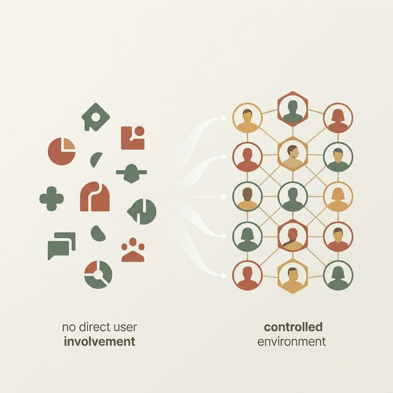

> [THEORY]
> **Title**: 评估范式分类，即 **The Evaluation Framework**，

为了更系统地理解我们今天的目标，我们需要将视角拉升，审视整个交互设计领域的评估体系。根据教材《Interaction Design》第 14 章的经典分类，无论你是做手机 App、车载屏幕还是医疗系统，评估方法大体上可以归入三个决定性的范式，即 **Paradigms**：

**第一类：无直接参与者的评估 ，即 **Any settings not involving users**，**
正如我们上周所做的那样，包括启发式评估或认知走查 ，即 **Cognitive Walkthrough**。这种方法的核心是由专家模拟用户的思维路径来排查问题。它的优势在于高性价比、实施速度极快，是任何产品中台测试的首选。但它的致命缺陷在于**缺乏经验验证，即 **Empirical Validation**，**。你所谓的"用户可能会在这里卡住"，终究只是一种基于经验的专业臆测，而不是铁一般的事实。

**第二类：自然环境中的观察 ，即 **Natural settings involving users**，**
这代表了另一种极端。研究人员走出实验室，进入用户的真实自然栖息地——可能是喧闹的医院急诊室，也可能是颠簸的地铁车厢，观察真实环境下的产品交互表现，即 **In-the-wild studies**。通过实地观察或长期的数据分析（比如收集万级用户的 App 日志）。这种方法提供的数据绝对真实，生态效度，即 **Ecological Validity**，极高。但由于环境干扰项太多，你很难控制变量，也很难在用户快速刷过屏幕的那一秒去打断他："嘿，你刚才为什么眉头皱了一下？" 

**第三类：受控环境下的可用性测试 ，即 **Controlled settings involving users**，**
这正是我们今天（W13）的主干知识，也是介于前两者之间的黄金平衡点——可用性实验室测试，即 **Usability Testing**。它邀请真实的代表性用户，来到一个我们可以高度观察、录像和控制的环境里，按照我们设计的特定任务脚本去操作产品。在这个环境里，我们能把"用户行为"放在最高倍数的显微镜下拆解。我们不仅看用户最终是否做成功了，即 **Task Success Rate**，更要观察他们操作过程中的微表情、鼠标悬停的轨迹，挖掘出"为什么这么做"的心智模型，即 **Mental Model**，对撞。这是一种在无菌手术室里展开的精细探查。

> [VISUAL]
> **Slide**: 形成性 vs 总结性评估的界限
> **Layout**: `Compare`
> **Scene**: 时间轴展示产品生命周期。标注形成性评估在开发中期（修剪枝叶），总结性评估在发布节点（最终成绩单）。
> *   **Asset**: 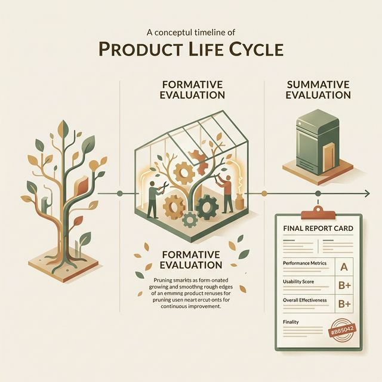

> [TECH NOTE]
> **Title**: 评估的生命周期：形成性与总结性

另外一个极其重要的维度，是评估发生的时间节点。在学界和工业界，我们常把评估分为**形成性评估 ，即 **Formative Evaluation**，** 和 **总结性评估 ，即 **Summative Evaluation**，**。

形成性评估，就像是厨师在厨房里熬制高汤时，时不时用勺子舀一点尝尝味道。它的目的是在使用环境中**诊断问题并即刻改进**。形成性评估发生在设计过程的早期和中期（比如我们的 Exp2 和 Exp3 阶段），它的态度是宽容的，因为它的目标是"让它变得更好"。今天我们要学习的桌面版可用性测试，绝大多数都属于这一类。

而总结性评估，则是这锅汤端上了客人的餐桌，美食评论家咬下第一口后给出的分数。它的目的是在产品开发周期的尾声，评估其是否达到了既定的**性能指标或可用性标准**，或者与竞争对手的竞品发起"角斗场式"的对比，即 **Benchmarking**。它是冷酷的、盖棺定论的成绩单。

作为交互设计师，你必须在这两个节点反复横跳，但你要明白，如果你在厨房里（形成性节点）连尝都不尝一口，最后直接端上桌去接受总结性评估，那是极其傲慢且不负责任的豪赌。

> [VISUAL]
> **Slide**: 漏斗分析 vs 可用性测试 ，即 **What vs Why**，
> **Layout**: `Split`
> **Scene**: 左边是一张冷冰冰的转化率漏斗图，右边是一个用户对着屏幕抓狂的真实表情抓拍。
> *   **Asset**: 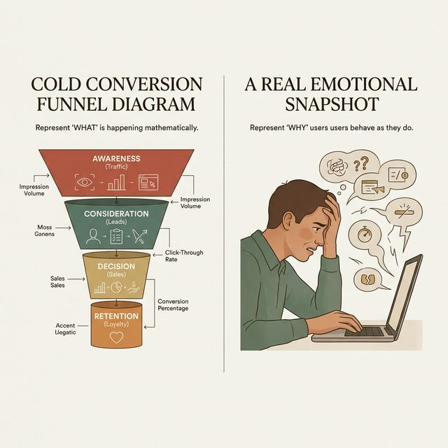

> [DEEP DIVE]
> **Title**: 数据迷信的破局：Why 远比 What 重要

在当代互联网工业的语境下，你们可能会接触到大量的定量野外数据——比如最经典的 A/B 测试或者漏斗转化分析。有些刚入行的产品经理会对这种数据产生近乎迷信的崇拜："看，在这个支付页面，有 40% 的用户流失了，数据不会骗人！"

是的，数据不会骗人，**但数据是个无可救药的哑巴**。

定量数据，即 **Quant Data**，只负责诚实地告诉你**发生了什么 ，即 **What**，**。它告诉你 40% 的人跑了，但它绝对没法告诉你：**为什么 ，即 **Why**，?**
是因为支付按钮的颜色太暗淡？是因为他们不知道绑卡的步骤？还是因为那个突然跳出来的隐私授权弹窗让他们在这个诈骗横行的时代感到了极度的不安全感？

如果你只看漏斗数据，你的方案可能就是"把按钮调成更亮的红色"。但在真实的可用性测试中，你可能会听到用户绝望地说："我要先绑定人脸才能买这个两块钱的虚拟道具？这就很离谱，我不买了。" 

真实的对话与可操作测试（定性研究），能直接击穿心智模型的错位。它不仅能发现系统的错误，更在修复人类设计的同理心赤字。

> [ACTIVITY]
> **Type**: `Warm-up`
> **Duration**: `10min`
> **Desc**: 破冰互动：你的盲区有多大？
>
> 目标：通过快速互动打破"设计师=用户"的错觉，证明定性对话的不可替代性。
> 
> **步骤：**
> 1. 大屏幕抛出提问："假设你们团队设计了一个针对 65 岁以上老年人的在线挂号小程序，字号已经放到了最大，高对比度也符合无障碍标准，即 **WCAG**。但是上线后，转化率依然低得可怜。如果在实验室里请一位 68 岁的奶奶来操作，你觉得最大的可用性障碍（卡点）会出现在哪一步？" (3min 思考，可与同桌快速交流)
> 2. 学生举手抢答。（通常大部分学生的回答会集中在视力、操作精度上，比如：滑块验证码太难拼、返回上一级的逻辑藏得太深、颜色不够显眼等）
> 3. 讲师揭晓从某家三甲医院真实的出声思考测试中得出的震撼洞察：
>   "你们猜想的 UI 操作困难确实存在，但最大的物理卡点在于：他们**不理解为什么挂号需要先『绑定就诊卡生成电子凭证』**。在老年人的心智模型中，『我拿着实体的身份证，走到医院的挂号窗口，把证件递给护士，挂号就完成了』。但在小程序的逻辑里，系统强迫他们用手机去『召唤、映射并绑定』一个数字分身。这种心智摩擦导致的困惑，远比『按钮太小』来得更加深远。"
> 4. 总结升华：专家的启发式评审关注界面的表现层（字号大小、符合系统惯例），而受控环境下的真实用户测试，能捕捉到表现层之下的、甚至连用户自己都无法准确描述的深层心智错位。这就是我们为什么要和用户对话的终极理由。

> [VISUAL]
> **Slide**: 谷歌的蓝色与 Airbnb 的心形
> **Layout**: `Split`
> **Scene**: 左侧展示 Google 著名的 41 种蓝色测试截屏；右侧展示 Airbnb 早期界面中，星星收藏图标转变为心形图标的对比。
> *   **Asset**: 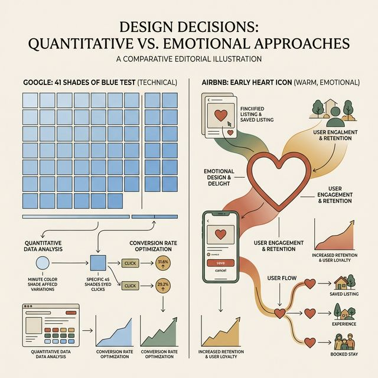

> [CASE STUDY]
> **Title**: A/B 测试的霸权与定性研究的逆袭
> **Tag**: `#case-study`

为了让大家更深刻地理解为什么我们绝对不能被纯粹的后端数据面板所劫持，我给大家讲两个工业界的经典案例。这两个案例完美地诠释了"第二类评估"（自然环境下的定量数据）与"第三类评估"（受控环境下的定性对话）之间的张力。

第一个是 Google 著名的"41 种蓝色"测试。当年 Google 的前视觉设计主管 Douglas Bowman 愤怒辞职，他在离职博文中抱怨说，Google 的工程师文化已经走火入魔。为了决定 Gmail 工具栏上的一个边框颜色是几号蓝，工程师们居然无法在会议室里达成共识，于是他们决定同时上线 41 种不同色值的蓝色，做规模庞大的 A/B 测试（一种极端的、自然环境下的定量评估），看哪种蓝色能带来哪怕 0.1% 的点击率提升。

这种测试当然有其商业价值。在几十亿流量的基数下，0.1% 的提升可能意味着几千万美元的广告收入。但是，这种评估范式极度短视。它把设计降级为了纯粹的生物条件反射实验。它并不关心用户在点击那个蓝色按钮时的心理状态，它只是在压榨人类视觉皮层的神经反应。

如果你用做"41 种蓝色"的思维来做创新型产品，你永远只会得到一个局部最优解，而无法在一个拥挤的市场中破局。

我们再来看第二个案例。Airbnb 在早期增长遇到瓶颈时，他们的设计团队发现，平台上的"心愿单"，即 **Wishlist**，特性使用率非常惨淡。当时的图标是一颗"星星"，即 **Star**。

如果你是一个典型的、只看数据的 PM，你的直觉反应可能是："太棒了，让我们做 A/B 测试！把星星调大 20%，换成黄色，或者加上微动效，看能不能提升点击率。" 

但 Airbnb 的设计师 Joe Gebbia 和他的团队没有这么做。他们回到了"第三类评估"——受控环境下的可用性访谈。他们把真实用户请到办公室，或者去用户的家里，和他们坐在一起喝杯咖啡，问他们："当你在这个平台上找房子时，你想要标记那些你喜欢的房子，你脑子里在想什么？你觉得这颗星星代表什么？"

用户在真实对话中给出的回答，像一记重锤敲醒了整个团队。用户说："星星代表着一种冰冷的、理性的『实用评级』，就像给酒店打几星。但我来 Airbnb 找房子，我是为了度假，我是为了寻找一个在异国他乡的体验，我的情感是热烈的。"

于是，团队只是做了一个极度简单的改动：把"星星"换成了"心形"，即 **Heart**。

在此之后，心愿单的使用率如坐火箭般飙升了 30%。这绝不是 A/B 测试能够通过盲目穷举 41 种形状试出来的。因为"心形"所呼唤的潜意识意象——期待、渴望、私密感——只有通过面对面的出声思考和深度对话才能触达。

这也就是为什么，即便在这个 AI 和大数据吞噬一切的时代，作为高级交互设计师，你依然必须掌握并且亲自去执行那些看似低效的、原始的、面对面的可用性测试。因为你处理的不再是一串串 UV 和 PV 字段，而是活生生的、充满了不可理喻的情感起伏的人类心智，即 **Mental Model**。

> [VISUAL]
> **Slide**: 三角测量法 ，即 **Triangulation**， 的力场
> **Layout**: `Diagram`
> **Scene**: 动态展示由专家评估、可用性测试与在线 A/B 测试构成的铁三角，三者的劣势完美互补。
> *   **Asset**: 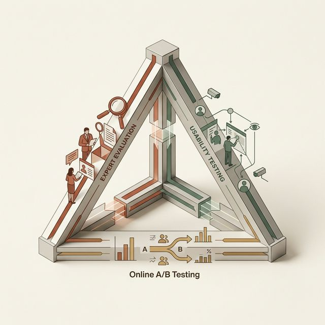

> [THEORY]
> **Title**: 现代工业标准：三角测量法 ，即 **Triangulation**，

讲到这里，我并不是在踩一捧一。在成熟的商业体系中，没有任何一种单一的评估范式能够包打天下。现代顶尖的设计团队（比如 Apple, Figma 或腾讯的 ISUX）通常会采用一种被学术界称为**三角测量法，即 **Triangulation**，**的策略。

想象一个产品从 0 到 1 再到 100 的漫长周期。
在 0 到 0.5 的草图阶段，你连高保真都没画完，这时候去找用户测试极其昂贵且浪费。这正是**专家启发式评估（范式一）**大显身手的时候，你用十条原则快速斩杀那些低级错误。
到了 0.5 到 1 的高保真原型阶段（也就是你们现在的 Exp3 阶段），你必须转向**可用性测试（范式三）**，用 5 到 7 个典型用户展开深度的、形成性的诊断，确认核心任务流是否顺畅，心智模型是否严重错位。
而当产品发布，进入从 1 到 100 的精细化运营阶段时，你再全面铺开**A/B 测试和日志追踪（范式二）**，在野外去榨取那最后几滴转化率。

这三者首尾相接，就构成了牢不可破的评估护城河。这也解释了为什么要将我们的课程从上周的专家走查，平滑过渡到今天的出声思考实战。

## 模块 2：有声思维法：让脑子里的声音被听见 (40 min)
<!-- BUDGET: 5400 chars | SLIDES: ≥ 10 | STATUS: done -->

> [VISUAL]
> **Slide**: 黑白胶片上的认知先驱
> **Layout**: `Title+Image`
> **Scene**: 展示一张二十世纪八十年代早期的黑白档案照片。照片中，一位被试者坐在庞大笨重的早期计算机屏幕前，头顶戴着简陋的电极帽，而旁边的研究人员正拿着记事本紧张地记录着被试口中不绝如缕的喃喃自语。
> *   **Asset**: 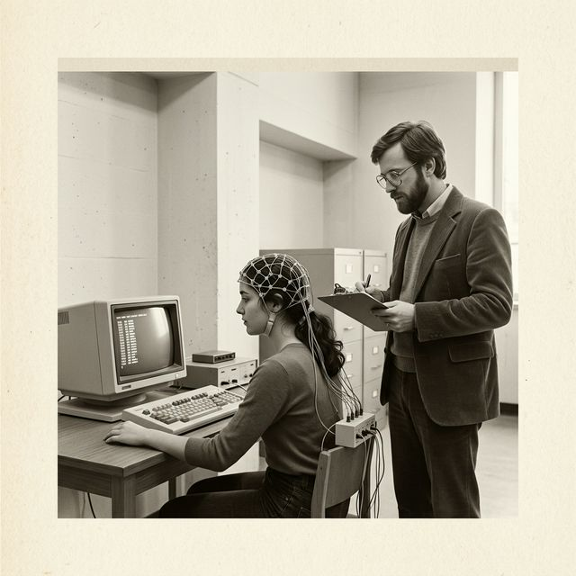

> [TECH NOTE]
> **Title**: 探寻极客的精神世界：大声述思法的降生

在我们刚才探讨的评估范式地图中，我们明确了要把真实的、活生生的用户请进实验室。但这就带来了一个终极的哲学与工程问题：坐在他们身边，我们到底要测量什么？

在最初，那些痴迷于人机交互的工程师们尝试过最粗暴的方法。他们记录用户的眼睛看向哪里（早期的眼动仪），记录用户的心跳和皮肤电（早期的生理测量），甚至计算用户从看到按钮到按下鼠标所需的毫秒级时间差（纯粹的反应时测试）。所有这些定量指标都非常精确，但它们全都指向一个沉闷死寂的黑盒——他们能知道用户在卡顿，却死活不知道用户心里到底在想什么。

直到认知物理学家 K. Anders Ericsson 和计算机科学巨匠 Herbert A. Simon 带来了破局之光。Simon 教授不仅是人工智能的奠基人，更是有限理性理论的提出者。他们在研究国际象棋大师如何惊险地破解复杂残局时发现：如果我们不去揣测人类的潜意识机制，而是直戳了当地要求参与者在执行高度复杂任务的同时，将他们工作记忆，即 **Working Memory**，中流淌的碎片化思绪、计算和疑虑，全盘且实时地口语化输出，我们就能近乎完美地重构出那张隐秘的心智导图。

这就是被 Jakob Nielsen 誉为"整个可用性工程史，也就是 **Usability Engineering**中独一无二、最不可替代的单一技术"——**口语报告法 ，也就是 **Think-Aloud Protocol**，简称 **TAP**，**。

它的核心精神极具颠覆性：我们不再把用户当成测试流水线上的小白鼠，而是将他们视为产品灵魂的"共同发现者"。当用户坐在原型面前，我们要让他们大声地说出那个平时只在脑内回响的声音。

> [VISUAL]
> **Slide**: 记忆的失真轮盘
> **Layout**: `Diagram`
> **Scene**: 一个漏斗模型，展示信息从短期记忆过滤为长期记忆的过程中，是如何被个体的"面子"、"合理化"以及"社会期待"严重污染并重构的。
> *   **Asset**: 

> [THEORY]
> **Title**: 回溯出声 ，即 **RTA**， 的致命弱点与记忆重构

随着这项技术被正式引入数字产品设计，学术界很快分裂为两大实操流派：并发出声，即 **CTA**，与回溯出声，即 **RTA**。我们先来解剖 RTA，也就是所谓的 Retrospective Think-Aloud。

RTA 的操作模式很像电子竞技比赛结束后的录像复盘。它的基本流程是：首先，你让用户在一个绝对安静、没有任何人干扰的房间里独立完成任务；研究员躲在单向玻璃后面，用软件录下屏幕上鼠标的每一毫米移动。在这个阶段，用户不需要说话。当任务完全结束后，研究员走出来，像放映电影一样，和用户并排坐在一起回看刚才的操作录像。随着画面的播放，研究员开始深究："停！你看进度条的 2 分 14 秒，你的鼠标在这两个图标之间疯狂横跳了七八次。你当时在找什么？"

表面上看，这是一个完美的设计。因为它彻底分离了认知和表达，用户在执行任务时拥有百分之百的专注力。这对于测试那些性命攸关的高负荷专家系统——例如喷气式客机的玻璃座舱显示面板，或者是核反应堆的压力控制界面，RTA 是唯一的选择。因为在这种生死一线的测试中，如果你让测试者分心去说话，那是违背伦理的。

但为什么 RTA 从未在互联网和移动应用设计界成为主流？答案藏在一条冰冷的心理学定律里：**人类事后的记忆，是不可信的，即 **Human memory is fallible and reconstructive**，**。

当用户在事后舒舒服服地坐在椅子上看录像时，一种被称为"事后合理化，即 **Post-hoc Rationalization**，"的认知偏差就会接管他的大脑。面对自己刚才在屏幕上表现出的愚蠢和卡顿，潜意识为了保护自己的自尊，会立刻伪造出一套看似逻辑严密的说辞。
他甚至会信誓旦旦地对研究员说："哦，我当时没有点那个红色的按钮，是因为我担心它的对比度不够，我觉得它不能引导我到支付页面。" 
但如果你能读取他哪怕微秒级的脑电波，你会发现真正的缘由极其粗暴：他当时满脑子都在想晚上吃什么，根本没有看到那个按钮！
这种为了迎合研究者或者保全社交面具而编造出来的"经过提纯的反馈"，是可用性设计最致命的剧毒。

> [VISUAL]
> **Slide**: 同步辐射的光芒：CTA 的崛起
> **Layout**: `List`
> **Scene**: 罗列出并发TAP技法法的三个无法撼动的底层优势：数据的绝对新鲜度、无需昂贵设备、突破社交防御。
> *   **Asset**: 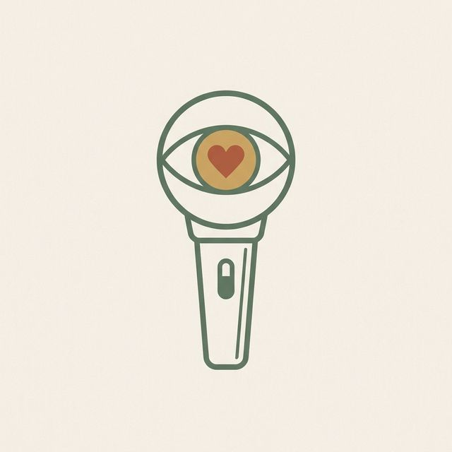

> [THEORY]
> **Title**: 并发出声 ，即 **CTA**：拥抱新鲜的噪音

正是为了对抗这种记忆的污染，工业界最终坚定地倒向了 **CTA (Concurrent Think-Aloud，并发该协议)**。通俗地讲，这就是"边做边播"。

让用户一边尝试在这个根本没完成的高保真原型里大海捞针，一边嘟嘟囔囔地描述自己正在寻找目标的迷茫。CTA 的唯一法则，也是最高法则：**数据的绝对新鲜度，即 **Ultimate Data Freshness**，**。

在 CTA 的流转中，研究员能够如手术刀般精准地切入用户心智模型断裂的那一瞬。你听到的不再是经过修饰的"对比度偏弱"，而是一句脱口而出的："见鬼！我的商品去哪了？为什么这个破图标看起来像个垃圾桶！" 
这就是金灿灿的定性数据。这种带着愤怒、夹杂着困惑的粗糙原声，是建立同理心的基石。同时，CTA 是真正的"车库精神"的体现。你不需要昂贵的单向玻璃观察室，不需要价值数十万的眼动仪。只要有一台能录音的智能手机，一个安静的会议室角落，以及一名经受过严格训练、懂得如何闭嘴的主持人，你就能掀起一场惊天动地的迭代风暴。

当然，CTA 并非完美无缺。Ericsson 同样警告过我们，在边做边说的双重任务压迫下，用户的认知负荷，即 **Cognitive Load**，会不可避免地增高。这种负荷可能会导致他们错失本来能看到的细节，或者导致他们在任务上的完成时间被非理性地拉长。这是一把双刃剑，但在互联网产品的快速试错周期内，我们宁愿牺牲一点点量化的时间精度，也必须换取那沉甸甸的"Why"。

> [VISUAL]
> **Slide**: iPad 经典研究与开荒者的启示
> **Layout**: `Side-Image`
> **Scene**: 左侧是高度凝练的核心洞察提要，右侧是 2010 年第一代 iPad 发布时的真实场景照片（一位用户正用双手捧着笨重、崭新的初代 iPad，眉头微皱，尝试理解从 iPhone 到 iPad 的隐喻跳跃）。
> *   **Asset**: 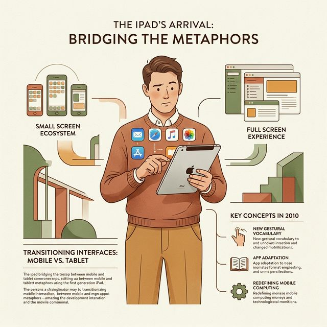

> [CASE STUDY]
> **Title**: 初代 iPad 的测试史诗与拓荒年代的同理心重构
> **Tag**: `#case-study`

如果理论听起来依然空洞，我给大家讲一个整个工业界的奠基性故事。
2010年初，史蒂夫·乔布斯在一场史无前例的发布会上，从黑色沙发上掏出了第一代 iPad。那个时候，整个硅谷、甚至是全球最顶尖的 UI/UX 设计师集体陷入了一阵极其深邃的迷茫与恐慌。

为什么会恐慌？因为在此之前的几十年里，交互设计的对象边界是极其清晰的：要么是横向、带有实体鼠标键盘和精准光标的 PC 大屏幕；要么是用单手握持、靠拇指点按操作的 3.5 英寸极客掌上设备（如早期的 iPhone）。从来没有任何人类大规模使用过 9.7 英寸的电容触控屏！

这意味着什么？这意味着我们从前积累的所有关于"按钮该做多大"、"菜单该放哪里"、"后退路径该怎么设计"的经验，可能在瞬间被粗暴地作废。这绝不是手势操作的简单放大化，而是人机视距转换、双手握持姿态、以及屏幕层级纵深感的一次浩大的、乃至颠覆性的重塑。

在这个全行业一片空白、且所有竞争对手都如饥似渴想知道"平板到底要怎么做交互"的历史锚点，Nielsen Norman Group ，即 **NN/g**， 的评估团队连夜行动，组织了一次**极其快速而果断的 CTA（并发出声思考）可用性测试研究**。
你们也许会以为，这样一场足以改变业界准则的研究，必定耗资以百万计、招募了数千名被试吧？
完全不是。他们只找了区区 7 个用过 iPhone 的普通人（那时候连 Android 平台都还没大范围铺开成型）。

就是这 7 个毫无设计背景的普通百姓，坐在极其简陋的评测室里，一边滑着尚未成熟的、充满 bug 的全新 iPad 第三方测试版应用，一边口中念念有词地嘀咕着自己的挫败体验。而正是这微小却极其集中的用户发声研讨，成为了接下来整整十年平板设计体系的隐形指南针。

在这七个人的出声思考测试中，设计师们收集到了几个震撼行业的洞察：

首先，是极其隐蔽的**"胖手指 ，即 **Fat Finger**， 与遮挡泥潭"**问题。在 3.5 寸的小手机上，一根手指覆盖掉的十几个像素也许算是可以忽略的操作误差。但在 9.7 寸的大屏幕上，用户在一边低声抱怨"见鬼，我找不到返回键"，一边手腕悬空四处滑动寻找目标时，屏幕底部那本应至关重要的核心导航栏，完美且死死地被手掌基部的悬停，即 **Hover**，阴影所遮挡！这导致了史无前例的严重"系统迷失"。

其次，是横置与竖置握持下的心智模型灾难。出声思考的录音显示，当用户把 iPad 当作"大号手机"竖向阅读（比如读电子书）时，他们期待顺滑流畅的瀑布流逻辑；而一旦翻转为横向当作"小号电脑"使用时，他们下意识的找寻目标就变成了左侧常驻的树状侧边栏。如果在横屏模式下应用没有提供侧边栏，测试的参与者会极其沮丧地大声嘟囔："退出的成本太高了，我感觉被幽禁在这个全屏的新闻详情页里，我恨不得直接按下 Home 键从头再来！"

这些带有情绪张力的质感反馈，请问有任何一个是能在冷冰冰的"服务器崩溃日志"或者是高达几万样本量的"页面停留时长，即 **Time on Page**，"分析中提取出来的吗？绝对没有。全都是依靠普通用户那带着少许汗水的手指和他们支支吾吾的抱怨录音原声，所一点一滴换来的血肉见解。

所以，这就是并发出声思考法的终极魔力——它能使用最微观的几个人类样本，击碎那些由天才工程师们在无尘实验室里亲手铸就的**群体认知屏障 ，即 **Cognitive Blind Spots**，**，并把狂奔的产品拉回具有血肉之躯的用户侧。

> [VISUAL]
> **Slide**: 主持人的两难陷阱 ，即 **The Moderator's Dilemma**，
> **Layout**: `List`
> **Scene**: 屏幕中央是一个被放大镜注视的挣扎的用户。四周列出四个闪烁着红色警告标志的禁忌雷区：Leading, Silence, Defensiveness, False Rescue。
> *   **Asset**: 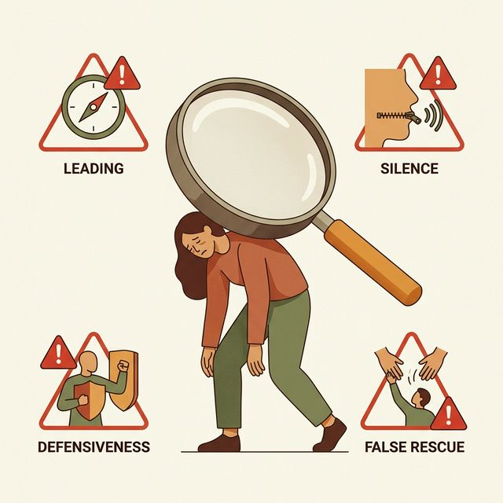

> [PHILOSOPHY]
> **Title**: 主持人的两难陷阱
> **Tag**: `#psychology`与科学的"木头人"精神

听起来似乎一切都很简单且水到渠成，对吧？把活人找来，给一段任务脚本，然后让他不停地说话。但实际上，要亲自执行一次高质量的出声思考可用性测试，可以说比登天还难。
这种难度根本不在于你需要掌握多少高深的统计学公式、需要计算多少组置信区间，而在于你需要极其痛苦地、违背本能地去**克制你最为底层的人性**。

请大家做个思想实验：当你是某一个高保真交互原型的首席设计师，你正屏气凝神地坐在那个不知所措的用户对面。她此时此刻正在一个你自认为"只要不瞎，这闭着眼睛也能走通"的支付流程里，像只没头苍蝇一样疯狂乱撞。那个散发着神圣光辉的巨大蓝色[确认]按钮就在右下角，但她就是视若无物，甚至开始反复去点击左上角一个根本没有任何超链接的装饰性扁平图标！

就在那个瞬间，你的血压会失去控制疯狂飙升。你的理智之弦紧绷，你身体里的每一种助人为乐的本能都在尖叫着、咆哮着，试图让你打破沉默去"帮"她一把。

这种几乎要扭曲面部肌肉的冲动，就是我所说的**"主持人的两难陷阱 ，即 **The Moderator's Dilemma**，"**。
作为一名具备工业素养的可用性测试研究员，你面临着的最大的挑战就是：**死死地闭上你那想要指导的嘴**。

为了确保测试数据的绝对纯净性，我们必须严防死守以下四个灾难性的干预陷阱：

**陷阱 1：引导性提问的毒药 ，即 **Leading the witness**，**
当用户陷入长时间停顿，并且眉头紧缩显得异常沮丧时，你绝对、绝对不能问："你看不到那个按钮吗？你要不要试着划到最底下去找侧边栏菜单？"
兄弟姐妹们，这是毁灭性、灾难性的干扰！在你问出这句话的瞬间，你已经把正确答案掰碎了喂给了她，这场测试的心智考察意义在这个节点就宣告彻底死亡了。
你**唯一能问**的，只能是极其寡淡中性的提示词："你可以跟我说说你现在脑子里在想什么吗？"，即 **What are you thinking right now?**，或者"你刚才在那停留了十秒钟，你在期待系统下一步发生什么？"。

**陷阱 2：对付死寂般沉默的不当处理**
出声思考本身其实是一种高度违反人类日常行为常态的动作。绝大多数正常用户，一旦在测试中陷入深度的复杂认知处理阶段（比如算一笔复杂的折扣账单、或者在多维度筛选器里寻找对应条件的酒店航班），他们会自动切断发声器官，下意识地闭嘴以换取全部的工作记忆资源。
如果是这样，整个测试室会陷入令人尴尬的死寂。如果沉默真的超过了 10 到 15 秒钟的红线，你要像鬼魅一样轻轻地介入提示。但提示的语言必须像手术刀般精准且冰冷。全球人机交互学术界强烈建议的标准化术语其实只有六个字：**"请继续说出想法" ，即 **Keep talking / Please keep thinking aloud**，**。无论如何，绝对不要加上任何你个人的判断、情感宽慰或者是焦急的催促。

> [VISUAL]
> **Slide**: 沉默与自卫：应对高压的冷酷
> **Layout**: `Split`
> **Scene**: 左侧是研究员咬紧牙关保持沉默的冷酷表情；右侧是一位新手面对用户指责试图解释架构时的慌张。展示克服本能的专业难度。
> *   **Asset**: 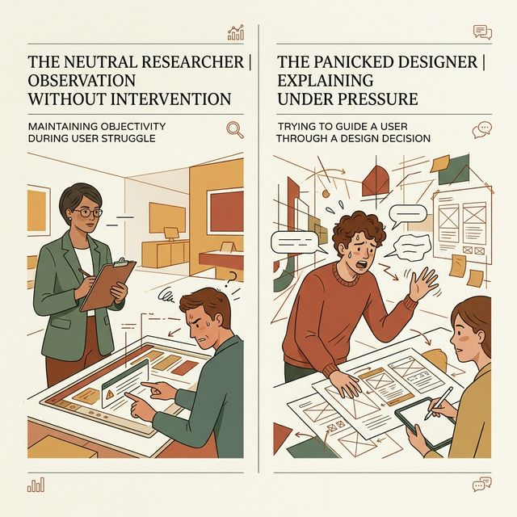

**陷阱 3：解释自身设计的防御本能，即 **Defensiveness**，**
某些刻薄的用户在压力之下往往会卸下面具吐槽："说实话，我从来没见过这么反人类的购物车逻辑，你们到底是从哪抄的奇葩交互？！"
在这个高压红杠点，无数初出茅庐的年轻设计师的心态会彻底土崩瓦解。他们为了维护尊严，往往会立刻反弹并开始辩解防御："其实不是这样的！因为我们这套底层框架要考虑到后端数据库长达一秒的冗余同步延迟，加上老业务的祖传包袱，所以才迫不得已特意做成这样异步加载的设计..."
**立刻停下你愚蠢的自卫！** 
你今天的全职工作，不是去当一个布道去说服用户你们的技术难点有多悲壮，你的唯一使命，是像记录一台地震仪一般，记录下这个由产品引发的巨大挫败感震级。你能做的最得体、最专业的回答只有两套模式："嗯哼（点头记笔记）"，即 **Mmhmm**，或者是"我完全听到了，非常感谢你这极其真实的反馈"。

**陷阱 4：虚假而温柔的救援 ，即 **False Rescue**，**
这是很多富有同情心的研究员容易折戟的深坑。部分敏感的测试者因为频频失败而触发极度内疚感（他们会产生"一定是我太笨了"的自责情绪），于是他们会用恳求的眼神望向你："我是不是应该点这里的右上角？你快告诉我呀，别让我猜了。"
这个时候，你必须学会用带着温柔语气的冷酷同理心去果断拒绝他们："真的非常抱歉，我想更真实地还原一下，如果是你周末一个人在家躺着使用这个软件的时候，没有人在旁边指导，你会怎么操作。你不如先尝试按照你的第一直觉再去试着探索一下，无论点错都不用担心，在测试最后的大复盘里，我保证会把一切逻辑原委都毫无保留地告诉你。"

> [VISUAL]
> **Slide**: 社交面具的撕裂：被试受邀者的重重防御
> **Layout**: `Focus`
> **Scene**: 动画气泡展示。左侧是用户真实的潜台词"这破软件太卡了"，右侧是用户最终说出口的代码伪装"可能是我手机内存不够了，哎，老了"。
> *   **Asset**: 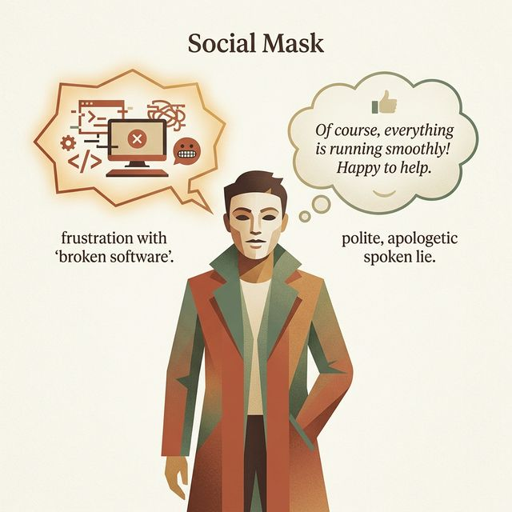

> [STORY TIME]
> **Title**: 破除社交面具：实验伦理与心理学屏障的清洗
> **Tag**: `#human-culture`

当我们深刻剖析了主持人的干预原罪之后，我们还要转过头来看看坐在你对面的受害者——用户。如果你以为，你只要坐在那里像块海绵一样闭嘴，用户就会把所有的真实想法像瀑布一样倾泻给你，那你实在是太天真了。
在任何涉及"人类观察人类"的社会学或可用性实验中，这就是大名鼎鼎的霍桑效应，即 **Hawthorne Effect**，被测试者会因为意识到"我正在被评估"，而戴上极其厚重且虚伪的"社交假面"，即 **Social Mask**。

这是人类在几百万年进化中刻在基因里的存活本能：我们要显得友好、顺从、聪明、且具有合作精神，也就是社会期望偏差，即 **Social Desirability Bias**。
当被试者在一堆极其简陋而反直觉的原型图上迷失自我、反复点击却无路可走时，他们内心深处真正的呐喊绝对是："你们这帮狗娘养的设计师到底懂不懂人机交互，这按钮做的是个什么鬼东西！"
但在极少数情况下他们会直接把这句话骂出来。绝大多数真实发生的录音里，他们会露出一种尴尬而讨好的微笑，擦擦汗说："哎呀，抱歉抱歉，可能是我年纪大了，平时不怎么用你们年轻人的东西，真的是我太笨了，没看懂。"

这种把系统设计失败的责任，主动包揽在自己智商和视力缺陷上的荒谬行为（也就是心理学上的"内归因模式"），是可用性测试最大的隐形毒瘤。
因为你如果拿着这种虚夸的、充满客套粉饰的记录本去交差，你就是在掩盖真理。

为了强行击破这两层坚固的心理防线，你必须在测试开始前那至关重要的**前置三分钟指导语宣导期 ，即 **Pre-test Briefing**，**里，用近乎洗脑和催眠的口吻，强行给被试者灌输我们的核心伦理观：
*"听着，今天我们在实验室里，唯一要测试的只有这个尚未完工、浑身是病的产品原型，我们绝对、绝对不测试你这个人。这款产品再烂、再难用，那也是我们在封闭办公室里拍脑袋的傲慢与失职。
如果你在这个系统里迷路了，我不仅不怪你，反而要感谢你帮我们指出了极其宝贵的漏洞。所以，请你尽情吐露你的挫败，大胆地骂出来，越残忍的批评、越直接的抱怨，对我们产品的涅槃重生来说，就越有价值。"

这就是一场破除面具的双重仪式，也是基于实验心理学理论，能够让用户安心切换为"刻薄挑刺者"的唯一解。如果不走这个流程，你获取的出声思考录音，不过是一场毫无学术价值的商务互吹。

> [ACTIVITY]
> **Type**: `Practice`
> **Duration**: `10min`
> **Desc**: 微演练：主持人的闭嘴艺术 ，即 **The Silence Game**，
>
> 目标：通过极端的压力模拟测试，训练学生在面对用户极限挣扎时控制干预冲动，并体会被压抑的解释欲。
> 
> **场景设定**：
> 1. 讲师在大屏上播放一段 3 分钟的真实且极其令人心酸的可用性测试录像。（一位视力衰退的农民工大爷，在极其繁琐的政务级挂号软件里，死活找不到因为键盘遮挡而无法上滑的短信验证码。屏幕倒计时在一秒秒流逝，老人急得满头大汗手足无措，甚至开始了绝望的反复叹气。）
> 2. 请全体听课的学生立刻想象自己就是那个坐在老人旁边、亲手设计了这个极品界面的产品经理。请大家全体起立，举起手站好。
> 3. **苛刻压力规则**：在这个长达数分钟的心理折磨录像播放中，无论屏幕里的生命个体显得多么无助、多么痛苦，在这期间**只要你忍不住开口给出了哪怕一句诸如"大爷，在下面，你往上划一下"的施舍式提示，或者发出任何"哎呀"之类的怜悯杂音，谁就被立刻判定无情淘汰并请坐下。**
> 
> **深度目的复盘**：
> 体验结束后，看着绝大多数无法忍受沉默而被迫坐下的同学们，讲师给出灵魂总结：
> "这种眼睁睁看着他人在自己创造的数字迷宫里痛苦碰壁、却又被死理束缚无法伸出援手的巨大无力感，就是每一个心怀悲悯的交互设计师，必须经历的痛苦剥皮与成长蜕变。" 优秀的可用性测试研究员，最大的美德与专业性的体现，就是残忍地收起你那傲慢的技术援助施舍欲，像一块没有情感的礁石一样，沉默、客观、且专心致志地记录真实的人祸灾难是如何发生的。

> [VISUAL]
> **Slide**: 新时代的低成本补位：远程无调节测试
> **Layout**: `Compare`
> **Scene**: 对比面对面（In-person moderated，高成本时间）与 远程无调节（Remote unmoderated，自动化规模测试）形式的优劣象限卡。
> *   **Asset**: 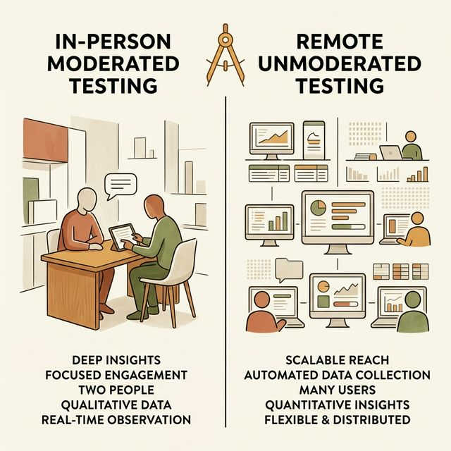

> [TECH NOTE]
> **Title**: 现代工业补位：远程无调节测试 ，即 **Remote Unmoderated Testing**， 的两面性

讲透了最经典、最纯正的面对面并发出声思考模式，我们也不能因循守旧。有同学可能已经敏锐地察觉到：要在实验室里找 5 个真人、并且高强度陪伴好几天，这成本太高且对主持人的柔性要求实在苛刻。
加上疫情之后的去中心化办公趋势，以及如 UserTesting, Maze 等大批 SaaS 产品的技术崛起，目前工业一线兴起了另一种主宰性实操变体：**远程无调节测试 ，即 **Remote Unmoderated Testing**，**。

简单来说，这就是一个没有主考官在场的无人监考的开卷考试。研究者在云端系统里像拼乐高一样配置好一套严密的、分步骤的任务点击脚本。然后，通过被试库将链接直接分发出去。被试者可能在地球另一端的大峡谷边上，也可能在自家凌乱的客厅沙发里。他们点开链接，在弹窗里授权浏览器调用他们自己的电脑前置摄像头和麦克风。接下来，全靠系统里的文字浮窗一步步指引，用户对着自己电脑一边自言自语完成任务，软件同时记录所有的点击热力图，即 **Heatmaps**，与光标迷失轨迹。

这是极其暴力的**规模化验证工具**：你能够在短短 24 小时之内，廉价地获取几十个身处不同文化时区、有着不同教育背景的真实用户的同款任务录屏，不需要你去租借北上广深昂贵的焦点小组观察室。

但请记住，工具的效率是对人性的透支。因为缺失了那个能在现场破防面孔的同频率连接频率，一旦屏幕里的那位用户绝望到中途关闭浏览器直接放弃测试时，你只能收到一份冰冷残缺的后台错误。**你再也没有任何机会追上去，扒开那个充满无力感的鼠标停顿长镜头，多问他最后一句至关重要的"为什么，即 **Why**，"。**
因此，我们在今天的全景总结中呼吁：永远将远程自动化规模测试，作为经典定性研究的辅助标尺，而在那些涉及从零到一的深水突破区，面对面的呼吸声和局促的对话，是你不可妥协的护城河。

## 模块 3：桌面版实验室与降维测试体系 (30 min)
<!-- BUDGET: 3600 chars | SLIDES: ≥ 7 | STATUS: done -->

> [VISUAL]
> **Slide**: 华丽的实验舱 vs 车库里的游击战
> **Layout**: `Split`
> **Scene**: 左侧是高度工业化的专业单面玻璃观察室（单向镜、眼动仪阵列、高规格隔音系统）；右侧是星巴克角落里的一台破旧笔记本电脑和两把极其普通的椅子。用这组极端的画面对比，彻底击破新手的器材焦虑。
> *   **Asset**: 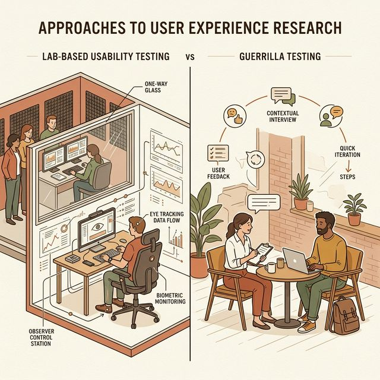

> [THEORY]
> **Title**: 实验室的幻象与火箭外科手术精神

每当我们在会议室里提议"咱们做一轮可用性测试吧"，大部分甚至连高管在内的同学们，脑海中浮现的第一画面，往往是那种造价几十万的专业"单向镜观察室"，即 **One-way Mirror Labs**。在大家幻想的那个高调定语里，测试者必须戴着红外线眼动仪，签署厚厚的保密协议，而你们，作为光鲜亮丽的交互研究员，坐在暗无天日的另一侧墙后，一边喝着热咖啡，一边通过对讲系统运筹帷幄。

这种重工业实验室确确实实存在，并且由于它能严格控制所有的环境变量，它产出的数据精度高得吓单。但最要命的问题在于，这种高昂的物理成本与超长的排期周期，往往会变异成团队在敏捷开发中**集体拒绝测试的完美挡箭牌**："由于下个季度预算被砍，没有钱招标专业的实验室。加上眼动仪也坏了，所以新功能还是直接闭眼上线吧。出了事就让客服去扛。" 这就是业界极其典型的实验室幻象，即 **Laboratory Illusion**，所带来的连锁并发症。

为了击碎这种技术官僚的傲慢，可用性先验理论大师 Steve Krug 在他那本薄薄的、却几乎能封为圣经的名著《Rocket Surgery Made Easy》（火箭外科手术式精益测试）中，向整个数字工业界抛出了一个振聋发聩的真理：
**一个阳光明媚的下午，三个在食堂临时拉来的路人，用最破旧的笔记本电脑所跑通的一轮粗糙的游击测试，即 **Guerrilla Testing**，其挖掘隐患的商业价值与避坑能力，永远远远大于为了等待那间完美无瑕的实验室审批而一拖再拖的一年期宏伟计划。**

可用性测试的本质从来都不要求医疗级别的严谨。它是一门实战手艺。关于如何在草台班子般的有限现实里，用近乎零的开销，无情铲除那些能摧毁产品的毒瘤。团队需要的仅仅是放下身段的态度，而不是装潢豪华的场地。

> [VISUAL]
> **Slide**: 五人制 ROI 拐点曲线
> **Layout**: `Chart`
> **Scene**: 赫赫有名的 Nielsen-Landauer 数学回归模型曲线。横坐标是测试的真实用户样本数量，纵轴是能被发现的系统严重问题比例。动画演示：当横坐标艰难爬升到数字 5 时，纵向的绿色区域直接势如破竹地突破了 85% 的红线标识。
> *   **Asset**: 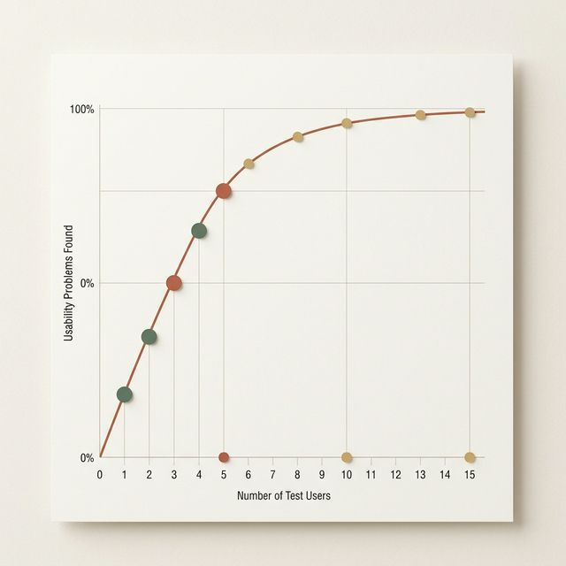

> [CASE STUDY]
> **Title**: 边际效用的铁律与五人魔法模型
> **Tag**: `#case-study`

即便我这样鼓励大家去打粗糙的游击战，你们理性的左脑依然会本能地追问：没有大样本数据背书，仅仅在一楼大厅随便拽几个人过来划弄两下屏幕，这样的结果真的符合统计科学吗？它的信度难道不会因为偶然性偏差而彻底坠毁吗？

这种担忧非常合理，但答案却极其反直觉：不仅科学，而且数学规律甚至近乎偏心地向我们倾斜。

Jakob Nielsen 根据泊松分布概率模型，以及海量实验室数据，推导出了黄金定律。这一定律确立于1993年，至今仍统治硅谷。：在一场标准的针对某特定用户群的单次迭代测试中，你其实只需要仅仅 **5 个代表性参与者**，你的团队就能稳稳当当地捕获系统中大约 **85%** 宏观可见的可用性灾难。

为什么偏偏是 5 个？为什么不能顺水推舟测到 50 个或者 500 个以求万无一失？
这背后的逻辑在于：在一个刚封版的高保真原型里，所谓的"设计缺陷"并不是玄学。它是客观存在的系统路障。是由代码和图元组成的物理实体。
比如，一个死活点不开的隐藏折叠面板，或者一段充满了缩写黑洞的支付文案。
第一个参与者被这个门槛绊倒了头破血流，你拿本子记下了。第二个参与者走到这，同样也绊倒了。当测试对象推移到第三个、第四个人的时候，你获得的新鲜洞察已经呈断崖式下跌，因为他们大多只是在用同样笨拙的姿势，极其可悲地去重复前人已经重复过无数次的错误。

当你不撞南墙不回头，非要斥资去测试第 15 个人。你根本无法从他疲惫的脸上发现新奇视角。，你只会百无聊赖且绝望地看着第 15 个无辜的人类，在同一个早已被标记为 A 级 Bug 的血坑里，重重地摔倒第 15 次。在经济学里，这叫极其悲惨的"边际洞察效用极速递减，即 **Diminishing Marginal Utility**，"。

所以，在大规模发版前的倒计时车间里，最冷酷、最高效的科学工作流只有一条：
**第一步是极速抓 5 个人启动强压测试。随后立刻全员停下手头的活，紧急修复被指出的最致命 Bug。最后带着打了补丁的全新干净版本，换另外 5 个路人验证。**
（分批次、高频次地测三个五人组，远比憋个大招一口气测十五个人要高明、有效上整整一万倍。这就是互联网能够统治时代的敏捷生命线跳动逻辑。）

> [VISUAL]
> **Slide**: 微型降维测试车间 (3 人联合兵种)
> **Layout**: `Split`
> **Scene**: 给出一个典型的上帝俯视视角的办公桌战术布置图。画面的核心焦点是中央紧握手机的被试者。左侧偏后方的阴影死角坐着如同空气般静止的观察员（标注红色警告：保持绝对防守姿态与闭嘴）。而在画面的最右边边缘地带，固定着一个正在打时间戳的冷酷键盘手——记录员。
> *   **Asset**: 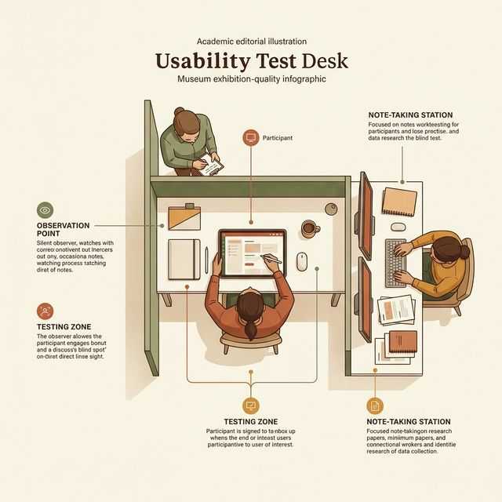

> [TECH NOTE]
> **Title**: 战术建制编组：铁三角与微型舰队

既然我们在精神层面卸下了实验室那可笑的包袱，那么在即将到来的 M4 作业环节或者你们未来的创业车间里，我们该如何用手头仅有的资源，火速搭建一个标准的降维测试阵地？
这套被无数公司验证过的降维方案，果断地剥离了所有脆弱的红外传感器，它只依赖于团队里活生生的三个人，去交织成一张密不透风的认知网络：

建制一：**主心骨测试者 ，即 **Participant**，**。这是这个小世界里唯一的法则制定者。他们坐在风暴绝对的中心，手心出汗地握着那台安装了你们心血的测试设备，负责毫无保留地将自己大脑新皮层里泛起的困惑、痛苦，全部具象化为能被麦克风捕捉到的出声碎碎念。他们被宣导需遵守的一条至高铁律是：遇到再难堪的死胡同都绝不向你求援，必须咬碎牙齿死磕到底直。

建制二：**影子主持人 ，即 **Observer**，**。这也是我们在 M2 中反复鞭挞的那个克制狂"木头人"。你在物理站位上，必须像个幽灵一样，悄无声息地嵌在测试者视线的右后方 45 度盲区。这是为什么？因为只要你坐在正前方形成了任何微秒级的目光对位，即 **Eye Contact**，那些讨好型人格的测试者就会像狗看着主人一样，下意识从你的瞳孔反光和嘴角抽动中，去疯狂索取那句"我是不是刚才做对了"的该死暗示。作为一道影子，你唯一的指令输出，就是那句极度单调的机器语音："请您继续大声说出想法"。

建制三：**冷酷打点员 ，即 **Note-Taker**，**。这往往是被分派坐在最外围的同侪。这个角色不需要多余的共情能力，他只是一台中继服务器。他必须目光如炬。面前放着一个已经对齐了全局时间戳的表格矩阵。他的任务枯燥到了极点却掌控着复盘的生杀大权：一旦目标用户开始皱眉犯错。或者是发出了致命的叹息。此刻必须立刻重重敲下键盘，记下录像带当前的秒表时间。，同时在大脑里用半秒钟对这个突发卡点做出无情的评级。这是因为在数小时后冗长沉闷的海量视频拉片中，正是这份精确到秒的坐标系，能够让我们如精准的巡航导弹般，直接快进到第 14 分 21 秒的残骸现场去重温灾难。

> [STORY TIME]
> **Title**: 观察员的幽灵修养与呼吸控制
> **Tag**: `#human-culture`

你们当中的部分同学，或许在分工时觉得自己被分配为敲键盘的记录员，就可以松一口气，不用去忍受当那一块冰冷的、必须闭嘴的观察木头人了。
在这里我必须给你们敲一个极其严厉的警钟：这三个被硬生生拼凑在方寸会议室里的人构成的封闭能量场域，其情绪波纹是紧密相连、一损俱损的。

哪怕你只是一个躲在角落的高冷记录员。你不经意间漏出的一声长叹，或者重重砸向回车键的沉闷声响，都会像核辐射一般。这些举动瞬间刺穿场内用户的心理防线。
人类那在丛林时代进化出来的敏锐听觉，让任何一声多余的打字急停，都在向用户疯狂宣告："好极了，你这头蠢驴又一次搞砸了，看，他们正在用极其开心的频率记录着你那不可理喻的黑档案！" 这种连锁反应会像雪崩一样摧毁他们本就脆弱如纸的系统安全感。

因此，在这套严密的铁三角体系下，无论你是全副武装的主持人，还是默默无闻的打卡机器，第一节必修课，也是最难挨的折磨，就是学会"从物理上把自己压缩、折叠成一团没有体温的空气"。即便是亲眼见证了足以令你想要抱头痛哭的低端操作，你也必须近乎残忍地去维持你的面部高冷与胸腔呼吸节律的顺滑。这是我们作为新时代数字世界的缝补者，向脆弱人性献上的最隐忍的职业操守与浪漫。

> [ACTIVITY]
> **Type**: `Demo`
> **Duration**: `10min`
> **Desc**: 讲师展示并实操记录一张真实的 0-4 级严重度评级打分表，让学生模拟判断 3 个短视频片段中的问题等级。

> [VISUAL]
> **Slide**: 灾难量化仪：严重度打分矩阵
> **Layout**: `Table`
> **Scene**: 一张极其冷血的工业评估表格。以红绿灯演化出来的五级梯度（绿-黄-橙-红-黑），从上到下罗列着由轻至重的 0 到 4 级史诗级可用障碍灾难评测。
> *   **Asset**: 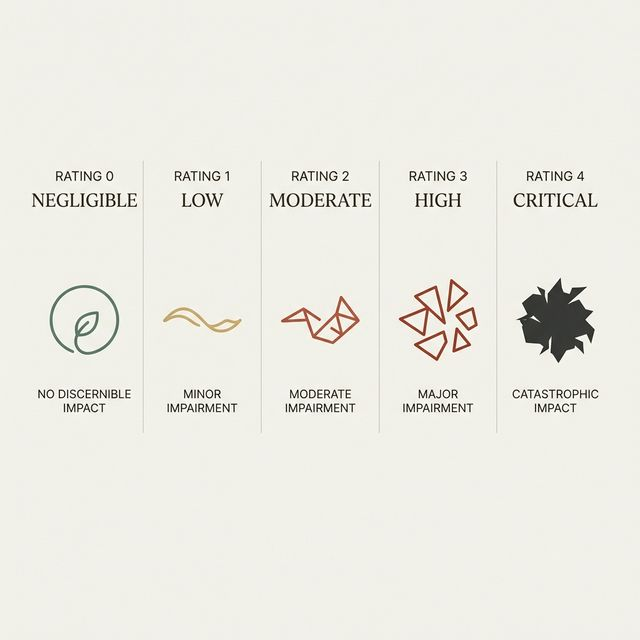

> [THEORY]
> **Title**: 从无意义的抱怨提纯到硬核工业通货

在这个模块的最后，让我们把镜头拉回那位冷酷的记录员。既然你手中掌握着秒表与键盘，那么，真正被你录入 Excel 表格的，究竟该是什么？你绝不能像个文学青年一样在报告里抒情："我们的目标用户在页面左下角迷失了，他看起来好蠢又好可怜。"
在高度商业化的产研协同链条中，这种主观的废话犹如一张废纸。我们需要拿着血淋淋的测试结果，去和同样傲慢的后端开发总监对质、撕扯代码的排期，去和只看财报的 CEO 据理力争，要求死缓、延期甚至是推翻重做。

因此，所有那些原始的、充满情绪宣泄的口头语录，必须经过一台强力挤压机的提纯转换，变成所有理工男都能一眼秒懂的工程数字。整个行业通用的是这套标准的 **0 至 4 级严重度工业评级量表 ，即 **Severity Rating Scale**，**：

- **(0级)：纯粹幻象 ，即 **Not a problem**，**。它在交互逻辑上其实不具备任何实质的物理破坏力，往往只是用户基于过去软件使用习惯或个人主观审美的随口牢骚。比如他可能会歪着头嘟囔一句："我总觉得这个按钮的浅蓝色有点点非主流"，但是，此时你的观察员之眼必须敏锐：即便他嘴上很嫌弃，但他大拇指按下去点击结算的速度却比谁都快，根本没有发生任何任务中断或停顿。对于这类反馈，你作为尽职的记录员只需客观将其记录在案，但它绝对不配占用研发队伍哪怕半个敏捷冲刺的修复点。
- **(1级)：表面划痕 ，即 **Cosmetic problem need**，**。非常微末的小小绊脚石。用户可能会对着一行缩写文案皱眉嘟囔个三秒钟，但凭借他们本能的常识立刻猜到了八九不离十，并且一路小跑完成了任务，系统主干网络未受影响。它只能留在你们最垫底的待办池里。
- **(2级)：中度阻断 ，即 **Minor usability problem**，**。用户不幸走上了一条令人绝望的分支歧途，例如他们只是想简单地点击换货申请，结果被错误的引导骗进了漫长的退货清算页。他们在那个页面来回折腾，浪费了显而易见的生命精力，但最终依靠着界面右上角的"返回首页"或"撤销"按钮，十分狼狈地找回了主线。这已经构成了强烈的优化信号，必须在下个补丁周期将其彻底消杀。
- **(3级)：主干断裂 ，即 **Major usability problem**，**。这已经是高度危险的雷区警告。此时，用户遭遇了灾难级的认知阻碍与任务中断。拿电商系统举例，为了搞清楚那个核心支付模块的叠加满减使用规则，他们可能在购物车和订单确认页之间，像无头苍蝇一样瞎转了超过 5 分钟的恐怖大圈。尽管最后他们在极其愤怒的咒骂声或者重重砸鼠标的动作中，惊险地提交了订单，但在这中间必然伴随着他们脱口而出的一句残酷毒誓："这辈子要是再用这个破瞎子应用，我就是狗。" 千万不要低估这种情绪，这种问题携带着极度恐怖的真实流失率，即 **High Churn Rate**。任何有责任心的产品负责人，看到测试报告里的这个 3 级红色标识，那一刻就应该立刻叫停新版本的公测发布权，强制团队全员回炉重造。
- **(4级)：史诗级灾难 ，即 **Usability Catastrophe**，**。这是系统的脑死亡瞬间。用户的宏观任务以失败和放弃告终。或者发生了大家最恐惧的悲剧。用户以为操作顺利收工了。实际上却毫无知觉地转账给了一个并不存在的账户。这种突破底线的重大伤亡级漏洞，如果不连夜修复，唯一的选择就是立刻断开外网物理拔掉网线，并在所有的应用商店里宣布下架！

有了这套自带极其强烈的说服力与威慑感的显微镜工业量表加持，你们就已经完成了一场真正意义上的蜕变。现在，在这三人的默契穿插中，去展开一次真实且刺刀见红的沙盘推演吧，这绝对比你在任何大厂的单反玻璃后，观摩一万卷冷若冰霜的录像带，都要来得震撼与深刻。

## 模块 4：[ACTIVITY] 跨组同侪出声思考测试 (80 min)
<!-- BUDGET: 0 chars | SLIDES: ≥ 0 | STATUS: done -->

> [ACTIVITY]
> **Type**: `Practice`
> **Duration**: `课后延展`
> **Desc**: 任务卡设计与内部自测 ，即 **Dry-Run**，（课后任务）
>
> 测试别人之前，先确保自己的武器没有炸膛。
> 1. **撰写任务** (15min)：各组针对自己的原型，写出 2 个具体的用户测试任务卡。要求：绝不包含界面上的提示词。
>    *错误示范*："点击右上角的红色退出按钮并确认退出。"
>    *正确示范*："你现在不想继续使用了，请找到终止当前操作的方法。"
> 2. **组内跑通** (15min)：本组同学按照写的任务卡，自己先走一遍流程。如果发现点击没反应、页面未串联，立刻打开 Figma 修复。绝不要用残次品去浪费测试者的时间。

> [VISUAL]
> **Slide**: 实验4(Exp4) 推进：同侪出声思考测试
> **Layout**: `List`
> **Scene**: 分步骤的作战指令板。
> 1. 交换战场 (组间交换原型)
> 2. 角色洗牌 (测试/观察/记录)
> 3. 收集火力 (发现严重度排序)
> **Scene**: 引导进入本单元的高潮实测环节。
> *   **Asset**: 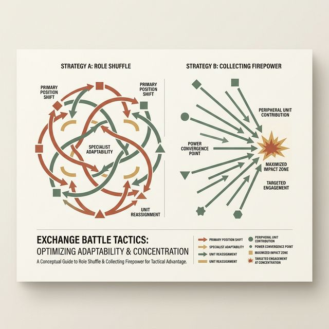

> [ACTIVITY]
> **Type**: `Practice`
> **Duration**: `80min`
> **Desc**: 实验4(Exp4) 推进：同侪出声思考测试
>
> 目标：运用 实验3(Exp3) 的高保真原型，开展直接的可用性火力测试。
> 
> **匹配机制：**
> - 相邻的两个小组互换原型。你们不再看自己的设计，我们要避免"创作者滤镜"。

**执行要求 (共 3 轮)：**
1. **准备 (10 min)**：写出你想让对方测试的 2 个核心任务卡（例如：找到将商品加入愿望单的入口并查看它）。任务描述要中性。
2. **执行第一轮测试 (15 min)**：由 A 组的一名同学担任"测试者"，B 组同学担任观察员。必须做到不提示、不干预。记录员填好时间戳。
3. **轮换与迭代 (2 x 15 min)**：强制轮换角色。每个人都要体会一次"只能看不能说"的煎熬，体会一次"作为测试者边做边说"的尴尬。

在记录问题时，请务必使用**问题严重度量表**。如果是页面卡死，那就是 4 级灾难问题；如果是文案稍有歧义但不影响主流程，那就是 1 级瑕疵。

**同侪伦理底线指引**：
请大家牢记，我们不是在证明"谁的设计更好看"，甚至不应直接说"你这设计不好用"。
**所有批评，必须指向具体元件与心智模型。** 比如"因为按钮隐喻不明，导致了识别失误"，而不是评价别人的思考方式。

> [TEACHING MOMENT]
> 注意——你同时在训练两种关键的表达适应能力（素质1）。作为**主持人**，你要学会用简洁、中性、不带诱导的语言引导测试者出声思考；作为**汇报者**，你要把发现的可用性问题用"现象→违反原则→修复建议"的结构清晰表达出来。这种根据角色灵活切换表达策略的能力，是未来跨部门协作中最稀缺的软技能。

开始实战，去倾听那些脑海中真实发生的噪音吧。

