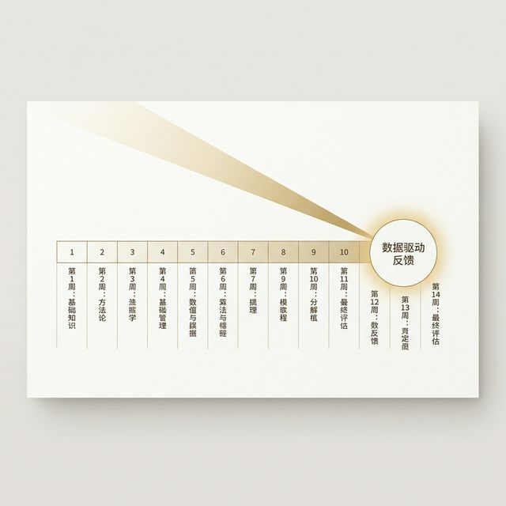
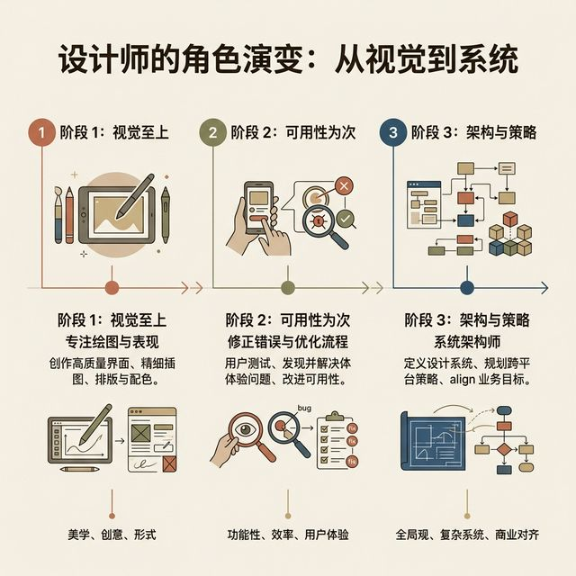
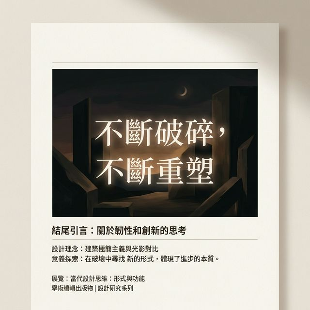

## 模块 6: 小结 — 你的终极身份 (约 5 分钟)
<!-- BUDGET: 900 chars | SLIDES: ≥2 | STATUS: done -->
<!-- MATERIAL_BUDGET: {M6: 100%} -->

> [VISUAL]
> **Slide**: 这不是终点，而是数据驱动的起点
> **Layout**: `Center`
> **Scene**: 以极简的黑底白字展示整个学期十四周的课程光谱，最后光束凝聚在代表"真实数据反馈"的圆圈上。
> *   **Asset**: 

> [STORY TIME]
> **十四周的狂野之旅**

各位同学，随着你们完成作品集的最终凝练，这门《交互产品开发》课程长达十四周的旅途，也正式落下了沉重的帷幕。
大家现在可以闭上眼睛，深深回想一下我们十四周前在第一节课相遇时的场景。

那时的你们，认为所谓的"数字媒体交互设计"，就是怎样熟练地打开 Figma，套用流行的 Material Design 或 iOS 规范组件库，画出几个带有漂亮渐变色的圆角按钮；怎么给转场页面加上花里胡哨、极其炫酷的弹簧微动效。当有人指出你们的产品不好用时，你们最常见的回答是："我觉得挺好看的啊，你不懂这是极简主义高级感。"

而现在，十四周的魔鬼训练过去了，看看你们都经历了怎样的蜕变？
你们学会了如履薄冰地挖掘人类脆弱的短时记忆和心智摩擦模型；你们懂得了怎么克制欲望去做最小可行性产品（MVP 项目假设验证）；你们掌握了极其复杂的网格响应式容器架构和多层级的深度防错安全网体系。在这个过程中，你们一次次地被先进的 AI 代码副驾驶和提示词工程降维打击，又一次次地从崩溃中站起来学会与其在这个新时代里共生。

最重要的是，在这漫长旅途的最后两周里，你们经历了血淋淋、惨不忍睹的实地可用性测试。你们亲眼看着自己的杰作被用户无情地点击卡死，你们学会了如何像一个冰冷理性的商业数据分析师一样，把厚厚一沓的痛苦吐槽便签撕碎、重组、合并、最终归类出核心的认知断层。而在今天，你们终于领悟了，用英雄之旅的滚烫叙事结构，去向未来的顶级面试官讲述你们推倒重构的艰难逻辑。

> [VISUAL]
> **Slide**: 从"画图美工"到"系统战略家"
> **Layout**: `Flow`
> **Scene**: 展示一名 UX 设计师成长的三个阶段：Visual First（唯视觉论） -> Usability Second（补丁可用性） -> Architecture & Strategy（重构与商业战略）。
> *   **Asset**: 

> [PHILOSOPHY]
> **你是谁？你要去向何方？**

这就回到了我在此刻，作为这门课程的主讲人，最想问你们的一个灵魂问题：所以，什么是交互产品工程师？
你们绝不是去互联网大厂当一个粉饰太平的外包切图美工，也不是一个躲在华丽代码和组件特效背后，永远不敢直面用户愤怒的自嗨者。

你们是产品灵魂的建筑师；是人类在面对冰冷复杂、充满压迫感的数字机器系统时的，唯一的抵抗者和保护人。你们是能够用冰冷的数据捍卫可用性底线专业准则，同时又能用巨大的同理心去原谅并拥抱笨拙操作失误的那群人。

不要再害怕那些标着红色的失败测试数据了。正如我们今天在高级作品集拆解里反反复复强调的：那些在绝望中能够坦诚面对界面失误、在泥泞的数据沼泽地里完成艰难体验重定向（UX Pivot）的人，才是正在真实成长并具有巨大商业价值的人。

当我们下一次相见，或许是在某个独角兽公司的面试会议室里。当你拿着一份展现了强悍逻辑思考筋肉、甚至毫不避讳地标出了推倒重建阵痛血泪史的作品集，从容走向那群严苛的大厂设计总监时——那一刻，不再是你卑微地去求他们赏赐一个岗位，而是你在向这个极其浮躁的科技行业，展示你不可替代的战略判断力与专业骨气。

> [VISUAL]
> **Slide**: 课程结语：继续破坏，不断重塑
> **Layout**: `Split`
> **Scene**: 黑夜背景，配以发光的文字引用：留下一句话作结。
> *   **Asset**: 

未来，当你们真正迈出校门，被抛入残酷的职场，你们会悲哀地发现，真实的商业世界比我们课堂上的受控测试场景还要无理与惨烈一百倍。你们会遇到极度不讲理、随时变卦的业务干系人（Stakeholders），会遇到由于技术负债而导致的诡异数据反馈，甚至会面临无穷无尽、永无止境的修改和迭代压力。

但请务必将这十四周的折磨化为你们肌肉里的反射记忆：
当遇到会议室里无休止的争吵时，请大喊：**"停下主观臆测，让冰冷的数据自己说话！"**
当界面看起来足够漂亮、所有人都沾沾自喜时，请问自己极其煞风景的一句：**"如果现在我蒙住半边老花眼，在抖动的公交车上，我还能点准那个该死的确认按钮吗？"**
当产品上线测试一败涂地、老板大发雷霆时，请坦然大笑，承认失败，然后在身后的白板上果断地贴上你们重构的第一张亲和图便签。

> [ACTIVITY]
> **Type**: `Practice`
> **Duration**: `0min`
> **Desc**: 课后作业布置
> 
> **作业任务**：收尾 实践项目4——系统梳理走查与 Think-Aloud 测试反馈，完成缺陷修正前后对比文档，撰写作品集复盘叙事（需包含数据证据链）。
> **交付物格式**：PDF 格式的期末作品集展板
> **提交要求**：下周一中午 12:00 前提交至教学管理系统

这门十四周的《交互产品开发》课程到这里，就正式画上句号了。但属于你们去改造真实世界的征途，才刚刚开始。

去无畏地破坏那些反人类的旧界限，用你们打捞出的数据和无可匹敌的同理心，去重塑一个更好的、让所有人都能感受到尊严的数字世界。

下课！祝各位前程似锦，好运常伴。
