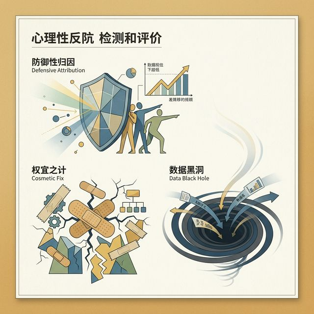

## 模块 1: 复习与数据打捞 (约 10 分钟)
<!-- BUDGET: 1800 chars | SLIDES: ≥3 | STATUS: done -->
<!-- MATERIAL_BUDGET: {M1: 100%} -> Use W12-13 notes -->

> [VISUAL]  
> **Slide**: 喧闹的测试室与寂静的数据表格  
> **Layout**: `Split`  
> **Scene**: 一侧是上周大家兵荒马乱互相测试的抓拍照片，一侧是密密麻麻表明收集表单。  
> *   **Asset**: 

> [STORY TIME]
> **兵荒马乱后的宁静**

在上周的课堂上，我们经历了一场真正的"可用性大练兵"。记得当时教室里的声音吗？
有些组充斥着挫败的叹息："你这按钮怎么点不动啊？"
有些组则屡次打破测试场纪律："哎呀，不是点那里，是左滑！"（各位，千万不能忘记主持人闭嘴的铁律啊！）
还有些同学在旁观用户迷失在层级迷宫时，露出了难以置信的表情。

大家拿着经过数周打磨的高保真原型，也就是我们的 实验3(Exp3) 阶段产出，在邻座同学的手里经历了最严酷的出声思考法（Think-Aloud）测试。我看到有人在一开始信心满满，五分钟后满头大汗；我也看到有人发现自己精心设计的引流入口，被真实用户完全无视。

那些我们在象牙塔里、在 Figma 画布上觉得理所当然的"完美逻辑"，在真实人类的指尖下，往往脆弱得不堪一击。这就是我们要进行受控测试的原因。还记得我们上周学的**大师经验吗？无论是 Nielsen 十大启发式评估，还是实地测试，**当你们坐在观察者的位置上，看着用户因为缺乏防错机制而删除了全部心愿单，或者因为系统状态不可见而疯狂连点支付按钮时，你们就真正理解了大师定下的这些规矩绝不是空谈，而是用无数失败产品的尸骨堆砌出来的数字规律。

> [VISUAL]  
> **Slide**: 新手测试者的三大抗拒心理
> **Layout**: `List`
> **Scene**: 列出防御性归因、表面修复、数据黑洞的特征。
> *   **Asset**: 

如屏幕上的列表所示，大家面对可用性测试暴击时，往往会无可避免地陷入这三大典型的新手抗拒心理。这就是从防御性归因到数据黑洞的错误行为特征。

> [TECH NOTE]
> **面对冰冷反馈的三种新手反应**

经过上周的洗礼，当我穿梭在各个小组之间时，我观察到了大家面对测试暴击时的**三种典型的新手反应**：

1. **防御性归因 (Defensive Attribution)**：当测试者卡住时，你不仅嘴上忍不住提示，心里还在嘀咕："这么明显的加号，他瞎了吗？这届用户不行。"各位，这是 UX 职业生涯中最可怕的毒药。用户永远是对的，如果用户觉得难用，那就是你的隐喻（Metaphor）与他的心智模型（Mental Model）发生了断裂。
2. **表面修复 (Cosmetic Fix)**：有些组立马把用户没看到的按钮改成血红色，字号加大一倍。这就好比病人喊疼，医生不拍 X 光找病灶，而是直接给他打麻药。你没有去深究"为什么此时此地需要这个按钮"，而是用视觉暴力去掩盖逻辑断层。
3. **数据黑洞 (Data Blackhole)**：测试时疯狂点头，测完后一身轻松，除了脑子里留下几句模糊的"好像那里有点卡"，没有留下任何结构化的记录。一周后的今天，你已经完全忘记了当时的细节。

如果你们中了以上任何一条，不用气馁，这恰恰说明你们正在经历从"画图匠"向"交互工程师"蜕变的阵痛。

> [VISUAL]  
> **Slide**: 原材料的堆积：从便签到洞察
> **Layout**: `Quote`
> **Scene**: 满墙杂乱的便利贴，对比整齐的电子表格数据。引出定性数据处理的必要性。
> *   **Asset**: 

请看大屏幕上的这张对比图。左边是满墙杂乱无章的便利贴，右边则是经过初步整理的、看起来整齐划一的电子表格数据。这就是我们将原始的用户声音转化为可用性洞察的第一步必要处理过程。

> [TECH NOTE]
> **质性数据分析的前奏**

当一轮测试结束后，你手里拿着什么？
是一张填满字的表格，或者几十张密密麻麻的便签纸。上面写着："用户找不到返回"、"小明觉得这个页面颜色太红了"、"测试者在结账页卡了15秒"。
这叫**原始数据 (Raw Data)**。很多新手的做法是，盯着这些数据挑出最容易改的几个错别字或者图片对齐问题，回去在几分钟内改掉，然后假装产品完美无暇。

但这只是在修补裂缝，并没有加固地基。

> [VISUAL]  
> **Slide**: 伪量化的陷阱：5个用户的统计学幻觉
> **Layout**: `Split`
> **Scene**: 左侧一个煞有介事的饼图（"60%的用户喜欢绿色"），右侧被打上鲜红的交叉，配文"不要在小样本测试中玩弄统计学"。
> *   **Asset**: 

就像图左侧这个煞有介事的饼图一样，很多新手喜欢在只有少数几个样本的情况下得出类似"百分之六十的用户喜欢绿色"这种结论。然后，就像右侧屏幕这个巨大的、鲜红的交叉警告一样，我们必须坚决抵制在小样本测试中玩弄所谓统计学的幻觉错觉。

> [TECH NOTE]
> **警惕可用性测试中的"伪量化"陷阱**

在教大家怎么捞数据之前，我必须先纠正你们极易犯的一个致命错误。当我翻看部分组的测试记录初稿时，我看到这样一句话："经过测试，我们发现有 60% 的用户在寻找结账按钮时遇到了困难，因此这个问题极其严重。"

各位，你们上周只测试了 5 个人。3 个人遇到困难，就算出了所谓的"60%"。如果明天再测一个人，这个比例就可能瞬间跌破 50%。在样本量不足 30 的定性受控测试中，去计算精确的百分比，不仅在统计学上毫无站得住脚的根据，更是一种非常外行的"伪量化"行为。

可用性测试，尤其是初期的形成性评估（Formative Evaluation），其核心目的绝不是为了证明"有多大比例的人会跌倒"，而是为了像法医一样去解剖**这块绊脚石究竟长什么样，它的棱角在哪里，以及它为什么会精准地绊倒具有特定心智模型的人**。我们在早期的每一次访谈和录屏中，追求的是极其深刻的质性洞察（Qualitative Insight），而不是单薄无力的量化证明（Quantitative Proof）。只要有 1 个真实用户因为你错误的功能架构假设而导致任务彻底失败（比如误删了整个核心数据库），这个问题就是绝对的体验灾难，哪怕其他 4 个人碰巧战战兢兢地绕过了它。

只有当你们停止在小样本上玩弄自欺欺人的统计学游戏，真正俯下身去倾听那 1 个失败用户所爆发的认知冲突时，你们的数据分析才算走上了专业的大道。

这也是为什么我们之前反复强调，可用性测试数据的魅力在于它的**深层质性规律**。为了从海量原始吐槽中打捞出具有决定性价值的结构化规律，我们需要引入工业界标准的质性分析两大火力支柱，这也是我们这节课马上要演练的核心。

> [VISUAL]  
> **Slide**: 小结与引语：数据复盘的意义
> **Layout**: `Title`
> **Scene**: 黑屏白字，引出本节课的核心主题。
> *   **Asset**: 

今天，也就是本课程的最后一讲。我们要探讨的是**数据复盘与作品库凝练**。
我们要学习的，不仅仅是如何用亲和图给痛点归类，更是怎么**讲故事**。怎么把你上周看似满盘皆输的测试数据，转化为你申请顶级互联网公司或者海外名校时，最令人眼前一亮的专业证据链。

> [ACTIVITY]
> **Type**: `Warm-up`
> **Duration**: `5min`
> **Desc**: 破冰：你的数据垃圾桶
> 
> 目标：唤醒学生对丢失数据的痛感。
> 
> **步骤：**
> 1. 请各组组长打开你们上周测试的记录表。
> 2. 讲师提问："如果你现在要把上周测试发现的最大痛点讲给一个投资人听，你能用一句话和一组数据证明这个痛点必须被修复吗？" (2min 思考)
> 3. 大部分组会发现他们只有定性的形容词（如"很难用"），而缺乏定量的骨架。
> 4. 总结：没有经过结构化打捞的数据，就是垃圾桶里的草稿。

在这个过程中，如果你们依然抱着"我的设计无需解释"的态度，那么各位，你们将永远无法跨越从"画图美工"到"产品灵魂"的这道鸿沟。在接下来的这几个小时里，请把你们所有的骄傲都收起来，把你们的设计稿当成一个等待被诊断的病人。我们不再讨论哪个渐变更好看，哪个阴影更柔和。我们只看数据，只看那些冰冷的、不留情面的、却能指引我们走向卓越的用户反馈。

真正的好设计不是一稿通过的奇迹，而是在拥抱失误的数据废墟中不断重构的科学进程。准备好直面你们的数据了吗？我们开始进入下一阶段。
