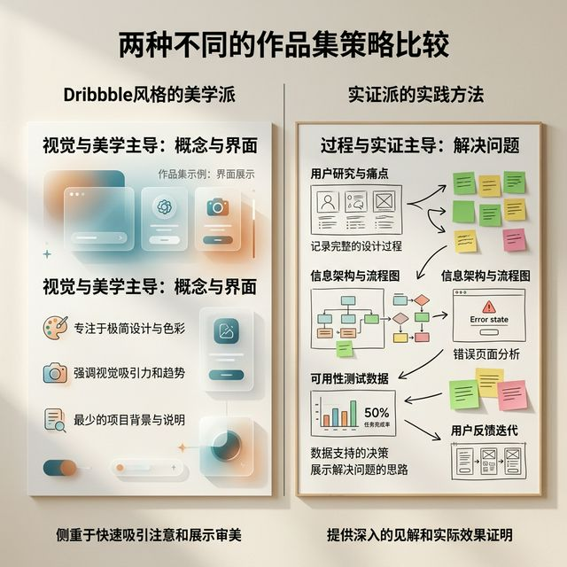
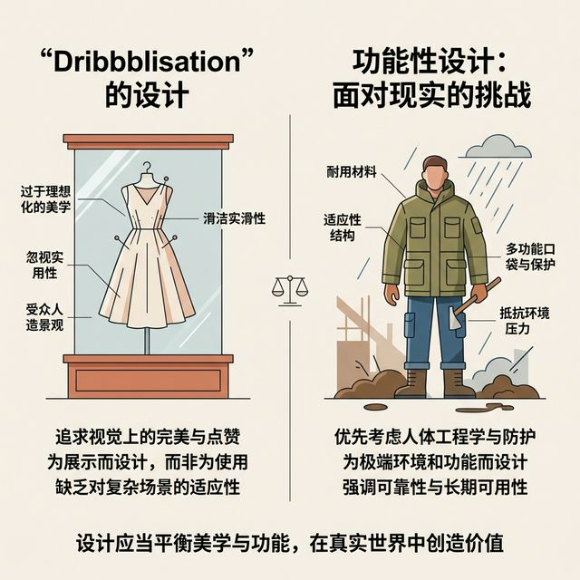
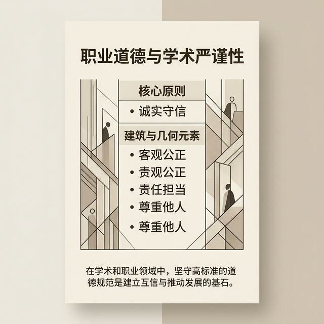
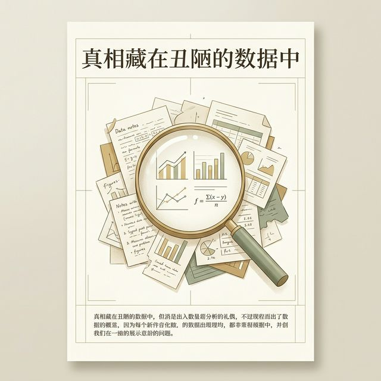

## 模块 2: 导入 — 美丽的废物与生还者偏差 (约 5 分钟)
<!-- BUDGET: 900 chars | SLIDES: ≥2 | STATUS: done -->
<!-- MATERIAL_BUDGET: {M2: 100%} -> Use dribbblisation note -->

> [VISUAL]
> **Slide**: 两份截然不同的作品集拆解
> **Layout**: `Split`
> **Scene**: 左边是一份极度精美但缺乏说明的 Dribbble 风格作品集；右边是一份视觉略显粗糙，但充满了流程图、报错页、测试数据的实战型作品集。
> *   **Asset**: 

> [STORY TIME]
> **面试官桌上的两份简历**

想象一下，你现在是某头部互联网大厂的 UX 设计总监，手里的 HC（招聘名额）只有最后一个。桌上放着两份刚毕业大学生的作品集。

第一位候选人，来自顶尖美院。打开他的作品集，哇，色彩搭配如梦似幻，各种复杂的玻璃拟物风按钮，极其顺滑的高保真微动效。简直是视觉的盛宴。但当你试图寻找他的"思考过程"时，你能看到的只有一句干巴巴的文案："我致力于为年轻人打造极简体验。"
没有真实的业务痛点分析，没有边缘情况考量，当然，更没有任何关于失败、折返和迭代的记录。就好像这个绝美的界面是从他聪明的脑子里一次性完美蹦出来的。

第二位候选人，视觉排版很干净，但不惊艳。然而，他的目录结构是：业务痛点、MVP 假设、第一次可用性测试带来的毁灭性打击、基于反馈的艰难重构过程、最终带来的转化率实质性提升。他非常坦诚，甚至放了一张"用户因为搞错按钮引导导致购买失败"的极度难看的真实录屏截图在显眼的位置。

请问，你会把年薪 30 万的 Offer 给谁？

> [VISUAL]
> **Slide**: 橱窗里的衣服 vs 泥泞中的战袍
> **Layout**: `Image`
> **Scene**: 以视觉隐喻的形式展示 "Dribbblisation of Design" 的困境。引出 `dribbblisation-of-design` 的核心观点。
> *   **Asset**: 

正如图中这个深刻的视觉隐喻所展示的，左侧这套放在奢华橱窗里、用上百个大头针别得严丝合缝的衣服，固然漂亮，但显然无法应对右侧图片中那些在风暴和泥泞里跋涉的真实挑战。这正是今天我们要反思的核心困境。

> [TECH NOTE]
> **警惕 The Dribbblisation of Design**

毫无疑问，99% 的专业有经验的 UX 团队都会毫不犹豫地选择第二位候选人。
为什么？因为在残酷真实的商业世界里，第一位候选人的作品往往被称为"美丽的废物"。这就引出了我们行业内这几年一直在深刻反思的一个现象：**The Dribbblisation of Design (设计的 Dribbble 化)**。

这个现象描述的是一种极其危险的倾向：新生代设计师过度追求视觉表现的极致，比如无瑕疵的柔和渐变、酷炫但不切实际的下拉刷新动效，而完全无视了真实世界的业务逻辑和可用性规则。

这种只展示"无暇"界面的作品集效应，暴露出一个致命伤——它无法证明你具备解决实际问题的深度。真实的产品是极其复杂的，它包含网络断开的边缘情况、没有任何数据的空箱状态、令人沮丧的报错页面以及至关重要的无障碍考量。那些在静态画板里看起来无比和谐的"Dribbble 风"完美设计，一旦填入真实的、长短不一的动态粗糙用户数据，往往在几秒钟内就会土崩瓦解，变得完全不可用。

这就像是放在橱窗里用上百个大头针别得严严实实的模特衣服，好看，但绝对不能穿在真人身上去挤早高峰的地铁。而专业的 UX 作品集要展示的，正是这件衣服"如何在泥泞和风暴中真正地保护你"。

> [VISUAL]
> **Slide**: 当视觉掩盖了常识：代价是什么？
> **Layout**: `Text`
> **Scene**: 回顾 W01 中提到的致命灾难（Therac-25、737MAX等），引发对专业伦理的警醒。
> *   **Asset**: 

更深层次地看，只关注"好看"而忽视"好用"和"防错"，是违背交互设计核心伦理的。
我们在这门课程的第一周就给大家讲过 Therac-25 医疗事故和三哩岛核事故中那些致命的界面设计缺陷。如果设计师满脑子都是"这个按钮的阴影够不够高级"，而不去研究测试数据中用户那一秒钟的迟疑，在涉及高风险场景的产品（如医疗器械、自动驾驶、金融结算）中，后果将是灾难性的。你的首要身份是产品的工程师和保护者，其次才是艺术家。

> [VISUAL]
> **Slide**: 拥抱失误的勇气：从隐瞒到坦诚
> **Layout**: `Quote`
> **Scene**: 大字牌："The truth is in the ugly data." (真相隐藏在难堪的数据中)
> *   **Asset**: 

很多同学在做作品集的时候，有一种执念，想要向世界展示"我是一个从不犯错的天才"。所以在遇到上周那种惨烈的可用性测试负面反馈时，你们的第一反应往往是本能地掩盖它。你悄悄改掉它，假装自己一开始就是这么睿智地设计的。

这是一种巨大的资源浪费！

因为在专业高级面试官眼中，能够**坦诚面对设计失误**，并且清晰展示出自己是如何被毫无保留的负面数据狠狠打脸，再忍痛进行 UX Pivot（策略性转向和重构）的人，比那些吹嘘完美无缺的人要有说服力一万倍。这种将自我批判融入复盘过程、展现持续迭代的发展价值观，才是高级打工人和菜鸟的绝对分水岭。
