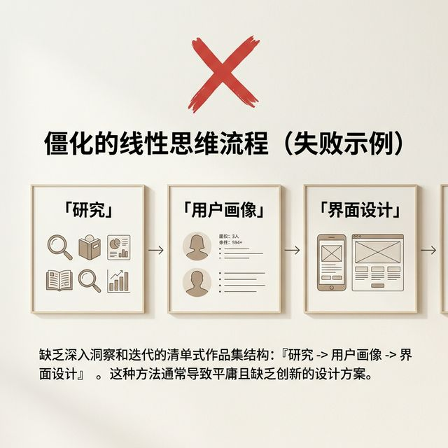
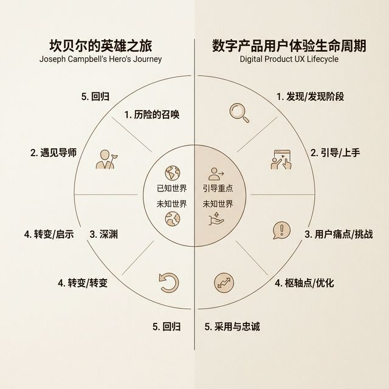
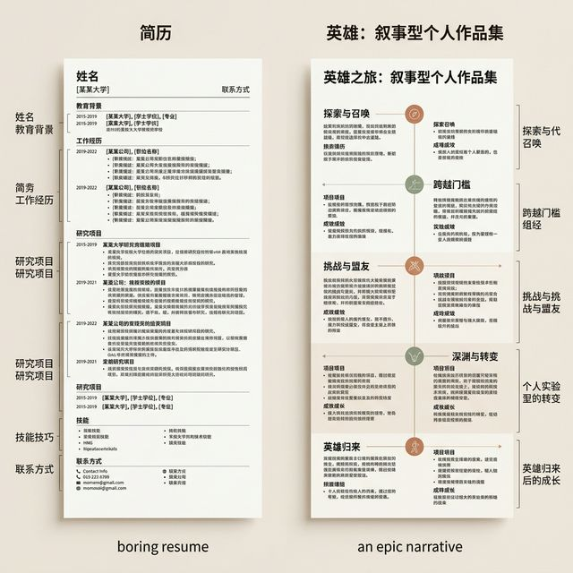
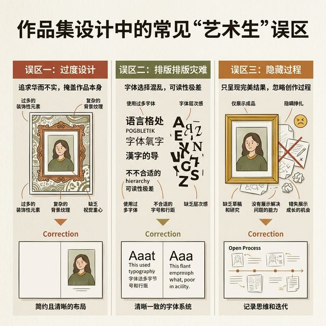
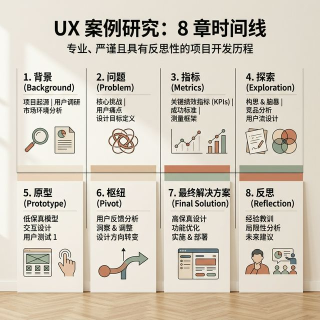
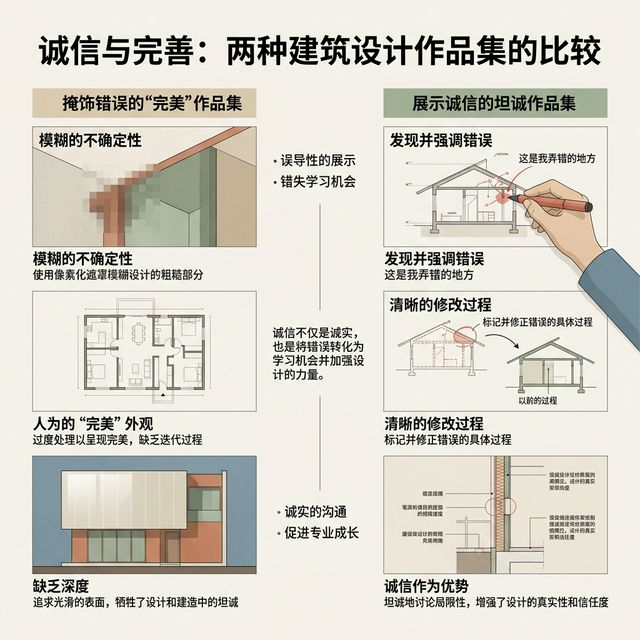

## 模块 4: 讲授(下) — UX 闭环叙事与作品集视觉包装 (约 25 分钟)
<!-- BUDGET: 4500 chars | SLIDES: ≥8 | STATUS: done -->
<!-- MATERIAL_BUDGET: {M4: 100%} -> Hub×3，补充作品集英雄之旅拆解 -->

> [VISUAL]
> **Slide**: 你的作品集为什么像流水账？
> **Layout**: `Text`
> **Scene**: 揭示常见的新手作品集目录结构：调研 -> 人物画像 -> 竞品分析 -> 颜色字体 -> 最终视觉。打上巨大的红色 ❌ 叉叉。
> *   **Asset**: 

> [STORY TIME]
> **拒绝流水账，我们需要史诗**

各位，现在你们手里有了最棘手的问题（严重度 3 级/4 级），有了你们在 Figma 里挥汗如雨做出的重构设计，再加上最终第二轮测试的数据回暖。万事俱备，准备写作品集了。

但这里往往是死伤最惨重的战场。
我见过无数艺术类、设计类学生的作品集（包括我们刚才 M2 里的那位"美院毕业生"），结构永远是千篇一律的"八股文"：
第一页放桌面研究，第二页放用户画像（甚至是用虚假数据捏造的 Persona），第三页放一堆看不懂的竞品分析雷达图，然后突然跳出两页颜色和字体规范，最后是连续十几页眼花缭乱的精美高保真界面截图。

这叫做"我做过什么"的堆砌，这叫**线性流水账**。
面试官看这种作品集，就像在看一份干巴巴的产品外壳说明书，毫无起伏。

真正高段位的作品集，不仅能清晰向面试官展示"这些界面长什么样"，更要证明"你是如何带领用户跨越重重认知障碍的"。你需要的是一种充满冲突纠葛和共情杠杆的故事框架。

> [VISUAL]
> **Slide**: "英雄之旅"与用户体验的完美同构
> **Layout**: `Split`
> **Scene**: 左侧是坎贝尔的英雄之旅圆环，右侧是对应的数字产品 UX 闭环结构。引出 `hero-journey-portfolio` 核心点。
> *   **Asset**: 

> [PHILOSOPHY]
> **我们都是给用户写传记的人**

约瑟夫·坎贝尔在《千面英雄》中提出了著名的"英雄之旅"（Hero's Journey）叙事模型：一个普通的英雄，听到了历险的召唤，在导师的帮助下跨越深渊，接受最严酷的试炼，最终带着万能药回归故乡。
所有的好莱坞大片，从《星球大战》到《黑客帝国》，乃至《指环王》，用的都是这个底层的骨架套路。

为什么人们百看不厌？因为它能引起基于人性的最强烈的情感共鸣。
而在这个伟大的故事模型中，有很多初级设计师常常把自己当成了那个所向披靡的英雄，以为自己在拯救世界。

错！大错特错！**在优秀的 UX 案例复盘中，用户才是主角，是那个遇到困难的英雄。而你设计的产品和你自己，充其量只是那个在危难关头给他送去魔法宝剑的导师（Mentor）。** 

让我们将你们上周的测试苦难，映射到这个英雄之旅的几大章节上：

1. **平凡世界与呼唤（背景与核心痛点评估）**：用户在旧有的工作流中遇到了极度的痛苦（例如：老版本系统的冗长表单总是让他们在最后一秒填错崩溃）。这是你的项目启动契机。
2. **初遇导师（提出假设 MVP）**：你作为交互设计师登场了。你提出了一个 MVP 核心业务假设："如果我们把流程改为向导式智能拆解，认知负载和错误率会必然下降吗？" 这是你绘制的魔法武器的最初草图。
3. **坠入深渊（严重度 4 级的测试灾难）**：全剧的高潮来了！你拿着第一次做好的高保真原型信心满满地去测试，结果发现用户居然完全找不到下一步的入口，甚至比以前更加愤怒和迷茫。这就是**最宝贵的转折点**，不要逃避！它是你叙事里最具戏剧张力，也最体现你专业深度的核心章节。
4. **重塑与试炼（因冷酷反馈而进行的 UX Pivot）**：你没有掩盖失败，也没有怪用户太笨。你诚恳地承认了自己隐喻的失败，果断推倒了原来的华丽草图，基于严肃的亲和图数据重新设计了防错机制和可见性逻辑。你把那个极度难看的原始抓狂录屏和你深思熟虑的逻辑推导过程并列展示出来。
5. **带着万能药回归（业务影响与铁证）**：经过你尊重数据、剥丝抽茧的重构，第二次可用性测试顺利通过。最艰难的任务完成率从可怜的 40% 飙升到了 95%。这就是你给这个真实世界带来的最终改变。

在这个充满波折的闭环结构中，没有一句废话，没有一张多余的视觉稿。每一个界面的出现，都是为了让"英雄"能够走到下一步。这样的作品集，面试官看一次就能记住一辈子。

> [VISUAL]
> **Slide**: 深度拆解：一份满分作品集的幻灯片级再造
> **Layout**: `Image`
> **Scene**: 左右分栏对照。左侧是传统的"艺术生流水账"，右侧是经得起商业拷问的"UX闭环英雄之旅"。
> *   **Asset**: 

> [CASE STUDY]
> **逐屏诊断：让你的作品集从平庸走向史诗**

刚才我们讲了八章节法的理论骨架，现在我们将它具体化。
假设你正在准备明年的大厂春招面试。你的演示项目正是刚才 M3 里的那款"老年人智能服药 App"。
我们来看看，一个平庸的菜鸟（我们称之为 A 同学）和一个深谙体验叙事的高级玩家（我们称之为 B 同学），在面试的展示策略上会有怎样天壤之别的表现。

**第一幕：如何开场（Project Overview）**
- **A 同学的 PPT**：封面上写着巨大的标题《基于适老化的智能医疗吃药软件设计》，下面一行小字写着名字，背景配了一张自己在网上找的极其炫酷但毫无意义的 3D 药丸渲染图。
- **B 同学的 PPT**：封面上是极简的文字《忘记吃药，是一个可能致命的系统级 Bug：某老年人医疗 App 适老化重构》。副标题写着："通过基于行为数据的防错流重塑，将核心人群的任务失败率降低了高达 80%..." 右侧有一张非常清晰的核心防错界面的手机 Mockup。
*点评：A 同学在办一场虚无缥缈的艺术展，B 同学在兜售一个已经被证实解决商业痛苦的价值方案。B 同学在第一秒就用刺骨的数据和结果抓住了面试官的眼球。*

**第二幕：如何展示痛点调研（Problem Definition & User Profile）**
- **A 同学的 PPT**：放了三张从全网搜集拼凑来的无意义雷达图，几张不知所云的竞品分析表格，以及一个充满刻板印象的用户画像 Persona（"李大爷，65岁，喜欢跳广场舞"）。
- **B 同学的 PPT**：无情地砍掉了所有无聊的竞品表格。屏幕上只有一张极具冲击力的真实用户在厨房手忙脚乱操作手机的抓拍照片，并引用了一段绝望的真实采访记录："我昨天又忘记吃降压药了，因为那个推迟按钮实在太小了，我点不准。" 紧接着，B 同学给出了一刀见血的核心定义："现有的所有医疗提醒产品，都在强迫视力衰退的老人在高压环境下辨认小字，这不仅是产品缺陷，更是违背了基本的无障碍设计伦理。"
*点评：A 同学在极其敷衍地走流程，疯狂堆砌方法论名词；B 同学在建立**强烈的同理心和叙事冲突感**。这就是"英雄之旅"中极度压抑的"平凡世界"，它让接下来的"救赎设计"变得有血有肉。*

**第三幕：如何展示第一版粗糙方案（The First Draft Hypothesis）**
- **A 同学的 PPT**：毫无过渡地直接放上一套精美绝伦的终稿高保真界面。他假装自己是个天才，不用经过任何试错，一次就画对了所有东西。
- **B 同学的 PPT**：放上一套只包含黑白灰粗糙线条的线框图（Wireframes）。并且旁边用鲜艳的红色箭头清晰地标出最初的设计假设结论："当时我们极度天真地认为，只需要把普通界面的所有按钮放大三倍，老年人就会顺畅使用了。"
*点评：B 同学在精密地铺垫转折。没有之前的无知与自大，就无法凸显后来被数据教训后顿悟的伟大历程。*

**第四幕：如何展示可用性灾难（The Abyss / 坠入深渊）**
- **A 同学**：不好意思，这一幕压根不存在。A 同学认为在面试官面前展示自己曾经的失败设计，会让自己显得极其愚蠢，从而拿不到 Offer。
- **B 同学的 PPT**：画风突变！屏幕上出现了一张刚才我们在 M3 里看到的残暴的亲和图实拍照片，满墙混乱的红绿便签。B 同学在 PPT 正中央用大大的刺眼红字写着：**"我们的核心假设完全错了！"** 旁边贴着两张极具破坏力的严重度 4 级警告单——"跨场景状态追溯不可逆失败"和"心智模型完全倒错"。
*点评：这是全场的终极绝杀！当 B 同学毫不掩饰、甚至是略带骄傲地展示第一版被严肃测试数据彻底撕碎的过程时，面试官的心跳会不由自主地加速。他们见惯了千篇一律的完美飞机稿作品，这种**拳拳到肉的残酷真实感**，展现了极其稀缺的实证主义精神和抗挫折抗击打能力。*

**第五幕：如何展示逻辑绝地反击与重构（The Pivot & Deep Iteration）**
- **A 同学**：仍然在放漂亮的渐变色界面，旁边配着极其苍白的文字说明："在这里我运用了极简主义风格，使用了代表生命活力的青绿色。"
- **B 同学的 PPT**：放出了最硬核、也是交互设计师最重要的武器 —— **Before-After 双层核心流程对照图**。
    - 左边残骸（Before 原貌）：用红圈重点标注了测试中导致大批老奶奶卡死的迷点（"没有任何状态反馈的死寂按钮"）。
    - 屏幕中央的逻辑跨度桥梁：写着一段极其克制且严苛的学理推导逻辑："基于 Nielsen 启发式评估原则的第一条（系统状态始终保持可见性），我们必须剥夺用户短时记忆的沉重压力。"
    - 右边新生（After 重生版）：全新的智能解决方案界面，清晰地剥离并单独展示了具有强震动物理反馈和全屏无声阻断式绿勾的交互弹窗细节。
*点评：这叫作不可辩驳的**逻辑闭环铁证**。B 同学不仅是在向面试官证明"我能画出非常好看的弹窗"，更是在论证"为什么在此时、此地、此种痛点下，我必须使用这样看似粗暴但对老年人极其有效的无脑弹窗"。他展示的根本不是简单的视觉产物，而是**逻辑思考的强悍肌肉**。*

**第六幕：如何收尾落潮（Outcomes & Critical Reflection）**
- **A 同学的 PPT**："这是我的排版规范墙。谢谢观看，欢迎您的交流与批评指正！"
- **B 同学的 PPT**：放出了震撼的量化回归测试结果——"第二次针对性受控测试显示：严重度 4 级的致命灾难性报错彻底清零，核心任务的完成平均耗时从灾难性的 45 秒大幅垂直降至 12 秒。" 在 PPT 的最后一页，B 同学写下了一段不卑不亢的深刻反思："如果你不亲自下场和你的终端用户坐在一张嘈杂真实的桌子上，你的所有华丽设计都只是你傲慢的幻觉自嗨。下一次如果我们还有预算和时间，我极其希望能在真实厨房环境中，严格测试抽油烟机的噪音和手上的油污对屏幕触控防误触机制的影响。"
*点评：高下立判。A 同学拿到了一张温和的好人卡和一封感谢信，而 B 同学拿到了这位设计总监极其罕见的团队 Headcount 的特别青睐。*

这就是我们在一开始所说的：从沉没的数据中打捞出史诗级的证据连。你们要做的，绝不是去当一个只会修图粉饰太平的外包美工，而是要当一个像刑侦探员、像深入一线的战地记者一样，毫不犹豫地扎进数据泥潭，最终带着清晰的逻辑线索凯旋归来的高级交互架构师。

> [VISUAL]
> **Slide**: 艺术生做作品集的三大误区
> **Layout**: `List`
> **Scene**: 揭示数字媒体艺术学生的常见排版和逻辑雷区。
> *   **Asset**: 

大家平时在构思呈现方式时，特别容易踩中屏幕上列出的这三大逻辑盲区和视觉排版雷区。那些看似精致的视觉包装，往往反而削弱了你们在逻辑深度上的核心竞争力。

> [TECH NOTE]
> **避开艺术生的"视觉陷阱"**

在我们这门数字媒体交互设计课里，大部分同学都有很强的美术和平面设计功底。这是你们的优势，但往往也会成为你们做 UX 作品集时的致命伤。

这里有三个最常见的**艺术生误区**：
1. **重构过度，丢失初心 (Over-redesigning)**：为了让画面好看，有的同学甚至会在最后的环节强行修改原本测试通过的原型，加上一些不必要的装饰。记住，不要为了视觉牺牲你在前面好不容易建立起来的逻辑闭环。真实 > 美观。
2. **文字排版灾难 (Typographic Disaster)**：把自己当成了在做时尚杂志排版。用大量的细体字（Light）、极低的对比度（为了所谓的"高级感"灰色），导致面试官在手机屏幕或者劣质投影仪上根本看不清你的结论。我们在 M2 里讲过，如果你的作品集连基本的 WCAG 对比度标准都过不了，你就不配说自己在做用户体验。UX 设计师的第一准则：必须确保你的作品集本身，就是可用性的最高示范。
3. **隐藏过程，只秀结果 (Hiding the Process)**：这是最普遍的。有的同学觉得放草图和便利贴很"掉价"，觉得放自己第一次测试失败的数据很"丢脸"。他们把所有珍贵的推导过程都藏了起来，只展示完美的高保真。这就又回到了我们说的 "Dribbblisation of Design"。

> [VISUAL]
> **Slide**: 作品集的工业标准 —— 八章节法
> **Layout**: `Timeline`
> **Scene**: 展示从项目背景到结果反思的完整结构骨架。对应 `portfolio-case-study-structure`。
> *   **Asset**: 

现在大家看到的这条长长的时间轴，就是业界推崇的高分标杆：从项目的初期背景定位，一路延伸至最终的结果反思。这就是支撑一份顶级案例设计的结构骨架法门。

> [TECH NOTE]
> **工业级作品集的骨架：八章节法**

既然我们拒绝了流水账，又避开了视觉陷阱，那么一个成熟的作品集案例到底应该怎么组织？业界最受认可的结构，我们称之为**八章节法**。你们接下来的期末展板，也必须严格遵循这套骨架。

1. **一句话电梯演讲 (Elevator Pitch / Overview)**：不要一开始就大段铺成。用三句话交代：这是个什么项目？你解决了什么核心问题？你的角色是什么？附上一张最具代表性的最终设计图作为"钩子"（Hook）。
2. **定义真正的问题 (Problem Definition)**：这是故事的起点。不要写"我想做一个好用的买菜软件"（这不是痛点）。你要写："现有的社区团购软件，因为缺乏商品新鲜度的实时反馈，导致 30% 的老年人在第一次下单后不再复购。" 这就是你在亲和图里找到的那个"母巢"。
3. **指标与受众 (Metrics & Audience)**：你想帮助谁？你如何衡量你成功了？如果你说你要"提升用户体验"，这叫废话。如果你说你要"将第一次绑卡流失率从 45% 降低到 20%"，这就叫专业的 UX 视角。
4. **探索与假设 (Exploration & Hypothesis)**：你在这个阶段做了什么？竞品分析、架构图、用户旅程图。请记住，不要放无意义的雷达图，只放**得出了关键洞察**的图表。你画这个图，是为了导出你的 MVP 假设。
5. **原型与灾难测试 (Prototyping & Disaster Testing)**：这是"坠入深渊"的章节。大方地展示你第一次那个粗糙的原型，以及它在出声思考测试中是如何让用户抓狂的。贴出记录员的截图，标出可用性灾难发生的位置。
6. **转折点与重构 (The Pivot & Iteration)**：**最核心的章节！** 告诉面试官："基于上述血淋淋的数据，我意识到之前对用户心理模型的假设是错的。所以我推翻了原有的流程，进行了这三个关键重构。" 这里，用 "Before-After" 双层对照图是最好的视觉化手段。
7. **最终方案与设计系统 (Final Solution & Design System)**：这时候，你可以把你们最擅长的视觉功底拿出来了。展示你严谨的组件库、层级清晰的高保真界面，以及流畅的动效。这是你们拿分的保留项目，但前提是，它是建立在前面的逻辑之上的。
8. **结果反思与下一步 (Outcomes & Next Steps)**：由于课堂时间的限制，我们很难拿到上线后的真实业务数据。但你可以展示你的**二次可用性测试**对比数据。最后，必须要写一段"如果再给我两个月，我会改哪里"的反思。这表明你具备持续迭代的成长型思维。

> [VISUAL]
> **Slide**: 坦诚面对失误：从隐蔽到大声疾呼
> **Layout**: `Image`
> **Scene**: 两张图对比：左边是打满马赛克掩饰失误的作品，右边是用高亮笔标出"这里我曾经搞砸了"的作品集。
> *   **Asset**: 

> [STORY TIME]
> **顶级大厂的翻车与迭代**

不要觉得"做错了再改"是一件丢脸的事情。世界上没有任何一个伟大的产品是一稿完成的。

你们每天都在用的超级 App，都经历过惨烈的翻车。
记得几年前某超级短视频应用的全新改版吗？他们曾经为了商业化，彻底推翻了原来的内容分发逻辑。结果是什么？一百多万用户在网上请愿要求改回老版本，估值瞬间蒸发。
他们是怎么做的？他们没有硬撑说"用户不懂欣赏"，而是虚心接受了灾难级别的反馈，用极快的速度进行了 UX Pivot（体验重定向），把界面恢复，并且在底层重新平衡了商业变现与用户习惯的关系。

再比如某社交巨头最近推出的"编辑帖子"按钮。一开始他们怕滥用，设置了极其繁琐的层级和倒计时。结果上线第一天就被用户骂上热搜："为了改一个错别字，我需要经过五步确认，比重发还慢！"
由于忽视了前期的可用性测试，这个功能成了一个笑话。但在接下来的一周里，他们迅速根据数据删减了警示弹窗，延长了修改时间窗口。

这叫什么？这就是拥抱失误的勇气。
如果你是一个初入职场的设计师，面试官当然知道你不完美。他们最怕的不是你技术差，而是你**不敢面对冰冷的真实数据，永远躲在自己营造的美好泡影里**。

当你在作品集里，用大号红色字体圈出你曾经搞砸的那个地方，并写下"我对用户心智模型的判断出现了严重偏差"，相信我，面试官在看到这句话的那一瞬间，就已经决定要把你招进团队了。因为他看到的是一个可以托付真实业务、具备自我批判精神的成熟工程师，而不是一个只会画界面图的温室花朵。
