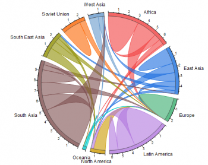
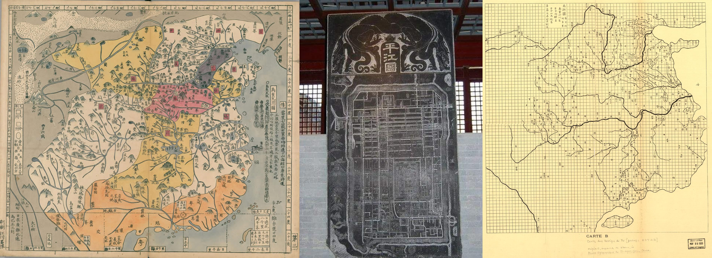

# 时空隐喻与视觉表达

> **核心参考源**：郝亚维《信息可视化设计》第三章

在数据驱动的数字时代，面对庞杂的数据集时，图表设计往往容易陷入“工具导向思维”。设计师或分析师最直观的反应往往是打开软件的下拉菜单，在柱状图、折线图或饼图中进行机械选择。这种被标准模板框定的思维模式，实质上剥夺了数据在视觉重塑和叙事表达上的潜力。

《信息可视化设计》一书指出：**图表不仅仅是承载数字的容器。图表类型的选择，本质上是在寻找一种合适的时空隐喻（Spatiotemporal Metaphor）。** 每一种几何形状的展开方式，都在无意识中调动着受众关于空间、时间、流动或对立的记忆。

## 1. 寻找最贴切的时空隐喻

设计并非纯粹的工程计算，而是为数据寻找最匹配的隐喻外衣。不同图表的空间结构，向大脑传达了截然不同的潜意识信息。

### 木桶理论：牵制与平衡（雷达图）

*图：雷达图的物理隐喻。来源：《信息可视化设计》*

当选用雷达图（Radar Chart，或蜘蛛网图）时，其本质并非简单地在坐标轴上标点。由于雷达图的各个轴线是从同一个中心点向外围辐射的，这意味着每一个指标的增长都在试图拉扯整个形状的面貌。因此，它在视觉上隐喻了**“不同能力维度之间的相互牵制与平衡”**。这恰好是“木桶理论”的视觉化表达，广泛适用于多维能力的综合评价体系中。

### 历史长河：能量与物质的交织流动（桑基图）

*图：桑基图。来源：《信息可视化设计》*

桑基图（Sankey Diagram）和流柱图常被用于展示能源消耗、材料回收或用户网页访问路径。桑基图不仅仅是展示出入口的数字大小，它通过互相纠缠、分叉又汇合的彩色条带，隐喻了**“历史长河中能量或物质的交织流动”**。宽窄代表了通量，颜色的汇聚代表了演变过程。

### 俄罗斯套娃：层级包含（旭日图）

*图：径向树状图（旭日图）。来源：《信息可视化设计》*

旭日图（Sunburst Chart）是一种从圆心向外层层辐射的多层环形结构。这种结构暗示了**“层级包含关系”**——从最内层的根结点，到第二环的分类，再到外环的子分类。它隐喻的是“一切复杂的整体，都可以被层层剥开来观察”。这种由内而外层递展开的空间逻辑，完美吻合了人脑中“从整体概览到细节钻取”的认知路径。

### 复杂系统：支配性力量通道（和弦图）

*图：和弦图隐喻复杂的连接通道。*

和弦图（Chord Diagram）将数据节点均匀摆放在圆环上，通过粗细不等的弧线带连接。这种结构隐喻的是**“万物之间的关联强度”**。那些最宽最粗的弧带，代表了系统中交互最频密的通道。它利用几何圆的完美对称，向受众揭示复杂系统内部支配性的流动关系。

## 2. 隐喻坐标系：四大时空生态

面对海量图表模板库，可以通过建立一套底层的“隐喻坐标系”来进行归纳。任何深层次的分析需求，其可视化的物理落脚点均可归入以下四大时空生态：

1. **时间之渊 (Time Series)**：隐喻不可逆的线性流逝。无论是折线图还是面积图，本质是在水平空间维度上用向右的线性延伸，隐喻时间的演进。
2. **引力与纽带 (Networks & Correlations)**：隐喻群体社会的网络连接与内在牵制。表达数据间的强弱关联时，常使用散点图（以距离逼近隐喻相关性）或节点链接图。
3. **俄罗斯套娃 (Hierarchies)**：隐喻庞大组织的层层剥离与从属关系。从树图的面积切割到圆形包装图的细胞堆积，本质都在利用“物理包含”的空间隐喻。
4. **聚落与领地 (Distributions & Proportions)**：隐喻势力份额的划分或群居生态位。饼图或小提琴图本质是在特定区域切割版图，建立群体分布的直觉判断。

## 3. 文化自觉：单点透视与散点透视的差异

不同文化背景下的视觉信息传达，建立在不同的认知哲学之上。

在西方视觉传统中，文艺复兴确立了**单点透视（Perspective）**——固定的观察者、时间被冻结在一个瞬间。这直接催生了现代最为熟悉的笛卡尔坐标系图表。
而中国传统视觉叙事（如《清明上河图》）则采用**散点透视**，观者的视角是流动的，时间和空间在一幅长卷中连续展开。这种流动叙事与现代的“滚动叙事（Scrollytelling）”在底层哲学上高度契合。

*图：裴秀《禹贡地域图》的计里画方系统。*

早至公元 3 世纪，裴秀的《禹贡地域图》提出的“计里画方”系统，便是系统化地理信息可视化实践的典范。在当代数据可视化实践中，设计师应具备文化审美自觉，探索符合特定叙事传统和受众认知的视觉语言表达。

## 4. Meta-Art：视觉语言同构的巅峰境界

隐喻的最高境界是“形神合一”，即视觉语言同构（Meta-Art）。

在进行国家地理杂志的毕加索作品可视化《The Shapes of Picasso》时，设计师 Alberto Lucas López 没有使用传统的、冷冰冰的矩形面积组合（常规 TreeMap）。相反，他提取了毕加索标志性的**立体派线条**作为数据的外在载体边框。

这不仅准确呈现了数据结构的分类隐喻，还在视觉外观层面与被观测的客观实体（毕加索的艺术精神）发生了彻底同构。这种设计证明：图表不仅在“形”，更在于骨血里的“神”。它是最高维的视觉隐喻。
