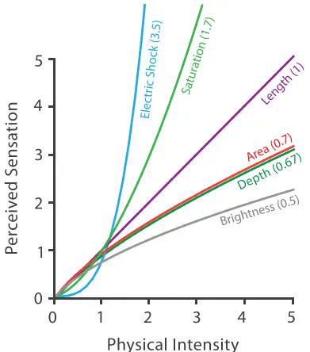
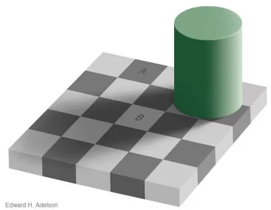
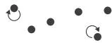

# 视觉偏差与认知心理学精度

> **核心参考源**：Tamara Munzner《Visualization Analysis and Design》第五章及第十章

在可视化设计中，“通道效能阶梯”的排名并非主观臆断，而是建立在数百万年进化赋予人类视神经的生理机制之上的**物理学铁证**。了解这些底层的认知偏差陷阱，是规避图表信息失真、实现精准数据传达的必经之路。

## 1. 感知精度的谎言：史蒂文斯幂定律 (Stevens' Power Law)

通道灵敏度（感知响应系数）在不同几何属性间存在巨大差异。

*图：史蒂文斯幂定律曲线。长度是线性的，面积是下凹压缩的。来源：《Visualization Analysis and Design》Fig 5.7*

根据心理物理学中的史蒂文斯幂定律（Stevens' Power Law）：
*   **长度通道的感知是“诚实”的**。其感知膨胀系数为 1.0，即当一条线段的物理长度增加一倍时，大脑感知到的增长精确地也是一倍。
*   **面积通道的感知是“撒谎”的**。其感知系数仅约为 0.7。当一个圆形的物理面积实际放大四倍时，肉眼的直观感受只放大了一倍半到两倍。对 3D 体积的感知压缩更为严重（低于 0.6）。
*   **饱和度通道存在“超线性暴走”**。颜色饱和度（Saturation）的感知系数 > 1.0。物理属性上微小的增量，会引起大脑剧烈刺眼的刺激反馈。

**实战警示**：如果在纪实叙事或数据新闻中，用面积通道去直接映射庞大落差的贫富差距数据（如 100 倍落差），读者的大脑会自动对画面进行“认知压缩”，使得原本悬殊的 100 倍差距在感知上只剩下 10 倍。选错通道档位，会导致无意识的视觉误导。

## 2. 相对判断的盲区：韦伯定律 (Weber's Law)

即使选对了通道，数据本身的**基数**也会让绝对感知的精度发生失灵。

*图：韦伯定律与巨大基数盲区。来源：《Visualization Analysis and Design》Fig 5.13*

韦伯定律揭示：人类感知的永远是两者的**相对百分比差异**，而非**绝对数值差异**。当数据的底座基数极其庞大时（如万亿级别的企业 GMV 对比），微弱的数值差异将被巨大的长条图柱子吞噬，落入人眼无法察觉的“韦伯盲区”。

**破局手段**：果断舍弃绝对坐标。通过建立历史平均基准或竞争对手的零点基线，构建**发散性误差偏离图**。将宏大基数抹平，直接放大那一小截微弱的相对差异，使微小偏差清晰可见。

### 色彩被环境劫持：阴影棋盘错觉

*图：棋盘错觉。A格与B格具有相同的物理底色，却因为相对环境产生极高反差。来源：《Visualization Analysis and Design》Fig 5.14*

韦伯定律揭示的相对判断机制同样适用于色彩。“阴影棋盘错觉”证明了，人类视神经对色彩明度的判断会被周围环境极其严重地劫持。因此，在关键数据的色彩映射中，必须保证比较环境底层底色的高度统一与纯净。

## 3. 注意力机制的死亡边界：视觉弹出效应

人类的视觉系统底层拥有一套无意识参与的并行扫描机制，称为**前注意处理（Pre-attentive Processing）**。

*图：视觉弹出失效的压力测试。来源：《Visualization Analysis and Design》Fig 5.11*

*   **视觉弹出（Visual Popout）**：在密集的蓝色散点中寻找唯一的一颗红点，大脑犹如并发计算的 GPU，耗时几乎恒定为毫秒级。单一首要特征（如单独的颜色或单独的形状）能够瞬间跳脱背景。
*   **结合检索（Conjunction Search）的死亡边界**：当要求在“蓝色圆形”与“红色方形”的混合阵列中寻找一颗“红色圆形”时，受众的并行机制彻底瘫痪。为了同时匹配颜色与形状两个特征，大脑被迫降级为逐点扫描的单线程串行模式，认知耗时随图表密度呈线性爆炸。

*图：通道的分离与融合。来源：《Visualization Analysis and Design》Fig 5.10*

这一现象受制于通道间的**可分离性与融合性（Separability vs. Integrality）**。空间位置+颜色（可分离），人类能轻松分步读取；但如果将一维高度与宽度组合，大脑会将其粗暴融合为“二阶面积属性”，难以拆解剥离。

**实战警示**：每次只能使用**一种**独立的最强首要特征进行高亮警告。过度的通道刺激叠加（同时渐变色、粗线条、闪烁形状）反而会导致视觉检索泥潭。

## 4. 色彩通道：最危险的诱惑

色彩拥有最强的视觉弹出吸引力，但也拥有最严苛的边界。Munzner 教授在第十章中将其严格划分为三大色阶：

*图：顺序、发散与分类色阶。来源：《Visualization Analysis and Design》Fig 10.1*

1. **顺序色阶（Sequential）**：浅至深的单向明度渐变，专用于单向数值强度。
2. **发散色阶（Diverging）**：两端高饱和冷暖色通过中间白/灰过渡，专用于存在明确零点基线的对称偏差对比。
3. **分类色阶（Categorical）**：无排序的独立离散色相，用于标签分类。受限于短时工作记忆，分类颜色**不得超过 7-8 种**。

### 彩虹色阶禁忌与色觉无障碍

*图：彩虹色阶引起的明度断层。来源：《Visualization Analysis and Design》Fig 10.13*

彩虹色阶（红黄绿青蓝等光谱渐变）常被错误地用于量化连续数据。但其致命缺陷在于：**明度感知极不均匀**。黄色与青蓝色带的自然亮度激增，会人为在热力图中制造出数据集中本不存在的虚假“边界断层”，扭曲客观事实真相。

此外，全球有接近 8% 的男性存在红绿色盲或色弱缺陷。数据设计必须守住无障碍的职业操守底线：借助 **ColorBrewer 安全色阶** 与色盲模拟滤镜，在褪去彩色伪装的纯灰阶下，依然能利用明度差异坚守信息的传递。
