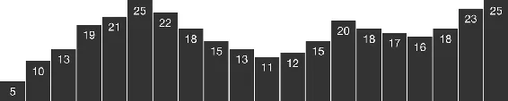

# <span class="keep-together">Chapter 1. </span>Introduction

<div class="section calibre2" data-type="sect1"
pdf-bookmark="Why Data Visualization?">

<div id="ch01_split_000.xhtml_idm140093208080432" class="dedication">

# Why Data Visualization?

Our <span id="ch01_split_000.xhtml_idm140093208078832"
class="calibre5 pcalibre pcalibre2 pcalibre3 pcalibre1"
data-type="indexterm" primary="visualization, definition of"
seealso="data visualization"></span><span id="ch01_split_000.xhtml_idm140093208077856"
class="calibre5 pcalibre pcalibre2 pcalibre3 pcalibre1"
data-type="indexterm" primary="data visualization"
secondary="definition of"></span>information age more often feels like
an era of information overload. Excess amounts of information are
overwhelming; raw data becomes useful only when we apply methods of
deriving insight from it.

Fortunately, we humans are intensely visual creatures. Few of us can
detect patterns among rows of numbers, but even young children can
interpret bar charts, extracting meaning from those numbers’ visual
representations. For that reason, data visualization is a powerful
exercise. Visualizing data is the fastest way to communicate it to
others.

Of course, visualizations, like words, can be used to lie, mislead, or
distort the truth. But when practiced honestly and with care, the
process of visualization can help us see the world in a new way,
revealing unexpected patterns and trends in the otherwise hidden
information around us. At its best, data visualization is expert
storytelling.

More literally, visualization is a process of *mapping* information to
visuals. We craft rules that interpret data and express its values as
visual properties. For example, the humble bar chart in
<a href="#ch01_split_000.xhtml_data_values_mapped_to_visuals"
class="calibre5 pcalibre pcalibre2 pcalibre3 pcalibre1"
data-type="xref">Figure 1-1</a> is generated from a very simple rule:
larger values are *mapped* as taller bars.

<figure class="calibre35">
<div id="ch01_split_000.xhtml_data_values_mapped_to_visuals"
class="figure">

<h6 class="calibre37"><span class="keep-together">Figure 1-1.
</span>Data values mapped to visuals</h6>
</div>
</figure>

More complex visualizations are generated from datasets more complex
than the sequence of numbers shown in
<a href="#ch01_split_000.xhtml_data_values_mapped_to_visuals"
class="calibre5 pcalibre pcalibre2 pcalibre3 pcalibre1"
data-type="xref">Figure 1-1</a> and more complex sets of mapping rules.

</div>

</div>

<div class="section calibre2" data-type="sect1"
pdf-bookmark="Why Write Code?">

<div id="ch01_split_000.xhtml_idm140093208069232" class="dedication">

# Why Write Code?

Mapping <span id="ch01_split_000.xhtml_idm140093208067696"
class="calibre5 pcalibre pcalibre2 pcalibre3 pcalibre1"
data-type="indexterm" primary="data mapping"
secondary="benefits of computation"></span>data by hand can be
satisfying, yet is slow and tedious. So we usually employ the power of
computation to speed things up. The increased speed enables us to work
with much larger datasets of thousands or millions of values; what would
have taken years of effort by hand can be mapped in a moment.
<span id="ch01_split_000.xhtml_idm140093208066240"
class="calibre5 pcalibre pcalibre2 pcalibre3 pcalibre1"
data-type="indexterm" primary="alternate mappings"></span>Just as
important, we can rapidly experiment with *alternate mappings*, tweaking
our rules and seeing their output re-rendered immediately. This loop of
write/render/evaluate is critical to the iterative process of refining a
design.

Sets <span id="ch01_split_000.xhtml_idm140093208064464"
class="calibre5 pcalibre pcalibre2 pcalibre3 pcalibre1"
data-type="indexterm"
primary="mapping rules"></span><span id="ch01_split_000.xhtml_idm140093208063728"
class="calibre5 pcalibre pcalibre2 pcalibre3 pcalibre1"
data-type="indexterm" primary="design systems"></span>of mapping rules
function as *design systems*. The human hand no longer executes the
visual output; the computer does. Our human role is to conceptualize,
craft, and write out the rules of the system, which is then finally
executed by software.

Unfortunately, software (and computation generally) is extremely bad at
understanding what, exactly, people want. (To be fair, many humans are
also not good at this challenging task.) Because computers are binary
systems, everything is either on or off, yes or no, this or that, there
or not there. Humans are mushier, softer creatures, and the computers
are not willing to meet us halfway—we must go to them. Hence the
inevitable struggle of learning to write software, in which we train
ourselves to communicate in the very limited and precise syntax that the
computer can understand.

Yet <span id="ch01_split_000.xhtml_idm140093208060896"
class="calibre5 pcalibre pcalibre2 pcalibre3 pcalibre1"
data-type="indexterm" primary="data visualization"
secondary="rewards of"></span>we continue to write code because seeing
our visual creations come to life is so rewarding. We practice data
visualization because it is exciting to see what has never before been
seen. It is like summoning a magical, visual genie out of an inscrutable
data bottle.

</div>

</div>

<div class="section calibre2" data-type="sect1"
pdf-bookmark="Why Interactive?">

<div id="ch01_split_000.xhtml_idm140093221178992" class="dedication">

# Why Interactive?

Static <span id="ch01_split_000.xhtml_idm140093221177456"
class="calibre5 pcalibre pcalibre2 pcalibre3 pcalibre1"
data-type="indexterm" primary="data visualization"
secondary="benefits of interactivity"></span><span id="ch01_split_000.xhtml_idm140093221176432"
class="calibre5 pcalibre pcalibre2 pcalibre3 pcalibre1"
data-type="indexterm" primary="interactivity"
secondary="benefits of"></span>visualizations can offer only precomposed
“views” of data, so multiple static views are often needed to present a
variety of perspectives on the same information. The number of
dimensions of data is limited, too, when all visual elements must be
present on the same surface at the same time. Representing
multidimensional datasets fairly in static images is notoriously
difficult. A fixed image is ideal when alternate views are neither
needed nor desired, and required when publishing to a static medium,
such as print.

Dynamic, interactive visualizations can empower people to explore the
data for themselves. The basic functions of most interactive
visualization tools have changed little since 1996, when Ben Shneiderman
of the University of Maryland first proposed a “Visual
Information-Seeking Mantra”: *overview first, zoom and filter, then
details-on-demand.*

This design pattern is found in most interactive visualizations today.
The combination of functions is successful, because it makes the data
accessible to different audiences, from those who are merely browsing or
exploring the dataset to those who approach the visualization with a
specific question in search of an answer. An interactive visualization
that offers an overview of the data alongside tools for “drilling down”
into the details may successfully fulfill many roles at once, addressing
the different concerns of different audiences, be they those new to the
subject matter or already deeply familiar with the data.

Of course, interactivity can also encourage engagement with the data in
ways that static images cannot. With animated transitions and
well-crafted interfaces, some visualizations can make exploring data
feel more like playing a game. Interactive visualization can be a great
medium for engaging an audience who might not otherwise care about the
topic or data at hand.

</div>

</div>

<div class="section calibre2" data-type="sect1"
pdf-bookmark="Why on the Web?">

<div id="ch01_split_000.xhtml_idm140093221171808" class="dedication">

# Why on the Web?

Visualizations <span id="ch01_split_000.xhtml_idm140093221170592"
class="calibre5 pcalibre pcalibre2 pcalibre3 pcalibre1"
data-type="indexterm"
primary="web-standard technologies, benefits of"></span><span id="ch01_split_000.xhtml_idm140093221169840"
class="calibre5 pcalibre pcalibre2 pcalibre3 pcalibre1"
data-type="indexterm" primary="data visualization"
secondary="web-standard technologies and"></span>aren’t truly visual
unless they are *seen*. Getting your work out there for others to see is
critical, and publishing on the web is the quickest way to reach a
global audience. Working with web-standard technologies means that your
work can be seen and experienced by anyone using a recent web browser,
regardless of the operating system (Windows, Mac, Linux, Android, iOS)
or device type (laptop, desktop, smartphone, tablet).

Best <span id="ch01_split_000.xhtml_idm140093221167552"
class="calibre5 pcalibre pcalibre2 pcalibre3 pcalibre1"
data-type="indexterm" primary="open source software"></span>of all,
everything covered in this book can be done with freely accessible
tools, so the only investment required is your time. And everything
we’ll talk about uses open source, web-standard technologies.

By avoiding proprietary software and plug-ins, you can ensure that your
projects are accessible on the widest possible range of devices, from
typical desktop computers to tablets and even phones. The more
accessible your visualization, the greater your audience and your
impact. In the past few years, D3’s (and Mike Bostock’s) insistence on
supporting only web standards has helped move the web forward
dramatically; very few organizations now would argue for a Flash-based
chart or interactive map.

</div>

</div>

<div class="section calibre2" data-type="sect1"
pdf-bookmark="What This Book Is">

<div id="ch01_split_000.xhtml_idm140093221165296" class="dedication">

<div id="ch01_split_000.xhtml_calibre_pb_0" class="calibre38">

</div>

</div>

</div>

</div>

</div>

<span id="ch01_split_001.xhtml"></span>

<div id="ch01_split_001.xhtml_sbo-rt-content" class="calibre1">

<div id="ch01_split_001.xhtml_introduction" class="dedication">

<div class="section calibre2" data-type="sect1"
pdf-bookmark="What This Book Is">

<div id="ch01_split_001.xhtml_idm140093221165296" class="dedication">

# What This Book Is

This <span id="ch01_split_001.xhtml_idm140093221163728"
class="calibre5 pcalibre pcalibre2 pcalibre3 pcalibre1"
data-type="indexterm" primary="D3"
secondary="prerequisites to learning"></span>book is a practical
introduction to merging three practices—data visualization, interactive
design, and web development—using D3, a powerful tool for custom,
web-based visualization.

These chapters grew out of my own process of learning how to use D3.
Many people, including myself, come to D3 with backgrounds in design,
mapping, and data visualization, but not programming and computer
science.

D3 has a bit of an unfair reputation for being hard to learn. D3 itself
is not so complicated, but it operates in the domain of the web, and the
web *is* complicated. Using D3 comfortably requires some prior knowledge
of the web technologies with which it interacts, such as HTML, CSS,
JavaScript, and SVG. Many people (myself included) are self-taught when
it comes to web skills. This is great, because the barrier to entry is
so low, but problematic because it means we probably didn’t learn each
of these technologies from the ground up—more often, we just hack
something together until it seems to work, and call it a day. Yet
successful use of D3 requires understanding some of these technologies
in a fundamental way.

Because <span id="ch01_split_001.xhtml_idm140093221159712"
class="calibre5 pcalibre pcalibre2 pcalibre3 pcalibre1"
data-type="indexterm" primary="JavaScript"
secondary="as basis for D3"></span>D3 is written in JavaScript, learning
to use D3 often means learning a lot about JavaScript. For many data vis
folks, D3 *is* their introduction to JavaScript (or even web development
generally). It’s hard enough to learn a new programming language, let
alone a new tool built on that language. D3 will enable you to do great
things with JavaScript that you never would have even attempted. The
time you spend learning both the language and the tool will provide an
incredible payoff.

My goal is to reduce that learning time, so you can start creating
amazing projects sooner. We’ll take a ground-up approach, starting with
the fundamental concepts and gradually adding complexity. I don’t intend
to show you how to make specific kinds of visualizations so much as to
help you understand the workings of D3 well enough to take those
building blocks and generate designs of your own creation.

</div>

</div>

<div class="section calibre2" data-type="sect1"
pdf-bookmark="Who You Are">

<div id="ch01_split_001.xhtml_idm140093221156688" class="dedication">

# Who You Are

You may be an absolute beginner, someone new to data vis, web
development, or both. (Welcome!) Perhaps you are a journalist interested
in new ways to communicate the data you collect during reporting. Or
maybe you’re a designer, comfortable drawing static infographics but
ready to make the leap to interactive projects on the Web. You could be
an artist, interested in generative, data-based art. Or a programmer,
already familiar with JavaScript and the web, but excited to learn a new
tool and pick up some visual design experience along the way.

Whoever you are, I hope that you:

- Have heard of this new thing called the “World Wide Web”

- Are a bit familiar with HTML, the DOM, and CSS

- Might even have a little programming experience already

- Aren’t scared by unknown initialisms like CSV, SVG, or JSON

- Want to make useful, interactive visualizations

If any of those things are unknown or unclear, don’t fear. You might
just want to spend more time with
<a href="#ch03.xhtml_technology_fundamentals"
class="calibre5 pcalibre pcalibre2 pcalibre3 pcalibre1"
data-type="xref">Chapter 3</a>, which covers what you really need to
know before diving into D3.

</div>

</div>

<div class="section calibre2" data-type="sect1"
pdf-bookmark="What This Book Is Not">

<div id="ch01_split_001.xhtml_idm140093208050496" class="dedication">

<div id="ch01_split_001.xhtml_calibre_pb_1" class="calibre38">

</div>

</div>

</div>

</div>

</div>

<span id="ch01_split_002.xhtml"></span>

<div id="ch01_split_002.xhtml_sbo-rt-content" class="calibre1">

<div id="ch01_split_002.xhtml_introduction" class="dedication">

<div class="section calibre2" data-type="sect1"
pdf-bookmark="What This Book Is Not">

<div id="ch01_split_002.xhtml_idm140093208050496" class="dedication">

# What This Book Is Not

That said, this is not intended as a traditional computer science
textbook (although since the initial release of the first edition, it
has been adopted by many computer science courses), and it is not
intended to teach the intricacies of any one web technology (HTML, CSS,
JavaScript, SVG) in depth.

In that spirit, I might gloss over some technical points, grossly
oversimplifying important concepts fundamental to computer science in
ways that will make true software engineers recoil. That’s fine, because
I’m writing for designers here. (Note to engineers: You are still
welcome here!) We’ll cover the basics, and then you can dive into the
more complex pieces once you’re comfortable.

I will deliberately *not* address every possible approach to a given
problem, but will typically present what I feel is the simplest
solution, or, if not the simplest, then the most understandable.

My goal is to teach you the fundamental concepts and methods of D3.
Thus, this book is decidedly *not* organized around specific example
projects (except for <a href="#ch16.xhtml_project_walkthrough"
class="calibre5 pcalibre pcalibre2 pcalibre3 pcalibre1"
data-type="xref">Chapter 16</a>). Everyone’s data and design needs will
be different. It’s up to you to integrate these concepts in the way best
suited to your particular project.

</div>

</div>

<div class="section calibre2" data-type="sect1"
pdf-bookmark="Using Sample Code">

<div id="ch01_split_002.xhtml_idm140093208044512" class="dedication">

# Using Sample Code

If <span id="ch01_split_002.xhtml_idm140093208042816"
class="calibre5 pcalibre pcalibre2 pcalibre3 pcalibre1"
data-type="indexterm"
primary="code examples, obtaining and using"></span>you are a mad
genius, then you can probably learn to use D3 without ever looking at
any sample code files, in which case you can skip the rest of this
section.

If you’re still with me, you are probably still very bright but not mad,
in which case you should undertake this book with the full set of
accompanying code samples in hand. Before you go any further, please
download the sample files from
<a href="https://github.com/alignedleft/d3-book/releases"
class="calibre5 pcalibre pcalibre2 pcalibre3 pcalibre1">the GitHub
releases page</a>.

<div class="calibre27 note" data-type="note">

###### Note

<span id="ch01_split_002.xhtml_idm140093208039632"
class="calibre5 pcalibre pcalibre2 pcalibre3 pcalibre1"
data-type="indexterm" primary="D3"
secondary="version 4.0 changes"></span>This is the second edition of
this book, and I’ve added and updated many of the code samples. On
<a href="https://github.com/alignedleft/d3-book/releases"
class="calibre5 pcalibre pcalibre2 pcalibre3 pcalibre1">the releases
page</a>, download **version 2.0**. Different versions of the book will
correspond with different releases of the code samples; I have worked
very hard to ensure all the versions sync up.

</div>

Normal people will want to click the ZIP link to download a compressed
ZIP archive with all the files. Hardcore geeksters will want to clone
the repository using Git. If that last sentence sounds like total
gibberish, please use the first option.

Within the download, you’ll notice there is a folder for each chapter
that has code to go with it:

``` calibre39
chapter_04
chapter_05
chapter_06
chapter_07
chapter_08
…
```

Files are organized by chapter, so in
<a href="#ch09.xhtml_updates-chapter9"
class="calibre5 pcalibre pcalibre2 pcalibre3 pcalibre1"
data-type="xref">Chapter 9</a> when I reference *01_bar_chart.html*,
know that you can find that file in the corresponding location:
*d3-book/chapter_9/01_bar_chart.html*.

You are welcome to copy, adapt, modify, and reuse the example code in
these tutorials for any noncommercial purpose.

If <span id="ch01_split_002.xhtml_idm140093208031840"
class="calibre5 pcalibre pcalibre2 pcalibre3 pcalibre1"
data-type="indexterm" primary="errata"></span>you notice any errors in
the examples, please report them on the
<a href="https://github.com/alignedleft/d3-book/issues"
class="calibre5 pcalibre pcalibre2 pcalibre3 pcalibre1">GitHub issues
page</a>, and I may be able to correct them for future editions of the
text.

</div>

</div>

<div class="section calibre2" data-type="sect1"
pdf-bookmark="Thank You">

<div id="ch01_split_002.xhtml_idm140093208043920" class="dedication">

# Thank You

Finally, this book has been handcrafted, carefully written, and
pedagogically fine-tuned for maximum effect. Thank you for reading it. I
hope you learn a great deal, and even have some fun along the way.

</div>

</div>

</div>

</div>

<span id="ch02.xhtml"></span>

<div id="ch02.xhtml_sbo-rt-content" class="calibre1">

<div id="ch02.xhtml_introducing_d3" class="dedication">

