# <span class="keep-together">Chapter 3. </span>Technology Fundamentals

Solid familiarity with the following concepts will make your time with
D3 a lot less frustrating and a lot more rewarding. Consider this a
brief refresher course on Web-Making 101.

<div class="calibre29 warning" data-type="warning">

###### Warning

Beware! This is a pretty dense chapter, packed with years’ worth of web
development knowledge, and nothing in here is specific to D3. I
recommend skimming just the information that is new to you, and skipping
the rest. You can always reference this chapter later as questions
arise.

</div>

<div class="section calibre2" data-type="sect1" pdf-bookmark="The Web">

<div id="ch03.xhtml_idm140093208213216" class="dedication">

# The Web

If <span id="ch03.xhtml_webfund03"
class="calibre5 pcalibre pcalibre2 pcalibre3 pcalibre1"
data-type="indexterm" primary="Web fundamentals"></span>you’re brand new
to making web pages, you will now have to think about things that most
people blissfully disregard every day, such as this: how does the web
actually work?

We think of the web as a bunch of interlinked pages, but it’s really a
collection of conversations between web servers and web clients
(browsers).

The following scene is a dramatization of a typical such conversation
that happens whenever you or anyone else clicks a link or types an
address into your browser (meaning, this brief conversation is had about
88 zillion times every day):

> CLIENT: I’d really like to know what’s going on over at
> *somewebsite.com*. I better call over there to get the latest info.
> \[Silent sound of internet connection being established.\]
>
> SERVER: Hello, unknown web client! I am the server hosting
> *somewebsite.com*. What page would you like?
>
> CLIENT: This morning, I am interested in the page at
> *somewebsite.com/news/*.
>
> SERVER: Of course. One moment.
>
> *Code is transmitted from SERVER to CLIENT.*
>
> CLIENT: I have received it. Thank you!
>
> SERVER: You’re welcome! Would love to stay on the line and chat, but I
> have other requests to process. Bye!

Clients <span id="ch03.xhtml_idm140093208203360"
class="calibre5 pcalibre pcalibre2 pcalibre3 pcalibre1"
data-type="indexterm" primary="requests"></span>contact servers with
*requests*, and servers respond with data. But what is a server and what
is a client?

*Web servers* <span id="ch03.xhtml_idm140093208201152"
class="calibre5 pcalibre pcalibre2 pcalibre3 pcalibre1"
data-type="indexterm" primary="Web servers"
secondary="operation of"></span><span id="ch03.xhtml_idm140093208200144"
class="calibre5 pcalibre pcalibre2 pcalibre3 pcalibre1"
data-type="indexterm"
primary="servers"></span><span id="ch03.xhtml_idm140093208199472"
class="calibre5 pcalibre pcalibre2 pcalibre3 pcalibre1"
data-type="indexterm"
primary="local servers"></span><span id="ch03.xhtml_idm140093208198800"
class="calibre5 pcalibre pcalibre2 pcalibre3 pcalibre1"
data-type="indexterm" primary="remote servers"></span>are
internet-connected computers running server software, so called because
they *serve* web documents as requested. Servers are typically always on
and always connected, but web developers often also run *local* servers,
meaning they run on the same computer that you’re working on. *Local*
means here; *remote* means somewhere else, on any computer but the one
right in front of you.

There <span id="ch03.xhtml_idm140093208195920"
class="calibre5 pcalibre pcalibre2 pcalibre3 pcalibre1"
data-type="indexterm" primary="Apache server software"></span>are lots
of different server software packages, but Apache is the most common.
Web server software is not pretty, and no one ever wants to look at it.

In <span id="ch03.xhtml_idm140093208194512"
class="calibre5 pcalibre pcalibre2 pcalibre3 pcalibre1"
data-type="indexterm" primary="browsers"
secondary="fundamentals of"></span>contrast, web *browsers* can be very
pretty, and we spend a lot of time looking at them. Most people
recognize names like Firefox, Safari, Chrome, and Internet Explorer, all
of which are browsers or *web clients*.

Every <span id="ch03.xhtml_idm140093208191680"
class="calibre5 pcalibre pcalibre2 pcalibre3 pcalibre1"
data-type="indexterm"
primary="URLs (Uniform Resource Locators)"></span>web page, in theory,
can be identified by its URL (Uniform Resource Locator) or URI (Uniform
Resource Identifier). Most people don’t know what *URL* stands for, but
they recognize one when they see it. By obsolete convention, URLs
commonly begin with *www*, as in
*<a href="http://www.calmingmanatee.com"
class="calibre5 pcalibre pcalibre2 pcalibre3 pcalibre1"><em>http://www.calmingmanatee.com</em></a>*,
but with a properly configured server, the *www* part is wholly
unnecessary.

Complete URLs consist of four parts:

- An <span id="ch03.xhtml_idm140093208186672"
  class="calibre5 pcalibre pcalibre2 pcalibre3 pcalibre1"
  data-type="indexterm"
  primary="communication protocols"></span><span id="ch03.xhtml_idm140093208185936"
  class="calibre5 pcalibre pcalibre2 pcalibre3 pcalibre1"
  data-type="indexterm"
  primary="HTTP (Hypertext Transfer Protocol)"></span>indication of the
  *communication protocol*, such as HTTP or HTTPS

- The *domain name* <span id="ch03.xhtml_idm140093208183312"
  class="calibre5 pcalibre pcalibre2 pcalibre3 pcalibre1"
  data-type="indexterm" primary="domain names"></span>of the resource,
  such as *calmingmanatee.com*

- The *port number*, <span id="ch03.xhtml_idm140093208180880"
  class="calibre5 pcalibre pcalibre2 pcalibre3 pcalibre1"
  data-type="indexterm" primary="port numbers"></span>indicating over
  which port the connection to the server should be attempted

- Any additional locating information, such as the path of the requested
  file, or any query parameters

A complete URL, then, might look like this:
<a href="http://alignedleft.com:80/tutorials/d3/"
class="calibre5 pcalibre pcalibre2 pcalibre3 pcalibre1"><em>http://alignedleft.com:80/tutorials/d3/</em></a>.

Typically, the port number is excluded, as web browsers will try to
connect over port 80 by default. So the preceding URL is functionally
the same as <a href="http://alignedleft.com/tutorials/d3/"
class="calibre5 pcalibre pcalibre2 pcalibre3 pcalibre1"><em>http://alignedleft.com/tutorials/d3/</em></a>.

Note that the protocol is separated from the domain name by a colon and
two forward (regular) slashes. Why two slashes? No reason. The inventor
of the web <a href="http://nyti.ms/Xaol4j"
class="calibre5 pcalibre pcalibre2 pcalibre3 pcalibre1">regrets the
error</a>.

HTTP <span id="ch03.xhtml_idm140093214287232"
class="calibre5 pcalibre pcalibre2 pcalibre3 pcalibre1"
data-type="indexterm"
primary="HTTPS (Hypertext Transfer Protocol Secure)"></span>stands for
Hypertext Transfer Protocol, and it’s the most common protocol for
transferring web content from server to client. The “S” on the end of
HTTPS stands for *Secure*. HTTPS connections are used whenever
information should be encrypted in transit, such as for online banking
or ecommerce.

Let’s briefly step through the process of what happens when a person
goes to visit a website.

1.  User runs the web browser of her choice, then types a URL into the
    address bar, such as *alignedleft.com/tutorials/d3/*. Because she
    did not specify a protocol, HTTP is assumed, and “http://” is
    prepended to the URL.

2.  The browser then attempts to connect to the server behind
    *alignedleft.com* across the network, via port 80, the default port
    for HTTP.

3.  The server associated with *alignedleft.com* acknowledges the
    connection and is taking requests. (“I’ll be here all night.”)

4.  The browser sends a request for the page that lives at
    */tutorials/d3/*.

5.  The <span id="ch03.xhtml_idm140093214278192"
    class="calibre5 pcalibre pcalibre2 pcalibre3 pcalibre1"
    data-type="indexterm" primary="HTML (Hypertext Markup Language)"
    secondary="serving web pages with"></span>server sends back the HTML
    content for that page.

6.  As the client browser receives the HTML, it discovers references to
    *other files* needed to assemble and display the entire page,
    including CSS stylesheets and image files. So it contacts the same
    server again, once per file, requesting the additional information.

7.  The server responds, dispatching each file as needed.

8.  Finally, all the web documents have been transferred over. Now the
    client performs its most arduous task, which is to *render* the
    content. It first parses through the HTML to understand the
    structure of the content. Then it reviews the CSS selectors,
    applying any properties to matched elements. Finally, it plugs in
    any image files and executes any JavaScript code.

Can you believe that all that happens every time you click a link? It’s
a lot more complicated than most people realize, but it’s important to
understand that client/server conversations are fundamental to the
web.<span id="ch03.xhtml_idm140093214272032"
class="calibre5 pcalibre pcalibre2 pcalibre3 pcalibre1"
data-type="indexterm" primary="" startref="webfund03"></span>

</div>

</div>

<div class="section calibre2" data-type="sect1" pdf-bookmark="HTML">

<div id="ch03.xhtml_idm140093208212592" class="dedication">

# HTML

Hypertext <span id="ch03.xhtml_idm140093214269360"
class="calibre5 pcalibre pcalibre2 pcalibre3 pcalibre1"
data-type="indexterm" primary="HTML (Hypertext Markup Language)"
secondary="specifying structure with"></span>Markup Language is used to
structure content for web browsers. HTML is stored in plain-text files
with the *.html* suffix. A simple HTML document looks like this:

``` calibre39
<!DOCTYPE html>
<html>
    <head>
        <title>Page Title</title>
    </head>
    <body>
        <h1>Page Title</h1>
        <p>This is a really interesting paragraph.</p>
    </body>
</html>
```

HTML is a complex language with a rich history. This overview will
address only the current iteration of HTML (formerly known as HTML5) and
will touch on only what is immediately relevant for our practice with
D3.

<div class="section calibre2" data-type="sect2"
pdf-bookmark="Content Plus Structure">

<div id="ch03.xhtml_idm140093213883344" class="dedication">

## Content Plus Structure

The core function of HTML is to enable you to “mark up” content, thereby
giving it structure. Take, for example, this raw text:

``` calibre39
Amazing Visualization Tool Cures All Ills A new open-source tool designed for
visualization of data turns out to have an unexpected, positive side effect:
it heals any ailments of the viewer. Leading scientists report that the tool,
called D3000, can cure even the following symptoms: fevers chills general
malaise It achieves this end with a patented, three-step process. Load in data.
Generate a visual representation. Activate magic healing function.
```

Reading between the lines, we can infer that this is a very exciting
news story. But as unstructured content, it is very hard to read. By
adding structure, we can differentiate between the headline, for
example, and the body of the story.

> **Amazing Visualization Tool Cures All Ills**
>
> A new open-source tool designed for visualization of data turns out to
> have an unexpected, positive side effect: it heals any ailments of the
> viewer. Leading scientists report that the tool, called D3000, can
> cure even the following symptoms:
>
> - fevers
>
> - chills
>
> - general malaise
>
> It achieves this end with a patented, three-step process.
>
> 1.  Load in data.
>
> 2.  Generate a visual representation.
>
> 3.  Activate magic healing function.

That <span id="ch03.xhtml_idm140093212126336"
class="calibre5 pcalibre pcalibre2 pcalibre3 pcalibre1"
data-type="indexterm" primary="visual structure"></span>has the same raw
text content, but with a *visual structure* that makes the content more
accessible.

HTML <span id="ch03.xhtml_idm140093211591936"
class="calibre5 pcalibre pcalibre2 pcalibre3 pcalibre1"
data-type="indexterm" primary="semantic structure"></span>is a tool for
specifying *semantic structure*, or attaching hierarchy, relationships,
and *meaning* to content. (HTML doesn’t address the visual
representation of a <span class="keep-together">document’s</span>
structure—that’s CSS’s job.) Here is our story with each chunk of
content replaced by a *semantic description* of what that content is.

> **Headline**
>
> Paragraph text
>
> - Unordered list item
>
> - Unordered list item
>
> - Unordered list item
>
> Paragraph text
>
> 1.  Numbered list item
>
> 2.  Numbered list item
>
> 3.  Numbered list item

This is the kind of structure we specify with HTML markup.

</div>

</div>

<div class="section calibre2" data-type="sect2"
pdf-bookmark="Adding Structure with Elements">

<div id="ch03.xhtml_idm140093212578288" class="dedication">

## Adding Structure with Elements

“Marking up” <span id="ch03.xhtml_idm140093212467264"
class="calibre5 pcalibre pcalibre2 pcalibre3 pcalibre1"
data-type="indexterm" primary="HTML (Hypertext Markup Language)"
secondary="tags and elements"></span><span id="ch03.xhtml_idm140093211926624"
class="calibre5 pcalibre pcalibre2 pcalibre3 pcalibre1"
data-type="indexterm"
primary="tags"></span><span id="ch03.xhtml_idm140093211735744"
class="calibre5 pcalibre pcalibre2 pcalibre3 pcalibre1"
data-type="indexterm" primary="elements"
secondary="adding structure with"></span>is the process of adding *tags*
to create *elements*. HTML tags begin with `<` and end with `>`, as in
`<p>`, which is the tag indicating a paragraph of text. Tags usually
occur in pairs, in which case adding an opening and closing pair of tags
creates a new *element* in the document structure.

Closing tags are indicated with a slash that closes or ends the element,
as in `</p>`. Thus, a paragraph of text may be marked up like the
following:

``` calibre39
<p>This is a really interesting paragraph.</p>
```

Some elements can be *nested*. For example, here we use the `em` element
to add *emphasis*.

``` calibre39
<p>This is a <em>really</em> interesting paragraph.</p>
```

Nesting elements introduces hierarchy to the document. In this case,
`em` is a child of `p` because it is contained by `p`. (Conversely, `p`
is `em`’s parent.)

When elements are nested, they cannot overlap closures of their parent
elements, as doing so would disrupt the hierarchy. For example:

``` calibre39
<p>This could cause <em>unexpected</p>
<p>results</em>, and is best avoided.</p>
```

<div class="dedication">

</div>

Some tags never occur in pairs, such as the `img` element, which
references an image file. Although HTML no longer requires it, you will
sometimes see such tags written in *self-closing* fashion, with a
trailing slash before the closing angle bracket:

``` calibre39

```

As of HTML5, the self-closing slash is optional, so the following code
is equivalent to the preceding code:

``` calibre39

```

</div>

</div>

<div class="section calibre2" data-type="sect2"
pdf-bookmark="Common Elements">

<div id="ch03.xhtml_idm140093212945008" class="dedication">

## Common Elements

There <span id="ch03.xhtml_idm140093211303408"
class="calibre5 pcalibre pcalibre2 pcalibre3 pcalibre1"
data-type="indexterm" primary="HTML (Hypertext Markup Language)"
secondary="common elements"></span><span id="ch03.xhtml_idm140093211302432"
class="calibre5 pcalibre pcalibre2 pcalibre3 pcalibre1"
data-type="indexterm" primary="elements"
secondary="common elements"></span>are hundreds of different HTML
elements. Here are some of the most common. We’ll cover additional
elements in later chapters. (Reference the excellent
<a href="https://developer.mozilla.org/en/HTML/Element"
class="calibre5 pcalibre pcalibre2 pcalibre3 pcalibre1">Mozilla
Developer Network documentation</a> for a complete listing.)

`<!DOCTYPE html>`  
The standard document type declaration. Must be the first thing in the
document.

`html`  
Surrounds all HTML content in a document.

`head`  
The document `head` contains all metadata about the document, such as
its `title` and any references to external stylesheets and scripts.

`title`  
The title of the document. Browsers typically display this at the top of
the browser window and use this title when bookmarking a page.

`body`  
Everything not in the `head` should go in the `body`. This is the
primary visible content of the page.

`h1`, `h2`, `h3`, `h4`  
These let you specify headings of different levels. `h1` is a top-level
heading, `h2` is below that, and so on.

`p`  
A paragraph!

`ul`, `ol`, `li`  
Unordered lists are specified with `ul`, most often used for bulleted
lists. Ordered lists (`ol`) are often numbered. Both `ul` and `ol`
should include `li` elements to specify list items.

`em`  
Indicates emphasis. Typically rendered in *italics*.

`strong`  
Indicates additional emphasis. Typically rendered in **boldface**.

`a`  
A link. Typically rendered as underlined, blue text, unless otherwise
specified.

`span`  
An arbitrary `span` of text, typically within a larger containing
element like `p`.

`div`  
An arbitrary *division* within the document. Used for grouping and
containing related elements.

We could give our earlier example semantic structure by marking it up
using some of these element’s tags:

``` calibre39
<h1>Amazing Visualization Tool Cures All Ills</h1>
<p>A new open-source tool designed for visualization of data turns out to have
an unexpected, positive side effect: it heals any ailments of the viewer.
Leading scientists report that the tool, called D3000, can cure even the
following symptoms:</p>
<ul>
    <li>fevers</li>
    <li>chills</li>
    <li>general malaise</li>
</ul>
<p>It achieves this end with a patented, three-step process.</p>
<ol>
    <li>Load in data.</li>
    <li>Generate a visual representation.</li>
    <li>Activate magic healing function.</li>
</ol>
```

When viewed in a web browser, that markup is rendered as shown in
<a href="#ch03.xhtml_Typical_default_rendering_of_simple_HTML"
class="calibre5 pcalibre pcalibre2 pcalibre3 pcalibre1"
data-type="xref">Figure 3-1</a>.

<figure class="calibre35">
<div id="ch03.xhtml_Typical_default_rendering_of_simple_HTML"
class="figure">
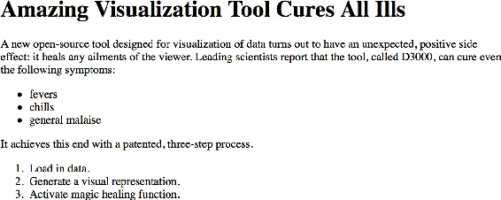
<h6 class="calibre37"><span class="keep-together">Figure 3-1.
</span>Typical default rendering of simple HTML</h6>
</div>
</figure>

Notice that we specified only the *semantic* structure of the content;
we didn’t specify any visual properties, such as color, type size,
indents, or line spacing. Without such instructions, the browser falls
back on its *default styles*, which, frankly, are not too
<span class="keep-together">exciting</span>.

</div>

</div>

<div class="section calibre2" data-type="sect2"
pdf-bookmark="Attributes">

<div id="ch03.xhtml_idm140093211184976" class="dedication">

## Attributes

We assign all <span id="ch03.xhtml_idm140093211183376"
class="calibre5 pcalibre pcalibre2 pcalibre3 pcalibre1"
data-type="indexterm" primary="HTML (Hypertext Markup Language)"
secondary="attributes"></span><span id="ch03.xhtml_idm140093211182352"
class="calibre5 pcalibre pcalibre2 pcalibre3 pcalibre1"
data-type="indexterm" primary="attributes"
secondary="assigning to HTML elements"></span>HTML elements *attributes*
by including property/value pairs in the opening tag.

``` calibre39
<tagname property="value"></tagname>
```

The name of the property is followed by an equals sign, and the value is
enclosed within double quotation marks.

Different kinds of elements can be assigned different attributes. For
example, the `a` link tag can be given an `href` attribute, whose value
specifies the URL for that link. (`href` is short for “hypertext
reference.”)

``` calibre39
<a href="http://d3js.org/">The D3 website</a>
```

Some attributes can be assigned to *any* type of element, such as
`class` and `id`.

</div>

</div>

<div class="section calibre2" data-type="sect2"
pdf-bookmark="Classes and IDs">

<div id="ch03.xhtml_idm140093211140960" class="dedication">

## Classes and IDs

Classes <span id="ch03.xhtml_idm140093211139232"
class="calibre5 pcalibre pcalibre2 pcalibre3 pcalibre1"
data-type="indexterm" primary="HTML (Hypertext Markup Language)"
secondary="classes and IDs"></span><span id="ch03.xhtml_idm140093211132608"
class="calibre5 pcalibre pcalibre2 pcalibre3 pcalibre1"
data-type="indexterm" primary="classes"
secondary="identifying elements with"></span><span id="ch03.xhtml_idm140093211131696"
class="calibre5 pcalibre pcalibre2 pcalibre3 pcalibre1"
data-type="indexterm" primary="IDs, HTML elements"></span>and IDs are
extremely useful attributes, as they can be referenced later to identify
specific pieces of content. Your CSS and JavaScript code will rely
heavily on classes and IDs to identify elements. For example:

``` calibre39
<p>Brilliant paragraph</p>
<p>Insightful paragraph</p>
<p class="awesome">Awe-inspiring paragraph</p>
```

These are three very uplifting paragraphs, but only one of them is truly
awesome, as I’ve indicated with `class="awesome"`. The third paragraph
becomes part of a *class* of *awesome* elements, and it can be selected
and manipulated along with other class members. (We’ll get to that in a
moment.)

We can assign elements multiple classes, simply by separating them with
a space:

``` calibre39
<p class="uplifting">Brilliant paragraph</p>
<p class="uplifting">Insightful paragraph</p>
<p class="uplifting awesome">Awe-inspiring paragraph</p>
```

Now, all three paragraphs are `uplifting`, but only the last one is both
`uplifting` *and* `awesome`.

IDs are used in much the same way, but there can be only one ID per
element, and each ID value can be used only once on the page. For
example:

``` calibre39
<div id="content">
    <div id="visualization"></div>
    <div id="button"></div>
</div>
```

IDs <span id="ch03.xhtml_idm140093211026240"
class="calibre5 pcalibre pcalibre2 pcalibre3 pcalibre1"
data-type="indexterm"
primary="div element"></span><span id="ch03.xhtml_idm140093211025632"
class="calibre5 pcalibre pcalibre2 pcalibre3 pcalibre1"
data-type="indexterm" primary="elements"
secondary="div element"></span><span id="ch03.xhtml_idm140093211024720"
class="calibre5 pcalibre pcalibre2 pcalibre3 pcalibre1"
data-type="indexterm" primary="containers"></span>are useful when a
single element has some special quality, like a `div` that functions as
a button or as a container for other content on the page.

As a general rule, if there will be only *one* such element on the page,
you can use an `id`. Otherwise, use a `class`.

<div class="calibre29 warning" data-type="warning">

###### Warning

Class and ID names cannot begin with numerals; they must begin with
alphabetic characters. So `id="1"` won’t work, but `id="item1"` will.
The browser will not give you any errors; your code simply won’t work,
and you will go crazy trying to figure out why.

</div>

</div>

</div>

<div class="section calibre2" data-type="sect2" pdf-bookmark="Comments">

<div id="ch03.xhtml_idm140093211140336" class="dedication">

## Comments

As <span id="ch03.xhtml_idm140093210914816"
class="calibre5 pcalibre pcalibre2 pcalibre3 pcalibre1"
data-type="indexterm" primary="HTML (Hypertext Markup Language)"
secondary="comments"></span><span id="ch03.xhtml_idm140093210913840"
class="calibre5 pcalibre pcalibre2 pcalibre3 pcalibre1"
data-type="indexterm" primary="comments" secondary="HTML"></span>code
grows in size and complexity, it is good practice to include comments.
These are friendly notes that you leave for yourself to remind you why
you wrote the code the way you did. If you are like me, you will revisit
projects only weeks later and have lost all recollections of it.
Commenting is an easy way to reach out and provide guidance and solace
to your future (and very confused) self.

If you’re collaborating with anyone else—especially in a professional
context—comments are essential.

In HTML, comments are written in the following format:

``` calibre39
<!-- Your comment here -->
```

Anything between the `<!--` and `-->` will be ignored by the web
browser.

</div>

</div>

</div>

</div>

<div class="section calibre2" data-type="sect1" pdf-bookmark="DOM">

<div id="ch03.xhtml_idm140093214270464" class="dedication">

# DOM

The <span id="ch03.xhtml_idm140093210911072"
class="calibre5 pcalibre pcalibre2 pcalibre3 pcalibre1"
data-type="indexterm" primary="DOM (Document Object Model)"
secondary="hierarchical structure"></span>term *Document Object Model*
refers to the hierarchical structure of HTML.
<span id="ch03.xhtml_idm140093210909552"
class="calibre5 pcalibre pcalibre2 pcalibre3 pcalibre1"
data-type="indexterm" primary="elements"
secondary="description of"></span><span id="ch03.xhtml_idm140093210908576"
class="calibre5 pcalibre pcalibre2 pcalibre3 pcalibre1"
data-type="indexterm"
primary="parent elements"></span><span id="ch03.xhtml_idm140093210907904"
class="calibre5 pcalibre pcalibre2 pcalibre3 pcalibre1"
data-type="indexterm"
primary="child elements"></span><span id="ch03.xhtml_idm140093210907232"
class="calibre5 pcalibre pcalibre2 pcalibre3 pcalibre1"
data-type="indexterm"
primary="sibling elements"></span><span id="ch03.xhtml_idm140093210906560"
class="calibre5 pcalibre pcalibre2 pcalibre3 pcalibre1"
data-type="indexterm"
primary="ancestor elements"></span><span id="ch03.xhtml_idm140093210905072"
class="calibre5 pcalibre pcalibre2 pcalibre3 pcalibre1"
data-type="indexterm" primary="descendant elements"></span>Each pair of
bracketed tags (or, in some cases, a single tag) is an *element*, and we
refer to elements’ relationships to each other in human terms: parent,
child, sibling, ancestor, and descendant. For example, in this HTML:

``` calibre39
<html>
    <body>
        <h1>Breaking News</h1>
        <p></p>
    </body>
</html>
```

`body` is the parent element to both of its children, `h1` and `p`
(which are siblings to each other). All elements on the page are
descendants of `html`.

Web browsers parse the DOM to make sense of a page’s content. As coders
building visualizations, we care about the DOM, because our code must
navigate its hierarchy to apply styles and actions to its elements. We
don’t want to make *all* the `div` elements blue; we need to know how to
select just the `div`s of the class `sky` and make *them* blue.

</div>

</div>

<div class="section calibre2" data-type="sect1"
pdf-bookmark="Developer Tools">

<div id="ch03.xhtml_developer_tools_3" class="dedication">

# Developer Tools

In <span id="ch03.xhtml_devtool03"
class="calibre5 pcalibre pcalibre2 pcalibre3 pcalibre1"
data-type="indexterm"
primary="developer tools"></span><span id="ch03.xhtml_webdev03"
class="calibre5 pcalibre pcalibre2 pcalibre3 pcalibre1"
data-type="indexterm" primary="Web development tools"></span>the olden
days, the web development process went like this:

1.  Write some code in a text editor.

2.  Save the files.

3.  Switch to a browser window.

4.  Reload the page, and see if your code worked.

5.  If it didn’t work, take a guess at what went wrong inside the
    magical black box of the web browser, then go back to step 1.

Browsers were notoriously secretive about what went on *inside* the
rendering engine, which made debugging a total nightmare. (Seriously, in
the late 1990s and early 2000s, I literally had nightmares about this.)
Fortunately, we live in a more enlightened age, and every modern-day
browser has built-in *developer tools* that expose the inner workings of
the beast and enable us to poke around under the hood (to mix
incompatible metaphors).

All this is to say that developer tools are a big deal and you will rely
on them heavily to both test your code and, when something breaks,
figure out what went wrong.

Let’s <span id="ch03.xhtml_idm140093211007920"
class="calibre5 pcalibre pcalibre2 pcalibre3 pcalibre1"
data-type="indexterm" primary="source code, viewing"></span>start with
the simplest possible use of the developer tools: viewing the raw source
code of an HTML page (see <a href="#ch03.xhtml_plain_source_view_window"
class="calibre5 pcalibre pcalibre2 pcalibre3 pcalibre1"
data-type="xref">Figure 3-2</a>).

Every browser supports this, although different browsers hide this
option in different places. In Chrome, it’s under View→Developer→View
Source. In Firefox, look under Tools→Web Developer→Page Source. In
Safari, it’s under Develop→Show Page Source (although you must first set
the “Develop” menu to display under Safari→Preferences→Advanced). Going
forward, I’m going to assume that you’re using the newest version of
whatever browser you choose.

<figure class="calibre35">
<div id="ch03.xhtml_plain_source_view_window" class="figure">
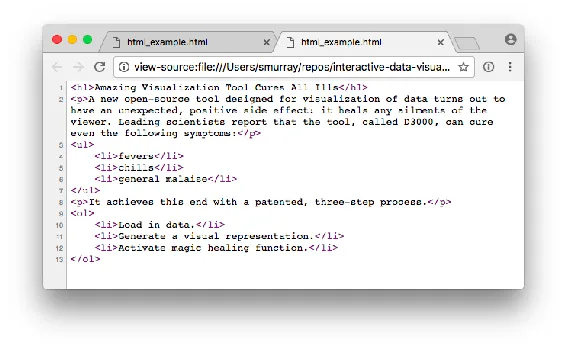
<h6 class="calibre37"><span class="keep-together">Figure 3-2.
</span>Looking at the source code in a new window in Chrome</h6>
</div>
</figure>

That gets you the raw HTML, but if any D3 or JavaScript code has been
executed, the current DOM may be vastly different.

Fortunately, <span id="ch03.xhtml_idm140093210884224"
class="calibre5 pcalibre pcalibre2 pcalibre3 pcalibre1"
data-type="indexterm" primary="DOM (Document Object Model)"
secondary="examining current state of"></span>your browser’s developer
tools enable you to see the current state of the DOM. And, again, the
developer tools are different in every browser. We’ll start with the
element inspector. In Chrome, find them under View→Developer→Developer
Tools→Elements. In Firefox, try Tools→Web Developer→Inspector. In
Safari, first enable the developer tools (in
Safari→Preferences→Advanced). Then, in the Develop menu, choose Show Web
Inspector. In any browser, you can also use the corresponding keyboard
shortcut (as shown adjacent to the menu item) or right-click and choose
“inspect element” or something similar.

I’ll use Chrome throughout this book, for consistency and because I
prefer its developer tools. Your browser might look a bit different from
my screenshots, but the functionality will be very similar.

<a href="#ch03.xhtml_Safari_web_inspector"
class="calibre5 pcalibre pcalibre2 pcalibre3 pcalibre1"
data-type="xref">Figure 3-3</a> shows the Elements tab of Chrome’s web
inspector. Here we can see the current state of the DOM. This is useful
because your code will modify DOM elements dynamically. In the web
inspector, you can watch elements as they change.

<figure class="calibre35">
<div id="ch03.xhtml_Safari_web_inspector" class="figure">
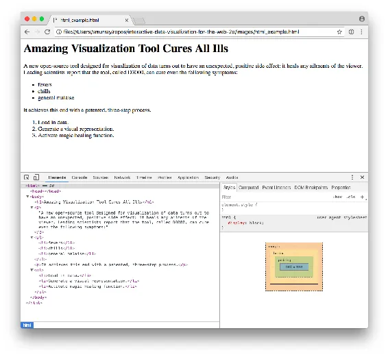
<h6 class="calibre37"><span class="keep-together">Figure 3-3.
</span>Chrome’s web inspector</h6>
</div>
</figure>

If you look closely, you’ll already see some differences between the raw
HTML and the DOM, including the fact that Chrome generated the required
`html`, `head`, and `body` elements. (I was lazy and didn’t include them
in my original HTML.)<span id="ch03.xhtml_idm140093210876816"
class="calibre5 pcalibre pcalibre2 pcalibre3 pcalibre1"
data-type="indexterm" primary=""
startref="devtool03"></span><span id="ch03.xhtml_idm140093210875840"
class="calibre5 pcalibre pcalibre2 pcalibre3 pcalibre1"
data-type="indexterm" primary="" startref="webdev03"></span>

<div class="dedication">

</div>

</div>

</div>

<div class="section calibre2" data-type="sect1"
pdf-bookmark="Rendering and the Box Model">

<div id="ch03.xhtml_idm140093210897536" class="dedication">

# Rendering and the Box Model

*Rendering* <span id="ch03.xhtml_idm140093210872848"
class="calibre5 pcalibre pcalibre2 pcalibre3 pcalibre1"
data-type="indexterm"
primary="rendering"></span><span id="ch03.xhtml_idm140093210872112"
class="calibre5 pcalibre pcalibre2 pcalibre3 pcalibre1"
data-type="indexterm"
primary="visual rules"></span><span id="ch03.xhtml_idm140093210871440"
class="calibre5 pcalibre pcalibre2 pcalibre3 pcalibre1"
data-type="indexterm"
primary="box model"></span><span id="ch03.xhtml_idm140093210870768"
class="calibre5 pcalibre pcalibre2 pcalibre3 pcalibre1"
data-type="indexterm" primary="browsers" secondary="rendering"></span>is
the process by which browsers, after parsing the HTML and generating the
DOM, apply visual rules to the DOM contents and draw those pixels to the
screen.

The most important thing to keep in mind when considering how browsers
render content is this: to a browser, everything is a box.

Paragraphs, `div`s, `span`s—all are boxes in the sense that they are
two-dimensional rectangles, with properties that any rectangle can have,
such as width, height, and positions in space. Even if something looks
curved or irregularly shaped, rest assured, to the browser, it is merely
another rectangular box.

You <span id="ch03.xhtml_idm140093210866960"
class="calibre5 pcalibre pcalibre2 pcalibre3 pcalibre1"
data-type="indexterm" primary="web inspector"></span>can see these boxes
with the help of the web inspector. Just mouse over any element, and the
box associated with that element is highlighted in blue, as shown in
<a href="#ch03.xhtml_Inspector_with_element_box_highlighted"
class="calibre5 pcalibre pcalibre2 pcalibre3 pcalibre1"
data-type="xref">Figure 3-4</a>.

<figure class="calibre35">
<div id="ch03.xhtml_Inspector_with_element_box_highlighted"
class="figure">
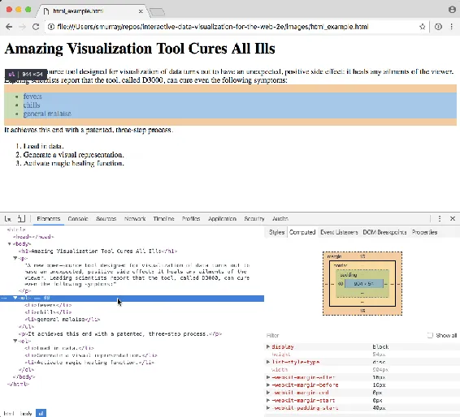
<h6 class="calibre37"><span class="keep-together">Figure 3-4.
</span>Inspector with element box highlighted</h6>
</div>
</figure>

There’s <span id="ch03.xhtml_idm140093210862384"
class="calibre5 pcalibre pcalibre2 pcalibre3 pcalibre1"
data-type="indexterm" primary="ul (unordered list)"></span>a lot of
information about the `ul` unordered list here. Note that the list’s
total dimensions (width and height) are shown in a tooltip at the
element’s upper-left corner. Also, the list’s position in the DOM
hierarchy is indicated in the lower-left corner of the inspector:
`html > body > ul`.

The box for the `ul` expands to fill the width of the entire window
because it is a *block-level* element. (Note how under “Computed Style”
is listed `display: block`.) <span id="ch03.xhtml_idm140093210858464"
class="calibre5 pcalibre pcalibre2 pcalibre3 pcalibre1"
data-type="indexterm"
primary="inline elements"></span><span id="ch03.xhtml_idm140093210857728"
class="calibre5 pcalibre pcalibre2 pcalibre3 pcalibre1"
data-type="indexterm" primary="elements"
secondary="inline elements"></span>This is in contrast to *inline*
elements, which rest *in line* with each other, not stacked on top of
each other like blocks. Common inline elements include `strong`, `em`,
`a`, and `span`.

By default, <span id="ch03.xhtml_idm140093210853760"
class="calibre5 pcalibre pcalibre2 pcalibre3 pcalibre1"
data-type="indexterm"
primary="block-level elements"></span><span id="ch03.xhtml_idm140093210853024"
class="calibre5 pcalibre pcalibre2 pcalibre3 pcalibre1"
data-type="indexterm" primary="elements"
secondary="block-level elements"></span>block-level elements expand to
fill their container elements and force any subsequent sibling elements
further down the page. Inline elements do not expand to fill extra
space, and happily exist side by side, next to their fellow inline
neighbors. (Discussion question: what kind of element would you rather
be?)

</div>

</div>

<div class="section calibre2" data-type="sect1" pdf-bookmark="CSS">

<div id="ch03.xhtml_idm140093210851488" class="dedication">

# CSS

Cascading <span id="ch03.xhtml_idm140093210849920"
class="calibre5 pcalibre pcalibre2 pcalibre3 pcalibre1"
data-type="indexterm" primary="CSS (Cascading Style Sheets)"
secondary="purpose of"></span><span id="ch03.xhtml_idm140093210848944"
class="calibre5 pcalibre pcalibre2 pcalibre3 pcalibre1"
data-type="indexterm" primary="DOM (Document Object Model)"
secondary="styling with CSS"></span>Style Sheets are used to style the
visual presentation of DOM elements. CSS looks like the following:

``` calibre39
body {
    background-color: white;
    color: black;
}
```

CSS <span id="ch03.xhtml_idm140093210799360"
class="calibre5 pcalibre pcalibre2 pcalibre3 pcalibre1"
data-type="indexterm" primary="CSS (Cascading Style Sheets)"
secondary="selectors and properties"></span><span id="ch03.xhtml_idm140093210798512"
class="calibre5 pcalibre pcalibre2 pcalibre3 pcalibre1"
data-type="indexterm"
primary="selectors"></span><span id="ch03.xhtml_idm140093210797904"
class="calibre5 pcalibre pcalibre2 pcalibre3 pcalibre1"
data-type="indexterm" primary="properties"></span>styles consist of
*selectors* and *properties*. Selectors are followed by properties,
grouped in curly brackets. A property and its value are separated by a
colon, and the line is terminated with a semicolon, like the following:

``` calibre39
selector {
    property: value;
    property: value;
    property: value;
}
```

You can apply the same properties to multiple selectors at once by
separating the selectors with a comma, as in the following:

``` calibre39
selectorA,
selectorB,
selectorC {
    property: value;
    property: value;
    property: value;
}
```

For example, you might want to specify that both `p` paragraphs and `li`
list items should use the same font size, line height, and color.

``` calibre39
p,
li {
    font-size: 12px;
    line-height: 14px;
    color: orange;
}
```

Collectively, <span id="ch03.xhtml_idm140093210739920"
class="calibre5 pcalibre pcalibre2 pcalibre3 pcalibre1"
data-type="indexterm" primary="CSS (Cascading Style Sheets)"
secondary="CSS rules"></span>this whole chunk of code (selectors and
bracketed properties) is called a *CSS rule*.

<div class="section calibre2" data-type="sect2"
pdf-bookmark="Selectors">

<div id="ch03.xhtml_idm140093210738400" class="dedication">

## Selectors

D3 uses CSS-style selectors to identify elements on which to operate, so
it’s important to understand how to use them.

Selectors identify specific elements to which styles will be applied.
There are several different kinds of selectors. We’ll use only the
simplest ones in this book.

Type selectors  
These <span id="ch03.xhtml_idm140093210659888"
class="calibre5 pcalibre pcalibre2 pcalibre3 pcalibre1"
data-type="indexterm" primary="type selectors"></span>are the simplest.
They match DOM elements with the same name:

``` calibre39
h1          /* Selects all level 1 headings           */
p           /* Selects all paragraphs                 */
strong      /* Selects all strong elements            */
em          /* Selects all em elements                */
div         /* Selects all divs                       */
```

Descendant selectors  
These <span id="ch03.xhtml_idm140093210651104"
class="calibre5 pcalibre pcalibre2 pcalibre3 pcalibre1"
data-type="indexterm" primary="descendant selectors"></span>match
elements that are contained by (or “descended from”) another element. We
will rely heavily on descendant selectors to apply styles:

``` calibre39
h1 em       /* Selects em elements contained in an h1 */
div p       /* Selects p elements contained in a div  */
```

Class selectors  
These <span id="ch03.xhtml_idm140093210475920"
class="calibre5 pcalibre pcalibre2 pcalibre3 pcalibre1"
data-type="indexterm" primary="class selectors"></span>match elements of
any type that have been assigned a specific class. Class names are
preceded with a period, as shown here:

``` calibre39
.caption    /* Selects elements with class "caption"  */
.label      /* Selects elements with class "label"    */
.axis       /* Selects elements with class "axis"     */
```

Because elements can have more than one class, you can target elements
with multiple classes by stringing the classes together, as in the
following:

``` calibre39
.bar.highlight  /* Could target highlighted bars      */
.axis.x         /* Could target an x-axis             */
.axis.y         /* Could target a y-axis              */
```

`.axis` could be used to apply styles to both axes, for example, whereas
`.axis.x` would apply only to the x-axis.

ID selectors  
These <span id="ch03.xhtml_idm140093210453360"
class="calibre5 pcalibre pcalibre2 pcalibre3 pcalibre1"
data-type="indexterm" primary="ID selectors"></span>match the single
element with a given ID. (Remember, IDs can be used only once each in
the DOM.) IDs are preceded with a hash mark.

``` calibre39
#header     /* Selects element with ID "header"       */
#nav        /* Selects element with ID "nav"          */
#export     /* Selects element with ID "export"       */
```

Selectors get progressively more useful as you combine them in different
ways to target specific elements. You can string selectors together to
get very specific results. For
<span class="keep-together">example</span>:

``` calibre39
div.sidebar /* Selects divs with class "sidebar", but
               not other elements with that class     */
#button.on  /* Selects element with ID "button", but
               only when the class "on" is applied    */
```

Remember, because the DOM is dynamic, classes and IDs can be added and
removed, so you might have CSS rules that apply only in certain
scenarios.

For details on additional selectors, see the
<a href="http://mzl.la/V27Mcr"
class="calibre5 pcalibre pcalibre2 pcalibre3 pcalibre1">Mozilla
Developer Network</a>.

</div>

</div>

<div class="section calibre2" data-type="sect2"
pdf-bookmark="Properties and Values">

<div id="ch03.xhtml_idm140093210518288" class="dedication">

## Properties and Values

Groups <span id="ch03.xhtml_idm140093210516720"
class="calibre5 pcalibre pcalibre2 pcalibre3 pcalibre1"
data-type="indexterm" primary="CSS (Cascading Style Sheets)"
secondary="properties and values"></span><span id="ch03.xhtml_idm140093210515744"
class="calibre5 pcalibre pcalibre2 pcalibre3 pcalibre1"
data-type="indexterm"
primary="properties"></span><span id="ch03.xhtml_idm140093210515072"
class="calibre5 pcalibre pcalibre2 pcalibre3 pcalibre1"
data-type="indexterm" primary="values" secondary="in CSS"></span>of
property/value pairs cumulatively form the styles:

``` calibre39
margin: 10px;
padding: 25px;
background-color: yellow;
color: pink;
font-family: Helvetica, Arial, sans-serif;
```

At the risk of stating the obvious, notice that each property expects a
different kind of information. `color` wants a color, `margin` requires
a measurement (here in `px` or pixels), and so on.

By the way, colors can be specified in several different formats, such
as:

- Named colors: `orange`

- Hex values: `#3388aa` or `#38a`

- RGB values: `rgb(10, 150, 20)`

- RGB with alpha transparency: `rgba(10, 150, 20, 0.5)`

You can find <a href="http://mzl.la/1zVofik"
class="calibre5 pcalibre pcalibre2 pcalibre3 pcalibre1">exhaustive lists
of properties online</a>; I won’t try to list them here. Instead, I’ll
just introduce relevant properties as we
go.<span id="ch03.xhtml_idm140093210371216"
class="calibre5 pcalibre pcalibre2 pcalibre3 pcalibre1"
data-type="indexterm" primary="CSS (Cascading Style Sheets)"
secondary="comments"></span><span id="ch03.xhtml_idm140093210370304"
class="calibre5 pcalibre pcalibre2 pcalibre3 pcalibre1"
data-type="indexterm" primary="comments" secondary="CSS"></span>

</div>

</div>

<div class="section calibre2" data-type="sect2" pdf-bookmark="Comments">

<div id="ch03.xhtml_idm140093210369232" class="dedication">

## Comments

``` calibre39
/* By the way, this is what a comment looks like
   in CSS.  They start with a slash-asterisk pair,
   and end with an asterisk-slash pair.  Anything
   in between will be ignored. */
```

</div>

</div>

<div class="section calibre2" data-type="sect2"
pdf-bookmark="Referencing Styles">

<div id="ch03.xhtml_idm140093210366672" class="dedication">

## Referencing Styles

There <span id="ch03.xhtml_idm140093210365296"
class="calibre5 pcalibre pcalibre2 pcalibre3 pcalibre1"
data-type="indexterm" primary="CSS (Cascading Style Sheets)"
secondary="referencing styles"></span><span id="ch03.xhtml_idm140093210364320"
class="calibre5 pcalibre pcalibre2 pcalibre3 pcalibre1"
data-type="indexterm" primary="styles"
secondary="referencing CSS"></span>are three common ways to apply CSS
style rules to your HTML document.

<div class="section calibre2" data-type="sect3"
pdf-bookmark="Embed the CSS in your HTML">

<div id="ch03.xhtml_idm140093210361536" class="dedication">

### Embed the CSS in your HTML

If you embed the CSS rules in your HTML document, you can keep
everything in one file. In the document `head`, include all CSS code
within a `style` element.

``` calibre39
<html>
    <head>
        <style type="text/css">

            p {
                font-size: 24px;
                font-weight: bold;
                background-color: red;
                color: white;
            }

        </style>
    </head>
    <body>
        <p>If I were to ask you, as a mere paragraph, would you say that I
        have style?</p>
    </body>
</html>
```

That HTML page with CSS renders as shown in
<a href="#ch03.xhtml_Rendering_of_an_embedded_CSS_rule"
class="calibre5 pcalibre pcalibre2 pcalibre3 pcalibre1"
data-type="xref">Figure 3-5</a>.

<figure class="calibre35">
<div id="ch03.xhtml_Rendering_of_an_embedded_CSS_rule" class="figure">

<h6 class="calibre37"><span class="keep-together">Figure 3-5.
</span>Rendering of an embedded CSS rule</h6>
</div>
</figure>

Embedding is the simplest option, but I generally prefer to keep
different kinds of code (e.g., HTML, CSS, JavaScript) in separate
documents.

</div>

</div>

<div class="section calibre2" data-type="sect3"
pdf-bookmark="Reference an external stylesheet from the HTML">

<div id="ch03.xhtml_idm140093210318016" class="dedication">

### Reference an external stylesheet from the HTML

To <span id="ch03.xhtml_idm140093210316432"
class="calibre5 pcalibre pcalibre2 pcalibre3 pcalibre1"
data-type="indexterm" primary="external style sheets"></span>store CSS
outside of your HTML, save it in a plain-text file with a *.css* suffix,
such as *style.css*. Then use a `link` element in the document `head` to
reference the external CSS file, like so:

``` calibre39
<html>
    <head>
        <link rel="stylesheet" href="style.css">
    </head>
    <body>
        <p>If I were to ask you, as a mere paragraph, would you say that
        I have style?</p>
    </body>
</html>
```

This example renders exactly the same as the prior example.

</div>

</div>

<div class="section calibre2" data-type="sect3"
pdf-bookmark="Attach inline styles">

<div id="ch03.xhtml_idm140093210248032" class="dedication">

### Attach inline styles

A <span id="ch03.xhtml_idm140093210138400"
class="calibre5 pcalibre pcalibre2 pcalibre3 pcalibre1"
data-type="indexterm" primary="inline style rules"></span>third method
is to attach style rules *inline* directly to elements in the HTML. You
can do this by adding a `style` attribute to any element. Then include
the CSS rules within the double quotation marks. The result is shown in
<a href="#ch03.xhtml_Rendering_of_an_inline_CSS_rule"
class="calibre5 pcalibre pcalibre2 pcalibre3 pcalibre1"
data-type="xref">Figure 3-6</a>.

``` calibre39
<p style="color: blue; font-size: 48px; font-style: italic;">Inline styles
are kind of a hassle</p>
```

<figure class="calibre35">
<div id="ch03.xhtml_Rendering_of_an_inline_CSS_rule" class="figure">

<h6 class="calibre37"><span class="keep-together">Figure 3-6.
</span>Rendering of an inline CSS rule</h6>
</div>
</figure>

Because inline styles are attached directly to elements, there is no
need for selectors.

Inline styles are messy and hard to read, but they are useful for giving
special treatment to a single element, when that style information
doesn’t make sense in a larger stylesheet. We’ll learn how to apply
inline styles programmatically with D3 (which is much easier than typing
them in by hand, one at a time).

</div>

</div>

</div>

</div>

<div class="section calibre2" data-type="sect2"
pdf-bookmark="Inheritance, Cascading, and Specificity">

<div id="ch03.xhtml_idm140093210162912" class="dedication">

## Inheritance, Cascading, and Specificity

Many <span id="ch03.xhtml_idm140093210161216"
class="calibre5 pcalibre pcalibre2 pcalibre3 pcalibre1"
data-type="indexterm" primary="CSS (Cascading Style Sheets)"
secondary="inheritance"></span><span id="ch03.xhtml_idm140093210160240"
class="calibre5 pcalibre pcalibre2 pcalibre3 pcalibre1"
data-type="indexterm" primary="inheritance"></span>style properties are
*inherited* by an element’s descendants unless otherwise specified. For
example, this document’s style rule applies to the `div`:

``` calibre39
<html>
    <head>
        <title></title>
        <style type="text/css">

            div {
                background-color: red;
                font-size: 24px;
                font-weight: bold;
                color: white;
            }

        </style>
    </head>
    <body>
        <p>I am a sibling to the div.</p>
        <div>
            <p>I am a descendant and child of the div.</p>
        </div>
    </body>
</html>
```

Yet when this page renders, the styles intended for the `div` (red
background, bold text, and so on) are *inherited* by the second
paragraph, as shown in <a href="#ch03.xhtml_Inherited_style"
class="calibre5 pcalibre pcalibre2 pcalibre3 pcalibre1"
data-type="xref">Figure 3-7</a>, because that `p` is a descendant of the
styled `div`. Notice how the second paragraph’s text is white, even
though we never specified `p { color: white; }`.

<figure class="calibre35">
<div id="ch03.xhtml_Inherited_style" class="figure">
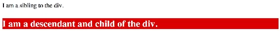
<h6 class="calibre37"><span class="keep-together">Figure 3-7.
</span>Inherited style</h6>
</div>
</figure>

Inheritance is a great feature of CSS, as children adopt the styles of
their parents. (There’s a metaphor in there somewhere.)

Finally, <span id="ch03.xhtml_idm140093210200832"
class="calibre5 pcalibre pcalibre2 pcalibre3 pcalibre1"
data-type="indexterm" primary="CSS (Cascading Style Sheets)"
secondary="cascading"></span><span id="ch03.xhtml_idm140093210199856"
class="calibre5 pcalibre pcalibre2 pcalibre3 pcalibre1"
data-type="indexterm" primary="cascading styles"
seealso="CSS (Cascading Style Sheets)"></span>an answer to the most
pressing question of the day: why are they called Cascading Style
Sheets? It’s because selector matches cascade from the top down. When
more than one selector applies to an element, the later rule generally
overrides the earlier one. For example, the following rules set the text
of all paragraph elements in the document to be blue *except* for those
with the class of `highlight` applied, which will be black *and* have a
yellow background, as shown in
<a href="#ch03.xhtml_CSS_cascading_and_inheritance_at_work"
class="calibre5 pcalibre pcalibre2 pcalibre3 pcalibre1"
data-type="xref">Figure 3-8</a>. The rules for `p` are applied first,
but then the rules for `p.highlight` override the less specific `p`
rules.

``` calibre39
p {
    color: blue;
}

p.highlight {
    color: black;
    background-color: yellow;
}
```

<figure class="calibre35">
<div id="ch03.xhtml_CSS_cascading_and_inheritance_at_work"
class="figure">
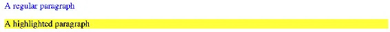
<h6 class="calibre37"><span class="keep-together">Figure 3-8. </span>CSS
cascading and inheritance at work</h6>
</div>
</figure>

Later <span id="ch03.xhtml_idm140093209976864"
class="calibre5 pcalibre pcalibre2 pcalibre3 pcalibre1"
data-type="indexterm" primary="CSS (Cascading Style Sheets)"
secondary="specificity"></span><span id="ch03.xhtml_idm140093209975888"
class="calibre5 pcalibre pcalibre2 pcalibre3 pcalibre1"
data-type="indexterm" primary="specificity"></span>rules generally
override earlier ones, but not always. The true logic has to do with the
*specificity* of each selector. The `p.highlight` selector would
override the `p` rule even if it were listed first, simply because it is
a more specific selector. If two selectors have the same specificity,
then the later one will be applied.

This is one of the main causes of confusion with CSS. The rules for
calculating specificity are inscrutable, and I won’t cover them here. To
save yourself headaches later, keep your selectors clear and easy to
read. Start with general selectors on top, and work your way down to
more specific ones, and you’ll be all right.

</div>

</div>

</div>

</div>

<div class="section calibre2" data-type="sect1"
pdf-bookmark="JavaScript">

<div id="ch03.xhtml_idm140093210851024" class="dedication">

# JavaScript

JavaScript is the scripting language that can make pages dynamic by
manipulating the DOM after a page has already loaded in the browser. As
I mentioned earlier, getting to know D3 is also a process of getting to
know JavaScript. We’ll dig in deeper as we go, but here is a taste to
get you started.

<div class="section calibre2" data-type="sect2"
pdf-bookmark="Hello, Console">

<div id="ch03.xhtml_idm140093209970784" class="dedication">

## Hello, Console

Normally, <span id="ch03.xhtml_idm140093209969216"
class="calibre5 pcalibre pcalibre2 pcalibre3 pcalibre1"
data-type="indexterm" primary="JavaScript"
secondary="using the JS console"></span>we write JavaScript code (or, a
“script”) in a text file, and then load that file to the browser in a
web page. But you can also just type JavaScript code directly into your
browser. This is an easy and quick way to get your feet wet and test out
code. We’ll also use the JavaScript console for debugging, as it’s an
essential tool for seeing what’s going on with your code.

In Chrome, select View→Developer→JavaScript Console. In Firefox, choose
Tools→Web Developer→Web Console. In Safari, go to Develop→Show Error
Console (see <a href="#ch03.xhtml_A_fresh_JavaScript_console"
class="calibre5 pcalibre pcalibre2 pcalibre3 pcalibre1"
data-type="xref">Figure 3-9</a>).

<figure class="calibre35">
<div id="ch03.xhtml_A_fresh_JavaScript_console" class="figure">
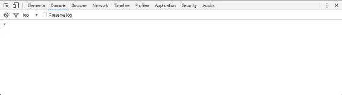
<h6 class="calibre37"><span class="keep-together">Figure 3-9. </span>A
fresh JavaScript console…delicious!</h6>
</div>
</figure>

The console accepts one line of code at a time, and it always spits back
the result of whatever you input. For example, if you enter the number
`7`, the console returns the mind-numbingly obvious result of `7`.
Brilliant.

Other times, you’ll want your script to print values out to the console
automatically, so you can keep an eye on what’s going on. As you’ll see
in some examples that follow, you can use `console.log("something");` to
do that.

Type the following examples into the console to see how it works.

</div>

</div>

<div class="section calibre2" data-type="sect2"
pdf-bookmark="Variables">

<div id="ch03.xhtml_idm140093209961216" class="dedication">

## Variables

Variables <span id="ch03.xhtml_idm140093209959616"
class="calibre5 pcalibre pcalibre2 pcalibre3 pcalibre1"
data-type="indexterm" primary="JavaScript"
secondary="variables"></span><span id="ch03.xhtml_idm140093209958608"
class="calibre5 pcalibre pcalibre2 pcalibre3 pcalibre1"
data-type="indexterm"
primary="variables"></span><span id="ch03.xhtml_idm140093209957936"
class="calibre5 pcalibre pcalibre2 pcalibre3 pcalibre1"
data-type="indexterm" primary="containers"></span>are containers for
data. A simple variable holds one value:

``` calibre39
var number = 5;
```

In <span id="ch03.xhtml_idm140093209713280"
class="calibre5 pcalibre pcalibre2 pcalibre3 pcalibre1"
data-type="indexterm"
primary="assignment operator (=)"></span><span id="ch03.xhtml_idm140093208305840"
class="calibre5 pcalibre pcalibre2 pcalibre3 pcalibre1"
data-type="indexterm" primary="= (assignment operator)"></span>that
statement, `var` indicates you are declaring a new variable, the name of
which is `number`. The equals sign is an *assignment operator* because
it takes the value on the right (`5`) and *assigns* it to the variable
on the left (`number`). So when you see something such as:

``` calibre39
defaultColor = "hot pink";
```

try to read the equals sign not as “equals” but as “is set to.” So that
statement could be stated in plain English as “The variable
`defaultColor` *is set to* hot pink.”

As you’ve just seen, variables can store numeric values as well as
strings of text, so called because they are formed by stringing together
individual characters of text. Strings must be enclosed by quotation
marks. True or false (Boolean) values can also be stored:

``` calibre39
var thisMakesSenseSoFar = true;  //I'm a boolean!
```

Just don’t enclose a boolean in quotation marks, or it will be
interpreted as a string!

``` calibre39
var thisMakesSenseSoFar = "true";  //I'm a string!
```

Also note that in JavaScript, statements are concluded with a semicolon.

You can try making some variables yourself in the console. For example,
type **`var amount = 200`**, then press Enter, and then on a new line
just enter `amount` and press Enter. You should see `200` returned to
you in the console—proof that JavaScript remembered the value you
assigned to `amount`!

</div>

</div>

<div class="section calibre2" data-type="sect2"
pdf-bookmark="Other Variable Types">

<div id="ch03.xhtml_idm140093209960592" class="dedication">

## Other Variable Types

A variable is a datum, the smallest building block of data. The variable
is the foundation of all other data structures, which are simply
different configurations of variables.

Now we’ll address some of these more complex forms of data, including
arrays, objects, and arrays of objects. You might want to skip this
section for now but reference it later, once you’re ready to load your
own data into D3.

</div>

</div>

<div class="section calibre2" data-type="sect2" pdf-bookmark="Arrays">

<div id="ch03.xhtml_idm140093209937680" class="dedication">

## Arrays

An <span id="ch03.xhtml_idm140093210087040"
class="calibre5 pcalibre pcalibre2 pcalibre3 pcalibre1"
data-type="indexterm" primary="JavaScript"
secondary="arrays"></span><span id="ch03.xhtml_idm140093210086032"
class="calibre5 pcalibre pcalibre2 pcalibre3 pcalibre1"
data-type="indexterm" primary="arrays"></span>array is a sequence of
values, conveniently stored in a single variable.

Keeping track of related values in separate variables is inefficient:

``` calibre39
var numberA = 5;
var numberB = 10;
var numberC = 15;
var numberD = 20;
var numberE = 25;
```

Rewritten as an array, those values are much simpler. Hard brackets `[]`
indicate an array, and each value is separated by a comma:

``` calibre39
var numbers = [ 5, 10, 15, 20, 25 ];
```

Arrays are ubiquitous in data visualization, so you will become very
comfortable with them. You can access (retrieve) a value in an array by
using *bracket notation*:

``` calibre39
numbers[2]  //Returns 15
```

The numeral in the bracket refers to a corresponding position in the
array. Remember, array positions begin counting at zero, so the first
position is 0, the second position is 1, and so on:

``` calibre39
numbers[0]  //Returns 5
numbers[1]  //Returns 10
numbers[2]  //Returns 15
numbers[3]  //Returns 20
numbers[4]  //Returns 25
```

Some people find it helpful to think of arrays in spatial terms, as
though they have rows and columns, like in a spreadsheet:

| Position | Value |
|----------|-------|
| 0        | 5     |
| 1        | 10    |
| 2        | 15    |
| 3        | 20    |
| 4        | 25    |

Arrays can contain any type of data, not just integers:

``` calibre39
var percentages = [ 0.55, 0.32, 0.91 ];
var names = [ "Ernie", "Bert", "Oscar" ];

percentages[1]  //Returns 0.32
names[1]        //Returns "Bert"
```

Although I don’t recommend it, different types of values can even be
stored within the same array:

``` calibre39
var mishmash = [ 1, 2, 3, 4.5, 5.6, "oh boy", "say it isn't", true ];
```

</div>

</div>

<div class="section calibre2" data-type="sect2" pdf-bookmark="Objects">

<div id="ch03.xhtml_idm140093208678416" class="dedication">

## Objects

Arrays <span id="ch03.xhtml_idm140093208568272"
class="calibre5 pcalibre pcalibre2 pcalibre3 pcalibre1"
data-type="indexterm"
primary="objects"></span><span id="ch03.xhtml_idm140093208567536"
class="calibre5 pcalibre pcalibre2 pcalibre3 pcalibre1"
data-type="indexterm" primary="JavaScript"
secondary="objects"></span><span id="ch03.xhtml_idm140093208566592"
class="calibre5 pcalibre pcalibre2 pcalibre3 pcalibre1"
data-type="indexterm" primary="values" secondary="in objects"></span>are
great for simple lists of values, but with more complex datasets, you’ll
want to put your data into an object. For our purposes, think of a
JavaScript object as a custom data structure. We use curly brackets `{}`
to indicate an object. <span id="ch03.xhtml_idm140093208564912"
class="calibre5 pcalibre pcalibre2 pcalibre3 pcalibre1"
data-type="indexterm" primary="properties"></span>In between the
brackets, we include *properties* and *values*. A colon `:` separates
each property and its value, and a comma separates each property/value
pair:

``` calibre39
var fruit = {
    kind: "grape",
    color: "red",
    quantity: 12,
    tasty: true
};
```

To reference each value, we use *dot notation*, specifying the name of
the property:

``` calibre39
fruit.kind      //Returns "grape"
fruit.color     //Returns "red"
fruit.quantity  //Returns 12
fruit.tasty     //Returns true
```

Think of the value as “belonging” to the object. Oh, look, some fruit.
“What kind of fruit is that?” you might ask. As it turns out,
`fruit.kind` is `"grape"`. “Are they tasty?” Oh, definitely, because
`fruit.tasty` is `true`.

</div>

</div>

<div class="section calibre2" data-type="sect2"
pdf-bookmark="Objects and Arrays">

<div id="ch03.xhtml_idm140093207495600" class="dedication">

## Objects and Arrays

You <span id="ch03.xhtml_idm140093207493968"
class="calibre5 pcalibre pcalibre2 pcalibre3 pcalibre1"
data-type="indexterm" primary="JavaScript"
secondary="arrays"></span><span id="ch03.xhtml_idm140093207486624"
class="calibre5 pcalibre pcalibre2 pcalibre3 pcalibre1"
data-type="indexterm" primary="arrays"></span>can combine these two
structures to create arrays of objects, or objects of arrays, or objects
of objects or, well, basically whatever structure makes sense for your
dataset.

Let’s say we have acquired a couple more pieces of fruit, and we want to
expand our catalog accordingly. We use hard brackets `[]` on the
outside, to indicate an array, followed by curly brackets `{}` and
object notation on the inside, with each object separated by a comma:

``` calibre39
var fruits = [
    {
        kind: "grape",
        color: "red",
        quantity: 12,
        tasty: true
    },
    {
        kind: "kiwi",
        color: "brown",
        quantity: 98,
        tasty: true
    },
    {
        kind: "banana",
        color: "yellow",
        quantity: 0,
        tasty: true
    }
];
```

To access this data, we just follow the trail of properties down to the
values we want. Remember, `[]` means array, and `{}` means object.
`fruits` is an array, so first we use bracket notation to specify an
array index:

``` calibre39
fruits[1]
```

Next, each array element is an object, so just tack on a dot and a
property:

``` calibre39
fruits[1].quantity   //Returns 98
```

Here’s a map of how to access every value in the `fruits` array of
objects:

``` calibre39
fruits[0].kind      ==  "grape"
fruits[0].color     ==  "red"
fruits[0].quantity  ==  12
fruits[0].tasty     ==  true

fruits[1].kind      ==  "kiwi"
fruits[1].color     ==  "brown"
fruits[1].quantity  ==  98
fruits[1].tasty     ==  true

fruits[2].kind      ==  "banana"
fruits[2].color     ==  "yellow"
fruits[2].quantity  ==  0
fruits[2].tasty     ==  true
```

Yes, that’s right, we have `fruits[2].quantity` bananas.

<div class="section calibre2" data-type="sect3" pdf-bookmark="JSON">

<div id="ch03.xhtml_idm140093207339104" class="dedication">

### JSON

At <span id="ch03.xhtml_idm140093207264192"
class="calibre5 pcalibre pcalibre2 pcalibre3 pcalibre1"
data-type="indexterm" primary="JavaScript"
secondary="JSON"></span><span id="ch03.xhtml_idm140093207263184"
class="calibre5 pcalibre pcalibre2 pcalibre3 pcalibre1"
data-type="indexterm"
primary="JSON (JavaScript Object Notation)"></span>some point in your D3
career, you will encounter JavaScript Object Notation. You can
<a href="http://en.wikipedia.org/wiki/Json"
class="calibre5 pcalibre pcalibre2 pcalibre3 pcalibre1">read up on the
details</a>, but JSON is basically a specific syntax for organizing data
as JavaScript objects. The syntax is optimized for use with JavaScript
(obviously) and AJAX requests, which is why you’ll see a lot of
<span class="keep-together">web-based</span> application programming
interfaces (APIs) that return data formatted as JSON. It’s faster and
easier to parse with JavaScript than XML, and of course D3 works well
with it.

All that, and it doesn’t look much weirder than what we’ve already seen:

``` calibre39
{
    "kind": "grape",
    "color": "red",
    "quantity": 12,
    "tasty": true
}
```

The only difference here is that our property names are now surrounded
by double quotation marks `""`, making them string values.

JSON objects, like all other JavaScript objects, can of course be stored
in variables like so:

``` calibre39
var jsonFruit = {
    "kind": "grape",
    "color": "red",
    "quantity": 12,
    "tasty": true
};
```

</div>

</div>

<div class="section calibre2" data-type="sect3" pdf-bookmark="GeoJSON">

<div id="ch03.xhtml_idm140093207080448" class="dedication">

### GeoJSON

Just <span id="ch03.xhtml_idm140093207075856"
class="calibre5 pcalibre pcalibre2 pcalibre3 pcalibre1"
data-type="indexterm" primary="JavaScript"
secondary="GeoJSON"></span><span id="ch03.xhtml_idm140093207074848"
class="calibre5 pcalibre pcalibre2 pcalibre3 pcalibre1"
data-type="indexterm" primary="GeoJSON"></span>as JSON is just a
formalization of existing JavaScript object syntax,
<span class="keep-together">GeoJSON</span> is a formalized syntax of
JSON objects, optimized for storing geodata. All
<a href="http://geojson.org"
class="calibre5 pcalibre pcalibre2 pcalibre3 pcalibre1">GeoJSON</a>
objects are JSON objects, and all JSON objects are JavaScript objects.

GeoJSON can store points in geographical space (typically as
longitude/latitude coordinates), but also shapes (such as lines and
polygons) and other spatial features. If you have a lot of geodata, it’s
worth it to parse it into GeoJSON format for best use with D3.

We’ll get into the details of GeoJSON when we talk about geomaps, but
for now, just know that this is what simple GeoJSON data looks like:

``` calibre39
{
    "type": "FeatureCollection",
    "features": [
        {
            "type": "Feature",
            "geometry": {
                "type": "Point",
                "coordinates": [ 150.1282427, -24.471803 ]
            },
            "properties": {
                "type": "town"
            }
        }
    ]
}
```

Confusingly, longitude is always listed before latitude. Get used to
thinking in terms of lon/lat instead of lat/lon. This make sense once
you realize that lon/lat is sort of equivalent to x/y, and in graphics
we are used to putting x first. x and longitude move things
horizontally, while y and latitude move things vertically.

</div>

</div>

</div>

</div>

<div class="section calibre2" data-type="sect2"
pdf-bookmark="Mathematical Operators">

<div id="ch03.xhtml_idm140093207494944" class="dedication">

## Mathematical Operators

You <span id="ch03.xhtml_idm140093207204880"
class="calibre5 pcalibre pcalibre2 pcalibre3 pcalibre1"
data-type="indexterm" primary="JavaScript"
secondary="mathematical operators"></span><span id="ch03.xhtml_idm140093207203872"
class="calibre5 pcalibre pcalibre2 pcalibre3 pcalibre1"
data-type="indexterm" primary="mathematical operators"></span>can add,
subtract, multiply, and divide values using the following operators:

``` calibre39
+   //Add
-   //Subtract
*   //Multiply
/   //Divide
```

For example, type `8 * 2` into the console, press Enter, and you should
see `16`. More examples:

``` calibre39
1 + 2       //Returns 3
10 - 0.5    //Retuns 9.5
33 * 3      //Returns 99
3 / 4       //Returns 0.75
```

</div>

</div>

<div class="section calibre2" data-type="sect2"
pdf-bookmark="Comparison Operators">

<div id="ch03.xhtml_idm140093207189408" class="dedication">

## Comparison Operators

You <span id="ch03.xhtml_idm140093206941088"
class="calibre5 pcalibre pcalibre2 pcalibre3 pcalibre1"
data-type="indexterm" primary="JavaScript"
secondary="comparison operators"></span><span id="ch03.xhtml_idm140093206940080"
class="calibre5 pcalibre pcalibre2 pcalibre3 pcalibre1"
data-type="indexterm"
primary="== (comparison operator)"></span><span id="ch03.xhtml_idm140093206939440"
class="calibre5 pcalibre pcalibre2 pcalibre3 pcalibre1"
data-type="indexterm" primary="comparison operator (==)"></span>can
compare values against each other using the following operators:

``` calibre39
==  //Equal to
!=  //Not equal to
<   //Less than
>   //Greater than
<=  //Less than or equal to
>=  //Greater than or equal to
```

These all compare some value on the left to some value on the right. If
the result is true, then `true` is returned. If the result is false,
`false` is returned.

Try it! Type each of the following into the console and see what you
get:

``` calibre39
3 == 3
3 == 5
3 >= 3
3 >= 2
100 < 2
298 != 298
```

</div>

</div>

<div class="section calibre2" data-type="sect2"
pdf-bookmark="Logical Operators">

<div id="ch03.xhtml_idm140093206896576" class="dedication">

## Logical Operators

You <span id="ch03.xhtml_idm140093206895040"
class="calibre5 pcalibre pcalibre2 pcalibre3 pcalibre1"
data-type="indexterm" primary="JavaScript"
secondary="logical operators"></span><span id="ch03.xhtml_idm140093206894032"
class="calibre5 pcalibre pcalibre2 pcalibre3 pcalibre1"
data-type="indexterm" primary="logical operators"></span>can combine
logical statements using the logical operators:

``` calibre39
&&  //AND
||  //OR
```

AND and OR can join statements together, as in “The dog ate my homework
AND my hard drive crashed.” If both parts are true, then the AND
resolves to true. If either or both statements are false, then the AND
resolves to false. (Either way, you have been caught in a lie.)

OR resolves to true as long as only *one* of the statements is true, as
in “Kids these days are getting younger OR I’m getting older.” In this
case, the first statement is false and the second is true, so the OR
resolves to true. (This makes intuitive sense, as there is some sort of
universal truth about aging in there somewhere.)

Try it! Type each of the following into the console and see what you
get:

``` calibre39
true && true
true && false
false && false

true || true
true || false
false || false

3 == 3 && 4 == 4
3 == 3 && 4 == 5
2 == 3 && 4 == 5

3 == 3 || 4 == 4
3 == 3 || 4 == 5
2 == 3 || 4 == 5
```

</div>

</div>

<div class="section calibre2" data-type="sect2"
pdf-bookmark="Control Structures">

<div id="ch03.xhtml_idm140093206856960" class="dedication">

## Control Structures

Whenever <span id="ch03.xhtml_idm140093206782384"
class="calibre5 pcalibre pcalibre2 pcalibre3 pcalibre1"
data-type="indexterm" primary="JavaScript"
secondary="control structures"></span><span id="ch03.xhtml_idm140093206781376"
class="calibre5 pcalibre pcalibre2 pcalibre3 pcalibre1"
data-type="indexterm" primary="control structures"></span>your code
needs to make a decision or repeat something, you need a control
structure. There are lots to choose from, but we are primarily
interested in `if` statements and `for` loops.

<div class="section calibre2" data-type="sect3"
pdf-bookmark="if() only">

<div id="ch03.xhtml_idm140093206779440" class="dedication">

### if() only

An `if` statement <span id="ch03.xhtml_idm140093206777392"
class="calibre5 pcalibre pcalibre2 pcalibre3 pcalibre1"
data-type="indexterm" primary="if statements"></span>uses comparison
operators to determine if a statement is true or false:

``` calibre39
if (test) {
    //Code to run if true
}
```

If the test between parentheses is `true`, then the code between the
curly brackets is run. If the test turns up `false`, then the bracketed
code is ignored, and life goes on. (Technically, life goes on either
way.)

Any of the preceding comparison operators or logical operators can be
used as part of the test statement. Here, we use `<` to determine if the
value on the left is less than the one on the right:

``` calibre39
if (3 < 5) {
    console.log("Eureka! Three is less than five!");
}
```

In the preceding example, the bracketed code will always be executed,
because `3 < 5` is always true. `if` statements are more useful when
comparing variables or other conditions that change.

``` calibre39
if (someValue < anotherValue) {
    //Set someValue to anotherValue, thereby restoring
    //a sense of balance and equilibrium to the world.
    someValue = anotherValue;
}
```

<div class="calibre29 warning" data-type="warning">

###### Warning

It’s <span id="ch03.xhtml_idm140093206749792"
class="calibre5 pcalibre pcalibre2 pcalibre3 pcalibre1"
data-type="indexterm"
primary="assignment operator (=)"></span><span id="ch03.xhtml_idm140093206749088"
class="calibre5 pcalibre pcalibre2 pcalibre3 pcalibre1"
data-type="indexterm"
primary="= (assignment operator)"></span><span id="ch03.xhtml_idm140093206748416"
class="calibre5 pcalibre pcalibre2 pcalibre3 pcalibre1"
data-type="indexterm"
primary="comparison operator (==)"></span><span id="ch03.xhtml_idm140093206643648"
class="calibre5 pcalibre pcalibre2 pcalibre3 pcalibre1"
data-type="indexterm" primary="== (comparison operator)"></span>a common
mistake to type `=` (the assignment operator) instead of `==` (the
comparison operator). Be careful while you type, and spare yourself
debugging headaches later. It can be especially confusing because an
`if()` statement will interpret the result of an assignment operation as
true. For example, this `if()` will always evaluate to `true`. Also,
you’ll end up with 123 bunny rabbits, regardless of how many there were
to begin with.

``` calibre63
if (bunnyRabbits = 123) {
    //This will always run
}
```

</div>

</div>

</div>

<div class="section calibre2" data-type="sect3"
pdf-bookmark="for() now">

<div id="ch03.xhtml_idm140093206636752" class="dedication">

### for() now

You <span id="ch03.xhtml_idm140093206634224"
class="calibre5 pcalibre pcalibre2 pcalibre3 pcalibre1"
data-type="indexterm" primary="for loops"></span>can use `for` loops to
repeatedly execute the same code, with slight variations. A `for` loop
uses this syntax:

``` calibre39
for (initialization; test; update) {
    //Code to run each time through the loop
}
```

They are so called because they loop through the code *for* as many
times as specified. First, the initialization statement is run. Then,
the test is evaluated, like a tiny `if` statement. If the test is true,
then the bracketed code is run. Finally, the `update` statement is run,
and the test is reevaluated.

The most common application of a `for` loop is to increase some variable
by 1 each time through the loop. The test statement can then control how
many times the loop is run by referencing that value. (The variable is
often named `i` for index, purely by convention, because it is short and
easy to type.)

``` calibre39
for (var i = 0; i < 5; i++) {
    console.log(i);  //Prints value to console
}
```

The preceding `for` loop prints the following to the console:

``` calibre39
0
1
2
3
4
```

The first time through, a variable named `i` is declared and set to
zero. `i` is less than five, so the bracketed code is run, printing the
current value of `i` (zero) to the console. Last, the value of `i` is
increased by one. (`i++` is shorthand for `i = i + 1`.) Now `i` is `1`,
so the test again evaluates as true, and the bracketed code is run
again, but this time the value printed to the console is `1`.

As you can see, reading prose descriptions of loops is about as
interesting as executing them by hand yourself. This is why we invented
computers. So I’ll skip to the end and point out that after the final
iteration, `i` is increased to 5, after which the test returns false,
and the loop is over.

It’s important to note that counting began at zero, and not one. That
is, the “first” value of `i` was `0`. Why not `1`? This is another
arbitrary convention, but it nicely parallels how computers count arrays
of values.

</div>

</div>

<div class="section calibre2" data-type="sect3"
pdf-bookmark="What arrays are made for">

<div id="ch03.xhtml_idm140093206636160" class="dedication">

### What arrays are made for

Code-based <span id="ch03.xhtml_idm140093206486896"
class="calibre5 pcalibre pcalibre2 pcalibre3 pcalibre1"
data-type="indexterm" primary="JavaScript"
secondary="arrays"></span><span id="ch03.xhtml_idm140093206485888"
class="calibre5 pcalibre pcalibre2 pcalibre3 pcalibre1"
data-type="indexterm" primary="arrays"></span>data visualization would
not be possible without arrays and the mighty `for` loop. Together, they
form a data geek’s dynamic duo. (If you do not consider yourself a “data
geek,” then may I remind you that you are reading a book titled
*Interactive Data Visualization for the Web*?)

An array organizes lots of data values in one convenient place, allowing
`for` to quickly “loop” through every value in an array and perform some
action with it, like expressing the value as a visual form. D3 often
manages this looping for us, <span id="ch03.xhtml_idm140093206483088"
class="calibre5 pcalibre pcalibre2 pcalibre3 pcalibre1"
data-type="indexterm" primary="data()"></span>such as with its magical
`data()` method.

Note this example, which loops through each of the values in an array
called `numbers`:

``` calibre39
var numbers = [ 8, 100, 22, 98, 99, 45 ];

for (var i = 0; i < numbers.length; i++) {
    console.log(numbers[i]);  //Print value to console
}
```

See that `numbers.length`? That’s the beautiful part. `length` is a
property of every array. In this case, `numbers` contains six values, so
`numbers.length` resolves to `6`, and the loop runs six times. If
`numbers` were 10 positions long, the loop would run 10 times. If it
were 10 million positions long…yeah, you get it. This is what computers
are good at: taking a set of instructions and executing them over and
over. And this is at the heart of why data visualization can be so
rewarding—you design and code the visualization system, and the system
will respond appropriately, even as you feed it different data. The
system’s mapping rules are consistent, even when the data is not.

</div>

</div>

</div>

</div>

<div class="section calibre2" data-type="sect2"
pdf-bookmark="Functions">

<div id="ch03.xhtml_idm140093206539744" class="dedication">

## Functions

Functions <span id="ch03.xhtml_idm140093206538016"
class="calibre5 pcalibre pcalibre2 pcalibre3 pcalibre1"
data-type="indexterm" primary="JavaScript"
secondary="functions"></span><span id="ch03.xhtml_idm140093206537008"
class="calibre5 pcalibre pcalibre2 pcalibre3 pcalibre1"
data-type="indexterm" primary="functions"
secondary="passing arguments to"></span>are chunks of code that do
things.

More <span id="ch03.xhtml_idm140093206535552"
class="calibre5 pcalibre pcalibre2 pcalibre3 pcalibre1"
data-type="indexterm"
primary="arguments (input values)"></span>specifically, functions are
special because they can take arguments or parameters as input, and then
return values as output. Parentheses are used to *call* (execute) a
function. If that function requires any arguments (input values), then
you *pass* them to the function by including them in the parentheses.

Whenever you see something like the following code, you know it’s a
function:

``` calibre39
calculateGratuity(38);
```

In fact, you’ve already seen functions at work with `console.log`, as in
the following:

``` calibre39
console.log("Look at me. I can do stuff!");
```

But the best part about functions is that you can define your own. There
are several ways to define functions in JavaScript, but here’s the
simplest, which I’ll use throughout this book:

``` calibre39
var calculateGratuity = function(bill) {
    return bill * 0.2;
};
```

This declares a new variable named `calculateGratuity`. Then, instead of
assigning a simple number or string, we store an entire function in the
variable. In the parentheses, we name `bill`, another variable to be
used only by the function itself. `bill` is the expected input. When
called, the function will take that input, multiply it by `0.2`, and
*return* the result as its output.

So now if we call:

``` calibre39
calculateGratuity(38);
```

the function returns 7.6. Not bad—a 20 percent tip!

Of course, you could store the output to use it elsewhere later, as in:

``` calibre39
var tip = calculateGratuity(38);
console.log(tip);  //Prints 7.6 to the console
```

There are also *anonymous* functions that, unlike `calculateGratuity`,
don’t have names. Anonymous functions are used all the time with D3;
we’ll meet them later.<span id="ch03.xhtml_idm140093206421328"
class="calibre5 pcalibre pcalibre2 pcalibre3 pcalibre1"
data-type="indexterm" primary="JavaScript"
secondary="comments"></span><span id="ch03.xhtml_idm140093206420384"
class="calibre5 pcalibre pcalibre2 pcalibre3 pcalibre1"
data-type="indexterm" primary="comments" secondary="JavaScript"></span>

</div>

</div>

<div class="section calibre2" data-type="sect2" pdf-bookmark="Comments">

<div id="ch03.xhtml_idm140093206539120" class="dedication">

## Comments

``` calibre39
/* JavaScript supports CSS-style comments like this. */

// But double-slashes can be used as well.
// Anything following // on the same line will be ignored.
// This is helpful for including brief notes to yourself
// as to what each line of code does, as in:

console.log("Brilliant");  //Prints "Brilliant" to the console
```

</div>

</div>

<div class="section calibre2" data-type="sect2"
pdf-bookmark="Referencing Scripts">

<div id="ch03.xhtml_idm140093206321040" class="dedication">

## Referencing Scripts

Scripts <span id="ch03.xhtml_idm140093206319760"
class="calibre5 pcalibre pcalibre2 pcalibre3 pcalibre1"
data-type="indexterm" primary="JavaScript"
secondary="referencing scripts"></span><span id="ch03.xhtml_idm140093206318752"
class="calibre5 pcalibre pcalibre2 pcalibre3 pcalibre1"
data-type="indexterm" primary="scripts"></span>can be included directly
in HTML, between two `script` tags, as in:

``` calibre39
<body>
    <script type="text/javascript">
        alert("Hello, world!");
    </script>
</body>
```

or stored in a separate file with a *.js* suffix, and then referenced
somewhere in the HTML (could be in the `head`, as shown here, or also
just before the end of the closing `body` tag):

``` calibre39
<head>
    <title>Page Title</title>
    <script type="text/javascript" src="myscript.js"></script>
</head>
```

</div>

</div>

<div class="section calibre2" data-type="sect2"
pdf-bookmark="JavaScript Gotchas">

<div id="ch03.xhtml_idm140093206124896" class="dedication">

## JavaScript Gotchas

As a bonus, and at no extra charge, I would like to share with you my
top four JavaScript gotchas: things that, had I known them earlier,
would have saved me many hours of late-night debugging sessions,
anxiety-induced panic, and increased cortisol levels. You might want to
come back and reference this section later.

<div class="section calibre2" data-type="sect3"
pdf-bookmark="Dynamic typing">

<div id="ch03.xhtml_idm140093206187680" class="dedication">

### Dynamic typing

I <span id="ch03.xhtml_idm140093206185728"
class="calibre5 pcalibre pcalibre2 pcalibre3 pcalibre1"
data-type="indexterm" primary="JavaScript"
secondary="dynamic typing"></span><span id="ch03.xhtml_idm140093206184720"
class="calibre5 pcalibre pcalibre2 pcalibre3 pcalibre1"
data-type="indexterm"
primary="dynamic typing"></span><span id="ch03.xhtml_idm140093206151728"
class="calibre5 pcalibre pcalibre2 pcalibre3 pcalibre1"
data-type="indexterm" primary="loosely typed languages"></span>do love
how your fingers flutter across the keyboard, but that’s not what I’m
talking about. No, JavaScript is a *loosely typed* language, meaning you
don’t have to specify what *type* of information will be stored in a
variable in advance. Many other languages, like Java (which is
completely different from Java*Script*), require you to declare a
variable’s type, such as `int`, `float`, `boolean`, or `String`:

``` calibre39
//Declaring variables in Java
int number = 5;
float value = 12.3467;
boolean active = true;
String text = "Crystal clear";
```

JavaScript, however, automatically *types* a variable based on what kind
of information you assign to it. (Note that `''` or `""` indicate string
values. I prefer double quotation marks `""`, but some people like
singles `''`.)

``` calibre39
//Declaring variables in JavaScript
var number = 5;
var value = 12.3467;
var active = true;
var text = "Crystal clear";
```

How boring—`var`, `var`, `var`, `var`!—yet handy, as we can declare and
name variables before we even know what type of data will go into them.
You can even change a variable’s type on the fly without JavaScript
freaking out on you:

``` calibre39
var value = 100;
value = 99.9999;
value = false;
value = "This can't possibly work.";
value = "Argh, it does work! No errorzzzz!";
```

I <span id="ch03.xhtml_idm140093205998384"
class="calibre5 pcalibre pcalibre2 pcalibre3 pcalibre1"
data-type="indexterm" primary="typeof operator"></span>mention this
because one day a numeric value will be accidentally stored as a string,
and it will cause some part of your code to behave strangely, and
basically I don’t want you to come crying to me when that happens. Thus,
know that whenever a variable’s type is in doubt, you can employ the
`typeof` operator:

``` calibre39
typeof 67;              //Returns "number"
var myName = "Scott";
typeof myName;          //Returns "string"
myName = true;
typeof myName;          //Returns "boolean"
```

<aside data-type="sidebar" epub:type="sidebar" class="calibre31">

<div id="ch03.xhtml_idm140093205944000" class="sidebar">

##### A Note on Operators

Here follows one of those things I wish you could live your whole life
without knowing, but if you stick with JavaScript for more than a month,
this is bound to come up.

The <span id="ch03.xhtml_idm140093205952320"
class="calibre5 pcalibre pcalibre2 pcalibre3 pcalibre1"
data-type="indexterm"
primary="comparison operator (==)"></span><span id="ch03.xhtml_idm140093205951616"
class="calibre5 pcalibre pcalibre2 pcalibre3 pcalibre1"
data-type="indexterm"
primary="== (comparison operator)"></span><span id="ch03.xhtml_idm140093205950976"
class="calibre5 pcalibre pcalibre2 pcalibre3 pcalibre1"
data-type="indexterm" primary="type converting"></span>comparison
operators described earlier are *type converting*, which means they will
try to convert the values being compared to the same type *before*
making the comparison. For example, these statements both return `true`:

``` calibre39
5 == 5     //Number to number comparison, returns true
5 == '5'   //Number to string comparison, returns true
```

JavaScript <span id="ch03.xhtml_idm140093205913952"
class="calibre5 pcalibre pcalibre2 pcalibre3 pcalibre1"
data-type="indexterm" primary="strict equality operators"></span>also
offers the *strict* equality operators `===` and `!==`. They are
“strict” because they evaluate the values as-is, without performing type
conversion first. Note the subtle, yet critical, distinction:

``` calibre39
5 === 5    //Number to number comparison, returns true
5 === '5'  //Number to string comparison, returns *false*
```

The general consensus is that one should always use the strict
operators. That forces you to be more aware of value types in your code
and less reliant on JavaScript’s type conversion, which may not always
produce the values you expect.

Despite this advice, I have used the nonstrict, type-converting
operators throughout this book and the code examples. I find the code
easier to read, and if we spent all our time getting caught up in
JavaScript’s idiosyncrasies or—worse—people’s opinions about them, we’d
never get anything done.

If you’d like to learn more, <a href="http://mzl.la/1z2y92i"
class="calibre5 pcalibre pcalibre2 pcalibre3 pcalibre1">MDN</a> is
always a great resource.

</div>

</aside>

</div>

</div>

<div class="section calibre2" data-type="sect3"
pdf-bookmark="Variable hoisting">

<div id="ch03.xhtml_idm140093206187056" class="dedication">

### Variable hoisting

Contrary <span id="ch03.xhtml_idm140093205899280"
class="calibre5 pcalibre pcalibre2 pcalibre3 pcalibre1"
data-type="indexterm" primary="JavaScript"
secondary="variable hoisting"></span><span id="ch03.xhtml_idm140093205898272"
class="calibre5 pcalibre pcalibre2 pcalibre3 pcalibre1"
data-type="indexterm" primary="variable hoisting"></span>to what you
would expect, JavaScript code is usually, but not always, executed in
linear, top-to-bottom order. For example, in this code, when would you
expect the variable `i` to be established?

``` calibre39
var numLoops = 100;
for (var i = 0; i < numLoops; i++) {
    console.log(i);
}
```

In many other languages, `i` would be declared right when the `for` loop
begins, as you’d expect. But thanks to a phenomenon known as *variable
hoisting*, in JavaScript, variable declarations are *hoisted* up to the
top of the function context in which they reside. So in our example, `i`
is actually declared *before* the `for` loop even begins. The following
is equivalent:

``` calibre39
var numLoops = 100;
var i;
for (i = 0; i < numLoops; i++) {
    console.log(i);
}
```

This can be problematic when you have conflicting variable names, as a
variable that you thought existed only later in the code is actually
present right at the beginning.

</div>

</div>

<div class="section calibre2" data-type="sect3"
pdf-bookmark="Function-level scope">

<div id="ch03.xhtml_idm140093205734992" class="dedication">

### Function-level scope

In <span id="ch03.xhtml_idm140093205733584"
class="calibre5 pcalibre pcalibre2 pcalibre3 pcalibre1"
data-type="indexterm" primary="JavaScript"
secondary="function-level scope"></span><span id="ch03.xhtml_idm140093205732576"
class="calibre5 pcalibre pcalibre2 pcalibre3 pcalibre1"
data-type="indexterm"
primary="function-level scope"></span><span id="ch03.xhtml_idm140093205731904"
class="calibre5 pcalibre pcalibre2 pcalibre3 pcalibre1"
data-type="indexterm"
primary="variable scope"></span><span id="ch03.xhtml_idm140093205731232"
class="calibre5 pcalibre pcalibre2 pcalibre3 pcalibre1"
data-type="indexterm" primary="scope"
secondary="function-level"></span><span id="ch03.xhtml_idm140093205730288"
class="calibre5 pcalibre pcalibre2 pcalibre3 pcalibre1"
data-type="indexterm" primary="scope"
secondary="block-level"></span>programming, the concept of *variable
scope* helps us identify which variables are accessible in which
contexts. Generally, it is a bad idea to have every value accessible
from everywhere else because you’d end up with so many conflicts and
accidental value changes that you would just go crazy.

Many <span id="ch03.xhtml_idm140093205727920"
class="calibre5 pcalibre pcalibre2 pcalibre3 pcalibre1"
data-type="indexterm" primary="block-level scope"></span>languages use
*block-level scope*, in which variables exist only within the current
“block” of code, usually indicated by curly brackets. With block-level
scope, our `i` would exist only within the context of the `for` loop,
for example, so any attempts to read the value of `i` or change `i`
outside of the loop would fail. This is nice because you could establish
other variables from within your loop and know that they wouldn’t
conflict with variables that exist elsewhere.

In JavaScript, however, variables are scoped at the function level,
meaning they are accessible anywhere within the *function* (not block)
in which they reside.

This is primarily something to be aware of if you’re used to other
languages. Bottom line: you can keep values contained by wrapping them
within functions.

</div>

</div>

<div class="section calibre2" data-type="sect3"
pdf-bookmark="Global namespace">

<div id="ch03.xhtml_global_namespace" class="dedication">

### Global namespace

Speaking <span id="ch03.xhtml_idm140093205721024"
class="calibre5 pcalibre pcalibre2 pcalibre3 pcalibre1"
data-type="indexterm" primary="JavaScript"
secondary="global namespace"></span><span id="ch03.xhtml_idm140093205720016"
class="calibre5 pcalibre pcalibre2 pcalibre3 pcalibre1"
data-type="indexterm" primary="global namespace"></span>of variable
conflicts, please do me a favor: open any web page, activate the
JavaScript console, type **`window`**, and click the gray disclosure
triangle to view its <span class="keep-together">contents</span>.

I know it feels like you just entered the matrix, but this is actually
called “the global namespace,” which might sound even cooler (see
<a href="#ch03.xhtml_The_global_namespace"
class="calibre5 pcalibre pcalibre2 pcalibre3 pcalibre1"
data-type="xref">Figure 3-10</a>).

<figure class="calibre35">
<div id="ch03.xhtml_The_global_namespace" class="figure">
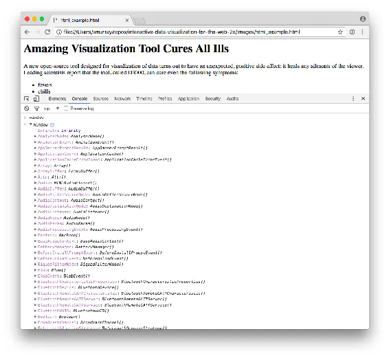
<h6 class="calibre37"><span class="keep-together">Figure 3-10.
</span>The global namespace</h6>
</div>
</figure>

`window` is the topmost object in the browser’s hierarchy of JavaScript
elements, and all of these objects and values you see beneath `window`
exist at the *global* level. What this means is that every time you
declare a new variable, you are adding a new value to `window`. Or, as
righteous JavaScript coders like to say, you are polluting the global
<span class="keep-together">namespace</span>. (Surprisingly, most people
who write things like this in online forums are actually quite friendly
in person.)

For example, try typing this into the console:
**`var zebras = "amazing"`**.

Then type **`window`** again, and scroll all the way down to the bottom,
where you should now see `zebras`, as shown in
<a href="#ch03.xhtml_The_global_namespace_now_with_zebras"
class="calibre5 pcalibre pcalibre2 pcalibre3 pcalibre1"
data-type="xref">Figure 3-11</a>.

<figure class="calibre35">
<div id="ch03.xhtml_The_global_namespace_now_with_zebras"
class="figure">
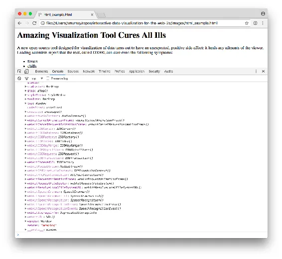
<h6 class="calibre37"><span class="keep-together">Figure 3-11.
</span>The global namespace, now with zebras</h6>
</div>
</figure>

What’s so wrong with adding values to `window`? As you get started,
nothing at all. But as your projects grow in complexity, and especially
if you begin to incorporate other non-D3 JavaScript code (such as
jQuery, Facebook “Like” buttons, or Google Analytics tracking code), at
some point you’re bound to run into a conflict because you’re using the
variable `zebras` for your project, but zebraTracker.js is *also* using
a variable with the same name! The result: chaos. Or at least some bad
data, which could lead to unexpected behavior or errors.

There are two easy workarounds (and, to clarify, you probably don’t have
to worry about this until later):

- Declare variables only within other functions. This is not usually
  feasible, but the function-level scope will prevent local variables
  from conflicting with others.

- Declare a single global object, and attach all of your would-be global
  variables to that object. For example:

``` calibre39
var Vis = {};  //Declare empty global object
Vis.zebras = "still pretty amazing";
Vis.monkeys = "too funny LOL";
Vis.fish = "you know, not bad";
```

All of your weird animal-related variables are no longer polluting the
global namespace, but instead they all exist as values stored within
your single, global object, `Vis`. Of course, `Vis` could be named
whatever you like, but `Menagerie` is harder to type. Regardless, the
only naming conflict you’ll have with other scripts is if one of them
*also* wants to have a global object with the same name (`Vis`), which
is far less likely.

<div class="calibre29" data-type="caution">

###### Caution

I recommend always using the `var` keyword when declaring a new
variable. It may surprise you to learn that it is actually possible to
*create* a new variable without *declaring* it, as in:

``` calibre63
sloths = "Lazy, or just slow-moving?"  //An undeclared variable
```

The problem is that *undeclared* variables are always global. Using the
`var` keyword constrains the variable to be accessible only within its
enclosing function, which is normally what you want and what you’d
expect.

If you, unlike `sloths`, make sure to always use `var`, then this will
never be a problem for you.

</div>

</div>

</div>

</div>

</div>

</div>

</div>

<div class="section calibre2" data-type="sect1" pdf-bookmark="SVG">

<div id="ch03.xhtml_SVG_3" class="dedication">

# SVG

D3 <span id="ch03.xhtml_idm140093205771376"
class="calibre5 pcalibre pcalibre2 pcalibre3 pcalibre1"
data-type="indexterm" primary="SVG (Scalable Vector Graphics)"
secondary="benefits of"></span>is most useful when used to generate and
manipulate visuals as Scalable Vector Graphics (SVG). Drawing with
`div`s and other native HTML elements is possible, but a bit clunky and
subject to the usual inconsistencies across different browsers. Using
SVG is more reliable, visually consistent, and faster.

<a href="#ch03.xhtml_A_small_SVG_circle"
class="calibre5 pcalibre pcalibre2 pcalibre3 pcalibre1"
data-type="xref">Figure 3-12</a> shows a small circle, and its SVG code
follows.

<figure class="calibre35">
<div id="ch03.xhtml_A_small_SVG_circle" class="figure">
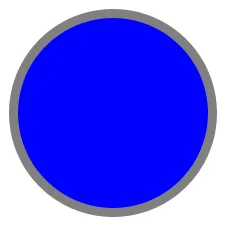
<h6 class="calibre37"><span class="keep-together">Figure 3-12. </span>A
small SVG circle with a stroke applied</h6>
</div>
</figure>

``` calibre39
<svg width="50" height="50">
    <circle cx="25" cy="25" r="22" fill="blue" stroke="gray" stroke-width="2"/>
</svg>
```

Vector drawing software like Adobe Illustrator, Inkscape, and Sketch can
be used to generate SVG files, but we need to learn how to generate them
with code.

<div class="section calibre2" data-type="sect2"
pdf-bookmark="The SVG Element">

<div id="ch03.xhtml_idm140093205613632" class="dedication">

## The SVG Element

SVG <span id="ch03.xhtml_idm140093205612224"
class="calibre5 pcalibre pcalibre2 pcalibre3 pcalibre1"
data-type="indexterm" primary="SVG (Scalable Vector Graphics)"
secondary="creating elements"></span><span id="ch03.xhtml_idm140093205662496"
class="calibre5 pcalibre pcalibre2 pcalibre3 pcalibre1"
data-type="indexterm"
primary="elements (SVG)"></span><span id="ch03.xhtml_idm140093205661824"
class="calibre5 pcalibre pcalibre2 pcalibre3 pcalibre1"
data-type="indexterm" primary="elements (SVG)"
see="also SVG (Scalable Vector Graphics)"></span>is a text-based image
format. Each SVG image is defined using markup code similar to HTML, and
SVG code can be included directly within any HTML document, or inserted
dynamically into the DOM. <a href="http://caniuse.com/#feat=svg"
class="calibre5 pcalibre pcalibre2 pcalibre3 pcalibre1">Every current
web browser</a> supports SVG. SVG is XML-based, so you’ll notice that
elements that don’t have a closing tag must be self-closing. For
example:

``` calibre39
<element></element> <!-- Uses closing tag -->
<element/>          <!-- Self-closing tag -->
```

Before you can draw anything, you must create an SVG element. Think of
the SVG element as a canvas on which your visuals are rendered. (In that
respect, SVG is conceptually similar to HTML’s `canvas` element. D3 can
also render to an HTML `canvas`, but this book addresses only SVG, the
most common visual output for D3.) At a minimum, it’s good to specify
`width` and `height` values. If you don’t specify these, the SVG will
behave like a typically greedy, block-level HTML element and take up as
much room as it can within its enclosing element:

``` calibre39
<svg width="500" height="50">
</svg>
```

Note <span id="ch03.xhtml_idm140093205644896"
class="calibre5 pcalibre pcalibre2 pcalibre3 pcalibre1"
data-type="indexterm"
primary="pixel-based coordinates system"></span>that *pixels* are the
default measurement units, so we can specify dimensions of `500` and
`50`, not `500px` and `50px`. We could have specified `px` explicitly,
or any number of other supported units, including `em`, `pt`, `in`,
`cm`, and `mm`.

</div>

</div>

<div class="section calibre2" data-type="sect2"
pdf-bookmark="Simple Shapes">

<div id="ch03.xhtml_idm140093205644640" class="dedication">

## Simple Shapes

You <span id="ch03.xhtml_idm140093205648656"
class="calibre5 pcalibre pcalibre2 pcalibre3 pcalibre1"
data-type="indexterm" primary="SVG (Scalable Vector Graphics)"
secondary="creating shapes"></span>can include a number of visual
elements between those `svg` tags, including `rect`, `circle`,
`ellipse`, `line`, `text`, and `path`. (Sorry, `zebras` is not valid in
this context.)

If you’re familiar with computer graphics programming, you’ll recognize
the usual pixel-based coordinates system in which `0,0` is the top-left
corner of the drawing space. Increasing x values move to the right,
while increasing y values move down (see
<a href="#ch03.xhtml_The_SVG_coordinates_system"
class="calibre5 pcalibre pcalibre2 pcalibre3 pcalibre1"
data-type="xref">Figure 3-13</a>).

<figure class="calibre35">
<div id="ch03.xhtml_The_SVG_coordinates_system" class="figure">
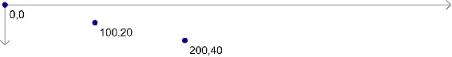
<h6 class="calibre37"><span class="keep-together">Figure 3-13.
</span>The SVG coordinates system</h6>
</div>
</figure>

`rect` draws a rectangle. Use `x` and `y` to specify the coordinates of
the upper-left corner, and `width` and `height` to specify the
dimensions. This rectangle fills the entire space of our SVG, as shown
in <a href="#ch03.xhtml_An_SVG_rect"
class="calibre5 pcalibre pcalibre2 pcalibre3 pcalibre1"
data-type="xref">Figure 3-14</a>.

``` calibre39
<rect x="0" y="0" width="500" height="50"/>
```

<figure class="calibre35">
<div id="ch03.xhtml_An_SVG_rect" class="figure">

<h6 class="calibre37"><span class="keep-together">Figure 3-14. </span>An
SVG rect</h6>
</div>
</figure>

`circle` draws a circle. Use `cx` and `cy` to specify the coordinates of
the *center*, and `r` to specify the radius. This circle is centered in
the middle of our 500-pixel-wide SVG because its `cx` (“center-x”) value
is 250 (see <a href="#ch03.xhtml_An_SVG_circle"
class="calibre5 pcalibre pcalibre2 pcalibre3 pcalibre1"
data-type="xref">Figure 3-15</a>).

``` calibre39
<circle cx="250" cy="25" r="25"/>
```

<figure class="calibre35">
<div id="ch03.xhtml_An_SVG_circle" class="figure">

<h6 class="calibre37"><span class="keep-together">Figure 3-15. </span>An
SVG circle</h6>
</div>
</figure>

`ellipse` is similar, but expects separate radius values for each axis.
Instead of `r`, use `rx` and `ry` to obtain the result shown in
<a href="#ch03.xhtml_An_SVG_ellipse"
class="calibre5 pcalibre pcalibre2 pcalibre3 pcalibre1"
data-type="xref">Figure 3-16</a>.

``` calibre39
<ellipse cx="250" cy="25" rx="100" ry="25"/>
```

<figure class="calibre35">
<div id="ch03.xhtml_An_SVG_ellipse" class="figure">

<h6 class="calibre37"><span class="keep-together">Figure 3-16. </span>An
SVG ellipse</h6>
</div>
</figure>

`line` draws a line, as shown in <a href="#ch03.xhtml_An_SVG_line"
class="calibre5 pcalibre pcalibre2 pcalibre3 pcalibre1"
data-type="xref">Figure 3-17</a>. Use `x1` and `y1` to specify the
coordinates of one end of the line, and `x2` and `y2` to specify the
coordinates of the other end. A `stroke` color must be specified for the
line to be visible:

``` calibre39
<line x1="0" y1="0" x2="500" y2="50" stroke="black"/>
```

<figure class="calibre35">
<div id="ch03.xhtml_An_SVG_line" class="figure">

<h6 class="calibre37"><span class="keep-together">Figure 3-17. </span>An
SVG line</h6>
</div>
</figure>

`text` renders text. Use `x` to specify the position of the left edge,
and `y` to specify the vertical position of the type’s *baseline*.
(Baseline is a typographical term for the invisible line on which the
letters appear to rest. Portions of letters such as “p” and “y” that
extend below the baseline are called descenders.) The result of the
following code is displayed in <a href="#ch03.xhtml_SVG_text"
class="calibre5 pcalibre pcalibre2 pcalibre3 pcalibre1"
data-type="xref">Figure 3-18</a>.

``` calibre39
<text x="250" y="25">Easy-peasy</text>
```

<figure class="calibre35">
<div id="ch03.xhtml_SVG_text" class="figure">

<h6 class="calibre37"><span class="keep-together">Figure 3-18.
</span>SVG text</h6>
</div>
</figure>

`text` will inherit the CSS-specified font styles of its parent element
unless specified otherwise. (More on styling text in a moment.) We could
override that formatting as follows and obtain the result shown in
<a href="#ch03.xhtml_More_SVG_text"
class="calibre5 pcalibre pcalibre2 pcalibre3 pcalibre1"
data-type="xref">Figure 3-19</a>.

``` calibre39
<text x="250" y="25" font-family="serif" font-size="25"
 fill="gray">Easy-peasy</text>
```

<figure class="calibre35">
<div id="ch03.xhtml_More_SVG_text" class="figure">

<h6 class="calibre37"><span class="keep-together">Figure 3-19.
</span>More SVG text</h6>
</div>
</figure>

Also note that when any visual element runs up against the edge of the
SVG, it will be clipped. Be careful when using `text` so your descenders
don’t get cut off (ouch!). You can see this happen in
<a href="#ch03.xhtml_Even_More_SVG_text"
class="calibre5 pcalibre pcalibre2 pcalibre3 pcalibre1"
data-type="xref">Figure 3-20</a> when we set the baseline (`y`) to 50,
the same as the height of our SVG:

``` calibre39
<text x="250" y="50" font-family="serif" font-size="25"
 fill="gray">Easy-peasy</text>
```

<figure class="calibre35">
<div id="ch03.xhtml_Even_More_SVG_text" class="figure">

<h6 class="calibre37"><span class="keep-together">Figure 3-20.
</span>Clipped SVG text</h6>
</div>
</figure>

`path` is for drawing anything more complex than the preceding shapes
(like country outlines for geomaps), and will be explained separately.
For now, we’ll work with simple shapes.

</div>

</div>

<div class="section calibre2" data-type="sect2"
pdf-bookmark="Styling SVG Elements">

<div id="ch03.xhtml_idm140093205649984" class="dedication">

## Styling SVG Elements

SVG’s <span id="ch03.xhtml_idm140093205388064"
class="calibre5 pcalibre pcalibre2 pcalibre3 pcalibre1"
data-type="indexterm" primary="SVG (Scalable Vector Graphics)"
secondary="applying styles to elements"></span>default style is a black
fill with no stroke. If you want anything else, you’ll have to apply
styles to your elements. Common SVG properties are as follows:

`fill`  
A color value. Just as with CSS, colors can be specified as named
colors, hex values, or RGB or RGBA values.

`stroke`  
A color value.

`stroke-width`  
A numeric measurement (typically in pixels).

`opacity`  
A numeric value between 0.0 (completely transparent) and 1.0 (completely
<span class="keep-together">opaque</span>).

With `text`, you can also use these properties, which work just like in
CSS:

- `font-family`

- `font-size`

In <span id="ch03.xhtml_idm140093205203008"
class="calibre5 pcalibre pcalibre2 pcalibre3 pcalibre1"
data-type="indexterm" primary="CSS (Cascading Style Sheets)"
secondary="styling SVG elements with"></span>another parallel to CSS,
there are two ways to apply styles to an SVG element: either directly
(inline) as an attribute of the element, or with a CSS style rule.

Here are some style properties applied directly to a `circle` as
attributes, with the result shown in
<a href="#ch03.xhtml_An_SVG_circle2"
class="calibre5 pcalibre pcalibre2 pcalibre3 pcalibre1"
data-type="xref">Figure 3-21</a>.

``` calibre39
<circle cx="25" cy="25" r="22"
 fill="yellow" stroke="orange" stroke-width="5"/>
```

<figure class="calibre35">
<div id="ch03.xhtml_An_SVG_circle2" class="figure">

<h6 class="calibre37"><span class="keep-together">Figure 3-21. </span>An
SVG circle with style properties applied</h6>
</div>
</figure>

Alternatively, we could strip the style attributes and assign the
`circle` a class (just as if it were a normal HTML element):

``` calibre39
<circle cx="25" cy="25" r="22" class="pumpkin"/>
```

and then put the `fill`, `stroke`, and `stroke-width` rules into a CSS
style that targets the new class:

``` calibre39
.pumpkin {
    fill: yellow;
    stroke: orange;
    stroke-width: 5;
 }
```

The CSS approach has a few obvious benefits:

- You can specify a style once and have it applied to multiple elements.

- CSS code is easier to read than inline attributes.

- For those reasons, the CSS approach might be more maintainable and
  make design changes faster to implement.

Using CSS to apply SVG styles, however, can be disconcerting for some.
`fill`, `stroke`, and `stroke-width`, after all, are *not* CSS
properties. (The nearest CSS equivalents are `background-color` and
`border`.) It’s just that we are using CSS selectors to apply
SVG-specific properties. If it helps you remember which rules in your
stylesheet are SVG-specific, consider including `svg` in those
selectors:

``` calibre39
svg .pumpkin {
    /* ... */
 }
```

</div>

</div>

<div class="section calibre2" data-type="sect2"
pdf-bookmark="Layering and Drawing Order">

<div id="ch03.xhtml_idm140093205389168" class="dedication">

## Layering and Drawing Order

There <span id="ch03.xhtml_idm140093205268384"
class="calibre5 pcalibre pcalibre2 pcalibre3 pcalibre1"
data-type="indexterm" primary="SVG (Scalable Vector Graphics)"
secondary="layering and drawing order"></span><span id="ch03.xhtml_idm140093205267440"
class="calibre5 pcalibre pcalibre2 pcalibre3 pcalibre1"
data-type="indexterm"
primary="drawing order, in SVG"></span><span id="ch03.xhtml_idm140093205266768"
class="calibre5 pcalibre pcalibre2 pcalibre3 pcalibre1"
data-type="indexterm" primary="layering, in SVG"></span>are no “layers”
in SVG and no real concept of depth. SVG does not support CSS’s
`z-index` property, so shapes can be arranged only within the
two-dimensional x/y plane.

And yet, if we draw multiple shapes, they overlap:

``` calibre39
<rect x="0" y="0" width="30" height="30" fill="purple"/>
<rect x="20" y="5" width="30" height="30" fill="blue"/>
<rect x="40" y="10" width="30" height="30" fill="green"/>
<rect x="60" y="15" width="30" height="30" fill="yellow"/>
<rect x="80" y="20" width="30" height="30" fill="red"/>
```

The <span id="ch03.xhtml_idm140093205263376"
class="calibre5 pcalibre pcalibre2 pcalibre3 pcalibre1"
data-type="indexterm" primary="SVG (Scalable Vector Graphics)"
secondary="drawing overlapping shapes"></span><span id="ch03.xhtml_idm140093205262528"
class="calibre5 pcalibre pcalibre2 pcalibre3 pcalibre1"
data-type="indexterm" primary="drawing"
secondary="SVG overlapping shapes"></span>order in which elements are
coded determines their depth order. In
<a href="#ch03.xhtml_Overlapping_SVG_elements"
class="calibre5 pcalibre pcalibre2 pcalibre3 pcalibre1"
data-type="xref">Figure 3-22</a>, the purple square appears first in the
code, so it is rendered first. Then, the blue square is rendered “on
top” of the purple one, then the green square on top of that, and so on.

<figure class="calibre35">
<div id="ch03.xhtml_Overlapping_SVG_elements" class="figure">
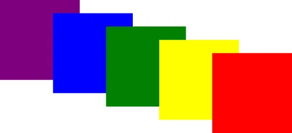
<h6 class="calibre37"><span class="keep-together">Figure 3-22.
</span>Overlapping SVG elements</h6>
</div>
</figure>

Think of SVG shapes as being rendered like paint on a canvas. The
pixel-paint that is applied later obscures any earlier paint, and thus
appears to be “in front.”

This aspect of drawing order becomes important when you have some visual
elements that should not be obscured by others. For example, you might
have axes or value labels that appear on a scatterplot. The axes and
labels should be added to the SVG last, so they appear in front of any
other elements.

</div>

</div>

<div class="section calibre2" data-type="sect2"
pdf-bookmark="Transparency">

<div id="ch03.xhtml_idm140093205045088" class="dedication">

## Transparency

Transparency <span id="ch03.xhtml_idm140093205043488"
class="calibre5 pcalibre pcalibre2 pcalibre3 pcalibre1"
data-type="indexterm" primary="SVG (Scalable Vector Graphics)"
secondary="applying transparency"></span><span id="ch03.xhtml_idm140093205042512"
class="calibre5 pcalibre pcalibre2 pcalibre3 pcalibre1"
data-type="indexterm" primary="transparency"></span>can be useful when
elements in your visualization overlap but must remain visible, or you
want to deemphasize some elements while highlighting others, as shown in
<a href="#ch03.xhtml_RGBA_SVG_shapes"
class="calibre5 pcalibre pcalibre2 pcalibre3 pcalibre1"
data-type="xref">Figure 3-23</a>.

There are two ways to apply transparency: use an RGB color with alpha,
or set an `opacity` value.

You can use `rgba()` anywhere you specify a color, such as with `fill`
or `stroke`. `rgba()` expects three values between 0 and 255 for red,
green, and blue, plus an alpha (transparency) value between 0.0 and 1.0:

``` calibre39
<circle cx="25" cy="25" r="20" fill="rgba(128, 0, 128, 1.0)"/>
<circle cx="50" cy="25" r="20" fill="rgba(0, 0, 255, 0.75)"/>
<circle cx="75" cy="25" r="20" fill="rgba(0, 255, 0, 0.5)"/>
<circle cx="100" cy="25" r="20" fill="rgba(255, 255, 0, 0.25)"/>
<circle cx="125" cy="25" r="20" fill="rgba(255, 0, 0, 0.1)"/>
```

<figure class="calibre35">
<div id="ch03.xhtml_RGBA_SVG_shapes" class="figure">
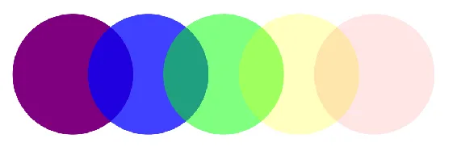
<h6 class="calibre37"><span class="keep-together">Figure 3-23.
</span>RGBA SVG shapes</h6>
</div>
</figure>

Note that with `rgba()`, transparency is applied to the `fill` and
`stroke` colors independently. The following circles’ `fill` is 75
percent opaque, and their `stroke`s are only 25 percent opaque:

``` calibre39
<circle cx="25" cy="25" r="20" fill="rgba(128, 0, 128, 0.75)"
        stroke="rgba(0, 255, 0, 0.25)" stroke-width="10"/>
<circle cx="75" cy="25" r="20" fill="rgba(0, 255, 0, 0.75)"
        stroke="rgba(0, 0, 255, 0.25)" stroke-width="10"/>
<circle cx="125" cy="25" r="20" fill="rgba(255, 255, 0, 0.75)"
        stroke="rgba(255, 0, 0, 0.25)" stroke-width="10"/>
```

With this transparency applied, and the result shown in
<a href="#ch03.xhtml_More_RGBA_SVG_shapes"
class="calibre5 pcalibre pcalibre2 pcalibre3 pcalibre1"
data-type="xref">Figure 3-24</a>, we can see that strokes are aligned to
the center of each shape’s edge. That is, the stroke is neither fully
inside nor outside the object, but is both half in and half out. As a
result of this transparency, these individual `10px` strokes look more
like two separate `5px` strokes.

<figure class="calibre35">
<div id="ch03.xhtml_More_RGBA_SVG_shapes" class="figure">
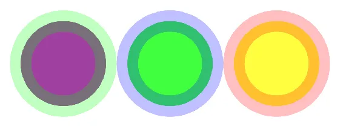
<h6 class="calibre37"><span class="keep-together">Figure 3-24.
</span>More RGBA SVG shapes</h6>
</div>
</figure>

To apply transparency to an entire element, set an `opacity` attribute.
<a href="#ch03.xhtml_Opaque_circles"
class="calibre5 pcalibre pcalibre2 pcalibre3 pcalibre1"
data-type="xref">Figure 3-25</a> illustrates some completely opaque
circles.

<figure class="calibre35">
<div id="ch03.xhtml_Opaque_circles" class="figure">
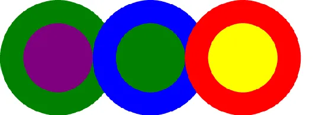
<h6 class="calibre37"><span class="keep-together">Figure 3-25.
</span>Opaque circles</h6>
</div>
</figure>

<a href="#ch03.xhtml_Semiopaque_circles"
class="calibre5 pcalibre pcalibre2 pcalibre3 pcalibre1"
data-type="xref">Figure 3-26</a> shows the same circles, with `opacity`
values:

``` calibre39
<circle cx="25" cy="25" r="20" fill="purple" stroke="green" stroke-width="10"
        opacity="0.9"/>
<circle cx="65" cy="25" r="20" fill="green" stroke="blue" stroke-width="10"
        opacity="0.5"/>
<circle cx="105" cy="25" r="20" fill="yellow" stroke="red" stroke-width="10"
        opacity="0.1"/>
```

<figure class="calibre35">
<div id="ch03.xhtml_Semiopaque_circles" class="figure">
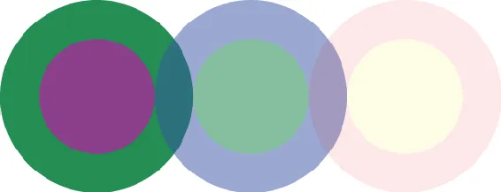
<h6 class="calibre37"><span class="keep-together">Figure 3-26.
</span>Semiopaque circles</h6>
</div>
</figure>

You can employ `opacity` on an element that also has colors set with
`rgba()`. When you do so, the transparencies are multiplied. The circles
in <a href="#ch03.xhtml_More_opaque_circles"
class="calibre5 pcalibre pcalibre2 pcalibre3 pcalibre1"
data-type="xref">Figure 3-27</a> use the same RGBA values for `fill` and
`stroke`. The first circle has no element `opacity` set, but the other
two do:

``` calibre39
<circle cx="25" cy="25" r="20" fill="rgba(128, 0, 128, 0.75)"
        stroke="rgba(0, 255, 0, 0.25)" stroke-width="10"/>
<circle cx="65" cy="25" r="20" fill="rgba(128, 0, 128, 0.75)"
        stroke="rgba(0, 255, 0, 0.25)" stroke-width="10" opacity="0.5"/>
<circle cx="105" cy="25" r="20" fill="rgba(128, 0, 128, 0.75)"
        stroke="rgba(0, 255, 0, 0.25)" stroke-width="10" opacity="0.2"/>
```

<figure class="calibre35">
<div id="ch03.xhtml_More_opaque_circles" class="figure">
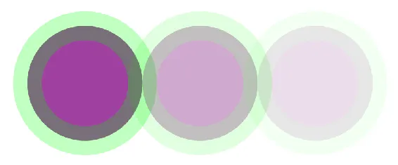
<h6 class="calibre37"><span class="keep-together">Figure 3-27.
</span>More opaque circles</h6>
</div>
</figure>

Notice how the third circle’s `opacity` is `0.2`, or 20 percent. Yet its
purple fill already has an alpha value of `0.75`, or 75 percent. The
purple area, then, has a final transparency of 0.2 times 0.75 = 0.15, or
15 percent.

</div>

</div>

</div>

</div>

<div class="section calibre2" data-type="sect1"
pdf-bookmark="A Note on Compatibility">

<div id="ch03.xhtml_idm140093205772768" class="dedication">

# A Note on Compatibility

*Really* <span id="ch03.xhtml_idm140093204734480"
class="calibre5 pcalibre pcalibre2 pcalibre3 pcalibre1"
data-type="indexterm"
primary="Internet Explorer"></span><span id="ch03.xhtml_idm140093204733744"
class="calibre5 pcalibre pcalibre2 pcalibre3 pcalibre1"
data-type="indexterm" primary="SVG (Scalable Vector Graphics)"
secondary="browser compatibility"></span><span id="ch03.xhtml_idm140093204732784"
class="calibre5 pcalibre pcalibre2 pcalibre3 pcalibre1"
data-type="indexterm" primary="browsers"
secondary="SVG compatibility"></span>old browsers—such as Internet
Explorer version 8—don’t support SVG. If, for some reason, your project
needs to reach an audience using such outdated tools, your best bet is
to encourage people to upgrade to a current web browser. There are hacks
to get D3 to work with these older browsers, but I don’t recommend them.
Consider some of the alternative tools mentioned in
<a href="#ch02.xhtml_introducing_d3"
class="calibre5 pcalibre pcalibre2 pcalibre3 pcalibre1"
data-type="xref">Chapter 2</a>.

That said, it’s polite to notify users of older browsers why your
visualization isn’t working. I recommend using
<a href="http://modernizr.com"
class="calibre5 pcalibre pcalibre2 pcalibre3 pcalibre1">Modernizr</a> or
a similar JavaScript tool to detect whether or not the browser supports
SVG. If it does, then you can load your D3 code and proceed as normal.
If SVG is *not* supported, then you can display a static, noninteractive
version of your visualization alongside a message explaining that a
current browser is needed. (Be nice and provide links to the
<a href="http://www.google.com/chrome"
class="calibre5 pcalibre pcalibre2 pcalibre3 pcalibre1">Chrome</a> and
<a href="http://www.mozilla.org/en-US/firefox/new/"
class="calibre5 pcalibre pcalibre2 pcalibre3 pcalibre1">Firefox</a>
download pages. <a href="http://www.apple.com/safari/"
class="calibre5 pcalibre pcalibre2 pcalibre3 pcalibre1">Safari</a> is
distributed as part of Mac OS, and is no longer available as a separate
download.)

For reference, *caniuse.com* is a fantastic resource for supported
browser features. See their list of
<a href="http://caniuse.com/#search=svg"
class="calibre5 pcalibre pcalibre2 pcalibre3 pcalibre1">browsers with
SVG support</a>.

</div>

</div>

</div>

</div>

<span id="ch04.xhtml"></span>

<div id="ch04.xhtml_sbo-rt-content" class="calibre1">

<div id="ch04.xhtml_setup-chapter4" class="dedication">

