# <span class="keep-together">Chapter 5. </span>Data

*Data* is an extremely broad term, only slightly less vague than the
nearly all-encompassing *information*. What is data? (What *isn’t*
data?) What kinds of data are there, and what can we use with D3?

Broadly <span id="ch05.xhtml_idm140093204553920"
class="calibre5 pcalibre pcalibre2 pcalibre3 pcalibre1"
data-type="indexterm" primary="data"
secondary="definition of term"></span>speaking, data is structured
information with potential for meaning.

In <span id="ch05.xhtml_idm140093204552320"
class="calibre5 pcalibre pcalibre2 pcalibre3 pcalibre1"
data-type="indexterm" primary="data"
secondary="storage forms"></span>the context of programming for
visualization, data is stored in a digital file, typically in either
text or binary form. Of course, potentially every piece of digital
ephemera may be considered “data”—not just text, but bits and bytes
representing images, audio, video, databases, streams, models, archives,
and anything else.

Within <span id="ch05.xhtml_idm140093204550224"
class="calibre5 pcalibre pcalibre2 pcalibre3 pcalibre1"
data-type="indexterm" primary="text-based data"
seealso="data"></span><span id="ch05.xhtml_idm140093204549216"
class="calibre5 pcalibre pcalibre2 pcalibre3 pcalibre1"
data-type="indexterm" primary=".txt  (plain text files)"
primary-sortas="txt  (plain text files)"></span><span id="ch05.xhtml_idm140093204548304"
class="calibre5 pcalibre pcalibre2 pcalibre3 pcalibre1"
data-type="indexterm" primary="data"
secondary="supported file types"></span><span id="ch05.xhtml_idm140093204547360"
class="calibre5 pcalibre pcalibre2 pcalibre3 pcalibre1"
data-type="indexterm"
primary="JSON (JavaScript Object Notation)"></span><span id="ch05.xhtml_idm140093204546720"
class="calibre5 pcalibre pcalibre2 pcalibre3 pcalibre1"
data-type="indexterm"
primary="CSV (comma-separated value files)"></span>the scope of D3 and
browser-based visualization, however, we will limit ourselves to
*text-based data*—that is, anything that can be represented as numbers
and strings of alpha characters. If you can get your data into a *.txt*
plain-text file, a *.csv* comma-separated value file, or a *.json* JSON
document, then you can use it with D3.

Whatever your data, it can’t be made useful and visual until it is
*attached* to something. In D3 lingo, the data must be *bound* to
elements within the page. Let’s address how to create new page elements
first. Then attaching data to those elements will be a cinch.

<div class="section calibre2" data-type="sect1"
pdf-bookmark="Generating Page Elements">

<div id="ch05.xhtml_idm140093204542448" class="dedication">

# Generating Page Elements

Typically, <span id="ch05.xhtml_Dpage05"
class="calibre5 pcalibre pcalibre2 pcalibre3 pcalibre1"
data-type="indexterm" primary="data"
secondary="generating page elements for"></span><span id="ch05.xhtml_Egener05"
class="calibre5 pcalibre pcalibre2 pcalibre3 pcalibre1"
data-type="indexterm" primary="elements"
secondary="generating page elements"></span><span id="ch05.xhtml_PEgener05"
class="calibre5 pcalibre pcalibre2 pcalibre3 pcalibre1"
data-type="indexterm" primary="page elements"
secondary="generating"></span>when using D3 to generate new DOM
elements, the new elements will be circles, rectangles, or other visual
forms that represent your data. <span id="ch05.xhtml_idm140093204536352"
class="calibre5 pcalibre pcalibre2 pcalibre3 pcalibre1"
data-type="indexterm" primary="paragraph elements"></span>But to avoid
confusing matters, we’ll start with a simple example and create a lowly
`p` paragraph element.

Begin by creating a new document with our simple HTML template from the
last chapter. You can find it in the sample code files as
*01_empty_page_template.html*, and it looks like the following code.
(Eagle-eyed viewers will notice that I’ve modified the `src` path here
to work with the directory structure of the code samples. If that
doesn’t mean anything to you, don’t worry about it.)

``` calibre39
<!DOCTYPE html>
<html lang="en">
    <head>
        <meta charset="utf-8">
        <title>D3 Page Template</title>
        <script type="text/javascript" src="../d3.js"></script>
    </head>
    <body>
        <script type="text/javascript">
            // Your beautiful D3 code will go here
        </script>
    </body>
</html>
```

Open that page in your web browser. Make sure you’re accessing the page
via your local web server, as we discussed in
<a href="#ch04.xhtml_setup-chapter4"
class="calibre5 pcalibre pcalibre2 pcalibre3 pcalibre1"
data-type="xref">Chapter 4</a>. So the URL in your browser’s location
bar should look something like this:

``` calibre39
http://localhost:8888/d3-book/chapter_05/01_empty_page_template.html
```

If not viewed through a web server, the URL path will start with
*file:///* instead of *http://*. Confirm that the URL does *not* look
like this:

``` calibre39
file:///…/d3-book/chapter_05/01_empty_page_template.html
```

Once you’re viewing the page, pop open the web inspector. (As a
reminder, see <a href="#ch03.xhtml_developer_tools_3"
class="calibre5 pcalibre pcalibre2 pcalibre3 pcalibre1"
data-type="xref">“Developer Tools”</a> on how to do that.) You should
see an empty web page, with the DOM contents shown in
<a href="#ch05.xhtml_Web_inspector"
class="calibre5 pcalibre pcalibre2 pcalibre3 pcalibre1"
data-type="xref">Figure 5-1</a>.

<figure class="calibre35">
<div id="ch05.xhtml_Web_inspector" class="figure">
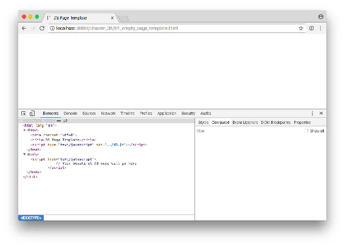
<h6 class="calibre37"><span class="keep-together">Figure 5-1. </span>Web
inspector</h6>
</div>
</figure>

<div class="dedication">

</div>

Back in your text editor, replace the comment between the `script` tags
with:

``` calibre39
d3.select("body").append("p").text("New paragraph!");
```

Save and refresh, and voilà! There is text in the formerly empty browser
window, and the web inspector will look like
<a href="#ch05.xhtml_Web_inspector_again"
class="calibre5 pcalibre pcalibre2 pcalibre3 pcalibre1"
data-type="xref">Figure 5-2</a>.

<figure class="calibre35">
<div id="ch05.xhtml_Web_inspector_again" class="figure">
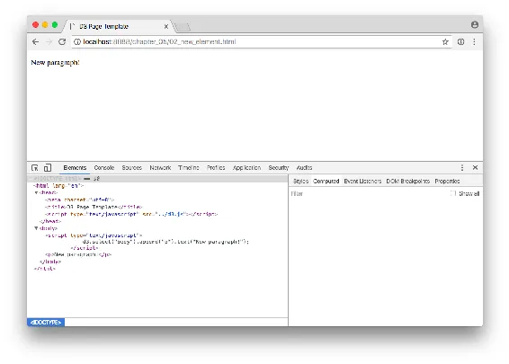
<h6 class="calibre37"><span class="keep-together">Figure 5-2. </span>Web
inspector, reflecting the modified DOM</h6>
</div>
</figure>

See the difference? Now in the DOM, there is a new paragraph element
that was generated on the fly! This might not be exciting yet, but you
will soon use a similar technique to dynamically generate tens or
hundreds of elements, each one corresponding to a piece of your dataset.

Let’s walk through what just happened. (You can follow along with
*02_new_element.html*.) To understand that first line of D3 code, you
must first meet your new best friend, *chain syntax*.

<div class="section calibre2" data-type="sect2"
pdf-bookmark="Chaining Methods">

<div id="ch05.xhtml_idm140093204482160" class="dedication">

## Chaining Methods

D3 <span id="ch05.xhtml_idm140093204480560"
class="calibre5 pcalibre pcalibre2 pcalibre3 pcalibre1"
data-type="indexterm" primary="page elements" secondary="generating"
tertiary="chaining methods"></span><span id="ch05.xhtml_idm140093204479280"
class="calibre5 pcalibre pcalibre2 pcalibre3 pcalibre1"
data-type="indexterm" primary="chaining methods"
secondary="chain syntax"></span><span id="ch05.xhtml_idm140093204478336"
class="calibre5 pcalibre pcalibre2 pcalibre3 pcalibre1"
data-type="indexterm" primary="jQuery"
secondary="chain syntax"></span>smartly employs a technique called
*chain syntax*, which you might recognize from jQuery. By “chaining”
methods together with periods, you can perform several actions in a
single line of code. It can be fast and easy, but it’s important to
understand how it works, to save yourself hours of debugging headaches
later.

By <span id="ch05.xhtml_idm140093204476176"
class="calibre5 pcalibre pcalibre2 pcalibre3 pcalibre1"
data-type="indexterm" primary="functions" secondary="vs. methods"
secondary-sortas="methods"></span><span id="ch05.xhtml_idm140093204463424"
class="calibre5 pcalibre pcalibre2 pcalibre3 pcalibre1"
data-type="indexterm" primary="methods"
secondary="vs. functions"></span>the way, *functions* and *methods* are
just two different words for the same concept: a chunk of code that
accepts an argument as input, performs some action, and returns some
other information as output.

The following code:

``` calibre39
d3.select("body").append("p").text("New paragraph!");
```

might look like a big mess, especially if you’re new to programming.
<span id="ch05.xhtml_idm140093204454720"
class="calibre5 pcalibre pcalibre2 pcalibre3 pcalibre1"
data-type="indexterm" primary="coding tips"
secondary="increasing legibility"></span>So the first thing to know is
that JavaScript, like HTML, doesn’t care about whitespace and line
breaks, so you can put each method on its own line for legibility:

``` calibre39
d3.select("body")
    .append("p")
    .text("New paragraph!");
```

Both I and your optometrist highly recommend putting each method on its
own indented line. But programmers have their own coding style; use
whatever indents, line breaks, and whitespace (tabs or spaces) are most
legible for you.

</div>

</div>

<div class="section calibre2" data-type="sect2"
pdf-bookmark="One Link at a Time">

<div id="ch05.xhtml_idm140093204424896" class="dedication">

## One Link at a Time

Let’s <span id="ch05.xhtml_idm140093204423728"
class="calibre5 pcalibre pcalibre2 pcalibre3 pcalibre1"
data-type="indexterm" primary="page elements" secondary="generating"
tertiary="code deconstruction"></span><span id="ch05.xhtml_idm140093204422448"
class="calibre5 pcalibre pcalibre2 pcalibre3 pcalibre1"
data-type="indexterm" primary="coding tips"
secondary="deconstructing code"></span><span id="ch05.xhtml_idm140093204436688"
class="calibre5 pcalibre pcalibre2 pcalibre3 pcalibre1"
data-type="indexterm" primary="chaining methods"
secondary="examining the links"></span>deconstruct each link in this
chain of code:

`d3`  
References the D3 object, so we can access its methods. Our D3 adventure
begins here.

`.select("body")`  
<span id="ch05.xhtml_idm140093204432320"
class="calibre5 pcalibre pcalibre2 pcalibre3 pcalibre1"
data-type="indexterm" primary="d3.select()"></span>Give the
<a href="http://bit.ly/2t1FJhC"
class="calibre5 pcalibre pcalibre2 pcalibre3 pcalibre1"><code
class="calibre23">select()</code></a> method a
<span id="ch05.xhtml_idm140093204277136"
class="calibre5 pcalibre pcalibre2 pcalibre3 pcalibre1"
data-type="indexterm" primary="select()"></span>CSS selector as input,
and it will return a reference to the first element in the DOM that
matches. (Use <a href="http://bit.ly/2t1EJtU"
class="calibre5 pcalibre pcalibre2 pcalibre3 pcalibre1"><code
class="calibre23">selectAll()</code></a> when you need more than one
element.) In this case, we just want the `body` of the document, so a
reference to `body` is handed off to the next method in our chain.

`.append("p")`  
<a href="http://bit.ly/2t1EGye"
class="calibre5 pcalibre pcalibre2 pcalibre3 pcalibre1"><code
class="calibre23">append()</code></a> creates
<span id="ch05.xhtml_idm140093204272128"
class="calibre5 pcalibre pcalibre2 pcalibre3 pcalibre1"
data-type="indexterm" primary="append()"></span>whatever new DOM element
you specify and appends it to the end (but *just inside*) of whatever
selection it’s acting on. In our case, we want to create a new `p`
within the `body`. We specified `"p"` as the input argument, but this
method also sees the reference to `body` that was passed down the chain
from the `select()` method. So an empty `p` paragraph is *appended* to
the `body`. Finally, `append()` hands off a reference to the new element
it just created.

`.text("New paragraph!")`  
<a href="http://bit.ly/2t1FPpu"
class="calibre5 pcalibre pcalibre2 pcalibre3 pcalibre1"><code
class="calibre23">text()</code></a> takes a string
<span id="ch05.xhtml_idm140093204264912"
class="calibre5 pcalibre pcalibre2 pcalibre3 pcalibre1"
data-type="indexterm"
primary="text()"></span><span id="ch05.xhtml_idm140093204264208"
class="calibre5 pcalibre pcalibre2 pcalibre3 pcalibre1"
data-type="indexterm" primary="d3.text()"></span>and inserts it between
the opening and closing tags of the current selection. Because the
previous method passed down a reference to our new `p`, this code just
inserts the new text between `<p>` and `</p>`. (In cases where there is
existing content, it will be overwritten.)

`;`  
The all-important semicolon indicates the end of this line of code.
Chain over.

</div>

</div>

<div class="section calibre2" data-type="sect2"
pdf-bookmark="The Handoff">

<div id="ch05.xhtml_idm140093204260432" class="dedication">

## The Handoff

Many, but not all, D3 methods return a selection (actually, a reference
to a selection), which enables this handy technique of method chaining.
Typically, a method returns a reference to the element that it just
acted on, but not always.

So <span id="ch05.xhtml_idm140093204258432"
class="calibre5 pcalibre pcalibre2 pcalibre3 pcalibre1"
data-type="indexterm" primary="chaining methods"
secondary="input/output matching"></span><span id="ch05.xhtml_idm140093204257424"
class="calibre5 pcalibre pcalibre2 pcalibre3 pcalibre1"
data-type="indexterm" primary="coding tips"
secondary="chaining methods"></span><span id="ch05.xhtml_idm140093204256480"
class="calibre5 pcalibre pcalibre2 pcalibre3 pcalibre1"
data-type="indexterm" primary="page elements" secondary="generating"
tertiary="input/output matching"></span>remember this: when you’re
chaining methods, order matters. The output type of one method has to
match the input type expected by the next method in the chain. If
adjacent inputs and outputs are mismatched, the handoff will function
more like a dropped baton in a middle-school relay race.

When sussing out what each function expects and returns,
<a href="https://github.com/d3/d3/blob/master/API.md"
class="calibre5 pcalibre pcalibre2 pcalibre3 pcalibre1">the API
reference</a> is your friend. It contains detailed information on each
method, including whether or not it returns a selection.

</div>

</div>

<div class="section calibre2" data-type="sect2"
pdf-bookmark="Going Chainless">

<div id="ch05.xhtml_idm140093204253280" class="dedication">

## Going Chainless

Our <span id="ch05.xhtml_idm140093204251712"
class="calibre5 pcalibre pcalibre2 pcalibre3 pcalibre1"
data-type="indexterm" primary="chaining methods"
secondary="alternatives to"></span><span id="ch05.xhtml_idm140093204250704"
class="calibre5 pcalibre pcalibre2 pcalibre3 pcalibre1"
data-type="indexterm" primary="page elements" secondary="generating"
tertiary="alternatives to chaining"></span>sample code could be
rewritten without chain syntax:

``` calibre39
var body = d3.select("body");
var p = body.append("p");
p.text("New paragraph!");
```

Ugh! What a mess. Yet there will be times you need to break the chain,
such as when you are calling so many functions that it doesn’t make
sense to string them all together. Or because you want to organize your
code in a way that makes more sense to you.

Now that you know how to generate new page elements with D3, it’s time
to attach data to them.<span id="ch05.xhtml_idm140093204333680"
class="calibre5 pcalibre pcalibre2 pcalibre3 pcalibre1"
data-type="indexterm" primary=""
startref="Dpage05"></span><span id="ch05.xhtml_idm140093204332800"
class="calibre5 pcalibre pcalibre2 pcalibre3 pcalibre1"
data-type="indexterm" primary=""
startref="Egener05"></span><span id="ch05.xhtml_idm140093204331856"
class="calibre5 pcalibre pcalibre2 pcalibre3 pcalibre1"
data-type="indexterm" primary="" startref="PEgener05"></span>

</div>

</div>

</div>

</div>

<div class="section calibre2" data-type="sect1"
pdf-bookmark="Binding Data">

<div id="ch05.xhtml_idm140093204541504" class="dedication">

# Binding Data

What <span id="ch05.xhtml_Dbind05"
class="calibre5 pcalibre pcalibre2 pcalibre3 pcalibre1"
data-type="indexterm" primary="data"
secondary="binding to elements"></span><span id="ch05.xhtml_PEbind05"
class="calibre5 pcalibre pcalibre2 pcalibre3 pcalibre1"
data-type="indexterm" primary="page elements"
secondary="binding data to"></span>is binding, and why would I want to
do it to my data?

Data <span id="ch05.xhtml_DMbind05"
class="calibre5 pcalibre pcalibre2 pcalibre3 pcalibre1"
data-type="indexterm" primary="data mapping"
secondary="binding data for"></span><span id="ch05.xhtml_idm140093204325264"
class="calibre5 pcalibre pcalibre2 pcalibre3 pcalibre1"
data-type="indexterm" primary="mapping data"></span>visualization is a
process of *mapping* data to visuals. Data in, visual properties out.
Maybe bigger numbers make taller bars, or special categories trigger
brighter colors. The mapping rules are up to you.

With <span id="ch05.xhtml_idm140093204323472"
class="calibre5 pcalibre pcalibre2 pcalibre3 pcalibre1"
data-type="indexterm" primary="data binding"
secondary="purpose of"></span><span id="ch05.xhtml_idm140093204322464"
class="calibre5 pcalibre pcalibre2 pcalibre3 pcalibre1"
data-type="indexterm" primary="page elements"
secondary="binding data to" tertiary="purpose of"></span>D3, we *bind*
our data input values to elements in the DOM. Binding is like
“attaching” or associating data to specific elements, so that later you
can reference those values to apply mapping rules. Without the binding
step, we have a bunch of data-less, unmappable DOM elements. No one
wants that.

<div class="section calibre2" data-type="sect2"
pdf-bookmark="In a Bind">

<div id="ch05.xhtml_idm140093204320272" class="dedication">

## In a Bind

We <span id="ch05.xhtml_idm140093204318944"
class="calibre5 pcalibre pcalibre2 pcalibre3 pcalibre1"
data-type="indexterm"
primary="data()"></span><span id="ch05.xhtml_idm140093204318208"
class="calibre5 pcalibre pcalibre2 pcalibre3 pcalibre1"
data-type="indexterm" primary="data binding"
secondary="data() method"></span><span id="ch05.xhtml_idm140093204317264"
class="calibre5 pcalibre pcalibre2 pcalibre3 pcalibre1"
data-type="indexterm" primary="page elements"
secondary="binding data to" tertiary="data() method"></span>use D3’s
<a href="http://bit.ly/2t1qkOe"
class="calibre5 pcalibre pcalibre2 pcalibre3 pcalibre1"><code
class="calibre23">data()</code></a> method to bind data to DOM elements.
But there are two things we need in place first, before we can bind
data:

- The data

- A selection of DOM elements

Let’s tackle these one at a time.

</div>

</div>

<div class="section calibre2" data-type="sect2" pdf-bookmark="Data">

<div id="ch05.xhtml_idm140093204312096" class="dedication">

## Data

D3 is <span id="ch05.xhtml_idm140093204310528"
class="calibre5 pcalibre pcalibre2 pcalibre3 pcalibre1"
data-type="indexterm" primary="data"
secondary="supported file types"></span><span id="ch05.xhtml_idm140093204309520"
class="calibre5 pcalibre pcalibre2 pcalibre3 pcalibre1"
data-type="indexterm"
primary="arrays"></span><span id="ch05.xhtml_idm140093204308848"
class="calibre5 pcalibre pcalibre2 pcalibre3 pcalibre1"
data-type="indexterm"
primary="CSV (comma-separated value files)"></span>smart about handling
different kinds of data, so it will accept practically any array of
numbers, strings, or objects (themselves containing other arrays or
key/value pairs). It can handle JSON (and GeoJSON) gracefully, and even
has a built-in method to help you load in CSV files.

But to keep things simple, for now we will start with a boring array of
five numbers. Here is our sample dataset:

``` calibre39
var dataset = [ 5, 10, 15, 20, 25 ];
```

If you’re feeling adventurous, or already have some data in CSV or JSON
format that you want to play with, we’ll see how to do that now.
Otherwise, just skip ahead to
<a href="#ch05.xhtml_please_make_your_selection_5"
class="calibre5 pcalibre pcalibre2 pcalibre3 pcalibre1"
data-type="xref">“Please Make Your Selection”</a>.

<div class="section calibre2" data-type="sect3"
pdf-bookmark="Loading CSV data">

<div id="ch05.xhtml_idm140093204220432" class="dedication">

### Loading CSV data

CSV <span id="ch05.xhtml_idm140093204218544"
class="calibre5 pcalibre pcalibre2 pcalibre3 pcalibre1"
data-type="indexterm" primary="data binding"
secondary="CSV files"></span><span id="ch05.xhtml_idm140093204147408"
class="calibre5 pcalibre pcalibre2 pcalibre3 pcalibre1"
data-type="indexterm" primary="page elements"
secondary="binding data to" tertiary="CSV files"></span>stands for
comma-separated values. A CSV datafile might look something like this:

``` calibre39
Food,Deliciousness
Apples,9
Green Beans,5
Egg Salad Sandwich,4
Cookies,10
Liver,0.2
Burrito,7
```

Each line in the file has the same number of values (two, in this case),
and values are separated by a comma. The first line in the file often
serves as a header, providing names for each of the “columns” of data.

If you have data in an Excel file, it probably follows a similar
structure of rows and columns. To get that data into D3, open it in
Excel, then choose “Save as…” and select CSV as the file type.

If <span id="ch05.xhtml_idm140093204143584"
class="calibre5 pcalibre pcalibre2 pcalibre3 pcalibre1"
data-type="indexterm" primary="d3.csv()"></span>we saved the preceding
CSV data into a file called *food.csv*, then we could load the file into
D3 by using the `d3.csv()` method:

``` calibre39
d3.csv("food.csv", function(data) {
    console.log(data);
});
```

`csv()` takes two arguments: a string representing the path of the CSV
file to load in, and an anonymous function to be used as
<span id="ch05.xhtml_idm140093204114816"
class="calibre5 pcalibre pcalibre2 pcalibre3 pcalibre1"
data-type="indexterm"
primary="callback functions"></span><span id="ch05.xhtml_idm140093204114208"
class="calibre5 pcalibre pcalibre2 pcalibre3 pcalibre1"
data-type="indexterm" primary="functions"
secondary="callback function"></span>a *callback function*. The callback
function is “called” only *after* the CSV file has been loaded into
memory. So you can be sure that, by the time the callback is called,
`d3.csv()` is done executing.

When called, the anonymous function is handed the result of the CSV
loading and parsing process—that is, the data. Here I’m naming it
`data`, but this could be called whatever you like. You should use this
callback function to do all the things you can do only *after* the data
has been loaded. In the preceding example, we are just logging the value
of the `data` array to the console, to verify it, as shown in
<a href="#ch05.xhtml_Array_logged_to_console"
class="calibre5 pcalibre pcalibre2 pcalibre3 pcalibre1"
data-type="xref">Figure 5-3</a>. (See *03_csv_loading_example.html* in
the example code.)

<figure class="calibre35">
<div id="ch05.xhtml_Array_logged_to_console" class="figure">
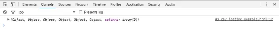
<h6 class="calibre37"><span class="keep-together">Figure 5-3.
</span>Array logged to console</h6>
</div>
</figure>

You <span id="ch05.xhtml_idm140093204130080"
class="calibre5 pcalibre pcalibre2 pcalibre3 pcalibre1"
data-type="indexterm" primary="data arrays"></span>can see that `data`
is an array (because of the hard brackets `[]` on either end) with six
elements, each of which is an object. By toggling the disclosure
triangles next to each object, we can see their values (see
<a href="#ch05.xhtml_Array_elements_expanded"
class="calibre5 pcalibre pcalibre2 pcalibre3 pcalibre1"
data-type="xref">Figure 5-4</a>).

<figure class="calibre35">
<div id="ch05.xhtml_Array_elements_expanded" class="figure">
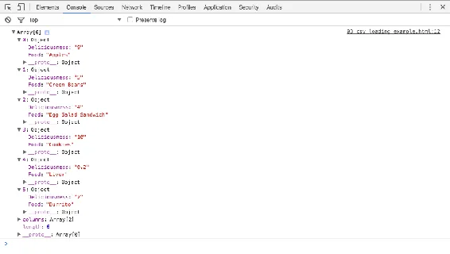
<h6 class="calibre37"><span class="keep-together">Figure 5-4.
</span>Array elements expanded</h6>
</div>
</figure>

Aha! Each object has both a `Food` property and a `Deliciousness`
property, the values of which correspond to the values in our CSV!
(There is also a third property, `__proto__`, but that has to do with
how JavaScript handles objects, and you can ignore it for now.) D3 has
employed the first row of the CSV for property names, and subsequent
rows for values. You might not realize it, but this just saved you a
*lot* of time.

<aside data-type="sidebar" epub:type="sidebar" class="calibre31">

<div id="ch05.xhtml_idm140093204087584" class="sidebar">

##### A Handy Listing of CSV Column Names

You may have noticed a sneaky *seventh* item in the `data` array named
`columns`. D3 helpfully stores all the column names detected in your CSV
here, as seen in <a href="#ch05.xhtml_The_secret_columns_array"
class="calibre5 pcalibre pcalibre2 pcalibre3 pcalibre1"
data-type="xref">Figure 5-5</a>.

<figure class="calibre35">
<div id="ch05.xhtml_The_secret_columns_array" class="figure">
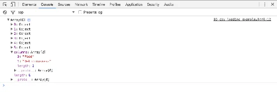
<h6 class="calibre37"><span class="keep-together">Figure 5-5. </span>The
secret columns array</h6>
</div>
</figure>

Notice how the presence of `columns` doesn’t affect the tallied length
of the array: `Array[6]` indicates that the `array.length` is still 6,
because only the numerically indexed items are counted. Arrays in
JavaScript are just objects, and `columns` is just a named property
added on like any other. `columns`, however, is ignored for purposes of
data binding, so you can ignore it, too.

</div>

</aside>

One more thing to note is that each value from the CSV is stored as a
string, even the numbers. (You can tell because 9 is surrounded by
quotation marks, as in `"9"` and not simply `9`.) This could cause
unexpected behavior later, if you try to reference your data as a
numeric value but it is still typed as a string.

To save yourself a debugging headache later, you can specify a row
conversion function, in which you specify how the values in each row of
the CSV should be typed. <span id="ch05.xhtml_idm140093204076816"
class="calibre5 pcalibre pcalibre2 pcalibre3 pcalibre1"
data-type="indexterm" primary="data strings"></span>In our example, the
`Food` column contains strings already, so it needs no conversion. But
`Deliciousness` contains integers and floats. Next, I define a new
function, `rowConverter`, and tell it how to handle each column.

``` calibre39
var rowConverter = function(d) {
    return {
        Food: d.Food,  //No conversion
        Deliciousness: parseFloat(d.Deliciousness)
    };
}

d3.csv("food.csv", rowConverter, function(data) {
    console.log(data);
});
```

Note <span id="ch05.xhtml_idm140093204073040"
class="calibre5 pcalibre pcalibre2 pcalibre3 pcalibre1"
data-type="indexterm" primary="d3.csv()"></span>that `rowConverter` has
been included as a new parameter passed into `d3.csv()`. So now
`d3.csv()` will load the file in, run each row through the row
conversion function, and finally store it all in `data`. You can verify
this for yourself; in the console, you’ll see `Deliciousness: 9` instead
of `Deliciousness: "9"`.

<aside data-type="sidebar" epub:type="sidebar" class="calibre31">

<div id="ch05.xhtml_handling_data_loading_errors_5" class="sidebar">

##### Handling Data-Loading Errors

Note <span id="ch05.xhtml_idm140093204185232"
class="calibre5 pcalibre pcalibre2 pcalibre3 pcalibre1"
data-type="indexterm" primary="data loading"
secondary="error handling"></span><span id="ch05.xhtml_idm140093204184224"
class="calibre5 pcalibre pcalibre2 pcalibre3 pcalibre1"
data-type="indexterm" primary="data binding"
secondary="handling loading errors"></span><span id="ch05.xhtml_idm140093204183280"
class="calibre5 pcalibre pcalibre2 pcalibre3 pcalibre1"
data-type="indexterm"
primary="asynchronous methods"></span><span id="ch05.xhtml_idm140093204182608"
class="calibre5 pcalibre pcalibre2 pcalibre3 pcalibre1"
data-type="indexterm" primary="page elements"
secondary="binding data to"
tertiary="handling loading errors"></span>that `d3.csv()` is an
*asynchronous* method, meaning that the rest of your code is executed
even while JavaScript is simultaneously waiting for the file to finish
downloading into the browser. (The same is true of D3’s other functions
that load external resources, such as `d3.json()`.)

This can potentially be *very* confusing, because you—as a reasonable
human person—might assume that the CSV file’s data is available, when in
fact it hasn’t finished loading yet. A common mistake is to include
references to the external data *outside of* the callback function. Save
yourself some headaches and make sure to reference your data only from
*within* the callback function (or from within other functions that you
call within the callback function).

Personally, I like to declare a global variable first, then call
`d3.csv()` to load the data. Within the callback function, I copy the
data into my global variable, and finally I call any functions that rely
on that data being present. By declaring a global variable and storing
your data inside that global variable, you can ensure that the data is
available later to any subsequent functions, *even outside of*
`d3.csv()`. For example:

``` calibre39
var dataset;  //Declare global variable, initially empty (undefined)

d3.csv("food.csv", function(data) {
    dataset = data;    //Once loaded, copy to dataset.
    generateVis();     //Then call other functions that
    hideLoadingMsg();  //depend on data being present.
});

var useTheDataLater = function() {
    //Assuming useTheDataLater() is called sometime after
    //d3.csv() has successfully loaded in the data,
    //then the global dataset would be accessible here.
};
```

To <span id="ch05.xhtml_idm140093203942560"
class="calibre5 pcalibre pcalibre2 pcalibre3 pcalibre1"
data-type="indexterm"
primary="callback functions"></span><span id="ch05.xhtml_idm140093203989184"
class="calibre5 pcalibre pcalibre2 pcalibre3 pcalibre1"
data-type="indexterm" primary="functions"
secondary="callback function"></span>further confuse matters, the
callback function is executed *whether or not the datafile was loaded
successfully*. That’s right: if the network connection fails, or the
filename is misspelled, or for some reason an error occurs on the web
server end, the callback function will *still* be executed. When the
data fails to load, and you call functions that rely on that data being
present, you will probably see an error in the console, and the
visualization won’t be created. This scenario might happen only rarely,
but it’s useful to know how to handle it.

Fortunately, you can include an optional `error` parameter in the
callback function definition. If there is a problem loading the file,
then `error` will be set to the error message returned by the web
server, and `data` will be `undefined`. If the file loads successfully
and there is no error, then `error` will be `null`, and the `data` array
will be populated as expected. Note that `error` must be the first
parameter, and `data` the second:

``` calibre39
var dataset;

d3.csv("food.csv", function(error, data) {

    if (error) {  //If error is not null, something went wrong.
        console.log(error);  //Log the error.
    } else {      //If no error, the file loaded correctly. Yay!
        console.log(data);   //Log the data.

        //Include other code to execute after successful file load here
        dataset = data;
        generateVis();
        hideLoadingMsg();
    }

});
```

</div>

</aside>

Verifying <span id="ch05.xhtml_idm140093203960640"
class="calibre5 pcalibre pcalibre2 pcalibre3 pcalibre1"
data-type="indexterm" primary="data" secondary="verifying"></span>your
data is a great use of the `csv()` callback function, but typically this
is where you’d call other functions that construct the visualization,
now that the data is available, as in:

``` calibre39
var dataset;  //Declare global var

d3.csv("food.csv", function(data) {

    //Hand CSV data off to global var,
    //so it's accessible later.
    dataset = data;

    //Call some other functions that
    //generate your visualization, e.g.:
    generateVisualization();
    makeAwesomeCharts();
    makeEvenAwesomerCharts();
    thankAwardsCommittee();

});
```

One <span id="ch05.xhtml_idm140093203850784"
class="calibre5 pcalibre pcalibre2 pcalibre3 pcalibre1"
data-type="indexterm" primary="d3.tsv()"></span>more tip: if you have
*tab*-separated data in a TSV file, try the `d3.tsv()` method, which
otherwise behaves exactly as the preceding method.

</div>

</div>

<div class="section calibre2" data-type="sect3"
pdf-bookmark="Loading JSON data">

<div id="ch05.xhtml_idm140093204219520" class="dedication">

### Loading JSON data

We’ll <span id="ch05.xhtml_idm140093203783936"
class="calibre5 pcalibre pcalibre2 pcalibre3 pcalibre1"
data-type="indexterm"
primary="JSON (JavaScript Object Notation)"></span><span id="ch05.xhtml_idm140093203783136"
class="calibre5 pcalibre pcalibre2 pcalibre3 pcalibre1"
data-type="indexterm"
primary="d3.json()"></span><span id="ch05.xhtml_idm140093203782464"
class="calibre5 pcalibre pcalibre2 pcalibre3 pcalibre1"
data-type="indexterm" primary="data binding"
secondary="JSON files"></span><span id="ch05.xhtml_idm140093203781520"
class="calibre5 pcalibre pcalibre2 pcalibre3 pcalibre1"
data-type="indexterm" primary="page elements"
secondary="binding data to" tertiary="JSON files"></span>spend more time
talking about JSON later, but for now, all you need to know is that the
`d3.json()` method works the same way as `csv()`. Load your JSON data in
this way:

``` calibre39
d3.json("waterfallVelocities.json", function(json) {
    console.log(json);  //Log output to console
});
```

Here, I’ve named the parsed output `json`, but it could be called `data`
or whatever you like.

<div class="calibre27" data-type="tip">

###### Tip

Please <span id="ch05.xhtml_idm140093203892656"
class="calibre5 pcalibre pcalibre2 pcalibre3 pcalibre1"
data-type="indexterm" primary="Mr. Data Converter"></span>meet the
indispensable <a href="https://shancarter.github.io/mr-data-converter/"
class="calibre5 pcalibre pcalibre2 pcalibre3 pcalibre1">Mr. Data
Converter</a>, a project by <a href="http://shancarter.com"
class="calibre5 pcalibre pcalibre2 pcalibre3 pcalibre1">Shan Carter</a>,
an early and prolific D3 user formerly of the *New York Times*. Mr. Data
Converter takes your Excel, CSV, or tab-separated data and converts it
to JSON or several other formats. It is one of those great tools that
does a single thing extremely well; bookmark it now.

</div>

</div>

</div>

</div>

</div>

<div class="section calibre2" data-type="sect2"
pdf-bookmark="Please Make Your Selection">

<div id="ch05.xhtml_please_make_your_selection_5" class="dedication">

## Please Make Your Selection

The <span id="ch05.xhtml_idm140093203887584"
class="calibre5 pcalibre pcalibre2 pcalibre3 pcalibre1"
data-type="indexterm" primary="data binding"
secondary="selecting elements"
seealso="selections"></span><span id="ch05.xhtml_idm140093203886304"
class="calibre5 pcalibre pcalibre2 pcalibre3 pcalibre1"
data-type="indexterm" primary="page elements"
secondary="binding data to" tertiary="selecting elements"></span>data is
ready to go. As a reminder, we are working with this simple array:

``` calibre39
var dataset = [ 5, 10, 15, 20, 25 ];
```

Now <span id="ch05.xhtml_idm140093203895632"
class="calibre5 pcalibre pcalibre2 pcalibre3 pcalibre1"
data-type="indexterm" primary="d3.select()"></span>you need to decide
what to select. That is, what elements will your data be associated
with? Again, let’s keep it super simple and say that we want to make a
new paragraph for each value in the dataset. So you might imagine
something like this would be helpful:

``` calibre39
d3.select("body").selectAll("p")
```

and you’d be right, but there’s a catch: the
<span id="ch05.xhtml_idm140093203713488"
class="calibre5 pcalibre pcalibre2 pcalibre3 pcalibre1"
data-type="indexterm" primary="dynamic paragraphs"></span>paragraphs we
want to select *don’t exist yet*. And this gets at one of the most
common points of confusion with D3: how can we select elements that
don’t yet exist? Bear with me, as the answer might require bending your
mind a bit.

The <span id="ch05.xhtml_idm140093203711888"
class="calibre5 pcalibre pcalibre2 pcalibre3 pcalibre1"
data-type="indexterm" primary="enter()"></span>answer lies with
`enter()`, a truly magical method. See this code, which I’ll explain:

``` calibre39
d3.select("body").selectAll("p")
    .data(dataset)
    .enter()
    .append("p")
    .text("New paragraph!");
```

View the example code *04_creating_paragraphs.html* and you should see
five new paragraphs, each with the same content, as shown in
<a href="#ch05.xhtml_Dynamic_paragraphs"
class="calibre5 pcalibre pcalibre2 pcalibre3 pcalibre1"
data-type="xref">Figure 5-6</a>.

<figure class="calibre35">
<div id="ch05.xhtml_Dynamic_paragraphs" class="figure">
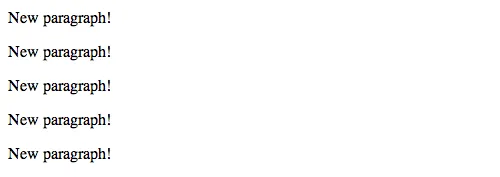
<h6 class="calibre37"><span class="keep-together">Figure 5-6.
</span>Dynamic paragraphs</h6>
</div>
</figure>

Here’s what’s happening:

`d3.select("body")`  
Finds the `body` in the DOM and hands off a reference to the next step
in the chain.

`.selectAll("p")`  
Selects all paragraphs in the DOM. Because none exist yet, this returns
an empty selection. Think of this empty selection as representing the
paragraphs that *will soon exist*.

`.data(dataset)`  
Counts and parses our data values. There are five values in our array
called `dataset`, so everything past this point is executed five times,
once for each value.

`.enter()`  
To create new, data-bound elements, you must use `enter()`. This method
looks at the current DOM selection, and then at the data being handed to
it. If there are more data values than corresponding DOM elements, then
`enter()` *creates a new placeholder element* on which you can work your
magic. It then hands off a reference to this new placeholder to the next
step in the chain.

`.append("p")`  
Takes the empty placeholder selection created by `enter()` and appends a
`p` element into the DOM. Hooray! Then it hands off a reference to the
element it just created to the next step in the chain.

`.text("New paragraph!")`  
Takes the reference to the newly created `p` and inserts a text value.

</div>

</div>

<div class="section calibre2" data-type="sect2"
pdf-bookmark="Bound and Determined">

<div id="ch05.xhtml_idm140093203626416" class="dedication">

## Bound and Determined

All <span id="ch05.xhtml_idm140093203586864"
class="calibre5 pcalibre pcalibre2 pcalibre3 pcalibre1"
data-type="indexterm" primary="data binding"
secondary="inspecting bound data"></span><span id="ch05.xhtml_idm140093203585856"
class="calibre5 pcalibre pcalibre2 pcalibre3 pcalibre1"
data-type="indexterm" primary="page elements"
secondary="binding data to"
tertiary="inspecting bound data"></span>right! Our data has been read,
parsed, and bound to new `p` elements that we created in the DOM. Don’t
believe me? Take another look at *04_creating_paragraphs.html* and whip
out your web inspector, shown in
<a href="#ch05.xhtml_new_p_elements_in_the_inspector"
class="calibre5 pcalibre pcalibre2 pcalibre3 pcalibre1"
data-type="xref">Figure 5-7</a>.

<figure class="calibre35">
<div id="ch05.xhtml_new_p_elements_in_the_inspector" class="figure">
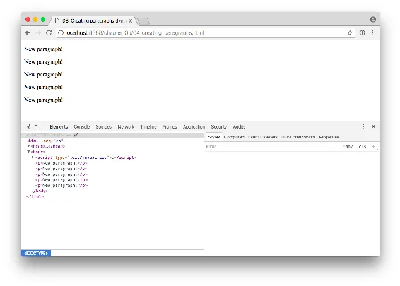
<h6 class="calibre37"><span class="keep-together">Figure 5-7. </span>New
p elements in the web inspector</h6>
</div>
</figure>

Okay, I see five paragraphs, but where’s the data? Switch to the
JavaScript console, type in the following code, and click Enter. The
results are shown in
<a href="#ch05.xhtml_A_selection_of_five_paragraphs"
class="calibre5 pcalibre pcalibre2 pcalibre3 pcalibre1"
data-type="xref">Figure 5-8</a>.

``` calibre39
d3.selectAll("p")
```

<figure class="calibre35">
<div id="ch05.xhtml_A_selection_of_five_paragraphs" class="figure">
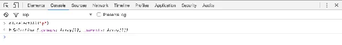
<h6 class="calibre37"><span class="keep-together">Figure 5-8. </span>A
selection of five paragraphs</h6>
</div>
</figure>

Interesting: the selection is actually an object containing both a
`_groups` array and a `_parents` array. Click the gray disclosure
triangle to expand the object, shown in
<a href="#ch05.xhtml_selection_expanded"
class="calibre5 pcalibre pcalibre2 pcalibre3 pcalibre1"
data-type="xref">Figure 5-9</a>.

<figure class="calibre35">
<div id="ch05.xhtml_selection_expanded" class="figure">
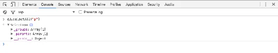
<h6 class="calibre37"><span class="keep-together">Figure 5-9.
</span>Selection, expanded</h6>
</div>
</figure>

Then let’s expand `_groups` to see its contents, shown in
<a href="#ch05.xhtml_our_selections_groups"
class="calibre5 pcalibre pcalibre2 pcalibre3 pcalibre1"
data-type="xref">Figure 5-10</a>.

<figure class="calibre35">
<div id="ch05.xhtml_our_selections_groups" class="figure">
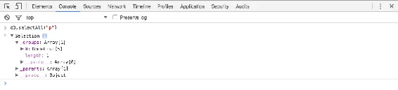
<h6 class="calibre37"><span class="keep-together">Figure 5-10.
</span>Our selection’s groups</h6>
</div>
</figure>

Note that `_groups` contains only one item, a `NodeList` array, itself
containing five more items. Let’s expand that, as shown in
<a href="#ch05.xhtml_expanded_nodelist"
class="calibre5 pcalibre pcalibre2 pcalibre3 pcalibre1"
data-type="xref">Figure 5-11</a>.

<figure class="calibre35">
<div id="ch05.xhtml_expanded_nodelist" class="figure">
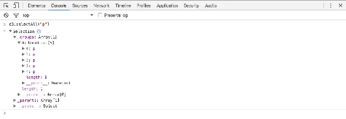
<h6 class="calibre37"><span class="keep-together">Figure 5-11.
</span>Expanded NodeList</h6>
</div>
</figure>

You’ll notice the five `p`s, numbered 0 through 4. Click the disclosure
triangle next to the first one (number zero), which results in the view
shown in <a href="#ch05.xhtml_the_p_element_expanded"
class="calibre5 pcalibre pcalibre2 pcalibre3 pcalibre1"
data-type="xref">Figure 5-12</a>.

<figure class="calibre35">
<div id="ch05.xhtml_the_p_element_expanded" class="figure">
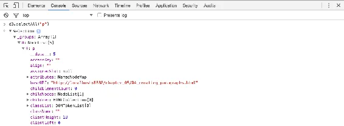
<h6 class="calibre37"><span class="keep-together">Figure 5-12.
</span>The p element, expanded</h6>
</div>
</figure>

See it? Do you see it? I can barely contain myself. There it is
(<a href="#ch05.xhtml_finally_bound_data"
class="calibre5 pcalibre pcalibre2 pcalibre3 pcalibre1"
data-type="xref">Figure 5-13</a>).

<figure class="calibre35">
<div id="ch05.xhtml_finally_bound_data" class="figure">
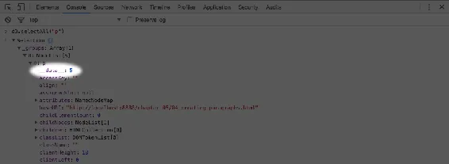
<h6 class="calibre37"><span class="keep-together">Figure 5-13.
</span>Finally, bound data</h6>
</div>
</figure>

Our first data value, the number `5`, is showing up under the first
paragraph’s <span class="keep-together">`__data__`</span> attribute.
Expand the other paragraph elements, and you’ll see they also contain
`__data__` values: 10, 15, 20, and 25, just as we specified.

You see, when D3 binds data to an element, that data doesn’t exist in
the DOM, but it does exist in memory as a `__data__` attribute of that
element. And the console is where you can go to confirm whether or not
your data was bound as expected.

The data is ready. Let’s do something with it.

</div>

</div>

<div class="section calibre2" data-type="sect2"
pdf-bookmark="Using Your Data">

<div id="ch05.xhtml_idm140093203587840" class="dedication">

## Using Your Data

We <span id="ch05.xhtml_idm140093203474240"
class="calibre5 pcalibre pcalibre2 pcalibre3 pcalibre1"
data-type="indexterm" primary="data binding"
secondary="using bound data"></span><span id="ch05.xhtml_idm140093203473232"
class="calibre5 pcalibre pcalibre2 pcalibre3 pcalibre1"
data-type="indexterm" primary="page elements"
secondary="binding data to"
tertiary="using bound data"></span><span id="ch05.xhtml_idm140093203472016"
class="calibre5 pcalibre pcalibre2 pcalibre3 pcalibre1"
data-type="indexterm" primary="data"
secondary="using bound data"></span>can see that the data has been
loaded into the page and is bound to our newly created elements in the
DOM, but can we *use* it? Here’s our code so far:

``` calibre39
var dataset = [ 5, 10, 15, 20, 25 ];

d3.select("body").selectAll("p")
    .data(dataset)
    .enter()
    .append("p")
    .text("New paragraph!");
```

Let’s change the last line to:

``` calibre39
    .text(function(d) { return d; });
```

Now test out that new code in *05_creating_paragraphs_text.html*. You
should see the result shown in
<a href="#ch05.xhtml_more_dynamic_paragraphs"
class="calibre5 pcalibre pcalibre2 pcalibre3 pcalibre1"
data-type="xref">Figure 5-14</a>.

<figure class="calibre35">
<div id="ch05.xhtml_more_dynamic_paragraphs" class="figure">

<h6 class="calibre37"><span class="keep-together">Figure 5-14.
</span>More dynamic paragraphs</h6>
</div>
</figure>

Whoa! We <span id="ch05.xhtml_idm140093203429744"
class="calibre5 pcalibre pcalibre2 pcalibre3 pcalibre1"
data-type="indexterm" primary="data()"></span>used our data to populate
the contents of each paragraph, all thanks to the magic of the `data()`
method. When you chain methods together, anytime after you call
`data()`, you can create an anonymous function that accepts `d` as
input. The magical `data()` method ensures that `d` is set to the
corresponding value in your original dataset, given the current element
at hand.

The value of “the current element” changes over time as D3 loops through
each element. For example, when looping through the third time, our code
creates the third `p` tag, and `d` will correspond to the third value in
our dataset (or `dataset[2]`). So the third paragraph gets text content
of “15”.

</div>

</div>

<div class="section calibre2" data-type="sect2"
pdf-bookmark="High-Functioning">

<div id="ch05.xhtml_idm140093203475344" class="dedication">

## High-Functioning

In <span id="ch05.xhtml_idm140093203423024"
class="calibre5 pcalibre pcalibre2 pcalibre3 pcalibre1"
data-type="indexterm" primary="functions"
secondary="basic code structure of"></span>case you’re new to writing
your own functions (a.k.a. methods), the basic structure of a function
definition is:

``` calibre39
function(input_value) {
    //Calculate something here
    return output_value;
}
```

The function we used earlier is dead simple, nothing fancy:

``` calibre39
function(d) {
    return d;
}
```

This <span id="ch05.xhtml_idm140093203414416"
class="calibre5 pcalibre pcalibre2 pcalibre3 pcalibre1"
data-type="indexterm"
primary="anonymous functions"></span><span id="ch05.xhtml_idm140093203413808"
class="calibre5 pcalibre pcalibre2 pcalibre3 pcalibre1"
data-type="indexterm"
primary="named functions"></span><span id="ch05.xhtml_idm140093203413136"
class="calibre5 pcalibre pcalibre2 pcalibre3 pcalibre1"
data-type="indexterm" primary="functions"
secondary="anonymous functions"></span><span id="ch05.xhtml_idm140093203412192"
class="calibre5 pcalibre pcalibre2 pcalibre3 pcalibre1"
data-type="indexterm" primary="functions"
secondary="named functions"></span>is called an *anonymous function*,
because it doesn’t have a name. Contrast that with a function that’s
stored in a variable, which is a *named function*:

``` calibre39
var doSomething = function() {
    //Code to do something here
};
```

We’ll write lots of anonymous functions when using D3. They are the key
to accessing individual data values and calculating dynamic properties.

This <span id="ch05.xhtml_idm140093203309456"
class="calibre5 pcalibre pcalibre2 pcalibre3 pcalibre1"
data-type="indexterm"
primary="arguments (input values)"></span>particular anonymous function
is wrapped within D3’s `text()` function. So our anonymous function is
executed first. Then its result is handed off to `text()`. Then `text()`
finally works its magic (by inserting its input argument as text within
the selected DOM element):

``` calibre39
.text(function(d) {
    return d;
});
```

But we can (and will) get much fancier because you can customize these
functions any way you like. Yes, this is both the pleasure and pain of
writing your own JavaScript. Maybe you’d like to add some extra text, as
in:

``` calibre39
.text(function(d) {
    return "I can count up to " + d;
});
```

which produces the result shown in
<a href="#ch05.xhtml_Still_more_dynamic_paragraphs"
class="calibre5 pcalibre pcalibre2 pcalibre3 pcalibre1"
data-type="xref">Figure 5-15</a>, as seen in example file
*06_creating_paragraphs_counting.html*.

<figure class="calibre35">
<div id="ch05.xhtml_Still_more_dynamic_paragraphs" class="figure">
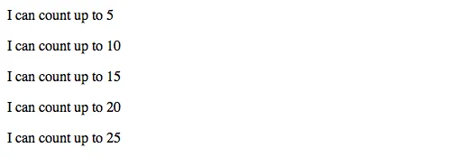
<h6 class="calibre37"><span class="keep-together">Figure 5-15.
</span>Still more dynamic paragraphs</h6>
</div>
</figure>

</div>

</div>

<div class="section calibre2" data-type="sect2"
pdf-bookmark="Data Wants to Be Held">

<div id="ch05.xhtml_idm140093203424128" class="dedication">

## Data Wants to Be Held

You <span id="ch05.xhtml_idm140093203185840"
class="calibre5 pcalibre pcalibre2 pcalibre3 pcalibre1"
data-type="indexterm" primary="coding tips"
secondary="using functions to hold data"></span><span id="ch05.xhtml_idm140093203184864"
class="calibre5 pcalibre pcalibre2 pcalibre3 pcalibre1"
data-type="indexterm" primary="data"
secondary="holding with functions"></span>might be wondering why you
have to write out `function(d) { … }` instead of just `d` on its own.
For example, this won’t work:

``` calibre39
.text("I can count up to " + d);
```

In this context, without being wrapped `d` in an anonymous function, `d`
is undefined. Think of `d` as a lonely little placeholder value that
just needs a warm, containing hug from a kind, caring function’s
parentheses. (Extending this metaphor further, yes, it is creepy that
the hug is being given by an *anonymous* function, but that only
confuses matters.)

Here is `d` being held gently and appropriately by a function:

``` calibre39
.text(function(d) {  // <-- Note tender embrace at left
    return "I can count up to " + d;
});
```

The <span id="ch05.xhtml_idm140093203134352"
class="calibre5 pcalibre pcalibre2 pcalibre3 pcalibre1"
data-type="indexterm" primary="functions"
secondary="used as arguments"></span>reason for this syntax is that
`.text()`, `attr()`, and many other D3 methods can take a *function* as
an argument. For example, `text()` can take either simply a static
string of text as an argument:

``` calibre39
.text("someString")
```

*or* the result of a function:

``` calibre39
.text(someFunction())  // Presumably, someFunction() would return a string
```

*or* an anonymous function itself can be the argument, such as when you
write:

``` calibre39
.text(function(d) {
    return d;
})
```

Here, you are defining an anonymous function. If D3 sees a function
there, it will *call* that function, while handing off the current datum
`d` as the function’s argument. Here, I’ve named the argument `d` just
by convention. You could call it `datum` or `info` or whatever you like.
All D3 is looking for is *any* argument name into which it can pass the
current datum. Throughout this book, we’ll use `d` because it is concise
and familiar from many of the other D3 examples found online.

In any case, without that function in place, D3 couldn’t relay the
current data value. Without an anonymous function and its argument there
to receive the value of `d`, D3 could get confused and even start
crying. (D3 is more emotional than you’d expect.)

At first, this might seem silly and like a lot of extra work to just get
at `d`, but the value of this approach will become clear as we work on
more complex pieces.

</div>

</div>

<div class="section calibre2" data-type="sect2"
pdf-bookmark="Beyond Text">

<div id="ch05.xhtml_idm140093203186944" class="dedication">

## Beyond Text

Things <span id="ch05.xhtml_idm140093203115296"
class="calibre5 pcalibre pcalibre2 pcalibre3 pcalibre1"
data-type="indexterm"
primary="attr()"></span><span id="ch05.xhtml_idm140093203114560"
class="calibre5 pcalibre pcalibre2 pcalibre3 pcalibre1"
data-type="indexterm"
primary="style()"></span><span id="ch05.xhtml_idm140093203113888"
class="calibre5 pcalibre pcalibre2 pcalibre3 pcalibre1"
data-type="indexterm"
primary="d3.style()"></span><span id="ch05.xhtml_idm140093203113216"
class="calibre5 pcalibre pcalibre2 pcalibre3 pcalibre1"
data-type="indexterm" primary="CSS (Cascading Style Sheets)"
secondary="properties and values"></span><span id="ch05.xhtml_idm140093203112304"
class="calibre5 pcalibre pcalibre2 pcalibre3 pcalibre1"
data-type="indexterm" primary="HTML (Hypertext Markup Language)"
secondary="attributes"></span>get a lot more interesting when we explore
D3’s other methods, like `attr()` and `style()`, which allow us to set
HTML attributes and CSS properties on selections,
<span class="keep-together">respectively</span>.

For example, adding one more line to our code:

``` calibre39
.style("color", "red");
```

produces the result shown in <a href="#ch05.xhtml_Red_paragraphs"
class="calibre5 pcalibre pcalibre2 pcalibre3 pcalibre1"
data-type="xref">Figure 5-16</a>, as seen in
*07_creating_paragraphs_with_style.html*.

<figure class="calibre35">
<div id="ch05.xhtml_Red_paragraphs" class="figure">

<h6 class="calibre37"><span class="keep-together">Figure 5-16.
</span>Red paragraphs</h6>
</div>
</figure>

All the text is now red; big deal. But we could use a custom function to
make the text red only if the current datum exceeds a certain threshold.
So we revise that last line to use a function instead of a string:

``` calibre39
.style("color", function(d) {
    if (d > 15) {   //Threshold of 15
        return "red";
    } else {
        return "black";
    }
});
```

See the resulting change, displayed in
<a href="#ch05.xhtml_Dynamically_styled_paragraphs"
class="calibre5 pcalibre pcalibre2 pcalibre3 pcalibre1"
data-type="xref">Figure 5-17</a>, in
*08_creating_paragraphs_with_style_functions.html*.

<figure class="calibre35">
<div id="ch05.xhtml_Dynamically_styled_paragraphs" class="figure">
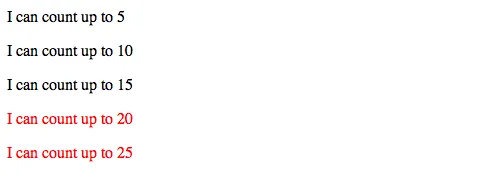
<h6 class="calibre37"><span class="keep-together">Figure 5-17.
</span>Dynamically styled paragraphs</h6>
</div>
</figure>

Notice <span id="ch05.xhtml_idm140093202913008"
class="calibre5 pcalibre pcalibre2 pcalibre3 pcalibre1"
data-type="indexterm" primary="dynamic paragraphs"></span>how the first
three lines are black, but once `d` exceeds the arbitrary threshold of
15, the text turns red.

Okay, we’ve got data loaded in, and dynamically created DOM elements
bound to that data. I’d say we’re ready to start drawing with
data\!<span id="ch05.xhtml_idm140093202911184"
class="calibre5 pcalibre pcalibre2 pcalibre3 pcalibre1"
data-type="indexterm" primary=""
startref="Dbind05"></span><span id="ch05.xhtml_idm140093202910208"
class="calibre5 pcalibre pcalibre2 pcalibre3 pcalibre1"
data-type="indexterm" primary=""
startref="PEbind05"></span><span id="ch05.xhtml_idm140093202909264"
class="calibre5 pcalibre pcalibre2 pcalibre3 pcalibre1"
data-type="indexterm" primary="" startref="DMbind05"></span>

</div>

</div>

</div>

</div>

</div>

</div>

<span id="ch06.xhtml"></span>

<div id="ch06.xhtml_sbo-rt-content" class="calibre1">

<div id="ch06.xhtml_drawing_with_data" class="dedication">

