# <span class="keep-together">Chapter 6. </span>Drawing with Data

It’s time to start drawing with data.

Let’s continue working with our simple dataset for now:

``` calibre39
var dataset = [ 5, 10, 15, 20, 25 ];
```

<div class="section calibre2" data-type="sect1"
pdf-bookmark="Drawing divs">

<div id="ch06.xhtml_idm140093202902176" class="dedication">

# Drawing divs

We’ll <span id="ch06.xhtml_idm140093202890224"
class="calibre5 pcalibre pcalibre2 pcalibre3 pcalibre1"
data-type="indexterm"
primary="div element"></span><span id="ch06.xhtml_idm140093202889488"
class="calibre5 pcalibre pcalibre2 pcalibre3 pcalibre1"
data-type="indexterm"
primary="rectangles, drawing"></span><span id="ch06.xhtml_idm140093202888816"
class="calibre5 pcalibre pcalibre2 pcalibre3 pcalibre1"
data-type="indexterm" primary="drawing"
secondary="rectangles"></span>use this to generate a super-simple bar
chart. Bar charts are essentially just rectangles, and an HTML `div` is
the easiest way to draw a rectangle. (Then again, to a web browser,
*everything* is a rectangle, so you could adapt this example to use
`span`s or whatever element you prefer.)

Formally, <span id="ch06.xhtml_idm140093202882464"
class="calibre5 pcalibre pcalibre2 pcalibre3 pcalibre1"
data-type="indexterm"
primary="column charts"></span><span id="ch06.xhtml_idm140093202881728"
class="calibre5 pcalibre pcalibre2 pcalibre3 pcalibre1"
data-type="indexterm" primary="bar charts"
secondary="simple"></span><span id="ch06.xhtml_idm140093202880784"
class="calibre5 pcalibre pcalibre2 pcalibre3 pcalibre1"
data-type="indexterm" primary="charts"
secondary="column charts"></span><span id="ch06.xhtml_idm140093202879840"
class="calibre5 pcalibre pcalibre2 pcalibre3 pcalibre1"
data-type="indexterm" primary="charts" see="also bar charts"></span>a
chart with vertically oriented rectangles is a *column* chart, and one
with horizontal rectangles is a *bar* chart. In practice, most people
just call them all bar charts, as I’ll do from now on.

This `div` could work well as a data bar, shown in
<a href="#ch06.xhtml_A_humble_div"
class="calibre5 pcalibre pcalibre2 pcalibre3 pcalibre1"
data-type="xref">Figure 6-1</a>.

<figure class="calibre35">
<div id="ch06.xhtml_A_humble_div" class="figure">

<h6 class="calibre37"><span class="keep-together">Figure 6-1. </span>A
humble div</h6>
</div>
</figure>

``` calibre39
<div style="display: inline-block;
            width: 20px;
            height: 75px;
            background-color: teal;"></div>
```

Among web standards folks, this is a semantic no-no. Normally, one
shouldn’t use an empty `div` for purely visual effect, but I am making
an exception for the sake of this example.

Because this is a `div`, its `width` and `height` are set with CSS
styles. Except for `height`, each bar in our chart will share the same
display properties, so I’ll put those shared styles into a class called
`bar`, as an embedded style up in the `head` of the document:

``` calibre39
div.bar {
    display: inline-block;
    width: 20px;
    height: 75px;   /* We'll override height later */
    background-color: teal;
}
```

Now each `div` needs to be assigned the `bar` class, so our new CSS rule
will apply. If you were writing the HTML code by hand, you would write
the following:

``` calibre39
<div class="bar"></div>
```

Using D3, to add a class to an element, we use the `attr()` method. It’s
important to understand the difference between `attr()` and its close
cousin, `style()`. `attr()` sets DOM attribute values, whereas `style()`
applies CSS styles directly to an element.

<div class="section calibre2" data-type="sect2"
pdf-bookmark="Setting Attributes">

<div id="ch06.xhtml_idm140093202999712" class="dedication">

## Setting Attributes

<a href="http://bit.ly/2t1Q3X6"
class="calibre5 pcalibre pcalibre2 pcalibre3 pcalibre1"><code
class="calibre23">attr()</code></a> is used to set an
<span id="ch06.xhtml_idm140093202997584"
class="calibre5 pcalibre pcalibre2 pcalibre3 pcalibre1"
data-type="indexterm" primary="attributes"
secondary="setting"></span><span id="ch06.xhtml_idm140093202996608"
class="calibre5 pcalibre pcalibre2 pcalibre3 pcalibre1"
data-type="indexterm" primary="attr()"></span>HTML attribute and its
value on an element. An HTML attribute is any property/value pair that
you could include between an element’s `<>` brackets. For example, these
HTML elements:

``` calibre39
<p class="caption">
<select id="country">

```

contain a total of five attributes (and corresponding values), all of
which could be set with `attr()`:

| Attribute | Value      |
|-----------|------------|
| `class`   | `caption`  |
| `id`      | `country`  |
| `src`     | `logo.webp` |
| `width`   | `100px`    |
| `alt`     | `Logo`     |

<div class="dedication">

</div>

To assign a class of `bar`, we can use:

``` calibre39
.attr("class", "bar")
```

</div>

</div>

<div class="section calibre2" data-type="sect2"
pdf-bookmark="A Note on Classes">

<div id="ch06.xhtml_idm140093202780800" class="dedication">

## A Note on Classes

Note <span id="ch06.xhtml_idm140093202779440"
class="calibre5 pcalibre pcalibre2 pcalibre3 pcalibre1"
data-type="indexterm" primary="classes"
secondary="adding to elements"></span><span id="ch06.xhtml_idm140093202757168"
class="calibre5 pcalibre pcalibre2 pcalibre3 pcalibre1"
data-type="indexterm" primary="elements"
secondary="adding a class to"></span><span id="ch06.xhtml_idm140093202756224"
class="calibre5 pcalibre pcalibre2 pcalibre3 pcalibre1"
data-type="indexterm" primary="classes" secondary="vs. styles"
secondary-sortas="styles"></span><span id="ch06.xhtml_idm140093202755008"
class="calibre5 pcalibre pcalibre2 pcalibre3 pcalibre1"
data-type="indexterm" primary="styles" secondary="vs. classes"
secondary-sortas="classes"></span>that an element’s *class* is stored as
an HTML attribute. The class, in turn, is used to reference a CSS style
rule. This could cause some confusion because there is a difference
between setting a *class* (from which styles are inferred) and applying
a *style* directly to an element. You can do both with D3. Although you
should use whatever approach makes the most sense to you, I recommend
using *classes* for properties that are shared by multiple elements, and
applying *style* rules directly only when deviating from the norm. (In
fact, that’s what we’ll do in just a moment.)

I <span id="ch06.xhtml_idm140093202745264"
class="calibre5 pcalibre pcalibre2 pcalibre3 pcalibre1"
data-type="indexterm" primary="classed()"></span>also want to briefly
mention another D3 method, `classed()`, which can be used to quickly
apply or remove classes from elements. The preceding line of code could
be rewritten as the following:

``` calibre39
.classed("bar", true)
```

This line simply takes whatever selection is passed to it and applies
the class `bar`. If `false` were specified, it would do the opposite,
removing the class of `bar` from any elements in the selection:

``` calibre39
.classed("bar", false)
```

</div>

</div>

<div class="section calibre2" data-type="sect2"
pdf-bookmark="Back to the Bars">

<div id="ch06.xhtml_idm140093202628176" class="dedication">

## Back to the Bars

Putting it all together with our dataset, here is the complete D3 code
so far:

``` calibre39
var dataset = [ 5, 10, 15, 20, 25 ];

d3.select("body").selectAll("div")
    .data(dataset)
    .enter()
    .append("div")
    .attr("class", "bar");
```

To see what’s going on, look at *01_drawing_divs.html* in your browser,
view the source, and open your web inspector. You should see five
vertical `div` bars, one generated for each point in our dataset.
However, with no space between them, they look like one big rectangle,
as seen in Figures <a href="#ch06.xhtml_Five_divs_masquerading_as_one"
class="calibre5 pcalibre pcalibre2 pcalibre3 pcalibre1" data-type="xref"
data-xrefstyle="select:labelnumber">6-2</a> and
<a href="#ch06.xhtml_Five_divs_masquerading_as_one_inspector"
class="calibre5 pcalibre pcalibre2 pcalibre3 pcalibre1" data-type="xref"
data-xrefstyle="select:labelnumber">6-3</a>.

<figure class="calibre35">
<div id="ch06.xhtml_Five_divs_masquerading_as_one" class="figure">

<h6 class="calibre37"><span class="keep-together">Figure 6-2.
</span>Five divs masquerading as one</h6>
</div>
</figure>

<figure class="calibre35">
<div id="ch06.xhtml_Five_divs_masquerading_as_one_inspector"
class="figure">
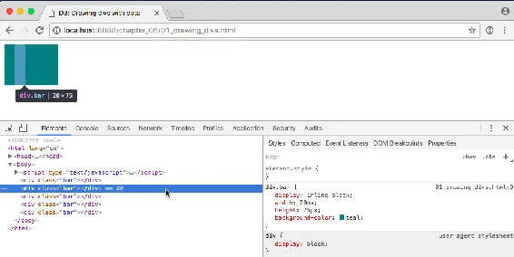
<h6 class="calibre37"><span class="keep-together">Figure 6-3.
</span>Five divs masquerading as one, as seen through the web
inspector</h6>
</div>
</figure>

</div>

</div>

<div class="section calibre2" data-type="sect2"
pdf-bookmark="Setting Styles">

<div id="ch06.xhtml_idm140093202549136" class="dedication">

## Setting Styles

The <a href="http://bit.ly/2t1HThk"
class="calibre5 pcalibre pcalibre2 pcalibre3 pcalibre1"><code
class="calibre23">style()</code></a> method
<span id="ch06.xhtml_idm140093202546656"
class="calibre5 pcalibre pcalibre2 pcalibre3 pcalibre1"
data-type="indexterm"
primary="style()"></span><span id="ch06.xhtml_idm140093202545952"
class="calibre5 pcalibre pcalibre2 pcalibre3 pcalibre1"
data-type="indexterm" primary="d3.style()"></span>is used to apply a
<span id="ch06.xhtml_idm140093202545152"
class="calibre5 pcalibre pcalibre2 pcalibre3 pcalibre1"
data-type="indexterm" primary="styles" secondary="setting"></span>CSS
property and value directly to an HTML element. This is the equivalent
of including CSS rules within a `style` attribute right in your HTML, as
in:

``` calibre39
<div style="height: 75px;"></div>
```

To make a bar chart, we must make the height of each bar a function of
its corresponding data value. So let’s add this to the end of our D3
code (taking care to keep the final semicolon at the very end of the
chain):

``` calibre39
.style("height", function(d) {
    return d + "px";
});
```

See that code in *02_drawing_divs_height.html*. You should see a very
small bar chart, like the one in <a href="#ch06.xhtml_A_small_bar_chart"
class="calibre5 pcalibre pcalibre2 pcalibre3 pcalibre1"
data-type="xref">Figure 6-4</a>.

<figure class="calibre35">
<div id="ch06.xhtml_A_small_bar_chart" class="figure">

<h6 class="calibre37"><span class="keep-together">Figure 6-4. </span>A
small bar chart</h6>
</div>
</figure>

When D3 loops through each data point, the value of `d` will be set to
that of the corresponding value. So we are setting a `height` value of
`d` (the current data value) while appending the text `px` (to specify
the units are pixels). The resulting heights are `5px`, `10px`, `15px`,
`20px`, and `25px`.

<div class="dedication">

</div>

This looks a little bit silly, so let’s make those bars taller:

``` calibre39
.style("height", function(d) {
    var barHeight = d * 5;  //Scale up by factor of 5
    return barHeight + "px";
});
```

Add some space to the right of each bar (in the embedded CSS style, in
the document `head`), to space things out:

``` calibre39
margin-right: 2px;
```

Nice! We could go to <a href="http://www.siggraph.org/"
class="calibre5 pcalibre pcalibre2 pcalibre3 pcalibre1">SIGGRAPH</a>
with that chart (<a href="#ch06.xhtml_A_taller_bar_chart"
class="calibre5 pcalibre pcalibre2 pcalibre3 pcalibre1"
data-type="xref">Figure 6-5</a>).

<figure class="calibre35">
<div id="ch06.xhtml_A_taller_bar_chart" class="figure">
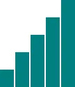
<h6 class="calibre37"><span class="keep-together">Figure 6-5. </span>A
taller bar chart</h6>
</div>
</figure>

Try out the sample code *03_drawing_divs_spaced.html*. Again, view the
source and use the web inspector to contrast the original HTML against
the final DOM.

</div>

</div>

</div>

</div>

<div class="section calibre2" data-type="sect1"
pdf-bookmark="The Power of data()">

<div id="ch06.xhtml_idm140093202891424" class="dedication">

# The Power of data()

This <span id="ch06.xhtml_idm140093202477920"
class="calibre5 pcalibre pcalibre2 pcalibre3 pcalibre1"
data-type="indexterm" primary="data()"></span>is exciting, but
real-world data is never this clean:

``` calibre39
var dataset = [ 5, 10, 15, 20, 25 ];
```

Let’s make our data a bit messier, as in *04_power_of_data.html*:

``` calibre39
var dataset = [ 25, 7, 5, 26, 11 ];
```

That change in data results in the bars shown in
<a href="#ch06.xhtml_New_data_values"
class="calibre5 pcalibre pcalibre2 pcalibre3 pcalibre1"
data-type="xref">Figure 6-6</a>. We’re not limited to five data points,
of course. Let’s add many more! (See the file
*05_power_of_data_more_points.html*.)

``` calibre39
var dataset = [ 25, 7, 5, 26, 11, 8, 25, 14, 23, 19,
                14, 11, 22, 29, 11, 13, 12, 17, 18, 10,
                24, 18, 25, 9, 3 ];
```

<figure class="calibre35">
<div id="ch06.xhtml_New_data_values" class="figure">
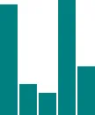
<h6 class="calibre37"><span class="keep-together">Figure 6-6. </span>New
data values</h6>
</div>
</figure>

<a href="#ch06.xhtml_Lots_more_data_values"
class="calibre5 pcalibre pcalibre2 pcalibre3 pcalibre1"
data-type="xref">Figure 6-7</a> shows 25 data points instead of 5!

<figure class="calibre35">
<div id="ch06.xhtml_Lots_more_data_values" class="figure">
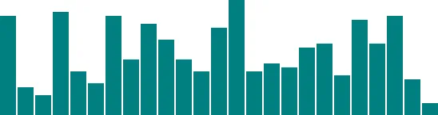
<h6 class="calibre37"><span class="keep-together">Figure 6-7.
</span>Lots more data values</h6>
</div>
</figure>

How does D3 automatically expand our chart as needed?

``` calibre39
d3.select("body").selectAll("div")
    .data(dataset)  // <-- The answer is here!
    .enter()
    .append("div")
    .attr("class", "bar")
    .style("height", function(d) {
        var barHeight = d * 5;
        return barHeight + "px";
    });
```

Give `data()` 10 values, and it will loop through 10 times. Give it one
million values, and it will loop through one million times. (Just be
patient.)

That is the power of `data()`—being smart enough to loop through the
full length of whatever dataset you throw at it, executing each method
beneath it in the chain, while updating the context in which each method
operates, so `d` always refers to the current datum at that point in the
loop.

That might be a mouthful, and if it all doesn’t make sense yet, it will
soon. I encourage you to make a copy of
*05_power_of_data_more_points.html*, tweak the `dataset` values, and
note how the bar chart changes.

Remember, the *data* is driving the visualization—not the other way
around.

<div class="section calibre2" data-type="sect2"
pdf-bookmark="Random Data">

<div id="ch06.xhtml_idm140093202065776" class="dedication">

## Random Data

Sometimes <span id="ch06.xhtml_idm140093202064048"
class="calibre5 pcalibre pcalibre2 pcalibre3 pcalibre1"
data-type="indexterm"
primary="random data, generating"></span><span id="ch06.xhtml_idm140093202063312"
class="calibre5 pcalibre pcalibre2 pcalibre3 pcalibre1"
data-type="indexterm" primary="data"
secondary="generating random"></span>it’s fun to generate random data
values, whether for testing purposes or just pure geekiness. That’s just
what I’ve done in *06_power_of_data_random.html*. Notice that each time
you reload the page, the bars render differently, as shown in
<a href="#ch06.xhtml_Bar_charts_with_random_values"
class="calibre5 pcalibre pcalibre2 pcalibre3 pcalibre1"
data-type="xref">Figure 6-8</a>.

<figure class="calibre35">
<div id="ch06.xhtml_Bar_charts_with_random_values" class="figure">
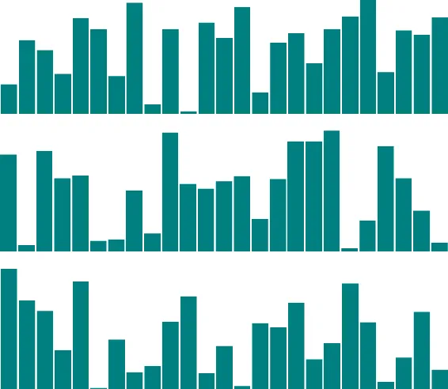
<h6 class="calibre37"><span class="keep-together">Figure 6-8. </span>Bar
charts with random values</h6>
</div>
</figure>

View the source, and you’ll see this code:

``` calibre39
var dataset = [];                         //Initialize empty array
for (var i = 0; i < 25; i++) {            //Loop 25 times
    var newNumber = Math.random() * 30;   //New random number (0-30)
    dataset.push(newNumber);              //Add new number to array
}
```

That code doesn’t use any D3 methods; it’s just JavaScript. Without
going into too much detail, this code does the following:

1.  Creates an empty array called `dataset`.

2.  Initiates <span id="ch06.xhtml_idm140093202169120"
    class="calibre5 pcalibre pcalibre2 pcalibre3 pcalibre1"
    data-type="indexterm" primary="for loops"></span>a `for` loop, which
    is executed 25 times.

3.  Each time, it generates a new random number with a value between 0
    and 30. (Well, technically, *almost* 30. `Math.random()` returns
    values as low as 0.0 all the way up to, but not including, 1.0. So
    if `Math.random()` returned 0.99999, then the result would be
    0.99999 times 30, which is 29.9997, or the teensiest bit less than
    30.)

4.  That new number is appended to the `dataset` array. (`push()` is an
    array method that appends a new value to the end of an array.)

Just for kicks, open the JavaScript console and enter **`dataset`**. You
should see the full array of 25 randomized data values, as shown in
<a href="#ch06.xhtml_Random_values_in_console"
class="calibre5 pcalibre pcalibre2 pcalibre3 pcalibre1"
data-type="xref">Figure 6-9</a>.

<figure class="calibre35">
<div id="ch06.xhtml_Random_values_in_console" class="figure">
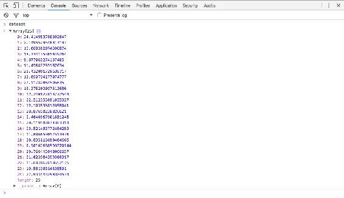
<h6 class="calibre37"><span class="keep-together">Figure 6-9.
</span>Random values in console</h6>
</div>
</figure>

Notice that they are all decimal or floating-point values (such as
14.793717765714973), not whole numbers or integers (such as 14) like we
used initially. For this example, decimal values are fine, but if you
ever need whole numbers, you could use JavaScript’s `Math.round()` or
`Math.floor()` methods. `Math.round()` rounds any number to the nearest
integer, whereas `Math.floor()` always rounds down, for greater control
over the result. For example, you could wrap the random number generator
from this line:

``` calibre39
    var newNumber = Math.random() * 30;
```

as follows:

``` calibre39
    var newNumber = Math.floor(Math.random() * 30);
```

Using this code, `newNumber` would always be either 0 or 29, or any
integer in between. Why not 30? Because `Math.random()` always returns
values *less than* 1.0, and `Math.floor()` will always *round down*, so
29 is the highest possible return value.

Try it out in *07_power_of_data_rounded.html*, and use the console to
verify that the numbers have indeed been rounded to integers, as
displayed in <a href="#ch06.xhtml_Random_integer_values_in_console"
class="calibre5 pcalibre pcalibre2 pcalibre3 pcalibre1"
data-type="xref">Figure 6-10</a>.

<figure class="calibre35">
<div id="ch06.xhtml_Random_integer_values_in_console" class="figure">
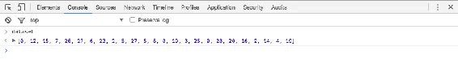
<h6 class="calibre37"><span class="keep-together">Figure 6-10.
</span>Random integer values in console</h6>
</div>
</figure>

That’s about all we can do visually with `div`s. Let’s expand our visual
possibilities with SVG.

</div>

</div>

</div>

</div>

<div class="section calibre2" data-type="sect1"
pdf-bookmark="Drawing SVGs">

<div id="ch06.xhtml_idm140093202479024" class="dedication">

# Drawing SVGs

For <span id="ch06.xhtml_idm140093201993376"
class="calibre5 pcalibre pcalibre2 pcalibre3 pcalibre1"
data-type="indexterm" primary="attributes" secondary="in SVG elements"
secondary-sortas="SVG elements"></span>a quick refresher on SVG syntax,
see <a href="#ch03.xhtml_SVG_3"
class="calibre5 pcalibre pcalibre2 pcalibre3 pcalibre1"
data-type="xref">“SVG”</a>.

One <span id="ch06.xhtml_idm140093201990752"
class="calibre5 pcalibre pcalibre2 pcalibre3 pcalibre1"
data-type="indexterm"
primary="elements (SVG)"></span><span id="ch06.xhtml_idm140093201990016"
class="calibre5 pcalibre pcalibre2 pcalibre3 pcalibre1"
data-type="indexterm" primary="SVG (Scalable Vector Graphics)"
secondary="property/value pairs"></span>thing you might notice about SVG
elements is that all of their properties are specified as *attributes*.
That is, they are included as property/value pairs within each element
tag, like this:

``` calibre39
<element property="value"></element>
```

Hmm, that looks strangely like HTML!

``` calibre39
<p class="eureka">Eureka!</p>
```

We <span id="ch06.xhtml_idm140093201834336"
class="calibre5 pcalibre pcalibre2 pcalibre3 pcalibre1"
data-type="indexterm"
primary="append()"></span><span id="ch06.xhtml_idm140093201982352"
class="calibre5 pcalibre pcalibre2 pcalibre3 pcalibre1"
data-type="indexterm" primary="attr()"></span>have already used D3’s
handy `append()` and `attr()` methods to create new HTML elements and
set their attributes. Because SVG elements exist in the DOM, just as
HTML elements do, we can use `append()` and `attr()` in exactly the same
way to generate SVG images.

<div class="section calibre2" data-type="sect2"
pdf-bookmark="Create the SVG">

<div id="ch06.xhtml_idm140093201979728" class="dedication">

## Create the SVG

First, <span id="ch06.xhtml_idm140093201985712"
class="calibre5 pcalibre pcalibre2 pcalibre3 pcalibre1"
data-type="indexterm" primary="SVG (Scalable Vector Graphics)"
secondary="creating elements"></span>we need to create the SVG element
in which to place all our shapes:

``` calibre39
d3.select("body").append("svg");
```

That will find the document’s `body` and append a new `svg` element just
before the closing `</body>` tag. That code will work, but I’d like to
suggest a slight modification:

``` calibre39
var svg = d3.select("body").append("svg");
```

Remember how most D3 methods return a reference to the DOM element on
which they act? By creating a new variable `svg`, we are able to capture
the reference handed back by `append()`. Think of `svg` not as a
variable but as a reference pointing to the SVG object that we just
created. This reference will save us a lot of code later. Instead of
having to search for that SVG each time—as in `d3.select("svg")`—we just
say `svg`:

``` calibre39
svg.attr("width", 500)
   .attr("height", 50);
```

Alternatively, that could all be written as one line of code:

``` calibre39
var svg = d3.select("body")
            .append("svg")
            .attr("width", 500)
            .attr("height", 50);
```

See *08_drawing_svgs.html* for that code. You won’t see anything
visually yet, but inspect the DOM and verify that there is, indeed, an
empty SVG element.

To <span id="ch06.xhtml_idm140093201814096"
class="calibre5 pcalibre pcalibre2 pcalibre3 pcalibre1"
data-type="indexterm" primary="variables"></span>simplify your life, I
recommend putting the width and height values into variables at the top
of your code, as in *09_drawing_svgs_size.html*. View the source, and
you’ll see the following code:

``` calibre39
//Width and height
var w = 500;
var h = 50;
```

I’ll be doing that with all future examples. By *variabalizing* the size
values, you can easily reference them throughout your code, as in the
following:

``` calibre39
var svg = d3.select("body")
            .append("svg")
            .attr("width", w)   // <-- Here
            .attr("height", h); // <-- and here!
```

Also, if you send me a petition to make “variabalize” a real word, I
will gladly sign it.

</div>

</div>

<div class="section calibre2" data-type="sect2"
pdf-bookmark="Data-Driven Shapes">

<div id="ch06.xhtml_idm140093201986688" class="dedication">

## Data-Driven Shapes

Time <span id="ch06.xhtml_idm140093201664320"
class="calibre5 pcalibre pcalibre2 pcalibre3 pcalibre1"
data-type="indexterm"
primary="data-driven shapes"></span><span id="ch06.xhtml_idm140093201663584"
class="calibre5 pcalibre pcalibre2 pcalibre3 pcalibre1"
data-type="indexterm" primary="SVG (Scalable Vector Graphics)"
secondary="creating shapes"></span>to add some shapes. I’ll bring back
our trusty old dataset:

``` calibre39
var dataset = [ 5, 10, 15, 20, 25 ];
```

and then use `data()` to iterate through each data point,
<span id="ch06.xhtml_idm140093201651376"
class="calibre5 pcalibre pcalibre2 pcalibre3 pcalibre1"
data-type="indexterm"
primary="circles, drawing"></span><span id="ch06.xhtml_idm140093201650880"
class="calibre5 pcalibre pcalibre2 pcalibre3 pcalibre1"
data-type="indexterm" primary="drawing"
secondary="circles"></span>creating a `circle` for each one:

``` calibre39
svg.selectAll("circle")
    .data(dataset)
    .enter()
    .append("circle");
```

Remember, `selectAll()` will return empty references to all `circle`s
(which don’t exist yet), `data()` binds our data to the elements we’re
about to create, `enter()` returns a placeholder reference to the new
element, and `append()` finally adds a `circle` to the DOM. In this
case, it appends those `circle`s to the end of the SVG element, as our
initial selection is our reference `svg` (as opposed to the document
`body`, for example).

To make it easy to reference all of the `circle`s later, we can create a
new variable to store references to them all:

``` calibre39
var circles = svg.selectAll("circle")
                 .data(dataset)
                 .enter()
                 .append("circle");
```

Great, but all these circles still need positions and sizes, displayed
in <a href="#ch06.xhtml_Row_of_data_circles"
class="calibre5 pcalibre pcalibre2 pcalibre3 pcalibre1"
data-type="xref">Figure 6-11</a>. Be warned, the following code might
blow your mind:

``` calibre39
circles.attr("cx", function(d, i) {
            return (i * 50) + 25;
        })
       .attr("cy", h/2)
       .attr("r", function(d) {
            return d;
       });
```

<figure class="calibre35">
<div id="ch06.xhtml_Row_of_data_circles" class="figure">

<h6 class="calibre37"><span class="keep-together">Figure 6-11.
</span>Row of data circles</h6>
</div>
</figure>

Feast your eyes on the demo *10_drawing_svgs_circles.html*. Let’s step
through the code, one line at a time:

``` calibre39
circles.attr("cx", function(d, i) {
            return (i * 50) + 25;
        })
```

This takes the reference to all `circle`s and sets the `cx` attribute
for each one. (Remember that, in SVG lingo, `cx` is the x-position value
of the *center* of the circle.) Our data has already been bound to the
`circle` elements, so for each `circle`, the value `d` matches the
corresponding value in our original dataset (5, 10, 15, 20, or 25).

Another value, `i`, is also automatically populated for us. (Thanks,
D3!) Just as with `d`, the name `i` here is arbitrary and could be set
to whatever you like, such as `counter` or `elementID`. I prefer to use
`i` because it is concise, it alludes to the convention of using `i` in
`for` loops, and it is very common, as you’ll see it in all the online
examples.

So, `i` is a numeric index value of the current element. Counting starts
at zero, so for our “first” circle `i == 0`, the second circle’s
`i == 1`, and so on. We’re using `i` to push each subsequent circle over
to the right, because each subsequent loop through, the value of `i`
increases by one:

``` calibre39
(0 * 50) + 25   //Returns 25
(1 * 50) + 25   //Returns 75
(2 * 50) + 25   //Returns 125
(3 * 50) + 25   //Returns 175
(4 * 50) + 25   //Returns 225
```

To make sure `i` is available to your custom function, you must include
it as an argument in the function definition, `function(d, i)`. You must
also include `d`, even if you don’t use `d` within your function (as in
the preceding case). This is because the index value is always passed
into the second argument; you can’t get the index without also getting
the data value, even if you have no use for the latter.

On to the next line:

``` calibre39
.attr("cy", h/2)
```

`cy` is the y-position value of the center of each circle. We’re setting
`cy` to `h` divided by two, or one-half of `h`. You’ll recall that `h`
stores the height of the entire SVG, so `h/2` has the effect of aligning
all `circle`s in the vertical center of the image:

``` calibre39
.attr("r", function(d) {
    return d;
});
```

Finally, the radius `r` of each `circle` is simply set to `d`, the
corresponding data value. (Note: Never use radius to express data
values, for reasons I’ll address later in this chapter.)

</div>

</div>

<div class="section calibre2" data-type="sect2"
pdf-bookmark="Pretty Colors, Oooh!">

<div id="ch06.xhtml_idm140093201665264" class="dedication">

## Pretty Colors, Oooh!

Color <span id="ch06.xhtml_idm140093201322208"
class="calibre5 pcalibre pcalibre2 pcalibre3 pcalibre1"
data-type="indexterm" primary="colors"
secondary="adding to SVG"></span><span id="ch06.xhtml_idm140093201321200"
class="calibre5 pcalibre pcalibre2 pcalibre3 pcalibre1"
data-type="indexterm" primary="SVG (Scalable Vector Graphics)"
secondary="adding colors to"></span>fills and strokes are just other
attributes that you can set using the same methods. Simply by appending
this code:

``` calibre39
.attr("fill", "yellow")
.attr("stroke", "orange")
.attr("stroke-width", function(d) {
    return d/2;
});
```

we get the colorful circles shown in
<a href="#ch06.xhtml_Colorful_data_circles"
class="calibre5 pcalibre pcalibre2 pcalibre3 pcalibre1"
data-type="xref">Figure 6-12</a>, as seen in
*11_drawing_svgs_color.html*.

<figure class="calibre35">
<div id="ch06.xhtml_Colorful_data_circles" class="figure">

<h6 class="calibre37"><span class="keep-together">Figure 6-12.
</span>Colorful data circles</h6>
</div>
</figure>

Note that the top and bottom edges of the far-right circle are cut off
where they exceed the boundaries of the SVG image. Inspect the DOM to
see how the circle is actually “taller” than the SVG.

Of course, you can mix and match attributes and custom functions to
apply any combination of properties. The trick with data visualization,
of course, is choosing appropriate *mappings*, so the visual expression
of your data is understandable and useful for the viewer.

</div>

</div>

</div>

</div>

<div class="section calibre2" data-type="sect1"
pdf-bookmark="Making a Bar Chart">

<div id="ch06.xhtml_idm140093201994480" class="dedication">

# Making a Bar Chart

Now <span id="ch06.xhtml_BCcreate06"
class="calibre5 pcalibre pcalibre2 pcalibre3 pcalibre1"
data-type="indexterm" primary="bar charts"
secondary="simple"></span><span id="ch06.xhtml_idm140093201258160"
class="calibre5 pcalibre pcalibre2 pcalibre3 pcalibre1"
data-type="indexterm" primary="bar charts"
see="also charts"></span>we’ll integrate everything we’ve learned so far
to generate a simple bar chart as an SVG image.

We’ll start by adapting the `div` bar chart code to draw its bars with
SVG instead, giving us more flexibility over the visual presentation.
Then we’ll add labels, so we can see the data values clearly.

<div class="section calibre2" data-type="sect2"
pdf-bookmark="The Old Chart">

<div id="ch06.xhtml_idm140093201255856" class="dedication">

## The Old Chart

See the `div` chart, updated with some new data, in
*12_making_a_bar_chart_divs.html*:

``` calibre39
var dataset = [ 5, 10, 13, 19, 21, 25, 22, 18, 15, 13,
                11, 12, 15, 20, 18, 17, 16, 18, 23, 25 ];

d3.select("body").selectAll("div")
    .data(dataset)
    .enter()
    .append("div")
    .attr("class", "bar")
    .style("height", function(d) {
        var barHeight = d * 5;
        return barHeight + "px";
    });
```

It might be hard to imagine, but we can definitely improve on the simple
bar chart in <a href="#ch06.xhtml_Bar_chart_with_divs"
class="calibre5 pcalibre pcalibre2 pcalibre3 pcalibre1"
data-type="xref">Figure 6-13</a> made of `div`s.

<figure class="calibre35">
<div id="ch06.xhtml_Bar_chart_with_divs" class="figure">
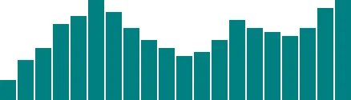
<h6 class="calibre37"><span class="keep-together">Figure 6-13.
</span>Bar chart with divs</h6>
</div>
</figure>

</div>

</div>

<div class="section calibre2" data-type="sect2"
pdf-bookmark="The New Chart">

<div id="ch06.xhtml_idm140093200983184" class="dedication">

## The New Chart

First, we need to decide on the size of the new SVG:

``` calibre39
//Width and height
var w = 500;
var h = 100;
```

Of course, you could name `w` and `h` something else, like `svgWidth`
and `svgHeight`. Use whatever is most clear to you. JavaScript
programmers, as a group, are fixated on efficiency, so you’ll often see
single-character variable names, code written with no spaces, and other
hard-to-read, yet programmatically efficient, syntax.

Then, we tell D3 to create an empty SVG element and add it to the DOM:

``` calibre39
//Create SVG element
var svg = d3.select("body")
            .append("svg")
            .attr("width", w)
            .attr("height", h);
```

To recap, this inserts a new `<svg>` element just before the closing
`</body>` tag, and assigns the SVG a width and height of 500 by 100
pixels. This statement also puts the result into our new variable called
`svg`, so we can easily reference the new SVG without having to reselect
it later using something like `d3.select("svg")`.

Next, instead of creating `div`s, we generate `rect`s and add them to
`svg`:

``` calibre39
svg.selectAll("rect")
   .data(dataset)
   .enter()
   .append("rect")
   .attr("x", 0)
   .attr("y", 0)
   .attr("width", 20)
   .attr("height", 100);
```

This code selects all `rect`s inside of `svg`. Of course, there aren’t
any yet, so an empty selection is returned. (Weird, yes, but stay with
me. With D3, you always have to first select whatever it is you’re about
to act on, even if that selection is momentarily empty.)

Then, `data(dataset)` sees that we have 20 values in the dataset, and
those values are handed off to `enter()` for processing. `enter()`, in
turn, returns a placeholder selection for each data point that does not
yet have a corresponding `rect`—which is to say, all of them.

For each of the 20 placeholders, `append("rect")` inserts a `rect` into
the DOM. As we learned in <a href="#ch03.xhtml_technology_fundamentals"
class="calibre5 pcalibre pcalibre2 pcalibre3 pcalibre1"
data-type="xref">Chapter 3</a>, every `rect` must have `x`, `y`,
`width`, and `height` values. We use `attr()` to add those attributes
onto each newly created `rect`.

Beautiful, no? Okay, maybe not. All of the bars are there (check the DOM
of *13_making_a_bar_chart_rects.html* with your web inspector), but they
all share the same `x`, `y`, `width`, and `height` values, with the
result that they all overlap (see <a href="#ch06.xhtml_One_lonely_bar"
class="calibre5 pcalibre pcalibre2 pcalibre3 pcalibre1"
data-type="xref">Figure 6-14</a>). This isn’t a visualization of data
yet.

<figure class="calibre35">
<div id="ch06.xhtml_One_lonely_bar" class="figure">

<h6 class="calibre37"><span class="keep-together">Figure 6-14.
</span>One lonely bar</h6>
</div>
</figure>

Let’s fix the overlap issue first. Instead of an `x` of `0`, we’ll
assign a dynamic value that corresponds to `i`, or each value’s position
in the dataset. So the first bar will be at `0`, but subsequent bars
will be at `21`, then `42`, and so on. (In a later chapter, we’ll learn
about D3’s *scales*, which offer a better, more flexible way to
accomplish this same feat.)

``` calibre39
.attr("x", function(d, i) {
    return i * 21;  //Bar width of 20 plus 1 for padding
})
```

See that code in action with *14_making_a_bar_chart_offset.html* and the
result in <a href="#ch06.xhtml_Twenty_bars"
class="calibre5 pcalibre pcalibre2 pcalibre3 pcalibre1"
data-type="xref">Figure 6-15</a>.

<figure class="calibre35">
<div id="ch06.xhtml_Twenty_bars" class="figure">

<h6 class="calibre37"><span class="keep-together">Figure 6-15.
</span>Twenty bars</h6>
</div>
</figure>

That works, but it’s not particularly flexible. If our dataset were
longer, then the bars would just run off to the right, past the end of
the SVG! Because each bar is 20 pixels wide, plus 1 pixel of padding, a
500-pixel wide SVG can only accommodate 23 data points. Note how the
24th bar gets clipped in <a href="#ch06.xhtml_Twentyfour_bars"
class="calibre5 pcalibre pcalibre2 pcalibre3 pcalibre1"
data-type="xref">Figure 6-16</a>.

<figure class="calibre35">
<div id="ch06.xhtml_Twentyfour_bars" class="figure">

<h6 class="calibre37"><span class="keep-together">Figure 6-16.
</span>Twenty-four bars</h6>
</div>
</figure>

It’s good practice to use flexible, dynamic coordinates—heights, widths,
x values, and y values—so your visualization can scale appropriately
along with your data.

As with anything else in programming, there are a thousand ways to
achieve that end. I’ll use a simple one. First, I’ll amend the line
where we set each bar’s x-position:

``` calibre39
.attr("x", function(d, i) {
    return i * (w / dataset.length);
})
```

Notice how the x value is now tied directly to the width of the SVG
(`w`) and the number of values in the dataset (`dataset.length`). This
is exciting because now our bars will be evenly spaced, whether we have
20 data values, as in <a href="#ch06.xhtml_Twenty_evenly_spaced_bars"
class="calibre5 pcalibre pcalibre2 pcalibre3 pcalibre1"
data-type="xref">Figure 6-17</a>…

<figure class="calibre35">
<div id="ch06.xhtml_Twenty_evenly_spaced_bars" class="figure">

<h6 class="calibre37"><span class="keep-together">Figure 6-17.
</span>Twenty evenly spaced bars</h6>
</div>
</figure>

…or only five, as in <a href="#ch06.xhtml_Five_evenly_spaced_bars"
class="calibre5 pcalibre pcalibre2 pcalibre3 pcalibre1"
data-type="xref">Figure 6-18</a>.

<figure class="calibre35">
<div id="ch06.xhtml_Five_evenly_spaced_bars" class="figure">

<h6 class="calibre37"><span class="keep-together">Figure 6-18.
</span>Five evenly spaced bars</h6>
</div>
</figure>

See that code so far in *15_making_a_bar_chart_even.html*.

Now we should set the bar *widths* to be proportional, too, so they get
narrower as more data is added, or wider when there are fewer values.
I’ll add a new variable near where we set the SVG’s width and height:

``` calibre39
//Width and height
var w = 500;
var h = 100;
var barPadding = 1;  // <-- New!
```

and then reference that variable in the line where we set each bar’s
`width`. Instead of a static value of `20`, the width will now be set as
a fraction of the SVG width and number of data points, minus a padding
value:

``` calibre39
.attr("width", w / dataset.length - barPadding)
```

It works! (See
<a href="#ch06.xhtml_Twenty_evenly_spaced_bars_with_dynamic_widths"
class="calibre5 pcalibre pcalibre2 pcalibre3 pcalibre1"
data-type="xref">Figure 6-19</a> and
*16_making_a_bar_chart_widths.html*.)

<figure class="calibre35">
<div id="ch06.xhtml_Twenty_evenly_spaced_bars_with_dynamic_widths"
class="figure">
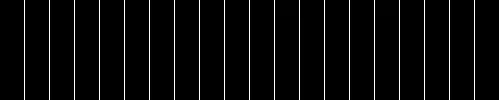
<h6 class="calibre37"><span class="keep-together">Figure 6-19.
</span>Twenty evenly spaced bars with dynamic widths</h6>
</div>
</figure>

The bar widths and x-positions scale correctly whether there are 20
points, only 5 (see
<a href="#ch06.xhtml_Five_evenly_spaced_bars_with_dynamic_widths"
class="calibre5 pcalibre pcalibre2 pcalibre3 pcalibre1"
data-type="xref">Figure 6-20</a>), or even 100 (see
<a href="#ch06.xhtml_One_hundred_evenly_spaced_bars_with_dynamic_widths"
class="calibre5 pcalibre pcalibre2 pcalibre3 pcalibre1"
data-type="xref">Figure 6-21</a>).

<figure class="calibre35">
<div id="ch06.xhtml_Five_evenly_spaced_bars_with_dynamic_widths"
class="figure">

<h6 class="calibre37"><span class="keep-together">Figure 6-20.
</span>Five evenly spaced bars with dynamic widths</h6>
</div>
</figure>

<figure class="calibre35">
<div id="ch06.xhtml_One_hundred_evenly_spaced_bars_with_dynamic_widths"
class="figure">
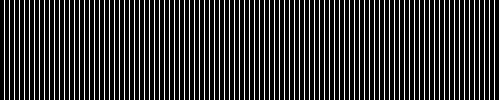
<h6 class="calibre37"><span class="keep-together">Figure 6-21.
</span>One hundred evenly spaced bars with dynamic widths</h6>
</div>
</figure>

Finally, we encode our data as the *height* of each bar. You would hope
it were as easy as referencing the `d` data value when setting each
bar’s `height`:

``` calibre39
.attr("height", function(d) {
    return d;
});
```

Hmm, the chart in <a href="#ch06.xhtml_Dynamic_heights"
class="calibre5 pcalibre pcalibre2 pcalibre3 pcalibre1"
data-type="xref">Figure 6-22</a> looks funky.

<figure class="calibre35">
<div id="ch06.xhtml_Dynamic_heights" class="figure">

<h6 class="calibre37"><span class="keep-together">Figure 6-22.
</span>Dynamic heights</h6>
</div>
</figure>

Maybe we can just scale up our numbers a bit?

``` calibre39
.attr("height", function(d) {
    return d * 4;  // <-- Times four!
});
```

Alas, it is not that easy! We want our bars to grow upward from the
bottom edge, not down from the top, as in
<a href="#ch06.xhtml_Dynamic_heights_magnified"
class="calibre5 pcalibre pcalibre2 pcalibre3 pcalibre1"
data-type="xref">Figure 6-23</a>—but don’t blame D3, blame SVG.

<figure class="calibre35">
<div id="ch06.xhtml_Dynamic_heights_magnified" class="figure">

<h6 class="calibre37"><span class="keep-together">Figure 6-23.
</span>Dynamic heights, magnified</h6>
</div>
</figure>

You’ll recall that, when drawing SVG `rect`s, the x and y values specify
the coordinates of the *upper-left corner*. That is, the origin or
reference point for every `rect` is its top left. For our purposes, it
would be soooooo much easier to set the origin point as the bottom-left
corner, but that’s just not how SVG does it, and frankly, SVG is
indifferent about our feelings on the matter.

Given that our bars do have to “grow down from the top,” then where is
“the top” of each bar in relationship to the top of the SVG? Well, the
top of each bar could be <span class="keep-together">expressed</span> as
a relationship between the height of the SVG and the corresponding data
value, as in:

``` calibre39
.attr("y", function(d) {
    return h - d;  //Height minus data value
})
```

Then, to put the “bottom” of the bar on the bottom of the SVG (see
<a href="#ch06.xhtml_Growing_down_from_above"
class="calibre5 pcalibre pcalibre2 pcalibre3 pcalibre1"
data-type="xref">Figure 6-24</a>), each `rect`’s height can be just the
data value itself:

``` calibre39
.attr("height", function(d) {
    return d;  //Just the data value
});
```

<figure class="calibre35">
<div id="ch06.xhtml_Growing_down_from_above" class="figure">

<h6 class="calibre37"><span class="keep-together">Figure 6-24.
</span>Growing down from above</h6>
</div>
</figure>

Let’s scale things up a bit by changing `d` to `d * 4`, with the result
shown in <a href="#ch06.xhtml_Growing_bigger_from_above"
class="calibre5 pcalibre pcalibre2 pcalibre3 pcalibre1"
data-type="xref">Figure 6-25</a>. (Just as with the bar placements, we
could do this more properly using D3 scales, but we’re not there yet.)

<figure class="calibre35">
<div id="ch06.xhtml_Growing_bigger_from_above" class="figure">
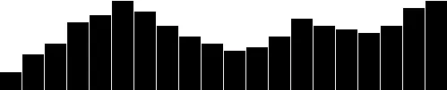
<h6 class="calibre37"><span class="keep-together">Figure 6-25.
</span>Growing bigger from above</h6>
</div>
</figure>

The working code for our growing-down-from-above, SVG bar chart is in
*17_making_a_bar_chart_heights.html*.<span id="ch06.xhtml_idm140093200450944"
class="calibre5 pcalibre pcalibre2 pcalibre3 pcalibre1"
data-type="indexterm" primary="" startref="BCcreate06"></span>

</div>

</div>

<div class="section calibre2" data-type="sect2" pdf-bookmark="Color">

<div id="ch06.xhtml_idm140093200981568" class="dedication">

## Color

Adding <span id="ch06.xhtml_idm140093200445936"
class="calibre5 pcalibre pcalibre2 pcalibre3 pcalibre1"
data-type="indexterm" primary="colors"
secondary="adding to bar charts"></span><span id="ch06.xhtml_idm140093200444928"
class="calibre5 pcalibre pcalibre2 pcalibre3 pcalibre1"
data-type="indexterm" primary="bar charts"
secondary="adding color to"></span>color is easy. Just use `attr()` to
set a `fill`:

``` calibre39
.attr("fill", "teal");
```

Find the all-teal bar chart shown in <a href="#ch06.xhtml_Teal_bars"
class="calibre5 pcalibre pcalibre2 pcalibre3 pcalibre1"
data-type="xref">Figure 6-26</a> in *18_making_a_bar_chart_teal.html*.

<figure class="calibre35">
<div id="ch06.xhtml_Teal_bars" class="figure">
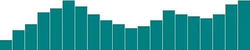
<h6 class="calibre37"><span class="keep-together">Figure 6-26.
</span>Teal bars</h6>
</div>
</figure>

Teal is nice, but you’ll often want a shape’s color to reflect some
quality of the data. <span id="ch06.xhtml_idm140093200436256"
class="calibre5 pcalibre pcalibre2 pcalibre3 pcalibre1"
data-type="indexterm"
primary="data values, encoding as color"></span><span id="ch06.xhtml_idm140093200435584"
class="calibre5 pcalibre pcalibre2 pcalibre3 pcalibre1"
data-type="indexterm"
primary="encoding values"></span><span id="ch06.xhtml_idm140093200434912"
class="calibre5 pcalibre pcalibre2 pcalibre3 pcalibre1"
data-type="indexterm" primary="dual encoding"></span>That is, you might
want to *encode* the data values as color. (In the case of our bar
chart, that makes a *dual encoding*, in which the same data value is
encoded in two different visual properties: both height and color.)

Using data to drive color is as easy as writing a custom function that
again references `d`. Here, we replace `"teal"` with a custom function,
resulting in the chart in <a href="#ch06.xhtml_Datadriven_blue_bars"
class="calibre5 pcalibre pcalibre2 pcalibre3 pcalibre1"
data-type="xref">Figure 6-27</a>.

``` calibre39
.attr("fill", function(d) {
    return "rgb(0, 0, " + Math.round(d * 10) + ")";
});
```

<figure class="calibre35">
<div id="ch06.xhtml_Datadriven_blue_bars" class="figure">
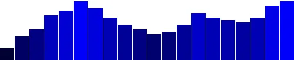
<h6 class="calibre37"><span class="keep-together">Figure 6-27.
</span>Data-driven blue bars</h6>
</div>
</figure>

See the code in *19_making_a_bar_chart_blues.html*. This is not a
particularly useful visual encoding, but you can get the idea of how to
translate data into color. Here, `d` is multiplied by 10, and then
rounded to the nearest whole number with `Math.round()`. The resulting
number is used as the blue value in an `rgb()` color definition. So the
greater values of `d` (taller bars) will be more blue. Smaller values of
`d` (shorter bars) will be less blue (closer to black). The red and
green components of the color are fixed at zero.

<div class="calibre27 note" data-type="note">

# Exercise

Try manipulating these RGB values on your own to get a feel for how they
work.

</div>

</div>

</div>

<div class="section calibre2" data-type="sect2" pdf-bookmark="Labels">

<div id="ch06.xhtml_idm140093200980944" class="dedication">

## Labels

Visuals <span id="ch06.xhtml_idm140093200339712"
class="calibre5 pcalibre pcalibre2 pcalibre3 pcalibre1"
data-type="indexterm" primary="bar charts"
secondary="adding labels to"></span>are great, but sometimes you need to
show the actual data values as text within the visualization. Here’s
where value labels come in, and they are very easy to generate with D3.

You’ll recall from the SVG primer that you can add `text` elements to an
SVG element. Let’s start with:

``` calibre39
svg.selectAll("text")
   .data(dataset)
   .enter()
   .append("text")
```

Look familiar? Just as we did for the `rect`s, here we do for the
`text`s. First, select what you want, bring in the data, enter the new
elements (which are just placeholders at this point), and finally append
the new `text` elements to the DOM.

We’ll <span id="ch06.xhtml_idm140093200306416"
class="calibre5 pcalibre pcalibre2 pcalibre3 pcalibre1"
data-type="indexterm" primary="d3.text()"></span>extend that code to
include a data value within each `text` element by using the `text()`
method:

``` calibre39
   .text(function(d) {
       return d;
   })
```

and then extend it further, by including x and y values to position the
text. It’s easiest if I just copy and paste the same x/y code we
previously used for the bars:

``` calibre39
   .attr("x", function(d, i) {
       return i * (w / dataset.length);
   })
   .attr("y", function(d) {
       return h - (d * 4);
   });
```

Aha! Value labels! But some are getting cut off at the top (see
<a href="#ch06.xhtml_Baby_value_labels"
class="calibre5 pcalibre pcalibre2 pcalibre3 pcalibre1"
data-type="xref">Figure 6-28</a>).

<figure class="calibre35">
<div id="ch06.xhtml_Baby_value_labels" class="figure">
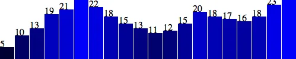
<h6 class="calibre37"><span class="keep-together">Figure 6-28.
</span>Baby value labels!</h6>
</div>
</figure>

Let’s try moving them down, inside the bars, by adding a small amount to
the `x` and `y` calculations:

``` calibre39
   .attr("x", function(d, i) {
       return i * (w / dataset.length) + 5;  // +5
   })
   .attr("y", function(d) {
       return h - (d * 4) + 15;  // +15
   });
```

The chart in <a href="#ch06.xhtml_Inbar_value_labels"
class="calibre5 pcalibre pcalibre2 pcalibre3 pcalibre1"
data-type="xref">Figure 6-29</a> is better, but not legible.

<figure class="calibre35">
<div id="ch06.xhtml_Inbar_value_labels" class="figure">
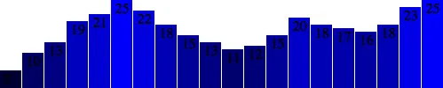
<h6 class="calibre37"><span class="keep-together">Figure 6-29.
</span>In-bar value labels</h6>
</div>
</figure>

Fortunately, we can fix that:

``` calibre39
   .attr("font-family", "sans-serif")
   .attr("font-size", "11px")
   .attr("fill", "white");
```

Fantasti-code! See *20_making_a_bar_chart_labels.html* for the brilliant
visualization shown in <a href="#ch06.xhtml_Really_nice_value_labels"
class="calibre5 pcalibre pcalibre2 pcalibre3 pcalibre1"
data-type="xref">Figure 6-30</a>.

<figure class="calibre35">
<div id="ch06.xhtml_Really_nice_value_labels" class="figure">
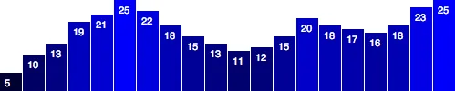
<h6 class="calibre37"><span class="keep-together">Figure 6-30.
</span>Really nice value labels</h6>
</div>
</figure>

If you are not typographically obsessive, then you’re all done. If,
however, you are like me, you’ll notice that the value labels aren’t
perfectly aligned within their bars. (For example, note the “5” in the
first column.) That’s easy enough to fix. Let’s use the SVG
`text-anchor` attribute to center the text horizontally at the assigned
x value:

``` calibre39
    .attr("text-anchor", "middle")
```

Then, let’s change the way we calculate the x-position by setting it to
the left edge of each bar *plus* half the bar width:

``` calibre39
    .attr("x", function(d, i) {
        return i * (w / dataset.length) + (w / dataset.length - barPadding) / 2;
    })
```

And I’ll also bring the labels up one pixel for perfect spacing, as you
can see in <a href="#ch06.xhtml_Centered_labels"
class="calibre5 pcalibre pcalibre2 pcalibre3 pcalibre1"
data-type="xref">Figure 6-31</a> and
*21_making_a_bar_chart_aligned.html*:

``` calibre39
    .attr("y", function(d) {
        return h - (d * 4) + 14;  //15 is now 14
    })
```

<figure class="calibre35">
<div id="ch06.xhtml_Centered_labels" class="figure">

<h6 class="calibre37"><span class="keep-together">Figure 6-31.
</span>Centered labels</h6>
</div>
</figure>

</div>

</div>

</div>

</div>

<div class="section calibre2" data-type="sect1"
pdf-bookmark="Making a Scatterplot">

<div id="ch06.xhtml_idm140093200340816" class="dedication">

# Making a Scatterplot

So <span id="ch06.xhtml_Screat06"
class="calibre5 pcalibre pcalibre2 pcalibre3 pcalibre1"
data-type="indexterm" primary="scatterplots"
secondary="creating"></span>far, we’ve drawn only bar charts with simple
data—just one-dimensional sets of numbers.

But when you have two sets of values to plot against each other, you
need a second dimension. The scatterplot is a common type of
visualization that represents two sets of corresponding values on two
different axes: horizontal and vertical, x and y.

<div class="section calibre2" data-type="sect2" pdf-bookmark="The Data">

<div id="ch06.xhtml_idm140093199919952" class="dedication">

## The Data

As you saw in <a href="#ch03.xhtml_technology_fundamentals"
class="calibre5 pcalibre pcalibre2 pcalibre3 pcalibre1"
data-type="xref">Chapter 3</a>, you have a lot of flexibility around how
to structure a dataset. For our scatterplot, I’m going to use an array
of arrays. The primary array will contain one element for each data
“point.” Each of those “point” elements will be another array, with just
two values: one for the x value, and one for y:

``` calibre39
var dataset = [
                [5, 20], [480, 90], [250, 50], [100, 33], [330, 95],
                [410, 12], [475, 44], [25, 67], [85, 21], [220, 88]
              ];
```

Remember, `[]` means array, so nested hard brackets `[[]]` indicate an
array within another array. We separate array elements with commas, so
an array containing three other arrays would look like this:
`[[],[],[]]`.

We could rewrite our dataset with more whitespace so it’s easier to
read:

``` calibre39
var dataset = [
                  [   5,   20 ],
                  [ 480,   90 ],
                  [ 250,   50 ],
                  [ 100,   33 ],
                  [ 330,   95 ],
                  [ 410,   12 ],
                  [ 475,   44 ],
                  [  25,   67 ],
                  [  85,   21 ],
                  [ 220,   88 ]
              ];
```

Now you can see that each of these 10 rows will correspond to one point
in our visualization. With the row `[5, 20]`, for example, we’ll use `5`
as the x value, and `20` for the y.

</div>

</div>

<div class="section calibre2" data-type="sect2"
pdf-bookmark="The Scatterplot">

<div id="ch06.xhtml_idm140093199712624" class="dedication">

## The Scatterplot

Let’s carry over most of the code from our bar chart experiments,
including the piece that creates the SVG element:

``` calibre39
//Create SVG element
var svg = d3.select("body")
            .append("svg")
            .attr("width", w)
            .attr("height", h);
```

Instead of creating `rect`s, however, we’ll make a `circle` for each
data point:

``` calibre39
svg.selectAll("circle")  // <-- No longer "rect"
   .data(dataset)
   .enter()
   .append("circle")     // <-- No longer "rect"
```

Also, instead of specifying the `rect` attributes of `x`, `y`, `width`,
and `height`, our `circle`s need `cx`, `cy`, and `r`:

``` calibre39
   .attr("cx", function(d) {
       return d[0];
   })
   .attr("cy", function(d) {
       return d[1];
   })
   .attr("r", 5);
```

See the working scatterplot code that recreates the result shown in
<a href="#ch06.xhtml_Simple_scatterplot"
class="calibre5 pcalibre pcalibre2 pcalibre3 pcalibre1"
data-type="xref">Figure 6-32</a> in *22_scatterplot.html*.

<figure class="calibre35">
<div id="ch06.xhtml_Simple_scatterplot" class="figure">
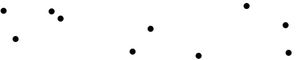
<h6 class="calibre37"><span class="keep-together">Figure 6-32.
</span>Simple scatterplot</h6>
</div>
</figure>

Notice how we access the data values and use them for the `cx` and `cy`
values. When using `function(d)`, D3 automatically hands off the current
data value as `d` to your function. In this case, the current data value
is one of the smaller subarrays in our larger `dataset` array.

When each single datum `d` is itself an array of values (and not just a
single value, like `3.14159`), you need to use bracket notation to
access its values. Hence, instead of `return d`, we use `return d[0]`
and `return d[1]`, which return the first and second values of the
array, respectively.

For example, in the case of our first data point `[5, 20]`, the first
value (array position `0`) is `5`, and the second value (array position
`1`) is `20`. Thus:

``` calibre39
d[0] returns 5
d[1] returns 20
```

By the way, if you ever want to access any value in the larger dataset
(outside of D3, say), you can do so using bracket notation. For example:

``` calibre39
dataset[5] returns [410, 12]
```

You can even use multiple sets of brackets to access values within
nested arrays:

``` calibre39
dataset[5][1] returns 12
```

Don’t believe me? Take another look at the scatterplot page
*22_scatterplot.html*, open your JavaScript console, type in
**`dataset[5]`** or **`dataset[5][1]`**, and see what happens.

</div>

</div>

<div class="section calibre2" data-type="sect2" pdf-bookmark="Size">

<div id="ch06.xhtml_idm140093199712000" class="dedication">

## Size

Maybe you want the circles to be different sizes, so each circle’s area
corresponds to its y value. As a general rule, when visualizing
quantitative values with circles, make sure to encode the values as
*area*, not as a circle’s *radius*. Perceptually, humans interpret the
overall amount of “ink” or pixels (the area) to reflect the data value.
A common mistake is to map the value to the radius, which would vastly
overrepresent the data and distort the relative relationship between
values. (For that matter, humans are not so great at accurately
comparing *areas*, either, but that’s another discussion.) Mapping to
the radius is easier to do, as it requires less math, but the result
will visually distort your data.

Yet when creating SVG circles, we can’t specify an `area` value; we have
to calculate the radius `r` and then set that. So, starting with a data
value as area, how do we get to a radius value?

You might remember that the area of a circle equals π times the radius
squared, or *A* = π*r*<sup>2</sup>.

To solve for *r*, we can rework the equation like so:

``` calibre39
A = π r^2           //Original equation for area
A / π = r^2         //Divide both sides by pi
sqrt ( A / π ) = r  //Take the square root of both sides
r = sqrt ( A / π )  //Flip the equation around for legibility
```

So our solution for *r* is 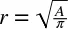.
As long as we know the area *A*, we just divide by pi, then take the
square root in order to get the radius.

For us, the area of each circle is driven by a data value—`d[1]`, in
this case. Actually, let’s subtract that value from `h`, so the circles
at the top are larger. So our *area* value *A* is `h - d[1]`.
(Admittedly, it is not a meaningful to include `h` here; please just
bear with me for the sake of the example. I promise to illustrate a
cleaner and more meaningful approach using scales in
<a href="#ch07.xhtml_scales-chapter7"
class="calibre5 pcalibre pcalibre2 pcalibre3 pcalibre1"
data-type="xref">Chapter 7</a>.) We could update our equation as
pseudocode as follows:

``` calibre39
r = sqrt ( ( h - d[1] ) / π )
```

The D3 code equivalent is:

``` calibre39
.attr("r", function(d) {
    return Math.sqrt( (h - d[1]) / Math.PI );
});
```

*That said*, we can actually omit the pi part, resulting in the simpler:

``` calibre39
.attr("r", function(d) {
    return Math.sqrt(h - d[1]);
});
```

“That’s not possible,” you say. “Archimedes’s equation *A* =
π*r*<sup>2</sup> is sacred! You can’t arbitrarily change it to *A* =
*r*<sup>2</sup>!”

You are right, of course! If the “area” here were an actual area value
of an actual, measured circle—such as that of an 18-inch pizza (254
in<sup>2</sup> or 1.77 ft<sup>2</sup>)—then we should divide by pi. But
since the “areas” of our circles are just arbitrary data values and not
real-life measurements, dividing by pi merely reduces each number to
about a third of its original value. What matters here is not the
*actual* circle areas, but the *relative* areas. The actual areas will
vary greatly, anyway, when your chart is viewed on different devices and
displays. For purposes of honest visual representation, dividing by pi
is not necessary; it has the effect of simply making all circles equally
smaller.

See *23_scatterplot_sqrt.html* for the code that results in the
scatterplot shown in
<a href="#ch06.xhtml_Scatterplot_with_sized_circles"
class="calibre5 pcalibre pcalibre2 pcalibre3 pcalibre1"
data-type="xref">Figure 6-33</a>.

<figure class="calibre35">
<div id="ch06.xhtml_Scatterplot_with_sized_circles" class="figure">
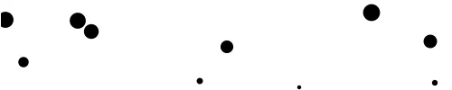
<h6 class="calibre37"><span class="keep-together">Figure 6-33.
</span>Scatterplot with sized circles</h6>
</div>
</figure>

After arbitrarily subtracting the datum’s y value `d[1]` from the SVG
height `h`, and then taking the square root, we see that circles with
greater y values (those circles lower down) have smaller areas (and
shorter radii).

This particular use of circle area as a visualization tool isn’t
necessarily useful. I simply want to illustrate how you can use `d`,
along with bracket notation, to reference an individual datum, apply
some transformation to that value, and use the newly calculated value to
*return* a value back to the attribute-setting method (a value used for
`r`, in this case).

</div>

</div>

<div class="section calibre2" data-type="sect2" pdf-bookmark="Labels">

<div id="ch06.xhtml_idm140093199611584" class="dedication">

## Labels

Let’s label our data points with `text` elements. I’ll adapt the label
code from our bar chart experiments, starting with the following:

``` calibre39
svg.selectAll("text")  // <-- Note "text", not "circle" or "rect"
   .data(dataset)
   .enter()
   .append("text")     // <-- Same here!
```

This looks for all `text` elements in the SVG (there aren’t any yet),
and then appends a new `text` element for each data point. Then we use
the `text()` method to specify each element’s contents:

``` calibre39
   .text(function(d) {
       return d[0] + "," + d[1];
   })
```

This looks messy, but bear with me. Once again, we’re using
`function(d)` to access each data point. Then, within the function,
we’re using *both* `d[0]` *and* `d[1]` to get both values within that
data point array.

The plus `+` symbols, <span id="ch06.xhtml_idm140093199240592"
class="calibre5 pcalibre pcalibre2 pcalibre3 pcalibre1"
data-type="indexterm"
primary="append operators (+)"></span><span id="ch06.xhtml_idm140093199239856"
class="calibre5 pcalibre pcalibre2 pcalibre3 pcalibre1"
data-type="indexterm" primary="+ (append operator)"></span>when used
with strings, such as the comma between quotation marks `","`, act as
*append* operators. So what this one line of code is really saying is
this: get the values of `d[0]` and `d[1]` and smush them together with a
comma in the middle. The end result should be something like `5,20` or
`25,67`.

Next, we specify *where* the text should be placed with x and y values.
For now, let’s just use `d[0]` and `d[1]`, the same values that we used
to specify the `circle` positions:

``` calibre39
   .attr("x", function(d) {
       return d[0];
   })
   .attr("y", function(d) {
       return d[1];
   })
```

Finally, add a bit of font styling with:

``` calibre39
   .attr("font-family", "sans-serif")
   .attr("font-size", "11px")
   .attr("fill", "red");
```

The result in <a href="#ch06.xhtml_Scatterplot_with_labels"
class="calibre5 pcalibre pcalibre2 pcalibre3 pcalibre1"
data-type="xref">Figure 6-34</a> might not be pretty, but we got it
working! See *24_scatterplot_labels.html* for the
latest.<span id="ch06.xhtml_idm140093199350464"
class="calibre5 pcalibre pcalibre2 pcalibre3 pcalibre1"
data-type="indexterm" primary="" startref="Screat06"></span>

<figure class="calibre35">
<div id="ch06.xhtml_Scatterplot_with_labels" class="figure">
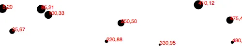
<h6 class="calibre37"><span class="keep-together">Figure 6-34.
</span>Scatterplot with labels</h6>
</div>
</figure>

</div>

</div>

</div>

</div>

<div class="section calibre2" data-type="sect1"
pdf-bookmark="Next Steps">

<div id="ch06.xhtml_idm140093199286304" class="dedication">

# Next Steps

Hopefully, <span id="ch06.xhtml_idm140093199063504"
class="calibre5 pcalibre pcalibre2 pcalibre3 pcalibre1"
data-type="indexterm" primary="D3"
secondary="core concepts of"></span>some core concepts of D3 are
becoming clear: loading data, generating new elements, and using data
values to derive attribute values for those elements.

Yet the image in <a href="#ch06.xhtml_Scatterplot_with_labels"
class="calibre5 pcalibre pcalibre2 pcalibre3 pcalibre1"
data-type="xref">Figure 6-34</a> is barely passable as a data
visualization. The scatterplot is hard to read, and the code doesn’t use
our data flexibly.

Not to worry: generating a shiny, interactive chart involves taking our
D3 skills to the next level. To use data flexibly, we’ll learn about
D3’s *scales* in the next chapter. And to make our scatterplot easier to
read, we’ll learn about *axis generators* and axis labels.

This would be a good time to take a break and stretch your legs. Maybe
go for a walk, or grab a coffee or a sandwich. I’ll hang out here (if
you don’t mind), and when you get back, we’ll jump into D3 scales!

</div>

</div>

</div>

</div>

<span id="ch07.xhtml"></span>

<div id="ch07.xhtml_sbo-rt-content" class="calibre1">

<div id="ch07.xhtml_scales-chapter7" class="dedication">

