# <span class="keep-together">Chapter 8. </span>Axes

Having mastered the use of D3 scales, we now have the scatterplot shown
in <a href="#ch08.xhtml_Large_scaled_scatterplot2"
class="calibre5 pcalibre pcalibre2 pcalibre3 pcalibre1"
data-type="xref">Figure 8-1</a>, using the code from
<a href="#ch07.xhtml_scales-chapter7"
class="calibre5 pcalibre pcalibre2 pcalibre3 pcalibre1"
data-type="xref">Chapter 7</a>’s example
*08_scaled_plot_sqrt_scale.html*.

<figure class="calibre35">
<div id="ch08.xhtml_Large_scaled_scatterplot2" class="figure">
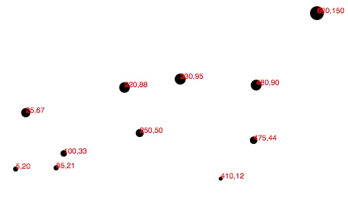
<h6 class="calibre37"><span class="keep-together">Figure 8-1.
</span>Large, scaled scatterplot</h6>
</div>
</figure>

Let’s <span id="ch08.xhtml_idm140093196910320"
class="calibre5 pcalibre pcalibre2 pcalibre3 pcalibre1"
data-type="indexterm" primary="scatterplots"
secondary="adding x/y axes to"></span>add horizontal and vertical axes,
so we can do away with the horrible red numbers cluttering up our chart.

<div class="section calibre2" data-type="sect1"
pdf-bookmark="Introducing Axes">

<div id="ch08.xhtml_idm140093196908928" class="dedication">

# Introducing Axes

Much <span id="ch08.xhtml_idm140093196907632"
class="calibre5 pcalibre pcalibre2 pcalibre3 pcalibre1"
data-type="indexterm"
primary="axis functions"></span><span id="ch08.xhtml_idm140093196906896"
class="calibre5 pcalibre pcalibre2 pcalibre3 pcalibre1"
data-type="indexterm" primary="functions"
secondary="axis functions"></span>like its scales,
<a href="https://github.com/d3/d3-axis"
class="calibre5 pcalibre pcalibre2 pcalibre3 pcalibre1">D3’s
<em>axes</em></a> are actually *functions* whose parameters you define.
Unlike scales, when an axis function is called, it doesn’t return a
value, but generates the visual elements of the axis, including lines,
labels, and ticks.

Note <span id="ch08.xhtml_idm140093196903808"
class="calibre5 pcalibre pcalibre2 pcalibre3 pcalibre1"
data-type="indexterm" primary="SVG (Scalable Vector Graphics)"
secondary="axis functions and"></span>that the axis functions are
SVG-specific, as they generate SVG elements. Also, axes are intended for
use with <span id="ch08.xhtml_idm140093196902576"
class="calibre5 pcalibre pcalibre2 pcalibre3 pcalibre1"
data-type="indexterm" primary="quantitative scales"></span>quantitative
scales (that is, scales that use numeric values, as opposed to ordinal,
categorical ones).

</div>

</div>

<div class="section calibre2" data-type="sect1"
pdf-bookmark="Setting Up an Axis">

<div id="ch08.xhtml_idm140093196901408" class="dedication">

# Setting Up an Axis

There <span id="ch08.xhtml_idm140093196899392"
class="calibre5 pcalibre pcalibre2 pcalibre3 pcalibre1"
data-type="indexterm" primary="labels"
secondary="for axes"></span><span id="ch08.xhtml_idm140093196898064"
class="calibre5 pcalibre pcalibre2 pcalibre3 pcalibre1"
data-type="indexterm"
primary="d3.axisBottom"></span><span id="ch08.xhtml_idm140093196897392"
class="calibre5 pcalibre pcalibre2 pcalibre3 pcalibre1"
data-type="indexterm"
primary="d3.axisLeft"></span><span id="ch08.xhtml_idm140093196896720"
class="calibre5 pcalibre pcalibre2 pcalibre3 pcalibre1"
data-type="indexterm"
primary="d3.axisRight"></span><span id="ch08.xhtml_idm140093196896048"
class="calibre5 pcalibre pcalibre2 pcalibre3 pcalibre1"
data-type="indexterm" primary="d3.axisTop"></span>are four different
axis function constructors, each one corresponding to a different
orientation and placement of labels: `d3.axisTop`, `d3.axisBottom`,
`d3.axisLeft`, and `d3.axisRight`. For vertical axes, use `d3.axisLeft`
or `d3.axisRight`, with ticks and labels appearing to the left and
right, respectively. For horizontal axes, use `d3.axisTop` or
`d3.axisBottom`, with ticks and labels appearing above and below,
respectively.

We’ll <span id="ch08.xhtml_idm140093196891408"
class="calibre5 pcalibre pcalibre2 pcalibre3 pcalibre1"
data-type="indexterm" primary="axes"
secondary="creating generic"></span>start by using `d3.axisBottom()` to
create a generic axis function:

``` calibre39
var xAxis = d3.axisBottom();
```

At a minimum, each axis also needs to be told on what *scale* to
operate. Here we’ll pass in the `xScale` from the scatterplot code:

``` calibre39
xAxis.scale(xScale);
```

We could be more concise and write this in one line:

``` calibre39
var xAxis = d3.axisBottom()
              .scale(xScale);
```

In fact, you could be even more concise by just passing the name of the
scale into the axis constructor directly. This is exactly equivalent to
the preceding statement:

``` calibre39
var xAxis = d3.axisBottom(xScale);
```

I’ve <span id="ch08.xhtml_idm140093196852032"
class="calibre5 pcalibre pcalibre2 pcalibre3 pcalibre1"
data-type="indexterm" primary="scale()"></span>chosen to call `scale()`
explicitly, in the hope that this will make my code more human-readable.

Finally, to actually generate the axis and insert all those little lines
and labels into our SVG, we must *call* the `xAxis` function. This is
similar to the scale functions, which we first configured by setting
parameters, and then later *called*, to put them into action.

I’ll put this code at the end of our script, so the axis is generated
after the other elements in the SVG, and therefore appears “on top”:

``` calibre39
svg.append("g")
    .call(xAxis);
```

This <span id="ch08.xhtml_idm140093196810000"
class="calibre5 pcalibre pcalibre2 pcalibre3 pcalibre1"
data-type="indexterm" primary="DOM (Document Object Model)"
secondary="appending SVG elements with axis function"></span>is where
things get a little funky. You might be wondering why this looks so
different from our friendly scale functions. Here’s why: because an
*axis* function actually draws something to the screen (by appending SVG
elements to the DOM), we need to specify *where* in the DOM it should
place those new elements. This is in contrast to scale functions like
`xScale()`, for example, which calculate a value and return those
values, typically for use by yet another function, without impacting the
DOM at all.

So what we’re doing with the preceding code is to first reference `svg`,
the SVG image in the DOM. Then, we `append()` a new `g` element to the
end of the SVG. In <span id="ch08.xhtml_idm140093196740864"
class="calibre5 pcalibre pcalibre2 pcalibre3 pcalibre1"
data-type="indexterm"
primary="elements (SVG)"></span><span id="ch08.xhtml_idm140093196740160"
class="calibre5 pcalibre pcalibre2 pcalibre3 pcalibre1"
data-type="indexterm" primary="group elements"></span>SVG land, a `g`
element is a *group* element. Group elements are invisible, unlike
`line`, `rect`, and `circle`, and they have no visual presence
themselves. Yet they help us in two ways: first, `g` elements can be
used to contain (or “group”) other elements, which keeps our code nice
and tidy. Second, <span id="ch08.xhtml_trans08"
class="calibre5 pcalibre pcalibre2 pcalibre3 pcalibre1"
data-type="indexterm" primary="transformations"></span>we can apply
*transformations* to `g` elements, which affects how visual elements
within that group (such as `line`s, `rect`s, and `circle`s) are
rendered. We’ll get to transformations in just a minute.

So we’ve created a new `g`, and then finally, the function `call()` is
called on our new `g`. So what is `call()`, and who is it calling?

<a href="http://bit.ly/2t1MUq3"
class="calibre5 pcalibre pcalibre2 pcalibre3 pcalibre1">D3’s <code
class="calibre23">call()</code> function</a> takes the incoming
*selection*, as received from the prior link in the chain, and hands
that selection off to any *function*. In this case, the selection is our
new `g` group element. Although the `g` isn’t strictly necessary, we are
using it because the axis function is about to generate lots of crazy
lines and numbers, and it’s nice to contain all those elements within a
single group object. `call()` hands off `g` to the `xAxis` function, so
our axis is generated *within* `g`.

If we were messy people who loved messy code, we could also rewrite the
preceding snippet as this exact equivalent:

``` calibre39
svg.append("g")
    .call(d3.axisBottom()
    .scale(xScale));
```

See, you could cram the whole axis function within `call()`, but it’s
usually easier on our brains to define functions first, then call them
later.

In any case, <a href="#ch08.xhtml_Simple_axis_wrong_place"
class="calibre5 pcalibre pcalibre2 pcalibre3 pcalibre1"
data-type="xref">Figure 8-2</a> shows what that looks like. See code
example *01_axes.html*.

<figure class="calibre35">
<div id="ch08.xhtml_Simple_axis_wrong_place" class="figure">
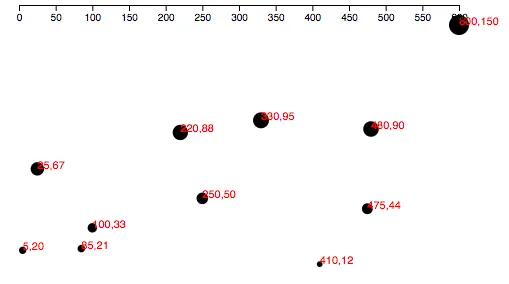
<h6 class="calibre37"><span class="keep-together">Figure 8-2.
</span>Simple axis, but in the wrong place</h6>
</div>
</figure>

This isn’t required, but I’d also recommend assigning a class of `axis`
to the new `g` element. As your project grows in complexity, you’ll find
that naming `g` elements in this way makes your DOM easier to inspect
and troubleshoot.

``` calibre39
svg.append("g")
    .attr("class", "axis") //Assign "axis" class
    .call(xAxis);
```

</div>

</div>

<div class="section calibre2" data-type="sect1"
pdf-bookmark="Positioning Axes">

<div id="ch08.xhtml_idm140093196669728" class="dedication">

# Positioning Axes

By <span id="ch08.xhtml_idm140093196661952"
class="calibre5 pcalibre pcalibre2 pcalibre3 pcalibre1"
data-type="indexterm" primary="axes"
secondary="positioning"></span>default, an axis is positioned using the
range values of the specified scale. In our case, `xAxis` is referencing
`xScale`, which has a range of `[20, 460]`, because we applied 20 pixels
of padding on all edges of the SVG. So the left edge of our axis appears
at an `x` of 20, and the right edge at an `x` of 460.

That’s nice, as we want our axis to line up with the chart’s visual
marks. (Graphical honesty, FTW!) But we’ll need to reposition the axis
*vertically*, as, by convention, a bottom-oriented axis should appear at
the bottom of the chart.

This <span id="ch08.xhtml_idm140093196649888"
class="calibre5 pcalibre pcalibre2 pcalibre3 pcalibre1"
data-type="indexterm"
primary="transformations"></span><span id="ch08.xhtml_idm140093196649152"
class="calibre5 pcalibre pcalibre2 pcalibre3 pcalibre1"
data-type="indexterm" primary="SVG (Scalable Vector Graphics)"
secondary="transformations"></span>is where SVG *transformations* come
in. By adding one line of code, we can `transform` the entire axis
group, pushing it to the bottom:

``` calibre39
svg.append("g")
    .attr("class", "axis")
    .attr("transform", "translate(0," + (h - padding) + ")")
    .call(xAxis);
```

Note <span id="ch08.xhtml_idm140093196618592"
class="calibre5 pcalibre pcalibre2 pcalibre3 pcalibre1"
data-type="indexterm" primary="attr()"></span>that we use `attr()` to
apply `transform` as an attribute of `g`. <a
href="https://developer.mozilla.org/en-US/docs/SVG/Attribute/transform"
class="calibre5 pcalibre pcalibre2 pcalibre3 pcalibre1">SVG
transforms</a> are quite powerful, and can accept several different
kinds of transform definitions, including scales and rotations. But we
are keeping it simple here with only a *translation* transform, which
simply pushes the whole `g` group over and down by some amount.

Translation<span id="ch08.xhtml_idm140093196795232"
class="calibre5 pcalibre pcalibre2 pcalibre3 pcalibre1"
data-type="indexterm"
primary="horizontal axis"></span><span id="ch08.xhtml_idm140093196794496"
class="calibre5 pcalibre pcalibre2 pcalibre3 pcalibre1"
data-type="indexterm" primary="translation transforms"></span>
transforms are specified with the easy syntax of `translate(x,y)`, where
`x` and `y` are, obviously, the number of horizontal and vertical pixels
by which to translate the element. So, in the end, we would like our `g`
to look like this in the DOM:

``` calibre39
<g class="axis" transform="translate(0,280)">
```

As you can see, the `g.axis` isn’t moved horizontally at all, but it is
pushed 280 pixels down, conveniently to the base of our chart. (D3 also
automatically generates `fill`, `font-size`, `font-family`, and
`text-anchor` attributes, which I’ve omitted above for clarity.) We
specify the downward translation in this line of code:

``` calibre39
    .attr("transform", "translate(0," + (h - padding) + ")")
```

Note the use of `(h - padding)`, so the group’s top edge is set to `h`,
the height of the entire image, minus the `padding` value we created
earlier. `(h - padding)` is calculated to be `280`, and then connected
to the rest of the string, so the final transform property value is
`translate(0,280)`.

The result in <a href="#ch08.xhtml_Correctly_positioned_axis"
class="calibre5 pcalibre pcalibre2 pcalibre3 pcalibre1"
data-type="xref">Figure 8-3</a> is much better! Check out the code so
far in *02_axes_bottom.html*.<span id="ch08.xhtml_idm140093196466192"
class="calibre5 pcalibre pcalibre2 pcalibre3 pcalibre1"
data-type="indexterm" primary="" startref="trans08"></span>

<figure class="calibre35">
<div id="ch08.xhtml_Correctly_positioned_axis" class="figure">
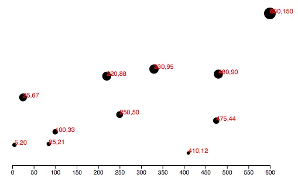
<h6 class="calibre37"><span class="keep-together">Figure 8-3.
</span>Correctly positioned axis</h6>
</div>
</figure>

<aside data-type="sidebar" epub:type="sidebar" class="calibre31">

<div id="ch08.xhtml_idm140093196463152" class="sidebar">

##### Using CSS to Style Axis Elements

Assigning <span id="ch08.xhtml_idm140093196461184"
class="calibre5 pcalibre pcalibre2 pcalibre3 pcalibre1"
data-type="indexterm" primary="axes"
secondary="styling with CSS"></span><span id="ch08.xhtml_idm140093196460176"
class="calibre5 pcalibre pcalibre2 pcalibre3 pcalibre1"
data-type="indexterm" primary="CSS (Cascading Style Sheets)"
secondary="applying to axes"></span>your axis a class of `axis` makes it
easy to override D3’s default styles using the simple CSS selector
`.axis`. The axes themselves are made up of `path`, `line`, and `text`
elements, so those are the three elements to target in your CSS. The
`path`s and `line`s can be styled together, with the same rules, and
`text` gets its own rules around font and font size.

For example, we could introduce our first CSS styles, up in the `<head>`
of our page:

``` calibre39
.axis path,
.axis line {
    stroke: teal;
    shape-rendering: crispEdges;
}

.axis text {
    font-family: Optima, Futura, sans-serif;
    font-weight: bold;
    font-size: 14px;
    fill: teal;
}
```

These CSS rules will override D3’s default styles, resulting in the
admittedly not beautiful example in
<a href="#ch08.xhtml_Axis_with_styles_overridden_with_CSS"
class="calibre5 pcalibre pcalibre2 pcalibre3 pcalibre1"
data-type="xref">Figure 8-4</a>.

<figure class="calibre35">
<div id="ch08.xhtml_Axis_with_styles_overridden_with_CSS"
class="figure">
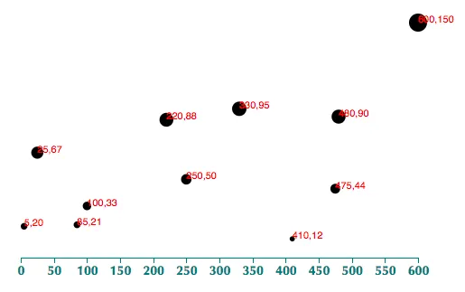
<h6 class="calibre37"><span class="keep-together">Figure 8-4.
</span>Axis with styles overridden with CSS</h6>
</div>
</figure>

Note <span id="ch08.xhtml_idm140093196528288"
class="calibre5 pcalibre pcalibre2 pcalibre3 pcalibre1"
data-type="indexterm" primary="coding tips"
secondary="styling SVG elements"></span>that when we use CSS rules to
style SVG elements, only SVG attribute names—not regular CSS
properties—should be used. This is confusing, because many properties
share the same names in both CSS and SVG, but some do not.
<span id="ch08.xhtml_idm140093196526912"
class="calibre5 pcalibre pcalibre2 pcalibre3 pcalibre1"
data-type="indexterm" primary="color property"></span>For example, in
regular CSS, to set the color of some text, you would use the `color`
property, as in:

``` calibre39
p {
    color: olive;
}
```

That will set the text color of all `p` paragraphs to be `olive`. But
try to apply this property to an SVG element, as with:

``` calibre39
text {
    color: olive;
}
```

and it will have no effect because `color` is not a property recognized
by SVG. Instead, you must use SVG’s equivalent, `fill`:

``` calibre39
text {
    fill: olive;
}
```

In my example CSS above, I’ve used `stroke`, `fill`, and
`shape-rendering`, all of which are unique to SVG.
(<a href="https://mzl.la/2uRRY1g"
class="calibre5 pcalibre pcalibre2 pcalibre3 pcalibre1">The <code
class="calibre23">shape-rendering</code> property</a>
<span id="ch08.xhtml_idm140093196391360"
class="calibre5 pcalibre pcalibre2 pcalibre3 pcalibre1"
data-type="indexterm"
primary="shape-rendering property"></span><span id="ch08.xhtml_idm140093196416832"
class="calibre5 pcalibre pcalibre2 pcalibre3 pcalibre1"
data-type="indexterm" primary="pixels"
secondary="smoothing"></span><span id="ch08.xhtml_idm140093196415888"
class="calibre5 pcalibre pcalibre2 pcalibre3 pcalibre1"
data-type="indexterm" primary="antialiasing"></span>can be used to clean
up visual artifacts from antialiasing, for you designers who require
super-clean lines. No blurry axes for us!)

If <span id="ch08.xhtml_idm140093196414688"
class="calibre5 pcalibre pcalibre2 pcalibre3 pcalibre1"
data-type="indexterm" primary="SVG (Scalable Vector Graphics)"
secondary="styling with CSS"></span>you ever find yourself trying to
style SVG elements, but for some reason the stupid CSS code just isn’t
working (*Grrr!*), I suggest you take a deep breath, pause, and then
review your *property names* very closely to ensure you’re using SVG
names, not CSS ones. (You can reference the complete SVG attribute list
on <a href="https://developer.mozilla.org/en-US/docs/SVG/Attribute"
class="calibre5 pcalibre pcalibre2 pcalibre3 pcalibre1">the MDN site</a>.)

</div>

</aside>

</div>

</div>

<div class="section calibre2" data-type="sect1"
pdf-bookmark="Check for Ticks">

<div id="ch08.xhtml_idm140093196662848" class="dedication">

# Check for Ticks

Some ticks spread disease, but <a href="http://bit.ly/2t1vt97"
class="calibre5 pcalibre pcalibre2 pcalibre3 pcalibre1">D3’s ticks</a>
communicate <span id="ch08.xhtml_idm140093196374048"
class="calibre5 pcalibre pcalibre2 pcalibre3 pcalibre1"
data-type="indexterm" primary="axes"
secondary="customizing tick number and value"></span>information. Yet
more ticks are not necessarily better, and at a certain point, they
begin to clutter your chart. You’ll notice that we never specified how
many ticks to include on the axis, nor at what intervals they should
appear. Without clear instruction, D3 has automagically examined our
scale `xScale` and made informed judgments about how many ticks to
include, and at what intervals (every 50, in this case).

As you would expect, you can customize all aspects of your axes,
starting with the rough number of ticks, using `ticks()`:

``` calibre39
var xAxis = d3.axisBottom()
              .scale(xScale)
              .ticks(5);  //Set rough # of ticks
```

See *03_axes_clean.html* for that code.

You’ll notice in <a href="#ch08.xhtml_Fewer_ticks"
class="calibre5 pcalibre pcalibre2 pcalibre3 pcalibre1"
data-type="xref">Figure 8-5</a> that, although we specified only five
ticks, D3 has made an executive decision and ordered up a total of
seven. That’s because D3 has got your back, and figured out that
including only *five* ticks would require slicing the input domain into
less-than-gorgeous values—in this case, 0, 150, 300, 450, and 600. D3
interprets the `ticks()` value as merely a suggestion and will override
your suggestion with what it determines to be the most clean and
human-readable values—in this case, intervals of 100—even when that
requires including slightly more or fewer ticks than you requested. This
is actually a totally brilliant feature that increases the scalability
of your design; as the dataset changes and the input domain expands or
contracts (bigger numbers or smaller numbers), D3 ensures that the tick
labels remain easy to read.

<figure class="calibre35">
<div id="ch08.xhtml_Fewer_ticks" class="figure">
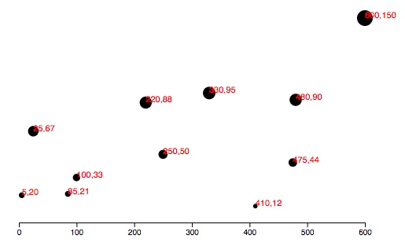
<h6 class="calibre37"><span class="keep-together">Figure 8-5.
</span>Fewer ticks</h6>
</div>
</figure>

<aside data-type="sidebar" epub:type="sidebar" class="calibre31">

<div id="ch08.xhtml_idm140093196295936" class="sidebar">

##### Specifying Tick Values Manually

For <span id="ch08.xhtml_idm140093196294368"
class="calibre5 pcalibre pcalibre2 pcalibre3 pcalibre1"
data-type="indexterm" primary="tickValues()"></span>more control, you
can specify tick values manually by calling `tickValues()` instead of
`ticks()`, and passing in an array of whatever values you’d like
labeled. This overrides D3’s default tick-selection logic. (Sometimes
humans know best.) For example, we could modify the earlier example:

``` calibre39
var xAxis = d3.axisBottom()
              .scale(xScale)
              .tickValues([0, 100, 250, 600]);
```

Note the results in <a href="#ch08.xhtml_Manually_specified_tick_values"
class="calibre5 pcalibre pcalibre2 pcalibre3 pcalibre1"
data-type="xref">Figure 8-6</a>.

<figure class="calibre35">
<div id="ch08.xhtml_Manually_specified_tick_values" class="figure">
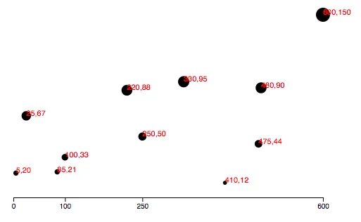
<h6 class="calibre37"><span class="keep-together">Figure 8-6.
</span>Manually specified tick values</h6>
</div>
</figure>

</div>

</aside>

</div>

</div>

<div class="section calibre2" data-type="sect1" pdf-bookmark="Y Not?">

<div id="ch08.xhtml_idm140093196279696" class="dedication">

# Y Not?

Time to <span id="ch08.xhtml_idm140093196188800"
class="calibre5 pcalibre pcalibre2 pcalibre3 pcalibre1"
data-type="indexterm" primary="vertical axis"></span>label the vertical
axis! By copying and tweaking the code we already wrote for the `xAxis`,
we add this near the top of our code:

``` calibre39
//Define Y axis
var yAxis = d3.axisLeft()
              .scale(yScale)
              .ticks(5);
```

and this, near the bottom:

``` calibre39
//Create Y axis
svg.append("g")
   .attr("class", "axis")
   .attr("transform", "translate(" + padding + ",0)")
   .call(yAxis);
```

Note <span id="ch08.xhtml_idm140093196112928"
class="calibre5 pcalibre pcalibre2 pcalibre3 pcalibre1"
data-type="indexterm" primary="padding"></span>in
<a href="#ch08.xhtml_Initial_Y_axis"
class="calibre5 pcalibre pcalibre2 pcalibre3 pcalibre1"
data-type="xref">Figure 8-7</a> that the axis is oriented vertically,
the labels are placed to the left of the axis, and the `yAxis` group `g`
is translated to the right by the amount `padding`.

<figure class="calibre35">
<div id="ch08.xhtml_Initial_Y_axis" class="figure">
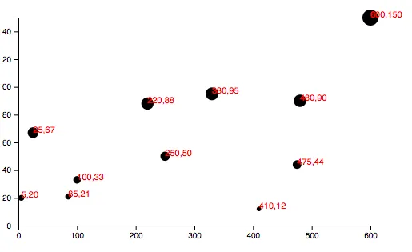
<h6 class="calibre37"><span class="keep-together">Figure 8-7.
</span>Initial y-axis</h6>
</div>
</figure>

This is starting to look like a real chart! But the `yAxis` labels are
getting cut off. To give them more room on the left side, I’ll bump up
the value of `padding` from 20 to 30:

``` calibre39
var padding = 30;
```

Of course, you could also introduce separate `padding` variables for
each axis, say <span class="keep-together">`xPadding`</span> and
`yPadding`, for more control over the layout.

See the updated code in *04_axes_y.html*. It looks like
<a href="#ch08.xhtml_Scatterplot_with_Y_axis"
class="calibre5 pcalibre pcalibre2 pcalibre3 pcalibre1"
data-type="xref">Figure 8-8</a>.

<figure class="calibre35">
<div id="ch08.xhtml_Scatterplot_with_Y_axis" class="figure">
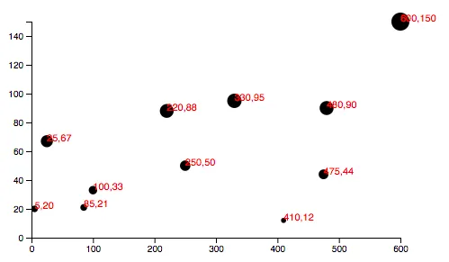
<h6 class="calibre37"><span class="keep-together">Figure 8-8.
</span>Scatterplot with y-axis</h6>
</div>
</figure>

</div>

</div>

<div class="section calibre2" data-type="sect1"
pdf-bookmark="Final Touches">

<div id="ch08.xhtml_idm140093196279072" class="dedication">

# Final Touches

I <span id="ch08.xhtml_idm140093196260880"
class="calibre5 pcalibre pcalibre2 pcalibre3 pcalibre1"
data-type="indexterm" primary="axes"
secondary="dynamic and scalable"></span><span id="ch08.xhtml_idm140093196259872"
class="calibre5 pcalibre pcalibre2 pcalibre3 pcalibre1"
data-type="indexterm" primary="dynamic axes"></span>appreciate that so
far you have been very quiet and polite, and not at all confrontational.
Yet I still feel as though I have to win you over. So to prove to you
that our new axes are dynamic and scalable, I’d like to switch from
using a static dataset to using randomized numbers:

``` calibre39
//Dynamic, random dataset
var dataset = [];
var numDataPoints = 50;
var xRange = Math.random() * 1000;
var yRange = Math.random() * 1000;
for (var i = 0; i < numDataPoints; i++) {
    var newNumber1 = Math.floor(Math.random() * xRange);
    var newNumber2 = Math.floor(Math.random() * yRange);
    dataset.push([newNumber1, newNumber2]);
}
```

This code initializes an empty array, then loops through 50 times,
chooses two random numbers each time, and adds (“pushes”) that pair of
values to the `dataset` array (see
<a href="#ch08.xhtml_Scatterplot_with_random_data"
class="calibre5 pcalibre pcalibre2 pcalibre3 pcalibre1"
data-type="xref">Figure 8-9</a>).

<figure class="calibre35">
<div id="ch08.xhtml_Scatterplot_with_random_data" class="figure">
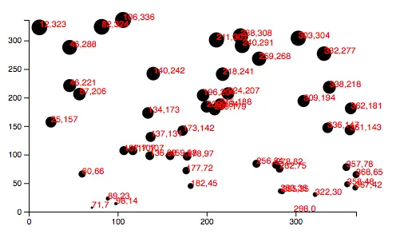
<h6 class="calibre37"><span class="keep-together">Figure 8-9.
</span>Scatterplot with random data</h6>
</div>
</figure>

Try out that randomized dataset code in *05_axes_random.html*. Each time
you reload the page, you’ll get different data values. Notice how both
axes scale to fit the new domains, and ticks and label values are chosen
accordingly.

Having made my point, I think we can finally cut those horrible red
labels, by commenting out the relevant lines of code.

The result is shown in
<a href="#ch08.xhtml_Scatterplot_with_random_data_and_no_red_labels"
class="calibre5 pcalibre pcalibre2 pcalibre3 pcalibre1"
data-type="xref">Figure 8-10</a>. Our final scatterplot code lives in
*06_axes_no_labels.html*.

<figure class="calibre35">
<div id="ch08.xhtml_Scatterplot_with_random_data_and_no_red_labels"
class="figure">
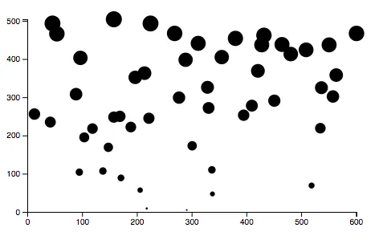
<h6 class="calibre37"><span class="keep-together">Figure 8-10.
</span>Scatterplot with random data and no red labels</h6>
</div>
</figure>

</div>

</div>

<div class="section calibre2" data-type="sect1"
pdf-bookmark="Formatting Tick Labels">

<div id="ch08.xhtml_idm140093196262016" class="dedication">

# Formatting Tick Labels

One <span id="ch08.xhtml_idm140093195999264"
class="calibre5 pcalibre pcalibre2 pcalibre3 pcalibre1"
data-type="indexterm" primary="axes"
secondary="labeling"></span><span id="ch08.xhtml_idm140093195998256"
class="calibre5 pcalibre pcalibre2 pcalibre3 pcalibre1"
data-type="indexterm" primary="labels" secondary="for axes"></span>last
thing: so far, we’ve been working with integers—whole numbers—which are
nice and easy. But data is often messier, and in those cases, you might
want more control over how the axis labels
are<span id="ch08.xhtml_idm140093195996960"
class="calibre5 pcalibre pcalibre2 pcalibre3 pcalibre1"
data-type="indexterm" primary="tickFormat()"></span> formatted. Enter
<a href="https://github.com/d3/d3-scale#continuous_tickFormat"
class="calibre5 pcalibre pcalibre2 pcalibre3 pcalibre1"><code
class="calibre23">tickFormat()</code></a>, which enables you to specify
how your numbers should be formatted. For example, you might want to
include three places after the decimal point, or display values as
percentages, or both.

To use `tickFormat()`, first define a new number-formatting function.
This one, for example, says to treat values as percentages with one
decimal point precision. That is, if you give this function the number
`0.23`, it will return the string `"23.0%"`. (See
<a href="https://github.com/d3/d3-format#locale_format"
class="calibre5 pcalibre pcalibre2 pcalibre3 pcalibre1">the reference
entry for <code class="calibre23">d3.format()</code></a> for more
options.)

``` calibre39
var formatAsPercentage = d3.format(".1%");
```

Then, tell your axis to use that formatting function for its ticks, for
example:

``` calibre39
xAxis.tickFormat(formatAsPercentage);
```

<aside data-type="sidebar" epub:type="sidebar" class="calibre31">

<div id="ch08.xhtml_idm140093195985104" class="sidebar">

##### Testing Formatting Functions the Easy Way

I find <span id="ch08.xhtml_idm140093195967152"
class="calibre5 pcalibre pcalibre2 pcalibre3 pcalibre1"
data-type="indexterm"
primary="formatting functions, testing"></span><span id="ch08.xhtml_idm140093195966480"
class="calibre5 pcalibre pcalibre2 pcalibre3 pcalibre1"
data-type="indexterm" primary="functions"
secondary="testing formatting functions"></span>it easiest to test these
formatting functions out in the JavaScript console. For example, just
open any page that loads D3, such as
<span class="keep-together">*06_axes_no_labels.html*</span>, and type
your format rule into the console. Then test it by feeding it a value,
as you would with any other function.

You can see in <a href="#ch08.xhtml_Testing_format_console"
class="calibre5 pcalibre pcalibre2 pcalibre3 pcalibre1"
data-type="xref">Figure 8-11</a> that a data value of `0.54321` is
converted to `54.3%` for display purposes—perfect!

Test out the following statements in the console and note the results:

- `formatAsPercentage(.365)`

- `formatAsPercentage(1.2)`

- `formatAsPercentage(-.5)`

<figure class="calibre35">
<div id="ch08.xhtml_Testing_format_console" class="figure">
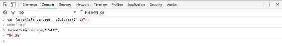
<h6 class="calibre37"><span class="keep-together">Figure 8-11.
</span>Testing d3.format() in the console</h6>
</div>
</figure>

</div>

</aside>

You can play with that code in *07_axes_format.html*. Obviously, a
percentage format doesn’t make sense with our scatterplot’s current
dataset, but as an exercise, you could try tweaking how the random
numbers are generated, to make more appropriate, nonwhole number values,
or just experiment with the format function itself. (Also try adjusting
the padding, so the labels on the left side are fully visible.)

</div>

</div>

<div class="section calibre2" data-type="sect1"
pdf-bookmark="Time-Based Axes">

<div id="ch08.xhtml_idm140093195962816" class="dedication">

# Time-Based Axes

How <span id="ch08.xhtml_idm140093195961248"
class="calibre5 pcalibre pcalibre2 pcalibre3 pcalibre1"
data-type="indexterm" primary="axes"
secondary="time-based"></span><span id="ch08.xhtml_idm140093195960240"
class="calibre5 pcalibre pcalibre2 pcalibre3 pcalibre1"
data-type="indexterm" primary="time-based axes"></span>hard is it to
make time-based axes?

Not hard.

Let’s revisit <a href="#ch07.xhtml_scales-chapter7"
class="calibre5 pcalibre pcalibre2 pcalibre3 pcalibre1"
data-type="xref">Chapter 7</a>’s example, *09_time_scale.html*. I’ve
created a new example, *08_time_axis.html*, into which I’ve copied and
pasted the code where we define both axis generators and call them. With
*no other changes*, we see the result shown in
<a href="#ch08.xhtml_time_based_axis"
class="calibre5 pcalibre pcalibre2 pcalibre3 pcalibre1"
data-type="xref">Figure 8-12</a>.

<figure class="calibre35">
<div id="ch08.xhtml_time_based_axis" class="figure">
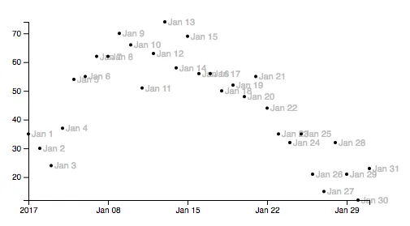
<h6 class="calibre37"><span class="keep-together">Figure 8-12.
</span>Easy time-based axis</h6>
</div>
</figure>

Remember how we have to tell each axis generator which scale to
reference? In this case, all the hard work was already done, when we set
up the time scale (and parsed the incoming strings into dates). Once the
scale is in place, all the axis has to do is follow that scale’s lead.

In *09_time_axis_prettier.html*, I’ve cleaned this chart up a bit by
removing the value labels, adjusting the axis ticks, expanding the
x-axis’s domain by a day in either direction (effectively from December
31 to February 1), and adding light gray guide lines to better
illustrate how the circles are being positioned. See the result in
<a href="#ch08.xhtml_time_series_cleaned_up"
class="calibre5 pcalibre pcalibre2 pcalibre3 pcalibre1"
data-type="xref">Figure 8-13</a>.

<figure class="calibre35">
<div id="ch08.xhtml_time_series_cleaned_up" class="figure">
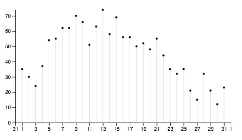
<h6 class="calibre37"><span class="keep-together">Figure 8-13.
</span>Time series, cleaned up</h6>
</div>
</figure>

</div>

</div>

</div>

</div>

<span id="ch09.xhtml"></span>

<div id="ch09.xhtml_sbo-rt-content" class="calibre1">

<div id="ch09.xhtml_updates-chapter9" class="dedication">

