# <span class="keep-together">Chapter 9. </span>Updates, Transitions, and Motion

Until <span id="ch09.xhtml_idm140093195947088"
class="calibre5 pcalibre pcalibre2 pcalibre3 pcalibre1"
data-type="indexterm" primary="data" secondary="updating of"
see="updates"></span><span id="ch09.xhtml_update09"
class="calibre5 pcalibre pcalibre2 pcalibre3 pcalibre1"
data-type="indexterm" primary="updates"></span>this point, we have used
only static datasets. But real-world data almost always *changes* over
time. And you might want your visualization to reflect those changes.

In D3 terms, those changes are handled by *updates*. The
<span id="ch09.xhtml_idm140093195943456"
class="calibre5 pcalibre pcalibre2 pcalibre3 pcalibre1"
data-type="indexterm" primary="transitions"
secondary="definition of term"></span>visual adjustments are made pretty
with *transitions*, which can employ *motion* for perceptual benefit.

We’ll start by generating a visualization with one dataset, and then
changing the data completely.

<div class="section calibre2" data-type="sect1"
pdf-bookmark="Modernizing the Bar Chart">

<div id="ch09.xhtml_idm140093195940768" class="dedication">

# Modernizing the Bar Chart

Let’s <span id="ch09.xhtml_Ubar09"
class="calibre5 pcalibre pcalibre2 pcalibre3 pcalibre1"
data-type="indexterm" primary="updates"
secondary="bar charts"></span><span id="ch09.xhtml_BCscal09"
class="calibre5 pcalibre pcalibre2 pcalibre3 pcalibre1"
data-type="indexterm" primary="bar charts"
secondary="scalable and flexible"></span>revisit our trusty old bar
chart in <a href="#ch09.xhtml_The_bar_chart_as_seen_last"
class="calibre5 pcalibre pcalibre2 pcalibre3 pcalibre1"
data-type="xref">Figure 9-1</a>.

<figure class="calibre35">
<div id="ch09.xhtml_The_bar_chart_as_seen_last" class="figure">
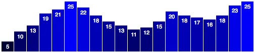
<h6 class="calibre37"><span class="keep-together">Figure 9-1. </span>The
bar chart, as seen last</h6>
</div>
</figure>

If you examine the code in *01_bar_chart.html*, you’ll see that we used
this static dataset:

``` calibre39
var dataset = [ 5, 10, 13, 19, 21, 25, 22, 18, 15, 13,
                11, 12, 15, 20, 18, 17, 16, 18, 23, 25 ];
```

Since then, we’ve learned how to write more flexible code, so our chart
elements resize to accommodate different-sized datasets (meaning shorter
or longer arrays) and different data values (smaller or larger numbers).
We accomplished that flexibility using D3 scales, so I’d like to start
by bringing our bar chart up to speed.

Ready? Okay, just give me a sec…

Aaaaaand, done! Thanks for waiting.

<a href="#ch09.xhtml_A_scalable_flexible_bar_chart"
class="calibre5 pcalibre pcalibre2 pcalibre3 pcalibre1"
data-type="xref">Figure 9-2</a> looks pretty similar, but a lot has
changed under the hood. You can follow along by opening
*02_bar_chart_with_scales.html*.

<figure class="calibre35">
<div id="ch09.xhtml_A_scalable_flexible_bar_chart" class="figure">
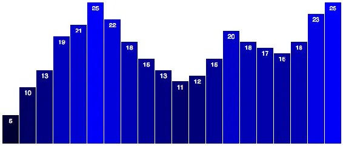
<h6 class="calibre37"><span class="keep-together">Figure 9-2. </span>A
scalable, flexible bar chart</h6>
</div>
</figure>

To start, I adjusted the width and height, to make the chart taller and
wider:

``` calibre39
var w = 600;
var h = 250;
```

Next, I<span id="ch09.xhtml_idm140093195761600"
class="calibre5 pcalibre pcalibre2 pcalibre3 pcalibre1"
data-type="indexterm" primary="ordinal scales"></span> introduced an
*ordinal scale* to handle the left/right positioning of bars and labels
along the x-axis:

``` calibre39
var xScale = d3.scaleBand()
               .domain(d3.range(dataset.length))
               .range([0, w])
               .paddingInner(0.05);
```

This may seem like gobbledegook, so I’ll walk through it one line at a
time.

<div class="section calibre2" data-type="sect2"
pdf-bookmark="Ordinal Scales, Explained">

<div id="ch09.xhtml_idm140093195622208" class="dedication">

## Ordinal Scales, Explained

First, in this line:

``` calibre39
var xScale = d3.scaleBand()
```

we declare a new variable called `xScale`, just as we had done with our
scatterplot. Only here, instead of a *linear* scale, we create an
*ordinal* one. Ordinal scales are typically used for ordinal data,
usually categories with some inherent *order* to them, such as:

- grade B, grade A, grade AA

- freshman, sophomore, junior, senior

- strongly dislike, dislike, neutral, like, strongly like

We <span id="ch09.xhtml_idm140093195579184"
class="calibre5 pcalibre pcalibre2 pcalibre3 pcalibre1"
data-type="indexterm" primary="arbitrary order, overriding"></span>don’t
have true ordinal data for use with this bar chart. Instead, we just
want the bars to be drawn from left to right using the same order in
which values occur in our dataset. D3’s band scale (`scaleBand()`) is a
specific type of ordinal scale useful in this situation, when we have
many visual elements (vertical bars) that are positioned in an arbitrary
order (left to right), but must be evenly spaced. This will become clear
in a moment.

``` calibre39
.domain(d3.range(dataset.length))
```

This next line of code sets the input domain for the scale. Remember how
linear scales need a two-value array to set their domains, as in
`[0, 100]`? For a linear scale, that array would set the low and high
values of the domain. But ordinal domains are, well, ordinal, so they
don’t think in linear, quantitative terms. To set the domain of an
ordinal scale, you typically specify an array with the category names,
as in:

``` calibre39
.domain(["freshman", "sophomore", "junior", "senior"])
```

For our bar chart, we don’t have explicit categories, but we could
assign each data point or bar an ID value corresponding to its position
within the `dataset` array, as in 0, 1, 2, 3, and so on. So perhaps our
domain statement could read:

``` calibre39
.domain([0, 1, 2, 3, 4, 5, 6, 7, 8, 9,
         10, 11, 12, 13, 14, 15, 16, 17, 18, 19])
```

It <span id="ch09.xhtml_idm140093195532128"
class="calibre5 pcalibre pcalibre2 pcalibre3 pcalibre1"
data-type="indexterm"
primary="d3.range()"></span><span id="ch09.xhtml_idm140093195535552"
class="calibre5 pcalibre pcalibre2 pcalibre3 pcalibre1"
data-type="indexterm"
primary="sequential numbers, generating arrays of"></span>turns out
there is a very simple way to quickly generate an array of sequential
numbers: the `d3.range()` method.

While viewing *02_bar_chart_with_scales.html*, open the console and type
the following:

``` calibre39
d3.range(10)
```

You should see the following output array:

``` calibre39
[0, 1, 2, 3, 4, 5, 6, 7, 8, 9]
```

How nice is that? D3 saves you time once again (and the hassle of extra
`for()` loops).

Coming back to our code, it should now be clear what’s happening here:

``` calibre39
.domain(d3.range(dataset.length))
```

1.  `dataset.length`, in this case, is evaluated as `20`, because we
    have 20 items in our dataset.

2.  `d3.range(20)` is then evaluated, which returns this array:
    `[0, 1, 2, 3, 4, 5, 6, 7, 8, 9, 10, 11, 12, 13, 14, 15, 16, 17, 18, 19]`.

3.  Finally, `domain()` sets the domain of our new ordinal scale to
    those values.

This might be somewhat confusing because we are using numbers (0, 1, 2…)
as ordinal values, but ordinal values are typically nonnumeric.

</div>

</div>

<div class="section calibre2" data-type="sect2"
pdf-bookmark="Starting Your Own Band">

<div id="ch09.xhtml_idm140093195621296" class="dedication">

## Starting Your Own Band

Instead of <span id="ch09.xhtml_idm140093195519424"
class="calibre5 pcalibre pcalibre2 pcalibre3 pcalibre1"
data-type="indexterm" primary="continuous ranges"></span>returning a
continuous range, as quantitative scales (like `d3.scaleLinear()`)
would, ordinal scales (like `d3.scaleBand()`) use *discrete* ranges,
meaning the output values are determined in advance, and could be
numeric or not.

D3’s band <span id="ch09.xhtml_idm140093195511120"
class="calibre5 pcalibre pcalibre2 pcalibre3 pcalibre1"
data-type="indexterm" primary="range banding"></span>scales
automatically divide the output range into even “bands,” based on the
length of the input domain. For example, we could specify a range of:

``` calibre39
.range([0, w])
```

This says “calculate even bands starting at 0 and ending at `w`, then
set this scale’s range to those bands.” In our case, we specified 20
values in the domain, so D3 will calculate:

``` calibre39
(w - 0) / xScale.domain().length
(600 - 0) / 20
600 / 20
30
```

In the end, each band will be `30` “wide.”

If <span id="ch09.xhtml_idm140093195503616"
class="calibre5 pcalibre pcalibre2 pcalibre3 pcalibre1"
data-type="indexterm"
primary="padding"></span><span id="ch09.xhtml_idm140093195502880"
class="calibre5 pcalibre pcalibre2 pcalibre3 pcalibre1"
data-type="indexterm" primary="whitespace, adding"
seealso="padding"></span>we don’t want our bands (or bars) to touch each
other, we can specify a bit of spacing between each using
`paddingInner()`:

``` calibre39
.paddingInner(0.05);
```

Here, <span id="ch09.xhtml_idm140093195415152"
class="calibre5 pcalibre pcalibre2 pcalibre3 pcalibre1"
data-type="indexterm" primary="pixels"
secondary="lining up to"></span>I’ve arbitrarily used `0.05`, meaning
that 5 percent of the width of each band will be used for spacing in
between bands. A band width of 30 times 0.05 equals 1.5 pixels of
spacing. Specifying 0.2 would create 20 percent spacing, 0.5 would
create 50 percent spacing, and so on.

To my eyes, 5 percent spacing looks right, but has the unintended
consequence of fuzzy bars, due to antialiasing the half-pixel values. To
correct this, we can tell the band scale to round its output values to
the nearest whole pixel, so 12.3456 becomes just 12, for example. This
is helpful for keeping visual elements lined up precisely on the pixel
grid for clean, sharp edges.

``` calibre39
var xScale = d3.scaleBand()
               .domain(d3.range(dataset.length))
               .range([0, w])
               .round(true)  // <-- Enable rounding
               .paddingInner(0.05);
```

The net effect is similar to using the `shape-rendering: crispEdges;`
CSS rule mentioned in <a href="#ch08.xhtml_axes-chapter8"
class="calibre5 pcalibre pcalibre2 pcalibre3 pcalibre1"
data-type="xref">Chapter 8</a>, but here we’re handling the calculations
in JavaScript. There is also a more concise method for enabling rounded
values, `rangeRound()`, which I’ll use going forward. This snippet is
equivalent to the preceding one:

``` calibre39
var xScale = d3.scaleBand()
               .domain(d3.range(dataset.length))
               .rangeRound([0, w])  // <-- Also enables rounding
               .paddingInner(0.05);
```

This will give us nice, clean pixel values, with a teensy bit of visual
space between them.

</div>

</div>

<div class="section calibre2" data-type="sect2"
pdf-bookmark="Referencing the Band Scale">

<div id="ch09.xhtml_idm140093195520528" class="dedication">

## Referencing the Band Scale

Later <span id="ch09.xhtml_idm140093195188288"
class="calibre5 pcalibre pcalibre2 pcalibre3 pcalibre1"
data-type="indexterm" primary="band scales"></span>in the code (and I
recommend viewing the source), when we create the `rect` elements, we
set their horizontal, x-axis positions like so:

``` calibre39
//Create bars
svg.selectAll("rect")
   .data(dataset)
   .enter()
   .append("rect")
   .attr("x", function(d, i) {
       return xScale(i);  // <-- Set x values
   })
   …
```

Note that, because we include `d` and `i` as parameters to the anonymous
function, D3 will automatically pass in the correct values. Of course,
`d` is the current datum, and `i` is its index value. So `i` will be
passed 0, 1, 2, 3, and so on.

Coincidentally (hmmm!), we used those same values (0, 1, 2, 3…) for our
band scale’s input domain. So when we call `xScale(i)`, `xScale()` will
look up the ordinal value `i` and return its associated output (band)
value. You can verify all this for yourself in the console; try typing
`xScale(0)` or `xScale(5)`.

Even better, setting the widths of these bars just got a lot easier.
Before using the ordinal scale, we had:

``` calibre39
.attr("width", w / dataset.length - barPadding)
```

We don’t need `barPadding` anymore because the band scale calculates it
for us. Just ask your scale for its `bandwidth()`:

``` calibre39
.attr("width", xScale.bandwidth())
```

Isn’t it nice when D3 does the math for you?

</div>

</div>

<div class="section calibre2" data-type="sect2"
pdf-bookmark="Other Updates">

<div id="ch09.xhtml_idm140093195189632" class="dedication">

## Other Updates

I’ve made several other updates in *02_bar_chart_with_scales.html*,
including creating a new linear scale `yScale` to calculate vertical
values. You already know how to use linear scales, so you can skim the
source and note how that’s being used to set the bar
heights.<span id="ch09.xhtml_idm140093195115744"
class="calibre5 pcalibre pcalibre2 pcalibre3 pcalibre1"
data-type="indexterm" primary=""
startref="Ubar09"></span><span id="ch09.xhtml_idm140093195114768"
class="calibre5 pcalibre pcalibre2 pcalibre3 pcalibre1"
data-type="indexterm" primary="" startref="BCscal09"></span>

</div>

</div>

</div>

</div>

<div class="section calibre2" data-type="sect1"
pdf-bookmark="Updating Data">

<div id="ch09.xhtml_idm140093195940144" class="dedication">

# Updating Data

Okay, once again, we have the amazing bar chart shown in
<a href="#ch09.xhtml_The_bar_chart"
class="calibre5 pcalibre pcalibre2 pcalibre3 pcalibre1"
data-type="xref">Figure 9-3</a>, flexible enough to handle any data we
can throw at it.

<figure class="calibre35">
<div id="ch09.xhtml_The_bar_chart" class="figure">

<h6 class="calibre37"><span class="keep-together">Figure 9-3. </span>The
bar chart</h6>
</div>
</figure>

Or is it? Let’s see.

The simplest kind of update is when all data values are updated at the
same time *and* the number of values stays the same.

The <span id="ch09.xhtml_idm140093195250032"
class="calibre5 pcalibre pcalibre2 pcalibre3 pcalibre1"
data-type="indexterm" primary="updates"
secondary="basic steps to"></span>basic approach in this scenario is
this:

1.  Modify the values in your dataset.

2.  Rebind the new values to the existing elements (thereby overwriting
    the original values).

3.  Set new attribute values as needed to update the visual display.

Before any of those steps can happen, though, some *event* needs to kick
things off. So far, all of our code has executed immediately on page
load. We *could* have our update run right after the initial drawing
code, but it would happen imperceptibly fast. To make sure we can
observe the change as it happens, we will separate our update code from
everything else. We will need a “trigger,” something that happens
*after* page load to apply the updates. How about a mouse click?

<div class="section calibre2" data-type="sect2"
pdf-bookmark="Interaction via Event Listeners">

<div id="ch09.xhtml_idm140093195283072" class="dedication">

## Interaction via Event Listeners

Any <span id="ch09.xhtml_idm140093195281376"
class="calibre5 pcalibre pcalibre2 pcalibre3 pcalibre1"
data-type="indexterm" primary="updates"
secondary="event listeners and"></span><span id="ch09.xhtml_idm140093195280368"
class="calibre5 pcalibre pcalibre2 pcalibre3 pcalibre1"
data-type="indexterm"
primary="event listeners"></span><span id="ch09.xhtml_idm140093195279696"
class="calibre5 pcalibre pcalibre2 pcalibre3 pcalibre1"
data-type="indexterm" primary="DOM (Document Object Model)"
secondary="interacting with event listeners"></span>DOM element can be
used, so rather than design a fancy button, I’ll add a simple `p`
paragraph to the HTML’s `body`:

``` calibre39
<p>Click on this text to update the chart with new data values (once).</p>
```

Then, down at the end of our D3 code, let’s add the following:

``` calibre39
d3.select("p")
    .on("click", function() {
        //Do something on click
    });
```

This selects our new `p`, and then adds an *event listener* to that
element. Huh?

In JavaScript, events are happening all the time. Not exciting events,
like huge parties, but really insignificant events like `mouseover` and
`click`. Most of the time, these insignificant events go ignored (just
as in life, perhaps). But if someone is *listening*, then the event will
be *heard*, and can go down in posterity, or at least trigger some sort
of DOM interaction. (Rough JavaScript parallel of classic koan: if an
event occurs, and no listener hears it, did it ever happen at all?)

An event *listener* is an <span id="ch09.xhtml_idm140093195051872"
class="calibre5 pcalibre pcalibre2 pcalibre3 pcalibre1"
data-type="indexterm" primary="functions"
secondary="anonymous functions"></span><span id="ch09.xhtml_idm140093195050976"
class="calibre5 pcalibre pcalibre2 pcalibre3 pcalibre1"
data-type="indexterm"
primary="anonymous functions"></span><span id="ch09.xhtml_idm140093195050304"
class="calibre5 pcalibre pcalibre2 pcalibre3 pcalibre1"
data-type="indexterm" primary="functions"
secondary="event listeners"></span>anonymous function that *listens* for
a specific event *on* a specific element or elements.
D3’s<span id="ch09.xhtml_idm140093195048400"
class="calibre5 pcalibre pcalibre2 pcalibre3 pcalibre1"
data-type="indexterm" primary="on()"></span> `on()` method provides a
nice shorthand for adding event listeners. As you can see, `on()` takes
two arguments: the event *type* (`"click"`) and the listener itself (the
anonymous function).

In <span id="ch09.xhtml_idm140093195045744"
class="calibre5 pcalibre pcalibre2 pcalibre3 pcalibre1"
data-type="indexterm" primary="click events"></span>this case, the
listener listens for a `click` event occurring on our selection `p`.
When that happens, the listener function is executed. You can put
whatever code you want in between the brackets of the anonymous
function:

``` calibre39
d3.select("p")
    .on("click", function() {
        //Do something mundane and annoying on click
        alert("Hey, don't click that!");
    });
```

We’ll talk a lot more about interactivity in
<a href="#ch10.xhtml_interactivity"
class="calibre5 pcalibre pcalibre2 pcalibre3 pcalibre1"
data-type="xref">Chapter 10</a>.

</div>

</div>

<div class="section calibre2" data-type="sect2"
pdf-bookmark="Changing the Data">

<div id="ch09.xhtml_idm140093195282448" class="dedication">

## Changing the Data

Instead of <span id="ch09.xhtml_idm140093194938624"
class="calibre5 pcalibre pcalibre2 pcalibre3 pcalibre1"
data-type="indexterm" primary="updates"
secondary="basic steps to"></span>generating annoying pop-ups, I’d
rather simply update `dataset` by overwriting its original values. This
is step 1, from earlier:

``` calibre39
dataset = [ 11, 12, 15, 20, 18, 17, 16, 18, 23, 25,
            5, 10, 13, 19, 21, 25, 22, 18, 15, 13 ];
```

Step <span id="ch09.xhtml_idm140093195024416"
class="calibre5 pcalibre pcalibre2 pcalibre3 pcalibre1"
data-type="indexterm" primary="data()"></span>2 is to rebind the new
values to the existing elements. We can do that by selecting those
`rect`s and simply calling `data()` one more time:

``` calibre39
svg.selectAll("rect")
   .data(dataset);     //New data successfully bound!
```

</div>

</div>

<div class="section calibre2" data-type="sect2"
pdf-bookmark="Updating the Visuals">

<div id="ch09.xhtml_idm140093194939936" class="dedication">

## Updating the Visuals

Finally, step 3 is to update the visual attributes, referencing the
(now-updated) data values. This is super easy, as we simply copy and
paste the relevant code that we’ve already written. In this case, the
`rect`s can maintain their horizontal positions and widths; all we
really need to update are their `height`s and y-positions. I’ve added
those lines here:

``` calibre39
svg.selectAll("rect")
   .data(dataset)
   .attr("y", function(d) {
       return h - yScale(d);
   })
   .attr("height", function(d) {
       return yScale(d);
   });
```

Notice this looks almost exactly like the code that generates the
`rect`s initially, only without `enter()` and `append()`.

Putting it all together, here is all of our update code in one place:

``` calibre39
//On click, update with new data
d3.select("p")
    .on("click", function() {

        //New values for dataset
        dataset = [ 11, 12, 15, 20, 18, 17, 16, 18, 23, 25,
                    5, 10, 13, 19, 21, 25, 22, 18, 15, 13 ];

        //Update all rects
        svg.selectAll("rect")
           .data(dataset)
           .attr("y", function(d) {
               return h - yScale(d);
           })
           .attr("height", function(d) {
               return yScale(d);
           });

    });
```

Check out the revised bar chart in *03_updates_all_data.html*. It looks
like <a href="#ch09.xhtml_Updateable_bar_chart"
class="calibre5 pcalibre pcalibre2 pcalibre3 pcalibre1"
data-type="xref">Figure 9-4</a> to start.

<figure class="calibre35">
<div id="ch09.xhtml_Updateable_bar_chart" class="figure">
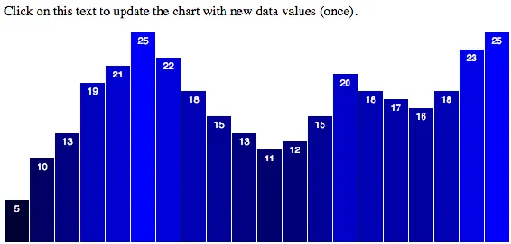
<h6 class="calibre37"><span class="keep-together">Figure 9-4.
</span>Updatable bar chart</h6>
</div>
</figure>

Then click anywhere on the paragraph, and it turns into
<a href="#ch09.xhtml_Bar_chart_data_updated"
class="calibre5 pcalibre pcalibre2 pcalibre3 pcalibre1"
data-type="xref">Figure 9-5</a>.

<figure class="calibre35">
<div id="ch09.xhtml_Bar_chart_data_updated" class="figure">
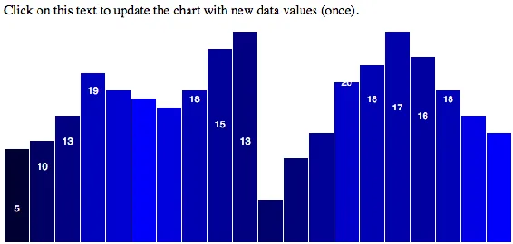
<h6 class="calibre37"><span class="keep-together">Figure 9-5. </span>Bar
chart, data updated</h6>
</div>
</figure>

Good news: the values in `dataset` were modified, rebound, and used to
adjust the `rect`s. Bad news: it looks weird because we forgot to update
the labels, and also the bar colors. Good news (because I always like to
end with good news): this is easy to fix.

To <span id="ch09.xhtml_idm140093194647808"
class="calibre5 pcalibre pcalibre2 pcalibre3 pcalibre1"
data-type="indexterm" primary="bar charts"
secondary="updating color of"></span>ensure the colors change on update,
we just copy and paste in the line where we set the `fill`:

``` calibre39
svg.selectAll("rect")
   .data(dataset)
   .attr("y", function(d) {
       return h - yScale(d);
   })
   .attr("height", function(d) {
       return yScale(d);
   })
   .attr("fill", function(d) {   // <-- Down here!
       return "rgb(0, 0, " + Math.round(d * 10) + ")";
   });
```

To <span id="ch09.xhtml_idm140093194644384"
class="calibre5 pcalibre pcalibre2 pcalibre3 pcalibre1"
data-type="indexterm" primary="bar charts"
secondary="updating labels for"></span><span id="ch09.xhtml_idm140093194643648"
class="calibre5 pcalibre pcalibre2 pcalibre3 pcalibre1"
data-type="indexterm" primary="labels"
secondary="for bar charts"></span>update the labels, we use a similar
pattern, only here we adjust their text content and x/y values:

``` calibre39
svg.selectAll("text")
   .data(dataset)
   .text(function(d) {
       return d;
   })
   .attr("x", function(d, i) {
       return xScale(i) + xScale.bandwidth() / 2;
   })
   .attr("y", function(d) {
       return h - yScale(d) + 14;
   });
```

Take a look at *04_updates_all_data_fixed.html*. You’ll notice it looks
the same to start, but click the trigger and now the bar colors and
labels update correctly, as shown in
<a href="#ch09.xhtml_Updated_chart_with_correct_colors_and_labels"
class="calibre5 pcalibre pcalibre2 pcalibre3 pcalibre1"
data-type="xref">Figure 9-6</a>.

<figure class="calibre35">
<div id="ch09.xhtml_Updated_chart_with_correct_colors_and_labels"
class="figure">
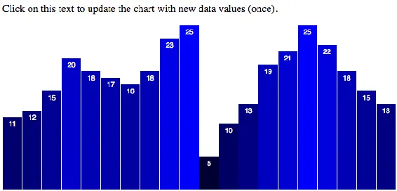
<h6 class="calibre37"><span class="keep-together">Figure 9-6.
</span>Updated chart with correct colors and labels</h6>
</div>
</figure>

</div>

</div>

</div>

</div>

<div class="section calibre2" data-type="sect1"
pdf-bookmark="Transitions">

<div id="ch09.xhtml_idm140093195226384" class="dedication">

# Transitions

Life <span id="ch09.xhtml_idm140093194308128"
class="calibre5 pcalibre pcalibre2 pcalibre3 pcalibre1"
data-type="indexterm" primary="transitions"
secondary="adding animated"></span><span id="ch09.xhtml_idm140093194307120"
class="calibre5 pcalibre pcalibre2 pcalibre3 pcalibre1"
data-type="indexterm" primary="values"
secondary="animating changes in"></span><span id="ch09.xhtml_idm140093194306176"
class="calibre5 pcalibre pcalibre2 pcalibre3 pcalibre1"
data-type="indexterm" primary="updates"
secondary="animation of"></span><span id="ch09.xhtml_idm140093194305232"
class="calibre5 pcalibre pcalibre2 pcalibre3 pcalibre1"
data-type="indexterm" primary="updates"
see="also transitions"></span>transitions can be scary: the first day of
school, moving to a new city, quitting your day job to do freelance data
visualization full-time. But D3 transitions are fun, beautiful, and not
at all emotionally taxing.

Making a nice, super smooth, animated transition is as simple as adding
one line of code:

``` calibre39
.transition()
```

Specifically, add this link in the following chain where your selection
is made, and *above* where any attribute changes are applied:

``` calibre39
//Update all rects
svg.selectAll("rect")
   .data(dataset)
   .transition()    // <-- This is new! Everything else here is unchanged.
   .attr("y", function(d) {
       return h - yScale(d);
   })
   .attr("height", function(d) {
       return yScale(d);
   })
   .attr("fill", function(d) {
       return "rgb(0, 0, " + Math.round(d * 10) + ")";
   });
```

Now run the code in *05_transition.html*, and click the text to see the
transition in action. Note that the end result looks the same visually,
but the transition from the chart’s initial state to its end state is
much, much nicer.

Isn’t that *insane*? I’m not a psychologist, but I believe it is
literally insane that we can add a single line of code, and D3 will
*animate* our value changes for us over time.

Without `transition()`, D3 evaluates every `attr()` statement
immediately, so the changes in height and fill happen right away. When
you add `transition()`, D3 introduces the element of time. Rather than
applying new values all at once, D3 *interpolates* between the old
values and the new values, meaning it normalizes the beginning and
ending values, and calculates all their in-between states as time
passes. D3 is also smart enough to recognize and interpolate between
different attribute value formats. For example, if you specified a
height of `200px` to start but transition to just `100` (without the
`px`). Or if a `blue` fill turns `rgb(0,255,0)`. You don’t need to fret
about being consistent; D3 takes care of it.

Do you believe me yet? This is really insane. And super helpful.

<div class="section calibre2" data-type="sect2"
pdf-bookmark="duration(), or How Long Is This Going to Take?">

<div id="ch09.xhtml_idm140093194558800" class="dedication">

## duration(), or How Long Is This Going to Take?

So the `attr()` values <span id="ch09.xhtml_idm140093194556656"
class="calibre5 pcalibre pcalibre2 pcalibre3 pcalibre1"
data-type="indexterm" primary="transitions"
secondary="controlling duration of"></span><span id="ch09.xhtml_idm140093194555648"
class="calibre5 pcalibre pcalibre2 pcalibre3 pcalibre1"
data-type="indexterm" primary="duration()"></span>are interpolated over
time, but how *much* time? It turns out the default is 250 milliseconds,
or one-quarter second (1,000 milliseconds = 1 second). That’s why the
transition in *05_transition.html* is so fast.

Fortunately, you can control how much time is spent on any transition
by—again, I kid you not—adding a single line of code:

``` calibre39
.duration(1000)
```

The `duration()` must be specified *after* the `transition()`, and
durations are always specified in milliseconds, so `duration(1000)` is a
one-second duration.

Here is that line in context:

``` calibre39
//Update all rects
svg.selectAll("rect")
   .data(dataset)
   .transition()
   .duration(1000)  // <-- Now this is new!
   .attr("y", function(d) {
       return h - yScale(d);
   })
   .attr("height", function(d) {
       return yScale(d);
   })
   .attr("fill", function(d) {
       return "rgb(0, 0, " + Math.round(d * 10) + ")";
   });
```

Open *06_duration.html* and see the difference. Now make a copy of that
file, and try plugging in some different numbers to slow or speed the
transition. For example, try `3000` for a three-second transition, or
`100` for one-tenth of a second.

The actual durations you choose will depend on the context of your
design and what triggers the transition. In practice, I find that
transitions of around 150 ms are useful for providing minor interface
feedback (such as hovering over elements), and about 1,000 ms is ideal
for many more significant visual transitions, such as switching from one
view of the data to another. A duration of 1,000 ms (one second) is not
too long, not too short.

In case you’re feeling lazy, I made *07_duration_slow.html*, which uses
`5000` for a five-second transition.

With such a slow transition, it becomes obvious that the value labels
are not transitioning smoothly along with the bar heights. As you now
know, we can correct that oversight by adding only two new lines of
code, this time in the section where we update the labels:

``` calibre39
//Update all labels
svg.selectAll("text")
   .data(dataset)
   .transition()        // <-- This is new,
   .duration(5000)      // and so is this.
   .text(function(d) {
       return d;
   })
   .attr("x", function(d, i) {
       return xScale(i) + xScale.bandwidth() / 2;
   })
   .attr("y", function(d) {
       return h - yScale(d) + 14;
   });
```

Much better! Note in *08_duration_slow_labels_fixed.html* how the labels
now animate smoothly along with the bars.

<div class="calibre29 warning" data-type="warning">

###### Warning

Transitions can only operate on values that already exist; if you
initiate a transition on a value that doesn’t exist yet, you’ll get some
unexpected and undesirable behavior.

For example, let’s say you wanted to dial down the opacity of the
rectangles in the prior example. You could call something like
`svg.selectAll("rect").transition().attr("opacity", 0)`.

That will make them transparent (0% opaque), but it will happen
instantly, not smoothly, over time. If you first set
`attr("opacity", 1)`, then the transition will have what it needs to
work as expected: a starting value (1) and an ending value (0).

Make sure to always set an *initial* value before attempting to
transition to a new value.

</div>

</div>

</div>

<div class="section calibre2" data-type="sect2"
pdf-bookmark="ease()-y Does It">

<div id="ch09.xhtml_idm140093194558176" class="dedication">

## ease()-y Does It

With a 5,000-ms, slow-as-molasses transition,
<span id="ch09.xhtml_idm140093194008784"
class="calibre5 pcalibre pcalibre2 pcalibre3 pcalibre1"
data-type="indexterm" primary="transitions"
secondary="equalizing pace of"></span>we can also perceive the *quality*
of motion. In this case, notice how the animation begins very slowly,
then accelerates, then slows down again as the bars reach their
destination heights. That is, the rate of motion is not *linear*, but
*variable*.

The <span id="ch09.xhtml_idm140093194005776"
class="calibre5 pcalibre pcalibre2 pcalibre3 pcalibre1"
data-type="indexterm" primary="easing"></span>quality of motion used for
a transition is called *easing*. In animation terms, we think about
elements *easing* into place, moving from here to there.

With D3, you can specify different kinds of easing by using `ease()`.
The default easing is `d3.easeCubicInOut`, which produces the gradual
acceleration and deceleration we see in our chart. It’s a good default
because you generally can’t go wrong with a nice, smooth transition.

Contrast that smoothness to *09_ease_linear.html*, which uses
`ease(d3.easeLinear)` to specify a linear easing function. Notice how
the rate of motion is constant. That is, there is no gradual
acceleration and deceleration—the elements simply begin moving at an
even pace, and then they stop abruptly. (Also, I lowered the duration to
2,000 ms.)

`ease()` must also be specified after `transition()`, but before the
`attr()` statements to which the transition applies. `ease()` can come
before or after `duration()`, but this sequence makes the most sense to
me:

``` calibre39
…   //Selection statement(s)
.transition()
.duration(2000)
.ease(d3.easeLinear)
…   //attr() statements
```

Fortunately, there are many other built-in easing functions to choose
from, including:

`d3.easeCircleIn`  
Gradual ease in and acceleration until elements snap into place.

`d3.easeElasticOut`  
The best way to describe this one is “sproingy.”

`d3.easeBounceOut`  
Like a ball bouncing, then coming to rest.

Sample code files *10_ease_circle.html*, *11_ease_elastic.html*, and
*12_ease_bounce.html* illustrate each of these. Also see the
<a href="https://github.com/d3/d3-ease"
class="calibre5 pcalibre pcalibre2 pcalibre3 pcalibre1">complete list of
built-in easing functions</a> as well as Mike Bostock’s
<a href="http://bit.ly/2uGJnhK"
class="calibre5 pcalibre pcalibre2 pcalibre3 pcalibre1">animated,
interactive reference</a> for previewing each one.

Wow, <span id="ch09.xhtml_idm140093193911696"
class="calibre5 pcalibre pcalibre2 pcalibre3 pcalibre1"
data-type="indexterm"
primary="d3.easeBounceOut"></span><span id="ch09.xhtml_idm140093193910960"
class="calibre5 pcalibre pcalibre2 pcalibre3 pcalibre1"
data-type="indexterm" primary="d3.easeCubicInOut"></span>I already
regret telling you about `d3.easeBounceOut`. Please use bouncing-style
easing only if you are making a satirical infographic that is mocking
other bad graphics. Perceptually, I don’t think there is a real case to
be used for “bounce” easing in visualization. `d3.easeCubicInOut` is the
default for a reason.

</div>

</div>

<div class="section calibre2" data-type="sect2"
pdf-bookmark="Please Do Not delay()">

<div id="ch09.xhtml_idm140093194009824" class="dedication">

## Please Do Not delay()

Whereas `ease()` controls <span id="ch09.xhtml_idm140093193906736"
class="calibre5 pcalibre pcalibre2 pcalibre3 pcalibre1"
data-type="indexterm" primary="transitions"
secondary="delaying start of"></span><span id="ch09.xhtml_idm140093193905728"
class="calibre5 pcalibre pcalibre2 pcalibre3 pcalibre1"
data-type="indexterm" primary="staggered transitions"></span>the quality
of motion, `delay()` specifies when the transition begins.

`delay()` can be given a static value, also in milliseconds, as in:

``` calibre39
…
.transition()
.delay(1000)     //1,000 ms or 1 second
.duration(2000)  //2,000 ms or 2 seconds
…
```

As with `duration()` and `ease()`, the order here is flexible, but I
like to include `delay()` before `duration()`. That makes more sense to
me because the delay happens first, followed by the transition itself.

See *13_delay_static.html*, in which clicking the text triggers first a
1,000-ms delay (in which nothing happens), followed by a 2,000-ms
transition.

Static delays can be useful, but more exciting are delay values that we
calculate dynamically. A common use of this is to generate staggered
delays, so some elements transition before others. Staggered delays can
assist with perception, as it’s easier for our eyes to follow an
individual element’s motion when it is slightly out of sync with its
neighboring elements’ motion.

To do this, instead of giving `delay()` a static value, we give it a
function, in typical D3 fashion:

``` calibre39
…
.transition()
.delay(function(d, i) {
    return i * 100;
})
.duration(500)
…
```

Just as we’ve seen with other D3 methods, when given an anonymous
function, the datum bound to the current element is passed into `d`, and
the index position of that element is passed into `i`. So, in this case,
as D3 loops through each element, the delay for each element is set to
`i * 100`, meaning each subsequent element will be delayed 100 ms *more*
than the preceding element.

All this is to say that we now have staggered transitions. Check out the
beautifully animated bars in *14_delay_dynamic.html* and see for
yourself.

Note that I also decreased the duration to 500 ms to make it feel a bit
snappier. Also note that `duration()` sets the duration for each
*individual transition*, not for all transitions in aggregate. So, for
example, if 20 elements have 500-ms transitions applied with no delay,
then it will all be over in 500 ms, or one-half second. But if a 100-ms
delay is applied to each subsequent element (`i * 100`), then the total
running time of all transitions will be 2,400 ms:

``` calibre39
Max value of i times 100ms delay plus 500ms duration =
19 * 100 + 500 =
2400
```

Because these delays are being calculated on a per-element basis, if you
added more data, then the total running time of all transitions will
increase. This is something to keep in mind if you have a dynamically
loaded dataset with a variable array length. If you suddenly loaded
10,000 data points instead of 20, you could spend a long time watching
those bars wiggle around (1,000,400 ms or 16.67 minutes to be precise).
Suddenly, they’re not so cute anymore.

Fortunately, we can *scale* our delay values dynamically to the length
of the dataset. This isn’t fancy D3 stuff; it’s just math.

See *15_delay_dynamic_scaled.html*, in which 30 values are included in
the dataset. If you get out your stopwatch, you’ll see that the total
transition time is 1.5 seconds, or around 1,500 ms.

Now see *16_delay_dynamic_scaled_fewer.html*, which uses exactly the
same transition code, but with only 10 data points. Notice how the
delays are slightly longer (well, 200 percent longer), so the total
transition time is the same: 1.5 seconds! How is this possible?

``` calibre39
…
.transition()
.delay(function(d, i) {
    return i / dataset.length * 1000;   // <-- Where the magic happens
})
.duration(500)
…
```

The two preceding sample pages use the same delay calculations here.
Instead of multiplying `i` by some static amount, we first divide `i` by
`dataset.length`, in effect normalizing the value. Then, that normalized
value is multiplied by `1000`, or 1 second. The result is that the
maximum amount of delay for the last element will be `1000`, and all
prior elements will be delayed by some amount less than that. A max
delay of `1000` plus a duration of `500` equals 1.5 seconds total
transition time.

This approach to delays is great because it keeps our code *scalable*.
The total duration will be tolerable whether we have only 10 data points
or 10,000.

</div>

</div>

<div class="section calibre2" data-type="sect2"
pdf-bookmark="Randomizing the Data">

<div id="ch09.xhtml_idm140093193908160" class="dedication">

## Randomizing the Data

Just <span id="ch09.xhtml_idm140093193879184"
class="calibre5 pcalibre pcalibre2 pcalibre3 pcalibre1"
data-type="indexterm" primary="transitions"
secondary="randomizing data"></span>to illustrate how cool this is,
let’s repurpose our random-number-generating code from
<a href="#ch05.xhtml_data-chapter5"
class="calibre5 pcalibre pcalibre2 pcalibre3 pcalibre1"
data-type="xref">Chapter 5</a> here, so we can update the chart as many
times as we want, with new data each time.

Down in our click-update function, let’s replace the static `dataset`
with a randomly generated one:

``` calibre39
//New values for dataset
var numValues = dataset.length;               //Count original length of dataset
dataset = [];                                       //Initialize empty array
for (var i = 0; i < numValues; i++) {               //Loop numValues times
    var newNumber = Math.floor(Math.random() * 25); //New random integer (0-24)
    dataset.push(newNumber);                        //Add new number to array
}
```

This will overwrite `dataset` with an array of random integers with
values between 0 and 24. The new array will be the same length as the
original array.

Then, I’ll update the paragraph text:

``` calibre39
<p>Click on this text to update the chart with new data values
as many times as you like!</p>
```

Now open *17_randomized_data.html*, and you should see something like
<a href="#ch09.xhtml_Initial_view"
class="calibre5 pcalibre pcalibre2 pcalibre3 pcalibre1"
data-type="xref">Figure 9-7</a>.

<figure class="calibre35">
<div id="ch09.xhtml_Initial_view" class="figure">
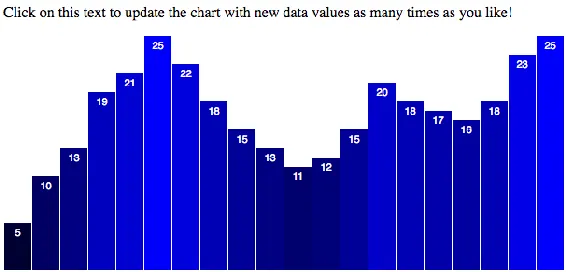
<h6 class="calibre37"><span class="keep-together">Figure 9-7.
</span>Initial view</h6>
</div>
</figure>

Every time you click the paragraph at top, the code will do the
following:

1.  Generate new, random values.

2.  Bind those values to the existing elements.

3.  Transition elements to new positions, heights, and colors, using the
    new values (see <a href="#ch09.xhtml_Random_data_applied"
    class="calibre5 pcalibre pcalibre2 pcalibre3 pcalibre1"
    data-type="xref">Figure 9-8</a>).

<figure class="calibre35">
<div id="ch09.xhtml_Random_data_applied" class="figure">
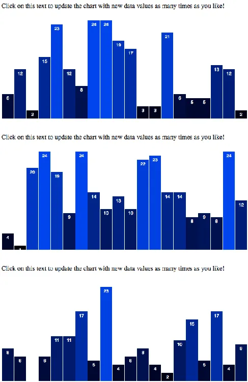
<h6 class="calibre37"><span class="keep-together">Figure 9-8.
</span>Random data applied</h6>
</div>
</figure>

Pretty cool! If this does not feel pretty cool or even a little cool to
you, please turn off your computer and go for a short walk to clear your
head, thereby making room for all the coolness to come. If, however, you
are sufficiently cooled by this knowledge, read on.

<div class="calibre27 note" data-type="note">

###### Note

Close observers like you will have noticed that the bar labels for short
bars (e.g., the bars with values of 0 or 1) are getting cut off or
hidden. As an exercise, try modifying *17_randomized_data.html* with
extra logic for setting the vertical placement and style of labels—such
as, “When the data value is less than or equal to 1, place the label up
above the bar and set its fill to black. Otherwise, place and style the
label normally.”

</div>

</div>

</div>

<div class="section calibre2" data-type="sect2"
pdf-bookmark="Updating Scales">

<div id="ch09.xhtml_idm140093193880160" class="dedication">

## Updating Scales

Astute <span id="ch09.xhtml_idm140093193635264"
class="calibre5 pcalibre pcalibre2 pcalibre3 pcalibre1"
data-type="indexterm" primary="transitions"
secondary="updating scales"></span>readers might take issue with this
line from earlier:

``` calibre39
var newNumber = Math.floor(Math.random() * 25);
```

Why 25? In programming, <span id="ch09.xhtml_idm140093193582336"
class="calibre5 pcalibre pcalibre2 pcalibre3 pcalibre1"
data-type="indexterm" primary="magic numbers"></span>this is referred to
as a *magic number*. I know, it sounds fun, but the problem with magic
numbers is that it’s difficult to tell why they exist (hence, the
“magic”). Instead of `25`, something like `maxValue` would be more
meaningful:

``` calibre39
var newNumber = Math.floor(Math.random() * maxValue);
```

Ah, <span id="ch09.xhtml_idm140093193479808"
class="calibre5 pcalibre pcalibre2 pcalibre3 pcalibre1"
data-type="indexterm" primary="maximum values"></span>see, now the magic
is gone, and I can remember that `25` was acting as the *maximum value*
that could be calculated and put into `newNumber`. As a general rule,
it’s best to avoid magic numbers; instead, store those numbers inside
variables with meaningful names, like `maxValue` or
`numberOfTimesWatchedTheMovieTopSecret`.

More important, I now remember that I arbitrarily chose `25` because
values larger than that exceeded the range of our chart’s scale, so
those bars were cut off. For example, in
<a href="#ch09.xhtml_Tootallwrongnumber"
class="calibre5 pcalibre pcalibre2 pcalibre3 pcalibre1"
data-type="xref">Figure 9-9</a>, I replaced `25` with `50`.

<figure class="calibre35">
<div id="ch09.xhtml_Tootallwrongnumber" class="figure">
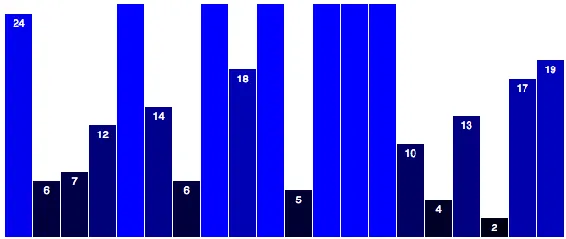
<h6 class="calibre37"><span class="keep-together">Figure 9-9. </span>Too
tall! We used the wrong magic number!</h6>
</div>
</figure>

The real problem is not that I chose the *wrong* magic number; it’s that
our *scale* needs to be updated whenever the dataset is updated.
Whenever we plug in new data values, we should also recalibrate our
scale to ensure that bars don’t get too tall or too short.

Updating a scale is easy. You’ll recall we created `yScale` with this
code:

``` calibre39
var yScale = d3.scaleLinear()
               .domain([0, d3.max(dataset)])
               .range([0, h]);
```

The *range* can stay the same (as the visual size of our chart isn’t
changing), but after the new dataset has been generated, we should
update the scale’s *domain*:

``` calibre39
//Update scale domain
yScale.domain([0, d3.max(dataset)]);
```

This sets the upper end of the input domain to the largest data value in
`dataset`. Later, when we update all the bars and labels, we already
reference `yScale` to calculate their positions, so no other code
changes are necessary.

Check it out in *18_dynamic_scale.html*. I went ahead and replaced our
magic number `25` with `maxValue`, which I set here to `100`. So now
when we click to update, we get random numbers between 0 and 100.
(Technically, the largest number that could be returned is 99.
`Math.random()` returns values from 0 *up to, but not including* 1. In
our code, `Math.floor()` then rounds down, so even a random value of
99.99999 would be rounded down to 99.) If the *maximum* value in the
dataset is 97, then `yScale`’s domain will go up to 97, as we see in <a
href="#ch09.xhtml_Randomdatabuttheyaxisscaleautomaticallyaccommodates"
class="calibre5 pcalibre pcalibre2 pcalibre3 pcalibre1"
data-type="xref">Figure 9-10</a>.

<figure class="calibre35">
<div id="ch09.xhtml_Randomdatabuttheyaxisscaleautomaticallyaccommodates"
class="figure">
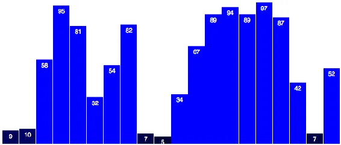
<h6 class="calibre37"><span class="keep-together">Figure 9-10.
</span>Random data, but the y-axis scale automatically accommodates</h6>
</div>
</figure>

Because the numbers are random, that maximum value could be different
each time. In
<a href="#ch09.xhtml_Aslightlydifferentscaleduetoslightlydifferentdata"
class="calibre5 pcalibre pcalibre2 pcalibre3 pcalibre1"
data-type="xref">Figure 9-11</a>, the scale tops out at 83.

<figure class="calibre35">
<div id="ch09.xhtml_Aslightlydifferentscaleduetoslightlydifferentdata"
class="figure">
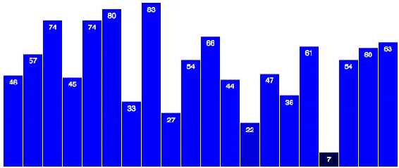
<h6 class="calibre37"><span class="keep-together">Figure 9-11. </span>A
slightly different scale, due to slightly different data</h6>
</div>
</figure>

Note that the height of the 97 bar in the first chart is *the same* as
the height of the 83 bar here. The data is changing; the scale input
domain is changing; the output visual range does *not* change.

</div>

</div>

<div class="section calibre2" data-type="sect2"
pdf-bookmark="Updating Axes">

<div id="ch09.xhtml_idm140093193636368" class="dedication">

## Updating Axes

The bar <span id="ch09.xhtml_idm140093193556672"
class="calibre5 pcalibre pcalibre2 pcalibre3 pcalibre1"
data-type="indexterm" primary="transitions"
secondary="updating axes"></span><span id="ch09.xhtml_idm140093193555664"
class="calibre5 pcalibre pcalibre2 pcalibre3 pcalibre1"
data-type="indexterm" primary="axes" secondary="updating"></span>chart
doesn’t have any axes, but our scatterplot from the last chapter does
(<a
href="#ch09.xhtml_Updatedscatterplotnowwithdataupdatesanddynamicscales"
class="calibre5 pcalibre pcalibre2 pcalibre3 pcalibre1"
data-type="xref">Figure 9-12</a>). I’ve brought it back, with a few
tweaks, in *19_axes_static.html*.

<figure class="calibre35">
<div
id="ch09.xhtml_Updatedscatterplotnowwithdataupdatesanddynamicscales"
class="figure">
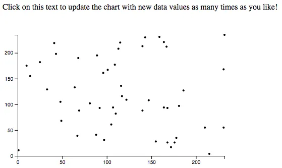
<h6 class="calibre37"><span class="keep-together">Figure 9-12.
</span>Updated scatterplot, now with data updates and dynamic
scales</h6>
</div>
</figure>

To summarize the changes to the scatterplot:

- You can now click the text at top to generate and update with new
  data.

- Animated transitions are used after data updates.

- I eliminated the staggered delay, and set all transitions to occur
  over a full second (1,000 ms).

- Both the x- and y-axis scales are updated, too.

- Circles now have a constant radius.

Try clicking the text and watch all those little dots zoom around. Cute!
I sort of wish they represented some meaningful information, but hey,
random data can be fun, too.

What’s *not* happening yet is that the axes aren’t updating.
Fortunately, that is simple to do.

First, I am going to add the class names `x` and `y` to our x- and
y-axes, respectively. This will help us select those axes later:

``` calibre39
//Create x-axis
svg.append("g")
    .attr("class", "x axis")    // <-- Note x added here
    .attr("transform", "translate(0," + (h - padding) + ")")
    .call(xAxis);

//Create y-axis
svg.append("g")
    .attr("class", "y axis")    // <-- Note y added here
    .attr("transform", "translate(" + padding + ",0)")
    .call(yAxis);
```

Then, down in our click function, we simply add:

``` calibre39
//Update x-axis
svg.select(".x.axis")
    .transition()
    .duration(1000)
    .call(xAxis);

//Update y-axis
svg.select(".y.axis")
    .transition()
    .duration(1000)
    .call(yAxis);
```

For each axis, we do the following:

1.  Select the axis.

2.  Initiate a transition.

3.  Set the transition’s duration.

4.  Call the appropriate axis generator.

Remember that each axis generator is already referencing a scale (either
`xScale` or `yScale`). Because those scales are being updated, the axis
generators can calculate what the new tick marks should be.

Open *20_axes_dynamic.html* and give it a try.

Once again, `transition()` handles all the interpolation magic for
you—watch those ticks fade in and out. Just beautiful, and you barely
had to lift a finger.

</div>

</div>

<div class="section calibre2" data-type="sect2"
pdf-bookmark="on() Transition Starts and Ends">

<div id="ch09.xhtml_idm140093193557808" class="dedication">

## on() Transition Starts and Ends

There <span id="ch09.xhtml_idm140093193268736"
class="calibre5 pcalibre pcalibre2 pcalibre3 pcalibre1"
data-type="indexterm" primary="transitions"
secondary="marking beginnings/endings of"></span>will be times when you
want to make something happen at the start or end of a transition. In
those times, you can use `on()` to execute arbitrary code for each
element in the selection.

`on()` expects two arguments:

- Either `"start"` or `"end"`

- An anonymous function, to be executed either at the start of a
  transition, or as soon as it has ended

For example, here is our circle-updating code, with two `on()`
statements added:

``` calibre39
//Update all circles
svg.selectAll("circle")
   .data(dataset)
   .transition()
   .duration(1000)
   .on("start", function() {      // <-- Executes at start of transition
       d3.select(this)
         .attr("fill", "magenta")
         .attr("r", 3);
   })
   .attr("cx", function(d) {
        return xScale(d[0]);
   })
   .attr("cy", function(d) {
        return yScale(d[1]);
   })
   .on("end", function() {        // <-- Executes at end of transition
       d3.select(this)
         .attr("fill", "black")
         .attr("r", 2);
   });
```

You can see this in action in *21_on.html*.

Now you click the trigger, and immediately each circle’s fill is set to
magenta, and its radius is set to 3 (see
<a href="#ch09.xhtml_Hotpinkcirclesinmidtransition"
class="calibre5 pcalibre pcalibre2 pcalibre3 pcalibre1"
data-type="xref">Figure 9-13</a>). Then the transition is run, per
usual. When complete, the fills and radii are restored to their original
values.

<figure class="calibre35">
<div id="ch09.xhtml_Hotpinkcirclesinmidtransition" class="figure">
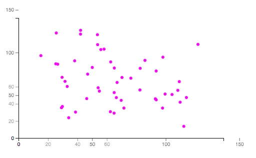
<h6 class="calibre37"><span class="keep-together">Figure 9-13.
</span>Hot pink circles, midtransition</h6>
</div>
</figure>

Something to note is that within the anonymous function passed to
`on()`, the context of `this` is maintained as “the current element.”
This is handy because then `this` can be referenced with the function to
easily reselect the current element and modify it, as done here:

``` calibre39
   .on("start", function() {
       d3.select(this)              // Selects 'this', the current element
         .attr("fill", "magenta")   // Sets fill of 'this' to magenta
         .attr("r", 3);             // Sets radius of 'this' to 3
   })
```

<div class="section calibre2" data-type="sect3"
pdf-bookmark="Warning: Start carefully">

<div id="ch09.xhtml_idm140093193076368" class="dedication">

### Warning: Start carefully

You <span id="ch09.xhtml_idm140093193039904"
class="calibre5 pcalibre pcalibre2 pcalibre3 pcalibre1"
data-type="indexterm" primary="coding tips"
secondary="limit to active transitions"></span><span id="ch09.xhtml_idm140093193038912"
class="calibre5 pcalibre pcalibre2 pcalibre3 pcalibre1"
data-type="indexterm" primary="transitions"
secondary="limit to active number"></span>might be tempted to throw
another transition in here, resulting in a smooth fade from black to
magenta. Don’t do it! Or do it, but note that this will break:

``` calibre39
   .on("start", function() {
       d3.select(this)
         .transition()              // New transition
         .duration(250)             // New duration
         .attr("fill", "magenta")
         .attr("r", 3);
   })
```

If you try this, and I recommend that you do, you’ll find that the
circles do indeed fade to pink, but they no longer change positions in
space. That’s because, by default, only one transition can be active on
any given element at any given time. Newer transitions interrupt and
override older transitions.

This might seem like a design flaw, but D3 operates this way on purpose.
Imagine if you had several different buttons, each of which triggered a
different view of the data, and a visitor was clicking through them in
rapid succession. Wouldn’t you want an earlier transition to be
interrupted, so the last-selected view could be put in place right away?

If <span id="ch09.xhtml_idm140093192818640"
class="calibre5 pcalibre pcalibre2 pcalibre3 pcalibre1"
data-type="indexterm"
primary="queued transitions"></span><span id="ch09.xhtml_idm140093192818000"
class="calibre5 pcalibre pcalibre2 pcalibre3 pcalibre1"
data-type="indexterm" primary="jQuery"
secondary="transitions using"></span>you’re familiar with jQuery, you’ll
notice a difference here. By default, jQuery queues transitions, so they
execute one after another, and calling a new transition doesn’t
automatically interrupt any existing ones. This sometimes results in
annoying interface behavior, like menus that fade in when you mouse over
them, but won’t start fading out until *after* the fade-in has
completed.

In this case, the code “breaks” because the first (spatial) transition
is begun, then `on("start", …)` is called on each element. Within
`on()`, a second transition is initiated (the fade to pink), overriding
the first transition, so the circles never make it to their final
destinations (although they look great, just sitting at home).

Because of this quirk of transitions, `on("start", …)` is typically used
only for immediate transformations, not interpolated ones.

</div>

</div>

<div class="section calibre2" data-type="sect3"
pdf-bookmark="End gracefully">

<div id="ch09.xhtml_idm140093192813632" class="dedication">

### End gracefully

`on("end", …)`, however, *is* a good place to specify additional
transitions, because by the time `on("end", …)` is called, the primary
transition has already ended, so initiating a new transition won’t cause
any harm.

See *22_on_combo_transition.html*. Within the first `on()` statement, I
bumped the pink circle radius size up to 7. In the second, I added two
lines for transition and a duration:

``` calibre39
.on("end", function() {
    d3.select(this)
      .transition()             // <-- New!
      .duration(1000)           // <-- New!
      .attr("fill", "black")
      .attr("r", 2);
});
```

Watch that transition; so cool! Note the sequence of events:

1.  You click the `p` text.

2.  Circles turn pink and increase in size immediately.

3.  Circles transition to new positions.

4.  Circles transition to original color and size.

Also, try clicking on the `p` trigger several times in a row. Go ahead,
just go nuts, and click as fast as you can. Notice how each click
interrupts the circles’ progress. (Sorry, guys!) You’re seeing each new
transition request override the old one. The circles will never reach
their final positions and fade to black unless you stop clicking and
give them time to rest.

As <span id="ch09.xhtml_idm140093192755648"
class="calibre5 pcalibre pcalibre2 pcalibre3 pcalibre1"
data-type="indexterm" primary="transitions"
secondary="chaining together"></span>cool as that is, there is an even
simpler way to schedule multiple transitions to run one after the other:
we simply chain transitions together. Instead of reselecting elements
and calling a new transition on each one with `on("end", …)`, just tack
a second transition onto the end of the chain:

``` calibre39
svg.selectAll("circle")
   .data(dataset)
   .transition()    // <-- Transition #1
   .duration(1000)
   .on("start", function() {
       d3.select(this)
         .attr("fill", "magenta")
         .attr("r", 7);
   })
   .attr("cx", function(d) {
   		return xScale(d[0]);
   })
   .attr("cy", function(d) {
   		return yScale(d[1]);
   })
   .transition()    // <-- Transition #2
   .duration(1000)
   .attr("fill", "black")
   .attr("r", 2);
```

Try that code out in *23_chained_transitions.html*, and you’ll see it
has the same behavior.

When <span id="ch09.xhtml_idm140093192751376"
class="calibre5 pcalibre pcalibre2 pcalibre3 pcalibre1"
data-type="indexterm"
primary="immediate transformations"></span>sequencing multiple
transitions, I recommend this chaining approach. Then only use `on()`
for immediate (nontransitioned) changes that need to occur right before
or right after transitions. As you can imagine, it’s possible to create
quite complex sequences of discrete and animated changes by chaining
together multiple transitions, each of which can have its own calls to
`on("start", …)` and `on("end", …)`.

</div>

</div>

<div class="section calibre2" data-type="sect3"
pdf-bookmark="Containing visual elements with clipping paths">

<div id="ch09.xhtml_contain_viselements" class="dedication">

### Containing visual elements with clipping paths

On a <span id="ch09.xhtml_idm140093192682016"
class="calibre5 pcalibre pcalibre2 pcalibre3 pcalibre1"
data-type="indexterm" primary="transitions"
secondary="clipping paths"></span><span id="ch09.xhtml_idm140093192681008"
class="calibre5 pcalibre pcalibre2 pcalibre3 pcalibre1"
data-type="indexterm" primary="clipping paths"></span>related note, you
might have noticed that during these transitions, points with low x or y
values would exceed the boundaries of the chart area, and overlap the
axis lines, as displayed in
<a href="#ch09.xhtml_Pointsexceedingthechartarea"
class="calibre5 pcalibre pcalibre2 pcalibre3 pcalibre1"
data-type="xref">Figure 9-14</a>.

<figure class="calibre35">
<div id="ch09.xhtml_Pointsexceedingthechartarea" class="figure">
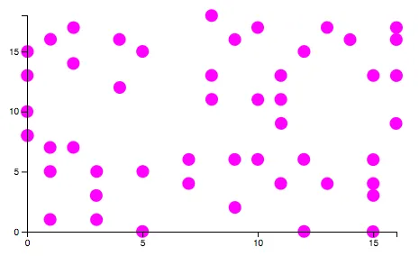
<h6 class="calibre37"><span class="keep-together">Figure 9-14.
</span>Points exceeding the chart area</h6>
</div>
</figure>

Fortunately, <span id="ch09.xhtml_idm140093192676880"
class="calibre5 pcalibre pcalibre2 pcalibre3 pcalibre1"
data-type="indexterm" primary="masks"></span>SVG has support for
*clipping paths*, which you might know as *masks* in many drawing tools,
such as Sketch, Photoshop, or Illustrator. A clipping path is an SVG
element that contains visual elements that, together, make up the
clipping path or mask to be applied to other elements. When a mask is
applied to an element, only the pixels that land within that mask’s
shape are displayed.

Much like `g`, a `clipPath` has no visual presence of its own, but it
contains visual elements (which are used to make the mask). For example,
here’s a simple `clipPath`:

``` calibre39
<clipPath id="chart-area">
    <rect x="30" y="30" width="410" height="240"></rect>
</clipPath>
```

Note that the outer `clipPath` element has been given an ID of
`chart-area`. We can use that ID to reference it later. Within the
`clipPath` is a `rect`, which will function as the mask.

So there are three steps to using a clipping path:

1.  Define the `clipPath` and give it an ID.

2.  Put visual elements within the `clipPath` (usually just a `rect`,
    but this could be `circle`s or any other visual elements).

3.  Add a reference to the `clipPath` from whatever element(s) you wish
    to be masked.

Continuing with the scatterplot, I’ll define the clipping path with this
new code (steps 1 and 2):

``` calibre39
//Define clipping path
svg.append("clipPath")                  //Make a new clipPath
    .attr("id", "chart-area")           //Assign an ID
    .append("rect")                     //Within the clipPath, create a new rect
    .attr("x", padding)                 //Set rect's position and size…
    .attr("y", padding)
    .attr("width", w - padding * 3)
    .attr("height", h - padding * 2);
```

I want all of the `circle`s to be masked by this `clipPath`. I could add
a `clipPath` reference to every single circle, but it’s much easier and
cleaner to just put all the `circle`s into a `g` group, and then add the
reference to that (this is step 3).

So, I will modify this code:

``` calibre39
//Create circles
svg.selectAll("circle")
   .data(dataset)
   .enter()
   .append("circle")
   …
```

by adding three new lines, creating a new `g`, giving it an arbitrary
ID, and finally adding the reference to the `chart-area` `clipPath`:

``` calibre39
//Create circles
svg.append("g")                             //Create new g
   .attr("id", "circles")                   //Assign ID of 'circles'
   .attr("clip-path", "url(#chart-area)")   //Add reference to clipPath
   .selectAll("circle")                     //Continue as before…
   .data(dataset)
   .enter()
   .append("circle")
   …
```

Notice that the attribute name is `clip-path`, yet the element name is
`clipPath`. Argh! I know; it drives me crazy, too.

View the sample page *24_clip-path.html* and open the web inspector.
Let’s look at that new `rect` in
<a href="#ch09.xhtml_ThedimensionsofarectwithinaclipPath"
class="calibre5 pcalibre pcalibre2 pcalibre3 pcalibre1"
data-type="xref">Figure 9-15</a>.

<figure class="calibre35">
<div id="ch09.xhtml_ThedimensionsofarectwithinaclipPath" class="figure">
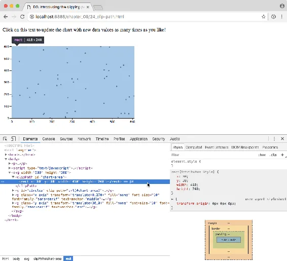
<h6 class="calibre37"><span class="keep-together">Figure 9-15.
</span>The dimensions of a rect within a clipPath</h6>
</div>
</figure>

Because `clipPath`s have no visual rendering (they only mask other
elements), it’s helpful to highlight them in the web inspector, which
will then outline the path’s position and size with a blue highlight. In
<a href="#ch09.xhtml_ThedimensionsofarectwithinaclipPath"
class="calibre5 pcalibre pcalibre2 pcalibre3 pcalibre1"
data-type="xref">Figure 9-15</a> we can see that the `clipPath rect` is
in the right place and is the right size.

Notice, too, that now all the `circle`s are grouped within a single `g`
element, whose `clip-path` attribute references our new clipping path,
using the slightly peculiar syntax `url(#chart-area)`. Thanks for that,
SVG specification.

The end result is that our `circle`s’ pixels get clipped when they get
too close to the edge of the chart area. Note the points at the extreme
top and right edges.

The clipping is easier to see midtransition, as in
<a href="#ch09.xhtml_Pointscontainedwithinthechartarea"
class="calibre5 pcalibre pcalibre2 pcalibre3 pcalibre1"
data-type="xref">Figure 9-16</a>.

<figure class="calibre35">
<div id="ch09.xhtml_Pointscontainedwithinthechartarea" class="figure">
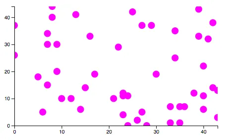
<h6 class="calibre37"><span class="keep-together">Figure 9-16.
</span>Points contained within the chart area</h6>
</div>
</figure>

Voilà! The points no longer exceed the chart boundaries.

</div>

</div>

</div>

</div>

</div>

</div>

<div class="section calibre2" data-type="sect1"
pdf-bookmark="Other Kinds of Data Updates">

<div id="ch09.xhtml_idm140093194309232" class="dedication">

# Other Kinds of Data Updates

Until <span id="ch09.xhtml_Uvalue09"
class="calibre5 pcalibre pcalibre2 pcalibre3 pcalibre1"
data-type="indexterm" primary="updates"
secondary="adding values/elements"></span><span id="ch09.xhtml_Vadd09"
class="calibre5 pcalibre pcalibre2 pcalibre3 pcalibre1"
data-type="indexterm" primary="values"
secondary="adding"></span><span id="ch09.xhtml_Eadd09"
class="calibre5 pcalibre pcalibre2 pcalibre3 pcalibre1"
data-type="indexterm" primary="elements" secondary="adding"></span>now,
when updating data, we have taken the “whole kit-and-kaboodle” approach:
changing values in the dataset array, and then rebinding that revised
dataset, overwriting the original values bound to our DOM elements.

That approach is most useful when *all* the values are changing, and
when the length of the dataset (i.e., the number of values) stays the
same. But as we know, real-life data is messy, and calls for even more
flexibility, such as when you only want to update one or two values, or
you even need to add or subtract values. D3, again, comes to the rescue.

<div class="section calibre2" data-type="sect2"
pdf-bookmark="Adding Values (and Elements)">

<div id="ch09.xhtml_idm140093192412704" class="dedication">

## Adding Values (and Elements)

Let’s go back to our lovely bar chart, and say that some user
interaction (a mouse click) should now trigger adding a *new* value to
our dataset. That is, the length of the array `dataset` will increase by
one.

Generating a random number and pushing it to the array is easy enough:

``` calibre39
//Add one new value to dataset
var maxValue = 25;
var newNumber = Math.floor(Math.random() * maxValue);
dataset.push(newNumber);
```

Making room for an extra bar will require recalibrating our x-axis
scale. That’s just a matter of updating its input domain to reflect the
new length of `dataset`:

``` calibre39
xScale.domain(d3.range(dataset.length));
```

That’s the easy stuff. Now prepare to bend your brain yet again, as we
dive into the depths of D3 *selections*.

<div class="section calibre2" data-type="sect3" pdf-bookmark="Select">

<div id="ch09.xhtml_idm140093192232576" class="dedication">

### Select

By <span id="ch09.xhtml_idm140093192230912"
class="calibre5 pcalibre pcalibre2 pcalibre3 pcalibre1"
data-type="indexterm"
primary="select()"></span><span id="ch09.xhtml_idm140093192230176"
class="calibre5 pcalibre pcalibre2 pcalibre3 pcalibre1"
data-type="indexterm" primary="selectAll()"></span>now, you are
comfortable using `select()` and `selectAll()` to grab and return DOM
element selections. And you’ve even seen how, when these methods are
chained, they grab selections within selections, and so on, as in:

``` calibre39
d3.select("body").selectAll("p");   //Returns all 'p' elements within 'body'
```

When storing the *results* of these selection methods, the most specific
result—meaning the result of the last selector in the chain—is the
reference handed off to the variable. For example:

``` calibre39
var paragraphs = d3.select("body").selectAll("p");
```

Now `paragraphs` contains a selection of all `p` elements in the DOM,
even though we traversed through `body` to get there.

The twist here is that the `data()` method *also* returns a selection.
Specifically, <span class="keep-together">`data()`</span> returns
references to all elements to which data was just bound, which we call
the *update* selection.

In the case of our bar chart, this means that we can select all the
bars, then rebind the new data to those bars, and grab the update
selection all in one fell swoop:

``` calibre39
//Select…
var bars = svg.selectAll("rect")
    .data(dataset);
```

Now the update selection is stored in `bars`.

</div>

</div>

<div class="section calibre2" data-type="sect3" pdf-bookmark="Enter">

<div id="ch09.xhtml_idm140093192231984" class="dedication">

### Enter

When we changed our data values, but not the *length* of the whole
dataset, we didn’t have to worry about an update selection—we simply
rebound the data, and transitioned to new attribute values.

But now we have *added* a value. So `dataset.length` was originally 20,
but now it is 21. How can we address that new data value, specifically,
to draw a new `rect` for it? Stay with me here; your patience will be
rewarded.

The genius of the update selection is that it contains within it
references to *enter* and *exit* subselections.

*Entering* elements are those that are new to the scene. It’s considered
good form to welcome such elements to the neighborhood with a plate of
cookies.

Whenever there are more data values than corresponding DOM elements, the
*enter* selection contains references to those elements *that do not yet
exist*. You already know how to access the enter selection: by using
`enter()` after binding the new data, as we do when first creating the
bar chart. You have already seen the following code:

``` calibre39
svg.selectAll("rect") //Selects all rects (as yet nonexistent)
   .data(dataset)     //Binds data to selection, returns update selection
   .enter()           //Extracts the enter selection, i.e., 20
                      //placeholder elements
   .append("rect")    //Creates a 'rect' inside each of the placeholder elements
   …
```

You have already seen this sequence of
`selectAll()`→`data()`→`enter()`→<span class="keep-together">`append()`</span>
many times, but only in the context of creating many elements at once,
when the page first loads.

Now that we have added one value to `dataset`, we can use `enter()` to
address the one new corresponding DOM element, without touching all the
existing `rect`s. Following the preceding `Select` code, I’ll add:

``` calibre39
//Enter…
bars.enter()
    .append("rect")
    .attr("x", w)
    .attr("y", function(d) {
        return h - yScale(d);
    })
    .attr("width", xScale.bandwidth())
    .attr("height", function(d) {
        return yScale(d);
    })
    .attr("fill", function(d) {
        return "rgb(0, 0, " + Math.round(d * 10) + ")";
    })
```

Remember, `bars` contains the update selection, so `bars.enter()`
extracts the enter selection from that. In this case, the enter
selection is one reference to one new DOM element. We follow that with
`append()` to create the new `rect`, and all the other `attr()`
statements as usual, except for the following line:

``` calibre39
.attr("x", w)
```

You might notice that this sets the horizontal position of the new
`rect` to be just past the far-right edge of the SVG. I want the new bar
to be created just out of sight, so I can use a nice, smooth transition
to move it gently into view.

</div>

</div>

<div class="section calibre2" data-type="sect3" pdf-bookmark="Update">

<div id="ch09.xhtml_idm140093192103136" class="dedication">

### Update

We made the new `rect`; now all that’s left is to update the visual
attributes of all remaining `rect`s—the new one as well as the old ones.

At the end of the long chain we just saw, we are still operating on only
the enter selection (representing the one, new `rect`). Continuing that
chain, we can use `merge()` to combine that enter selection with the
update selection (the old, preexisting `rect`s).

``` calibre39
    .merge(bars)    //Update…
    .transition()
    .duration(500)
    .attr("x", function(d, i) {
        return xScale(i);
    })
    .attr("y", function(d) {
        return h - yScale(d);
    })
    .attr("width", xScale.bandwidth())
    .attr("height", function(d) {
        return yScale(d);
    });
```

Reading this chain from start to finish, see how we started with `bars`,
then operated on the `enter()` subselection, then used `merge(bars)` to
bring the old bars back into the current selection again, alongside the
enter selection.

So after `merge` we have all the bars back in one selection, and we
transition the x, y, width, and height of *all* bars to their new
values. Don’t believe me? See the working code in
*25_adding_values.html*.

<a href="#ch09.xhtml_Initialbarchart"
class="calibre5 pcalibre pcalibre2 pcalibre3 pcalibre1"
data-type="xref">Figure 9-17</a> shows the initial chart.

<figure class="calibre35">
<div id="ch09.xhtml_Initialbarchart" class="figure">

<h6 class="calibre37"><span class="keep-together">Figure 9-17.
</span>Initial bar chart</h6>
</div>
</figure>

<a href="#ch09.xhtml_Afteroneclick"
class="calibre5 pcalibre pcalibre2 pcalibre3 pcalibre1"
data-type="xref">Figure 9-18</a> shows the chart after one click on the
text. Note the new bar on the right.

<figure class="calibre35">
<div id="ch09.xhtml_Afteroneclick" class="figure">
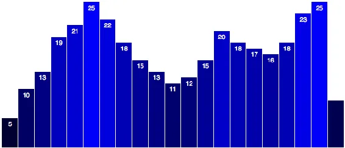
<h6 class="calibre37"><span class="keep-together">Figure 9-18.
</span>After one click</h6>
</div>
</figure>

After two clicks, we get the chart shown in
<a href="#ch09.xhtml_Aftertwoclicks"
class="calibre5 pcalibre pcalibre2 pcalibre3 pcalibre1"
data-type="xref">Figure 9-19</a>. <a href="#ch09.xhtml_Afterthreeclicks"
class="calibre5 pcalibre pcalibre2 pcalibre3 pcalibre1"
data-type="xref">Figure 9-20</a> shows the result after three clicks.

<figure class="calibre35">
<div id="ch09.xhtml_Aftertwoclicks" class="figure">
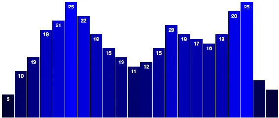
<h6 class="calibre37"><span class="keep-together">Figure 9-19.
</span>After two clicks</h6>
</div>
</figure>

<figure class="calibre35">
<div id="ch09.xhtml_Afterthreeclicks" class="figure">
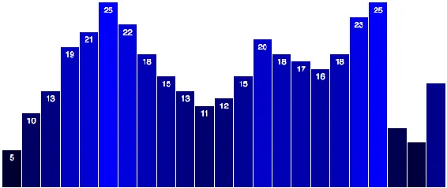
<h6 class="calibre37"><span class="keep-together">Figure 9-20.
</span>After three clicks</h6>
</div>
</figure>

After several more clicks, you’ll see the chart shown in
<a href="#ch09.xhtml_Aftermanyclicks"
class="calibre5 pcalibre pcalibre2 pcalibre3 pcalibre1"
data-type="xref">Figure 9-21</a>.

<figure class="calibre35">
<div id="ch09.xhtml_Aftermanyclicks" class="figure">
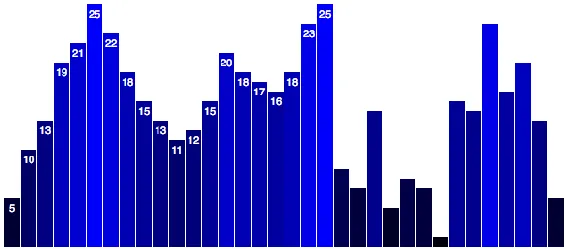
<h6 class="calibre37"><span class="keep-together">Figure 9-21.
</span>After many clicks</h6>
</div>
</figure>

Not only are new bars being created, sized, and positioned, but on every
click, *all other bars* are rescaled and moved into position as well.

What’s *not* happening is that new value labels aren’t being created and
transitioned into place. I leave that as an exercise for you to
pursue.<span id="ch09.xhtml_idm140093191890272"
class="calibre5 pcalibre pcalibre2 pcalibre3 pcalibre1"
data-type="indexterm" primary=""
startref="Uvalue09"></span><span id="ch09.xhtml_idm140093191889296"
class="calibre5 pcalibre pcalibre2 pcalibre3 pcalibre1"
data-type="indexterm" primary=""
startref="Vadd09"></span><span id="ch09.xhtml_idm140093191888352"
class="calibre5 pcalibre pcalibre2 pcalibre3 pcalibre1"
data-type="indexterm" primary="" startref="Eadd09"></span>

</div>

</div>

</div>

</div>

<div class="section calibre2" data-type="sect2"
pdf-bookmark="Removing Values (and Elements)">

<div id="ch09.xhtml_idm140093192412208" class="dedication">

## Removing Values (and Elements)

Removing <span id="ch09.xhtml_Uremove09"
class="calibre5 pcalibre pcalibre2 pcalibre3 pcalibre1"
data-type="indexterm" primary="updates"
secondary="removing values/elements"></span><span id="ch09.xhtml_Vremov09"
class="calibre5 pcalibre pcalibre2 pcalibre3 pcalibre1"
data-type="indexterm" primary="values"
secondary="removing"></span><span id="ch09.xhtml_Eremov09"
class="calibre5 pcalibre pcalibre2 pcalibre3 pcalibre1"
data-type="indexterm" primary="elements"
secondary="removing"></span>elements is easier.

Whenever <span id="ch09.xhtml_idm140093191879008"
class="calibre5 pcalibre pcalibre2 pcalibre3 pcalibre1"
data-type="indexterm" primary="exit selection"></span>there are more DOM
elements than data values, the *exit* selection contains references to
those elements without data. As you’ve already guessed, we can access
the exit selection with `exit()`.

First, I’ll change our trigger text to indicate we’re removing values:

``` calibre39
<p>Click on this text to remove a data value from the chart!</p>
```

Then, on click, instead of generating a new random value and adding it
to `dataset`, we’ll use `shift()`, which removes the first element from
the array:

``` calibre39
//Remove one value from dataset
dataset.shift();
```

<div class="section calibre2" data-type="sect3" pdf-bookmark="Exit">

<div id="ch09.xhtml_idm140093191685024" class="dedication">

### Exit

*Exiting* elements <span id="ch09.xhtml_idm140093191684000"
class="calibre5 pcalibre pcalibre2 pcalibre3 pcalibre1"
data-type="indexterm"
primary="exiting elements"></span><span id="ch09.xhtml_idm140093191786912"
class="calibre5 pcalibre pcalibre2 pcalibre3 pcalibre1"
data-type="indexterm" primary="elements"
secondary="exiting elements"></span>are those that are on their way out.
We should be polite and wish these elements a safe journey.

So we grab the exit selection, transition the exiting element off to the
right side, and, finally, remove it:

``` calibre39
//Exit…
bars.exit()
    .transition()
    .duration(500)
    .attr("x", w)
    .remove();
```

`remove()` is a special transition method that waits until the
transition is complete, and then deletes the element from the DOM
forever. (Sorry, there’s no getting it back.)

</div>

</div>

<div class="section calibre2" data-type="sect3"
pdf-bookmark="Making a smooth exit">

<div id="ch09.xhtml_idm140093191602048" class="dedication">

### Making a smooth exit

Visually speaking, it’s good practice to perform a transition first,
rather than simply `remove()` elements right away. In this case, we’re
moving the bar off to the right, but you could just as easily transition
`opacity` to zero, or apply some other visual transition.

That said, if you ever need to just get rid of an element ASAP, by all
means, you can use `remove()` without calling a transition first. (Just
for fun, in the console, try typing `d3.selectAll("*").remove()`.)

Okay, now try out the code in *26_removing_values.html*.
<a href="#ch09.xhtml_Initial_bar_chart"
class="calibre5 pcalibre pcalibre2 pcalibre3 pcalibre1"
data-type="xref">Figure 9-22</a> shows the initial view.

<figure class="calibre35">
<div id="ch09.xhtml_Initial_bar_chart" class="figure">
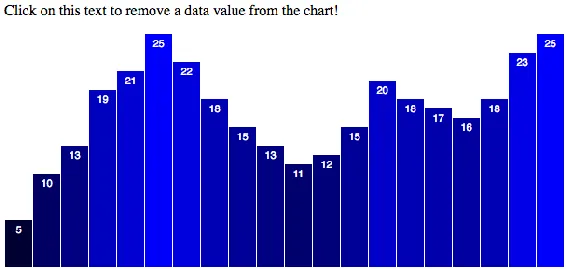
<h6 class="calibre37"><span class="keep-together">Figure 9-22.
</span>Initial bar chart</h6>
</div>
</figure>

Then, after one click on the text, note the loss of one bar in
<a href="#ch09.xhtml_After_one_click"
class="calibre5 pcalibre pcalibre2 pcalibre3 pcalibre1"
data-type="xref">Figure 9-23</a>.

<figure class="calibre35">
<div id="ch09.xhtml_After_one_click" class="figure">
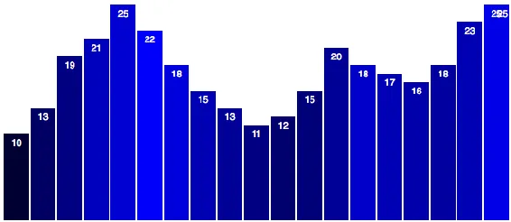
<h6 class="calibre37"><span class="keep-together">Figure 9-23.
</span>After one click</h6>
</div>
</figure>

After two clicks, you’ll see the chart in
<a href="#ch09.xhtml_After_two_clicks"
class="calibre5 pcalibre pcalibre2 pcalibre3 pcalibre1"
data-type="xref">Figure 9-24</a>.
<a href="#ch09.xhtml_After_three_clicks"
class="calibre5 pcalibre pcalibre2 pcalibre3 pcalibre1"
data-type="xref">Figure 9-25</a> shows what displays after three clicks.

<figure class="calibre35">
<div id="ch09.xhtml_After_two_clicks" class="figure">
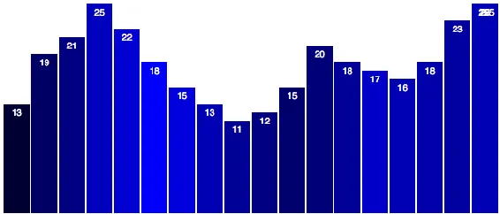
<h6 class="calibre37"><span class="keep-together">Figure 9-24.
</span>After two clicks</h6>
</div>
</figure>

<figure class="calibre35">
<div id="ch09.xhtml_After_three_clicks" class="figure">
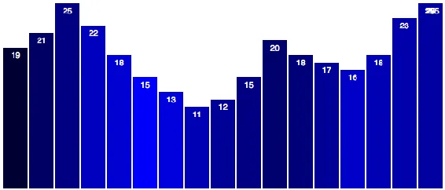
<h6 class="calibre37"><span class="keep-together">Figure 9-25.
</span>After three clicks</h6>
</div>
</figure>

After many clicks, the result is shown in
<a href="#ch09.xhtml_After_many_clicks"
class="calibre5 pcalibre pcalibre2 pcalibre3 pcalibre1"
data-type="xref">Figure 9-26</a>.

<figure class="calibre35">
<div id="ch09.xhtml_After_many_clicks" class="figure">
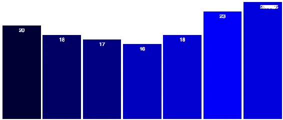
<h6 class="calibre37"><span class="keep-together">Figure 9-26.
</span>After many clicks</h6>
</div>
</figure>

On each click, one bar moves off to the right, and then is removed from
the DOM. (You can confirm this with the web inspector.)

But what’s not working as expected? For starters, the value labels
aren’t being removed, so they clutter up the top right of our chart. The
bar colors also aren’t being updated to reflect the changed data values.
Again, I will leave fixing these issues as an exercise for you.

More <span id="ch09.xhtml_idm140093191771200"
class="calibre5 pcalibre pcalibre2 pcalibre3 pcalibre1"
data-type="indexterm" primary="array.shift()"></span>important, although
we are using the `Array.shift()` method to remove the *first* value from
the `dataset` array, it’s not the *first* bar that is removed, is it?
Instead, the last bar in the DOM, the one visually on the far right, is
always removed. Although the data values are updating correctly (note
how they move to the left with each click—5, 10, 13, 19, and so on), the
bars are assigned new values, rather than “sticking” with their initial
values. That is, the <span id="ch09.xhtml_idm140093191767920"
class="calibre5 pcalibre pcalibre2 pcalibre3 pcalibre1"
data-type="indexterm" primary="object constancy"></span>anticipated
*object constancy* is broken—the “5” bar becomes the “10” bar, and so
on, yet perceptually we would prefer that the “5” bar simply scoot off
to the left and let all the other bars keep their original values. (As
an exercise, try changing `dataset.shift()` to `dataset.pop()`, which
instead removes the *last* element in the array. Note how the existing
bars keep their original values.)

Why, why, oh, why is this happening?! Not to worry; there’s a perfectly
reasonable explanation. The key to maintaining object constancy is,
well, keys. (On a side note, Mike Bostock has a very eloquent
<a href="http://bost.ocks.org/mike/constancy/"
class="calibre5 pcalibre pcalibre2 pcalibre3 pcalibre1">overview of the
value of object constancy</a>, which I
recommend.)<span id="ch09.xhtml_idm140093191764032"
class="calibre5 pcalibre pcalibre2 pcalibre3 pcalibre1"
data-type="indexterm" primary=""
startref="Uremove09"></span><span id="ch09.xhtml_idm140093191763056"
class="calibre5 pcalibre pcalibre2 pcalibre3 pcalibre1"
data-type="indexterm" primary=""
startref="Vremov09"></span><span id="ch09.xhtml_idm140093191762112"
class="calibre5 pcalibre pcalibre2 pcalibre3 pcalibre1"
data-type="indexterm" primary="" startref="Eremov09"></span>

</div>

</div>

</div>

</div>

<div class="section calibre2" data-type="sect2"
pdf-bookmark="Data Joins with Keys">

<div id="ch09.xhtml_idm140093191601536" class="dedication">

## Data Joins with Keys

Now <span id="ch09.xhtml_Ujoin09"
class="calibre5 pcalibre pcalibre2 pcalibre3 pcalibre1"
data-type="indexterm" primary="updates"
secondary="data joins"></span><span id="ch09.xhtml_Dbind09"
class="calibre5 pcalibre pcalibre2 pcalibre3 pcalibre1"
data-type="indexterm" primary="data"
secondary="binding to elements"></span><span id="ch09.xhtml_idm140093191757104"
class="calibre5 pcalibre pcalibre2 pcalibre3 pcalibre1"
data-type="indexterm" primary="page elements"
see="also data joining"></span>that you understand update, enter, and
exit selections, it’s time to dig deeper into data joins.

A data join happens whenever you bind data to DOM elements; that is,
every time you call `data()`.

The default join is <span id="ch09.xhtml_idm140093191754560"
class="calibre5 pcalibre pcalibre2 pcalibre3 pcalibre1"
data-type="indexterm" primary="index order"></span>by *index order*,
meaning the first data value is bound to the first DOM element in the
selection, the second value is bound to the second element, and so on.

But <span id="ch09.xhtml_idm140093191752704"
class="calibre5 pcalibre pcalibre2 pcalibre3 pcalibre1"
data-type="indexterm" primary="data joins"
secondary="controlling order of"></span>what if the data values and DOM
elements are not in the same order? Then you need to tell D3 how to join
or pair values and elements. Fortunately, you can define those rules by
specifying a *key function*.

This explains the problem with our bars. After we remove the first value
from the `dataset` array, we rebind the new `dataset` on top of the
existing elements. Those values are joined in index order, so the first
`rect`, which originally had a value of 5, is now assigned 10. The
former 10 bar is assigned 13, and so on. In the end, that leaves one
`rect` element without data—the last one on the far right.

We <span id="ch09.xhtml_idm140093191748048"
class="calibre5 pcalibre pcalibre2 pcalibre3 pcalibre1"
data-type="indexterm"
primary="key functions"></span><span id="ch09.xhtml_idm140093191747312"
class="calibre5 pcalibre pcalibre2 pcalibre3 pcalibre1"
data-type="indexterm" primary="functions"
secondary="key functions"></span>can use a *key function* to control the
data join with more specificity and ensure that the right datum is bound
to the right `rect` element.

<div class="section calibre2" data-type="sect3"
pdf-bookmark="Preparing the data">

<div id="ch09.xhtml_idm140093191745168" class="dedication">

### Preparing the data

Until <span id="ch09.xhtml_idm140093191743568"
class="calibre5 pcalibre pcalibre2 pcalibre3 pcalibre1"
data-type="indexterm" primary="data joins"
secondary="preparing data for"></span>now, our dataset has been a simple
array of values. But to use a key function, each value must have some
“key” associated with it. Think of the key as a means of identifying the
value without looking at the value itself, as the values themselves
might change or exist in duplicate form. (If there were two separate
values of `3`, how could you tell them apart?)

Instead of an array of values, let’s use an array of *objects*, within
which each object can contain both a key value and the actual data
value:

``` calibre39
var dataset = [ { key: 0, value: 5 },
                { key: 1, value: 10 },
                { key: 2, value: 13 },
                { key: 3, value: 19 },
                { key: 4, value: 21 },
                { key: 5, value: 25 },
                { key: 6, value: 22 },
                { key: 7, value: 18 },
                { key: 8, value: 15 },
                { key: 9, value: 13 },
                { key: 10, value: 11 },
                { key: 11, value: 12 },
                { key: 12, value: 15 },
                { key: 13, value: 20 },
                { key: 14, value: 18 },
                { key: 15, value: 17 },
                { key: 16, value: 16 },
                { key: 17, value: 18 },
                { key: 18, value: 23 },
                { key: 19, value: 25 } ];
```

Remember, hard brackets `[]` indicate an array, and curly brackets `{}`
indicate an object.

Note that the data values here are unchanged from our original
`dataset`. What’s new are the keys, which just enumerate each object’s
original position within the `dataset` array. (By the way, your chosen
key name doesn’t have to be `key`—the name can be anything, like `id`,
`year`, or `fruitType`. I am using `key` here for simplicity.)

</div>

</div>

<div class="section calibre2" data-type="sect3"
pdf-bookmark="Updating all references">

<div id="ch09.xhtml_idm140093191420752" class="dedication">

### Updating all references

The <span id="ch09.xhtml_idm140093191418992"
class="calibre5 pcalibre pcalibre2 pcalibre3 pcalibre1"
data-type="indexterm" primary="data joins"
secondary="updating references"></span>next step isn’t fun, but it’s not
hard. Now that our data values are buried within objects, we can no
longer just reference `d`. (Ah, the good old days.) Anywhere in the code
where we want to access the actual data *value*, we now need to specify
`d.value`. When we use anonymous functions within D3 methods, `d` is
handed whatever is in the current position in the array. In this case,
each position in the array now contains an object, such as
`{ key: 12, value: 15 }`. So to get at the value `15`, we now must write
`d.value` to reach *into* the object and grab that `value` value. (I
hope you see a lot of value in this paragraph.)

First, that means a change to the `yScale` definition:

``` calibre39
var yScale = d3.scaleLinear()
               .domain([0, d3.max(dataset, function(d) { return d.value; })])
               .range([0, h]);
```

In <span id="ch09.xhtml_idm140093191411264"
class="calibre5 pcalibre pcalibre2 pcalibre3 pcalibre1"
data-type="indexterm"
primary="accessor functions"></span><span id="ch09.xhtml_idm140093191235472"
class="calibre5 pcalibre pcalibre2 pcalibre3 pcalibre1"
data-type="indexterm" primary="functions"
secondary="accessor functions"></span>the second line, we used to have
simply `d3.max(dataset)`, but that only works with a simple array. Now
that we’re using objects, we have to include an *accessor function* that
tells `d3.max()` how to get at the correct values to compare. So as
`d3.max()` loops through all the elements in the `dataset` array, now it
knows not to look at `d` (which is an object, and not easily compared to
other objects), but `d.value` (a number, which is easily compared to
other numbers).

Note we also need to change the second reference to `yScale`, down in
our click-update function:

``` calibre39
yScale.domain([0, d3.max(dataset, function(d) { return d.value; })]);
```

Next up, everywhere `d` is used to set attributes, we must change `d` to
`d.value`. For example, this:

``` calibre39
…
.attr("y", function(d) {
    return h - yScale(d);        // <-- d
})
…
```

becomes this:

``` calibre39
…
.attr("y", function(d) {
    return h - yScale(d.value);  // <-- d.value!
})
…
```

</div>

</div>

<div class="section calibre2" data-type="sect3"
pdf-bookmark="Key functions">

<div id="ch09.xhtml_idm140093191081536" class="dedication">

### Key functions

Finally, <span id="ch09.xhtml_idm140093191075312"
class="calibre5 pcalibre pcalibre2 pcalibre3 pcalibre1"
data-type="indexterm"
primary="key functions"></span><span id="ch09.xhtml_idm140093191074576"
class="calibre5 pcalibre pcalibre2 pcalibre3 pcalibre1"
data-type="indexterm" primary="functions"
secondary="key functions"></span><span id="ch09.xhtml_idm140093191073632"
class="calibre5 pcalibre pcalibre2 pcalibre3 pcalibre1"
data-type="indexterm" primary="data joins"
secondary="defining key functions"></span>we define a key function, to
be used whenever we bind data to elements:

``` calibre39
var key = function(d) {
    return d.key;
};
```

In typical D3 form, the function takes `d` as input. This very simple
function returns the `key` value of whatever `d` object is passed into
it.

Now, in all four places where we bind data, we replace this line:

``` calibre39
.data(dataset)
```

with this:

``` calibre39
.data(dataset, key)
```

When we’re binding data, now the *index order* will be ignored; the *key
values* will be used instead. This is what gives us the flexbility to
add and remove data values (and elements) arbitrarily—as long as each
one has a unique `key`.

Rather than defining the key function first and then referencing it, you
could of course simply write the key function directly into the call to
`data()` like so:

``` calibre39
.data(dataset, function(d) {
    return d.key;
})
```

But in this case, you’d have to write that four times, which is
redundant, so I think defining the key function once at the top is
cleaner.

That’s it! Consider your data joined.

</div>

</div>

<div class="section calibre2" data-type="sect3"
pdf-bookmark="Exit transition">

<div id="ch09.xhtml_idm140093191076160" class="dedication">

### Exit transition

One <span id="ch09.xhtml_idm140093191315440"
class="calibre5 pcalibre pcalibre2 pcalibre3 pcalibre1"
data-type="indexterm" primary="transitions"
secondary="exit transition"></span><span id="ch09.xhtml_idm140093191314432"
class="calibre5 pcalibre pcalibre2 pcalibre3 pcalibre1"
data-type="indexterm" primary="data joins"
secondary="exit transition"></span>last tweak: let’s set the exiting bar
to scoot off to the left side instead of the right:

``` calibre39
//Exit…
bars.exit()
    .transition()
    .duration(500)
    .attr("x", -xScale.bandwidth())  // <-- Exit stage left
    .remove();
```

Great! Check out the sample code, with all of those changes, in
*27_data_join_with_key.html*. The initial view shown in
<a href="#ch09.xhtml_Initial-bar-chart"
class="calibre5 pcalibre pcalibre2 pcalibre3 pcalibre1"
data-type="xref">Figure 9-27</a> is unchanged.

<figure class="calibre35">
<div id="ch09.xhtml_Initial-bar-chart" class="figure">
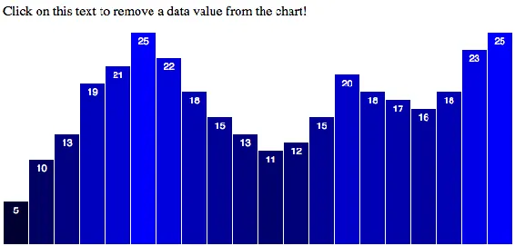
<h6 class="calibre37"><span class="keep-together">Figure 9-27.
</span>Initial bar chart</h6>
</div>
</figure>

Try clicking the text, though, and the leftmost bar slides cleanly off
to the left, all other bars’ widths rescale to fit, and then the exited
bar is deleted from the DOM. (Again, you can confirm this by watching
the `rect`s disappear one by one in the web inspector.)

<a href="#ch09.xhtml_After-one-click"
class="calibre5 pcalibre pcalibre2 pcalibre3 pcalibre1"
data-type="xref">Figure 9-28</a> shows the view after one bar is
removed.

<figure class="calibre35">
<div id="ch09.xhtml_After-one-click" class="figure">
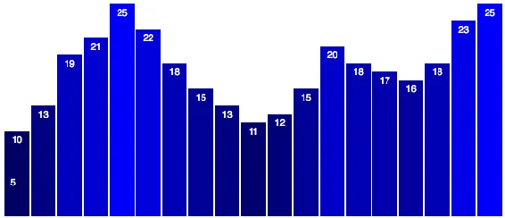
<h6 class="calibre37"><span class="keep-together">Figure 9-28.
</span>After one click</h6>
</div>
</figure>

After two clicks, you’ll see the chart in
<a href="#ch09.xhtml_After-two-clicks"
class="calibre5 pcalibre pcalibre2 pcalibre3 pcalibre1"
data-type="xref">Figure 9-29</a>.

<figure class="calibre35">
<div id="ch09.xhtml_After-two-clicks" class="figure">
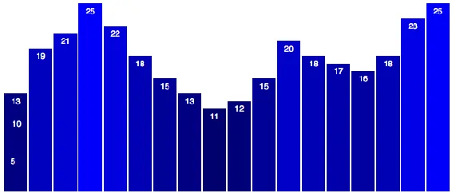
<h6 class="calibre37"><span class="keep-together">Figure 9-29.
</span>After two clicks</h6>
</div>
</figure>

<a href="#ch09.xhtml_After-three-clicks"
class="calibre5 pcalibre pcalibre2 pcalibre3 pcalibre1"
data-type="xref">Figure 9-30</a> displays the results after three
clicks, and after several clicks, you’ll see the result shown in
<a href="#ch09.xhtml_After-many-clicks"
class="calibre5 pcalibre pcalibre2 pcalibre3 pcalibre1"
data-type="xref">Figure 9-31</a>.

<figure class="calibre35">
<div id="ch09.xhtml_After-three-clicks" class="figure">
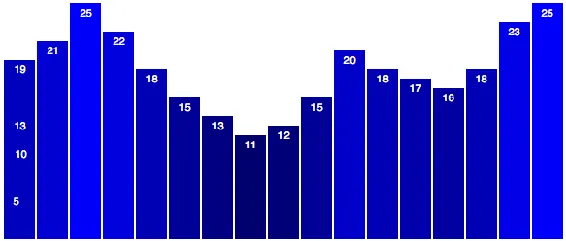
<h6 class="calibre37"><span class="keep-together">Figure 9-30.
</span>After three clicks</h6>
</div>
</figure>

<figure class="calibre35">
<div id="ch09.xhtml_After-many-clicks" class="figure">
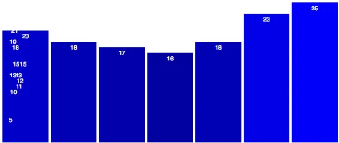
<h6 class="calibre37"><span class="keep-together">Figure 9-31.
</span>After many clicks</h6>
</div>
</figure>

This is working better than ever. The only hitch is that the labels
aren’t exiting to the left, and also are not removed from the DOM, so
they clutter up the left side of the chart. Again, I leave this to you;
put your new D3 chops to the test and clean up those
labels.<span id="ch09.xhtml_idm140093190966448"
class="calibre5 pcalibre pcalibre2 pcalibre3 pcalibre1"
data-type="indexterm" primary=""
startref="Ujoin09"></span><span id="ch09.xhtml_idm140093190965472"
class="calibre5 pcalibre pcalibre2 pcalibre3 pcalibre1"
data-type="indexterm" primary="" startref="Dbind09"></span>

</div>

</div>

</div>

</div>

<div class="section calibre2" data-type="sect2"
pdf-bookmark="Add and Remove: Combo Platter">

<div id="ch09.xhtml_idm140093191760704" class="dedication">

## Add and Remove: Combo Platter

We <span id="ch09.xhtml_idm140093190960128"
class="calibre5 pcalibre pcalibre2 pcalibre3 pcalibre1"
data-type="indexterm" primary="updates"
secondary="adding and removing data"></span>could stop there and be very
satisfied with our newfound skills. But why not go all the way, and
adjust our chart so data values can be added *and* removed?

This is easier than you might think. First, we’ll need two different
triggers for the user interaction. I’ll split the one paragraph into
two, and give each a unique ID, so we can tell which one is clicked:

``` calibre39
<p id="add">Add a new data value</p>
<p id="remove">Remove a data value</p>
```

Later, down where we set up the click function, `select()` must become
<span class="keep-together">`selectAll()`</span>, now that we’re
selecting more than one `p` element:

``` calibre39
d3.selectAll("p")
    .on("click", function() { …
```

Now that this click function will be bound to both paragraphs, we have
to introduce some logic to tell the function to behave differently
depending on which paragraph was clicked. There are many ways to achieve
this; I’ll go with the most straightforward one.

Fortunately, within the context of our anonymous click function, `this`
refers to the element that was clicked—the paragraph. So we can get the
ID value of the clicked element by selecting `this` and inquiring using
`attr()`:

``` calibre39
d3.select(this).attr("id")
```

That statement will return `"add"` when `p#add` is clicked, and
`"remove"` when <span class="keep-together">`p#remove`</span> is
clicked. Let’s store that value in a variable, and use it to control an
`if` statement:

``` calibre39
//See which p was clicked
var paragraphID = d3.select(this).attr("id");

//Decide what to do next
if (paragraphID == "add") {
    //Add a data value
    var minValue = 2;
    var maxValue = 25 - minValue;
    var newNumber = Math.floor(Math.random() * maxValue) + minValue;
    var lastKeyValue = dataset[dataset.length - 1].key;
    dataset.push({
        key: lastKeyValue + 1,
        value: newNumber
    });
} else {
    //Remove a value
    dataset.shift();
}
```

So, if `p#add` is clicked, we calculate a new random value, and then
look up the key value of the last item in `dataset`. Then we create a
new object with an incremented key (to ensure we don’t duplicate keys;
insert locksmith joke here) and the random data value.

No additional changes are needed! The enter/update/exit code we wrote is
already flexible enough to handle adding *or* removing data
values—that’s the beauty of it.

Try it out in *28_adding_and_removing.html*. You’ll see that you can
click to add or remove data points at will. Of course, real-world data
isn’t created this way, but you can imagine these data updates being
triggered by some other event—such as data refreshes being pulled from a
server—and not mouse clicks.

Also see *29_dynamic_labels.html*, which is the same thing, only I’ve
updated the code to add, transition, and remove the labels as well.

</div>

</div>

<div class="section calibre2" data-type="sect2" pdf-bookmark="Recap">

<div id="ch09.xhtml_idm140093190961072" class="dedication">

## Recap

That <span id="ch09.xhtml_idm140093190692096"
class="calibre5 pcalibre pcalibre2 pcalibre3 pcalibre1"
data-type="indexterm" primary="updates"
secondary="overview of"></span>was a lot of information! Let’s review:

- `data()` binds data to elements, but also returns the *update
  selection*.

- The update selection can contain *enter* and *exit* selections, which
  can be accessed via `enter()` and `exit()`.

- `merge()` is typically used to, well, merge the enter and update
  selections, to make it easy to apply any changes to both of those
  selections at the same time.

- When there are *more values than elements*, an enter selection will
  reference the placeholder, not-yet-existing elements.

- When there are *more elements than values*, an exit selection will
  reference the elements without data.

- Data joins determine how values are matched with elements.

- By default, data joins are performed by index, meaning in order of
  appearance.

- For more control over data joins, you can specify a key function.

As a final note, in the bar chart example, we used this sequence:

1.  Enter

2.  Update

3.  Exit

Although this worked well for us, this order isn’t set in stone.
Depending on your design goals, you might want to update first, then
enter new elements, and finally exit old ones. It all depends—just
remember that once you have the update selection in hand, you can reach
in to grab the enter and exit selections anytime. The order in which you
do so is flexible and completely up to you.

Fantastic. You are well on your way to becoming a D3 wizard. Now let’s
get to the really fun stuff:
interactivity\!<span id="ch09.xhtml_idm140093190674704"
class="calibre5 pcalibre pcalibre2 pcalibre3 pcalibre1"
data-type="indexterm" primary="" startref="update09"></span>

</div>

</div>

</div>

</div>

</div>

</div>

<span id="ch10.xhtml"></span>

<div id="ch10.xhtml_sbo-rt-content" class="calibre1">

<div id="ch10.xhtml_interactivity" class="dedication">

