# <span class="keep-together">Chapter 10. </span>Interactivity

Now that you’re a pro at data updates, transitions, and motion, let’s
incorporate true interactivity.

<div class="section calibre2" data-type="sect1"
pdf-bookmark="Binding Event Listeners">

<div id="ch10.xhtml_idm140093190671536" class="dedication">

# Binding Event Listeners

Say *what?* <span id="ch10.xhtml_idm140093190669360"
class="calibre5 pcalibre pcalibre2 pcalibre3 pcalibre1"
data-type="indexterm" primary="interactivity"
secondary="event listeners and"></span><span id="ch10.xhtml_idm140093190668352"
class="calibre5 pcalibre pcalibre2 pcalibre3 pcalibre1"
data-type="indexterm" primary="event listeners"></span>I know, I know.
First, we bound *data*, which was weird enough. And now I’m talking
about binding *event listeners?*

As <span id="ch10.xhtml_idm140093190666464"
class="calibre5 pcalibre pcalibre2 pcalibre3 pcalibre1"
data-type="indexterm"
primary="event model"></span><span id="ch10.xhtml_idm140093190665728"
class="calibre5 pcalibre pcalibre2 pcalibre3 pcalibre1"
data-type="indexterm" primary="JavaScript"
secondary="event model"></span>explained in
<a href="#ch09.xhtml_updates-chapter9"
class="calibre5 pcalibre pcalibre2 pcalibre3 pcalibre1"
data-type="xref">Chapter 9</a>, JavaScript uses an *event model* in
which “events” are triggered by things happening, such as new input from
the user, provided via a keyboard, mouse, or touch screen. Most of the
time, events are being triggered constantly, left and right—it’s just
that nobody is *listening* for them, so they are ignored.

To make our pieces interactive, we define chunks of code that *listen*
for specific events being triggered on specific DOM elements. In
<a href="#ch09.xhtml_updates-chapter9"
class="calibre5 pcalibre pcalibre2 pcalibre3 pcalibre1"
data-type="xref">Chapter 9</a>, we used the following code:

``` calibre39
d3.select("p")
    .on("click", function() {
        //Do something on click
    });
```

This *binds* an *event listener* to the `p` paragraph element. The
listener happens to be listening for the `click` event, which is the
JavaScript event triggered when the user clicks the mouse *on that `p`
element*. (D3 doesn’t use custom event names, although you can define
your own. For the sake of supporting existing standards, D3 recognizes
all the standard JavaScript events, such as `mouseover` and `click`. The
events supported vary somewhat by browser. Peter-Paul Koch’s
<a href="http://www.quirksmode.org/dom/events/"
class="calibre5 pcalibre pcalibre2 pcalibre3 pcalibre1">event
compatibility tables</a> are a useful reference.)

This <span id="ch10.xhtml_idm140093190487504"
class="calibre5 pcalibre pcalibre2 pcalibre3 pcalibre1"
data-type="indexterm" primary="click events"></span>gets at one of the
nuances of JavaScript’s event model, which is that events don’t happen
in a vacuum. Rather, they are always *called on* a specific element. So
the code just shown isn’t activated whenever *any* click occurs; it is
run just when a click occurs *on the `p` element*.

You <span id="ch10.xhtml_idm140093190484384"
class="calibre5 pcalibre pcalibre2 pcalibre3 pcalibre1"
data-type="indexterm" primary="on()"></span>could achieve all this with
raw JavaScript, but D3’s `on()` method is a handy way to quickly bind
event listeners to D3 selections. As you can see, `on()` takes two
arguments: the event name, and the function to be executed when the
event is triggered on the selected element.

Making your visualization interactive is a simple, two-step process that
includes:

1.  Binding event listeners

2.  Defining the behavior

</div>

</div>

<div class="section calibre2" data-type="sect1"
pdf-bookmark="Introducing Behaviors">

<div id="ch10.xhtml_idm140093190670912" class="dedication">

# Introducing Behaviors

The <span id="ch10.xhtml_Ibehav10"
class="calibre5 pcalibre pcalibre2 pcalibre3 pcalibre1"
data-type="indexterm" primary="interactivity"
secondary="behaviors"></span><span id="ch10.xhtml_idm140093190633440"
class="calibre5 pcalibre pcalibre2 pcalibre3 pcalibre1"
data-type="indexterm" primary="behaviors"
secondary="binding to multiple elements with"></span>examples in
<a href="#ch09.xhtml_updates-chapter9"
class="calibre5 pcalibre pcalibre2 pcalibre3 pcalibre1"
data-type="xref">Chapter 9</a> bind events on only one element: `p`.
This is an unusual usage for `on()`. More commonly, you will want to
bind event listeners to more than one element at a time, such as to
*all* of the visual elements in your visualization. Fortunately, that is
very easy to do. Instead of using `select()` to select only one element,
use <span class="keep-together">`selectAll()`</span> to select multiple
elements and pass that selection to `on()`.

Let’s revisit an earlier, static version of our bar chart. See sample
code *01_start.html*.

You can bind <span id="ch10.xhtml_idm140093190627280"
class="calibre5 pcalibre pcalibre2 pcalibre3 pcalibre1"
data-type="indexterm" primary="event listeners"></span>event listeners
right at the moment when you first create elements. For example, here is
our existing code that creates our bar chart’s `rect`s, to which I’ve
simply tacked on `on()`:

``` calibre39
//Create bars
svg.selectAll("rect")
   .data(dataset)
   .enter()
   .append("rect")
   …   //Set attributes (omitted here)
   .on("click", function(d) {
       //This will run whenever *any* bar is clicked
   });
```

When defining the anonymous function, you can reference `d`, or `d` and
`i`, or neither, just as you’ve seen throughout D3. And then whatever
code you put between the function’s brackets will execute on click.

<div class="dedication">

</div>

This is a quick and easy way to verify your data values, for example:

``` calibre39
.on("click", function(d) {
    console.log(d);
});
```

Try that code by running *02_click.html*, open the JavaScript console,
and click on some bars. When you click on each bar, you should see that
bar’s data value printed to the console. Nice!

<div class="section calibre2" data-type="sect2"
pdf-bookmark="Hover to Highlight">

<div id="ch10.xhtml_idm140093205462288" class="dedication">

## Hover to Highlight

Highlighting <span id="ch10.xhtml_idm140093190579440"
class="calibre5 pcalibre pcalibre2 pcalibre3 pcalibre1"
data-type="indexterm"
primary="mouseover events"></span><span id="ch10.xhtml_idm140093190578736"
class="calibre5 pcalibre pcalibre2 pcalibre3 pcalibre1"
data-type="indexterm" primary="behaviors"
secondary="hover to highlight"></span><span id="ch10.xhtml_idm140093190577792"
class="calibre5 pcalibre pcalibre2 pcalibre3 pcalibre1"
data-type="indexterm"
primary="hover to highlight"></span><span id="ch10.xhtml_idm140093190577120"
class="calibre5 pcalibre pcalibre2 pcalibre3 pcalibre1"
data-type="indexterm" primary="interactivity" secondary="behaviors"
tertiary="hover to highlight"></span>elements in response to mouse
interaction is a common way to make your visualization feel more
responsive, and it can help users navigate and focus on the data of
interest.

A <span id="ch10.xhtml_idm140093190574944"
class="calibre5 pcalibre pcalibre2 pcalibre3 pcalibre1"
data-type="indexterm" primary="CSS (Cascading Style Sheets)"
secondary="hover effect"></span>simple hover effect can be achieved with
CSS alone—no JavaScript required! The CSS pseudoclass selector `:hover`
can be used in combination with any other selector to select an element
when the mouse is hovering *over* the element. Here, we select SVG
`rect`s being hovered over and set their fill to `orange` (see
<a href="#ch10.xhtml_simple_css_only_mouse_hover"
class="calibre5 pcalibre pcalibre2 pcalibre3 pcalibre1"
data-type="xref">Figure 10-1</a>):

``` calibre39
rect:hover {
    fill: orange;
}
```

<figure class="calibre35">
<div id="ch10.xhtml_simple_css_only_mouse_hover" class="figure">
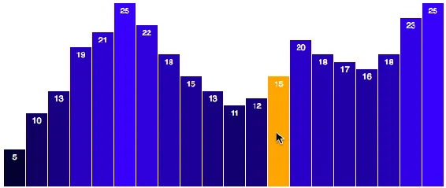
<h6 class="calibre37"><span class="keep-together">Figure 10-1. </span>A
simple CSS-only mouse hover effect</h6>
</div>
</figure>

See *03_hover.html*, and try it out yourself.

CSS <span id="ch10.xhtml_idm140093190434768"
class="calibre5 pcalibre pcalibre2 pcalibre3 pcalibre1"
data-type="indexterm" primary="transitions"
secondary="in mouseover events"></span>hover styling is fast and easy,
but limited. There’s only so much you can achieve with `:hover`.
Fortunately, recent browsers support applying the new CSS3 transitions
on SVG elements. Try adding this above the `rect:hover` rule in that
example:

``` calibre39
rect {
    -moz-transition: all 0.25s;
    -o-transition: all 0.25s;
    -webkit-transition: all 0.25s;
    transition: all 0.25s;
}
```

This tells browsers (including Mozilla, Opera, and WebKit-based
browsers) to apply a 0.25-second transition to any changes to the `rect`
elements. Run that, and you’ll see that the blue/orange switch no longer
happens instantly, but smoothly, over a brief
<span class="keep-together">0.25-second</span> period. Nice!

Yet we can also manage these transitions using JavaScript and D3, for
additional control and coordination with other parts of our
visualization. Luckily for us, D3 handles all the hassle of transitions
for us, so working with JavaScript is not so bad. Let’s re-create the
orange hover effect without CSS.

Instead <span id="ch10.xhtml_idm140093190340640"
class="calibre5 pcalibre pcalibre2 pcalibre3 pcalibre1"
data-type="indexterm" primary="mouseover events"></span>of referencing
the `click` event, as we did earlier, we can call `on()` with
`mouseover`, the JavaScript event equivalent of CSS’s `hover`:

``` calibre39
.on("mouseover", function() {
    //Do something on mouseover of any bar
});
```

Now we want to set the `fill` of *this* bar (the one on which the
`mouseover` event is triggered) to orange. Yet we are operating in the
context of an anonymous function—how could we possibly select the same
element on which the event was just triggered?

The answer is *this*. No, sorry, I mean `this`. Just select `this`, and
set its fill to orange:

``` calibre39
.on("mouseover", function() {
    d3.select(this)
      .attr("fill", "orange");
});
```

Another <span id="ch10.xhtml_idm140093190299280"
class="calibre5 pcalibre pcalibre2 pcalibre3 pcalibre1"
data-type="indexterm" primary="JavaScript"
secondary="this keyword"></span><span id="ch10.xhtml_idm140093190298544"
class="calibre5 pcalibre pcalibre2 pcalibre3 pcalibre1"
data-type="indexterm" primary="this keyword"></span>reason some people
dislike JavaScript is because of the confusingly ever-changing meaning
of the keyword `this`. In other languages, the meaning of `this` is very
clearly defined; not so in JavaScript. (jQuery fans are used to this
debate.)

For our purposes, here is all you need to know:

- Context is important.

- Within anonymous functions, D3 automatically sets the context of
  `this` so it references “the current element upon which we are
  acting.”

<div class="dedication">

</div>

The end result is that, when we hand off anonymous functions to any of
D3’s methods, we can reference `this` when trying to act on the current
element.

Indeed, you can see this (ha!) in action in *04_mouseover.html*
(<a href="#ch10.xhtml_using_d3"
class="calibre5 pcalibre pcalibre2 pcalibre3 pcalibre1"
data-type="xref">Figure 10-2</a>).

<figure class="calibre35">
<div id="ch10.xhtml_using_d3" class="figure">
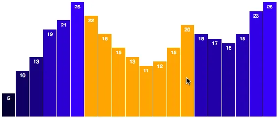
<h6 class="calibre37"><span class="keep-together">Figure 10-2.
</span>Using D3 to set an orange fill on mouseover</h6>
</div>
</figure>

Move the mouse over a `rect`, the event listener for that `rect` is
triggered, that same `rect` is selected (as `this`), and then its fill
is set to orange.

<a href="#ch10.xhtml_using_d3"
class="calibre5 pcalibre pcalibre2 pcalibre3 pcalibre1"
data-type="xref">Figure 10-2</a> looks good, but we should probably
restore each bar’s original color once the hover is over, meaning on
`mouseout`:

``` calibre39
.on("mouseout", function(d) {
    d3.select(this)
      .attr("fill", "rgb(0, 0, " + (d * 10) + ")");
});
```

Perfect! Try it yourself in *05_mouseout.html*. See
<a href="#ch10.xhtml_results_d3"
class="calibre5 pcalibre pcalibre2 pcalibre3 pcalibre1"
data-type="xref">Figure 10-3</a>.

<figure class="calibre35">
<div id="ch10.xhtml_results_d3" class="figure">
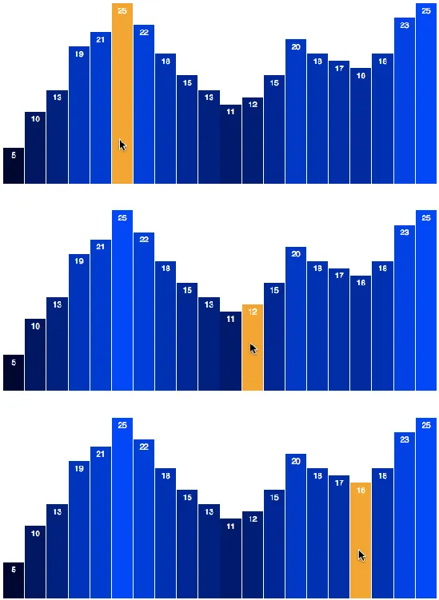
<h6 class="calibre37"><span class="keep-together">Figure 10-3.
</span>Moving the mouse left to right, with fills set on mouseover and
mouseout</h6>
</div>
</figure>

I am really excited to have accomplished in eight lines of JavaScript
what I did originally with CSS in only three! (Not!)

Actually, what I *am* excited about is to now make the outbound
transition silky smooth (see <a href="#ch10.xhtml_smooth"
class="calibre5 pcalibre pcalibre2 pcalibre3 pcalibre1"
data-type="xref">Figure 10-4</a>). As you remember from
<a href="#ch09.xhtml_updates-chapter9"
class="calibre5 pcalibre pcalibre2 pcalibre3 pcalibre1"
data-type="xref">Chapter 9</a>, accomplishing that involves adding only
two lines of code, for `transition()` and `duration()`:

``` calibre39
.on("mouseout", function(d) {
    d3.select(this)
      .transition()
      .duration(250)
      .attr("fill", "rgb(0, 0, " + (d * 10) + ")");
});
```

Try that out in *06_smoother.html*.

<figure class="calibre35">
<div id="ch10.xhtml_smooth" class="figure">
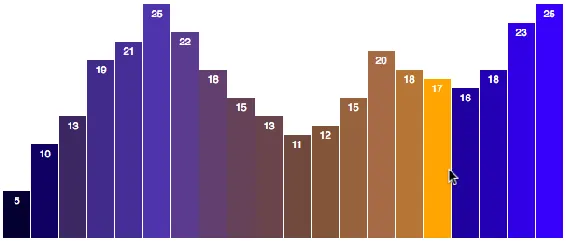
<h6 class="calibre37"><span class="keep-together">Figure 10-4.
</span>Moving the mouse left to right (Smooth Operator Edition)</h6>
</div>
</figure>

<aside data-type="sidebar" epub:type="sidebar" class="calibre31">

<div id="ch10.xhtml_idm140093190119168" class="sidebar">

##### Pointer Events on Overlapping Elements

Mouse <span id="ch10.xhtml_idm140093190117248"
class="calibre5 pcalibre pcalibre2 pcalibre3 pcalibre1"
data-type="indexterm"
primary="overlapping elements"></span><span id="ch10.xhtml_idm140093190116512"
class="calibre5 pcalibre pcalibre2 pcalibre3 pcalibre1"
data-type="indexterm"
primary="elements (SVG)"></span><span id="ch10.xhtml_idm140093190115840"
class="calibre5 pcalibre pcalibre2 pcalibre3 pcalibre1"
data-type="indexterm" primary="SVG (Scalable Vector Graphics)"
secondary="drawing overlapping shapes"></span><span id="ch10.xhtml_idm140093190114960"
class="calibre5 pcalibre pcalibre2 pcalibre3 pcalibre1"
data-type="indexterm" primary="pointer events"
seealso="mouseover events; tooltips"></span><span id="ch10.xhtml_idm140093190114048"
class="calibre5 pcalibre pcalibre2 pcalibre3 pcalibre1"
data-type="indexterm" primary="behaviors"
secondary="overlapping elements and"></span><span id="ch10.xhtml_idm140093190113088"
class="calibre5 pcalibre pcalibre2 pcalibre3 pcalibre1"
data-type="indexterm" primary="interactivity"
secondary="pointer events"></span><span id="ch10.xhtml_idm140093190112144"
class="calibre5 pcalibre pcalibre2 pcalibre3 pcalibre1"
data-type="indexterm" primary="drawing"
secondary="SVG overlapping shapes"></span>events are triggered only on
elements with pixels that can be “touched” by the mouse. If two elements
overlap, and the mouse moves over the element that is “on top” (in other
words, closer to the front), then the `mouseover` event will be
triggered on the frontmost element, and *not* on the element behind it.

You can see this in *06_smoother.html*. Mouse over any bar, and then
move your pointer directly above one of the value labels. You’ll see the
bar fade back from orange to blue. The `text` elements are in front of
the bars, so mousing over a label involves also *mousing out* of the
`rect` behind it. This is counterintuitive because, visually, we haven’t
left the `rect` at all, but as far as JavaScript is concerned, we have.

Remember that in SVG, elements placed later in the DOM are rendered
visually “in front” of earlier elements. (See the section “Layering and
Drawing Order” in <a href="#ch03.xhtml_technology_fundamentals"
class="calibre5 pcalibre pcalibre2 pcalibre3 pcalibre1"
data-type="xref">Chapter 3</a>.)

In many cases, you might want mouse events on some elements (such as our
value labels) to be ignored. Luckily, this is as easy as applying one
line of CSS to the elements you wish to have ignored:

``` calibre39
pointer-events: none;
```

This magically tells the browser, “Hey, this element shouldn’t trigger
any pointer events (such as `click`, `mouseover`, or `mouseout`), so
just behave as if this element isn’t here.” It lets events pass through
to the next element below it.

Use normal CSS selectors to target the appropriate elements. For
example, this would apply that to all SVG `text` elements:

``` calibre39
svg
    rect
    rect
    rect
    ...
    text
    text
    text
    ...
```

Or, <span id="ch10.xhtml_idm140093190087904"
class="calibre5 pcalibre pcalibre2 pcalibre3 pcalibre1"
data-type="indexterm" primary="" startref="Ibehav10"></span>instead of
including this in a stylesheet, you could specify the CSS with D3
directly when you create the `text` element, for example:

``` calibre39
svg.append("text")
   …  //other stuff here
   .style("pointer-events", "none");
```

</div>

</aside>

</div>

</div>

</div>

</div>

<div class="section calibre2" data-type="sect1"
pdf-bookmark="Grouping SVG Elements">

<div id="ch10.xhtml_idm140093190636208" class="dedication">

# Grouping SVG Elements

Note <span id="ch10.xhtml_idm140093190033616"
class="calibre5 pcalibre pcalibre2 pcalibre3 pcalibre1"
data-type="indexterm" primary="interactivity"
secondary="grouping SVG elements"></span><span id="ch10.xhtml_idm140093190032608"
class="calibre5 pcalibre pcalibre2 pcalibre3 pcalibre1"
data-type="indexterm" primary="SVG (Scalable Vector Graphics)"
secondary="grouping elements"></span><span id="ch10.xhtml_idm140093190031696"
class="calibre5 pcalibre pcalibre2 pcalibre3 pcalibre1"
data-type="indexterm" primary="behaviors"
secondary="grouping SVG elements"></span>that `g` group elements do not,
by themselves, trigger any mouse events. The reason for this is that `g`
elements have no pixels! Only their enclosed elements—like `rect`s,
`circle`s, and `text` elements—have pixels.

You can still bind event listeners to `g` elements. Just keep in mind
that the elements within that `g` will then behave as a group. If *any*
of the enclosed elements are clicked or moused over, then the listener
function will be activated.

This technique can be quite useful when you have several visual elements
that should all act in concert. In our bar chart, for example, we could
group `rect` and `text` elements each into their own groups. The element
hierarchy currently looks like this:

``` calibre39
svg
    rect
    rect
    rect
    ...
    text
    text
    text
    ...
```

After grouping elements, it could look like this:

``` calibre39
svg
    g
        rect
        text
    g
        rect
        text
    …
```

Instead of worrying about `pointer-events` and which element is on top,
we just bind the event listener to the whole group. So clicking on some
`text` will trigger the same code as clicking on a `rect` because
they’re both in the same group.

Even better, throw an invisible `rect` with a `fill` of `none` and
`pointer-events` value of `all` on the top of each group. Even though
the `rect` is invisible, it will still trigger mouse events, so you
could have the `rect` span the whole height of the chart. The net effect
is that mousing *anywhere* in that column—even in “empty” whitespace
above a short blue bar—would trigger the highlight effect.

<div class="section calibre2" data-type="sect2"
pdf-bookmark="Click to Sort">

<div id="ch10.xhtml_idm140093190024384" class="dedication">

## Click to Sort

Interactive <span id="ch10.xhtml_idm140093190022336"
class="calibre5 pcalibre pcalibre2 pcalibre3 pcalibre1"
data-type="indexterm" primary="behaviors"
secondary="click to sort"></span><span id="ch10.xhtml_idm140093190021328"
class="calibre5 pcalibre pcalibre2 pcalibre3 pcalibre1"
data-type="indexterm"
primary="click to sort"></span><span id="ch10.xhtml_idm140093190020656"
class="calibre5 pcalibre pcalibre2 pcalibre3 pcalibre1"
data-type="indexterm"
primary="sorting"></span><span id="ch10.xhtml_idm140093190019984"
class="calibre5 pcalibre pcalibre2 pcalibre3 pcalibre1"
data-type="indexterm" primary="interactivity"
secondary="click to sort"></span><span id="ch10.xhtml_idm140093190019040"
class="calibre5 pcalibre pcalibre2 pcalibre3 pcalibre1"
data-type="indexterm" primary="data"
secondary="sorting"></span>visualization is most powerful when it can
provide different *views* of the data, empowering the user to explore
the information from different angles.

The ability to *sort* data is extremely important. And yes, as you just
guessed, D3 makes it very easy to sort elements.

Continuing with the bar chart, let’s add an event listener for the
`click` event, to which we bind an anonymous function that, in turn,
will call a new function of our own creation, `sortBars()`.

``` calibre39
…
.on("click", function() {
    sortBars();
});
```

For simplicity, we are binding this to every bar, but of course you
could bind this instead to a button or any other element, inside or
outside of the SVG image.

At the end of the code, let’s define this new function and store it in
`sortBars`:

``` calibre39
var sortBars = function() {

    svg.selectAll("rect")
        .sort(function(a, b) {
            return d3.ascending(a, b);
        })
        .transition()
        .duration(1000)
        .attr("x", function(d, i) {
            return xScale(i);
        });

};
```

You can see this code in *07_sort.html* and the result in
<a href="#ch10.xhtml_click-to-sort"
class="calibre5 pcalibre pcalibre2 pcalibre3 pcalibre1"
data-type="xref">Figure 10-5</a>. Try clicking any of the bars, and
watch them reorganize.

<figure class="calibre35">
<div id="ch10.xhtml_click-to-sort" class="figure">
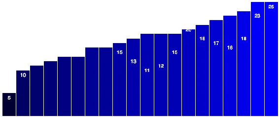
<h6 class="calibre37"><span class="keep-together">Figure 10-5.
</span>The view after click-to-sort</h6>
</div>
</figure>

When `sortBars()` is <span id="ch10.xhtml_idm140093189913456"
class="calibre5 pcalibre pcalibre2 pcalibre3 pcalibre1"
data-type="indexterm"
primary="comparator functions"></span><span id="ch10.xhtml_idm140093189912720"
class="calibre5 pcalibre pcalibre2 pcalibre3 pcalibre1"
data-type="indexterm" primary="functions"
secondary="comparator functions"></span>called, first we reselect all
the `rect`s. <span id="ch10.xhtml_idm140093189911264"
class="calibre5 pcalibre pcalibre2 pcalibre3 pcalibre1"
data-type="indexterm" primary="sort()"></span>Then we use D3’s handy
`sort()` method, which reorders elements within the selection based on
their bound data values. `sort()` needs to know how to decide which
elements come first, and which later, so we pass into it a *comparator*
function.

Unlike our anonymous functions so far, the comparator doesn’t take `d`
(the current datum) or `i` (the current index). Instead, it is passed
*two values*, `a` and `b`, which represent the data values of two
different elements. (You could name them anything else; `a` and `b` are
just the convention.) The comparator will be called on every pair of
elements in our array, comparing `a` to `b`, until, in the end, all the
array elements are sorted per whatever rules we specify.

We specify *how* `a` and `b` should be compared within the comparator.
Thankfully, D3 also provides a handful of comparison functions that
spare us from writing more JavaScript. Here, we use `d3.ascending()`,
into which both `a` and `b` are passed. Whichever one is bigger comes
out the winner. And `sort()` loops through all the data values in this
way until it has all the elements, er, sorted out. (Note that
<span class="keep-together">`d3.ascending`</span> works well in this
case, because our values are numbers. Comparing strings of text is a
whole other can of worms.)

Finally, our new order in place, we initiate a transition, set a
duration of one second, and then calculate the new x-position for each
`rect`. (This `attr` code is just copied from when we created the
`rect`s initially.)

This works swimmingly, except for two catches.

First, you’ll notice that we haven’t accounted for the value labels yet,
so they didn’t slide into place along with the bars. (I leave that to
you as an exercise.)

Second, you might observe that if you mouse over some bars *while* the
<span class="keep-together">transition</span> is occurring, those bars
don’t fall properly into place (see <a href="#ch10.xhtml_interrupted"
class="calibre5 pcalibre pcalibre2 pcalibre3 pcalibre1"
data-type="xref">Figure 10-6</a>).

<figure class="calibre35">
<div id="ch10.xhtml_interrupted" class="figure">
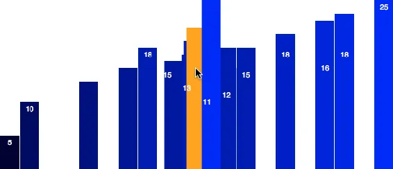
<h6 class="calibre37"><span class="keep-together">Figure 10-6.
</span>Transitions, interrupted</h6>
</div>
</figure>

Yeeesh, that doesn’t look good.

Remember from <a href="#ch09.xhtml_updates-chapter9"
class="calibre5 pcalibre pcalibre2 pcalibre3 pcalibre1"
data-type="xref">Chapter 9</a> that newer transitions interrupt and
override older <span class="keep-together">transitions</span>. Clicking
the bars initiates one transition. Immediately mousing over a bar
interrupts that initial transition in order to run the `mouseover`
highlight transition we specified earlier. The end result is that those
moused-over bars never make it to their final destinations.

But don’t worry. This example is just a good argument for keeping hover
effects in CSS, while letting D3 and JavaScript manage the more visually
intensive actions.

In *08_sort_hover.html*, I’ve restored the CSS-only highlight and
removed the `mouseover` and `mouseout` event listeners, so this
transition conflict no longer occurs. (We no longer have those smooth
orange-to-blue fades, but you could implement CSS transitions for this,
as discussed earlier.)

<div class="calibre27" data-type="tip">

# Named Transitions

Another <span id="ch10.xhtml_idm140093189799200"
class="calibre5 pcalibre pcalibre2 pcalibre3 pcalibre1"
data-type="indexterm" primary="transitions"
secondary="interrupted"></span>way to prevent transition interruptions
is to *name* your transitions. Named transitions can operate
concurrently and don’t conflict with each other, assuming they’re not
trying to modify the same attributes.

For example, in the `sortBars()` function defined earlier, we could name
the transition specified by passing in a string:

``` calibre63
.transition("sortBars")
```

This will distinguish it from the transition specified in
`on("mouseout", …)` for the `rect`s, which we could also name as:

``` calibre63
.transition("restoreBarColor")
```

Both of these transitions are applied to the same `rect`s, but at
different times. Now that they have names, they won’t conflict with each
other, with the result that the `sortBars` transition can be busily
adjusting the rectangles’ x values while `restoreBarColor` fades orange
bars back to blue—all at the same time.

Try it out! Start with *07_sort.html* and make the changes described
earlier.

Once a transition has a name, you can interrupt it manually by
referencing its name, as in “Hey, `sortBars`, knock it off!” In D3
syntax, you’d select the affected elements first, then call
`interrupt()`, as in: `d3.selectAll("rect").interrupt("sortBars");`

</div>

So far, this sort only goes one direction. Let’s revise this so a second
click triggers a re-sort, placing the bars in descending order.

To remember the current state of the chart, we’ll need a Boolean
variable:

``` calibre39
var sortOrder = false;
```

Then, in the `sortBars()` function, we should flip the value of
`sortOrder`, so if it starts out `true`, it is changed to `false`, and
vice versa:

``` calibre39
var sortBars = function() {

    //Flip value of sortOrder
    sortOrder = !sortOrder;

    …
```

Down <span id="ch10.xhtml_idm140093189619328"
class="calibre5 pcalibre pcalibre2 pcalibre3 pcalibre1"
data-type="indexterm"
primary="ascending order sort"></span><span id="ch10.xhtml_idm140093189618720"
class="calibre5 pcalibre pcalibre2 pcalibre3 pcalibre1"
data-type="indexterm" primary="descending order sort"></span>in the
comparator function, we can add a bit of logic to say *if* `sortOrder`
is `true`, then go ahead and sort the bars in *ascending* order.
Otherwise, use *descending* order:

``` calibre39
	svg.selectAll("rect")
	   .sort(function(a, b) {
	   	if (sortOrder) {
         return d3.ascending(a, b);
	   	} else {
         return d3.descending(a, b);
	   	}
	   	})
	   	…
```

Give that a shot in *09_resort.html*. Now each time you click, the sort
order reverses, as shown in <a href="#ch10.xhtml_second-sort"
class="calibre5 pcalibre pcalibre2 pcalibre3 pcalibre1"
data-type="xref">Figure 10-7</a>.

<figure class="calibre35">
<div id="ch10.xhtml_second-sort" class="figure">
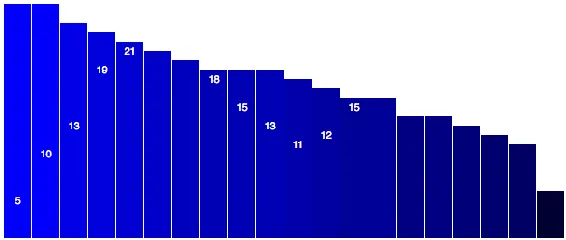
<h6 class="calibre37"><span class="keep-together">Figure 10-7.
</span>The second sort, now in descending order</h6>
</div>
</figure>

One more thing would make this really nice: a per-element delay.
(Remember that whole “object constancy” thing?)

As you know, to do that, we just add a simple `delay()` statement after
`transition()`:

``` calibre39
…
.transition()
.delay(function(d, i) {
    return i * 50;
})
.duration(1000)
…
```

Now take a look at *10_delay.html*, in which you can easily follow
individual bars with your eyes as they move left and right during each
sort.

</div>

</div>

</div>

</div>

<div class="section calibre2" data-type="sect1" pdf-bookmark="Tooltips">

<div id="ch10.xhtml_idm140093190034304" class="dedication">

# Tooltips

In <span id="ch10.xhtml_tool10"
class="calibre5 pcalibre pcalibre2 pcalibre3 pcalibre1"
data-type="indexterm"
primary="tooltips"></span><span id="ch10.xhtml_Itool10"
class="calibre5 pcalibre pcalibre2 pcalibre3 pcalibre1"
data-type="indexterm" primary="interactivity"
secondary="tooltips"></span>interactive visualizations, tooltips are
small overlays that present data values. In many cases, it’s not
necessary to label every individual data value in the default view, but
that level of detail should still be accessible to users. That’s where
tooltips come in.

In this section, I present three different methods to constructing
tooltips with D3, ranging from the simplest to the most complex.

<div class="section calibre2" data-type="sect2"
pdf-bookmark="Default Browser Tooltips">

<div id="ch10.xhtml_idm140093189637280" class="dedication">

## Default Browser Tooltips

These <span id="ch10.xhtml_idm140093189635584"
class="calibre5 pcalibre pcalibre2 pcalibre3 pcalibre1"
data-type="indexterm" primary="tooltips"
secondary="default"></span>should be your first stop. A quick-and-dirty,
functional but not pretty option, default browser tooltips are usually
those ugly yellow boxes you see floating over content when you hold your
mouse still for too long. These are very easy to make, and the browser
manages the placements for you, but you have zero control over how they
look—that’s also set by the browser.

<a href="#ch10.xhtml_chrome-tooltip"
class="calibre5 pcalibre pcalibre2 pcalibre3 pcalibre1"
data-type="xref">Figure 10-8</a> shows our bar chart, with value labels
removed, and default browser tooltips implemented. The tooltips show up
after you hover the mouse over any bar for a few seconds. This
relatively long delay is determined by the browser, not D3 or
JavaScript, so you have no control over it.

<figure class="calibre35">
<div id="ch10.xhtml_chrome-tooltip" class="figure">
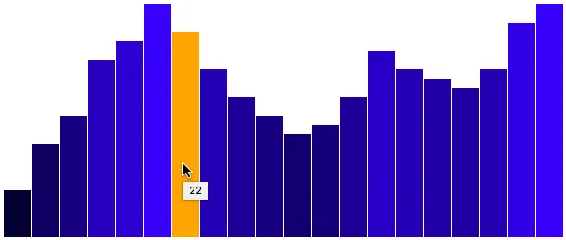
<h6 class="calibre37"><span class="keep-together">Figure 10-8. </span>A
ridiculously simple default browser tooltip, as seen in Chrome</h6>
</div>
</figure>

See *11_browser_tooltip.html* for the code and a demo. To make these
tooltips, simply inject a `title` element into whatever element should
have the tooltip applied. For example, after we create all those
`rect`s:

``` calibre39
svg.selectAll("rect")
   .data(dataset)
   .enter()
   .append("rect")
   …
```

we can just tack on to the end of that chain:

``` calibre39
   .append("title")
   .text(function(d) {
       return d;
   });
```

`append()` creates the new `title` element, and then `text()` sets its
content to `d`, the bound value.

We could make this text a little less spare by prefixing it with
something (see <a href="#ch10.xhtml_default-tooltip"
class="calibre5 pcalibre pcalibre2 pcalibre3 pcalibre1"
data-type="xref">Figure 10-9</a>):

``` calibre39
   .append("title")
   .text(function(d) {
       return "This value is " + d;
   });
```

<figure class="calibre35">
<div id="ch10.xhtml_default-tooltip" class="figure">
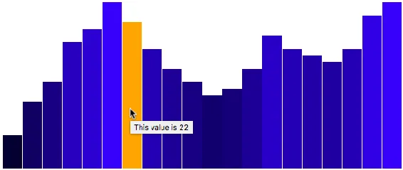
<h6 class="calibre37"><span class="keep-together">Figure 10-9. </span>A
default browser tooltip, with a prefix added</h6>
</div>
</figure>

See *12_browser_tooltip_text.html* for that code.

</div>

</div>

<div class="section calibre2" data-type="sect2"
pdf-bookmark="SVG Element Tooltips">

<div id="ch10.xhtml_idm140093189636656" class="dedication">

## SVG Element Tooltips

For <span id="ch10.xhtml_idm140093189360432"
class="calibre5 pcalibre pcalibre2 pcalibre3 pcalibre1"
data-type="indexterm" primary="tooltips"
secondary="SVG elements"></span><span id="ch10.xhtml_idm140093189359424"
class="calibre5 pcalibre pcalibre2 pcalibre3 pcalibre1"
data-type="indexterm" primary="SVG (Scalable Vector Graphics)"
secondary="creating tooltips"></span>more visual control over your
tooltips, code them as SVG elements.

As usual, there are many different approaches you could take. I’ll
suggest adding event listeners, so on each `mouseover`, a new value
label is created, and on `mouseout` it is destroyed. (Another idea would
be to pregenerate all the labels, but then just show or hide them based
on mouse hover status. Or just stick with one label, but show or hide it
and change its position as needed.)

Back to the bars we go. We’ll add back in a `mouseover` event listener,
in which we first get the x and y values for the current element
(`this`, remember?). We’ll need this information to know where to place
the new tooltip, so it appears nicely “on top of” the bar that’s
triggering the rollover.

When we retrieve those values, we wrap them in `parseFloat()`, which is
a JavaScript function for “Hey, even if this information is a string of
text, please convert it to a floating-point number for me.”

Lastly, I’m adding a bit to both the x and y values, to center the new
tooltips near the top of any given bar:

``` calibre39
.on("mouseover", function(d) {

//Get this bar's x/y values, then augment for the tooltip
var xPosition = parseFloat(d3.select(this).attr("x")) + xScale.bandwidth() / 2;
var yPosition = parseFloat(d3.select(this).attr("y")) + 14;
```

That’s the hard part. Now all we do is create the tooltip as a simple
`text` element, in this case, but of course you could add a background
`rect` or do anything else here for visual effect:

``` calibre39
//Create the tooltip label
svg.append("text")
  .attr("id", "tooltip")
  .attr("x", xPosition)
  .attr("y", yPosition)
  .attr("text-anchor", "middle")
  .attr("font-family", "sans-serif")
  .attr("font-size", "11px")
  .attr("font-weight", "bold")
  .attr("fill", "black")
  .text(d);

})
```

Yes, this is based on our earlier value label code, simply adapted
slightly. Note that the `x` and `y` attributes are set to the new
position values we just calculated, and the actual text content of the
label is set to `d`, the datum passed into the event listener function.

Also note that I assigned this next `text` element an ID of `tooltip`.
This is so we can easily select (and delete!) the element when we’re
done with it—on `mouseout`:

``` calibre39
.on("mouseout", function() {

    //Remove the tooltip
    d3.select("#tooltip").remove();

})
```

Test out the code in *13_svg_tooltip.html*.

As you can see in <a href="#ch10.xhtml_element-tooltip"
class="calibre5 pcalibre pcalibre2 pcalibre3 pcalibre1"
data-type="xref">Figure 10-10</a>, you have much more visual control
when using SVG elements as tooltips, but they are a little more
time-consuming to set up. And of course, you can get much fancier than
this simple example.

<figure class="calibre35">
<div id="ch10.xhtml_element-tooltip" class="figure">
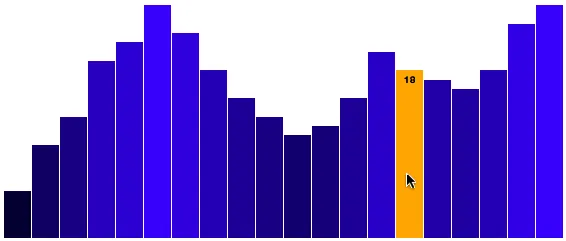
<h6 class="calibre37"><span class="keep-together">Figure 10-10.
</span>An SVG element tooltip</h6>
</div>
</figure>

</div>

</div>

<div class="section calibre2" data-type="sect2"
pdf-bookmark="HTML div Tooltips">

<div id="ch10.xhtml_idm140093189361536" class="dedication">

## HTML div Tooltips

A <span id="ch10.xhtml_idm140093189137952"
class="calibre5 pcalibre pcalibre2 pcalibre3 pcalibre1"
data-type="indexterm" primary="tooltips"
secondary="HTML div tooltips"></span><span id="ch10.xhtml_idm140093189136944"
class="calibre5 pcalibre pcalibre2 pcalibre3 pcalibre1"
data-type="indexterm" primary="HTML (Hypertext Markup Language)"
secondary="div tooltips"></span><span id="ch10.xhtml_idm140093189136032"
class="calibre5 pcalibre pcalibre2 pcalibre3 pcalibre1"
data-type="indexterm"
primary="div element"></span><span id="ch10.xhtml_idm140093189135360"
class="calibre5 pcalibre pcalibre2 pcalibre3 pcalibre1"
data-type="indexterm" primary="elements"
secondary="div element"></span><span id="ch10.xhtml_idm140093189134416"
class="calibre5 pcalibre pcalibre2 pcalibre3 pcalibre1"
data-type="indexterm" primary="HTML (Hypertext Markup Language)"
see="also elements"></span>similar approach can be used with HTML `div`
elements as tooltips. You might consider using a `div` when:

- You want to achieve a visual effect that isn’t possible or
  well-supported with SVG (such as CSS drop shadows)

- You need the tooltips to extend beyond the frame of the SVG image

See Figures <a href="#ch10.xhtml_div-tooltip"
class="calibre5 pcalibre pcalibre2 pcalibre3 pcalibre1" data-type="xref"
data-xrefstyle="select:labelnumber">10-11</a> and
<a href="#ch10.xhtml_overlapping-tooltip"
class="calibre5 pcalibre pcalibre2 pcalibre3 pcalibre1" data-type="xref"
data-xrefstyle="select:labelnumber">10-12</a> for examples.

<figure class="calibre35">
<div id="ch10.xhtml_div-tooltip" class="figure">
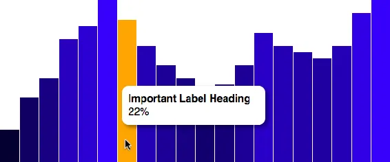
<h6 class="calibre37"><span class="keep-together">Figure 10-11.
</span>An HTML div tooltip</h6>
</div>
</figure>

<figure class="calibre35">
<div id="ch10.xhtml_overlapping-tooltip" class="figure">
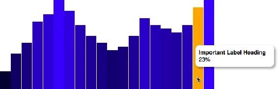
<h6 class="calibre37"><span class="keep-together">Figure 10-12.
</span>An HTML div tooltip, overlapping the bounds of the SVG image
beneath</h6>
</div>
</figure>

Again, there are many ways to do this, but I like to make a hidden `div`
in my HTML that gets populated with the data value, and is then unhidden
when triggered. You can follow along with the final code in
*14_div_tooltip.html*.

The `div` itself could be created dynamically with D3, but I like to
just type it in by hand:

``` calibre39
<div id="tooltip" class="hidden">
    <p><strong>Important Label Heading</strong></p>
    <p><span id="value">100</span>%</p>
</div>
```

Now it’s going to need some special CSS styling rules:

``` calibre39
#tooltip {
    position: absolute;
    width: 200px;
    height: auto;
    padding: 10px;
    background-color: white;
    -webkit-border-radius: 10px;
    -moz-border-radius: 10px;
    border-radius: 10px;
    -webkit-box-shadow: 4px 4px 10px rgba(0, 0, 0, 0.4);
    -moz-box-shadow: 4px 4px 10px rgba(0, 0, 0, 0.4);
    box-shadow: 4px 4px 10px rgba(0, 0, 0, 0.4);
    pointer-events: none;
}

#tooltip.hidden {
    display: none;
}

#tooltip p {
    margin: 0;
    font-family: sans-serif;
    font-size: 16px;
    line-height: 20px;
}
```

Note in particular that its `position` is `absolute`, so we can control
exactly where it should appear on the page. I’ve also added some fancy
rounded corners and a drop shadow. Plus, `pointer-events: none` ensures
that mousing over the tooltip itself won’t trigger a `mouseout` event on
the bars, thereby hiding the tooltip. (Try the code without this line,
and you’ll see what I mean.) Lastly, when the tooltip is given a class
of <span class="keep-together">`hidden`</span>, it is not displayed.

I made some modifications to the `mouseover` function, so the `div` is
roughly centered vertically against its triggering bar. The revised code
now also sets the tooltip’s `left` and `top` position per CSS layout
requirements, sets the text content of the `#value` span to `d`, and
then—now that everything is in place—removes the `hidden` class, making
the tooltip visible:

``` calibre39
.on("mouseover", function(d) {

//Get this bar's x/y values, then augment for the tooltip
var xPosition = parseFloat(d3.select(this).attr("x")) + xScale.bandwidth() / 2;
var yPosition = parseFloat(d3.select(this).attr("y")) / 2 + h / 2;

//Update the tooltip position and value
d3.select("#tooltip")
  .style("left", xPosition + "px")
  .style("top", yPosition + "px")
  .select("#value")
  .text(d);

//Show the tooltip
d3.select("#tooltip").classed("hidden", false);

})
```

Hiding the tooltip on `mouseout` is much easier; simply add on the
`hidden` class:

``` calibre39
.on("mouseout", function() {

    //Hide the tooltip
    d3.select("#tooltip").classed("hidden", true);

})
```

<div class="calibre29 warning" data-type="warning">

###### Warning

The layout of this simple example works well, but in a real-world
situation, the D3 chart would be just one of many other elements on the
page. As you probably know, perfecting HTML/CSS layouts can be a
challenge, and this is the biggest hassle of getting HTML elements to
interact properly with an SVG chart. It can help to put both the tooltip
`div` and SVG chart within the same enclosing element (like a container
`div`), so then you only have to worry about relative positions.
<a href="https://github.com/d3/d3-selection/blob/master/README.md#mouse"
class="calibre5 pcalibre pcalibre2 pcalibre3 pcalibre1"><code
class="calibre23">d3.mouse</code></a> can be used to get mouse
coordinates relative to any other element on the page, and can be useful
in cases when you need to position non-SVG elements in relationship to
the mouse.<span id="ch10.xhtml_idm140093188649648"
class="calibre5 pcalibre pcalibre2 pcalibre3 pcalibre1"
data-type="indexterm" primary=""
startref="tool10"></span><span id="ch10.xhtml_idm140093188648704"
class="calibre5 pcalibre pcalibre2 pcalibre3 pcalibre1"
data-type="indexterm" primary="" startref="Itool10"></span>

</div>

</div>

</div>

</div>

</div>

<div class="section calibre2" data-type="sect1"
pdf-bookmark="Consideration for Touch Devices">

<div id="ch10.xhtml_idm140093189139152" class="dedication">

# Consideration for Touch Devices

The <span id="ch10.xhtml_idm140093188646128"
class="calibre5 pcalibre pcalibre2 pcalibre3 pcalibre1"
data-type="indexterm" primary="interactivity"
secondary="touch devices"></span><span id="ch10.xhtml_idm140093188645120"
class="calibre5 pcalibre pcalibre2 pcalibre3 pcalibre1"
data-type="indexterm"
primary="touch-based interfaces"></span><span id="ch10.xhtml_idm140093188644448"
class="calibre5 pcalibre pcalibre2 pcalibre3 pcalibre1"
data-type="indexterm"
primary="click events"></span><span id="ch10.xhtml_idm140093188643776"
class="calibre5 pcalibre pcalibre2 pcalibre3 pcalibre1"
data-type="indexterm" primary="multitouch interactions"></span>browsers
on most popular touch devices—such as iOS and Android
devices—automatically translate touch events into mouse events, for
JavaScript purposes. So a tap on an element is interpreted by the
browser as a `click` event. This means that, for the most part, your
code that was crafted for mouse interfaces will also work just fine for
touch-based interfaces.

Mouse hover events, however, are never triggered on touch devices, so
tooltips that rely on hover will never appear. Consider revealing values
on touch.

Also, multitouch interaction is not automagically handled by D3. There’s
no easy answer on how to handle multitouch interactions. D3 *does* track
the touches for you, although it’s up to you to decide how to use them.
See the <span class="keep-together">API reference</span> for
<a href="https://github.com/d3/d3-selection/blob/master/README.md#touch"
class="calibre5 pcalibre pcalibre2 pcalibre3 pcalibre1"><code
class="calibre23">d3.touch</code></a> and <a
href="https://github.com/d3/d3-selection/blob/master/README.md#touches"
class="calibre5 pcalibre pcalibre2 pcalibre3 pcalibre1"><code
class="calibre23">d3.touches</code></a>.

For <span id="ch10.xhtml_idm140093188684224"
class="calibre5 pcalibre pcalibre2 pcalibre3 pcalibre1"
data-type="indexterm" primary="accessibility"></span>that matter, the
issue of accessibility to visualizations on *any* sort of device is a
huge, mostly unsolved problem. How can we ensure that our charts and
maps are perceivable by everyone, regardless of device or user ability?
Step beyond touch interfaces; can screen readers read our
visualizations? Doug Schepers, former W3C team contact for the SVG
specification, has a presentation on
<a href="http://schepers.cc/invisible-visualization"
class="calibre5 pcalibre pcalibre2 pcalibre3 pcalibre1">“Invisible
Visualization”</a> that addresses these concerns.

</div>

</div>

<div class="section calibre2" data-type="sect1"
pdf-bookmark="Moving Forward">

<div id="ch10.xhtml_idm140093188681856" class="dedication">

# Moving Forward

Congratulations! You now have all the basics of D3 under your cap. You
are a pro at binding data, generating and styling elements based on that
data, implementing scales and drawing axes, and modifying your creations
with new data, animated transitions, and interactivity. What more could
you ask for?

How about expanding your visual possibilities with paths, layouts, and
geomaps? The next few chapters will dive into these slightly more
advanced topics, but—be warned—without the same level of detail as the
prior chapters. Now that you know the basics, you don’t need every
little thing spelled out. Here we go!

</div>

</div>

</div>

</div>

<span id="ch11.xhtml"></span>

<div id="ch11.xhtml_sbo-rt-content" class="calibre1">

<div id="ch11.xhtml_using_paths" class="dedication">

