# <span class="keep-together">Chapter 14. </span>Geomapping

Bar charts, scatterplots, ring charts, and even force-directed
graphs…*Yeah, that’s all okay*, you’re thinking, *but get to the maps
already!*

<div class="section calibre2" data-type="sect1"
pdf-bookmark="JSON, Meet GeoJSON">

<div id="ch14.xhtml_idm140093183078592" class="dedication">

# JSON, Meet GeoJSON

We <span id="ch14.xhtml_idm140093183076896"
class="calibre5 pcalibre pcalibre2 pcalibre3 pcalibre1"
data-type="indexterm" primary="geomapping"
secondary="GeoJSON"></span><span id="ch14.xhtml_idm140093183075888"
class="calibre5 pcalibre pcalibre2 pcalibre3 pcalibre1"
data-type="indexterm" primary="GeoJSON"></span>already met JSON,
briefly, back in Chapters <a href="#ch03.xhtml_technology_fundamentals"
class="calibre5 pcalibre pcalibre2 pcalibre3 pcalibre1" data-type="xref"
data-xrefstyle="select:labelnumber">3</a> and
<a href="#ch05.xhtml_data-chapter5"
class="calibre5 pcalibre pcalibre2 pcalibre3 pcalibre1" data-type="xref"
data-xrefstyle="select:labelnumber">5</a>. Now meet
<a href="http://geojson.org"
class="calibre5 pcalibre pcalibre2 pcalibre3 pcalibre1">GeoJSON</a>, the
JSON-based standard for encoding geodata for web applications. GeoJSON
actually is not a totally different format, but just a very specific use
of JSON.

Before you can generate a geographic map, you need to acquire the path
data (the outlines) for the shapes you want to display. We’ll start with
a common example, mapping US state boundaries. I’ve included a file
*us-states.json* with the sample code. This file is taken directly from
one of the D3 examples, and we owe Mike Bostock a word of thanks for
generating this nice, clean file of state boundaries.

Opening *us-states.json*, you’ll see it looks something like this
(reformatted and greatly abbreviated here):

``` calibre39
{
  "type": "FeatureCollection",
  "features": [
     {
       "type": "Feature",
       "id": "01",
       "properties": { "name": "Alabama" },
       "geometry": {
         "type": "Polygon",
         "coordinates": [[[-87.359296,35.00118],
           [-85.606675,34.984749],[-85.431413,34.124869],
           [-85.184951,32.859696],[-85.069935,32.580372],
           [-84.960397,32.421541],[-85.004212,32.322956],
           [-84.889196,32.262709],[-85.058981,32.13674] …
          ]]
      }
    },
    {
         "type": "Feature",
         "id": "02",
         "properties": { "name": "Alaska" },
         "geometry": {
           "type": "MultiPolygon",
           "coordinates": [[[[-131.602021,55.117982],
             [-131.569159,55.28229],[-131.355558,55.183705],
             [-131.38842,55.01392],[-131.645836,55.035827],
             [-131.602021,55.117982]]],[[[-131.832052,55.42469],
             [-131.645836,55.304197],[-131.749898,55.128935],
             [-131.832052,55.189182], …
            ]]]
          }
      }, …
```

In typical GeoJSON style, we see, first of all, that this is all one
giant object. (Curly brackets, remember?) That object has a `type` of
`FeatureCollection`, followed by `features`, which is an array of
individual `Feature` objects. Each one of these
<span class="keep-together">`Feature`s</span> represents a US state. You
can see each state’s name under `properties`.

But the real meat in any GeoJSON file is under `geometry`. This is where
the feature’s `type` is specified, followed by the many `coordinates`
that constitute the feature’s boundary.
<span id="ch14.xhtml_idm140093182898160"
class="calibre5 pcalibre pcalibre2 pcalibre3 pcalibre1"
data-type="indexterm" primary="geomapping"
secondary="longitude/latitude pairs"></span><span id="ch14.xhtml_idm140093182897216"
class="calibre5 pcalibre pcalibre2 pcalibre3 pcalibre1"
data-type="indexterm" primary="longitude/latitude pairs"></span>Within
the `coordinates` are sets of longitude/latitude pairs, each one as a
small, two-value array. This is the information that cartographers
dedicate their lives to compiling and refining. We owe generations of
explorers and researchers our gratitude for creating these sequences of
tiny, yet extremely powerful, numbers.

It’s important to note that *longitude* is always listed first. Despite
the cultural bias toward lat/lon, GeoJSON is a lon/lat world.

Also, in case your cartographic skills are a bit rusty, here’s how you
can always remember which is which:

- Longtiude is long. Therefore, longitudinal lines run vertically, as
  though hanging down from above.

- Latitude is fatitude. Therefore, latitudinal lines run horizontally,
  as though wrapping around the Earth’s waist.

Longitude and latitude together constitute an enormous grid that
encircles the whole globe. Conveniently for us, lon/lat can be easily
converted to x/y values for screen display. In bar charts, we map data
values to display values—numbers to rectangle heights. In geomapping, we
also map data values to display values—lon/lat becomes x/y. Thinking in
terms of x/y also makes it easier to get used to the uncomfortable order
of longitude first, latitude second.

<div class="calibre27" data-type="tip">

###### Tip

<a href="http://teczno.com/squares"
class="calibre5 pcalibre pcalibre2 pcalibre3 pcalibre1">Get Lat+Lon</a>
is a <span id="ch14.xhtml_idm140093182889408"
class="calibre5 pcalibre pcalibre2 pcalibre3 pcalibre1"
data-type="indexterm" primary="coordinate values, locating"></span>great
resource by Mike Migurski for double-checking coordinate values. Keep it
open in a browser tab whenever you’re working on geomaps. You will
reference it often.

</div>

</div>

</div>

<div class="section calibre2" data-type="sect1" pdf-bookmark="Paths">

<div id="ch14.xhtml_idm140093183078000" class="dedication">

# Paths

We’ve <span id="ch14.xhtml_idm140093182886512"
class="calibre5 pcalibre pcalibre2 pcalibre3 pcalibre1"
data-type="indexterm" primary="geomapping"
secondary="defining path generators"></span><span id="ch14.xhtml_idm140093182885488"
class="calibre5 pcalibre pcalibre2 pcalibre3 pcalibre1"
data-type="indexterm" primary="paths"></span>got our geodata. Now get
ready to rock.

First, we define our first geographic *path generator*:

``` calibre39
//Define path generator, using the Albers USA projection
var path = d3.geoPath()
             .projection(d3.geoAlbersUsa());
```

`d3.geoPath()` is a total lifesaver of a function. It does all the dirty
work of translating that mess of GeoJSON coordinates into even messier
messes of SVG `path` codes. All hail `d3.geoPath()`!

When defining our path generator, we have to specify a *projection* for
it to use (`d3.geoAlbersUsa()`, in this case). More on projections in a
moment.

Now we *could* paste all that GeoJSON directly into our HTML file, but
ugh, so many coordinates and curly brackets—what a mess!
<span id="ch14.xhtml_idm140093182870704"
class="calibre5 pcalibre pcalibre2 pcalibre3 pcalibre1"
data-type="indexterm" primary="d3.json()"></span>It’s cleaner and more
common to keep the geodata in a separate file and load it in using
`d3.json()`:

``` calibre39
//Load in GeoJSON data
d3.json("us-states.json", function(json) {

    //Bind data and create one path per GeoJSON feature
    svg.selectAll("path")
       .data(json.features)
       .enter()
       .append("path")
       .attr("d", path);

});
```

`d3.json()` takes two arguments. First, it takes a string pointing to
the path of the file to load in. Second, it takes a callback function
that is fired when the JSON file has been loaded and parsed. (See
<a href="#ch05.xhtml_handling_data_loading_errors_5"
class="calibre5 pcalibre pcalibre2 pcalibre3 pcalibre1"
data-type="xref">“Handling Data-Loading Errors”</a> for details on the
callback function.) `d3.json()`, just like `d3.csv()`, is
*asynchronous*, meaning it won’t prevent the rest of your code from
running while the browser waits for that external file to load. For
example, code placed *after* the callback function might be executed
*before* the contents of the callback itself:

``` calibre39
d3.json("someFile.json", function(json) {
    //Put things here that depend on the JSON loading
});

//Only put things here that can operate independently of the JSON
console.log("I like cats.");
```

So as a rule, when loading external datafiles, put the code that depends
on that data within the callback function. (Or put the code into other
custom functions, and then call those functions from within the
callback.)

Back to the example. Finally, we bind the GeoJSON features to new `path`
elements, creating one new `path` for each feature:

``` calibre39
    svg.selectAll("path")
       .data(json.features)
       .enter()
       .append("path")
       .attr("d", path);
```

Notice that last line, in which `d` (the path data attribute) is
referred to our path generator, which magically takes the bound geodata
and calculates all that crazy SVG code. The result is
<a href="#ch14.xhtml_geojson_simple"
class="calibre5 pcalibre pcalibre2 pcalibre3 pcalibre1"
data-type="xref">Figure 14-1</a>.

<figure class="calibre35">
<div id="ch14.xhtml_geojson_simple" class="figure">
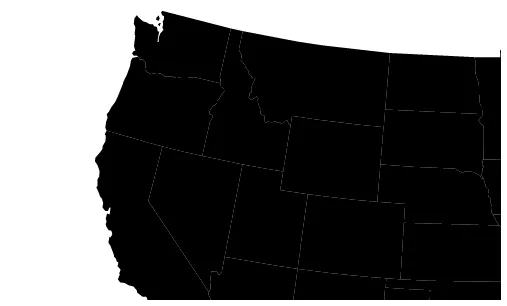
<h6 class="calibre37"><span class="keep-together">Figure 14-1.
</span>Our first view of GeoJSON data</h6>
</div>
</figure>

A map! That was so easy! Check it out in *01_paths.html*. The rest is
just customization.

<div class="calibre27" data-type="tip">

###### Tip

You can find all the horrifically nitty-gritty detail on paths, path
generator options, and more in the
<a href="https://github.com/d3/d3-geo"
class="calibre5 pcalibre pcalibre2 pcalibre3 pcalibre1">d3-geo
documentation</a>.

</div>

</div>

</div>

<div class="section calibre2" data-type="sect1"
pdf-bookmark="Projections">

<div id="ch14.xhtml_idm140093182887616" class="dedication">

# Projections

As an <span id="ch14.xhtml_idm140093182553568"
class="calibre5 pcalibre pcalibre2 pcalibre3 pcalibre1"
data-type="indexterm" primary="geomapping"
secondary="modifying projections"></span><span id="ch14.xhtml_idm140093182530608"
class="calibre5 pcalibre pcalibre2 pcalibre3 pcalibre1"
data-type="indexterm" primary="projections"></span>astute observer, you
noticed that our map isn’t quite showing us the entire United States. To
correct this, we need to modify the *projection* being used.

What is a projection? Well, as an astute observer, you have also noticed
that the globe is round, not flat.
<span id="ch14.xhtml_idm140093182528704"
class="calibre5 pcalibre pcalibre2 pcalibre3 pcalibre1"
data-type="indexterm" primary="3D drawing"
secondary="projections"></span><span id="ch14.xhtml_idm140093182527728"
class="calibre5 pcalibre pcalibre2 pcalibre3 pcalibre1"
data-type="indexterm" primary="3D drawing" secondary="projections"
primary-sortas="threeD drawing"></span>Round things are
three-dimensional, and don’t take well to being represented on
two-dimensional surfaces. A *projection* is an algorithm of compromise;
it is the method by which 3D space is “projected” onto a 2D plane.
(These compromises are beautifully illustrated—using D3, of course—in
Michael Davis’s <a href="http://bit.ly/2uRIbIJ"
class="calibre5 pcalibre pcalibre2 pcalibre3 pcalibre1">“The problem
with maps”</a>.)

We define D3 projections using a familiar structure:

``` calibre39
var projection = d3.geoAlbersUsa()
                   .translate([w/2, h/2]);
```

D3 has several built-in projections. Albers USA is a composite
projection that nicely tucks Alaska and Hawaii beneath the Southwest.
(You’ll see in a second.) Different projections support different
options. The preceding code provides a translation value to
`geoAlbersUsa`. You can see that we’re translating the projection to the
center of the SVG image (half of its width and half of its height).

Now that our customized projection is stored in `projection`, we have to
tell the path generator to reference it when generating all those paths:

``` calibre39
var path = d3.geoPath()
             .projection(projection);
```

<div class="calibre27" data-type="tip">

###### Tip

If you prefer more concise code, you can specify the projection within
the constructor function, like so:

``` calibre63
var path = d3.geoPath(projection);
```

That is equivalent to the preceding code snippet. In the examples, I’ve
chosen to write out `.projection(projection)` for clarity.

</div>

That gives us <a href="#ch14.xhtml_geojson_centered"
class="calibre5 pcalibre pcalibre2 pcalibre3 pcalibre1"
data-type="xref">Figure 14-2</a>. Getting there! See
*02_projection.html* for the working code.

<figure class="calibre35">
<div id="ch14.xhtml_geojson_centered" class="figure">
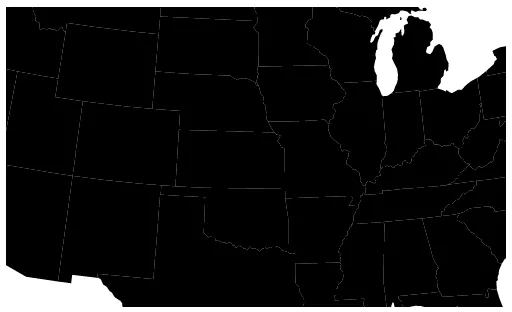
<h6 class="calibre37"><span class="keep-together">Figure 14-2.
</span>The same GeoJSON data, but now with a centered projection</h6>
</div>
</figure>

We<span id="ch14.xhtml_idm140093182834560"
class="calibre5 pcalibre pcalibre2 pcalibre3 pcalibre1"
data-type="indexterm" primary="d3.scale()"></span> can also add a
`scale()` method to our projection in order to shrink things down a bit
and achieve the result shown in <a href="#ch14.xhtml_geojson_scaled"
class="calibre5 pcalibre pcalibre2 pcalibre3 pcalibre1"
data-type="xref">Figure 14-3</a>.

``` calibre39
var projection = d3.geoAlbersUsa()
                   .translate([w/2, h/2])
                   .scale([500]);
```

The default scale value for `geoAlbersUsa` is 1,000. Anything smaller
will shrink the map; anything larger will expand it.

<figure class="calibre35">
<div id="ch14.xhtml_geojson_scaled" class="figure">
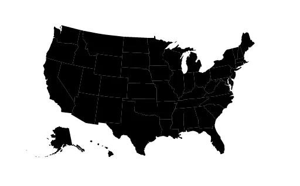
<h6 class="calibre37"><span class="keep-together">Figure 14-3.
</span>The USA, scaled and centered within the image</h6>
</div>
</figure>

Cool! See that working code in *03_scaled.html*.

By adding a single `style()` statement, we could set the path’s fills to
something less severe, like the blue shown in
<a href="#ch14.xhtml_geojson_filled"
class="calibre5 pcalibre pcalibre2 pcalibre3 pcalibre1"
data-type="xref">Figure 14-4</a>.

<figure class="calibre35">
<div id="ch14.xhtml_geojson_filled" class="figure">
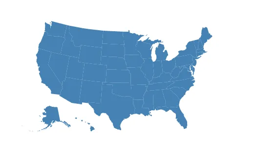
<h6 class="calibre37"><span class="keep-together">Figure 14-4.
</span>Now more blue-ish than black</h6>
</div>
</figure>

See *04_fill.html* for that. You could use the same technique to set
stroke color and width, too.

Map projections are extremely powerful algorithms, and different
projections are useful for different purposes and different parts of the
world (near the poles, versus the equator, for example).

Thanks <span id="ch14.xhtml_idm140093182403504"
class="calibre5 pcalibre pcalibre2 pcalibre3 pcalibre1"
data-type="indexterm" primary="Davies, Jason"></span>in large part to
the tireless contributions of <a href="http://www.jasondavies.com"
class="calibre5 pcalibre pcalibre2 pcalibre3 pcalibre1">Jason Davies</a>,
D3 supports every obscure projection you could imagine. Feast your eyes
on the dizzying array of supported projections in
<a href="https://github.com/d3/d3-geo-projection"
class="calibre5 pcalibre pcalibre2 pcalibre3 pcalibre1">the
d3-geo-projection documentation</a>. You might also find Mike Bostock’s
<a href="http://bl.ocks.org/3711652"
class="calibre5 pcalibre pcalibre2 pcalibre3 pcalibre1">projection
comparison demo</a> useful. (Note that that demo uses an older version
of D3, so its syntax won’t work with D3 4.x. Still, it’s a transfixing
visual reference.)

</div>

</div>

<div class="section calibre2" data-type="sect1"
pdf-bookmark="Choropleth">

<div id="ch14.xhtml_idm140093182554704" class="dedication">

# Choropleth

Choro-*what?* This <span id="ch14.xhtml_idm140093182398096"
class="calibre5 pcalibre pcalibre2 pcalibre3 pcalibre1"
data-type="indexterm" primary="geomapping"
secondary="choropleth maps"></span><span id="ch14.xhtml_idm140093182397088"
class="calibre5 pcalibre pcalibre2 pcalibre3 pcalibre1"
data-type="indexterm"
primary="choropleth maps"></span><span id="ch14.xhtml_idm140093182396416"
class="calibre5 pcalibre pcalibre2 pcalibre3 pcalibre1"
data-type="indexterm" primary="maps"
secondary="choropleth maps"></span><span id="ch14.xhtml_idm140093182395472"
class="calibre5 pcalibre pcalibre2 pcalibre3 pcalibre1"
data-type="indexterm" primary="maps"
secondary="political maps"></span><span id="ch14.xhtml_idm140093182394528"
class="calibre5 pcalibre pcalibre2 pcalibre3 pcalibre1"
data-type="indexterm"
primary="political maps"></span><span id="ch14.xhtml_idm140093182393856"
class="calibre5 pcalibre pcalibre2 pcalibre3 pcalibre1"
data-type="indexterm" primary="red state/blue state maps"></span>word,
which can be difficult to pronounce, refers to a geomap with areas
filled in with different values (light or dark) or colors to reflect
associated data values. In the United States, so-called “red state, blue
state” choropleth maps showing the Republican and Democratic leanings of
each state are ubiquitous, especially around election time. But
choropleths can be generated from any values, not just political ones.

These maps are also some of the most requested uses of D3. Although
choropleths can be fantastically useful, keep in mind that they have
some inherent perceptual limitations. Because they use *area* to encode
values, large areas with low density (such as the state of Nevada) are
overrepresented visually. A standard choropleth does not represent
per-capita values fairly—Nevada is too big, and Delaware far too small.
But they *do* retain the geography of a place, and—as maps—they look
really, really cool. So let’s dive in. (You can follow along with
*05_choropleth.html*.)

First, I’ll set up a scale that can take data values as input, and will
return colors. This is the heart of choropleth-style mapping:

``` calibre39
var color = d3.scaleQuantize()
              .range(["rgb(237,248,233)", "rgb(186,228,179)",
               "rgb(116,196,118)", "rgb(49,163,84)", "rgb(0,109,44)"]);
```

A *quantize* scale <span id="ch14.xhtml_idm140093182375696"
class="calibre5 pcalibre pcalibre2 pcalibre3 pcalibre1"
data-type="indexterm" primary="quantize scales"></span>functions as a
linear scale, but it outputs values from within a discrete range. These
output values could be numbers, colors (as we’ve done here), or anything
else you like. This is useful for sorting values into “buckets.” In this
case, we’re using five buckets, but there could be as many as you like.

Notice I’ve specified an output range, but not an input domain. (I’m
waiting until our data is loaded in to do that.) These particular colors
are adapted from D3’s built-in
<a href="https://github.com/d3/d3-scale-chromatic"
class="calibre5 pcalibre pcalibre2 pcalibre3 pcalibre1">d3-scale-chromatic</a>
color scales—a collection of perceptually optimized colors, selected by
Cynthia Brewer, and based on her research. (If you haven’t seen
<a href="http://colorbrewer2.org/"
class="calibre5 pcalibre pcalibre2 pcalibre3 pcalibre1">ColorBrewer</a>,
you must go explore it right now.)

Next, we need to load in some data. I’ve provided a file
*us-ag-productivity.csv*, which looks like this:

``` calibre39
state,value
Alabama,1.1791
Arkansas,1.3705
Arizona,1.3847
California,1.7979
Colorado,1.0325
Connecticut,1.3209
Delaware,1.4345
…
```

This data, provided by the US Department of Agriculture, reports
agricultural productivity by state during the year 2004. The units are
relative to an arbitrary baseline of the productivity of the state of
Alabama in 1996 (1.0), so greater values are more productive, and
smaller values less so. (Find lots of open government datasets at
<a href="http://data.gov"
class="calibre5 pcalibre pcalibre2 pcalibre3 pcalibre1">data.gov</a>.) I
expect this data will give us a nice map of states’ agricultural
productivity.

To load in the data, we use `d3.csv()`:

``` calibre39
d3.csv("us-ag-productivity.csv", function(data) { …
```

Then, in the callback function, I want to set the `color` quantize
scale’s input domain (before I forget!):

``` calibre39
    color.domain([
        d3.min(data, function(d) { return d.value; }),
        d3.max(data, function(d) { return d.value; })
    ]);
```

This uses `d3.min()` and `d3.max()` to calculate and return the smallest
and largest data values, so the scale’s domain is dynamically
calculated.

Next, we load in the JSON geodata, as before. But what’s new here is I
want to *merge* the agricultural data *into* the GeoJSON. Why? Because
we can only bind one set of data to elements at a time. We definitely
need the GeoJSON, from which the `path`s are generated, but we also need
the new agricultural data. So if we can smush them into a single,
monster array, then we can bind them to the new `path` elements all at
the same time. (There are several approaches to this step; what follows
is my preferred method.)

``` calibre39
    d3.json("us-states.json", function(json) {

        //Merge the ag. data and GeoJSON
        //Loop through once for each ag. data value
        for (var i = 0; i < data.length; i++) {

            //Grab state name
            var dataState = data[i].state;

            //Grab data value, and convert from string to float
            var dataValue = parseFloat(data[i].value);

            //Find the corresponding state inside the GeoJSON
            for (var j = 0; j < json.features.length; j++) {

            var jsonState = json.features[j].properties.name;

            if (dataState == jsonState) {

                //Copy the data value into the JSON
                json.features[j].properties.value = dataValue;

                //Stop looking through the JSON
                break;

        }
    }
}
```

Read through that closely. Basically, for each state, we are finding the
GeoJSON element with the same name (e.g., “Colorado”). Then we take the
state’s data value and tuck it in under
`json.features[j].properties.value`, ensuring it will be bound to the
element and available later, when we need it.

Lastly, we create the `path`s just as before, only we make our `style()`
value dynamic:

``` calibre39
        svg.selectAll("path")
           .data(json.features)
           .enter()
           .append("path")
           .attr("d", path)
           .style("fill", function(d) {
               //Get data value
               var value = d.properties.value;

               if (value) {
                   //If value exists…
                   return color(value);
               } else {
                   //If value is undefined…
                   return "#ccc";
               }
           });
```

Instead of `"steelblue"` for everyone, now each state `path` gets a
different fill value. The trick is that we don’t have data for *every*
state. The dataset we’re using doesn’t have information for Alaska, the
District of Columbia, or Hawaii.

So to accommodate those exceptions, we include a little logic: an `if()`
statement that checks to see whether or not the data value has been
defined. If it exists, then we return `color(value)`, meaning we pass
the data value to our quantize scale, which returns a color. For
undefined values, we set a default of light gray (`#ccc`).

Beautiful! Just look at the result in
<a href="#ch14.xhtml_choropleth_map"
class="calibre5 pcalibre pcalibre2 pcalibre3 pcalibre1"
data-type="xref">Figure 14-5</a>. Check out the final code and try it
yourself in *05_choropleth.html*.

<figure class="calibre35">
<div id="ch14.xhtml_choropleth_map" class="figure">
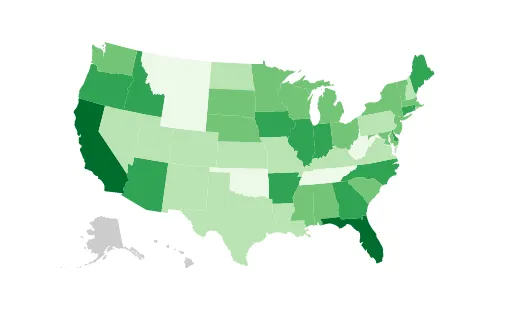
<h6 class="calibre37"><span class="keep-together">Figure 14-5. </span>A
choropleth map showing agricultural productivity by state</h6>
</div>
</figure>

</div>

</div>

<div class="section calibre2" data-type="sect1"
pdf-bookmark="Adding Points">

<div id="ch14.xhtml_idm140093182399392" class="dedication">

# Adding Points

Wouldn’t <span id="ch14.xhtml_idm140093181849168"
class="calibre5 pcalibre pcalibre2 pcalibre3 pcalibre1"
data-type="indexterm" primary="geomapping"
secondary="map points"></span><span id="ch14.xhtml_idm140093181848160"
class="calibre5 pcalibre pcalibre2 pcalibre3 pcalibre1"
data-type="indexterm"
primary="points"></span><span id="ch14.xhtml_idm140093181847488"
class="calibre5 pcalibre pcalibre2 pcalibre3 pcalibre1"
data-type="indexterm" primary="maps"
secondary="map points"></span><span id="ch14.xhtml_idm140093181846544"
class="calibre5 pcalibre pcalibre2 pcalibre3 pcalibre1"
data-type="indexterm" primary="cities, adding to maps"></span>it be nice
to put some cities on this map, for context? Maybe it would be
interesting or useful to see how many large, urban areas there are in
the most (or least) agriculturally productive states. Again, let’s start
by finding the data.

Fortunately, the US Census Bureau has us covered, once again. (Your tax
dollars at work!) Here’s the start of a raw CSV dataset from the Census
that shows <a href="http://bit.ly/2v1XgJZ"
class="calibre5 pcalibre pcalibre2 pcalibre3 pcalibre1">“Annual
Estimates of the Resident Population for Incorporated Places of 50,000
or More”</a>.

``` calibre39
GEO.id,GEO.id2,GEO.display-label,GC_RANK.target-geo-id…
Id,Id2,Geography,Target Geo Id,Target Geo Id2,Rank,Geography,Geography,"April …
0100000US,,United States,1620000US3651000,3651000,1,"United States - New York…
0100000US,,United States,1620000US0644000,0644000,2,"United States - Los Ang…
0100000US,,United States,1620000US1714000,1714000,3,"United States - Chicago…
0100000US,,United States,1620000US4835000,4835000,4,"United States - Houston…
0100000US,,United States,1620000US4260000,4260000,5,"United States - Philadel…
…
```

This is quite messy, and I don’t even need all this data. So I’ll open
the CSV up in my favorite spreadsheet program and clean it up a bit,
removing unneeded columns. (You could use Microsoft Excel, Apple
Numbers, Google Sheets, or LibreOffice Calc. As you do, be warned that
many GUIs will drop leading zeros for fields interpreted as numeric
values. For example, the zip code 01063 could be misinterpreted as the
number 1,063.) I’m also interested in only the largest 50 cities, so
I’ll delete all the others. Exporting back to CSV, I now have this:

``` calibre39
rank,place,population
1,New York,8550405
2,Los Angeles,3971883
3,Chicago,2720546
4,Houston,2296224
5,Philadelphia,1567442
…
```

This <span id="ch14.xhtml_idm140093181840368"
class="calibre5 pcalibre pcalibre2 pcalibre3 pcalibre1"
data-type="indexterm"
primary="coordinate values, locating"></span>information is useful, but
to place it on the map, I’m going to need the latitude and longitude
coordinates for each of these places. Looking this up manually would
take *forever*. <span id="ch14.xhtml_idm140093181838960"
class="calibre5 pcalibre pcalibre2 pcalibre3 pcalibre1"
data-type="indexterm"
primary="geocoding services"></span><span id="ch14.xhtml_idm140093181838224"
class="calibre5 pcalibre pcalibre2 pcalibre3 pcalibre1"
data-type="indexterm" primary="geomapping"
secondary="geocoding services"></span>Fortunately, we can use a
*geocoding* service to speed things up. Geocoding is the process of
taking place names, looking them up on a map (or in a database, really),
and returning precise lat/lon coordinates. “Precise” might be a bit of
an overstatement—the geocoder does the best job it can, but it will
sometimes be forced to make assumptions given vague data. For example,
if you specify “Paris,” it may assume you mean Paris, France, and not
Paris, Texas.

<div class="calibre29 warning" data-type="warning">

# Never Trust a Geocoder

Let me tell you a story.

In the first edition of this book, I wrote:

“It’s good practice to eyeball the geocoder’s output once you get it on
the map, and manually adjust any erroneous coordinates (using
<a href="http://www.teczno.com/squares"
class="calibre5 pcalibre pcalibre2 pcalibre3 pcalibre1">Get Lat+Lon</a>
as a reference).”

I then proceeded to completely ignore my own advice, and published the
map you are about to see with cities in *completely* wrong places. San
Francisco on the Florida coast; it was a mess. But I hadn’t labeled the
circles with their corresponding cities’ names, and I’ve never been to
Florida, so hey, what do you expect?

Lesson learned: geocoders can save you a lot of time, but if accuracy
matters even a little (such as to avoid potential public embarrassment),
then please manually double-check all your values. Paid geocoding
services may perform better than free ones for a reason. Some geocoders
will output a certainty or precision value as well; this can give you a
clue as to how confident the service is in its results.

Special thanks to Jeff Weiss for correcting *all* the coordinates, as
now reflected in the second edition of *us-cities.csv*.

</div>

I’ll <span id="ch14.xhtml_idm140093181829216"
class="calibre5 pcalibre pcalibre2 pcalibre3 pcalibre1"
data-type="indexterm"
primary="population maps"></span><span id="ch14.xhtml_idm140093181828480"
class="calibre5 pcalibre pcalibre2 pcalibre3 pcalibre1"
data-type="indexterm" primary="maps"
secondary="population maps"></span>head over to
<a href="http://www.gpsvisualizer.com/geocoder/"
class="calibre5 pcalibre pcalibre2 pcalibre3 pcalibre1">my favorite
batch geocoder</a>, paste in the place names, and click start. A few
minutes later, the geocoder spits out some more comma-separated values,
including lat/lon pairs. I bring those back into my spreadsheet, and
save out a new, unified CSV with coordinates (shown here after manual
verification of values):

``` calibre39
rank,place,population,lat,lon
1,New York,8550405,40.71455,-74.007124
2,Los Angeles,3971883,34.05349,-118.245319
3,Chicago,2720546,41.88415,-87.632409
4,Houston,2296224,29.76045,-95.369784
5,Philadelphia,1567442,39.95228,-75.162454
…
```

That was unbelievably easy. Ten years ago that step would have taken us
hours of research and tedious data entry, not seconds of mindless
copying-and-pasting. Now you see why we’re experiencing an explosion of
online mapping.

Our data is ready, and we already know how to load it in:

``` calibre39
d3.csv("us-cities.csv", function(data) {
    //Do something…
});
```

In the callback function, we can specify how to create a new `circle`
element for each city, and then *position each circle* according to the
corresponding city’s geo-coordinates:

``` calibre39
    svg.selectAll("circle")
       .data(data)
       .enter()
       .append("circle")
       .attr("cx", function(d) {
           return projection([d.lon, d.lat])[0];
       })
       .attr("cy", function(d) {
           return projection([d.lon, d.lat])[1];
       })
       .attr("r", 5)
       .style("fill", "yellow")
       .style("stroke", "gray")
       .style("stroke-width", 0.25)
       .style("opacity", 0.75)
       .append("title")			//Simple tooltip
       .text(function(d) {
            return d.place + ": Pop. " + formatAsThousands(d.population);
       });
```

The <span id="ch14.xhtml_idm140093182058000"
class="calibre5 pcalibre pcalibre2 pcalibre3 pcalibre1"
data-type="indexterm"
primary="screen coordinates vs. geo-coordinates"></span>magic here is in
those `attr()` statements that set the `cx` and `cy` values. You see, we
can access the raw latitude and longitude values as `d.lat` and `d.lon`.
But what we really need for positioning these circles are x/y *screen
coordinates*, not *geo*-coordinates.

So <span id="ch14.xhtml_idm140093181773008"
class="calibre5 pcalibre pcalibre2 pcalibre3 pcalibre1"
data-type="indexterm" primary="projections"></span>we bring back our
magical friend `projection()`, which is essentially a two-dimensional
scale method. Scales take one number and return another. Projections
take two numbers and return two. (Also, the behind-the-scenes math for
projections is much more complex than the simple, linear scales.)

The map projection takes a two-value array as input, with *longitude*
first (remember, it’s lon/lat, not lat/lon, in GeoJSON-ville). Then the
projection returns a two-value array with x/y screen values. So, for
`cx`, we use `[0]` to grab the *first* of those values, which is *x*.
For `cy`, we use `[1]` to grab the *second* of those values, which is
*y*. Make sense?

The resulting map in <a href="#ch14.xhtml_choropleth_with_cities"
class="calibre5 pcalibre pcalibre2 pcalibre3 pcalibre1"
data-type="xref">Figure 14-6</a> is pretty nice! Check out the code in
*06_points.html*.

<figure class="calibre35">
<div id="ch14.xhtml_choropleth_with_cities" class="figure">
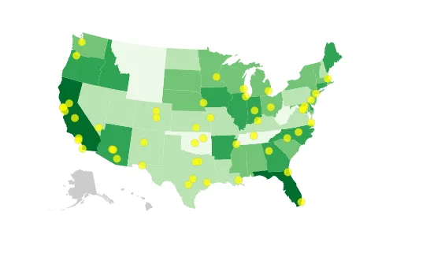
<h6 class="calibre37"><span class="keep-together">Figure 14-6.
</span>The top 50 largest US cities, represented as cute little yellow
dots</h6>
</div>
</figure>

Yet these dots are all the same size. Let’s link the population data to
circle size. Instead of a static area, we’ll reference the `population`
value:

``` calibre39
    .attr("r", function(d) {
        return Math.sqrt(parseInt(d.population) * 0.00004);
    })
```

Here we grab `d.population`, wrap it in `parseInt()` to convert it from
a string to an integer, scale that value down by an arbitrary amount,
and finally take the square root (to convert from an area value to a
radius value). See the code in *07_points_sized.html*.

As you can see in <a href="#ch14.xhtml_choropleth_with_cities_sized"
class="calibre5 pcalibre pcalibre2 pcalibre3 pcalibre1"
data-type="xref">Figure 14-7</a>, now the largest cities really stand
out. The differences in city size are significant. Also, instead of
multiplying by my magic number 0.00004, you could more properly use a
custom D3 scale function. (I’ll leave that to you.)

<figure class="calibre35">
<div id="ch14.xhtml_choropleth_with_cities_sized" class="figure">
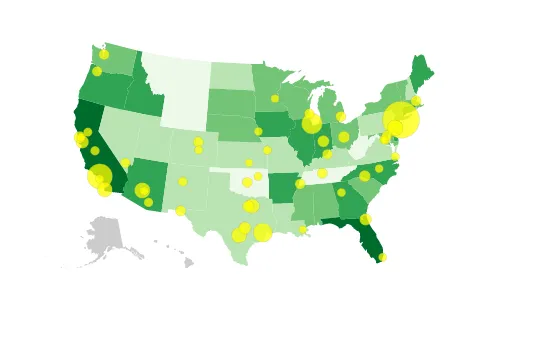
<h6 class="calibre37"><span class="keep-together">Figure 14-7.
</span>Cities as dots, with area set by population</h6>
</div>
</figure>

The point here is to see that we’ve successfully loaded and visualized
two different datasets on a map. (Make that three, counting the geocoded
coordinates we merged in!)

<div class="calibre27" data-type="tip">

# Take a break!

Seriously, we’ve just covered a lot. Please go for a short walk around
the block, or at least stretch a bit. You’re going to need the mental
break before making our map interactive.

</div>

</div>

</div>

<div class="section calibre2" data-type="sect1" pdf-bookmark="Panning">

<div id="ch14.xhtml_idm140093181850016" class="dedication">

# Panning

Our <span id="ch14.xhtml_Gpan14"
class="calibre5 pcalibre pcalibre2 pcalibre3 pcalibre1"
data-type="indexterm" primary="geomapping"
secondary="panning"></span><span id="ch14.xhtml_pan14"
class="calibre5 pcalibre pcalibre2 pcalibre3 pcalibre1"
data-type="indexterm" primary="panning (maps)"></span>maps so far have
been static. If you want users to be able to *move around* your maps,
you’ll need to implement *panning*.

You’ll remember that when we configured our projection, we specified a
*translation* offset:

``` calibre39
//Define map projection
var projection = d3.geoAlbersUsa()
                   .translate([w/2, h/2])
                   .scale([500]);
```

The translation offset effectively “moves the map” up, down, left, or
right. So to “pan” around the map, we need to modify the translation
offset.

The main steps in panning are:

- Get the current translation offset value

- Decide which direction you want to move

- Decide how far you want to move

- Augment the offset value by that amount

- Update the projection with the new offset value

- Reproject all elements on the map (e.g., paths and circles)

See all this magic happening in *08_pan.html*. For this example, I’ve
set the projection’s `scale()` value to 2,000, in effect “zooming in” to
the center of the country, as you can see in <a href="#ch14.xhtml_pan"
class="calibre5 pcalibre pcalibre2 pcalibre3 pcalibre1"
data-type="xref">Figure 14-8</a>.

<figure class="calibre35">
<div id="ch14.xhtml_pan" class="figure">
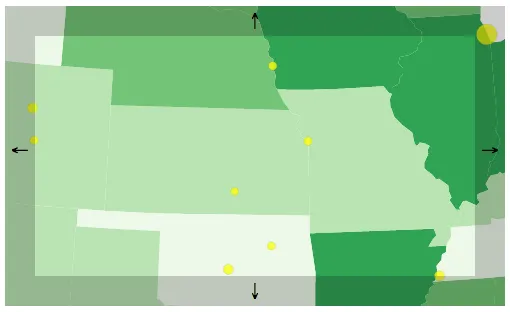
<h6 class="calibre37"><span class="keep-together">Figure 14-8.
</span>Pan example</h6>
</div>
</figure>

How appropriate that our example on how to handle panning includes the
Oklahoma panhandle. (Wow, I apologize; that was so bad, it may not even
qualify as a pun.)

The four rectangles with arrows act as pan triggers for each of the
cardinal directions: north, south, west, and east. Clicking the “east”
button on the right edge results in the map being moved to the left, as
shown in <a href="#ch14.xhtml_panned"
class="calibre5 pcalibre pcalibre2 pcalibre3 pcalibre1"
data-type="xref">Figure 14-9</a>.

<figure class="calibre35">
<div id="ch14.xhtml_panned" class="figure">
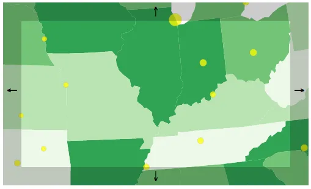
<h6 class="calibre37"><span class="keep-together">Figure 14-9.
</span>Pan example, panned</h6>
</div>
</figure>

Before we step through the code, take a moment to click these buttons,
so you get a feel for how it works. Okay, ready?

After creating the map, I call the new function `createPanButtons()`,
which both creates the new clickable buttons and defines the panning
behavior attached to each.

Each button consists of a group, which itself contains a `rect` and a
`text` element. Here’s the “north” button:

``` calibre39
var north = svg.append("g")
    .attr("class", "pan")	//All share the 'pan' class
    .attr("id", "north");	//The ID will tell us which direction to head

north.append("rect")
    .attr("x", 0)
    .attr("y", 0)
    .attr("width", w)
    .attr("height", 30);

north.append("text")
    .attr("x", w/2)
    .attr("y", 20)
    .html("&uarr;")
```

Nothing fancy here. I also included some CSS styling in the head of the
document.

Once each of the four groups has been created, I bind the same behavior
to each, to be triggered on click:

``` calibre39
d3.selectAll(".pan")
    .on("click", function() {
        //… Do stuff!
    });
```

Within that, we first get the current translation offset, decide how
much to move, and decide which direction to move in. Remember, a
translation offset is a two-digit array, like `[250, 150]`. Try logging
out this value to the console whenever it changes, or just type
`projection.translate()` in the console. Also, I’ve arbitrarily chosen
50 as a `moveAmount`. You may want this value to be larger or smaller,
depending on the size and scale of your map, as well as what projection
you’re using. (You may want to tweak this number until you find what
feels right for your project.) Also, we grab the `direction` from the ID
of each button element.

``` calibre39
        //Get current translation offset
        var offset = projection.translate();

        //Set how much to move on each click
        var moveAmount = 50;

        //Which way are we headed?
        var direction = d3.select(this).attr("id");
```

That’s all we need to know! Next, I use a `switch` statement to adjust
either the x or y portion of the offset, depending on where we are
trying to go. Note that, in this example, the map actually moves the
*opposite* direction of the button’s name. That is, if you click
“north,” the projection offset is actually moved “down” or “south.” The
net effect is that the viewer’s perspective is moved “north.”

``` calibre39
        //Modify the offset, depending on the direction
        switch (direction) {
            case "north":
                offset[1] += moveAmount;  //Increase y offset
                break;
            case "south":
                offset[1] -= moveAmount;  //Decrease y offset
                break;
            case "west":
                offset[0] += moveAmount;  //Increase x offset
                break;
            case "east":
                offset[0] -= moveAmount;  //Decrease x offset
                break;
            default:
                break;
        }
```

The `+=` and `-=` operators are shorthand for “add to the current value”
or “subtract from the current value.” For example, if `carrots == 5` but
then you wrote `carrots += 2`, you’d end up with 7 `carrots`.

Now we can update the `projection` with the new offset:

``` calibre39
        //Update projection with new offset
        projection.translate(offset);
```

Finally, we reproject all path and circle elements. Remember, the path
generator function is already tied to the projection, so calling `path`
here essentially just recalculates all of those `d` values.

``` calibre39
        //Update all paths and circles
        svg.selectAll("path")
            .attr("d", path);

        svg.selectAll("circle")
            .attr("cx", function(d) {
                return projection([d.lon, d.lat])[0];
            })
            .attr("cy", function(d) {
                return projection([d.lon, d.lat])[1];
            });
```

Try it out in *08_pan.html*!

<div class="section calibre2" data-type="sect2"
pdf-bookmark="Transitioning the Map">

<div id="ch14.xhtml_idm140093181106128" class="dedication">

## Transitioning the Map

“Not bad,” you say, “but it’s a bit jumpy.”

That makes sense, because we are modifying those attribute values
immediately, and not over time. Lucky for us, adding two lines of code
fixes this:

``` calibre39
        //Update all paths and circles
        svg.selectAll("path")
            .transition()        // <-- New!
            .attr("d", path);

        svg.selectAll("circle")
            .transition()        // <-- New!
            .attr("cx", function(d) {
                return projection([d.lon, d.lat])[0];
            })
            .attr("cy", function(d) {
                return projection([d.lon, d.lat])[1];
            });
```

Try our *09_pan_transition.html* and notice how nice it feels! Of
course, you could configure these transitions further (with durations
and easing), if you like.

</div>

</div>

<div class="section calibre2" data-type="sect2"
pdf-bookmark="Dragging the Map">

<div id="ch14.xhtml_idm140093181073456" class="dedication">

## Dragging the Map

“That’s cool,” you say, still unimpressed, “but I want to be able to
drag the map to pan around.”

*Sigh.*

Okay, open *10_pan_draggable.html*. At first glance, it looks the same,
but notice how you can drag the map around with the mouse. *Yay!*

There are three main steps to get this working:

1.  Group all “pan-able” elements into a single SVG `g` group, for
    simplicity.

2.  Bind a `drag` behavior onto that group.

3.  Tell D3 what to do when dragging occurs.

Sounds reasonable. Let’s take these in order, first creating a new `g`
group that I’ll call `map`:

``` calibre39
//Create a container in which all pan-able elements will live
var map = svg.append("g")
             .attr("id", "map")
             .call(drag);  //Bind the dragging behavior
```

Note we use `call()` to bind a new drag behavior, which I’ll define in a
moment. Later in the code, when using selectAll/data/enter/append to
create the new map elements, we update all references from the `svg`
selection to the new `map` group. That is, `svg.selectAll("path")`
becomes `map.selectAll("path")`, and likewise for the `circle`s. The net
effect is that now everything that appears on the map is contained in a
`g` group. (Check the DOM inspector to verify this.)

Defining the drag behavior is easy!

``` calibre39
//Then define the drag behavior
var drag = d3.drag()
             .on("drag", dragging);
```

D3’s <a href="https://github.com/d3/d3-drag/blob/master/README.md"
class="calibre5 pcalibre pcalibre2 pcalibre3 pcalibre1">drag
behavior</a> listens for dragging-related mouse and touch events,
triggering one of three related events, when appropriate: `start`,
`drag`, or `end`. (This is a massive timesaver, and I guarantee you
would not enjoy taking this on yourself.)

In this example, we don’t need to do anything special on drag `start` or
`end`; we are interested only in `drag`, which is triggered when
something is, well, actively being dragged. The `on()` statement tells
the drag behavior to call a new `dragging` function whenever this is the
case. So, let’s define `dragging`:

``` calibre39
//Define what to do when dragging
var dragging = function(d) {

    //Log out d3.event, so you can see all the goodies inside
    //console.log(d3.event);

    //Get the current (pre-dragging) translation offset
    var offset = projection.translate();

    //Augment the offset, following the mouse movement
    offset[0] += d3.event.dx;
    offset[1] += d3.event.dy;

    //Update projection with new offset
    projection.translate(offset);

    //Update all paths and circles
    svg.selectAll("path")
        .attr("d", path);

    svg.selectAll("circle")
        .attr("cx", function(d) {
            return projection([d.lon, d.lat])[0];
        })
        .attr("cy", function(d) {
            return projection([d.lon, d.lat])[1];
        });

}
```

The key to our success here is a magical object called `d3.event`, which
D3 populates with pertinent information when an event is
triggered—`drag`, in this case. Note that `d3.event` only exists *in
context, during an event*; you can’t just summon it whenever you like,
before or after an event (and that wouldn’t make sense, anyway).
Uncomment the related line, then refresh and drag the map around to
inspect the contents of `d3.event`, as in <a href="#ch14.xhtml_d3event"
class="calibre5 pcalibre pcalibre2 pcalibre3 pcalibre1"
data-type="xref">Figure 14-10</a>.

<figure class="calibre35">
<div id="ch14.xhtml_d3event" class="figure">
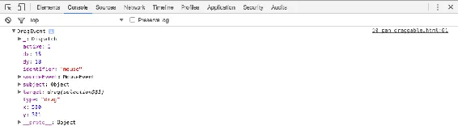
<h6 class="calibre37"><span class="keep-together">Figure 14-10.
</span>Logging the contents of a d3.event</h6>
</div>
</figure>

You can see by the name that this is a drag event (surprise!) that was
triggered by a mouse. `x` and `y` represent the pointer’s coordinates
relative to the enclosing container (`map`, for us). Note that my x/y
values (580, 301) are actually *outside* the boundaries of the
500-by-300 SVG, because I grabbed hold of that map and just simply
wouldn’t let go. If you need to know where the mouse (or finger) is,
look at `x` and `y`.

`dx` and `dy` contain the *amount of change* in x/y-position since the
preceding drag event. That is, `dx`/`dy` tell us how much dragging just
occurred. That’s helpful, as we probably need to know how much dragging
is going on, so we can pan the map by exactly the same amount. In this
example, I moved the mouse 15 pixels horizontally and 18 pixels
vertically.

The way I’ve accomplished this is to grab the projection’s current
`translate()` value and store it in `offset`. I then add the `dx`/`dy`
values to each respective `offset` value, then update the projection
with the new `offset`. This effectively looks at where the map is now,
then scooches it over a bit. Finally, we calculate new `path`s and a new
position for each `circle`.

This approach to updating the map view is called *reprojection*. In this
way, we “move” the map by changing the parameters of the projection, and
then “reprojecting” all the map elements.

</div>

</div>

<div class="section calibre2" data-type="sect2"
pdf-bookmark="Border Problems">

<div id="ch14.xhtml_idm140093180932656" class="dedication">

## Border Problems

Try dragging to one of the country’s borders. Notice that dragging
doesn’t work if you begin the drag in the whitespace beyond the `path`s
and `circle`s (such as in the Pacific or Atlantic Oceans, the Great
Lakes, Canada, or Mexico). The sneaky solution is to create an invisible
background rectangle within the `map` group (onto which drag behavior is
bound).

``` calibre39
//Create a new, invisible background rect to catch drag events
map.append("rect")
   .attr("x", 0)
   .attr("y", 0)
   .attr("width", w)
   .attr("height", h)
   .attr("opacity", 0);
```

The presence of this `rect` effectively ensures that the `map` group now
covers the full surface area of the SVG. So even if there’s no visible
map element present, the `rect` catches any mouse or touch events on
behalf of the group. Of course, the edges of the map are obscured by our
pan buttons, which are “in front” and thus intercept any such events
before they could reach the `map` group.

Yet, we never reposition the `rect`, even when the rest of the map is
moving, such as during `dragging`. We want this hidden rectangle to stay
in place, to catch any future events. It *is* a little weird to have an
element that triggers dragging yet never moves, and to have a group that
consists of elements that all move together except for one, which always
stays in place. Welcome to programming.

Test out *11_pan_draggable_bgrect.html*, in which you can drag and pan
to your heart’s content.<span id="ch14.xhtml_idm140093180503504"
class="calibre5 pcalibre pcalibre2 pcalibre3 pcalibre1"
data-type="indexterm" primary=""
startref="pan14"></span><span id="ch14.xhtml_idm140093180502560"
class="calibre5 pcalibre pcalibre2 pcalibre3 pcalibre1"
data-type="indexterm" primary="" startref="Gpan14"></span>

</div>

</div>

</div>

</div>

<div class="section calibre2" data-type="sect1" pdf-bookmark="Zooming">

<div id="ch14.xhtml_idm140093181611808" class="dedication">

# Zooming

While <span id="ch14.xhtml_Gzoom14"
class="calibre5 pcalibre pcalibre2 pcalibre3 pcalibre1"
data-type="indexterm" primary="geomapping"
secondary="zooming"></span><span id="ch14.xhtml_zoom14"
class="calibre5 pcalibre pcalibre2 pcalibre3 pcalibre1"
data-type="indexterm" primary="zooming (maps)"></span>panning is
essentially just a matter of shifting x/y coordinates, zooming is a bit
more complicated. Fortunately, D3 has
<a href="https://github.com/d3/d3-zoom"
class="calibre5 pcalibre pcalibre2 pcalibre3 pcalibre1"><code
class="calibre23">d3.zoom</code></a>, a behavior parallel to `d3.drag`,
but `d3.zoom` also tracks scroll wheel movement (and trackpad gestural
equivalents) and double-clicks, commonly used to trigger zooming in.
`d3.zoom` translates those inputs to trigger three different events:
`start`, `zoom`, and `end`.

<div class="calibre27 note" data-type="note">

###### Note

`d3.zoom` isn’t just for geographic maps, although I’m introducing it in
this chapter. The behavior can be used to facilitate panning and zooming
for any chart type. See
<a href="https://bl.ocks.org/mbostock/db6b4335bf1662b413e7968910104f0f"
class="calibre5 pcalibre pcalibre2 pcalibre3 pcalibre1">this example</a>
by Mike Bostock as well as
<a href="https://github.com/d3/d3-zoom#d3-zoom"
class="calibre5 pcalibre pcalibre2 pcalibre3 pcalibre1">several
others</a> in the D3 documentation.

</div>

A zoom `d3.event` differs somewhat from a drag `d3.event`. Let’s take a
peek in <a href="#ch14.xhtml_d3event-zoom"
class="calibre5 pcalibre pcalibre2 pcalibre3 pcalibre1"
data-type="xref">Figure 14-11</a>. (Feel free to play along by
uncommenting the related line in *12_zoom.html*, then refreshing and
triggering a zoom event.)

<figure class="calibre35">
<div id="ch14.xhtml_d3event-zoom" class="figure">
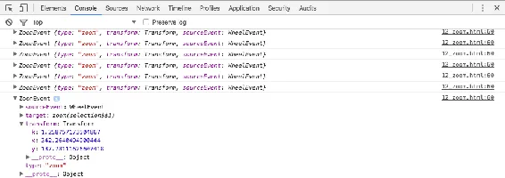
<h6 class="calibre37"><span class="keep-together">Figure 14-11.
</span>Logging the contents of several very zoom-y events</h6>
</div>
</figure>

A zoom event includes a `type` of `zoom` (duh!), a `sourceEvent` to tell
you what triggered the zoom (a `WheelEvent` or, really, my trackpad
gesture, in this case), and—most important for us—a `transform` object
with three very special values: `x`, `y`, and `k`.

`x` and `y` report the amount of translation needed (for panning), while
`k` is a *scale factor*. Taken together, these three values can be used
to define any given pan-and-zoom “view” of your map. So, yes, `d3.zoom`
can do everything `d3.drag` does, and more. For most purposes, if
zooming is required, you can skip `d3.drag` and just let `d3.zoom`
handle the dragging *and* zooming for you.

Another important difference between the two is that, while `d3.drag`
merely reports values (such as `x`/`y` and `dx`/`dy`) when its events
are triggered, the zoom behavior *stores* its transform values (`x`/`y`,
`k`) *on* elements directly. Much like how data is bound to elements,
the zoom’s transform values are also bound to elements, for later use.

To see what I mean, open *12_zoom.html* in your browser. In the console,
type **`map`** or **`d3.select("#map")`** to find our map `g` group.
Several disclosure triangles later, you’ll see a `__zoom` property,
which contains the transform values, as in
<a href="#ch14.xhtml_zoom-prop"
class="calibre5 pcalibre pcalibre2 pcalibre3 pcalibre1"
data-type="xref">Figure 14-12</a>.

<figure class="calibre35">
<div id="ch14.xhtml_zoom-prop" class="figure">
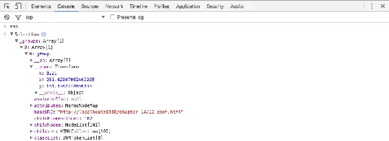
<h6 class="calibre37"><span class="keep-together">Figure 14-12.
</span>Exposing the sneakily hidden zoom transform values</h6>
</div>
</figure>

Fortunately, there is an easier, proper way to retrieve those values for
any given element: `d3.zoomTransform()`. Try typing
**`d3.zoomTransform(map.node())`** in the console. This grabs the `map`
selection’s node (the `g` element itself) and then returns its
associated transform value. In <a href="#ch14.xhtml_zoomtransform"
class="calibre5 pcalibre pcalibre2 pcalibre3 pcalibre1"
data-type="xref">Figure 14-13</a>, I’ve logged the value of
`d3.event.transform` from the intial zoom event, and also keyed in
`d3.zoomTransform(map.node())` manually. You can see that they are the
same values.

<figure class="calibre35">
<div id="ch14.xhtml_zoomtransform" class="figure">
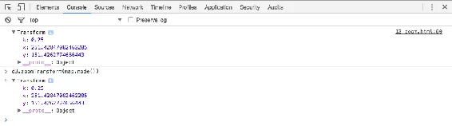
<h6 class="calibre37"><span class="keep-together">Figure 14-13.
</span>Transform values, retrieved two different ways</h6>
</div>
</figure>

Why does zoom work this way? Well, in our example, we have only one
“zoomable” element, the `map` group. But you could imagine a more
complex interaction with multiple zoomable elements, each one
maintaining its own separate zoom state, although using the same zoom
behavior.

Let’s see how to use those transform values. In *12_zoom.html*, I’ve
renamed our `dragging` function to `zooming`:

``` calibre39
//Define what to do when panning or zooming
var zooming = function(d) {

    //Log out d3.event.transform, so you can see all the goodies inside
    //console.log(d3.event.transform);

    //New offset array
    var offset = [d3.event.transform.x, d3.event.transform.y];

    //Calculate new scale
    var newScale = d3.event.transform.k * 2000;

    //Update projection with new offset and scale
    projection.translate(offset)
              .scale(newScale);

    //Update all paths and circles
    svg.selectAll("path")
        .attr("d", path);

    svg.selectAll("circle")
        .attr("cx", function(d) {
            return projection([d.lon, d.lat])[0];
        })
        .attr("cy", function(d) {
            return projection([d.lon, d.lat])[1];
        });

}
```

We use the x and y values to update the projection’s `translate()` value
(easy!). But we also update the projection’s `scale()` at the same time.
Remember, `k` is a *scale factor*, so it can be multiplied against your
default scale, which, in our case, is the arbitrary number 2,000. Try
zooming in and out while logging the transform values to get a feel for
how `k` works.

Later in the code, I’ve replaced `drag` with `zoom`, and `dragging` with
`zooming`:

``` calibre39
//Then define the zoom behavior
var zoom = d3.zoom()
             .on("zoom", zooming);
```

As before, we are ignoring the `start` and `end` events. Here, whenever
a `zoom` event is triggered, the `zooming` function defined earlier will
be called.

Finally, we have to do a little extra legwork to set the initial view.
Now that the zoom behavior is acting on the map, we need to ensure that
the zoom state and the projection state are in sync. So instead of
setting default `translate()` and `scale()` values on the projection, we
define an initial transform manually, and let the zoom behavior
(`zooming`) make any changes to the projection directly.

``` calibre39
//The center of the country, roughly
var center = projection([-97.0, 39.0]);

//Create a container in which all zoom-able elements will live
var map = svg.append("g")
            .attr("id", "map")
            .call(zoom)  //Bind the zoom behavior
            .call(zoom.transform, d3.zoomIdentity  //Then apply the initial transform
                .translate(w/2, h/2)
                .scale(0.25)
                .translate(-center[0], -center[1]));
```

The `center` here is based on arbitrary lon/lat values I selected
manually (using <a href="http://www.teczno.com/squares/#4/39.00/-97.00"
class="calibre5 pcalibre pcalibre2 pcalibre3 pcalibre1">Get Lat+Lon</a>).

Then we `call(zoom)` to bind the zoom behavior to the map.

Lastly (surprise!) we do a special `call()` that applies an initial
transform to the map. To do this, we pass in `zoom.transform` and
`d3.zoomIdentity` with some translate and scale parameters. The values
here are all arbitrary and based on what I felt would make a nice
composition, as seen in <a href="#ch14.xhtml_zoomymap"
class="calibre5 pcalibre pcalibre2 pcalibre3 pcalibre1"
data-type="xref">Figure 14-14</a>. Please tweak the values to see how it
changes the default view.

<figure class="calibre35">
<div id="ch14.xhtml_zoomymap" class="figure">
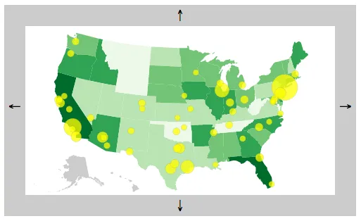
<h6 class="calibre37"><span class="keep-together">Figure 14-14.
</span>The new, awe-inspiring default view</h6>
</div>
</figure>

Try panning and zooming in and out in *12_zoom.html*
(<a href="#ch14.xhtml_mapny"
class="calibre5 pcalibre pcalibre2 pcalibre3 pcalibre1"
data-type="xref">Figure 14-15</a>). It’s so smooth!

<figure class="calibre35">
<div id="ch14.xhtml_mapny" class="figure">
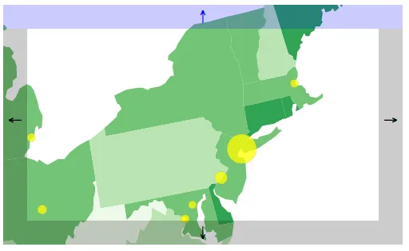
<h6 class="calibre37"><span class="keep-together">Figure 14-15.
</span>Special shout-out to all 8,550,405 residents of NYC</h6>
</div>
</figure>

<div class="section calibre2" data-type="sect2"
pdf-bookmark="Fixing the Pan Buttons">

<div id="ch14.xhtml_idm140093180399904" class="dedication">

## Fixing the Pan Buttons

There’s one problem. Now the pan buttons are broken. Try clicking them
to pan a bit, *then* try dragging or zooming the map. You’ll notice an
abrupt jump—not pretty! The problem is that the pan buttons are still
manually adjusting the projection. But `d3.zoom` is in charge now, so
everything has to go through the zoom behavior, to keep it all in sync.

I’ve fixed the issue in *13_zoom_pan_buttons_fixed.html*. Note the
changes in the `createPanButtons` function. Instead of getting and
setting `projection.translate()` and then reprojecting all our `path`s
and `circle`s, we simply call `translateBy()`, passing in x/y values to
specify how much movement we want to see in each direction.

``` calibre39
//This triggers a zoom event, translating by x, y
map.transition()
    .call(zoom.translateBy, x, y);
```

This *transitions* the entire map into place nicely. Note how the
`transition()` part now lives before `call()`. Yes, this really is
magic.

Finally, please test clicking the pan buttons, then using your mouse to
zoom in and out of the map. It works!

</div>

</div>

<div class="section calibre2" data-type="sect2"
pdf-bookmark="Zoom-y Buttons">

<div id="ch14.xhtml_idm140093180383856" class="dedication">

## Zoom-y Buttons

Why not make zoom buttons, too?

Open *14_zoom_with_buttons.html*, which appears as shown in
<a href="#ch14.xhtml_zoomybuttons"
class="calibre5 pcalibre pcalibre2 pcalibre3 pcalibre1"
data-type="xref">Figure 14-16</a>.

<figure class="calibre35">
<div id="ch14.xhtml_zoomybuttons" class="figure">
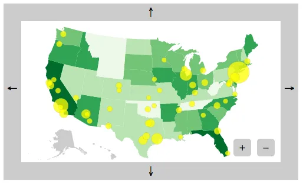
<h6 class="calibre37"><span class="keep-together">Figure 14-16.
</span>Map, now with zoom-ier buttons</h6>
</div>
</figure>

Note that clicking the +/- buttons zooms in or out on the *center* of
the map, even if you’ve dragged, panned, or zoomed the map away from its
starting position. Good stuff.

In the code, I made a new `createZoomButtons()` function, modeled after
`createPanButtons()`. (Shocker!) You can read through the code on your
own, but to summarize, this function:

1.  Creates the buttons

2.  Chooses a `scaleFactor`, either 1.5 (if zooming in) or 0.75 (if
    zooming out)

3.  Calls the zoom function `scaleBy`, passing in `scaleFactor` as a
    parameter

``` calibre39
//This triggers a zoom event, scaling by 'scaleFactor'
map.transition()
    .call(zoom.scaleBy, scaleFactor);
```

Wow, that was almost too easy! (Emphasis on almost.)

</div>

</div>

<div class="section calibre2" data-type="sect2"
pdf-bookmark="Constraining Panning and Zooming">

<div id="ch14.xhtml_idm140093180146528" class="dedication">

## Constraining Panning and Zooming

You may have noticed that your ability to pan and zoom is unlimited.
That is, you could keep panning beyond the border and into empty
whitespace forever, ye olde countrey ne’er to be seen againe. You could
also zoom so far into Kansas farmland you’d never be able to dig your
way out again. Or, worse, zoom out so far that those top 50 US cities
begin to converge on a single point in space, as in
<a href="#ch14.xhtml_toofar"
class="calibre5 pcalibre pcalibre2 pcalibre3 pcalibre1"
data-type="xref">Figure 14-17</a>.

<figure class="calibre35">
<div id="ch14.xhtml_toofar" class="figure">
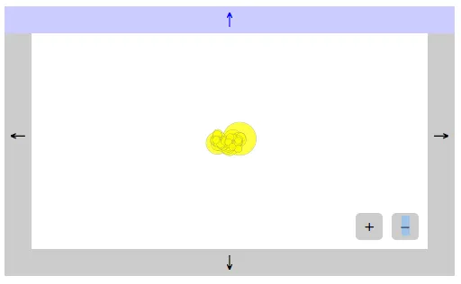
<h6 class="calibre37"><span class="keep-together">Figure 14-17.
</span>If this doesn’t remind you of Powers of Ten, by Charles and Ray
Eames, please take 10 minutes to <a
href="https://www.youtube.com/watch?v=0fKBhvDjuy0"
class="calibre5 pcalibre pcalibre2 pcalibre3 pcalibre1">watch the film
now</a>.</h6>
</div>
</figure>

Fortunately, we can restrict zooming and panning using `scaleExtent()`
and `translateExtent()`, respectively. See this code in action in
*15_extents.html*, and note how D3 will no longer allow you to drift off
into space or otherwise get too lost.

``` calibre39
var zoom = d3.zoom()
             .scaleExtent([ 0.2, 2.0 ])
             .translateExtent([[ -1200, -700 ], [ 1200, 700 ]])
             .on("zoom", zooming);
```

`scaleExtent` takes two values: a minimum and a maximum for `k`.
`translateExtent` takes two arrays of two values each: x1/y1 and x2/y2.
Consider these the upper-left and lower-right corners of the invisible
box in which your users are trapped. (This metaphor works best if your
users are mimes.)

Of course, you can set the extent values to whatever feels right for
your project, given the projection you’re using, the geographic data,
your overall composition and UI, and the sort of interaction you want to
enable. The values here are arbitrary, chosen by me because they worked
for this example.

Note that `translateBy()` and `scaleBy()` respect the scale and
translate extents, so our pan buttons, zoom buttons, and mouse/touch
zoom gestures are all in agreement about what we’re allowed to do.
However, be aware that if you set a transform explicitly—such as by
using `call(zoom.transform, d3.zoomIdentity…)`—the scale and translate
extents are *not* enforced. This can be useful if, say, you need to
constrain user behavior, but also occasionally need to override those
constraints programmatically.

</div>

</div>

<div class="section calibre2" data-type="sect2"
pdf-bookmark="Preset Views">

<div id="ch14.xhtml_idm140093180112736" class="dedication">

## Preset Views

In fact, setting the transform explicitly is what we’ll do next. I like
to think of such pan-and-zoom combinations as “presets” for
visualization. In *16_combo_zoom_pan.html*, I’ve added two buttons, each
of which triggers a preset view. See the new buttons in
<a href="#ch14.xhtml_newbuttons"
class="calibre5 pcalibre pcalibre2 pcalibre3 pcalibre1"
data-type="xref">Figure 14-18</a>.

<figure class="calibre35">
<div id="ch14.xhtml_newbuttons" class="figure">
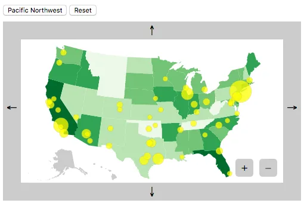
<h6 class="calibre37"><span class="keep-together">Figure 14-18.
</span>Map with new preset buttons</h6>
</div>
</figure>

See what the map looks like after clicking the “Pacific Northwest”
button in <a href="#ch14.xhtml_pnwclicked"
class="calibre5 pcalibre pcalibre2 pcalibre3 pcalibre1"
data-type="xref">Figure 14-19</a>.

<figure class="calibre35">
<div id="ch14.xhtml_pnwclicked" class="figure">
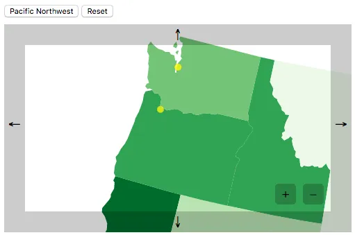
<h6 class="calibre37"><span class="keep-together">Figure 14-19.
</span>After clicking the “Pacific Northwest” button</h6>
</div>
</figure>

Clicking “Reset” restores the original map view. Let’s look at the code
for that button first:

``` calibre39
//Bind 'Reset' button behavior
d3.select("#reset")
    .on("click", function() {

        map.transition()
            .call(zoom.transform, d3.zoomIdentity  //Same as the initial transform
                .translate(w/2, h/2)
                .scale(0.25)
                .translate(-center[0], -center[1]));

});
```

For that, I just copied and pasted the code from when the `map` element
was initially created. To minimize redundancy, you could instead store
the `d3.zoomIdentity` object in a variable for reuse.

The “Pacific Northwest” button logic is the same, just with different
values for the translate and scale parameters.

``` calibre39
//Bind 'Pacific Northwest' button behavior
d3.select("#pnw")
    .on("click", function() {

        map.transition()
            .call(zoom.transform, d3.zoomIdentity
                .translate(w/2, h/2)
                .scale(0.9)
                .translate(600, 300));

});
```

That’s all there is to it. Try adding your own buttons and adjusting the
translate and scale values to make your own preset
views.<span id="ch14.xhtml_idm140093179832720"
class="calibre5 pcalibre pcalibre2 pcalibre3 pcalibre1"
data-type="indexterm" primary=""
startref="zoom14"></span><span id="ch14.xhtml_idm140093179897072"
class="calibre5 pcalibre pcalibre2 pcalibre3 pcalibre1"
data-type="indexterm" primary="" startref="Gzoom14"></span>

</div>

</div>

</div>

</div>

<div class="section calibre2" data-type="sect1"
pdf-bookmark="Value Labels">

<div id="ch14.xhtml_idm140093179896032" class="dedication">

# Value Labels

Let’s <span id="ch14.xhtml_idm140093179880832"
class="calibre5 pcalibre pcalibre2 pcalibre3 pcalibre1"
data-type="indexterm" primary="labels"
secondary="for maps"></span><span id="ch14.xhtml_idm140093179879824"
class="calibre5 pcalibre pcalibre2 pcalibre3 pcalibre1"
data-type="indexterm" primary="maps"
secondary="labeling"></span><span id="ch14.xhtml_idm140093179878880"
class="calibre5 pcalibre pcalibre2 pcalibre3 pcalibre1"
data-type="indexterm" primary="geomapping"
secondary="value labels"></span>conclude this mapping exercise with an
example showing how to place labels on a map.

In <a href="#ch14.xhtml_maplabels"
class="calibre5 pcalibre pcalibre2 pcalibre3 pcalibre1"
data-type="xref">Figure 14-20</a>, you’ll see each state labeled with
its 2004 agricultural productivity value—the numbers also encoded in the
choropleth fills.

<figure class="calibre35">
<div id="ch14.xhtml_maplabels" class="figure">
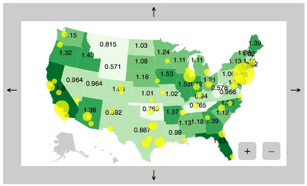
<h6 class="calibre37"><span class="keep-together">Figure 14-20.
</span>Data values, labeled</h6>
</div>
</figure>

Open *17_labels.html* for the code. I created all the new `text`
elements in the usual way (selectAll/data/enter/append); what’s new here
is how the labels are *positioned*:

``` calibre39
//Create one label per state
map.selectAll("text")
    .data(json.features)
    .enter()
    .append("text")
    .attr("class", "label")
    .attr("x", function(d) {
         return path.centroid(d)[0];
    })
    .attr("y", function(d) {
         return path.centroid(d)[1];
    })
    .text(function(d) {
         if (d.properties.value) {
             return formatDecimals(d.properties.value);
         };
    });
```

Note the use of `path.centroid(d)` to get x and y values. `path`
references our `geoPath` generator, and `centroid()` is a special
function to calculate and return the centroid—or “center of mass”—of the
specified geographic (GeoJSON) feature. So, we pass in `d`, and the
function evaluates each feature, returning an x/y pair of values for
each. We use `[0]` to grab the first value for x, and `[1]` to grab the
second value for y. Elsewhere, I applied the CSS rule
`text-anchor: middle`, so in the end, each value label should be
perfectly centered within its own state.

That’s the theory, anyway. Let’s zoom in a bit closer in
<a href="#ch14.xhtml_maplabelsse"
class="calibre5 pcalibre pcalibre2 pcalibre3 pcalibre1"
data-type="xref">Figure 14-21</a> to see.

<figure class="calibre35">
<div id="ch14.xhtml_maplabelsse" class="figure">
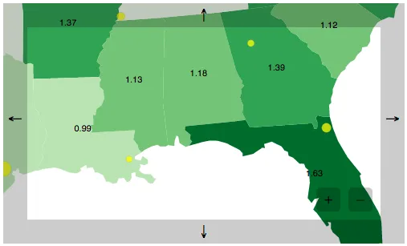
<h6 class="calibre37"><span class="keep-together">Figure 14-21.
</span>Exploring agricultural productivity values in the 2004
southeastern United States</h6>
</div>
</figure>

Centroid-based label positioning works out well for boxy states like
Mississippi (1.13), Alabama (1.18), and Georgia (1.39). But less regular
forms may result in less-than-ideal positioning. Louisiana’s (0.99)
L-shape shifts its centroid to the right, a bit too close to
Mississippi. Florida’s (1.63) panhandle pulls its centroid to the west,
so its value label is just dipping its toes into the Gulf of Mexico.

Still, `centroid()` is ridiculously useful for this purpose. Unless
you’re willing to dive deep into map labeling theory, this approach will
be just fine. (For a great explanation of this problem, read Vladimir
Agafonkin’s <a href="https://www.mapbox.com/blog/polygon-center/"
class="calibre5 pcalibre pcalibre2 pcalibre3 pcalibre1">“A New Algorithm
for Finding a Visual Center of a Polygon”</a>.)

</div>

</div>

<div class="section calibre2" data-type="sect1"
pdf-bookmark="Acquiring and Preparing Raw Geodata">

<div id="ch14.xhtml_idm140093180689888" class="dedication">

# Acquiring and Preparing Raw Geodata

Despite <span id="ch14.xhtml_GEOpars14"
class="calibre5 pcalibre pcalibre2 pcalibre3 pcalibre1"
data-type="indexterm" primary="geomapping"
secondary="acquiring/parsing raw geodata"></span>the impression left by
the preceding examples, not every map is of the United States. The world
encompasses so many more geographic features than US state outlines;
there are other countries, along with their regions, states, provinces,
counties, townships, census tracts, postal codes, and districts. On an
even smaller scale, there are streets, roads, tracks, trails, and
footpaths. The entire planet is fair game for representation on a map.
(There’s no need to limit yourself to *this* planet, for that matter,
although D3’s built-in projections are all understandably
Earth-centric.)

Unfortunately, the messy nature of reality means that the task of
preparing geodata can be *far* more complex than actually creating a map
from that data. I’d like to provide a broad-strokes overview of the
process here, although this summary certainly won’t anticipate every
potential challenge you may face—from flawed data to obscure file
formats and projections.

The essential steps for acquiring and preparing geodata for use with D3
are:

1.  Find shapefiles

2.  Choose a resolution

3.  Simplify the shapes

4.  Convert to GeoJSON

5.  Choose a projection

You have lots of options and decisions to make at each step. Let’s look
at each one in turn.

<div class="section calibre2" data-type="sect2"
pdf-bookmark="Find Shapefiles">

<div id="ch14.xhtml_idm140093179680944" class="dedication">

## Find Shapefiles

Shapefiles <span id="ch14.xhtml_idm140093179679376"
class="calibre5 pcalibre pcalibre2 pcalibre3 pcalibre1"
data-type="indexterm" primary="shapefiles"></span>predate the current
explosion of online mapping and visualization. These are documents that
essentially contain the same kind of information you could store in
GeoJSON—boundaries of geographic areas, and points within those
areas—but their contents are not plain text and, therefore, are very
hard to read. <span id="ch14.xhtml_idm140093179678176"
class="calibre5 pcalibre pcalibre2 pcalibre3 pcalibre1"
data-type="indexterm"
primary="Geographic Information Systems (GIS) software"></span>The
shapefile format grew out of the community of geographers,
cartographers, and scientists using Geographic Information Systems (GIS)
software. If you enjoy using expensive, proprietary GIS software or even
the free and open source <a href="http://qgis.org"
class="calibre5 pcalibre pcalibre2 pcalibre3 pcalibre1">QGIS</a>, then
shapefiles are your best friends. But web browsers can’t make heads or
tails of shapefiles, so, ultimately, we need to convert them to GeoJSON.

Assuming you can’t find a nice GeoJSON file describing your area of
interest, you’ll have to hunt down a shapefile. Government websites are
good sources, especially if you’re looking for data on a specific
country or region. If given the option, choose data projected using the
WGS84 coordinates system, for maximum compatibility with the examples
that follow. Most US-based data will be use WGS84, but international or
highly local shapefiles (such as for individual cities) may use other
coordinates systems.

My favorite two sources are:

<a href="http://www.naturalearthdata.com"
class="calibre5 pcalibre pcalibre2 pcalibre3 pcalibre1">Natural
Earth</a>  
A massive collection of geographic data for both cultural/political and
natural features, made available in the public domain. Mapping countries
is highly political, and Natural Earth posts detailed notes explaining
their design decisions.

<a href="http://bit.ly/2tNyl8h"
class="calibre5 pcalibre pcalibre2 pcalibre3 pcalibre1">The United
States Census</a>  
Boundary data for every US state, plus counties, roadways, water
features, and so much more, also in the public domain.

<div class="calibre29 warning" data-type="warning">

###### Warning

Many sites that offer free “maps,” like
<a href="https://openvectormaps.com"
class="calibre5 pcalibre pcalibre2 pcalibre3 pcalibre1">Open Vector
Maps</a>, provide only images in Illustrator, SVG, or PDF formats. While
these maps have their uses, they are preprojected and prerendered
images—not raw geographic data. For our purposes, don’t settle for
anything less than original shapefiles. (We can project and render our
own maps from data, thank you very much.)

</div>

</div>

</div>

<div class="section calibre2" data-type="sect2"
pdf-bookmark="Choose a Resolution">

<div id="ch14.xhtml_idm140093179668416" class="dedication">

## Choose a Resolution

Before <span id="ch14.xhtml_idm140093179666592"
class="calibre5 pcalibre pcalibre2 pcalibre3 pcalibre1"
data-type="indexterm"
primary="cartographic detail"></span><span id="ch14.xhtml_idm140093179665856"
class="calibre5 pcalibre pcalibre2 pcalibre3 pcalibre1"
data-type="indexterm"
primary="resolution"></span><span id="ch14.xhtml_idm140093179665184"
class="calibre5 pcalibre pcalibre2 pcalibre3 pcalibre1"
data-type="indexterm" primary="vector data"></span>you download, check
the *resolution* of the data. All shapefiles are vector data (not
bitmaps), so by resolution I don’t mean pixels—I mean the level of
*cartographic detail* or <span id="ch14.xhtml_idm140093179663440"
class="calibre5 pcalibre pcalibre2 pcalibre3 pcalibre1"
data-type="indexterm" primary="granularity"></span>granularity.

Natural Earth’s datasets come in three different resolutions, listed
here from most detailed to least:

- 1:10,000,000

- 1:50,000,000

- 1:110,000,000

That is, in the highest resolution data, one unit of measurement in the
file corresponds to 10 million such units in the actual, physical world.
Or, to flip that around, every 10 million units in real life are
simplified into one. So 10 million inches (158 miles) would translate to
a single inch in data terms.

These resolution ratios can be written more simply as:

- 1:10m

- 1:50m

- 1:110m

For a low-detail (“zoomed out”) map of the world, the 1:110m resolution
could work fine. But to show detailed outlines of a specific state,
1:10m will be better. If you’re mapping a very small (“zoomed in”) area,
such as a specific city or even neighborhood, then you’ll need much
higher-resolution data. (Try local state or city government websites for
that information.)

Different sources will offer different resolutions. Many of the US
Census shapefiles are available in these three scales:

- 1:500,000 (1:500k)

- 1:5,000,000 (1:5m)

- 1:20,000,000 (1:20m)

Choose a resolution, and download the file. Typically you’ll get a
compressed ZIP file that contains several other files. As an example,
I’m going to download <a href="http://bit.ly/2uJ4rUT"
class="calibre5 pcalibre pcalibre2 pcalibre3 pcalibre1">Natural Earth’s
1:110m (low detail) ocean file</a>.

Uncompressed, it contains these files:

``` calibre39
ne_110m_ocean.dbf
ne_110m_ocean.prj
ne_110m_ocean.README.html
ne_110m_ocean.shp
ne_110m_ocean.shx
ne_110m_ocean.VERSION.txt
```

Wow, those are some funky extensions. We’re primarily interested in the
file ending with *.shp*, but don’t delete the rest just yet.

</div>

</div>

<div class="section calibre2" data-type="sect2"
pdf-bookmark="Simplify the Shapes">

<div id="ch14.xhtml_idm140093179667792" class="dedication">

## Simplify the Shapes

Ideally, you can find shapefiles in exactly the resolution you need. But
what if you can only find a super-high-resolution file, say at 1:100k?
The size of the file might be huge. And now that you’re a JavaScript
programmer, you’re really concerned about efficiency, remember? So there
will be no sending multimegabyte geodata to the browser.

Fortunately, you can *simplify* those shapefiles, in effect converting
them into lower-detail versions of themselves. The process of
simplification is illustrated beautifully in
<a href="http://bost.ocks.org/mike/simplify/"
class="calibre5 pcalibre pcalibre2 pcalibre3 pcalibre1">this interactive
piece by Mike Bostock</a>. If you’d like to geek out a bit further (of
course you do), explore Jason Davies’s interactive
<a href="https://www.jasondavies.com/simplify/"
class="calibre5 pcalibre pcalibre2 pcalibre3 pcalibre1">Line
Simplification</a> essay, which illustrates the challenges of designing
a good algorithm.

There are lots of options for performing simplification. I’ll detail
two: the easiest one, and a harder (but geekier) one.

<div class="section calibre2" data-type="sect3"
pdf-bookmark="MapShaper">

<div id="ch14.xhtml_idm140093179641648" class="dedication">

### MapShaper

<a href="http://mapshaper.org"
class="calibre5 pcalibre pcalibre2 pcalibre3 pcalibre1">MapShaper</a>,
by <span id="ch14.xhtml_idm140093179639760"
class="calibre5 pcalibre pcalibre2 pcalibre3 pcalibre1"
data-type="indexterm"
primary="Bloch, Matt"></span><span id="ch14.xhtml_idm140093179639024"
class="calibre5 pcalibre pcalibre2 pcalibre3 pcalibre1"
data-type="indexterm" primary="MapShaper"></span>Matt Bloch, is
excellent, easy to use, and indispensable. It lets you upload your own
shapefile, and then drag sliders around to preview different levels of
simplification. Typically, the trade-off is between detail and file
size.

Drag files directly onto the window to add them. At a minimum, add your
*.shp* file, as this includes all the geographic features. If you also
have a *.dbf*, add that, too, as it contains important metadata, like
country IDs and other feature identifiers.

Use Chrome to be able to export your simplified data. MapShaper can
export to a new shapefile or directly to GeoJSON, saving you a step
later. It also exports to TopoJSON (described next) and SVG—I suppose
for when you’re not interested in the raw geographic data, but just want
a preprojected, prerendered map ASAP. Note that MapShaper may assume the
use of the WGS84 coordinates system. If your MapShaper export is coming
out like gibberish, try using ogr2ogr to convert your data to use WGS84
(see “Convert to GeoJSON” below). See the discussion on
<a href="https://github.com/mbloch/mapshaper/issues/96"
class="calibre5 pcalibre pcalibre2 pcalibre3 pcalibre1">this issue</a>
for details.

</div>

</div>

<div class="section calibre2" data-type="sect3" pdf-bookmark="TopoJSON">

<div id="ch14.xhtml_idm140093179634608" class="dedication">

### TopoJSON

TopoJSON refers to three different things: a file format, a command-line
tool, and a JavaScript library, all of them by—*ta-da!*—our hero, Mike
Bostock.

The TopoJSON file format, like GeoJSON, stores geographic features.
Unlike GeoJSON, TopoJSON encodes *topology*, meaning that the
*adjacencies* (relationships) between features are preserved. Picture
California and Nevada, two neighboring states. In GeoJSON, those states
would be captured as two independent features (shapes) that just happen
to sit right next to each other—touching, in fact. This introduces some
redundancy, as all of the points along the very long border between
California and Nevada are actually stored *twice*: once for each state.
Furthermore, GeoJSON has no formal knowledge of the relationship between
these two states (i.e., that they are neighbors and share a border).

In a TopoJSON file, the California/Nevada border would be recorded only
*once*, and the relationship between these two features is maintained.
This can lead to massively smaller file sizes, and incidentally enables
you to do some neat stuff that involves analyzing or manipulating the
topology.

That said, the TopoJSON format can’t be rendered directly in the browser
by D3; we still need GeoJSON for that. So the process of using TopoJSON
looks something like this:

1.  Convert geographic data (shapefile, GeoJSON, or otherwise) to
    TopoJSON, applying simplification or other transformations in the
    process.

2.  Load TopoJSON into the client’s browser along with D3 and your
    project’s code.

3.  Use the TopoJSON JavaScript library to convert back to GeoJSON, for
    rendering with D3 in the usual fashion.

So the trade-off for greater efficiency in file size is the requirement
to load a little more JavaScript, in order to convert that data back to
the (less-compact) GeoJSON. For point of comparison, the oceans data
converted to GeoJSON *without simplification* is about 209 kilobytes; as
TopoJSON, it’s only 49 kilobytes.

If you’re interested in TopoJSON, I strongly recommend reading through
all four parts of Mike Bostock’s <a href="http://bit.ly/2tNGr0V"
class="calibre5 pcalibre pcalibre2 pcalibre3 pcalibre1">Command-Line
Cartography</a> series. <a href="http://bit.ly/2tNS7AE"
class="calibre5 pcalibre pcalibre2 pcalibre3 pcalibre1">Part 3</a>
addresses TopoJSON specifically, but the other parts provide important
context.

If you want to avoid the command line, Shan Carter’s
<a href="http://shancarter.github.io/distillery/"
class="calibre5 pcalibre pcalibre2 pcalibre3 pcalibre1">The
Distillery</a> is a beautiful, frontend interface for uploading GeoJSON
files and converting to TopoJSON. It can perform simplification during
the conversion, and, like MapShaper, provides a nice visual preview. So
you could convert your shapefile to GeoJSON first, then run it through
The Distillery to get simplified TopoJSON. MapShaper now also exports
directly to TopoJSON.

Incidentally, if you go the TopoJSON route and are making a map of world
countries or US counties or states, Mr. Bostock has already kindly
prepared the datafiles for you. See his
<a href="https://github.com/topojson/world-atlas"
class="calibre5 pcalibre pcalibre2 pcalibre3 pcalibre1">world-atlas</a>
and <a href="https://github.com/topojson/us-atlas"
class="calibre5 pcalibre pcalibre2 pcalibre3 pcalibre1">us-atlas</a>
repositories.

</div>

</div>

<div class="section calibre2" data-type="sect3"
pdf-bookmark="Other simplification options">

<div id="ch14.xhtml_idm140093179634016" class="dedication">

### Other simplification options

In case you’re averse to these options for some reason, you might like
one of the following:

- Experiment with the `-simplify` flag in the `ogr2ogr` command-line
  tool introduced in the next section.

- If you’re comfortable using Python, try
  <span id="ch14.xhtml_idm140093179613536"
  class="calibre5 pcalibre pcalibre2 pcalibre3 pcalibre1"
  data-type="indexterm" primary="Migurski, Mike"></span>Mike Migurski’s
  <a href="https://github.com/migurski/Bloch"
  class="calibre5 pcalibre pcalibre2 pcalibre3 pcalibre1">Bloch</a>, a
  Python implementation of Matt Bloch’s simplification algorithms.

- Convert your shapefile to GeoJSON first, in all its richly detailed
  glory, and then use Max Ogden’s
  <a href="https://github.com/maxogden/simplify-geojson"
  class="calibre5 pcalibre pcalibre2 pcalibre3 pcalibre1">simplify-geojson</a>,
  which takes GeoJSON as input (not shapefiles) and generates simplified
  GeoJSON.

</div>

</div>

</div>

</div>

<div class="section calibre2" data-type="sect2"
pdf-bookmark="Convert to GeoJSON">

<div id="ch14.xhtml_idm140093179609680" class="dedication">

## Convert to GeoJSON

By <span id="ch14.xhtml_idm140093179607632"
class="calibre5 pcalibre pcalibre2 pcalibre3 pcalibre1"
data-type="indexterm" primary="GeoJSON"></span>now, you probably already
have a GeoJSON file in front of you, generated as a by-product of the
simplification process. In case you’re still staring at a raw shapefile,
I want to share one more, very hairy method of doing the conversion.
(Hey, you can’t say that I didn’t give you options.)

Please meet <a href="http://www.gdal.org/ogr2ogr.html"
class="calibre5 pcalibre pcalibre2 pcalibre3 pcalibre1"><code
class="calibre23">ogr2ogr</code></a>, a command-line tool with a name
about as friendly as an actual ogre. If you can get `ogr2ogr` running on
your Mac, Unix, or Windows system, you will have access to a free and
open source geodata conversion powerhouse. If your source shapefile uses
an obscure projection, `ogr2ogr` may be your savior. The problem is that
`ogr2ogr` depends on several other frameworks, libraries, and so on, so
for it to work, they all have to be in place.

I won’t cover the intricacies of the installation here, but I’ll point
you in the right <span class="keep-together">direction</span>. If you
can get this installed properly, you earn +15 geek points. If you are
willing to forego the points, you could try
<a href="http://ogre.adc4gis.com"
class="calibre5 pcalibre pcalibre2 pcalibre3 pcalibre1">Ogre</a>, a
web-based client for `ogr2ogr` that requires no download or
installation. Ogre doesn’t do everything that `ogr2ogr` does, but it
should handle most shapefile-to-GeoJSON conversions with no issues.

To continue on the command-line route, your first step is to get
<a href="http://www.gdal.org"
class="calibre5 pcalibre pcalibre2 pcalibre3 pcalibre1">the Geospatial
Data Abstraction Library</a>, or GDAL. The `ogr2ogr` utility is part of
this package.

You also need <a href="http://trac.osgeo.org/geos/"
class="calibre5 pcalibre pcalibre2 pcalibre3 pcalibre1">GEOS</a>, which
cleverly stands for Geometry Engine, Open Source.

If you have a Windows or Unix/Linux machine, you can now have fun
downloading the source and installing it by typing funny commands like
**`build`**, **`make`**, <span class="keep-together">and
**`seriously why isn't this working omg please work this time or i will`**</span>
<span class="keep-together">**`freak out`**</span>.

I don’t remember the exact command names, but they are something like
that. (On a serious note, if you get stuck on this step, be aware that
there are literally entire other O’Reilly books on how to download and
install software packages like this.)

If you’re on a Mac, and you happen to have both Xcode *and* Homebrew
installed, then simply type **`brew install gdal`** into the terminal,
and you’re done! (If you don’t have either of these amazing tools, they
might be worth getting. Both tools are free, but could take some time
and effort on your part to install. Xcode is a massive
<a href="http://bit.ly/XUTt81"
class="calibre5 pcalibre pcalibre2 pcalibre3 pcalibre1">download from
the App Store</a>. Once you have Xcode, Homebrew can, in theory, be
installed with <a href="http://mxcl.github.com/homebrew/"
class="calibre5 pcalibre pcalibre2 pcalibre3 pcalibre1">a simple
terminal command</a>. In my experience, some troubleshooting was
required to get it working.)

To Mac users without Xcode or Homebrew: you are very lucky that some
kind soul has precompiled a friendly GUI installer, which installs GDAL,
GEOS, and several other tools whose names you don’t really need to know.
Look for the newest version of the
<a href="http://www.kyngchaos.com/software/frameworks"
class="calibre5 pcalibre pcalibre2 pcalibre3 pcalibre1">“GDAL Complete”
package</a>. Review the GDAL README file closely. After installation,
you won’t automatically be able to type `ogr2ogr` in a terminal window.
You’ll need to add the GDAL programs to your shell path. The easiest way
to do that is:

- Open a new terminal window.

- Type **`nano .bash_profile`**.

- Paste in
  `export PATH=/Library/Frameworks/GDAL.framework/Programs:$PATH` and
  then Control-X and Control-Y to save.

- Type **`exit`** to end the session, then open a new terminal window
  and type **`ogr2ogr`** to see if it worked.

No matter what system you’re on, once all the tools are installed, open
a new terminal window and navigate to whatever directory contains all
the shapefiles (for example, **`cd ~/ocean_shapes/`**.) Then use the
form:

``` calibre39
ogr2ogr -f "GeoJSON" output.json filename.shp
```

This tells `ogr2ogr` to take `filename`, which should be a *.shp* file,
convert it to GeoJSON, and finally save it as a file called
*output.json*.

For my sample ocean datafile, using `ogr2ogr` looks like the following:

``` calibre39
ogr2ogr -f "GeoJSON" output.json ne_110m_ocean.shp
```

<div class="calibre27 note" data-type="note">

# Converting Coordinates Systems with ogr2ogr

As noted earlier, US-based data often uses the WGS84 coordinates system.
Your data may use something else, especially if it involves another
country (yes, there are other countries) or region (yes, those, too).

If your data uses another coordinates system, you may see garbage output
or crazy lines once you get the GeoJSON into D3. Fortunately, ogr2ogr’s
`-t_srs` flag can be used to convert coordinates systems before doing
the GeoJSON export. In our example, you’d write:

``` calibre63
ogr2ogr -f "GeoJSON" -t_srs crs:84
output.json filename.shp
```

Thanks to Michael Neutze for suggesting this important tip.

</div>

Type that in, and hopefully you see nothing at all.

So anticlimactic! I know, after the hours you spent hacking the command
line to get the ol’ `ogr` installed, you were expecting a grandiose
finale, or at least some sort of confirmation like “Conversion
complete.”

But no, nothing happened at all, except for the appearance of a new file
in the same directory called *output.json*.

Here’s the start of mine:

``` calibre39
{
"type": "FeatureCollection",
"features": [ { "type": "Feature", "properties":
{ "scalerank": 0, "featurecla": "Ocean" },
"geometry": { "type": "Polygon", "coordinates":
    [ [ [ 49.110290527343778, 41.28228759765625 ],
    [ 48.584472656250085, 41.80889892578125 ],
    [ 47.492492675781335, 42.9866943359375 ],
    [ 47.590881347656278, 43.660278320312528 ],
    [ 46.682128906250028, 44.609313964843807 ],
    [ 47.675903320312585, 45.641479492187557 ],
    [ 48.645507812500085, 45.806274414062557 ]
    …
```

Hey, finally, this is starting to look familiar!

</div>

</div>

<div class="section calibre2" data-type="sect2"
pdf-bookmark="Choose a Projection">

<div id="ch14.xhtml_idm140093179608736" class="dedication">

## Choose a Projection

Excitedly, now we copy our new GeoJSON into our D3 directory. I renamed
my file *oceans.json*, copied an earlier map example, and in the D3
code, simply changed the reference from `us-states.json` to
`oceans.json`, producing the result shown in
<a href="#ch14.xhtml_oceans"
class="calibre5 pcalibre pcalibre2 pcalibre3 pcalibre1"
data-type="xref">Figure 14-22</a>.

<figure class="calibre35">
<div id="ch14.xhtml_oceans" class="figure">
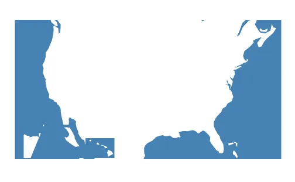
<h6 class="calibre37"><span class="keep-together">Figure 14-22.
</span>GeoJSON showing, um, the world’s oceans?</h6>
</div>
</figure>

Blaaa! What is that?! Whatever it is, you can see it in
*18_oceans.html*.

Now I see the problem: not all projections will work for any given
geometry. My earlier example used `geoAlbersUsa`, but that’s intended
only for the US.

I’ll switch to `geoMercator` instead, but D3 has plenty of
<a href="http://bit.ly/2tNzug5"
class="calibre5 pcalibre pcalibre2 pcalibre3 pcalibre1">other
projections</a> built in, plus
<a href="https://github.com/d3/d3-geo-projection"
class="calibre5 pcalibre pcalibre2 pcalibre3 pcalibre1">a raft of
lesser-used projections</a>. (See this image by Mike Bostock of
<a href="http://bit.ly/2tNvoEO"
class="calibre5 pcalibre pcalibre2 pcalibre3 pcalibre1">every
D3-supported map projection</a> as of July 2016.) Choose whatever is
most appropriate for your project, and note that different projections
may support different parameters and methods than what we’ve seen so far
in `geoAlbersUsa`.

<div class="calibre27" data-type="tip">

###### Tip

Much has been written on how to choose the “best” projection for a given
map. Michael Corey’s <a href="http://bit.ly/2tNrRqc"
class="calibre5 pcalibre pcalibre2 pcalibre3 pcalibre1">“Choosing the
Right Map Projection”</a> is a great place to start.

</div>

Besides changing `geoAlbersUsa` to `geoMercator`, I also adjusted the
`scale()` value, so the whole world now fits within the image, as you
can see in <a href="#ch14.xhtml_oceans2"
class="calibre5 pcalibre pcalibre2 pcalibre3 pcalibre1"
data-type="xref">Figure 14-23</a>.

<figure class="calibre35">
<div id="ch14.xhtml_oceans2" class="figure">
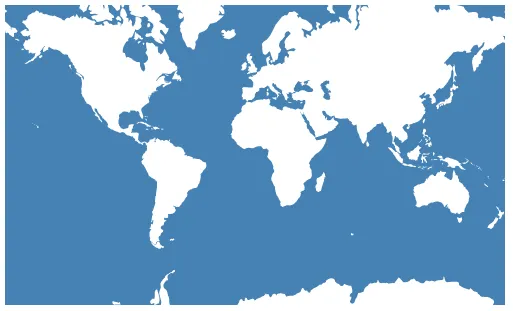
<h6 class="calibre37"><span class="keep-together">Figure 14-23.
</span>GeoJSON of the world’s oceans, now properly projected</h6>
</div>
</figure>

See the result in *19_mercator.html*—oceanic GeoJSON paths, downloaded,
parsed, and visualized. We did
it\!<span id="ch14.xhtml_idm140093179393040"
class="calibre5 pcalibre pcalibre2 pcalibre3 pcalibre1"
data-type="indexterm" primary="" startref="GEOpars14"></span>

</div>

</div>

</div>

</div>

</div>

</div>

<span id="ch15.xhtml"></span>

<div id="ch15.xhtml_sbo-rt-content" class="calibre1">

<div id="ch15.xhtml_idm140093179691728" class="dedication">

