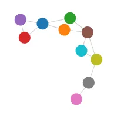
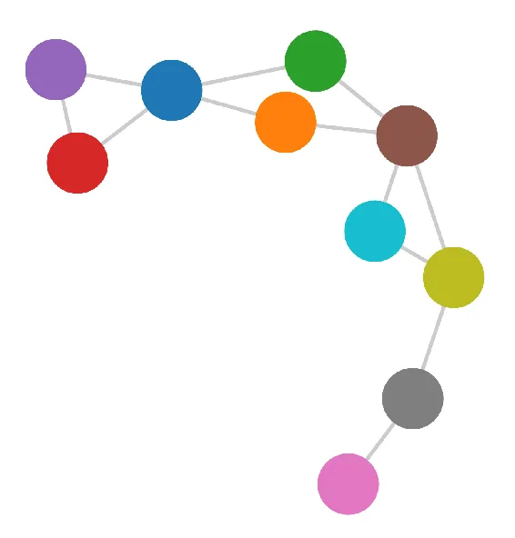
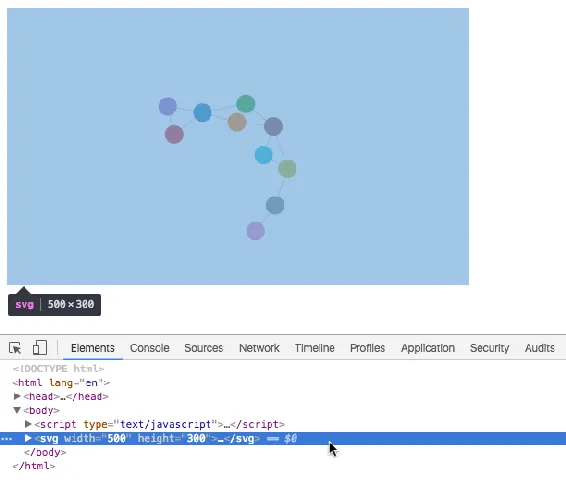
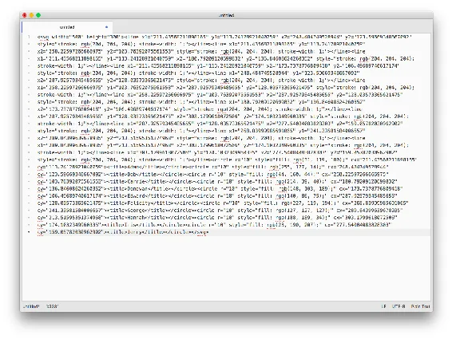
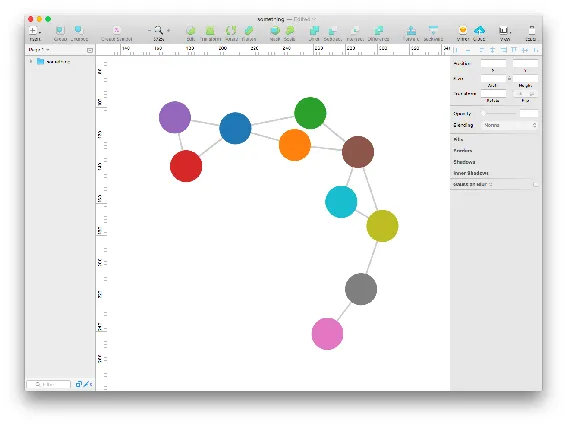
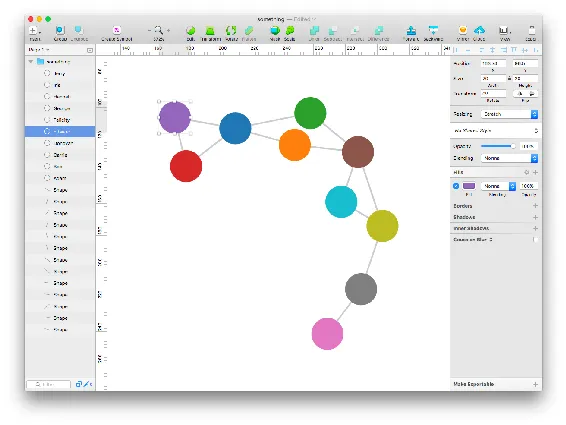
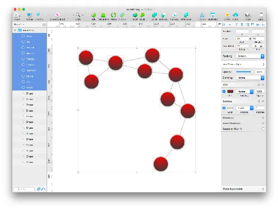

# Chapter 15. Exporting

Sometimes you need to take your
visualization beyond the browser, such as when you’re asked to present
your work in a TED talk or in your first solo show at MoMA.

Here are three easy ways to get D3 visualizations out of D3 and into
formats suitable for other, noninteractive media. D3 has no explicit
“export” function built in (although some people have built their own),
so what follows are simple techniques that will work for any SVG image
in a web browser.

# Bitmaps

The easiest and lowest-quality option is,
obviously, to take a screenshot. Depending on your operating system, you
can do this using the Print Screen button on a PC, or ⌘-Shift-4 on the
Mac. (Drag those crosshairs over the area you want to capture, release,
and check your desktop for a PNG image.)

<a href="#ch15.xhtml_bitmap_export"
class="calibre5 pcalibre pcalibre2 pcalibre3 pcalibre1"
data-type="xref">Figure 15-1</a> is a bitmap screenshot I made using
⌘-Shift-4.

<figure class="calibre35">

<h6 class="calibre37">Figure 15-1. A
PNG screenshot</h6>

</figure>

This is easy and quick, but generates a bitmap image at screen
resolution. So, as you can see, the image won’t scale up nicely, nor
print with sharp edges. This approach is
probably suitable only for reuse
on-screen. (The exception to this is if you have a super high-res
display; then the resolution will be much finer.)

For visualizations that are too large to fit on your screen all at once,
I like the <a href="http://bit.ly/1Nc3qYz"
class="calibre5 pcalibre pcalibre2 pcalibre3 pcalibre1">Awesome
Screenshot</a> extension for Chrome. Awesome Screenshot can capture the
entire page—in effect, scrolling up and down, snapping multiple
screenshots, and then stitching them together into a single image.

# PDF

Portable Document Format documents can contain
vector-based artwork, such as SVG images, so exporting to PDF gives you
a quick, scalable copy of your visualization (see
<a href="#ch15.xhtml_pdf_export"
class="calibre5 pcalibre pcalibre2 pcalibre3 pcalibre1"
data-type="xref">Figure 15-2</a>).

<figure class="calibre35">

<h6 class="calibre37">Figure 15-2. A
PDF maintains the original vector data for clarity</h6>

</figure>

On the
Mac, in your browser, go to File→Print. Then look for the PDF menu, and
choose Save as PDF.

On Windows 10, you can print directly to the “Microsoft Print to PDF”
virtual printer from any application. On older versions of Windows, use
Chrome’s built-in support for PDF export (Print→Save as PDF) or install
a third-party virtual PDF printer.

On Linux, well, it depends on your distribution, but you could also use
Chrome’s built-in PDF support.

# SVG

Finally, you probably realized
that, since we are using D3 to generate images in SVG format, we could
just save out a copy of the SVG image directly. This has all the
benefits of PDF: you maintain the original vector data, it’s scalable,
and you can even bring the results into
<a href="https://www.adobe.com/products/illustrator.html"
class="calibre5 pcalibre pcalibre2 pcalibre3 pcalibre1">Illustrator</a>,
<a href="https://inkscape.org/"
class="calibre5 pcalibre pcalibre2 pcalibre3 pcalibre1">Inkscape</a>,
<a href="https://www.sketchapp.com"
class="calibre5 pcalibre pcalibre2 pcalibre3 pcalibre1">Sketch</a>, or
another SVG-compatible editor and tweak it after the fact. (This is true
to a certain extent for PDF files as well, but depending on the PDF
generator, sometimes elements get grouped and layered in unexpected
ways.)

The simplest way is to copy the SVG code straight out of the DOM (see
<a href="#ch15.xhtml_copy_the_svg"
class="calibre5 pcalibre pcalibre2 pcalibre3 pcalibre1"
data-type="xref">Figure 15-3</a>). First, inspect the SVG element. Click
the element in the web inspector, and then click Copy.

<figure class="calibre35">

<h6 class="calibre37">Figure 15-3.
Copying the D3-generated SVG code from the DOM</h6>

</figure>

Switch back to your text editor, and paste the contents into a new file,
as shown in <a href="#ch15.xhtml_paste_the_svg"
class="calibre5 pcalibre pcalibre2 pcalibre3 pcalibre1"
data-type="xref">Figure 15-4</a>.

<figure class="calibre35">

<h6 class="calibre37">Figure 15-4.
SVG code pasted into a new document</h6>

</figure>

Then just save the file as *something.svg*. Now you can open it up in
Sketch, as shown in <a href="#ch15.xhtml_svg_in_sketch"
class="calibre5 pcalibre pcalibre2 pcalibre3 pcalibre1"
data-type="xref">Figure 15-5</a>, or any other SVG-compatible program.

<figure class="calibre35">

<h6 class="calibre37">Figure 15-5.
Exported SVG opened in Sketch</h6>

</figure>

As you can see in <a href="#ch15.xhtml_edit_the_svg"
class="calibre5 pcalibre pcalibre2 pcalibre3 pcalibre1"
data-type="xref">Figure 15-6</a>, all of the elements remain
individually selectable and editable.

<figure class="calibre35">

<h6 class="calibre37">Figure 15-6.
One SVG element selected</h6>

</figure>

I like to use Sketch because it respects images’ hierarchical structure;
SVG `g` elements are interpreted as “grouped” elements in Sketch. Even
the `title` values, which I’d originally intended as browser tooltips,
appear here, so I can, say, easily select Edward or Felicity. Using `g`s
and `title`s not only keeps your DOM structure tidy and readable—it
makes it so much easier to select elements during manual editing for
print.

For example, it’s now super quick to select all the circles in the
sidebar to apply style changes. In the version shown in
<a href="#ch15.xhtml_edited_svg"
class="calibre5 pcalibre pcalibre2 pcalibre3 pcalibre1"
data-type="xref">Figure 15-7</a>, I’ve made some “enhancements” to my
design. As I always say, when in doubt, use gradients. (To be clear,
this is a joke, and is the *opposite* of what I always say, which is
“Pretty much never use gradients.”)

<figure class="calibre35">

<h6 class="calibre37">Figure 15-7.
Don’t try gradients at home</h6>

</figure>

A shortcut to this whole copy-paste approach is to use Shan Carter’s
<a href="https://nytimes.github.io/svg-crowbar/"
class="calibre5 pcalibre pcalibre2 pcalibre3 pcalibre1">SVG Crowbar</a>,
a Chrome bookmarklet that, with some caveats, extracts an SVG from its
web page with just a single click on your part.

As you can see, there are many options for getting your work out of the
browser, documented, and saved for use in other contexts, whether for
print or for the screen.

