# <span class="keep-together">Chapter 16. </span>Project Walk-Through

You’re <span id="ch16.xhtml_prowalk16"
class="calibre5 pcalibre pcalibre2 pcalibre3 pcalibre1"
data-type="indexterm" primary="project walk-through"></span>nearly a D3
pro! You have already worked your way through a full 118 code examples,
each one illustrating a specific concept or technique. I thought we’d
wrap up our time together with a walk-through of a single, complete D3
project from start to finish, integrating many of the technical concepts
covered earlier, and sharing a few new tips along the way.

Our subject will be electric cars because, let’s be honest: I kind of
want one. (Maybe with a built-in D3 dashboard?)

The sequence we’ll follow to achieve this is as follows:

1.  Prepare the data

2.  Load and parse the data

3.  Render the initial view

4.  Add interactivity

5.  Refine styling

6.  Provide context

For each of these, I’ll highlight the most important steps.

<div class="section calibre2" data-type="sect1"
pdf-bookmark="Prepare the Data">

<div id="ch16.xhtml_idm140093179327168" class="dedication">

# Prepare the Data

Remember <a href="#ch16.xhtml_stacked_area_chart_from_earlier"
class="calibre5 pcalibre pcalibre2 pcalibre3 pcalibre1"
data-type="xref">Figure 16-1</a>,
<span id="ch16.xhtml_idm140093179324608"
class="calibre5 pcalibre pcalibre2 pcalibre3 pcalibre1"
data-type="indexterm" primary="project walk-through"
secondary="data preparation"></span>the stacked area chart from
<a href="#ch13.xhtml_chapter11-layouts"
class="calibre5 pcalibre pcalibre2 pcalibre3 pcalibre1"
data-type="xref">Chapter 13</a>?

<figure class="calibre35">
<div id="ch16.xhtml_stacked_area_chart_from_earlier" class="figure">
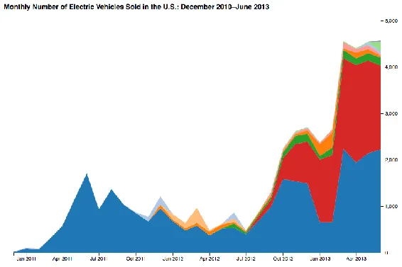
<h6 class="calibre37"><span class="keep-together">Figure 16-1.
</span>Stacked area chart</h6>
</div>
</figure>

Well, I found this data really compelling, but it wasn’t exactly
current, ending at June 2013. It’s 2017, people! Just in the past few
months, we’ve seen many new electric models, including the Model X from
Tesla, the Chevrolet Bolt (the first “affordable” electric car with a
range of over 200 miles—i.e., not a Tesla), and the first-ever plug-in
hybrid minivan (the Chrysler Pacifica). With the growing array of
electric, plug-in hybrid, and other alternative-fuel vehicles, I wanted
to see how many more options we have now, compared to just a few years
ago.

I contacted Yan (Joann) Zhou at Argonne National Laboratory, US
Department of Energy, who graciously provided me with an updated version
of that dataset, including figures through February 2017.

See <a href="#ch16.xhtml_vehicles_data_set"
class="calibre5 pcalibre pcalibre2 pcalibre3 pcalibre1"
data-type="xref">Figure 16-2</a> for a preview of a tiny portion of the
full dataset in *vehicle_sales_data.csv*.

<figure class="calibre35">
<div id="ch16.xhtml_vehicles_data_set" class="figure">
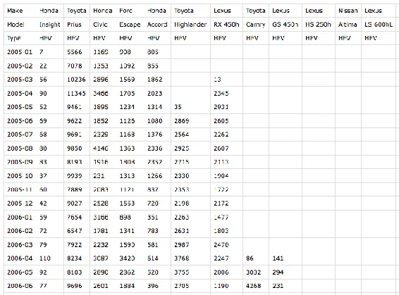
<h6 class="calibre37"><span class="keep-together">Figure 16-2.
</span>Our new dataset</h6>
</div>
</figure>

I’ve restructured this significantly from the original to best fit my
use case with D3. Things to note: the first two rows identify the make
and model of each vehicle, while the third is one of four type values:

- HEV (hybrid electric vehicles—primarily gas-powered, but with
  batteries and electric motors, too)

- PHEV (plug-in hybrid electric vehicles—can be fueled with both
  electricity *and* gas)

- BEV (battery electric vehicles—what we think of as “pure” electric
  cars)

- FCEV (fuel-cell electric vehicles—typically hydrogen-powered)

Each subsequent row captures the number of individual vehicles sold in
the US in a given month. Note that I’ve formatted month values as
YYYY-MM, and empty cells represent zero values (e.g., because the
vehicle had not yet been introduced, or had been discontinued).

</div>

</div>

<div class="section calibre2" data-type="sect1"
pdf-bookmark="Load and Parse the Data">

<div id="ch16.xhtml_idm140093179326608" class="dedication">

# Load and Parse the Data

The <span id="ch16.xhtml_idm140093179307664"
class="calibre5 pcalibre pcalibre2 pcalibre3 pcalibre1"
data-type="indexterm" primary="project walk-through"
secondary="data loading and parsing"></span><span id="ch16.xhtml_idm140093179306688"
class="calibre5 pcalibre pcalibre2 pcalibre3 pcalibre1"
data-type="indexterm" primary="data loading"
secondary="project walk-through example"></span>structure of this new
dataset differs significantly from the simpler one we used in
<a href="#ch13.xhtml_chapter11-layouts"
class="calibre5 pcalibre pcalibre2 pcalibre3 pcalibre1"
data-type="xref">Chapter 13</a>, *ev_sales_data.csv*. You’ll remember
that dataset included a single header row, and all other rows contained
the sales values. Note the excerpt in
<a href="#ch16.xhtml_evehicles_data_set"
class="calibre5 pcalibre pcalibre2 pcalibre3 pcalibre1"
data-type="xref">Figure 16-3</a>.

<figure class="calibre35">
<div id="ch16.xhtml_evehicles_data_set" class="figure">
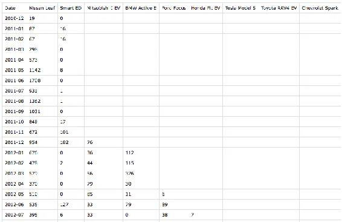
<h6 class="calibre37"><span class="keep-together">Figure 16-3.
</span>Our earlier, e-vehicle dataset</h6>
</div>
</figure>

Unfortunately<span id="ch16.xhtml_idm140093179300800"
class="calibre5 pcalibre pcalibre2 pcalibre3 pcalibre1"
data-type="indexterm" primary="d3.csv()"></span> for us, the `d3.csv()`
method assumes a single header row with column names. Since our *new*
dataset (see <a href="#ch16.xhtml_vehicles_data_set"
class="calibre5 pcalibre pcalibre2 pcalibre3 pcalibre1"
data-type="xref">Figure 16-2</a>) uses a slightly different structure,
we’ll have to do a bit more manual work to load the data in properly.
Follow along with these changes in *01_initial_chart.html*.

First, <span id="ch16.xhtml_idm140093179297072"
class="calibre5 pcalibre pcalibre2 pcalibre3 pcalibre1"
data-type="indexterm" primary="d3.request()"></span>I’m using
<a href="https://github.com/d3/d3-request"
class="calibre5 pcalibre pcalibre2 pcalibre3 pcalibre1"><code
class="calibre23">d3.request()</code></a> to load in the CSV instead of
`d3.csv()`. `d3.csv()` is basically just a preconfigured version of
`d3.request()`, which is a more generic method of loading in any
external file from a URL. With `d3.request()`, we can specify that we’ll
be loading in a CSV file, but it won’t automatically try to parse
anything for us; we’ll just end up with a big, long string.

``` calibre39
//Load in data
d3.request("vehicle_sales_data.csv")
  .mimeType("text/csv")
  .get(function(response) {
       //Do something with the 'response',
       //i.e., the raw CSV file contents.
  });
```

Within `get()`, I’ll<span id="ch16.xhtml_idm140093179276864"
class="calibre5 pcalibre pcalibre2 pcalibre3 pcalibre1"
data-type="indexterm" primary="d3.csvParseRows()"></span> use
`d3.csvParseRows()` to split the big, long string into an array of
strings, with one value per row. (Try uncommenting the `console.log()`
statement to see what this looks like.) Everything after that is just
vanilla JavaScript to extract the values and put them in the structure I
want.

``` calibre39
//
// DATA PARSING
//

//Parse each row of the CSV into an array of string values
var rows = d3.csvParseRows(response.responseText);
// console.log(rows);

//Make dataset an empty array, so we can start adding values
dataset = [];

//Loop once for each row of the CSV, starting at row 3,
//since rows 0-2 contain only vehicle info, not sales values.
for (var i = 3; i < rows.length; i++) {

  //Create a new object
  dataset[i - 3] = {
    date: parseTime(rows[i][0])  //Make a new Date object for each year + month
  };

  //Loop once for each vehicle in this row (i.e., for this date)
  for (var j = 1; j < rows[i].length; j++) {

    var make      = rows[0][j];  //'Make' from 1st row in CSV
    var model     = rows[1][j];  //'Model' from 2nd row in CSV
    var makeModel = rows[0][j] + " " + rows[1][j];  //'Make' + 'Model' will
                                                    // serve as our key
    var type      = rows[2][j];  //'Type' from 3rd row in CSV
    var sales     = rows[i][j];  //Sales value for this vehicle and month

    //If sales value exists…
    if (sales) {
      sales = parseInt(sales);  //Convert from string to int
    } else {  //Otherwise…
      sales = 0;  //Set to zero
    }

    //Append a new object with data for this vehicle and month
    dataset[i - 3][makeModel] = {
      "make": make,
      "model": model,
      "type": type,
      "sales": sales
    };

  }

}

//Log out the final state of dataset
// console.log(dataset);
```

Uncomment that final line to see the `dataset` we just created. Here’s a
snippet of the start of that JSON:

``` calibre39
[{
    "date": "2005-01-01T08:00:00.000Z",
    "Honda Insight": {
        "make": "Honda",
        "model": "Insight",
        "type": "HEV",
        "sales": 7
    },
    "Toyota Prius": {
        "make": "Toyota",
        "model": "Prius",
        "type": "HEV",
        "sales": 5566
    },
    "Honda Civic": {
        "make": "Honda",
        "model": "Civic",
        "type": "HEV",
        "sales": 1169
    },
    …
```

As with the electric vehicle example in
<a href="#ch13.xhtml_chapter11-layouts"
class="calibre5 pcalibre pcalibre2 pcalibre3 pcalibre1"
data-type="xref">Chapter 13</a>, we now have an array of objects, where
each object contains a `date` value, as well as sales values for each
vehicle for that month. The different here is that we’ve grouped
together all the vehicle-related information (make, model, type, sales)
into their own subobjects. Note that I’m using *make + model* as the
*key* for each object. We’ll need those keys in order to correctly
configure the stacking function.

``` calibre39
//
// STACKING
//

//Now that we know the column names in the data,
//get all the keys (make + model), but toss out 'date'
var keys = Object.keys(dataset[0]).slice(1);
// console.log(keys);

//Tell stack function where to find the keys
stack.keys(keys)
    .value(function value(d, key) {
        return d[key].sales;
     });

//Stack the data and log it out
var series = stack(dataset);
// console.log(series);
```

This <span id="ch16.xhtml_idm140093178971056"
class="calibre5 pcalibre pcalibre2 pcalibre3 pcalibre1"
data-type="indexterm" primary="stack()"></span>gets the list of keys and
hands them off to `stack()`. Now that the sales values are nested inside
subobjects, we also have to specify a `value()` accessor, telling
`stack()` that, when it’s time to stack, it should look inside each
subobject for a value called `sales`.

Finally, we call `stack(dataset)` to stack the values, which are
returned into `series`. I encourage you to uncomment the `console.log()`
statements and explore the output.

</div>

</div>

<div class="section calibre2" data-type="sect1"
pdf-bookmark="Render the Initial View">

<div id="ch16.xhtml_idm140093179308640" class="dedication">

# Render the Initial View

Most <span id="ch16.xhtml_idm140093178648096"
class="calibre5 pcalibre pcalibre2 pcalibre3 pcalibre1"
data-type="indexterm" primary="project walk-through"
secondary="rendering initial view"></span>of the actual chart-making
code after that point is unchanged, with one exception: we have to
update the accessor function used within `yScale()`, so the domain’s max
value can be calculated:

``` calibre39
yScale = d3.scaleLinear()
    .domain([
        0,
        d3.max(dataset, function(d) {
            var sum = 0;

            //Loops once for each row, to calculate
            //the total (sum) of sales of all vehicles
            for (var i = 0; i < keys.length; i++) {
                sum += d[keys[i]].sales;  // <-- Added .sales!
            };

            return sum;
        })
    ])
    .range([h - padding, padding / 2])
    .nice();
```

What do you know? It works! Run *01_initial_chart.html* and see
<a href="#ch16.xhtml_initial_chart"
class="calibre5 pcalibre pcalibre2 pcalibre3 pcalibre1"
data-type="xref">Figure 16-4</a> here:

<figure class="calibre35">
<div id="ch16.xhtml_initial_chart" class="figure">
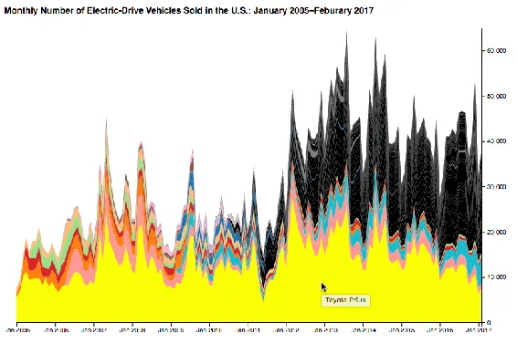
<h6 class="calibre37"><span class="keep-together">Figure 16-4.
</span>The initial chart</h6>
</div>
</figure>

Twelve years of electric-drive vehicle sales in the US—cool! Only it’s a
bit of a mess, visually. What can we learn from this chart? First and
foremost, the Toyota Prius is by far the biggest seller over time. (Note
that it’s at the bottom of the stack because of the sort order we
specified.) Second, 20 colors simply aren’t enough for 92 different
vehicles! Remember, we were pulling colors from `d3.schemeCategory20`,
so after the 20th vehicle, we ran out of colors, and the newly added
areas (at top right) have a default fill of black.

Finally, this chart’s legibility might benefit from a wider aspect
ratio, due to the many layers and sharp peaks and troughs. In
<a href="#ch16.xhtml_wide_chart"
class="calibre5 pcalibre pcalibre2 pcalibre3 pcalibre1"
data-type="xref">Figure 16-5</a>, I’ve set `w` to 1,400 pixels.

<figure class="calibre35">
<div id="ch16.xhtml_wide_chart" class="figure">
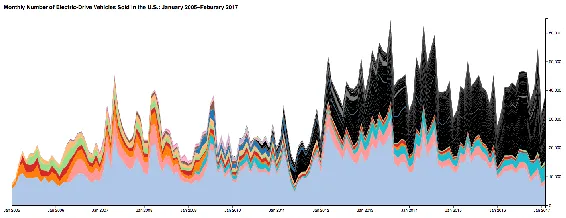
<h6 class="calibre37"><span class="keep-together">Figure 16-5.
</span>The initial chart, widened to 1,400 pixels</h6>
</div>
</figure>

As an experiment, let’s reduce the number of total colors by coloring
each vehicle’s area by `type`: HEV, PHEV, BEV, or FCEV. I updated how
the area fills are set in *02_color_by_type.html*:

``` calibre39
…
.attr("fill", function(d) {

    //Which vehicle is this?
    var thisKey = d.key;

    //What 'type' is this vehicle?
    var thisType = d[0].data[thisKey].type;
    // console.log(thisType);

    //New color var
    var color;

    switch (thisType) {
        case "HEV":
            color = d3.schemeCategory20[0];
            break;
        case "PHEV":
            color = d3.schemeCategory20[1];
            break;
        case "BEV":
            color = d3.schemeCategory20[2];
            break;
        case "FCEV":
            color = d3.schemeCategory20[3];
            break;
    }

    return color;
})
…
```

The weirdest part here is the bit of traversing through the stacked data
series needed to grab `thisType`: peek into the first value of `d`, then
into the `data` object, then look at the values for this vehicle (e.g.,
`"Toyota Prius"`) and get its `type`. The `switch` statement just
assigns one of four colors, depending on the value of `thisType`. (You
could also use an ordinal scale for this part.)

I also made the chart a bit shorter, for less-steep peaks and troughs.
See what that looks like in <a href="#ch16.xhtml_type_colors"
class="calibre5 pcalibre pcalibre2 pcalibre3 pcalibre1"
data-type="xref">Figure 16-6</a>.

<figure class="calibre35">
<div id="ch16.xhtml_type_colors" class="figure">
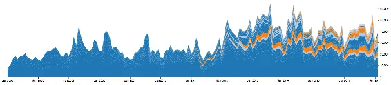
<h6 class="calibre37"><span class="keep-together">Figure 16-6.
</span>Vehicles, colored by type</h6>
</div>
</figure>

This is better! There is still a lot going on, but we can make out some
trends: there is a lot more dark blue than light blue, and an increasing
amount of orange, starting in early 2011.

By mousing over the various colors, you’ll note that dark blue
represents HEVs, light blue are PHEVs, and orange are BEVs. There are so
few FCEVs that you’ll have to zoom waaaaaaay in to see them.

It would be nicer, though, to group all vehicles of each type together.
Luckily for me, the sort I used in the initial dataset was first by
type, then by date of first sales. So,
<span id="ch16.xhtml_idm140093178446864"
class="calibre5 pcalibre pcalibre2 pcalibre3 pcalibre1"
data-type="indexterm" primary="order()"></span>by simply commenting out
the `order()` method, I’ll get the default sorting, which is to say no
sorting at all, on D3’s part. Values will appear in the order of
appearance in the raw CSV. (If you wanted a custom sort, you could
either re-sort your initial, or re-sort values once they’ve been parsed
and stored in `dataset`, or specify a custom <a
href="https://github.com/d3/d3-shape/blob/master/README.md#stack_order"
class="calibre5 pcalibre pcalibre2 pcalibre3 pcalibre1">stacking
order</a>.)

``` calibre39
//Set up stack method
var stack = d3.stack();
              //.order(d3.stackOrderDescending);
```

See the result in *03_sorted_by_type.html* and
<a href="#ch16.xhtml_sorted_by_type"
class="calibre5 pcalibre pcalibre2 pcalibre3 pcalibre1"
data-type="xref">Figure 16-7</a>.

<figure class="calibre35">
<div id="ch16.xhtml_sorted_by_type" class="figure">
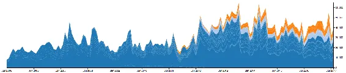
<h6 class="calibre37"><span class="keep-together">Figure 16-7.
</span>Vehicles, sorted by type</h6>
</div>
</figure>

Better! I can see at a glance the overall increase in electric-drive
vehicles over the last 12 years, as well as the gradually increasing
share taken by PHEVs and BEVs.

</div>

</div>

<div class="section calibre2" data-type="sect1"
pdf-bookmark="Add Interactivity">

<div id="ch16.xhtml_idm140093178649200" class="dedication">

# Add Interactivity

There’s <span id="ch16.xhtml_idm140093178324224"
class="calibre5 pcalibre pcalibre2 pcalibre3 pcalibre1"
data-type="indexterm" primary="project walk-through"
secondary="adding interactivity"></span><span id="ch16.xhtml_Iproj16"
class="calibre5 pcalibre pcalibre2 pcalibre3 pcalibre1"
data-type="indexterm" primary="interactivity"
secondary="project walk-through example"></span>a sort of hierarchy of
meaning here: four categories of `type`s of vehicles first, followed by
the individual vehicles (makes + models) themselves. Let’s clean up the
visuals to reflect that, and introduce some interactivity to enable
users to drill down, moving from a broad, initial view to a very
specific detailed view.

In *04_types_only.html*, I’ve duplicated, then modified, some of the
data parsing code to create a secondary, derived `typeDataset`. Instead
of including sales figures for each individual vehicle, this rolls up
sums of each `type` per monthly period, and then generates four areas,
one for each `type`. This requires configuring a second stacking
function, and of course generating a second set of `path`s using the
selectAll/data/enter/append pattern. See the result in
<a href="#ch16.xhtml_types_only"
class="calibre5 pcalibre pcalibre2 pcalibre3 pcalibre1"
data-type="xref">Figure 16-8</a>.

<figure class="calibre35">
<div id="ch16.xhtml_types_only" class="figure">
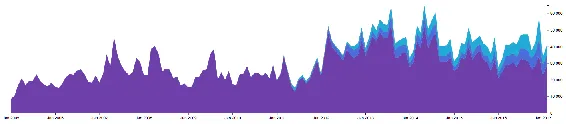
<h6 class="calibre37"><span class="keep-together">Figure 16-8.
</span>Four areas, one for each of the four types</h6>
</div>
</figure>

For sanity, I’ve grouped these new areas in a group with the ID of
`types`, and moved the individual vehicle areas into a group with the ID
of `vehicles`. I also gave the new areas vividly different colors, and
attached behavior, so if you click anywhere on `#types`, those areas
will fade away to reveal the `#vehicles` beneath—so it looks exactly
like <a href="#ch16.xhtml_sorted_by_type"
class="calibre5 pcalibre pcalibre2 pcalibre3 pcalibre1"
data-type="xref">Figure 16-7</a>.

What I’d *really* like is the ability to click any type, have the other
types fade away, transition the selected type to a zero baseline, and
then reveal all the individual vehicles within that type—sort of like
“zooming in” to a category to reveal more detail. Let’s take that a step
at a time.

In *05_click_transition.html*, I’ve modified the click functionality so
clicking any `path` within the `#types` group:

- Identifies which `type` was clicked.

- Generates a new dataset with all-zero values, except for the clicked
  type. (For example, clicking the BEV area will generate zero values
  for HEV, PHEV, and FCEV, but will carry over the original BEV values.)

- Stacks the newly generated dataset (even though there’s now
  effectively just a single “layer”).

- Binds the new stacked dataset to the existing paths, overwriting any
  old bound data.

- Transitions the paths into their new positions (effectively flattening
  all but one of them).

- Updates `yScale` to reflect a new max domain value.

- Transitions the paths (yes, again!) into their new positions,
  reflecting `yScale`’s new domain.

Try *05_click_transition.html* out for yourself, and you’ll see why I
wanted two separate transitions. The first simply collapses the areas
along the baseline, as you can see in
<a href="#ch16.xhtml_transition_one"
class="calibre5 pcalibre pcalibre2 pcalibre3 pcalibre1"
data-type="xref">Figure 16-9</a>.

<figure class="calibre35">
<div id="ch16.xhtml_transition_one" class="figure">
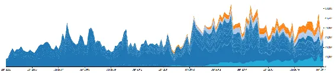
<h6 class="calibre37"><span class="keep-together">Figure 16-9.
</span>After the first transition, the BEV area is visible, while the
others have flattened out</h6>
</div>
</figure>

The second transition expands the clicked area vertically, to reveal its
details more clearly, as in <a href="#ch16.xhtml_transition_two"
class="calibre5 pcalibre pcalibre2 pcalibre3 pcalibre1"
data-type="xref">Figure 16-10</a>.

<figure class="calibre35">
<div id="ch16.xhtml_transition_two" class="figure">
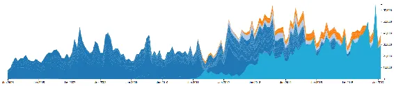
<h6 class="calibre37"><span class="keep-together">Figure 16-10.
</span>After the second transition, the BEV area has grown to fit the
new yScale</h6>
</div>
</figure>

Yes, the individual vehicle areas are still visible in the background;
that’s an issue, and we’ll address it shortly.

But first I want to point out that we did something new here: we
*staged* transitions, running one after another. We discussed one way to
do this in <a href="#ch09.xhtml_updates-chapter9"
class="calibre5 pcalibre pcalibre2 pcalibre3 pcalibre1"
data-type="xref">Chapter 9</a>, but this example introduces *named*
transitions:

``` calibre39
//Store this transition in a new variable for later reference.
var areaTransitions = paths.transition()
    .duration(1000)
    .attr("d", area);

//…update yScale…

//Append this transition to the one already in progress.
areaTransitions.transition()
    .delay(200)
    .duration(1000)
    .attr("d", area);
```

When we initiate the first transition, we store a reference to it in
`areaTransitions`. This gets the paths moving down, toward the baseline.
Then we update the `yScale`. Following that, we tack a second transition
on to `areaTransitions`. This schedules the second transition to run as
soon as the first one is completed. By the time the second transition
runs, the `yScale` domain will have been updated—the result being that
the target height for the clicked area is now taller: it expands to fill
the space. Hooray!

Better make sure the y-axis is updated, too, to reflect the new y scale!
In *06_update_axis.html*, I added some more transition code, using
`on()` to specify that the axis transition should execute at the same
time as the clicked area is expanding.

``` calibre39
areaTransitions.transition()
    .delay(200)
    .on("start", function() {

        //Transition axis to new scale concurrently
        d3.select("g.axis.y")
            .transition()
            .duration(1000)
            .call(yAxis);

	})
    .duration(1000)
    .attr("d", area);
```

It’s easier to see this in action by running *06_update_axis.html*, but
note the final result—with a y-axis that tops out around 13,000—in
<a href="#ch16.xhtml_updated_y_axis"
class="calibre5 pcalibre pcalibre2 pcalibre3 pcalibre1"
data-type="xref">Figure 16-11</a>.

<figure class="calibre35">
<div id="ch16.xhtml_updated_y_axis" class="figure">
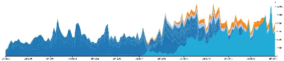
<h6 class="calibre37"><span class="keep-together">Figure 16-11.
</span>Y-axis, transitioned</h6>
</div>
</figure>

Try clicking any of the other categories (HEV, PHEV, or even the very
tiny FCEV) and note that the y-axis scales accordingly.

<div class="calibre27 note" data-type="note">

###### Note

**Exercise:** In addition to updating the y-scale, also update the
x-scale’s domain to fit the extent of the selected type, then transition
all paths to fit the new scale.

</div>

So far, the vehicles’ areas are still just sitting still, making a mess
of the chart background. It’s time to address this by incorporating them
into our silky smooth sequence of transitions. I’ll start by applying
`.attr("opacity", 0)` to the vehicle areas, and `.attr("opacity", 1)` to
the type ones, for consistency. Then we’ll be able to dial opacity
values up and down to reveal and hide areas as needed. I’ve done that in
<a href="#ch16.xhtml_hidden_vehicle_areas"
class="calibre5 pcalibre pcalibre2 pcalibre3 pcalibre1"
data-type="xref">Figure 16-12</a>—the vehicles are still there; you just
can’t see them.

<figure class="calibre35">
<div id="ch16.xhtml_hidden_vehicle_areas" class="figure">
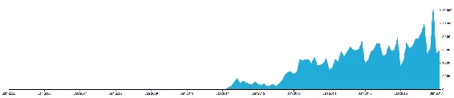
<h6 class="calibre37"><span class="keep-together">Figure 16-12.
</span>Hidden vehicle areas</h6>
</div>
</figure>

Next, I want the BEV area to fade out, revealing individual BEV vehicles
beneath. To do that, I first need to get the BEV vehicles into position,
while hiding all the other vehicles. Now, I could fudge the dataset a
bit, as I did with the type categories, copying the original dataset and
dropping in zero values for everything I want to hide. I took that hacky
approach earlier because, well, I didn’t want to have to complicate
matter by updating the stacking function configuration. Unfortunately,
it is time to complicate matters.

See *07_hide_reveal_vehicles.html*, which appears as shown in
<a href="#ch16.xhtml_proper_transition"
class="calibre5 pcalibre pcalibre2 pcalibre3 pcalibre1"
data-type="xref">Figure 16-13</a> after we click the BEV category.

<figure class="calibre35">
<div id="ch16.xhtml_proper_transition" class="figure">
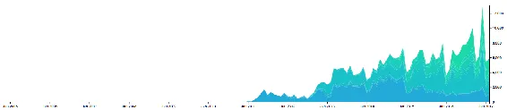
<h6 class="calibre37"><span class="keep-together">Figure 16-13. </span>A
proper sequence of transitions, in which vehicle areas are visible at
the end</h6>
</div>
</figure>

This includes the following changes:

- Moved data stacking and creation of vehicle areas, so it no longer
  happens immediately on page load, but only later, after a type
  category is clicked.

- Modified the stacking function so it only stacks data for vehicles of
  the selected type. This is a more proper solution than zeroing out
  values for unwanted areas; with this approach, only the data we want
  is bound using the selectAll/data/enter/append pattern, so there are
  no “hidden” vehicle areas.

- Added to the transition sequence, so the newly created vehicle areas
  are made fully opaque (visible) immediately before the obscuring type
  area is faded out.

- Applied a new CSS rule of `cursor: pointer` on all areas. This has the
  effect of changing the mouse to a finger-pointing hand icon on hover—a
  nice visual indicator that something is clickable.

- Applied a new class of `unclickable` when any type category is
  clicked. In the CSS, `.unclickable` items are set to
  `pointer-events: none`, which lets any such events (like clicking or
  hovering) pass right through them. For us, this is an easy way to
  prevent multiple clicks from interrupting our silky-smooth transition
  process. So if you click the BEV area, clicking it again (or quickly
  clicking any of the other areas, before they collapse) won’t trigger
  repeat click events, which could confuse matters.

- Added a little magic leveraging <a href="http://bit.ly/2tNyp8f"
  class="calibre5 pcalibre pcalibre2 pcalibre3 pcalibre1"><code
  class="calibre23">d3.interpolateCool()</code></a> to choose similarly
  pretty colors for the newly created vehicle areas.

Mousing over individual vehicles reveals some interesting detail, as in
<a href="#ch16.xhtml_prius_phev"
class="calibre5 pcalibre pcalibre2 pcalibre3 pcalibre1"
data-type="xref">Figure 16-14</a>, where you can see sales of the Prius
plug-in hybrid fluctuate, then taper off to nearly zero in late 2015,
resuming again a year later.

<figure class="calibre35">
<div id="ch16.xhtml_prius_phev" class="figure">
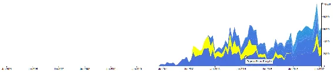
<h6 class="calibre37"><span class="keep-together">Figure 16-14.
</span>The magical Prius plug-in sales disappearing act</h6>
</div>
</figure>

I’d like to be able to “zoom in” on an individual vehicle, removing the
context of other vehicles of the same type, and setting this vehicle
area’s baseline values to zero. This would give us a more “honest” view
of a single vehicle, without the wiggly perceptual challenges of the
stack.

I’ve implemented that in *08_zoom_to_vehicle.html*. Try clicking an area
first, then an individual vehicle. Here’s what happens next:

- All other vehicle areas fade out. (They actually remain in place,
  though are invisible; I’ll want to restore them later.)

- The clicked area is transitioned downward, to have a flat (zero)
  baseline.

- A new y-scale domain, based on the sales for this vehicle only, is
  calculated and set.

- The clicked area and y-axis are transitioned into place, to fit the
  new domain.

See what that looks like after clicking the Prius plug-in hybrid, in
<a href="#ch16.xhtml_prius_phev_clicked"
class="calibre5 pcalibre pcalibre2 pcalibre3 pcalibre1"
data-type="xref">Figure 16-15</a>.

<figure class="calibre35">
<div id="ch16.xhtml_prius_phev_clicked" class="figure">
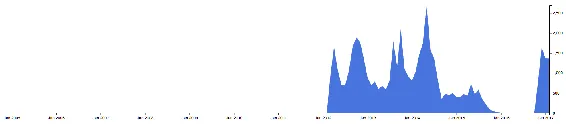
<h6 class="calibre37"><span class="keep-together">Figure 16-15.
</span>The magical Prius plug-in sales disappearing act, standing alone
on a zero baseline</h6>
</div>
</figure>

Nice! This is certainly a clearer view of this individual series of
values. Of course, I can’t explain why this vehicle seems to vanish from
the market for about a year: that would require reporting, research, and
industry knowledge. But our visualization has led me to this one
question, at least, and more exploring should trigger even more
questions.

All the new code in *08_zoom_to_vehicle.html* is tucked into a `click`
behavior bound to each vehicle area:

``` calibre39
//Which vehicle was clicked?
var thisType = d.key;

//Fade out all other vehicle areas
d3.selectAll("g#vehicles path")
    .classed("unclickable", "true")  //Prevent future clicks
    .filter(function(d) {  //Filter out 'this' one
        if (d.key !== thisType) {
            return true;
        }
    })
    .transition()
    .duration(1000)
    .attr("opacity", 0);

//Define area generator that will be used just this one time
var singleVehicleArea = d3.area()
    .x(function(d) { return xScale(d.data.date); })
    .y0(function(d) { return yScale(0); })  //Note zero baseline
    .y1(function(d) { return yScale(d.data[thisType].sales); });
    //Note y1 uses the raw 'sales' value for 'this' vehicle,
    //not the stacked data values (e.g., d[0] or d[1]).

//Use this new area generator to transition the area downward,
//to have a flat (zero) baseline.
var thisAreaTransition = d3.select(this)
    .transition()
    .delay(1000)
    .duration(1000)
    .attr("d", singleVehicleArea);

//Update y-scale domain, based on the sales for this vehicle only
yScale.domain([
        0,
        d3.max(dataset, function(d) {
            return d[thisType].sales;
        })
    ]);

//Transitions the clicked area and y-axis into place, to fit the new domain
thisAreaTransition
    .transition()
    .duration(1000)
    .attr("d", singleVehicleArea)
    .on("start", function() {

        //Transition axis to new scale concurrently
        d3.select("g.axis.y")
            .transition()
            .duration(1000)
            .call(yAxis);

    })
    .on("end", function() {
        //Restore clickability (is that a word?)
        d3.select(this).classed("unclickable", "false");
    });
```

I’ll draw your attention to the `singleVehicleArea` area generator,
which I’ve employed here as yet another possible solution to the problem
of how to transition from displaying several stacked areas to showing
only a single area. You’ll remember that for the type areas, my hacky
solution was to overwrite the data bound to unwanted areas with zeros,
so some areas were present, if hidden from view. Later, when generating
the vehicle areas, I generated a subset of the data (vehicles for only
one type), then stacked and bound that data. So there were no “hidden”
vehicles, until I faded some of them out on click.

Here, I’ve avoided both fudging a dataset (with zeros) and also
generating and re-binding a subset of the original dataset. Instead, I
made a new area generator, `singleVehicleArea`, whose value accessors
are defined such that the baseline `y0` is always zero (with no changes
to the bound dataset) and the topline `y1` simply references the
*original* data values (already bound to each area) instead of the
*stacked* values. Instead of messing with the data, I messed with the
function that defines how the area is calculated and displayed.

I’m belaboring this point to illustrate that there are always lots of
possible solutions to achieving the same results. Purists may feel that
you should avoid fudging or re-binding datasets—and maybe they’re right.
But I think you should choose whatever solutions make the most sense to
you, given your familiarity with D3, your conceptualization of the
project and its internal logic, and the challenge at hand.

Everyone feel better? Okay, I’m ready to move beyond this Prius plug-in
and look at something else.

But—uh oh, we’re trapped: there’s no user path *back* to the prior view,
or the one before that, other than reloading the page.

It might be time to start tracking state; otherwise, things could get
really messy, really fast. Okay, fine: messi*er*. This charts has
essentially three main views, which I’ll store in a new, global
variable:

``` calibre39
//Tracks view state.  Possible values:
// 0 = default (vehicle types)
// 1 = vehicles (of one type)
// 2 = vehicle (singular)
var viewState = 0;
```

These state values don’t account for the in-between states during
transitions, but that’s okay for our purposes. Let’s start `viewState`
at zero. Then, when a type area is clicked, we set `viewState` to one
and transition to that view. When an individual vehicle is clicked, we
set `viewState` to two and transition to that view.

Let’s also create a new “back button” element in the SVG. It’s hidden
initially, but once we enter view states 1 or 2, we make the back button
visible and clickable. Clicking the back button will decrement
`viewState` and trigger transitions to move “back” to the preceding
views.

At a high level, the back button logic will look like this:

``` calibre39
//Define click behavior
backButton.on("click", function() {
    if (viewState == 1) {
        //Go back to default view
    } else if (viewState == 2) {
        //Go back to vehicles view
    }
});
```

Try running *09_back_button.html* and note the new back button, as shown
in <a href="#ch16.xhtml_back_button"
class="calibre5 pcalibre pcalibre2 pcalibre3 pcalibre1"
data-type="xref">Figure 16-16</a>.

<figure class="calibre35">
<div id="ch16.xhtml_back_button" class="figure">
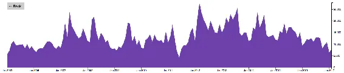
<h6 class="calibre37"><span class="keep-together">Figure 16-16.
</span>Looking at the traditional, HEV Prius—with back button!</h6>
</div>
</figure>

Explore the `backButton` click event code in *09_back_button.html*, and
you’ll note that it essentially does the same steps we did earlier, but
in reverse. I sped things up a bit and combined some transitions, so
clicking back wouldn’t feel quite so tedious.

One addition, however, is a new global variable for tracking which type
is being viewed:

``` calibre39
//Tracks most recently viewed/clicked 'type'.  Possible values:
//"HEV", "PHEV", "BEV", "FCEV", or undefined
var viewType;
```

This simplified the logic for moving from `viewState` 2 back to 1.

Also note that in this example I included a new function,
`toggleBackButton`:

``` calibre39
var toggleBackButton = function() {

        //Select the button
        var backButton = d3.select("#backButton");

        //Is the button hidden right now?
        var hidden = backButton.classed("unclickable");

        //Decide whether to reveal or hide it
        if (hidden) {

        //Reveal it
        backButton.classed("unclickable", false)
            .transition()
            .duration(500)
            .attr("opacity", 1);

    } else {

        //Hide it
        backButton.classed("unclickable", true)
            .transition()
            .duration(200)
            .attr("opacity", 0);

    }

};
```

Since the new back button does a lot of fading in and out, it made sense
to centralize the code for handling this in a single place. Then I can
call `toggleBackButton()` as needed, at other points in the code. And
because `toggleBackButton` keeps track of the button’s state itself
(visible or not), there’s no need for awareness of that state whenever
the function is called.

You already know that redundancy in code is not optimal, so to speak.
And you’ve noticed by now that the code for this example is quite messy,
with many layers deep into click functions, transitions, and otherwise.
Yet this book is here to help you learn D3, not code optimization, so,
yes, that gets me off the hook. Besides, my perspective is you should
always write what makes sense to *you* first, then worry about the
computer later.

<div class="calibre27 note" data-type="note">

###### Note

**Exercise:** Clean up my code! There’s lots of stuff in each of the
many click and callback functions. Where is there redundancy, or at
least some overlap? What could be extracted into its own function? Use
`toggleBackButton` as a model for how functionality can live separately
from the place where it’s called. Could the entire project be rewritten
with concise and meaningful function names?

``` calibre63
loadTheData();
parseTheData();
generateInitialChart();
defineInteractiveBehaviors();
```

Find a balance of abstraction and legibility that works for you. More
abstraction is not always better, or worth your while! But the right
amount can keep your code comprehensible and your mind
calm.<span id="ch16.xhtml_idm140093177617728"
class="calibre5 pcalibre pcalibre2 pcalibre3 pcalibre1"
data-type="indexterm" primary="" startref="Iproj16"></span>

</div>

</div>

</div>

<div class="section calibre2" data-type="sect1"
pdf-bookmark="Refine Styling">

<div id="ch16.xhtml_idm140093178322768" class="dedication">

# Refine Styling

*10_refine_styling.html* is <span id="ch16.xhtml_idm140093177615888"
class="calibre5 pcalibre pcalibre2 pcalibre3 pcalibre1"
data-type="indexterm" primary="project walk-through"
secondary="visual refinements"></span>functionally the same, but with
some visual refinements to hover states and the back button. Note that
the text of the back button now changes dynamically, depending on the
`viewState` and `viewType`, as you can see in
<a href="#ch16.xhtml_refined_style"
class="calibre5 pcalibre pcalibre2 pcalibre3 pcalibre1"
data-type="xref">Figure 16-17</a>.

<figure class="calibre35">
<div id="ch16.xhtml_refined_style" class="figure">
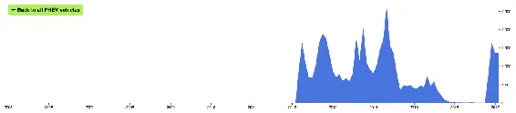
<h6 class="calibre37"><span class="keep-together">Figure 16-17.
</span>Dynamic text used for back button</h6>
</div>
</figure>

“Back to all *x* vehicles” provides more navigational direction than
just “Back.” To accommodate the changing text, I also update the width
of the back button’s background rectangle.

``` calibre39
//Resize button depending on text width
var rectWidth = Math.round(backButton.select("text").node().getBBox().width + 16);
backButton.select("rect").attr("width", rectWidth);
```

To set `rectWidth`, we get the width value from the bounding box
dimensions of the SVG `text` node. We add 16 to that (an arbitrary
value, for some horizontal visual padding) and then round the result
(for a nice, clean edge on the `rect`).

<div class="calibre27 note" data-type="note">

###### Note

**Exercise:** For more navigational guidance, try creating a new text
box that describes the user’s current view. For example, it could read
“Chevrolet Volt (PHEV)” or “Mercedes B-Class (PHEV).” This would reduce
the current dependence on hover tooltips, which don’t work on mobile,
and which are deactivated when `pointer-events: none` is applied.

The text box could be either an SVG `text` element, or a `div` or `p`
that lives outside of the SVG. Consider assigning it a unique ID, then
updating its contents as the view changes, using something like
`d3.select("#myTextBox").text(…)`.

</div>

</div>

</div>

<div class="section calibre2" data-type="sect1"
pdf-bookmark="Provide Context">

<div id="ch16.xhtml_idm140093177457520" class="dedication">

# Provide Context

You <span id="ch16.xhtml_idm140093177456368"
class="calibre5 pcalibre pcalibre2 pcalibre3 pcalibre1"
data-type="indexterm" primary="project walk-through"
secondary="integrating charts for context"></span><span id="ch16.xhtml_idm140093177455392"
class="calibre5 pcalibre pcalibre2 pcalibre3 pcalibre1"
data-type="indexterm"
primary="frames"></span><span id="ch16.xhtml_idm140093177454720"
class="calibre5 pcalibre pcalibre2 pcalibre3 pcalibre1"
data-type="indexterm"
primary="headlines"></span><span id="ch16.xhtml_idm140093177454048"
class="calibre5 pcalibre pcalibre2 pcalibre3 pcalibre1"
data-type="indexterm" primary="charts"
secondary="adding headlines and frames"></span>may develop your D3
projects as standalone charts—sitting alone, on an otherwise empty
page—as I have done throughout this book. But before publishing your
masterful work to the world, you’ll likely need to integrate it
alongside other content on the page. At a minimum, you’ll need to
visually frame the chart, adding a headline and some explanatory text.

The HTML `body`, then, will need more structure. You could start with
something like this:

``` calibre39
<div id="container">
    <h1>Headline…</h1>
    <p>Explanatory text…</p>
    <div id="chartContainer">…</div>
    <div id="footer">…</div>
</div>
```

Pasting my `<script>` code into the bottom of such a page results in
<a href="#ch16.xhtml_missed_target"
class="calibre5 pcalibre pcalibre2 pcalibre3 pcalibre1"
data-type="xref">Figure 16-18</a>.

<figure class="calibre35">
<div id="ch16.xhtml_missed_target" class="figure">
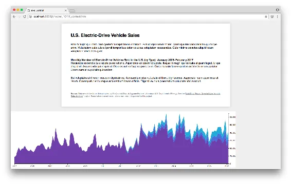
<h6 class="calibre37"><span class="keep-together">Figure 16-18.
</span>Oops, I dropped the chart</h6>
</div>
</figure>

Until now, we’ve created our initial SVG element using something like
`d3.select("body").append("svg")…`. Now that there’s other stuff in the
`body`, we better update that selection, so the SVG (our chart) is
appended in the right place! Here, I’ll use
`d3.select("#chartContainer")…` (see <a href="#ch16.xhtml_hit_target"
class="calibre5 pcalibre pcalibre2 pcalibre3 pcalibre1"
data-type="xref">Figure 16-19</a>).

<figure class="calibre35">
<div id="ch16.xhtml_hit_target" class="figure">
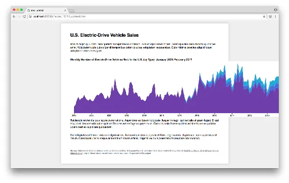
<h6 class="calibre37"><span class="keep-together">Figure 16-19.
</span>SVG appended to #chartContainer, as intended</h6>
</div>
</figure>

Better! The first step to integrating your chart onto a larger page is
updating any `select()` statements to target more specific page elements
(that is, not just `body`). It’s convenient if the HTML structure
includes a `div` or similar with a unique `id` to latch on to.

<div class="calibre27" data-type="tip">

# Multiple Charts on a Page

It’s <span id="ch16.xhtml_idm140093177325888"
class="calibre5 pcalibre pcalibre2 pcalibre3 pcalibre1"
data-type="indexterm" primary="charts"
secondary="multiple on one page"></span>easy to have multiple charts on
the same page! Just use your `select()` statements wisely, to target the
right places.

For example, say you have two charts, a bar chart and a line chart. The
HTML structure could include two `div`s, one with the ID of `barChart`
and one with `lineChart`. Use `select()` to target the appropriate `div`
when creating each separate SVG.

You’ll have to be careful with subsequent selection statements, too. For
example, if both of your charts have axes, something like
`d3.select(".axis")` may select an axis, but which one? (Answer: The
first element on the page with a class of `axis`.)

You could use more verbose selection statements, such as
`d3.select("#lineChart .axis")`, or it may be more convenient to store a
more memorable reference to each chart. Throughout this book, I’ve used
a variable named `svg` for this purpose:

``` calibre63
var svg = d3.select("#chartContainer").append("svg")…
```

But with two or more charts on the page, you could use more meaningful
names, like:

``` calibre63
var barChart = d3.select("#barChart").append("svg")…
var lineChart = d3.select("#lineChart").append("svg")…
```

Then prefix subsequent selections with whichever chart you’re trying to
address, as in: `lineChart.select(".axis")…`

Similarly, you’ll have to make sure that any global variables don’t
conflict, as you can’t have two `dataset`s, two `xScale`s, and so on.
See <a href="#ch03.xhtml_global_namespace"
class="calibre5 pcalibre pcalibre2 pcalibre3 pcalibre1"
data-type="xref">“Global namespace”</a> in
<a href="#ch03.xhtml_technology_fundamentals"
class="calibre5 pcalibre pcalibre2 pcalibre3 pcalibre1"
data-type="xref">Chapter 3</a> for more.

</div>

After a few dimensions adjustments, we see the final chart in
<a href="#ch16.xhtml_final_ev_chart"
class="calibre5 pcalibre pcalibre2 pcalibre3 pcalibre1"
data-type="xref">Figure 16-20</a>. Explore the code in
*11_context.html*.

<figure class="calibre35">
<div id="ch16.xhtml_final_ev_chart" class="figure">
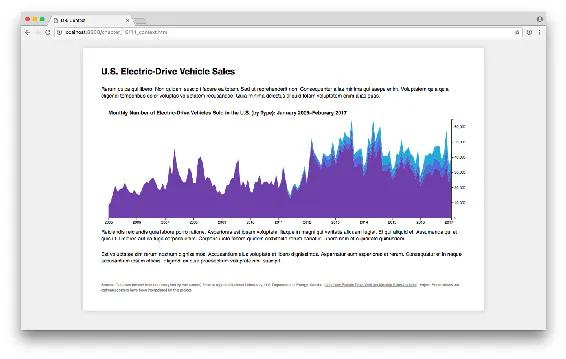
<h6 class="calibre37"><span class="keep-together">Figure 16-20.
</span>Our final electric-drive vehicle chart (and page!)</h6>
</div>
</figure>

<div class="calibre27 note" data-type="note">

###### Note

**Exercise:** If you’re interested in alternative-fuel vehicles, you’re
probably also interested in fuel economy. Try downloading
<a href="http://www.fueleconomy.gov/feg/download.shtml"
class="calibre5 pcalibre pcalibre2 pcalibre3 pcalibre1">fuel economy
data</a> from the US Environmental Protection Agency. How could the data
be incorporated into this chart in a meaningful way? Could you use it to
illustrate the fuel economy of individal vehicles, of each fuel type
category, or of electric-drive vehicles overall? Are they getting more
efficient over time, as the technologies improve?

</div>

</div>

</div>

<div class="section calibre2" data-type="sect1"
pdf-bookmark="Dancing Versus Gardening">

<div id="ch16.xhtml_idm140093177456896" class="dedication">

# Dancing Versus Gardening

I’ve often<span id="ch16.xhtml_idm140093177263952"
class="calibre5 pcalibre pcalibre2 pcalibre3 pcalibre1"
data-type="indexterm" primary="coding tips"
secondary="integrated design and development"></span> felt like coding
was a bit like dancing: first, you flail over here, then you flail over
there. Nothing makes sense at first, but eventually you find your rhythm
and the moves that work for you. One moment you’re in the center of the
dance floor, the next you’re wiggling around the edges.

I’m not a great dancer, by the way.

Maybe coding is more like gardening. You start with a seed of an idea,
and plant it somewhere. You water it, give it sunlight and care.
Gradually the seed grows, and starts pushing out against the world
around it, so you have to adapt other elements in the garden to
accommodate. Eventually, after lots of attention and care, you end up
with a full-grown plant that, er, communicates your data in an honest
and effective manner.

My point is that there’s no straightforward path for any project. You’ll
never start with perfect data, plan a perfect design, and then implement
it perfectly. An integrated process of design and development is always
highly iterative, with lots of tiny refinements and scooching around the
edges. You may not be a dancer or a gardener (I’m clearly neither), but
I hope you can learn to get comfortable acting like one, sitting there
at your computer, flailing at the keyboard, typing chains of D3 methods
while wearing your finest gardening gloves. Get comfortable with the
discomfort, the indirectness of it all, and take one step at a time.
Good luck.<span id="ch16.xhtml_idm140093177260176"
class="calibre5 pcalibre pcalibre2 pcalibre3 pcalibre1"
data-type="indexterm" primary="" startref="prowalk16"></span>

</div>

</div>

</div>

</div>

<span id="app01.xhtml"></span>

<div id="app01.xhtml_sbo-rt-content" class="calibre1">

<div class="section calibre2 appendix" data-type="appendix"
pdf-bookmark="Appendix A. Case Studies">

<div id="app01.xhtml_case_studies" class="dedication">

