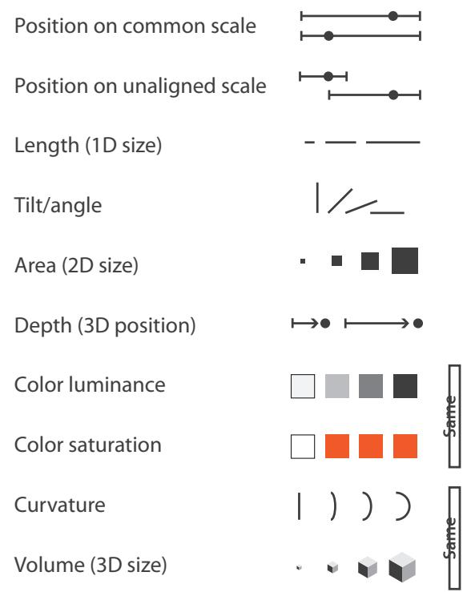
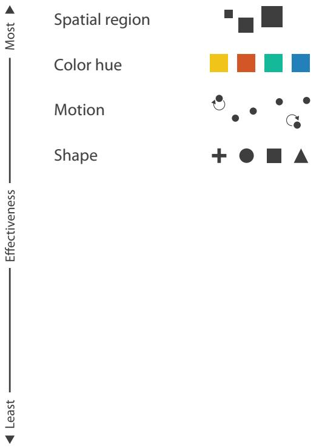

# 第 5 章：标记与通道 (Marks and Channels)

本部分内容整理并翻译自 Tamara Munzner 的《Visualization Analysis & Design》(2014) 第 5 章，完整归纳了有关**标记 (Marks)** 和 **通道 (Channels)** 的核心理论体系。

---

## 5.1 核心概念：视觉编码的正交基石

视觉编码的设计空间，是由两个基础维度**正交组合**而成的：
*   **标记 (Marks)**：图表中的基础图形骨架（如点、线、面），用于描绘数据项或链接。
*   **通道 (Channels)**：控制这些骨架视觉外观的旋钮（如颜色、大小、位置）。

掌握它们，为你分析视觉编码提供了最核心的基本模块。即使是再复杂的视觉流行图表，也可以瞬间拆解为底层标记与控制其外观的通道组件。

---

## 5.2 定义标记与通道 (Defining Marks and Channels)

### 5.2.1 认识标记（Marks）的全部面貌

标记是图像中的基本图形骨架。从两个维度来理解它们：

**维度一：几何图元（维度约束）**
*   **0D (零维) 标记**：点 (Point)。最自由，无任何尺寸约束。
*   **1D (一维) 标记**：线 (Line)。已被长度方向约束。
*   **2D (二维) 标记**：面 (Area)。面积和形状已被完全约束（如地图省份轮廓）。
*(三维的体积标记也有可能，但极少被使用。)*

> 图 5.2：标记是几何图元。
> 

**维度二：网络功能分类（个体 vs 关系）**
在数据集中，标记不仅可以代表独立的**节点 (Items/Nodes)**，也可以代表节点之间的**链接 (Links)**。
链接标记用于展示项目之间的关系，分为两类：
*   **连接 (Connection)**：使用线 (Line) 来展示成对的关系。
*   **包含 (Containment)**：使用面 (Area) 的嵌套来展示层级关系。
*(注：链接绝对不能用点来表示，尽管个体项目可以用点表示。)*

> 图 5.5：标记既可以代表个体项目，也可以代表它们之间的链接。
>    
>  

### 5.2.2 认识通道（Channels）的全部面貌

视觉通道是一种控制标记外观的方式。同样从两个维度来理解：

**维度一：外观旋钮大全**
*   **空间位置**：对齐位置、未对齐位置、深度 (3D 位置) 以及 空间区域 (Spatial region)。
*   **颜色**：色相 (Hue)、饱和度 (Saturation) 和 明度 (Luminance)。
*   **尺寸**：长度 (1D 尺寸)、面积 (2D 尺寸) 和 体积 (3D 尺寸)。
*   **其他**：角度 (Angle/Tilt)、曲率 (Curvature)、形状 (Shape) 以及 运动模式 (Motion)。

> 图 5.3：视觉通道控制标记的外观。
> 

**维度二：两大认知阵营（核心）**
人类的感知系统将通道分为两种根本不同的感官模态：
1.  **身份通道 (Identity Channels)**：告诉我们某个物体“是什么”或“在哪里”。（如形状、颜色色相、空间区域）。非常适合映射**分类数据**。
2.  **量化通道 (Magnitude Channels)**：告诉我们某物“有多少”。（如长度、明度、面积、位置）。非常适合映射**有序数据**。

### 5.2.3 原子的组合与物理约束

了解了标记和通道的全部零件后，我们可以通过不断往图表中叠加通道来编码更高维度的数据：
*   (a) **柱状图**：使用线标记 (1D)，垂直空间位置（量化通道）编码定量属性，水平空间位置（身份通道）编码分类属性。
*   (b) **散点图**：使用点标记 (0D)，将线变成点释放了第二个方向，因此可以同时使用水平和垂直空间位置编码两个定量属性。
*   (c) **添加颜色**：给点标记挂载颜色色相（身份通道），编码第三个分类属性。
*   (d) **添加尺寸**：给点标记挂载大小面积（量化通道），编码第四个定量属性。

> 图 5.4：使用标记与通道。
>  (a)
>  (b)
>  (c)
>  (d)

**⚠️ 组合约束警告**：通道不能随意挂载到所有标记上。例如，面 (Area) 标记的形状和面积本身就被约束用于表示物理轮廓，因此无法再用尺寸通道来编码额外属性。线标记已被其长度占据了一个维度，但可以通过变粗（宽度）来附加额外属性。只有点标记 (0D) 是完全不受几何约束的，可以挂载形状和面积变化。

---

## 5.3 使用标记与通道的铁律 (Rules of Marks and Channels)

设计视觉编码必须遵循两个核心原则：**表达性 (Expressiveness)** 和 **有效性 (Effectiveness)**。

### 5.3.1 表达性与有效性原则

*   **表达性原则 (Expressiveness)**：视觉编码必须且仅能表达数据集中的底层信息属性。最根本的一点是，**有序数据 (Ordered data)** 必须使用量化通道以产生内在大小感知的方式呈现，而 **无序数据/分类数据 (Categorical data)** 绝对不能用带有顺序暗示的通道（如大小、长度）来呈现，必须使用身份通道。
*   **有效性原则 (Effectiveness)**：属性的重要性应与视觉通道的显著性相匹配。最重要的属性应分配给排名最高、最有效的通道，而次要的属性分配给次要通道。

### 5.3.2 通道阶级排名 (Channel Rankings)

依据上述法则，我们可以得到视觉通道效能的终极排名榜单。

*   **有序属性 (Ordered Attributes)** 应使用 **量化通道 (Magnitude Channels)**：
    1.  对齐的空间位置 (Position on common scale) - 【绝对王者，如柱状图】
    2.  未对齐的空间位置 (Position on unaligned scale) 
    3.  长度 (Length, 1D size)
    4.  角度 (Angle)
    5.  面积 (Area, 2D size)
    6.  深度/三维位置 (Depth, 3D position)
    7.  颜色明度 (Luminance) / 颜色饱和度 (Saturation)
    8.  曲率 (Curvature) / 体积 (Volume, 3D size)

*   **分类属性 (Categorical Attributes)** 应使用 **身份通道 (Identity Channels)**：
    1.  空间区域划分 (Spatial region)
    2.  颜色色相 (Color hue)
    3.  运动模式 (Motion)
    4.  形状 (Shape)

> **注**：空间位置通道 (Spatial position) 在两类榜单中均拔得头筹，而且是**唯一**对两类数据都最有效的通道。这意味着你把什么数据映射给空间位置（如 X 轴和 Y 轴），将绝对主导观众对数据的心理模型。

> 图 5.1/5.6：基于数据和通道类型的效能排名榜单。
> 
> 
> 

---

## 5.4 科学实证：通道效能深入分析

为了真正掌握通道，需要从以下五个维度进行分析，它们为通道的效能排名提供了认知科学层面的实证基础：

### 5.4.1 准确性 (Accuracy)

Stevens 的心理物理学幂定律表明，人类对不同视觉通道的感知准确度遵循幂函数 $S = I^n$。
如图 5.7，**长度感知是完美的线性 ($n=1.0$)**，我们能非常精准地判断线的长度差。但**面积感知会受到心理压缩 ($n=0.7$)**，这意味着一个面积实际上是 2 倍的圆，在人眼看来往往达不到 2 倍大。而**颜色饱和度则会被放大 ($n=1.7$)**。

> 图 5.7：Stevens 心理物理学幂定律
> 

Cleveland 和 McGill 的经典实验及 Heer 的现代复刻实验（图 5.8）同样证明了量化通道存在着断崖式的误差率分布：对齐位置的误差率最低，而面积、颜色的误差率极高。

> 图 5.8：跨视觉通道的感知误差率。
> 

### 5.4.2 可辨识性 (Discriminability)

即使通道很有效，它可能包含的“可分辨阶梯数 (Bins)”也很有限。例如（图 5.9），利用线宽 (Linewidth) 来区分数据时，人眼最多只能辨认 3 到 4 种不同的粗细。如果你强行把几百个连续数字映射给线宽，这个通道就会失效。

> 图 5.9：线宽只有非常有限的可用感知区间。
> 

### 5.4.3 可分离性 (Separability)

不同的视觉通道组合在一起时，并非完全独立。它们处于一个从 **完全可分离 (Separable)** 到 **不可分离 (Integral)** 的连续体中（图 5.10）。
*   **完全可分离**：空间位置 + 颜色色相（你能毫不费力地区分左边红色的点）。
*   **部分干扰**：大小 + 颜色（当一个点太小时，你很难辨认它的颜色）。
*   **不可分离**：水平宽度 + 垂直高度。人类大脑不会把它们分开处理，而是会自动在底层融合成对“**面积/形状**”的单一感知。
*   **极端不可分离**：红光 + 绿光。人类只会看到黄色，无法逆推回红绿各多少。

> 图 5.10：视觉通道的可分离性连续体。
> 

### 5.4.4 视觉弹出 (Popout)

很多通道支持“视觉弹出”效应（也叫预先注意处理）。在这个状态下，在杂乱背景中寻找一个异类目标所花费的时间，与背景中干扰项的数量**完全无关**。
如图 5.11 (a)(b)，红点从蓝点中弹出是瞬间的。
**重点警告**：弹出效应通常只能在**单一通道**中生效。如图 5.11 (f)，如果你要求观众寻找一个“红色的圆”（组合了颜色和形状两个通道），弹出效应失效，大脑被迫进行逐个扫描搜索 (Serial search)，耗时将随干扰项数量线性增加。

> 图 5.11：视觉弹出。
>  (a)
>  (b)
>  (c)
>  (d)
>  (e)
>  (f)

除了颜色和形状，倾斜角度、大小、空间接近度以及阴影方向都支持弹出效应（图 5.12）。需要注意的是，图 5.12(f) 展示了一个反例：平行线对 (Parallelism) 不能从微小倾斜的线对中弹出，必须通过逐个扫描才能发现。

> 图 5.12：支持视觉弹出的各种通道。
>      

### 5.4.5 分组 (Grouping)

在视觉上形成分类和群组，按效能强度排序：
1. **包含 (Containment)**：最强的视觉分组暗示。
2. **连接 (Connection)**：使用线相连。
3. **空间相邻 (Proximity)**：这也是为什么空间区域排名身份通道第一。
4. **相似性 (Similarity)**：使用相同的颜色（色相）或运动模式。

---

## 5.5 相对判断与绝对判断 (Relative versus Absolute Judgements)

韦伯定律 (Weber's Law) 揭示了一个残酷的真相：**人类的感知系统从根本上是基于相对判断的，而不是绝对判断。**

*   **对齐的威力**：如图 5.13，如果没有对齐且没有框架 (a)，我们极难比较长度的细微差异。但加入框架 (b) 提供相对差值参考，或者直接让底部对齐 (c)，判断精度会指数级提升。这就是柱状图永远是量化比较王者的原因。
*   **色彩的相对性错觉**：我们的亮度和颜色感知完全受限于上下文。图 5.14 显示了 A 和 B 两个方块其实亮度完全相同。图 5.15 显示了在不同光照暗示下，完全相同颜色的色块会被大脑脑补成橙色或紫色（色彩恒常性）。这警告我们：在使用颜色通道编码信息时，务必小心周围环境的干扰。

> 图 5.13：相对判断。对齐或加边框让对比更容易。
> 
> 
> 

> 图 5.14：亮度的感知是相对的，图 A 和图 B 的方块实际颜色完全一致。
> 
> 

> 图 5.15：颜色感知的上下文依赖。
> 
> 
