# Chapter 1

# What’s Vis, and Why Do It?

# 1.1 The Big Picture

This book is built around the following definition of visualization— vis, for short:

Computer-based visualization systems provide visual representations of datasets designed to help people carry out tasks more effectively.

Visualization is suitable when there is a need to augment human capabilities rather than replace people with computational decision-making methods. The design space of possible vis idioms is huge, and includes the considerations of both how to create and how to interact with visual representations. Vis design is full of trade-offs, and most possibilities in the design space are ineffective for a particular task, so validating the effectiveness of a design is both necessary and difficult. Vis designers must take into account three very different kinds of resource limitations: those of computers, of humans, and of displays. Vis usage can be analyzed in terms of why the user needs it, what data is shown, and how the idiom is designed.

I’ll discuss the rationale behind many aspects of this definition as a way of getting you to think about the scope of this book, and about visualization itself:

. Why have a human in the decision-making loop?   
. Why have a computer in the loop?   
. Why use an external representation?   
. Why depend on vision?

* The field of machine learning is a branch of artificial intelligence where computers can handle a wide variety of new situations in response to datadriven training, rather than by being programmed with explicit instructions in advance.

. Why show the data in detail?   
. Why use interactivity?   
. Why is the vis idiom design space huge?   
. Why focus on tasks?   
. Why are most designs ineffective?   
. Why care about effectiveness?   
. Why is validation difficult?   
. Why are there resource limitations?   
. Why analyze vis?

# 1.2 Why Have a Human in the Loop?

Vis allows people to analyze data when they don’t know exactly what questions they need to ask in advance.

The modern era is characterized by the promise of better decision making through access to more data than ever before. When people have well-defined questions to ask about data, they can use purely computational techniques from fields such as statistics and machine learning.* Some jobs that were once done by humans can now be completely automated with a computer-based solution. If a fully automatic solution has been deemed to be acceptable, then there is no need for human judgement, and thus no need for you to design a vis tool. For example, consider the domain of stock market trading. Currently, there are many deployed systems for highfrequency trading that make decisions about buying and selling stocks when certain market conditions hold, when a specific price is reached, for example, with no need at all for a time-consuming check from a human in the loop. You would not want to design a vis tool to help a person make that check faster, because even an augmented human will not be able to reason about millions of stocks every second.

However, many analysis problems are ill specified: people don’t know how to approach the problem. There are many possible questions to ask—anywhere from dozens to thousands or more—and people don’t know which of these many questions are the right ones in advance. In such cases, the best path forward is an analysis process with a human in the loop, where you can exploit the

powerful pattern detection properties of the human visual system in your design. Vis systems are appropriate for use when your goal is to augment human capabilities, rather than completely replace the human in the loop.

You can design vis tools for many kinds of uses. You can make a tool intended for transitional use where the goal is to “work itself out of a job”, by helping the designers of future solutions that are purely computational. You can also make a tool intended for longterm use, in a situation where there is no intention of replacing the human any time soon.

For example, you can create a vis tool that’s a stepping stone to gaining a clearer understanding of analysis requirements before developing formal mathematical or computational models. This kind of tool would be used very early in the transition process in a highly exploratory way, before even starting to develop any kind of automatic solution. The outcome of designing vis tools targeted at specific real-world domain problems is often a much crisper understanding of the user’s task, in addition to the tool itself.

In the middle stages of a transition, you can build a vis tool aimed at the designers of a purely computational solution, to help them refine, debug, or extend that system’s algorithms or understand how the algorithms are affected by changes of parameters. In this case, your tool is aimed at a very different audience than the end users of that eventual system; if the end users need visualization at all, it might be with a very different interface. Returning to the stock market example, a higher-level system that determines which of multiple trading algorithms to use in varying circumstances might require careful tuning. A vis tool to help the algorithm developers analyze its performance might be useful to these developers, but not to people who eventually buy the software.

You can also design a vis tool for end users in conjunction with other computational decision making to illuminate whether the automatic system is doing the right thing according to human judgement. The tool might be intended for interim use when making deployment decisions in the late stages of a transition, for example, to see if the result of a machine learning system seems to be trustworthy before entrusting it to spend millions of dollars trading stocks. In some cases vis tools are abandoned after that decision is made; in other cases vis tools continue to be in play with long-term use to monitor a system, so that people can take action if they spot unreasonable behavior.

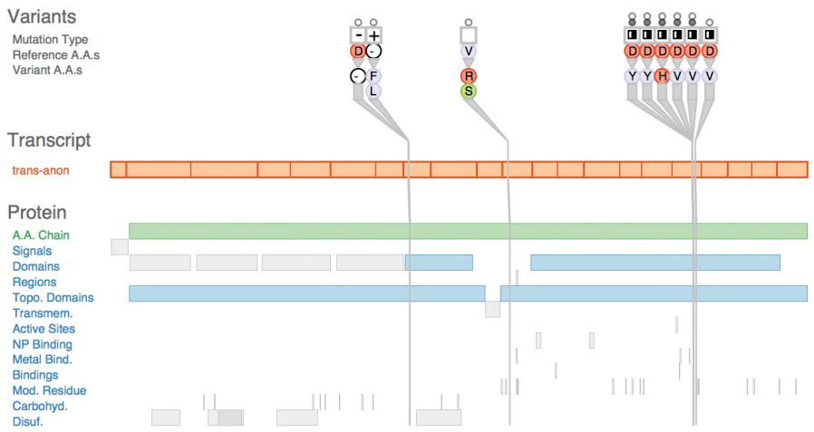  
Figure 1.1. The Variant View vis tool supports biologists in assessing the impact of genetic variants by speeding up the exploratory analysis process. From [Ferstay et al. 13, Figure 1].

In contrast to these transitional uses, you can also design vis tools for long-term use, where a person will stay in the loop indefinitely. A common case is exploratory analysis for scientific discovery, where the goal is to speed up and improve a user’s ability to generate and check hypotheses. Figure 1.1 shows a vis tool designed to help biologists studying the genetic basis of disease through analyzing DNA sequence variation. Although these scientists make heavy use of computation as part of their larger workflow, there’s no hope of completely automating the process of cancer research any time soon.

You can also design vis tools for presentation. In this case, you’re supporting people who want to explain something that they already know to others, rather than to explore and analyze the unknown. For example, The New York Times has deployed sophisticated interactive visualizations in conjunction with news stories.

# 1.3 Why Have a Computer in the Loop?

By enlisting computation, you can build tools that allow people to explore or present large datasets that would be completely infeasible to draw by hand, thus opening up the possibility of seeing how datasets change over time.

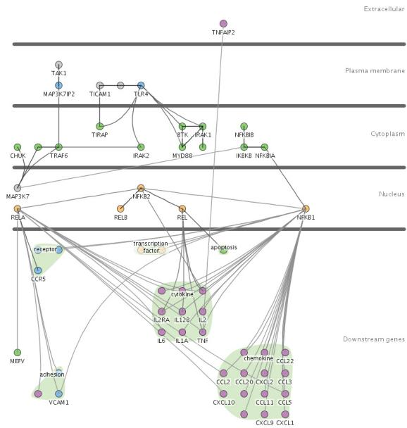  
(a)

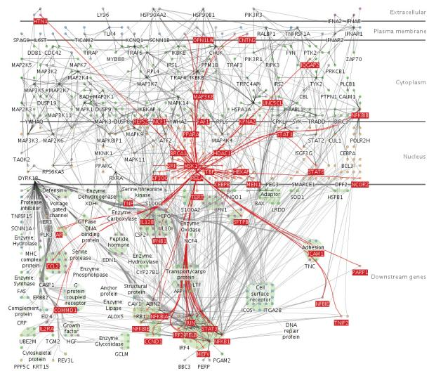  
(b)   
Figure 1.2. The Cerebral vis tool captures the style of hand-drawn diagrams in biology textbooks with vertical layers that correspond to places within a cell where interactions between genes occur. (a) A small network of 57 nodes and 74 edges might be possible to lay out by hand with enough patience. (b) Automatic layout handles this large network of 760 nodes and 1269 edges and provides a substrate for interactive exploration: the user has moved the mouse over the MSK1 gene, so all of its immmediate neighbors in the network are highlighted in red. From [Barsky et al. 07, Figures 1 and 2].

People could create visual representations of datasets manually, either completely by hand with pencil and paper, or with computerized drawing tools where they individually arrange and color each item. The scope of what people are willing and able to do manually is strongly limited by their attention span; they are unlikely to move beyond tiny static datasets. Arranging even small datasets of hundreds of items might take hours or days. Most real-world datasets are much larger, ranging from thousands to millions to even more. Moreover, many datasets change dynamically over time. Having a computer-based tool generate the visual representation automatically obviously saves human effort compared to manual creation.

As a designer, you can think about what aspects of hand-drawn diagrams are important in order to automatically create drawings that retain the hand-drawn spirit. For example, Figure 1.2 shows

an example of a vis tool designed to show interactions between genes in a way similar to stylized drawings that appear in biology textbooks, with vertical layers that correspond to the location within the cell where the interaction occurs [Barsky et al. 07]. Figure 1.2(a) could be done by hand, while Figure 1.2(b) could not.

# 1.4 Why Use an External Representation?

External representations augment human capacity by allowing us to surpass the limitations of our own internal cognition and memory.

Vis allows people to offload internal cognition and memory usage to the perceptual system, using carefully designed images as a form of external representations, sometimes also called external memory. External representations can take many forms, including touchable physical objects like an abacus or a knotted string, but in this book I focus on what can be shown on the two-dimensional display surface of a computer screen.

Diagrams can be designed to support perceptual inferences, which are very easy for humans to make. The advantages of diagrams as external memory is that information can be organized by spatial location, offering the possibility of accelerating both search and recognition. Search can be sped up by grouping all the items needed for a specific problem-solving inference together at the same location. Recognition can also be facilitated by grouping all the relevant information about one item in the same location, avoiding the need for matching remembered symbolic labels. However, a nonoptimal diagram may group irrelevant information together, or support perceptual inferences that aren’t useful for the intended problem-solving process.

# 1.5 Why Depend on Vision?

Visualization, as the name implies, is based on exploiting the human visual system as a means of communication. I focus exclusively on the visual system rather than other sensory modalities because it is both well characterized and suitable for transmitting information.

The visual system provides a very high-bandwidth channel to our brains. A significant amount of visual information processing occurs in parallel at the preconscious level. One example is visual

popout, such as when one red item is immediately noticed from a sea of gray ones. The popout occurs whether the field of other objects is large or small because of processing done in parallel across the entire field of vision. Of course, our visual systems also feed into higher-level processes that involve the conscious control of attention.

Sound is poorly suited for providing overviews of large information spaces compared with vision. An enormous amount of background visual information processing in our brains underlies our ability to think and act as if we see a huge amount of information at once, even though technically we see only a tiny part of our visual field in high resolution at any given instant. In contrast, we experience the perceptual channel of sound as a sequential stream, rather than as a simultaneous experience where what we hear over a long period of time is automatically merged together. This crucial difference may explain why sonification has never taken off despite many independent attempts at experimentation.

The other senses can be immediately ruled out as communication channels because of technological limitations. The perceptual channels of taste and smell don’t yet have viable recording and reproduction technology at all. Haptic input and feedback devices exist to exploit the touch and kinesthetic perceptual channels, but they cover only a very limited part of the dynamic range of what we can sense. Exploration of their effectiveness for communicating abstract information is still at a very early stage.

Chapter 5 covers implications of visual perception that are relevant for vis design.

# 1.6 Why Show the Data in Detail?

Vis tools help people in situations where seeing the dataset structure in detail is better than seeing only a brief summary of it. One of these situations occurs when exploring the data to find patterns, both to confirm expected ones and find unexpected ones. Another occurs when assessing the validity of a statistical model, to judge whether the model in fact fits the data.

Statistical characterization of datasets is a very powerful approach, but it has the intrinsic limitation of losing information through summarization. Figure 1.3 shows Anscombe’s Quartet, a suite of four small datasets designed by a statistician to illustrate how datasets that have identical descriptive statistics can have very different structures that are immediately obvious when the dataset is shown graphically [Anscombe 73]. All four have identical mean, variance, correlation, and linear regression lines. If you

Anscombe’s Quar tet: R aw Data   

<table><tr><td rowspan="2"></td><td colspan="2">1</td><td colspan="2">2</td><td colspan="2">3</td><td colspan="2">4</td></tr><tr><td>X</td><td>Y</td><td>X</td><td>Y</td><td>X</td><td>Y</td><td>X</td><td>Y</td></tr><tr><td rowspan="11"></td><td>10.0</td><td>8.04</td><td>10.0</td><td>9.14</td><td>10.0</td><td>7.46</td><td>8.0</td><td>6.58</td></tr><tr><td>8.0</td><td>6.95</td><td>8.0</td><td>8.14</td><td>8.0</td><td>6.77</td><td>8.0</td><td>5.76</td></tr><tr><td>13.0</td><td>7.58</td><td>13.0</td><td>8.74</td><td>13.0</td><td>12.74</td><td>8.0</td><td>7.71</td></tr><tr><td>9.0</td><td>8.81</td><td>9.0</td><td>8.77</td><td>9.0</td><td>7.11</td><td>8.0</td><td>8.84</td></tr><tr><td>11.0</td><td>8.33</td><td>11.0</td><td>9.26</td><td>11.0</td><td>7.81</td><td>8.0</td><td>8.47</td></tr><tr><td>14.0</td><td>9.96</td><td>14.0</td><td>8.10</td><td>14.0</td><td>8.84</td><td>8.0</td><td>7.04</td></tr><tr><td>6.0</td><td>7.24</td><td>6.0</td><td>6.13</td><td>6.0</td><td>6.08</td><td>8.0</td><td>5.25</td></tr><tr><td>4.0</td><td>4.26</td><td>4.0</td><td>3.10</td><td>4.0</td><td>5.39</td><td>19.0</td><td>12.50</td></tr><tr><td>12.0</td><td>10.84</td><td>12.0</td><td>9.13</td><td>12.0</td><td>8.15</td><td>8.0</td><td>5.56</td></tr><tr><td>7.0</td><td>4.82</td><td>7.0</td><td>7.26</td><td>7.0</td><td>6.42</td><td>8.0</td><td>7.91</td></tr><tr><td>5.0</td><td>5.68</td><td>5.0</td><td>4.74</td><td>5.0</td><td>5.73</td><td>8.0</td><td>6.89</td></tr><tr><td>Mean</td><td>9.0</td><td>7.5</td><td>9.0</td><td>7.5</td><td>9.0</td><td>7.5</td><td>9.0</td><td>7.5</td></tr><tr><td>Variance</td><td>10.0</td><td>3.75</td><td>10.0</td><td>3.75</td><td>10.0</td><td>3.75</td><td>10.0</td><td>3.75</td></tr><tr><td>Correlation</td><td colspan="2">0.816</td><td colspan="2">0.816</td><td colspan="2">0.816</td><td colspan="2">0.816</td></tr></table>

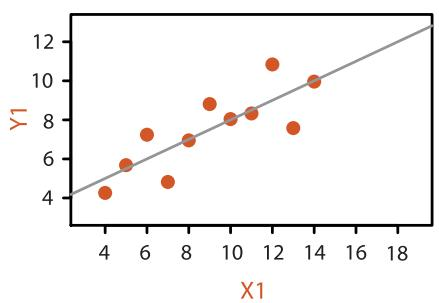

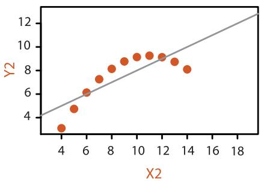

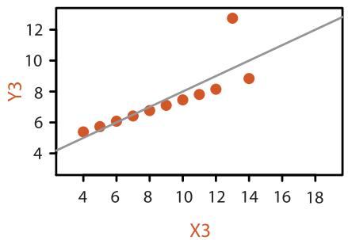

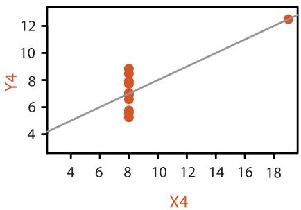  
Figure 1.3. Anscombe’s Quartet is four datasets with identical simple statistical properties: mean, variance, correlation, and linear regression line. However, visual inspection immediately shows how their structures are quite different. After [Anscombe 73, Figures 1–4].

are familiar with these statistical measures, then the scatterplot of the first dataset probably isn’t surprising, and matches your intuition. The second scatterplot shows a clear nonlinear pattern in the data, showing that summarizing with linear regression doesn’t adequately capture what’s really happening. The third dataset shows how a single outlier can lead to a regression line that’s misleading in a different way because its slope doesn’t quite match the line that our eyes pick up clearly from the rest of the data. Finally, the fourth dataset shows a truly pernicious case where these measures dramatically mislead, with a regression line that’s almost perpendicular to the true pattern we immediately see in the data.

The basic principle illustrated by Anscombe’s Quartet, that a single summary is often an oversimplification that hides the true structure of the dataset, applies even more to large and complex datasets.

# 1.7 Why Use Interactivity?

Interactivity is crucial for building vis tools that handle complexity. When datasets are large enough, the limitations of both people and displays preclude just showing everything at once; interaction where user actions cause the view to change is the way forward. Moreover, a single static view can show only one aspect of a dataset. For some combinations of simple datasets and tasks, the user may only need to see a single visual encoding. In contrast, an interactively changing display supports many possible queries.

In all of these cases, interaction is crucial. For example, an interactive vis tool can support investigation at multiple levels of detail, ranging from a very high-level overview down through multiple levels of summarization to a fully detailed view of a small part of it. It can also present different ways of representing and summarizing the data in a way that supports understanding the connections between these alternatives.

Before the widespread deployment of fast computer graphics, visualization was limited to the use of static images on paper. With computer-based vis, interactivity becomes possible, vastly increasing the scope and capabilities of vis tools. Although static representations are indeed within the scope of this book, interaction is an intrinsic part of many idioms.

# 1.8 Why Is the Vis Idiom Design Space Huge?

A vis idiom is a distinct approach to creating and manipulating visual representations. There are many ways to create a visual encoding of data as a single picture. The design space of possibilities gets even bigger when you consider how to manipulate one or more of these pictures with interaction.

Many vis idioms have been proposed. Simple static idioms include many chart types that have deep historical roots, such as scatterplots, bar charts, and line charts. A more complicated idiom can link together multiple simple charts through interaction. For example, selecting one bar in a bar chart could also result in highlighting associated items in a scatterplot that shows a different view of the same data. Figure 1.4 shows an even more complex idiom that supports incremental layout of a multilevel network through interactive navigation. Data from Internet Movie Database showing all movies connected to Sharon Stone is shown, where actors are represented as grey square nodes and links between them

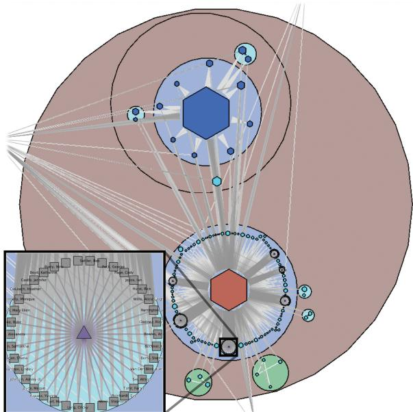  
Figure 1.4. The Grouse vis tool features a complex idiom that combines visual encoding and interaction, supporting incremental layout of a network through interactive navigation. From [Archambault et al. 07a, Figure 5].

mean appearance in the same movie. The user has navigated by opening up several metanodes, shown as discs, to see structure at many levels of the hierarchy simultaneously; metanode color encodes the topological structure of the network features it contains, and hexagons indicate metanodes that are still closed. The inset shows the details of the opened-up clique of actors who all appear in the movie Anything but Here, with name labels turned on.

This book provides a framework for thinking about the space of vis design idioms systematically by considering a set of design choices, including how to encode information with spatial position, how to facet data between multiple views, and how to reduce the amount of data shown by filtering and aggregation.

# 1.9 Why Focus on Tasks?

A tool that serves well for one task can be poorly suited for another, for exactly the same dataset. The task of the users is an equally important constraint for a vis designer as the kind of data that the users have.

Reframing the users’ task from domain-specific form into abstract form allows you to consider the similarities and differences between what people need across many real-world usage contexts. For example, a vis tool can support presentation, or discovery, or enjoyment of information; it can also support producing more information for subsequent use. For discovery, vis can be used to generate new hypotheses, as when exploring a completely unfamiliar dataset, or to confirm existing hypotheses about some dataset that is already partially understood.

Compound networks are discussed further in Section 9.5.

The space of task abstractions is discussed in detail in Chapter 3.

# 1.10 Why Focus on Effectiveness?

The focus on effectiveness is a corollary of defining vis to have the goal of supporting user tasks. This goal leads to concerns about correctness, accuracy, and truth playing a very central role in vis. The emphasis in vis is different from other fields that also involve making images: for example, art emphasizes conveying emotion, achieving beauty, or provoking thought; movies and comics emphasize telling a narrative story; advertising emphasizes setting a mood or selling. For the goals of emotional engagement, storytelling, or allurement, the deliberate distortion and even fabrication of facts is often entirely appropriate, and of course fiction is as

Abstraction is discussed in more detail in Chapters 3 and 4.

respectable as nonfiction. In contrast, a vis designer does not typically have artistic license. Moreover, the phrase “it’s not just about making pretty pictures” is a common and vehement assertion in vis, meaning that the goals of the designer are not met if the result is beautiful but not effective.

However, no picture can communicate the truth, the whole truth, and nothing but the truth. The correctness concerns of a vis designer are complicated by the fact that any depiction of data is an abstraction where choices are made about which aspects to emphasize. Cartographers have thousands of years of experience with articulating the difference between the abstraction of a map and the terrain that it represents. Even photographing a real-world scene involves choices of abstraction and emphasis; for example, the photographer chooses what to include in the frame.

# 1.11 Why Are Most Designs Ineffective?

The most fundamental reason that vis design is a difficult enterprise is that the vast majority of the possibilities in the design space will be ineffective for any specific usage context. In some cases, a possible design is a poor match with the properties of the human perceptual and cognitive systems. In other cases, the design would be comprehensible by a human in some other setting, but it’s a bad match with the intended task. Only a very small number of possibilities are in the set of reasonable choices, and of those only an even smaller fraction are excellent choices. Randomly choosing possibilities is a bad idea because the odds of finding a very good solution are very low.

Figure 1.5 contrasts two ways to think about design in terms of traversing a search space. In addressing design problems, it’s not a very useful goal to optimize; that is, to find the very best choice. A more appropriate goal when you design is to satisfy; that is, to find one of the many possible good solutions rather than one of the even larger number of bad ones. The diagram shows five spaces, each of which is progressively smaller than the previous. First, there is the space of all possible solutions, including potential solutions that nobody has ever thought of before. Next, there is the set of possibilities that are known to you, the vis designer. Of course, this set might be small if you are a novice designer who is not aware of the full array of methods that have been proposed in the past. If you’re in that situation, one of the goals of this book is to enlarge the set of methods that you know about. The next set is the

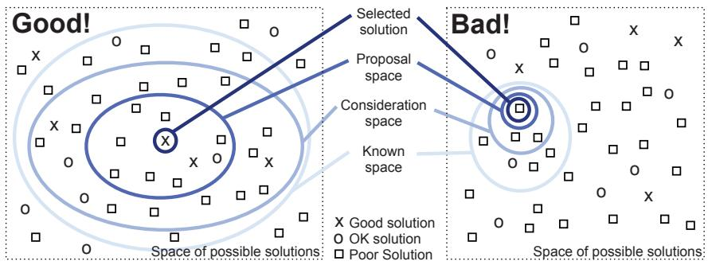  
Figure 1.5. A search space metaphor for vis design.

consideration space, which contains the solutions that you actively consider. This set is necessarily smaller than the known space, because you can’t consider what you don’t know. An even smaller set is the proposal space of possibilities that you investigate in detail. Finally, one of these becomes the selected solution.

Figure 1.5 contrasts a good strategy on the left, where the known and consideration spaces are large, with a bad strategy on the right, where these spaces are small. The problem of a small consideration space is the higher probability of only considering ok or poor solutions and missing a good one. A fundamental principle of design is to consider multiple alternatives and then choose the best, rather than to immediately fixate on one solution without considering any alternatives. One way to ensure that more than one possibility is considered is to explicitly generate multiple ideas in parallel. This book is intended to help you, the designer, entertain a broad consideration space by systematically considering many alternatives and to help you rule out some parts of the space by noting when there are mismatches of possibilities with human capabilities or the intended task.

As with all design problems, vis design cannot be easily handled as a simple process of optimization because trade-offs abound. A design that does well by one measure will rate poorly on another. The characterization of trade-offs in the vis design space is a very open problem at the frontier of vis research. This book provides several guidelines and suggested processes, based on my synthesis of what is currently known, but it contains few absolute truths.

Chapter 4 introduces a model for thinking about the design process at four different levels; the model is intended to guide your thinking through these trade-offs in a systematic way.

# 1.12 Why Is Validation Difficult?

The problem of validation for a vis design is difficult because there are so many questions that you could ask when considering whether a vis tool has met your design goals.

How do you know if it works? How do you argue that one design is better or worse than another for the intended users? For one thing, what does better mean? Do users get something done faster? Do they have more fun doing it? Can they work more effectively? What does effectively mean? How do you measure insight or engagement? What is the design better than? Is it better than another vis system? Is it better than doing the same things manually, without visual support? Is it better than doing the same things completely automatically? And what sort of thing does it do better? That is, how do you decide what sort of task the users should do when testing the system? And who is this user? An expert who has done this task for decades, or a novice who needs the task to be explained before they begin? Are they familiar with how the system works from using it for a long time, or are they seeing it for the first time? A concept like faster might seem straightforward, but tricky questions still remain. Are the users limited by the speed of their own thought process, or their ability to move the mouse, or simply the speed of the computer in drawing each picture?

How do you decide what sort of benchmark data you should use when testing the system? Can you characterize what classes of data the system is suitable for? How might you measure the quality of an image generated by a vis tool? How well do any of the automatically computed quantitative metrics of quality match up with human judgements? Even once you limit your considerations to purely computational issues, questions remain. Does the complexity of the algorithm depend on the number of data items to show or the number of pixels to draw? Is there a trade-off between computer speed and computer memory usage?

# 1.13 Why Are There Resource Limitations?

When designing or analyzing a vis system, you must consider at least three different kinds of limitations: computational capacity, human perceptual and cognitive capacity, and display capacity.

Vis systems are inevitably used for larger datasets than those they were designed for. Thus, scalability is a central concern: de-

‣ Chapter 4 answers these questions by providing a framework that addresses when to use what methods for validating vis designs.

signing systems to handle large amounts of data gracefully. The continuing increase in dataset size is driven by many factors: improvements in data acquisition and sensor technology, bringing real-world data into a computational context; improvements in computer capacity, leading to ever-more generation of data from within computational environments including simulation and logging; and the increasing reach of computational infrastructure into every aspect of life.

As with any application of computer science, computer time and memory are limited resources, and there are often soft and hard constraints on the availability of these resources. For instance, if your vis system needs to interactively deliver a response to user input, then when drawing each frame you must use algorithms that can run in a fraction of a second rather than minutes or hours. In some scenarios, users are unwilling or unable to wait a long time for the system to preprocess the data before they can interact with it. A soft constraint is that the vis system should be parsimonious in its use of computer memory because the user needs to run other programs simultaneously. A hard constraint is that even if the vis system can use nearly all available memory in the computer, dataset size can easily outstrip that finite capacity. Designing systems that gracefully handle larger datasets that do not fit into core memory requires significantly more complex algorithms. Thus, the computational complexity of algorithms for dataset preprocessing, transformation, layout, and rendering is a major concern. However, computational issues are by no means the only concern!

On the human side, memory and attention are finite resources. Chapter 5 will discuss some of the power and limitations of the low-level visual preattentive mechanisms that carry out massively parallel processing of our current visual field. However, human memory for things that are not directly visible is notoriously limited. These limits come into play not only for long-term recall but also for shorter-term working memory, both visual and nonvisual. We store surprisingly little information internally in visual working memory, leaving us vulnerable to change blindness: the phenomenon where even very large changes are not noticed if we are attending to something else in our view [Simons 00].

Display capacity is a third kind of limitation to consider. Vis designers often run out of pixels; that is, the resolution of the screen is not enough to show all desired information simultaneously. The information density of a single image is a measure of the amount of information encoded versus the amount of unused space.* Figure 1.6 shows the same tree dataset visually encoded three differ-

‣ More aspects of memory and attention are covered in Section 6.5.

* Synonyms for information density include graphic density and data–ink ratio.

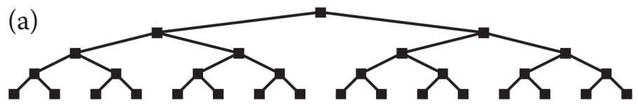

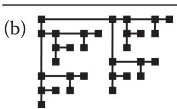

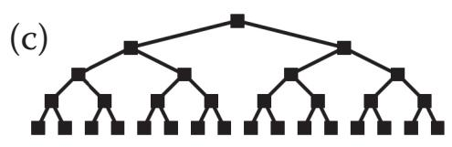  
Figure 1.6. Low and high information density visual encodings of the same small tree dataset; nodes are the same size in each. (a) Low information density. (b) Higher information density, but depth in tree cannot be read from spatial position. (c) High information density, while maintaining property that depth is encoded with position. From [McGuffin and Robert 10, Figure 3].

ent ways. The layout in Figure 1.6(a) encodes the depth from root to leaves in the tree with vertical spatial position. However, the information density is low. In contrast, the layout in Figure 1.6(b) uses nodes of the same size but is drawn more compactly, so it has higher information density; that is, the ratio between the size of each node and the area required to display the entire tree is larger. However, the depth cannot be easily read off from spatial position. Figure 1.6(c) shows a very good alternative that combines the benefits of both previous approaches, with both high information density from a compact view and position coding for depth.

There is a trade-off between the benefits of showing as much as possible at once, to minimize the need for navigation and exploration, and the costs of showing too much at once, where the user is overwhelmed by visual clutter. The goal of idiom design choices is to find an appropriate balance between these two ends of the information density continuum.

# 1.14 Why Analyze?

This book is built around the premise that analyzing existing systems is a good stepping stone to designing new ones. When you’re confronted with a vis problem as a designer, it can be hard to decide what to do. Many computer-based vis idioms and tools have

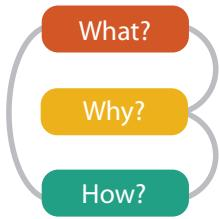  
Figure 1.7. Three-part analysis framework for a vis instance: why is the task being performed, what data is shown in the views, and how is the vis idiom constructed in terms of design choices.

been created in the past several decades, and considering them one by one leaves you faced with a big collection of different possibilities. There are so many possible combinations of data, tasks, and idioms that it’s unlikely that you’ll find exactly what you need to know just by reading papers about previous vis tools. Moreover, even if you find a likely candidate, you might need to dig even deeper into the literature to understand whether there’s any evidence that the tool was a success.

This book features an analysis framework that imposes a structure on this enormous design space, intended as a scaffold to help you think about design choices systematically. It’s offered as a guide to get you started, not as a straitjacket: there are certainly many other possible ways to think about these problems!

Figure 1.7 shows the high-level framework for analyzing vis use according to three questions: what data the user sees, why the user intends to use a vis tool, and how the visual encoding and interaction idioms are constructed in terms of design choices. Each three-fold what–why–how question has a corresponding data–task– idiom answer trio. One of these analysis trios is called an instance.

Simple vis tools can be fully described as an isolated analysis instance, but complex vis tool usage often requires analysis in terms of a sequence of instances that are chained together. In these cases, the chained sequences are a way to express dependencies. All analysis instances have the input of what data is shown; in some cases, output data is produced as a result of using the vis tool. Figure 1.8 shows an abstract example of a chained sequence, where the output of a prior instance serves as the input to a subsequent one.

The combination of distinguishing why from how and chained sequences allows you to distinguish between means and ends in

‣ Chapter 2 discusses data and the question of what. Chapter 3 covers tasks and the question of why. Chapters 7 through 14 answer the question of how idioms can be designed in detail.

  
Figure 1.8. Analyzing vis usage as chained sequences of instances, where the output of one instance is the input to another.

your analysis. For example, a user could sort the items shown within the vis. That operation could be an end in itself, if the user’s goal is to produce a list of items ranked according to a particular criterion as a result of an analysis session. Or, the sorting could be the means to another end, for example, finding outliers that do not match the main trend of the data; in this case, it is simply done along the way as one of many different operations.

# 1.15 Further Reading

Each Further Reading section provides suggestions for further reading about some of the ideas presented in the chapter and acknowledges key sources that influenced the discussion.

Why Use an External Representation? The role and use of external representations are analyzed in papers on the nature of ex-

ternal representations in problem solving [Zhang 97] and a representational analysis of number systems [Zhang and Norman 95]. The influential paper Why A Diagram Is (Sometimes) Worth Ten Thousand Words is the basis for my discussion of diagrams in this chapter [Larkin and Simon 87].

Why Show the Data in Detail? Anscombe proposed his quartet of illustrative examples in a lovely, concise paper [Anscombe 73]. An early paper on the many faces of the scatterplot includes a cogent discussion of why to show as much of the data as possible [Cleveland and McGill 84b].

What Is the Vis Design Space? My discussion of the vis design space is based on our paper on the methodology of design studies that covers the question of progressing from a loose to a crisp understanding of the user’s requirements [Sedlmair et al. 12].

What Resource Limitations Matter? Ware’s textbook provides a very thorough discussion of human limitations in terms of perception, memory, and cognition [Ware 13]. A survey paper provides a good overview of the change blindness literature [Simons 00]. The idea of information density dates back to Bertin’s discussion of graphic density [Bertin 67], and Tufte has discussed the data–ink ratio at length [Tufte 83].

# What?

# Datasets

# Data Types

I tems

Attributes

Links

Positions

Grids

# Data and Dataset Types

Tables

I tems

Attributes

Net works & Trees

I tems (nodes)

Links

Attributes

Fields

Grids

Positions

Attributes

Geometr y

I tems

Positions

Clusters, Sets, Lists

I tems

# Dataset Types

Tables

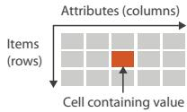

Networks

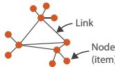

Fields (Continuous)

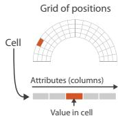

Multidimensional Table

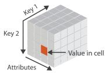

Trees

Geometr y (Spatial)

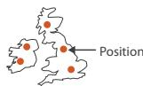

# Dataset Availability

Static

D ynamic

# Attributes

# Attribute Types

Categorical

Ordered

Ordinal

Quantitative

# Ordering Direc tion

Sequential

Diverging

Cyclic

  
Figure 2.1. What can be visualized: data, datasets, and attributes.

What?

Why?

How?

