# Chapter 2

# What: Data Abstraction

# 2.1 The Big Picture

Figure 2.1 shows the abstract types of what can be visualized. The four basic dataset types are tables, networks, fields, and geometry; other possible collections of items include clusters, sets, and lists. These datasets are made up of different combinations of the five data types: items, attributes, links, positions, and grids. For any of these dataset types, the full dataset could be available immediately in the form of a static file, or it might be dynamic data processed gradually in the form of a stream. The type of an attribute can be categorical or ordered, with a further split into ordinal and quantitative. The ordering direction of attributes can be sequential, diverging, or cyclic.

# 2.2 Why Do Data Semantics and Types Matter?

Many aspects of vis design are driven by the kind of data that you have at your disposal. What kind of data are you given? What information can you figure out from the data, versus the meanings that you must be told explicitly? What high-level concepts will allow you to split datasets apart into general and useful pieces?

Suppose that you see the following data:

14, 2.6, 30, 30, 15, 100001

What does this sequence of six numbers mean? You can’t possibly know yet, without more information about how to interpret each number. Is it locations for two points far from each other in three-dimensional space, 14, 2.6, 30 and 30, 15, 100001? Is it two points closer to each other in two-dimensional space, 14, 2.6 and

30, 30, with the fifth number meaning that there are 15 links between these two points, and the sixth number assigning the weight of ‘100001’ to that link?

Similarly, suppose that you see the following data:

Basil, 7, S, Pear

These numbers and words could have many possible meanings. Maybe a food shipment of produce has arrived in satisfactory condition on the 7th day of the month, containing basil and pears. Maybe the Basil Point neighborhood of the city has had 7 inches of snow cleared by the Pear Creek Limited snow removal service. Maybe the lab rat named Basil has made seven attempts to find his way through the south section of the maze, lured by scent of the reward food for this trial, a pear.

To move beyond guesses, you need to know two crosscutting pieces of information about these terms: their semantics and their types. The semantics of the data is its real-world meaning. For instance, does a word represent a human first name, or is it the shortened version of a company name where the full name can be looked up in an external list, or is it a city, or is it a fruit? Does a number represent a day of the month, or an age, or a measurement of height, or a unique code for a specific person, or a postal code for a neighborhood, or a position in space?

The type of the data is its structural or mathematical interpretation. At the data level, what kind of thing is it: an item, a link, an attribute? At the dataset level, how are these data types combined into a larger structure: a table, a tree, a field of sampled values? At the attribute level, what kinds of mathematical operations are meaningful for it? For example, if a number represents a count of boxes of detergent, then its type is a quantity, and adding two such numbers together makes sense. If the number represents a postal code, then its type is a code rather than a quantity—it is simply the name for a category that happens to be a number rather than a textual name. Adding two of these numbers together does not make sense.

Table 2.1 shows several more lines of the same dataset. This simple example table is tiny, with only nine rows and four columns. The exact semantics should be provided by the creator of the dataset; I give it with the column titles. In this case, each person has a unique identifier, a name, an age, a shirt size, and a favorite fruit.

Sometimes types and semantics can be correctly inferred simply by observing the syntax of a data file or the names of variables

Table 2.1. A full table with column titles that provide the intended semantics of the attributes.   

<table><tr><td>ID</td><td>Name</td><td>Age</td><td>Shirt Size</td><td>Favorite Fruit</td></tr><tr><td>1</td><td>Amy</td><td>8</td><td>S</td><td>Apple</td></tr><tr><td>2</td><td>Basil</td><td>7</td><td>S</td><td>Pear</td></tr><tr><td>3</td><td>Clara</td><td>9</td><td>M</td><td>Durian</td></tr><tr><td>4</td><td>Desmond</td><td>13</td><td>L</td><td>Elderberry</td></tr><tr><td>5</td><td>Ernest</td><td>12</td><td>L</td><td>Peach</td></tr><tr><td>6</td><td>Fanny</td><td>10</td><td>S</td><td>Lychee</td></tr><tr><td>7</td><td>George</td><td>9</td><td>M</td><td>Orange</td></tr><tr><td>8</td><td>Hector</td><td>8</td><td>L</td><td>Loquat</td></tr><tr><td>9</td><td>Ida</td><td>10</td><td>M</td><td>Pear</td></tr><tr><td>10</td><td>Amy</td><td>12</td><td>M</td><td>Orange</td></tr></table>

within it, but often they must be provided along with the dataset in order for it to be interpreted correctly. Sometimes this kind of additional information is called metadata; the line between data and metadata is not clear, especially given that the original data is often derived and transformed. In this book, I don’t distinguish between them, and refer to everything as data.

The classification below presents a way to think about dataset and attribute types and semantics in a way that is general enough to cover the cases interesting in vis, yet specific enough to be helpful for guiding design choices at the abstraction and idiom levels.

Deriving data is discussed in Section 3.4.2.3.

# 2.3 Data Types

Figure 2.2 shows the five basic data types discussed in this book: items, attributes, links, positions, and grids. An attribute is some specific property that can be measured, observed, or logged.* For example, attributes could be salary, price, number of sales, protein expression levels, or temperature. An item is an individual entity that is discrete, such as a row in a simple table or a node

  
Figure 2.2. The five basic data types: items, attributes, links, positions, and grids.

# Data Types

Items

Attributes

Links

Positions

Grids

* Synonyms for attribute are variable and data dimension, or just dimension for short. Since dimension has many meanings, in this book it is reserved for the visual channels of spatial position as discussed in Section 6.3.

in a network. For example, items may be people, stocks, coffee shops, genes, or cities. A link is a relationship between items, typically within a network. A grid specifies the strategy for sampling continuous data in terms of both geometric and topological relationships between its cells. A position is spatial data, providing a location in two-dimensional (2D) or three-dimensional (3D) space. For example, a position might be a latitude–longitude pair describing a location on the Earth’s surface or three numbers specifying a location within the region of space measured by a medical scanner.

# 2.4 Dataset Types

* The word dataset is singular. In vis the word data is commonly used as a singular mass noun as well, in contrast to the traditional usage in the natural sciences where data is plural.

A dataset is any collection of information that is the target of analysis.* The four basic dataset types are tables, networks, fields, and geometry. Other ways to group items together include clusters, sets, and lists. In real-world situations, complex combinations of these basic types are common.

Figure 2.3 shows that these basic dataset types arise from combinations of the data types of items, attributes, links, positions, and grids.

Figure 2.4 shows the internal structure of the four basic dataset types in detail. Tables have cells indexed by items and attributes, for either the simple flat case or the more complex multidimensional case. In a network, items are usually called nodes, and they are connected with links; a special case of networks is trees. Continuous fields have grids based on spatial positions where cells contain attributes. Spatial geometry has only position information.

# $\textcircled{7}$ Data and Dataset Types

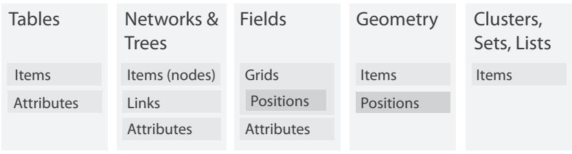  
Figure 2.3. The four basic dataset types are tables, networks, fields, and geometry; other possible collections of items are clusters, sets, and lists. These datasets are made up of five core data types: items, attributes, links, positions, and grids.

# Dataset Types

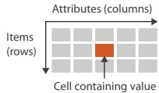  
Tables

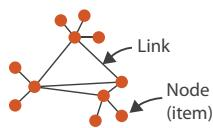  
Net works

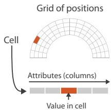  
Fields (Continuous)

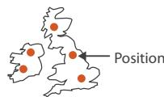  
Geometr y (Spatial)

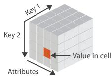  
Multidimensional Table

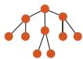  
Trees   
Figure 2.4. The detailed structure of the four basic dataset types.

# 2.4.1 Tables

Many datasets come in the form of tables that are made up of rows and columns, a familiar form to anybody who has used a spreadsheet. In this chapter, I focus on the concept of a table as simply a type of dataset that is independent of any particular visual representation; later chapters address the question of what visual representations are appropriate for the different types of datasets.

For a simple flat table, the terms used in this book are that each row represents an item of data, and each column is an attribute of the dataset. Each cell in the table is fully specified by the combination of a row and a column—an item and an attribute—and contains a value for that pair. Figure 2.5 shows an example of the first few dozen items in a table of orders, where the attributes are order ID, order date, order priority, product container, product base margin, and ship date.

A multidimensional table has a more complex structure for indexing into a cell, with multiple keys.

‣ Chapter 7 covers how to arrange tables spatially.

Keys and values are discussed further in Section 2.6.1.

<!-- Chunk 1 End -->

<!-- Chunk 2 Start -->

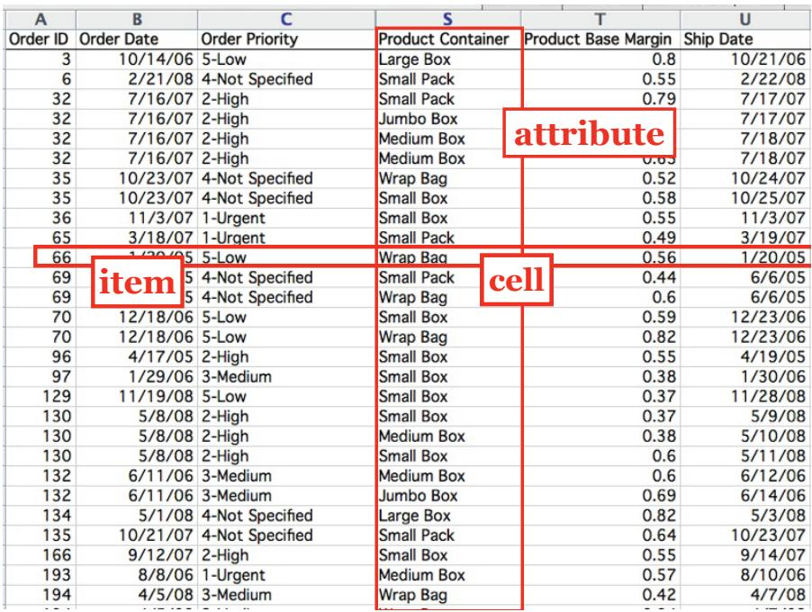  
Figure 2.5. In a simple table of orders, a row represents an item, a column represents an attribute, and their intersection is the cell containing the value for that pairwise combination.

* A synonym for networks is graphs. The word graph is also deeply overloaded in vis. Sometimes it is used to mean network as we discuss here, for instance in the vis subfield called graph drawing or the mathematical subfield called graph theory. Sometimes it is used in the field of statistical graphics to mean chart, as in bar graphs and line graphs.

* A synonym for node is ver   
* A synonym for link is edge.

# 2.4.2 Networks and Trees

The dataset type of networks is well suited for specifying that there is some kind of relationship between two or more items.* An item in a network is often called a node.* A link is a relation between two items.* For example, in an articulated social network the nodes are people, and links mean friendship. In a gene interaction network, the nodes are genes, and links between them mean that these genes have been observed to interact with each other. In a computer network, the nodes are computers, and the links represent the ability to send messages directly between two computers using physical cables or a wireless connection.

Network nodes can have associated attributes, just like items in a table. In addition, the links themselves could also be considered to have attributes associated with them; these may be partly or wholly disjoint from the node attributes.

It is again important to distinguish between the abstract concept of a network and any particular visual layout of that network where the nodes and edges have particular spatial positions. This chapter concentrates on the former.

The spatial arrangement of networks is covered in Chapter 9.

# 2.4.2.1 Trees

Networks with hierarchical structure are more specifically called trees. In contrast to a general network, trees do not have cycles: each child node has only one parent node pointing to it. One example of a tree is the organization chart of a company, showing who reports to whom; another example is a tree showing the evolutionary relationships between species in the biological tree of life, where the child nodes of humans and monkeys both share the same parent node of primates.

# 2.4.3 Fields

The field dataset type also contains attribute values associated with cells.1 Each cell in a field contains measurements or calculations from a continuous domain: there are conceptually infinitely many values that you might measure, so you could always take a new measurement between any two existing ones. Continuous phenomena that might be measured in the physical world or simulated in software include temperature, pressure, speed, force, and density; mathematical functions can also be continuous.

For example, consider a field dataset representing a medical scan of a human body containing measurements indicating the density of tissue at many sample points, spread regularly throughout a volume of 3D space. A low-resolution scan would have 262,144 cells, providing information about a cubical volume of space with 64 bins in each direction. Each cell is associated with a specific region in 3D space. The density measurements could be taken closer together with a higher resolution grid of cells, or further apart for a coarser grid.

Continuous data requires careful treatment that takes into account the mathematical questions of sampling, how frequently to

take the measurements, and interpolation, how to show values in between the sampled points in a way that does not mislead. Interpolating appropriately between the measurements allows you to reconstruct a new view of the data from an arbitrary viewpoint that’s faithful to what you measured. These general mathematical problems are studied in areas such as signal processing and statistics. Visualizing fields requires grappling extensively with these concerns.

In contrast, the table and network datatypes discussed above are an example of discrete data where a finite number of individual items exist, and interpolation between them is not a meaningful concept. In the cases where a mathematical framework is necessary, areas such as graph theory and combinatorics provide relevant ideas.2

# 2.4.3.1 Spatial Fields

Continuous data is often found in the form of a spatial field, where the cell structure of the field is based on sampling at spatial positions. Most datasets that contain inherently spatial data occur in the context of tasks that require understanding aspects of its spatial structure, especially shape.

For example, with a spatial field dataset that is generated with a medical imaging instrument, the user’s task could be to locate suspected tumors that can be recognized through distinctive shapes or densities. An obvious choice for visual encoding would be to show something that spatially looks like an X-ray image of the human body and to use color coding to highlight suspected tumors. Another example is measurements made in a real or simulated wind tunnel of the temperature and pressure of air flowing over airplane wings at many points in 3D space, where the task is to compare the flow patterns in different regions. One possible visual encoding would use the geometry of the wing as the spatial substrate, showing the temperature and pressure using size-coded arrows.

The likely tasks faced by users who have spatial field data constrains many of the choices about the use of space when designing visual encoding idioms. Many of the choices for nonspatial data, where no information about spatial position is provided with the dataset, are unsuitable in this case.*

* A synonym for nonspatial data is abstract data.

Thus, the question of whether a dataset has the type of a spatial field or a nonspatial table has extensive and far-reaching implications for idiom design. Historically, vis diverged into areas of specialization based on this very differentiation. The subfield of scientific visualization, or scivis for short, is concerned with situations where spatial position is given with the dataset. A central concern in scivis is handling continuous data appropriately within the mathematical framework of signal processing. The subfield of information visualization, or infovis for short, is concerned with situations where the use of space in a visual encoding is chosen by the designer. A central concern in infovis is determining whether the chosen idiom is suitable for the combination of data and task, leading to the use of methods from human–computer interaction and design.

# 2.4.3.2 Grid Types

When a field contains data created by sampling at completely regular intervals, as in the previous example, the cells form a uniform grid. There is no need to explicitly store the grid geometry in terms of its location in space, or the grid topology in terms of how each cell connects with its neighboring cells. More complicated examples require storing different amounts of geometric and topological information about the underlying grid. A rectilinear grid supports nonuniform sampling, allowing efficient storage of information that has high complexity in some areas and low complexity in others, at the cost of storing some information about the geometric location of each each row. A structured grid allows curvilinear shapes, where the geometric location of each cell needs to be specified. Finally, unstructured grids provide complete flexibility, but the topological information about how the cells connect to each other must be stored explicitly in addition to their spatial positions.

# 2.4.4 Geometry

The geometry dataset type specifies information about the shape of items with explicit spatial positions. The items could be points, or one-dimensional lines or curves, or 2D surfaces or regions, or 3D volumes.

Geometry datasets are intrinsically spatial, and like spatial fields they typically occur in the context of tasks that require shape understanding. Spatial data often includes hierarchical structure at multiple scales. Sometimes this structure is provided intrinsically

Section 3.4.2.3 covers deriving data.   
Section 8.4 covers generating contours from scalar fields.

* In computer science, array is often used as a synonym for list.

with the dataset, or a hierarchy may be derived from the original data.

Geometry datasets do not necessarily have attributes, in contrast to the other three basic dataset types. Many of the design issues in vis pertain to questions about how to encode attributes. Purely geometric data is interesting in a vis context only when it is derived or transformed in a way that requires consideration of design choices. One classic example is when contours are derived from a spatial field. Another is when shapes are generated at an appropriate level of detail for the task at hand from raw geographic data, such as the boundaries of a forest or a city or a country, or the curve of a road. The problem of how to create images from a geometric description of a scene falls into another domain: computer graphics. While vis draws on algorithms from computer graphics, it has different concerns from that domain. Simply showing a geometric dataset is not an interesting problem from the point of view of a vis designer.

Geometric data is sometimes shown alone, particularly when shape understanding is the primary task. In other cases, it is the backdrop against which additional information is overlaid.

# 2.4.5 Other Combinations

Beyond tables, there are many ways to group multiple items together, including sets, lists, and clusters. A set is simply an unordered group of items. A group of items with a specified ordering could be called a list.* A cluster is a grouping based on attribute similarity, where items within a cluster are more similar to each other than to ones in another cluster.

There are also more complex structures built on top of the basic network type. A path through a network is an ordered set of segments formed by links connecting nodes. A compound network is a network with an associated tree: all of the nodes in the network are the leaves of the tree, and interior nodes in the tree provide a hierarchical structure for the nodes that is different from network links between them.

Many other kinds of data either fit into one of the previous categories or do so after transformations to create derived attributes. Complex and hybrid combinations, where the complete dataset contains multiple basic types, are common in real-world applications.

The set of basic types presented above is a starting point for describing the what part of an analysis instance that pertains to

# Dataset Availability

Static

Dynamic

  
Figure 2.6. Dataset availability can be either static or dynamic, for any dataset type.

data; that is, the data abstraction. In simple cases, it may be possible to describe your data abstraction using only that set of terms. In complex cases, you may need additional description as well. If so, your goal should be to translate domain-specific terms into words that are as generic as possible.

# 2.4.6 Dataset Availability

Figure 2.6 shows the two kinds of dataset availability: static or dynamic.

The default approach to vis assumes that the entire dataset is available all at once, as a static file. However, some datasets are instead dynamic streams, where the dataset information trickles in over the course of the vis session.* One kind of dynamic change is to add new items or delete previous items. Another is to change the values of existing items.

This distinction in availability crosscuts the basic dataset types: any of them can be static or dynamic. Designing for streaming data adds complexity to many aspects of the vis process that are straightforward when there is complete dataset availability up front.

* A synonym for dynamic s online, and a synonymi or static is offline.f

# 2.5 Attribute Types

Figure 2.7 shows the attribute types. The major disinction is between categorical versus ordered. Within the ordered type is a further differentiation between ordinal versus quantitative. Ordered data might range sequentially from a minimum to a maximum value, or it might diverge in both directions from a zero point in the middle of a range, or the values may wrap around in a cycle. Also, attributes may have hierarchical structure.

# Attributes

# Attribute Types

Categorical

Ordered

Ordinal

Quantitative

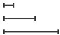

# Ordering Direc tion

Sequential

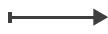

Diverging

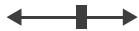

Cyclic

  
Figure 2.7. Attribute types are categorical, ordinal, or quantitative. The direction of attribute ordering can be sequential, diverging, or cyclic.

# 2.5.1 Categorical

* A synonym for categorical is nominal.

The first distinction is between categorical and ordered data. The type of categorical data, such as favorite fruit or names, does not have an implicit ordering, but it often has hierarchical structure.* Categories can only distinguish whether two things are the same (apples) or different (apples versus oranges). Of course, any arbitrary external ordering can be imposed upon categorical data. Fruit could be ordered alphabetically according to its name, or by its price—but only if that auxiliary information were available. However, these orderings are not implicit in the attribute itself, the way they are with quantitative or ordered data. Other examples of categorical attributes are movie genres, file types, and city names.

# 2.5.2 Ordered: Ordinal and Quantitative

All ordered data does have an implicit ordering, as opposed to unordered categorical data. This type can be further subdivided. With ordinal data, such as shirt size, we cannot do full-fledged arithmetic, but there is a well-defined ordering. For example, large minus medium is not a meaningful concept, but we know that medium falls between small and large. Rankings are another kind

of ordinal data; some examples of ordered data are top-ten lists of movies or initial lineups for sports tournaments depending on past performance.

A subset of ordered data is quantitative data, namely, a measurement of magnitude that supports arithmetic comparison. For example, the quantity of 68 inches minus 42 inches is a meaningful concept, and the answer of 26 inches can be calculated. Other examples of quantitative data are height, weight, temperature, stock price, number of calling functions in a program, and number of drinks sold at a coffee shop in a day. Both integers and real numbers are quantitative data.3

In this book, the ordered type is used often; the ordinal type is only occasionally mentioned, when the distinction between it and the quantitative type matters.

# 2.5.2.1 Sequential versus Diverging

Ordered data can be either sequential, where there is a homogeneous range from a minimum to a maximum value, or diverging, which can be deconstructed into two sequences pointing in opposite directions that meet at a common zero point. For instance, a mountain height dataset is sequential, when measured from a minimum point of sea level to a maximum point of Mount Everest. A bathymetric dataset is also sequential, with sea level on one end and the lowest point on the ocean floor at the other. A full elevation dataset would be diverging, where the values go up for mountains on land and down for undersea valleys, with the zero value of sea level being the common point joining the two sequential datasets.

# 2.5.2.2 Cyclic

Ordered data may be cyclic, where the values wrap around back to a starting point rather than continuing to increase indefinitely. Many kinds of time measurements are cyclic, including the hour of the day, the day of the week, and the month of the year.

# 2.5.3 Hierarchical Attributes

There may be hierarchical structure within an attribute or between multiple attributes. The daily stock prices of companies collected

Section 13.4 covers hierarchical aggregation in more detail, and Section 7.5 covers the visual encoding of attribute hierarchies.

over the course of a decade is an example of a time-series dataset, where one of the attributes is time. In this case, time can be aggregated hierarchically, from individual days up to weeks, up to months, up to years. There may be interesting patterns at multiple temporal scales, such as very strong weekly variations for weekday versus weekend, or more subtle yearly patterns showing seasonal variations in summer versus winter. Many kinds of attributes might have this sort of hierarchical structure: for example, the geographic attribute of a postal code can be aggregated up to the level of cities or states or entire countries.

# 2.6 Semantics

Knowing the type of an attribute does not tell us about its semantics, because these two questions are crosscutting: one does not dictate the other. Different approaches to considering the semantics of attributes that have been proposed across the many fields where these semantics are studied. The classification in this book is heavily focused on the semantics of keys versus values, and the related questions of spatial and continuous data versus nonspatial and discrete data, to match up with the idiom design choice analysis framework. One additional consideration is whether an attribute is temporal.

# 2.6.1 Key versus Value Semantics

* A synonym for key attribute is independent attribute. A synonym for value attribute is dependent attribute. The language of independent and dependent is common in statistics. In the language of data warehouses, a synonym for independent is dimension, and a synonym for dependent is measure.

A key attribute acts as an index that is used to look up value attributes.* The distinction between key and value attributes is important for the dataset types of tables and fields, as shown in Figure 2.8.

# 2.6.1.1 Flat Tables

A simple flat table has only one key, where each item corresponds to a row in the table, and any number of value attributes. In this case, the key might be completely implicit, where it’s simply the index of the row. It might be explicit, where it is contained within the table as an attribute. In this case, there must not be any duplicate values within that attribute. In tables, keys may be categorical or ordinal attributes, but quantititive attributes are typically unsuitable as keys because there is nothing to prevent them from having the same values for multiple items.

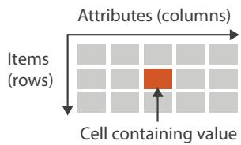  
Tables

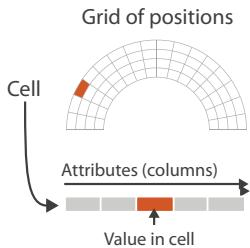  
Fields (Continuous)

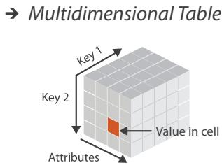  
Key and value semantics for tables and fields.

For example, in Table 2.1, Name is a categorical attribute that might appear to be a reasonable key at first, but the last line shows that two people have the same name, so it is not a good choice. Favorite Fruit is clearly not a key, despite being categorical, because Pear appears in two different rows. The quantitative attribute of Age has many duplicate values, as does the ordinal attribute of Shirt Size. The first attribute in this flat table has an explicit unique identifier that acts as the key.4 This key attribute could either be ordinal, for example if the order that the rows were entered into the table captures interesting temporal information, or categorical, if it’s simply treated as a unique code.

Figure 2.9 shows the order table from Figure 2.5 where each attribute is colored according to its type. There is no explicit key: even the Order ID attribute has duplicates, because orders consist of multiple items with different container sizes, so it does not act as a unique identifier. This table is an example of using an implicit key that is the row number within the table.

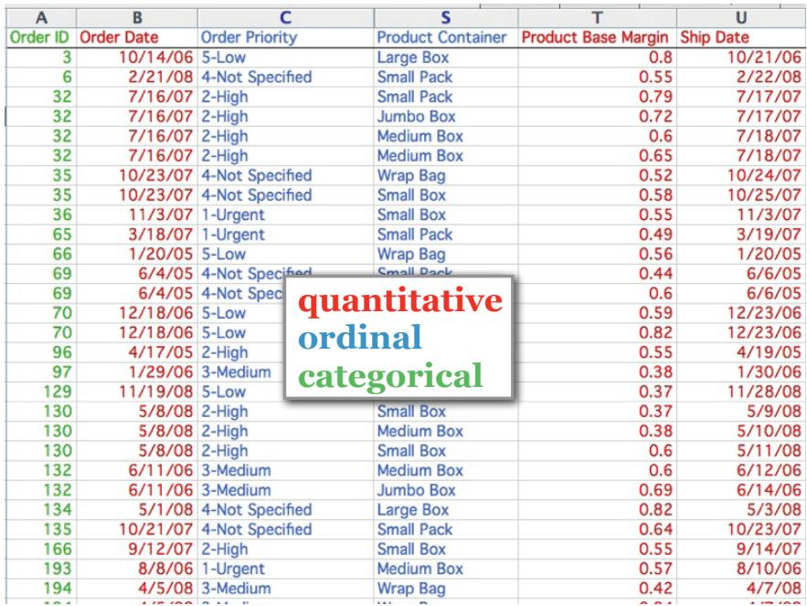  
Figure 2.9. The order table with the attribute columns colored by their type; none of them is a key.

# 2.6.1.2 Multidimensional Tables

The more complex case is a multidimensional table, where multiple keys are required to look up an item. The combination of all keys must be unique for each item, even though an individual key attribute may contain duplicates. For example, a common multidimensional table from the biology domain has a gene as one key and time as another key, so that the value in each cell is the activity level of a gene at a particular time.

The information about which attributes are keys and which are values may not be available; in many instances determining which attributes are independent keys versus dependent values is the goal of the vis process, rather than its starting point. In this case, the successful outcome of analysis using vis might be to recast a flat table into a more semantically meaningful multidimensional table.

# 2.6.1.3 Fields

Although fields differ from tables a fundamental way because they represent continuous rather than discrete data, keys and values are still central concerns. (Different vocabulary for the same basic idea is more common with spatial field data, where the term independent variable is used instead of key, and dependent variable instead of value.)

Fields are structured by sampling in a systematic way so that each grid cell is spanned by a unique range from a continuous domain. In spatial fields, spatial position acts as a quantitative key, in contrast to a nonspatial attribute in the case of a table that is categorical or ordinal. The crucial difference between fields and tables is that useful answers for attribute values are returned for locations throughout the sampled range, not just the exact points where data was recorded.

Fields are typically characterized in terms of the number of keys versus values. Their multivariate structure depends on the number of value attributes, and their multidimensional structure depends on the number of keys. The standard multidimensional cases are 2D and 3D fields for static measurements taken in two or three spatial dimensions,5 and fields with three or four keys, in the case where these measurements are time-varying. A field can be both multidimensional and multivariate if it has multiple keys and multiple values. The standard classification according to multivariate structure is that a scalar field has one attribute per cell, a vector field has two or more attributes per cell, and a tensor field has many attributes per cell.*

# 2.6.1.4 Scalar Fields

A scalar field is univariate, with a single value attribute at each point in space. One example of a 3D scalar field is the time-varying medical scan above; another is the temperature in a room at each point in 3D space. The geometric intuition is that each point in a scalar field has a single value. A point in space can have several different numbers associated with it; if there is no underlying connection between them then they are simply multiple separate scalar fields.

# 2.6.1.5 Vector Fields

A vector field is multivariate, with a list of multiple attribute values at each point. The geometric intuition is that each point in a vector

* These definitions of scalar, vector, and tensor follow the common usage in vis. In a strict mathematical sense, these distinctions are not technically correct, since scalars and vectors are included as a degenerate case of tensors. Mapping the mathematical usage to the vis usage, scalars mean mathematical tensors of order 0, vectors mean mathematical tensors of order 1, and tensors mean mathematical tensors of order 2 or more.

field has a direction and magnitude, like an arrow that can point in any direction and that can be any length. The length might mean the speed of a motion or the strength of a force. A concrete example of a 3D vector field is the velocity of air in the room at a specific time point, where there is a direction and speed for each item. The dimensionality of the field determines the number of components in the direction vector; its length can be computed directly from these components, using the standard Euclidean distance formula. The standard cases are two, three, or four components, as above.

# 2.6.1.6 Tensor Fields

A tensor field has an array of attributes at each point, representing a more complex multivariate mathematical structure than the list of numbers in a vector. A physical example is stress, which in the case of a 3D field can be defined by nine numbers that represent forces acting in three orthogonal directions. The geometric intution is that the full information at each point in a tensor field cannot be represented by just an arrow and would require a more complex shape such as an ellipsoid.

# 2.6.1.7 Field Semantics

This categorization of spatial fields requires knowledge of the attribute semantics and cannot be determined from type information alone. If you are given a field with multiple measured values at each point and no further information, there is no sure way to know its structure. For example, nine values could represent many things: nine separate scalar fields, or a mix of multiple vector fields and scalar fields, or a single tensor field.

# 2.6.2 Temporal Semantics

A temporal attribute is simply any kind of information that relates to time. Data about time is complicated to handle because of the rich hierarchical structure that we use to reason about time, and the potential for periodic structure. The time hierarchy is deeply multiscale: the scale of interest could range anywhere from nanoseconds to hours to decades to millennia. Even the common words time and date are a way to partially specify the scale of temporal interest. Temporal analysis tasks often involve finding or verifying periodicity either at a predetermined scale or at some scale not known in advance. Moreover, the temporal scales of interest do not all fit into a strict hierarchy; for instance, weeks do not fit

cleanly into months. Thus, the generic vis problems of transformation and aggregation are often particularly complex when dealing with temporal data. One important idea is that even though the dataset semantics involves change over time, there are many approaches to visually encoding that data—and only one of them is to show it changing over time in the form of an animation.

Temporal attributes can have either value or key semantics. Examples of temporal attributes with dependent value semantics are a duration of elapsed time or the date on which a transaction occurred. In both spatial fields and abstract tables, time can be an independent key. For example, a time-varying medical scan can have the independent keys of $x , y , z , t$ to cover spatial position and time, with the dependent value attribute of density for each combination of four indices to look up position and time. A temporal key attribute is usually considered to have a quantitative type, although it’s possible to consider it as ordinal data if the duration between events is not interesting.

# 2.6.2.1 Time-Varying Data

A dataset has time-varying semantics when time is one of the key attributes, as opposed to when the temporal attribute is a value rather than a key. As with other decisions about semantics, the question of whether time has key or value semantics requires external knowledge about the nature of the dataset and cannot be made purely from type information. An example of a dataset with time-varying semantics is one created with a sensor network that tracks the location of each animal within a herd by taking new measurements every second. Each animal will have new location data at every time point, so the temporal attribute is an independent key and is likely to be a central aspect of understanding the dataset. In contrast, a horse-racing dataset covering a year’s worth of races could have temporal value attributes such as the race start time and the duration of each horse’s run. These attributes do indeed deal with temporal information, but the dataset is not timevarying.

A common case of temporal data occurs in a time-series dataset, namely, an ordered sequence of time–value pairs. These datasets are a special case of tables, where time is the key. These timevalue pairs are often but not always spaced at uniform temporal intervals. Typical time-series analysis tasks involve finding trends, correlations, and variations at multiple time scales such as hourly, daily, weekly, and seasonal.

Section 3.4.2.3 introduces the problem of data transformation. Section 13.4 discusses the question of aggregation in detail.   
Vision versus memory is discussed further in Section 6.5.

The dataset types of dynamic streams versus static files are discussed in Section 2.4.6.

The word dynamic is often used ambiguously to mean one of two very different things. Some use it to mean a dataset has timevarying semantics, in contrast to a dataset where time is not a key attribute, as discussed here. Others use it to mean a dataset has stream type, in contrast to an unchanging file that can be loaded all at once. In this latter sense, items and attributes can be added or deleted and their values may change during a running session of a vis tool. I carefully distinguish between these two meanings here.

# 2.7 Further Reading

The Big Picture The framework presented here was inspired in part by the many taxonomies of data that have been previously proposed, including the synthesis chapter at the beginning of an early collection of infovis readings [Card et al. 99], a taxonomy that emphasizes the division between continuous and discrete data [Tory and Moller ¨ 04a], and one that emphasizes both data and tasks [Shneiderman 96].

Field Datasets Several books discuss the spatial field dataset type in far more detail, including two textbooks [Telea 07, Ward et al. 10], a voluminous handbook [Hansen and Johnson 05], and the vtk book [Schroeder et al. 06].

Attribute Types The attribute types of categorical, ordered, and quantitative were proposed in the seminal work on scales of measurement from the psychophysics literature [Stevens 46]. Scales of measurement are also discussed extensively in the book The Grammar of Graphics [Wilkinson 05] and are used as the foundational axes of an influential vis design space taxonomy [Card and Mackinlay 97].

Key and Value Semantics The Polaris vis system, which has been commercialized as Tableau, is built around the distinction between key attributes (independent dimensions) and value attributes (dependent measures) [Stolte et al. 02].

Temporal Semantics A good resource for time-oriented data vis is a recent book, Visualization of Time-Oriented Data [Aigner et al. 11].

#

# Why?

# Ac tions

# Targets

# $\textcircled{7}$ Analyze

Consume

Discover

Present

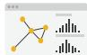

Enjoy

Produce

Annotate

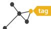

Record

Derive

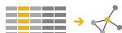

# $\textcircled{7}$ Search

<table><tr><td></td><td>Target known</td><td>Target unknown</td></tr><tr><td>Location known</td><td>Lookup</td><td>Browse</td></tr><tr><td>Location unknown</td><td>&lt;LOC&gt;Locate</td><td>Explore</td></tr></table>

# $\textcircled{7}$ Quer y

Identify

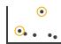

Compare

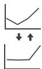

Summarize

# All Data

Trends

Outliers

Features

# Attributes

One

Distribution

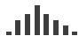

Extremes

Many

Dependency

Correlation

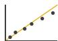

Similarity

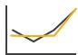

# Network Data

Topology

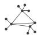

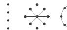

Paths

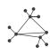

# Spatial Data

Shape

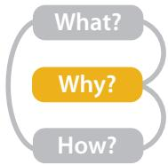  
Figure 3.1. Why people are using vis in terms of actions and targets.

