# Chapter 3

# Why: Task Abstraction

# 3.1 The Big Picture

Figure 3.1 breaks down into actions and targets the reasons why a vis tool is being used. The highest-level actions are to use vis to consume or produce information. The cases for consuming are to present, to discover, and to enjoy; discovery may involve generating or verifying a hypothesis. At the middle level, search can be classified according to whether the identity and location of targets are known or not: both are known with lookup, the target is known but its location is not for locate, the location is known but the target is not for browse, and neither the target nor the location are known for explore. At the low level, queries can have three scopes: identify one target, compare some targets, and summarize all targets. Targets for all kinds of data are finding trends and outliers. For one attribute, the target can be one value, the extremes of minimum and maximum values, or the distribution of all values across the entire attribute. For multiple attributes, the target can be dependencies, correlations, or similarities between them. The target with network data can be topology in general or paths in particular, and with spatial data the target can be shape.

# 3.2 Why Analyze Tasks Abstractly?

This framework encourages you to consider tasks in abstract form, rather than the domain-specific way that users typically think about them.

Transforming task descriptions from domain-specific language into abstract form allows you to reason about similarities and differences between them. Otherwise, it’s hard to make useful comparisons between domain situations, because if you don’t do this kind of translation then everything just appears to be different. That apparent difference is misleading: there are a lot of similar-

ities in what people want to do once you strip away the surface language differences.

For example, an epidimiologist studying the spread of a new strain of influenza might initially describe her task as “contrast the prognosis of patients who were intubated in the ICU more than one month after exposure to patients hospitalized within the first week”, while a biologist studying immune system response might use language such as “see if the results for the tissue samples treated with LL-37 match up with the ones without the peptide”. Even if you know what all the specialized vocabulary means, it’s still hard to think about what these two descriptions have in common because they’re using different words: “contrast” versus “match up”. If you transform these into descriptions using a consistent set of generic terms, then you can spot that these two tasks are just two instances of the same thing: “compare values between two groups”.

The analysis framework has a small set of carefully chosen words to describe why people are using vis, designed to help you crisply and concisely distinguish between different goals. This set has verbs describing actions, and nouns describing targets. It’s possible that you might decide to use additional terms to completely and precisely describe the user’s goals; if so, strive to translate domain-specific terms into words that are as generic as possible.

The same vis tool might be usable for many different goals. It is often useful to consider only one of the user’s goals at a time, in order to more easily consider the question of how a particular idiom supports that goal. To describe complex activities, you can specify a chained sequence of tasks, where the output of one becomes the input to the next.

Another important reason to analyze the task is to understand whether and how to transform the user’s original data into different forms by deriving new data. That is, the task abstraction can and should guide the data abstraction.

# 3.3 Who: Designer or User

It’s sometimes useful to augment an analysis instance specification by indicating who has a goal or makes a design choice: the designer of the vis or the end user of the vis. Both cases are common.

Vis tools fall somewhere along a continuum from specific to general. On the specific side, tools are narrow: the designer has built many choices into the design of the tool itself in a way that the user cannot override. These tools are limited in the kinds of data and tasks that they can address, but their strength is that users are not faced with an overwhelming array of design choices. On the general side, tools are flexible and users have many choices to make. The breadth of choices is both a strength and a limitation: users have a lot of power, but they also may make ineffective choices if they do not have a deep understanding of many vis design issues.

Specialized vis tools are designed for specific contexts with a narrow range of data configurations, especially those created through a problem-driven process. These specialized datasets are often an interesting mix of complex combinations of and special cases of the basic data types. They also are a mix of original and derived data. In contrast, general vis tools are designed to handle a wide range of data in a flexible way, for example, by accepting any dataset of a particular type as input: tables, or fields, or networks. Some particularly broad tools handle multiple dataset types, for instance, supporting transformations between tables and networks.

Dataset types are covered in Section 2.4.

# 3.4 Actions

Figure 3.2 shows three levels of actions that define user goals. The high-level choices describe how the vis is being used to analyze, either to consume existing data or to also produce additional data. The mid-level choices cover what kind of search is involved, in terms of whether the target and location are known or not. The low-level choices pertain to the kind of query: does the user need to identify one target, compare some targets, or summarize all of the targets? The choices at each of these three levels are independent from each other, and it’s usually useful to describe actions at all three of them.

# 3.4.1 Analyze

At the highest level, the framework distinguishes between two possible goals of people who want to analyze data using a vis tool: users might want only to consume existing information or also to actively produce new information.

The most common use case for vis is for the user to consume information that has already been generated as data stored in a

# Actions

# Analyze

Consume

Discover

Present

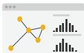

Enjoy

Produce

Annotate

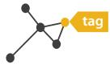

Record

Derive

# Search

<table><tr><td></td><td>Target known</td><td>Target unknown</td></tr><tr><td>Location known</td><td>••••Lookup</td><td>••••Browse</td></tr><tr><td>Location unknown</td><td>&lt;••••Locate</td><td>&lt;••••Explore</td></tr></table>

# Query

Identify

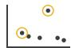

Compare

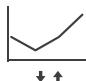

Summarize

  
Figure 3.2. Three levels of actions: analyze, search, and query.

format amenable to computation. The framework has three further distinctions within that case: whether the goal is to present something that the user already understands to a third party, or for the user to discover something new or analyze information that

is not already completely understood, or for users to enjoy a vis to indulge their casual interests in a topic.

# 3.4.1.1 Discover

The discover goal refers to using vis to find new knowledge that was not previously known. Discovery may arise from the serendipitous observation of unexpected phenomena, but investigation may be motivated by existing theories, models, hypotheses, or hunches. This usage includes the goal of finding completely new things; that is, the outcome is to generate a new hypothesis. It also includes the goal of figuring out whether a conjecture is true or false; that is, to verify—or disconfirm—an existing hypothesis.

While vis for discovery is often associated with modes of scientific inquiry, it is not restricted to domain situations that are formally considered branches of science. The discover goal is often discussed as the classic motivation for sophisticated interactive idioms, because the vis designer doesn’t know in advance what the user will need to see.* The fundamental motivation of this analysis framework is to help you separate out the questions of why the vis is being used from how the vis idiom is designed to achieve those goals, so I will repeatedly emphasize that why doesn’t dictate how.

* This distinction between the goals of presentation of the known and discovery of the unknown is very common in the vis literature, but other sources may use different terms, such as explain versus explore.

# 3.4.1.2 Present

The present goal refers to the use of vis for the succinct communication of information, for telling a story with data, or guiding an audience through a series of cognitive operations. Presentation using vis may take place within the context of decision making, planning, forecasting, and instructional processes. The crucial point about the present goal is that vis is being used by somebody to communicate something specific and already understood to an audience.

Presentation may involve collaborative or pedagogical contexts, and the means by which a presentation is given may vary according to the size of the audience, whether the presentation is live or prerecorded, and whether the audience is in the same place as the presenter. One classic example of a present vis is static information graphics, such as a diagram in a newspaper or an image in a blog. However, the present goal is not intrinsically limited to a static visual encoding idiom; it’s very possible to pursue this goal with dynamic vis idioms that include interaction and animation. Once again, the decision about why is separable from how the id-

iom is designed: presentation can be supported through a wide variety of idiom design choices.

A crucial aspect of presentation is that the knowledge communicated is already known to the presenter in advance. Sometimes the presenter knows it before using vis at all and uses the vis only for communication. In other cases, the knowledge arose from the presenter’s previous use of vis with the goal of discovery, and it’s useful to think about a chained sequence of tasks where the output of a discover session becomes the input to a present session.

# 3.4.1.3 Enjoy

The enjoy goal refers to casual encounters with vis. In these contexts, the user is not driven by a previously pressing need to verify or generate a hypothesis but by curiosity that might be both stimulated and satisfied by the vis. Casual encounters with vis for enjoyment can be fleeting, such as when looking at an infographic while reading a blog post. However, users can become sufficiently engaged with an enjoyable vis tool that they use it intensively for a more extended period of time.

One aspect of this classification that’s tricky is that the goals of the eventual vis user might not be a match with the user goals conjectured by the vis designer. For example, a vis tool may have been intended by the designer for the goal of discovery with a particular audience, but it might be used for pure enjoyment by a different group of people. In the analyses presented in this book I’ll assume that these goals are aligned, but in your own experience as a designer you might need to consider how they might diverge.

Figure 3.3 shows the Name Voyager, which was created for expectant parents deciding what to name their new baby. When the user types characters of a name, the vis shows data for the popularity of names in the United States since 1900 that start with that sequence of characters. The tool uses the visual encoding idiom where each name has a stripe whose height corresponds to popularity at a given time. Currently popular names are brighter, and gender is encoded by color. The Name Voyager appealed to many people with no interest in having children, who analyzed many different historical trends and posted extensively about their findings in their personal blogs, motivated by their own enjoyment rather than a pressing need [Wattenberg 05].

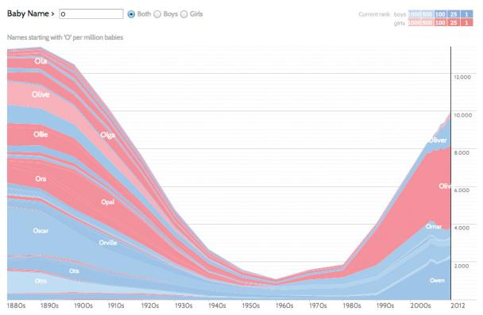

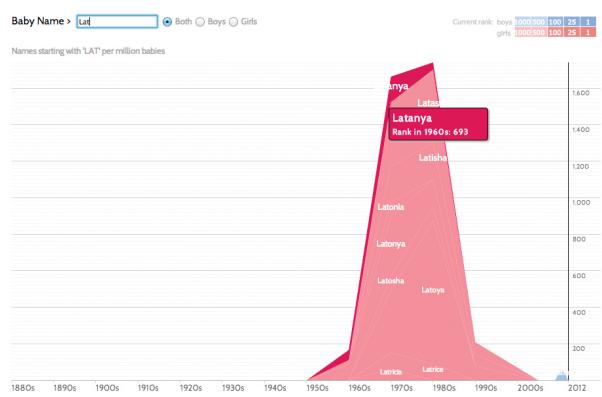  
Figure 3.3. Name Voyager, a vis tool originally intended for parents focused deciding on what to name their expected baby, ended up being used by many nonparents to analyze historical trends for their own enjoyment. Left: Names starting with ‘O’ had a notable dip in popularity in the middle of the century. Right: Names starting with ‘LAT’ show a trend of the 1970s. After [Wattenberg 05, Figures 2 and 3], using http://www.babynamewizard.com.

# 3.4.2 Produce

In contrast to using vis only for consuming existing information, in the produce case the intent of the user is to generate new material. Often the goal with produce is to produce output that is used immediately, as input to a next instance. Sometimes the user intends to use this new material for some other vis-related task later on, such as discovery or presentation. Sometimes the intended use of the new material is for some other purpose that does not require vis, such as downstream analysis using nonvisual tools. There are three kinds of produce goals: annotate, record, and derive.

# 3.4.2.1 Annotate

The annotate goal refers to the addition of graphical or textual annotations associated with one or more preexisting visualization elements, typically as a manual action by the user. When an annotation is associated with data items, the annotation could be thought of as a new attribute for them. For example, the user could annotate all of the points within a cluster with a text label.

‣ Attributes are covered in Chapter 2.

# 3.4.2.2 Record

The record goal saves or captures visualization elements as persistent artifacts. These artifacts include screen shots, lists of book-

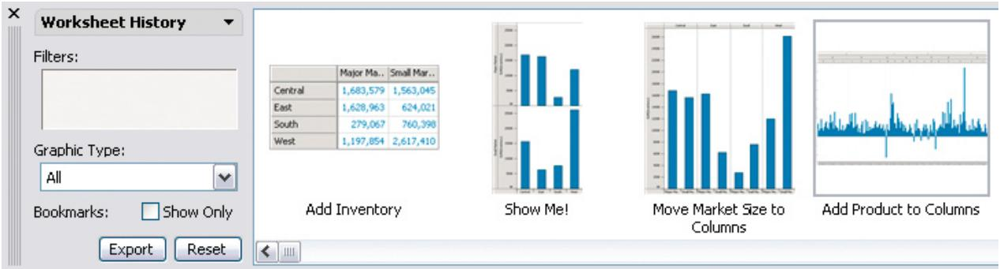  
Figure 3.4. Graphical history recorded during an analysis session with Tableau. From [Heer et al. 08, Figure 1].

marked elements or locations, parameter settings, interaction logs, or annotations. The record choice saves a persistent artifact, in contrast to the annotate, which attaches information temporarily to existing elements; an annotation made by a user can subsequently be recorded. One interesting example of a record goal is to assemble a graphical history, in which the output of each task includes a static snapshot of the view showing its current state, and these snapshots accumulate in a branching meta-visualization showing what occurred during the user’s entire session of using the vis tool. Figure 3.4 shows an example from the Tableau vis tool [Heer et al. 08]. Recording and retaining artifacts such as these are often desirable for maintaining a sense of analytical provenance, allowing users to revisit earlier states or parameter settings.

# 3.4.2.3 Derive

The derive goal is to produce new data elements based on existing data elements. New attributes can be derived from information contained within existing ones, or data can be transformed from one type into another. Deriving new data is a critical part of the vis design process. The common case is that deriving new data is a choice made by vis designers, but this choice could also be driven by a user of a vis tool.

When you are faced with a dataset, you should always consider whether to simply use it as is, or to transform it to another form: you could create newly derived attributes from the original ones, or even transform the dataset from the original type to another one.

There is a strong relationship between the form of the data— the attribute and dataset types—and what kinds of vis idioms are

effective at displaying it. The good news is that your hands are not tied as a designer because you can transform the data into a form more useful for the task at hand. Don’t just draw what you’re given; decide what the right thing to show is, create it with a series of transformations from the original dataset, and draw that!

The ability to derive new data is why the data abstraction used in a vis tool is an active choice on the part of the designer, rather than simply being dictated by what the user provides. Changing the dataset to another form by deriving new attributes and types greatly expands the design space of possible vis idioms that you can use to display it. The final data abstraction that you choose might simply be the dataset in its original form, but more complex data abstractions based on deriving new attributes and types are frequently necessary if you’re designing a vis tool for a complex, real-world use case. Similarly, when you consider the design of an existing vis system, understanding how the original designer chose to transform the given dataset should be a cornerstone of your analysis.

A dataset often needs to be transformed beyond its original state in order to create a visual encoding that can solve the desired problem. To do so, we can create derived attributes that extend the dataset beyond the original set of attributes that it contains.*

In some cases, the derived attribute encodes the same data as the original, but with a change of type. For example, a dataset might have an original attribute that is quantitative data: for instance, floating point numbers that represent temperature. For some tasks, like finding anomalies in local weather patterns, that raw data might be used directly. For another task, like deciding whether water is an appropriate temperature for a shower, that quantitative attribute might be transformed into a new derived attribute that is ordered: hot, warm, or cold. In this transformation, most of the detail is aggregated away. In a third example, when making toast, an even more lossy transformation into a binary categorical attribute might suffice: burned or not burned.

In other cases, creating the derived attribute requires access to additional information. For a geographic example, a categorical attribute of city name could be transformed into two derived quantitative attributes containing the latitude and longitude of the city. This transformation could be accomplished through a lookup to a separate, external database.

A new derived attribute may be created using arithmetic, logical, or statistical operations ranging from simple to complex. A common simple operation is subtracting two quantitative attributes

* A synonym for derive is transform.

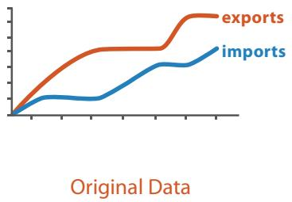  
(a)

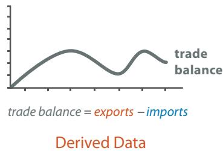  
(b)   
Figure 3.5. Derived attributes can be directly visually encoded. (a) Two original data attributes are plotted, imports and exports. (b) The quantitative derived attribute of trade balance, the difference between the two originals, can be plotted directly.

to create a new quantitative difference attribute, which can then be directly visually encoded. Figure 3.5 shows an example of encoding two attributes directly, versus encoding the derived variable of the difference between them. For tasks that require understanding this difference, Figure 3.5(b) is preferable because it encodes the difference directly. The user can interpret the information by judging position along a common frame. In contrast, in Figure 3.5(a) the user must judge the difference in heights between the two original curves at each step, a perceptual operation that is more difficult and demanding. This operation is simple because it is localized to a pair of attribute values; a more complex operation would require global computations across all values for an attribute, such as averaging for a single attribute or the correlation between two of them.

Datasets can be transformed into new ones of a different type, just as new attributes can be derived from existing ones. The full process of creating derived data may involve multiple stages of transformation.

For example, the VxInsight system transforms a table of genomics data into a network through a multistage derivation process by first creating a quantitative derived attribute of similarity, and then creating a derived network with links only between the most similar items [Davidson et al. 01]. The table had 6000 rows of yeast genes, and 18 columns containing measurements of the gene activity level in a specific experimental condition. The values in the columns were used to derive a new attribute, the similar-

ity score, defined between each pair of genes. The similarity score was computed using sophisticated statistical processing to be robust in the presence of nonlinear and noisy data, as occurs in this sort of biological application. This derived attribute was then used to create a derived network, where the nodes in the network were genes. A link was established between two genes when the similarity score was high; specifically, links were created only for the top 20 similarity scores.

# 3.4.3 Search

All of the high-level analyze cases require the user to search for elements of interest within the vis as a mid-level goal.* The classification of search into four alternatives is broken down according to whether the identity and location of the search target is already known or not.

# 3.4.3.1 Lookup

If users already know both what they’re looking for and where it is, then the search type is simply lookup. For example, a user of a tree vis showing the ancestral relationships between mammal species might want to look up humans, and can get to the right spot quickly by remembering how humans are classified: they’re in the group that has live young rather than laying eggs like a platypus or having a pouch like kangaroos, and within that group humans fall into the category of primates.

# 3.4.3.2 Locate

To find a known target at an unknown location, the search type is locate: that is, find out where the specific object is. In a similar example, the same user might not know where to find rabbits, and would have to look around in a number of places before locating them as lagomorphs (not rodents)!

# 3.4.3.3 Browse

In contrast, the exact identity of a search target might not be known in advance; rather, it might be specified based on characteristics. In this case, users are searching for one or more items that fit some kind of specification, such as matching up with a particular range of attribute values. When users don’t know exactly what they’re looking for, but they do have a location in mind

* The verb find is often used as a synonym in descriptions of search tasks, implying a successful outcome.

of where to look for it, the search type is browse. For instance, if a user of a tree vis is searching within a particular subtree for leaf nodes having few siblings, it would be an instance of browse because the location is known in advance, even though the exact identity of the search target isn’t. Another example of browsing is a user of a vis tool with the visual encoding idiom of a line graph displaying the share price of multiple companies over the past month, who examines the share price of each line on June 15.

# 3.4.3.4 Explore

When users are not even sure of the location, the search type is explore. It entails searching for characteristics without regard to their location, often beginning from an overview of everything. Examples include searching for outliers in a scatterplot, for anomalous spikes or periodic patterns in a line graph of time-series data, or for unanticipated spatially dependent patterns in a choropleth map.

# 3.4.4 Query

Once a target or set of targets for a search has been found, a lowlevel user goal is to query these targets at one of three scopes: identify, compare, or summarize. The progression of these three corresponds to an increase in the amount of search targets under consideration: one, some, or all. That is, identify refers to a single target, compare refers to multiple targets, and summarize refers to the full set of possible targets.

For a concrete example, consider different uses of a choropleth map of US election results, where each state is color-coded by the party that won. A user can identify the election results for one state, compare the election results of one state to another, or summarize the election results across all states to determine how many favored one candidate or the other or to determine the overall distribution of margin of victory values.

# 3.4.4.1 Identify

The scope of identify is a single target. If a search returns known targets, either by lookup or locate, then identify returns their characteristics. For example, a user of a static map that represents US election results by color coding each state red or blue, with the saturation level of either hue showing the proportion, can identify

the winning party and margin of victory for the state of California. Conversely, if a search returns targets matching particular characteristics, either by browse or explore, then identify returns specific references. For instance, the election map user can identify the state having the highest margin of victory.

# 3.4.4.2 Compare

The scope of compare is multiple targets. Comparison tasks are typically more difficult than identify tasks and require more sophisticated idioms to support the user. For example, the capability of inspecting a single target in detail is often necessary, but not sufficient, for comparison.

# 3.4.4.3 Summarize

The scope of summarize task is all possible targets. A synonym for summarize is overview, a term is frequently used in the vis literature both as a verb, where it means to provide a comprehensive view of everything, and as a noun, where it means a summary display of everything. The goal of providing an overview is extremely common in visualization.

# 3.5 Targets

Figure 3.6 shows four kinds of abstract targets. The actions discussed above refer to a target, meaning some aspect of the data that is of interest to the user. Targets are nouns, whereas actions are verbs. The idea of a target is explicit with search and query actions. It is more implicit with the use actions, but still relevant: for example, the thing that the user presents or discovers.

Three high-level targets are very broadly relevant, for all kinds of data: trends, outliers, and features. A trend is a high-level characterization of a pattern in the data.* Simple examples of trends include increases, decreases, peaks, troughs, and plateaus. Almost inevitably, some data doesn’t fit well with that backdrop; those elements are the outliers.* The exact definition of features is task dependent, meaning any particular structures of interest.

Attributes are specific properties that are visually encoded. The lowest-level target for an attribute is to find an individual value. Another frequent target of interest is to find the extremes: the minimum or maximum value across the range. A very common

Section 6.7 discusses the question of how and when to provide overviews.

* Indeed, a synonym for trend is simply pattern.   
* There are many other synonyms for outliers, including anomalies, novelties, deviants, and surprises.   
Attributes are discussed in detail in Chapter 2.

# Targets

# All Data

Trends

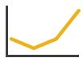

Outliers

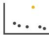

Features

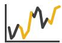

# Attributes

One

Distribution

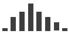

Many

Dependency

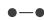

Correlation

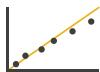

Similarity

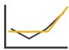

# Network Data

Topology

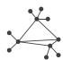

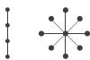

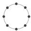

Paths

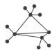

# Spatial Data

Shape

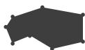  
Figure 3.6. The goals of the user might be to find or understand specific aspects of the data: trends and outliers for all kinds of data; individual values, the minimum or maximum extremes of the range, or the entire distribution of a single attribute; or the dependencies, correlations, or similarities between multiple attributes; topology or paths for network data, and shape for spatial data.

target that has high-level scope is the distribution of all values for an attribute.

Some targets encompass the scope of multiple attributes: dependencies, correlations, and similarities between attributes. A first attribute can have a dependency on a second, where the values for the first directly depend on those of the second. There is a correlation between one attribute and another if there is a tendency for the values of second to be tied to those of the first. The similarity between two attributes can be defined as a quantitative measurement calculated on all of their values, allowing attributes to be ranked with respect to how similar, or different, they are from each other.

The abstract tasks of understanding trends, outliers, distributions, and correlations are extremely common reasons to use vis. Each of them can be expressed in very diverse terms using domainspecific language, but you should be on the lookout to recognize these abstractions.

Some targets pertain to specific types of datasets. Network data specifies relationships between nodes as links. The fundamental target with network data is to understand the structure of these interconnections; that is, the network’s topology. A more specific topological target is a path of one or more links that connects two nodes. For spatial data, understanding and comparing the geometric shape is the common target of user actions.

# 3.6 How: A Preview

The third part of an analysis instance trio is how a vis idiom can be constructed out of a set of design choices. Figure 3.7 provides a preview of these choices, with a high-level breakdown into four major classes.

The family of how to encode data within a view has five choices for how to arrange data spatially: express values; separate, order, and align regions; and use given spatial data. This family also includes how to map data with all of the nonspatial visual channels including color, size, angle, shape, and many more. The manipulate family has the choices of change any aspect of the view, select elements from within the view, and navigate to change the viewpoint within the view—an aspect of change with a rich enough set of choices to merit its own category. The family of how to facet data between views has choices for how to juxtapose and coordinate multiple views, how to partition data between views, and how to superimpose layers on top of each other. The family of how to

The network datatype is covered in Section 2.4.2, and choices for how arrange networks are covered in Chapter 9.

Section 2.4.3.1 covers the dataset type of spatial fields, and Section 2.4.4 covers geometry. Choices for arranging spatial data are covered in Chapter 8.

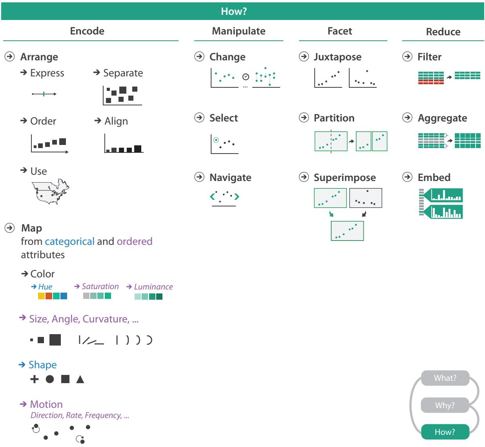  
Figure 3.7. How to design vis idioms: encode, manipulate, facet, and reduce.

reduce the data shown has the options of filter data away, aggregate many data elements together, and embed focus and context information together within a single view.

The rest of this book defines, describes, and discusses these choices in depth.

# 3.7 Analyzing and Deriving: Examples

The three analysis and derivation examples below give a taste of how this what–why–how framework can be used right away. The first example covers comparative analysis between two vis tools. The second example discusses deriving a single attribute, an importance measure for trees to decide which branches to show to summarize its topological structure. The third example covers deriving many new attributes and augmenting a spatial fluid dynamics dataset by creating derived spaces in which features of interest are easy to find.

# 3.7.1 Comparing Two Idioms

The what–why–how analysis framework is useful for comparative analysis, for example, to examine two different vis tools that have different answers for the question of how the idiom is designed when used for exactly the same context of why and what at the abstraction level.

SpaceTree [Plaisant et al. 02], shown in Figure 3.8(a), and Tree-Juxtaposer [Munzner et al. 03], shown in Figure 3.8(b), are tree vis

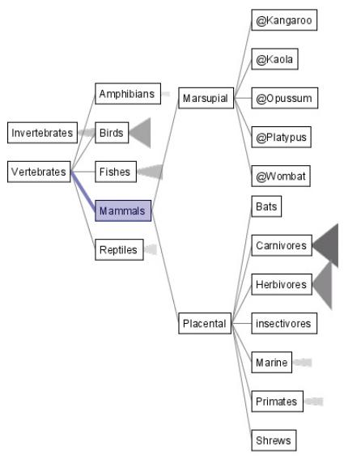  
(a)

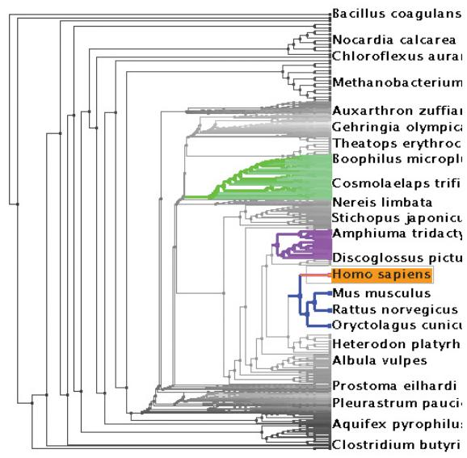  
(b)   
Figure 3.8. Comparing two idioms. (a) SpaceTree [Plaisant et al. 02]. (b) TreeJuxtaposer. From http://www.cs.umd. edu/hcil/spacetree and [Munzner et al. 03, Figure 1].

What?

$\textcircled{ \div}$ Tree

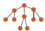

Why?

$\circledast$ Ac tions

Present

Locate

Identify

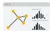

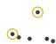

How?

$\textcircled{ \div}$ SpaceTree

Encode

Navigate

Selec t

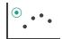

Filter

Aggregate

$\circled{ \div}$ Targets

Path bet ween t wo nodes

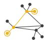

$\circled{ \div}$ TreeJux taposer

Encode

Navigate

Selec t

Arrange

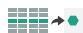

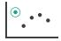

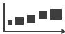  
Figure 3.9. Analyzing what–why–how comparatively for the SpaceTree and TreeJuxtaposer idioms.

tools that use somewhat different idioms. What these tools take as input data is the same: a large tree composed of nodes and links. Why these tools are being used is for the same goal in this scenario: to present a path traced between two nodes of interest to a colleague. In more detail, both tools can be used to locate paths between nodes and identify them.

Some aspects of idioms are the same: both systems allow the user to navigate and to select a path, with the result that it’s encoded differently from the nonselected paths through highlighting. The systems differ in how elements of the visualization are manipulated and arranged. SpaceTree ties the act of selection to a change of what is shown by automatically aggregating and filtering the unselected items. In contrast, TreeJuxtaposer allows the user to arrange areas of the tree to ensure visibility for areas of interest. Figure 3.9 summarizes this what–why–how analyis.

# 3.7.2 Deriving One Attribute

In a vis showing a complex network or tree, it is useful to be able to filter out most of the complexity by drawing a simpler picture that communicates the key aspects of its topological structure. One way to support this kind of summarization is to calculate a new derived attribute that measures the importance of each node in the graph and filter based on that attribute. Many different approaches to calculating importance have been proposed; centrality metrics do so in a way that takes into account network topology. The Strahler number is a measure of node importance originally

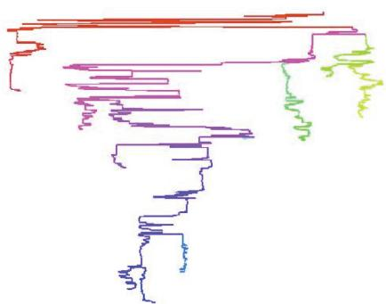  
(a)

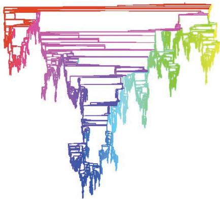  
(b)   
Figure 3.10. The derived quantitative attribute of Strahler numbers is used to filter the tree in order to create a recognizable summary. (a) The important skeleton of a large tree is visible when only 5000 of the highest-ranked nodes are drawn. (b) The full tree has over a half million nodes. From [Auber 02, Figures 10 and 13].

developed in hydrogeology to characterize the branching structure of rivers that has been adapted and extended for use visualizing trees and networks [Auber 02]. Very central nodes have large Strahler numbers, whereas peripheral nodes have low values. The Strahler number is an example of a derived attribute for network data that is the result of a complex and global computation, rather than simply a local calculation on a small neighborhood around a node.

Figure 3.10 shows an example of filtering according to the Strahler derived attribute to summarize a tree effectively. The result of drawing only the top-ranked 5000 nodes and the links that connect them is a recognizable skeleton of the full tree, shown in Figure 3.10(a), while over a half million nodes are shown in Figure 3.10(b). In contrast, if the 5000 nodes to draw were picked randomly, the structure would not be understandable. Both versions of the network are also colored according to the Strahler number, to show how the centrality measure varies within the network.

To summarize this example concisely in terms of a what–why– how analysis, as shown in Figure 3.11, a new quantitative attribute is derived and used to filter away the peripheral parts of a tree, in support of the task of summarizing the tree’s overall topology. As in the previous example, the tree is encoded as a node–link diagram, the most common choice for tree and network arrangment.

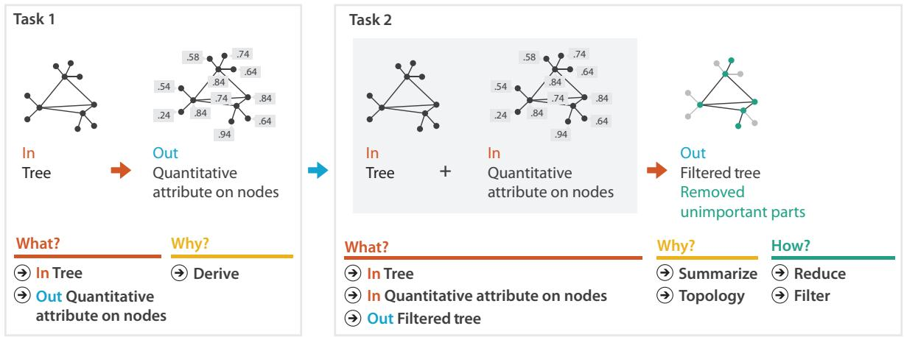  
Figure 3.11. Analyzing a chained sequence of two instances where an attribute is derived in order to summarize a tree by filtering away the unimportant parts.

# 3.7.3 Deriving Many New Attributes

Data transformations can shed light into spatial data as well. In an example from computational fluid dynamics, linked derived spaces are used for feature detection [Henze 98]. The vis system shown in Figure 3.12 allows the user to quickly create plots of any two original or derived variables from the palette of variables shown in the upper left derived fields pane. The views are linked together with color highlighting. The power of this idiom lies in seeing where regions that are contiguous in one view fall in the other views.

The original dataset is a time-varying spatial field with measurements along a curvilinear mesh fitted to an airfoil. The plot in the physical space pane on the upper right of Figure 3.12 shows the data in this physical space, using the two spatial field variables. Undisturbed airflow enters the physical space from the left, and the back tip of the airfoil is on the right. Two important regions in back of the airfoil are distinguished with color: a red recirculation region and a yellow wake region. While these regions are not easy to distinguish in this physical view, they can be understood and selected more easily by interaction with the four other derived views. For example, in the derived space of vorticity vs enthalpy in the upper middle of Figure 3.12, the recirculation zone is distinguishable as a coherent spatial structure at the top, with the yellow wake also distinguishable beneath it. As the white box shows, the

Multiple views are discussed further in Chapter 12.

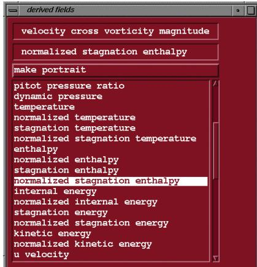

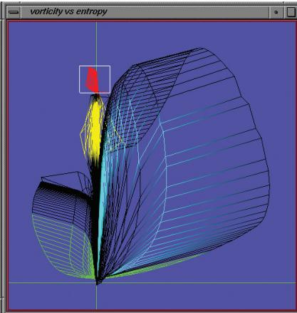

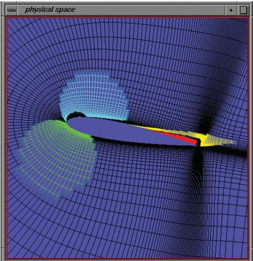

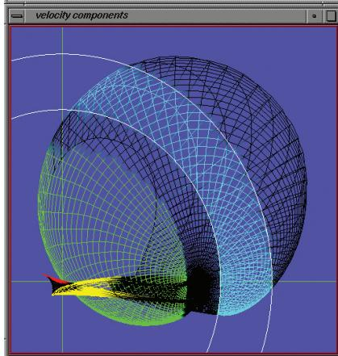

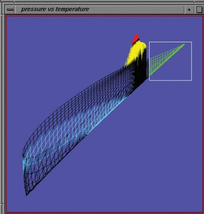

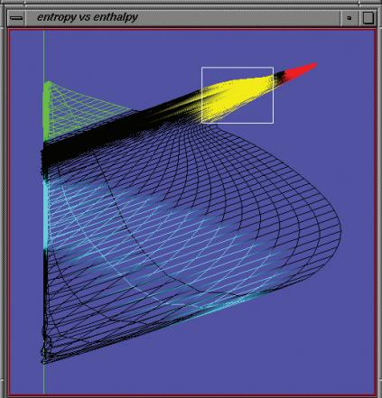  
Figure 3.12. Computational fluid dynamics vis showing the list of many derived attributes (top left), one view of the original spatial field (top right), and four other views showing pairs of selected derived attributes. The multiple juxtaposed views are coordinated with shared colored highlights. From [Henze 98, Figure 5].

recirculation zone can easily be selected in this view. The pressure vs temperature pane in the bottom middle of Figure 3.12 shows another derived space made by plotting the pressure versus the temperature. In this view, the red recirculation zone and the yellow wake appear where both the pressure and temperature variables are high, in the upper right. Without getting into the exact technical meaning of the derived variables as used in fluid dynamics (vorticity, entropy, enthalpy, and so on), the point of this example is that many structures of interest in fluid dynamics can be seen more easily from layouts in the derived spaces.

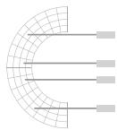  
Task 1   
  
Spatial field

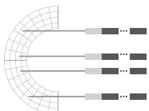  
  
Many quantitative attributes

# What?

$\circled{ \div}$ In Spatial field   
$\circled{ \div}$ Out Many quantitative attributes

# Why?

  
Derive

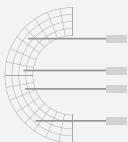  
Task 2   
I n   
Spatial field

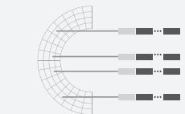  
I n   
$^ +$ M any quantitative attributes

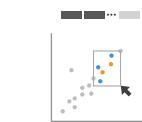

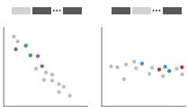

  
Figure 3.13. Analyzing a chained sequence, where many attributes are derived and visually encoded.

taposed attribute plots with ed coloring

# What?

$\circled{ \div}$ In Spatial field   
$\circledast$ In Many quantitative attributes   
$\circledcirc$ Out Jux taposed attribute plots with linked coloring

# Why?

Ac tions   
Discover   
Explore   
Browse   
Identify   
Compare

Targets

Features

# How?

Facet   
Jux tapose   
Par tition

Arrange

Express

Manipulate

Selec t   
Navigate

To summarize this example in terms of a what–why–how analysis, as shown in Figure 3.13, many new quantitative attributes are derived from an original spatial field dataset. Each pair of them is visually encoded into a view, as is the original spatial data, and the multiple juxtaposed views are coordinated with shared color coding and highlighting.

# 3.8

# Further Reading

The Big Picture An earlier version of the what–why–how framework was first presented as a paper [Brehmer and Munzner 13], which includes a very detailed discussion of its relationship to the extensive previous work in classifications of tasks and interaction idioms. That discussion covers 30 previous classifications and 20 relevant references, ranging from a characterization of the scientific data analysis process [Springmeyer et al. 92], to an influential low-level task classification [Amar et al. 05], to a taxonomy of tasks for network datasets [Lee et al. 06], to a recent taxonomy of interaction dynamics [Heer and Shneiderman 12].

Who: Designers versus Users Some of the challenges inherent in bridging the gaps between vis designers and users are discussed in an influential paper [van Wijk 06].

Derive Many vis pipeline models discuss the idea of data transformation as a critical early step [Card et al. 99, Chi and Riedl 98], and others also point out the need to transform between different attribute types [Velleman and Wilkinson 93]. A later taxonomy of vis explicitly discusses the idea that data types can change as the result of the transformation [Tory and Moller ¨ 04b].

Examples The analysis examples are SpaceTree [Plaisant et al. 02], TreeJuxtaposer [Munzner et al. 03], Strahler numbers for tree simplification [Auber 02], and linked derived spaces for feature detection [Henze 98].

# Domain situation

Obser ve target users using existing tools

# D a ta / task a bst r a c tio n

# Visu al e n c o d ing / i n t e r a c ti o n idi o m

Justify design with respec t to alternatives

  
Figure 4.1. The four nested levels of vis design have different threats to validity at each level, and validation approaches should be chosen accordingly.

# A lg o rit h m

Measure system time/memor y

Analyze computational complexity

Analyze results qualitatively

Measure human time with lab experiment (lab study)

Obser ve target users af ter deployment ( )

Measure adoption

