# Chapter 5

# Marks and Channels

# 5.1 The Big Picture

Marks are basic geometric elements that depict items or links, and channels control their appearance. The effectiveness of a channel for encoding data depends on its type: the channels that perceptually convey magnitude information are a good match for ordered data, and those that convey identity information with categorical data. Figure 5.1 summarizes the channel rankings.

# 5.2 Why Marks and Channels?

Learning to reason about marks and channels gives you the building blocks for analyzing visual encodings. The core of the design space of visual encodings can be described as an orthogonal combination of two aspects: graphical elements called marks, and visual channels to control their appearance. Even complex visual encodings can be broken down into components that can be analyzed in terms of their marks and channel structure.

# 5.3 Defining Marks and Channels

A mark is a basic graphical element in an image. Marks are geometric primitive objects classified according to the number of spatial dimensions they require. Figure 5.2 shows examples: a zerodimensional (0D) mark is a point, a one-dimensional (1D) mark is a line, and a two-dimensional (2D) mark is an area. A threedimensional (3D) volume mark is possible, but they are not frequently used.

  
Figure 5.2. Marks are geometric primitives.

The term channel is popular in the vis literature and is not meant to imply any particular theory about the underlying mechanisms of human visual perception. There are many, many synonyms for visual channel: nearly any combination of visual, graphical, perceptual, retinal for the first word, and channel, attribute, dimension, variable, feature, and carrier for the second word.

A visual channel is a way to control the appearance of marks, independent of the dimensionality of the geometric primitive.* Figure 5.3 shows a few of the many visual channels that can encode information as properties of a mark. Some pertain to spatial position, including aligned planar position, unaligned planar position, depth (3D position), and spatial region. Others pertain to color, which has three distinct aspects: hue, saturation, and luminance. There are three size channels, one for each added dimension: length is 1D size, area is 2D size, and volume is 3D size. The motion-oriented channels include the motion pattern, for instance, oscillating circles versus straight jumps, the direction of motion, and the velocity. Angle is also a channel, sometimes called tilt. Curvature is also a visual channel. Shape is a complex phenomenon, but it is treated as a channel in this framework.

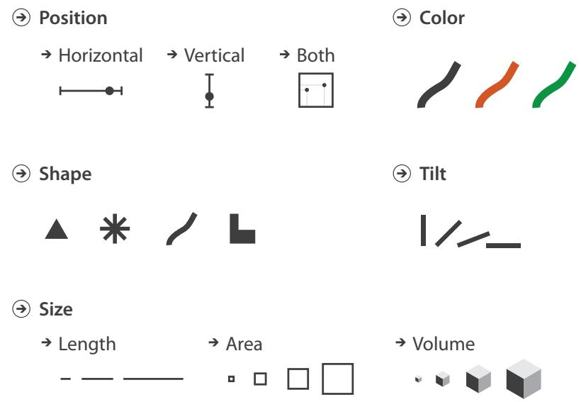  
Figure 5.3. Visual channels control the appearance of marks.

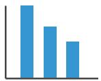  
(a)

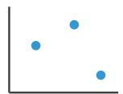  
(b)

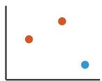  
(c)

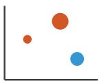  
(d)   
Figure 5.4. Using marks and channels. (a) Bar charts encode two attributes using a line mark with the vertical spatial position channel for the quantitative attribute, and the horizontal spatial position channel for the categorical attribute. (b) Scatterplots encode two quantitative attributes using point marks and both vertical and horizontal spatial position. (c) A third categorical attribute is encoded by adding color to the scatterplot. (d) Adding the visual channel of size encodes a fourth quantitative attribute as well.

Figure 5.4 shows a progression of chart types, with each showing one more quantitative data attribute by using one more visual channel. A single quantitative attribute can be encoded with vertical spatial position. Bar charts are a common example of this encoding: the height of the bar conveys a quantitative value for that attribute, as in Figure 5.4(a). Bar charts show two attributes, but only one is quantitative: the other is the categorical attribute used to spread out the bars along the axis (in this case, the horizontal axis). A second, independent quantitative attribute can be encoded by using the visual channel of horizontal spatial position to directly encode information. It doesn’t make sense any more to use a line for the mark in this case, so the mark type needs to be a point. This visual encoding, shown in Figure 5.4(b), is a scatterplot. You cannot continue to add more spatial position channels when creating drawings in two-dimensional space, but many visual channels are nonspatial. An additional categorical data attribute can be encoded in a scatterplot format using the visual channel of hue (one aspect of color), as in Figure 5.4(c). Figure 5.4(d) shows the addition of a fourth quantitative attribute encoded with the visual channel of size.

In these examples, each attribute is encoded with a single channel. Multiple channels can be combined to redundantly encode the same attribute. The limitation of this approach is that more channels are “used up” so that not as many attributes can be encoded in total, but the benefit is that the attributes that are shown will be very easily perceived.

The size and shape channels cannot be used on all types of marks: the higher-dimensional mark types usually have built-in

constraints that arise from the way that they are defined. An area mark has both dimensions of its size constrained intrinsically as part of its shape, so area marks typically are not size coded or shape coded. For example, an area mark denoting a state or province within a country on a geographic map already has a certain size, and thus attempting to size code the mark with an additional attribute usually doesn’t make sense.1 Similarly, the treemap visual encoding idiom shows the hierarchical structure of a tree using nested area marks; Figure 9.8 shows an example. The size of these marks is determined by an existing attribute that was used in construction of the treemap, as is their shape and position. Changing the size of a mark according to an additional attribute would destroy the meaning of the visual encoding.

A line mark that encodes a quantitative attribute using length in one direction can be size coded in the other dimension by changing the width of the line to make it fatter. However, it can’t be size coded in the first direction to make it longer because its length is already “taken” with the length coding and can’t be co-opted by a second attribute. For example, the bars in Figure 5.4(a) can’t be size coded vertically. Thus, even though lines are often considered to be infinitely thin objects in mathematical contexts, line marks used in visual encoding do take up a nonzero amount of area. They can be made wider on an individual basis to encode an additional attribute, or an entire set of bars can simply be made wider in a uniform way to be more visible.

Point marks can indeed be size coded and shape coded because their area is completely unconstrained. For instance, the circles of varying size in the Figure 5.4(d) scatterplot are point marks that have been size coded, encoding information in terms of their area. An additional categorical attribute could be encoded by changing the shape of the point as well, for example, to a cross or a triangle instead of a circle. This meaning of the term point is different than the mathematical context where it implies something that is infinitely small in area and cannot have a shape. In the context of visual encoding, point marks intrinsically convey information only about position and are exactly the vehicle for conveying additional information through area and shape.

# 5.3.1 Channel Types

The human perceptual system has two fundamentally different kinds of sensory modalities. The identity channels tell us information about what something is or where it is. In contrast, the magnitude channels tell us how much of something there is.*

For instance, we can tell what shape we see: a circle, a triangle, or a cross. It does not make much sense to ask magnitude questions for shape. Other what visual channels are shape, the color channel of hue, and motion pattern. We can tell what spatial region marks are within, and where the region is.

In contrast, we can ask about magnitudes with line length: how much longer is this line than that line? And identity is not a productive question, since both objects are lines. Similarly, we can ask luminance questions about how much darker one mark is than another, or angle questions about how much space is between a pair of lines, or size questions about how much bigger one mark is than another. Many channels give us magnitude information, including the size channels of length, area, and volume; two of the three color channels, namely, luminance and saturation; and tilt.

# 5.3.2 Mark Types

The discussion so far has been focused on table datasets, where a mark always represents an item. For network datasets, a mark might represent either an item—also known as a node—or a link. Link marks represent a relationship between items. The two link mark types are connection and containment. A connection mark shows a pairwise relationship between two items, using a line. A containment mark shows hierarchical relationships using areas, and to do so connection marks can be nested within each other at multiple levels.* While the visual representation of the area mark might be with a line that depicts its boundary, containment is fundamentally about the use of area. Links cannot be represented by points, even though individual items can be. Figure 5.5 summarizes the possibilities.

# 5.4 Using Marks and Channels

All channels are not equal: the same data attribute encoded with two different visual channels will result in different information

* In the psychophysics literature, the identity channels are called metathetic or what–where, and the magnitude channels are called prothetic or how much.

* Synonyms for containment are enclosure and nesting.

# Marks as I tems/Nodes

  
$\textcircled{ \div}$ Points

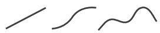  
Lines

  
Areas

# Marks as Links

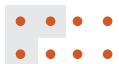  
$\textcircled{ \div}$ Containment

  
$\textcircled{ \div}$ Connec tion   
Figure 5.5. Marks can represent individual items, or links between them.

content in our heads after it has passed through the perceptual and cognitive processing pathways of the human visual system.

The use of marks and channels in vis idiom design should be guided by the principles of expressiveness and effectiveness. These ideas can be combined to create a ranking of channels according to the type of data that is being visually encoded. If you have identified the most important attributes as part of developing your task and data abstraction, you can ensure that they are encoded with the highest ranked channels.

# 5.4.1 Expressiveness and Effectiveness

Two principles guide the use of visual channels in visual encoding: expressiveness and effectiveness.

The expressiveness principle dictates that the visual encoding should express all of, and only, the information in the dataset attributes. The most fundamental expression of this principle is that ordered data should be shown in a way that our perceptual system intrinsically senses as ordered. Conversely, unordered data should not be shown in a way that perceptually implies an ordering that does not exist. Violating this principle is a common beginner’s mistake in vis.

It’s no coincidence that the classification of data attributes in Chapter 2 has a central split along this very same line. This split of channel types into two major categories is so fundamental to visual encoding design that this distinction is built into the classi-

fication at the ground level. The identity channels are the correct match for the categorical attributes that have no intrinsic order. The magnitude channels are the correct match for the ordered attributes, both ordinal and quantitative.

The effectiveness principle dictates that the importance of the attribute should match the salience of the channel; that is, its noticeability. In other words, the most important attributes should be encoded with the most effective channels in order to be most noticeable, and then decreasingly important attributes can be matched with less effective channels.

The rest of this chapter is devoted to the question of what the word effectiveness means in the context of visual encoding.

# 5.4.2 Channel Rankings

Figure 5.6 presents effectiveness rankings for the visual channels broken down according to the two expressiveness types of ordered and categorical data. The rankings range from the most effective channels at the top to the least effective at the bottom.

Ordered attributes should be shown with the magnitude channels. The most effective is aligned spatial position, followed by unaligned spatial position. Next is length, which is one-dimensional size, and then angle, and then area, which is two-dimensional size. Position in 3D, namely, depth, is next. The next two channels are roughly equally effective: luminance and saturation. The final two channels, curvature and volume (3D size), are also roughly equivalent in terms of accuracy.

Categorical attributes should be shown with the identity channels. The most effective channel for categorical data is spatial region, with color hue as the next best one. The motion channel is also effective, particularly for a single set of moving items against a sea of static ones. The final identity channel appropriate for categorical attributes is shape.

While it is possible in theory to use a magnitude channel for categorical data or a identity channel for ordered data, that choice would be a poor one because the expressiveness principle would be violated.

The two ranked lists of channels in Figure 5.6 both have channels related to spatial position at the top in the most effective spot. Aligned and unaligned spatial position are at the top of the list for ordered data, and spatial region is at the top of the list for categorical data. Moreover, the spatial channels are the only ones that appear on both lists; none of the others are effective for both data

Luminance and saturation are aspects of color discussed in Chapter 10.

‣ Hue is an aspect of color discussed in Chapter 10.

Channels: Expressiveness Types and Effec tiveness R anks

$\textcircled{ \div}$ Magnitude Channels: Ordered Attributes

  
Figure 5.6. Channels ranked by effectiveness according to data and channel type. Ordered data should be shown with the magnitude channels, and categorical data with the identity channels.

$\circled{  }$ Identity Channels: Categorical Attributes

types. This primacy of spatial position applies only to 2D positions in the plane; 3D depth is a much lower-ranked channel. These fundamental observations have motivated many of the vis idioms illustrated in this book, and underlie the framework of idiom design choices. The choice of which attributes to encode with position is the most central choice in visual encoding. The attributes encoded with position will dominate the user’s mental model—their internal mental representation used for thinking and reasoning—compared with those encoded with any other visual channel.

These rankings are my own synthesis of information drawn from many sources, including several previous frameworks, experimental evidence from a large body of empirical studies, and my

The limitations and benefits of 3D are covered in Section 6.3.

own analysis. The further reading section at the end of this chapter contains pointers to the previous work. The following sections of this chapter discuss the reasons for these rankings at length.

# 5.5 Channel Effectiveness

To analyze the space of visual encoding possibilities you need to understand the characteristics of these visual channels, because many questions remain unanswered: How are these rankings justified? Why did the designer decide to use those particular visual channels? How many more visual channels are there? What kinds of information and how much information can each channel encode? Why are some channels better than others? Can all of the channels be used independently or do they interfere with each other?

This section addresses these questions by introducing the analysis of channels according to the criteria of accuracy, discriminability, separability, the ability to provide visual popout, and the ability to provide perceptual groupings.

# 5.5.1 Accuracy

The obvious way to quantify effectiveness is accuracy: how close is human perceptual judgement to some objective measurement of the stimulus? Some answers come to us from psychophysics, the subfield of psychology devoted to the systematic measurement of general human perception. We perceive different visual channels with different levels of accuracy; they are not all equally distinguishable. Our responses to the sensory experience of magnitude are characterizable by power laws, where the exponent depends on the exact sensory modality: most stimuli are magnified or compressed, with few remaining unchanged.

Figure 5.7 shows the psychophysical power law of Stevens [Stevens 75]. The apparent magnitude of all sensory channels follows a power function based on the stimulus intensity:

$$
S = I ^ {n}, \tag {5.1}
$$

where $S$ is the perceived sensation and $I$ is the physical intensity. The power law exponent $n$ ranges from the sublinear 0.5 for brightness to the superlinear 3.5 for electric current. That is, the sublinear phenomena are compressed, so doubling the physical

  
Steven's Psychophysical Power Law: S= IN   
Figure 5.7. Stevens showed that the apparent magnitude of all sensory channels follows a power law $S = I ^ { n }$ , where some sensations are perceptually magnified compared with their objective intensity (when $n > 1$ ) and some compressed (when $n < 1 _ { . }$ ). Length perception is completely accurate, whereas area is compressed and saturation is magnified. Data from Stevens [Stevens 75, p. 15].

brightness results in a perception that is considerably less than twice as bright. The superlinear phenomena are magnified: doubling the amount of electric current applied to the fingertips results is a sensation that is much more than twice as great. Figure 5.7 shows that length has an exponent of $n = 1 . 0$ , so our perception of length is a very close match to the true value. Here length means the length of a line segment on a 2D plane perpendicular to the observer. The other visual channels are not perceived as accurately: area and brightness are compressed, while red–gray saturation is magnified.

Another set of answers to the question of accuracy comes from controlled experiments that directly map human response to visually encoded abstract information, giving us explicit rankings of perceptual accuracy for each channel type. For example, Cleveland and McGill’s experiments on the magnitude channels [Cleveland and McGill 84a] showed that aligned position against a common scale is most accurately perceived, followed by unaligned position against an identical scale, followed by length, followed by angle. Area judgements are notably less accurate than all of these. They also propose rankings for channels that they did not directly test: after area is an equivalence class of volume, curvature, and lumi-

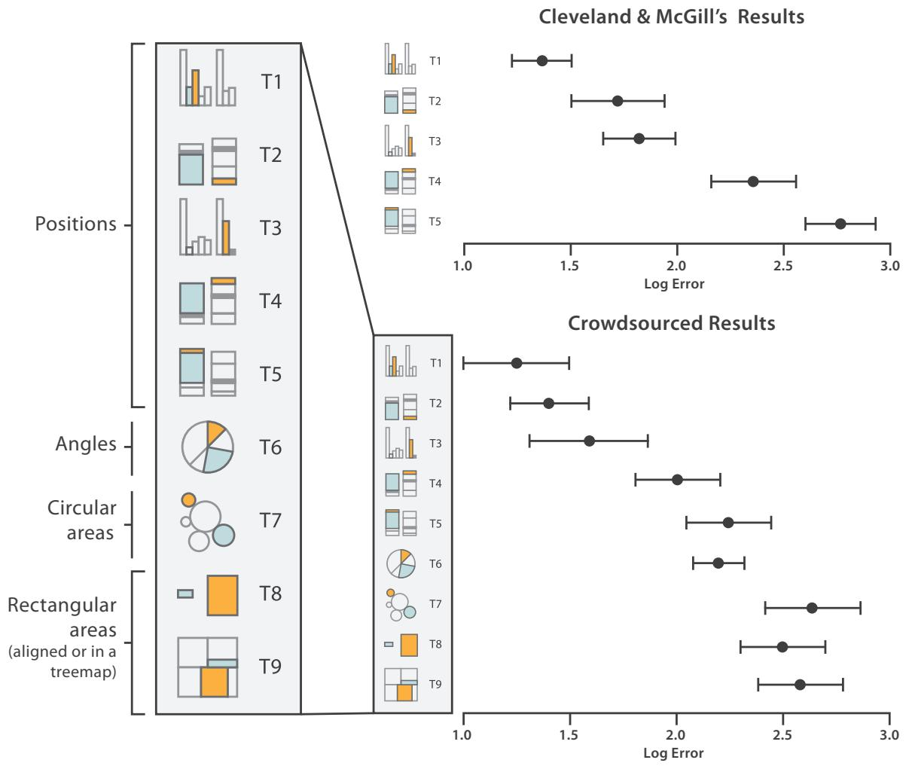  
Figure 5.8. Error rates across visual channels, with recent crowdsourced results replicating and extending seminal work from Cleveland and McGill [Cleveland and McGill 84a]. After [Heer and Bostock 10, Figure 4].

nance; that class is followed by hue in last place. (This last place ranking is for hue as a magnitude channel, a very different matter than its second-place rank as a identity channel.) These accuracy results for visual encodings dovetail nicely with the psychophysical channel measurements in Figure 5.7. Heer and Bostock confirmed and extended this work using crowdsourcing, summarized in Figure 5.8 [Heer and Bostock 10]. The only discrepancy is that the later work found length and angle judgements roughly equivalent.

The rankings in Figure 5.6 are primarily based on accuracy, which differs according to the type of the attribute that is being encoded, but also take into account the other four considerations.

# 5.5.2 Discriminability

The question of discriminability is: if you encode data using a particular visual channel, are the differences between items perceptible to the human as intended? The characterization of visual channel thus should quantify the number of bins that are available for use within a visual channel, where each bin is a distinguishable step or level from the other.

For instance, some channels have a very limited number of bins. Consider line width: changing the line size only works for a fairly small number of steps. Increasing the width past that limit will result in a mark that is perceived as a polygon area rather than a line mark. A small number of bins is not a problem if the number of values to encode is also small. For example, Figure 5.9 shows an example of effective linewidth use. Linewidth can work very well to show three or four different values for a data attribute, but it would be a poor choice for dozens or hundreds of values. The key factor is matching the ranges: the number of different values that need to be shown for the attribute being encoded must not be greater than the number of bins available for the visual channel used to encode it. If these do not match, then the vis designer should either explicitly aggregate the attribute into meaningful bins or use a different visual channel.

# 5.5.3 Separability

You cannot treat all visual channels as completely independent from each other, because some have dependencies and interactions with others. You must consider a continuum of potential interactions between channels for each pair, ranging from the orthogonal and independent separable channels to the inextricably combined integral channels. Visual encoding is straightforward with separable channels, but attempts to encode different information in integral channels will fail. People will not be able to access the desired information about each attribute; instead, an unanticipated combination will be perceived.

Clearly, you cannot separately encode two attributes of information using vertical and horizontal spatial position and then expect to encode a third attribute using planar proximity. In this case it

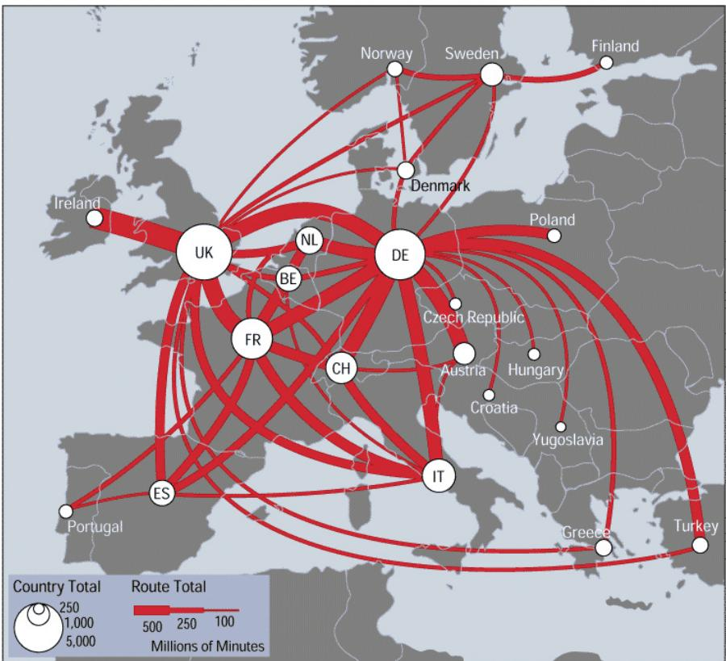  
Figure 5.9. Linewidth has a limited number of discriminable bins.

is obvious that the third channel precludes the use of the first two. However, some of the interchannel interference is less obvious.

Figure 5.10 shows pairs of visual channels at four points along this continuum. On the left is a pair of channels that are completely separable: position and hue. We can easily see that the points fall into two categories for spatial position, left and right. We can also separately attend to their hue and distinguish the red from the blue. It is easy to see that roughly half the points fall into each of these categories for each of the two channels.

Next is an example of interference between channels, showing that size is not fully separable from color hue. We can easily distinguish the large half from the small half, but within the small half discriminating between the two colors is much more difficult. Size interacts with many visual channels, including shape.

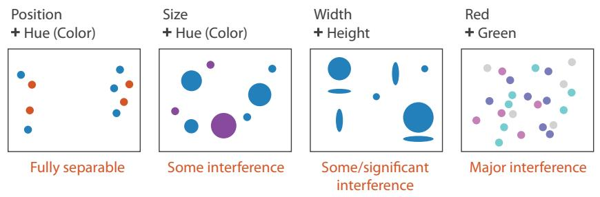  
Figure 5.10. Pairs of visual channels fall along a continuum from fully separable to intrinsically integral. Color and location are separable channels well suited to encode different data attributes for two different groupings that can be selectively attended to. However, size interacts with hue, which is harder to perceive for small objects. The horizontal size and and vertical size channels are automatically fused into an integrated perception of area, yielding three groups. Attempts to code separate information along the red and green axes of the RGB color space fail, because we simply perceive four different hues. After [Ware 13, Figure 5.23].

The third example shows an integral pair. Encoding one variable with horizontal size and another with vertical size is ineffective because what we directly perceive is the planar size of the circles, namely, their area. We cannot easily distinguish groupings of wide from narrow, and short from tall. Rather, the most obvious perceptual grouping is into three sets: small, medium, and large. The medium category includes the horizontally flattened as well as the vertically flattened.

The far right on Figure 5.10 shows the most inseparable channel pair, where the red and green channels of the RGB color space are used. These channels are not perceived separately, but integrated into a combined perception of color. While we can tell that there are four colors, even with intensive cognitive effort it is very difficult to try to recover the original information about high and low values for each axis. The RGB color system used to specify information to computers is a very different model than the color processing systems of our perceptual system, so the three channels are not perceptually separable.

Integrality versus separability is not good or bad; the important idea is to match the characteristics of the channels to the information that is encoded. If the goal is to show the user two different data attributes, either of which can be attended to selectively, then a separable channel pair of position and color hue is a good choice. If the goal is to show a single data attribute with three categories,

Color is discussed in detail in Section 10.2.

then the integral channel pair of horizontal and vertical size is a reasonable choice because it yields the three groups of small, flattened, and large.

Finally, integrality and separability are two endpoints of a continuum, not strictly binary categories. As with all of the other perceptual issues discussed in this chapter, many open questions remain. I do not present a definitive list with a categorization for each channel pair, but it’s wise to keep this consideration in mind as you design with channels.

# 5.5.4 Popout

Many visual channels provide visual popout, where a distinct item stands out from many others immediately.* Figure 5.11 shows two examples of popout: spotting a red object from a sea of blue ones, or spotting one circle from a sea of squares. The great value of popout is that the time it takes us to spot the different object does not depend on the number of distractor objects. Our low-level visual system does massively parallel processing on these visual channels, without the need for the viewer to consciously directly attention to items one by one. The time it takes for the red circle to pop out of the sea of blue ones is roughly equal when there are 15 blue ones as in Figure 5.11(a) or 50 as in Figure 5.11(b).

Popout is not an all-or-nothing phenomenon. It depends on both the channel itself and how different the target item is from its surroundings. While the red circle pops out from the seas of 15 and 50 red squares in Figures 5.11(c) and 5.11(d) at roughly

* Visual popout is often called preattentive processing or tunable detection.

  
(a)

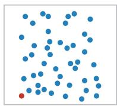  
(b)

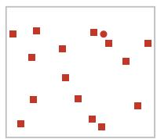  
(c)

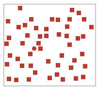  
(d)

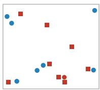  
(e)

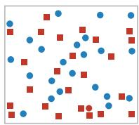  
(f)   
Figure 5.11. Visual popout. (a) The red circle pops out from a small set of blue circles. (b) The red circle pops out from a large set of blue circles just as quickly. (c) The red circle also pops out from a small set of square shapes, although a bit slower than with color. (d) The red circle also pops out of a large set of red squares. (e) The red circle does not take long to find from a small set of mixed shapes and colors. (f) The red circle does not pop out from a large set of red squares and blue circles, and it can only be found by searching one by one through all the objects. After http://www.csc.ncsu.edu/faculty/healey/PP by Christopher G. Healey.

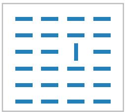  
(a)

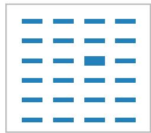  
(b)

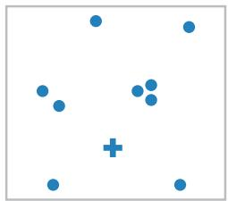

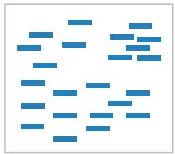  
(d)

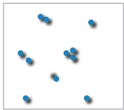  
(e)

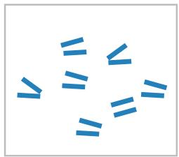  
  
Figure 5.12. Many channels support visual popout, including (a) tilt, (b) size, (c) shape, (d) proximity, and (e) shadow direction. (f) However, parallel line pairs do not pop out from a sea of slightly tilted distractor object pairs and can only be detected through serial search. After http://www.csc.ncsu.edu/faculty/healey/PP by Christopher G. Healey.

the same time, this popout effect is slower than with the color difference versions in Figures 5.11(a) and 5.11(b). The difference between red and blue on the color hue channel is larger than the difference in shape between filled-in circles and filled-in squares.

Although many different visual channels provide popout on their own, they cannot simply be combined. A red circle does not pop out automatically from a sea of objects that can be red or blue and circles or squares: the speed of finding the red circle is much faster in Figures 5.11(e) with few distracting objects than in Figure 5.11(f) with many distractors. The red circle can only be detected with serial search: checking each item, one by one. The amount of time it takes to find the target depends linearly on the number of distractor objects.

Most pairs of channels do not support popout, but a few pairs do: one example is space and color, and another is motion and shape. Popout is definitely not possible with three or more channels. As a general rule, vis designers should only count on using popout for a single channel at a time.

Popout occurs for many channels, not just color hue and shape. Figures 5.12(a) through 5.12(e) show several examples: tilt, size, shape, proximity, and even shadow direction. Many other channels support popout, including several different kinds of motion such as flicker, motion direction, and motion velocity. All of the major channels commonly used in visual encoding that are shown in Figure 5.6 do support popout individually, although not in combination with each other. However, a small number of potential channels do not support popout. Figure 5.12(f) shows that parallelism is not preattentively detected; the exactly parallel pair of lines does not pop out from the slightly angled pairs but requires serial search to detect.

# 5.5.5 Grouping

The effect of perceptual grouping can arises from either the use of link marks, as shown in Figure 5.5, or from the use of identity channels to encode categorical attributes, as shown in Figure 5.6.

Encoding link marks using areas of containment or lines of connection conveys the information that the linked objects form a group with a very strong perceptual cue. Containment is the strongest cue for grouping, with connection coming in second.

Another way to convey that items form a group is to encode categorical data appropriately with the identity channels. All of the items that share the same level of the categorical attribute can be perceived as a group by simply directing attention to that level selectively. The perceptual grouping cue of the identity channels is not as strong as the use of connection or containment marks, but a benefit of this lightweight approach is that it does not add additional clutter in the form of extra link marks. The third strongest grouping approach is proximity; that is, placing items within the same spatial region. This perceptual grouping phenomenon is the reason that the top-ranked channel for encoding categorical data is spatial region. The final grouping channel is similarity with the other categorical channels of hue and motion, and also shape if chosen carefully. Logically, proximity is like similarity for spatial position; however, from a perceptual point of view the effect of the spatial channels is so much stronger than the effect of the others that it is is useful to consider them separately.

For example, the categorical attribute of animal type with the three levels of cat, dog, and wombat can be encoded with the three hue bins of red, green, and blue respectively. A user who chooses

$^ { \star }$ More formally, Weber’s Law is typically stated as the detectable difference in stimulus intensity $I$ as a fixed percentage $K$ of the object magnitude: $\delta I / I \ =$ K .

to attend to the blue hue will automatically see all of the wombats as a perceptual group globally, across the entire scene.

The shape channel needs to be used with care: it is possible to encode categorical data with shape in a way that does not automatically create perceptual groupings. For example, the shapes of a forward ‘C’ and a backward ‘C’ do not automatically form globally selectable groups, whereas the shapes of a circle versus a star do. Similarly, motion also needs to be used with care. Although a set of objects moving together against a background of static objects is a very salient cue, multiple levels of motion all happening at once may overwhelm the user’s capacity for selective attention.

# 5.6 Relative versus Absolute Judgements

The human perceptual system is fundamentally based on relative judgements, not absolute ones; this principle is known as Weber’s Law.* For instance, the amount of length difference we can detect is a percentage of the object’s length.

This principle holds true for all sensory modalities. The fact that our senses work through relative rather than absolute judgements has far-ranging implications. When considering questions such as the accuracy and discriminability of our perceptions, we must distinguish between relative and absolute judgements. For example, when two objects are directly next to each other and aligned, we can make much more precise judgements than when they are not aligned and when they are separated with many other objects between them.

An example based on Weber’s Law illuminates why position along a scale can be more accurately perceived than a pure length judgement of position without a scale. The length judgement in Figure 5.13(a) is difficult to make with unaligned and unframed bars. It is easier with framing, as in Figure 5.13(b), or alignment, as in Figure 5.13(c), so that the bars can be judged against a common scale. When making a judgement without a common scale, the only information is the length of the bars themselves. Placing a common frame around the bars provides another way to estimate magnitude: we can check the length of the unfilled bar. Bar B is only about $1 5 \%$ longer than Bar A, approaching the range where length differences are difficult to judge. But the unfilled part of the frame for Bar B is about $5 0 \%$ smaller than the one for Bar A, an easily discriminable difference. Aligning the bars achieves the same effect without the use of a frame.

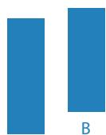  
A   
Unframed Unaligned   
(a)

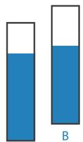  
A   
Framed Unaligned   
(b)

  
Unframed Aligned   
  
Figure 5.13. Weber’s Law states that we judge based on relative, not absolute differences. (a) The lengths of unframed, unaligned rectangles of slightly different sizes are hard to compare. (b) Adding a frame allows us to compare the very different sizes of the unfilled rectangles between the bar and frame tops. (c) Aligning the bars also makes the judgement easy. Redrawn and extended after [Cleveland and McGill 84a, Figure 12].

Another example shows that our perception of color and luminance is completely contextual, based on the contrast with surrounding colors. In Figure 5.14(a), the two labeled squares in a checkerboard appear to be quite different shades of gray. In Figure 5.14(b), superimposing a solid gray mask that touches both squares shows that they are identical. Conversely, Figure 5.15

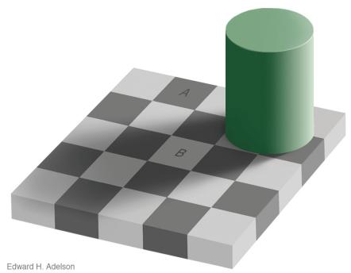  
(a)

  
(b)   
Figure 5.14. Luminance perception is based on relative, not absolute, judgements. (a) The two squares A and B appear quite different. (b) Superimposing a gray mask on the image shows that they are in fact identical.

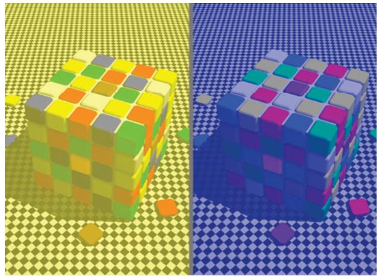  
(a)

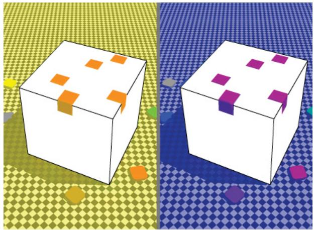  
(b)   
Figure 5.15. Color perception is also relative to surrounding colors and depends on context. (a) Both cubes have tiles that appear to be red. (b) Masking the intervening context shows that the colors are very different: with yellow apparent lighting, they are orange; with blue apparent lighting, they are purple.

shows two colorful cubes. In Figure 5.15(a) corresponding squares both appear to be red. In Figure 5.15(b), masks show that the tile color in the image apparently illuminated by a yellowish light source is actually orange, and for the bluish light the tiles are actually purple. Our visual system evolved to provide color constancy so that the same surface is identifiable across a broad set of illumination conditions, even though a physical light meter would yield very different readings. While the visual system works very well in natural environments, many of its mechanisms work against simple approaches to visually encoding information with color.

# 5.7 Further Reading

The Big Picture The highly influential theory of visual marks and channels was proposed by Bertin in the 1960s [Bertin 67]. The ranking of channel effectiveness proposed in this chapter is my synthesis across the ideas of many previous authors and does not come directly from any specific source. It was influenced by the foundational work on ranking of visual channels through measured-response experiments [Cleveland and McGill 84a], models [Cleveland 93a], design guidelines for

matching visual channels to data type [Mackinlay 86], and books on visualization [Ware 13] and cartography [MacEachren 95]. It was also affected by the more recent work on crowdsourced judgements [Heer and Bostock 10], taxonomybased glyph design [Maguire et al. 12], and glyph design in general [Borgo et al. 13].

Psychophysical Measurement The foundational work on the variable distinguishability of different visual channels, the categorization of channels as metathetic identity and prothetic magnitude, and scales of measurement was done by a pioneer in psychophysics [Stevens 57,Stevens 75].

Effectiveness and Expressiveness Principles The principles of expressiveness for matching channel to data type and effectiveness for choosing the channels by importance ordering appeared in a foundational paper [Mackinlay 86].

Perception This chapter touches on many perceptual and cognitive phenomena, but I make no attempt to explain the mechanisms that underlie them. I have distilled an enormous literature down to the bare minimum of what a beginning vis designer needs to get started. The rich literature on perception and cognitive phenomena is absolutely worth a closer look, because this chapter only scratches the surface; for example, the Gestalt principles are not covered.

Ware offers a broad, thorough, and highly recommended introduction to perception for vis in his two books [Ware 08, Ware 13]. His discussion includes more details from nearly all of the topics in this chapter, including separability and popout. An overview of the literature on popout and other perceptual phenomena appears on a very useful page that includes interactive demos http://www.csc.ncsu.edu/faculty/ healey/PP [Healey 07]; one of the core papers in this literature begins to untangle what low-level features are detected in early visual processing [Treisman and Gormican 88].

. No Unjustified 3D   
– The Power of the Plane   
– The Disparity of Depth   
– Occlusion Hides Information   
– Perspective Distortion Dangers   
– Tilted Text Isn’t Legible

. No Unjustified 2D   
. Eyes Beat Memory   
. Resolution over Immersion   
. Overview First, Zoom and Filter, Detail on Demand   
. Responsiveness Is Required   
. Get It Right in Black and White   
. Function First, Form Next

Figure 6.1. Eight rules of thumb.

