# Chapter 7

# Arrange Tables

# 7.1 The Big Picture

Figure 7.1 shows the four visual encoding design choices for how to arrange tabular data spatially. One is to express values. The other three are to separate, order, and align regions. The spatial orientation of axes can be rectilinear, parallel, or radial. Spatial layouts may be dense, and they may be space-filling.

# 7.2 Why Arrange?

The arrange design choice covers all aspects of the use of spatial channels for visual encoding. It is the most crucial visual encoding choice because the use of space dominates the user’s mental model of the dataset. The three highest ranked effectiveness channels for quantitative and ordered attributes are all related to spatial position: planar position against a common scale, planar position along an unaligned scale, and length. The highest ranked effectivness channel for categorical attributes, grouping items within the same region, is also about the use of space. Moreover, there are no nonspatial channels that are highly effective for all attribute types: the others are split into being suitable for either ordered or categorical attributes, but not both, because of the principle of expressiveness.

# 7.3 Arrange by Keys and Values

The distinction between key and value attributes is very relevant to visually encoding table data. A key is an independent attribute that can be used as a unique index to look up items in a table, while a value is a dependent attribute: the value of a cell in a table. Key attributes can be categorical or ordinal, whereas values can be all

A fifth arrangement choice, to use a given spatial layout, is not an option for nonspatial information; it is covered in Chapter 8.

‣ The primacy of the spatial position channels is discussed at length in Chapter 5, as are the principles of effectiveness and expressiveness.

See Section 2.6.1 for more on keys and values.

three of the types: categorical, ordinal, or quantitative. The unique values for a categorical or ordered attribute are called levels, to avoid the confusion of overloading the term value.

The core design choices for visually encoding tables directly relate to the semantics of the table’s attributes: how many keys and how many values does it have? An idiom could only show values, with no keys; scatterplots are the canonical example of showing two value attributes. An idiom could show one key and one value attribute; bar charts are the best-known example. An idiom could show two keys and one value; for example, heatmaps. Idioms that show many keys and many values often recursively subdivide space into many regions, as with scatterplot matrices.

While datasets do only have attributes with value semantics, it would be rare to visually encode a dataset that has only key attributes. Keys are typically used to define a region of space for each item in which one or more value attributes are shown.

# 7.4 Express: Quantitative Values

Using space to express quantitative attributes is a straightforward use of the spatial position channel to visually encode data. The attribute is mapped to spatial position along an axis.

In the simple case of encoding a single value attribute, each item is encoded with a mark at some position along the axis. Additional attributes might also be encoded on the same mark with other nonspatial channels such as color and size. In the more complex case, a composite glyph object is drawn, with internal structure that arises from multiple marks. Each mark lies within a subregion in the glyph that is visually encoded differently, so the glyph can show multiple attributes at once.

# Example: Scatterplots

The idiom of scatterplots encodes two quantitative value variables using both the vertical and horizontal spatial position channels, and the mark type is necessarily a point.

Scatterplots are effective for the abstract tasks of providing overviews and characterizing distributions, and specifically for finding outliers and extreme values. Scatterplots are also highly effective for the abstract task of judging the correlation between two attributes. With this visual encoding, that task corresponds the easy perceptual judgement of noticing

Glyphs and views are discussed further in Section 12.4.

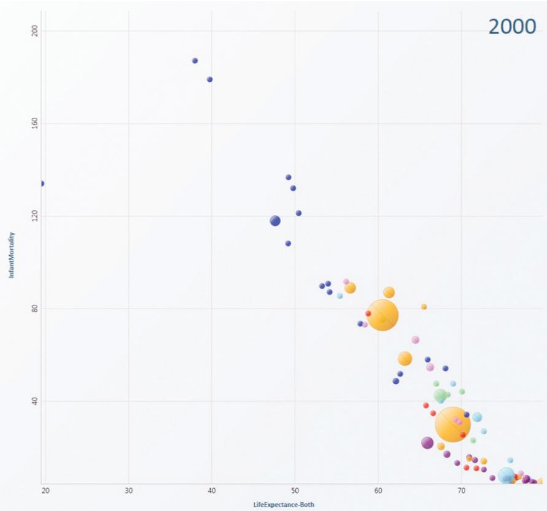  
Figure 7.2. Scatterplot. Each point mark represents a country, with horizontal and vertical spatial position encoding the primary quantitative attributes of life expectancy and infant mortality. The color channel is used for the categorical country attribute and the size channel for quantitative population attribute. From [Robertson et al. 08, Figure 1c].

whether the points form a line along the diagonal. The stronger the correlation, the closer the points fall along a perfect diagonal line; positive correlation is an upward slope, and negative is downward. Figure 7.2 shows a highly negatively correlated dataset.

Additional transformations can also be used to shed more light on the data. Figure 7.3(a) shows the relationship between diamond price and weight. Figure 7.3(b) shows a scatterplot of derived attributes created by logarithmically scaling the originals; the transformed attributes are strongly positively correlated.

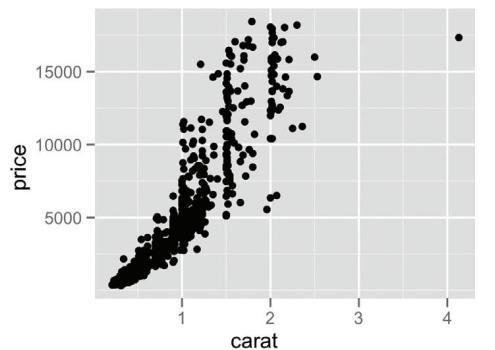  
(a)

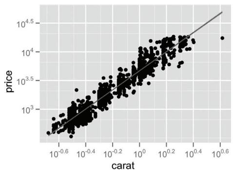  
(b)   
Figure 7.3. Scatterplots. (a) Original diamond price/carat data. (b) Derived log-scale attributes are highly positively correlated. From [Wickham 10, Figure 10].

When judging correlation is the primary intended task, the derived data of a calculated regression line is often superimposed on the raw scatterplot of points, as in Figures 7.3(b) and 1.3.

Scatterplots are often augmented with color coding to show an additional attribute. Size coding can also portray yet another attribute; sizecoded scatterplots are sometimes called bubble plots. Figure 7.2 shows an example of demographic data, plotting infant mortality on the vertical axis against life expectancy on the horizontal axis.

The scalability of a scatterplot is limited by the need to distinguish points from each other, so it is well suited for dozens or hundreds of items.

The table below summarizes this discussion in terms of a what–why– how analysis instance. All of the subsequent examples will end with a similar summary table.

<table><tr><td>Idiom</td><td>Scatterplots</td></tr><tr><td>What: Data</td><td>Table: two quantitative value attributes.</td></tr><tr><td>How: Encode</td><td>Express values with horizontal and vertical spatial position and point marks.</td></tr><tr><td>Why: Task</td><td>Find trends, outliers, distribution, correlation; locate clusters.</td></tr><tr><td>Scale</td><td>Items: hundreds.</td></tr></table>

# 7.5 Separate, Order, and Align: Categorical Regions

The use of space to encode categorical attributes is more complex than the simple case of quantitative attributes where the value can be expressed with spatial position. Spatial position is an ordered magnitude visual channel, but categorical attributes have unordered identity semantics. The principle of expressiveness would be violated if they are encoded with spatial position.

The semantics of categorical attributes does match up well with the idea of a spatial region: regions are contiguous bounded areas that are distinct from each other. Drawing all of the items with the same values for a categorical attribute within the same region uses spatial proximity to encode the information about their similarity, in a way that adheres nicely to the expressiveness principle. The choice to separate into regions still leaves enormous flexibility in how to encode the data within each region: that’s a different design choice. However, these regions themselves must be given spatial positions on the plane in order to draw any specific picture.

The problem becomes easier to understand by breaking down the distribution of regions into three operations: separating into regions, aligning the regions, and ordering the regions. The separation and the ordering always need to happen, but the alignment is optional. The separation should be done according to an attribute that is categorical, whereas alignment and ordering should be done by some other attribute that is ordered. The attribute used to order the regions must have ordered semantics, and thus it cannot be the categorical one that was used to do the separation. If alignment is done, the ordered attribute used to control the alignment between regions is sometimes the same one that is used to encode the spatial position of items within the region. It’s also possible to use a different one.

# 7.5.1 List Alignment: One Key

With a single key, separating into regions using that key yields one region per item. The regions are frequently arranged in a one-dimensional list alignment, either horizontal or vertical. The view itself covers a two-dimensional area: the aligned list of items stretches across one of the spatial dimensions, and the region in which the values are shown stretches across the other.

# Example: Bar Charts

The well-known bar chart idiom is a simple initial example. Figure 7.4 shows a bar chart of approximate weights on the vertical axis for each of three animal species on the horizontal axis. Analyzing the visual encoding, bar charts use a line mark and encode a quantitative value attribute with one spatial position channel. The other attribute shown in the chart, animal species, is a categorical key attribute. Each line mark is indeed in a separate region of space, and there is one for each level of the categorical attribute. These line marks are all aligned within a common frame, so that the highest-accuracy aligned position channel is used rather than the lower-accuracy unaligned channel. In Figure 7.4(a) the regions are ordered alphabetically by species name. Formally, the alphabetical ordering of the names should be considered a derived attribute. This frequent default choice does have the benefit of making lookup by name easy, but it often hides what could be meaningful patterns in the dataset. Figure 7.4(b) shows this dataset with the regions ordered by the values of the same value attribute that is encoded by the bar heights, animal weight. This kind of data-driven ordering makes it easier to see dataset trends. Bar charts are also well suited for the abstract task of looking up individual values.

The scalability issues with bar charts are that there must be enough room on the screen to have white space interleaved between the bar line marks so that they are distinguishable. A bar corresponds to a level of the categorical key attribute, and it’s common to show between several and dozens of bars. In the limit, a full-screen chart with 1000 pixels could handle up to hundreds of bars, but not thousands.

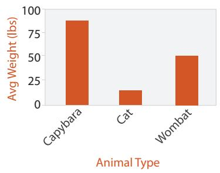  
(a)

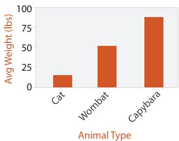  
(b)   
15 15Figure 7.4. Bar chart. The key attribute, species, separates the marks along 10 10the horizontal spatial axis. The value attribute, weight, expresses the value with 5 5aligned vertical spatial position and line marks. (a) Marks ordered alphabetically according to species name. (b) Marks ordered by the weight attribute used for bar heights.

<table><tr><td>Idiom</td><td>Bar Charts</td></tr><tr><td>What: Data</td><td>Table: one quantitative value attribute, one categori- cal key attribute.</td></tr><tr><td>How: Encode</td><td>Line marks, express value attribute with aligned ver- tical position, separate key attribute with horizontal position.</td></tr><tr><td>Why: Task</td><td>Lookup and compare values.</td></tr><tr><td>Scale</td><td>Key attribute: dozens to hundreds of levels.</td></tr></table>

# Example: Stacked Bar Charts

A stacked bar chart uses a more complex glyph for each bar, where multiple sub-bars are stacked vertically. The length of the composite glyph still encodes a value, as in a standard bar chart, but each subcomponent also encodes a length-encoded value. Stacked bar charts show information about multidimensional tables, specifically a two-dimensional table with two keys. The composite glyphs are arranged as a list according to a primary key. The other secondary key is used in constructing the vertical structure of the glyph itself. Stacked bar charts are an example of a list alignment used with more than one key attribute. They support the task of lookup according to either of the two keys.

Stacked bar charts typically use color as well as length coding. Each subcomponent is colored according to the same key that is used to determine the vertical ordering; since the subcomponents are all abutted end to end without a break and are the same width, they would not be distiguishable without different coloring. While it would be possible to use only black outlines with white fill as the rectangles within a bar, comparing subcomponents across different bars would be considerably more difficult.

Figure 7.5 shows an example of a stacked bar chart used to inspect information from a computer memory profiler. The key used to distribute composite bars along the axis is the combination of a processor and a procedure. The key used to stack and color the glyph subcomponents is the type of cache miss; the height of each full bar encodes all cache misses for each processor–procedure combination.

Each component of the bar is separately stacked, so that the full bar height shows the value for the combination of all items in the stack. The heights of the lowest bar component and the full combined bar are both easy to compare against other bars because they can be read off against the flat baseline; that is, the judgement is position against a common scale. The other components in the stack are more difficult to compare

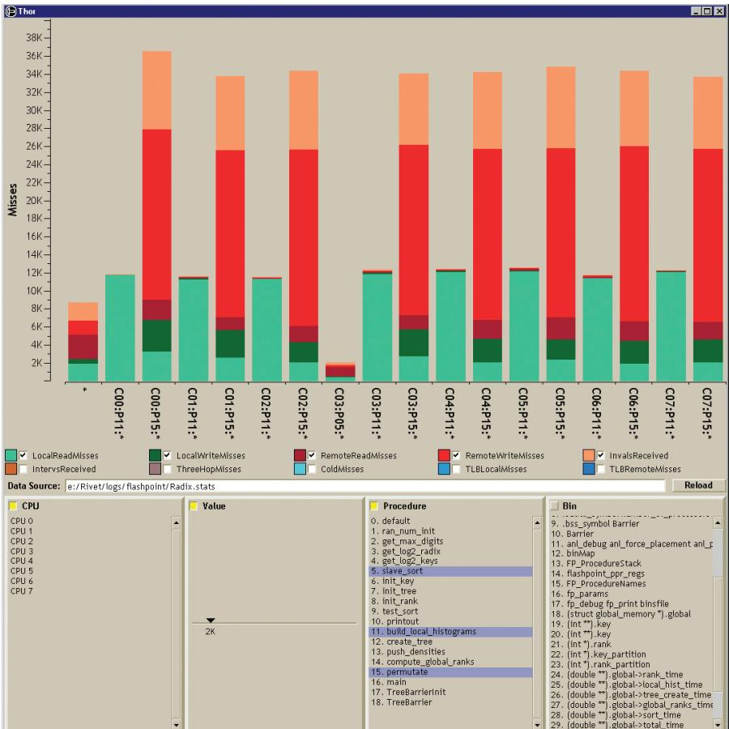  
Figure 7.5. Stacked bar chart. The Thor memory profiler shows cache misses stacked and colored by miss type. From [Bosch 01, Figure 4.1].

Stacked bars are typically used for absolute data; relative proportions of parts to a whole can be shown with a normalized stacked bar chart, where each bar shows the same information as in an entire pie chart, as discussed in Section 7.6.3.

across bars because their starting points are not aligned to a common scale. Thus, the order of stacking is significant for the kinds of patterns that are most easily visible, in addition to the ordering of bars across the main axis, as with standard bar charts.

The scalability of stacked bar charts is similar to standard bar charts in terms of the number of categories in the key attribute distributed across the main axis, but it is more limited for the key used to stack the subcomponents within the glyph. This idiom works well with several categories, with an upper limit of around one dozen.

<table><tr><td>Idiom</td><td>Stacked Bar Charts</td></tr><tr><td>What: Data</td><td>Multidimensional table: one quantitative value attribute, two categorical key attributes.</td></tr><tr><td>How: Encode</td><td>Bar glyph with length-coded subcomponents of value attribute for each category of secondary key attribute. Separate bars by category of primary key attribute.</td></tr><tr><td>Why: Task</td><td>Part-to-whole relationship, lookup values, find trends.</td></tr><tr><td>Scale</td><td>Key attribute (main axis): dozens to hundreds of levels. Key attribute (stacked glyph axis): several to one dozen</td></tr></table>

# Example: Streamgraphs

Figure 7.6 shows a more complex generalized stacked graph display idiom with a dataset of music listening history, with one time series per artist counting the number of times their music was listened to each week [Byron and Wattenberg 08]. The streamgraph idiom shows derived geometry that emphasizes the continuity of the horizontal layers that represent the artists, rather than showing individual vertical glyphs that would emphasize listening behavior at a specific point in time.1 The derived geometry is the result of a global computation, whereas individual glyphs can be constructed using only calculations about their own local region. The streamgraph idiom emphasizes the legibility of the individual streams with a deliberately organic silhouette, rather than using the horizontal axis as

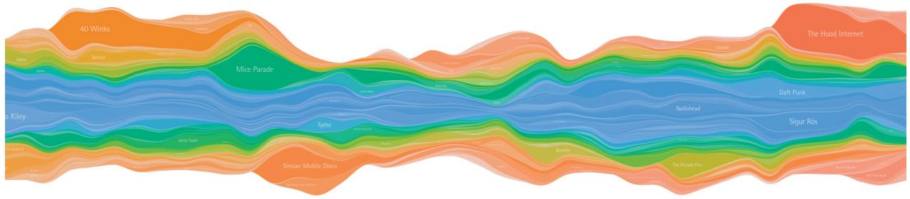  
Figure 7.6. Streamgraph of music listening history. From [Byron and Wattenberg 08, Figure 0].

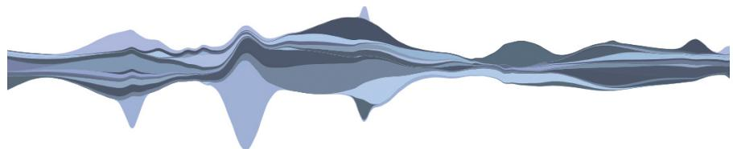  
(a)

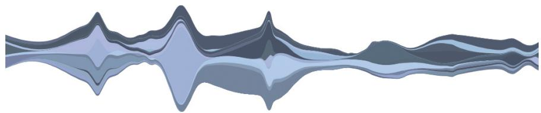  
(b)   
Figure 7.7. Streamgraphs with layers ordered by different derived attributes. (a) Volatility of artist’s popularity. (b) Onset time when artist’s music of first gained attention. From [Byron and Wattenberg 08, Figure 15].

the baseline. The shape of the layout is optimized as a trade-off between multiple factors, including the external silhouette of the entire shape, the deviation of each layer from the baseline, and the amount of wiggle in the baseline. The order of the layers is computed with an algorithm that emphasizes a derived value; Figure 7.7 shows the difference between sorting by the volatility of the artist’s popularity, as shown in Figure 7.7(a), and the onset time when they begin to gain attention, as shown in Figure 7.7(b).

Streamgraphs scale to a larger number of categories than stacked bar charts, because most layers do not extend across the entire length of the timeline.

<table><tr><td>Idiom</td><td>Streamgraphs</td></tr><tr><td>What: Data</td><td>Multidimensional table: one quantitative value attribute (counts), one ordered key attribute (time), one categorical key attribute (artist).</td></tr><tr><td>What: Derived</td><td>One quantitative attribute (for layer ordering).</td></tr><tr><td>How: Encode</td><td>Use derived geometry showing artist layers across time, layer height encodes counts.</td></tr><tr><td>Scale</td><td>Key attributes (time, main axis): hundreds of time points. Key attributes (artists, short axis): dozens to hundreds</td></tr></table>

# Example: Dot and Line Charts

The dot chart idiom is a visual encoding of one quantitative attribute using spatial position against one categorical attribute using point marks, rather than the line marks of a bar chart.* Figure 7.8(a) shows a dot chart of cat weight over time with the ordered variable of year on the horizontal axis and the quantitative weight of a specific cat on the vertical axis.

One way to think about a dot chart is like a scatterplot where one of the axes shows a categorical attribute, rather than both axes showing quantitative attributes. Another way to think about a dot chart is like a bar chart where the quantitative attribute is encoded with point marks rather than line marks; this way matches more closely with its standard use.

The idiom of line charts augments dot charts with line connection marks running between the points. Figure 7.8(b) shows a line chart for the same dataset side by side with the dot chart, plotting the weight of a cat over several years. The trend of constantly increasing weight, followed by loss after a veterinarian-imposed diet regime in 2010, is emphasized by the connecting lines.

* The terms dot chart and dot plot are sometimes used as synonyms and have been overloaded. I use dot chart here for the idiom popularized by Cleveland [Becker et al. 96, Cleveland and McGill 84a], whereas Wilkinson [Wilkinson 99] uses dot plot for an idiom that shows distributions in a way similar to the histograms discussed in Section 13.4.1.

<table><tr><td>Idiom</td><td>Dot Charts</td></tr><tr><td>What: Data</td><td>Table: one quantitative value attribute, one ordered key attribute.</td></tr><tr><td>How: Encode</td><td>Express value attribute with aligned vertical position and point marks. Separate/order into horizontal regions by key attribute.</td></tr></table>

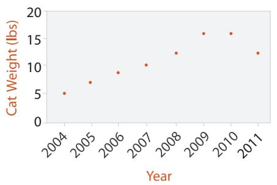  
(a)

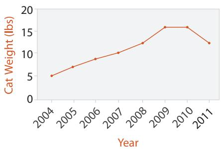  
(b)   
Figure 7.8. Line charts versus dot charts. (a) Dot charts use a point mark to show the value for each item. (b) Line charts use point marks connected by lines between them.

<table><tr><td>Idiom</td><td>Line Charts</td></tr><tr><td>What: Data</td><td>Table: one quantitative value attribute, one ordered key attribute.</td></tr><tr><td>How: Encode</td><td>Dot chart with connection marks between dots.</td></tr><tr><td>Why</td><td>Show trend.</td></tr><tr><td>Scale</td><td>Key attribute: hundreds of levels.</td></tr></table>

Line charts, dot charts, and bar charts all show one value attribute and one key attribute with a rectilinear spatial layout. All of these chart types are often augmented to show a second categorical attribute using color or shape channels. They use one spatial position channel to express a quantitative attribute, and use the other direction for a second key attribute. The difference is that line charts also use connection marks to emphasize the ordering of the items along the key axis by explicitly showing the relationship between one item and the next. Thus, they have a stronger implication of trend relationships, making them more suitable for the abstract task of spotting trends.

Line charts should be used for ordered keys but not categorical keys. A line chart used for categorical data violates the expressiveness principle, since it visually implies a trend where one cannot exist. This implication is so strong that it can override common knowledge. Zacks and Tversky studied how people answered questions about the categorical data type of gender versus the quantitative data type of age, as shown in Figure 7.9 [Zacks and Tversky 99]. Line charts for quantitative data elicited appropriate trend-related answers, such as “Height increases with age”. Bar charts for quantitative data elicited equally appropriate discretecomparison answers such as “Twelve year olds are taller than ten year olds”. However, line charts for categorical data elicited inappropriate trend answers such as “The more male a person is, the taller he/she is”.

When designing a line chart, an important question to consider is its aspect ratio: the ratio of width to height of the entire plot. While many standard charting packages simply use a square or some other fixed size, in many cases this default choice hides dataset structure. The relevant perceptual principle is that our ability to judge angles is more accurate at exact diagonals than at arbitrary directions. We can easily tell that an angle like $4 3 ^ { \circ }$ is off from the exact $4 5 ^ { \circ }$ diagonal, whereas we cannot tell $2 0 ^ { \circ }$ from $2 2 ^ { \circ }$ . The

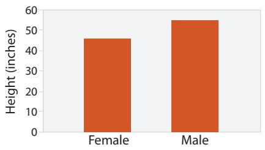

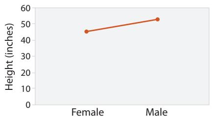

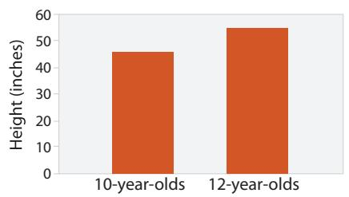

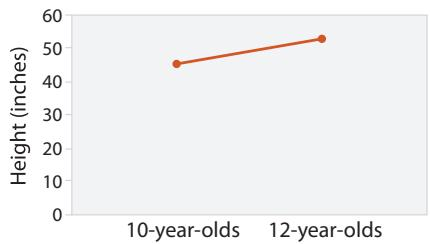  
Figure 7.9. Bar charts and line charts both encode a single attribute. Bar charts encourage discrete comparisons, while line graphs encourage trend assessments. Line charts should not be used for categorical data, as in the upper right, because their implications are misleading. After [Zacks and Tversky 99, Figure 2].

idiom of banking to $4 5 ^ { \circ }$ computes the best aspect ratio for a chart in order to maximize the number of line segments that fall close to the diagonal. Multiscale banking to $4 5 ^ { \circ }$ automatically finds a set of informative aspect ratios using techniques from signal processing to analyze the line graph in the frequency domain, with the derived variable of the power spectrum. Figure 7.10 shows the classic sunspot example dataset. The aspect ratio close to 4 in Figure 7.10(a) shows the classic low-frequency oscillations in the maximum values of each sunspot cycle. The aspect ratio close to 22 in Figure 7.10(b) shows that many cycles have a steep onset followed by a more gradual decay. The blue line graphs the data itself, while the red line is the derived locally weighted regression line showing the trend.

# 7.5.2 Matrix Alignment: Two Keys

Datasets with two keys are often arranged in a two-dimensional matrix alignment where one key is distributed along the rows and

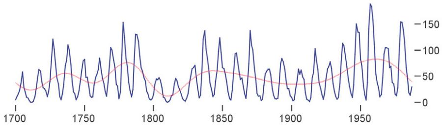  
(a)

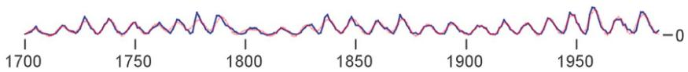  
(b)   
Figure 7.10. Sunspot cycles. The multiscale banking to $4 5 ^ { \circ }$ idiom exploits our orientation resolution accuracy at the diagonal. (a) An aspect ratio close to 4 emphasizes low-frequency structure. (b) An aspect ratio close to 22 shows higherfrequency structure: cycle onset is mostly steeper than the decay. From [Heer and Agrawala 06, Figure 5].

the other along the columns, so a rectangular cell in the matrix is the region for showing the item values.

# Example: Cluster Heatmaps

The idiom of heatmaps is one of the simplest uses of the matrix alignment: each cell is fully occupied by an area mark encoding a single quantitative value attribute with color. Heatmaps are often used with bioinformatics datasets. Figure 7.11 shows an example where the keys are genes and experimental conditions, and the quantitative value attribute is the activity level of a particular gene in a particular experimental condition as measured by a microarray. This heatmap uses a diverging red–green colormap, as is common in the genomics domain. (In this domain there is a strong convention for the meaning of red and green that arose from raw images created by the optical microarray sensors that record fluorescence at specific wavelengths. Unfortunately, this choice causes problems for colorblind users.) The genes are a categorical attribute; experimental conditions might be categorical or might be ordered, for example if the experiments were done at successive times.

The benefit of heatmaps is that visually encoding quantitative data with color using small area marks is very compact, so they are good for

See Section 10.3 for more on colormap design and Section 10.3.4 for the particular problem of colorblind-safe design.

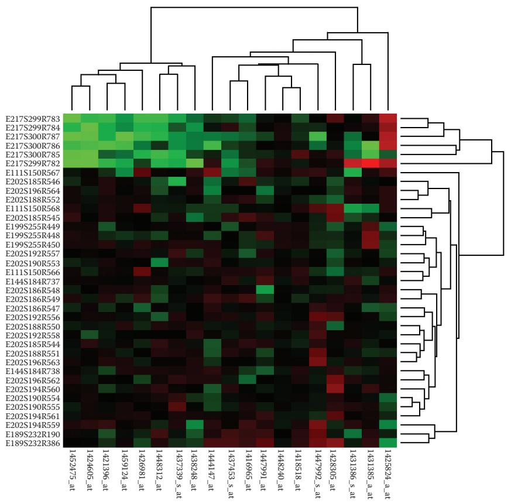  
Figure 7.11. Cluster heatmap. A heatmap provides a compact summary of a quantitative value attribute with 2D matrix alignment by two key attributes and small area marks colored with a diverging colormap. The cluster heatmap includes trees drawn on the periphery showing how the matrix is ordered according to the derived data of hierarchical clusterings on its rows and columns.

providing overviews with high information density. The area marks in a heatmap are often several pixels on a side for easy distinguishability, so a matrix of $2 0 0 ~ \times ~ 2 0 0$ with 40,000 items is easily handled. The limit is area marks of a single pixel, for a dense heatmap showing one million items. Thus, the scalability limits are hundreds of levels for each of the two categorical key attributes. In contrast, only a small number of different levels of the quantitative attribute can be distinguishable, because of the limits on color perception in small noncontiguous regions: between 3 and 11 bins.2

2Again, all of the scalability analyses in this book related to screen-space limits assume a standard display size of $1 0 0 0 \times 1 0 0 0$ , for a total of one million available pixels.

* There are many synonyms for matrix reordering, including matrix permutation, seriation, ordination, biclustering, coclustering, and two-mode clustering. Matrix reordering has been studied in many different literatures beyond vis including cartography, statistics, operations research, data mining, bioinformatics, ecology, psychology, sociology, and manufacturing.   
Hierarchical clustering is further discussed in Section 13.4.1.

The cluster heatmap idiom combines the basic heatmap with matrix reordering, where two attributes are reordered in combination.* The goal of matrix reordering is to group similar cells in order to check for largescale patterns between both attributes, just as the goal of reordering a single attribute is to see trends across a single one.

A cluster heatmap is the juxtaposed combination of a heatmap and two dendrograms showing the derived data of the cluster hierarchies used in the reodering. A cluster hierarchy encapsulates the complete history of how a clustering algorithm operates iteratively. Each leaf represents a cluster of a single item; the interior nodes record the order in which clusters are merged together based on similarity, with the root representing the single cluster of all items. A dendrogram is a visual encoding of tree data with the leaves aligned so that the interior branch heights are easy to compare. The final order used for the rows and the columns of the matrix view is determined by traversing the leaves in the trees.

<table><tr><td>Idiom</td><td>Heatmaps</td></tr><tr><td>What: Data</td><td>Table: two categorical key attributes (genes, conditions), one quantitative value attribute (activity level for gene in condition).</td></tr><tr><td>How: Encode</td><td>2D matrix alignment of area marks, diverging color-map.</td></tr><tr><td>Why: Task</td><td>Find clusters, outliers; summarize.</td></tr><tr><td>Scale</td><td>Items: one million. Categorical attribute levels: hundreds. Quantitative attribute levels: 3–11.</td></tr><tr><td>Idiom</td><td>Cluster Heatmaps</td></tr><tr><td>What: Derived</td><td>Two cluster hierarchies for table rows and columns.</td></tr><tr><td>How: Encode</td><td>Heatmap: 2D matrix alignment, ordered by both cluster hierarchies. Dendrogram: connection line marks for parent-child relationships in tree.</td></tr></table>

# Example: Scatterplot Matrix

A scatterplot matrix (SPLOM) is a matrix where each cell contains an entire scatterplot chart. A SPLOM shows all possible pairwise combinations of attributes, with the original attributes as the rows and columns. Figure 15.2 shows an example. In contrast to the simple heatmap matrix where each cell shows one attribute value, a SPLOM is an example of a more complex matrix where each cell shows a complete chart.

The key is a simple derived attribute that is the same for both the rows and the columns: an index listing all the attributes in the original dataset. The matrix could be reordered according to any ordered attribute. Usually

SPLOMS are an example of small-multiple views, as discussed in Section 12.3.2.

only the lower or upper triangle of the matrix is shown, rather than the redundant full square. The diagonal cells are also typically omitted, since they would show the degenerate case of an attribute plotted against itself, so often labels for the axes are shown in those cells.

SPLOMs are heavily used for the abstract tasks of finding correlations, trends, and outliers, in keeping with the usage of their constituent scatterplot components.

Each scatterplot cell in the matrix requires enough room to plot a dot for each item discernably, so around $1 0 0 ~ \times ~ 1 0 0$ pixels is a rough lower bound. The scalability of a scatterplot matrix is thus limited to around one dozen attributes and hundreds of items.

Many extensions to SPLOMs have been proposed, including the scagnostics idiom using derived attributes described in Section 15.3 and the compact heatmap-style overview described in Section 15.5.

<table><tr><td>Idiom</td><td>Scatterplot Matrix (SPLOM)</td></tr><tr><td>What: Data</td><td>Table.</td></tr><tr><td>What: Derived</td><td>Ordered key attribute: list of original attributes.</td></tr><tr><td>How: Encode</td><td>Scatterplots in 2D matrix alignment.</td></tr><tr><td>Why: Task</td><td>Find correlation, trends, outliers.</td></tr><tr><td>Scale</td><td>Attributes: one dozen.
Items: dozens to hundreds.</td></tr></table>

# 7.5.3 Volumetric Grid: Three Keys

Just as data can be aligned in a 1D list or a 2D matrix, it is possible to align data in three dimensions, in a 3D volumetric grid. However, this design choice is typically not recommended for nonspatial data because it introduces many perceptual problems, including occlusion and perspective distortion. An alternative choice for spatial layout for multidimensional tables with three keys is recursive subdivision, as discussed below.

The rationale for avoiding the unjustified use of 3D for nonspatial data is discussed in Section 6.3.

# 7.5.4 Recursive Subdivision: Multiple Keys

With multiple keys, it’s possible to extend the above approaches by recursively subdividing the cell within a list or matrix. That is, ordering and alignment is still used in the same way, and containment is added to the mix.

There are many possibilities of how to partition data into separate regions when dealing with multiple keys. These design choices are discussed in depth in Section 12.4.

# 7.6 Spatial Axis Orientation

An additional design choice with the use of space is how to orient the spatial axes: whether to use rectilinear, parallel, or radial layout.

# 7.6.1 Rectilinear Layouts

In a rectilinear layout, regions or items are distributed along two perpendicular axes, horizontal and vertical spatial position, that range from minimum value on one side of the axis to a maximum value on the other side. Rectilinear layouts are heavily used in vis design and occur in many common statistical charts. All of the examples above use rectilinear layouts.

# 7.6.2 Parallel Layouts

The rectilinear approach of a scatterplot, where items are plotted as dots with respect to perpendicular axes, is only usable for two data attributes when high-precision planar spatial position is used. Even if the low-precision visual channel of a third spatial dimension is used, then only three data attributes can be shown using spatial position channels. Although additional nonspatial channels can be used for visual encoding, the problem of channel inseparability limits the number of channels that can be combined effectively in a single view. Of course, many tables contain far more than three quantitative attributes.

# Example: Parallel Coordinates

The idiom of parallel coordinates is an approach for visualizing many quantitative attributes at once using spatial position. As the name suggests, the axes are placed parallel to each other, rather than perpendicularly at right angles. While an item is shown with a dot in a scatterplot, with parallel coordinates a single item is represented by a jagged line that zigzags through the parallel axes, crossing each axis exactly once at the location of the item’s value for the associated attribute.* Figure 7.12 shows an example of the same small data table shown both as a SPLOM and with parallel coordinates.

One original motivation by the designers of parallel coordinates was that they can be used for the abstract task of checking for correlation between attributes. In scatterplots, the visual pattern showing correlation is the tightness of the diagonal pattern formed by the item dots, tilting

‣ The potential drawbacks of using three spatial dimensions for abstract data are discussed in Section 6.3.   
The issue of separable versus integral channels is covered in Section 5.5.3.

* In graphics terminology, the jagged line is a polyline: a connected set of straight line segments.

<table><tr><td colspan="4">Table</td></tr><tr><td>Math</td><td>Physics</td><td>Dance</td><td>Drama</td></tr><tr><td>85</td><td>95</td><td>70</td><td>65</td></tr><tr><td>90</td><td>80</td><td>60</td><td>50</td></tr><tr><td>65</td><td>50</td><td>90</td><td>90</td></tr><tr><td>50</td><td>40</td><td>95</td><td>80</td></tr><tr><td>40</td><td>60</td><td>80</td><td>90</td></tr></table>

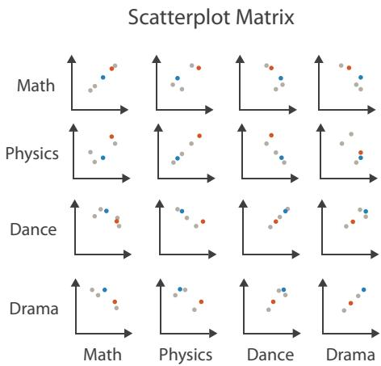

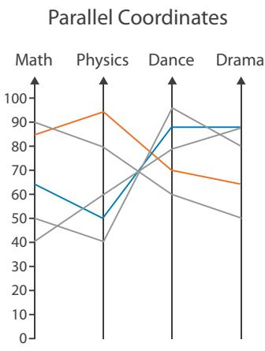  
Figure 7.12. Comparison of scatterplot matrix and parallel coordinate idioms for a small data table. After [McGuffin 14].

upward for positive correlation and downward for negative correlation. If the attributes are not correlated, the points fall throughout the twodimensional region rather than tightly along the diagonal. With parallel coordinates, correlation is also visible, but through different kinds of visual patterns, as illustrated in Figure 7.13. If two neighboring axes have high positive correlation, the line segments are mostly parallel. If two axes have high negative correlation, the line segments mostly cross over each other at a single spot between the axes. The pattern in between uncorrelated axes is a mix of crossing angles.

However, in practice, SPLOMs are typically easier to use for the task of finding correlation. Parallel coordinates are more often used for other tasks, including overview over all attributes, finding the range of individual attributes, selecting a range of items, and outlier detection. For example, in Figure 7.14(a), the third axis, labeled manu wrkrs, has a broad range nearly to the normalized limits of 628.50 and 441.50, whereas the range of values on the sixth axis, labeled cleared, is more narrow; the top item on the fourth axis, labeled handgun lc, appears to be an outlier with respect to that attribute.

Parallel coordinates visually encode data using two dimensions of spatial position. Of course, any individual axis requires only one spatial dimension, but the second dimension is used to lay out multiple axes. The scalability is high in terms of the number of quantitative attribute values that can be discriminated, since the high-precision channel of planar spatial position is used. The exact number is roughly proportional to the screen space extent of the axes, in pixels. The scalability is moderate in

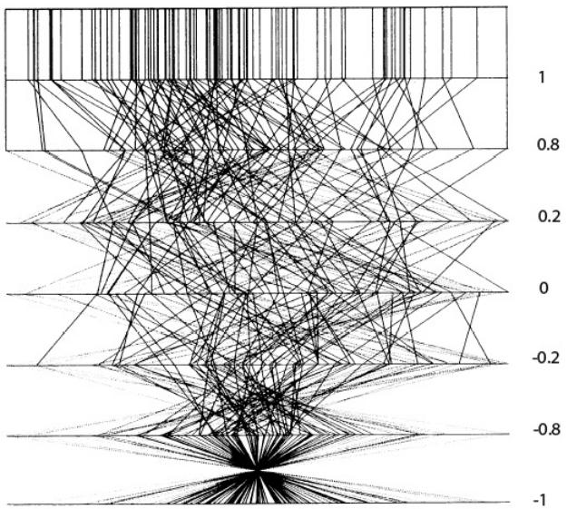  
Figure 7.13. Parallel coordinates were designed to show correlation between neighboring axes. At the top, parallel lines show perfect positive correlation. At the bottom, all of the lines cross over each other at a single spot in between the two axes, showing perfect negative correlation. In the middle, the mix of crossings shows uncorrelated data. From [Wegman 90, Figure 3].

terms of number of attributes that can be displayed: dozens is common. As the number of attributes shown increases, so does the width required to display them, so a parallel coordinates display showing many attributes is typically a wide and flat rectangle. Assuming that the axes are vertical, then the amount of vertical screen space required to distinguish position along them does not change, but the amount of horizontal screen space increases as more axes are added. One limit is that there must be enough room between the axes to discern the patterns of intersection or parallelism of the line segments that pass between them.

The basic parallel coordinates idiom scales to showing hundreds of items, but not thousands. If too many lines are overplotted, the resulting occlusion yields very little information. Figure 7.14 contrasts the idiom used successfully with 13 items and 7 attributes, as in Figure 7.14(a), versus ineffectively with over 16,000 items and 5 attributes, as in Figure 7.14(b). In the latter case, only the minimum and maximum values along each axis can be read; it is nearly impossible to see trends, anomalies, or correlations.

The patterns made easily visible by parallel coordinates have to do with the pairwise relationships between neighboring axes. Thus, the cru-

Section 13.4.1 covers scaling to larger datasets with hierarchical parallel coordinates.

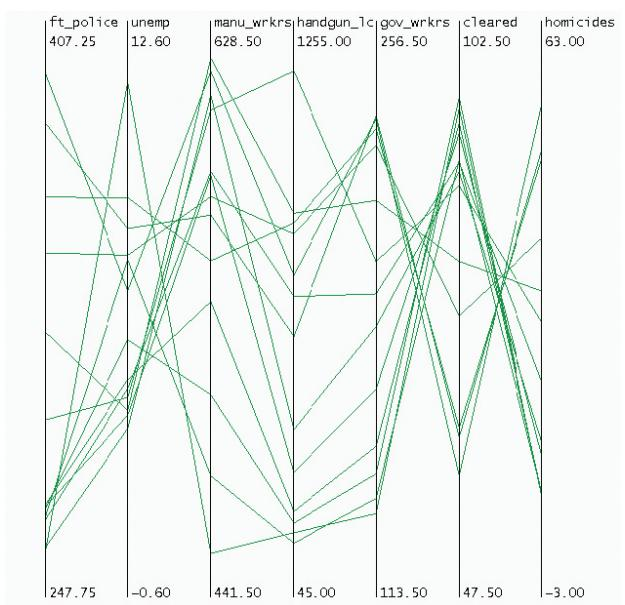

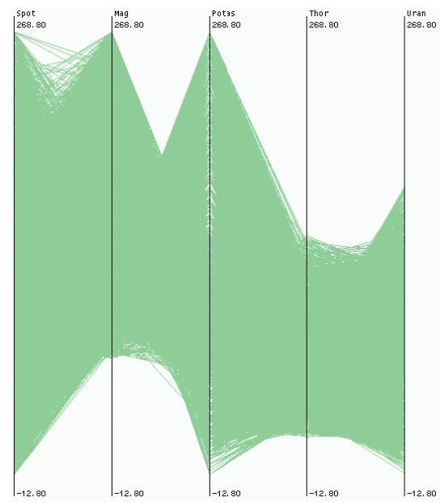  
  
Figure 7.14. Parallel coordinates scale to dozens of attributes and hundreds of items, but not to thousands of items. (a) Effective use with 13 items and 7 attributes. (b) Ineffective use with over 16,000 items and 5 attributes. From [Fua et al. 99, Figures 1 and 2].

cial limitation of parallel coordinates is how to determine the order of the axes. Most implementations allow the user to interactively reorder the axes. However, exploring all possible configurations of axes through systematic manual interaction would be prohibitively time consuming as the number of axes grows, because of the exploding number of possible combinations.

Another limitation of parallel coordinates is training time; first-time users do not have intuitions about the meaning of the patterns they see, which must thus be taught explicitly. Parallel coordinates are often used in one of several multiple views showing different visual encodings of the same dataset, rather than as the only encoding. The combination of more familiar views such as scatterplots with a parallel coordinates view accelerates learning, particularly since linked highlighting reinforces the mapping between the dots in the scatterplots and the jagged lines in the parallel coordinates view.

Multiple view design choices are discussed in Sections 12.3 and 12.4.

<table><tr><td>Idiom</td><td>Parallel Coordinates</td></tr><tr><td>What: Data</td><td>Table: many value attributes.</td></tr><tr><td>How: Encode</td><td>Parallel layout: horizontal spatial position used to separate axes, vertical spatial position used to express value along each aligned axis with connection line marks as segments between them.</td></tr><tr><td>Why: Tasks</td><td>Find trends, outliers, extremes, correlation.</td></tr><tr><td>Scale</td><td>Attributes: dozens along secondary axis.
Items: hundreds.</td></tr></table>

# 7.6.3 Radial Layouts

In a radial spatial layout, items are distributed around a circle using the angle channel in addition to one or more linear spatial channels, in contrast to the rectilinear layouts that use only two spatial channels.

The natural coordinate system in radial layouts is polar coordinates, where one dimension is measured as an angle from a starting line and the other is measured as a distance from a center point. Figure 7.15 compares polar coordinates, as shown in Figure 7.15(a), with standard rectilinear coordinates, as shown in Figure 7.15(b). From a strictly mathematical point of view, rectilinear and radial layouts are equivalent under a particular kind of transformation: a box bounded by two sets of parallel lines is transformed into a disc where one line is collapsed to a point at the center and the other line wraps around to meet up with itself, as in Figure 7.15(c).

However, from a perceptual point of view, rectilinear and radial layouts are not equivalent at all. The change of visual channel has two major consequences from visual encoding principles alone. First, the angle channel is less accurately perceived than a rectilinear spatial position channel. Second, the angle channel is inherently cyclic, because the start and end point are the same, as opposed to the inherently linear nature of a position channel.* The expressiveness and effectiveness principles suggest some guidelines on the use of radial layouts. Radial layouts may be more effective than rectilinear ones in showing the periodicity of patterns, but encoding nonperiodic data with the periodic channel of angle

* In mathematical language, the angle channel is nonmonotonic.

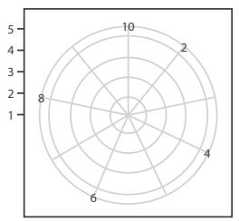  
(a)

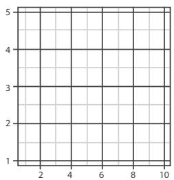  
(b)

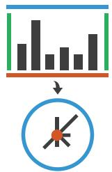  
(c)   
Figure 7.15. Layout coordinate systems. (a) Radial layouts use polar coordinates, with one spatial position and one angle channel. (b) Rectlinear layouts use two perpendicular spatial position channels. After [Wickham 10, Figure 8]. (c) Transforming rectilinear to radial layouts maps two parallel bounding lines to a point at the center and a circle at the perimeter.

may be misleading. Radial layouts imply an asymmetry of importance between the two attributes and would be inappropriate when the two attributes have equal importance.

# Example: Radial Bar Charts

The same five-attribute dataset is encoded with a rectilinear bar chart in Figure 7.16(a) and with a radial alternative in Figure 7.16(b). In both cases, line marks are used to encode a quantitative attribute with the length channel, and the only difference is the radial versus the rectilinear orientation of the axes.

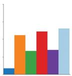

  
  
Figure 7.16. Radial versus rectilinear layouts. (a) Rectilinear bar chart. (b) Radial bar chart. After [Booshehrian et al. 11, Figure 4].

<table><tr><td>Idiom</td><td>Radial Bar Charts</td></tr><tr><td>What: Data</td><td>Table: one quantitative attribute, one categorical attribute.</td></tr><tr><td>How: Encode</td><td>Length coding of line marks; radial layout.</td></tr></table>

# Example: Pie Charts

The most commonly used radial statistical graphic is the pie chart, shown in Figure 7.17(a). Pie charts encode a single attribute with area marks and the angle channel. Despite their popularity, pie charts are clearly problematic when considered according to the visual channel properties discussed in Section 5.5. Angle judgements on area marks are less accurate than length judgements on line marks. The wedges vary in width along the radial axis, from narrow near the center to wide near the outside, making the area judgement particularly difficult. Figure 7.17(b) shows a bar chart with the same data, where the perceptual judgement required to read the data is the high-accuracy position along a common scale channel. Figure 7.17(c) shows a third radial chart that is a more direct equivalent of a bar chart transformed into polar coordinates. The polar area chart also encodes a single quantitative attribute but varies the length of the wedge just as a bar chart varies the length of the bar, rather than varying the angle as in a pie chart.* The data in Figure 7.17 shows the clarity distribution of diamonds, where I1 is worst and $I F$ is best. These instances redundantly encode each mark with color for easier legibility, but these idioms could be used without color coding.

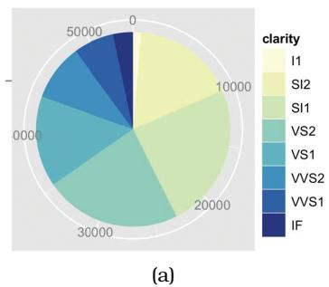  
* Synonyms for polar area chart are rose plot and coxcomb plot; these were first popularized by Florence Nightingale in the 19th century in her analysis of Crimean war medical data.

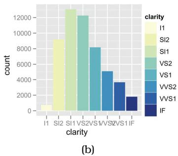

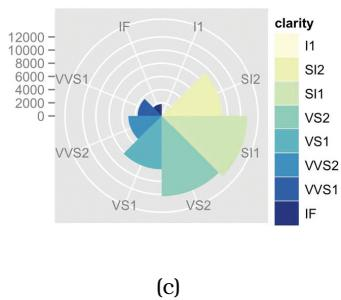  
Figure 7.17. Pie chart versus bar chart accuracy. (a) Pie charts require angle and area judgements. (b) Bar charts require only high-accuracy length judgements for individual items. (c) Polar area charts are a more direct equivalent of bar charts, where the length of each wedge varies like the length of each bar. From [Wickham 10, Figures 15 and 16].

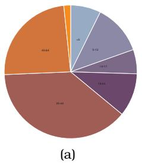

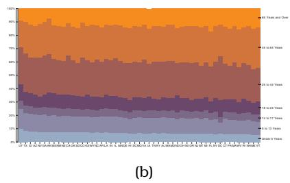

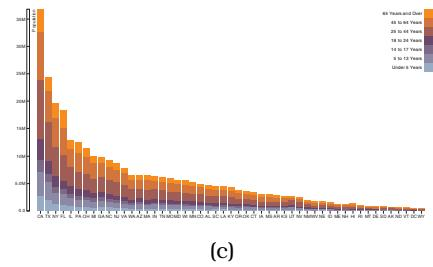  
Figure 7.18. Relative contributions of parts to a whole. (a) A single pie chart shows the relative contributions of parts to a whole, such as percentages, using area judgements. (b) Each bar in a normalized stacked bar chart also shows the relative contributions of parts to a whole, with a higher-accuracy length encoding. (c) A stacked bar chart shows the absolute counts in each bar, in contrast to the percentages when each bar is normalized to the same vertical length. From http://bl.ocks.org/mbostock/3887235, http://bl.ocks.org/mbostock/3886208, http://bl.ocks. org/mbostock/3886394.

The most useful property of pie charts is that they show the relative contribution of parts to a whole. The sum of the wedge angles must add up to the $3 6 0 ^ { \circ }$ of a full circle, matching normalized data such as percentages where the parts must add up to $1 0 0 \%$ . However, this property is not unique to pie charts; a single bar in a normalized stacked bar chart can also be used to show this property with the more accurate channel of length judgements. A stacked bar chart uses a composite glyph made of stacking multiple sub-bars of different colors on top of each other; a normalized stacked bar chart stretches each of these bars to the maximum possible length, showing percentages rather than absolute counts. Only the lowest sub-bar in a stacked bar chart is aligned with the others in its category, allowing the very highest accuracy channel of position with respect to a common frame to be used. The other sub-bars use unaligned position, a channel that is less accurate than aligned position, but still more accurate than angle comparisons.

Figure 7.18 compares a single pie chart showing aggregate population data for the entire United States to a normalized stacked bar chart and a stacked bar chart for all 50 states. An entire pie chart corresponds to a single bar in these charts; an equivalent display would be a list or matrix of pies.

Pie charts require somewhat more screen area than normalized stacked bar charts because the angle channel is lower precision than the length channel. The aspect ratio also differs, where a pie chart requires a square, whereas a bar chart requires a long and narrow rectangle. Both pie charts and normalized stacked bar charts are limited to showing a small number of categories, with a maximum of around a dozen categories.

Stacked glyphs are discussed further in Section 7.5.1.

<table><tr><td>Idiom</td><td>Pie Charts</td></tr><tr><td>What: Data</td><td>Table: one quantitative attribute, one categorical attribute.</td></tr><tr><td>Why: Task</td><td>Part-whole relationship.</td></tr><tr><td>How: Encode</td><td>Area marks (wedges) with angle channel; radial lay-out.</td></tr><tr><td>Scale</td><td>One dozen categories.</td></tr><tr><td>Idiom</td><td>Polar Area Charts</td></tr><tr><td>What: Data</td><td>Table: one quantitative attribute, one categorical attribute.</td></tr><tr><td>Why: Task</td><td>Part-whole relationship.</td></tr><tr><td>How: Encode</td><td>Area marks (wedges) with length channel; radial lay-out.</td></tr><tr><td>Scale</td><td>One dozen categories.</td></tr><tr><td>Idiom</td><td>Normalized Stacked Bar Charts</td></tr><tr><td>What: Data</td><td>Multidimensional table: one quantitative value attribute, two categorical key attributes.</td></tr><tr><td>What: Derived</td><td>One quantitative value attribute (normalized version of original attribute).</td></tr><tr><td>Why: Task</td><td>Part-whole relationship.</td></tr><tr><td>How: Encode</td><td>Line marks with length channel; rectilinear layout.</td></tr><tr><td>Scale</td><td>One dozen categories for stacked attribute. Several dozen categories for axis attribute.</td></tr></table>

Figure 7.19 compares rectilinear and radial layouts for 12 iconic time-series datasets: linear increasing, decreasing, shifted, single peak, single dip, combined linear and nonlinear, seasonal trends with different scales, and a combined linear and seasonal trend [Wickham et al. 12]. The rectilinear layouts in Figure 7.19(a) are more effective at showing the differences between the linear and nonlinear trends, whereas the radial plots Figure 7.19(b) are more effective at showing cyclic patterns.

A first empirical study on radial versus rectilinear grid layouts by Diehl et al. focused on the abstract task of memorizing positions of objects for a few seconds [Diehl et al. 10]. They compared performance in terms of accuracy and speed for rectilinear grids of rows and columns versus radial grids of sectors and rows. (The study did not investigate the effect of periodicity.) In general, rectilinear

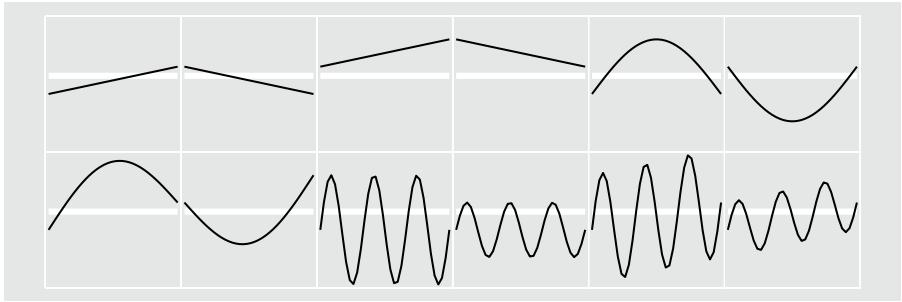  
(a)

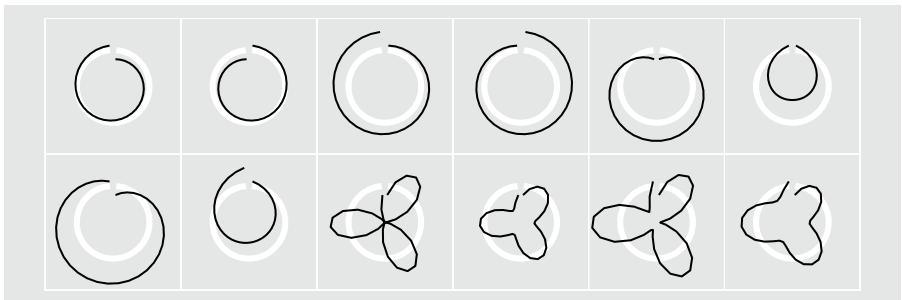  
(b)   
Figure 7.19. Glyphmaps. (a) Rectilinear layouts are more effective at showing the differences between linear and nonlinear trends. (b) Radial layouts are more effective at showing cyclic patterns. From [Wickham et al. 12, Figure 3].

layouts outperformed radial layouts: perception speed was faster, and accuracy tended to be better. However, their results also suggest the use of radial layouts can be justified when one attribute is more important than the other. In this case, the more important attribute should be encoded in the sectors and the less important attribute in the rings.

# 7.7 Spatial Layout Density

Another design choice with spatial visual encoding idioms is whether a layout is dense or sparse. A related, but not identical, choice is whether a layout is space-filling.

* A synonym for dense is pixel-oriented.

# 7.7.1 Dense

A dense layout uses small and densely packed marks to provide an overview of as many items as possible with very high information density.* A maximally dense layout has point marks that are only a single pixel in size and line marks that are only a single pixel in width. The small size of the marks implies that only the planar position and color channels can be used in visual encoding; size and shape are not available, nor are others like tilt, curvature, or shape that require more room than is available.

Section 15.4 presents a detailed case study of VisDB, a dense display for multidimensional tables using point marks.

# Example: Dense Software Overviews

Figure 7.20 shows the Tarantula system, a software engineering tool for visualizing test coverage [Jones et al. 02]. Dense displays using line marks have become popular for showing overviews of software source code. In these displays, the arrangement of the marks is dictated by the order and length of the lines of code, and the coloring of the lines encodes an attribute of interest.

Most of the screen is devoted to a large and dense overview of source code using one-pixel tall lines, color coded to show whether it passed, failed, or had mixed results when executing a suite of test cases. Although of course the code is illegible in the low-resolution overview, this view does convey some information about the code structure. Indentation and line length are preserved, creating visible landmarks that help orient the reader. The layout wraps around to create multiple horizontal columns out of a single long linear list. The small source code view in the lower left corner is a detail view showing a few lines of source code at a legible size; that is, a high-resolution view with the same color coding and same spatial position. The dense display scales to around ten thousand lines of code, handling around one thousand vertical pixels and ten columns.

The dataset used by Tarantula is an interesting complex combination of the software source code, the test results, and derived data. The original dataset is the software source code itself. Software code is highly structured text that is divided into numbered lines and has multiscale hierarchical structure with divisions into units such as packages, files, and methods. Most complex tasks in the software engineering domain require reading snippets of code line by line in the order that they were written by the programmer as a subtask, so changing or ignoring the order of lines within a method would not be an appropriate transformation. However, it’s common with software engineering tasks that only a small number of the many units in a software project need to be read at any given time.

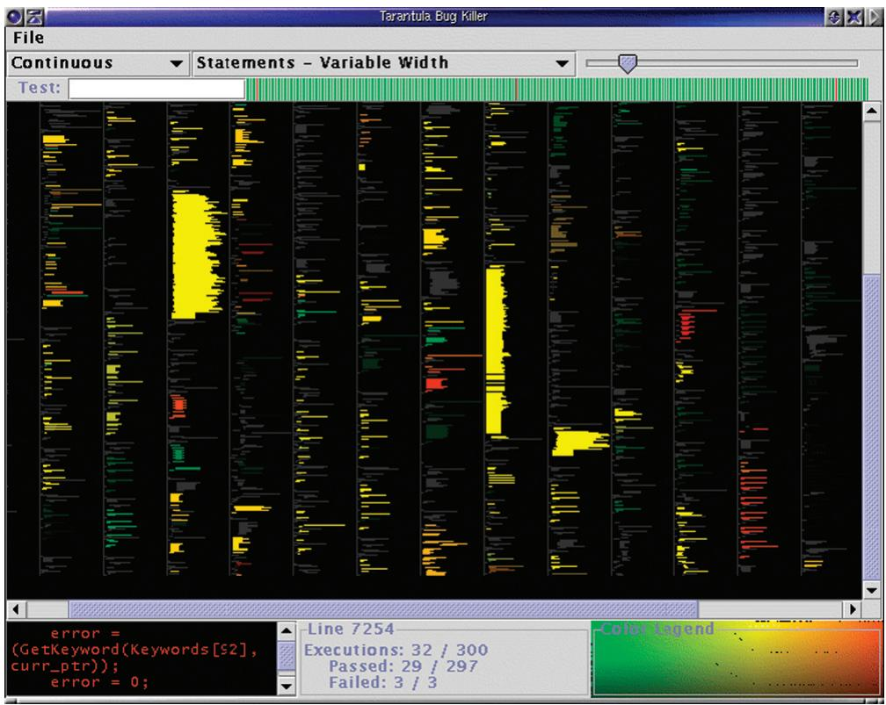  
Figure 7.20. Tarantula shows a dense overview of source code with lines color coded by execution status of a software test suite. From [Jones et al. 02, Figure 4].

The design choice of a dense overview to provide orientation and a detail view where a small amount of text is shown legibly is thus reasonable.

The original dataset also includes the tests, where each test has the categorical attribute of test or fail and is associated with a set of specific lines of the source code. Tarantula computes two derived quantitative attributes that are encoded with hue and brightness. The brightness encodes the percentage of coverage by the test cases, where dark lines represent low coverage and bright ones are high coverage. The hue encodes the relative percentage of passed versus failed tests.

This example shows a full system that uses multiple idioms, rather than just a single idiom. For completeness, the what–why–how analysis instance includes material covered in later chapters, about the design choices of how to facet into multiple windows and how to reduce the amount of data shown.

The overview and detail choice for multiple views is covered in Section 12.3.

<table><tr><td>Idiom</td><td>Dense Software Overviews</td></tr><tr><td>What: Data</td><td>Text with numbered lines (source code, test results log).</td></tr><tr><td>What: Derived</td><td>Two quantitative attributes (test execution results).</td></tr><tr><td>How: Encode</td><td>Dense layout. Spatial position and line length from text ordering. Color channels of hue and brightness.</td></tr><tr><td>Why: Task</td><td>Locate faults, summarize results and coverage.</td></tr><tr><td>Scale</td><td>Lines of text: ten thousand.</td></tr><tr><td>(How: Facet)</td><td>Same encoding, same dataset, global overview with detail showing subset of data, different resolutions, linking with color.</td></tr><tr><td>(How: Reduce)</td><td>Detail: filter to local neighborhood of selection</td></tr></table>

# 7.7.2 Space-Filling

A space-filling layout has the property that it fills all available space in the view, as the name implies. Any of the three geometric possibilties discussed above can be space-filling. Space-filling layouts typically use area marks for items or containment marks for relationships, rather than line or connection marks, or point marks. Examples of space-filling layouts using containment marks are the treemaps in Figures 9.8 and 9.9(f) and the nested circle tree in Figure 9.9(e). Examples of space-filling layouts using area marks and the spatial position channels are the concentric circle tree in Figure 9.9(d) and the icicle tree of Figure 9.9(b).

One advantage of space-filling approaches is that they maximize the amount of room available for color coding, increasing the chance that the colored region will be large enough to be perceptually salient to the viewer. A related advantage is that the available space representing an item is often large enough to show a label embedded within it, rather than needing more room off to the side.

In contrast, one disadvantage of space-filling views is that the designer cannot make use of white space in the layout; that is, empty space where there are no explicit visual elements. Many graphic design guidelines pertain to the careful use of white space for many reasons, including readability, emphasis, relative importance, and visual balance.

Space-filling layouts typically strive to achieve high information density. However, the property that a layout fills space is by no means a guarantee that is using space efficiently. More technically, the definition of space-filling is that the total area used by the layout is equal to the total area available in the view. There are many other possible metrics for analyzing the space efficiency of a layout. For instance, for trees, proposed metrics include the size of the smallest nodes and the area of labels on the nodes [McGuffin and Robert 10].

# 7.8 Further Reading

The Big Picture Many previous authors have proposed ways to categorize vis idioms. My framework was influenced by many of them, including an early taxonomy of the infovis design space [Card and Mackinlay 99] and tutorial on visual idioms [Keim 97], a book on the grammar of graphics [Wilkinson 05], a taxonomy of multidimensional multivariate vis [McGuffin 14], papers on generalized pair plots [Emerson et al. 12] and product plots [Wickham and Hofmann 11], and a recent taxonomy [Heer and Shneiderman 12]. Bertin’s very early book Semiology of Graphics has been a mother lode of inspiration for the entire field and remains thought provoking to this day [Bertin 67].

History The rich history of visual representations of data, with particular attention to statistical graphics such as time-series line chart, the bar chart, the pie chart, and the circle chart, is documented at the extensive web site http://www.datavis. ca/milestones [Friendly 08].

Statistical Graphics A book by statistician Bill Cleveland has an excellent and extensive discussion of the use of many traditional statistical charts, including bar charts, line charts, dot charts, and scatterplots [Cleveland 93b].

Stacked Charts The complex stacked charts idiom of streamgraphs was popularized with the ThemeRiver system [Havre et al. 00]; later work analyzes their geometry and asthetics in detail [Byron and Wattenberg 08].

Bar Charts versus Line Charts A paper from the cognitive psychology literature provides guidelines for when to use bar charts versus line charts [Zacks and Tversky 99].

<!-- Chunk 4 End -->

<!-- Chunk 5 Start -->

Banking to 45 Degrees Early work proposed aspect ratio control by banking to $4 5 ^ { \circ }$ [Cleveland et al. 88,Cleveland 93b]; later work extended this idea to an automatic multiscale framework [Heer and Agrawala 06].

Heatmaps and Matrix Reordering One historical review covers the rich history of heatmaps, cluster heatmaps, and matrix reordering [Wilkinson and Friendly 09]; another covers matrix reordering and seriation [Liiv 10].

Parallel Coordinates Parallel coordinates were independently proposed at the same time by a geometer [Inselberg and Dimsdale 90,Inselberg 09] and a statistician [Wegman 90].

Radial Layouts Radial layouts were characterized through empirical user studies [Diehl et al. 10] and have also been surveyed [Draper et al. 09].

Dense Layouts Dense layouts have been explored extensively for many datatypes [Keim 00]. The SeeSoft system was an early dense layout for text and source code [Eick et al. 92]; Tarantula is a later system using that design choice [Jones et al. 02].

#

# Arrange Spatial Data

# $\circled{ \div}$ Use Given

Geometr y

Geographic   
O ther D erived

Spatial Fields

S calar Fields (one value per cell)

Isocontours   
Direct Volume Rendering

Vector and Tensor Fields (many values per cell)

Flow Glyphs (local)   
Geometric (sparse seeds)   
Tex tures (dense seeds)   
Features (globally derived)

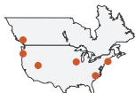

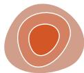  
Figure 8.1. Design choices for using given spatial data: geometry or spatial fields.

r↑↑↑ス  
  
κ↑↑→↑   
κκ↑→↑

