# Chapter 9

# Arrange Networks and Trees

# 9.1 The Big Picture

This chapter covers design choices for arranging network data in space, summarized in Figure 9.1. The node–link diagram family of visual encoding idioms uses the connection channel, where marks represent links rather than nodes. The second major family of network encoding idioms are matrix views that directly show adjacency relationships. Tree structure can be shown with the containment channel, where enclosing link marks show hierarchical relationships through nesting.

# 9.2 Connection: Link Marks

The most common visual encoding idiom for tree and network data is with node–link diagrams, where nodes are drawn as point marks and the links connecting them are drawn as line marks. This idiom uses connection marks to indicate the relationships between items. Figure 9.2 shows two examples of trees laid out as node– link diagrams. Figure 9.2(a) shows a tiny tree of 24 nodes laid out with a triangular vertical node–link layout, with the root on the top and the leaves on the bottom. In addition to the connection marks, it uses vertical spatial position channel to show the depth in the tree. The horizontal spatial position of a node does not directly encode any attributes. It is an artifact of the layout algorithm’s calculations to ensure maximum possible information density while guaranteeing that there are no edge crossings or node overlaps [Buchheim et al. 02].

Figure 9.2(b) shows a small tree of a few hundred nodes laid out with a spline radial layout. This layout uses essentially the same algorithm for density without overlap, but the visual encoding is radial rather than rectilinear: the depth of the tree is encoded as distance away from the center of the circle. Also, the links of

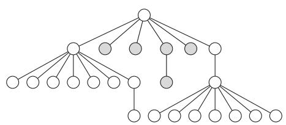  
(a)

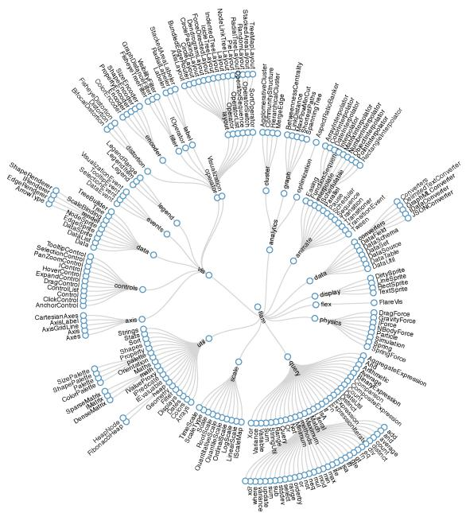  
(b)   
Figure 9.2. Node–link layouts of small trees. (a) Triangular vertical for tiny tree. From [Buchheim et al. 02, Figure 2d]. (b) Spline radial layout for small tree. From http://mbostock.github.com/d3/ex/tree.html.

the graph are drawn as smoothly curving splines rather than as straight lines.

Figure 9.3(a) shows a larger tree of 5161 nodes laid out as a rectangular horizontal node–link diagram, with the root on the left and the leaves stretching out to the right. The edges are colored with a purple to orange continuous colormap according to the Strahler centrality metric discussed in Section 3.7.2. The spatial layout is fundamentally the same as the triangular one, but from this zoomed-out position the edges within a subtree form a single perceptual block where the spacing in between them cannot be seen. Figure 9.3(b) shows the same tree laid out with the BubbleTree algorithm [Grivet et al. 06]. BubbleTree is a radial rather than rectilinear approach where subtrees are laid out in full circles rather than partial circular arcs. Spatial position does encode information about tree depth, but as relative distances to the center of the parent rather than as absolute distances in screen space.

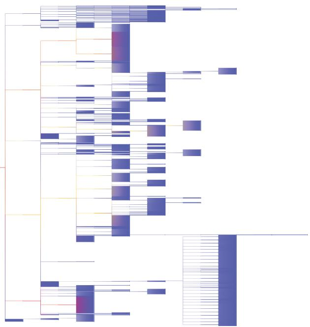  
(a)

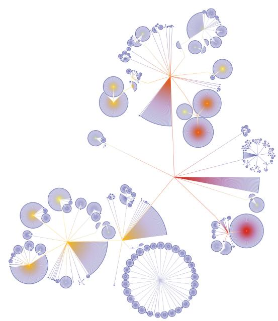  
(b)   
Figure 9.3. Two layouts of a 5161-node tree. (a) Rectangular horizontal node–link layout. (b) BubbleTree node–link layout.

Networks are also very commonly represented as node–link diagrams, using connection. Nodes that are directly connected by a single link are perceived as having the tightest grouping, while nodes with a long path of multiple hops between them are less closely grouped. The number of hops within a path—the number of individual links that must be traversed to get from one node to another—is a network-oriented way to measure distances. Whereas distance in the 2D plane is a continuous quantity, the network-oriented distance measure of hops is a discrete quantity. The connection marks support path tracing via these discrete hops.

Node–link diagrams in general are well suited for tasks that involve understanding the network topology: the direct and indirect connections between nodes in terms of the number of hops between them through the set of links. Examples of topology tasks include finding all possible paths from one node to another, finding the shortest path between two nodes, finding all the adjacent nodes one hop away from a target node, and finding nodes that

*Force-directed placement is also known as spring embedding, energy minimization, or nonlinear optimization.

act as a bridge between two components of the network that would otherwise be disconnected.

Node–link diagrams are most often laid out within a two-dimensional planar region. While it is algorithmically straightforward to design 3D layout algorithms, it is rarely an effective choice because of the many perceptual problems discussed in Section 6.3, and thus should be carefully justified.

# Example: Force-Directed Placement

One of the most widely used idioms for node–link network layout using connection marks is force-directed placement. There are many variants in the force-directed placement idiom family; in one variant, the network elements are positioned according to a simulation of physical forces where nodes push away from each other while links act like springs that draw their endpoint nodes closer to each other.* Many force-directed placement algorithms start by placing nodes randomly within a spatial region and then iteratively refine their location according to the pushing and pulling of these simulated forces to gradually improve the layout. One strength of this approach is that a simple version is very easy to implement. Another strength is that it is relatively easy to understand and explain at a conceptual level, using the analogy of physical springs.

Force-directed network layout idioms typically do not directly use spatial position to encode attribute values. The algorithms are designed to minimize the number of distracting artifacts such as edge crossings and node overlaps, so the spatial location of the elements is a side effect of the computation rather than directly encoding attributes. Figure 9.4(a) shows a node–link layout of a graph, using the idiom of force-directed placement. Size and color coding for nodes and edges is also common. Figure 9.4(a) shows size coding of edge attributes with different line widths, and Figure 9.4(b) shows size coding for node attributes through different point sizes.

Analyzing the visual encoding created by force-directed placement is somewhat subtle. Spatial position does not directly encode any attributes of either nodes or links; the placement algorithm uses it indirectly. A tightly interconnected group of nodes with many links between them will often tend to form a visual clump, so spatial proximity does indicate grouping through a strong perceptual cue. However, some visual clumps may simply be artifacts: nodes that have been pushed near each other because they were repelled from elsewhere, not because they are closely connected in the network. Thus, proximity is sometimes meaningful but sometimes arbitrary; this ambiguity can mislead the user. This situation is a specific instance of the general problem that occurs in all idioms where spatial position is implicitly chosen rather than deliberately used to encode information.

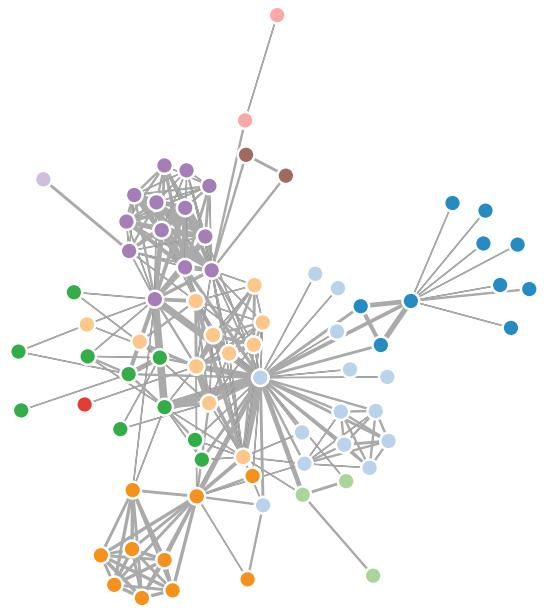  
(a)

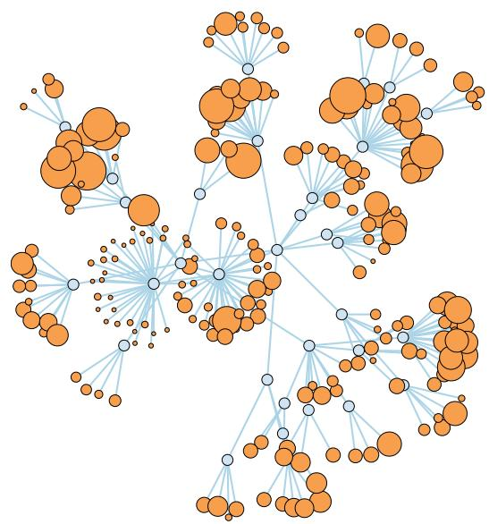  
(b)   
Figure 9.4. Node–link layouts of small networks. (a) Force-directed placement of small network of 75 nodes, with size coding for link attributes. (b) Larger network, with size coding for node attributes. From http://bl.ocks.org/ mbostock/4062045 and http://bl.ocks.org/1062288.

One weakness of force-directed placement is that the layouts are often nondeterministic, meaning that they will look different each time the algorithm is run, rather than deterministic approaches such as a scatterplot or a bar chart that yield an identical layout each time for a specific dataset. Most idioms that use randomness share this weakness.1 The problem with nondeterministic visual encodings is that spatial memory cannot be exploited across different runs of the algorithm. Region-based identifications such as “the stuff in the upper left corner” are not useful because the items placed in that region might change between runs. Moreover, the randomness can lead to different proximity relationships each time, where the distances between the nodes reflect the randomly chosen initial positions rather than the intrinsic structure of the network in terms of how the links connect the nodes. Randomness is particularly tricky with dynamic layout, where the network is a dynamic stream with nodes and links that are added, removed, or changed rather than a static file that is fully available when the layout begins. The visual encoding goal of disrupting the spatial stability of the layout as little as possible, just enough

to adequately reflect the changing structure, requires sophisticated algorithmic strategies.

A major weakness of force-directed placement is scalability, both in terms of the visual complexity of the layout and the time required to compute it. Force-directed approaches yield readable layouts quickly for tiny graphs with dozens of nodes, as shown in Figure 9.4. However, the layout quickly degenerates into a hairball of visual clutter with even a few hundred nodes, where the tasks of path following or understanding overall structural relationships become very difficult, essentially impossible, with thousands of nodes or more. Straightforward force-directed placement is unlikely to yield good results when the number of nodes is more than roughly four times the number of links. Moreover, many force-directed placement algorithms are notoriously brittle: they have many parameters that can be tweaked to improve the layout for a particular dataset, but different settings are required to do well for another. As with many kinds of computational optimization, many force-directed placement algorithms search in a way that can get stuck in local minimum energy configuration that is not the globally best answer.

In the simplest force-directed algorithms, the nodes never settle down to a final location; they continue to bounce around if the user does not explicitly intervene to halt the layout process. While seeing the forcedirected algorithm iteratively refine the layout can be interesting while the layout is actively improving, continual bouncing can be distracting and should be avoided if a force-directed layout is being used in a multiple-view context where the user may want to attend to other views without having motion-sensitive peripheral vision invoked. More sophisticated algorithms automatically stop by determining that the layout has reached a good balance between the forces.

<table><tr><td>Idiom</td><td>Force-Directed Placement</td></tr><tr><td>What: Data</td><td>Network.</td></tr><tr><td>How: Encode</td><td>Point marks for nodes, connection marks for links.</td></tr><tr><td>Why: Tasks</td><td>Explore topology, locate paths.</td></tr><tr><td>Scale</td><td>Nodes: dozens/hundreds. Links: hundreds. Node/link density: L &lt; 4N</td></tr></table>

Compound networks are discussed further in Section 9.5.   
Cluster hierarchies are discussed in more detail in Section 13.4.1.

Many recent approaches to scalable network drawing are multilevel network idioms, where the original network is augmented with a derived cluster hierarchy to form a compound network. The cluster hierarchy is computed by coarsening the original network into successively simpler networks that nevertheless attempt to capture the most essential aspects of the original’s structure. By laying out the simplest version of the networks first, and then improving the

layout with the more and more complex versions, both the speed and quality of the layout can be improved. These approaches do better at avoiding the local minimum problem.

# Example: sfdp

Figure 9.5(a) shows a network of 7220 nodes and 13,800 edges using the multilevel scalable force-directed placement (sfdp) algorithm $[ \mathrm { H u } ~ 0 5 ]$ , where the edges are colored by length. Significant cluster structure is indeed visible in the layout, where the dense clusters with short orange and yellow edges can be distinguished from the long blue and green edges between them. However, even these sophisticated idioms hit their limits with sufficiently large networks and fall prey to the hairball problem. Figure 9.5(b) shows a network of 26,028 nodes and 100,290 edges, where the sfdp layout does not show much visible structure. The enormous number of overlapping lines leads to overwhelming visual clutter caused by occlusion.

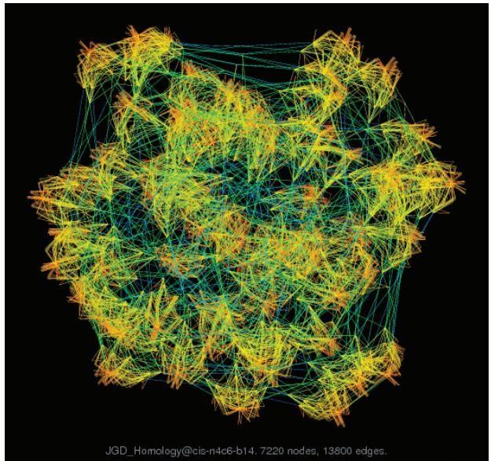  
(a)

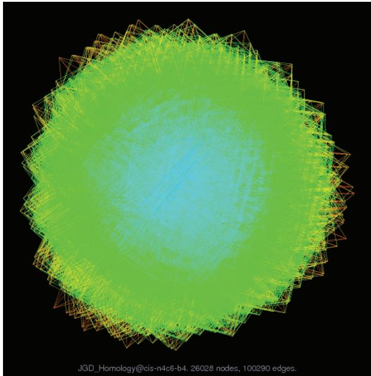  
  
Figure 9.5. Multilevel graph drawing with sfdp [Hu 05]. (a) Cluster structure is visible for a large network of 7220 nodes and 13,800 edges. (b) A huge graph of 26,028 nodes and 100,290 edges is a “hairball” without much visible structure. From [Hu 14].

<table><tr><td>Idiom</td><td>Multilevel Force-Directed Placement (sfdp)</td></tr><tr><td>What: Data</td><td>Network.</td></tr><tr><td>What: Derived</td><td>Cluster hierarchy atop original network.</td></tr><tr><td>What: Encode</td><td>Point marks for nodes, connection marks for links.</td></tr><tr><td>Why: Tasks</td><td>Explore topology, locate paths and clusters.</td></tr><tr><td>Scale</td><td>Nodes: 1000–10,000. Links: 1000–10,000. Node/link density: L &lt; 4N.</td></tr></table>

# 9.3 Matrix Views

Network data can also be encoded with a matrix view by deriving a table from the original network data.

# Example: Adjacency Matrix View

A network can be visually encoded as an adjacency matrix view, where all of the nodes in the network are laid out along the vertical and horizontal edges of a square region and links between two nodes are indicated by coloring an area mark in the cell in the matrix that is the intersection between their row and column. That is, the network is transformed into the derived dataset of a table with two key attributes that are separate full lists of every node in the network, and one value attribute for each cell records whether a link exists between the nodes that index the cell. Figure 9.6(a) shows corresponding node–link and adjacency matrix views of a small network. Figures 9.6(b) and 9.6(c) show the same comparison for a larger network.

Additional information about another attribute is often encoded by coloring matrix cells, a possibility left open by this spatially based design choice. The possibility of size coding matrix cells is limited by the number of available pixels per cell; typically only a few levels would be distinguishable between the largest and the smallest cell size. Network matrix views can also show weighted networks, where each link has an associated quantitative value attribute, by encoding with an ordered channel such as luminance or size.

For undirected networks where links are symmetric, only half of the matrix needs to be shown, above or below the diagonal, because a link from node A to node B necessarily implies a link from B to A. For directed networks, the full square matrix has meaning, because links can be asymmetric.

Adjacency matrix views use 2D alignment, just like the tabular matrix views covered in Section7.5.2.

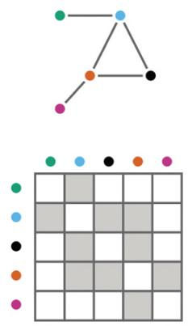  
(a)

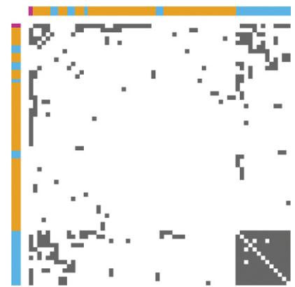  
(b)

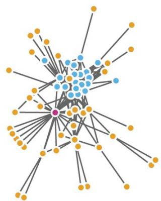  
(c)   
Figure 9.6. Comparing node–link matrix and matrix views of a network. (a) Node–link and matrix views of small network. (b) Matrix view of larger network. (c) Node–link view of larger network. From [Gehlenborg and Wong 12, Figures 1 and 2].

Matrix views of networks can achieve very high information density, up to a limit of one thousand nodes and one million edges, just like cluster heatmaps and all other matrix views that use small area marks.

<table><tr><td>Idiom</td><td>Adjacency Matrix View</td></tr><tr><td>What: Data</td><td>Network.</td></tr><tr><td>What: Derived</td><td>Table: network nodes as keys, link status between two nodes as values.</td></tr><tr><td>How: Encode</td><td>Area marks in 2D matrix alignment.</td></tr><tr><td>Scale</td><td>Nodes: 1000. Links: one million.</td></tr></table>

# 9.4 Costs and Benefits: Connection versus Matrix

The idiom of visually encoding networks as node–link diagrams, with connection marks representing the links between nodes, is by far the most popular way to visualize networks and trees. In addition to all of the examples in Section 9.2, many of the other examples in other parts of this book use this idiom. Node–link network examples inclue the genealogical graphs of Figure 4.6, the telecommunications network using linewidth to encode bandwidth

of Figure 5.9, the gene interaction network shown with Cerebral in Figure 12.5, and the graph interaction examples of Figure 14.10. Node–link tree views include the DOITree of Figure 14.2, the Cone Trees of Figure 14.4, a file system shown with H3 in Figure 14.6, and the phylogenetic trees shown with TreeJuxtaposer in Figure 14.7.

The great strength of node–link layouts is that for sufficiently small networks they are extremely intuitive for supporting many of the abstract tasks that pertain to network data. They particularly shine for tasks that rely on understanding the topological structure of the network, such as path tracing and searching local topological neighborhoods a small number of hops from a target node, and can also be very effective for tasks such as general overview or finding similar substructures. The effectiveness of the general idiom varies considerably depending on the specific visual encoding idiom used; there has been a great deal of algorithmic work in this area.

Their weakness is that past a certain limit of network size and link density, they become impossible to read because of occlusion from edges crossing each other and crossing underneath nodes. The link density of a network is the number of links compared with the number of nodes. Trees have a link density of one, with one edge for each node. The upper limit for node–link diagram effectiveness is a link density of around three or four [Melanc¸on 06].

Even for networks with a link density below four, as the network size increases the resulting visual clutter from edges and nodes occluding each other eventually causes the layout to degenerates into an unreadable hairball. A great deal of algorithmic work in graph drawing has been devoted to increasing the size of networks that can be laid out effectively, and multilevel idioms have led to significant advances in layout capabilities. The legibility limit depends on the algorithm, with simpler algorithms supporting hundreds of nodes while more state-of-the-art ones handle thousands well but degrade in performance for tens of thousands. Limits do and will remain; interactive navigation and exploration idioms can address the problem partially but not fully. Filtering, aggregation, and navigation are design choices that can ameliorate the clutter problem, but they do impose cognitive load on the user who must then remember the structure of the parts that are not visible.

The other major approach to network drawing is a matrix view. A major strength of matrix views is perceptual scalability for both large and dense networks. Matrix views completely eliminate the occlusion of node–link views, as described above, and thus are

effective even at very high information densities. Whereas node– link views break down once the density of edges is more than about three or four times the number of nodes, matrix views can handle dense graphs up to the mathematical limit where the edge count is the number of nodes squared. As discussed in the scalability analyses of Sections 7.5.2 and 13.4.1, a single-level matrix view can handle up to one million edges and an aggregated multilevel matrix view might handle up to ten billion edges.

Another strength of matrix views is their predictability, stability, and support for reordering. Matrix views can be laid out within a predictable amount of screen space, whereas node–link views may require a variable amount of space depending on dataset characteristics, so the amount of screen real estate needed for a legible layout is not known in advance. Moreover, matrix views are stable; adding a new item will only cause a small visual change. In contrast, adding a new item in a force-directed view might cause a major change. This stability allows multilevel matrix views to easily support geometric or semantic zooming. Matrix views can also be used in conjunction with the interaction design choice of reordering, where the linear ordering of the elements along the axes is changed on demand.

Matrix views also shine for quickly estimating the number of nodes in a graph and directly supporting search through fast node lookup. Finding an item label in an ordered list is easy, whereas finding a node given its label in node–link layout is time consuming because it could be placed anywhere through the two-dimensional area. Node–link layouts can of course be augmented with interactive support for search by highlighting the matching nodes as the labels are typed.

One major weakness of matrix views is unfamiliarity: most users are able to easily interpret node–link views of small networks without the need for training, but they typically need training to interpret matrix views. However, with sufficient training, many aspects of matrix views can become salient. These include the tasks of finding specific types of nodes or node groups that are supported by both matrix views and node–link views, through different but roughly equally salient visual patterns in each view. Figure 9.7 shows three such patterns [McGuffin 12]. The completely interconnected lines showing a clique in the node–link graph is instead a square block of filled-in cells along the diagonal in the matrix view. After training, it’s perhaps even easier to tell the differences between a proper clique and a cluster of highly but not completely interconnected nodes in the matrix view. Similarly, the biclique

Reordering is discussed further in Section 7.5.

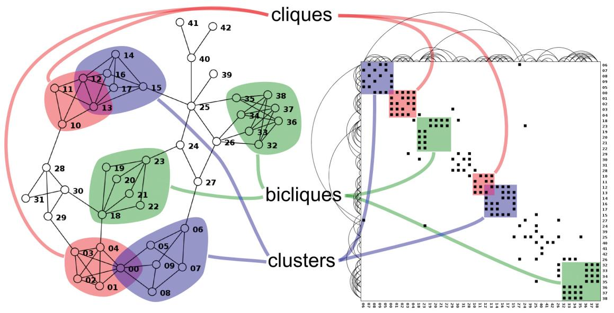  
Figure 9.7. Characteristic patterns in matrix views and node–link views: both can show cliques and clusters clearly. From [McGuffin 12, Figure 6].

structure of node subsets where edges connect each node in one subset with one in another is salient, but different, in both views. The degree of a node, namely, the number of edges that connect to it, can be found by counting the number of filled-in cells in a row or column.

The most crucial weakness of matrix views is their lack of support for investigating topological structure because they show links in a more indirect way than the direct connections of node–link diagrams. This weakness is a direct trade-off for their strength in avoiding clutter. One reason that node–link views are so popular, despite the many other strengths of matrix views listed above, might be that most complex domain tasks involving network exploration end up requiring topological structure inspection as a subtask. Hybrid multiple-view systems that use both node–link and matrix representations are a nice way to combine their complementary strengths, such as the MatrixExplorer system shown in Figure 4.8.

An empirical investigation [Ghoniem et al. 05] compared node– link and matrix views for many low-level abstract network tasks. It found that for most tasks studied, node–link views are best for small networks and matrix views are best for large networks. In specific, several tasks became more difficult for node–link views as size increased, whereas the difficulty was independent of size for

matrix views: approximate estimation of the number of nodes and of edges, finding the most connected node, finding a node given its label, finding a direct link between two nodes, and finding a common neighbor between two nodes. However, the task of finding a multiple-link path between two nodes was always more difficult in matrix views, even with large network sizes. This study thus meshes with the analysis above, that topological structure tasks such as path tracing are best supported by node–link views.

# 9.5 Containment: Hierarchy Marks

Containment marks are very effective at showing complete information about hierarchical structure, in contrast to connection marks that only show pairwise relationships between two items at once.

# Example: Treemaps

The idiom of treemaps is an alternative to node–link tree drawings, where the hierarchical relationships are shown with containment rather than connection. All of the children of a tree node are enclosed within the area allocated that node, creating a nested layout. The size of the nodes is mapped to some attribute of the node. Figure 9.8 is a treemap view of the

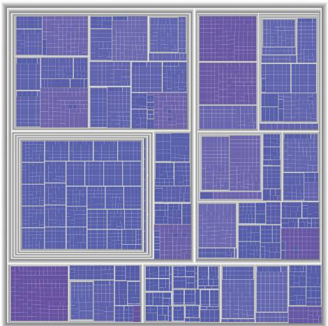  
Figure 9.8. Treemap layout showing hierarchical structure with containment rather than connection, in contrast to the node–link diagrams of the same 5161-node tree in Figure 9.3.

same dataset as Figure 9.3, a 5161-node computer file system. Here, node size encodes file size. Containment marks are not as effective as the pairwise connection marks for tasks focused on topological structure, such as tracing paths through the tree, but they shine for tasks that pertain to understanding attribute values at the leaves of the tree. They are often used when hierarchies are shallow rather than deep. Treemaps are very effective for spotting the outliers of very large attribute values, in this case large files.

<table><tr><td>Idiom</td><td>Treemaps</td></tr><tr><td>What: Data</td><td>Tree.</td></tr><tr><td>How: Encode</td><td>Area marks and containment, with rectilinear layout.</td></tr><tr><td>Why: Tasks</td><td>Query attributes at leaf nodes.</td></tr><tr><td>Scale</td><td>Leaf nodes: one million. Links: one million.</td></tr></table>

Figure 9.9 shows seven different visual encoding idioms for tree data. Two of the visual encoding idioms in Figure 9.9 use containment: the treemap in Figure 9.9(f) consisting of nested rectangles, and the nested circles of Figure 9.9(e). Two use connection: the vertical node–link layout in Figure 9.9(a) and the radial node–link layout in Figure 9.9(c).

Although connection and containment marks that depict the link structure of the network explicitly are very common ways to encode networks, they are not the only way. In most of the trees in Figure 9.9, the spatial position channel is explicitly used to show

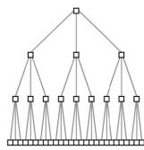  
(a)

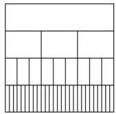  
(b)

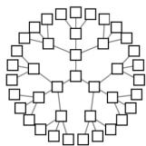  
(c)

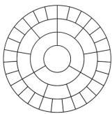  
(d)

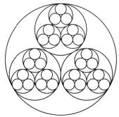

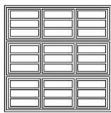

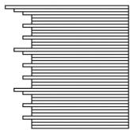  
(g)   
Figure 9.9. Seven visual encoding idioms showing the same tree dataset, using different combinations of visual channels. (a) Rectilinear vertical node–link, using connection to show link relationships, with vertical spatial position showing tree depth and horizontal spatial position showing sibling order. (b) Icicle, with vertical spatial position and size showing tree depth, and horizontal spatial position showing link relationships and sibling order. (c) Radial node– link, using connection to show link relationships, with radial depth spatial position showing tree depth and radial angular position showing sibling order. (d) Concentric circles, with radial depth spatial position and size showing tree depth and radial angular spatial position showing link relationships and sibling order. (e) Nested circles, using radial containment, with nesting level and size showing tree depth. (f) Treemap, using rectilinear containment, with nesting level and size showing tree depth. (g) Indented outline, with horizontal spatial position showing tree depth and link relationships and vertical spatial position showing sibling order. From [McGuffin and Robert 10, Figure 1].

the tree depth of a node. However, three layouts show parent–child relationships without any connection marks at all. The rectilinear icicle tree of Figure 9.9(b) and the radial concentric circle tree of Figure 9.9(d) show tree depth with one spatial dimension and parent–child relationships with the other. Similarly, the indented outline tree of Figure 9.9(g) shows parent–child relationships with relative vertical position, in addition to tree depth with horizontal position.

# Example: GrouseFlocks

The containment design choice is usually only used if there is a hierarchical structure; that is, a tree. The obvious case is when the network is simply a tree, as above. The other case is with a compound network, which is the combination of a network and tree; that is, in addition to a base network with links that are pairwise relations between the network nodes, there is also a cluster hierarchy that groups the nodes hierarchically.* In other words, a compound network is a combination of a network and a tree on top of it, where the nodes in the network are the leaves of the tree. Thus, the interior nodes of the tree encompass multiple network nodes.

Containment is often used for exploring such compound networks. In the sfdp example above, there was a specific approach to coarsening the network that created a single derived hierarchy. That hierarchy was used only to accelerate force-directed layout and was not shown directly to the user. In the GrouseFlocks system, users can investigate multiple possible hierarchies and they are shown explicitly. Figure 9.10(a) shows a network and Figure 9.10(b) shows a cluster hierarchy built on top of it.

* The term multilevel network is sometimes used as a synonym for compound network.   
Cluster hierarchies are discussed further in Section 7.5.2.

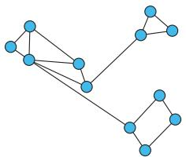  
(a)

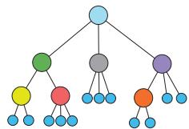  
(b)

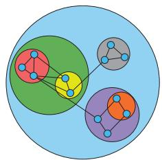  
  
Figure 9.10. GrouseFlocks uses containment to show graph hierarchy structure. (a) Original graph. (b) Cluster hierarchy built atop the graph, shown with a node– link layout. (c) Network encoded using connection, with hierarchy encoded using containment. From [Archambault et al. 08, Figure 3].

Figure 9.10(c) shows a combined view using of containment marks for the associated hierarchy and connection marks for the original network links.   

<table><tr><td>System</td><td>GrouseFlocks</td></tr><tr><td>What: Data</td><td>Network.</td></tr><tr><td>What: Derived</td><td>Cluster hierarchy atop original network.</td></tr><tr><td>What: Encode</td><td>Connection marks for original network, containment marks for cluster hierarchy.</td></tr></table>

# 9.6 Further Reading

Network Layout An early survey of network vis [Herman et al. 00] was followed by one covering more recent developments [von Landesberger et al. 11]. A good starting point for network layout algorithms is a tutorial that covers node–link, matrix, and hybrid approaches, including techniques for ordering the nodes [McGuffin 12]. An analysis of edge densities in node– link graph layouts identifies the limit of readability as edge counts beyond roughly four times the node count [Melanc¸on 06].

Force-Directed Placement Force-directed placement has been heavily studied; a good algorithmically oriented overview appears in a book chapter [Brandes 01]. The Graph Embedder (GEM) algorithm is a good example of a sophisticated placement algorithm with built-in termination condition [Frick et al. 95].

Multilevel Network Layout Many multilevel layouts have been proposed, including sfdp $[ \mathrm { H u } ~ 0 5 ]$ , $\mathrm { F M ^ { 3 } }$ [Hachul and Junger ¨ 04], and TopoLayout [Archambault et al. 07b].

Matrix versus Node–Link Views The design space of matrix layouts, node–link layouts, and hybrid combinations were considered for the domain of social network analysis [Henry and Fekete 06, Henry et al. 07]. The results of an empirical study were used to characterize the uses of matrix versus node–link views for a broad set of abstract tasks [Ghoniem et al. 05].

Design Space of Tree Drawings A hand-curated visual bibliography of hundreds of different approaches to tree drawing is available at http://treevis.net [Schulz 11]. Design guidelines for a wide

variety of 2D graphical representations of trees are the result of analyzing their space efficiency [McGuffin and Robert 10]. Another analysis covers the design space of approaches to tree drawing beyond node–link layouts [Schulz et al. 11].

Treemaps Treemaps were first proposed at the University of Maryland [Johnson and Shneiderman 91]. An empirical study led to perceptual guidelines for creating treemaps by identifying the data densities at which length-encoded bar charts become less effective than area-encoded treemaps [Kong et al. 10].

# Encode Map

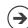

# Color

Color Encoding

Saturation

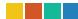

Color Map

Categorical

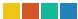

Ordered

S equential

Diverging

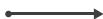

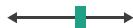

Bivariate

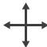

$\textcircled{7}$ Size, Angle, Cur vature, ...

Length

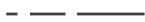

Angle

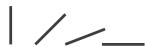

Area

Cur vature

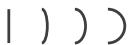

Volume

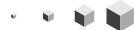

Shape

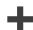

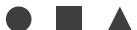

Motion

Motion

Direction, Rate, Frequenc y, ...

  
Figure 10.1. Design choices for mapping color and other visual encoding channels.

