# Chapter 11

# Manipulate View

# 11.1 The Big Picture

Figure 11.1 shows the design choices for how to manipulate a view: to change anything about it, to select items or attributes within it, and to navigate to a different viewpoint.

The ways to change a view cover the full set of all other design choices for idioms. A change could be made from one choice to another to change idioms, and any of the parameters for a particular idiom can be changed. Any aspect of visual encoding can be changed, including the ordering, any other choice pertaining to the spatial arrangement, and the use of other visual channels such as color. Changes could be made concerning what elements are filtered, the level of detail of aggregation, and how the data is partitioned into multiple views.

A change often requires a set of items or attributes within the vis as input. There are several choices about how a user can select elements: what kind of elements can be targets, how many selection types are supported, how many elements can be in the selected set, and how to highlight the elements.

Navigation is a change of viewpoint; that is, changing what is shown in a view based on the metaphor of a camera looking at the scene from a moveable point of view. It’s a rich enough source of design choices that it’s addressed separately in the framework as a special case. Zooming in to see fewer items in more detail can be done geometrically, matching the semantics of realworld motion. With semantic zooming, the way to draw items adapts on the fly based on the number of available pixels, so appearance can change dramatically rather than simply shrinking or enlarging. The camera metaphor also motivates the idea that attributes are assigned to spatial dimensions, leading to the slice idiom of extracting a single slice from the view volume and the cut idiom of separating the volume into two parts with a plane and

eliminating everything on one side of it. The project idiom reduces the number of dimensions using one of many possible transformations.

# 11.2 Why Change?

One is deriving new data as discussed in Chapter 3. The other three options are covered in subsequent chapters: faceting the data by partitioning it into multiple juxtaposed views or superimposed layers in Chapter 12, reducing the amount of data to show within a view in Chapter 13, and embedding focus and context information together within a single view in Chapter 14.

Datasets are often sufficiently large and complex that showing everything at once in a single static view would lead to overwhelming visual clutter. There are five major options for handling complexity; a view that changes over time is one of them. These five choices are not mutually exclusive and can be combined together.

Changing the view over time is the most obvious, most popular, and most flexible choice in vis design. The most fundamental breakthrough of vis on a computer display compared with printed on paper is the possibility of interactivity: a view that changes over time can dynamically respond to user input, rather than being limited to a static visual encoding. Obviously, all interactive idioms involve a view that changes over time.

# 11.3 Change View over Time

The possibilities for how the view changes can be based on any of the other design choices of how to construct an idiom: change the encoding, change the arrangement, change the order, change the viewpoint, change which attributes are filtered, change the aggregation level, and so on.

For example, the visual encoding could be changed to a completely different idiom. Some vis tools allow the user to manually change between several different idioms, such as switching from a node–link layout to a matrix layout of a network. Giving the user control of the encoding is particularly common in general-purpose systems designed to flexibly accommodate a large range of possible datasets, rather than special-purpose systems fine tuned for a very particular task. Figure 11.2 shows a sequence of different visual encodings of the same product sales dataset created with the Tableau system, which supports fluidly moving between encodings via drag and drop interactions to specify which attributes to encode with which channels. Figure 11.2(a) shows the data encoded with simple bars, changed to stacked bars in Figure 11.2(b). Figure 11.2(c) shows a recommendation of alternate encodings that are good choices taking into account the types and semantics of

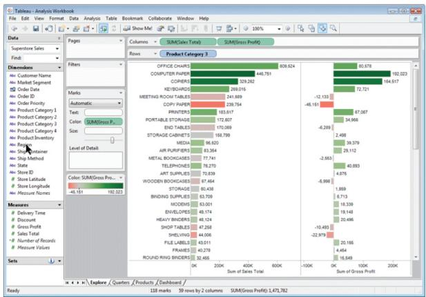  
(a)

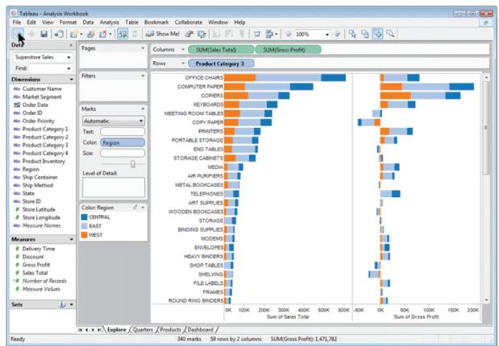  
(b)

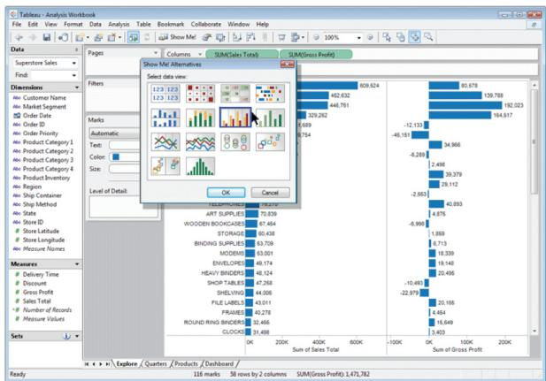

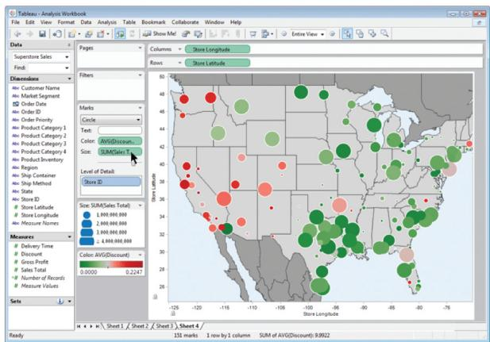  
  
Figure 11.2. Tableau supports fluid changes between visual encoding idioms with drag and drop interaction. (a) Data encoded with bars. (b) Data encoded with stacked bars. (c) The user selects a completely different visual encoding. (d) Data encoded using geographic positions.

the attributes. Figure 11.2(d) shows the use of given spatial geometry as a substrate, with circular area marks size coded for the sum of sales and color coded with a diverging red–green colormap showing the average discount.

Another kind of view change is to alter some parameter of the existing encoding, such as the range of possible mark sizes.

Many kinds of change involve rearrangement of some or all of the items in the view. Reordering, often called sorting, is a power-

Visual channels are discussed in detail in Chapter 5.   
‣ Ordering regions containing categorical data is covered in Section 7.5.

ful choice for finding patterns in a dataset by interactively changing the attribute that is used to order the data. For example, a common interaction with tables is to sort the rows according to the values in a chosen column. The same principle holds for more exotic visual encodings as well. The power of reordering lies in the privileged status of spatial position as the highest ranked visual channel. Reordering data spatially allows us to invoke the patternfinding parts of our visual system to quickly check whether the new configuration conveys new information. It can be used with any categorical attribute. In contrast, reordering does not make sense for ordered attributes, which have a given order already.

# Example: LineUp

The LineUp system is designed to support exploration of tables with many attributes through interactive reordering and realigning. In addition to sorting by any individual attribute, the user can sort by complex weighted combinations of multiple attributes. LineUp is explicitly designed to support the comparison of multiple rankings.

Figure 11.3 compares several different rankings of top universities. On the left is a customized combination of attributes and weights for the 2012 data, and in the middle is the official ranking for 2012, with colored

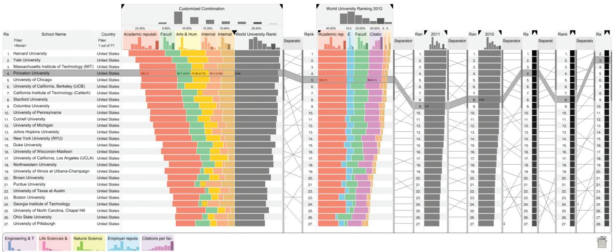  
Figure 11.3. The LineUp system for comparing multiattribute rankings with reordering and realignment. From [Gratzl et al. 13, Figure 1].

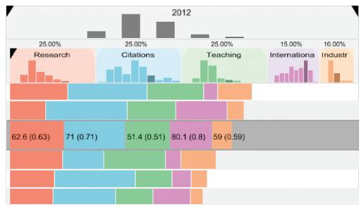  
(a)

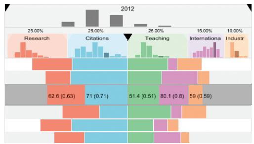  
(b)

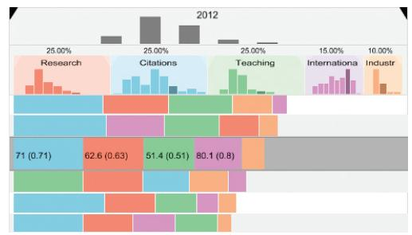  
(c)

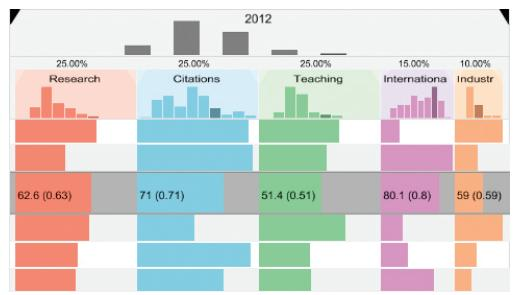  
  
Figure 11.4. Changing the alignment in Lineup. (a) Classical stacked bars. (b) Diverging stacked bars. (c) Ordered stacked bars. (d) Separately aligned bars: small multiple bar charts. From [Gratzl et al. 13, Figure 4].

stacked bar charts showing the contribution of the component attributes for both. The next two columns show a compressed view with a single summary bar for two more rankings, using the data for years 2011 and 2010, and the last three columns have a collapsed heatmap view with the value encoded in grayscale rather than with bar length. The uncollapsed columns are scented widgets, with histograms showing the distributions within them at the top. Between the bar chart columns are slope graphs, where connecting line marks link the same items together.* Items that do not change their ranking between neighboring columns are connected by straight lines, while highly sloped lines that cross many others show items whose ranking changed significantly.

Figure 11.4 shows the results of changing the alignment to each of the four different possibilities. In addition to classical stacked bars as in Figure 11.4(a), any of the attributes can be set as the baseline from which the alignment diverges, as in Figure 11.4(b). Figure 11.4(c) shows the bars sorted by decreasing size separately in each row, for the purpose of emphasizing which attributes contribute most to that item’s score. Figure 11.4(d) shows each attribute aligned to its own baseline, which yields a small-multiple view with one horizontal bar chart in each column. When

‣ Scented widgets are covered in Section 13.3.1.   
* Slope graphs are also known as bump charts.   
Partitioning data into small-multiple views is covered in Section 12.4.

‣ Animated transitions are discussed in the next example.

the alignment is changed, an animated transition between the two states occurs.

In contrast to many of the previous examples of using derived data, where the vis designer is the one who makes choices about deriving data, with LineUp the user decides what data to derive on the fly during an analysis session.

<table><tr><td>System</td><td>LineUp</td></tr><tr><td>What: Data</td><td>Table.</td></tr><tr><td>What: Derived</td><td>Ordered attribute: weighted combination of selected attributes.</td></tr><tr><td>How: Encode</td><td>Stacked bar charts, slope graphs.</td></tr><tr><td>How: Manipulate</td><td>Reorder, realign, animated transitions.</td></tr><tr><td>Why: Task</td><td>Compare rankings, distributions.</td></tr></table>

Design choices for reducing and increasing the data shown are discussed in Chapter 13.   
The Eyes Beat Memory rule of thumb in Section 6.5 discusses some of the strengths and weaknesses of animation.   
* The term jump cut comes from cinematography.   
Navigation is covered in Section 11.5.

Many kinds of change involve reducing or increasing the amount of data that is shown: changes to aggregation and filtering are at the heart of interactive data reduction idioms.

Many kinds of changes to a view over time fall into the general category of animation, including changes to the spatial layout. While animation has intuitive appeal to many beginning designers, it is valuable to think carefully about cognitive load and other trade-offs.

# Example: Animated Transitions

One of the best-justified uses of animation is the idiom of animated transition, where a series of frames is generated to smoothly transition from one state to another. Animated transitions are thus an alternative to a jump cut, where the display simply changes abruptly from one state to the next.* This idiom is often used for navigation, in which case the two states are different camera viewpoints. More generally, they can be constructed to bridge between the start and end state of any kind of change, including reordering items, filtering by adding or removing items from the view, changing the visual encoding, or updating item values as they change over time.

The benefit of animated transitions is that they help users maintain a sense of context between the two states by explicitly showing how an item in the first state moves to its new position in the second state, rather than forcing users to do item tracking on their own using internal cognitive and memory resources. These transitions are most useful when the amount of change is limited, because people cannot track everything that occurs

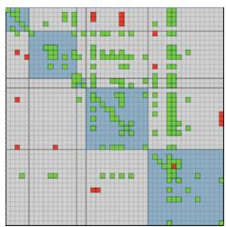

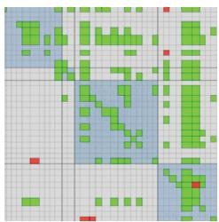

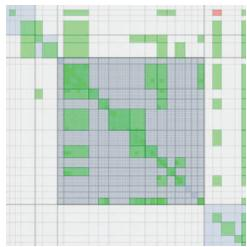

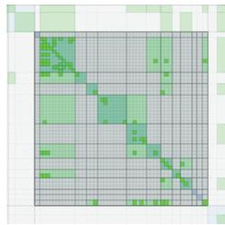

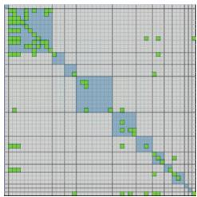  
Figure 11.5. Frames from an animated transition showing zoom between levels in a compound network arranged as an adjacency matrix. From [van Ham 03, Figure 4].

if many items change in different ways all over the frame. They work well when either a small number of objects change while the rest stay the same, or when groups of objects move together in similar ways. Transitions can also be broken down into a small number of stages. An empirical study showed that carefully designed animated transitions do indeed support better graphical perception of change [Heer and Robertson 07].

Figure 11.5 shows an example of five frames from an animated transition of a network shown as an adjacency matrix. The data type shown is a compound network, where there is a cluster hierarchy associated with the base network. The transition shows a change from one level of hierarchical aggregation to the next, providing more detail. Accordingly, the scope of what is shown narrows down to show only a subset of what is visible in the first frame. The middle block gradually stretches out to fill all of the available space, and additional structure appears within it; the other blocks gradually squish down to nothing, with their structure gradually becoming more aggregated as the amount of available screen space decreases.

Visually encoding a network as an adjacency matrix is covered in Section 9.3.   
Compound networks are discussed in Section 9.5.   
Hierarchical aggregation is covered in Section 13.4.1.

<table><tr><td>Idiom</td><td>Animated Transitions</td></tr><tr><td>What: Data</td><td>Compound network.</td></tr><tr><td>How: Manipulate</td><td>Change with animated transition. Navigate between aggregation levels.</td></tr></table>

# 11.4 Select Elements

Allowing users to select one or more elements of interest in a vis is a fundamental action that supports nearly every interactive idiom. The output of a selection operation is often the input to a subsequent operation. In particular, the change choice is usually dependent on a previous select result.

Multiple views are covered further in Chapter 12.

# 11.4.1 Selection Design Choices

A fundamental design choice with selection is what kinds of elements can be selection targets. The most common element is data items, and another element is links in the case of network data. In some vis tools, data attributes are also selectable. It’s also common to be able to select by levels within an attribute; that is, all items that share a unique value for that attribute. When the data is faceted across multiple views, then a view itself can also be a selection target.

The number of independent selection types is also a design choice. In the simplest case, there is only one kind of selection: elements are either selected or not selected. It’s also common to support two kinds of selection, for example in some cases a mouse click produces one kind of selection and a mouse hover, where the cursor simply passes over the object, produces another. It’s also common to have multiple kinds of clicks. The low-level details of interface hardware often come into play with this design choice. With a mouse, clicks and hovers are easy to get, and if the mouse has several buttons there are several kinds of clicks. If there is also a keyboard, then key presses can be added to the mix, either in addition to or instead of a multi-button mouse. Some kinds of touch screens provide hover information, but others don’t. It’s much more rare for hardware to support multiple levels of proximity, such as nearby as an intermediate state between hover and distant.

Another design choice is how many elements can be in the selection set. Should there be exactly one? Can there be many? Is a set of zero elements acceptable? Is there a primary versus secondary selection? If many elements can be selected, do you support only the selection of a spatially contiguous group of items, or allow the user to add and remove items from the selection set in multiple passes?

For some tasks there should only be one item selected at a time, which means that choosing a new item replaces the old one. While occasionally task semantics require that there must always be a selected item, often it makes sense that the selection set could be empty. In this case, selection is often implemented as a toggle, where a single action such as clicking switches between select and deselect. For example, a vis tool might be designed so that there is a specific view of fixed size where detailed information about a single selected item is shown. That choice implies the detail selection set should have a maximum of one item at a time, and

a set size of zero can be easily accommodated by leaving the pane blank.

In other tasks, it is meaningful to have many items selected at once, so there must be actions for adding items, removing items, and clearing the selection set. For example, a vis tool might allow the user to interactively assign items into any of seven main groups, change the name of a group, and change the color of items in the group. In this situation, it’s a good design choice to move beyond simply using different selection types into a design that explicitly tracks group membership using attributes. For example, if an element can only belong to one group, then a single categorical attribute can be used to store group membership. If items can belong to many, then the information can be stored with multiple attributes, one for each group, with an indication for each item whether it’s in that group or not. In this case, straightforward selection can be used to pick a group as the current target and then to add and remove items to that group. For most users, it would be more natural to think about groups than about attribute levels, but it’s sometimes useful to think about the underlying attribute structure as a designer.

In the previous example the selection set could contain multiple items, but all items within the set were interchangeable. Some abstract tasks require a distinction between a primary and secondary selection, for example, path traversal in a directed graph from a source to a target node. Once again, some tasks require that these sets contain only one item apiece, while other tasks may require multi-item sets for one, the other, or both.

# 11.4.2 Highlighting

The action of selection is very closely tied to highlighting, where the elements that were chosen are indicated by changing their visual appearance in some way. Selection should trigger highlighting in order to provide users with immediate visual feedback, to confirm that the results of their operations match up with their intentions. The requirement to highlight the selection is so well understood that these two actions are sometimes treated as synonyms and used interchangeably. However, you should consider two different design choices that can be independently varied: the interaction idiom of how the user selects elements and the visual encoding idiom of how the selected elements are highlighted.

For data items, nearly any change of visual encoding strategy can be used for highlighting. For example, it’s a very common

The timing requirements for this kind of visual feedback are discussed in Section 6.8.

Popout is discussed in Section 5.5.4.

design choice to highlight selected items by changing their color. Another important caveat is that the highlight color should be sufficiently different from the other colors that a visual popout effect is achieved with sufficient hue, luminance, or saturation contrast.

A fundamental limitation of highlighting by color change is that the existing color coding is temporarily hidden. For some abstract tasks, that limitation constitutes a major problem. An alternative design choice that preserves color coding is to highlight with an outline. You could either add an outline mark around the selected object or change the color of an existing outline mark to the highlight color. It’s safest to highlight the items individually rather than to assume the selection set is a spatially contiguous group, unless you’ve built that selection constraint into the vis tool.

This choice may not provide enough visual salience when marks are small, but it can be very effective for large ones. Another design choice is to use the size channel, for example by increasing an item’s size or the linewidth of a link. For links, it’s also common to highlight with the shape channel, by changing a solid line to a dashed one. These choices can be combined for increased salience, for example, by highlighting lines with increased width and a color change.

Another possible design choice is to use motion coding, such as moving all selected points in small circular orbits oscillating around their usual location, or by moving all selected items slightly back and forth relative to their original position, or by having a dash pattern crawl along selected links. Although this choice is still unusual, Ware and Bobrow ran experiments finding that motion coding often outperformed more traditional highlighting approaches of coloring, outlining, and size changes [Ware and Bobrow 04].

If attributes are directly encoded with marks within a view, then they can be highlighted with the same set of design choices as data items. For example, a selected parallel coordinates axis could be highlighted with a color change or by adding an outline. In other cases, the attribute selection might be done through a control panel rather than in a full vis view, in which case the visual feedback could be accomplished through standard 2D user interface (UI) widgets such as radio buttons and lists. Similarly, the highlighting for a selected view is often simply a matter of using the existing UI widget support for windows in the user’s operating system.

Another different design choice for highlighting is to add connection marks between the objects in the selection set. This choice

to explicitly draw links is a contrast to the more implicit alternative choices discussed above, where existing marks are changed.

# Example: Context-Preserving Visual Links

Figure 11.6 shows the idiom of context-preserving visual links, where links are drawn as curves that are carefully routed between existing elements in a vis [Steinberger et al. 11]. The route takes into account trade-offs between four criteria: minimizing link lengths, minimizing the occlusion of salient regions, maximizing the difference between the link’s color and the colors of the existing elements that it crosses, and maximizing the bundling of links together.

Edge bundling is discussed further in Section 12.5.2.

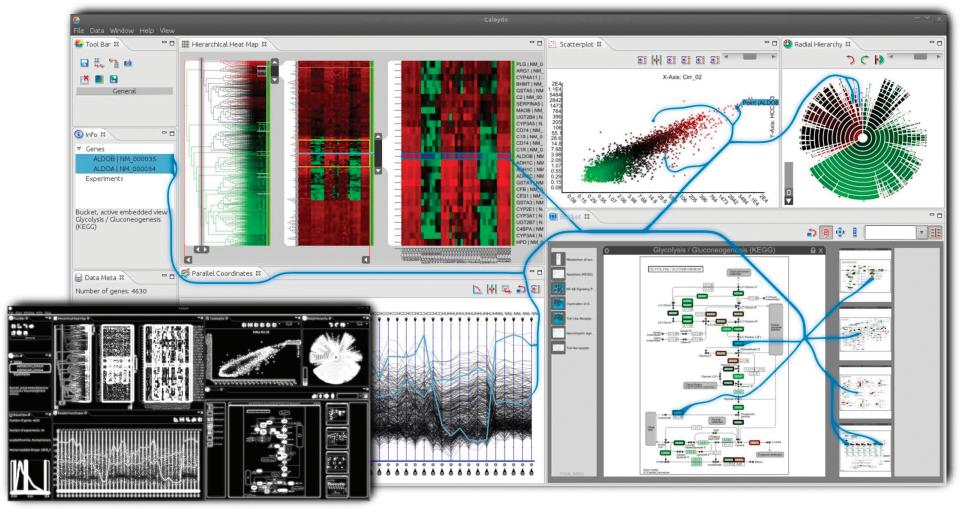  
Figure 11.6. The context-preserving visual links idiom is an example of the design choice to coordinate betweeen views by explicitly drawing links as connection marks between items and regions of interest. From [Steinberger et al. 11, Figure 1].

<table><tr><td>Idiom</td><td>Context-Preserving Visual Links</td></tr><tr><td>What: Data</td><td>Any data.</td></tr><tr><td>How: Encode</td><td>Any encoding. Highlight with link marks connecting items across views.</td></tr><tr><td>How: Manipulate</td><td>Select any element.</td></tr><tr><td>(How: Coordinate)</td><td>Juxtaposed multiple views.</td></tr></table>

Chained sequences of tasks are discussed in Section 1.14 and 3.7.

# 11.4.3 Selection Outcomes

Sometimes the outcome of selection is additional actions, beyond simply highlighting. Selection is often a first step in a multistage sequence, allowing the user to indicate specific elements that should be the target of the next action. That is, the output of a select action is often the input to the next action. Nearly all of the other major design choices of how idioms are constructed can accommodate a selected set of elements as input. For example, selected items might be filtered or aggregated, or their visual encoding could be changed. A selected set of regions or items might be reordered within a view. A navigation trajectory could be constructed so that a selected item is centered within the view at the end of an animated transition.

* In 2D navigation, the term scrolling is a synonym for panning.

* In this book, pan and zoom are used to mean translating the camera parallel to and perpendicular to the image plane; this loose sense matches the usage in the infovis literature. In cinematography, these motions are called trucking and dollying. The action of trucking, where the camera is translated parallel to the image plane, is distinguished from panning, where the camera stays in the same location and turns to point in a different direction. The action of dollying, where the camera is translated closer to the scene, is distinguished from zooming by changing the focal length of the camera lens.

# 11.5 Navigate: Changing Viewpoint

Large and complex datasets often cannot be understood from only a single point of view. Many interactive vis systems support a metaphor of navigation, analogous to navigation through the physical world. In these, the spatial layout is fixed and navigation acts as a change of the viewpoint.

The term navigation refers to changing the point of view from which things are drawn. The underlying metaphor is a virtual camera located in a particular spot and aimed in a particular direction. When that camera viewpoint is changed, the set of items visible in the camera frame also changes.

Navigation can be broken down into three components. The action of zooming moves the camera closer to or farther from the plane. Zooming the camera in close will show fewer items, which appear to be larger. Zooming out so that the camera is far away will show more items, and they will appear smaller. The action of panning the camera moves it parallel to the plane of the image, either up and down or from side to side.* In 3D navigation, the general term translating is more commonly used for any motion that changes camera position.* The action of rotating spins the camera around its own axis. Rotation is rare in two-dimensional navigation, but it is much more important with 3D motion.

Since changing the viewpoint changes the visible set of items, the outcome of navigation could be some combination of filtering and aggregation. Zooming in or panning with a zoomed-in camera

filters based on the spatial layout; zooming out can act as aggregation that creates an overview.

Navigation by panning or translating is straightfoward; zooming is the more complex case that requires further discussion.

# 11.5.1 Geometric Zooming

An intuitive form of navigation is geometric zooming because it corresponds almost exactly with our real-world experience of walking closer to objects, or grasping objects with our hands and moving them closer to our eyes. In the 2D case, the metaphor is moving a piece of paper closer to or farther from our eyes, while keeping it parallel to our face.

# 11.5.2 Semantic Zooming

With geometric zooming, the fundamental appearance of objects is fixed, and moving the viewpoint simply changes the size at which they are drawn in image space. An alternative, nongeometric approach to motion does not correspond to simply moving a virtual camera. With semantic zooming, the representation of the object adapts to the number of pixels available in the image-space region occupied by the object. The visual appearance of an object can change subtly or dramatically at different scales.

For instance, an abstract visual representation of a text file might always be a rectangular box, but its contents would change considerably. When the box was small, it would contain only a short text label, with the name of the file. A medium-sized box could contain the full document title. A large box could accommodate a multiline summary of the file contents. If the representation did not change, the multiple lines of text would simply be illegible when the box was small.

Figure 11.7 shows an example from the LiveRAC system for analyzing large collections of time-series data, in this case resource usage for large-scale system administration [McLachlan et al. 08]. Line charts in a very large grid use semantic zooming, automatically adapting to the amount of space available as rows and columns are stretched and squished. When the available box is tiny, then only a single categorical variable is shown with color coding. Slightly larger boxes also use sparklines, very concise line charts with dots marking the minimum and maximum values for that time period. As the box size passes thresholds, axes are

‣ Filtering and aggregation are covered in Chapter 13.

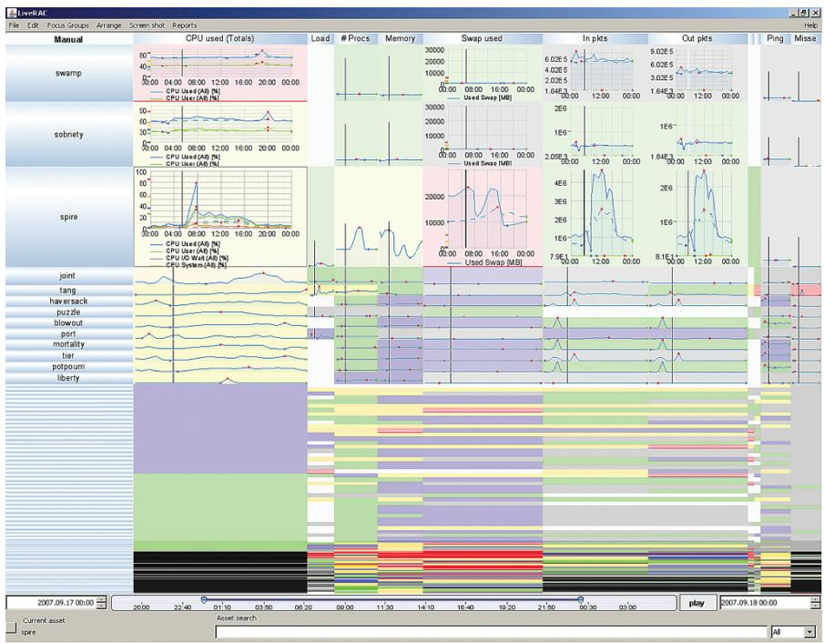  
Figure 11.7. LiveRAC uses semantic zooming within a stretchable grid of timeseries line charts. From [McLachlan et al. 08, Figure 2b].

Focus+context approaches are discussed further in Chapter 14.

drawn and multiple line charts are superimposed. The stretchand-squish navigation idiom is an example of a focus+context approach.

# 11.5.3 Constrained Navigation

With unconstrained navigation, the camera can move anywhere at all. It is very easy to implement for programmers who have learned the framework of standard computer graphics. It does have the conceptual appeal of allowing users access to a clearly defined mathematical category of transformations. However, users often have difficulty figuring out how to achieve a desired viewpoint with completely free navigation, especially in three dimensions. Navigating with the six degrees of freedom available in 3D space is not a skill that most people have acquired; pilots of airplanes and helicopters are the exception rather than the rule. To make matters

worse, when interacting with virtual objects drawn with computer graphics, it is easy to inadvertently move the viewpoint inside objects that are intended to be solid. The physics of reality prevent interpenetration between our heads and objects like walls, floors, or basketballs. With computer graphics, collision detection is a computationally intensive process that is separate from drawing and does not come for free. Another problem is ending up with the camera pointed at nothing at all, so that the entire frame is empty and it is not obvious where to go in order to see something interesting. This problem is especially common in 3D settings, but it can still be a problem in 2D settings with unconstrained panning and zooming. A button to reset the view is of course a good idea, but it is far from a complete solution.

In contrast, constrained navigation idioms have some kind of limit on the possible motion of the camera. One of the simplest approaches in a 2D setting is to limit the zoom range, so that the camera cannot zoom out much farther than the distance where the entire drawn scene is visible or zoom in much farther than the size of the smallest object.

Many approaches allow the user to easily select some item of interest, to which the system can then automatically calculate a smooth camera trajectory for an animated transition from the current viewpoint to a viewpoint better suited to viewing the selected item, thus maintaining context. Figure 15.20 shows an example where the final viewpoint is zoomed in enough that labels are clearly visible, zoomed out far enough that the full extent of the object fits in the frame, and panned so that the object is within the frame. In this case, a click anywhere within the green box enclosing a set of words is interpreted as a request to frame the entire complex object in the view, not a request to simply zoom in to that exact point in space. In 3D, a useful additional constraint is that final orientation looks straight down at the object along a vector perpendicular to it, with the up vector of the camera consistent with the vertical axis of the object.

Constrained navigation is particularly powerful when combined with linked navigation between multiple views. For example, a tabular or list view could be sorted by many possible attributes, including simple alphabetical ordering. These views support search well, where the name of a unique item is known in advance. Clicking on that object in the list view could trigger navigation to ensure that the object of interest is framed within another, more elaborate, view designed for browsing local neighborhoods where the items are laid out with a very different encoding for spatial position.

Many vis tools support both types of navigation. For example, constrained navigation may be designed to provide shortcuts for common use, with unconstrained navigation as a backup for the uncommon cases where the user needs completely general controls.

# 11.6 Navigate: Reducing Attributes

The geometric intuitions that underlie the metaphor of navigation with a virtual camera also lead to a set of design choices for reducing the number of attributes: slice, cut, and project. In this section I often use the term dimensions instead of the synonym attributes to emphasize this intuition of moving a camera through space. Although these idioms are inspired by ways to manipulate a virtual camera in a 3D scene, they also generalize to higher-dimensional spaces. These idioms are very commonly used for spatial field datasets, but they can sometimes be usefully applied to abstract data.

# 11.6.1 Slice

With the slice design choice, a single value is chosen from the dimension to eliminate, and only the items matching that value for the dimension are extracted to include in the lower-dimensional slice. Slicing is a particularly intuitive metaphor when reducing spatial data from 3D to 2D.

Figure 11.8(a) shows a classic example of inspecting a 3D scan of a human head by interactively changing the slice location to different heights along the skull. That is, the value chosen is a specific height in the third dimension, and the information extracted is the 2D position and color for each point matching that height. Here the slicing plane is aligned to one of the major axes of the human body, which are also the original dimensions used to gather the data. One benefit of axis-aligned slices is that they may correspond to views that are familiar to the viewer: for example, medical students learn anatomy in terms of cross sections along the standard coronal, sagittal, and horizontal planes.

It is also possible to slice along a plane at an arbitrary orientation that does not match the original axes, exploiting the same intuition. Mathematically, the operation is more complex, because finding the values to extract may require a significant computation rather than a simple look-up.*

* Using the vocabulary of signal processing, care must taken to minimize sampling and interpolation artifacts. These questions are also discussed in Section 8.4.

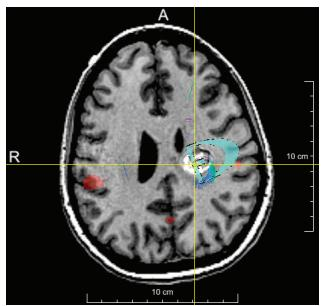  
(a)

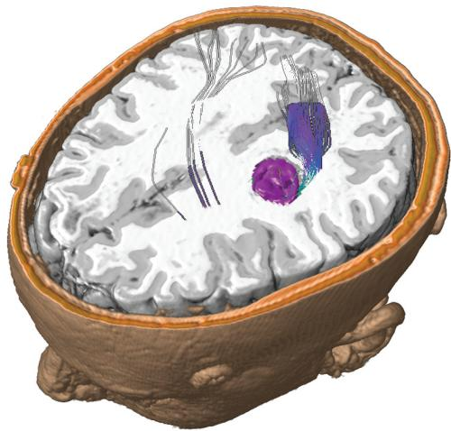  
(b)   
Figure 11.8. The slice choice eliminates a dimension/attribute by extracting only the items with a chosen value in that dimension. The cut choice eliminates all data on one side of a spatial cutting plane. (a) Axis-aligned slice. (b) Axis-aligned cut. From [Rieder et al. 08, Figures 7c and 0].

Slicing is not restricted to a change from 3D to 2D. The same idea holds in the more general case, where the slicing plane could be a hyperplane; that is, the higher-dimensional version of a plane. In the case of reducing to just one dimension, the hyperplane would simply be a line. Slicing can be used to eliminate multiple dimensions at once, for example by reducing from six dimensions to one.

# Example: HyperSlice

The HyperSlice system uses the design choice of slicing for attribute reduction to display abstract data with many attributes: scalar functions with many variables [van Wijk and van Liere 93]. The visual encoding is a set of views showing all possible orthogonal two-dimensional slices aligned in a matrix. Figure 11.9(a) shows the intuition behind the system for a simple 3D example of three planes that intersect at right angles to each other. The views are coordinated with linked navigation of the high-dimensional space, where each view is both a display and a control: dragging with a view changes the slice value based on its pair of dimen-

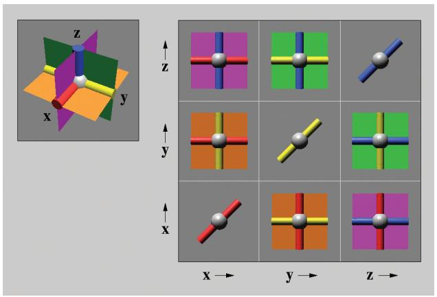  
(a)

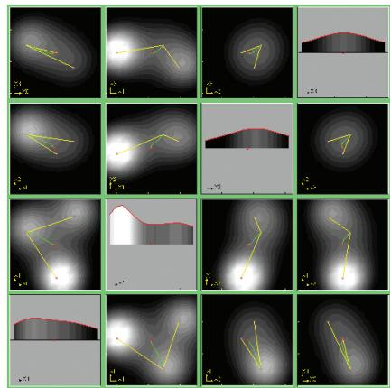  
(b)   
Figure 11.9. The HyperSlice system uses extracting only the items with a chosen value in that dimension. (a) Three 3D planes that intersect at right angles. (b) Four-dimensional dataset where function value is encoded with luminance. From [van Wijk and van Liere 93, Figures 1 and 4].

sions. Figure 11.9(b) shows a more complex four-dimensional dataset, where the function value is coded with luminance.

# 11.6.2 Cut

* In computer graphics, this plane is often called a clipping plane.

The interaction idiom of cut allows the user to position a plane that divides the viewing volume in two, and everything on the side of the plane nearest to the camera viewpoint is not shown. This cutting plane can either be axis aligned or arbitrarily oriented, just as with the slices.* Cutting is often used to see features in the interior of a 3D volume. Figure 11.8(b) shows an example, again with medical image data of a human brain. The cutting plane is set to the same level as the slice in Figure 11.8(a). The cut design choice shows more information than just the 2D slice alone, since the surrounding 3D context behind the cutting plane is also visible. Figure 8.6(c) also shows a cutting plane in use on a human head dataset, but with the visual encoding idiom of direct volume rendering.

# 11.6.3 Project

With the project design choice, all items are shown, but without the information for specific dimensions chosen to exclude. For instance, the shadow of an object on a wall or floor is a projection from 3D to 2D. There are many types of projection; some retain partial information about the removed dimensions, while others eliminate that completely.

A very simple form of projection is orthographic projection: for each item the values for excluded dimensions are simply dropped, and no information about the eliminated dimensions is retained. In the case of orthographic projection from 3D to 2D, all information about depth is lost.* Projections are often used via multiple views, where there can be a view for each possible combination of dimensions. For instance, standard architectural blueprints show the three possible views for axis-aligned 2D views of a 3D XYZ scene: a floor plan for the XY dimensions, a side view for YZ, and a front view for XZ.

A more complex yet more familiar form of projection is the standard perspective projection, which also projects from 3D to 2D. This transformation happens automatically in our eyes and is mathematically modeled in the perspective transformation used in the computer graphics virtual camera. While a great deal of information about depth is lost, some is retained through the perspective distortion foreshortening effect, where distant objects are closer together on the image plane than nearby objects would be.

Many map projections from the surface of the Earth to 2D maps have been proposed by cartographers, including the well-known Mercator projection. These projections transform from a curved to a flat space, and most of the design choices when creating them concern whether distorting angles or areas is less problematic for the intended abstract task.1

# 11.7 Further Reading

Change An early paper argues for adding interaction support to previously static visual encoding idioms as a good starting point for thinking about views that change [Dix and Ellis 98].

* The term dimensional filtering, common when working with abstract data, is essentially a synonym for orthographic projection, more commonly used when working with spatial data.

Animated Transitions A taxonomy of animated transition types includes design guidelines for constructing transitions, and an empirical study showing strong evidence that properly designed transitions can improve graphical perception of changes [Heer and Robertson 07].

Select The entertainingly named Selection: 524,288 Ways to Say “This Is Interesting” contains nicely reasoned arguments for narrowing selection operations across linked views to a small set of combinations [Wills 96].

Semantic Zooming The $\mathrm { P a d } { + + }$ system was an early exploration into semanic zooming [Bederson and Hollan 94]; LiveRAC is a more recent system using that idiom [McLachlan et al. 08].

Constrained Navigation Early work evangelized the idea of constrained navigation in 3D [Mackinlay et al. 90]; later work provides a framework for calculating smooth and efficient 2D panning and zooming trajectories [van Wijk and Nuij 03].

#

$\circledast$ Jux tapose and Coordinate Multiple Side-by-Side Views

→Share Encoding: Same/Different   
Linked Highlighting

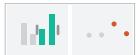

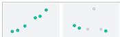

Share Data: All/Subset/None

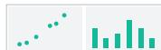

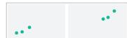

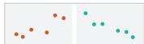

Share Navigation

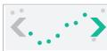

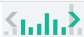

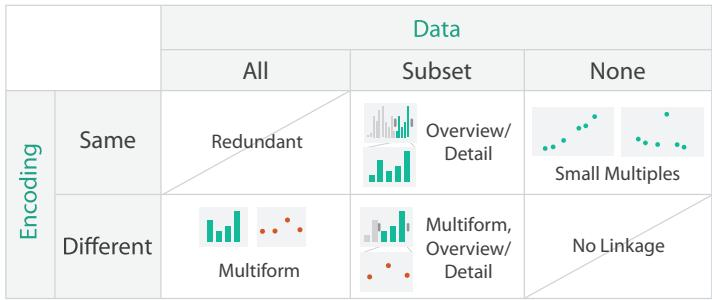

$\circled{  }$ Par tition into Side-by-Side Views

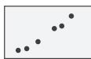

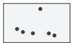

$\circledcirc$ Superimpose Layers

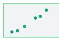

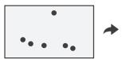

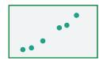  
Figure 12.1. Design choices of how to facet information between multiple views.

