# Chapter 12

# Facet into Multiple Views

# 12.1 The Big Picture

This chapter covers choices about how to facet data across multiple views, as shown in Figure 12.1. One option for showing views is juxtapose them side by side, leading to many choices of how to coordinate these views with each other. The other option is to superimpose the views as layers on top of each other. When the views show different data, a set of choices covers how to partition data across multiple views.

The main design choices for juxtaposed views cover how to coordinate them: which visual encoding channels are shared between them, how much of the data is shared between them, and whether the navigation is synchronized. Other juxtaposition choices are when to show each view and how to arrange them. The design choices for partitioning are how many regions to use, how to divide the data up into regions, the order in which attributes are used to split, and when to stop. The design choices for how to superimpose include how elements are partitioned between layers, how many layers to use, how to distinguish them from each other, and whether the layers are static or dynamically constructed.

# 12.2 Why Facet?

The verb facet means to split; this chapter covers the design choices that pertain to splitting up the display, into either multiple views or layers. One of the five major approaches to handling visual complexity involves faceting information: juxtaposing coordinated views side by side and superimposing layers within a single view. In both of these cases, the data needs to be partitioned into the views or layers.

Multiple views juxtaposed side by side are spread out in space, an alternative to a changing view where the information presented

The other four approaches are covered in other chapters: Chapter 3 covers deriving new data to include in a view, Chapter 11 covers changing a single view over time, Chapter 13 covers reducing the amount of data to show in a view, and Chapter 14 covers embedding focus and context information within the same view.

‣ For more on the ideas behind the slogan Eyes Beat Memory, see Section 6.5.

to the user is spread out over time. Comparing two views that are simultaneously visible is relatively easy, because we can move our eyes back and forth between them to compare their states. In contrast, for a changing view, comparing its current state to its previous state requires users to consult their working memory, a scarce internal resource.

The multiform design choice for coordinating juxtaposed views is to use a different encoding in each one to show the same data. The rationale is that no single visual encoding is optimal for all possible tasks; a multiform vis tool can thus support more tasks, or faster switching between tasks, than a tool that only shows a single view. Cooordinating multiform views with linked highlighting allows users to see whether a spatial neighborhood in one view also falls into contiguous regions in the other views or whether it is distributed differently.

The small multiples coordination choice involves partitioning the data between views. Partitioning is a powerful and general idea, especially when used hierarchically with a succession of attributes to slice and dice the dataset up into pieces of possible interest. The choice of which attributes to partition versus which to directly encode with, as well as the order of partitioning, has a profound effect on what aspects of the dataset are visually salient.

The obvious and significant cost to juxtaposed views is the display area required to show these multiple windows side by side. When two views are shown side by side, they each get only half the area that a single view could provide. Display area is a scarce external resource. The trade-off between the scarcity of display area and working memory is a major issue in choosing between juxtaposing additional views and changing an existing view.

In contrast, superimposing layers does not require more screen space. Visual layering is a way to control visual clutter in complex visual encodings, leading to a less cluttered view than a single view without any layers. Superimposing layers and changing the view over time are not mutually exclusive: these two design choices are often used together. In particular, the choice to dynamically construct layers necessarily implies an interactive view that changes. One limitation of superimposing is that creating visually distinguishable layers imposes serious constraints on visual encoding choices. A major difference between layering and juxtaposing is the strong limits on the number of layers that can be superimposed on each other before the visual clutter becomes overwhelming: two is very feasible and three is possible with care, but more would be difficult. In contrast, the juxtaposing choice can accommodate a

much larger number of views, where several is straightforward and up to a few dozen is viable with care.

# 12.3 Juxtapose and Coordinate Views

Using multiple juxtaposed views involves many choices about how to coordinate between them to create linked views.* There are four major design choices for how to establish some sort of linkage between the views. Do the views share the same visual encoding or use different encodings? In particular, is highlighting linked between the views? Do the views show the same data, does one show a subset of what’s in the other, or do the views show a disjoint partitioning where each shows a different set? Is navigation synchronized between the views?

# 12.3.1 Share Encoding: Same/Different

The most common method for linking views together is to have some form of shared visual encoding where a visual channel is used in the same way across the multiple views. The design choice of shared encoding views means that all channels are handled the same way for an identical visual encoding. The design choice of multiform views means that some, but not necessarily all, aspects of the visual encoding differ between the two views.* For example, in a multiform system two views might have different spatial layouts but the same color coding, so there is a shared encoding through the color channel. Another option is that two views could be aligned in one spatial direction but not in the other. These forms of linking don’t necessarily require interactivity and can be done with completely static views.

Interactivity unleashes the full power of linked views. One of the most common forms of linking is linked highlighting, where items that are interactively selected in one view are immediately highlighted in all other views using in the same highlight color.* Linked highlighting is a special case of a shared visual encoding in the color channel. The central benefit of the linked highlighting idiom is in seeing how a region that is contiguous in one view is distributed within another.

The rationale behind multiform encoding across views is that a single monolithic view has strong limits on the number of attributes that can be shown simultaneously without introducing too much visual clutter. Although simple abstract tasks can often be

* Linked views, multiple views, coordinated views, coordinated multiple views, and coupled views are all synonyms for the same fundamental idea.   
* The generic term multiple views is often used as a synonym for multiform views.   
* Linked highlighting is also called brushing or cross-filtering.

fully supported by a single view of a specific dataset, more complex ones often cannot. With multiple views as opposed to a single view, each view does not have to show all of the attributes; they can each show only a subset of the attributes, avoiding the visual clutter of trying to superimpose too many attributes in a single view. Even if two views show exactly the same set of attributes, the visual channels used to encode can differ. The most important channel change is what spatial position encodes; this most salient channel dominates our use of the view and strongly affects what tasks it best supports. Multiform views can thus exploit the strengths of multiple visual encodings.

# Example: Exploratory Data Visualizer (EDV)

The EDV system features the idiom of linked highlighting between views [Wills 95]. Figure 12.2 shows a baseball statistics dataset with linked bar charts, scatterplots, and a histogram [Wills 95]. In Figure 12.2(a), the viewer has selected players with high salaries in the smoothed histogram view on the upper right. The distribution of these players is very different in the other plots. In the Years played view bar chart on the upper left, there are no rookie players. The Assists-PutOuts scatterplot does not show much correlation with salary. Comparing the CHits/Years plot showing batting ability in terms of career home runs with average career hits shows that the hits per year is more correlated with salary than the home runs

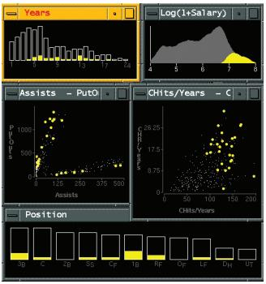  
(a)

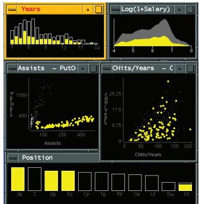  
(b)   
Figure 12.2. Linked highlighting between views shows how regions that are contiguous in one view are distributed within another. (a) Selecting the high salaries in the upper right window shows different distributions in the other views. (b) Selecting the bottom group in the Assists-PutOuts window shows that the clump corresponds to specific positions played. From [Wills 95, Figures 4 and 5].

per year. The bottom Position window shows a loose relationship between salary and the player’s position in the field. The Assists-PutOuts window shows a clustering into two major groups. Figure 12.2(b) shows the result of selecting the bottom clump. The bottom Position window shows that this clump corresponds to specific positions played, whereas these players are fairly evenly distributed in the other windows.

<table><tr><td>System</td><td>Exploratory Data Visualizer (EDV)</td></tr><tr><td>What: Data</td><td>Tables.</td></tr><tr><td>How: Encode</td><td>Bar charts, scatterplots, and histograms.</td></tr><tr><td>How: Facet</td><td>Partition: multiform views. Coordinate: linked high-lighting.</td></tr></table>

# 12.3.2 Share Data: All, Subset, None

A second design choice is how much data is shared between the two views. There are three alternatives: with shared data, both views could each show all of the data; with overview–detail, one view could show a subset of what is in the other, or with small multiples, the views could show different partitions of the dataset into disjoint pieces.

The shared data choice to show all of the data in each view is common with multiform systems, where the encoding differs between the views. It’s not usual to combine shared data with shared encoding, since then the two views would be identical and thus redundant.

With the overview–detail choice, one of the views shows information about the entire dataset to provide an overview of everything. One or more additional views show more detailed information about a subset of the data that is selected by the viewer from the larger set depicted in the broader view.

A popular overview–detail idiom is to combine shared encoding and shared data with navigation support so that each view shows a different viewpoint of the same dataset. When two of these views are shown they often have different sizes, a large one with many pixels versus a small one with few. For some tasks, it’s best to have the large window be the main view for exploring the details and the small window be the zoomed-out overview; for others, the large view would be devoted to the overview, with a smaller window for details. While it’s theoretically possible to set both views to the same zoom level, so that they show identical information, the

For more on changing the viewpoint with navigation, see Section 11.5.

normal case is that one view shows only a subset of the other. Also, zooming is only one form of navigation: even two viewpoints at the same zoom level can still show different subsets of the data due to different rotation or translation settings.

There are several standard approaches in choosing how many views to use in total. A common choice is to have only two views, one for overview and one for detail. When the dataset has multilevel structure at discrete scales, multiple detail views may be appropriate to show structure at these different levels. The user can zoom down in to successively smaller subsets of the data with a series of selections, and the other views act as a concise visual history of what region they selected that can be accessed at a glance. In contrast, with the change design choice, users are more likely to lose track of their location because they have no scaffolding to augment their own internal memory.

# Example: Bird’s-Eye Maps

Interactive online geographic maps are a widely used idiom that combines the shared encoding and overview–detail choices for geographic data, with a large map exploration view augmented by a small “bird’s-eye” view providing an orienting overview, as shown in Figure 12.3. A small rectangle

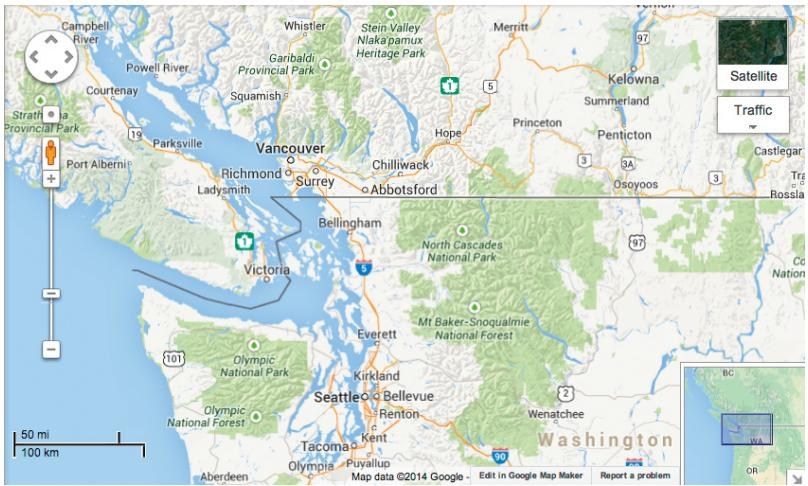  
Figure 12.3. Overview–detail example with geographic maps, where the views have the same encoding and dataset; they differ in viewpoint and size. Made with Google Maps, http://maps.google.com.

within the overview shows the region viewable within the detail view. The minimum navigational linkage is unidirectional, where position and size of the rectangle in the overview updates as the user pans and zooms within the large detail view. With bidirectionally linked views, the rectangle can also be moved within the small view to update the region shown in the large one.

<table><tr><td>Idiom</td><td>Bird&#x27;s-Eye Maps</td></tr><tr><td>What: Data</td><td>Geographic.</td></tr><tr><td>How: Encode</td><td>Use given.</td></tr><tr><td>How: Facet</td><td>Partition into two views with same encoding, overview-detail.</td></tr><tr><td>(How: Reduce)</td><td>Navigate.</td></tr></table>

Another common approach is to combine the choices of overview– detail for data sharing with multiform views, where the detail view has a different visual encoding than the overview. A detail view that shows additional information about one or more items selected in a central main view is sometimes called a detail-on-demand view. This view might be a popup window near the cursor or a fixed window in another part of the display.

# Example: Multiform Overview–Detail Microarrays

Figure 12.4 shows an example of a multiform overview–detail vis tool designed to support the visual exploration of microarray time-series data by biologists [Craig and Kennedy 03]. It features coordination between the scatterplot view in the center and the graph view in the upper left. The designers carefully analyzed the domain situation to generate an appropriate data and task abstraction and concluded that no single view would suffice.

Microarrays measure gene expression, which is the activity level of a gene. They are used to compare gene activity across many different situations; examples include different times, different tissue types such as brain versus bone, exposure to different drugs, samples from different individuals, or samples from known groups such as cancerous or noncancerous.

The designers identified the five tasks of finding genes that were on or off across the whole time period, finding genes whose values rose or fell over a specified time window, finding genes with similar time-series patterns, relating all these sets to known functional groups of genes, and exporting the results for use within other tools.

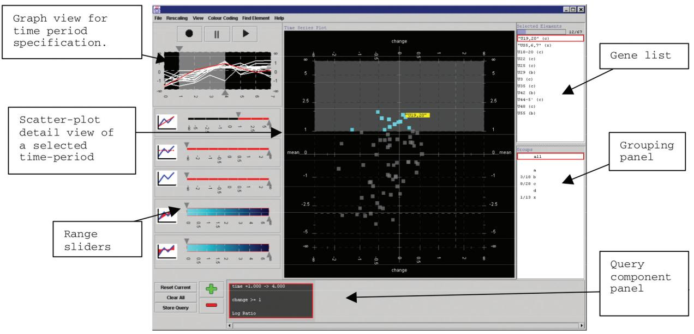  
Figure 12.4. Multiform overview–detail vis tool for microarray exploration features a central scatterplot linked with the graph view in the upper left. From [Craig and Kennedy 03, Figure 3].

For more on superimposed line charts, see Section 12.5.2.

In the why analysis framework, the first four tasks are examples of the consume goal, while the last is produce. All of the consume tasks involve the discover goal at the high level and the locate goal for the mid-level search. At the query level, the first three tasks focus on the identify case, and the last on the compare case. In the what analysis framework, the targets are distributions and trends for a single attribute and similarity between multiple attributes.

The data abstraction identified five key parameters: the original quantitative attribute of microarray value indexed by the keys of gene and time and three derived quantitative attributes of value change, percentage of max value, and fold change (a log-scale change measure frequently used in microarray data analysis).

The graph view shows time-series data plotted with globally superimposed line charts. Each line mark represents a gene, with the horizontal axis showing time and the vertical axis showing value. The user interacts with this overview to select a time period of interest to show in the scatterplot detail view by changing the position or width of the time slider. The time-series graph view does not support visual queries about value change or fold change, which are derived values computed within the time window chosen. In the scatterplot view, the horizontal axis can be set to either of

these derived variables. In the scatterplot, each gene is represented by a point mark. This view also encodes the functional groups with color coding and dynamically shows the label for the gene under the cursor.

The list view on the right shows the gene names for all genes within the active time window, ordered alphabetically. Although a text list might appear to be a trivial vis when considered as a stand-alone view, these kinds of simpler views often play useful roles in a multiple-view system. This particular list view provides a textual overview and also supports both browsing and lookup. While interaction via hovering over an item is useful for discovering the identify of a mark in a specific place, it would be a very frustrating way to get an overview of all labels because the user would have to click in many places and try to remember all of the previous labels. Glancing at the list view provides a simple overview of the names and allows the user to quickly select an item with a known name.

<table><tr><td>System</td><td>Multiform Overview-Detail Microarrays</td></tr><tr><td>What: Data</td><td>Multidimensional table: one categorical key attribute (gene), one ordered key attribute (time), one quantitative value attribute (microarray measurement of gene activity at time).</td></tr><tr><td>What: Derived</td><td>Three quantitative value attributes: (value change, percentage of max value, fold change).</td></tr><tr><td>Why: Tasks</td><td>Locate, identify, and compare; distribution, trend, and similarity.
Produce.</td></tr><tr><td>How: Encode</td><td>Line charts, scatterplots, lists.</td></tr><tr><td>How: Facet</td><td>Partition into multiform views. Coordinate with linked highlighting. Overview+detail filtering of time range.
Superimpose line charts.</td></tr></table>

The third alternative for data sharing between views is to show a different partition of the dataset in each. Multiple views with the same encoding and different partitions of the data between them are often called small multiples. The shared visual encoding means that the views have a common reference frame so that comparison of spatial position between them is directly meaningful. Small multiples are often aligned into a list or matrix to support comparison with the highest precision. The choice of small-multiple views is in some sense the inverse of multiform views, since the encoding is identical but the data differs.

The design choice of how to partition data between views is covered in Section 12.4.   
‣ For more on aligning regions, see Section 7.5.

‣ The relationship between animation and memory is discussed in Section 6.5.

The weakness of small multiples, as with all juxtaposed view combinations, is the screen real estate required to show all of these views simultaneously. The operational limit with current displays of around one million pixels is a few dozen views with several hundred elements in each view.

The strength of the small-multiple views is in making different partitions of the dataset simultaneously visible side by side, allowing the user to glance quickly between them with minimal interaction cost and memory load. Small multiples are often used as an alternative to animations, where all frames are visible simultaneously rather than shown one by one. Animation imposes a massive memory load when the amount of change between each frame is complex and distributed spatially between many points in the scene.

# Example: Cerebral

Figure 12.5 shows an example of small-multiple views in the Cerebral system [Barsky et al. 08]. The dataset is also from the bioinformatics domain, a multidimensional table with the two keys of genes and experimental condition and the value attribute of microarray measurements of gene activity for the condition. The large view on the upper right is a node–link network diagram where nodes are genes and links are the known interactions between genes, shown with connection marks. The layout also encodes an ordered attribute for each node, the location within the cell where the interaction occurs, with vertical spatial position. Containment marks show the groups of coregulated genes. The small-multiple views to the left of the large window show a partitioning of the dataset by condition. The views are aligned to a matrix and are reorderable within it.

In each small-multiple network view the nodes are colored with a diverging red–green colormap showing the quantitative attribute of gene activity for that view’s condition. This colormap follows bioinformatics domain conventions; other colormaps that better serve colorblind users are also available. In the large network view, the color coding for the nodes is a diverging orange–blue colormap based on the derived attribute of difference in values between the two selected small multiples, whose titlebars are highlighted in blue.

Cerebral is also multiform; the view at the bottom uses parallel coordinates for the visual encoding, along with a control panel for data clustering. The navigation between the views is linked, as discussed next.

The convention of red– green colormaps in bioinformatics is discussed in Section 7.5.2.

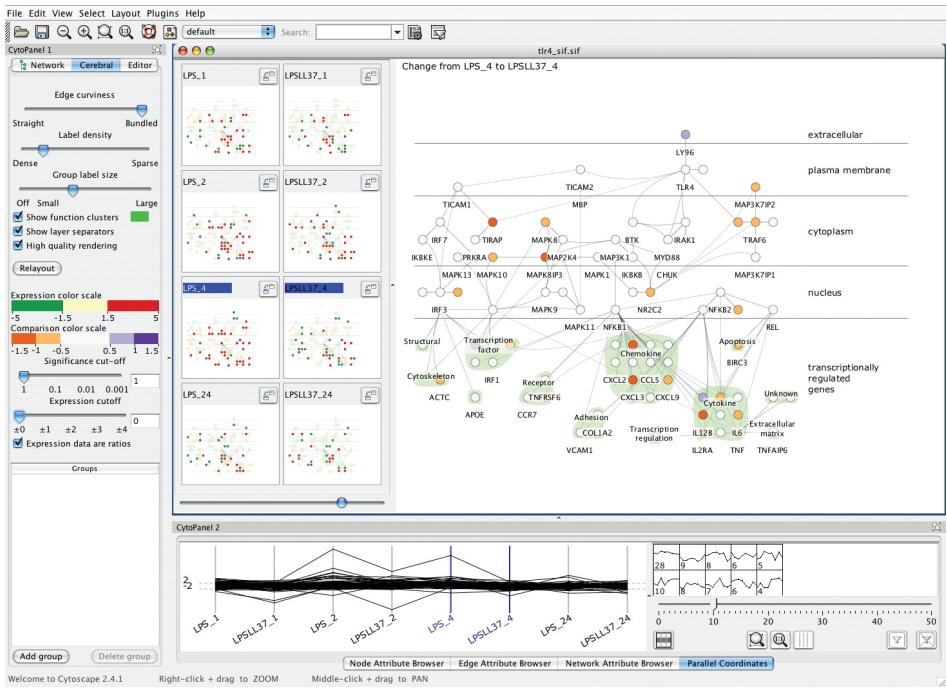  
Figure 12.5. Cerebral uses small-multiple views to show the same base graph of gene interactions colored according to microarray measurements made at different times. The coloring in the main view uses the derived attribute of the difference in values between the two chosen views. From [Barsky et al. 08, Figure 2].

<table><tr><td>System</td><td>Cerebral</td></tr><tr><td>What: Data</td><td>Multidimensional table: one categorical key attribute (gene), one categorical key attribute (condition), one quantitative value attribute (gene activity at condition). Network: nodes (genes), links (known interaction between genes), one ordered attribute on nodes: location within cell of interaction.</td></tr><tr><td>What: Derived</td><td>One quantitative value attribute (difference between measurements for two partitions).</td></tr><tr><td>How: Encode</td><td>Node-link network using connection marks, vertical spatial position expressing interaction location, containment marks for coregulated gene groups, diverging colormap. Small-multiple network views aligned in matrix. Parallel coordinates.</td></tr><tr><td>How: Facet</td><td>Partition: small multiple views partitioned on condition, and multiform views. Coordinate: linked high-lighting and navigation.</td></tr></table>

<!-- Chunk 6 End -->

<!-- Chunk 7 Start -->

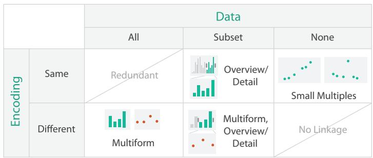  
Figure 12.6. Design choices for how to coordinate between views relating to sharing encoding and data.

# 12.3.3 Share Navigation: Synchronize

Another way to coordinate between views is to share navigation. With linked navigation, moving the viewpoint in one view is synchronized to movement in the others. For example, linked navigation is common with map views that have a smaller bird’s-eye overview window in addition to a larger detail view, where interaction in the small window changes the viewpoint in the large one.

# 12.3.4 Combinations

Figure 12.6 summarizes the design choices for coordinating views in terms of whether the encoding and data are shared or different and how these choices interact with each other. The encoding could be the same or different; the data could be the same, a subset, or a partition. Two of the six possibilities are not useful. When everything is shared, with both the data and encoding identical, the two views would be redundant. When nothing is shared, with different data in each view and no shared channels in the visual encoding, there is no linkage between the views. Otherwise, the choices of sharing for encoding and data are independent. For example, the overview–detail choice of creating subsets of the data can be used with either multiform or shared encoding.

Complex systems will use these methods in combination, so in this book these terms are used to mean that at least one pair of views differs along that particular axis. For example, multiform means that at least one pair of views differs, not necessarily that every single view has a different encoding from every other one.

‣ Navigation is covered further in Section 11.5.

# Example: Improvise

Figure 12.7 shows a vis of census data that uses many views. In addition to geographic information, the demographic information for each county includes population, density, genders, median age, percentage change since 1990, and proportions of major ethnic groups. The system is multiform with geographic, scatterplot, parallel coordinate, tabular, and matrix views. These multiform views all share the same bivariate sequential– sequential color encoding, documented with a legend in the bottom middle. A set of small-multiple views appears in the lower left in the form of a scatterplot matrix, where each scatterplot shows a different pair of attributes. All of the views are linked by highlighting: the blue selected items are close together in some views and spread out in others. A set of small-multiple reorderable list views result from partitioning the data by

Bivariate colormaps are covered in Section 10.3.3.

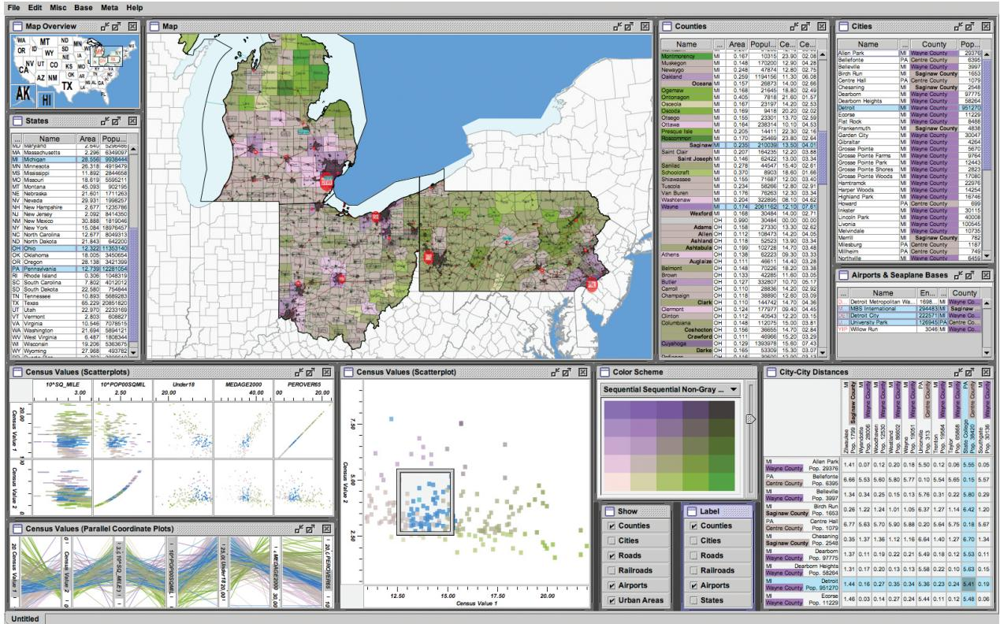  
Figure 12.7. The Improvise toolkit [Weaver 04] was used to create this census vis that has many forms of coordination between views. It has many multiform views, some of which use small multiples, and some of which provide additional detail information. From http://www.cs.ou.edu/~weaver/improvise/examples/census.

attribute. The list views allow direct sorting by and selection within an attribute of interest. The map in the upper left view is a small overview, with linked navigation to the large geographic detail view in the top middle.

<table><tr><td>System</td><td>Improvise</td></tr><tr><td>What: Data</td><td>Geographic and multidimensional table (census data): one key attribute (county), many quantitative attributes (demographic information).</td></tr><tr><td>How: Encode</td><td>Scatterplot matrix, parallel coordinates, choropleth map with size-coded city points, bird&#x27;s-eye map overview, scatterplot, reorderable text lists, text matrix. Bivariate sequential–sequential colormap.</td></tr><tr><td>How: Facet</td><td>Partition: small-multiple, multiform, overview–detail views; linked highlighting.</td></tr></table>

# 12.3.5 Juxtapose Views

Two additional design choices that pertain to view juxtaposition do not directly involve view coordination: when to show each view and how to arrange them.

The usual choice with juxtaposition is that all of the views are permanently visible so that users can glance between them, as suggested by the synonym side-by-side. However, another option is to have a view that temporarily pops up in response to a user action.

Sometimes the arrangement of the views is not under the direct control of the vis designer and is left to the built-in functionality of the window system running on the user’s computer. If the number of views is large, then manually arranging them could be a burdensome load to the user. A more sophisticated choice is to arrange the views themselves automatically, just like regions and items can be arranged. For example, views can be aligned and ordered linearly in a list, or two-dimensionally in a matrix, to support higherprecision comparison than unaligned views. This case is common when data is partitioned between the views, as discussed in the next section.

# 12.4 Partition into Views

The design choice of how to partition a multiattribute dataset into meaningful groups has major implications for what kind of patterns are visible to the user.* This choice encodes association between items using spatial proximity, a highly ranked channel.

The primary design choice within partitioning is how to divide the data up between the views, given a hierarchy of attributes.*

One design choice is how many splits to carry out: splitting could continue through as many attributes as are available until the simplest case of one region per item has been reached and it can be encoded with a single mark, or the partitioning could stop at a higher level where there is more complex structure to show within each region. Another design choice within partitioning is the order in which attributes are used to split things up. A final design choice is how many views to use; while this decision is often data driven, it could be determined in advance.

A partitioning attribute is typically a categorical variable that has only a limited number of unique values; that is, levels. It can also be a derived attribute, for example created by a transformation from a quantitative attribute by dividing it up into a limited number of bins. Partitioning can be carried out with either key or value attributes. An attribute can be categorical without being a key; that attribute can still be used to separate into regions and partition the dataset according to the levels for that attribute. When dealing with key attributes, it is possible to partition the data down to the item level, since each item is uniquely indexed by the combination of all keys. With a value attribute, multiple items can all share the same value, so the final division might be a group of items rather than just a single one.

# 12.4.1 Regions, Glyphs, and Views

Partitioning is an action on a dataset that separates data into groups. To connect partioning to visual encoding choices, the crucial idea is that a partitioned group can be placed within a region of space, so partitioning is an action that addresses the separate choice when arranging data in space. These regions then need to be ordered, and often aligned, to resolve the other spatial arrangement choices. For example, after space is subdivided into regions, they can be aligned and ordered within a 1D list, or 2D matrix. Recursive subdivision allows these regions to nest inside each other;

Partioning and grouping are inverse terms; the term partitioning is natural when considering starting from the top and gradually refining; the term grouping is more natural when considering a bottom-up process of gradually consolidating. The term conditioning is a synonym for partitioning that is used heavily in the statistics literature.

* Synonyms for partitioning are hierarchical partitioning and dimensional stacking.

Section 7.5 covers separation, ordering, and alignment.

* The word glyph is used very ambiguously in the vis literature. My definitions unify many ideas within a common framework but are not standard. In particular, my distinction between a mark and a glyph made of multiple marks is not universal.

* Other synonyms for view include display, window, panel, and pane.

these nested regions may be arranged using the same choices as their enclosing regions or different choices.

When a dataset has only one key attribute, then it is straightforward to use that key to separate into one region per item. When a dataset has multiple keys, there are several possibilities for separation. Given two keys, X and Y, you could first separate by X and then by Y, or you could first separate by Y and then by X. A third option is that you might separate into regions by only one of the keys and then draw something more complex within the region. The complexity of what is encoded in a region falls along a continuum. It could be just a single mark, a single geometric primitive. It could be a more complex glyph: an object with internal structure that arises from multiple marks. It could be a full view, showing a complete visual encoding of marks and attributes.

There is no strict dividing line between a region, a view, and a glyph.* A view is a contiguous region in which visually encoded data is shown on the display.* Sometimes a view is a full-blown window controlled by the computer’s operating system, sometimes it is a subcomponent such as a panel or a pane, and sometimes it simply means a region of the display that is visually distinguishable from other regions through some kind of visible boundary. A spatial region showing data visually encoded by a specific idiom might be called either a glyph or a view depending on its screen size, the amount of additional information beyond the visual encoding alone that is shown, and whether it is nested within another region. Large, stand-alone, highly detailed regions are likely to be called views, and small, nested, schematic regions are likely to be called glyphs. For example, a single bar chart that is 800 pixels wide and 400 pixels high, with axes that have labels and tick marks, confidence intervals shown for each bar, and both a legend and a title would usually be called a view. If there is a set of bar charts that are each 50 by 25 pixels, each with a few schematic bars and two thin unlabeled lines to depict the axes, where each appears within a geographic region on a map, each chart might be called a glyph.

The term glyph has been used for structures at a range of sizes. Glyphs like the schematic bar chart example just mentioned would fall into the category of macroglyphs. Another example is a glyph with a complex 3D shape that represents several aspects of local fluid flow all simultaneously. Designing these glyphs is a microcosm of vis design more generally!

In the middle of the size spectrum are simpler structures such as a single multipart bar in a stacked bar chart. At the extreme end

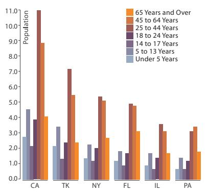  
(a)

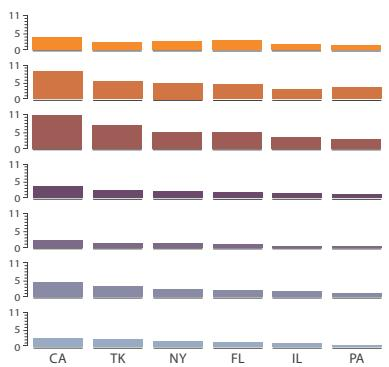  
(b)   
Figure 12.8. Partitioning and bar charts. (a) Single bar chart with grouped bars: separated by state key into regions, using seven-mark glyphs within each region. (b) Four aligned small-multiple bar chart views: separated by group key into vertically aligned list of regions, with a full bar chart in each region. From http://bl.ocks.org/mbostock/3887051, after http://bl.ocks.org/mbostock/4679202.

of the spectrum, microglyphs can be so small that their structure is not intended to be directly distinguishable: for example, five very short connected line segments, where the angle between each pair of segments encodes a quantitative attribute, and the entire glyph fits within an 15 by 4 pixel region. Microglyphs are typically used as a dense 2D array that forms a sea of visual texture, where the hope is that noticeable boundaries will emerge where attribute values change.

# 12.4.2 List Alignments

A concrete and simple example of how different partitioning decisions enable different tasks comes from comparing grouped bar charts to small-multiple aligned bar charts, as shown in Figure 12.8.

In a grouped bar chart, a multibar glyph is drawn within each region where a single mark would be drawn in a standard bar chart. In Figure 12.8(a), the regions are the states, and the bars within each glyph show demographic category. In contrast, the small-multiple design choice simply shows several standard bar charts, one in each view. In Figure 12.8(b), each view shows a demographic category, with the states spread along each standard

Dot charts are discussed in Section 7.5.1.

bar chart axis. The grouped bar chart facilitates comparison between the attributes, whereas the small multiple bar charts facilitate comparison within a single attribute.

These two encodings can be interpreted in a unified way: either both as glyphs, or both in terms of partitions. From a glyph point of view, the grouped bars idiom uses a smaller multibar glyph, and the small-multiple bars idiom uses a larger bar-chart glyph. From a partitioning point of view, both idioms use two levels of partitioning: at the high level by a first key, and then at a lower level by a second key, and finally a single mark is drawn within each subregion. The difference is that with grouped bars the second-level regions are interleaved within the first-level regions, whereas with small multiple bars the second-level regions are contiguous within a single first-level region.

# 12.4.3 Matrix Alignments

# Example: Trellis

The Trellis [Becker et al. 96] system is a more complex example. This system features partitioning a multiattribute dataset into multiple views and ordering them within a 2D matrix alignment as the main avenue for exploration. Figure 12.9 shows a dataset of barley yields shown with dot charts. This dataset is a multidimensional table with three categorical attributes that act as keys. The site attribute has six unique levels, the locations where the barley was grown. The variety attribute for the type of barley grown has ten levels. The year attribute has only two levels, and although it technically is a number it is treated as categorical rather than ordered. The dataset also has a fourth quantitative attribute, the yield.

In this figure, the partitioning is by year for the matrix columns and by site for the rows. Within the individual dot chart views the vertical axis is separated by variety, with yield as the quantitative value expressed with horizontal spatial position. The ordering idiom used is main-effects ordering, where the derived attribute of the median value is computed for each group created by the partitioning and used to order them. In Trellis, main-effects ordering can be done at every partitioning scale. In Figure 12.9(a) the matrix rows are ordered by the medians for the site, and the rows within each dot chart are ordered by the medians for the varieties.

The value of main-effects ordering is that outliers countervailing to the general trends are visible. The Morris plots in the third row do not match up with the others, suggesting that perhaps the years had been switched. Figure 12.9(b) shows a trellis where the vertical ordering between and within the plots is alphabetical. This display does not provide any useful

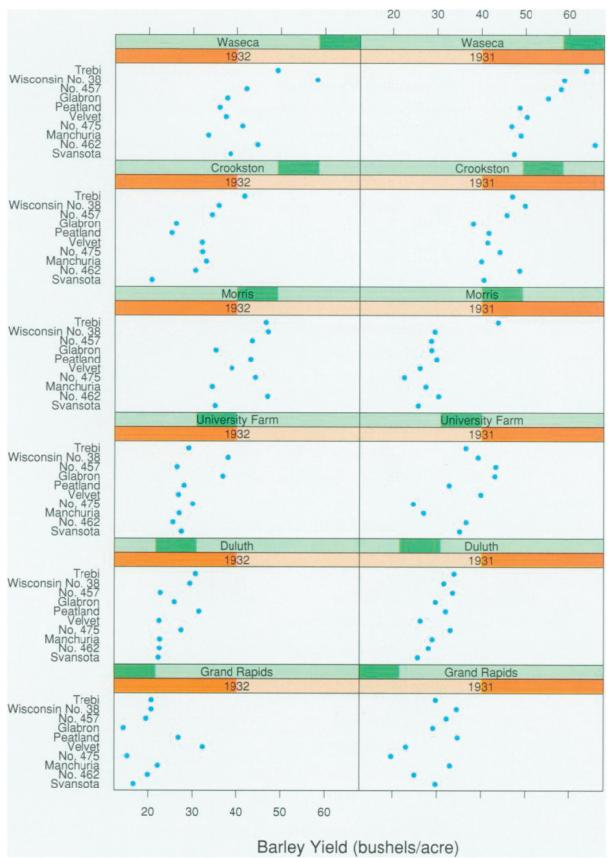  
(a)

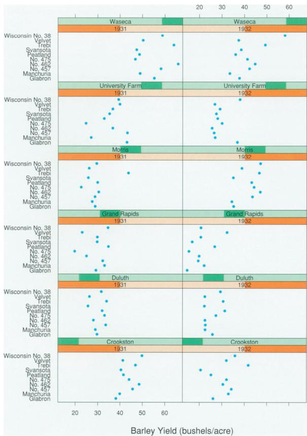  
(b)   
Figure 12.9. Trellis facets the data into a matrix of dot chart views, allowing the user control of partitioning and orderering. (a) With main-effects ordering, the plots are ordered by median values within the plots for the sites, and the shared vertical axis within each plot is ordered by median values within the varieties. The Morris site in the third row is a visible outlier that does not fit the general trends. (b) With a simple alphabetical ordering of plots and axes, no trends are visible, so no outliers can be detected. From [Becker et al. 96, Figures 1 and 3].

hints of outliers versus the trends, since no particular general trend is visible at all. Main-effects ordering is useful because it is a data-driven way to spatially order information so that both general trends and outliers can be spotted.

Figure 12.10 shows another plot with a different structure to further investigate the anomaly. The plots are still partitioned vertically by site, but no further. Both years are thus included within the same view and distinguished from each other by color. The switch in color patterns in the third row shows convincing evidence for the theory that the Morris data is incorrect.

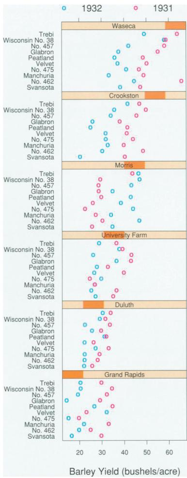  
Figure 12.10. A second Trellis plot combines the years into a single plot with year encoded by color, showing strong evidence of an anomaly in the data. From [Becker et al. 96, Figure 2].

<table><tr><td>System</td><td>Trellis</td></tr><tr><td>What: Data</td><td>Multidimensional table: three categorical key attributes, one quantitative value attribute.</td></tr><tr><td>What: Derived</td><td>Medians for each partition.</td></tr><tr><td>How: Encode</td><td>Dot charts aligned in 2D matrix.</td></tr><tr><td>How: Facet</td><td>Partitioned by any combination of keys into regions.</td></tr></table>

# 12.4.4 Recursive Subdivision

Partitioning can be used in an exploratory way, where the user can reconfigure the display to see different choices of partioning and encoding variables. The Hierarchical Visual Expression (HiVE) system supports this kind of exploration, shown in the examples that follow on a dataset of over one million property transactions in the London area. The categorical attribute of residence type has four levels: flats Flat, attached terrace houses Ter, semidetached houses Semi, and fully detached houses Det. The price attribute is quantitative. The time of sale attribute is provided as a year and a month, for an ordered attribute with hierarchical internal structure. The neighborhood attribute, with 33 levels, is an interesting case that can be considered either as categorical or as spatial.

Figure 12.11(a) shows a view where the top-level partition is a split into four regions based on the type attribute, arranged in a matrix. The next split uses the neighborhood attribute, with the same matrix alignment choice. The final split is by time, again in a matrix ordered with year from left to right and month from top to bottom. At the base level, each square is color coded by the derived attribute of price variation within the group.

This encoding emphasizes that the patterns within the top-level squares, which show the four different house types, are very different. In contrast, the coloring within each second-level square representing a neighborhood is more consistent; that is, houses within the same neighborhood tend to have similar prices.

One way to consider this arrangement is as a recursive subdivision using matrix alignment. Another way to interpret it is that containment is used to indicate the order of partitioning, where each of the higher-level regions contains everything at the next level within it. A third way is as four sets of 33 small multiples each, where each small multiple view shows a heatmap for the neighborhood. The consistent ordering and alignment within the matrices allows easy comparison of the same time cell across the different neighborhood heatmaps.

Figure 12.11(b) shows another configuration of the same dataset with the same basic spatial arrangement but a different order of partitioning. It is partitioned first by neighborhood and then by residence type, with the bottom levels by year and month as in the previous example. The color coding is by a slightly different derived attribute, the average price within the group. In this encoding it is easy to spot expensive neighborhoods, which are the views near the center. It is also easy to see that detached houses, in the lower right corner of each view, are more expensive than the other types.

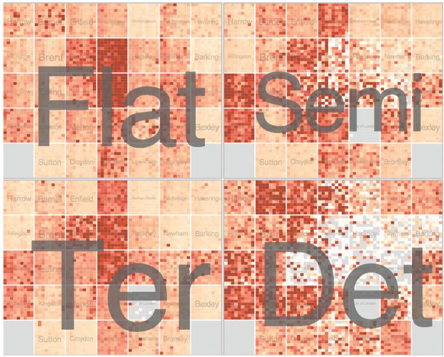  
(a)

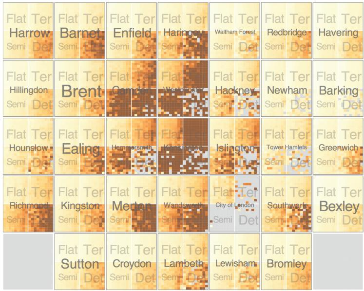  
  
Figure 12.11. The HiVE system supports exploration through different partitioning choices. (a) Recursive matrix alignment where the first split is by the house type attribute, and the second by neighborhood. The lowest levels show time with years as rows and months as columns. (b) Switching the order of the first and second splits shows radically different patterns. From [Slingsby et al. 09, Figures 7b and 2c].

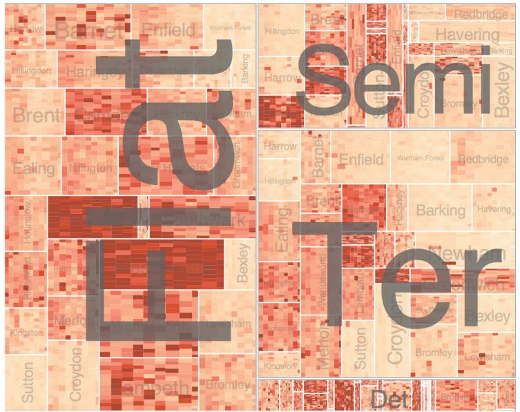  
(a)

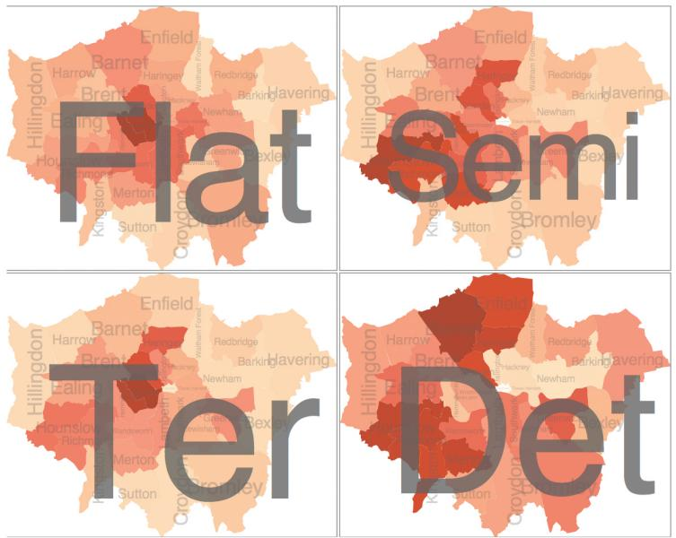  
(b)   
Figure 12.12. HiVE with different arrangements. (a) Sizing regions according to sale counts yields a treemap. (b) Arranging the second-level regions as choropleth maps. From [Slingsby et al. 09, Figures 7a and 7c].

Treemaps are discussed in detail in Section 9.5.   
Choropleth maps are covered in Section 8.3.1.

Figure 12.12(a) shows a third configuration with the same order of partitioning as Figure 12.11(a) but an important difference in the spatial arrangement: the regions created by the recursive subdivision are sized according to the number of sales, yielding variably sized rectangles rather than equally sized squares. This encoding can be interpreted as a treemap, where the tree structure being shown is implicitly derived by the order of partitioning decisions rather than being explicitly provided.

Figure 12.12(b) shows a fourth configuration with a more dramatic change of arrangement: the top level still has rectangular regions, but the next level shows the information geographically using choropleth maps. The structural similarities between heatmaps, treemaps, and choropleth maps are particularly obvious from this progression. All three have color-coded area marks, where the shape results from visual encoding choices for the first two cases and using given spatial geometry in the latter case.

The rough correspondence between the ordering in the rectangular layouts and the geographic view is no coincidence: it arises from using a variant of the treemap idiom that is spatially aware [Wood and Dykes 08], for a hybrid layout that combines aspects of using given spatial data and the design choices for arranging table data.

# 12.5 Superimpose Layers

The superimpose family of design choices pertains to combining multiple layers together by stacking them directly on top of each other in a single composite view. Multiple simple drawings are combined on top of each other into a single shared frame. All of the drawings have the same horizontal and vertical extent and are blended together as if the single drawings are completely transparent where no marks exist.*

A visual layer is simply a set of objects spread out over a region, where the set of objects in each layer is a visually distinguishable group that can be told apart from objects in other layers at a perceptual level. The extent of the region is typically the entire view, so layering multiple views on top of each other is a direct alternative to showing them as separate views juxtaposed side by side.

The design choices for how to superimpose views include: How many layers are used? How are the layers visually distinguished from each other? Is there a small static set of layers that do not change, or are the layers constructed dynamically in response to user selection?

* In graphics terminology, superimpose is an imagespace compositing operation, where the drawings have an identical coordinate system.

A final design choice is how to partition items into layers. For static layers, it is common to approach this question in a similar spirit to partitioning items into views, with heavyweight divisions according to attribute types and semantics. For dynamically constructed layers, the division is often a very lightweight choice driven by the user’s changing selection, rather than being directly tied to the structure of dataset attributes.

# 12.5.1 Visually Distinguishable Layers

One good way to make distinguishable layers is to ensure that each layer uses a different and nonoverlapping range of the visual channels active in the encoding. A common choice is to create two visual layers, a foreground versus a background. With careful design, a few layers can be created. The main limitation of layering is that the number of layers that can be visually distinguished is limited to very few if the layers contain a substantial number of area marks: two layers is definitely achievable, and three layers is possible with careful design. Layering many views is only feasible if each layer contains very little, such as a single line.

The term layer usually implies multiple objects spread through the region spatially intermixed with objects that are not part of that visual layer. However, a single highlighted object could be considered as constituting a very simple visual layer.

# 12.5.2 Static Layers

The design choice of static layers is that all of the layers are displayed simultaneously; the user can choose which to focus on with the selective direction of visual attention. Mapmakers usually design maps in exactly this way.

# Example: Cartographic Layering

Figure 12.13 shows an example that lets the viewer easily shift attention between layers. In Figure 12.13(a), area marks form a background layer, with three different unsaturated colors distinguishing water, parks, and other land. Line marks form a foreground layer for the road network, with main roads encoded by wide lines in a fully saturated red color and small roads with thinner black lines. This layering works well because of the luminance contrast between the elements on different layers, as seen in Figure 12.13(b) [Stone 10].

Checking luminance contrast explicitly is an example of the slogan Get It Right in Black and White discussed in Section 6.9.

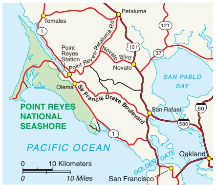

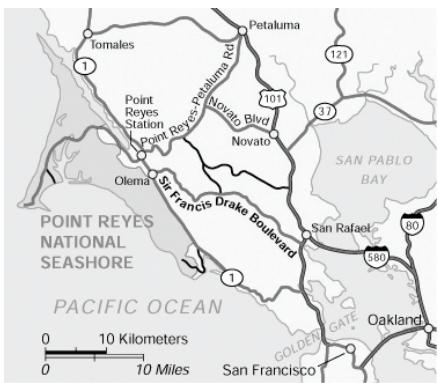  
(b)   
Figure 12.13. Static visual layering in maps. (a) The map layers are created by differences in the hue, saturation, luminance, and size channels on both area and line marks. (b) The grayscale view shows that each layer uses a different range in the luminance channel, providing luminance contrast. From [Stone 10].

<table><tr><td>Idiom</td><td>Cartographic Layering</td></tr><tr><td>What: Data</td><td>Geographic</td></tr><tr><td>How: Encode</td><td>Area marks for regions (water, parks, other land), line marks for roads, categorical colormap.</td></tr><tr><td>How: Facet</td><td>Superimpose: static layers distinguished with color saturation, color luminance, and size channels.</td></tr></table>

# Example: Superimposed Line Charts

Figure 12.14 shows a common use of the superimpose design choice, where several lines representing different data items are superimposed to create combined charts. The alignment of the simple constituent drawings is straightforward: they are all superimposed directly on top of each other so that they share the same frame. This simple superimposition works well because the only mark is a thin line that is mostly disjoint with the other marks. Figure 12.14(a) shows that the amount of occlusion is very small with only three lines. This idiom is still usable with even nearly one dozen items superimposed, as shown in Figure 12.14(b). However, Figure 12.14(c) shows that this approach does not scale to many dozens or hundreds of items.

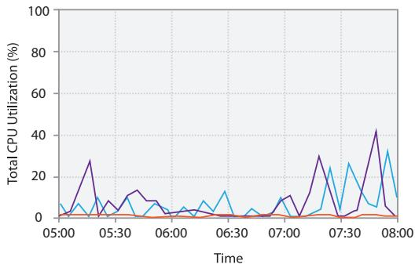

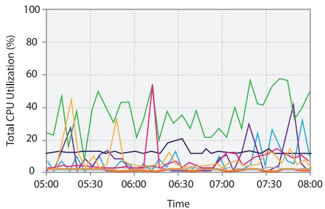

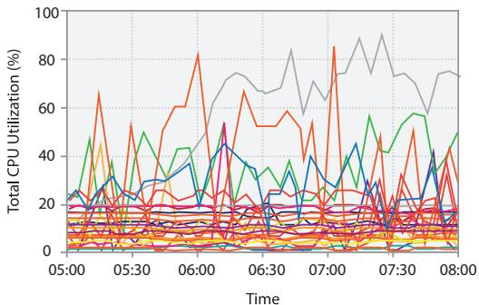  
(c)   
Multiple line charts can be superimposed within the same global frame. (a) A small number of items Figure 12.14.is easily readable. (b) Up to a few dozen lines can still be understood. (c) This technique does not scale to hundreds of items.

<table><tr><td>Idiom</td><td>Superimposed Line Charts</td></tr><tr><td>What: Data</td><td>Multidimensional table: one ordered key attribute (time), one categorical key attribute (machine), one quantitative value attribute (CPU utilization).</td></tr><tr><td>How: Encode</td><td>Line charts, colored by machine attribute.</td></tr><tr><td>How: Facet</td><td>Superimpose: static layers, distinguished with color.</td></tr><tr><td>Scale</td><td>Ordered key attribute: hundreds. Categorical key attribute: one dozen.</td></tr></table>

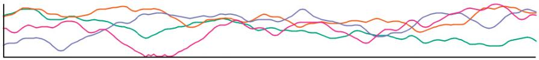  
(a)

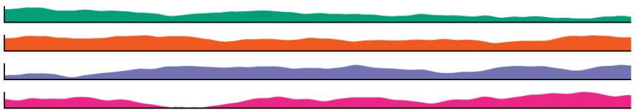  
(b)   
Figure 12.15. Empirical study comparing superimposed line charts to juxtaposed filled-area line charts. (a) Superimposed line charts performed best for tasks carried out within a local visual span. (b) Juxtaposed filled area charts were best for global tasks, especially as the number of time series increased. From [Javed et al. 10, Figures 1 and 2].

Figure 12.15 shows two interfaces from an empirical study: one where line charts are superimposed as layers, and another where juxtaposed small multiples show filled-area charts. The study explicitly considers the trade-offs between less vertical space available for the small multiples and less visual clutter by controlling the screen area to be commensurate: the complete set of small multiples fit within the same area as the single superimposed view. The studied tasks were the local maximum task of finding the time series with the highest value at a specific point in time, the global slope task of finding the time series with the highest increase during the entire time period, and the global discrimination task to check whether values were higher at different time points across the series. The number of time series displayed was either 2, 4, or 8 simultaneously. They proposed the guideline that superimposing layers, as in Figure 12.15(a), is the best choice for comparison within a local visual span, while juxtaposing multiple views, as in Figure 12.15(b), is a better choice for dispersed tasks that require large visual spans, especially as the number of series increases.

# Example: Hierarchical Edge Bundles

Compound networks are defined and discussed in Section 9.5.

A more complex example of static superimposition is the hierarchical edge bundles idiom [Holten 06]. It operates on a compound network, a combination of a base network and a cluster hierarchy that groups its nodes.

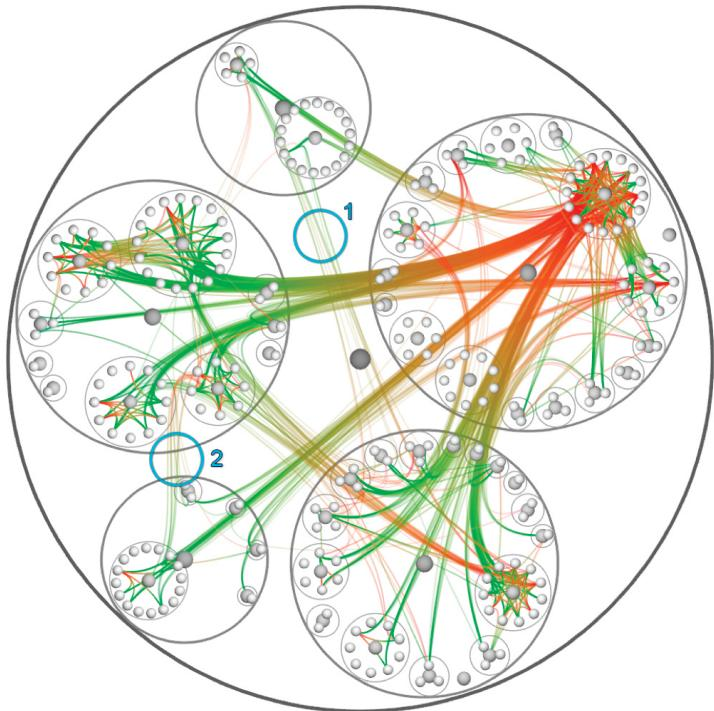  
Figure 12.16. The hierarchical edge bundles idiom shows a compound network in three layers: the tree structure in back with containment circle marks, the red– green graph edges with connection marks in a middle layer, and the graph nodes in a front layer. From [Holten 06, Figure 13].

The software engineering example in Figure 12.16 shows the call graph network, namely, which functions call what other functions in a software system, in conjunction with the hierarchical structure of the source code in which these function calls are defined.

The idiom creates two easily distinguishable visual layers through the use of color: the source code hierarchy layer is gray, as opposed to the semitransparent red–green layer with the call graph network edges. The gray hierarchical structure is shown with circular containment marks, in contrast to the colored connection link marks for the network edges. The idiom’s name comes from bundling the network edges together to reduce occlusion with the underlying tree structure, just like physical cables can be bundled together with cable ties to keep them tidy. Without bundling, most of the background layer structure would be very difficult to see. The use of layering is also an important aspect of the idiom; if all of the network edges were also gray and opaque, the resulting image would be much

harder to interpret. The idiom does not rely on a specific spatial layout for the tree; it can be applied to many different tree layouts.

<table><tr><td>Idiom</td><td>Hierarchical Edge Bundles</td></tr><tr><td>What: Data</td><td>Compound graph: network, hierarchy whose leaves are nodes in network.</td></tr><tr><td>How: Encode</td><td>Back layer shows hierarchy with containment marks colored gray, middle layer shows network links colored red–green, front layer shows nodes colored gray.</td></tr><tr><td>How: Facet</td><td>Superimpose static layers, distinguished with color.</td></tr></table>

Layering is often carried out with modern graphics hardware to manage rendering with planes oriented in the screen plane that are blended together in the correct order from back to front, as if they were at slightly different 3D depths. This approach is one of the many ways to exploit modern graphics hardware to create complex drawings that have the spirit of 2D drawings, rather than true 3D scenes with full perspective.

# 12.5.3 Dynamic Layers

With dynamic layers, a layer with different salience than the rest of the view is constructed interactively, typically in response to user selection. The number of possible layers can be huge, since they are constructed on the fly rather than chosen from a very small set of possibilities that must be simultaneously visually distinguishable.

The Cerebral system, shown also in Figure 12.5, uses the design choice of dynamic layering. Figure 12.17 shows the dynamic creation of a foreground layer that updates constantly as the user moves the cursor. When the cursor is directly over a node, the foreground layer shows its one-hop neighborhood: all of the nodes in the network that are a single topological hop away from it, plus the links to them from the target node. The one-hop neighborhood is visually emphasized with a distinctive fully saturated red to create a foreground layer that is visually distinct from the background layer, which has only low-saturation colors. The marks in the foreground layer also have larger linewidth.

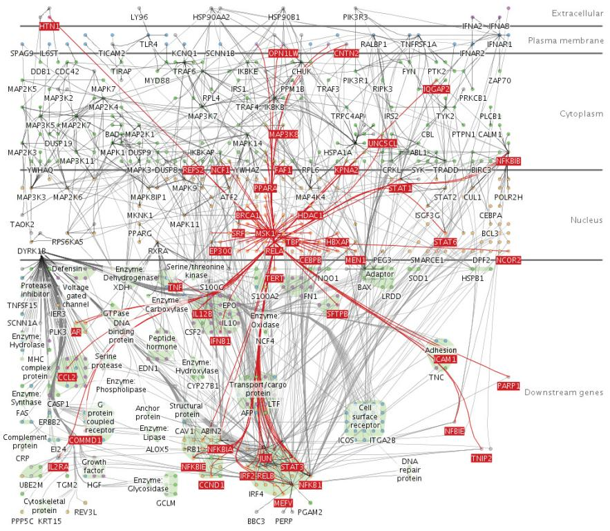  
Figure 12.17. Cerebral dynamically creates a foreground visual layer of all nodes one topological hop away in the network from the node underneath the cursor. From [Barsky et al. 07, Figure 1].

# 12.6 Further Reading

The Big Picture An extensive survey discusses many idioms that use the design choices of partitioning into multiple views, superimposing layers, changing the viewpoint through navigation, and embedding focus into context, and includes an assessment of the empirical evidence on their strengths and weaknesses [Cockburn et al. 08]. A monograph also presents an extensive discussion of the trade-offs between these design choices and guidelines for when and how to use them [Lam and Munzner 10]. A more specific paper quantifies costs and benefits of multiple views versus navigation within a single view for visual comparisons at multiple scales [Plumlee and Ware 06].

A thoughtful discussion of the design space of “composite vis” proposes the categories of juxtapose views side by side, superimpose views on top of each other, overload views by embedding, nest one view inside another, and integrate views together with explicit link marks between them [Javed and Elmqvist 12]. Another great discussion of approaches to comparison identifies juxtapose, superimpose and encode with derived data [Gleicher et al. 11].

Coordinating Juxtaposed Views A concise set of guidelines on designing multiple-view systems appears in an early paper [Baldonado et al. 00], and many multiple-view idioms are discussed in a later surveys [Roberts 07]. The Improvise toolkit supports many forms of linking between views [Weaver 04], and followon work has explored in depth the implications of designing coordinated multiple view systems [Weaver 10].

Partitioning The HiVE system supports flexible subdivision of attribute hierarchies with the combination of interactive controls and a command language, allowing systematic exploration of the design space of partitioning [Slingsby et al. 09], with spatially ordered treemaps as one of the layout options [Wood and Dykes 08].

Glyphs A recent state of the art report on glyphs is an excellent place to start with further reading [Borgo et al. 13]; another good overview of glyph design in general appears in a somewhat earlier handbook chapter [Ward 08]. The complex and subtle issues in the design of both macroglyphs and microglyphs are discussed extensively Chapters 5 and 6 of Ware’s vis textbook [Ware 13]. Glyph placement in particular is covered a journal article [Ward 02]. The space of possible glyph designs is discussed from a quite different point of view in a design study focused on biological experiment workflows [Maguire et al. 12]. Empirical experiments on visual channel use in glyph design are discussed in a paper on color enhanced star plot glyphs [Klippel et al. 09].

Linked Highlighting Linked highlighting was proposed at Bell Labs, where it was called brushing [Becker and Cleveland 87]; a chapter published 20 years later contains an in-depth discussion following up these ideas [Wills 08].

Superimposing Layers A concise and very readable blog post discusses layer design and luminance constrast [Stone 10]. An-

other very readable article discusses the benefits of superimposed dot charts compared to grouped bar charts [Robbins 06].

# Reducing I tems and Attributes

# Reduce

  
$\circled{ \div}$ Filter   
Items

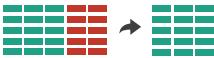  
Attributes   
$\textcircled{ \div}$ Aggregate

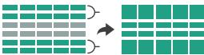  
Items

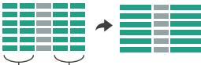  
Attributes

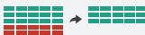  
$\circled{ \div}$ Filter

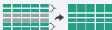  
Aggregate

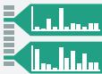  
Embed   
Figure 13.1. Design choices for reducing (or increasing) the amount of data items and attributes to show.

