# Chapter 13

# Reduce Items and Attributes

# 13.1 The Big Picture

Figure 13.1 shows the set of design choices for reducing—or increasing—what is shown at once within a view. Filtering simply eliminates elements, whereas aggregation combines many together. Either choice can be applied to both items or attributes.

# 13.2 Why Reduce?

Reduction is one of five major strategies for managing complexity in visualizations; as pointed out before, these five choices are not mutually exclusive, and various combinations of them are common.

Typically, static data reduction idioms only reduce what is shown, as the name suggests. However, in the dynamic case, the outcome of changing a parameter or a choice may be an increase in the number of visible elements. Thus, many of the idioms covered in this chapter are bidirectional: they may serve to either reduce or increase the number of visible elements. Nevertheless, they are all named after the reduction action for brevity.

Reducing the amount of data shown in a view is an obvious way to reduce its visual complexity. Of course, the devil is in the details, where the challenge is to minimize the chances that information important to the task is hidden from the user. Reduction can be applied to both items and attributes; the word element will be used to refer to either items or attributes when design choices that apply to both are discussed. Filtering simply eliminates elements, whereas aggregation creates a single new element that stands in for multiple others that it replaces. It’s useful to consider the tradeoffs between these two alternatives explicitly when making design choices: filtering is very straightforward for users to understand, and typically also to compute. However, people tend to have an

‣ Deriving new data is covered in Chapter 3, changing a view over time is covered in Chapter 11, faceting data into multiple views is covered in Chapter 12, and embedding focus and contextual information together within one view is covered in Chapter 14.

“out of sight, out of mind” mentality about missing information: they tend to forget to take into account elements that have been filtered out, even when their absence is the result of quite recent actions. Aggregation can be somewhat safer from a cognitive point of view because the stand-in element is designed to convey information about the entire set of elements that it replaces. However, by definition, it cannot convey all omitted information; the challenge with aggregation is how and what to summarize in a way that matches well with the dataset and task.

# 13.3 Filter

The design choice of filtering is a straightforward way to reduce the number of elements shown: some elements are simply eliminated. Filtering can be applied to both items and attributes. A straightforward approach to filtering is to allow the user to select one or more ranges of interest in one or more of the elements. The range might mean what to show or what to leave out.

The idea of filtering is very obvious; the challenge comes in designing a vis system where filtering can be used to effectively explore a dataset. Consider the simple case of filtering the set of items according to their values for a single quantitative attribute. The goal is to select a range within it in terms of minimum and maximum numeric values and eliminate the items whose values for that attribute fall outside of the range. From the programmer’s point of view, a very simple way to support this functionality would be to simply have the user enter two numbers, a minimum and maximum value. From the user’s point of view, this approach is very difficult to use: how on earth do they know what numbers to type? After they type, how do they know whether that choice is correct? When your goal is to support exploration of potentially unknown datasets, you cannot assume that the users already know these kinds of answers.

In an interactive vis context, filtering is often accomplished through dynamic queries, where there is a tightly coupled loop between visual encoding and interaction, so that the user can immediately see the results of the intervention. In this design choice, a display showing a visual encoding of the dataset is used in conjunction with controls that support direct interaction, so that the display updates immediately when the user changes a setting. Often these controls are standard graphical user interface widgets such as sliders, buttons, comboboxes, and text fields. Many ex-

tensions of off-the-shelf widgets have also been proposed to better support the needs of interactive vis.

# 13.3.1 Item Filtering

In item filtering, the goal is to eliminate items based on their values with respect to specific attributes. Fewer items are shown, but the number of attributes shown does not change.

# Example: FilmFinder

Figure 13.2 shows the FilmFinder system [Ahlberg and Shneiderman 94] for exploring a movie database. The dataset is a table with nine value attributes: genre, year made, title, actors, actresses, directors, rating, popularity, and length. The visual encoding features an interactive scatterplot where the items are movies color coded by genre, with scatterplot axes of year made versus movie popularity; Figure 13.2(a) shows the full dataset. The interaction design features filtering, with immediate update of the visual display to filter out or add back items as sliders are moved and buttons are pressed. The visual encoding adapts to the number of items to display; the marks representing movies are automatically enlarged and labeled when enough of the dataset has been filtered away that there is enough room to do so, as in Figure 13.2(b). The system uses multiform overview–detail views, where clicking on any mark brings up a popup detail view with more information about that movie, as in Figure 13.2(c).

FilmFinder is a specific example of the general dynamic queries approach, where browsing using tightly coupled visual encoding and interaction is an alternative to searching by running queries, as for example with a database. All of the items in a database are shown at the start of a session to provide an overview, and direct manipulation of interface widgets replaces reformulating new queries. This approach is well suited to browsing, as opposed to a search where the user must formulate an explicit query that might return far too many items, or none at all.

Figure 13.2 shows the use of two augmented slider types, a dual slider for movie length that allows the user to select both a minimum and maximum value, and several alpha sliders that are tuned for selection with text strings rather than numbers.

<table><tr><td>System</td><td>FilmFinder</td></tr><tr><td>What: Data</td><td>Table: nine value attributes.</td></tr><tr><td>How: Encode</td><td>Scatterplot; detail view with text/images.</td></tr><tr><td>How: Facet</td><td>Multiform, overview-detail.</td></tr><tr><td>How: Reduce</td><td>Item filtering.</td></tr></table>

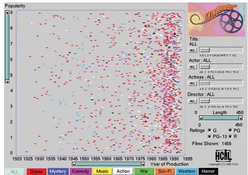  
(a)

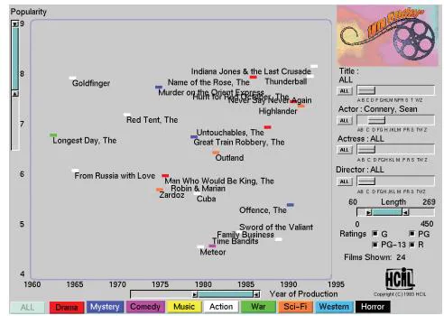

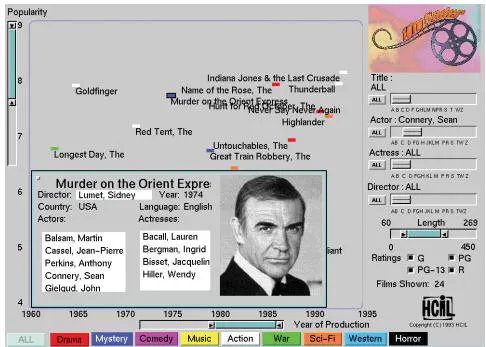  
(c)   
Figure 13.2. FilmFinder features tightly coupled interactive filtering, where the result of moving sliders and pressing buttons is immediately reflected in the visual encoding. (a) Exploration begins with an overview of all movies in the dataset. (b) Moving the actor slider to select Sean Connery filters out most of the other movies, leaving enough room to draw labels. (c) Clicking on the mark representing a movie brings up a detail view. From [Ahlberg and Shneiderman 94, Color Plates 1, 2, and 3].

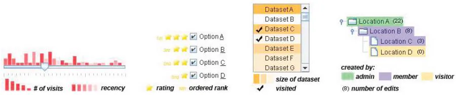  
Figure 13.3. The scented widget idiom adds visual encoding information directly to standard graphical widgets to make filtering possible with high information density displays. From [Willett et al. 07, Figure 2].

Standard widgets for filtering controls can be augmented by concisely visually encoding information about the dataset, but in the part of the screen normally thought of as the control panel rather than a separate display area. The idea is to do so while using no or minimal additional screen real estate, in order to create displays that have high information density. These augmented widgets are called scented widgets [Willett et al. 07], alluding to the idea of information scent: cues that help a searcher decide whether there is value in drilling down further into a particular information source, versus looking elsewhere [Pirolli 07]. Figure 13.3 shows several examples. One way to add information is by inserting a concise statistical graphic, such as a bar or line chart. Another choice is by inserting icons or text labels. A third choice is to treat some part of the existing widget as a mark and encode more information into that region using visual channels such as hue, saturation, and opacity.

The Improvise system shown in Figure 12.7 is another example of the use of filtering. The checkbox list view in the lower middle part of the screen is a simple filter controlling whether various geographic features are shown. The multiform microarray explorer in Figure 12.4 also supports several kinds of filtering, with simple range sliders and a more complex view that allows range selection on top of line charts of time-series data. The selected range in the line chart view acts as a filter for the scatterplot view.

# 13.3.2 Attribute Filtering

Attributes can also be filtered. With attribute filtering, the goal is to eliminate attributes rather than items; that is, to show the same number of items, but fewer attributes for each item.

* Many idioms for attribute filtering and aggregation use the alternative term dimension rather than attribute in their names.   
‣ For more on star plots, see Section 7.6.3.

Item filtering and attribute filtering can be combined, with the result of showing both fewer items and fewer attributes.

# Example: DOSFA

Figure 13.4 shows an example of the Dimensional Ordering, Spacing, and Filtering Approach (DOSFA) idiom [Yang et al. 03a]. As the name suggests, the idiom features attribute filtering.* Figure 13.4 shows DOSFA on a dataset of 215 attributes representing word counts and 298 points representing documents in a collection of medical abstracts. DOSFA can be used with many visual encoding approaches; this figure shows it in use with star plots. In Figure 13.4(a) the plot axes are so densely packed that little structure can be seen. Figure 13.4(b) shows the plots after the dimensions are ordered by similarity and filtered by both similarity and importance thresholds. The filtered display does show clear visual patterns.

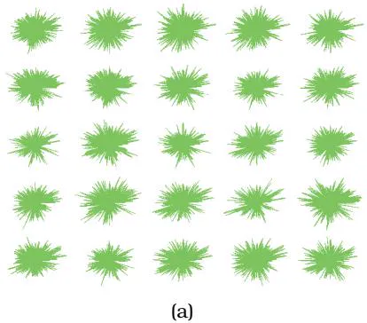

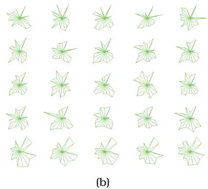  
Figure 13.4. The DOSFA idiom shown on star glyphs with a medical records dataset of 215 dimensions and 298 points. (a) The full dataset is so dense that patterns cannot be seen. (b) After ordering on similarity and filtering on both similarity and importance, the star glyphs show structure. From [Yang et al. 03a, Figures 3a and 3d].

<table><tr><td>System</td><td>DOSFA</td></tr><tr><td>What: Data</td><td>Table: many value attributes.</td></tr><tr><td>How: Encode</td><td>Star plots.</td></tr><tr><td>How: Facet</td><td>Small multiples with matrix alignment.</td></tr><tr><td>How: Reduce</td><td>Attribute filtering.</td></tr></table>

Attribute filtering is often used in conjunction with attribute ordering.* If attributes can be ordered according to a derived attribute that measures the similarity between them, then all of the high-scoring ones or low-scoring ones can be easily filtered out interactively. A similarity measure for an attribute creates a quantitative or ordered value for each attribute based on all of the data item values for that attribute.* One approach is to calculate the variance of an attribute: to what extent the values within that attribute are similar to or different from each other. There are many ways to calculate a similarity measure between attributes; some focus on global similarity, and others search for partial matches [Ankerst et al. 98].

# 13.4 Aggregate

The other major reduction design choice is aggregation, so that a group of elements is represented by a new derived element that stands in for the entire group. Elements are merged together with aggregation, as opposed to eliminated completely with filtering. Aggregation and filtering can be used in conjunction with each other. As with filtering, aggregation can be used for both items and attributes.

Aggregation typically involves the use of a derived attribute. A very simple example is computing an average; the four other basic aggregation operators are minimum, maximum, count, and sum. However, these simple operators alone are rarely an adequate solution. The challenge of aggregation is to avoid eliminating the interesting signals in the dataset in the process of summarization. The Anscombe’s Quartet example shown in Figure 1.3 exactly illustrates the difficulty of adequately summarizing data, and thus the limits of static visual encoding idioms that use aggregation. Aggregation is nevertheless a powerful design choice, particularly when used within interactive idioms where the user can change the level of aggregation on the fly to inspect the dataset at different levels of detail.

# 13.4.1 Item Aggregation

The most straightforward use of item aggregation is within static visual encoding idioms; its full power and flexibility can be harnessed by interactive idioms where the view dynamically changes.

* A synonym for attribute ordering is dimensional ordering.

* A synonym for similarity measure is similarity metric. Although I am combining the ideas of measure and metric here for the purposes of this discussion, in many specialized contexts such as mathematics and business analysis they are carefully distinguished with different definitions.

‣ An example of a complex combination of both aggregation and filtering is cartographic generalization, discussed in Section 8.3.1.

# Example: Histograms

The idiom of histograms shows the distribution of items within an original attribute. Figure 13.5 shows a histogram of the distribution of weights for all of the cats in a neighborhood, binned into 5-pound blocks. The range of the original attribute is partitioned into bins, and the number of items that fall into each bin is computed and saved as a derived ordered attribute. The visual encoding of a histogram is very similar to bar charts, with a line mark that uses spatial position in one direction and the bins distributed along an axis in the other direction. One difference is that histograms are sometimes shown without space between the bars to visually imply continuity, whereas bar charts conversely have spaces between the bars to imply discretization. Despite their visual similarity, histograms are very different than bar charts. They do not show the original table directly; rather, they are an example of an aggregation idiom that shows a derived table that is more concise than the original dataset. The number of bins in the histogram can be chosen independently of the number of items in the dataset. The choice of bin size is crucial and tricky: a histogram can look quite different depending on the discretization chosen. One possible solution to the problem is to compute the number of bins based on dataset characteristics; another is to provide the user with controls to easily change the number of bins interactively, to see how the histogram changes.

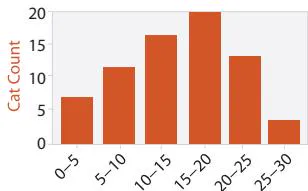  
Weight Class (lbs)   
Figure 13.5. The histogram idiom aggregates an arbitrary number of items into a concise representation of their distribution.

<table><tr><td>Idiom</td><td>Histograms</td></tr><tr><td>What: Data</td><td>Table: one quantitative value attribute.</td></tr><tr><td>What: Derived</td><td>Derived table: one derived ordered key attribute (bin), one derived quantitative value attribute (item count per bin).</td></tr><tr><td>How: Encode</td><td>Rectilinear layout. Line mark with aligned position to express derived value attribute. Position: key attribute.</td></tr></table>

# Example: Continuous Scatterplots

Another example of aggregation is continuous scatterplots, where the problem of occlusion on scatterplots is solved by plotting an aggregate value at each pixel rather than drawing every single item as an individual point. Occlusion can be a major readability problem with scatterplots, because many dots could be overplotted on the same location. Size coding exacerbates the problem, as does the use of text labels. Continuous scatterplots use color coding at each pixel to indicate the density of overplotting, often in conjunction with transparency. Conceptually, this approach uses a derived attribute, overplot density, which can be calculated after the layout is computed. Practically, many hardware acceleration techniques sidestep the need to do this calculation explicitly.

Figure 13.6 shows a continuous scatterplot of a tornado air-flow dataset, with the magnitude of the velocity on the horizontal and the z-direction velocity on the vertical. The density is shown with a log-scale sequential colormap with monotonically increasing luminance. It starts with dark blues at the low end, continues with reds in the middle, and has yellows and whites at the high end.

Scatterplots began as a idiom for discrete, categorical data. They have been generalized to a mathematical framework of density functions for continuous data, giving rise to continuous scatterplots in the 2D case

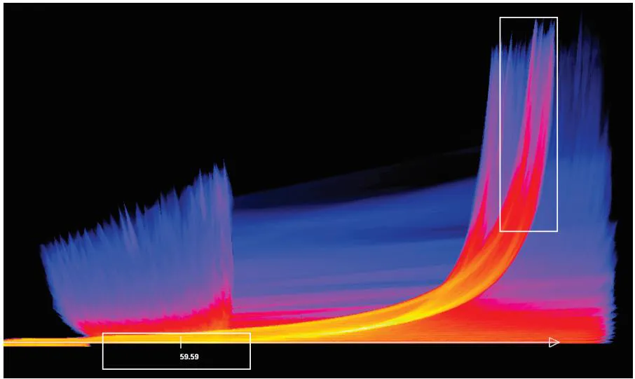  
Figure 13.6. The continuous scatterplot idiom uses color to show the density at each location, solving the problem of occlusion from overplotting and allowing scalability to large datasets. From [Bachthaler and Weiskopf 08, Figure 9].

and continuous histograms in the 1D case [Bachthaler and Weiskopf 08]. Continuous scatterplots use a dense, space-filling 2D matrix alignment, where each pixel is given a different color. Although the idiom of continuous scatterplots has a similar name to the idiom of scatterplots, analysis via the framework of design choices shows that the approach is in fact very different.

<table><tr><td>Idiom</td><td>Continuous Scatterplots</td></tr><tr><td>What: Data</td><td>Table: two quantitative value attributes.</td></tr><tr><td>What: Derived</td><td>Derived table: two ordered key attributes (x,y pixel locations), one quantitative attribute (overplot density).</td></tr><tr><td>How: Encode</td><td>Dense space-filling 2D matrix alignment, sequential categorical hue + ordered luminance colormap.</td></tr><tr><td>How: Reduce</td><td>Item aggregation.</td></tr></table>

# Example: Boxplot Charts

The visually concise idiom of boxplots shows an aggregate statistical summary of all the values that occur within the distribution of a single quantitative attribute. It uses five derived variables carefully chosen to provide information about the attribute’s distribution: the median $[ 5 0 \%$ point), the lower and upper quartiles $( 2 5 \%$ and $7 5 \%$ points), and the upper and lower fences (chosen values near the extremes, beyond which points should be counted as outliers). Figure 13.7(a) shows the visual encoding of these five numbers using a simple glyph that relies on vertical spatial position. The eponymous box stretches between the lower and upper quartiles and has a horizontal line at the median. The whiskers are vertical lines that extend from the core box to the fences marked with horizontal lines.* Outliers beyond the range of the chosen fence cutoff are shown explicitly as discrete dots, just as in scatterplots or dot charts.

A boxplot is similar in spirit to an individual bar in a bar chart in that only a single spatial axis is used to visually encode data, but boxplots show five numbers through the use of a glyph rather than the single number encoded by the linear mark in a bar chart. A boxplot chart features multiple boxplots within a single shared frame to contrast different attribute distributions, just as bar charts show multiple bars along the second axis. In Figure 13.7, the quantitative value attribute is mapped to the vertical axis and the categorical key attribute to the horizontal one.

The boxplot can be considered an item reduction idiom that provides an aggregate view of a distribution through the use of derived data. Box-

* Boxplots are also known as box-and-whisker diagrams.

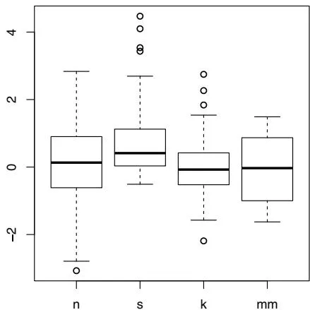  
(a)

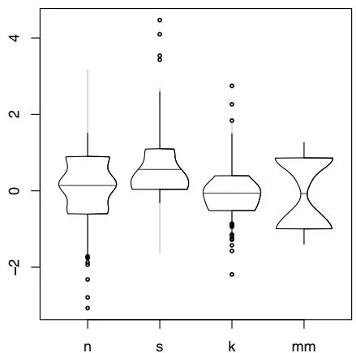  
(b)   
Figure 13.7. The boxplot is an idiom presenting summary statistics for the distribution of a quantitative attribute, using five derived values. These plots illustrate four kinds of distributions: normal (n), skewed (s), peaked (k), and multimodal (mm). (a) Standard box plots. (b) Vase plots, which use horizontal spatial position to show density directly. From [Wickham and Stryjewski 12, Figure 5].

plots are highly scalable in terms of aggregating the target quantitative attribute from what could be an arbitrarily large set of values down to five numbers; for example, it could easily handle from thousands to millions of values within that attribute. The spatial encoding of these five numbers along the central axis requires only a moderate amount of screen space, since we have high visual acuity with spatial position. Each boxplot requires only a very small amount of screen space along the secondary axis, leading to a high level of scalability in terms of the number of categorical values that can be accommodated in a boxplot chart; roughly hundreds.

Boxplots directly show the spread, namely, the degree of dispersion, with the extent of the box. They show the skew of the distribution compared with a normal distribution with the peak at the center by the asymmetry between the top and bottom sections of the box. Standard boxplots are designed to handle unimodal data, where there is only one value that occurs the most frequently. There are many variants of boxplots that augment the basic visual encoding with more information. Figure 13.7(b) shows a variable-width variant called the vase plot that uses an additional spatial dimension within the glyph by altering the width of the central box according to the density, allowing a visual check if the distribution is instead multimodal, with multiple peaks. The variable-width variants require more screen space along the secondary axis than the simpler version, in an example of the classic cost–benefit trade-off where conveying more information requires more room.

<table><tr><td>Idiom</td><td>Boxplot Charts</td></tr><tr><td>What: Data</td><td>Table: many quantitative value attributes.</td></tr><tr><td>What: Derived</td><td>Five quantitative attributes for each original attribute, representing its distribution.</td></tr><tr><td>Why: Tasks</td><td>Characterize distribution; find outliers, extremes, averages; identify skew.</td></tr><tr><td>How: Encode</td><td>One glyph per original attribute expressing derived attribute values using vertical spatial position, with 1D list alignment of glyphs into separated with horizontal spatial position.</td></tr><tr><td>How: Reduce</td><td>Item aggregation.</td></tr><tr><td>Scale</td><td>Items: unlimited. Attributes: dozens.</td></tr></table>

Many of the interesting uses of aggregation in vis involve dynamically changing sets: the mapping between individual items and the aggregated visual mark changes on the fly. The simple case is to allow the user to explicitly request aggregation and deaggregation of item sets. More sophisticated approaches do these operations automatically as a result of higher-level interaction and navigation, usually based on spatial proximity.

# Example: SolarPlot

Figure 13.8 shows the example of SolarPlot, a radial histogram with an interactively controllable aggregation level [Chuah 98]. The user directly manipulates the size of the base circle that is the radial axis of the chart. This change of radius indirectly changes the number of available histogram bins, and thus the aggregation level. Like all histograms, the SolarPlot aggregation operator is count: the height of the bar represents the number of items in the set. The dataset shown is ticket sales over time, starting from the base of the circle and progressing counterclockwise to cover 30 years in total. The small circle in Figure 13.8(a) is heavily aggregated. It does show an increase in ticket sales over the years. The larger circle in Figure 13.8(b) is less aggregated, and seasonal patterns within each year can be distinguished.

<table><tr><td>Idiom</td><td>SolarPlot</td></tr><tr><td>What: Data</td><td>Table: one quantitative attribute.</td></tr><tr><td>What: Derived</td><td>Derived table: one derived ordered key attribute (bin), one derived quantitative value attribute (item</td></tr></table>

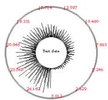  
(a)

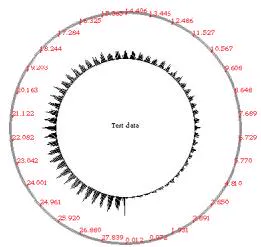  
  
Figure 13.8. The SolarPlot circular histogram idiom provides indirect control of aggregation level by changing the circle size. (a) The small circle shows the increase in ticket sales over time. (b) Enlarging the circle shows seasonal patterns in addition to the gradual increase. From [Chuah 98, Figures 1 and 2].

<table><tr><td></td><td>count per bin). Number of bins interactively controlled.</td></tr><tr><td>How: Encode</td><td>Radial layout, line marks. Line length: express derived value attribute; angle: key attribute.</td></tr><tr><td>How: Reduce</td><td>Item aggregation.</td></tr><tr><td>Scale</td><td>Original items: unlimited. Derived bins: proportional to screen space allocated.</td></tr></table>

The general design choice of hierarchical aggregation is to construct the derived data of a hierarchical clustering of items in the original dataset and allow the user to interactively control the level of detail to show based on this hierarchy. There are many specific examples of idioms that use variants of this design choice. The cluster–calendar system in Figure 6.7 is one example of hierarchical aggregation. Another is hierarchical parallel coordinates.

# Example: Hierarchical Parallel Coordinates

The idiom of hierarchical parallel coordinates [Fua et al. 99] uses interactively controlled aggregation as a design choice to increase the scalability of the basic parallel coordinates visual encoding to hundreds of thousands of items. The dataset is transformed by computing derived data: a hierarchical clustering of the items. Several statistics about each cluster are computed, including the number of points it contains; the mean, minimum, and maximum values; and the depth in the hierarchy. A cluster is represented by a band of varying width and opacity, where the mean is in the middle and width at each axis depends on the minimum and

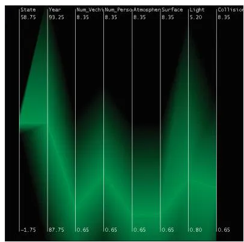

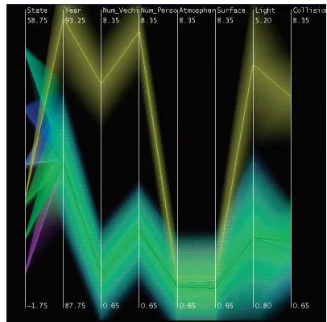  
(b)

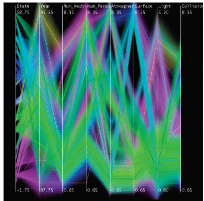  
(c)   
Figure 13.9. Hierarchical parallel coordinates provide multiple levels of detail. (a) The single top cluster has large extent. (b) When several clusters are shown, each has a smaller extent. (c) When many clusters are shown, the proximity-based coloring helps them remain distinguishable from each other. From [Fua et al. 99, Figure 4].

maximum item values for that attribute within the cluster. Thus, in the limit, a cluster of a single item is shown by a single line, just as with the original idiom. The cluster bands are colored according to their proximity in the cluster hierarchy, so that clusters far away from each other have very different colors.

The level of detail displayed at a global level for the entire dataset can be interactively controlled by the user using a single slider. The parameter controlled by that slider is again a derived variable that varies the aggregate level of detail shown in a smooth and continuous way. Figure 13.9 shows a dataset with eight attributes and 230,000 items at different levels of detail. Figure 13.9(a) is the highest-level overview showing the single top-level cluster, with very broad bands of green. Figure 13.9(b) is the midlevel view showing several clusters, where the extents of the tan cluster are clearly distinguishable from the now-smaller green one. Figure 13.9(c) is a more detailed view with dozens of clusters that have tighter bands; the proximity-based coloring mitigates the effect of occlusion.

<table><tr><td>Idiom</td><td>Hierarchical Parallel Coordinates</td></tr><tr><td>What: Data</td><td>Table.</td></tr><tr><td>What: Derived</td><td>Cluster hierarchy atop original table of items. Five per-cluster attributes: count, mean, min, max, depth.</td></tr><tr><td>How: Encode</td><td>Parallel coordinates. Color clusters by proximity in hierarchy.</td></tr><tr><td>How: Reduce</td><td>Interactive item aggregation to change level of detail.</td></tr><tr><td>Scale</td><td>Items: 10,000–100,000. Clusters: one dozen.</td></tr></table>

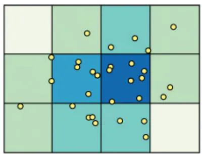  
(a)

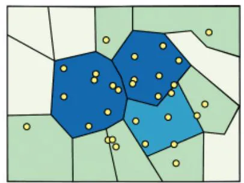  
(b)

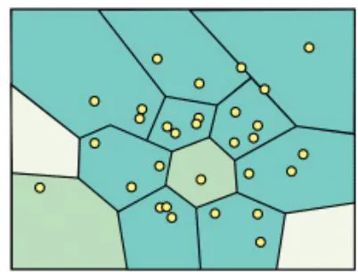  
(c)   
Figure 13.10. Modifiable Areal Unit Problem (MAUP) example, showing how different boundaries for aggregation regions lead to very different visual patterns on choropleth maps. (a) Central region is high density. (b) Central region is medium density. (c) Central region is low density. From http://www.e-education.psu.edu/geog486/l4 p7.html, Figure 4.cg.6.

# 13.4.2 Spatial Aggregation

The challenge of spatial aggregation is to take the spatial nature of data into account correctly when aggregating it. In the cartography literature, the modifiable areal unit problem (MAUP) is a major concern: changing the boundaries of the regions used to analyze data can yield dramatically different results. Even if the number of units and their size does not change, any change of spatial grouping can lead to a very significant change in analysis results. Figure 13.10 shows an example, where the same location near the middle of the map has a different density level depending on the region boundaries: high in Figure 13.10(a), medium in Figure 13.10(b), and low in Figure 13.10(c). Moreover, changing the scale of the units also leads to different results. The problem of gerrymandering, where the boundaries of voting districts are manipulated for political gain, is the instance of the MAUP best known to the general public.

# Example: Geographically Weighted Boxplots

The geowigs family of idioms, namely, geographically weighted interactive graphics, provides sophisticated support for spatial aggregation using geographically weighted regression and geographically weighted summary statistics [Dykes and Brunsdon 07]. Figure 13.11 shows a multivariate geographic dataset used to explore social issues in 19th century France. The six quantitative attributes are population per crime against persons $( x l )$ , population per crime against property $( x 2 )$ , percentage who can read

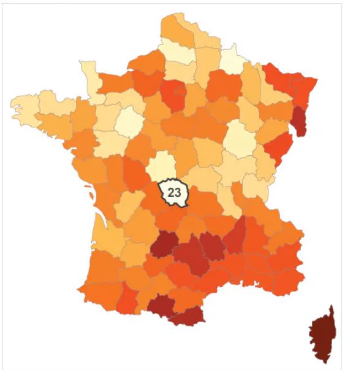  
(a)

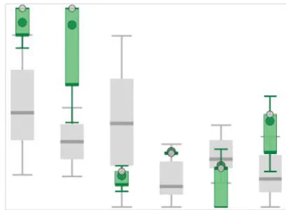

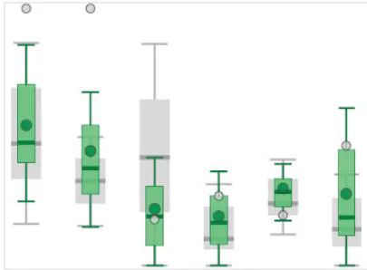  
(b)

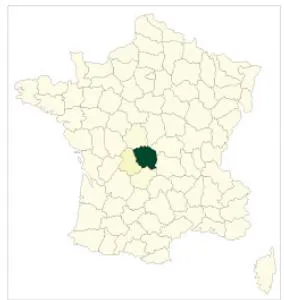

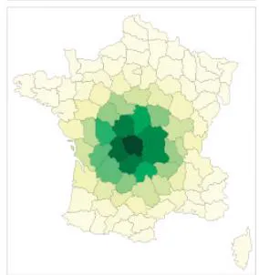  
(c)

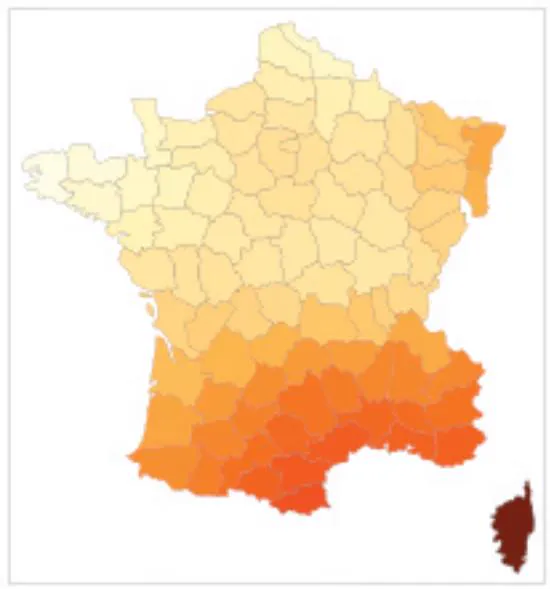  
(d)   
Figure 13.11. Geowigs are geographically weighted interactive graphics. (a) A choropleth map showing attribute x1. (b) The set of gw-boxplots for all six attributes at two scales. (c) Weighting maps showing the scales: local and larger. (d) A gw-mean map at the larger scale. From [Dykes and Brunsdon 07, Figures 7a and 2].

and write $( x 3 )$ , donations to the poor $( x 4 )$ , population per illegitimate birth $( x 5 )$ , and population per suicide $( x 6 )$ .

Figure 13.11(a) shows a standard choropleth map colored by personal crime attribute $x l$ , with the interactively selected region Creuse (23) highlighted. Figure 13.11(b) shows gw-boxplots for all six attributes, at two scales. The gw-boxplot, a geographically weighted boxplot geowig, supports comparison between the global distribution and the currently chosen spatial scale using the design choice of superimposed layers. The global statistical distribution is encoded by the gray boxplot in the background, and the local statistics for the interactively chosen scale are encoded by a foreground boxplot in green. Figure 13.11(c) shows the weighting maps for the currently chosen scale of each gw-boxplot set: very local on top, and a larger scale on the bottom. Figure 13.11(d) shows a gw-mean map, a geographically weighted mean geowig, weighted according to the same larger scale.

At the local level, the first $x l$ attribute is clearly an outlier in the gwboxplot, matching that region’s pale color in the choropleth map. When weighted according to a larger scale, that attribute’s distribution is close to the global one in both the boxplot, matching the mid-range color in the gw-mean map geowig in Figure 13.11(d).

<table><tr><td>Idiom</td><td>Geographically Weighted Boxplots</td></tr><tr><td>What: Data</td><td>Geographic geometry with area boundaries. Table: Key attribute (area), several quantitative value attributes. Table: Five-number statistical summary distributions for each original attribute.</td></tr><tr><td>What: Derived</td><td>Multidimensional table: key attribute (area), key attribute (scale), quantitative value attributes (geographically weighted statistical summaries for each area at multiple scales).</td></tr><tr><td>How: Encode</td><td>Boxplot.</td></tr><tr><td>How: Facet</td><td>Superimposed layers: global boxplot as gray background, current-scale boxplot as green foreground.</td></tr><tr><td>How: Reduce</td><td>Spatial aggregation.</td></tr></table>

# 13.4.3 Attribute Aggregation: Dimensionality Reduction

Just as attributes can be filtered, attributes can also be aggregated, where a new attribute is synthesized to take the place of multiple original attributes. A very simple approach to aggregating attributes is to group them by some kind of similarity measure, and

Choropleth maps are covered in Section 8.3.1.   
Boxplots are covered in Section 13.4.1.

* The words attribute aggregation, attribute synthesis, and dimensionality reduction (DR) are all synonyms. The term dimensionality reduction is very common in the literature. I use attribute aggregation as a name to show where this design choice fits into the taxonomy of the book; it is not a typical usage by other authors. Although the term dimensionality reduction might logically seem to include attribute filtering, it is more typically used to mean attribute synthesis through aggregation.

‣ Deriving new data is discussed in Section 3.4.2.3.

then synthesize the new attribute by calculate an average across that similar set. A more complex approach to aggregation is dimensionality reduction (DR), where the goal is to preserve the meaningful structure of a dataset while using fewer attributes to represent the items.

# 13.4.3.1 Why and When to Use DR?

In the family of idioms typically called dimensionality reduction, the goal is to preserve the meaningful structure of a dataset while using fewer attributes to represent the items.* The rationale that a small set of new synthetic attributes might be able to faithfully represent most of the structure or variance in the dataset hinges on the assumption that there is hidden structure and significant redundancy in the original dataset because the underlying latent variables could not be measured directly.

Nonlinear methods for dimensionality reduction are used when the new dimensions cannot be expressed in terms of a straightforward combination of the original ones. The multidimensional scaling (MDS) family of approaches includes both linear and nonlinear variants, where the goal is to minimize the differences in distances between points in the high-dimensional space versus the new lower-dimensional space.

# Example: Dimensionality Reduction for Document Collections

A situation where dimensionality reduction is frequently used is when users are faced with the need to analyze a large collection of text documents, ranging from thousands to millions or more. Although we typically read text when confronted with only a single document, document collection vis is typically used in situations where there are so many documents in the collection that simply reading each one is impractical. Document collections are not directly visualizeable, but they can be transformed into a dataset type that is: a derived high-dimensional table.

Text documents are usually transformed by ignoring the explicit linear ordering of the words within the document and treating it as a bag of words: the number of times that each word is used in the document is simply counted. The result is a large feature vector, where the elements in the vector are all of the words in the entire document collection. Very common words are typically eliminated, but these vectors can still contain tens of thousands of words. However, these vectors are very sparse, where the overwhelming number of values are simply zero: any individual document contains only a tiny fraction of the possible words.

The result of this transformation is a derived table with a huge number of quantitative attributes. The documents are the items in the table, and the attribute value for a particular word contains the number of times that word appears in the document. Looking directly at these tables is not very interesting.

This enormous table is then transformed into a much more compact one by deriving a much smaller set of new attributes that still represents much of the structure in the original table using dimensionality reduction. In this usage, there are two stages of constructing derived data: from a document collection to a table with a huge number of attributes, and then a second step to get down to a table with the same number of items but just a few attributes.

The bag-of-words DR approach is suitable when the goal is to analyze the differential distribution of words between the documents, or to find clusters of related documents based on common word use between them. The dimensionally reduced data is typically shown with a scatterplot, where the user’s goal is cluster discovery: either to verify an existing conjecture about cluster structure or to find previously unknown cluster structure.

Images, videos, and other multimedia documents are usually transformed to create derived attributes in a similar spirit to the transformations done to text documents. One major question is how to derive new attributes that compactly represent an image as a set of features. The features in text documents are relatively easy to identify because they’re based on the words; even in this case, natural language processing techniques are often used to combine synonyms and words with the same stem together. Image features typically require even more complex computations, such as detecting edges within the image or the set of colors it contains. Processing individual videos to create derived feature data can take into account temporal characteristics such as interframe coherence.

A typical analysis scenario is complex enough that it is useful to break it down into a chained sequence, rather than just analyzing it as a single instance. In the first step, a low-dimensional table is derived from the high-dimensional table using multidimensional scaling. In the second step, the low-dimensional data is encoded as a color-coded scatterplot, according to a conjectured clustering. The user’s goal is a discovery task, to verify whether there are visible clusters and identify those that have semantic meaning given the documents that comprise them. Figure 13.12 shows a scatterplot view of a real-world document collection dataset, dimensionally reduced with the Glimmer multidimensional scaling (MDS) algorithm [Ingram et al. 09]. In this scenario, the user can interactively navigate within the scatterplot, and selecting a point shows document keywords in a popup display and the full text of the document in another view. In the third step, the user’s goal is to produce annotations by adding text labels to the verified clusters. Figure 13.13 summarizes this what–why– how analyis.

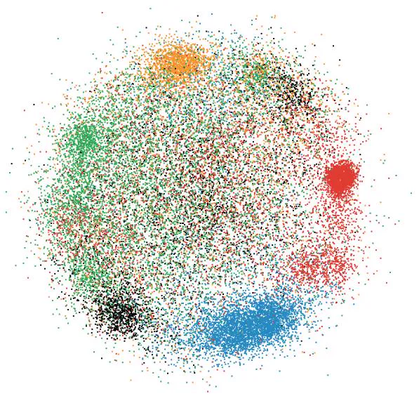

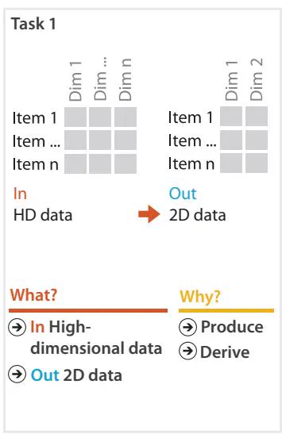  
Figure 13.12. Dimensionality reduction of a large document collection using Glimmer for multidimensional scaling. The results are laid out in a single 2D scatterplot, allowing the user to verify that the conjectured clustering shown with color coding is partially supported by the spatial layout. From [Ingram et al. 09, Figure 8].

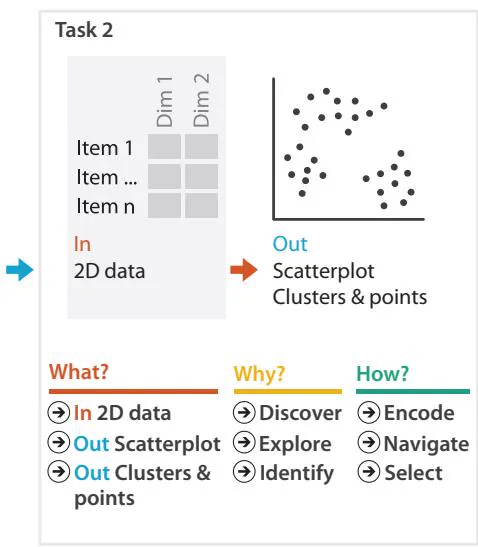

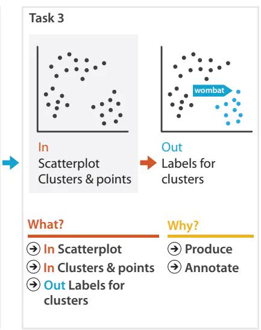  
Figure 13.13. A chained sequence of what–why–how analysis instances for the scenario of dimensionality reduction of document collection data.

<table><tr><td>Idiom</td><td>Dimensionality Reduction for Document Collections</td></tr><tr><td>What: Data</td><td>Text document collection.</td></tr><tr><td>What: Derived</td><td>Table with 10,000 attributes.</td></tr><tr><td>What: Derived</td><td>Table with two attributes.</td></tr><tr><td>How: Encode</td><td>Scatterplot, colored by conjectured clustering.</td></tr><tr><td>How: Reduce</td><td>Attribute aggregation (dimensionality reduction) with MDS.</td></tr><tr><td>Scale</td><td>Original attributes: 10,000. Derived attributes: two. Items: 100,000.</td></tr></table>

# 13.4.3.2 How to Show DR Data?

With standard dimensionality reduction techniques, the user chooses the number of synthetic attributes to create. When the target number of new attributes is two, the dimensionally reduced data is most often shown as a scatterplot. When more than two synthetic attributes are created, a scatterplot matrix (SPLOM) may be a good choice. Although in general scatterplots are often used to check for correlation between two attributes, that is not the goal when inspecting scatterplots of dimensionally reduced data. The point of dimensionality reduction is to automatically collapse correlated dimensions together into new synthetic dimensions; the techniques are designed so that these new dimensions will not be correlated. The tasks with scatterplots of dimensionally reduced data are to verify or find whether the data items form meaningful clusters and to verify or check whether the new synthetic attributes are meaningful.

For both of these tasks, an important function is to be able to select a low-dimensional point in the scatterplot and inspect the high-dimensional data that it represents. Typically, the user investigates by clicking on points and seeing if the spatial layout implied by the low-dimensional positions of the points seems to properly reflect the high-dimensional space.

Sometimes the dataset has no additional information, and the scatterplot is simply encoding two-dimensional position. In many cases there is a conjectured categorization of the points, which are colored according to those categories. The task is then to check whether the patterns of colors match up well with the patterns of the spatial clusters of the reduced data, as shown in Figure 13.12.

* In mathematical terminology, the layouts are affine invariant.

When you are interpreting dimensionally reduced scatterplots it is important to remember that only relative distances matter. The absolute position of clusters is not meaningful; most techniques create layouts where the image would have the same meaning if it is rotated in an arbitrary direction, reflected with mirror symmetry across any line, or rescaled to a different size.*

Another caution is that this inspection should be used only to find or verify large-scale cluster structure. The fine-grained structure in the lower-dimensional plots should not be considered strongly reliable because some information is lost in the reduction. That is, it is safe to assume that major differences in the distances between points are meaningful, but minor differences in distances may not be a reliable signal.

Empirical studies have shown that two-dimensional scatterplots or SPLOMS are the safest idiom choices for inspecting dimensionally reduced data [Sedlmair et al. 13]. While the idiom of three-dimensional scatterplots has been proposed many times, they are susceptible to all of the problems with 3D representations. As discussed in Section 6.3, they are an example of the worst possible case for accurate depth perception, an abstract cloud of points floating in three-dimensional space. Although some systems use the idiom of 3D landscapes for dimensionally reduced data, this approach is similarly problematic, for reasons also covered in Section 6.3.

# 13.5 Further Reading

Filtering Early work in dynamic queries popularized filtering with tightly coupled views and extending standard widgets to better support these queries [Ahlberg and Shneiderman 94].

Scented Widgets Scented widgets [Willett et al. 07] allude to the idea of information scent proposed within the theory of information foraging from Xerox PARC [Pirolli 07].

Boxplots The boxplot was originally proposed by Tukey and popularized through his influential book on Exploratory Data Analysis [Tukey 77]. A recent survey paper discusses the many variants of boxplots that have been proposed in the past 40 years [Wickham and Stryjewski 12].

Hierarchical Aggregation A general conceptual framework for analyzing hierarchical aggregation is presented in a recent paper

[Elmqvist and Fekete 10]. Earlier work presented hierarchical parallel coordinates [Fua et al. 99].

Spatial Aggregation The Modifiable Areal Unit Problem is covered in a recent handbook chapter [Wong 09]; a seminal booklet lays out the problem in detail [Openshaw 84]. Geographically weighted interactive graphics, or geowigs for short, support exploratory analysis that explicitly takes scale into account [Dykes and Brunsdon 07].

Attribute Reduction DOSFA [Yang et al. 03a] is one of many approaches to attribute reduction from the same group [Peng et al. 04,Yang et al. 04,Yang et al. 03b]. The DimStiller system proposes a general framework for attribute reduction [Ingram et al. 10]. An extensive exploration of similarity metrics for dimensional aggregation was influential early work [Ankerst et al. 98].

Dimensionality Reduction The foundational ideas behind multidimensional scaling were first proposed in the 1930s [Young and Householder 38], then further developed in the 1950s [Torgerson 52]. An early proposal for multidimensional scaling (MDS) in the vis literature used a stochastic force simulation approach [Chalmers 96]. The Glimmer system exploits the parallelism of graphics hardware for MDS; that paper also discusses the history and variants of MDS in detail [Ingram et al. 09]. Design guidelines for visually encoding dimensionally reduced data suggest avoiding the use of 3D scatterplots [Sedlmair et al. 13].

# $\textcircled{ \div}$ Embed

Elide Data

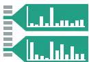

Superimpose Layer

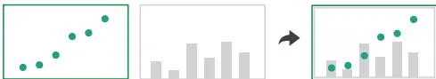

Distor t Geometr y

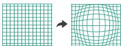

# Reduce

$\circled{ \div}$ Filter

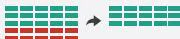

$\circled{ \div}$ Aggregate

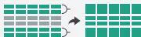

$\circled{  }$ Embed

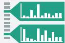  
Figure 14.1. Design choices for embedding focus information within context.

