# Chapter 15

# Analysis Case Studies

# 15.1 The Big Picture

Figure 15.1 shows the six vis systems analyzed in this chapter as full case studies. The Scagnostics system provides a scalable summary of large scatterplot matrices through a derived SPLOM based on classifying the geometric shapes formed by the point distributions in the original scatterplots [Wilkinson et al. 05, Wilkinson et al. 06]. The VisDB system for database vis treats an entire database as a very large table of data, visually encoding it with dense and space-filling layouts with items colored according to their relevance for a specific query [Keim and Kriegel 94]. The Hierarchical Clustering Explorer (HCE) system supports systematic exploration of a multidimensional tables, such as those representing microarray measurements of gene expression in the genomics domain, with an associated hierarchical clustering [Seo and Shneiderman 02, Seo and Shneiderman 05]. The PivotGraph system summarizes networks using the succinct data abstraction of a derived network created by rolling up groups of nodes and links into aggregate nodes based on two categorical attributes [Wattenberg 06]. The InterRing system for tree exploration uses a spacefilling, radial layout with interaction built around a multifocus focus+context distortion [Yang et al. 02]. The Constellation system supports browsing a complex multilevel linguistic network with a layout that encodes query relevance with spatial position and dynamic layering to avoid the perceptual impact of edge crossings [Munzner 00, Munzner et al. 99].

# 15.2 Why Analyze Case Studies?

The ability to concisely describe existing systems gives you a firm foundation for considering the full array of possibilities when you generate new systems. These case studies illustrate how to use

the analysis framework presented in the book to decompose a vis approach, however complex, into pieces that you can systematically think about and compare with other approaches. These examples continue the analysis gradually introduced in the previous chapters. Now that all design choices have been introduced, each example has a complete analysis.

At the abstraction level, these analyses include the types and semantics of the data abstraction including any derived data and the targeted task abstraction. At the idiom level, the choices are decomposed into the design choices of how to encode data, facet data between multiple views, and reduce the data shown within a view. The analyses also include a discussion of scalability and continue with the practice of assuming available screen space of one million pixels in a standard format of 1000 by 1000 pixels.

A few of these systems have simple data abstractions and can be unambiguously classified as handling a particular simple dataset type: tables, or networks, or spatial data. Most of them have more complex data abstractions, which is the common case in realworld problems. Many of these systems carry out significant transformations of the original data to create derived data and handle combinations of multiple basic types. Often the system is designed to support exploration of interesting structure at multiple levels.

The following analyses are descriptive examinations of the final design of each system, not prescriptive statements that the particular choices made by these designers are the only good solution that fits the requirements. As you read through this chapter, it is a useful exercise to generate a set of alternatives for each choice made by these designers and to consider the pros and cons of each.

# 15.3 Graph-Theoretic Scagnostics

Scatterplots are discussed in Section 7.4.   
SPLOMs are an example of the design choice of matrix alignments, discussed in Section 7.5.2, and small multiples, discussed in Section 12.3.2.

Graph-theoretic scagnostics is a scalable idiom for the exploration of scatterplot matrices, or SPLOMs [Wilkinson et al. 05, Wilkinson et al. 06]. A scagnostics SPLOM is a next step beyond a standard SPLOM, just as a SPLOM is a step beyond a single scatterplot. A single scatterplot supports direct comparison between two attributes by plotting their values along two spatial axes. A scatterplot matrix is the systematic way to compare all possible pairs of attributes, with the attributes ordered along both the rows and the columns and one scatterplot at each cell of the matrix. Figure 15.2 shows a SPLOM for a dataset of abalone measurements that has nine attributes.

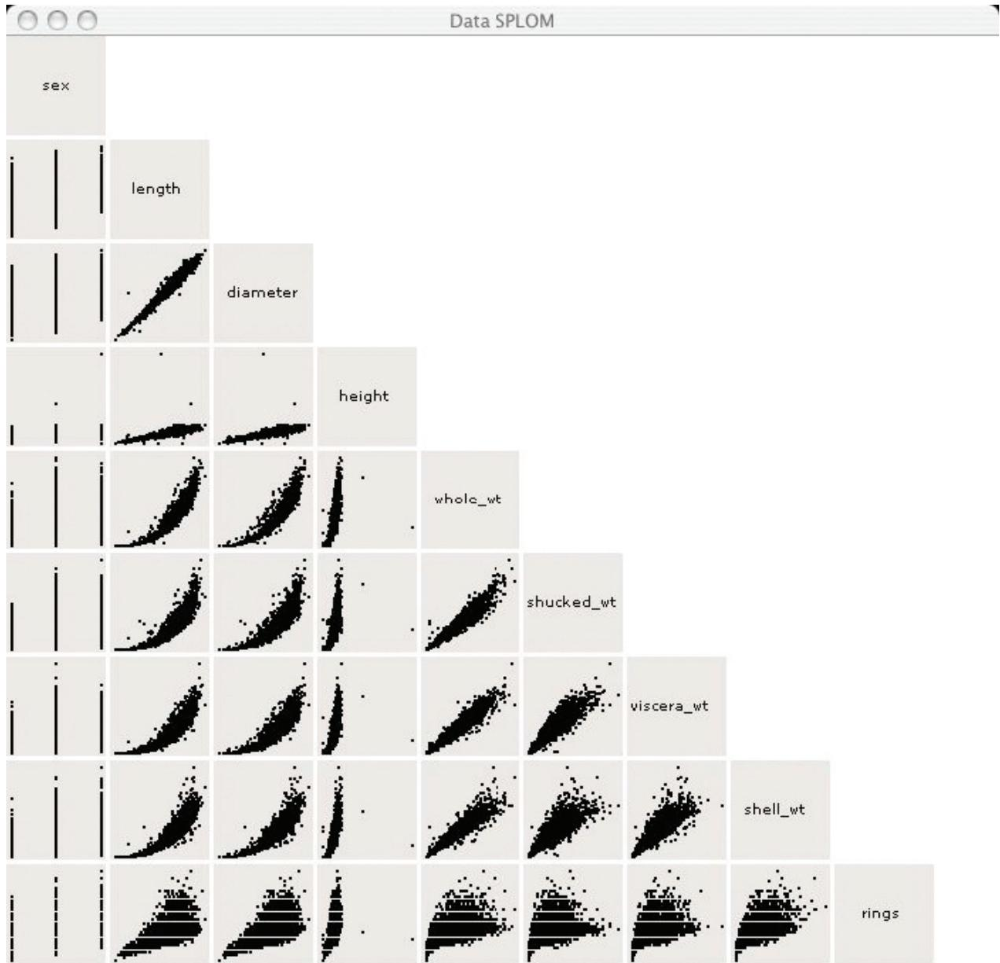  
Figure 15.2. Scatterplot matrices (SPLOM) showing abalone data. From [Wilkinson et al. 05, Figure 1].

The scalability challenge of a SPLOM is that the size of the matrix grows quadratically. Each individual plot requires enough screen space to distinguish the points within it, so this idiom does not scale well past a few dozen attributes.

The idea of scagnostics, short for scatterplot computer-guided diagnostics, is to identify a small number of measurements that nicely categorize the shape of the point distributions within each scatterplot. The nine measures are outlying for outlier detection; skewed, clumpy, sparse, and striated for point distribution and density; convex, skinny, and stringy for shape, and monotonic for the association. Figure 15.3 shows examples of real-world datasets rated low, medium, and high with respect to each of these measures.

These measurements are then shown in a new scagnostics SPLOM that is a scatterplot of scatterplots. That is, each point in the scagnostics SPLOM represents an entire scatterplot in the original SPLOM, which is shown when the point is selected. Figure 15.4 shows the scagnostics matrix for the abalone dataset. As with standard SPLOMs, there is linked highlighting between views, and selecting a point also triggers a popup detail view showing the full scatterplot.

The idea is that the distribution of points in the scagnostics SPLOM should provide a fast overview of the most important characteristics of the original SPLOM, because the measures have been carefully chosen to reflect scatterplot shape. Looking at the outliers in this scagnostics SPLOM guides the user to the unusually shaped, and thus potentially interesting, scatterplots in the original SPLOM.

<table><tr><td>System</td><td>Scagnostics</td></tr><tr><td>What: Data</td><td>Table.</td></tr><tr><td>What: Derived</td><td>Nine quantitative attributes per scatterplot (pairwise combination of original attributes).</td></tr><tr><td>Why: Tasks</td><td>Identify, compare, and summarize; distributions and correlation.</td></tr><tr><td>How: Encode</td><td>Scatterplot, scatterplot matrix.</td></tr><tr><td>How: Manipulate</td><td>Select.</td></tr><tr><td>How: Facet</td><td>Juxtaposed small-multiple views coordinated with linked highlighting, popup detail view.</td></tr><tr><td>Scale</td><td>Original attributes: dozens.</td></tr></table>

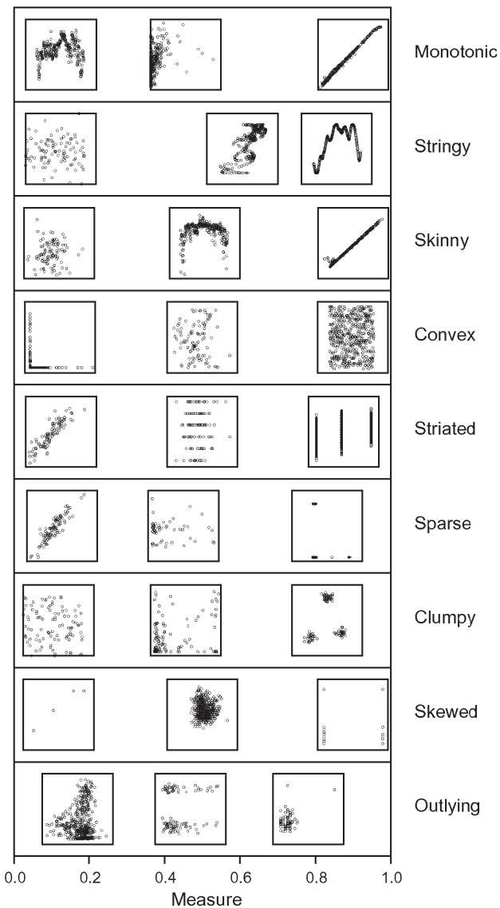  
Figure 15.3. The nine scagnostics measures that describe scatterplot shape, with examples of real-world datasets rated low, medium, and high for each of the nine measures. From [Wilkinson and Wills 08, Figure 6].

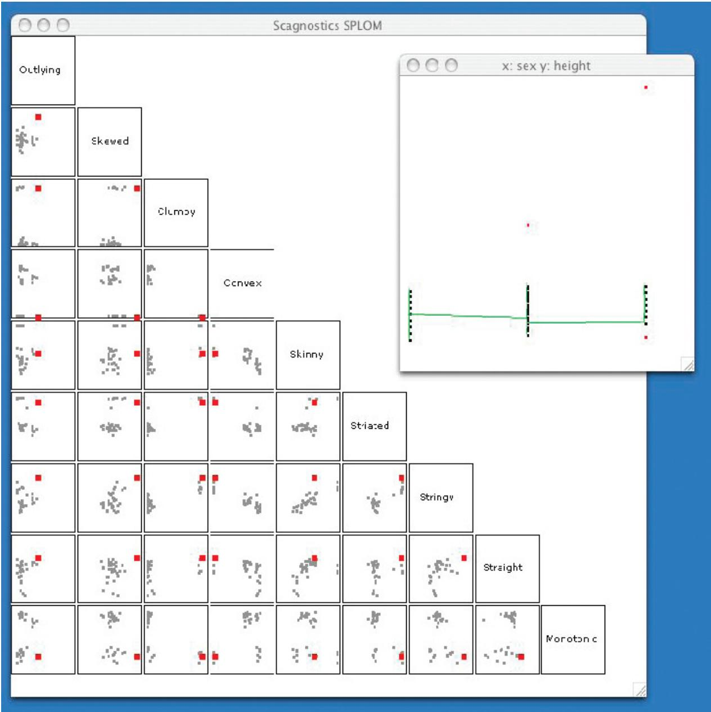  
Figure 15.4. Scagnostics SPLOM for the abalone dataset, where each point represents an entire scatterplot in the original matrix. The selected point is highlighed in red in each view, and the scatterplot corresponding to it is shown in a popup detail view. From [Wilkinson et al. 05, Figure 5].

# 15.4 VisDB

The VisDB system for database vis [Keim and Kriegel 94] treats an entire database as a very large table of data. The system shows that table with respect to a specific query that matches some subset of the items in it. VisDB computes a set of derived attributes that measure the relevance of the query with respect to the original attributes and items, as shown in Figure 15.5(a). Each item is given a relevance score for the query for each original attribute. An overall relevance score is computed that combines these individual scores, adding an additional derived attribute column to the original table.

VisDB supports two different layout idioms that are dense, spacefilling, and use square color-coded area marks. Figure 15.5 shows schematic views of the layouts, and Figure 15.6 shows the corresponding screenshots.

The spatial ordering of regions within VisDB views is not a standard aligned rectilinear or radial layout; it follows a spiral pattern emanating from the center, as shown in Figure 15.7(a). The sequential colormap, shown in Figure 15.7(b), uses multiple hues ordered with monotonically increasing luminance to support both categorical and ordered perception of the encoded data. At the bottom is dark red, the mid-range has purple and blue, it continues with cyan and then even brighter green, and there is a very bright yellow at the high end to emphasize the top of the range.

One of the two layouts partitions the dataset by attribute into small multiple views shown side by side, with one view for each attribute. Figure 15.5(a) illustrates the idiom schematically, and Figure 15.6(a) shows an example with a dataset of 1000 items. The items are placed in the same order across all views but colored according to relevance score for that view’s attribute. They are ordered by the derived overall relevance attribute, which is also the coloring attribute in the upper left view; spatial position and color provide redundant information in this view. In the other views with coloring by each other attribute, there are different visual patterns of color. The user can inspect the patterns within the individual views to carry out the abstract task of characterizing distributions and finding groups of similar values within individual attributes and per-attribute outlier detection. Comparing between the patterns in different views corresponds to the abstract task of looking for correlations between attributes.

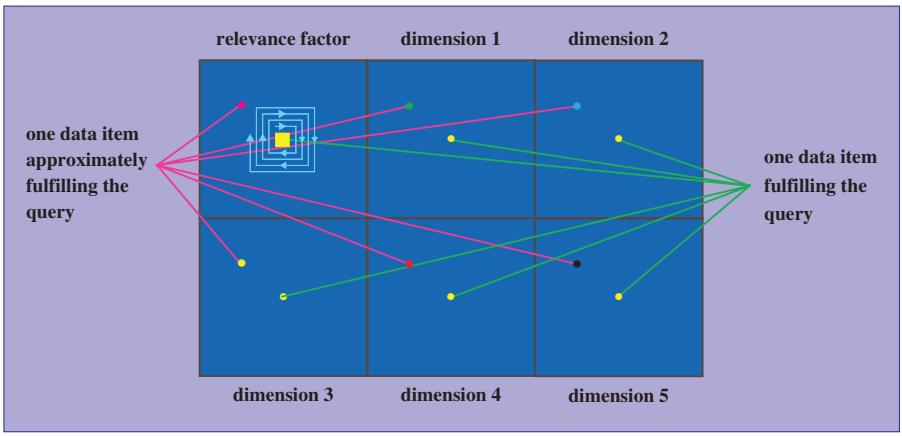  
(a)

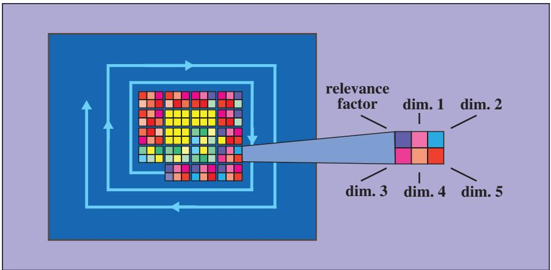  
(b)   
Figure 15.5. VisDB layouts schematically, for a dataset with five attributes. (a) Each attribute is shown in a separate small-multiple view. (b) In an alternate VisDB layout, each item is shown with a glyph with per-attribute sections in a single combined view. From [Keim and Kriegel 94, Figures 2 and 4].

The second layout uses a single view where the space has been partitioned into one region for each item, containing a glyph that shows all of the attributes for that item. Figure 15.5(b) shows the schematic diagram, and Figure 15.6(b) shows a screenshot. This item-based partition supports the abstract task of comparison across items and finding groups of similar items, rather than comparison across attributes.

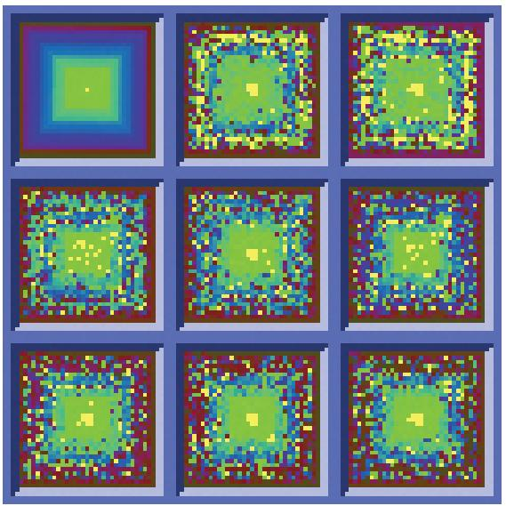  
(a)

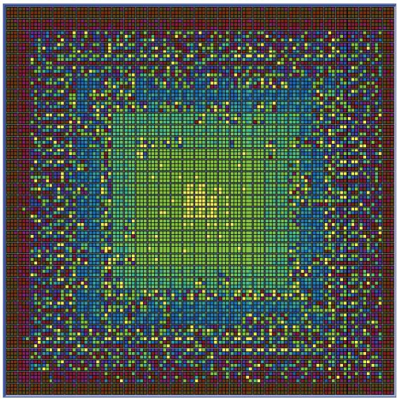  
(b)   
Figure 15.6. VisDB screenshots with a dataset of eight attributes and 1000 items. (a) Attribute-based grouping with one small-multiple view for each attribute. (b) Item-based grouping has a single combined view with multiattribute glyph. From [Keim and Kriegel 94, Figure 6].

Both of these layouts use filtering for data reduction. When the number of items is greater than the available room for the view, items are filtered according to the relevance values. The total table size handled by the system thus can be up to several million, even though only one million items can be shown at once in a single screen of one million pixels.

The small-multiples layout is effective for up to 10–12 attributes, where each per-attribute view shows around 100,000 items, and one million items are shown across all the views. In contrast, the layout idiom using a single large glyph-based view only can handle up to around 100,000 visible items, an order of magnitude fewer than the other idiom. The elements within the glyph need to be boxes larger than a single pixel in order to be salient, and glyphs need borders around them in order to be distinguished from neighboring ones.

VisDB is an early example of a very information-dense design that tests the upper limits of useful information density. It is also a very clear example of how different strategies for partitioning space can be used to support different tasks.

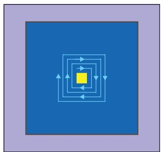  
(a)

  
(b)   
Figure 15.7. VisDB layout orientation and colors. (a) Layouts are are ordered internally in a spiral emanating from the center. (b) The VisDB sequential colormap uses multiple hues with monotonically increasing luminance. From [Keim and Kriegel 94, Figures 2 and 3].

<table><tr><td>System</td><td>VisDB</td></tr><tr><td>What: Data</td><td>Table (database) with k attributes; query return-ing table subset (database query).</td></tr><tr><td>What: Derived</td><td>k + 1 quantitative attributes per original item: query relevance for the k original attributes plus overall relevance.</td></tr><tr><td>Why: Tasks</td><td>Characterize distribution within attribute, find groups of similar values within attribute, find outliers within attribute, find correlation be-tween attributes, find similar items.</td></tr><tr><td>How: Encode</td><td>Dense, space-filling; area marks in spiral lay-out; colormap: categorical hues and ordered luminance.</td></tr><tr><td>How: Facet</td><td>Layout 1: partition by attribute into per-attribute views, small multiples. Layout 2: partition by items into per-item glyphs.</td></tr><tr><td>How: Reduce</td><td>Filtering</td></tr><tr><td>Scale</td><td>Attributes: one dozen. Total items: several mil- lion. Visible items (using multiple views, in to-tal): one million. Visible items (using glyphs): 100,000</td></tr></table>

# 15.5 Hierarchical Clustering Explorer

The Hierarchical Clustering Explorer (HCE) system supports systematic exploration of a multidimensional table with an associated hierarchical clustering [Seo and Shneiderman 02, Seo and Shneiderman 05]. It was originally designed for the genomics domain where the table reprents microarray measurements of gene expression. The original data is a multidimensional table with two key attributes, genes and experimental conditions, and a single quantitative value attribute, measurements of the activity of each gene under each experimental condition. The derived data is a cluster hierarchy of the items based on a similarity measure bewteen items.1

HCE is a good example of achieving scalability through carefully designed combination of visual encoding and interaction idioms in order to support datasets much larger than could be handled by a single static view. The scalability target of HCE is between 100 and 20,000 gene attributes and between 2 and 80 experimental condition attributes. This target is reached with the reduction design choices of interactively controlled aggregation, filtering, and navigation, and with the view coordination design choices of overview–detail, small multiple, and multiform side-by-side views with linked highlighting.

Figure 15.8 shows HCE on a genomics dataset. Two cluster heatmap views are coordinated with the overview–detail design choice, and scatterplot and histogram views provide different encodings.

The overview cluster heatmap at the top uses an aggregated representation where an entire dataset of 3614 genes is shown with fewer than 1500 pixels by replacing individual leaves with the average values of adjacent leaves. The density level of the overview can be interactively changed by the user, for a tradeoff between an aggregate view where some detail is lost but the entire display is visible at once, and a more zoomed-in view where only some of the columns are visible simultaneously and navigation by horizontal panning is required to see the rest. The horizontal line through the dendrogram labeled Minimum Similarity is an interactive filtering control. Dragging it down vertically dynamically filters out the columns in the heatmap that correspond to the parts of the den-

‣ For more on cluster heatmaps, see Section 7.5.2.

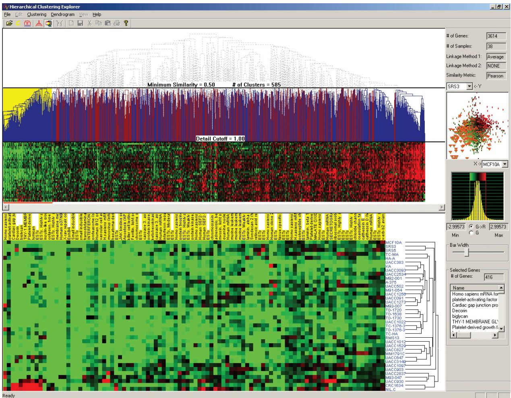  
Figure 15.8. Hierachical Clustering Explorer uses interactive aggregation and filtering for the scalable display of a multidimensional table showing gene activity in different conditions using multiple overview+detail cluster heatmap views. From [Seo and Shneiderman 02, Figure 2].

drogram above the bar and partitions the heatmap into pieces that correspond to the number of clusters just below the bar.

The detail view at the bottom shows a heatmap of the cluster selected in the top overview. It also shows the second dendrogram for hierarchical clustering of the rows on the side; this dendrogram is not shown above in order to to maximize the number of columns that can fit within the overview. The background of the

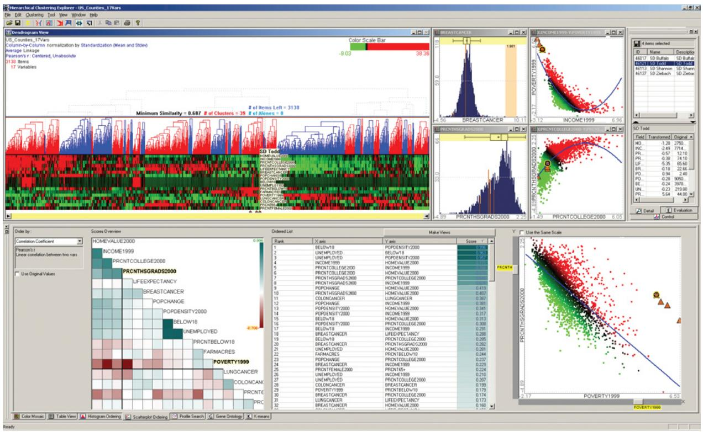  
Figure 15.9. HCE on a demographics dataset showing the rank-by-feature idiom for systematic exploration of pairwise combinations of attributes using a matrix overview and scatterplot. From [Seo and Shneiderman 05, Figure 1].

selected cluster is highlighted in yellow in the overview, and the correspondence between the views is emphasized by coloring the column labels along the top of the detail view yellow as well, for linked highlighting.

HCE has also been used for exploring datasets from other domains, including census demographic information, as shown in Figure 15.9. This screenshot focuses on the rank-by-feature idiom that combines the design choice of changing the order and the reduction design choice of aggregation to guide exploration and achieve scalability. In this idiom, the data abstraction is augmented with many new derived attributes. Orderings for each original attribute and pairwise combination of attributes are computed for several choices of ordering criteria, and the user can select which of them to use.*

* Mapping the name of this idiom into the vocabulary used in this book, rank is used as a synonym for order, and feature means either attribute or attribute pair.

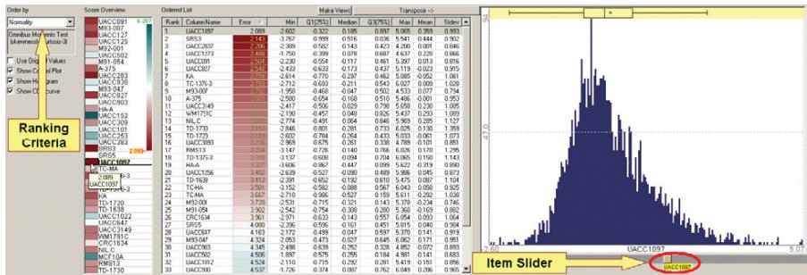  
Figure 15.10. Detail of HCE rank-by-feature views for ranking individual attributes using a list overview and histogram/boxplot. From [Seo and Shneiderman 05, Figure 2].

The results appear in three views, as shown at the bottom of Figure 15.9 and in the detail screenshot in Figure 15.10. The lower left of Figure 15.9 shows an aggregate compact view with the same matrix alignment as a SPLOM, where each cell of the matrix has only a single area mark colored by the chosen criterion with a diverging blue–white–brown colormap. On the left of Figure 15.10 is a compact aggregate overview display with list alignment that matches the ordering used in the cluster heatmap, with the same area mark coloring. In the middle of Figure 15.10 is an intermediate level of detail view for all attributes that shows them in a list alignment that is both ordered and colored by the criterion. This list is less compact, showing a middle level of detail for each attribute, and thus it supports navigation through scrolling. On the right is a detail view to show the full details for the selected attribute with a histogram as shown in Figure 15.10, or the selected attribute pair with a scatterplot as shown in Figure 15.9. The user can select by clicking on a cell in the list or matrix views or by flipping through alternatives quickly using the single or double sliders in the respective detail views.*

* Although the slider in the Figure 15.10 screenshot is labeled Item Slider, in my vocabulary it is being used to choose which attribute to display in the detail view.

<table><tr><td>System</td><td>Hierarchical Clustering Explorer (HCE)</td></tr><tr><td>What: Data</td><td>Multidimensional table: two categorical key attributes (genes, conditions); one quantitative value attribute (gene activity level in condition).</td></tr><tr><td>What: Derived</td><td>Hierarchical clustering of table rows and columns (for cluster heatmap); quantitative derived attributes for each attribute and pairwise attribute combination; quantitative derived attribute for each ranking criterion and original attribute combination.</td></tr><tr><td>Why: Tasks</td><td>Find correlation between attributes; find clusters, gaps, outliers, trends within items.</td></tr><tr><td>How: Encode</td><td>Cluster heatmap, scatterplots, histograms, box-plots. Rank-by-feature overviews: continuous diverging colormaps on area marks in reorder-able 2D matrix or 1D list alignment.</td></tr><tr><td>How: Reduce</td><td>Dynamic filtering; dynamic aggregation.</td></tr><tr><td>How: Manipulate</td><td>Navigate with pan/scroll.</td></tr><tr><td>How: Facet</td><td>Multiform with linked highlighting and shared spatial position; overview-detail with selection in overview populating detail view.</td></tr><tr><td>Scale</td><td>Genes (key attribute): 20,000. Conditions (key attribute): 80. Gene activity in condition (quantitative value attribute): 20,000 × 80 = 1,600,000.</td></tr></table>

# 15.6 PivotGraph

Connection, containment, and matrix views of networks are different visual encodings of the same data abstraction; they both depict the link structure of a network. In contrast, the PivotGraph idiom [Wattenberg 06] visually encodes a different data abstraction: a new network derived from the original one by aggregating groups of nodes and links into a roll-up according to categorical attribute values on the nodes. The user can also select attributes of interest that filter the derived network. Roll-ups can be made for up to two attributes at once; for two dimensions nodes are laid out on a grid, and for one dimension they are laid out on a line. Node positions in the grid are computed to minimize link-crossing clutter, and the links between them are drawn as curves. The user interactively explores the graph through roll-up and selection to see visual encodings that directly summarize the high-level relationships between the attribute-based groups and can drill down to see more details for any node or link on demand. When the user chooses a different roll-up, an animated transition smoothly interpolates between the two layouts.

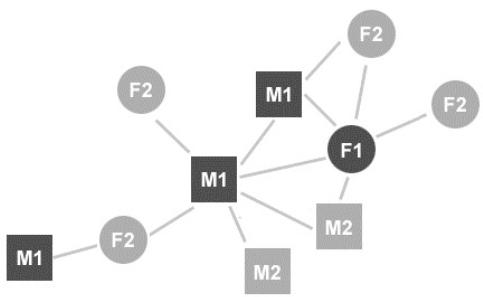  
(a)

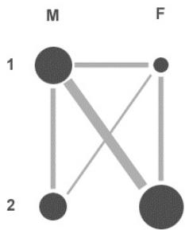  
(b)   
Figure 15.11. The PivotGraph idiom. (a) Node–link view of small network with two attributes on nodes: gender (M/F) is encoded by node shape, and company division (1/2) is encoded by grayscale value. (b) The schematic PivotGraph roll-up of the same simple network where size of nodes and links of the derived graph shows the number of items in these aggregated groups. From [Wattenberg 06, Figure 4].

Figure 15.11 shows an example of a simple node–link drawing in Figure 15.11(a) side by side with a PivotGraph roll-up in Figure 15.11(b). The network has two categorical attributes: gender, shown with M for male and $F$ for female, and company division, shown with 1 or 2. In the node–link view, node shape represents gender with squares for $M$ and circles for $F _ { : }$ , and grayscale value represents company division with black for 1 and gray for 2. The full original network is shown, emphasizing its topological structure. In the PivotGraph view, the derived network has four nodes that represent the four possible groups of the combination of these two attributes: males in division 1 in the upper left, females in division 1 in the upper right, males in division 2 on the lower left, and females in division 2 on the lower right. The size of each of these aggregate groups is encoded with node size. Similarly, a single link in this derived graph represents the entire group of edges in the original graph that linked items in these groups, and the size of that group is encoded with line width. In this example, all possible gender/division pairs are connected except for men and women in division 2.

Figure 15.12 shows a more complex example rolled up by gender and office locations; the dataset is an anonymized version of a real corporate social network. Most of the cross-gender communication occurs in location B, and there are no women at location A. An additional quantitative attribute is encoded with a diverging

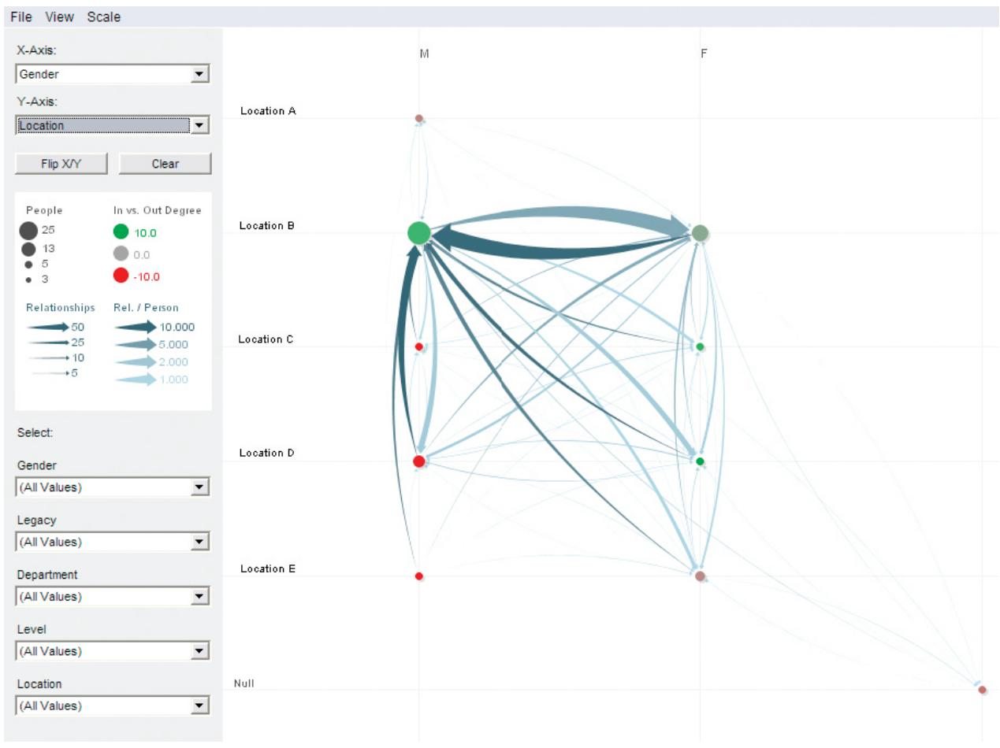  
Figure 15.12. PivotGraph on graph rolled up by gender and location, showing most cross-gender communication occurs in location B. From [Wattenberg 06, Figure 5].

red–green colormap, the number of inward links versus outward links at each node.

The PivotGraph idiom is highly scalable because it summarizes an arbitrarily large number of nodes and links in the original network, easily handling from thousands to millions. The visual complexity of the derived network layout depends only on the number of attribute levels for the two attributes chosen for roll-up.

PivotGraph complements the standard approaches to network layout, node–link and matrix views, and thus could serve as one of several linked multiform views in addition to being used on its

Section 9.4 compares the strengths and weaknesses of the standard approaches to network layout.

own as a single view. PivotGraph is very well suited for the task of comparisons across attributes at the aggregate level, a task that is difficult with previous approaches. Conversely, it is poorly suited for understanding topological features of networks, a task that is easy with node–link views when the network is not too large.

<table><tr><td>Idiom</td><td>PivotGraph</td></tr><tr><td>What: Data</td><td>Network.</td></tr><tr><td>What: Derived</td><td>Derived network of aggregate nodes and links by roll-up into two chosen attributes.</td></tr><tr><td>Why: Tasks</td><td>Cross-attribute comparison of node groups.</td></tr><tr><td>How: Encode</td><td>Nodes linked with connection marks, size.</td></tr><tr><td>How: Manipulate</td><td>Change: animated transitions.</td></tr><tr><td>How: Reduce</td><td>Aggregation, filtering.</td></tr><tr><td>Scale</td><td>Nodes/links in original network: unlimited. Roll-up attributes: 2. Levels per roll-up attribute: several, up to one dozen.</td></tr></table>

# 15.7 InterRing

The InterRing system [Yang et al. 02] for tree exploration uses a space-filling, radial layout for visually encoding the hierarchy. The interaction is built around a multifocus focus+context distortion approach to change the amount of room allocated to different parts of the hierarchy. Figure 15.13(a) shows the undisorted base layout. Figure 15.13(b) shows that the result of enlarging the blue subtree is shrinking the room allocated to its siblings. Figure 15.13(c) shows a subsequent use of interactive distortion, where the tan region is also enlarged for emphasis.

The proposed structure-based coloring redundantly emphasizes the hierarchical information encoded spatially. Structure-based coloring could be eliminated if InterRing is used as the only view, in order to show a different attribute with color coding. Structurebased coloring is particularly useful when shared color coding is used to coordinate between multiple views, so that items are colored by the tree hierarchy in other linked views with different spatial layouts.

The scalability of InterRing is moderate; it handles hundreds of nodes easily, where the leaf labels are large enough to read. The space-filling geometric configuration yields about three times

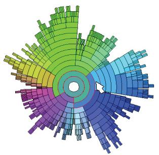  
(a)

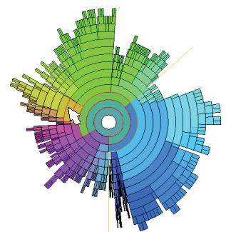  
(b)

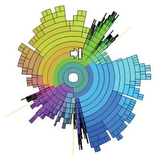  
(c)   
Figure 15.13. The InterRing hierarchy vis idiom uses a space-filling radial visual encoding and distortion-based focus+context interaction. (a) The hierarchy before distortion. (b) The blue selected subtree is enlarged. (c) A second tan region is enlarged. From [Yang et al. 02, Figure 4].

as many legible labels as with a classical node–link layout using labels of the same size. In the extreme case, where each leaf is encoded with a single pixel and the idiom uses the entire screen, InterRing could scale to several thousand nodes. The number of edges in a tree is the same as the number of nodes, so there is no need to separately analyze that aspect. Another useful factor to consider with trees is the maximum tree depth supported by the encoding; that is, the number of levels between the root and the farthest away leaves. InterRing can handle up to several dozen levels, whereas hundreds would be overwhelming.

In addition to being a viable single-view approach when tree exploration is the only task, InterRing is designed to work well with other views where a hierarchy view should support selection, navigation, and roll-up/drill-down operations. It also supports directly editing the hierarchy itself. In contrast, many tree browsing systems do not support modification of the hierarchy.

<table><tr><td>System</td><td>InterRing</td></tr><tr><td>What: Data</td><td>Tree.</td></tr><tr><td>Why: Tasks</td><td>Selection, rollup/drilldown, hierarchy editing.</td></tr><tr><td>How: Encode</td><td>Radial, space-filling layout. Color by tree struc-ture.</td></tr><tr><td>How: Facet</td><td>Linked coloring and highlighting.</td></tr><tr><td>How: Reduce</td><td>Embed: distort; multiple foci.</td></tr><tr><td>Scale</td><td>Nodes: hundreds if labeled, thousands if dense. Levels in tree: dozens.</td></tr></table>

# 15.8 Constellation

The Constellation system [Munzner 00,Munzner et al. 99] supports browsing a complex multilevel linguistic network. Several of the visual encoding decisions diverge from the traditional node–link network layout. The perceptual impact of edge crossings is minimized by using dynamic highlighting of a foreground layer rather than by an algorithm to minimize crossings, allowing the use of spatial position to encode two ordered attributes. Nodes in the graph that have links to multiple subgraphs are duplicated within each to maximize readability at the subgraph level. The traditional approach of drawing a node in only one location would increase the cognitive load of understanding subgraph structure by requiring too much tracing back and forth along links; the duplication is signalled by dynamic highlighting on hover.

Constellation is an example of a highly specialized vis tool designed for a very small audience to use for a limited period of time. It was intended to support computational linguistics researchers who were developing algorithms for traversing a very large network created from an online dictionary. The tool was intended to “work itself out of a job” and be abandoned after their algorithms were fully tuned.

In this multilevel network, a low-level node represents a word sense: the narrow meaning of a word used in a particular way, where most words have multiple senses. For example, bank has the two distinct meanings of a financial institution and the side of a river. The metanodes at the next level of the graph each contain a subgraph of around 10–12 nodes representing a dictionary definition, with links between the headword node being defined, and all of the leafword nodes used in the defining sentence. The large-scale structure of the network arises from combining these subgraphs together, since the same word may be used in many different definitions: as a headword in one definition, and as leafwords in several others.

There is a categorical attribute for the relationship encoded by each link, such as is-a or part-of. While there are in total a few dozen possible values for this type, most are rarely used; we binned this attribute into eight bins, preserving the seven most frequently used types and combining all others into an eighth other category.

The linguistics researchers did not need to inspect the full network; rather, they wanted to see the results of their query algorithms that traversed the network, returning an ordered set of the

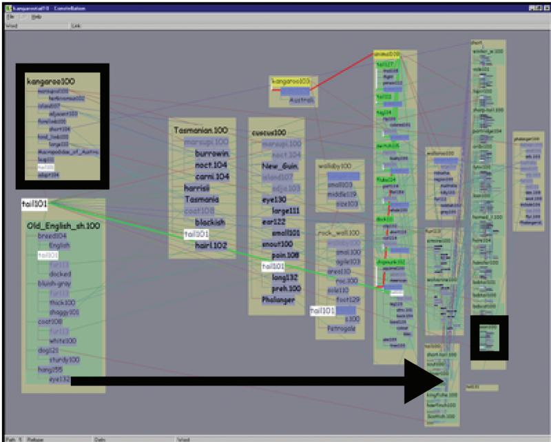  
Figure 15.14. The Constellation high-level layout bases horizontal spatial position on the plausibility attribute, where more room is allocated to definitions on highly plausible and usually short paths on the left, and less room to those on less plausible and typically longer paths on the right. From [Munzner 00, Figure 5.4].

top 10 or 50 highest-ranking paths between two words, a source and a sink. The paths are ranked with the quantitative attribute of plausibility, as computed by their traversal algorithms. Each path consists of an ordered list of words, and attached to each of these words is the set of all the definitions that were used during the computation to place it within the path.

The primary task of the linguists was to hand-check the results to see how well the computed plausibility matched up to their human intuition: were all high-ranking paths believable, and conversely were all believable paths highly ranked? The secondary task was to check the data quality, to ensure that extremely common stop words had been appropriately excluded from the computation. The task abstraction is the consume-discover case, where the search requirements include both browsing the high-ranking paths and locating the low-belivability paths, and the querying requirements include both identification and comparison. All of these tasks require extensive reading of node labels.

The high-level Constellation spatial layout is based on a curvilinear grid, where each path flows along a vertical column with the words ordered from the source on top to the sink on the bottom, and the horizontal order of the paths is determined by the plausibility attribute with highly plausible ones on the left. The layout is designed so that definitions on the plausible left side have more room than those on the implausible right side, as shown in Figure 15.14. Paths have different lengths, and less plausible ones tend to be longer and have more definitions associated with each word. Paths on the implausible right are given less horizontal space. This variability leads to many empty cells in the base grid shown in Figure 15.15(a); full cells are expanded both horizontally as in Figure 15.15(b) and vertically as in Figure 15.15(c) to fill the available space and achieve high information density.

The choice to use spatial position to encode information precludes algorithmic approaches to minimizing edge crossings. Instead, Constellation uses the design choice of superimposed dynamic layers to minimize the perceptual impact of crossings. Figure 15.16(a) shows an example of the background version of a definition graph, while Figure 15.16(b) shows the foreground version. Four different kinds of structures can be highlighted to create different constellations, motivating the system’s name: paths, definition graphs, all of the direct connections to a single word, and all links of a particular type. Figure 15.17 shows a constellation with all links of type Part highlighted. It also illustrates the “sideways T” layout characteristic of a query where the source and sink words are highly related, so all of the high-ranking paths are very short; in this case, aspirin and headache.

The mid-level spatial layout handles a path segment: one word in the path along with all of the definitions associated with it, using containment marks to show the hierarchical relationships. Figure 15.18(a) shows an example where the box allocated to the entire segment is tan, and the path word has its own definition that is also drawn in the tan section. Figure 15.18(b) shows an example where the path word itself is not defined, but each of the other definitions assigned to it is enclosed in a green box nested within the tan segment.

The low-level spatial layout of a definition is illustrated in Figure 15.19(a). A ladder-like rectilinear structure encodes with both spatial position and line marks. Each leafword is enclosed in its own blue label box. Vertical lines show the hierarchical microstructure inside the definition and are colored white, and horizontal edges are color coded to show the link type.

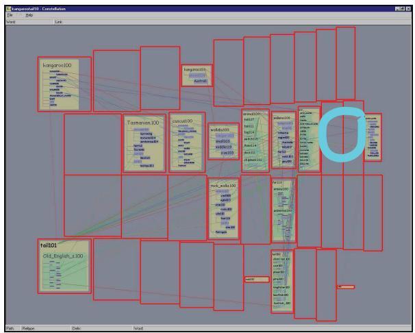  
(a)

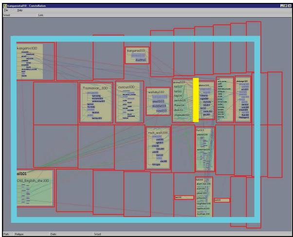  
(b)

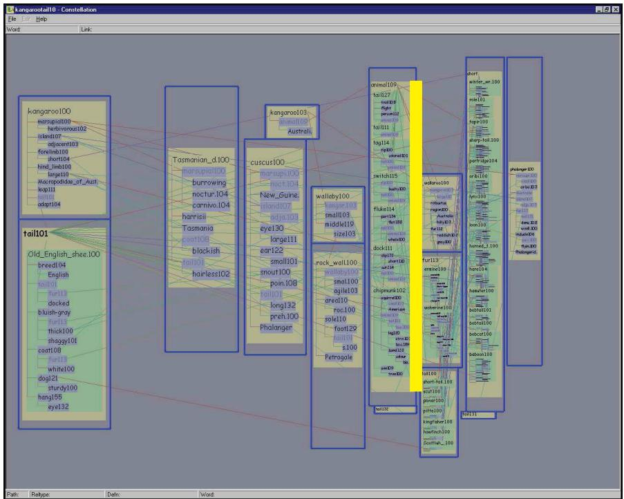  
(c)   
Figure 15.15. Resizing grid cells to increase information density. (a) Base curvilinear grid. (b) After eliminating the empty columns. (c) After eliminating empty cell rows in each column. From [Munzner 00, Figure 5.13].

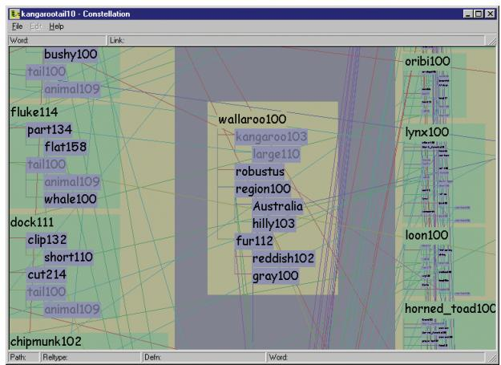  
(a)

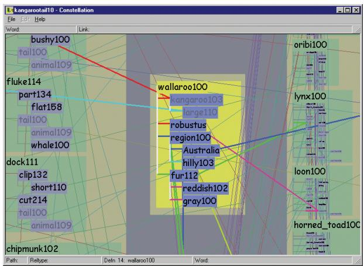  
(b)

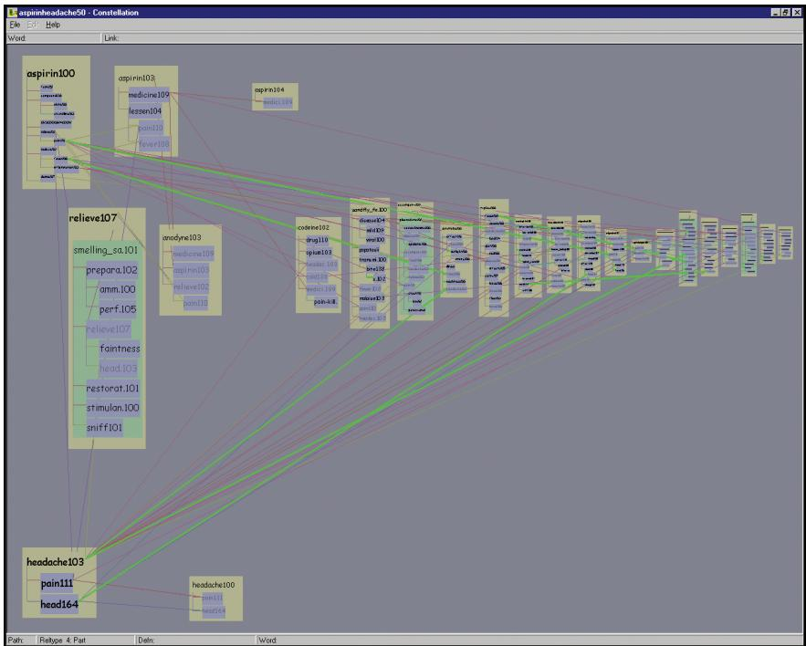  
Figure 15.16. Constellation uses the design choice of dynamic superimposed layers. (a) Edges in the background layer are not obtrusive. (b) The newly selected foreground layer is distinguished from the background with changes of the size, luminance, and saturation channels. From [Munzner 00, Figure 5.5].   
Figure 15.17. The constellation showing all relations of type Part is highlighted. From [Munzner 00, Figure 5.16a].

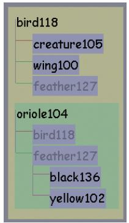  
(a)

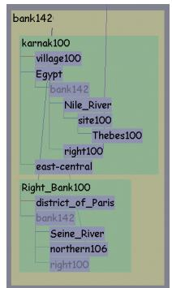  
(b)   
Figure 15.18. Mid-level Constellation path segment layout, using containment to show hierarchical relationship between path word in tan and its associated definitions in green. (a) One of the definitions is for the path word itself. (b) Path word that is not itself defined, but only appears within other definitions. From [Munzner 00, Figure 5.9].

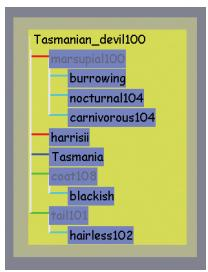  
(a)

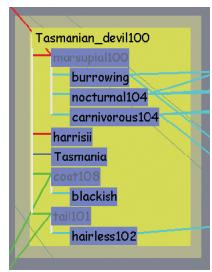  
(b)   
Figure 15.19. Low-level Constellation definition layout, using rectilinear links and spatial position. (a) The base layout, with horizontal lines color-coded for link type. (b) Long-distance links are drawn between the master version of the word and all of its duplicated proxies. From [Munzner 00, Figure 5.10].

Each definition is drawn with all of its associated words in order to make it easy to read, so any word that appears in multiple definitions is duplicated. The master version of the word is the one on the most plausible path, and is drawn in black. All subsequent instances are proxies, which are drawn in gray and are connected to the master by a long slanted line mark, as shown in Figure 15.19(b).

Constellation is optimized for three different viewing levels: a global view for interpath relationships, a local view for reading individual definitions, and an intermediate view for associations within path segments. It uses a subtle form of semantic zooming to achieve this effect, where the amount of space devoted to different classes of words changes dynamically depending on the zoom level. Figure 15.20 shows three steps of a zoom animated transition sequence. In the first frame, the words at the top are given much more space than the rest; in the last frame, the allocation of space is nearly equal for all words.

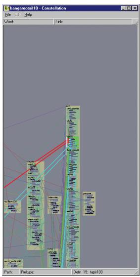

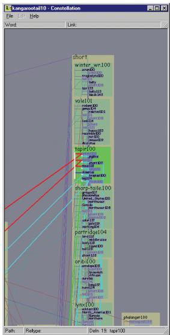

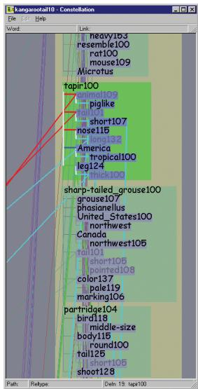  
Figure 15.20. Constellation uses a subtle version of the semantic zooming design choice, where the space allocated for the first word versus the rest of the definition changes according to the zoom level. From [Munzner 00, Figure 5.19].

<table><tr><td>System</td><td>Constellation</td></tr><tr><td>What: Data</td><td>Three-level network of paths, subgraphs (defi-nitions), and nodes (word senses).</td></tr><tr><td>Why: Tasks</td><td>Discover/verify: browse and locate types of paths, identify and compare.</td></tr><tr><td>How: Encode</td><td>Containment and connection link marks, hori-zontal spatial position for plausibility attribute, vertical spatial position for order within path, color links by type.</td></tr><tr><td>How: Manipulate</td><td>Navigate: semantic zooming. Change: Ani-mated transitions.</td></tr><tr><td>How: Reduce</td><td>Superimpose dynamic layers.</td></tr><tr><td>Scale</td><td>Paths: 10–50. Subgraphs: 1–30 per path. Nodes: several thousand.</td></tr></table>

# 15.9 Further Reading

Graph-Theoretic Scagnostics Scagnostics builds on ideas originally proposed by statisticians John and Paul Tukey [Wilkinson et al. 05, Wilkinson and Wills 08].

VisDB The VisDB system was an early proposal of dense displays for multidimensional tables [Keim and Kriegel 94].

Hierarchical Clustering Explorer Different aspects of the Hierarchical Clustering Explorer system are described in a series of papers [Seo and Shneiderman 02,Seo and Shneiderman 05].

PivotGraph The PivotGraph system visually encodes a different derived data abstraction than most network vis idioms [Wattenberg 06].

InterRing The InterRing system supports hierarchy exploration through focus+context interaction with geometric distortion and multiple foci. [Yang et al. 02].

Constellation The Constellation system supports browsing a complex multilevel network with a specialized layout and dynamic layering [Munzner et al. 99,Munzner 00].

#

# Figure Credits

Any figures not listed here are released under the Creative Commons Attribution 4.0 International license (CC BY 4.0), to be credited as Tamara Munzner, with illustrations by Eamonn Maguire, Visualization Analysis and Design, A K Peters Visualization Series, CRC Press, Boca Raton, FL, 2014.

Figure 1.1 Copyright $\circledcirc$ 2013 by IEEE.

Figure 1.2 Reproduced under Creative Commons Attribution Non-Commercial license (CC BY-NC 2.0).

Figure 1.4 Copyright $\circledcirc$ 2007 by IEEE.

Figure 1.5 Courtesy of Miriah Meyer.

Figure 1.6 Michael J. McGuffin and Jean-Marc Robert, Information Visualization (9:2) pp. 115-140, copyright $\circledcirc$ 2010 by SAGE Publications. Reprinted by Permission of SAGE.

Figure 2.5 Courtesy of Miriah Meyer.

Figure 2.9 Courtesy of Miriah Meyer.

Figure 3.4 Copyright $\circledcirc$ 2008 by IEEE.

Figure 3.8(a) Courtesy of Catherine Plaisant.

Figure 3.8(b) [Munzner et al. 03] $\circledcirc$ 2003 Association for Computing Machinery, Inc. Reprinted by permission.

Figure 3.10 Courtesy of David Auber.

Figure 3.12 Copyright $\circledcirc$ 1998 by IEEE.

Figure 4.3 Copyright $\circledcirc$ 2008 by IEEE.

Figure 4.6 Copyright $\circledcirc$ 2005 by IEEE.

Figure 4.8 Copyright $\circledcirc$ 2006 by IEEE.

Figure 4.10 Copyright $\circledcirc$ 2005 by IEEE.

Figure 4.12 [McLachlan et al. 08] $\circledcirc$ 2008 Association for Computing Machinery, Inc. Reprinted by permission.

Figure 4.14 Springer, Graph Drawing, Lecture Notes in Computer Science, 2912, 2004, pages 425- 436, “An Energy Model for Visual Graph Clustering,” Andreas Noack, Figure 1, copyright $\circledcirc$ 2004 Springer. With kind permission from Springer Science and Business Media.

Original caption: Pseudo-random graph with intra-cluster edge probability 0.16 and intercluster edge probability 0.02; left: LinLog model.

Figure 4.16 [Heer et al. 09] $\circledcirc$ 2010 Association for Computing Machinery, Inc. Reprinted by permission.   
Figure 5.8 [Heer and Bostock 10] $\circledcirc$ 2010 Association for Computing Machinery, Inc. Reprinted by permission.   
Figure 5.9 Courtesy of TeleGeography, www.telegeography.com.   
Figure 5.14 Courtesy of Edward H. Adelson. $\circledcirc$ 1995 Edward H. Adelson.   
Figure 5.15 Courtesy of Dale Purves, http://www.purveslab.net/seeforyourself.   
Figure 6.3 Copyright $\circledcirc$ 1996 by IEEE.   
Figure 6.4 Courtesy of Stephen Few. An example of poor design, from http://perceptualedge.com/ files/GraphDesignIQ.html.   
Figure 6.5 Copyright $\circledcirc$ 1996 by IEEE.   
Figure 6.6 Copyright $\circledcirc$ 2007 by IEEE.   
Figure 6.7 Copyright $\circledcirc$ 1999 by IEEE.   
Figure 6.8 Copyright $\circledcirc$ 2010 by IEEE.   
Figure 6.9 Copyright $\circledcirc$ 2007 by IEEE.   
Figure 7.2 Copyright $\circledcirc$ 2008 by IEEE.   
Figure 7.3 “A layered grammar of graphics,” Hadley Wickham, Journal of Computational and Graphical Statistics 19:1 (2010), 3-28. Reprinted by permission of the American Statistical Association (http://www.amstat.org).   
Figure 7.5 Courtesy of Robert P. Bosch, Jr.   
Figure 7.6 Copyright $\circledcirc$ 2008 by IEEE.   
Figure 7.7 Copyright $\circledcirc$ 2008 by IEEE.   
Figure 7.10 Copyright $\circledcirc$ 2006 by IEEE.   
Figure 7.11 From http://en.wikipedia.org/wiki/File:Heatmap.png. Created by Miguel Andrade using the program Cluster from Michael Eisen, which is available from http://rana.lbl.gov/ EisenSoftware.htm, with data extracted from the StemBase database of gene expression data.   
Figure 7.13 “Hyperdimensional Data Analysis Using Parallel Coordinates,” Edward J. Wegman, Journal American Statistical Association 85:411 (1990), 664–675. Reprinted by permission of the American Statistical Association (http://www.amstat.org).   
Figure 7.14 Copyright $\circledcirc$ 1999 by IEEE.   
Figure 7.15(a,b) “A layered grammar of graphics,” Hadley Wickham, Journal of Computational and Graphical Statistics 19:1 (2010), 3-28. Reprinted by permission of the American Statistical Association (http://www.amstat.org).   
Figure 7.17 “A layered grammar of graphics,” Hadley Wickham, Journal of Computational and Graphical Statistics 19:1 (2010), 3-28. Reprinted by permission of the American Statistical Association (http://www.amstat.org).

Figure 7.18 Courtesy of Michael Bostock, made with D3 [Bostock et al. 11]. From http://bl.ocks. org/mbostock/3887235, http://bl.ocks.org/mbostock/3886208, and http://bl.ocks.org/ mbostock/3886394.   
Figure 7.19 Copyright $\circledcirc$ 2012 John Wiley & Sons, Ltd.   
Figure 7.20 Courtesy of John Stasko.   
Figure 8.2 Courtesy of Michael Bostock, made with D3 [Bostock et al. 11]. From http://bl.ocks.org/ mbostock/4060606.   
Figure 8.3 Courtesy of Joe Kniss.   
Figure 8.4 Courtesy of Land Information New Zealand Data Service (CC BY 3.0 NZ). From https:// data.linz.govt.nz/layer/768-nz-mainland-contours-topo-150k.   
Figure 8.5 Copyright $\circledcirc$ 2004 by IEEE.   
Figure 8.6 Copyright $\circledcirc$ 2004 by IEEE.   
Figure 8.7 Copyright $\circledcirc$ 2005 by IEEE.   
Figure 8.8 Reprinted from Computers and Graphics, Vol. 26, No. 2, Xavier Tricoche, Thomas Wischgoll, Gerik Scheuermann, and Hans Hagen, “Topology tracking for the visualization of time-dependent two-dimensional flows,” Pages 249–257, Copyright 2002, with permission from Elsevier.   
Figure 8.9 Copyright $\circledcirc$ 2013 by IEEE.   
Figure 8.10 Copyright $\circledcirc$ 2005 by IEEE.   
Figure 8.11 Courtesy of Gordon Kindlmann. From http://www.cs.utah.edu/~gk/papers/vis99/ppt/ slide03.html.   
Figure 8.12 Copyright $\circledcirc$ 2004 by IEEE.   
Figure 8.13 Copyright $\circledcirc$ 2004 by IEEE.   
Figure 9.2(a) Springer, Graph Drawing, Lecture Notes in Computer Graphics 2528, 2002, pages 344– 353, “Improving Walkers Algorithm to Run in Linear Time,” Christoph Buchheim, Michael Junger, and Sebastien Leipert, Figure 2d, copyright $\circledcirc$ 2002 Springer. With kind permission from Springer Science and Business Media.   
Original caption: Extending the Reingold-Tilford algorithm to trees of unbounded degree.   
Figure 9.2(b) Courtesy of Michael Bostock, made with D3 [Bostock et al. 11]. From http://mbostock. github.com/d3/ex/tree.html.   
Figure 9.3 Courtesy of David Auber, made with Tulip [Auber et al. 12].   
Figure 9.4 Courtesy of Michael Bostock, made with D3 [Bostock et al. 11]. From http://bl.ocks.org/ mbostock/4062045 and http://bl.ocks.org/1062288.   
Figure 9.5 From “A Gallery of Large Graphs,” JDG Homologycis-n4c6, b14 and b4. Courtesy of Yifan Hu; see http://yifanhu.net/GALLERY/GRAPHS/citation.html.   
Figure 9.6 Reprinted by permission from Macmillan Publishers Ltd: Nature Methods [Gehlenborg and Wong 12], copyright 2012.

Figure 9.7 Courtesy of Michael McGuffin, from http://www.michaelmcguffin.com/courses/vis/ patternsInAdjacencyMatrix.png.   
Figure 9.8 Courtesy of David Auber, made with Tulip [Auber et al. 12].   
Figure 9.9 Michael J. McGuffin and Jean-Marc Robert, Information Visualization (9:2) pp. 115–140, copyright $\circledcirc$ 2010 by SAGE Publications. Reprinted by Permission of SAGE.   
Figure 9.10 Copyright $\circledcirc$ 2008 by IEEE.   
Figure 10.8 Reproduced under Creative Commons Attribution license (CC BY 2.0).   
Figure 10.9 Copyright $\circledcirc$ 2012 by IEEE.   
Figure 10.10 Copyright $\circledcirc$ 2012 by IEEE.   
Figure 10.11 Copyright $\circledcirc$ 1998 by IEEE.   
Figure 10.12 Copyright $\circledcirc$ 1995 by IEEE.   
Figure 10.13 Courtesy of Gordon Kindlmann, from http://www.cs.utah.edu/~gk/lumFace.   
Figure 11.2 Courtesy of Michael McGuffin, made using Tableau, http://tableausoftware.com.   
Figure 11.3 Copyright $\circledcirc$ 2013 by IEEE.   
Figure 11.4 Copyright $\circledcirc$ 2013 by IEEE.   
Figure 11.5 Copyright $\circledcirc$ 2003 by IEEE.   
Figure 11.6 Copyright $\circledcirc$ 2011 by IEEE.   
Figure 11.7 [McLachlan et al. 08] $\circledcirc$ 2008 Association for Computing Machinery, Inc. Reprinted by permission.   
Figure 11.8 $\circledcirc$ 2008 Christian Rieder, Felix Ritter, Matthias Raspe, and Heinz-Otto Peitgen. Computer Graphics Forum $\circledcirc$ 2008 The Eurographics Association and Blackwell Publishing Ltd.   
Figure 11.9 Copyright $\circledcirc$ 1993 by IEEE.   
Figure 12.2 Reproduced with permission from Graham Wills.   
Figure 12.4 Copyright $\circledcirc$ 2003 by IEEE.   
Figure 12.5 Copyright $\circledcirc$ 2008 by IEEE.   
Figure 12.7 Reproduced under Creative Commons Attribution-ShareAlike 4.0 International license (CC BY-SA 4.0); created by Chris Weaver of The University of Oklahoma, from http://www.cs. ou.edu/~weaver/improvise/examples/census.   
Figure 12.8 Courtesy of Michael Bostock, made with D3 [Bostock et al. 11]. From http://bl.ocks.org/ mbostock/3887051, after http://bl.ocks.org/mbostock/4679202.   
Figure 12.9 “The Visual Design and Control of Trellis Display,” Ronald A. Becker, William S. Cleveland, and Ming-Jen Shyu, Journal of Computational and Statistical Graphics 5:2 (1996), 123– 155. Reprinted by permission of the American Statistical Association (http://www.amstat. org).

Figure 12.10 “The Visual Design and Control of Trellis Display,” Ronald A. Becker, William S. Cleveland, and Ming-Jen Shyu, Journal of Computational and Statistical Graphics 5:2 (1996), 123– 155. Reprinted by permission of the American Statistical Association (http://www.amstat. org).   
Figure 12.11 Copyright $\circledcirc$ 2009 by IEEE.   
Figure 12.12 Copyright $\circledcirc$ 2009 by IEEE.   
Figure 12.13 From [Stone 10], courtesy of Maureen Stone; original color image by National Park Service, http://www.nps.gov/pore/planyourvisit/upload/map pore areamap.pdf.   
Figure 12.15 Copyright $\circledcirc$ 2010 by IEEE.   
Figure 12.16 Copyright $\circledcirc$ 2006 by IEEE.   
Figure 12.17 Reproduced under Creative Commons Attribution Non-Commercial license (CC BY-NC 2.0).   
Figure 13.2 [Ahlberg and Shneiderman 94] $\circledcirc$ 1994 Association for Computing Machinery, Inc. Reprinted by permission. Courtesy of Human-Computer Interaction Lab, University of Maryland.   
Figure 13.3 Copyright $\circledcirc$ 2007 by IEEE.   
Figure 13.4 Copyright $\circledcirc$ 2003 by IEEE.   
Figure 13.6 Copyright $\circledcirc$ 2008 by IEEE.   
Figure 13.7 “40 years of boxplots,” Hadley Wickham and Lisa Stryjewski, The American Statistician. Reprinted by permission of the American Statistical Association (http://www.amstat.org).   
Figure 13.8 Copyright $\circledcirc$ 1998 by IEEE.   
Figure 13.9 Copyright $\circledcirc$ 1999 by IEEE.   
Figure 13.10 Courtesy of Adrienne Gruver, Penn State Geography.   
Figure 13.11 Copyright $\circledcirc$ 2007 by IEEE.   
Figure 13.12 Copyright $\circledcirc$ 2009 by IEEE.   
Figure 14.2 Copyright $\circledcirc$ 2004 by IEEE.   
Figure 14.3 [Bier et al. 93] $\circledcirc$ 1993 Association for Computing Machinery, Inc. Reprinted by permission.   
Figure 14.4 Copyright $\circledcirc$ 1997 by IEEE.   
Figure 14.5 Courtesy of David Auber, made with Tulip [Auber et al. 12].   
Figure 14.6 Copyright $\circledcirc$ 1998 by IEEE.   
Figure 14.7 [Munzner et al. 03] $\circledcirc$ 2003 Association for Computing Machinery, Inc. Reprinted by permission.   
Figure 14.8 Copyright $\circledcirc$ 2006 by IEEE.   
Figure 14.9 Copyright $\circledcirc$ 1998 by IEEE.   
Figure 14.10 Copyright $\circledcirc$ 2010 by IEEE.

Figure 15.2 Copyright $\circledcirc$ 2005 by IEEE.   
Figure 15.3 “Scagnostics Distributions,” Leland Wilkinson and Graham Wills, Journal of Computational and Graphical Statistics (JCGS) 17:2 (2008), 473–491. Reprinted by permission of the American Statistical Association (http://www.amstat.org).   
Figures 15.4 and 15.1(a) Copyright $\circledcirc$ 2005 by IEEE.   
Figure 15.5 Copyright $\circledcirc$ 1994 by IEEE.   
Figures 15.6 and 15.1(b) Copyright $\circledcirc$ 1994 by IEEE.   
Figure 15.7 Copyright $\circledcirc$ 1994 by IEEE.   
Figure 15.8 Copyright $\circledcirc$ 2002 by IEEE. Courtesy of Human-Computer Interaction Lab, University of Maryland.   
Figures 15.9 and 15.1(c) Copyright $\circledcirc$ 2005 by IEEE. Courtesy of Human-Computer Interaction Lab, University of Maryland.   
Figure 15.10 Copyright $\circledcirc$ 2005 by IEEE. Courtesy of Human-Computer Interaction Lab, University of Maryland.   
Figure 15.11 [Wattenberg 06] $\circledcirc$ 2006 Association for Computing Machinery, Inc. Reprinted by permission.   
Figures 15.12 and 15.1(d) [Wattenberg 06] $\circledcirc$ 2006 Association for Computing Machinery, Inc. Reprinted by permission.   
Figures 15.13 and 15.1(e) Copyright $\circledcirc$ 2002 by IEEE.   
Figure 15.14–15.20 and 15.1(f) From the PhD thesis of Tamara Munzner [Munzner 00].

