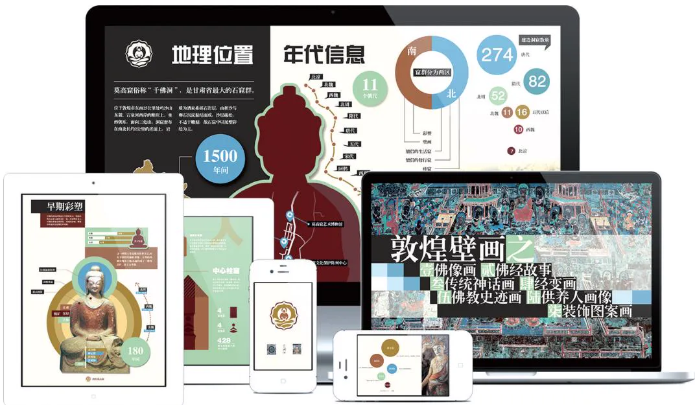
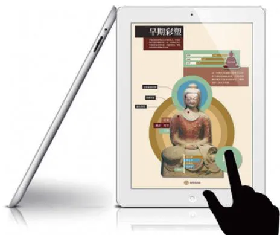

# Processed Document

<!-- Chunk 1 Start -->

# 信息可视化设计

郝亚维 张博文 编著

# 图书在版编目 数据

信息可视化设计 ／ 郝亚维， 张博文编著． －－ 北京 ：北京理工大学出版社， 2023．1

ISBN 978-7 -5763-2005-3

Ⅰ． $\textcircled{1}$ 信… Ⅱ． $\textcircled{1}$ 郝… $\textcircled{2}$ 张… Ⅲ． $\textcircled{1}$ 视觉设计Ⅳ． $\textcircled{1}$ J062

中国国家版本馆 CIP 数据核字（2023）第 001956 号

出版发行 ／ 北京理工大学出版社有限责任公司

社 址 ／ 北京市海淀区中关村南大街5 号

邮 编 ／ 100081

电 话 ／ （010） 68914775 （总编室）

教材售后服务热线

其他图书服务热线

网 址 ／ http： ／ ／ www?? bitpress?? com?? cn

经 销 全国各地新华书店

印 刷 北京地大彩印有限公司

开 本 ／ 787 毫米 $\times 1 0 9 2$ 毫米 1 ／ 16

印 张 ／ 12?? 75

字 数 ／ 319 千字

版 次 ／ 2023 年 1 月第 1 版 2023 年 1 月第 1 次印刷

定 价 ／ 88?? 00 元

责任编辑 刘 派

文案编辑 李丁一

责任校对 ／ 周瑞红

责任印制 ／ 李志强

# 作 者 简 介

郝亚维， 女， 北京理工大学设计与艺术学院视觉传达设计系副教授，博士。

主要从事视觉图形设计 信息设计的研究 从教 年来经验丰富担任多门本科生和研究生重点专业课程的教学 其中本科课程为信息可视化设计 研究生课程为图像视觉语言和生成分析 围绕信息可视化设计教学成果丰厚 设计作品多次获得国内 国际奖项 出版多部教材专著， 发表多篇学术论文。

张博文， 女， 郑州轻工业大学艺术设计学院数字媒体系讲师， 博士。

主要从事媒体与传达设计研究 主持参与 项省厅级以上项目 曾获省哲学社会科学优秀成果三等奖 省高等教育教学改革成果二等奖在国内外学术期刊发表 余篇学术论文 设计作品多次入选参展全球艺术设计类平台和设计类国际性双年展 并先后在加拿大 韩国 缅甸等国及国内文化展览中心展览

# 序

我们用语言难以表述清楚复杂的问题， 如果借助于图形来说明， 效果就会好得多。 那些复杂难懂的逻辑关系， 分分钟会让你乱了头绪甚至遗漏关键点， 但如果有图形辅助就不一样了， 我们可以迅速找到表述亮点或表述事件的主干， 这样能让主题和思路清晰。 信息可视化设计就有这样的魔力， 它是隶属于视觉传达的一种设计， 它是以凝练、 直观和清晰的视觉语言， 通过梳理数据构建图形， 通过图形构建符号， 通过符号构建信息， 以视觉化的逻辑语言对信息进行剖析的视觉传达方式。

年， 我带领研究生张博文进行敦煌莫高窟的信息可视化设计项目课题的调研和设计工作。 在敦煌多次实地调研后， 尝试进行莫高窟信息数据可视化设计， 以信息图表的设计为主， 经过数据的整理和分析归纳以视觉可视化的形式将莫高窟的知识信息展示给普通大众， 也就是把那些专业的文献资料以视觉的语言转换成简单易懂的视觉信息， 继而达到信息的传递。

第一步， 明确设计的受众群———普通大众。 考虑到大多数受众既不易花时间去看莫高窟的专业数据， 又不一定看得懂那些繁杂、 枯燥且毫无美感的数据信息， 因此要求设计不仅要简单易懂， 而且要具有强烈的视觉感， 把莫高窟的知识信息更有效地传递给普通大众。

第二步， 明确设计方向———价值和运用。 设计出来的莫高窟信息数据可视化作品要有其独有的价值， 可以运用到图书馆或电子书或 软件上进行莫高窟文化信息数据的宣传。

敦煌莫高窟的信息可视化作品很多， 国家敦煌研究院做了很多专业的整理工作。 我们制作的信息可视化内容是莫高窟的地理位置与年代、 莫高窟彩塑信息、 二维信息可视化图表设计和交互界面设计 （序图1、 序图2）。

从 年至今， 我们对信息可视化设计的教学研究和学习探索也是见证信息可视化设计不断发展的历程。 本书是近几年针对本科生和研究生设计类信息可视化课程教学的一些总结， 同时在课程设计案例中重点进行了 “十四五” 期间科技方向的信息可视化设计， 有科学知识普及的针对性； 完成的作品结合交互设计， 呈现从静态到交互信息可视化作品的设计构思。 在教学中能体现国家意志和正能量， 在作品调研中能站稳中国立场， 创作中鼓励学生增强了民族自信心。 在这部分课程的教学中， 感谢阿

里巴巴阿里云设计中心的合作教学， 感谢杨珊、 张旭、 戴森三位老师的课业指导。

多年过去了， 我的学生张博文也成为了卓越的大学老师， 并协助我共同完成此书， 我深感欣慰。 本书仅汇集了教学的点滴成果， 难免有遗漏或错误， 敬请读者指正。

  
序图 1

  
序图 2

# 目 录

