# 第一章

# 信息的设计与视觉传达

# 一、 新读图时代

在遥远的史前文明时期 人们就已经开始创造信息图形 洞穴壁画 图 随着人类社会的发展 又出现了信息可视化设计的图形 如地图和数据图表等 回顾信息可视化发展史不难发现， 图形和文字一直是相伴相生、 难舍难分的。

  
图1 －1 史前洞穴壁画 （局部）

自公元前第一张地图的出现便开始了它辉煌的数千年盛世 第一张地图除了用图标标注战役的名字和货物存储的地点外 还加入了文字 使得地图变成了不仅带有含义的早期图表 还成为描述生活环境 生态状态等有着抽象图形和具象文字的综合类数据信息类图表

将信息等数据用形象化的方式展现出来 是中世纪学者的一大创举 特别是 世纪后期数据图形学诞生以来 抽象信息的视觉表达手段一直被用来揭示数据及其他隐匿模式的奥秘。 20 世纪90 年代问世的图形化界面设计使人们能够直接与可视化的信息进行交互， 从而造就和带动了信息可视化设计研究。 图形化界面设计通过对人类视觉能力的充分利用， 使抽象信息变得具象而易于理解 从而增强了人类的认知能力

随着近几年的网络和大数据等技术的发展 信息可视化设计也逐渐以一个全新的面貌呈现在人们面前 特别是进入信息时代以来 随着互联网 移动通信和广告传媒技术的发展信息传播的传播速度和范围急剧扩大 电视 电影和公共设施开始向社会群体进行大规模信息轰炸 在这样的文化背景下 消费者更倾向于 读图 而不是 读字 也诱发了消费者对信息的一种更加特殊的需求 原来的记录和统计的繁杂图表变得不仅仅是一个普普通通的图表媒介， 而是已演变成记录和传播信息不可或缺的一部分， 与人们日常的工作与学习紧密地连接在一起， 新读图时代已然到来 （图1 －2）。

图1 －2 运用智能媒介的新读图时代  
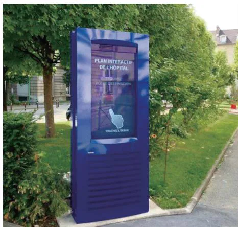  
手机界面图表 城市多媒体信息公共设施

# 二、 信息可视化设计概论

# （一） 什么是信息

信息 （Information） 是一个高度概括的抽象概念， 最初作为一个科学术语出现在哈特莱1928 年的论文 《信息传输》 中， 自20 世纪40 年代信息论的奠基人香农给 “信息” 定义为“对不确定性的消除量”， 此后， 许多研究者根据自己的研究领域提出了不同定义。

美国用户体验专家内森 谢卓夫在其著作 交互信息设计 设计的统一理论 中指出“信息是有定义、 结构化、 有事实和有符号的， 是有目的地处理和处理数据的结合。”

我国信息理论专家钟义信指出 信息不等同于消息 消息只是信息的外壳 信息是消息的内核 信息也不等同于信号 信号是信息的承载者 信息是负载的内容 信息也不等同于数据 数据是一种记录信息的形式 相同的信息也可以用文字 图像等来表达 简而言之 信息即事物运动的状态与方式 人们能够通过获取和识别不同的自然界和社会信息来区分不同的事物， 从而了解和改造世界。

# （二） 什么是信息图表设计

那些复杂难懂的信息和逻辑关系 如果有图形辅助就可以让人们迅速找到表述亮点或表述事件的主干 这样能让主题和信息清晰易懂

信息图表设计就有这样的魔力 它是隶属于视觉传达的一种设计 以凝练 直观和清晰的视觉语言， 通过梳理数据构建图形、 通过图形构建符号、 通过符号构建信息， 以视觉化的逻辑语言对信息进行剖析的视觉传达方式

信息图表又称为信息图 是指对信息 数据或知识的可视化表现形式 现在已经越来越广泛地应用于文化教育 科学研究 经济 商业和交通等各个领域 旨在运用图形语言传递信息 使复杂的信息变得简单易懂 不管民众的受教育程度如何 都可以通过这一系统的帮

助达成理解与认知 即信息 数据和知识的视觉化表达 信息图表经常被用来高效 清晰地传递复杂的信息 如标签 地图 新闻 技术文档 教材等 图 的信息图表可视化设计作品 《照相机》 表达了照相机的机身结构和照相原理， 运用图画分解机械结构和图标化说明使得信息清晰， 容易让人理解。 此外， 信息图表还被广泛应用于计算机科学、 数学和统计学领域， 以优化信息的传递。

  
图1 －3 韩国设计师张圣焕的信息图表可视化设计作品 《照相机》

如今， 信息图表已经渗透到人们生活的方方面面： 多媒体信息展示、 报纸上的新闻图表、 街道上的停车标志、 手册中的说明图表等。 通过视觉化信息表达， 一些信息的传递过程不再像文本形式那样笨拙 信息图在越来越多领域发挥着其高效清晰的优势 并且越来越多的图表在信息传达时摒弃了一贯的数据展示形式 代之以数据与图形的巧妙组合 这样不仅强调了信息的视觉表现效果 而且使信息传递的过程充满了创意 艺术 文化与生命力 图1 － 4 为 “凯度信息之美” 金奖设计作品 《心智的结构》 （2018 年）。

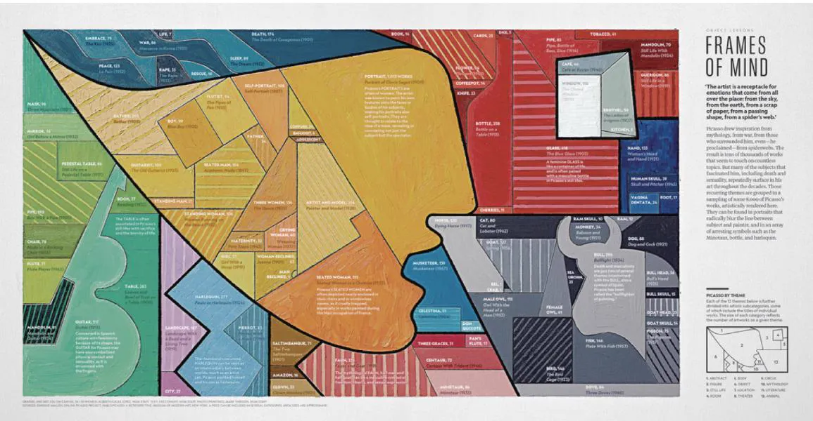

NATIONAL GEOGRAPHIC

COPYRIGHT@2018

O CUCTION

图 1 － 4 “凯度信息之美” 金奖设计作品 《心智的结构》 （2018 年）

信息图表的发展可以归纳为 早期数据列表 清晰数据图 有目的地引导视觉观察 抽象符号的应用 图 图形呈现的形式不同 阅读的效果也各不相同 目前信息图表的使用范围和应用领域随着科学技术的发展早已不局限在地理 数学 统计学等领域 而是只要包含信息都可以使用这种方式来表示。 视觉策划和整合、 人机交互界面等领域通过对数据、 心理、 视觉流程综合的学习和整合可以调节信息阅读和理解的方法， 为人们的信息生活带来更多的便利。

  
图1 －5 信息图表的发展

总之， 作为一种新型信息架构的组织形式， 信息图表设计以图形要素为视觉主体， 在内容传播方面的转化效率是文字和语言交流不可比拟的 正如视觉传播理论的作者保罗 马丁莱斯特在其著作里所论述的那样 我们正迎来一个视觉化的时代 对大多数人来说 完成对世界的理解 不是通过文字 而是通过阅读图像

# （三） 理解信息可视化设计

近年来 信息可视化设计或者数据可视化设计已经是视觉传达设计专业的必修课程 随着商业社会信息整合 大数据时代来临的背景下 视觉化信息已经是设计的重要内容和课题 由早期的信息图形 信息图表到信息可视化设计或数据可视化设计 称谓有变化 都

是围绕信息进行视觉的设计。 2020 年， 互联网时代的信息可视化设计作品 《云游敦煌》 （图以新的互联网移动端交互形式进行展示 提供给观者更直观 更沉浸化的体验

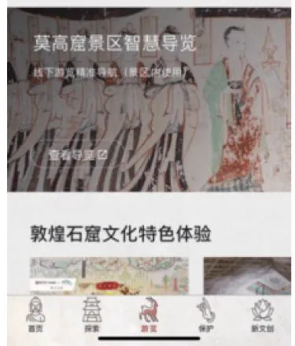

  
图 1 － 6 信息可视化作品 《云游敦煌》 （2020 年）

# 1?? 定义

信息可视化 是把大量的数据 知识等信息转化为人类的一种视觉形式 数据信息可视化过程中充分运用人类对图像 图形等可视模式快速识别的能力通过有效的可视画面来观察 研究 分析 操纵 过滤和理解大量的数据 进而能够实现直接的解释和分析， 形象地表现和模拟大规模数据， 以此来发现或探索数据内部隐藏的特征以及规律 从而提高人们对事物的观察能力 记忆水平以及理解能力 促进人们对某一事物的整体概念的掌握

信息可视化领域包括数据可视化、 信息图形、 知识可视化、 科学可视化以及视觉设计图 从某种意义上说 任何事物如果加以充分适当的组织整理 都是一类信息 如表格 图形 地图 无论其是静态的还是动态的 都将为人们提供某种方式或手段 从而使人们能够洞察信息其中的内涵 找出问题的答案 发现形形色色的关系 或许还能让人们理解在其他形式的情况下不易发现的事情。 可以说， 信息可视化是用来增强认知抽象数据的计算机支持的交互式视觉展示。

信息可视化设计致力于创建以直观方式传达抽象信息的手段和方法 信息可视化设计的表达形式与交互技术则是利用人类眼睛向心灵传输大量数据的优势 使得用户能够目睹 探索并立即理解大量的信息。

自 世纪后期数据图形学诞生以来 抽象信息的视觉表达手段一直被人们用来揭示数

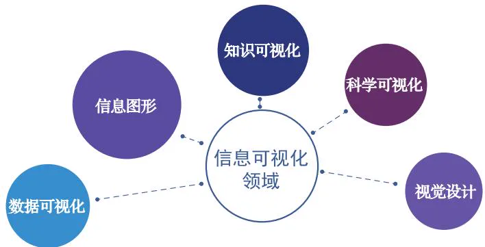  
图1 －7 信息可视化领域

据及其他隐匿模式的奥秘 世纪 年代问世的图形化界面设计 则使人们能够直接与可视化的信息进行交互， 从而造就和带动了十多年来的信息可视化研究。 信息可视化试图通过利用人类的视觉能力来搞清抽象信息的意义 从而增强人类的认知能力 至此 具有固定知觉能力的人类就能驾驭日益增多的数据信息

“信息可视化” 这个术语第一次出现在斯图尔特·卡德、 约克·麦金利和乔治·罗伯逊在 年发表的文章 用于交互性用户界面的认知协处理器 中 他们认为 硬件系统的图形性能和速度已经使得用户在界面中探索 和动画成为可能 而信息可视化是对解决上述两个问题要求最迫切的领域， 因此， 他们开始进行试验， 利用 2D 和 3D 动画来表示信息和信息的结构。 此后， 信息可视化方面的研究和文献陆续出现。

# 2?? 范畴

中文语境的 信息可视化 对应的英文语境是该术语最早由斯图尔特 卡德、 约克·麦金利和乔治·罗伯逊于1989 年提出。 信息可视化并不是无源之水 斯图尔特 卡德在 年的报告中指出 世纪 年代兴起的信息可视化议题实际上早在信息图形领域、 统计学领域、 可视化技术领域、人工智能领域这几个领域就有所体现 （图1 －8）。

信息图形领域 世纪末期的威廉 普莱费尔被公认为数据图形设计之父和经典绘图方法的创造者他在 年的文章 商业和政治图集 中运用了 个时间序列图表来说明经济增长的复杂变化 展示了年 英国的贸易进出口 他同时也被认为很可能是条形图表的创造者 他对于经济数据的时间

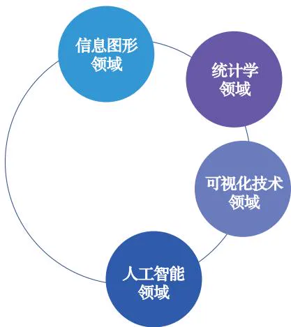  
图 1 －8 20 世纪 90 年代信息可视化涉及领域

连续性的重视使他将多年的数据连接起来， 开创了时间序列的线性表达。

自从经典的绘图方法建立以来 年 雅克 贝尔坦率先发表了图形学理论 该理论确定了构成图形的基本要素 并且描述了一种关于图形设计的框架 年 爱德华塔夫特发表了关于数据图形学的理论， 强调有用信息密度的最大化问题， 这实际上正是信息可视化的本质 后来 雅克 贝尔坦和爱德华 塔夫特的理论在形形色色的领域当中变得闻

名遐迩， 且富于影响力， 从而使信息可视化发展成了一门学科。

（2） 统计学领域。 1977 年， 美国著名统计学家约翰·图基根据自己在 “探索性数据分析 方面的工作发起了一项影响整个数据图形学领域的运动 这项工作的重点并不是图形的质量， 而是从统计学的角度， 利用图片来迅速实现对数据的深入洞察。 例如， 在统计分析过程中 象形图可使人们立即看到 个反映整体数据特征的重要的数值 威廉 克利夫兰在其 年的著作 统计学动态制图法 中详细阐述了新的数据可视化手段 他在这本著作中提出了对于多元变量数据集的可视化处理问题， 而这一问题正是统计科学对数据多元化多维化发展趋势的回应。  
可视化技术领域 硬件进步带来了计算机图形学的发展 这使得用户界面从单线性的指令式发展到多向的交互式 在本什内德曼看来 这种进步为 可视化与图形学 人机交互、 计算机科学、 视觉设计乃至心理学产生了交叉结合的可能性”。

当今世界视觉化和全球化的趋势日益凸显 海量的信息数据必须快速 有效地传递给用户 如今随着信息可视化平台的拓展 应用领域的增加 表现形式的不断变化以及实时动态效果 用户交互使用等技术的创新 信息可视化像所有新兴概念一样边界不断扩大 在这个信息汹涌的社会 可视化技术研究和应用开发已经从根本上改变了人们表示和理解大型复杂数据的方式。 可视化的影响广泛而深入， 引导人们获得新的洞察和有效的决策。

近几年来， 随着互联网的飞速发展， 商业数据的大量计算、 电子商务的全面展开以及数据仓库的大规模应用 产生了更广泛的需求 可视化技术不仅要用于科学数据 而且要作为一个基本工具应用于抽象信息， 揭示信息之间的关系和信息中隐藏的特征。 非物理信息可以通过映射为一种可视化形式来方便观察， 而这些信息都没有明显的空间特征。 除了如何绘制对象的可视化属性的问题以外 更重要的问题是如何把非空间抽象信息映射为有效的可视化形式 这就是信息可视化的研究范畴

人工智能领域 年 罗森布拉特提出了机器学习领域中的人工神经网络模型科学家们开始尝试使用数学模型来模拟人的神经元以及神经网络 以实现机器系统对于人脑决策系统的模拟 人工智能对于信息可视化领域发展的影响主要体现在可视化设计流程的自动化 约克 麦金利的学位论文就曾对这一方面进行过深入的探讨 他在巩固雅克 贝尔坦的设计理念的同时 进一步添加了结合人工神经网络的精神物理学数据和相应的产生式呈现方法。

除了可视化产生形式的变化 人工智能对于可视化的影响还体现在其设计语言和传播方式上 在传播载体上 人工智能带来的便捷性改变了传统的信息可视化传播模式 可以给受众带来多维度的体验感 在设计语言上 人工智能为可视化设计者提供了更为先进的设计工具和设计体验 甚至对设计者的思维方式都产生了潜移默化的影响

从学科外延上 信息可视化是科学可视化 人机交互 数据挖掘 图像技术 图形学和认知科学等理论与方法的结合 从学科内涵上 信息可视化是研究人与计算机所表达的信息及其相互作用的技术 是人与信息之间可视化界面的呈现 是人机交互技术的重要应用领域。

综上所述 信息可视化是一门日益发展的学科 并且是对人的认知能力提高方式的议题有重大关切的学科

# 3?? 内涵

数据信息可视化涉及的内涵包括信息、 思维、 设计和艺术 （图 1 － 9）。

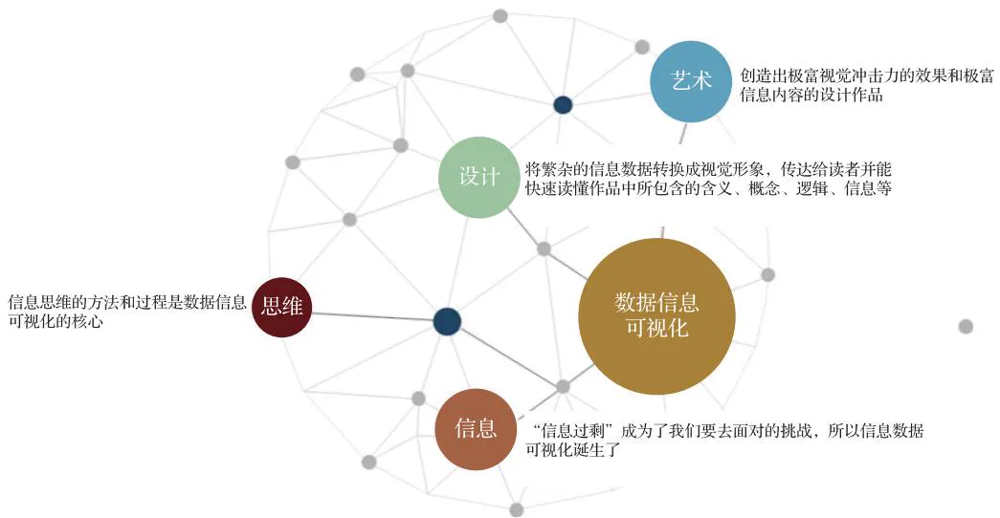  
图1 －9 数据信息可视化涉及的内涵

信息 社会性是人的根本属性 作为社会的人 不断适应社会环境的发展变化是我们生存和成长必须遵循的法则 我们每天都要及时地了解世界 还要与时俱进地学习和提升自我。 所以， 我们每天的第一件事往往都是打开手机、 电视、 电脑， 连上网络。 就在这个动作的瞬间 信息就如同暴风狂雨般向我们袭来 不管我们是否想要 信息都一股脑地传递给我们 占据着我们仅剩的闲暇时间 逼着我们随之游走 因而 思考对于现代人来说就成了一件奢侈的事。 正因为来不及去看去想， “信息过剩” 就成为我们所必须面对的挑战， 信息数据可视化便应运而生了 我们可以利用其全球通用的 视觉语言 对信息数据可视化的过程作一个详细的分析 并且使人们学会将复杂的信息条理化 视觉化 简单化 以便更快地从信息中得到知识继而创造价值 在未来的信息之战中取得胜利  
思维 在这个信息极度膨胀的时代 我们不得不用最简单 最直白的语言与别人沟通交流 所以学会思维就成了一件我们不得不去面对的事情 思维又与信息挂钩 用批判的眼光将思维与没有意义的信息剥离开 将成为我们未来生活必须掌握的最重要的方式

信息可视化的思维方式则是未来世界的发展趋势 它迫使人们钻研人脑与思维之间的关系 了解数据分析的方法 学会去讲述故事 并擅长艺术与设计的创作 同时 将全部有用的信息内容在一个画面上完整地表现出来 要做到精简信息文字 宏观地掌握自己的设计思路并客观地看待作品的信息传递成效 其中的感性与理性缺一不可 所以 在整个信息可视化设计中， 信息思维的方法和过程是其核心。  
设计 视觉可视化设计是跨多专业领域的特殊学科 同时又是一个极具应用价值的设计 其整个思维和设计的过程都是包含着讲故事的分析语言 所以要先把信息整合筛选 并制作出 思维导图 即用更接近人们思考的空间网状结构来设计信息 并将信息罗列出来 然后再将所要展现的信息针对不同的内容与层次创作设计出 分镜头语言 也就

是按照故事顺序将繁杂的信息数据转换成视觉形象 使读者能够最快速地将视觉符号与所要传递的信息内容自然地联系到一起， 并能快速读懂作品中所包含的含义、 概念、 逻辑等。

（4） 艺术。 信息可视化不仅仅是 “信息 $^ +$ 图像” 简单的设计， 它需要以信息内容为核心 通过对信息的收集 分析 筛选 理清思路 再运用巧妙的构思和独特的符合内容的创作， 将要传递的信息内容用讲故事的方式展现出来； 同时， 运用艺术化的表现手法， 创造出极富视觉冲击力的效果和极富信息内容的设计作品 其中 最难的当属怎样将感性艺术创作与理性逻辑思维的冲突表达出来。

# 4?? 意义

信息可视化是一种将不可见的数值或者其他类型的数据转化为可见的表现形式， 并从信息的更深层次获得认知的一个过程。 信息可视化将复杂的信息以图形图像的形式表现， 让这些信息变得更易懂 可以让受众快速地理解信息 所以说 信息可视化也是一种放大人类感知的图形化表现方式。

信息可视化设计将信息数据与图形连接起来 能够简洁高效地将信息传递给受众 它将文字 数据或者概念提炼并简化 使得视觉中枢能更敏感地观察到其中重要的信息并容易理解的可视化设计展示的信息。 图 1 －10 为 “凯度信息之美” 金奖设计作品 《食品的节奏 该作品使得受众能轻松愉快地接收信息 作品将数据 文字或者表格制作成更易于理解的形式 在处理大数据的时候能简明扼要地突出重点 并弥补受众之间的知识差距 将复杂的信息图形化 简单化 扫除了受众的学习障碍并加强了学习能力 直观地将数据展现出来 受众能更好地理解数字背后的意义 图 为希瑟 琼斯的信息图表作品 《权力的游戏解码》。

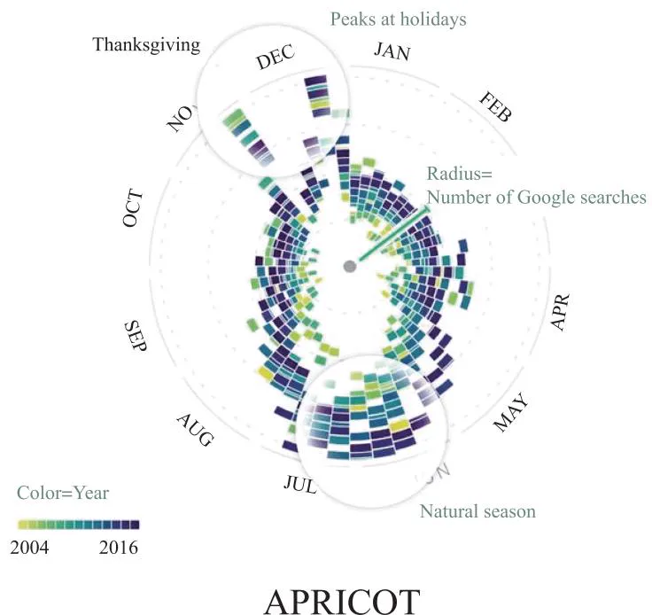  
图1 －10 “凯度信息之美” 金奖设计作品 《食物的节奏》 （2017 年）

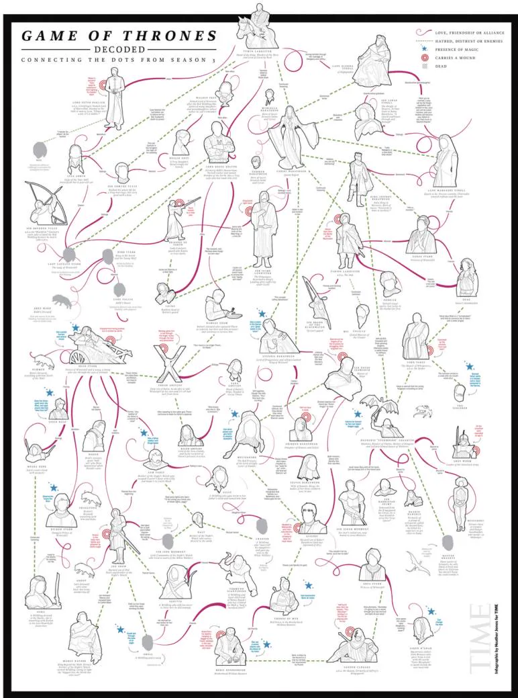  
图 1 － 11 信息图表作品 《权力的游戏解码》 （作者： 希瑟·琼斯， 2014 年）

信息可视化研究逐步深化的同时 信息量和类型也在不断扩大 可视化的方式作出了相应补充。 如今的信息可视化涵盖信息收集转换综合处理、 视觉设计、 数字媒体艺术、 格式塔心理学和马斯洛需求理论等多领域归纳应用呈现信息的方法 图 是信息可视化在现代艺术设计领域的新形式、 新方向。

# 三、 信息可视化设计的科学与艺术

# （一） 信息可视化的现状

当今社会已经进入了图像时代 相对于文字 图像对于信息的传播有强烈的视觉冲击力 图像的特征更加直观 生动 例如 在当今竞争激烈的市场经济中 产品不仅要有高质量 而且要有良好的品牌形象和对大众的吸引力 这种从外部到内部的吸引力如果仅仅以文

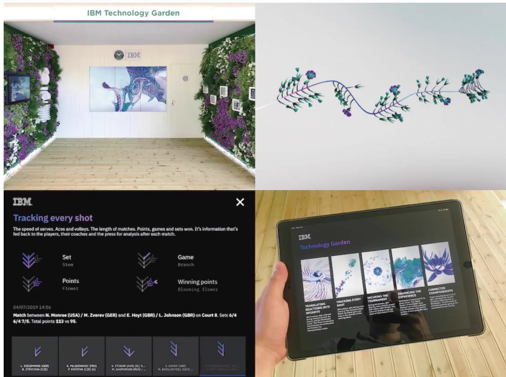  
图 1 － 12 信息可视化装置设计作品 《IBM 科技花园》 （2019 年）

字信息来表达是不够的 因为商品的吸引力需要在情感上感染用户 文字在信息传播的媒介中受到地域的限制 有 不可通性 的特点 人类在漫长的文化历史中一直在努力寻找一种通用的语言。 如今图像取代文本的视觉信息转化已成为当下的现状。

从精准传达视觉信息的视角 图形的简洁统一是传达信息的一种更有效的方式 人类生来就具有用图形表达客观世界的能力 人类在还不会写字的时候就本能地用笔涂鸦 原始人类就用绘画符号记录信息 虽然世界上的语言和文字是不一样的 但人们对图形的视觉感知力是基本相同的 因此图形表达信息是超越国家的通用通信语言 视觉符号设计后的图形形象在信息的传播和交流中发挥着极为重要的作用 图 为信息可视化图形设计作品 关于叙利亚历史

从媒介技术发展的视角 数码相机 网络多媒体等电子传媒的一个重要特点就是用图像符号替代了非具象性的符号 由于它们用图像直接作用于人的视觉 消除了人们的知觉与符号之间的距离 消除了从符号的所指到能指之间的思维过程 美国文化研究学者尼古拉斯米尔佐夫说 新的视觉文化最惊人的特征之一是它越来越趋于把那些本身并非视觉性的东西视觉化 特别是伴随着技术发明与数字媒介的不断推陈出新 数码产品的廉价销售使大众成为图像的消费者与潜在的图像生产者 人们越来越无法摆脱对图像的依赖 图像时代的日常生活重构了人们的社会关系与感觉方式 也使得人们的生活方式与交往方式得以改变图1 －14 为传感器数据可视化作品 《人工感官》。

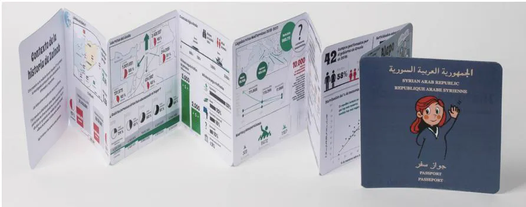

  
图1 －13 信息可视化图形设计作品 《关于叙利亚历史》 （作者： 金·阿尔布雷希特， 2018 年）

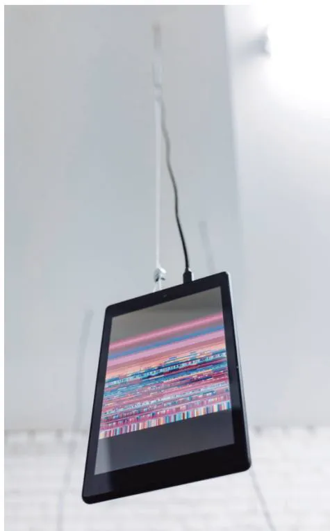  
图 1 － 14 传感器数据可视化作品 《人工感官》 （作者： 金·阿尔布雷希特， 2018 年）

从用户行为与需求改变的视角 人们传统的阅读信息体验是以文字印刷文化为主的文本阅读 由于生活方式和文化接收容量的改变 到了现代 人们对于信息的接受模式则转变成直接追求视觉感官快感的体验 纯文字的信息对于接收者的文化有一定要求 强调对于文字信息的认知性 象征内容有抽象的思维方式 要把文字转化为特定的象征信息是有一定速度的要求。 摄影、 影像技术的发展使得图形、 图像更多、 更真实地充实于人们生活的各个角落。 而图像的直观性、 娱乐性迎合了人们视觉感官的需要， 也符合当下 “快读信息” 的生活要求。 图 1 － 15 为信息可视化设计作品 《为什么医疗保健如此昂贵》。

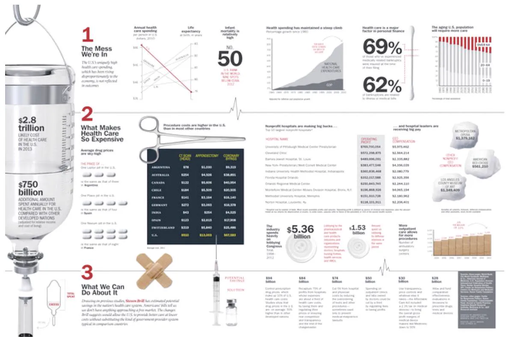  
图 1 － 15 信息可视化设计作品 《为什么医疗保健如此昂贵》 （作者： 希瑟·琼斯， 2013 年）

# （二） 信息可视化设计的特征

年 美国认知心理学的创始人乔治 米勒创造了信息 一词来描述人类渴求信息的行为 乔治 米勒认为 就像身体靠吸收负熵而生存一样 大脑也靠吸收信息而生存 法国学者米歇尔 德赛图也指出 今天 从电视到报纸 从广告到各类商业形象 我们的社会充斥着像癌症一样疯长的视觉形象 所有东西的价值都取决于显示或被显示的能力 谈话也被转化为视觉过程 特别是在信息大量冲击视觉神经的当代社会 在报纸、 杂志、 电视、 网络和每天出现的新产品、 新科技都刺激着人们主动或被动地接收视觉信息的大背景下， 信息可视化设计与传统视觉传达设计相比更具优势的三大特征是思维可视化、 无障碍化与多维感知体验化 （图1 －16）。

  
图1 －16 信息可视化设计的三大特征

# 1?? 思维可视化

思维可视化是通过一系列图示技术将原本看不见、 抽象的思维呈现至表面并使其可见的过程 被可视化的 思维 更有利于理解和记忆 可以有效地提高信息处理和传输的效率简单理解就是人们的思维在大脑里是以看不见摸不着的信息存在的， 但是以文字或图像形式呈现出来， 可以更直观、 更方便去理解、 整理与加工， 而整个记录的过程就是将大脑信息可视化的过程， 这就是思维可视化。

一图胜千字 图是最直观的语言 易读 易懂 易记而且记得牢 实现思维可视化的最有效方式便是用 图 把 思维 呈现出来 思维可视化包括思维导图 模型图 流程图概念图 图片 图标 漫画 表格等绘图技术 此外 还包括思维图的呈现 传播 存储互动、 共享和修改等系列 （图1 －17）。 其 “可视化” 不仅仅是美学层面的表现形式上的再设计， 也是对 “信息” 本身的一种深度数据挖掘。 信息可视化设计是左右脑的交融， 是感性与理性的交融 是无形与有形的交融 是艺术与科技的交融 因此 通过艺术来表达理性思维， 是信息可视化设计的特征之一。

# 2?? 无障碍化

信息可视化设计的无障碍化理念自 世纪 年代开始就已引起相关人士的关注 并陆续由政府支持开展研究以及制定相关法规和标准。 现代社会， 信息大量冲击着人们的视觉神经 报纸 杂志 电视 网络及新产品 新科技层出不穷 这些都刺激着人们主动或被动地接受视觉信息， 被动地接受信息会导致不同程度的视觉接收障碍和视觉麻痹， 因此视觉设计师越来越注重视觉信息传达的有效性

信息可视化设计把图形符号进行规范化和易读性的设计 图文的呈现有助于消除认知障碍 并且图形符号信息传达的秩序性和可兼容性 可以减少因文化差异 地域环境社会发展因素、 生理障碍等方面的识别阻碍， 能极大地方便人类信息交互的畅通 （图 1 －所以 信息可视化设计的无障碍化特征 可有效增强信息传达的有效性和准确性

# 3?? 多维感知体验化

信息可视化设计的目标是让受众真实 高效地接收所传递的信息内容 随着新技术和数字媒介的发展 信息可视化设计的运用维度也在不断革新 与传统的二维表现形式相比 使用语音或 技术可以创造沉浸式体验 让用户更有场景化 提升受众的多维场景感知， 最大限度地发挥受众体验的优势， 实现信息传达的近零消耗。

以语音交互场景为例 界面通过用户语音唤起自动触发 通过语音触发用户的行动点控制信息多层次渗透 同时 由于信息的多维度传输 图像和声音同时输出 就像一个真实的场景被呈现出来 保证用户对于信息获取的时效性的同时 用户的体验感知也随之增强如今 信息可视化设计还将不断结合新技术的融合运用 创造出全新的多维感知体验（图 1 － 19）。

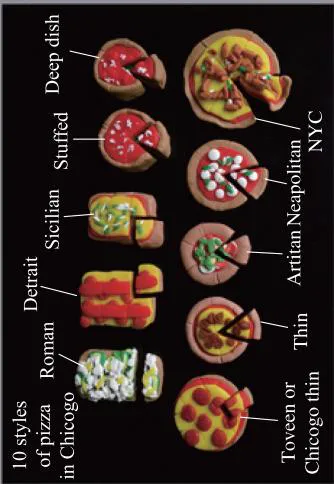

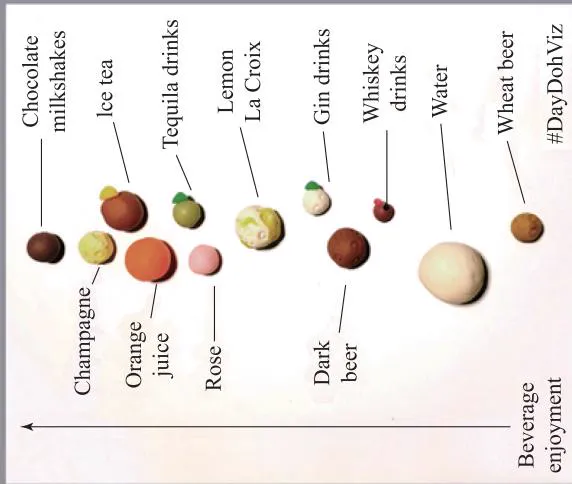

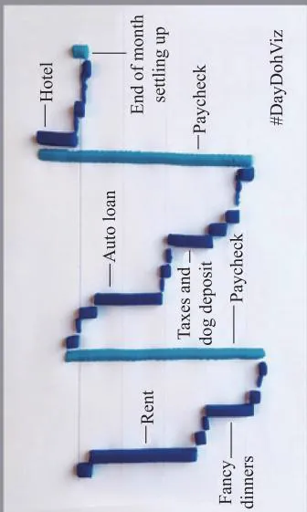

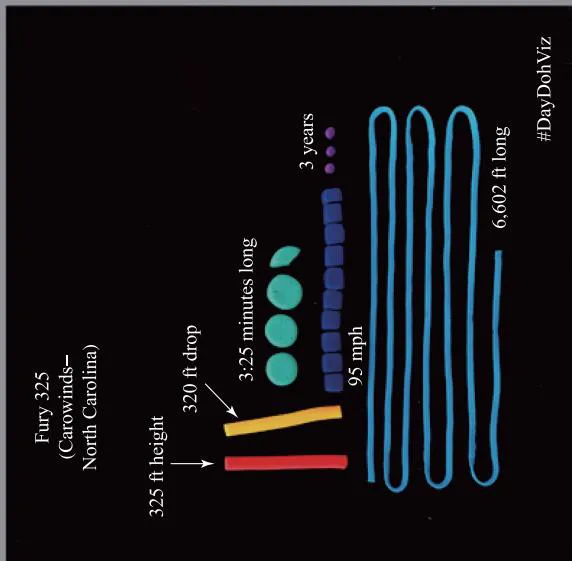

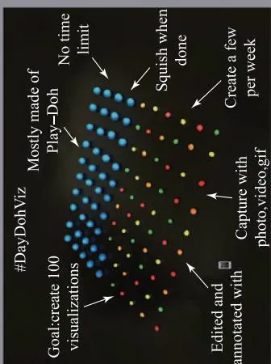

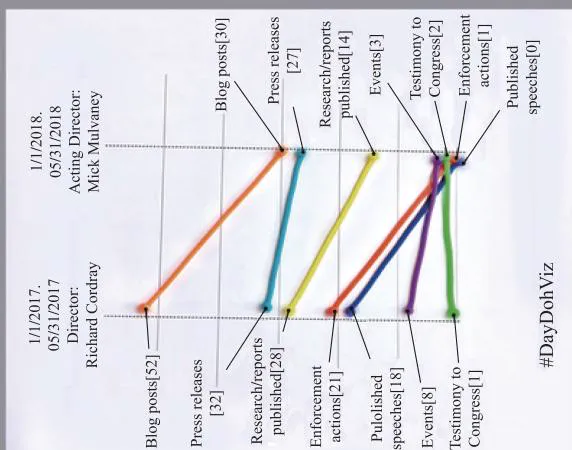  
#$%&'()*!+
,$%&"#)
-$.
/%0
12&%&!' 3' ! "!#

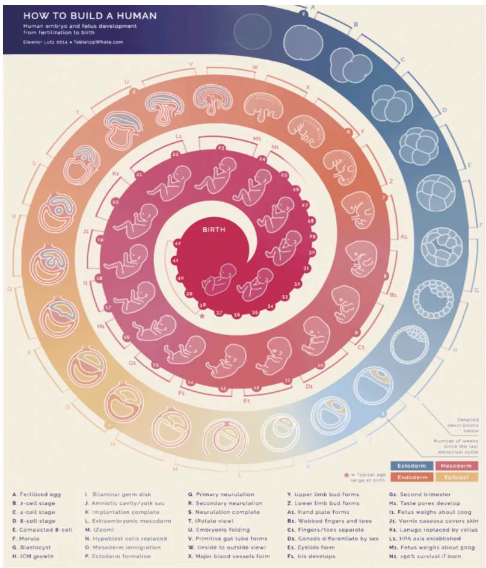  
图1 －18 信息可视化设计作品 《人是如何诞生的》 （作者： 埃莉诺·卢茨， 2015 年）

  
图 1 － 19 信息可视化设计作品 《星巴克数据墙体验》 （作者： 阿提维， 2019 年）

# （三） 信息可视化设计的未来

随着大数据时代的到来 海量数据信息可视化已成为研究和实践的一种趋势 由于信息可视化致力于解决如何以清晰、 高效、 美观、 有趣的方式呈现数据的问题， 继而帮助人们更好地理解与感知数据中的内容 因此 未来信息可视化的重要性不言而喻

沃森健康的副总裁阿尼尔 贾因提出了大数据的 大特征 数据量大 多样性 高速性、 真实性、 经济性 （图 1 － 20）。

（1） 数据量大： 大数据的起始计量单位至少是 P （1000 个 T）、 E （100 万个 T） 或 Z（10 亿个 T）。  
（2） 多样性： 多种类型的数据， 包括网络日志、 音频、 视频、 照片、 地理位置信息等，对数据处理能力提出更高的要求。  
（3） 高速性： 速度快， 时效高， 这是区分大数据和传统数据挖掘的最突出的特征。  
（4） 真实性： 是指数据的真实性与可用性。  
经济性 随着物联网技术的广泛应用 信息感知无所不在 信息浩瀚 但价值密度低。 如何通过强大的机器算法更快地 “净化” 数据的价值， 是当前大数据时代面临的紧迫问题。

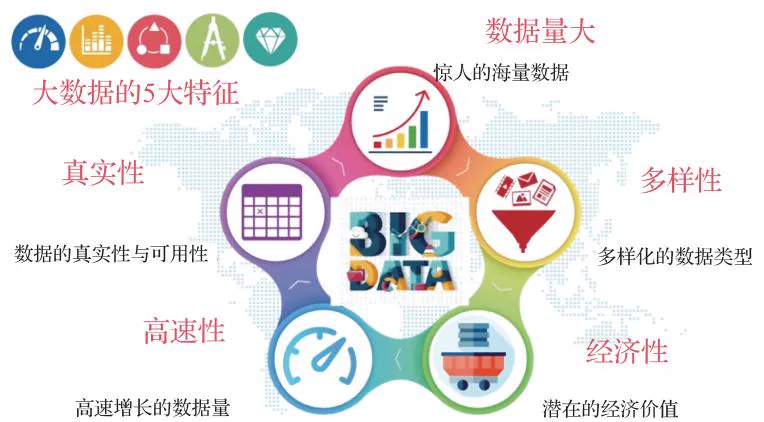  
图1 －20 大数据的5 大特征

这些特点对从传统的信息可视化模式向大数据的可视化模式转变提出了挑战 现有的技术架构和路线已不能有效处理如此大量的数据 对于有关组织而言 如果没有及时有效的反馈 所收集的信息就不值得投资 可以说 大数据时代对人类的数据驾驭能力提出了新的挑战 为人们提供了前所未有的深度和全面洞察能力的空间和潜能 同时 信息可视化作为一种信息展示 交互以及分析的技术 在涉及信息展示 交互或信息分析的领域里都将大展身手， 对信息可视化的研究与应用也不断深入， 呈现出可视化与交互技术的持续融合、 个人可视化设计范式的兴起、 可视化叙事作用的强化等趋势。

# 1?? 可视化与交互技术的持续融合

随着数字化媒介的兴起与发展， 以结构为中心的可视化研究范式向潜在现象的动态属性可视化研究转移 人与信息之间交互形式也越来越丰富 对于设计者来说 可以发挥出极大的创造力 实现更多信息可视化设计的可能

在2020 年 IEEE 国际虚拟·现实 （IEEEVISA） 大会上， 有多篇论文提出了全新的交互解决方案 等把一些经典的可视化图表用 技术呈现给人们 在原图表中 因为数据是以二维的形式呈现 所以受众很难直接感觉到其速度和高度的差异 在运用 技术的沉浸式呈现下， 受众可以直接站在埃菲尔铁塔等建筑下面， 如图 1 －21 （d） 所示， 体验数据信息的真实尺度 随着全息影像 打印等技术的不断进步 未来的信息更多的是以三维四维的方式呈现 方便用户从各个角度观察信息 解读数据

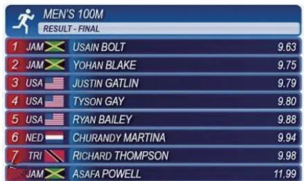

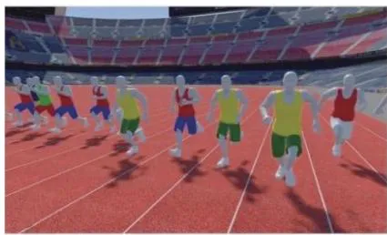

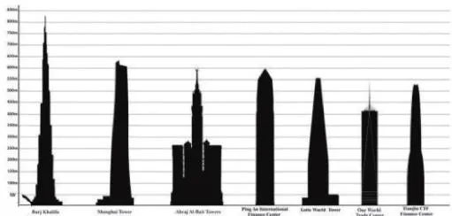

图1 －21 运用 VR 技术的信息可视化  
  
（a） 男子 100 米比赛成绩； （b） 比赛现场虚拟现实显示；  
世界建筑高度对比图 埃菲尔铁塔等建筑虚拟现实显示

年 上反映新冠疫情的信息可视化作品 流动的边界 是很具代表性的可视化与交互技术深度结合的案例 （图1 －22）。 作品将数据放置在三维空间上， 并大量使用鼠标点击 滚动 拖拽等方式 让用户在与数据交互的过程中充分感受到视觉冲击与震撼

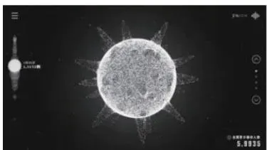

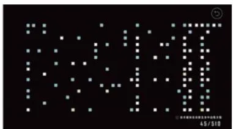

  
图 1 － 22 信息可视化交互设计作品 《流动的边界》 （2019 年）

# 2?? 个人可视化设计范式的兴起

设计已经从同质化的体验转变为追求个性化和创新性 信息可视化设计也是如此 研究如何帮助人们创造更加个性化 千面化的可视化设计成为了一种趋势 例如 是一个个性化的可视化创作应用程序 （图 1 －23）， 它支持从图像中提取材料和生成象形图，每个用户都会生成不同的可爱风格的贴纸和贴画

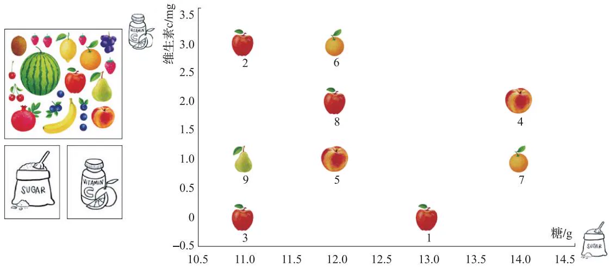

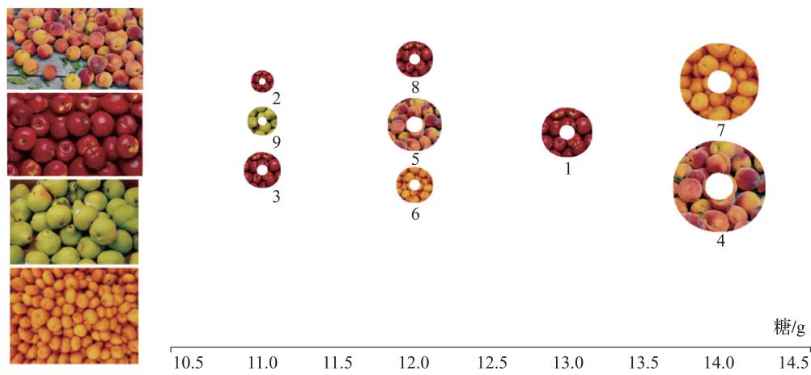

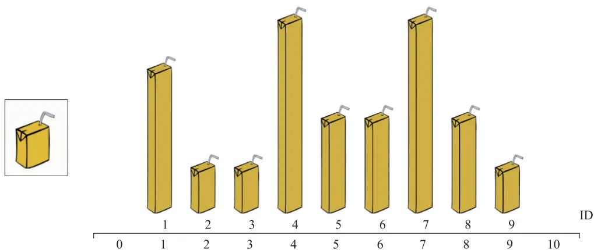  
图 1 － 23 可视化创作应用程序 Data Quilt

可视化创作系统 Dear Pictograph （图1 －24） 则支持在 VR 环境中自己绘制图形作为设计元素 用于信息可视化的呈现 这种可视化范式真正让信息 活 起来 以其独有个性的方式 通过文字 画面 语音 视频等全方位向受众呈现其想表达的信息含义 更能深入人心。

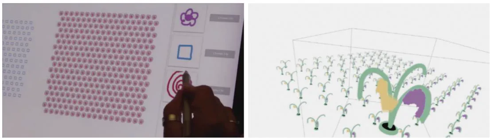  
图 1 － 24 可视化创作系统 Dear Pictograph

# 3?? 可视化叙事作用的强化

可视化叙事为可视化指明了方向， 虽然理论和技术都在不断发展与探索， 但在新闻、 教育和文化等领域有更多的表达方式和可视化叙事的需求 也表明了可视化叙事是可视化的未来发展趋势之一。

以第七届 “全球数据新闻奖” 获奖作品 《生活在难民营》 为例 （图1 －25）， 作品是根据英国路透社制作的一篇聚焦 孟加拉国罗兴亚难民营 的数据新闻 运用模块化可视化叙事的设计方式将新闻模块化 用户可以选择感兴趣的模块进行详细了解 也可以迅速滑过此模块调到下一个模块进行了解 并按照可视化叙事发展的逻辑 分成整体叙事模块和展开叙事模块两部分。 作品以数据信息作为驱动， 承载了人文关怀， 希望能给世界带来更美好的改变。

  
Refore the exodus tivedintwonerbymakeshiftcamps In this satellite image,takenMay26.

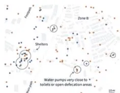  
  
  
图 1 － 25 第七届 “全球数据新闻奖” 获奖作品 《生活在难民营》

# （四） 信息可视化设计的相关科学

# 1?? 格式塔原理

格式塔学派是产生于 世纪德国的重要心理学流派之一 代表人物有魏特海默 柯勒

考夫卡 格式塔原理对现代美学具有基础性的影响 格式塔原理解释了人类视觉是如何工作的， 并发现人类视觉是整体的， 视觉会自动将它所看到的东西形成一个完整的形状， 而不是仅仅看到不相连的形状 同时提出人类的视觉判断还受到经验的制约 因此 格式塔学派在视知觉研究方面作出了巨大的贡献。

魏特海默提出了格式塔知觉组织原则 靠近性原则 相似性原则 连续性原则 闭合性原则 主体与背景原则 简单对称性原则 共同命运原则 通过学习格式塔原则 可以为信息可视化设计提供理论支撑。

（1） 靠近性原则： 在感知领域中， 对客体的感知是根据物体各部分之间的紧密程度来进行的。 这两个因素越接近， 就越有可能结合在一起。 它显示了更强的关系。 但是近距离也是有区别的 在一个复杂的设计中 必须在考虑它们之间内在逻辑关系的同时进行排版 例如以四行四列等间距排列状的小圆点为例 （图 1 － 26）， 当每列间距不动的情况下， 每行的小圆点在原有基础上移动并靠近 这时人们的视觉会以 行 对这些原点进行分组 同样行间距相同， 只将列间距进行缩小， 人们的视觉会以 “列” 对这些原点进行分组。

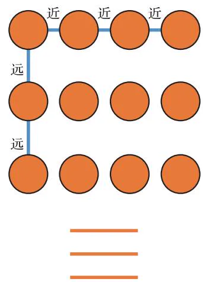

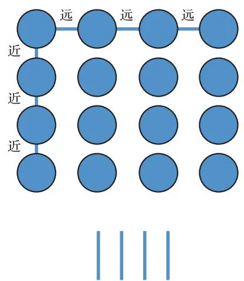  
图1 －26 靠近性原则图例

（2） 相似性原则： 当人们感觉到类似的东西时， 只要不被接近因素的东西打扰， 人们就会把它们放在一起。 换而言之， 相似的部分在知觉上形成群体 （图 1 －27）。 例如， 当人们在公共场所小团体聊天时 人们能听到有人在喧闹声中说话 因为那个人的讲话音质总是相似性的 如果他的说话音质不断变化 就很难把他的话和场所噪声区分开来 总之 人们倾向于把具有明显共同特性的事物 （如形状、 大小、 共同的运动、 方向、 色彩等） 作为一个整体来考虑 具有类似视觉特征的元素被认为比没有类似视觉特征的元素更有联系性  
（3） 连续性原则： 在连续性原则下， 人们的视觉感知倾向于感知连续的形状， 而不是分散的碎片 即使形状是不相连的 人们的视知觉也会感觉它是相连的 图 它是人们生活中经常发生的事情 就像通常的拼图一样 即使它被打破了 人们仍然可以用常识和经验拼凑起来  
闭合性原则 当我们看到一个熟悉的视觉形象时 人们会把不完整的局部形象作为一个整体 这种感知的结束被称为闭合 如果局部图像过于陌生或片面 则不会出现整体

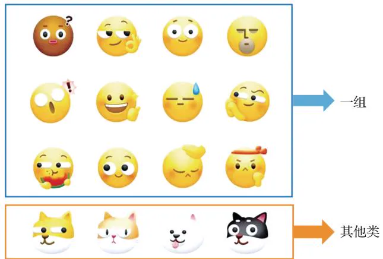  
图1 －27 相似性原则图例

闭合联想 即使没有外形的限制 人们也能自动填补图形在大脑中形成整体形象 例如卡尼萨三角 图形 初看可能会看到一个有黑边三角形 上面堆放着一个白色的倒三角形。 事实上， 图片中没有三角形， 只有散乱的线条和三个有凹槽的圆形 （图 1 －29）， 但人们的大脑认为图形有一个倒三角形。

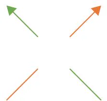  
图1 －28 连续性原则图例

  
图1 －29 “卡尼萨三角” 图例

主体与背景原则 主体是指在界面中占据人们主要注意力的全部元素 此时其他的元素则为背景 当主体与背景重叠时 人的眼睛倾向于将小客体作为主体 将大客体作为背景 通过大小与图形的关系来表达人们想要表达的内容的不同层次 即当小图形与大图形重叠时， 人们的视觉倾向于将小图形划分为主体， 将大色块划分为背景 （图1 －30）。

  
图1 －30 主体与背景原则图例

简单对称性原则 在观察事物时 人们的第一印象往往是简单和对称的模式 对称的 规则的 光滑的 简单的图形特征往往形成一个整体 对称的元素通常被认为是属于一起的， 不管它们相距多远， 它们都会给人们一种坚实有序的感觉 （图 1 － 31）。

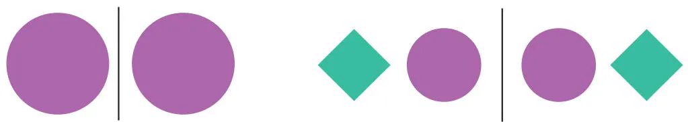  
图1 －31 简单对称性原则图例

共同命运原则 除去共同命运原则外 其余原则主要涉及静止的形体和物体 但共同命运原则则涉及运动中的物体。 共同命运原则与靠近性原则、 相似性原则密切相关， 这些原则都影响着人们是否能从群体中感知事物。 共同命运原则认为： 一起移动的物体被认为属于同一个群体或彼此相关 （图 1 － 32）。 这一原理广泛应用于许多动态信息可视化设计中。

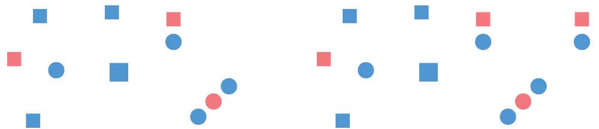  
图1 －33 信息传播和交流的7 个要素

图 1 － 32 共同命运原则图例

# 2?? 符号与传播学

视觉信息的生成和发展是在符号的编码和解码过程中进行的 人类通过图像 声音或空间来体验事物的意义 由于地理位置 时代 国家 语言 思维方式以及文化传统构成图像的方式不同， 人们不需要把自己置于他人的语境中， 因为人们有自己的解码方式。

人类是群体社会动物 所以交流行为是必不可少的 沟通是指人与人之间信息的交流人们利用符号来实现意义的传递， 这也是一个视觉符号化和视觉符号解释的完整过程， 是人们在不同的空间和时间实现信息共享 行为协调的过程 在人际交往过程中 信息传播和交流的过程包括7 个要素 （图1 －33）。

信息源：传播信息和知识的个人或集合体

编码：将传播的内容转化为有意义的符号和符号系统

信息：用来传达的符号系统

通道：用于传递信息的媒体

信宿：接收信息的个人或集体

解码：还原已被接收的符号系统的原意

反馈：受众以自已的态度和行为（回应）将信息反馈给发信体

这7 个要素相互连接， 构成了传递信息传输的回路。 其中视觉符号的产生和信息传递的完成过程主要由信息源 编码 信道和解码组成 即以信道为媒介的传播者编码过程和接收者解码过程。

（1） 信息源即信息传播主体， 从信源的传播技术看， 传播必定要与科技相融合， 数字化的采集与存储技术、 人工智能、 虚拟现实技术等都可为其提供技术支持； 从信源的态度看 信息传播者能否主动 自觉 充分了解自己的传播内容 传播目的和传播对象 是信息传播能否取得效果的关键 从信源的知识和文化看 信息传播者与信息接收者的文化程度也对传播影响巨大； 从社会系统看， 国家政治、 经济、 文化制度是影响传播的外部环境， 良好的社会氛围有助于提高传播者的传播意识， 强化传播效果。  
编码是信息作为传播的客体进行内容 符号和处理的过程 在传播过程中 信息传播者需要将其 编码 将内容 结构与成分予以艺术化呈现 信息传播者可根据不同的载体， 如语言、 图像、 视频、 音乐等， 呈现出不同的表达方式， 以更加具象化的形态激发接收者的共情效应， 促使其理解信息的内在价值。 当然， 信息传播者对内容、 符号的处理方式也会影响信息传播的传播效果。  
信息作为传播的客体主要包括内容 符号和处理 在可视化元素的传播过程中信息传播者需要将其 “编码”， 将内容、 结构与成分予以艺术化呈现。 信息传播者可根据不同的文化载体， 如语言、 图像、 视频、 音乐等， 呈现出可视化内容不同的表达方式， 以更加具象化的形态激发接收者的共情效应 促使其理解信息的内在价值 当然 信息传播者对内容、 符号的处理方式也会影响到信息传播的接受度和传播效果。  
通道作为信息传播的通道 主要指信息传播的技术通道与表现形式 早期传播因时间 地点 空间 人力 物力等多方面的因素 制约其传播的广度和深度 新时代的数字化艺术传播则可打破这些制约， 通过数字媒介， 打通受众的视觉、 听觉、 嗅觉、 触觉和味觉等通道， 从而使信息得到全方位的有效传播。  
信宿是影响信息传播效果的关键一环 信宿的传播技术 态度及其信息内容方面的相关知识、 文化与社会背景等， 对其接收信息并做出相应反馈具有重要影响。 而且， 信宿除被动获取信息外 还可对信息进行反馈和再传播 在传播过程中 信息可能会受损 也可能会被再次 编码 原来的信宿就会变为新的信源 原来的信源则会变为新的信宿 实现信息交互 所以 信息可视化传播应注重大众对于信息的感受程度 加强与大众的互动联系， 激发其主动吸收和传播信息。  
解码也称为译码 是指信息在思想传递过程中被重构的方式 解码是意义传达的另一个重要组成部分 是符号解读的过程 符号化的人类行为是从编码到解码 从发送到收讯的一个完整过程。 发送者对思想和感情进行编码， 信息的编码过程是有象征意义的。 解码是对符号或符号表达方式的解释 解码与编码的关系反映了对主客体的认识和被理解  
反馈指信息传送者和接收者之间的相互作用 是沟通成立的必要条件 是信息接收者在获得信息后或根据信息采取行动后会根据自己的理解 感受和经验提出自己的看法和建议。

