# 第二章

# 信息可视化设计的发展

# 一、 远古时代— 信息可视化的原始时期

早在远古时代 人们就逐渐记录和勾勒出周围的衣食住行和自然环境 创造了洞穴壁画和后来制作的地形图。 这种壁画不同于单纯的文艺创作， 是为了更好地传达某种意图或描述某种事物 它是人类以一种原始方式记录特定时代信息的方式 这种记录方法为研究当时的自然环境 经济发展 宗教信仰 文化艺术等提供了可靠的数据信息 中美洲的印第安人用各种图形来记录他们祖先的种种事迹 这些图形能够帮助他们记忆那些历史久远的故事 并通过同样的办法一代一代地传递下去。

# （一） 洞窟壁画

公元前 年的美索不达米亚洞窟壁画可以称为是第一个信息图 描绘了附近动物和其他资源的情况 图 信息图表作为数据信息的可视化 在没有文本生成的情况下绘画成为一种非常广泛的交流和记录信息的方式 岩层上的壁画反映了人们对信息内容的视觉效果和表现个人行为的方式 也反映了人们最初用来传达信息内容的智慧

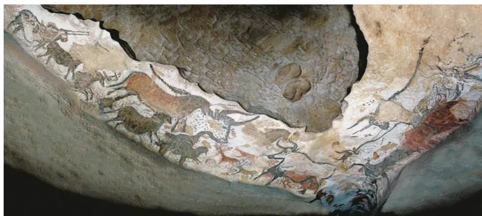  
图2 －1 美索不达米亚洞窟壁画

# （二） 伊拉克巴比伦泥板

年 考古工作者在伊拉克巴比伦遗址以北 英里 千米 的一个考古挖掘场中发现了一个早期泥板地图 图 该地图绘制有楔形文字和符号 据认为可以追溯到公元前 公元前 年 它代表了一个以丘陵或山脉为界 被河流一分为二的地区 该泥板上所显示的丘陵或山脉被类似鱼鳞状的重叠半圆所代表 这种绘图方式正是地图

制作者和插图画家几个世纪以来用于象征和表示山脉的方法之一。

# （三） 结绳记事

结绳记事是古代人们摆脱时空限制 记录客观事实和传播信息内容的一种古老方式图 结绳记事出现在语言产生之后 文字产生之前的漫长年代里 据科学研究 在古代秘鲁 结绳记事可能意味着与当时生活息息相关的事物 如计数 地位 总数 崇拜 祭祀等。 结绳记事方式存储的信息内容比较抽象， 是一个将信息转换成符号进行传输过程的雏形。

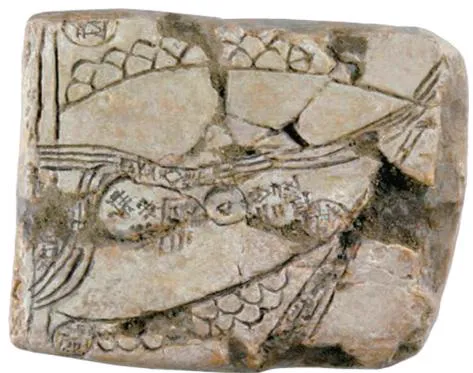  
图2 －2 最早的泥板地图

  
图2 －3 结绳记事

# 二、 文字时代— 信息可视化的萌芽时期

文字的出现与岩画一样 源于对自然事物的模仿和提取 可以说 文字的出现是人类历史上的一次信息革命。

# （一） 苏美尔楔形文字

公元前 年左右苏美尔地区的苏美尔文字体系进入了充分发展的阶段 图 是当时人们用锋利的工具在陶土或泥板上刻出的类似象形符号的文字 苏美尔楔形文字是逐步产生的 据统计 楔形符号共有 种左右 由借助图形表达某种观念到文字的出现经过了年的演化过程

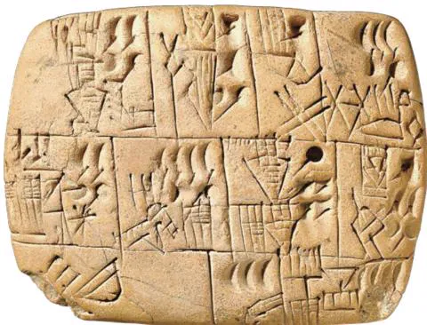  
图2 －4 苏美尔楔形文字

# （二） 古埃及纸莎草纸文字

公元前 年左右 古埃及人用象形文字 即信息图 来表述生活 工作和宗教的故事 通过古埃及的纸莎草书 人们可以发现当时古代埃及人将图像和文字结合在一起 传达了宗教信仰 法律 灵魂以及来世等信息 图 图形符号在当时已经成为一种较为可信而且普遍的视觉载体 用于进行信息的传递和交流 图形符号所具有的符号性 形象性以及情感性等特征都使其成为横跨古今的时代语言

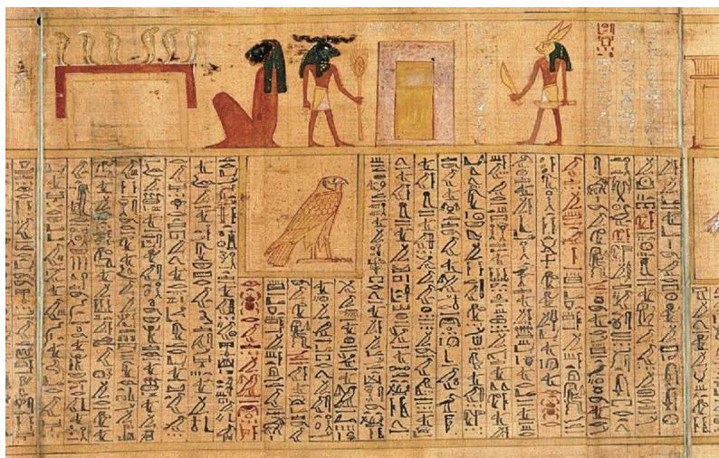  
图2 －5 古埃及纸莎草纸文字

# （三） 甲骨文

甲骨文是我国的一种古老文字 是人们能见到的最早的成熟汉字 图 甲骨文是指我国殷商晚期王室在龟甲或兽骨上为占卜和记事而刻写的文字 是我国及东亚地区已知最早的文字体系 也是商代文字的信息内容媒介 甲骨文具有明显的视觉符号特征 描述内容涉及原始政治、 经济发展、 国防、 文化习俗、 天文历法等信息。

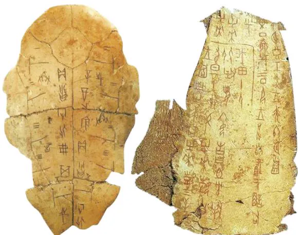  
图2 －6 甲骨文

# 三、 地图时代— 信息可视化的雏形时期

地图是最早的信息可视化形式之一， 也是真正意义上的信息可视化雏形。

地图是基于数学思维在平面图上进行的梳理和符号缩绘 形成地球上或星空中产生自然现象和社会问题的图形 地图的媒介是多种多样的 所有地图和构成介质的因素都包括图形因素、 数学因素、 辅助因素及其补充说明。 其中， 图形因素是地图的主体， 把自然、 社会经济等需要表示的现象通过地图符号表示， 从而形成图形要素。 确保地图可测量和可比的基础是数学因素 数学因素包括地图投影 地图坐标系统 比例尺和控制点 辅助因素包括地形图名称 图例 地图编号 创建者 制作时间 地形图主要参数等 补充说明是指利用数据图表、 剖面图、 照片、 文字等方式补充地图的内容。 这些按照统一的设计和编制的多幅地图的集合称为 “地图集”。

自石器时代以来 人们开始制作地图 其中最早的地图出现在公元前 年的土耳其地区 而中国的地图最早出现在 年前的战国时期 在古代 地图其实是最具有价值的工具 因为它可以帮助所有人了解这个复杂信息交织在一起的地球 甚至是星际宇宙

# （一） 马王堆汉墓地图

根据考古发现 我国最早的地图是湖南长沙汉马王堆三号墓中出土的地图 图这是绘制在绢帛上的三幅地图 后来被简称为 地形图 驻军图 城邑图 绘制年代大约在西汉时期公元前168 年。 《地形图》 《驻军图》 修复后基本恢复， 《城邑图》 因破损严重 至今未恢复 地形图 全称 西汉初期长沙国深平防区地形图 是第一幅用彩绢绘制的地形图。 《地形图》 具体描绘了汉代长沙南部， 即湘江第一主要支流小水河段、 南岭、九嶷山及周边地区 该地图还描绘了山峰 河流 土地和道路

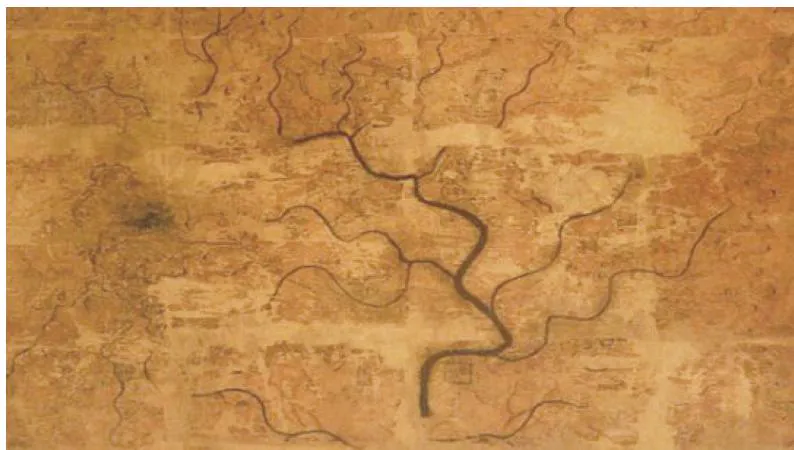  
图2 －7 汉马王堆三号墓出土的 《地形图》

# （二） 中国古代雕版地图

我国目前发现的最早的雕版印刷实物地图， 是南宋或唐代出版的 《九州山川实证总图》图 九州代表冀 兖 青 徐 杨 豫 荆 雍 梁 大区域 加上山川 河流

湖泊和海洋信息， 构成一张较为完整的地图。

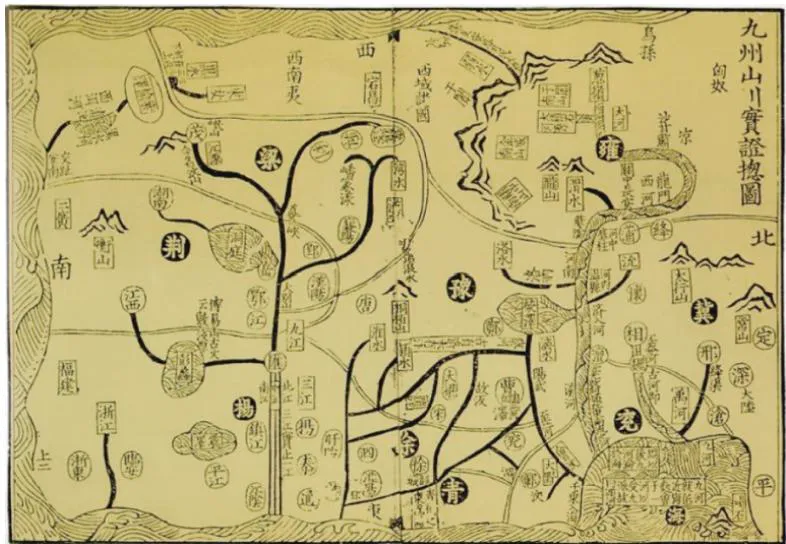  
图2 －8 中国最早雕版地图 《九州山川实证总图》 （局部）

考古学家还发现宋朝的 《古今华夷区域总要图》 （图2 －9）， 据考证是公元1185 年前后制作的地图 该地图较全面地绘制了宋代全国 路及州郡分布情况 其中还包括海岸线和岛屿等信息。

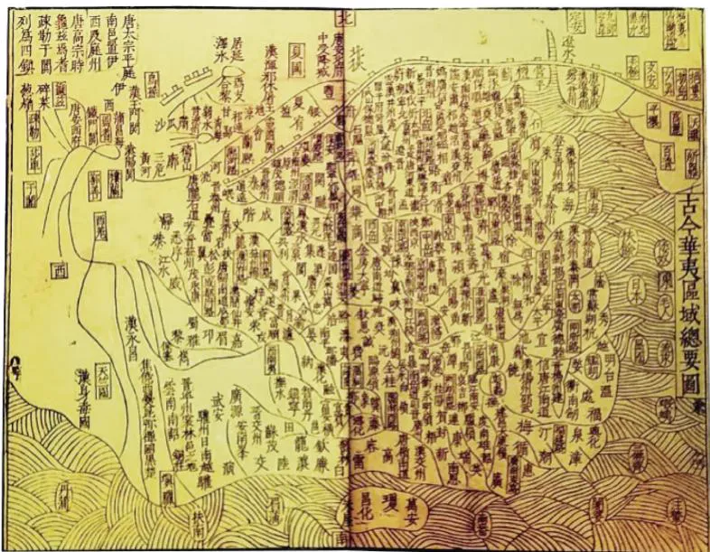  
图2 －9 宋朝 《古今华夷区域总要图》 （局部）

# （三） 中国最早的世界地图

大明混一图 是中国制作的最早的世界地图 图 作者不详 依据图上两个关键地名 广元县 和 龙洲 推定此图绘于明洪武二十二年 年 这张彩绘绢本明朝世界地图以当时明朝的版图为中心， 东起日本， 西达欧洲， 南括爪哇， 北至蒙古， 是我

国目前已知尺寸最大 年代最久远 保存最完好的古代世界地图 地图的出现源于探索广阔世界的欲求。 地图代表着另一种语言表达和文字， 象征着一个时期的文明。 明朝初期能够制作出这样的地图 说明当时的文化水平非同一般 沿海地区地貌的精确水平也显示了明代在远洋航行方面的探索和实力。

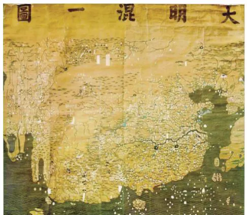

图 2 － 10 明朝 《大明混一图》  
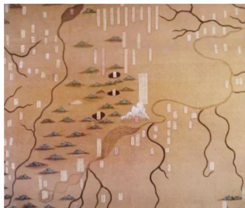  
（a） 全国图； （b） 局部图

# （四） 古希腊时期世界地图

古希腊在地图设计层面作出了很大的贡献 埃拉托斯特尼首先推算了地球的大小和子午圈的长度 并制作了一张默认设置地球为球体的地图 喜帕恰斯首创了投影法 提出将地球上的圆周以 $3 6 0 ^ { \circ }$ 划分 克劳狄乌斯 托勒密在公元 世纪编纂的 地理学指南 对地图的绘制方法进行了详细的描述， 创造了许多新的投影方法。 根据托勒密投影法， 世界地图绘制成扇形 后人将这张世界地图称为 托勒密扇子 图 地理学指南 还附有张地形图 也被认为是世界第一部地图集

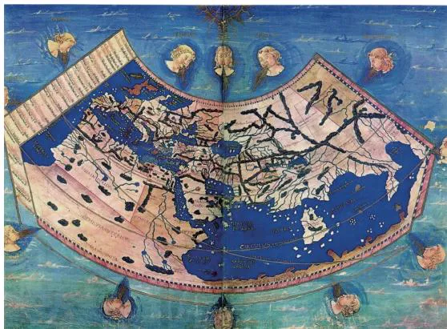  
图 2 － 11 意大利出版的 《托勒密地图集》 中的 “托勒密扇子” （1477 年）

在托勒密时代 地图学已经成为结合了天文学 科学 数学运算以及几何学的综合科学 托勒密的研究促使地图学成为独立的学科 然而比之更重要的是 托勒密将严谨的精确制图学从插图地图 鸟瞰图或者概论地图中分离出来 通过罗盘方向 精确测量 实地勘查

或真实数据描绘来呈现更实用的地图 （图 2 － 12）。

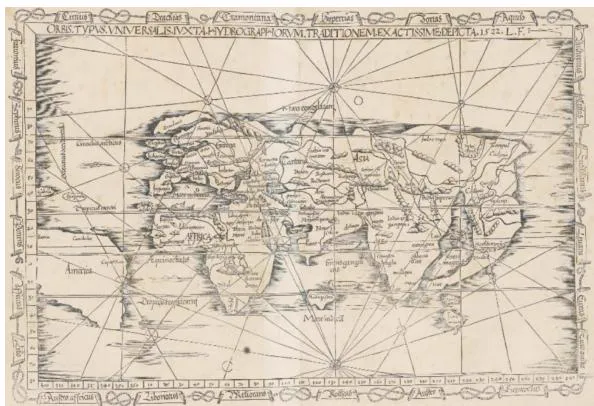  
图2 －12 严谨精确的实用地图

# （五） 达·芬奇城镇地图

达 芬奇绘制了一张著名的城镇地图 伊莫拉城镇地图 图 这幅地图不仅绘画细致入微 而且还有漂亮的色彩和当代地图所具有的精确性 达到了当时所能达到的技术顶峰， 是地理信息可视化的里程碑。 伊莫拉城镇地图显示了一座被圆环包围的城市， 4 条等距离的对角线从圆心穿过， 将城市分割为8 个不同方位。 达·芬奇绘制地图时采用了测距仪和罗盘 并且严格根据坐标系统的投影来定位地理信息 因此该地图达到了前所未有的精度。 他的测绘方式也是目前已知最早的现代测绘法。

  
图 2 － 13 伊莫拉城镇地图 （1502 年）

# （六） 中世纪宇宙地图

中世纪通过绘画和想象力 将教会的规范推广给绝大多数的无知民众 这类形式的地图创作几乎都集中以基督教相关的事物为背景， 如表现基督教世界观的地图以及描绘圣地的地图等。

丢勒绘制描述了一幅基督教徒眼中和谐的宇宙模型 图 该模型代表位于中心的地球被水 气 火 太阳 月亮 水星 金星 火星 木星和土星 个圆形的天球所包

围 最外层是上帝和一众天使所居住的 九重天 画面四角的吹风小孩代表了古希腊神话的东南西北4 位风神。 这些插画充分体现了早期绘画与数学的联系， 是500 多年前人们认识宇宙世界的可视化设计作品或者天体信息图表

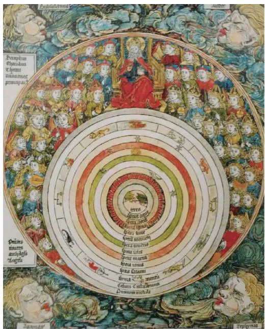  
图 2 － 14 基督教徒眼中和谐的宇宙模型 （1506 年）

# （七） 专题地图

随着人们探索新线路的逐步开通， 各个领域都需要精准的地图。 18 世纪， 许多国家逐渐制作出详细的军事地形图 世纪初末 出于经济发展权益的需要 世界各国逐渐编制了国际统一规格的详细地图 近代自然科学的发展 催生了飞机的发明 航空测绘地图的兴起 继而出现了描述气候 土壤 水和气象的专题地图

# 四、 数据图形学时代— 信息可视化的形成时期

# （一） 信息图形设计

图像比文本、 文字具有更快的速度传输， 人们试图尽可能地将图像转换为符号语言。 今天 用于记录数据信息内容的信息图形被广泛使用 各种制图软件中的曲线图和柱状图像模板一样使用简单。 事实上， 这种类型的图形几个世纪前就已经被设计出来。

# 1?? 克里斯托弗·沙纳尔太阳运行轨迹图

年 克里斯托弗 沙纳尔出版了 奥尔西尼的玫瑰 或太阳 一书 用各种图形图表表达了他关于观察太阳的科学研究成果 他制作了一系列图形图表来描述太阳运动 根据这些图形 大致描述了太阳的运行轨迹 图 这种符号图形更接近现在的标志或标识 符号图形是当时信息可视化的一个基本发展趋势

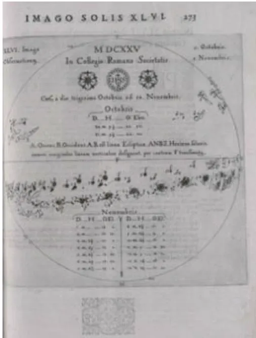  
图 2 － 15 太阳运行轨迹图 （1626 年）

# 2?? 约翰·兰伯特的人口情况分布图

年 瑞典数学家约翰 兰伯特设计了人口分析表 该表被设计成埃及金字塔形的色谱形状， 展示了颜色混合的学科关系 （图2 －16）。 对复杂的数据信息进行排序生成图形，纵向是色度等级 横向是色相 颜色是基于两色重叠的基本原理 三角形边框线的深度表示颜色的纯度 由于经济发展趋势 图表反映了大量的社会发展事件 此时的数据图表不仅是数据信息的真实反映 而且具有传播力 与此同时 图表也逐渐展现出不同的特征

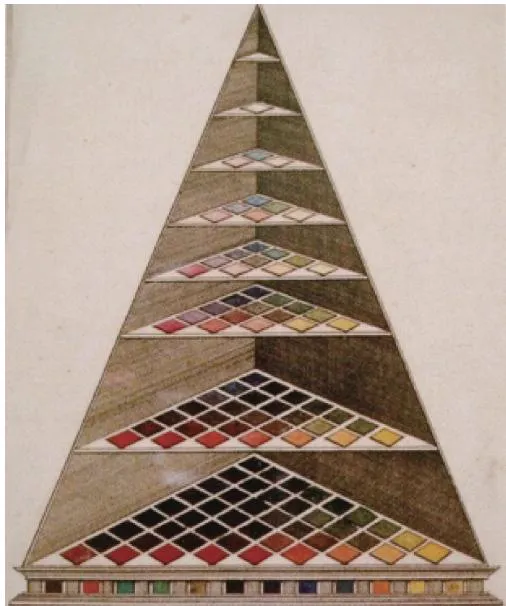  
图2 －16 约翰·兰伯特设计的人口情况分布图 （1772 年）

# 3?? 普莱费尔统计图

1786 年， 普莱费尔出版的 《商业与政治图集》 （The Commercial and Political Atlas） 一书中第一次出现了数据型图表， 其中普莱费尔使用了大量的条形图和线形图来描述 18 世纪英国的经济发展。 他被视为统计图形或信息图表的创始人， 他将两组数据 （曲线） 并列对比让人们快速掌握其中的含义 （图2 －17）， 并认为 “随着人们专业知识的提高和交流的频繁，人们越来越期待更简单 更便捷的信息传递方式

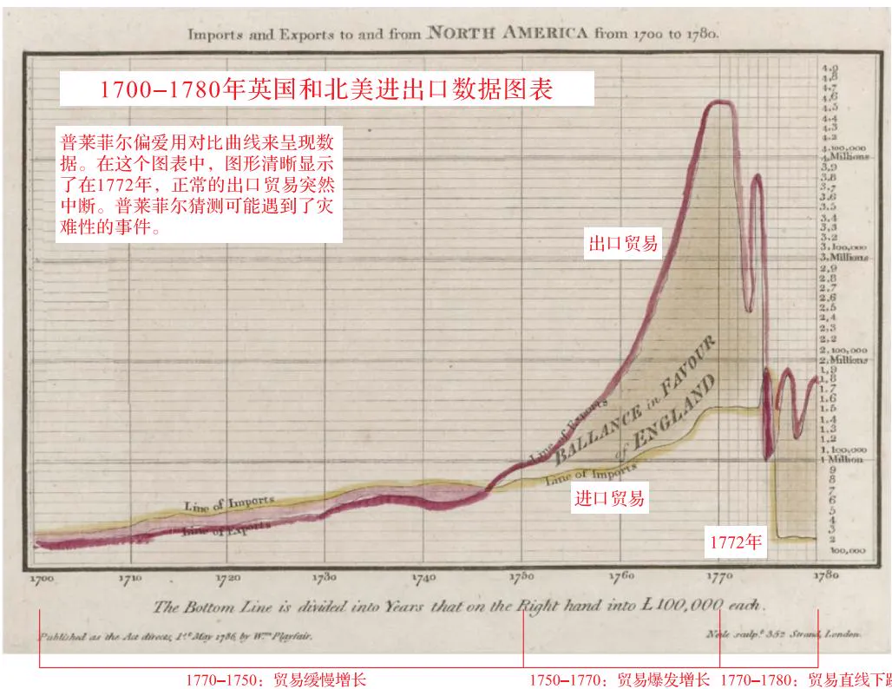  
图2 －17 英国和北美进出口数据图表

年 普莱费尔在 统计短周期 杂志上首次发表了面积图 并进行了详细介绍他使用视觉效果图来描述和展示数据信息 关键是使用线形图 饼状图和条形图将文本数据信息可视化 图 比简单的信息排序更具感染力 也让非对应专业的人们能够理解该专业知识 他还提出 不同的研究方向使得图表的使用方式也不相同 例如曲线图易于展示变量 饼状图易于展示比例等 这两种图形都是今天常用的信息展示方式 年 普莱费尔绘制了一张说明战争对面包和股票价格影响的多维曲线图 图 其中对不同数据采用了 种颜色 使得数据对比更清晰 普莱费尔认为 用几何图形表达数据 比单纯的数据排列更有说服力

在 至 世纪期间 信息图形经常被用来分析军事 气候 地质 疾病 经济和贸易 尤其在 世纪 统计分析图形和专题图形急剧增加 特别是在欧洲地区 统计图形已经呈现出现代数据信息图形的方式。 饼图、 柱状图、 极限图、 曲线图、 散点图、 时间序列图等都是这一时期统计分析的代表图形 被广泛应用于社会发展中 掌握数据分析的快速发展 能够更好地理解信息设计科学研究的关键意义

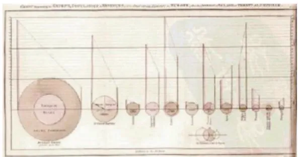

图 2 － 18 英国经济状况统计图 （1801 年）  
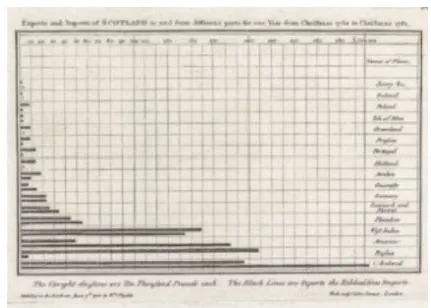  
（a） 世界上第一张饼状图； （b） 条状图

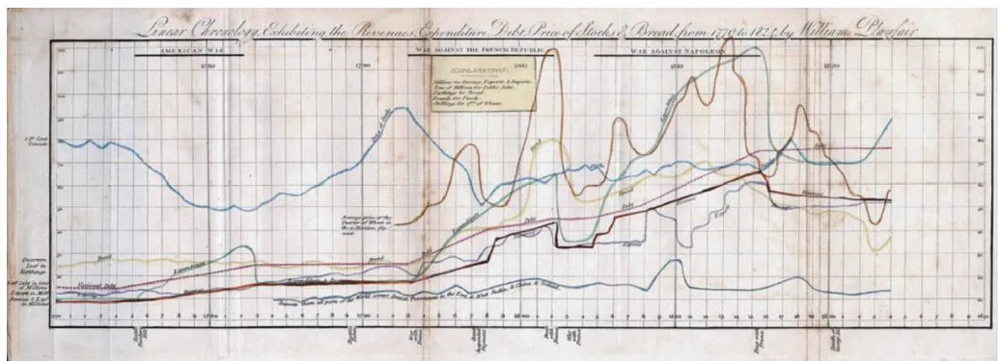  
图2 －19 战争对面包和股票价格影响的多维曲线图 （1824 年）

# 4?? 南丁格尔统计图

年 英国护士南丁格尔对信息图形的发展作出了巨大贡献 她发明的极坐标区域图 又称南丁格尔玫瑰图 用来反映军队野战医院的季节性死亡率 用来说服维多利亚女王提高军队医院的标准。 该图显示了每个月在克里米亚战争伤亡的人数和原因。 图中用深蓝色表示可预防的疾病， 用鲜红色表示伤口， 用灰黑色表示产生疾病的原因 （图 2 － 20）。 如今， 南丁格尔极坐标区域图已成为数据图表的关键类型之一。

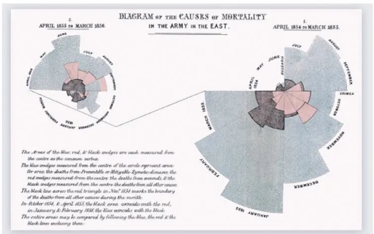  
图 2 － 20 南丁格尔极坐标区域图 （1857 年）

# 5?? 拿破仑东征信息图

年 讲述拿破仑东征 征俄 的信息图标志着开放式信息制图的出现 该图由法国巴黎的工程师约瑟夫·米纳德所设计。 约瑟夫·米纳德是 19 世纪法国的经济学家、 地理学家和技术工程师。 他还是图形绘图和统计图形的先驱。 他开发和设计了许多新颖的图形方法， 运用数据信息描述了大量深层次的社会问题。 拿破仑东征路线图开创了以统计学为基础的现代图表的历史 也成为信息可视化设计领域最重要的里程碑信息图

约瑟夫·米纳德设计的优秀图表很多， 其中最著名的就是这张拿破仑进攻俄罗斯军事分析图 图 该图提取了东征过程中的 个导致完全失败的关键变量 用信息图表中的模式来传达信息内容： 军队人员变动、 行军路线、 温度变化、 时间。 从图表中人们不难看出， 在寒冷的天气、 各种疾病和不断伤害下， 法国士兵的实力不断下降。 图表中还系统地展示了纷繁复杂的信息内容 根据信息内容之间的联系 可找出战争失败问题的内在原因 信息学家爱德华·塔夫特认为该图是迄今为止最好的统计分析图， 也是一张具有里程碑式现实意义的信息图 从现代信息可视化设计的角度 这张图仍然具有很高的学术研究和设计解决方案层面的价值。

  
图 2 － 21 拿破仑进攻俄罗斯军事分析图 （1861 年）

# （二） 科学插图与系统树状图

科学插图作为百科图书的注解和事物解释出现 绘制者以严谨的科学态度对研究对象如制造工具 植物 生物 环境构造 地理位置等进行详细的绘画描述 在没有照相机的古代 既是对象的真实写生 也是为早期科普传播作出了巨大贡献 更是针对广大没有受过文字教育的人进行信息图像知识的传播

世纪的德国著名地理学家 博物学家和信息图形专家亚历山大 冯 洪堡以及德国动物学家和哲学家恩斯特 海克尔 不仅是田野调查 科学插图与系统地图的杰出的代表 而且也是最伟大的艺术家 其中 亚历山大 冯 洪堡开创了现代地理学 深刻地影响了全世界的自然探险活动。 恩斯特·海克尔对信息图表最大的贡献就是利用 “系统树” 来表现时间或分类的层级结构

系统树是数据信息的树状图形表示 是通过分析父子结构的枚举法的一种表现形式 有的信息内容数据量大， 扩展节点多， 所以设计师设计了数据树的图形表示形式， 从客观的数据信息中生成一个具有视觉效果的树形信息图 为了更好地用一张图来表示亲缘关系 把分类单元放在图上树的最上面 可以按照分支来展示它们的内部联系 数量分类学中用于表型分类的树状图称为表型树状图 具有系统条件推理的树状图称为系统树状图 根据组分析绘制表型树状图 并根据模拟的假设特征进化方向通过计算机绘制系统树状图

# 1?? 中国古代科学插图

本草纲目 由明代李时珍在嘉靖三十一年 年 至万历六年 年 间撰写 （图2 －22）。 此书采用 “目随纲举” 编写体例， 故称 “纲目”。 其中 “以部为纲”，“以类为目”， 计分 16 部 （ 水、 火、 土、 金石、 草、 谷、 菜、 果、 木、 服器、 虫、 鳞、 介、禽 兽 人 类 各部按 从微至巨 从贱至贵 便于检索

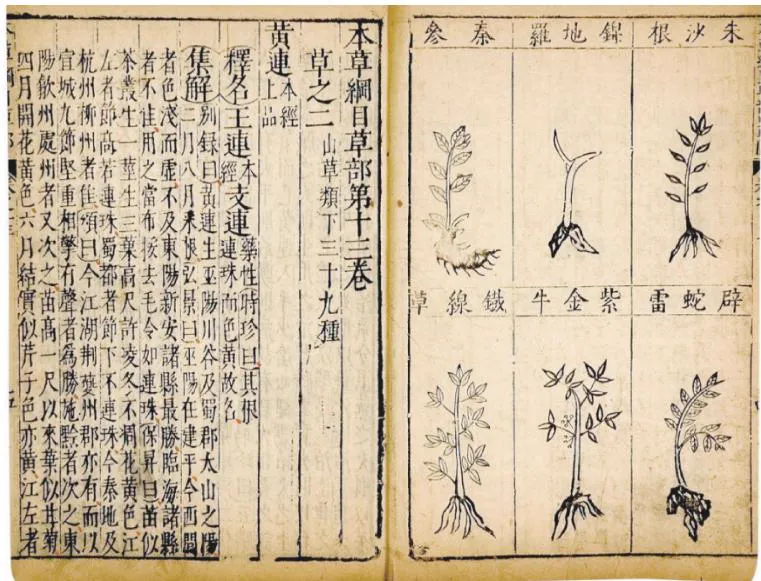  
图2 －22 《本草纲目》 内页

（2） 《天工开物》 由明代著名科学家宋应星初刊于明崇祯十年 （1637 年）， 共 3 卷 18篇， 全书收录了农业、 手工业， 诸如机械、 砖瓦、 陶瓷、 硫黄、 烛、 纸、 兵器、 火药、 纺织、 染色、 制盐、 采煤、 榨油等生产技术。

天工开物 是世界上第一部关于农业和手工业生产的综合性著作 图 是中国古代一部综合性的科学技术著作， 外国学者称其为 “中国17 世纪的工艺百科全书”。

# 2?? 洪堡地理可视化

年 德国科学家亚历山大 冯 洪堡在拉丁美洲多地旅行 首次对当地的地理环境 植被和气候进行了研究和可视化描述 亚历亚大 冯 洪堡在植物地理学方面的定量研究奠定了生物地理学领域的基础。 此外， 他对地球物理学的系统测量与记录， 为现代地磁和气象监测奠定了基础 亚历亚大 冯 洪堡是自然地理可视化设计和数据插图的奠基人之一 其中 绘制于 年的 亚欧美非山脉河流对比图 图 清晰直观 细节准确 美观生动 信息量大 可读性强 是信息可视化设计的范例

  
图2 －23 《天工开物》 内页

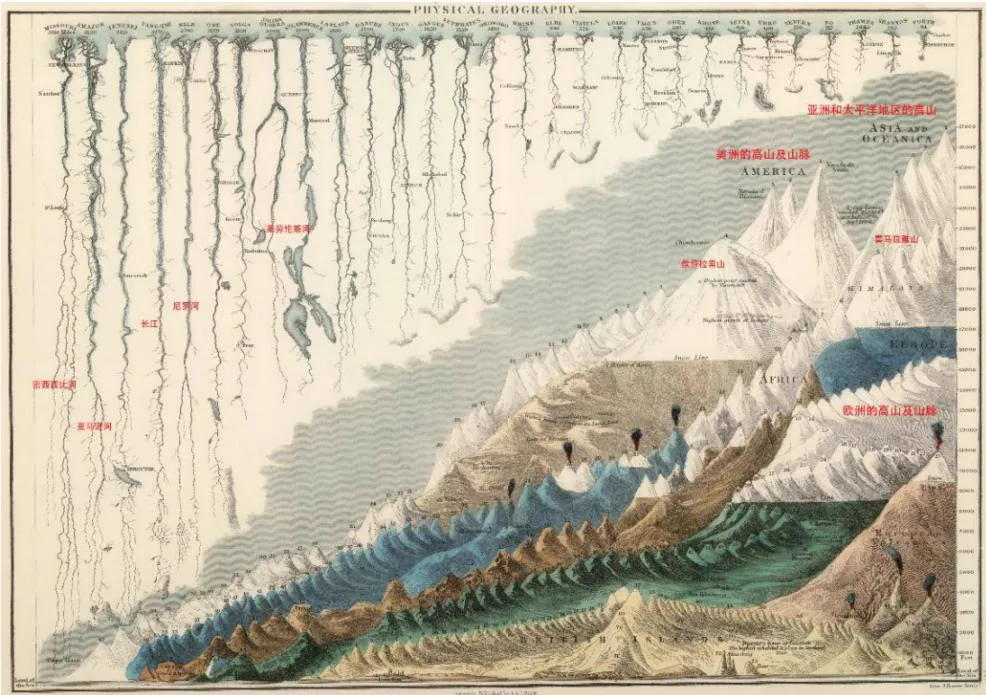  
图 2 － 24 《亚欧美非山脉河流对比图》 （1854 年）

世纪末 亚历亚大 冯 洪堡成功游说西班牙国王 启动了南美洲探险旅行 年时间， 他获得了一大批标本以及当地动植物、 地球物理、 天文、 地质、 海洋和民族文化的大量实际资料， 并进行了大量科学插图的绘制 （图 2 － 25）。

亚历山大 冯 洪堡在 年绘制的位于厄瓜多尔的钦博拉索火山的植被生长分布图图 以纵向剖面图的方式记录了山脉不同等高线的植物类型分布 地质构造和气压温度等信息 这个信息图表不仅生动直观 而且用更科学的方式展示了钦博拉索火山的成分和内部构造 特别是清晰注明了火山上不同海拔高度的植被和气候信息 成为地理可视化信息设计的里程碑之作。

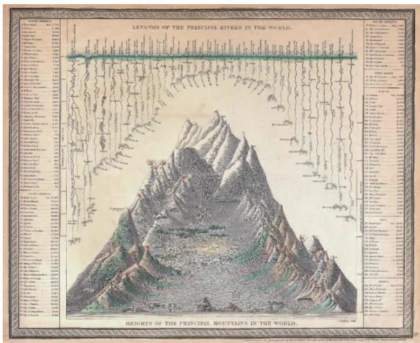

图2 －25 南美洲的可视化科学插图  
  
（a） 山脉植被插图； （b） 植物插图

  
图2 －26 钦博拉索火山的植被生长分布图 （1805 年）

# 3?? 恩斯特·海克尔科学可视化

恩斯特 海克尔是德国著名动物学家和哲学家 他将达尔文的进化论引入德国并在此基础上继续完善了他提出的人类的进化论思想。 恩斯特·海克尔在巨著 《自然的艺术形式》一书中用手绘的方式绘制了数百幅生动 细腻的海洋动植物 海藻 花卉和放射虫骨骼的插图 图 虽然每张图都并非完全写实 但他的插图生动地体现了大自然赋予生物的绝妙的对称结构。

年 恩斯特 海克尔在 人类进化论 中制作了人类谱系图 基于这个系统树状图 他展示了生命系统的进化过程 单细胞动物 无脊椎动物 脊椎动物 哺乳动物 $ .$ 人的结构分析。

恩斯特 海克尔对信息图表的更大贡献是使用系统树 系统树主要表示时间或分类结构分析 从视觉效果的角度分析 系统树进化信息图表继承了欧洲中世纪的谱系分类方法图 同时精心规划进化阶段 将生物物种的进化分离 确定系统树分叉的连接点

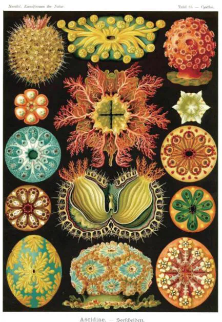

图2 －27 《自然的艺术形式》 一书中的插图  
  
（a） 浮游生物插图； （b） 海洋生物插图

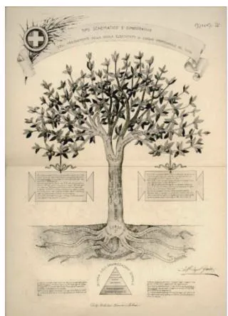

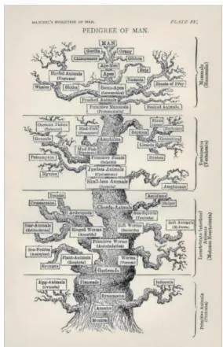

图2 －28 欧洲中世纪的谱系分类方法  
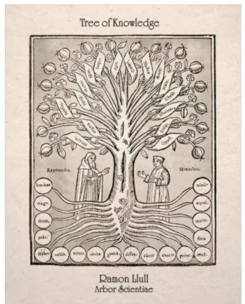  
（a） 树形图； （b） 人类谱系树形图； （c） 知识之树图

恩斯特 海克尔将设计方法更改为绘制图形 并扩展到信息设计领域 可以给读者带来视觉上的感官刺激， 提高信息传递的实际效果 （图2 －29）。

# 4?? 科学信息图表

年 英国数学家西尔维斯特首次提出 图形 的定义 并制作了一系列数据图表来表达化学键及其数学特性 （图2 －30）， 这是最早一批数学类的信息图表。

<!-- Chunk 1 End -->

<!-- Chunk 2 Start -->

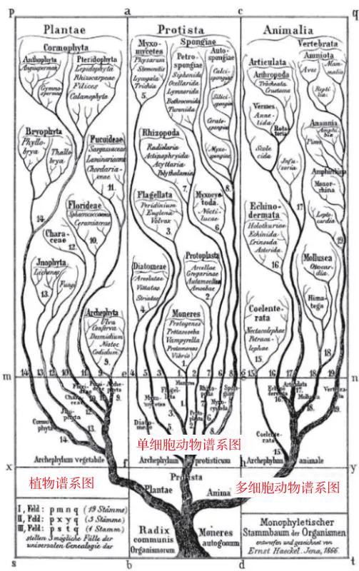

图2 －29 恩斯特·海克尔绘制的生物进化树图  
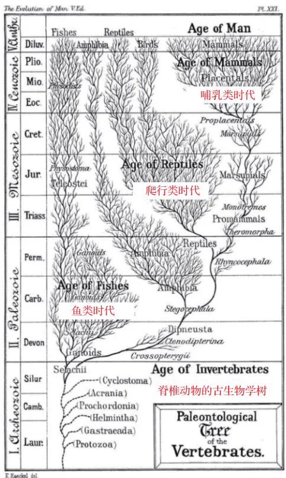  
（a） 动植物谱系图； （b） 脊椎动物的古生物学树

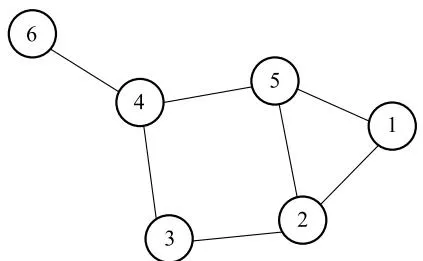  
图2 －30 代表化学键及其数学特性的早期信息图表

# （三） 新的视觉语言

进入 世纪 设计语言呈现出前所未有的繁荣 也是世界科技 军事 工业 文化和艺术爆发式增长的时代 现代战争迫使各国政府急需关于世界各国的地理信息和其他情报数据 各国政府纷纷将研究的重点集中在精确地图的绘制 统计数据可视化等领域 不仅地图和统计图表的绘制技术突飞猛进 而且也偏向于民用和大众传播领域 这为信息视觉表现形式的发展提供了杰出的人才和有利的环境 信息可视化俨然已发展为一种新的视觉语言

# 1?? 通用视觉语言符号系统

年 奥地利社会学家奥托 纽拉特与玛丽 纽拉特夫妇宣布成立国际印刷图形教

育系统 （又称伊索体系， 也称通用视觉语言符号系统， Isotype）。 伊索体系的目的是更好地利用人类语言的图形设计来达到教育的目的 该系统对公共设计的影响是十分广泛的 并成为公共交通 国际活动 公共场所等平面图形设计的基础 该系统利用简化归纳的图像向公众传达社会发展和经济等信息 已广泛应用于书籍 海报以及社会学 教学的科学研究 这是一套通用视觉符号系统， 由大约 4000 个视觉符号组成， 代表了人口统计、 政治、 经济和各行业的关键数据 图 通用视觉符号系统影响后续信息可视化设计学科领域的发展， 以及图标和标识系统的设计应用与发展趋势， 如著名的包豪斯学院的图形设计教育以及瑞士国际风格都传承于此。

  
图 2 － 31 通用视觉语言 （1925 年）

奥托 纽拉特参与设计了许多图表并完善了伊索图形语言 例如他绘制的一张有趣的图表是 《动物们能够活多久？》 （图 2 － 32）。 该图表 1939 年登载于康普顿 《图画百科全书》。作者用幽默直观的方式说明了各种野生动物的预期寿命 虽然图形简约 但内容生动 信息丰富 吸引力强并且更易于理解 奥托 纽拉特以亲身实践 说明了信息图表与视觉传达语言的精髓 跨越语言的界限 以最简洁 最直观的方式来传达信息

奥托 纽拉特致力于建立一个经验主义的理想社会 并以此试图找到解决社会阶层矛盾和资源分配矛盾等问题的答案 为此 他放弃了以往传统的设计方式 转而利用图形 图标和文字的配合进行可视化设计 其设计主题包含人口 健康 科教 文化和军事等各个方面（图 2 － 33）。

之后 德国艺术家 插图家盖尔德 安茨的设计在伊索体系中也具有重要的意义 盖尔德 安茨毕生致力于图形研究 并明确提出了 简单化 的定义 奠定了标识设计的基础同时 盖尔德 安茨还运用简化 抽象和归纳 使图标不仅具有象征意义 而且与真实事物不同。 他的许多设计至今仍在使用， 尤其是在公共标识领域。

受伊索图形影响 世纪 年代 流行于联邦德国和瑞士的图形设计风格简约美观、 实用， 文字清晰、 颜色鲜明， 视觉传达功能准确， 因此很快流行全世界 （图2 －34），也被称为 国际主义平面设计 简约型设计成为当下电脑和手机界面的流行趋势

  
图2 －32 图表 《动物们能够活多久？》

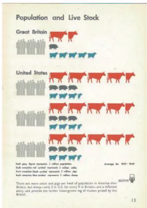

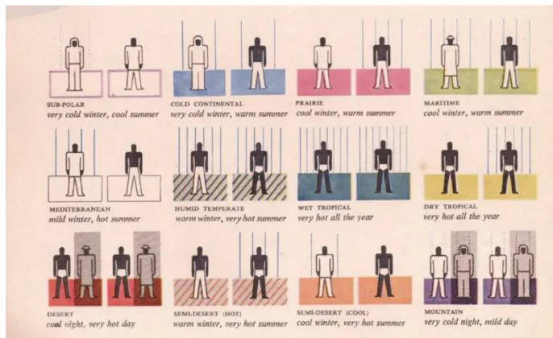  
图2 －33 奥托·纽拉特设计作品之一： 《人口与牲畜、 人种分布》

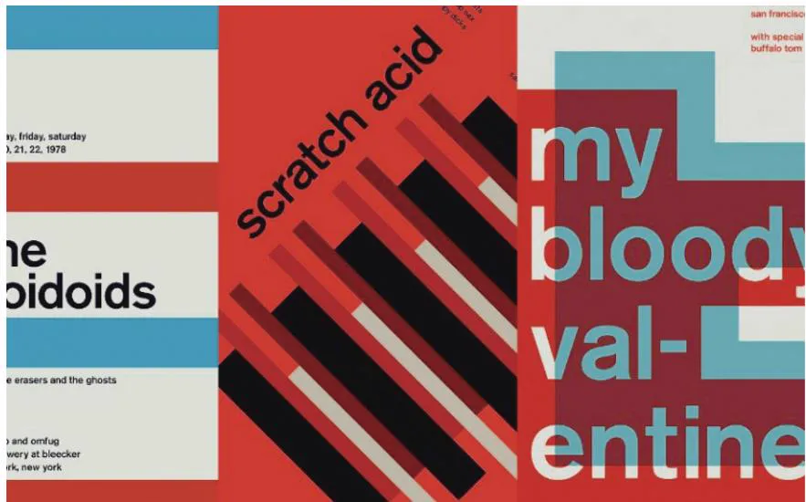  
图2 －34 20 世纪40—50 年代流行的 “国际主义平面设计” 风格海报

# 2?? 伦敦地铁交通地图

1931 年， 哈里·贝克摆脱了传统插图的设计标准， 像设计电路板一样画出了地图。 哈里·贝克第一次尝试简化地理信息， 并以适合搜索查询的方式分配地铁站点的各个位置。年 哈里 贝克将伦敦地铁复杂的信息内容按照简洁的信息语言传递给乘客 既能保持界面统一的视觉冲击力 又不会占用太多地图空间 引领了一种更容易反映地铁站具体情况的抽象视觉设计风格 （图2 －35）。

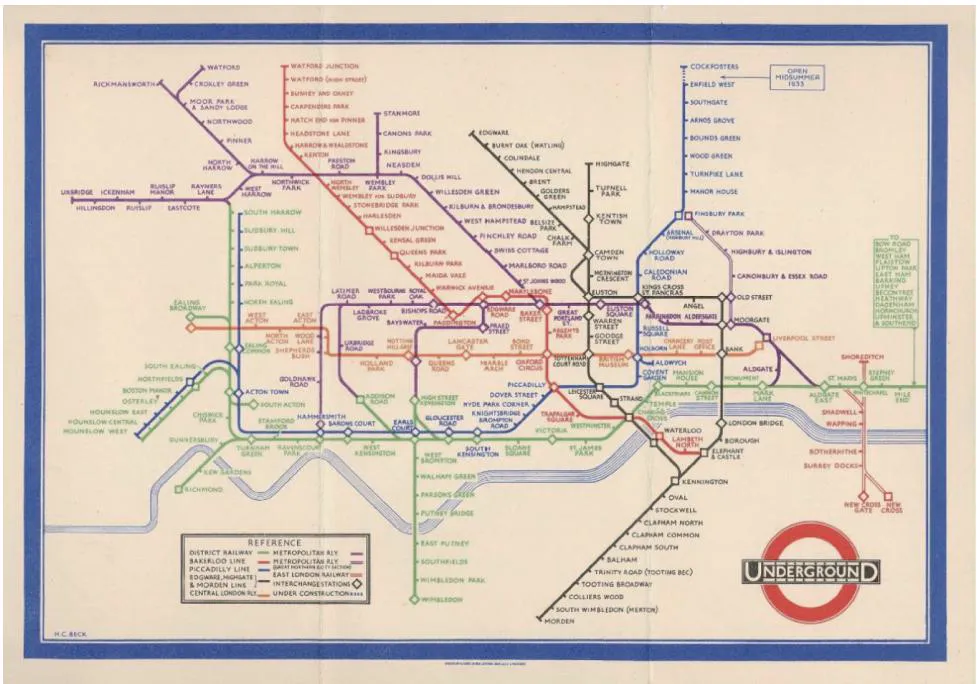  
图2 －35 伦敦地铁交通地图 （哈里·贝克绘制， 1933 年）

因此 地铁地图具有 个突出特点 以颜色区分线路 大部分路线主要以水平 垂直$4 5 ^ { \circ }$ 角 种方式表示 线路上的地铁站距离与具体距离不成比例关系 这之后 世界各地城

市的地铁站系统大多采用这种设计方式绘制地铁线路地图。 这种图形结构高效、 准确、 方便的地铁地图一直沿用到了今天。 图2 －36 为北京地铁线路图。

# 北京城市轨道交通线网图

# Beijing Rail Transit Lines

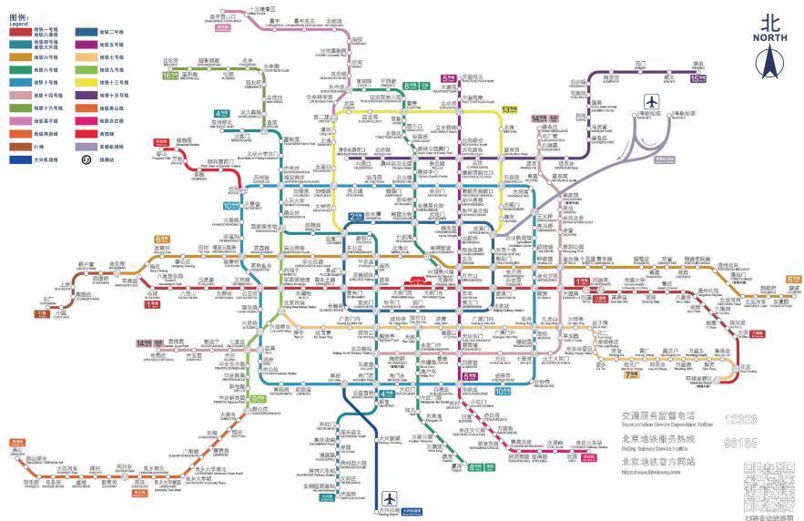  
图2 －36 北京地铁线路图

随着手机和交互媒体的流行 用户可以直接搜索路线和车站等信息 当线路比较复杂时， 传统的纸媒地铁交通图则会显得十分拥挤， 而更简约、 清晰并带有图形化地理信息的数字化轨道交通图也成为新的选项。 如日本东京地铁交通地图 （图 2 －37）， 显示的实际地铁线路信息和地理信息更为清晰和美观

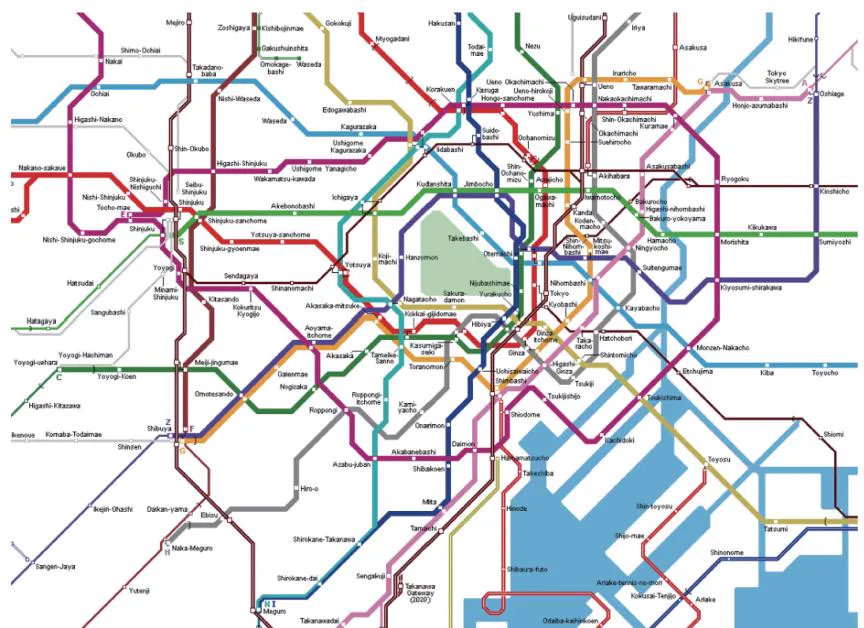  
图2 －37 东京地铁交通地图

# 3?? 图标与信息图表

图标是一种表意的可视化文字符号 它通过视觉形式将其含义传达给对象 作为一种跨文化的通用性视觉传达系统， 图形符号广泛应用于学校、 医院、 博物馆、 公园等场所（图2 －38）， 特别和旅游服务、 地理信息服务和社会公共服务等活动有着密切的联系。

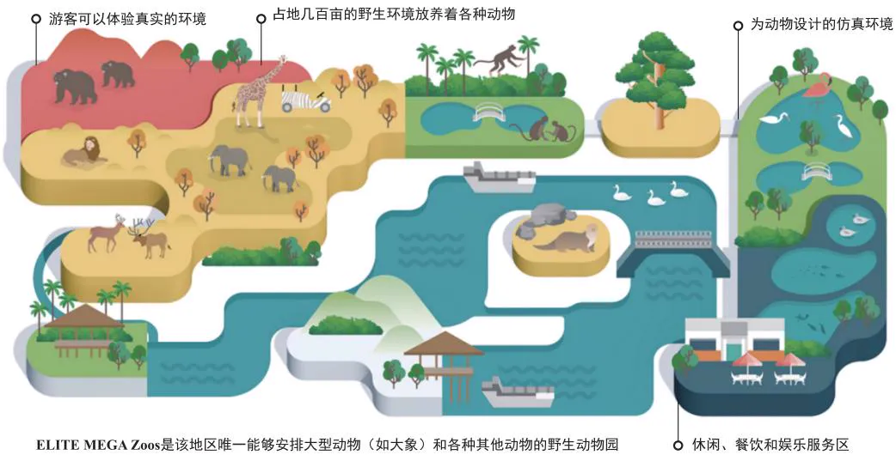  
图2 －38 动物园信息图

年 著名设计师 联邦德国乌尔姆设计学院的创始人之一奥特 艾希尔教授及其团队承担了当年在德国慕尼黑和基尔举办的奥运会的运动项目图形符号和海报的设计工作 （图2 －39）。 该设计方案通过严谨的设计网格布局， 成为德国国际风格化图标的范本。

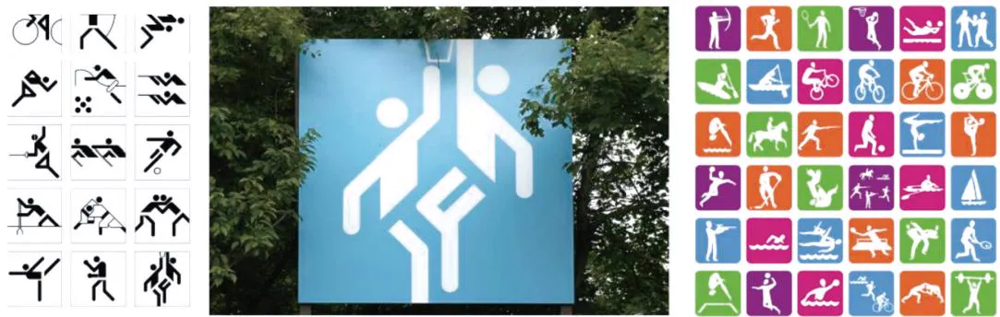  
图2 －39 奥特·艾希尔设计的慕尼黑奥运会标识

在信息图表设计中 设计师如果采用简约 清晰和意义明确的图标 往往会收到读者更好的反馈 过于详细的图标往往会分散读者的注意力 使数据模糊不清 同样 简洁的构图和版式设计 鲜明的色彩和简练的文字也会使图表生动而富有情趣 图图 2 － 41） 。

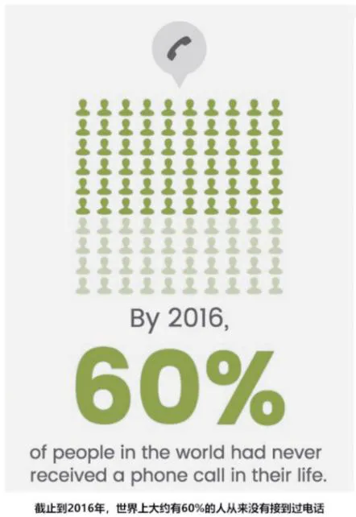

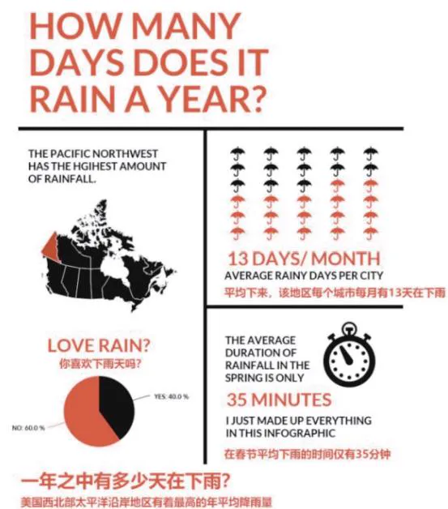  
图2 －40 鲜明的色彩和简练的文字是影响图表设计吸引力的重要元素之一

图2 －41 瑞典设计师赫兹为20 世纪著名摇滚艺术家设计的系列符号海报  
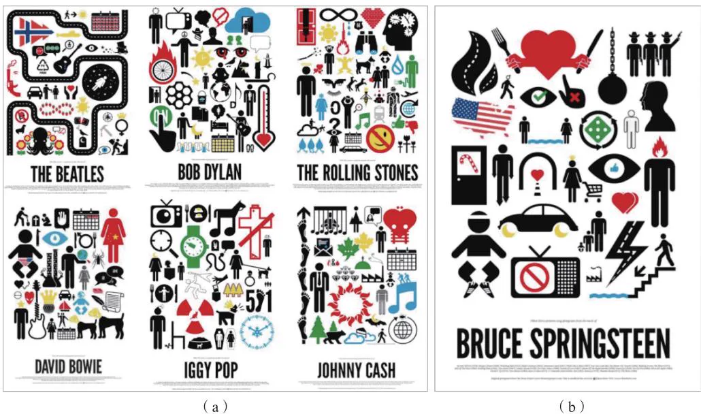  
（a） 英国摇滚乐队披头士、 美国摇滚歌手鲍勃·迪伦等的海报；  
美国摇滚歌手布鲁斯 斯普林斯的海报

# 4?? 数据图形的发展

年 华盛顿大学信息学院教授佛雷德曼主导设计出不规则多形态的数据图形 简称不规则多变形图， 又名星图）。 这种似类似手工折纸的图案是基于一定比例， 根据数据和信息进行分布的图形 图 优秀的图形语言表达可以极大地帮助人们理解信息内容未来的数据类图表将会不断产生新的形式。

  
New Orleans

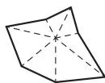  
Denver

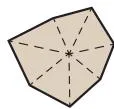  
Kansas City

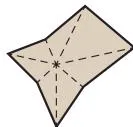  
Dallas   
(d)

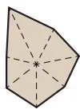  
Washionton

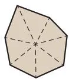  
Detroit

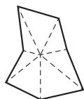  
New Yonk

Los Angeles   
(h)   
图2 －42 佛雷德曼设计的数据图形图  
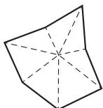  
（a） 新奥尔良； （b） 丹佛； （c） 堪萨斯域； （d） 达拉斯；  
（e） 华盛顿； （f） 底特律； （g） 纽约； （h） 洛杉矶

1972 年， 美国发射了先驱者 10 号行星探测器， 探测器带有一块镀金铝板， 上面刻有人类信息的信息图表 该信息图表是由美国天文学家卡尔 萨根和天文学家弗兰克德瑞克设计创建的， 图中包括太阳光相对于14 颗脉冲星的相对位置 地球上男女的轮廓图 太阳系中行星的布局等 图 因为充分考虑了是与未知的文明传递信息 所有的信息都不能再按照人类的语言表达和叙述 所以都采用视觉语言的信息可视化方法来表现与传递

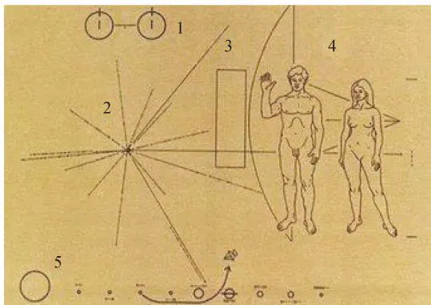  
图2 －43 镀金铝板上人类信息的数据图

1983 年， 数据图的基本理论被明确提出，

开启了信息可视化的迅速发展 在信息可视化进程中 科学可视化的形成和发展起到了决定性的推动作用。

年 斯图尔特 卡德 约克 麦金利和乔治 罗伯逊撰写的 用于交互性用户界面的认知协处理器 一文中首次明确提出了信息可视化的英文术语该文认为信息可视化可以使用具有视觉效果的 或 动画对象来表示信息内容和信息结构 此后 信息可视化逐渐发展为一门重要的学科

年 美国著名用户界面设计师本 施耐德曼提出 信息可视化领域已在研究领域中出现了略有不同的研究角度 同时 他还提到 信息可视化领域涉及图形学 视觉设计计算机科学、 人机交互、 心理学和商业等方面的方法和专业知识。 信息可视化已成为与科学可视化并列的研究领域

# 五、 大数据时代— 信息可视化的发展时期

最早提出大数据时代到来的是世界级全球管理咨询公司麦肯锡 麦肯锡表示 数据信息已经渗透到各个领域和业务职能领域， 成为主要的生产要素。” 在 《大数据时代》 一书

中 作者维克托 迈尔 舍恩博格指出 互联网大数据意味着我们人类在寻找量化分析和认识世界方面迈出了一大步。 过去无法测量、 存储、 分析和共享的内容都被数据化了， 为人类打开了了解世界的新大门

2012 年以来， “大数据” 一词的讨论越来越多。 人们用它来描述和定义大数据时代发生的海量信息， 并命名与之相关的技术发展趋势与革新。 在大数据时代， 随着数据和信息连接点不断增长， 信息可视化通过描绘、 测量、 计算等各个节点间的关系， 并以交互的方式呈现， 人们在感受复杂关系中， 寻找关联物和数据之间的连接关系来处理当下需求， 大数据的特点明确了关于如何可视化的新要求

美国哈佛大学社会心理学教授加里 金说 庞大的数据促使各行各业开始了量化分析的进程。 无论是学术界、 商界还是政府部门， 可以说所有行业都会开始进行这种进程。” 信息可视化领域也不例外 尤其是在大数据时代下 可视化与视觉叙事 可视化与交互以及可视化与社会服务等层面具有重要意义与价值。

# （一） 可视化与视觉叙事

大数据时代可视化视觉表现的叙事与传统文本叙事有很大不同 它是结合各种符号的传播特性 更能向人们展示信息内容本质的逻辑和关系层次 更具时效性和魅力 但需要特别注意的是， 可视化艺术设计之美与客观信息内容呈现之间的平衡。 可视化视觉叙事的内容主要体现在客观信息内容和客观事实基础上 考虑融入叙事中的视觉元素 图形艺术设计等可视化视觉叙事在可视化艺术方面的视觉效果对于统计展示的实践活动具有一定的意义与价值。

年 数据设计师安德鲁斯使用信息可视化的设计作品来描述世界著名创作者如何分配他们的一天 图 这个作品分析了数百名创作者为了更好地利用他们的时间而采取的严格的日常日程安排 其中把圆形分成 等份 一个格子代表 小时 同时 采用不同类型 不同色调来区分活动 其中白色代表睡眠时间 橙色代表人际交往和用餐时间蓝色代表健身时间， 深绿色和浅绿色分别代表重点和普通工作的时间。

年 尼康公司建立了一个令人印象深刻的网页 图 该网页显示了宇宙中已知物体的大小 从微小生物到猛犸象这样的大型生物都放在同一个比例尺上 这样物体之间可直接去对比相对之间的大小 其实人们很难用语言来描述 小 和 大 的相对概念但是应用信息可视化设计语言来去描述就能很清晰地感知其含义。

# （二） 可视化与交互

年 麦考密克等撰写的学术论文 科学计算中的可视化 首次明确提出了科学领域运用计算机的计算能力和交互性来呈现图形 图像和科学数据

2001 年， 斯彭斯教授的著作 《信息可视化： 交互设计》 全面探讨了交互设计在数据可视化中的功效及相关设计方法。 如今， 交互设计已经成为数据可视化设计师非常关键的设计工具 如何使用交互界面 按照简单实用的交互步骤 将数据信息中隐含的重要信息内容和专业知识清晰地传达给客户 早已成为数据可视化设计师的主要日常工作

实验室以 年各大歌曲榜中最成功的唱片相关信息为基础进行信息可视化设计 用户可以选择关注自己感兴趣的歌曲排行榜的类型及其具体信息 包括歌手 歌曲名

# CREATIVE ROUTINES

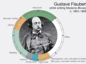

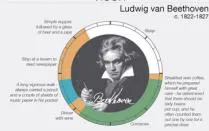

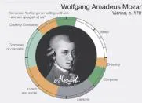

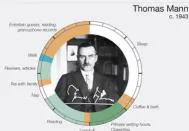

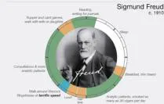

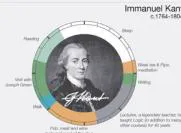

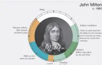

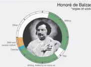

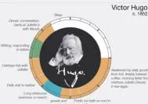

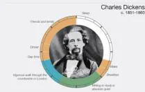

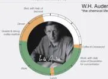

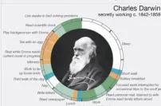

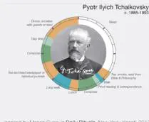

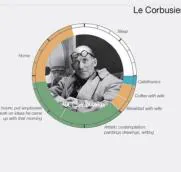

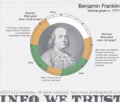  
图 2 － 44 信息可视化设计作品 《创意历程》 （2014 年）

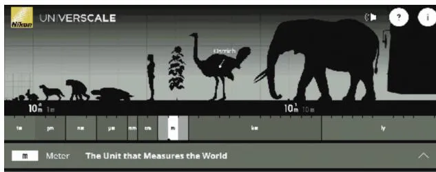

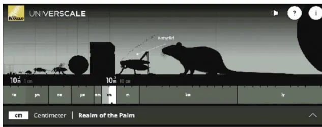  
图2 －45 尼康公司网页

称、 发行业绩等 （图2 －46）。 所有的信息可视化都伴随着鼠标的移动和用户的点击， 促使页面信息图形的变化 其承载了大量的数据量与丰富动感的可视化形态 无论是在视觉效果上还是在信息传递作用上， 都是一个优秀的信息可视化设计案例。

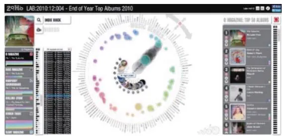

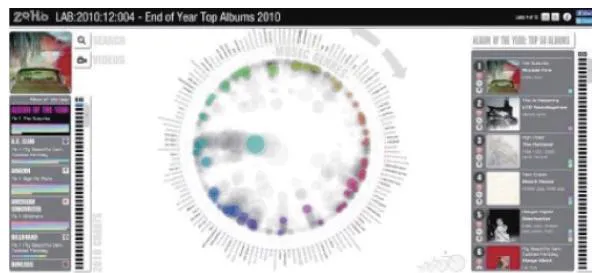  
图 2 － 46 Zoho 实验室设计网页

另一个优秀的案例是 建筑的交互式广告 图 交互式广告中 主界面显示的是多座大楼外形剪影， 用户可以通过呈现的点状数据， 了解建筑的设计风格， 也可以通过点击图片 文字等互动方式 自主获取相关建筑的信息内容

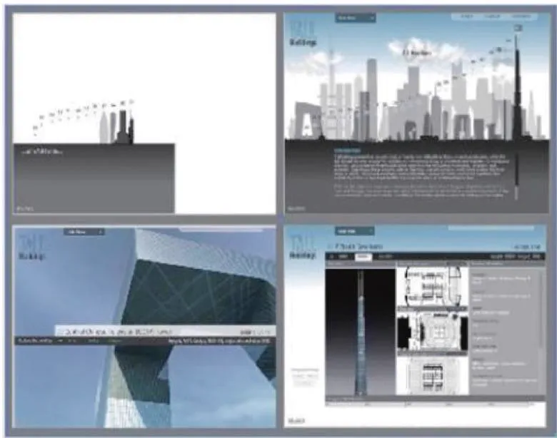  
图2 －47 MOMA 建筑的交互式广告

当可视化与交互设计融合时 将大大提升可视化的用户体验和便利性 更重要的是 引入交互设计与技术后 将更好地解决交互中的决策分析和模式理解等问题 并为用户提供更好的解决方案

# （三） 可视化与社会服务

将大量复杂的数据信息进行可视化设计可以给人们很大的帮助 根据可视化分析设计方法， 人们可以利用视觉认知能力的优势， 从抽象的数据信息中快速提取有效知识， 进而辅助管理决策 这也是新时代可视化设计与技术发展趋势的一个新维度

在 年欧盟开展的 项目中 为了更好地科学研究风力与能源的关系 项目

团队创建了一个可视化分析项目 Ukko3， 项目中的分析得到 1981—2014 年世界范围的风力变化数据信息 系统对 年的变化进行预测分析 并发现了风力变化最明显的区域和时间段 图 从项目的主分析界面 人们可以看到风力电站建设与风力变化强度对比。 这个项目的目的是更好地服务于用户， 让用户能够清楚地感知未来的风力变化， 以及有可能安装风力发电设备的潜在地点。 此外， 这个项目还可以基于交互点击的方式查询某个区域的完整数据信息。

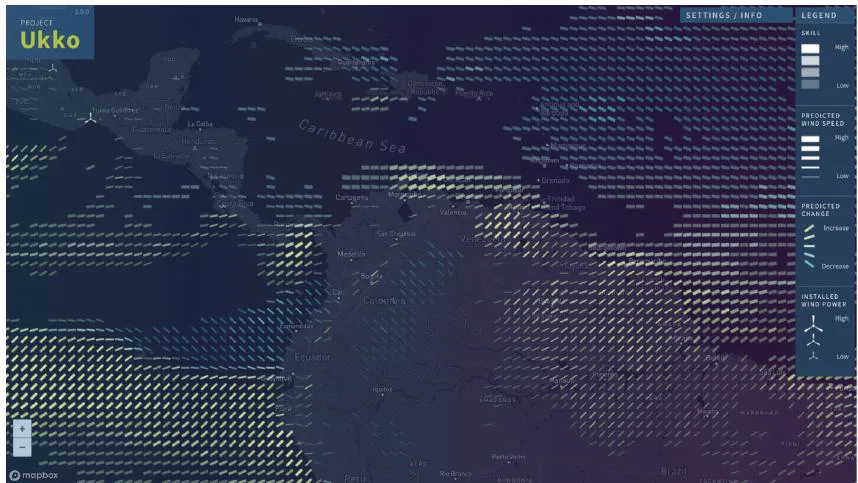  
图 2 －48 可视化分析项目 Ukko3

居住在新加坡 项目是由麻省理工感知实验室对新加坡进行的一项研究 根据对不同数据源的分析 最终通过 个可视化设计 城市规划 交通 通信 社会 环境与安全 世界枢纽 来反映新加坡城市不同层面的关系 让人们更直接地把握城市的动态和魅力图 例如 雨天出租车相关单元 通过将降雨的数据信息和出租车的载客数据信息相结合 体现在降雨情况下出租车的出行表现 可以为如何完善出租车管理体系以及完成不同情况下出租车的供需平衡等提供信息支撑

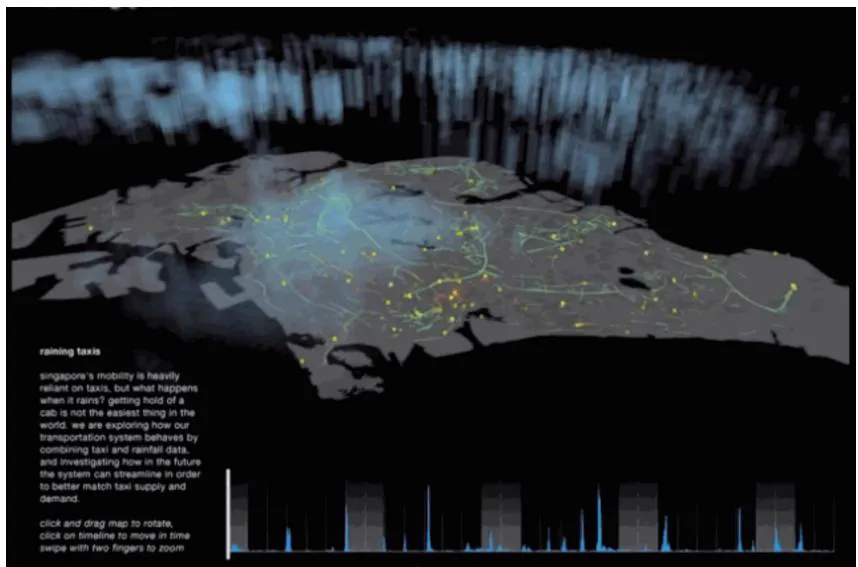  
图2 －49 “居住在新加坡” 项目

