# 第三章

# 信息图表类型与现代信息设计工具

信息通过视觉化的逻辑语言进行剖析 以视觉信息图表进行表达 作为视觉工具包括以下几种类型： 图表、 图解、 图形、 表格、 地图、 列表等。 不管何种类型， 都是运用列表、 对照 图解 标注 连接等表述手段 使视觉语言最大化地融入信息之中 使信息的传达直观化、 图像化、 艺术化。

本书基于阿帕奇 （Apache） 图表示例对常见的图表样式进行分类说明。

# 一、 图表类型

# （一） 柱状图

柱状图又称长条图 柱状统计图 条图 条状图 棒形图 是一种以长方形的长度为变量的统计图表 图 长条图用来比较两个或两个以上的数量变化信息 不同时间或者不同条件 柱状图也可横向排列 或用多维方式表达 图 绘制柱状图时 长条柱或柱组中线须对齐项目刻度

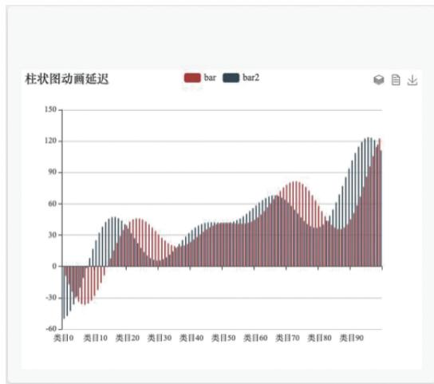

图3 －1 柱状图  
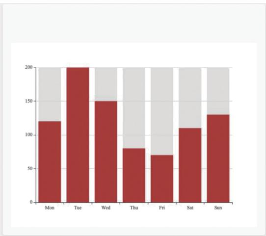  
动画延迟柱状图 带背景的柱状图

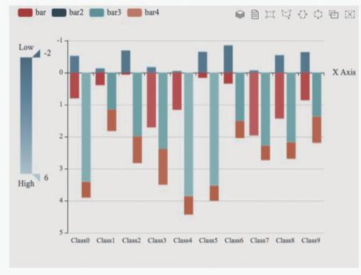

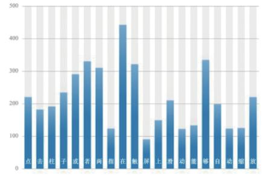  
特性示例：渐变色阴影点击缩放   
  
(d)

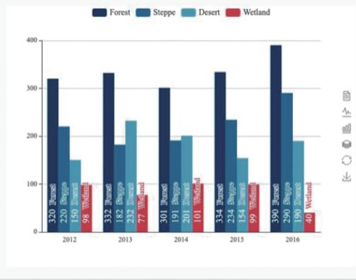

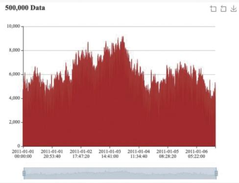

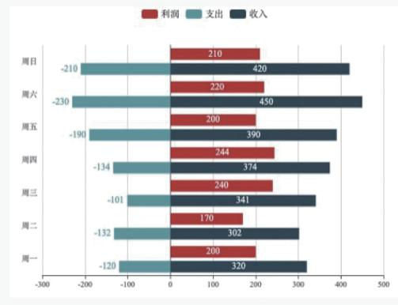

图 3 －1 柱状图 （续）  
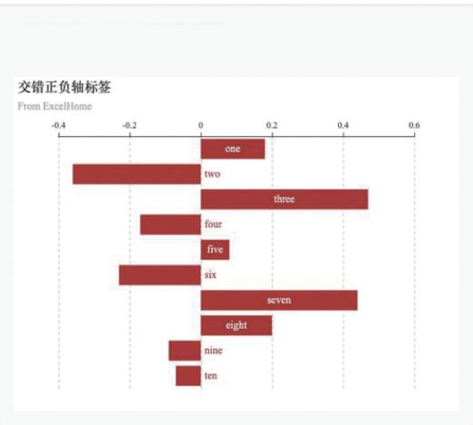  
柱状图框选 特性示例 渐变色阴影点击 条形标签旋转  
（f） 大型条形图； （g） 正负条形图； （h） 交错正负轴标签

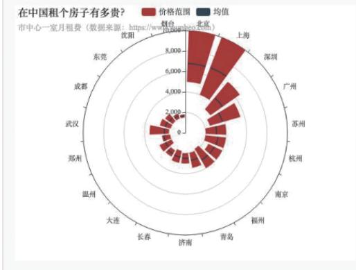

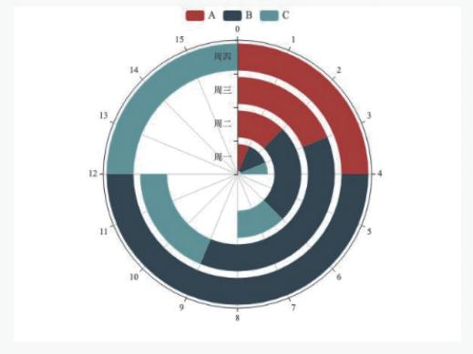

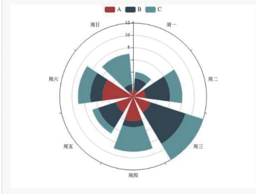

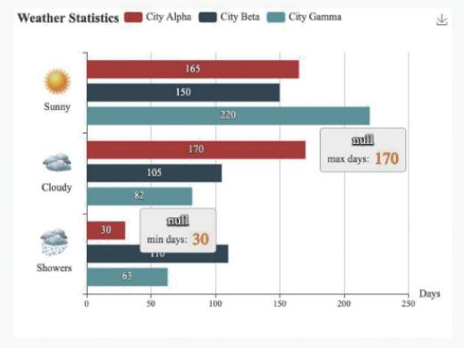

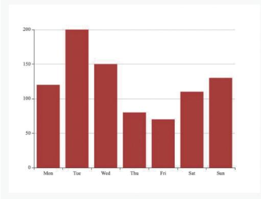

图 3 －1 柱状图 （续）  
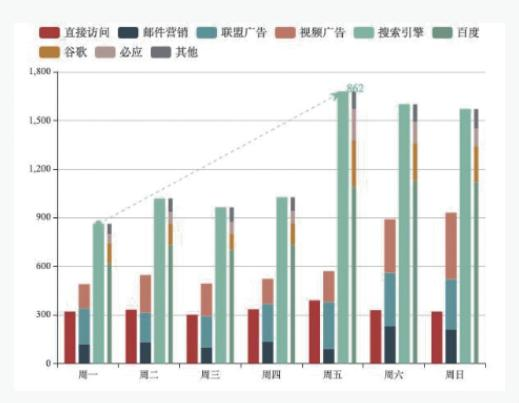  
极坐标系下的堆叠柱状图 极坐标系下的堆叠柱状图 极坐标系下的堆叠柱状图  
（l） 天气统计柱状图； （m） 简易柱状图； （n） 堆叠柱状图

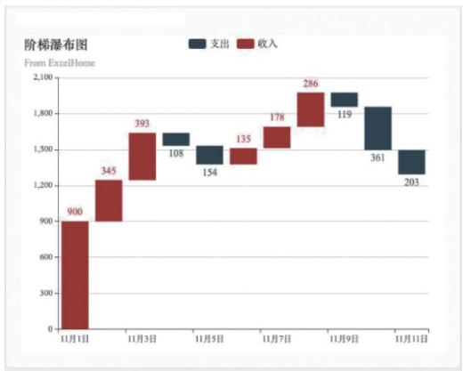

图 3 － 1 柱状图 （续）  
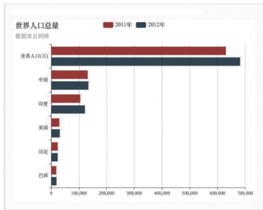  
（o） 阶梯瀑布图； （p） 人口统计柱状图

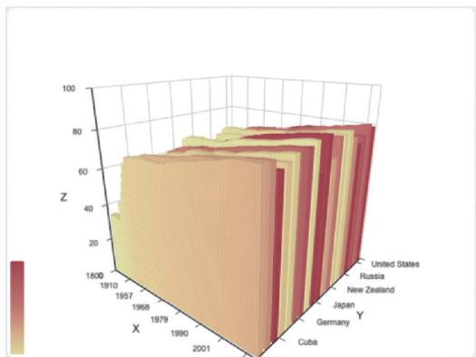

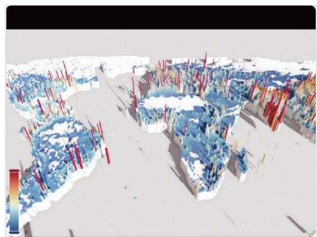

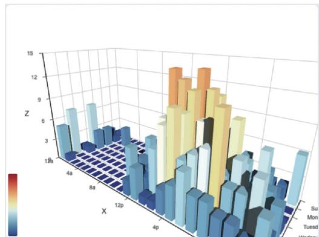

图3 －2 三维柱状图  
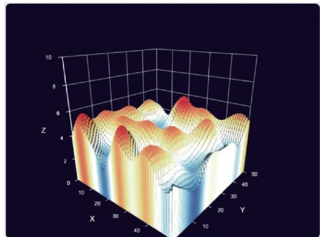  
带有数据的三维柱状图 三维柱状图 全球人口  
打卡式三维柱状图 三维柱状图 单纯噪声形

# （二） 折线图

折线图是将工作表中列或行中的数据绘制到折线图形中 图 折线图支持多数据对比 折线图可以显示随时间 根据常用比例设置 而变化的连续数据 因此非常适用于

显示在相等时间间隔下数据的趋势 在折线图中 类别数据沿水平轴均匀分布 所有值数据沿垂直轴均匀分布。 如果分类标签是文本并且代表均匀分布的数值 （如月、 季度或财政年度）， 则应该使用折线图。 当有多个系列时， 尤其适合使用折线图。 如果有几个均匀分布的数值标签 （尤其是年）， 也应该使用折线图。 如果拥有的数值标签多于 10 个， 则建议使用散点图。 折线图也可进行丰富三维形态的演变 （图 3 － 4）。

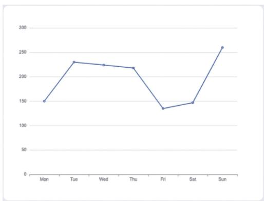

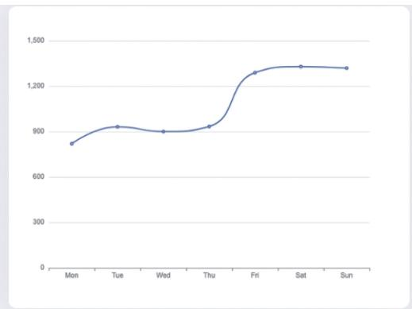

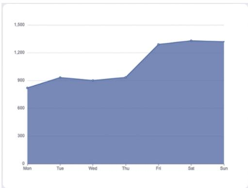

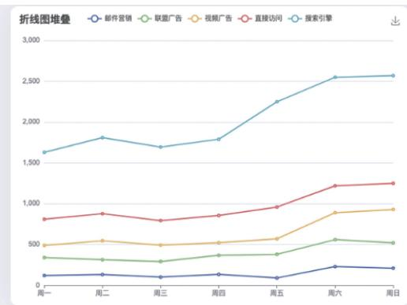

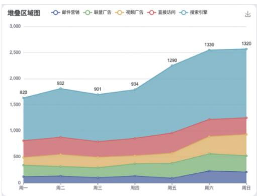

图3 －3 折线图  
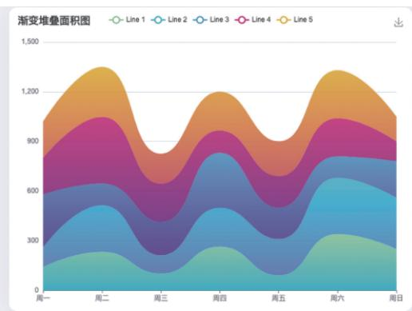  
基础折线图 基础平滑折线图 基础面积图 折线图堆叠  
（e） 堆叠面积图； （f） 渐变堆叠面积图

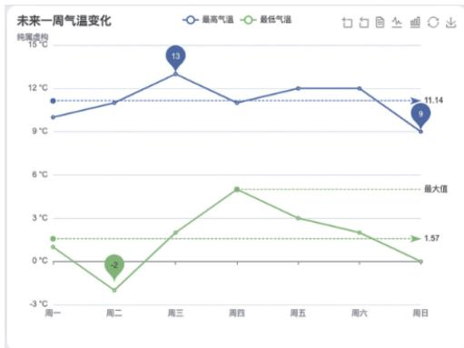

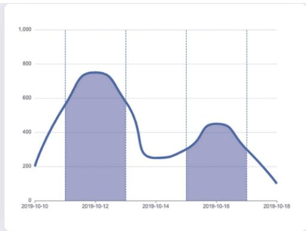

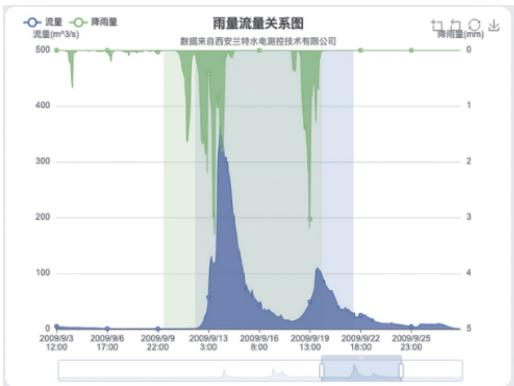

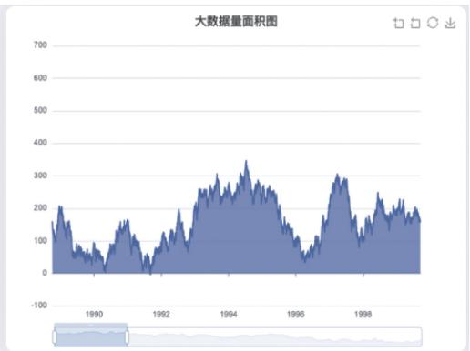

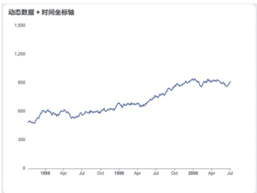

图 3 －3 折线图 （续）  
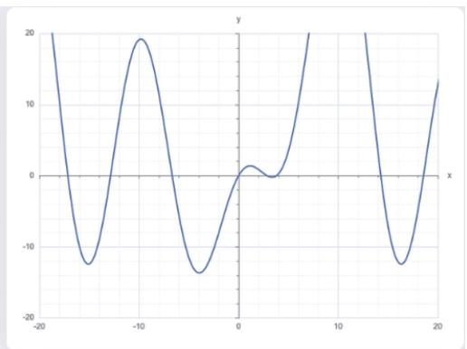  
未来一周气温变化 折线图区域高亮 雨量流量关系图  
（j） 时间轴折线图； （k） 动态数据 $^ +$ 时间坐标轴； （l） 函数绘图

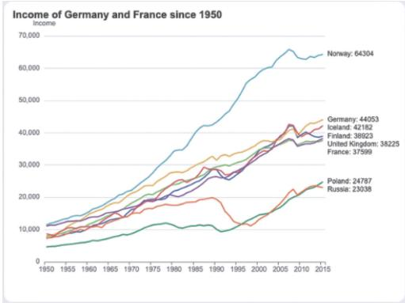

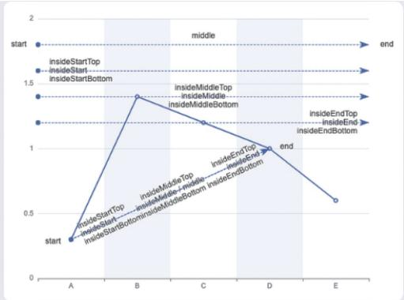

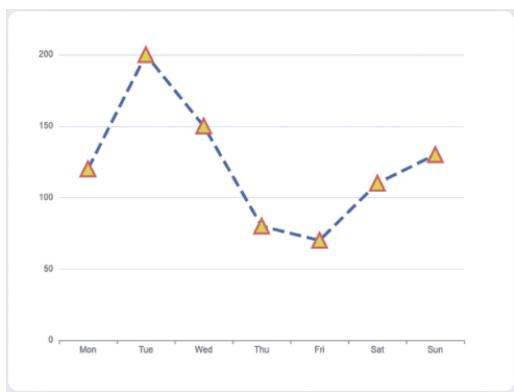

图 3 －3 折线图 （续）  
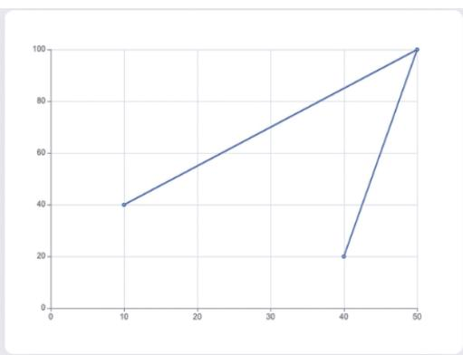  
（m） 动态排序折线图； （n） 折线图的标记线； （o） 自定义折线图样式； （p） 双数值轴折线图

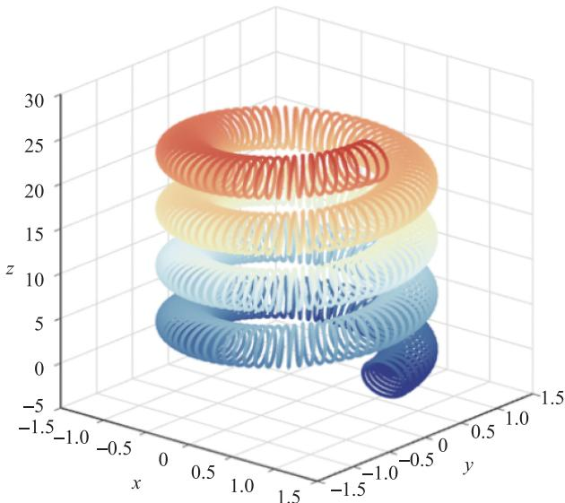  
图3 －4 三维折线图正交投影

# （三） 饼状图

饼状图常用于统计学模型 有 与 饼状图 饼状图为圆形 饼状图显示一个数据系列 （数据系列： 在图表中绘制的相关数据点， 这些数据源自数据表的行或列。 图表中的每个数据系列具有唯一的颜色或图案）。 图形形式用饼状图或圆环图的扇面、 圆点图形表示。 相同颜色的数据标记组成一个数据系列， 显示为整个饼状图的百分比 （图3 －5）。

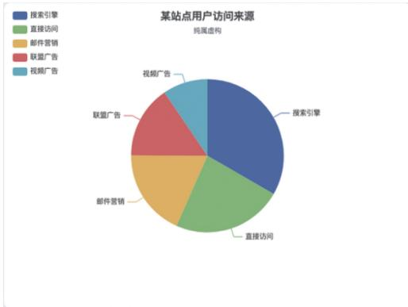

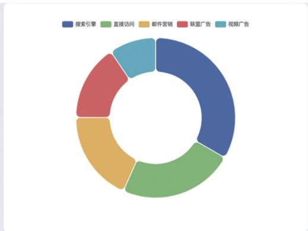

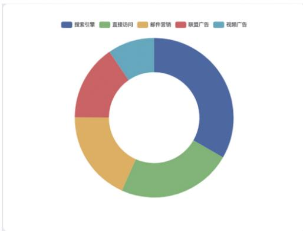

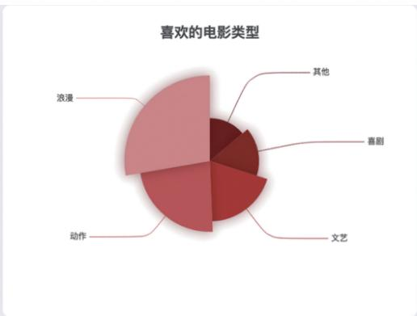

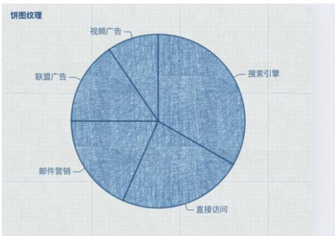

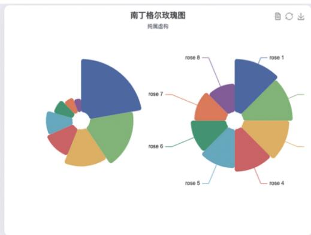  
  
图3 －5 饼状图

（a） 某站点用户访问来源； （b） 圆角环形图； （c） 环形图；  
饼图自定义样式 饼图纹理 南丁格尔玫瑰图

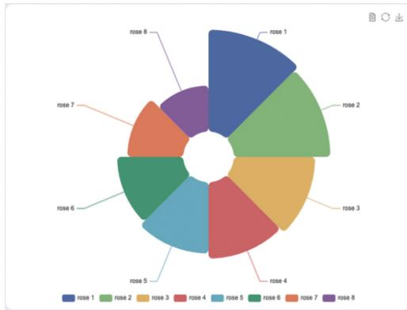

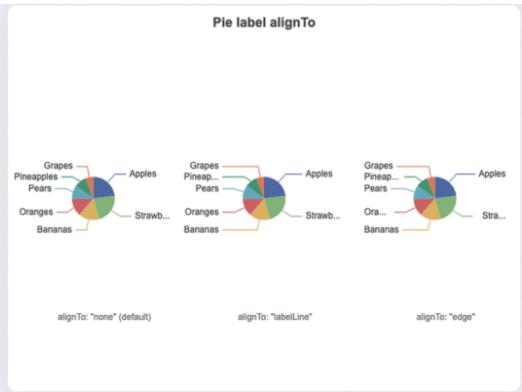

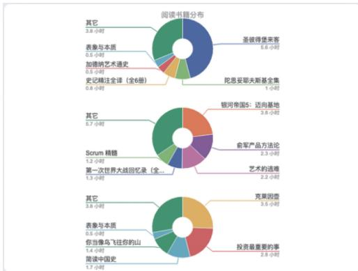

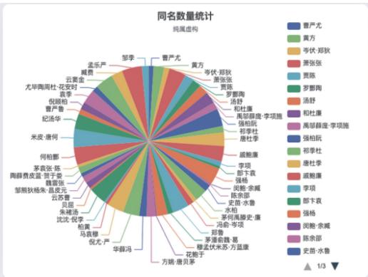

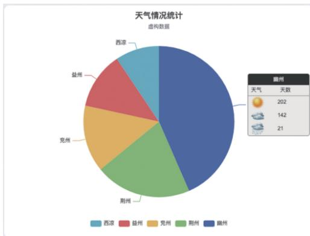

图 3 －5 饼状图 （续）  
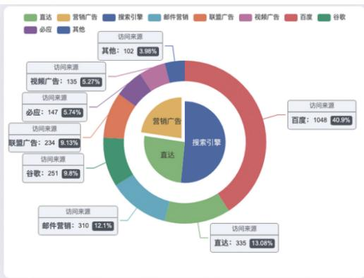  
（g） 基础南丁格尔玫瑰图； （h） 饼图标签对齐； （i） 饼图引导线调整；  
可滚动的图例 富文本标签 嵌套环形图

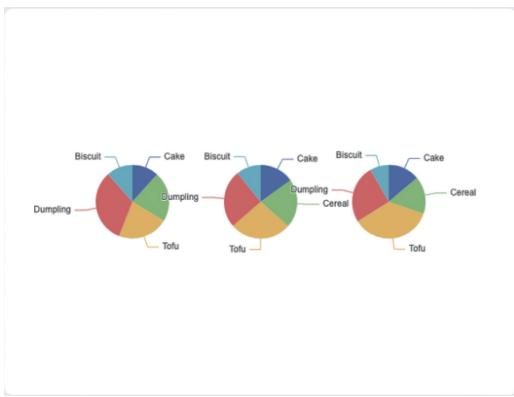

图 3 － 5 饼状图 （续）  
  
（m） 分割数据到数个饼图； （n） 默认 encode 设置； （o） 日历饼图； （p） 联动和共享数据集

# （四） 散点图

散点图是指在信息分析中 数据点在直角坐标系平面上的分布图 散点图表示因变量随自变量而变化的大致趋势 据此可以选择合适的函数对数据点进行拟合 用两组数据构成多个坐标点 考察坐标点的分布 判断两变量之间是否存在某种关联或总结坐标点的分布模式。 散点图将序列显示为一组点。 数值由点在图表中的位置表示。 类别由图表中的不同标记表示。 散点图通常用于比较跨类别的聚合数据。 图3 －6 为散点图， 图3 －7 为三维散点图。

# （五） 地图

地图是按照一定的法则 使用制图方法 通过制图有选择地以二维或多维形式与手段在平面或球面上表示地球 或其他天体 上各种事物的空间分布 联系及时间的发展变化状态的图形或图像 它具有严格的数学基础 符号系统 文字注记 并能用地图概括原则 科学地反映出自然和社会经济现象的分布特征及其相互关系 古代地图一般画在羊皮纸或石板上 传统地图的载体多为纸张 随着科技的发展出现了电子地图等多种载体

图3 －6 散点图  
  
基础散点图 鲶鱼图 数据聚合 涟漪特效散点图  
打卡气泡图 单轴散点图

图 3 －6 散点图 （续）  
  
（g） 男性女性身高体重分布； （h） 散点图标签顶部对齐； （i） 气泡图；  
气泡图 营养分布散点图 营养分布散点矩阵

图3 －7 三维散点图  
  
（a） 3D 散点图； （b） 设置数据的三维散点图； （c） 3D 散点图———全球人口；  
三维散点图正交投影 三维散点图和散点矩阵结合使用 散点图 单纯噪声形

# （六） 雷达图

雷达图也称网络图 蜘蛛图 星图 蜘蛛网图 不规则多边形图 极坐标图 是以同一点开始的轴上表示 个或更多个变量的二维图表的形式显示多变量数据的图形方法 轴的相对位置和角度通常是无信息的 它相当于平行坐标图 轴径向排列 雷达图主要应用于企业经营状况 如收益性 生产性 流动性 安全性和成长性的评价 上述指标的分布组合在一起非常像雷达的形状， 因此得名 （图 3 － 8）。

图3 －8 雷达图  
  
（a） 基础雷达图； （b） AQL －雷达图； （c） 自定义雷达图； （d） 浏览器占比变化

# （七） 漏斗图

漏斗图一般是以单个研究的效应量为横坐标 样本含量为纵坐标的散点图 在平面坐标系中的集合为一个倒置的漏斗形 因此称为漏斗图 样本量小 研究精度低 分布在漏斗图的底部， 向周围分散； 样本量大， 研究精度高， 分布在漏斗图的顶部， 向中间集中。 实际使用时 做数据分析的研究个数较少时不宜做漏斗图 一般推荐数据分析的研究个数在 个及以上才做漏斗图 图

图3 －9 漏斗图  
  
一般漏斗图 对比漏斗图之一

图 3 －9 漏斗图 （续）  
  
（c） 对比漏斗图之二； （d） 对比漏斗图之三

# （八） 热力图

热力图是以特殊高亮的形式展示访客热度的页面区域和访客所在地理区域的图表图示热力图直观地将网页流量数据分布通过不同颜色区块呈现 给中小网站网页优化与调整提供了有力的参考依据， 方便合作网站提高用户体验 （图 3 － 10）。

图 3 －10 热力图  
  
（a） 笛卡尔坐标系上的热力图； （b） 热力图———2w 数据；  
（c） 热力图———颜色的离散映射； （d） 热力图与百度地图扩展

图 3 － 10 热力图 （续）  
  
（e） 日历热力图； （f） 纵向日历图

# （九） 关系图

关系图是表示关系 属性和联系的概念关系模型图 是用连线来表示事物相互关系的一种方法 可找出因素之间的因果关系 便于通观全局 分析研究以及拟定出解决问题的措施和计划 图 为关系图 图 为三维关系图

图 3 －11 关系图  
  
（a） 力引导布局； （b） WebKit 模块关系依赖图； （c） NPM 依赖关系图； （d） 日历关系图

图 3 － 11 关系图 （续）  
  
（e） 关系图自动隐藏重叠标签； （f） 《悲惨世界》 人物关系图；  
悲惨世界 人物关系图 环形布局 动态增加图节点

图3 －12 三维关系图  
  
（a） GPU 图形布局； （b） GL 图形———大型互联网； （c） 1w 节点 2w7 边的 NPM 依赖图

# （十） 树图

树图是一种流行的利用包含关系表达层次化数据的可视化图表方法 由于其呈现数据时高效的空间利用率和良好的交互性 受到众多设计师的关注 得到深入的研究 并在科学社会学 工程 商业等领域都得到了广泛的应用 树图能将事物或现象分解成树枝状 又称树形图或系统图 图 树图就是把要实现的目的与需要采取的措施或手段系统地展开 并绘制成图 以明确问题的重点 寻找最佳手段或措施 树图是从一个项目出发 展开

两个或两个以上分支 然后从每一个分支再继续展开 依此类推 它拥有树干和多个分支所以很像一棵树。 树图通常是用来将主要的类别逐渐分解成许多越来越详细的层。 绘制树图有助于思维从一般到具体的逐步转化

图 3 － 13 树图  
  
从左到右树状图 多棵树 从下到上树状图 从右到左树状图  
拆线树图 径向树状图

图 3 － 13 树图 （续）  
  
从上到下树状图

# （十一） 桑基图

桑基图即桑基能量分流图 也称桑基能量平衡图 它是一种特定类型的流程图 图中延伸的分支的宽度对应数据流量的大小 通常应用于能源 材料 金融等数据的可视化分析因 年马修 亨利 桑基绘制的 蒸汽机的能源效率图 而闻名 此后便以其名字命名为桑基图 （图 3 － 14）。

图 3 －14 桑基图  
  
基础桑基图 垂直方向的桑基图 节点自定义样式桑基图 层级自定义样式桑基图

图 3 － 14 桑基图 （续）  
  
（e） 渐变色边桑基图； （f） 左对齐布局桑基图； （g） 右对齐布局桑基图

# （十二） 河流图

河流图是堆叠面积图的一个变种 形态像河流的图 主要表达多数据波线的变化（图3 －15）。 不同类型的数据用不同颜色的面积区域来显示， 每个填充区域从左到右按照时间顺序流动 每个类别的数据数值变化就会形成一条条粗细不一的河流 并汇集在一起形成更大的河流 不同于堆叠面积图 河流图并不是将数据数值绘在一个个笔直的轴上 而是将数据分散到一个变化的中心基准线上 该基准线不一定是笔直的

图 3 －15 河流图  
  
主题河流图 调频河流图

以上列举的是常见的图表类型 随着计算技术和计算机生成技术的开发 图表的视觉形态从二维到三维产生了丰富的变化， 信息可视化设计师应根据数据信息的分析， 合理地选择图表的表达方式 图 是国外数据分析网站提供的数据判断与信息图表类型的选择路线。

  
图3 －16 数据判断与信息图表类型的选择路线

# 二、 现代信息可视化设计工具

# （一） Excel 与 Numbers 表格

是微软 为使用 和 操作系统的电脑编写的一款电子表格软件 直观的界面 出色的计算功能和图表工具 再加上成功的市场营销 使成为最流行的个人计算机数据处理软件 在 年 作为 的组件发布了 版之后 就开始成为操作平台上的电子制表软件的霸主 图

是苹果公司开发的电子表单应用程序 作为办公软件套装 的一部分 与Pages、 Keynote 分别销售。 图 3 － 18 为 Numbers 软件图标， 图 3 － 19 是用 Numbers 制作的数据图表。

  
图 3 － 17 Excel 软件图标

  
图 3 － 18 Numbers 软件图标

# 月度预算

使用方法：将每个类别的预算输入到下方的摘要(按类别)表格。

在交易工作表，以查看实际支出与预算的比较情况。

摘要 (按类别)   
图 3 －19 用 Numbers 制作的数据图表  

<table><tr><td>类别</td><td>预算</td><td>实际支出</td><td>差额</td></tr><tr><td>汽车</td><td>¥200.00</td><td>¥90.00</td><td>¥110.00</td></tr><tr><td>娱乐</td><td>¥200.00</td><td>¥32.00</td><td>¥168.00</td></tr><tr><td>食物</td><td>¥350.00</td><td>¥205.75</td><td>¥144.25</td></tr><tr><td>房屋</td><td>¥300.00</td><td>¥250.00</td><td>¥50.00</td></tr><tr><td>医疗</td><td>¥100.00</td><td>¥35.00</td><td>¥65.00</td></tr><tr><td>个人项目</td><td>¥300.00</td><td>¥80.00</td><td>¥220.00</td></tr><tr><td>旅行</td><td>¥500.00</td><td>¥350.00</td><td>¥150.00</td></tr><tr><td>水电煤气费</td><td>¥200.00</td><td>¥100.00</td><td>¥100.00</td></tr><tr><td>其他</td><td>¥50.00</td><td>¥60.00</td><td>(¥10.00)</td></tr><tr><td>总计</td><td>¥2,200.00</td><td>¥1,202.75</td><td>¥997.25</td></tr></table>

# （二） 网络商店提供的各种立体图表组件模板

互联网时代下建立在因特网上的网络商店 是一个可以让顾客从家里的计算机购物 商人可以贩卖产品的服务场所 互联网上有在线图表制作网站 如图表秀 花火数据等 都拥有丰富的基础图表格式， 用户可以在线完成信息图表制作。 如图3 －20、 图3 －21 所示， 网络商店提供的各种平面 立体图表组件模板

  
图3 －20 网络商店提供的各种平面图表组件模板

# （三） 谷歌图表 API

谷歌提供了大量现成的图表类型 从简单的线图表到复杂的分层树地图等 它还内置了动画， 用户可进行交互控制 （图 3 － 22）。

  
图3 －21 网络商店提供的各种立体图表组件模板

  
图 3 －22 谷歌图表 API

# （四） D3

的全称是 使用 主要是用来做数据可视化图表 能够提供大量线性图和条形图之外的复杂图表样式， 例如Voronoi 图、 树形图、 圆形集群和单词云等。D3js 是一个可以基于数据来操作文档的 Java 脚本库。 可以帮助用户使用 HTML、 CSS、 SVG 以及 来展示数据 遵循现有的 标准 可以不需要其他任何框架独立运行在现代浏览器中 它结合强大的可视化组件来驱动 操作 界面及图表如图 所示

# （五） Processing

Processing 是一门开源编程语言和与之配套的集成开发环境 （ IDE） 的名称。 Processing运用于大量的新媒体和互动艺术作品中， 是数据可视化的招牌工具 （图 3 － 24）。 Processing是适合设计师和数据艺术家的开源语言 具有语法简单 操作便捷的特点 在数据可视化方面 不仅可以绘制二维图形 还可以绘制三维图形 除此之外 为了扩展其核心功能， Processing 还包含许多扩展库和工具， 支持播放声音、 动画、 计算机视觉和三维几何造型等 图

  
图 3 －23 D3 界面及图表

# Processing

  
图 3 － 24 Processing 图标  
图 3 － 25 Processing 生成的设计图

# （六） Timeline

即时间轴工具， 用户通过这个工具可以一目了然地知道自己在何时做了什么 （图3 －26）。

# （ 七） Sigma?? js

Sigma?? js 是一个开源的轻量级库， 用来显示交互式的静态和动态图表 （图 3 － 27）。

  
图 3 － 26 Timeline 图表

  
图 3 － 27 Sigma?? js 界面图

# （八） Apache Echarts

是一款基于 的数据可视化图表库 图 提供直观 生动、 可交互、 可个性化定制的数据可视化图表。 Apache Echarts 致力于让开发者以更方便的方式创造灵活丰富的可视化作品 （图 3 － 29）。

  
图 3 － 28 Apache Echarts 首页

  
图 3 － 29 Apache Echarts 界面

# （九） 阿里云 DataV

阿里云 是阿里云出品的拖拽式可视化工具 专精于业务数据与地理信息融合的大数据可视化 阿里云 旨在让更多的人看到数据可视化的魅力 帮助非专业的工程师通过图形化的界面轻松搭建专业水准的可视化应用场景 图 满足会议展览 经济数

据监控、 气象监控风险预警、 地理信息分析等多种业务的展示需求， 如图 3 －31 ～ 图 3 －34所示。

  
专业级大数据可视化

专精于地理信息与业务数据融合的可视化，提供丰富的行业模版和交互组件，支持自定义组件接入

  
多种数据源支持

支持接入包括阿里云分析型数据库、关系型数据库、本地CSV上传和在线API等，支持动态请求

  
图形化编辑界面

拖拽即可完成样式和数据配置，无须编程就能轻松搭建数据大屏

  
灵活部署和发布

适配非常规拼接大屏，支持加密发布，支持本地部署

  
图 3 －30 阿里云 DataV 产品优势  
图3 －31 区域经济监测数据大屏

  
图3 －32 城市气象数据可视化大屏

  
图3 －33 商圈生态模拟展示

  
图3 －34 智能楼宇体征画像

# （十） Python

由荷兰数学和计算机科学研究学会的吉多 范罗苏姆于 年设计 提供了高效的高级数据结构 还能简单有效地面向对象编程 语法和动态类型以及解释型语言的本质 使它成为多数平台上写脚本和快速开发应用的编程语言 随着版本的不断更新和语言新功能的添加 逐渐被用于独立的大型项目的开发 解释器易于扩

展 可以使用 或 $\mathrm { ~ C ~ } + +$ 或者其他可以通过 调用的语言 扩展新的功能和数据类型也可用于定制化软件中的扩展程序语言 丰富的标准库提供了适用于各个主要系统平台的源码或机器码

2021 年 10 月， 语言流行指数的编译器 Tiobe 将 Python （ 图 3 － 35） 加冕为 “ 最受欢迎的编程语言”， 20 年来首次将其置于 Java、 C 和 JavaScript 之上。

  
图 3 － 35 Python 图标

