# 第四章

# 信息可视化设计师 ／ 团队和优秀作品案例

信息可视化设计经历了长时间的发展和演变 有很多设计师 团队投身其中 创造出多种多样的视觉设计风格 为了探究信息可视化设计领域丰富且灿烂的全貌 本章介绍极具知名度的信息可视化设计师 团队以及他们是如何理解信息可视化设计的思考 他们之中有的擅长插画和平面设计， 有的则善于建筑制图等设计……他们以不同的方式影响了信息可视化设计的表达方向 并凭借自己创意和杰出的设计在某种程度上推动了信息可视化设计的发展。

# 一、 中国信息可视化设计师／团队及作品

# （一） 上海大学上海美术学院团队

上海大学上海美术学院在信息可视化设计相关方向的教学与实践中 以信息图 数据图表 实体可视化 交互式信息可视化等各种不断变化的数据展示其背后需要重新思考视觉与体验、 传达与洞察、 沟通与行动等可视化设计最根本的价值取向， 引导学生从单纯的图形创作向良好的信息体验上转变。

上海大学上海美术学院执行院长王大伟认为 如果我们把数字技术看成挑战人类思维和智慧的武器， 一旦我们接受挑战， 它将帮助人类认知未来， 创造更好的未来。” 而上海美术学院也在不断探索信息可视化艺术与技术结合的形式与手段， 进行不断创新。

例如上海大学上海美术学院信息与交互设计工作室的信息可视化作品 解构藏文 图图 不仅获得了世界一线可视化学术会议 下设的艺术项目奖项 也获得了 中国数据大赛金奖等 该作品采用了大量的可视化设计呈现方法 对藏文进行解构 对藏文诗歌的文本进行视觉化设计 让读者更好地理解藏文与藏文化

# （二） 江南大学团队

江南大学近几年运用设计的力量 进行了系列的扶贫活动 在设计方法指引下 以设计推进地域文化资源的融合 生产生活方式的创新 审美价值的提升 从而为乡村振兴提供方式和路径上的支持 尤其是信息可视化设计 其在主题知识化 情感体验 交叉融合等方面显示出明显的优势 可以运用信息可视化的设计方法 为乡村振兴与精准扶贫提供设计服务 以江南大学团队的信息可视化设计作品 图 图为例 运用信息可视化的设计方法与短视频媒体呈现形式的结合 来诠释数据叙事作品

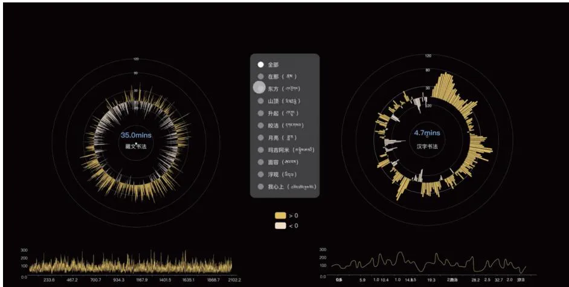  
图 4 － 1 《解构藏文》 1

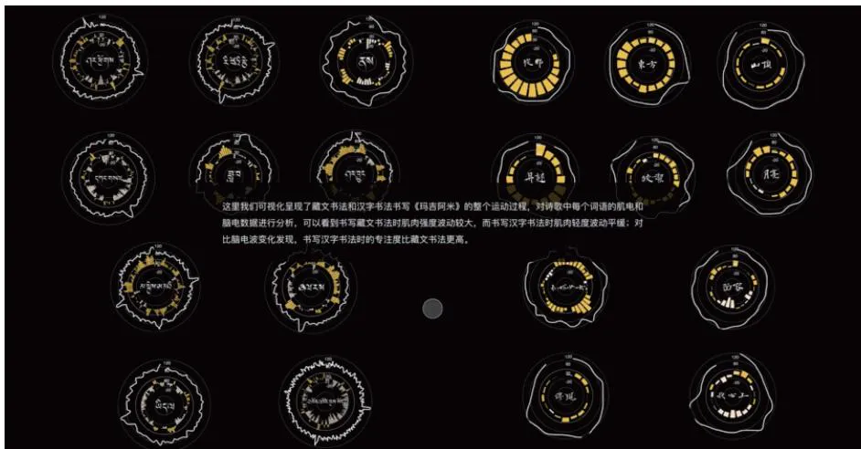  
图 4 － 2 《解构藏文》 2

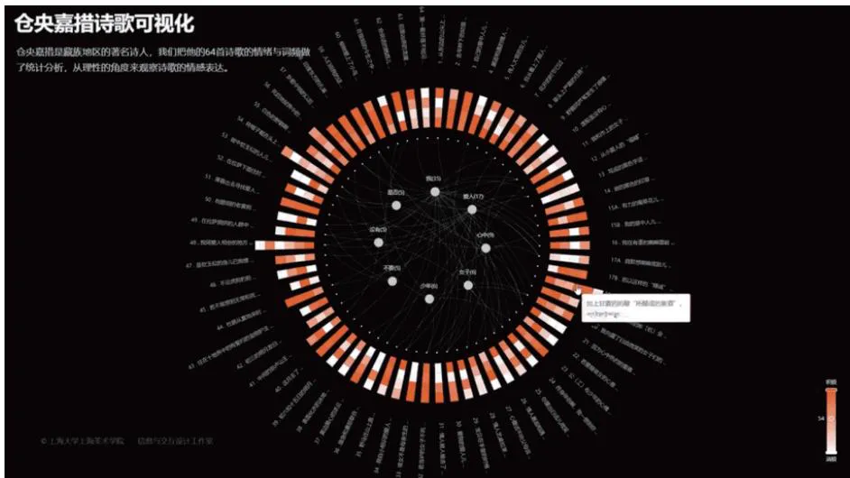  
图 4 － 3 《解构藏文》 3

如今 互联网与社交媒体将私人表达转化为公共交流 迅速扩展了城乡间的文化亲密性 因此 该作品收集了快手平台扶贫计划中的活跃用户 并对其视频进行了分析 提取出各个账号中的描述文字 同时 通过机器算法自动生成图片 从而构成生动的贫困账户群体 在此基础上， 利用 unity 技术软件设计开发网页， 将活跃用户账号中的视频资料数据抽取出来，提取描述性文本输入 Deep － Zee 中生成影像， 以艺术与科技结合的角度描绘数据叙事景观。

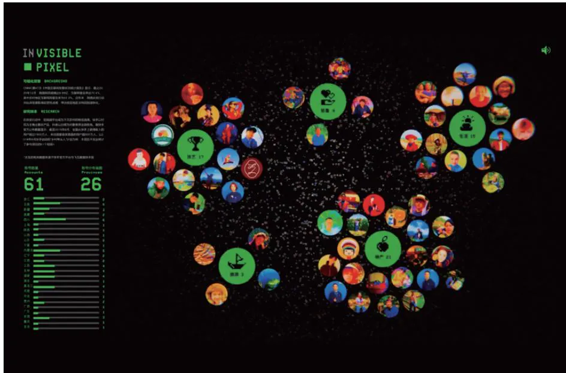  
图 4 － 4 《Invisible Pixel》 1

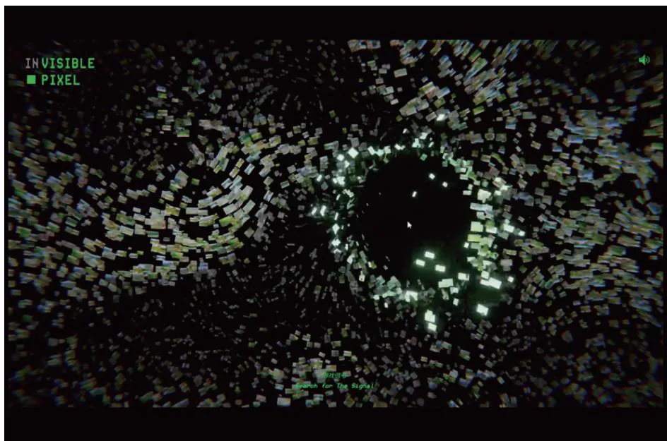  
图 4 － 5 《Invisible Pixel》 2

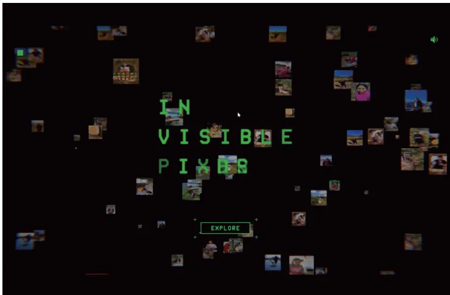  
图 4 － 6 《Invisible Pixel》 3

# （三） 向帆

年年初 清华大学美术学院视觉传达设计系副教授向帆发表了 数据追问 全国美展油画作品视觉化解读 这篇文章通过向帆和她的团队对全国美展获奖油画作品的视觉化分析为一个图像数据库来做研究 除了完成了交互平台视频展示外 向帆和她的团队还设计了一些人工智能图像分析等有趣的视觉化试验， 运用谷歌的人工智能开源代码分析全国美展油画作品 显现了色调 题材 作品名称 画幅 获奖经历等因素与获奖的相关度 提出了不同于传统视角的艺术观察新方法 可谓计算机科学技术与艺术研究的精彩案例 向帆和她的团队根据文章创作的信息可视化作品 随着数字音乐的有力节奏 张获奖油画作品如一些彩色的小斑点般在人们眼前铺陈而来 人们既能凌空鸟瞰一片斑斓的油画天地 又能瞬时俯冲而下观察每个作品的细节 这种观赏油画的方式是前所未有的 该作品的可视化界面如图 图 所示

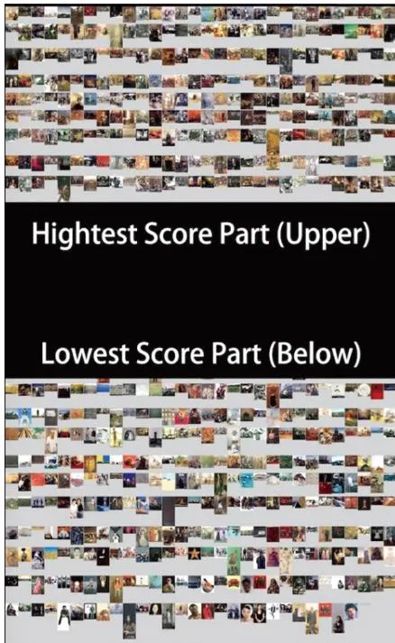  
图 4 － 7 《Award Puzzle》 可视化界面之一

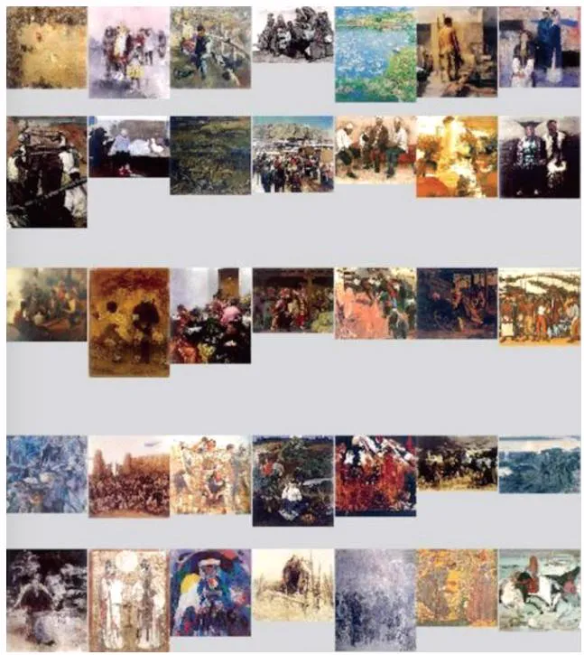  
图 4 － 8 《Award Puzzle》 可视化界面之二

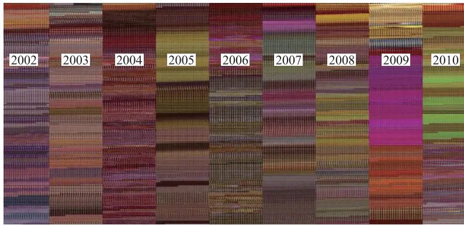  
图 4 － 9 《Award Puzzle》 可视化界面之三

# 二、 外国信息可视化设计师 ／ 团队及作品

# （一） 张圣焕 （韩国）

张圣焕号称 韩国信息可视化设计先行者 他凭借对信息可视化设计的认同与喜爱潜心钻研其中的规律并提炼出了一套完整的信息可视化设计方法论 在他看来 信息可视化设计是一个充满无限可能的职业。 张圣焕说： “我们可以轻松地在世界上任意一个国家的机场里找到厕所 是因为有代表 厕所 的图片和图画文字 当然图画文字只是信息图表中

一个很小的部分。 现在， 我们生活的世界已经成为一个更多地运用视觉信息打破地域和语言限制的时代。”

作为韩国信息可视化设计先行者 张圣焕谦虚地说自己并不是非常理性 逻辑性很强的人 能在信息可视化设计方面取得一些成绩更多是基于自己对信息可视化的兴趣 张圣焕小时候很喜欢读书， 阅读量很大， 常常参与学校板报、 海报等设计任务， 将大量信息归纳成易读易懂的板报算是启蒙阶段 而他真正以设计师的身份介入信息可视化设计是从 年在韩联社的工作经历算起。

张圣焕凭借兴趣做了大量非商业性的信息可视化设计作品， 餐饮类、 地图类等， 只要感兴趣的领域他都会设计。 张圣焕说： “那时， 不图赚钱， 只因喜好， 没想到它们在平台上的公益传播却带来了很好的社会价值 大家很喜欢这种结构清晰 有趣味且易懂的信息传播形式 这让我很有成就感 并决定一直做下去 张圣焕的设计特点是拟物扁平的插图画风详细绘制组成物品的部分和构件。 他的代表作品有韩国首尔和济州岛地域地图信息可视化设计 （图 4 － 10、 图 4 － 11）， 食品类信息可视化设计 （图 4 － 12 ～ 图 4 － 14）， 书籍装订和印刷类信息可视化设计 （图 4 － 15 ～ 图 4 － 17）。

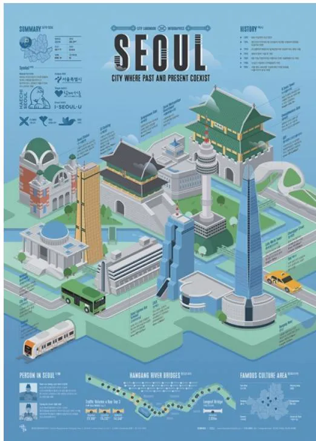  
图4 －10 首尔地图信息可视化设计

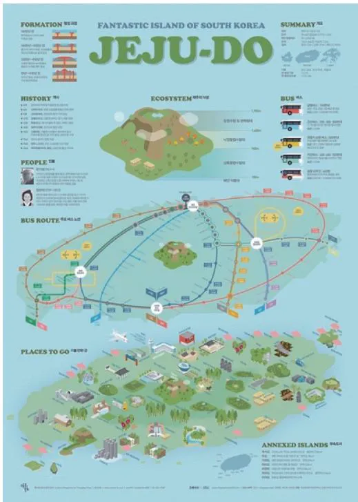  
图4 －11 济州岛地图信息可视化设计

信息可视化作品 《打包清单》 是为出国旅行打包行李的过程和注意事项等进行的设计，图4 －18 为作品的草图设计及最终成品。

信息可视化作品 紫菜包饭 是为食品紫菜包饭的制作过程和种类等进行的设计 图4 －19 为作品的草图设计及最终成品。

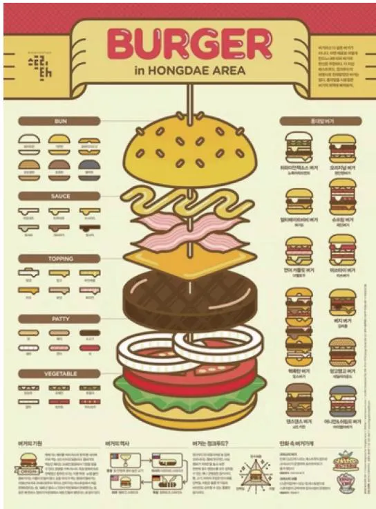  
图4 －12 食品类信息可视化设计之一

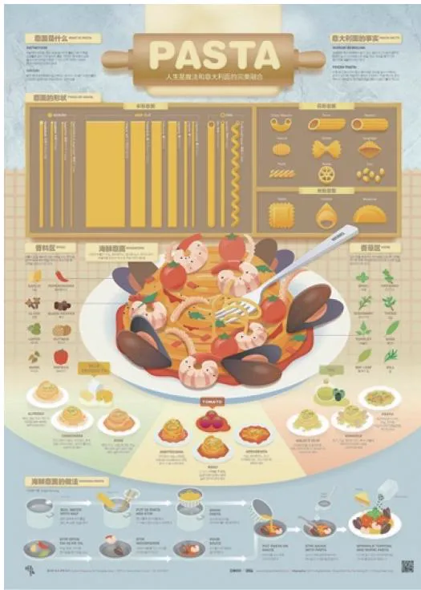  
图4 －13 食品类信息可视化设计之二

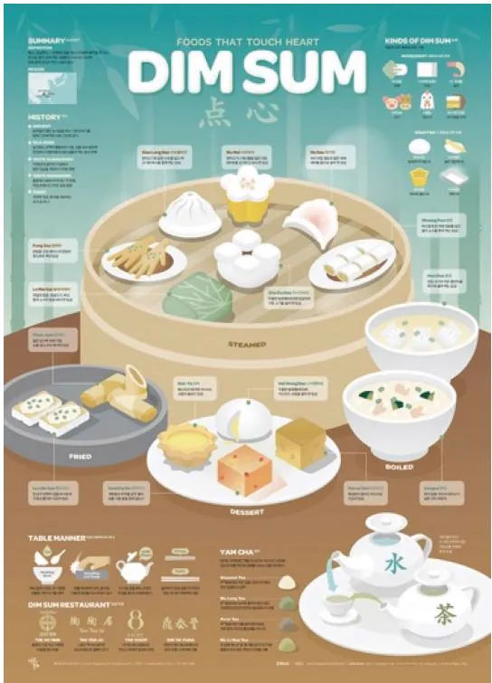  
图4 －14 食品类信息可视化设计之三

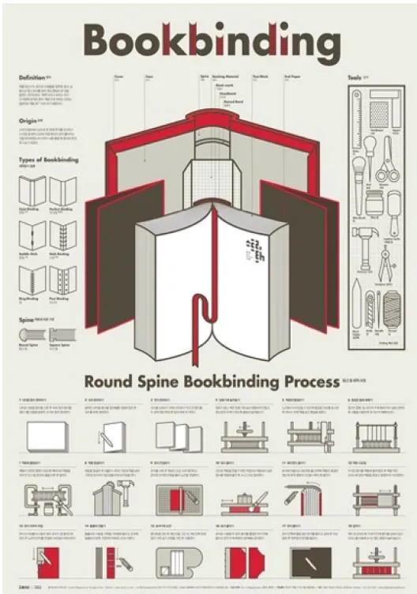  
图4 －15 书籍装订类信息可视化设计

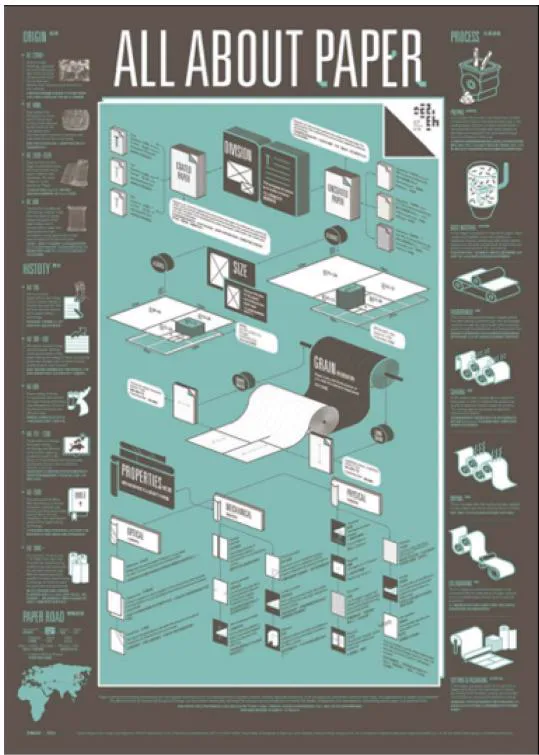  
图4 －16 印刷类信息可视化设计之一

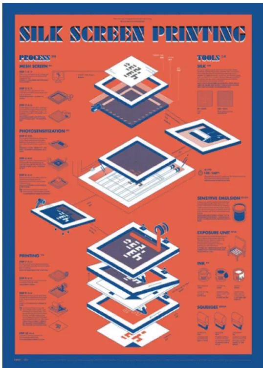  
图 4 － 17 印刷类信息可视化设计之二

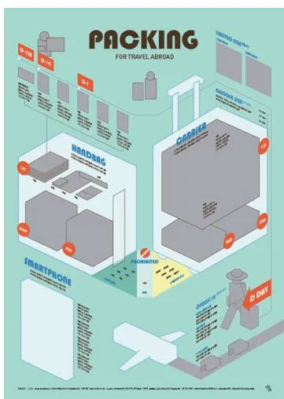

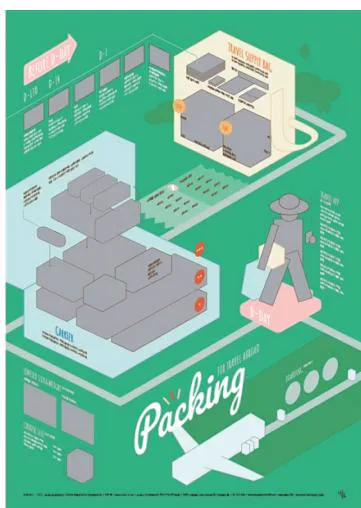

图4 －18 《打包清单》 设计草图及最终成品  
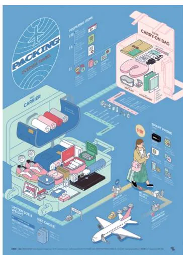  
（a） 草图设计之一； （b） 草图设计之二； （c） 最终成品

<!-- Chunk 2 End -->

<!-- Chunk 3 Start -->

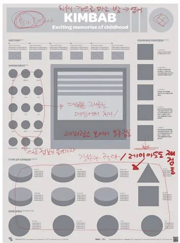

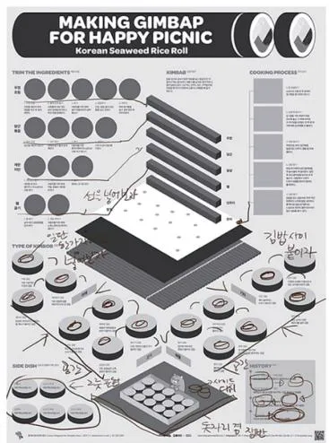

图 4 － 19 《紫菜包饭》 草图设计及最终成品  
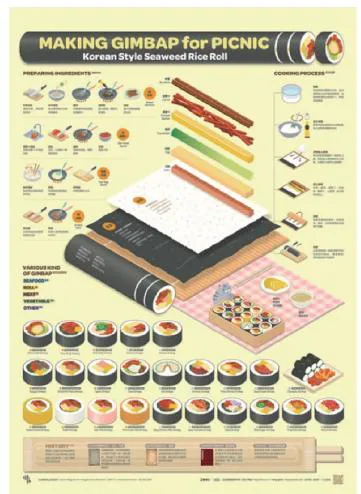  
（a） 草图设计之一； （b） 草图设计之二； （c） 最终成品

信息可视化作品 《烧酒》 是为韩国烧酒的制作过程和种类等进行设计的， 图 4 － 20 为作品草图设计及最终成品。

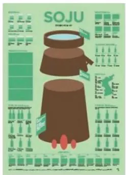

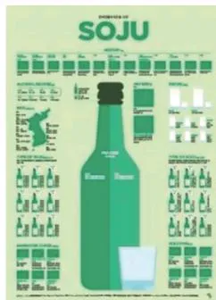

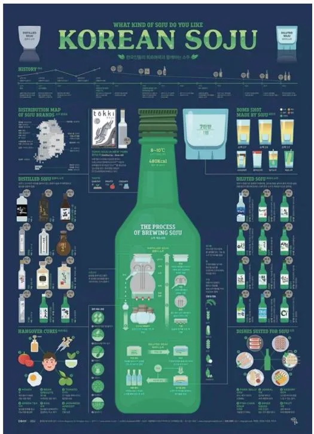

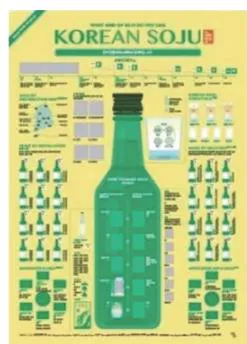

图4 －20 《烧酒》 草图设计及最终成品  
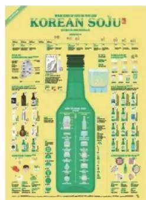  
草图设计 最终成品

信息可视化作品 《了解猫咪护理》 是为如何照顾猫咪和收养流浪猫以及对猫咪形态特征的科普说明等进行的设计， 图4 －21 为作品的草图设计过程及最终成品。

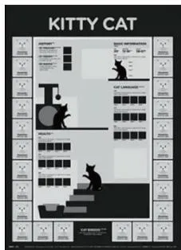

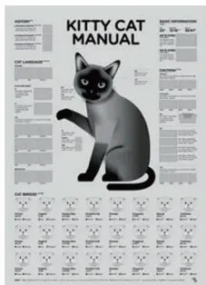

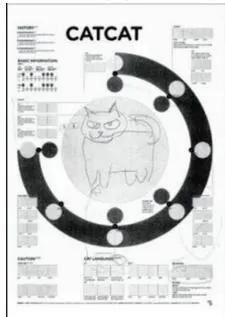

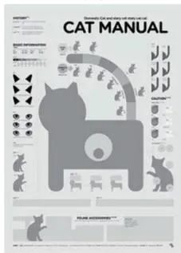

图4 －21 《了解猫咪护理》 草图设计及最终成品  
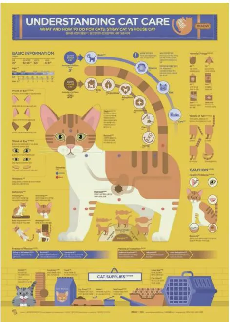  
（a） ～ （d） 草图设计； （e） 最终成品

# （二） 彼得·格兰迪 （英国）

彼得·格兰迪 （Peter Grundy） 是一名专注于信息设计领域30 年的插画师和设计师。 他通过设计简单 无障碍的交流与分享的体系 掌握了一种解决现代信息设计环境混乱的方法 他拥有卓越的能力 通过插画 能把复杂的 令人费解的信息变得简单 优雅

信息可视化设计本来是单调乏味的 但是彼得 格兰迪化复杂为简单 他设计的信息图表简洁、 优雅、 有趣且充满想象力。 与其说设计的是信息图表， 不如说更像是一件艺术品。彼得 格兰迪把图像画得尽可能大 设计的医药类信息图表简单易懂 富有活力 除了用于帮助人们了解医药知识， 又可应用到生活科普学习中。

彼得 格兰迪设计的一本儿童书 人类的身体 是为 岁以下的孩子设计的插画书它与平常的 “医学插图” 不一样， 更简单、 更有趣， 这表达了他在信息设计方面的一个核心原则——— “娱乐”， 相信幽默能让复杂的信息更贴近人心。 彼得·格兰迪关于人体器官医学知识的信息可视化设计的代表作品还有 《健康的嘴》 （图4 －22）、 《一眨眼就明白事实》（图 4 － 23）、 《感觉器官》 （图 4 － 24）、 《心》 （图 4 － 25）。

# （三） 阿道夫·阿兰兹 （西班牙）

阿道夫·阿兰兹 （Adolfo Arranz） 是世界上最被推崇的信息可视化设计师之一。 他先加入了西班牙报纸 世界 后来又成为新加坡传媒公司的创意总监 入行这些年来 他几乎荣获了国际的主要奖项 目前他负责管理中国香港一家报纸的咨询图像部 阿道夫 阿兰兹认为大部分的设计项目都是个有趣的挑战 能让你学习新知识 因为咨询图像的好坏取决于前期信息资料的搜集和研究的丰富性 这背后是一个持续不断学习的过程

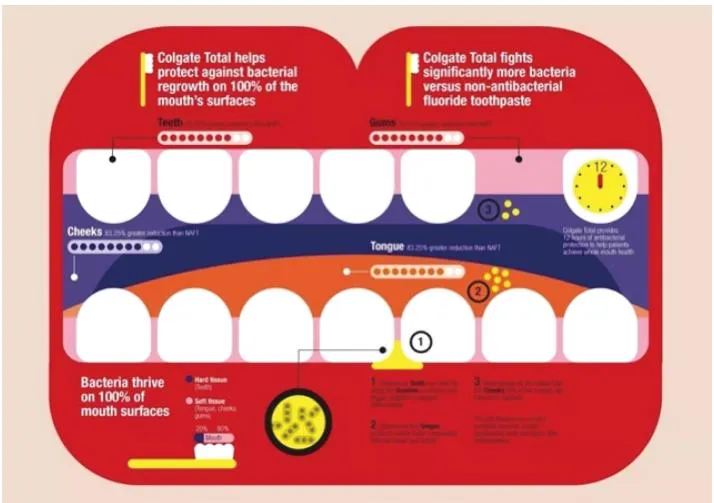  
图 4 － 22 《健康的嘴》

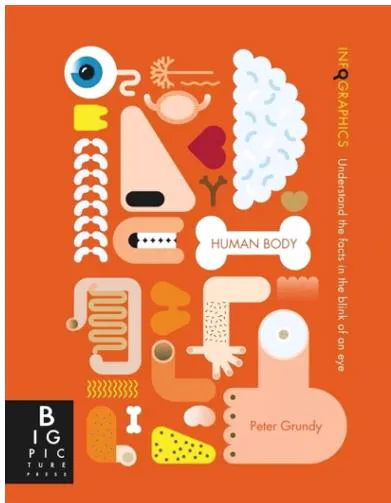  
图4 －23 《一眨眼就明白事实》

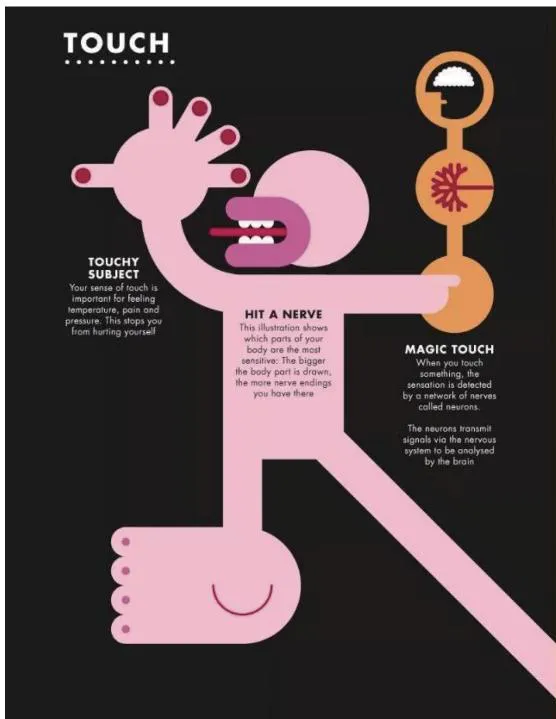

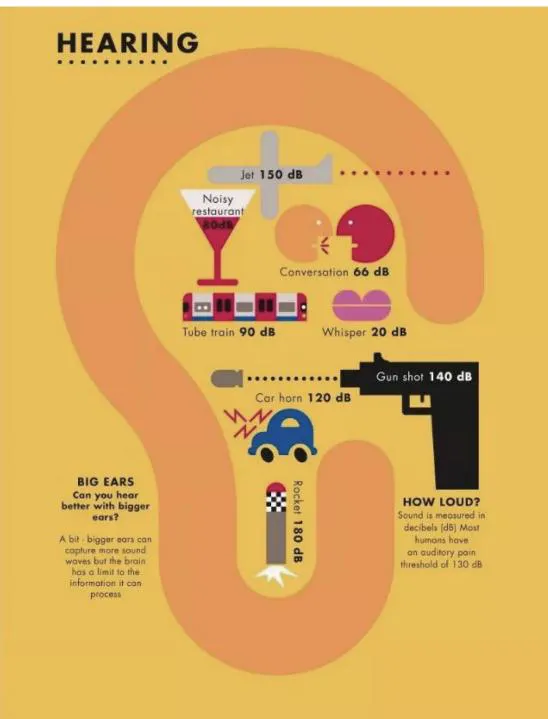  
图 4 － 24 《感觉器官》

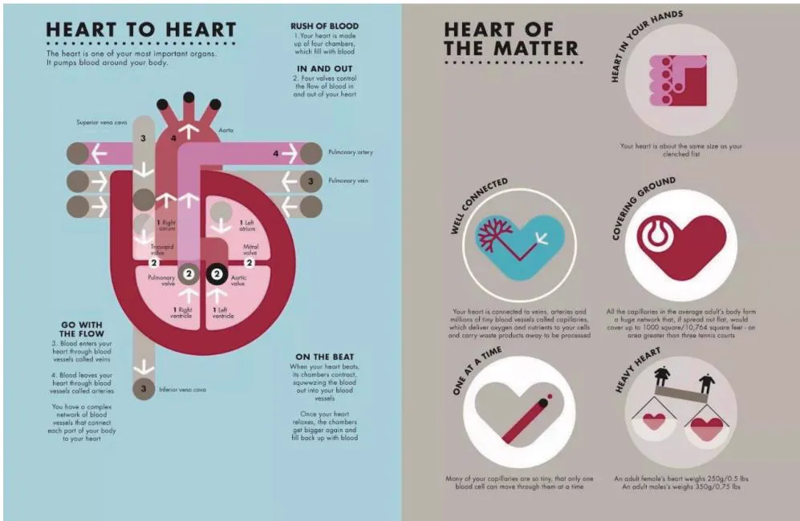  
图 4 － 25 《心》

阿道夫·阿兰兹的其他信息可视化设计作品有 《小龙》 （图 4 －26）、 《猎人和猎物》（图 4 － 27）、 《口味问题》 （图 4 － 28）、 《珠穆朗玛峰》 （图 4 － 29）。

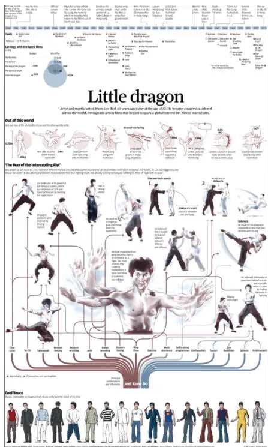  
图 4 － 26 《小龙》

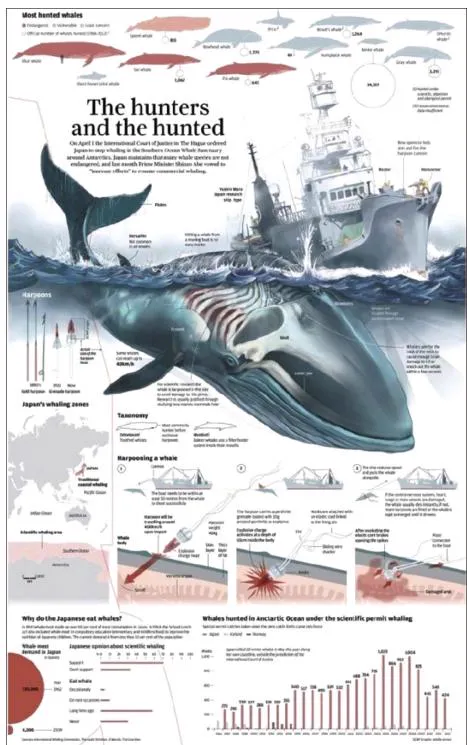  
图 4 －27 《猎人和猎物》

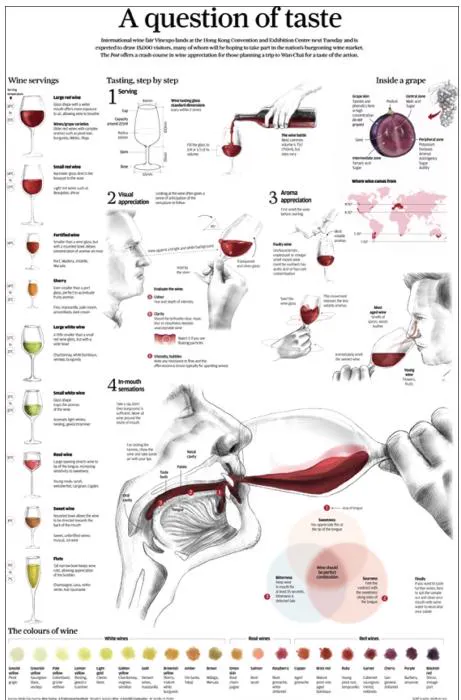  
图 4 － 28 《口味问题》

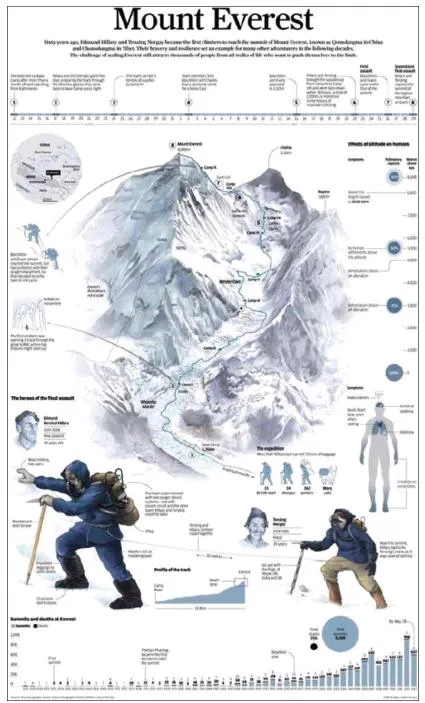  
图 4 － 29 《珠穆朗玛峰》

# （四） 安娜·库阿 （西班牙）

安娜 库阿 是西班牙马德里的一位自由职业插画师和设计师 同时她担任欧洲设计学院的信息可视化课程教师 她参与过多个插画项目 为书籍封面 杂志内容纺织产品以及漫画集制作插画， 同时还与 Monocle 杂志、 快公司、 PDN、 Netflix、 微软、 福克斯、 Snapchat 等品牌合作过。

众所周知 信息图表由文字 数据以及图像组成 安娜 库阿认为信息图表的关键是分析内容 创建框架 做好信息分级 并再加入排版设计和插画 通过一个完整的系统把信息清楚地表达出来 设计师应该具备准确 有条理性地处理文字 数据和图像的能力 这也是她从作为欧洲设计学院教师的角度 对信息图表设计的教育提出的关于新闻工作 平面设计、 插画和编辑设计等方面培训的一些意见。

安娜 库阿认为信息可视化图表最复杂的地方是对内容的理解 这需要设计师深入地分解内容 分成小的部分 贴标签 分等级 然后再汇合在一起 需要创造一个信息分层的体系 然后在一个结实的框架串联起所有的内容 这是关键 安娜 库阿认为插画一方面撑起了文本和信息， 另一方面增加了阅读性和帮助理解， 就像奥图·纽拉特所说的 “话语相隔，图像相合 图像易被理解的关键是创作插画时应做到让内容变得简单 更容易理解 图像或者插画都必须起到解释的作用。

安娜 库阿的个人视觉风格最与众不同的地方应该是色调 信息图表的网格布局以及主插画的黑边线条 安娜 库阿说 我目前想挑战的是用更新鲜的风格 更自由的排版以及创造不同视角的对比来设计信息图表 我还想更多地利用信息图表的等距视角 因为我喜欢画等距线 以此探索排版风格 对我来说 编辑设计和排版是长久的挑战 因为这是我较少

涉猎的领域。 对信息的整理并在此基础上加入必要的排版和插画， 好让整个作品看起来是一个完整的系统， 主插画、 辅助插画的其他工具以及排版都很重要。”

以下是安娜 库阿的设计作品 图 是地图设计 图 是东京图形符号图 4 － 32 是 《在博尔德生活和工作学习的费用是多少》。

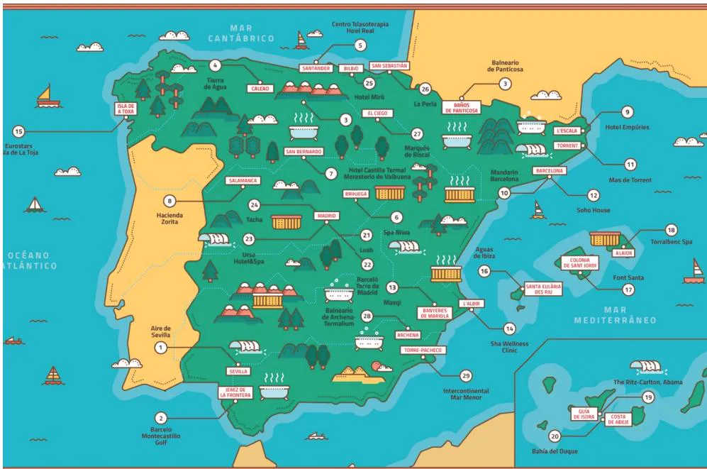  
图4 －30 地图设计

  
图4 －31 东京图形符号

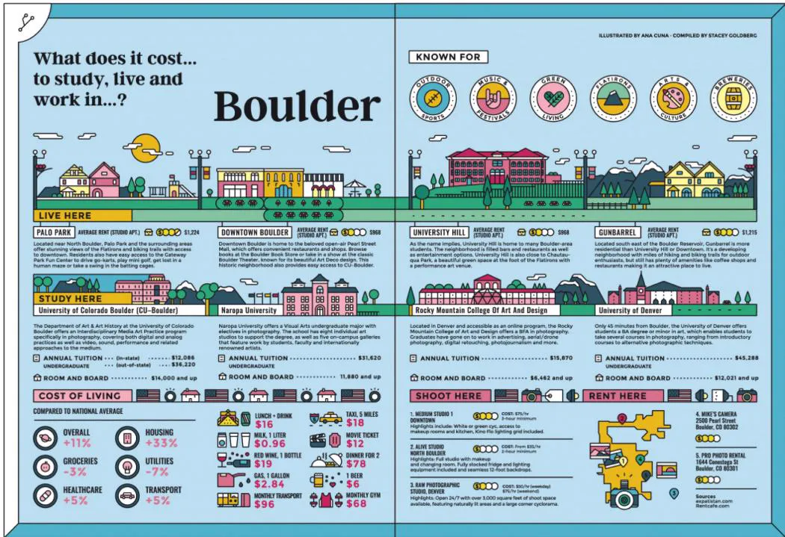  
图 4 － 32 《在博尔德生活和工作学习的费用是多少》

# （五） 扬·施沃乔团队 （德国）

扬 施沃乔 在柏林设立了一个信息可视化图表设计工作室 自年以来 他一直在管理 办公室 他率领的团队设计的作品获得了众多国家的国际奖项。 扬·施沃乔和他的团队的设计风格和特点是： 理性分析结构， 信息图表制图如建筑师般精细 如体育场馆信息图 图 图 在德国帆船戈奇福克下水周年之际 他和他的团队开始以 的形式重新创建帆船视觉图形并将其创作成信息可视化图表 这个项目是他与戈奇福克新闻官方合作设计的作品 他一直认为信息可视化设计内容与事实相符是非常重要的设计原则 所以在设计项目前他认真阅读包含该船的建造计划等相关内容， 最终这个作品在许多报纸和杂志以及线上发表 （图4 －37）。

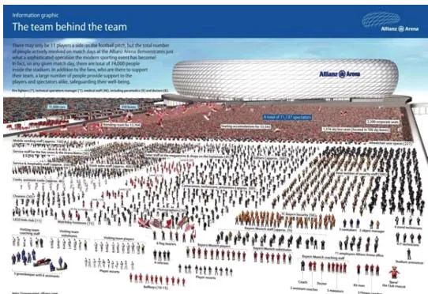  
图4 －33 体育场馆信息图1

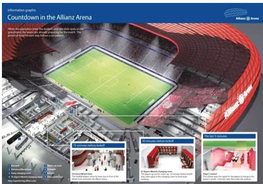  
图4 －34 体育场馆信息图2

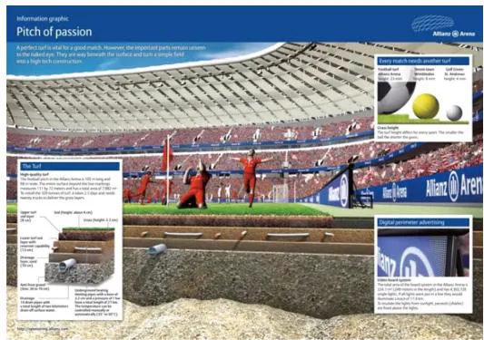  
图4 －35 体育场馆信息图3

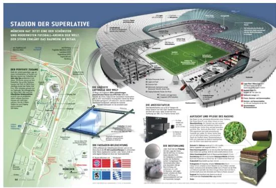  
图4 －36 体育场馆信息图4

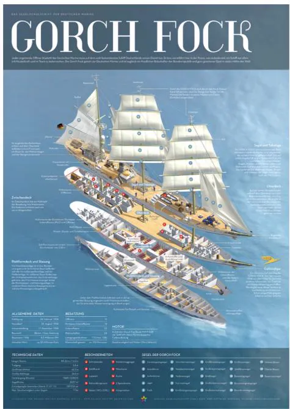  
图4 －37 《帆船戈奇福克》

# （六） 阿尔贝托·卢卡斯·洛佩兹 （美国）

阿尔贝托·卢卡斯·洛佩兹 （Alberto Lucas López） 是华盛顿高级地理图形编辑， 他的作品在美国以及亚洲和欧洲获得了无数奖项 仅在 年 他就赢得了 多项国际奖项他最早接触信息图是在西班牙纳瓦拉大学上学的时候 他开始对信息图充满兴趣 并认为信息图表是表达新闻的一种语言 从此他开始探索这个充满激情的领域

阿尔贝托 卢卡斯 洛佩兹的设计作品更多的是关注社会问题 并能够引发人们的思考 如代表作品 社会晴雨表 图 他想通过建筑高度来衡量一个时代最重要的社会价值 世界上最高的建筑一直充当晴雨表 象征着社会最珍视的原则 在早期的历史中 建筑颂扬了宗教 然后是政府 之后这些建筑又被银行 纪念碑所取代 而今天 更多

的是零售商厦 餐厅 办公室 酒店和住宅的组合 他为了给作品中每座建筑增加最大的细节， 中间插图是采用墨水手工绘制的方式进行设计。 他认为信息可视化图表设计的基本原则之一是使复杂性更加清晰， 所以采用轻微的透视绘制， 以确保每座建筑物图形都能立即被识别， 一目了然地了解建筑的社会意义， 并发现人类历史上的趋势。 他的其他代表作品有《皇后 “斯特拉”》 （图 4 － 39）。

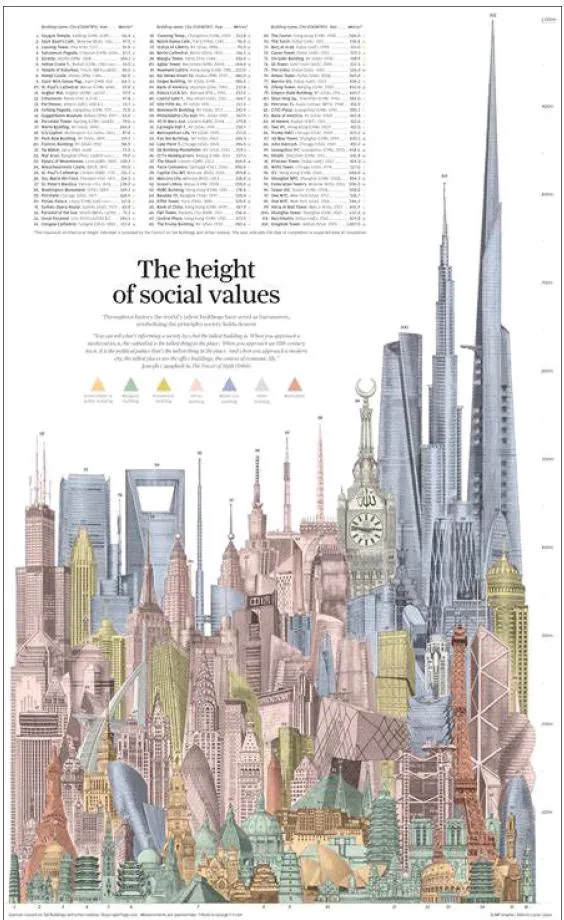  
图 4 －38 《社会晴雨表》

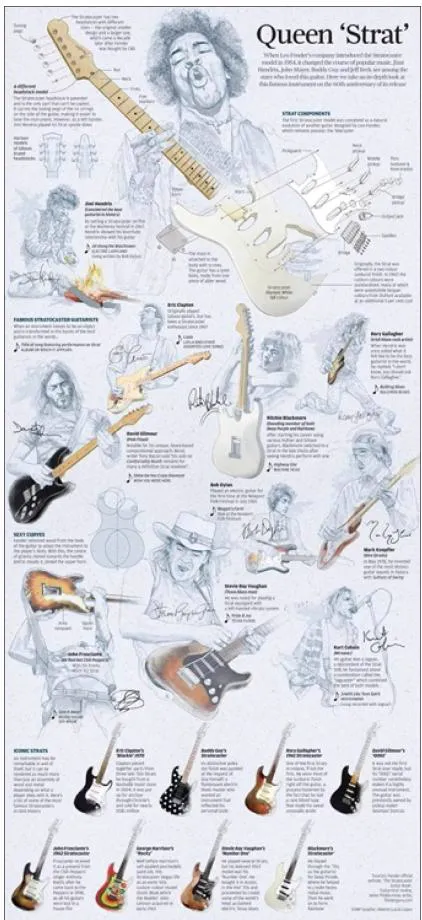  
图 4 － 39 《皇后 “斯特拉”》

# （七） 安东尼奥·法拉赫 （阿曼苏丹国）

安东尼奥·法拉赫 （Antonio Fararh） 是马斯喀特媒体集团的信息可视化设计图表编辑，也是 阿曼时报 和 青年报 的出版商 安东尼奥 法拉赫在信息可视化领域成果突出， 先后获得了100 多个奖项。 他的信息可视化设计作品视觉效果突出， 并且在信息叙事上设计逻辑清晰 在丰富内容的同时让人们理解所要表达和陈述的复杂信息 如他所设计的一张关于传统文化的信息图表 因为阿曼苏丹国的养蜂文化产业将在阿曼苏丹国泰晤士报 和 青年报 上以双页格式出版 用来庆祝阿曼苏丹国国庆 信息图表中运用矢量插图清晰解释了阿曼苏丹国养蜂的两种方法 一种是用空心枣椰树干 另一种是用树枝养蜂 图 安东尼奥 法拉赫其他的设计作品如图 图 所示

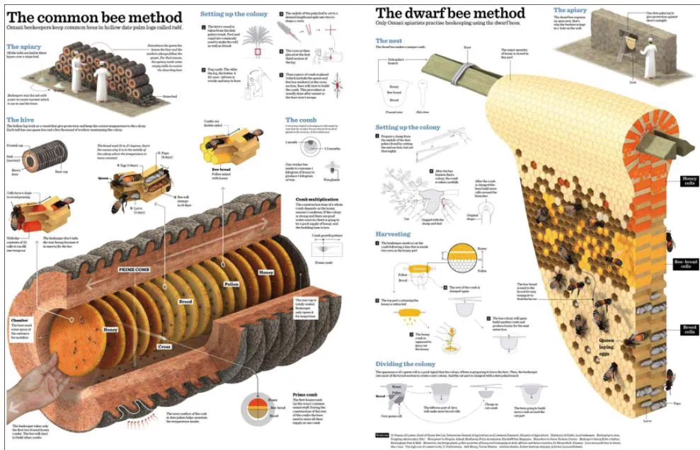  
图4 －40 阿曼苏丹国养蜂信息图

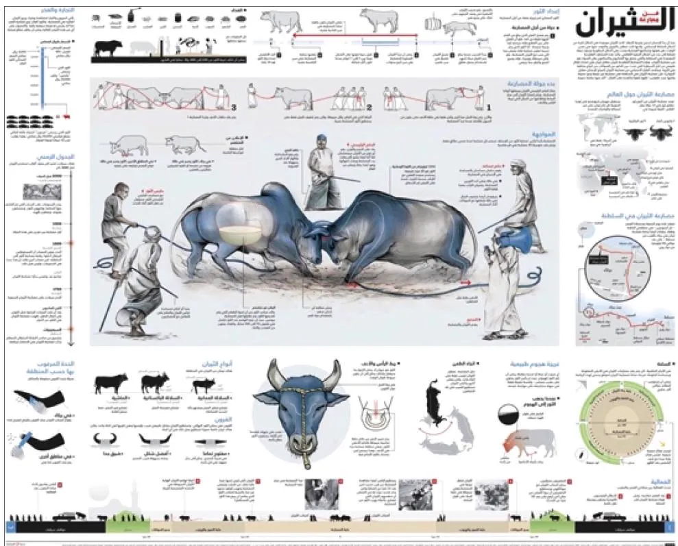  
图4 －41 安东尼奥·法拉赫的设计作品之一

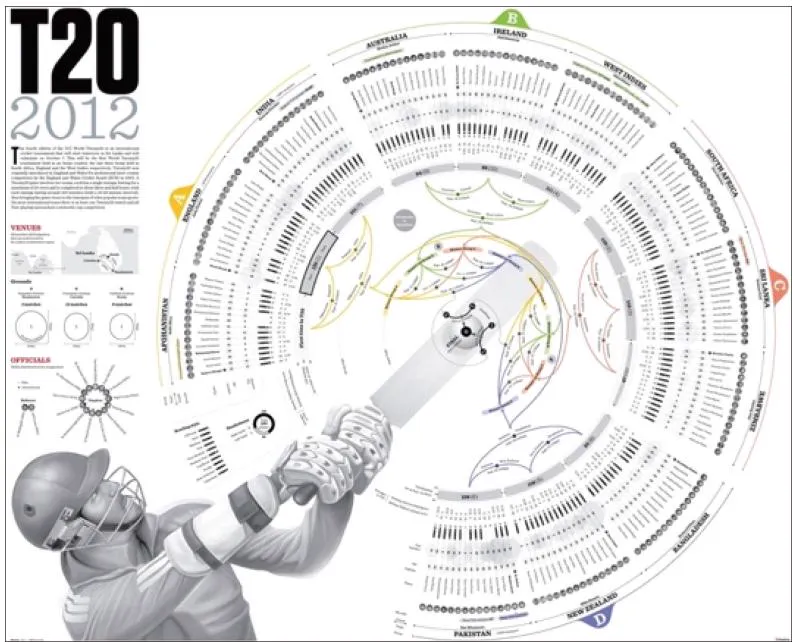  
图 4 － 42 安东尼奥·法拉赫设计作品之二

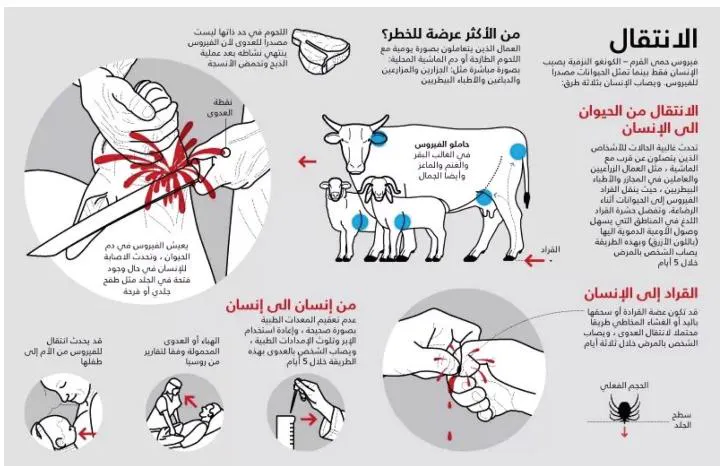  
图4 －43 安东尼奥·法拉赫设计作品之三

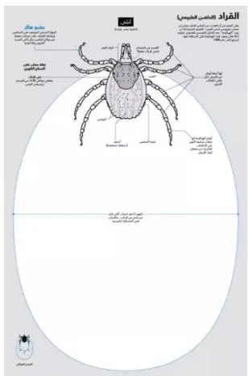  
图4 －44 安东尼奥·法拉赫设计作品之四

# 三、 国外交互信息可视化设计研究机构及作品

在信息大爆炸的时代 每天都有很多的新消息 新发现 新趋势向人们狂轰滥炸 作为信息可视化设计师 需要具备熟悉使用计算机语言和工具的能力 运用计算机辅助技术能为清晰快速地分析数据规律 获得洞见 符号传达信息 赋予诗意般的比喻 和文学意义里的比喻一样， 两者间需有某种强关联性， 才能构成比喻。 赋予其诗意， 则是为了动人的体验。信息数据瞬息万变 将信息可视化与交互设计相结合 互相配合 满足人们的信息需求 满足人们对信息获取的更好体验。

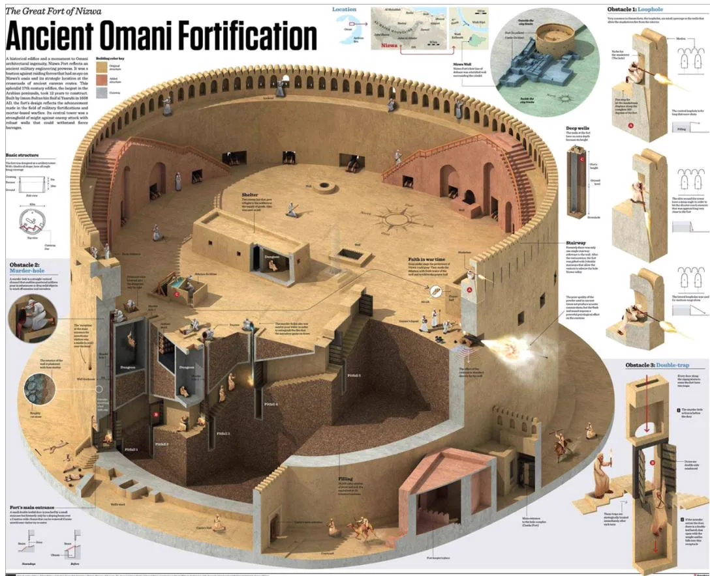  
图4 －45 安东尼奥·法拉赫设计作品之五

# （一） 研究机构— 密度设计研究实验室

在互联网大时代的背景下 设计与大数据无疑会成为当下的热门专业 密度设计研究实验室是意大利米兰理工大学时尚与艺术设计学院的一个研究实验室 密度设计研究实验室的作品聚焦于城市 社会与组织等复杂现象的可视化分析 该实验室旨在从设计角度研究可视化项目， 研究兴趣包括可视化理论及认识、 认知基础分析； 通过数据可视化框架建构 推测性叙事的解决方案 用开放式方法实现可视化 从视觉叙事到视觉分析该实验室还与其他研究员和组织合作 通过独立严谨的学术研究 开放式问卷调查 加深公众对世界的认知。

该实验室的设计师认为 作为设计师 能够熟悉使用计算机语言和工具能够大大减轻工作的负担 计算机辅助能更清晰 容易地分析数据规律 作品 年孕产妇死亡率 图是以 年产妇死亡率为主题 以花作为隐喻 因为鲜花会凋零 以给予下一代生命 以动态数字花瓣的变化呈现鲜花凋零的过程 每片花瓣的数量对应孕产妇死亡率数字该作品呼吁人们要关心全世界的生育健康 尤其是要关心第三世界国家的生育健康

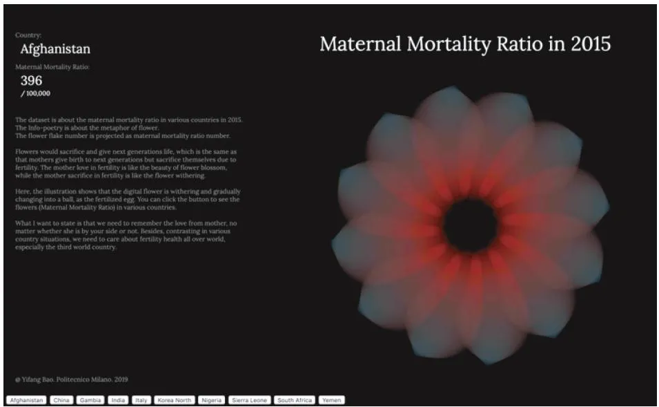  
图 4 － 46 《2015 年孕产妇死亡率》

# （二） 作品

# 1?? 《洛杉矶及芝加哥的收入差距》

作者： 赫里格·舍拉邦

作者将洛杉矶和芝加哥的收入差距进行可视化呈现。 图中两座城市的矩形建筑物高度对应了每个区域的收入水平 清晰地展现了现代城市中的贫富差距 图 图 作品指出 大多数情况下 收入分化与种族隔离相关 暗指城市规划背后的政治操控

# 2?? 《探索海洋》

作者： 苏珊·兰迪、 康拉德·波帕波特、 曼努埃尔·赖茨等

探索海洋 这一交互式科学信息可视化作品利用多点触摸屏 通过赫伯罗特航运公司的远征船解释了复杂的海洋科学 细致的 动画和丰富的数据可视化解释了全球海洋的状况， 增进了用户对海洋科学和气候变化的理解。 这个信息可视化作品分为4 章， 用户可以通过界面信息轻松的自学海洋知识 （图4 －49～图4 －54）。

# 3?? 《紫禁城的历史： 视觉解说》

该作品是关于中国紫禁城历史及人物的可视化网页设计 作者访问了北京和台北 对紫禁城的建筑 历史以及北京和台北的故宫艺术收藏品进行深度研究 并通过插图 地图 虚拟现实、 视频和故事将研究可视化。 作品信息可视化界面设计如图4 －55～图4 －57 所示。

# 4?? 《塑料灾难》

资料来源： 《国家地理》 杂志

作品刊于美国 国家地理 杂志 全球塑料垃圾以每年约 万吨的速度流入海洋塑料垃圾对海龟 鸟类 鲸鱼等各种动物造成的影响已引起公众的强烈抗议 而阳光 风和海浪最终会把海洋塑料分解成几乎看不见的碎片 这些小于 毫米的微塑料将会对鱼类产生巨大的 灾难性的影响 塑料灾难 展现了某些海域情况的严重性 例如在弗拉姆海峡

每加仑的海水塑料微粒超过1?? 3 万个。 作品 《塑料灾难》 信息可视化设计界面如图4 －58 ～图 4 － 62 所示。

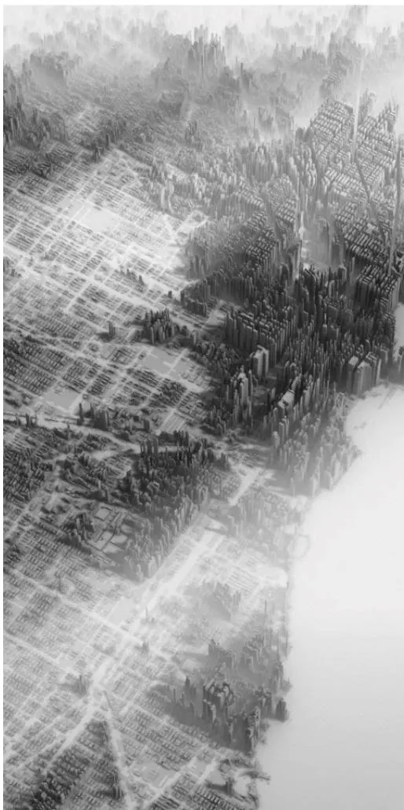  
图4 －47 《洛杉矶及芝加哥的收入差距》信息可视化设计界面之一

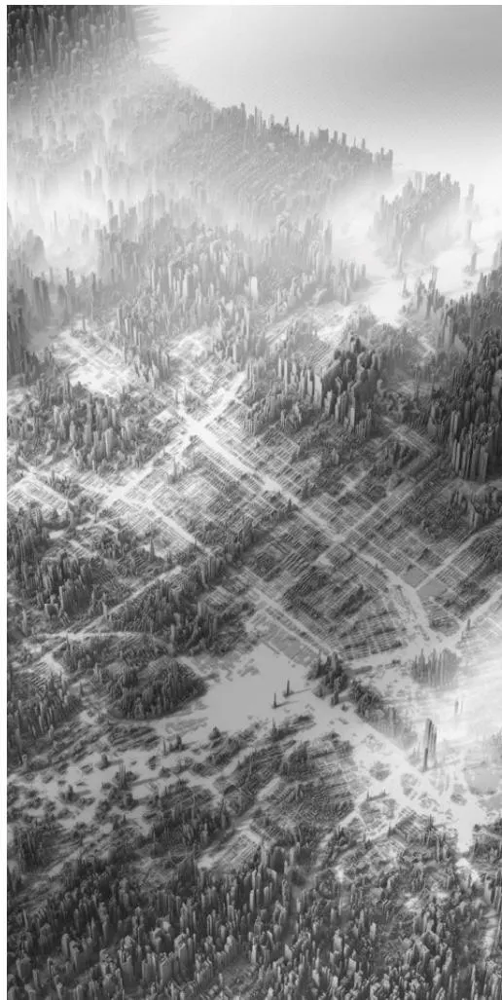  
图4 －48 《洛杉矶及芝加哥的收入差距》信息可视化设计界面之二

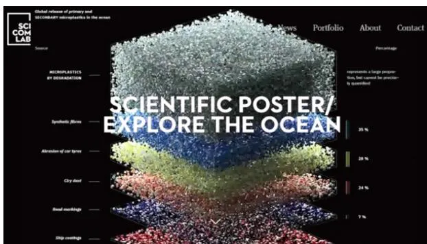  
图4 －49 《探索海洋》 信息可视化设计界面之一

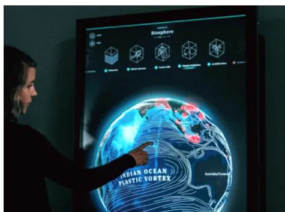  
图4 －50 《探索海洋》 信息可视化设计界面之二

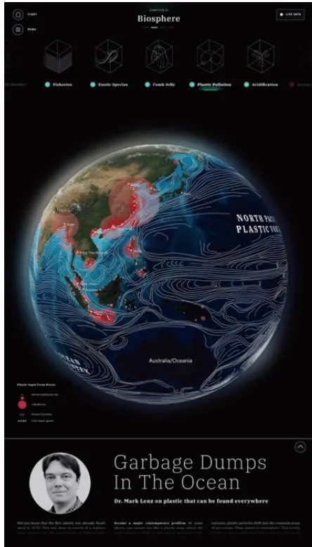  
图4 －51 《探索海洋》 信息可视化设计界面之三

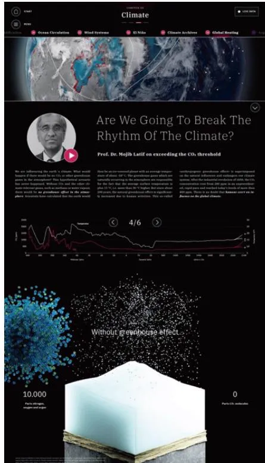  
图4 －52 《探索海洋》 信息可视化设计界面之四

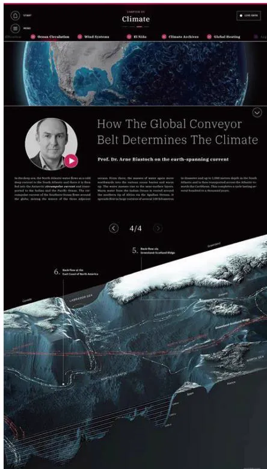  
图4 －53 《探索海洋》 信息可视化设计界面之五

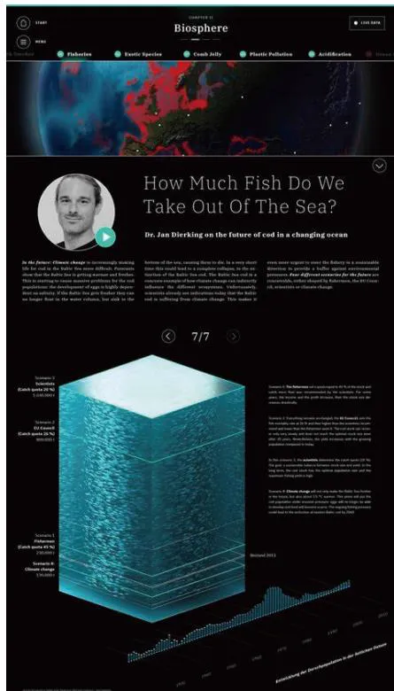  
图4 －54 《探索海洋》 信息可视化设计界面之六

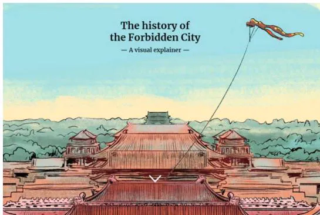  
图4 －55 《紫禁城的历史： 视觉解说》信息可视化设计界面之一

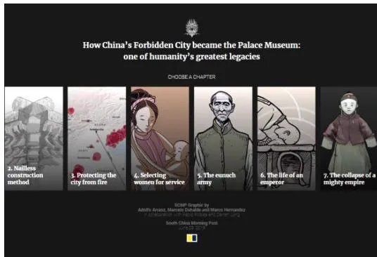  
图4 －56 《紫禁城的历史： 视觉解说》信息可视化设计界面之二

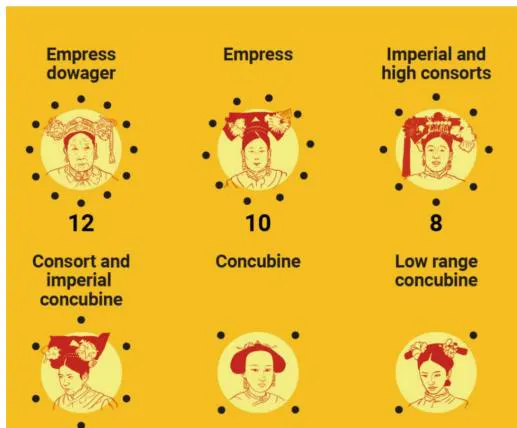  
图4 －57 《紫禁城的历史： 视觉解说》信息可视化设计界面之三

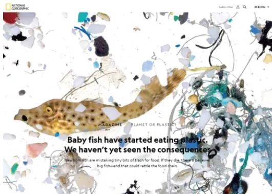  
图 4 － 58 《塑料灾难》信息可视化设计界面之一

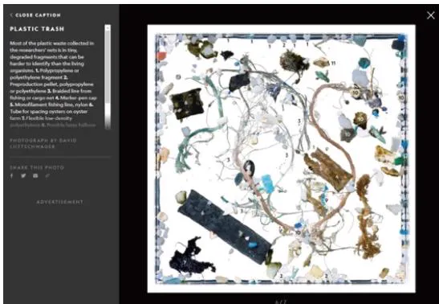  
图 4 － 59 《塑料灾难》信息可视化设计界面之二

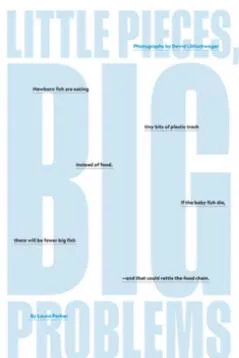

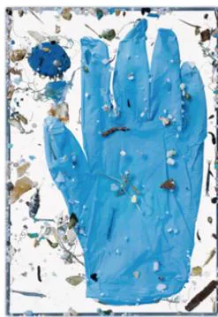  
图4 －60 《塑料灾难》 信息可视化设计界面之三

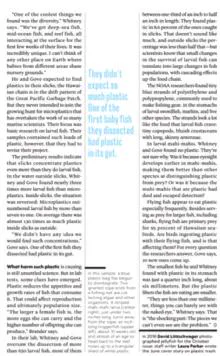

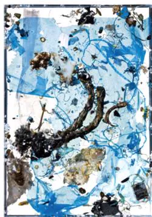  
图4 －61 《塑料灾难》 信息可视化设计界面之四

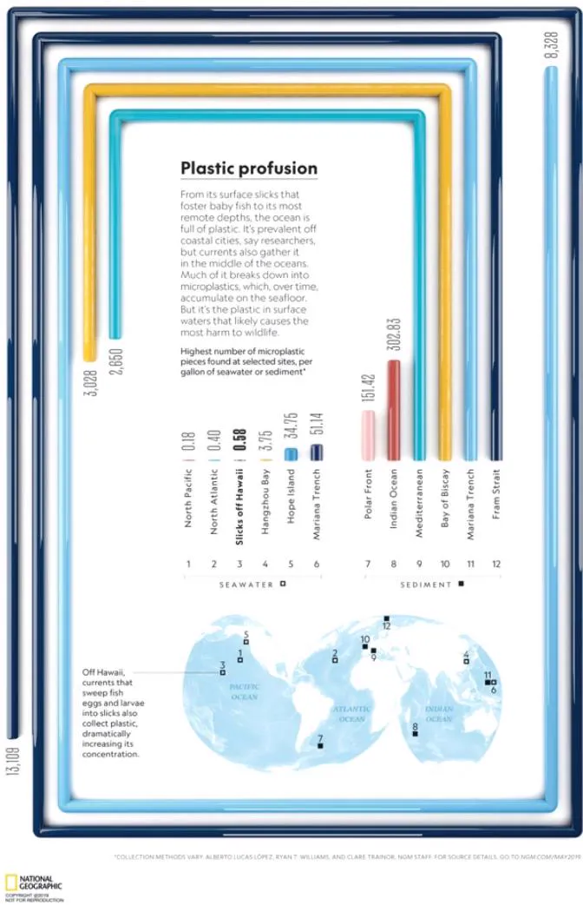  
图4 －62 《塑料灾难》 信息可视化设计界面之五

# 5?? 《1790—2016 年美国移民年轮》

# 作者： 佩德罗·克鲁兹等

该作品反映美国移民历史， 采用树的年轮的生长图像化指代多国人种在美国各个时期的占比。 该作品的信息可视化设计界面如图4 －63～图4 －67 所示。

Simulated Dendrochronology of U.S.Immigration 1790-2016

图 4 － 63 《1790—2016 年美国移民年轮》信息可视化设计界面之一  
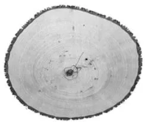  
Nature has its own ways of organizing information: organisms grow and register information from the environment. This is particularly notable in trees, which, through thcir rings, tell the story of their growth. Drawing on this phenomenon as a visual metaphor, the United States can be envisioned as a tree, with shapes and growing patterns influenced by immigration. The nation, the tree, is hundreds of years old, and its cels are made out of immigrants. As time passes, the cells are deposited in decennial rings that capture waves of immigration.

# A forest of trees

The U.S.and its population growth can also be envisioned as a forest of trees.Tree sections,one for each state in the U.S., show the growth profile due to incoming immigration,but also due to newborns (here referred to as natural-borns).

图 4 － 65 《1790—2016 年美国移民年轮》 信息可视化设计界面之三  
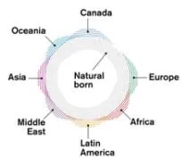  
Each state has grown at different rates, with varying immigration profiles. Some are larger, some are smaller, and some have complex shapes that portray their immigration profile. Tree rings that are nearly circular indicate that population growth due to immigration was much less significant than that due to natural-born persons.

Each state has grown at different rates, with varying immigration profiles. Some are larger, some are smaller, and some have complex shapes that portray their immigration

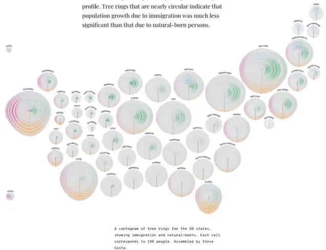  
图 4 － 64 《1790—2016 年美国移民年轮》信息可视化设计界面之二

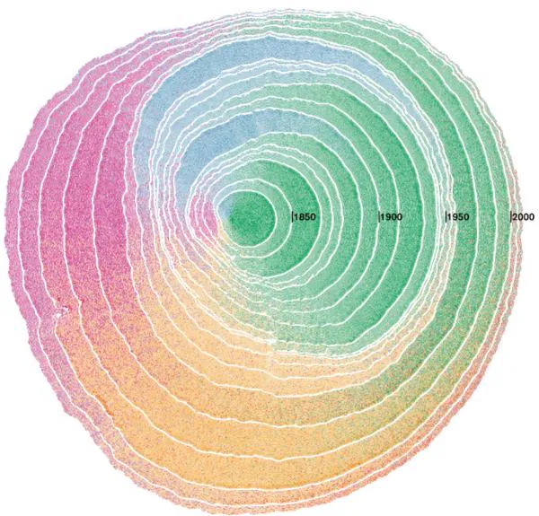  
图 4 － 66 《1790—2016 年美国移民年轮》 信息可视化设计界面之四

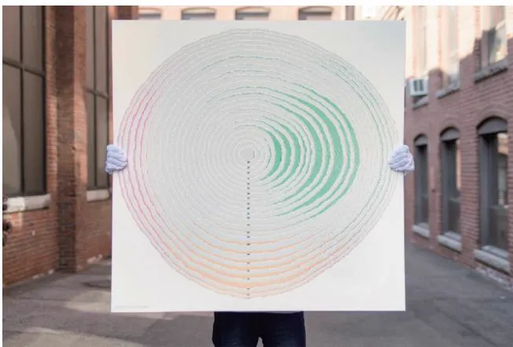  
图 4 － 67 《1790—2016 年美国移民年轮》 信息可视化设计界面之五

# 6?? 《卫星： 在轨 60 年》

# 作者： 罗西亚·塞戈尼亚等

年 月 日 苏联发射了世界上第一颗人造地球卫星 斯普特尼克 号 斯普特尼克1 号在低轨道运行并连续发射了 92 天信号， 人造地球卫星时代正式开启。 自第一颗人造地球卫星发射以来 世界 多个国家向地球轨道发射了超过 颗卫星 平均每年发射超过180 颗人造地球卫星进入轨道。

年为纪念空间探索 周年 罗西亚 塞戈尼亚和其设计团队统计了地球的每一颗人造卫星， 并制作了3D 交互信息可视化地图。 报道从 “第一颗卫星” “空间巴比伦” “卫星的命运 轨道运行 我们为什么需要卫星 卫星的未来 等几个方面全面展示了人类利用卫星探索空间的历史和现状， 如图4 －68～图4 －74 所示。

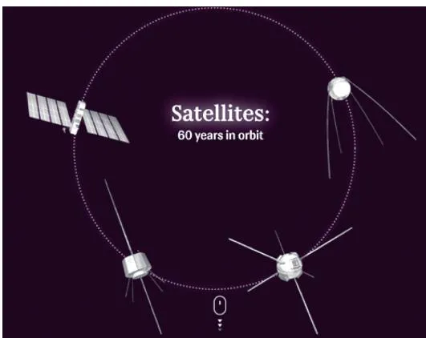  
图 4 － 68 《卫星： 在轨 60 年》信息可视化设计界面之一

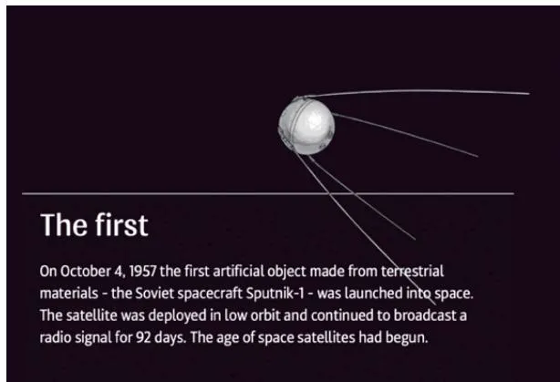  
图 4 － 69 《卫星： 在轨 60 年》信息可视化设计界面之二

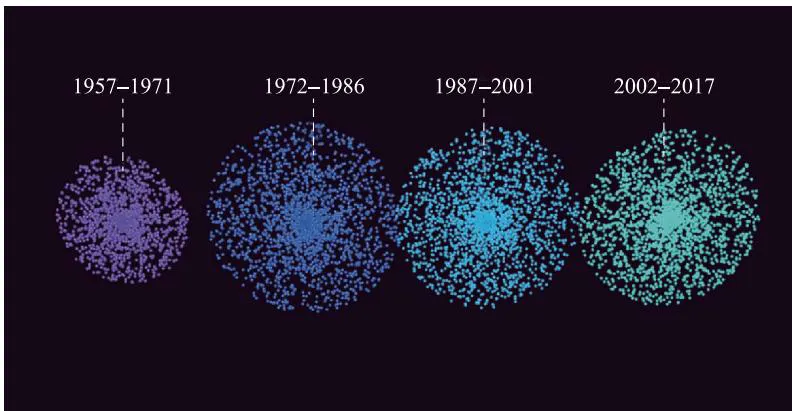  
图4 －70 《卫星： 在轨60 年》 信息可视化设计界面之三

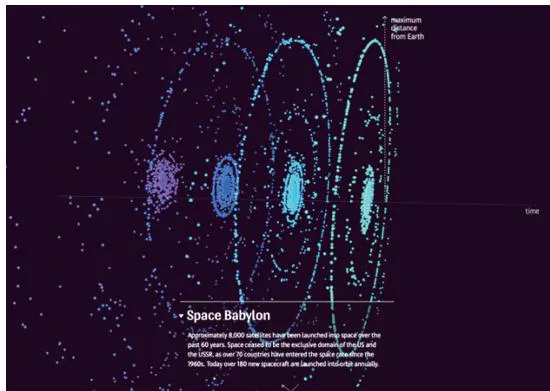  
图 4 － 71 《卫星： 在轨 60 年》信息可视化设计界面之四

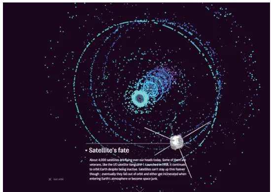  
图 4 － 72 《卫星： 在轨 60 年》信息可视化设计界面之五

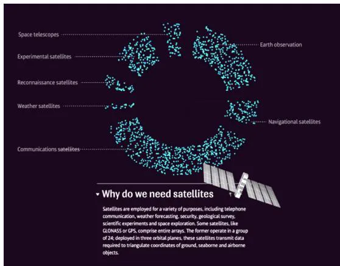  
图 4 － 73 《卫星： 在轨 60 年》信息可视化设计界面之六

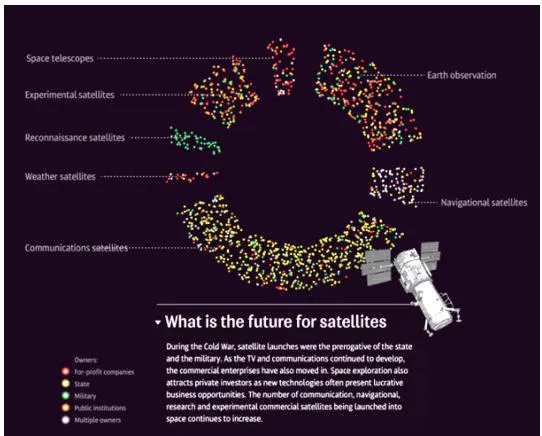  
图 4 － 74 《卫星： 在轨 60 年》信息可视化设计界面之七

