# 第五章

# 信息可视化设计课堂作业的实现与完成

# 一、 思维导图与信息可视化设计流程

# （一） 思维导图简介

思维导图 （The Mind Map） ， 又称脑图、 心智导图、 脑力激荡图、 灵感触发图， 是表达发散性思维的有效图形思维工具 它简单同时又很高效 是一种实用性的思维工具思维导图运用图文并重的技巧 把各级主题的关系用相互隶属与相关的层级图表现出来把主题关键词与图像、 颜色等建立记忆链接， 充分运用左右脑的机能， 利用记忆、 阅读、思维的规律 协助人们在科学与艺术 逻辑与想象之间平衡发展 从而开启人类大脑的无限潜能。

思维导图是一种将思维形象化的方法 放射性思考是人类大脑的自然思考方式 每一种进入大脑的资料 不论是感觉 记忆还是想法 包括文字 数字 符码 香气 食物 线条、 颜色、 意象、 节奏、 音符等， 都可以成为一个思考中心， 并由此中心向外发散出成千上万的关节点 每一个关节点代表与中心主题的一个连接 而每一个连接又可以成为另一个中心主题 再向外发散出成千上万的关节点 呈现出放射性立体结构 就如同大脑中的神经元一样互相连接 也就是个人数据库 思维导图是一种图像式思维的工具 也是信息可视化设计中一种利用图像式思考的辅助工具 思维导图是使用一个中央关键词或想法引起形象化的构造和分类的想法 它用一个中央关键词或想法以辐射线形连接所有的代表字词 想法 任务或其他关联项目的图解方式 能有效地展开信息表现的逻辑与隶属关系 思维导图常用的软件有 和 图 软件的图级结构模板如图 5 － 2、 图 5 － 3 所示。

  
图 5 － 1 XMind 和 MindMaster 软件图标

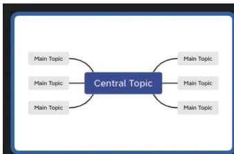

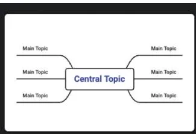

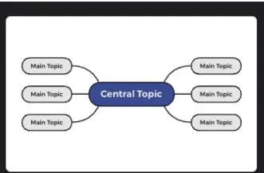

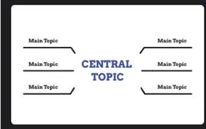

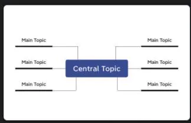

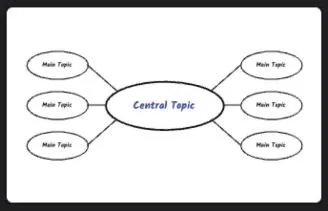

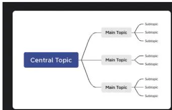

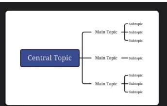

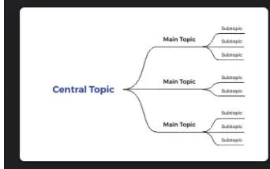

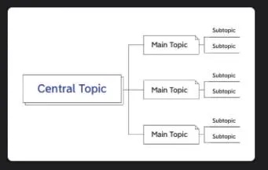

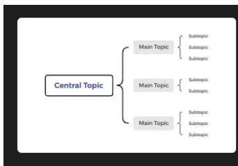

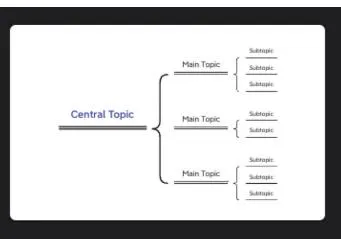

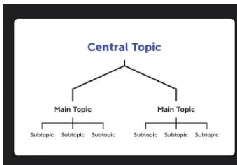

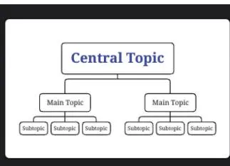

图5 －2 软件图级结构模板1  
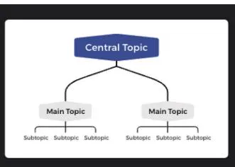  
思维导图 逻辑图 括号图 组织结构图

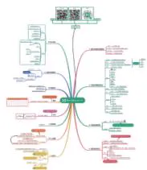

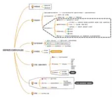

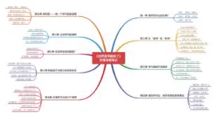

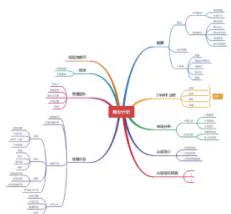

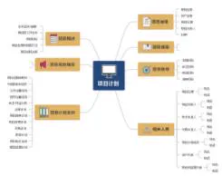

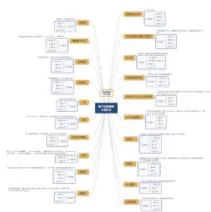

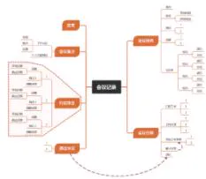

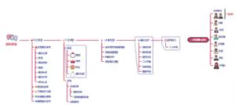

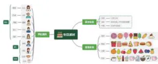

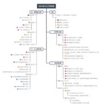

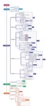

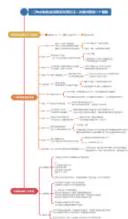

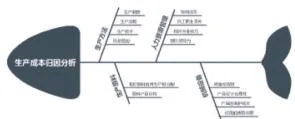

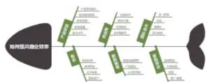

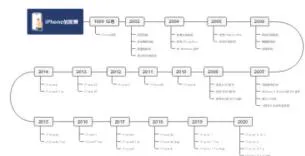

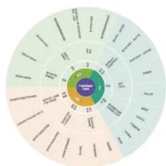

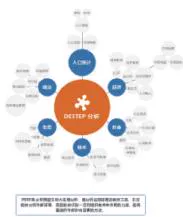

图5 －3 软件图级结构模板2  
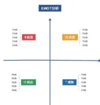  
产品介绍 解析电商文案撰写过程 这样读书就够了 商业计划 项目计划  
国内知名前端大佬汇总 会议记录 婚礼筹备 筹办生日派对 年度个人工作计划  
小公司团队管理 活动策划创意 生产成本归因 如何提高商业效率  
（o） iPhone 发展时间线； （p） 产品运营 9 要素； （q） DESTEP 分析； （r） SWOT 分析

思维导图的绘制方法：

由中心出发 将主题信息用个关键词或者图像描绘出来 关键词是指表达信息核心的单词， 可以是名词， 也可以是动词， 但必须清晰、 具体， 有意义。  
（2） 列出次主题， 即由主题衍生出的多个分支， 并与主题相关联。  
（3） 在不考虑顺序和结构的情况下， 用关键词展示其他细节要点， 并将它们与次主题相关联。  
（4） 用不同的颜色来表示不同的次主题。  
（5） 选择剩余的关键词， 并用不同的中文字体、 英文大小写字母标注， 或者用色彩重新描绘。  
（6） 按级别使用不同粗细的线条， 同级别的线条粗细相同。  
（7） 使用多种颜色对信息分类， 或强调某个视觉中心。  
（8） 将重点突出， 按顺序标出次主题下细节要点， 展现思维导图中的信息关系。  
从整体逻辑结构上入手 同时使用放射状等级构图 数字顺序以及轮廓线框出某分支的方式 使思维导图的结构保持清晰 内容易懂  
（10） 完成基本思维导图。

# （二） 信息可视化设计流程

# 1?? 建立信息逻辑

整理搜集信息与数据， 整合逻辑， 完成思维导图。 标注信息中心和设计重心。 尽量使用图形或图像代替所有信息 并使用符号 代码以及维度空间扩展思维导图 将这个草图转变为个人风格的设计稿。

# 2?? 基础图形与图表创意

基础图形的创意是非常重要的 在梳理整理信息大数据的前提下 选择相对应的恰当图表形式将数据信息整合表达 除了最常用的几种基础图表图形 目前利用计算和设计衍生出多样的图表形式 可以采用平面到三维立体的形式展示多样化的数据信息

通过对基础图形的创意来突出设计主题， 体现与主题相关的设计效果， 设计符合当前数字时代审美的科技图形创意作品 尽可能少用文字来表达信息含义 设计象征性符号或图形， 用图沟通， 提高效率。

# 3?? 制造视觉亮点和高吸引度

当今信息时代的用户对信息的浏览速度越来越快 视觉设计应该以最直观的方式去表达作品所要传达的主要信息内容 制造高吸引度图形 如插图或象征图形 增加图表的趣味性和独特性

# 4?? 视觉导向流程与阅读秩序

信息可视化图表的版面设计要充分尊重人们的阅读习惯 当一张图表中充斥大量的信息时， 需要设计者合理地利用视线移动规律， 将信息顺畅、 有效地传达给读者。 图表设计是直观的 形象的 准确的 它的表现手法虽然多种多样 但是在信息传达方面始终要坚持信息可读性和条理性共存

# 二、 地图信息图表课堂作业的实现

信息可视化设计的教学作业项目的实现是从地图图示信息到复杂的整合信息项目循序渐进的， 遵循从简单到复杂、 从单项到综合的信息载体进行。 视觉创作的表现手法是从教学初就建议学生建立个人的图像表达艺术形式 针对地图信息设计项目要求 学生必须亲自进行实地调研， 分搜集信息、 数据与实地直观照相两部分进行； 鼓励学生尝试扁平、 2?? 5D、 3D、艺术化等多种风格进行视觉表达。

此阶段的课业练习由三部分组成 单体建筑信息练习 区域地图艺术性表达练习 事件地图信息练习。

# （一） 单体建筑信息练习

本练习从简单直观的信息开始， 选取学校区域内的一个单体建筑， 要求学生亲自调研，研究建筑内外部具体位置的信息与功能信息， 加以结构清晰化的视觉表达。 案例选取学校一栋高层教学楼， 学生设计分为一般性分层图表表达 （图5 －4、 图5 －5） 和用楼层错层插图图表表达 （图5 －6、 图5 －7）， 分别用色彩、 插图和符号等表示具体楼层区域功能和设备的配置情况。

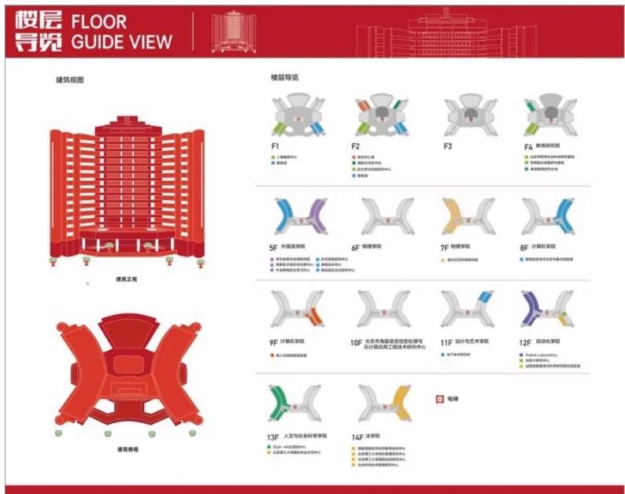  
图5 －4 高层教学楼一般性分层图表之一 （设计者： 李伟卓 郑志远）

图 图 所示作品是学生用 的表现形式展现学校教学楼的立体特点 同时用拟人 拟物的图标表示人物和工具等 强化每一层的教学和功能属性 把学校的一些典型的标志性物品进行点缀 增加了地图图表的趣味性

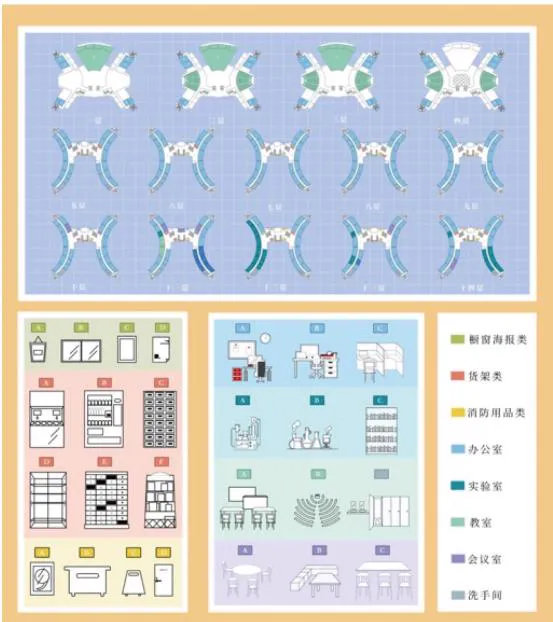  
图5 －5 高层教学楼一般性分层图表之二 （设计者： 陈一宁 宋新茹）

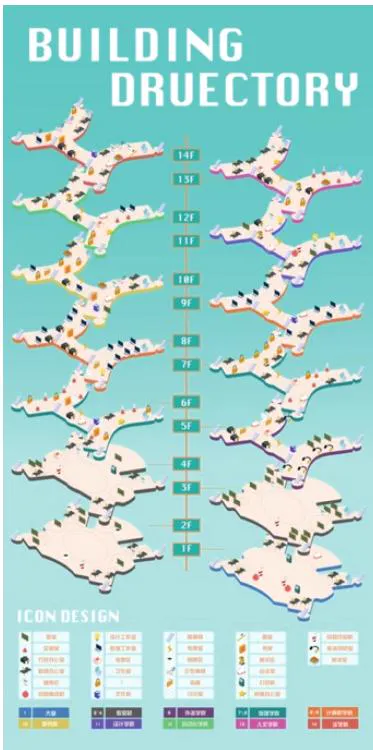  
图5 －6 高层教学楼楼层错层插图  
图表之一 （设计者： 马宇昂 何佳虹）

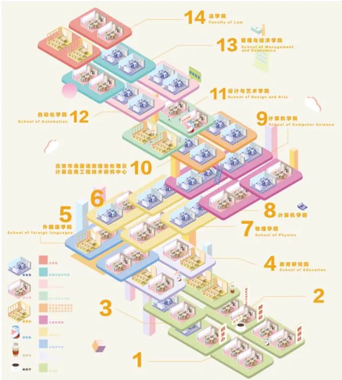  
图5 －7 高层教学楼楼层错层插图  
图表之二 （设计者： 李梦帆 乔楠）

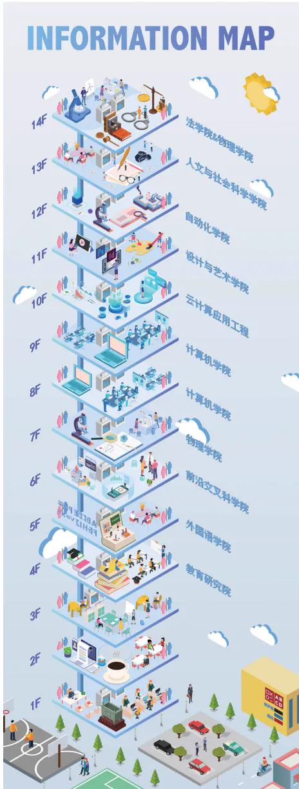  
图 5 － 8 采用 2?? 5D 表现形式展示学校教学楼的立体特点 （设计者： 黄梦瑶 薄扬）

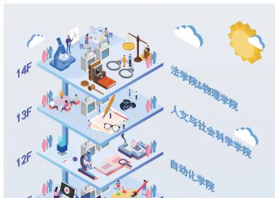  
图5 －9 采用2??5D 表现形式展示学校教学楼不同楼层的细节插图之一 （设计者： 黄裴瑶 薄扬）

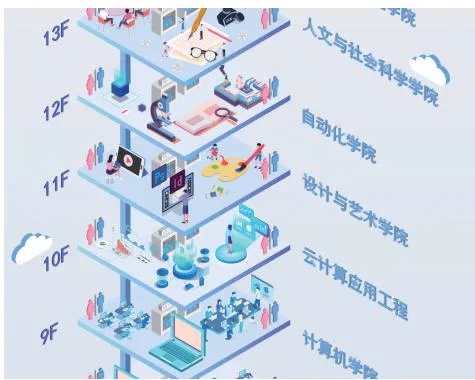  
图5 －10 采用2??5D 表现形式展示学校教学楼不同楼层的细节插图之二（设计者： 黄梦瑶 薄扬）

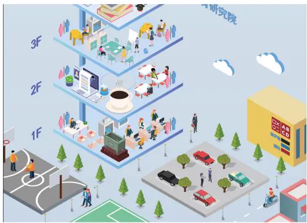  
图 5 － 11 采用 2?? 5D 表现形式展示学校教学楼不同楼层的细节插图之三（设计者： 黄梦瑶 薄扬）

图5 －12 为学生选取学校服务中心分层进行信息图表设计， 图5 －13 是学生实地调研后整理的思维导图 采用文字和照片相结合的方法梳理建筑物的信息和位置关系

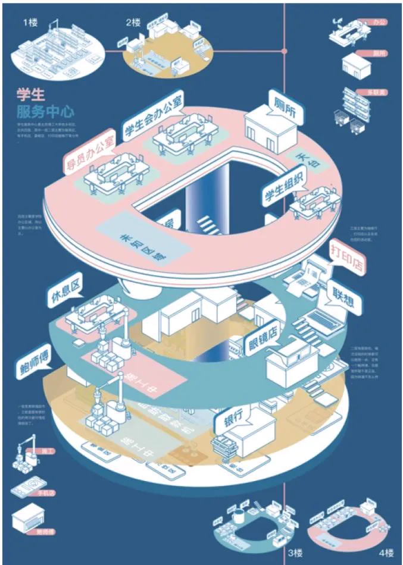  
图5 －12 学校服务中心分层信息图表 （设计者： 卢辉玥）

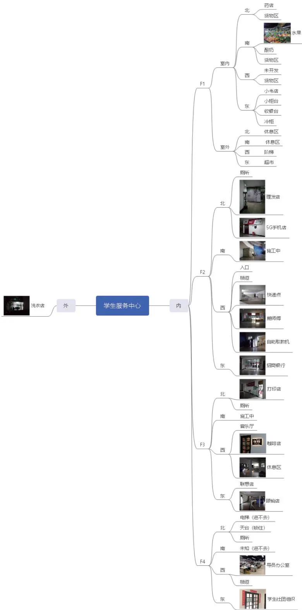  
图5 －13 实地调研整理的思维导图 （设计者： 卢辉玥）

图 是学生对校园整体区域的地图设计展示 表达方法采用 风格的视觉纵深感展示， 从草图到最终实现的过程也是强化视觉风格的过程。

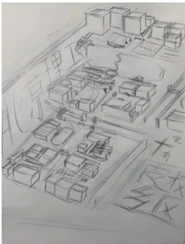

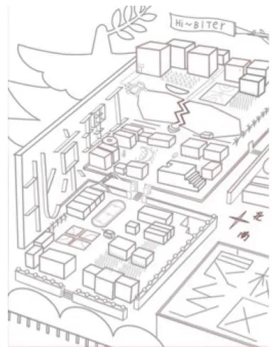

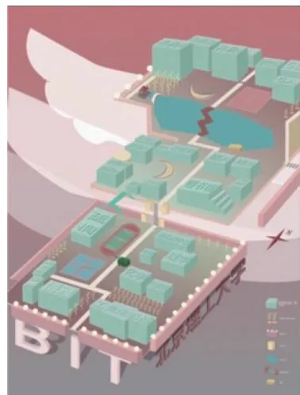

图5 －14 采用3D 风格设计的校园整体区域地图， 具有视觉纵深感 （设计者： 杨添翼）  
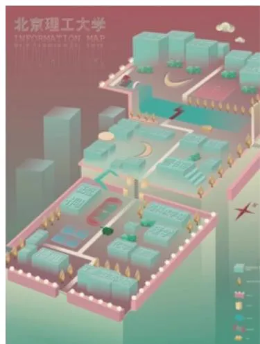  
（a） 草图之一； （b） 草图之二； （c） 草图之三； （d） 成品图

# （二） 区域地图信息艺术性表达练习

学生经过第一阶段的训练 训练了采集信息准确性的能力和思维分析条理性的能力 第二阶段练习目的是视觉图像表达方式的多样性 在保证表达信息的准确性同时鼓励学生尝试用艺术家的风格进行视觉表达 打破学生惯用的平面绘图方式 采用绘画艺术风格 丰富视觉的表达方式 同时训练视觉符号的提炼能力

# ［区域地图1］ 北京奥林匹克公园地区区域地图

# 设计者： 贾鑫铭 韩锦霖

图 绘制的是北京奥林匹克公园地区的区域地图 设计者选取了胡安 米罗的两幅作品 星座密码爱上了一个女人 和 一天的诞生 作为艺术表达的灵感来源 这两幅作品

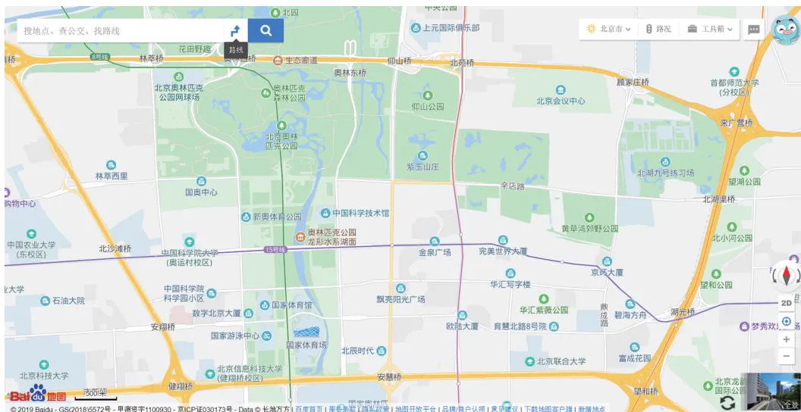

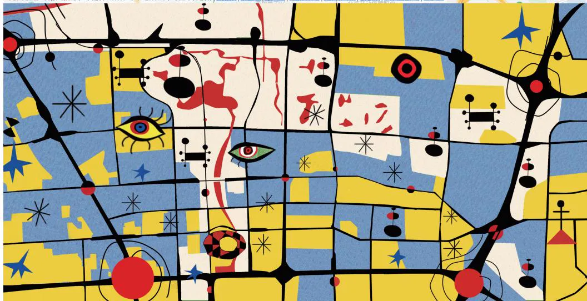

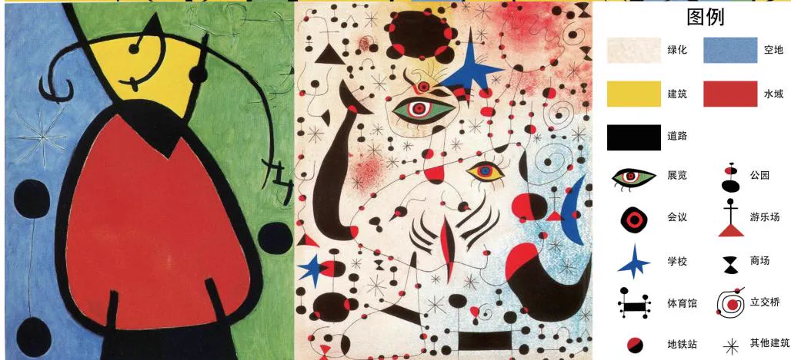  
图5 －15 北京奥林匹克公园地区区域地图， 作品汲取胡安·米罗两幅作品的艺术表达灵感

都是胡安 米罗超现实主义绘画的代表作 学生从中提取了画作的一些元素和颜色 融入区域地图的信息表达中。 在 《一天的诞生》 中选取了蓝色、 黄色、 红色、 黑色作为地图绘制主要的颜色， 分别作为空地、 建筑、 水域、 道路的颜色， 并运用黑色划分区域的方式来进行绘制。 从 《星座密码爱上了一个女人》 中提取了米色作为绿化区域的颜色， 同时绘制了一些比较有代表性的图标作为地标性建筑的标志， 如眼睛图标代表展览， 螺旋纹代表立交桥。

# ［区域地图2］ 北京西直门立交桥地区区域地图

# 设计者： 王瑞萍 王晓艺

图 绘制的是北京西直门立交桥地区的区域地图 设计艺术参考图选自日本浮世绘画家歌川国芳的作品 《龙宫玉取姬》。 歌川国芳生动地描绘出富有个性的典型人物肖像， 以玉取姬和章鱼为主体 以海浪为背景展现搏斗的情景 颜色以红蓝色调为主 对比强烈 学生设计的区域地图借助单线、 色彩渐变的表现形式， 将西直门立交桥复杂的情况用章鱼作为象征形象 隐喻其复杂性和四通八达的路况

图5 －16 北京西直门立交桥地区的区域地图及形象选取、 色彩选取  
  
（a） 区域地图作品完成图； （b） 作品选取了日本浮世绘画家歌川国芳作品的形象； （c） 作品以红蓝色调为主， 对比强烈

# ［区域地图3］ 蒙古国乌兰巴托市小圈路地区地图

# 设计者： 米希尔

蒙古国留学生米希尔为故乡蒙古国乌兰巴托市小圈路地区绘制了区域地图 蒙古乌兰巴托城市的中心从上空看起来像蒙古包的形态 小圈路地区是城市的文化艺术中心 是文艺演出的主要场所 学生尝试运用达达主义等拼贴的艺术风格进行作品的最后视觉呈现 区域地图中的图标采用艺术的拼贴形象代表， 整个作品体现出小圈路地区的艺术风格特征 （图5 －17 ～图 5 － 21）。

  
图 5 － 17 乌兰巴托市小圈路地区地图

  
图5 －18 乌兰巴托市小圈路地区建筑分布色彩尝试

  
图5 －19 乌兰巴托市小圈路地区区域地图图标设计

  
图5 －20 乌兰巴托市小圈路地区区域地图拼贴风格

  
图5 －21 乌兰巴托市小圈路地区区域地图最终成品

# （三） 事件地图信息练习

在此项目练习中 要求学生选取一项以地区为关键因素的事件展开调研 梳理地图上发生的关键事件和时间线之间的关系 整理思维导图脉络后进行真实性和准确性的视觉信息可视化设计

# ［事件地图1］ 诺曼底登陆战役

# 设计者： 柯一诺

作品为梳理第二次世界大战中著名的诺曼底登陆战役 完成信息可视化图表设计 在地图中以战斗双方军力布置的位置进行重点展示。 学生调研有关诺曼底登陆事件前后所有信息 整理出详细的思维导图 从中选择自己表达的重点信息 图 是以战役时间线梳理的思维导图 图 是以海滩地理位置为重点梳理的思维导图 图 为完成作品图。

  
图5 －22 诺曼底登陆战役， 以时间线梳理的思维导图

  
图5 －23 诺曼底登陆战役， 双方以海滩地理位置为重点梳理的思维导图

  
图5 －24 诺曼底登陆战役作品完成图

［事件地图2］ 影片 《闪灵》

设计者： 许一帆

学生对美国恐怖影片 《闪灵》 进行的地图可视化设计。 该片的故事在一个固定的地点

酒店展开 所有的剧情和经典场面都在酒店的特定房间和场所发生 因此学生选择以酒店的地图形式进行视觉表达。 图5 －25 是学生整理的影片 《闪灵》 的剧情思维导图。 图5 －26 是作品完成图 学生用类似建筑施工图的表现手法 用色彩填充区域 在关键场景用标志性的地毯底纹图示呼应剧情， 用影片中经典场景图像置入关键地理位置， 如双胞胎女孩场景。

  
图 5 － 25 影片 《闪灵》 剧情思维导图

  
图5 －26 影片 《闪灵》 作品完成图

# ［事件地图3］ 影片 《前目的地》

# 设计者： 苏珊

学生选择了悬疑影片 前目的地 进行信息化视觉设计 该影片剧情如同 莫比乌斯环”， 周而复始地延续着主人公的命运， 情节紧张， 充满悬念。 学生没有选择剧情作为主要表达方式 而是选择事件发生所在地与建筑物为表达的突破口 尝试用另一种方式进行梳理。 图5 －27 是影片 《前目的地》 剧情、 时间、 人物等的思维导图梳理。 图5 －28 为完成作品， 作者用2??5D 的视觉表达方式展现如迷宫般的剧情， 用数字符号表达人物和剧情出现的位置和时间顺序。

  
图5 －27 影片 《前目的地》 剧情、 时间、 人物等的思维导图

# 三、 整合信息设计

前面两个阶段的练习主要训练学生具有以下信息可视化设计的能力：

（1） 调研能力， 分析能力。  
思维导图整理能力  
（3） 准确图示表达能力。  
（4） 尝试艺术风格进行信息处理与多样表达的能力。

  
图5 －28 影片 《前目的地》 完成作品

本节的整合信息设计项目由三部分组成： 单一项目或事物信息图； 推理逻辑信息图； 整合复杂信息设计图 综合训练学生具备以下能力

（1） 图表的合理选择和科学运用。  
（2） 数据信息的视觉表达。  
（3） 复杂图表、 图片与文字的整体版面设计。

整合信息设计的课题项目也是由易到难循序渐进的， 数据和信息量的比重越来越大， 需要学生具有理性的数据整理表达能力

# （一） 单一项目或事物信息图

该项目要求学生选择一个主题事物， 通过调研完善信息及思维导图， 建立主题关键词与图像、 颜色等的记忆链接， 进行信息可视化的视觉图像图表的综合表达。

# ［主题项目／事物1］ 《血液循环系统》

# 设计者： 余家瑄

血液循环系统是血液在体内流动的通道 分为心血管系统和淋巴系统两部分 淋巴系统是静脉系统的辅助系统 一般所说的循环系统指的是心血管系统 血液循环系统由血液 血管和心脏组成 如果分为两大部分 即血管和心脏 心血管系统是由心脏 血管 毛细血管及血液组成的一个封闭的运输系统 同时许多激素及其他物质也通过血液的运输到达其靶器官 以此协调整个机体的功能 因此 维持血液循环系统处于良好的工作状态 是机体得以生存的条件 图 为学生整理的血液循环系统结构思维导图 图 为成品完成图学生用 软件绘制人体的血液循环系统的精美插图作为信息图主图 两侧布局相关联的器官和系统信息 图 是细节图 对于各个器官和关键结构信息都绘制了相对应的插图符号。

  
图5 －29 《血液循环系统》 思维导图

# THE BLOOD CIRCULATORY SYSTEM

# 血液循环系统信息图表

BASIC INFORAMATION

基本信息

循环系统星血液在体内流动的通道，分为心面管系统和淋巴系统两部分。淋巴系统是静脉系统的辅助装置。而一般所说的循环系统脂的是心血管系统。

  
lymphatic System 淋巴系统

  
lymphoid Tissue 淋巴组织  
和小，在中要作用。

  
Lymph Gland 淋巴管  
  
***   
  
  
淋巴导管

  
Lymphoid Organ 淋巴器官

  
  
大管的，不时的左，计而，其不

  
Pulmonary Circulation 肺循环

施年人1600-3700g

2800g

主动脉

全身小动脉

全身毛细血管

左心室

右心房

右心室

肺动脉

肺毛细血管

肺静脉

主动脉

全身毛细血管

  
血液循环的主要意义，在于保证机体新陈代谢的进行。  
另外，通过循环将内分泌腺所分泌的激素输送到全身各部分，以调节机体的生理机能。  
图5 －30 《血液循环系统》 作品完成图  
Cardiovascular System心血管系统  
心血管系统是由心脏，血管，毛细血管及血液组成的封闭运输系统。

  
Aorta主动肤

100-13 100m 外

Atria心厨 Atria心房

4 4左心房接受来自左，右防静协

3日 3日 1 1出心能本身静脉自的目流口 心能本穿静绿血的日流口

Atrium心室

LettAtrum东心室

22日

口，周附有口， 口，

22起

， ），置、后量。

  
A 右心房 上腔静脉 左心房 下腔静脉 左心室 0 12各级 Atrium心室 Left Atrium左心室 22 22   
12身体下部毛 身体下留

  
  
Venacava

下腔静防

  
图5 －31 《血液循环系统》 细节设计图

# ［主题项目／事物2］ 《垃圾分类》

# 设计者： 卢辉玥

垃圾分类一般是指按一定规定或标准将垃圾分类储存、 投放和搬运， 从而转变成公共资源的一系列活动的总称 垃圾分类的目的是提高垃圾的资源价值和经济价值 减少垃圾处理量和处理设备的使用 降低处理成本 减少土地资源的消耗 具有社会 经济 生态等多方面的效益 该学生用两种艺术手法进行垃圾分类的信息化设计表达 图 为相对传统的插图化表达 对于物品绘制采用扁平化的风格 图 采用 的方式绘制物品 风格更现代 画面更加有趣

# ［主题项目 ／ 事物 3］ 《扑克》

# 设计者： 杨添翼

扑克指纸牌 扑克游戏指以用纸牌来玩的游戏 一副扑克牌共有 张牌 其中 张是正牌 另两张是副牌 大王和小王 图 为西方的扑克牌的信息可视化图表设计 分别展示了牌的组成、 牌面画面信息、 基本玩法、 区域分布等信息， 图形和色彩的设计符合代表性牌类游戏的视觉符号化特征

# ［主题项目 ／ 事物 4］ 《朱耷》

# 设计者： 赵世超

朱耷是明末清初画家 中国画一代宗师 其花鸟以水墨写意为主 形象夸张奇特 笔墨凝练沉毅， 风格雄奇隽永。 朱耷 60 岁时开始用 “八大山人” 署名题诗作画， 他在署款时，常把 八大山人 四字连缀起来 仿佛 哭之 笑之 以寄托他哭笑皆非的痛苦心情该学生梳理了朱耷一生的经历与绘画 书法 落款风格等信息进行视觉表达 图 为成品图 在图 所示的信息设计细节图中 学生还对朱耷的人生时间线上的创作变化进行了更深入的研究， 用色变化、 绘画细节转变等都一一展现出来了。

# ［主题项目／事物5］ 《伞》

# 设计者： 赵兆

伞是一种能够提供阴凉环境或遮蔽雨 雪 阳光等的生活用品 伞与人们的生活息息相关 中国是世界上最早发明雨伞的国家 伞是中国劳动人民一个重要的创造 受中国文化影响 亚洲许多国家很早就有使用伞的传统 而欧洲至 世纪才开始风靡中国伞 该学生对伞的发明等信息进行调研 在信息设计图表中表现伞的分类 构造折数和在世界各地的传播 图 的信息量虽然不是很复杂庞大 但学生用中国黑白木刻古朴的艺术形式加以表现， 增加了信息图表的艺术表达特质。

  
图5 －32 扁平化风格的 《垃圾分类》

  
图5 －33 采用2??5D 方式绘制的 《垃圾分类》

  
图5 －34 《扑克》 信息可视化图表设计

  
图5 －35 《朱耷》 作品完成图

  
早期

  
中期

  
晚期

禽类

鱼类

猫

鹿

山类

.

梅花

菊花

●芍药

忘忧草

  
  
图5 －36 《朱耷》 细节设计图

画面动物眼珠朝向

八大山人画作朴茂雄伟，造型夸张，所画动物的眼睛一圈一点，眼珠顶着眼圈一幅“白眼向天”的神情，此图表现的是八大山人画作当中，动物眼珠朝向的大致比例，其中“翻白眼”和“瞪眼”的动物形象居多。

用色变化 印章使用比例 画面动物眼珠朝向

  
图5 －37 《伞》 作品完成图

［主题项目 ／ 事物 6］ 《漫威宇宙》

设计者： 陈婉馨

漫威电影宇宙是由漫威影业基于漫威漫画角色制作的一系列电影组成的架空世界和共同世界 电视剧系列进一步扩充了漫威电影宇宙 随着多部英雄电影和电视剧的上映 漫威宇宙已经成为一个著名的 产业 英雄人物众多 该学生设计作品的视觉展示主要是围绕《漫威宇宙》 中英雄人物的信息展开， 在图5 －38 中梳理了各个英雄之间的关系和他们组成的 复仇者联盟 的信息 学生还绘制了 漫威宇宙 中 复仇者联盟 关系最多的人物版形象 图 增加了信息图的趣味性

［主题项目／ 事物 7］ 《中国林业》

设计者： 郑志远 李韦卓

林业是生态文明建设的主体 林业系统的建立和管理对林业的发展具有重要的作用 从我国森林的地域分布看 我国森林资源多集中在东北部和西南部 其他的地区森林资源较少

学生该设计的前期调研 主要通过研读政府报告理解相关政策 统计我国林业的发展状况， 总结林业三大效益———生态效益、 社会效益和经济效益。 三大效益是统一的， 是相互联系和相互渗透的 调研后学生用扁平化的插图风格绘制林业三大效益的信息图 将自然 人类和城市建设三大主题图融合到森林中， 体现了人、 社会与林业和谐共处的主题 （图5 －40）。

  
图5 －38 《漫威宇宙》 作品完成图

  
图5 －39 《漫威宇宙》 细节设计图

图5 －40 《中国林业》 作品完成图  
  
（a） 林业的生态效益； （b） 林业的经济效益； （c） 林业的社会效益

# ［主题项目 ／ 事物 8］ 《2000—2019 年重大空难史》

# 设计者： 杨子墨

空难指飞行器在飞行中发生故障 遭遇自然灾害或其他意外事故所造成的灾难 是由于不可抗拒的原因或人为因素造成的事故 并由此带来灾难性的人员伤亡和财产损失 该学生确定选题后 进行调研和数据的收集整理统计 图 并按照事故年份 事故地点航空公司 事故机型 事故原因进行梳理 分析整理后的信息进行数据图表的视觉化图 选择合适的图表类型进行数据的表达 根据整体版面设计进行色彩统筹 从配色到图表进行细节设计 （ 图 5 － 43） 。

  
图 5 － 41 《2000—2019 年重大空难史》 调研和数据统计图

  
图5 －42 《2000—2019 年重大空难史》 数据图表的视觉化设计

  
图5 －43 《2000—2019 年重大空难史》 从配色到图表的细节设计

图5 －44 为整体版式设计过程， 根据视觉流程和信息主次进行了整体布局的调整， 用软件绘制主题图形和细节图形 并进行数据符号 图标 标题字体和文案字体细节设计

图 为作品完成图 以突出飞机结构组件插图为主 图表文字说明为辅的版式构成 用英文字母排序指引视觉阅读顺序

图 5 － 44 《2000—2019 年重大空难史》 整体版式设计过程  
  
（a） 版式一； （b） 版式二

  
图 5 － 45 《2000—2019 年重大空难史》 作品完成图

# （二） 推理逻辑信息———从电影或大事件中挖掘线索

该项目的训练要求在信息中加入时间 因果逻辑关系 选择并调研时间 因果逻辑关系等完整信息 理清因果逻辑关系 强调数据信息的数量和复杂性 要求学生在理性梳理的基

<!-- Chunk 3 End -->

<!-- Chunk 4 Start -->

础上， 分析关键时间点或事件点， 分析信息， 在 When （时间） 与 how （发生了什么） 之间表达关系。

# ［推理逻辑项目1］ 电影 《恐怖游轮》 信息图

# 设计者： 陈婉馨

恐怖游轮 是 年上映的一部悬疑影片 由英国和澳大利亚合拍 该片讲述单身母亲杰西和一群朋友乘坐游艇出海游玩遇到风暴 登上一艘路过的游轮后 却发现这艘 年失踪的神秘游轮里空无一人， 随之而来的连环凶杀让杰西等人陷入恐怖之中。 该片逻辑关系复杂， 信息量大且相互关联。 该学生设计了两张信息可视化图展现电影复杂的逻辑关系、 人物关系等信息。 图5 －46 是用三角金字塔形配合影片的剧名， 从立体层叠关系表现一层一层的循环关系 图 是表现该影片关键隐喻作用的图形信息 海鸥 项链 雨衣 斧子等

  
图5 －46 影片 《恐怖游轮》 信息图作品完成图之一

  
图5 －47 影片 《恐怖游轮》 信息图作品完成图之二

# ［推理逻辑项目 2］ 电影 《盗梦空间》 信息图

# 设计者： 吴高歌

影片 盗梦空间 是由克里斯托弗 诺兰执导 莱昂纳多 迪卡普里奥 玛丽昂 歌迪亚等主演的电影 影片剧情游走于梦境与现实之间 被定义为 发生在意识结构内的当代动作科幻片 影片讲述主人公进入他人梦境 从他人的潜意识中盗取机密 并重塑他人梦境的故事。 设计者选取影片中主人公梦境和现实的关键物件 “陀螺” 作为视觉主图形化展现电影情节 在图形分层中表达剧情的几个梦境层次 图 主色调配合梦境的主题设计 呈半透明的紫色 更为确切的剧情关系图放置在图 下方 设计者为剧中人物设计了图标， 和图层情节一一对应 （图5 －49）。

  
图5 －48 影片 《盗梦空间》 信息图作品完成图

  
图5 －49 影片 《盗梦空间》 信息图的细节设计， 左侧为剧中人物图标

# ［推理逻辑项目3］ 切尔诺贝利核事故信息图

# 设计者： 高梓明

切尔诺贝利核事故是一起发生在苏联统治下乌克兰境内切尔诺贝利核电站的核子反应堆事故。 该事故被认为是世界历史上最严重的核电事故。 1986 年 4 月 26 日凌晨 1 点 23分， 乌克兰普里皮亚季邻近的切尔诺贝利核电厂的第四号反应堆发生了爆炸。 连续的爆炸引发了大火并散发出大量高能辐射物质到大气层中 这些辐射尘覆盖了大面积区域这次灾难所释放出的辐射线剂量是二战时期爆炸于广岛原子弹的400 倍以上。 设计者按照时间线的方式表达这一天核事件发生的经过。 按照左右两条时间线展示， 左侧展示内部爆炸线， 右侧展示外部的救援线。 位于主图上方是发生爆炸的第四号反应堆 （图5 －50）。

  
图5 －50 切尔诺贝利核事故信息图作品完成图

# ［推理逻辑项目4］ 电影 《罗拉快跑》 信息图

# 设计者： 穆思佳

罗拉快跑 是由汤姆 提克威导演 编剧 由弗兰卡 波坦特 莫里兹 布雷多等主演的犯罪爱情影片。 影片讲述了为了拯救男友而奔跑的罗拉要在 20 分钟内得到 10 万马克。影片于1998 年在德国上映。 该片导演并不屈从于好莱坞的经典叙述模式， 而是采用了三段式的格局 假定性 命运 的不可预知的结局让人不断关注自身 影片 蝴蝶效应 的寓意隐晦的表达、 混同电子音乐和罗拉狂奔的脚步， 让人有一种释怀和爽快。 设计者采用像素游戏的视觉风格来诠释剧情， 信息展示除了用三段式的道路表达剧情， 还设定人物数值属性， 并且分析了剧情的节奏信息 （图5 －51）。 整体画面具有游戏化倾向。

  
图5 －51 影片 《罗拉快跑》 信息图作品完成图

# ［推理逻辑项目 5］ 动画片 《名侦探柯南》 “东京电视台杀人事件” 信息图

# 设计者： 周文硕

日本电视动画片 名侦探柯南 改编自青山刚昌创作的同名漫画作品 主要讲述了因受神秘组织袭击而身体缩小的工藤新一化名江户川柯南 默默展开对各种犯罪案件推理的故事 设计者选取了 名侦探柯南 中 东京电视台杀人事件 这一复杂案例进行事件梳理和信息可视化表达 设计者绘制了精美的线形立体建筑内部插图 在展现建筑结构的同时用不同颜色的虚线脚印表现受害人和嫌疑犯在建筑物中的行动轨迹 （图 5 －52）。 红黑色的配色使画面视觉重点醒目突出。

  
图 5 － 52 《名侦探柯南》 “东京电视台杀人事件” 信息图作品完成图

# （三） 整合信息设计

整合信息设计项目要求学生从文化 经济 环境保护领域选取有意义的选题 其中数据信息侧重中国各行业的发展数据。 在这一项目练习中， 学生不仅要能整合梳理数据信息， 而且要增加多种数据信息的对比关系， 在数据信息对比中增加网络数据， 设计调查问卷， 利用信息可视化数据加工成为信息图 要求选题有意义 更多地关注人类自身的发展 从选题构思到最后成品体现专业性 设计形式要进一步提升对视觉平面的把握

# ［整合信息设计项目 1］ 《春节联欢晚会相声节目 36 年发展史》

# 设计者： 马宇昂 何佳虹

相声是一种民间说唱曲艺 它以说 学 逗 唱为形式 以逗笑愉悦听众为目的 相声艺术源于华北， 流行于京津冀， 普及于全国及海内外。 中国相声有三大发源地： 北京天桥、天津劝业场和南京夫子庙。 相声分为北派与南派。 相声主要采用口头方式表演， 主要道具有折扇 手绢 醒木 表演形式有单口相声 对口相声 群口相声 相声是扎根于民间 源于生活、 深受群众欢迎的曲艺表演艺术形式。 央视春节联欢晚会上每年都有相声表演节目。 该组学生通过调研 36 年春节联欢晚会信息， 从侧面表达了相声作为传统艺术形式的变迁和兴衰。 调研及信息整理分析如图5 －53、 图5 －54 所示， 作品完成图如图 5 －55 所示。 图 5 －56 为信息可视化延展设计， 是学生将静态信息可视化图制作成立体装置作品， 是信息可视化作品的多元化尝试。

  
历年春晚相声97个.xlsx

  
相声.docx

  
相声1类型.xlsx

  
相声2形式.xlsx

  
相声3服装.xlsx

  
相声4师承2.xlsx

  
相声5主要表演方式.xlsx

  
图5 －54 《春节联欢晚会相声节目36 年发展史》 调研及信息整理分析之二

相声6时长.xlsx

图5 －53 《春节联欢晚会相声节目36 年发展史》 调研及信息整理分析之一（设计者： 马宇昂 何佳虹）

<table><tr><td>年份</td><td>作品</td><td>类型</td><td>形式</td><td>服装</td><td>演员</td><td>师承</td><td>主流</td><td>主要表演方式时长</td><td>1934</td></tr><tr><td>1983</td><td>猜谜语</td><td>传统</td><td>对口</td><td>混搭</td><td>姜昆,马季</td><td>马季</td><td>一头沉</td><td>4:51</td><td>1983</td></tr><tr><td>1983</td><td>山村景象</td><td>歌颂</td><td>对口</td><td>西装</td><td>马季,赵炎</td><td>侯宝林,马季</td><td>一头沉</td><td>16:05</td><td>1983</td></tr><tr><td>1983</td><td>对口词</td><td>歌颂</td><td>对口</td><td>中山装</td><td>姜昆,李文华</td><td>马季,马三立</td><td>一头沉</td><td>27分9秒</td><td>1983</td></tr><tr><td>1983</td><td>礼节</td><td>娱乐</td><td>对口</td><td>西装</td><td>侯耀文,石富宽</td><td>赵佩茹,高凤山</td><td>一头沉</td><td>30分18秒</td><td>1983</td></tr><tr><td>1983</td><td>错走了这一步</td><td>讽刺</td><td>对口</td><td>工装</td><td>姜昆、李文华</td><td>马季,马三立</td><td>一头沉</td><td>16:32</td><td>1983</td></tr><tr><td>1984</td><td>宇宙牌香烟</td><td>讽刺</td><td>单口</td><td>工装</td><td>马季</td><td>侯宝林</td><td>不明</td><td>7:52</td><td>1984</td></tr><tr><td>1984</td><td>春联</td><td>娱乐</td><td>对口</td><td>西装</td><td>马季,赵炎</td><td>侯宝林,马季</td><td>子母眼</td><td>8:31</td><td>1984</td></tr><tr><td>1984</td><td>夸家乡</td><td>歌颂</td><td>对口</td><td>中山装</td><td>姜昆,李文华</td><td>马季,马三立</td><td>一头沉</td><td>12:33</td><td>1984</td></tr><tr><td>1985</td><td>大乐,特乐</td><td>传统</td><td>单口</td><td>大褂</td><td>马三立</td><td>周德山</td><td>不明</td><td>11:48</td><td>1985</td></tr><tr><td>1985</td><td>看电视</td><td>娱乐</td><td>对口</td><td>西装</td><td>姜昆,李金宝</td><td>马季</td><td>一头沉</td><td>6:48</td><td>1985</td></tr><tr><td>1986</td><td>照相</td><td>不明</td><td>对口</td><td>西装</td><td>姜昆,唐杰忠</td><td>马季,刘宝瑞</td><td>腿子活</td><td>10:27</td><td>1986</td></tr><tr><td>1986</td><td>虎年谈虎</td><td>娱乐</td><td>对口</td><td>西装</td><td>刘伟,冯巩</td><td>马季</td><td>子母眼</td><td>5:16</td><td>1986</td></tr><tr><td>1986</td><td>戏迷</td><td>传统</td><td>对口</td><td>大褂</td><td>侯耀文,石富宽</td><td>赵佩茹,高凤山</td><td>一头沉</td><td>8:27</td><td>1986</td></tr><tr><td>1986</td><td>怪声独唱</td><td>娱乐</td><td>对口</td><td>西装</td><td>笑林,李国胜</td><td>马季,罗荣寿</td><td>一头沉</td><td>7:56</td><td>1986</td></tr><tr><td>1987</td><td>虎口题想</td><td>讽刺</td><td>对口</td><td>西装</td><td>姜昆,唐杰忠</td><td>马季,刘宝瑞</td><td>子母眼</td><td>16:11</td><td>1987</td></tr><tr><td>1987</td><td>五官争功</td><td>讽刺</td><td>群口</td><td>西装</td><td>马季、刘伟、冯巩、赵炎、王金宝</td><td>马季</td><td>不明</td><td>18:14</td><td>1987</td></tr><tr><td>1987</td><td>巧对影联</td><td>传统</td><td>对口</td><td>西装</td><td>刘伟,冯巩</td><td>马季</td><td>子母眼</td><td>9:31</td><td>1987</td></tr><tr><td>1987</td><td>学播音</td><td>娱乐</td><td>对口</td><td>西装</td><td>笑林,李国胜</td><td>马季,罗荣寿</td><td>一头沉</td><td>12:08</td><td>1987</td></tr><tr><td>1987</td><td>打岔</td><td>娱乐</td><td>对口</td><td>西装</td><td>侯耀文,石富宽</td><td>赵佩茹,高凤山</td><td>子母眼</td><td>6:30</td><td>1987</td></tr><tr><td>1988</td><td>求全责备</td><td>讽刺</td><td>群口</td><td>西装</td><td>刘伟,冯巩,李毅,戴志诚,牛振华,戴宝强,郑皓怡样,</td><td>马季</td><td>不明</td><td>9:25</td><td>1988</td></tr><tr><td>1988</td><td>攀比</td><td>讽刺</td><td>对口</td><td>西装</td><td>笑林,李国胜</td><td>马季,罗荣寿</td><td>子母眼</td><td>8:24</td><td>1988</td></tr><tr><td>1988</td><td>电梯奇遇</td><td>讽刺</td><td>对口</td><td>西装</td><td>姜昆,唐杰忠</td><td>马季,刘宝瑞</td><td>一头沉</td><td>16:37</td><td>1988</td></tr><tr><td>1988</td><td>巧立名目</td><td>讽刺</td><td>对口</td><td>西装</td><td>牛群,马立山</td><td>马季,高元物</td><td>腿子活</td><td>9:18</td><td>1988</td></tr><tr><td>1989</td><td>生日祝词</td><td>娱乐</td><td>对口</td><td>西装</td><td>牛群,冯巩</td><td>马季</td><td>子母眼</td><td>8:52</td><td>1989</td></tr><tr><td>1989</td><td>插风捉影</td><td>讽刺</td><td>对口</td><td>西装</td><td>姜昆,唐杰忠</td><td>马季,刘宝瑞</td><td>一头沉</td><td>10:10</td><td>1989</td></tr><tr><td>1989</td><td>送别</td><td>娱乐</td><td>对口</td><td>西装</td><td>刘伟,马季</td><td>马季,侯宝林</td><td>一头沉</td><td>9:24</td><td>1989</td></tr><tr><td>1990</td><td>无所适从</td><td>讽刺</td><td>对口</td><td>西装</td><td>牛群,冯巩</td><td>马季</td><td>子母眼</td><td>4:49</td><td>1990</td></tr><tr><td>1990</td><td>三顺茅庐</td><td>讽刺</td><td>对口</td><td>西装</td><td>刘伟,刘惠</td><td>马季,姜昆</td><td>腿子活</td><td>9:30</td><td>1990</td></tr><tr><td>1991</td><td>训徒</td><td>传统</td><td>群口</td><td>大褂</td><td>马季,赵炎,史可达</td><td>侯宝林,马季</td><td>不明</td><td>11:18</td><td>1991</td></tr><tr><td>1991</td><td>亚运之最</td><td>总结性</td><td>对口</td><td>西装</td><td>牛群,冯巩</td><td>马季</td><td>子母眼</td><td>7:52</td><td>1991</td></tr><tr><td>1991</td><td>着急</td><td>讽刺</td><td>对口</td><td>西装</td><td>姜昆,唐杰忠</td><td>马季,刘宝瑞</td><td>一头沉</td><td>13:11</td><td>1991</td></tr><tr><td>1991</td><td>学唱歌</td><td>传统</td><td>对口</td><td>西装</td><td>姜昆,唐杰忠</td><td>马季,刘宝瑞</td><td>一头沉</td><td>12:00</td><td>1991</td></tr><tr><td>1992</td><td>宠物热</td><td>娱乐</td><td>对口</td><td>西装</td><td>李金斗,陈涌泉</td><td>赵振铎,谭伯如</td><td>一头沉</td><td>7:09</td><td>1992</td></tr><tr><td>1992</td><td>改门脸</td><td>讽刺</td><td>对口</td><td>西装</td><td>唐爱国,齐立强</td><td>姜昆</td><td>一头沉</td><td>6:32</td><td>1992</td></tr><tr><td>1992</td><td>论捧</td><td>讽刺</td><td>群口</td><td>西装</td><td>闫月明,平李,李建华</td><td>高英培,李伯祥</td><td>不明</td><td>8:14</td><td>1992</td></tr><tr><td>1992</td><td>小站联欢会</td><td>歌颂</td><td>对口</td><td>海军装</td><td>侯耀文,石富宽</td><td>赵佩茹,高凤山</td><td>腿子活</td><td>8:50</td><td>1992</td></tr><tr><td>1992</td><td>办晚会</td><td>讽刺</td><td>对口</td><td>西装</td><td>牛群,冯巩</td><td>马季</td><td>腿子活</td><td>8:49</td><td>1992</td></tr><tr><td>1992</td><td>美丽畅想曲</td><td>讽刺</td><td>对口</td><td>西装</td><td>姜昆,唐杰忠</td><td>马季,刘宝瑞</td><td>一头沉</td><td>8:41</td><td>1992</td></tr><tr><td>1992</td><td>拍卖</td><td>娱乐</td><td>对口</td><td>西装</td><td>牛群,冯巩</td><td>马季</td><td>腿子活</td><td>10:39</td><td>1993</td></tr><tr><td>1993</td><td>楼道曲</td><td>讽刺</td><td>对口</td><td>西装</td><td>姜昆,唐杰忠</td><td>马季,刘宝瑞</td><td>一头沉</td><td>10:54</td><td>1993</td></tr><tr><td>1993</td><td>侯大明白</td><td>讽刺</td><td>对口</td><td>西装</td><td>侯耀文,石富宽</td><td>赵佩茹,高凤山</td><td>一头沉</td><td>9:10</td><td>1993</td></tr><tr><td>1994</td><td>点子公司</td><td>讽刺</td><td>对口</td><td>西装</td><td>牛群,冯巩</td><td>马季</td><td>子母眼</td><td>11:16</td><td>1994</td></tr><tr><td>1994</td><td>跑题</td><td>讽刺</td><td>群口</td><td>戏装</td><td>李金斗,石富宽,闫月明,单联丽</td><td>赵佩茹,高凤山</td><td>不明</td><td>11:07</td><td>1994</td></tr><tr><td>1995</td><td>最差先生</td><td>讽刺</td><td>对口</td><td>西装</td><td>牛群,冯巩</td><td>马季</td><td>子母眼</td><td>11:11</td><td>1995</td></tr></table>

  
图5 －55 《春节联欢晚会相声节目36 年发展史》 作品完成图

  
图5 －56 《春节联欢晚会相声节目36 年发展史》 信息可视化延展设计

［整合信息设计项目2］ 《中国脱贫攻坚之路》

设计者： 卢辉玥

年是打赢脱贫攻坚战 全面建成小康社会的最后一年 也是检验脱贫成果关键的一年 全面建成小康社会是中国共产党对中国人民的庄严承诺 是我们党制定的 两个一百年 奋斗目标的第一个目标 年 月 中国共产党立下愚公移山之志 咬定目标苦干实干 坚决打赢脱贫攻坚战 确保到 年所有贫困地区和贫困人口一道迈入小康社会 该学生的设计选取这一重大主题 完成脱贫攻坚任务对中国和世界都具有重大的意义不仅意味着我们解决了全面建成小康社会的底线任务和标志性指标， 历史性地解决了困扰中

华民族几千年的绝对贫困的问题 也兑现了党向人民向历史作出的庄严承诺 彰显了党领导下的我国社会主义制度的政治优势。 打赢脱贫攻坚战不仅对我国意义深远， 成果也惠及世界，提前 年实现了 联合国 年可持续发展议程 的减贫目标 创造了人类反贫困史的中国奇迹， 为全球治理贫困贡献了中国智慧和中国方案。 图5 －57 为调研资料， 图5 －58 为信息整理分析 成品完成图如图 图 所示 图 为扶贫县信息数据细节图

  
2019年度国务...室部门决算.pdf

  
2017年度国务...室部门决算.pdf

  
2016年度国务...室部门决算.pdf

  
2018年度国务...室部门决算.pdf

  
2020年度国务...室部门决算.pdf

  
国务院扶贫开...室部门决算.pdf

  
图5 －58 《中国脱贫攻坚之路》 信息整理分析

其他来源.docx

图5 －57 《中国脱贫攻坚之路》 调研资料

2015—2020年间中国832个贫困县脱贫攻坚战信息一览表  

<table><tr><td colspan="3">一、2016年摘帽贫困县名单</td><td colspan="2">贫困县介绍、政策、资金投入、实际情况等数据信息</td></tr><tr><td>省份</td><td>数量</td><td rowspan="2">名单</td><td></td><td></td></tr><tr><td>合计</td><td>28</td><td></td><td></td></tr><tr><td>河北</td><td>3</td><td>海兴县、南皮县</td><td>海兴县位于河北省东南,现辖4镇3乡两个农场,197个行政村,总人口22万人,农业人口18.2万人。1994年被列为国家级贫困县,2002年被重新确定为国家扶贫开发工作重点县。2017年,全县78个贫困村脱贫出列,10134名贫困群众稳定脱贫,贫困发生率由2016年初的6.8%下降到0.89%。2018年全县剩余6个贫困村脱贫出列,至此全县84个贫困村全部跳出贫困行列</td><td>南皮县位于沧州市中南部,辖6镇3乡、312个行政村,总人口36万人。2017年11月1日,南皮县正式退出贫困县。2018年全县共有建档立卡贫困户2365户5676人,剩余未脱贫贫困户649户1695人,贫困发生率下降到0.51%</td></tr><tr><td>江西</td><td>2</td><td>井冈山市、吉安县</td><td>井冈山市隶属于江西省吉安市,位于江西省西南部,地处湘赣两省交界的罗霄山脉中段,古有“衡衡湘赣之交,千里罗霄之腹”之称。2015年,井冈山市整合各类资金2.8亿元,举全市之力深入开展“党员干部进村户、精准扶贫大会战”活动,精准识别出贫困户4456户15008人,全市贫困人口减少7016人,下降幅度达46.75%,贫困户人均增收1500元以上,贫困发生率由13.5%降至7.15%</td><td>吉安县古称庐陵,地处江西省中部,县域面积2117平方公里,现辖13镇6乡、306个村委会、22个社区居委会,总人口50万。2014年,吉安县建档立卡贫困人口1.7万户,5.5万人,贫困发生率为14.2%。到2015年脱贫人口0.5万户、1.7万人,未脱贫贫困人口1.2万户3.8万人,贫困发生率为9.7%。一年的时间,贫困发生率下降了4.5%。2017年86个贫困村全部摘帽。2018年1402人实现脱贫,贫困人口减少到1301户3255人,贫困发生率下降到0.8%</td></tr><tr><td>河南</td><td>2</td><td>兰考县、滑县</td><td>兰考县是焦裕禄精神的发祥地,地处豫东平原,辖16个乡镇、1个产业集聚区、1个商务中心区,451个行政村,总人口83万,总面积1116平方公里。是省直管县体制改革试点县、国家级扶贫开发工作重点县。2018年打好稳定脱贫奔小康新战役</td><td>湄县位于豫北平原,与濮阳、延津、浚县、长垣、封丘、内黄接壤。全县面积1814平方公里,耕地面积195.21万亩。湄县县辖12镇10乡和新区管委会,总人口134.5万人,常住人口114.1万人。城镇化率达到22.02%。2011年被确定为国家扶贫开发工作重点县。2018年脱贫攻坚再战再捷,全年脱贫1357户、3874人,贫困发生率降到0.83%</td></tr></table>

  
图5 －59 《中国脱贫攻坚之路》作品完成图之一

  
图5 －60 《中国脱贫攻坚之路》作品完成图之二

  
图5 －61 《中国脱贫攻坚之路》 细节设计图

# ［整合信息设计项目3］ 《塑料污染》

# 设计者： 林思辰

塑料污染也称 白色污染 是对废塑料污染环境现象的一种形象称谓 塑料污染是指用聚苯乙烯 聚丙烯 聚氯乙烯等高分子化合物制成的包装袋 农用地膜 一次性餐具、 塑料瓶等塑料制品使用弃置后成为固体废物， 由于随意乱丢乱扔， 难于降解处理，给生态环境和景观造成的污染。 伴随人们生活节奏的加快， 社会生活的便利化， 一次性泡沫塑料饭盒、 塑料袋、 水杯等频繁地进入人们的日常生活。 这些使用方便、 价格低廉的包装材料给人们的生活带来了诸多便利， 但这些包装材料在使用后往往被随手丢弃，造成 “白色污染”， 危害环境， 成为极大的环境问题。 塑料污染是当今全球环境保护设计的一个大主题。 该学生选择这个项目进行深入挖掘， 整理了世界塑料污染的数量， 分项目板块对这一问题进行梳理， 采用视觉数据对比的设计展示方式。 设计者将主要的白色污染物图形化， 通过对文字、 图表、 数字符号等进行版式设计， 形成视觉冲击力强、 数据对比强烈的系列化信息可视化作品。

图 为调研资料 图 为信息整理分析 图 图 为作品完成图图5 －69 为细节设计图。

  
各国处理不当的塑料废物占塑料废物总量的比例（2010）.xlsx

  
各国分大区的管理不善占全球的总量比例（2010）.xlsx

  
各国管理不善的量占全球总量的比例（2010）.xlsx

  
各国人均每天产生多少千克（2010）.xlsx

  
各国塑料废物总量万吨（2010）.xlsx  
图5 －62 《塑料污染》 调研资料

# 实体塑料废物产生量 (吨，总计） (吨/年)

阿尔巴尼亚73364

阿尔及利亚1898343

安哥拉528843

安提瓜和巴布达22804

阿根廷2753550

阿鲁巴9352

澳大利亚900658

巴哈马51364

巴林59785

孟加拉国1888170

巴巴多斯58164

比利时318151

伯利兹20191

贝宁144382

波斯尼亚和黑塞哥维那195633

英属维尔京群岛2504

文莱3688

保加利亚415707

柬埔寨344698

喀麦隆335305

加拿大1154309

佛得角11919

开曼群岛5106

海峡群岛14678

智利738106

中国59079741

哥伦比亚2413455

科摩罗50599

刚果110479

哥斯达黎加428029

科特迪瓦766988

克罗地亚406347

古巴368154

库拉索13678

塞浦路斯100713

刚果民主共和国1059795

丹麦95171

吉布提31999

多米尼克3885

多米尼加共和国520238

厄瓜多尔801321

埃及5464471

萨尔瓦多330763

赤道几内亚49990

立特里亚72120

爱沙尼亚85534

法罗群岛4466

济59324

法国4557128

法属波利尼西亚24634

冈比亚29646

乔治亚州9744

德国14476561

加纳357877

直布罗陀3053

希腊811858

格陵兰5234

格林纳达12417

关岛14666

危地马拉1495229

几内亚118196

几内亚比绍30666 新喀里多尼亚22995 新喀里多尼亚22995

圭亚那15968

海地328487

洪都拉斯565317

香港102040

冰岛32620

印度4493080

印度尼西亚5045714

伊朗3919268

伊拉克1156524

爱尔兰715716

以色列826436

意大利2899258

牙买加34962

日本799348

约旦377506

肯尼亚407506

基里巴斯3859

科威特750690

拉脱维亚94935

黎巴嫩148807

利比里亚1210

利比亚324250

立陶宛149227

澳门72126

马达加斯加123526

马来西亚2031675

马尔代夫43134

马耳代32337

也马绍尔群岛3674

毛里塔尼亚59287

毛里求斯104971

里求斯10497门墨西哥3725463

密克罗尼西亚（国家）3895

黑山32557

魔洛哥863555

莫桑比克132612

缅甸1373018

纳米比亚114222

荷兰2571398

新西55630

尼加拉瓜299480

尼日利亚5961750

朝鲜484700

北马里亚纳群岛5006

挪威499682

阿曼93251

巴基斯坦6412210

帕劳1076

巴勒斯坦87636

巴拿马192818

巴布亚新几内亚267234

秘鲁1543879

菲律宾2565766

波兰1346905

葡萄牙1022683

波多黎各34230

卡塔尔103933

  
图5 －63 《塑料污染》 信息整理分析  
图5 －64 《塑料污染》 作品完成图之一

  
图5 －66 《塑料污染》 作品完成图之三

  
图5 －65 《塑料污染》 作品完成图之二

  
图5 －67 《塑料污染》 作品完成图之四

  
图5 －68 《塑料污染》 作品完成图之五

  
图5 －69 《塑料污染》 细节设计图

# ［整合信息设计项目4］ 《忽视的噪声》

# 设计者： 陈婉馨

噪声是指发声体做无规则振动时发出的声音 声音由物体的振动产生 以波的形式在一定的介质 如固体 液体 气体 中进行传播 通常所说的噪声污染是指人为造成的 从生理学观点来看 凡是干扰人们休息 学习和工作以及对你所要听的声音产生干扰的声音即不需要的声音， 统称为噪声。 当噪声对人及周围环境造成不良影响时， 就形成噪声污染。产业革命以来 各种机械设备的创造和使用 给人类带来了繁荣和进步 但同时也产生了越来越多而且越来越强的噪声 噪声不但会对听力造成损伤 还能诱发多种致癌 致命的疾病 也对人们的生活 工作有所干扰

噪声污染按声源的机械特点可分为气体扰动产生的噪声 固体振动产生的噪声 液体撞击产生的噪声以及电磁作用产生的电磁噪声 噪声按声音的频率可分为低频 中频 高频噪声 $< 4 0 0 ~ \mathrm { H z }$ 为低频噪声 $4 0 0 \sim 1 0 0 0 ~ \mathrm { H z }$ 为中频噪声 $> 1 0 0 0 ~ \mathrm { H z }$ 为高频噪声 设计者的设计选取北京 个商业地区进行噪声测试 尝试梳理出噪声形成的种类 分析在人们生活中常常被忽视的噪声现象 设计者将实地测试采集噪声分贝数据逐一记录 获得一手信息 通过数据对比分析噪声与人的情绪的关系 通过平面数据可视化与交互数据的图表把噪声演变成信息可视化设计系列作品 图 为实地调研地图及信息整理分析 图 图为作品完成图 图 为细节设计图 设计者尝试在交互设计中生成噪声的立体模型 如图 5 － 74 所示。

(b)   
图5 －70 《忽视的噪声》 实地调研地图及信息整理分析  
  
实地调研地图 信息整理分析

  
图5 －71 《忽视的噪声》 作品完成图之一

  
图5 －72 《忽视的噪声》 作品完成图之二

  
图5 －73 《忽视的噪声》 细节设计

  
图5 －74 《忽视的噪声》 立体模型

［整合信息设计项目5］ 《2009—2018 年中国旅游业概况》

设计者： 刘畅

旅游业也称为旅游产业 是凭借旅游资源和设施 专门或者主要从事招徕 接待游客为其提供交通、 游览、 住宿、 餐饮、 购物、 文娱6 个环节的综合性行业。 旅游业务由三部分构成 旅游业 交通客运业和以饭店为代表的住宿业 这是旅游业的三大支柱 改革开放以

来 我国旅游业经历了起步 成长 拓展和综合发展 个阶段 最终推动国内旅游 出境旅游 入境旅游的全面繁荣 我国实现了从旅游短缺型国家到旅游大国的历史性跨越 成为全球最大的国内旅游市场 全球第一大国际旅游消费国 全球第四大旅游目的地国家 从旅游人数来看， 2013 年以来， 我国旅游人数维持两位数增长速度， 2017 年旅游人数首次突破50亿人次。 2018 年上半年， 旅游消费需求保持旺盛： 国内旅游人数达 28 亿人次， 比上年同期增长 $1 1 . 4 \%$ ； 全年旅游人数达55 亿人次， 同比增长 $1 0 . 8 \%$ 。 该学生根据设计选题研究分析了2009—2018 年中国旅游业的发展数据， 旅游业的发展从直观上体现中国经济的飞速发展，体现出人们生活水平的提高 不断追求精神和娱乐休闲的享受 该学生在设计制作上运用阿里云 软件系统的大屏幕信息可视化的一些组件 力求图表的直观与数据的清晰图 5 － 75 为作品完成图。

  
图 5 － 75 《2009—2018 年中国旅游业概况》 作品完成图

［整合信息设计项目 6］ 《阿尔茨海默症———以中国河南为例》

设计者： 吴高歌

阿尔茨海默症 是一种起病隐匿的进行性发展的神经系统退行性疾病 临床以记忆障碍 失语 失用 失认 视空间技能损害 执行功能障碍以及人格和行为改变等全面性痴呆表现为特征 病因迄今未明 岁以前发病者 称早老性痴呆 岁以后发病者称老年性痴呆 中国有老年痴呆患者 万人 占世界总病例数的 而且每年平均有 万新发病例 中国老年痴呆症患病率已随着年龄的升高呈显著增长趋势 岁以上达 $8 . 2 6 \%$ 80 岁以上高达 $1 1 . 4 \%$ 。 数据显示， 我国阿尔茨海默症患者人数已居世界第一。 但是， 很多人甚至是部分医师对于该疾病的认识仍存在大量误区 导致我国阿尔茨海默症就诊率和治疗率非常低。 该学生的信息可视化设计选取这一病症进行科普信息分析， 并以中国河南为例进行信息的对比分析 呼吁社会各界重视阿尔茨海默症 设计者通过梳理思维导图并分别调研文献获取了第一手信息资料 该学生还对身边的老人群体进行了问卷调查 信息数据和调研全面且有说服力 图 为调研及信息整理分析 图 为作品完成图 图 为细节设计图

·阿尔海默痘影片及评分（社会关注度）

1、花明>2006年加拿大8.0同期最高8.9

3、一次的2011年87期最8.

、人20年8

、2011个9

9、海中的橡皮>2004年韩国7.9期最高

《中国老年人走失状况白皮书

年龄：65岁

失老人所在区城：西部农村30%，中小城市37%，中小城市郊区9%，大城市郊区

7%，大城市11%

<table><tr><td>是失职人员范围</td><td></td></tr><tr><td>因雇前材</td><td>30%</td></tr><tr><td>中小学</td><td>37%</td></tr><tr><td>小学教师岗位</td><td>8%</td></tr><tr><td>大城市郊区</td><td>17%</td></tr><tr><td>大城市</td><td>11%</td></tr><tr><td>是失职人员缴费程度</td><td></td></tr><tr><td>不学历</td><td>59%</td></tr><tr><td>小学学历</td><td>24%</td></tr><tr><td>初中学历</td><td>10%</td></tr><tr><td>高中学历</td><td>5%</td></tr><tr><td>大专学历</td><td>1%</td></tr><tr><td>大学学历</td><td>1%</td></tr></table>

走失老人受教育程度：不职字59%，小学学历24%，初中学历10%，高中学历5%，大专

<table><tr><td>候选人主要经历</td><td></td></tr><tr><td>正常</td><td>28%</td></tr><tr><td>记忆能力衰退</td><td>33%</td></tr></table>

关注度调查

<table><tr><td></td><td>研究名称</td><td>阿兹海默研究类型</td><td>发表时间</td><td>下载量</td><td>数据库</td></tr><tr><td>1</td><td>基于阿尔茨海默症老人的诊室智能家居的设计研究a</td><td>相关研究、设计类</td><td>2019-08-25</td><td>244</td><td>期刊b</td></tr><tr><td>2</td><td>血红素加氧酶-1在中枢神经系统疾病中的作用a</td><td>蛋白类</td><td>2019-08-23</td><td>94</td><td>期刊b</td></tr><tr><td>3</td><td>基于五感疗法理论的阿兹海默症康复花园设计研究a</td><td>相关研究、设计类</td><td>2019-08-16</td><td>180</td><td>期刊b</td></tr><tr><td>4</td><td>音乐治疗在我国的现状分析与应用价值a</td><td>相关研究</td><td>2019-08-01</td><td>82</td><td>期刊b</td></tr><tr><td>5</td><td>发现眼蛋白检测可诊断老年痴呆症a</td><td>蛋白类</td><td>2019-05-15</td><td>75</td><td>期刊b</td></tr><tr><td>6</td><td>白藜芦醇多靶点治疗阿兹海默病的研究进展a</td><td>蛋白类</td><td>2019-05-07</td><td>219</td><td>期刊b</td></tr><tr><td>7</td><td>结合DCGAN与LSTM的阿兹海默症分类算法a</td><td>相关研究</td><td>2019-03-14</td><td>290</td><td>期刊b</td></tr></table>

<table><tr><td colspan="2">研究名称</td><td>前瞻性观察类型</td><td>发表时间</td><td>下载量</td><td>数据库</td></tr><tr><td>194</td><td>Alois Alzheimer(1864-1915).IL Dementia before and after Alzheimer: a brief history.</td><td>相关研究2</td><td>1994-09-13</td><td>a</td><td>PubMed 期刊-</td></tr><tr><td>195</td><td>Alois Alzheimer(1864-1915).IL Dementia before and after Alzheimer: a brief history.</td><td>相关研究2</td><td>1994-09-13</td><td>a</td><td>PubMed 期刊-</td></tr><tr><td>196</td><td>Alois Alzheimer, 1864-1915.</td><td>相关研究2</td><td>1994-09-13</td><td>a</td><td>PubMed 期刊-</td></tr><tr><td>197</td><td>Alois Alzheimer on presenile dementia.</td><td>相关研究2</td><td>1988-11-05</td><td>a</td><td>PubMed 期刊-</td></tr><tr><td>198</td><td>Alois Alzheimer on presenile dementia.</td><td>相关研究2</td><td>1988-10-01</td><td>a</td><td>PubMed 期刊-</td></tr><tr><td>199</td><td>Alois Alzheimer on presenile dementia.</td><td>相关研究2</td><td>1988-07-11</td><td>a</td><td>PubMed 期刊-</td></tr><tr><td>200</td><td>Alois Alzheimer.</td><td>相关研究2</td><td>1988-06-19</td><td>a</td><td>PubMed 期刊-</td></tr><tr><td>201</td><td>Alois Alzheimer.</td><td>相关研究2</td><td>1988-06-01</td><td>a</td><td>PubMed 期刊-</td></tr></table>

  
图5 －76 《阿尔茨海默症———以中国河南为例》 调研及信息整理分析  
图 5 － 77 《阿尔茨海默症———以中国河南为例》 作品完成图

  
图5 －78 《阿尔茨海默症———以中国河南为例》 细节设计图

［整合信息设计项目 7］ 《手机品牌消亡史》

设计者： 赵世超

1991 年以来， 各个手机品牌陆续进入中国市场。 随着社会经济的不断发展、 手机市场的不断竞争 以前一些熟知的手机品牌已渐渐退出了人们的视野 新的品牌在中国市场有着很好的发展并取得成功。 该学生的设计项目调查了从 1991—2020 年以来各个手机品牌在中国市场的发展和兴衰， 以及目前市场各个手机品牌所占的比例和手机机型的变迁。 图5 －79为作品完成图。

  
图5 －79 《手机品牌消亡史》 作品完成图

［整合信息设计项目8］ 《85 后、 90 后手机使用情况调查》

设计者： 周文硕

随着我国经济持续稳定的增长 我国移动通信市场快速增长 手机日益普及 设计者对

85 后、 90 后年轻人使用的手机品牌、 消费倾向及使用习惯、 爱好进行了调查， 收集 85 后、90 后用户使用手机数据， 分析不同年龄用户对手机的依赖程度和依赖因素。 图 5 －80 为作品完成图。

  
图5 －80 《85 后、 90 后手机使用情况调查》 作品完成图

